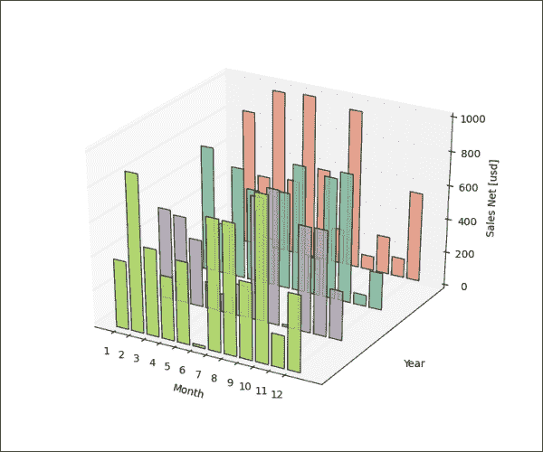
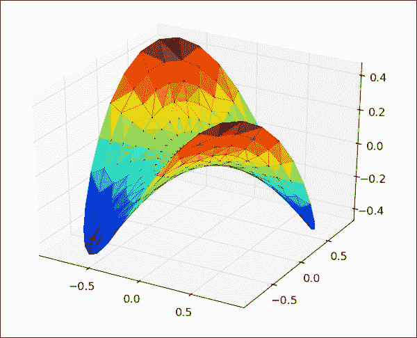
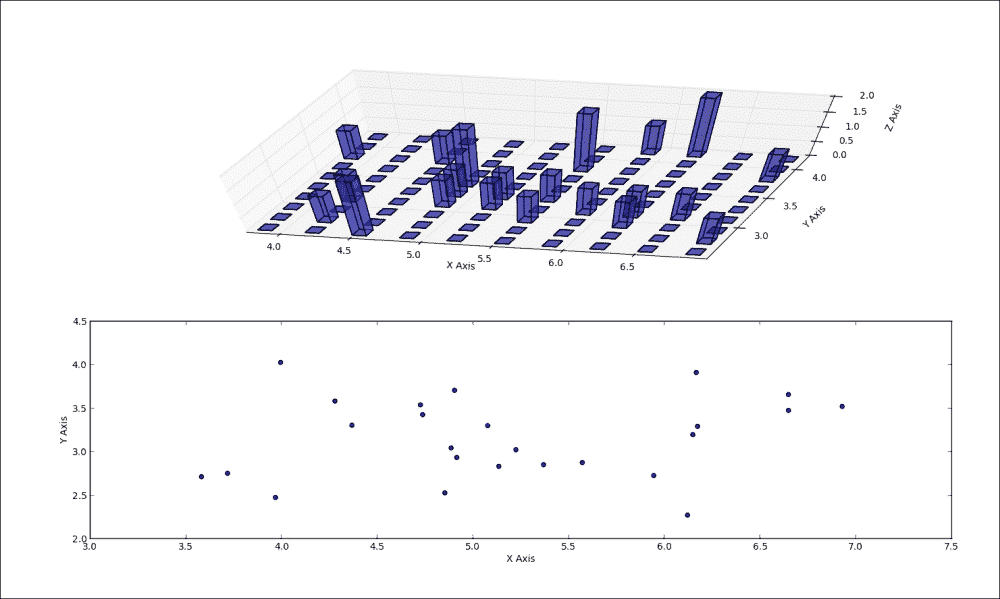
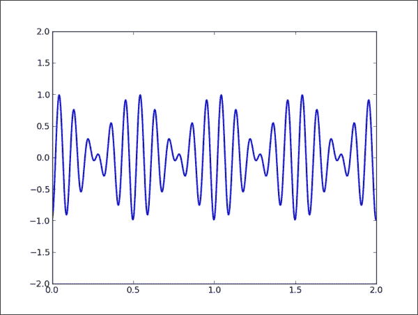
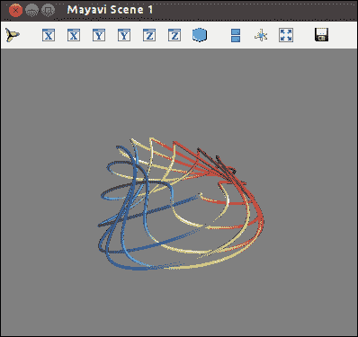

# 五、制作三维可视化效果

我们将在本章中学习以下食谱:

*   创建三维条
*   创建三维直方图
*   在 matplotlib 中制作动画
*   用 OpenGL 制作动画

# 简介

三维可视化有时是有效的，有时是不可避免的。在这里，我们给出了一些例子来满足最常见的需求。

本章的内容将介绍和解释一些关于三维可视化的主题。

# 创建三维条

虽然 matplotlib 主要专注于绘图，主要是二维的，但是有不同的扩展，让我们可以在地理地图上绘图，与 Excel 进行更多的集成，进行 3D 绘图。这些扩展在 matplotlib 世界中被称为工具包。工具包是一个特定功能的集合，它专注于一个主题，比如三维绘图。

流行的工具包有底图、 GTK 工具、Excel 工具、Natgrid 、AxesGrid 和 mplot3d。

我们将在这个食谱中探索更多的 mplot3d。工具箱`mpl_toolkits.mplot3d`提供了一些基本的 3D 绘图。支持的绘图有散点、曲面、直线和网格。虽然这不是最好的三维绘图库，但它附带了 matplotlib，我们已经熟悉了界面。

## 做好准备

基本上，我们仍然需要创建一个图形，并向其中添加所需的轴。不同的是，我们为图形指定了三维投影，添加的轴是**轴和**轴。

现在，我们可以使用几乎相同的功能进行绘图。当然，不同的是论点，因为我们现在有三个轴，我们需要来提供数据。

例如，函数`mpl_toolkits.mplot3d.Axes3D.plot`指定`xs`、`ys`、`zs`和`zdir`参数。其他全部直接转入`matplotlib.axes.Axes.plot`。我们将解释这些具体的论点:

*   `xs`和`ys`:这是 x 轴和 y 轴的坐标
*   `zs`:这是 z 轴的值。它可以是所有点的一个，也可以是每个点的一个
*   `zdir`:这将选择 z 轴尺寸(通常这是`zs`，但可以是`xs`或`ys`)

### 注

模块`mpl_toolkits.mplot3d.art3d`中有一个方法`rotate_axes`，包含 3D 美工代码和功能，可以将 2D 美工转换成 3D 版本，可以添加到 Axes3D 中对坐标进行重新排序，使轴随`zdir`一起旋转。默认值为 z，在轴前面加上“-”进行逆变换，因此`zdir`可以是 x、-x、y、-y、z 或-z。

## 怎么做...

这是演示所解释概念的代码:

```py
import random

import numpy as np
import matplotlib as mpl
import matplotlib.pyplot as plt
import matplotlib.dates as mdates

from mpl_toolkits.mplot3d import Axes3D

mpl.rcParams['font.size'] = 10
fig = plt.figure()
ax = fig.add_subplot(111, projection='3d')

for z in [2011, 2012, 2013, 2014]:
    xs = xrange(1,13)
    ys = 1000 * np.random.rand(12)

    color = plt.cm.Set2(random.choice(xrange(plt.cm.Set2.N)))
    ax.bar(xs, ys, zs=z, zdir='y', color=color, alpha=0.8)

ax.xaxis.set_major_locator(mpl.ticker.FixedLocator(xs))
ax.yaxis.set_major_locator(mpl.ticker.FixedLocator(ys))

ax.set_xlabel('Month')
ax.set_ylabel('Year')
ax.set_zlabel('Sales Net [usd]')

plt.show()
```

在代码之前的产生如下图:



## 它是如何工作的...

我们必须做和 2D 世界一样的准备工作。不同的是，我们需要指定后端的类型。然后我们生成一些随机数据，例如，4 年的销售(2011-2014 年)。

我们需要为三维轴指定相同的 Z 值。

我们从色图集中随机选择一种颜色，然后我们关联每一个 Z 顺序的`xs`、`ys`对集合，我们将渲染条形图系列。

## 还有更多...

其他来自 2D matplotlib 的绘图可在此获得；例如，界面与`plot()`相似的`scatter()` ，但是增加了点标记的大小。我们也熟悉`contour``contourf`和`bar`。

仅在 3D 中可用的新类型是线框、曲面和三曲面图。

下面的代码示例绘制了流行的普林格尔函数或更精确的双曲抛物面的三曲面图:

```py
from mpl_toolkits.mplot3d import Axes3D
from matplotlib import cm
import matplotlib.pyplot as plt
import numpy as np

n_angles = 36
n_radii = 8

# An array of radii
# Does not include radius r=0, this is to eliminate duplicate points
radii = np.linspace(0.125, 1.0, n_radii)

# An array of angles
angles = np.linspace(0, 2*np.pi, n_angles, endpoint=False)

# Repeat all angles for each radius
angles = np.repeat(angles[...,np.newaxis], n_radii, axis=1)

# Convert polar (radii, angles) coords to cartesian (x, y) coords
# (0, 0) is added here. There are no duplicate points in the (x, y) plane
x = np.append(0, (radii*np.cos(angles)).flatten())
y = np.append(0, (radii*np.sin(angles)).flatten())
# Pringle surface

z = np.sin(-x*y)

fig = plt.figure()
ax = fig.gca(projection='3d')

ax.plot_trisurf(x, y, z, cmap=cm.jet, linewidth=0.2)

plt.show()
```

在代码之前的将给出以下输出:



# 创建三维直方图

与 3D 条类似，我们可能希望创建 3D 直方图。它们用来很容易地发现三个独立变量之间的相关性。它们可用于从图像中提取信息，其中第三维可以是被分析图像的(x，y)空间中的通道强度。

在这个食谱中，我们将学习如何创建三维直方图。

## 做好准备

回想一下，直方图表示某个值在特定列(通常称为“bin”)中出现的次数。三维直方图代表网格中出现的次数。这个网格是矩形的，包含两个变量，这两个变量是两列中的数据。

## 怎么做...

对于该计算，我们将:

1.  使用 NumPy，因为它具有计算两个变量直方图的功能。
2.  从正态分布中生成 x 和 y，但使用不同的参数，以便能够在生成的直方图中区分相关性。
3.  绘制同一数据集的散点图，以展示散点图与三维直方图的显示差异。

下面是实现所述步骤的代码示例:

```py
import numpy as np
import matplotlib.pyplot as plt
import matplotlib as mpl

from mpl_toolkits.mplot3d import Axes3D

mpl.rcParams['font.size'] = 10

samples = 25

x = np.random.normal(5, 1, samples)
y = np.random.normal(3, .5, samples)

fig = plt.figure()
ax1 = fig.add_subplot(211, projection='3d')

# compute two-dimensional histogram
hist, xedges, yedges = np.histogram2d(x, y, bins=10)

# compute location of the x,y bar positions
elements = (len(xedges) - 1) * (len(yedges) - 1)
xpos, ypos = np.meshgrid(xedges[:-1]+.25, yedges[:-1]+.25)

xpos = xpos.flatten()
ypos = ypos.flatten()
zpos = np.zeros(elements)

# make every bar the same width in base
dx = .1 * np.ones_like(zpos)
dy = dx.copy()

# this defines the height of the bar
dz = hist.flatten()

ax1.bar3d(xpos, ypos, zpos, dx, dy, dz, color='b', alpha=0.4)
ax1.set_xlabel('X Axis')
ax1.set_ylabel('Y Axis')
ax1.set_zlabel('Z Axis')

# plot the same x,y correlation in scatter plot 
# for comparison
ax2 = fig.add_subplot(212)
ax2.scatter(x, y)
ax2.set_xlabel('X Axis')
ax2.set_ylabel('Y Axis')

plt.show()
```

在代码之前的将给出以下输出:



## 它是如何工作的...

我们使用`np.histogram2d`准备一个计算机直方图，该直方图返回我们的直方图(`hist`)和 x 和 y 面元边缘。

因为对于`bard3d`函数我们需要 x，y 空间中的坐标，所以我们需要计算公共矩阵坐标，为此我们使用`np.meshgrid`，它将 x 和 y 位置向量组合到 2D 空间网格(矩阵)中。我们可以用它来绘制 xy 平面位置的条。

变量`dx`和`dy`表示每个条的底部宽度，我们希望使其恒定，因此我们给 xy 平面中每个位置一个 0.1 点的值。

z 轴(`dz`)中的值实际上是我们的计算机直方图(在变量`hist`中)，它表示特定仓中常见 x 和 y 样本的计数。

下面的散点图(在前面的图中)显示了 2D 轴，该轴也显示了两个相似分布之间的相关性，但具有不同的起始参数集。

有时候，3D 给了我们更多的信息，并以更好的方式与数据中包含的内容产生了共鸣。由于 3D 可视化往往比 2D 更令人困惑，建议我们在选择它们而不是 2D 之前三思。

# 在 matplotlib 中制作动画

在这份食谱中，我们将探索如何使我们的图表栩栩如生。有时候让图片在动画中移动来解释当我们改变变量的值时发生了什么是更具描述性的。我们的主库有有限但通常足够的动画功能，我们将解释如何使用它们。

## 做好准备

从 1.1 版本开始，标准 matplotlib 增加了一个动画框架，它的主要类是`matplotlib.animation.Animation`。此类是基类；与已经提供的类`TimedAnimation`、`ArtistAnimation`和`FuncAnimation`的情况一样，它将针对特定行为被子类化。下表给出了这些类的描述:

<colgroup><col style="text-align: left"> <col style="text-align: left"></colgroup> 
| 

类名(父类)

 | 

描述

 |
| --- | --- |
| `Animation` ( `object` ) | 这个类使用 matplotlib 包装动画的创建。它只是一个基类，应该被子类化以提供所需的行为。 |
| `TimedAnimation` ( `Animation` ) | 这个动画子类支持基于时间的动画，并且每隔*毫秒绘制一个新的帧。 |
| `ArtistAnimation` ( `TimedAnimation` ) | 在调用这个函数之前，应该已经进行了所有的绘制，并且保存了相关的艺术家。 |
| `FuncAnimation` ( `TimedAnimation` ) | 这通过重复调用一个函数，传入(可选的)参数来制作动画。 |

为了能够将动画保存在视频文件中，我们必须有 ffmpeg 或 mencoder 安装程序。这些软件包的安装因所使用的操作系统而异，并且因不同版本而有所变化，因此我们必须将其留给我们亲爱的读者，以获得谷歌的有效信息。

## 怎么做...

下面的代码清单演示了一些 matplotlib 动画:

```py
import numpy as np
from matplotlib import pyplot as plt
from matplotlib import animation

fig = plt.figure()
ax = plt.axes(xlim=(0, 2), ylim=(-2, 2))
line, = ax.plot([], [], lw=2)

def init():
    """Clears current frame."""
    line.set_data([], [])
    return line,

def animate(i):
    """Draw figure.
    @param i: Frame counter
    @type i: int
    """
    x = np.linspace(0, 2, 1000)
    y = np.sin(2 * np.pi * (x - 0.01 * i)) * np.cos(22 * np.pi * (x - 0.01 * i))
    line.set_data(x, y)
    return line,
# This call puts the work in motion
# connecting init and animate functions and figure we want to draw
animator = animation.FuncAnimation(fig, animate, init_func=init,
                               frames=200, interval=20, blit=True)

# This call creates the video file.
# Temporary, every frame is saved as PNG file
# and later processed by ffmpeg encoder into MPEG4 file
# we can pass various arguments to ffmpeg via extra_args
animator.save('basic_animation.mp4', fps=30,
               extra_args=['-vcodec', 'libx264'],
               writer='ffmpeg_file')
plt.show()
```

这将在开始处理该文件的文件夹中创建文件`basic_animation.mp4`，并显示一个带有运行动画的图形窗口。视频文件可以用大多数支持 MPEG-4 格式的现代视频播放器打开。图(框架)应该如下图所示:



## 它是如何工作的...

最重要的是功能`init()`、 `animate()`和 `save()`。我们首先通过传递两个回调函数`init`和`animate`来构造`FuncAnimate`。然后我们调用它的`save()`方法保存我们的视频文件。下表提供了每个功能的更多详细信息:

<colgroup><col style="text-align: left"> <col style="text-align: left"></colgroup> 
| 

函数名

 | 

使用

 |
| --- | --- |
| `init` | 通过参数`init_func`传递给`matplotlib.animation.FuncAnimation`构造器，在绘制下一帧之前清除帧。 |
| `animate` | 通过`func`参数传递给`matplotlib.animation.FuncAnimation`构造函数。我们要制作动画的图形通过`fig`参数传递，该参数在引擎盖下传递给`matplotlib.animation.Animation`构造器，将动画事件与我们要绘制的图形连接起来。这个函数从帧中获取(可选的)参数，通常是可迭代的，表示多个帧。 |
| `matplotlib.animation.Animation.save` | 通过绘制每一帧来保存电影文件。在通过编码器(ffmpeg 或 mencoder)处理临时图像文件以创建视频文件之前，它会创建临时图像文件。该功能还接受配置视频输出、元数据(作者...)，要使用的编解码器，分辨率/大小等等。参数之一是定义使用什么视频编码器的参数。目前支持的有 ffmpeg、ffmpeg_file 和 mencoder。 |

## 还有更多...

`matplotlib.animation.ArtistAnimation`的用法不同于`FuncAnimation`的用法，因为我们必须事先画出每个艺术家，然后用所有艺术家不同的框架实例化`ArtistAnimation`类。艺术家动画是`matplotlib.animation.TimedAnimation`类的一种包装，每 N 毫秒绘制一帧，因此支持基于时间的动画。

### 注

不幸的是，对于 Mac OS X 用户来说，动画框架在这个平台上可能会很麻烦，有时甚至根本不起作用，这将随着 matplotlib 的未来发布而得到改善。

# 用 OpenGL 制作动画

使用 OpenGL 的动机来自于当我们面对一个任务，要可视化数百万个数据点并快速完成时(有时甚至是实时)CPU 处理能力的限制。

现代计算机有强大的图形处理器，用于快速可视化相关计算(如游戏)，没有理由不能用于科学相关可视化。

实际上，编写硬件加速软件至少有一个缺点。就硬件依赖性而言，现代图形卡需要专有驱动程序，有时在目标平台/机器上不可用(例如，用户笔记本电脑)；即使在可用的情况下，有时在站点上安装所需的依赖项并不是您想要花费时间的事情，而您想要的只是展示您的发现并展示您的研究结果。这不是表演的阻碍，但请记住这一点，并衡量在您的项目中引入这种复杂性的好处和成本。

解释了注意事项后，我们可以对硬件加速可视化说是，对加速图形的行业标准 OpenGL 说是。

我们将使用 OpenGL，因为它是跨平台的，所以如果您安装了所需的硬件和操作系统级别的驱动程序，这些示例应该可以在 Linux、Mac 或 Windows 上工作。

## 做好准备

如果你从未使用过 OpenGL，我们现在就试着简单介绍一下，虽然要真正了解 OpenGL，至少需要阅读和理解一整本书。OpenGL 是一个规范，而不是一个实现，所以 OpenGL 本身没有任何代码，这里的实现都是根据这个规范开发的库。这些是随您的操作系统一起提供的，或者是由显卡供应商提供的，如英伟达或 AMD/ATI。

此外，OpenGL 只关心图形渲染，而不关心动画、定时和其他复杂的事情，这些都留给额外的库来处理。

### 注

**使用 OpenGL 制作动画的基础知识**

因为 OpenGL 是一个渲染库，它不知道我们在屏幕上画什么对象。它不在乎我们画一只猫，一个球，一条线，或者所有这些物体。因此，要移动渲染对象，我们需要清除并再次绘制整个图像。为了制作动画，我们需要一个循环，它可以非常快速地绘制和重绘所有内容，并将其显示给用户，以便用户认为他/她正在观看动画。

在机器上安装 OpenGL 是一个平台相关的过程。在 Mac OS X 上，OpenGL 实现是操作系统升级的一部分，但是开发库(所谓的“头”)是 Xcode 开发包的一部分。

在 Windows 上，最好的方法是为您的显卡安装供应商最新的图形驱动程序。没有它们，OpenGL 可能会工作，但你可能会没有股票驱动程序的最新功能。

在 Linux 上，如果您不反对安装封闭源码软件，那么可以从发行版自己的软件管理器或供应商网站下载供应商特定的驱动程序作为可安装的二进制文件。标准实现几乎总是 Mesa3D，这是最著名的 OpenGL 实现，它使用 Xorg 为 Linux、FreeBSD 和类似的操作系统提供对 OpenGL 的支持。

基本上，在 Debian/Ubuntu 上，您应该安装以下包及其依赖项:

```py
$ sudo apt-get install libgl1-mesa-dev libgl-mesa-dri

```

在此之后，您应该准备好使用一些开发库和/或框架来实际编写 OpenGL 支持的应用。

我们这里的重点是 Python，所以我们将概述一些构建在 OpenGL 之上的最常用的 Python 库和框架。我们将提到 matplotlib 及其当前和未来对 OpenGL 的支持:

*   **Mayavi** :这是一个专门做 3D 的图书馆
*   **Pyglet** :这是一个用于图形的纯 Python 库
*   **Glumpy** :这个是一个建立在 NumPy 之上的快速渲染库
*   **Pyglet****OpenGL**:这是用来可视化大数据(百万个数据点)

## 怎么做...

专业项目 **Mayavi** 是全功能 3D 图形库，主要用于高级 3D 渲染。它附带了已经提到的 Python 包，如 EPD(虽然不是免费许可)，这是一种推荐的在 Windows 和 Mac OS X 上安装的方法。在 Linux 上；也可以使用 pip 轻松安装:

```py
$ pip install mayavi

```

Mayavi 可以用作开发库/框架或应用。Mayavi 应用包括一个可视化编辑器，用于简单的数据探索和某种程度上的交互式可视化。

作为一个库，它可以像 matplotlib 一样使用，无论是从脚本接口还是作为一个完整的面向对象的库。该接口大部分在模块`mlab`内部，以便能够使用该接口。例如，使用 Mayavi 制作一个简单的动画可以如下进行:

```py
import numpy 
from mayavi.mlab import * 

# Produce some nice data. 
n_mer, n_long = 6, 11 
pi = numpy.pi 
dphi = pi/1000.0 
phi = numpy.arange(0.0, 2*pi + 0.5*dphi, dphi, 'd') 
mu = phi*n_mer 
x = numpy.cos(mu)*(1+numpy.cos(n_long*mu/n_mer)*0.5) 
y = numpy.sin(mu)*(1+numpy.cos(n_long*mu/n_mer)*0.5) 
z = numpy.sin(n_long*mu/n_mer)*0.5 

# View it. 
l = plot3d(x, y, z, numpy.sin(mu), tube_radius=0.025, colormap='Spectral') 

# Now animate the data. 
ms = l.mlab_source 
for i in range(100): 
    x = numpy.cos(mu)*(1+numpy.cos(n_long*mu/n_mer + 
                                      numpy.pi*(i+1)/5.)*0.5) 
    scalars = numpy.sin(mu + numpy.pi*(i+1)/5) 
    ms.set(x=x, scalars=scalars)
```

前面的代码将产生以下具有旋转图形的窗口:



## 它是如何工作的...

我们生成数据集，并为 x、y 和 z 创建一组函数，用于图形的起始位置的 plot3d 函数。

然后我们导入`mlab_source`对象，该对象使我们能够在点和标量的层次上操纵我们的图。然后，我们使用这个特性为循环设置特定的点和标量，以创建 100 帧的旋转动画。

## 还有更多...

如果想多实验一下，最简单的方法就是加载 **IPython** ，导入`mayavi.mlab`，运行一些`test_*`功能。

要了解发生了什么，您可以使用 IPython 检查和探索 Python 源代码的能力，如以下代码所示:

```py
In [1]: import mayavi.mlab 

In [2]: mayavi.mlab.test_simple_surf?? 
Type:       function 
String Form:<function test_simple_surf at 0x641b410> 
File:       /usr/lib/python2.7/dist-packages/mayavi/tools/helper_functions.py 
Definition: mayavi.mlab.test_simple_surf() 
Source: 
def test_simple_surf(): 
    """Test Surf with a simple collection of points.""" 
    x, y = numpy.mgrid[0:3:1,0:3:1] 
    return surf(x, y, numpy.asarray(x, 'd')) 
```

我们在这里看到如何通过在函数名后面加上两个问号(“？?")，IPython 找到了函数的来源，并展示给我们。这是一种真正的探索性计算，在可视化社区中经常使用，因为是了解您的数据和代码的快速方法。

### 使用皮格莱特快速启动

Pyglet 是另一个流行的 Python 库，它简化了图形和窗口相关的应用的编写。它通过它的模块`pyglet.gl`支持 OpenGL ，但是你不用直接和这个模块对话就可以使用 Pyglet 的力量。最方便的使用是通过`pyglet.graphics`。

皮格莱特对马亚维采取了不同的方法；没有可视化的 IDE，从创建一个窗口到发出一个低级别的 OpenGL 调用来配置 OpenGL 上下文，一切都由你负责。这有时比 Mayavi 慢，但您获得的是控制应用每一部分的能力。有时这也意味着更多的工作时间，但通常这意味着应用的质量和性能更好。

使用以下代码可以获得最简单的应用(图像查看器):

```py
import pyglet

window = pyglet.window.Window()
image = pyglet.resource.image('kitten.jpg')

@window.event
def on_draw():
    window.clear()
    image.blit(0, 0)

pyglet.app.run()
```

这里可以看到我们创建了一个窗口，加载了一个图像，定义了当我们绘制一个窗口对象时将会发生什么(也就是说，我们为`on_draw`事件定义了一个事件处理程序)。最后，我们运行我们的应用(`pyglet.app.run()`)。

在引擎盖下，OpenGL 用于在窗口中绘制。该界面可从`pyglet.gl`模块访问。然而，直接使用它并不高效，所以 pyglet 在`pyglet.graphics`有一个更简单的接口，在这个接口内部使用顶点数组和缓冲区。

### 使用咕咚快速启动

Glumpy 是一个 OpenGL 加 NumPy 库，使用 OpenGL 实现快速 NumPy 可视化。这是一个开源项目，由*尼古拉斯·罗杰尔*发起，旨在提高效率。要使用它，我们需要 Python OpenGL 绑定、SciPy，当然还有 Glumpy。为此，请使用以下命令:

```py
sudo apt-get install python-opengl
sudo pip install scipy
sudo pip install glumpy

```

Glumpy 使用 OpenGL 纹理来表示数组，因为这可能是现代图形硬件上最快的可视化方法。

### Pyprocessing 游戏攻略

Pyprocessing 的工作方式与 Processing([http://processing.org](http://processing.org))非常相似。Pyprocessing 中的大部分功能等同于处理功能。如果您熟悉 Processing 和 Python，那么您已经知道编写 Pyprocessing 应用所需的几乎所有内容。要使用它，我们唯一需要做的就是导入`pyprocessing`包，使用 Pyprocessing 函数和数据结构编写剩下的代码，调用`run()`。

关于 OpenGL 以及如何从 C/C++或任何其他语言绑定中使用它，有很多免费教程。这里提供了一个列表，在官方的 OpenGL 维基[上。](http://www.opengl.org/wiki/Getting_started#Tutorials_and_How_To_Guides)

一般来说，还有许多处理 Python、OpenGL 和 3D 可视化的项目。有些是年轻的，有些是没有保养的，但是如果你发现一个需要提到的，让我们知道。