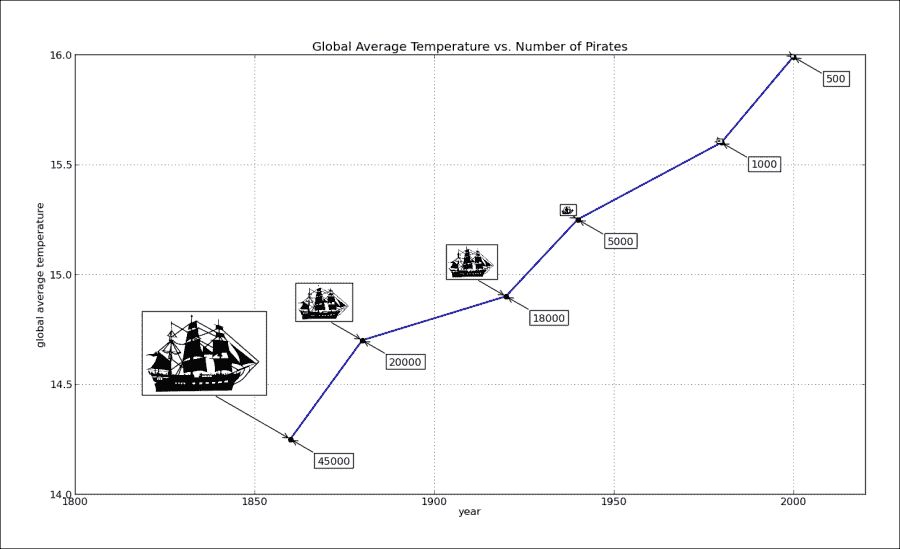
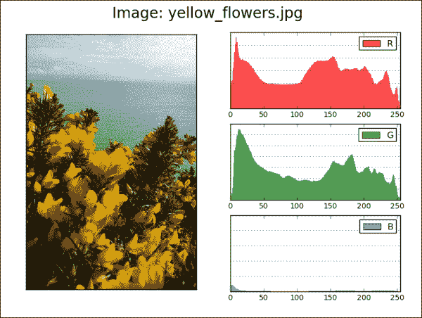
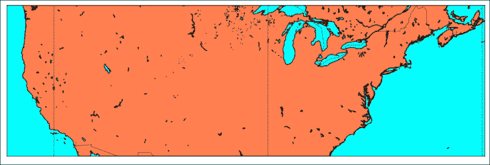
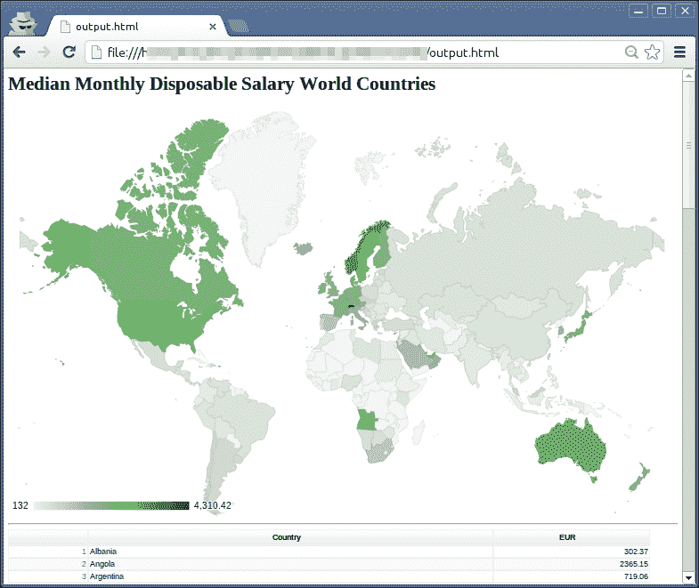
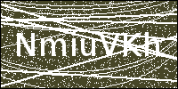

# 六、使用图像和地图绘制图表

本章包含的食谱将显示:

*   用 PIL 处理图像
*   用图像绘图
*   显示图中其他图的图像
*   使用底图在地图上绘制数据
*   使用谷歌地图应用编程接口在地图上绘制数据
*   生成验证码图像

# 简介

本章探讨如何使用图像和地图。Python 有一些著名的图像库，允许我们以美学和科学的方式处理图像。

我们将通过演示如何通过应用滤镜和调整大小来处理图像，来触及 PIL 的能力。

此外，我们将展示如何使用图像文件作为 matplotlibs 图表的标注。

为了处理地理空间数据集的数据可视化，我们将介绍 Python 可用库和公共 API 的功能，我们可以将它们用于基于地图的视觉表示。

最后的食谱展示了 Python 如何创建验证码测试图像。

# 用 PIL 处理图像

如果我们可以用 WIMP([http://en . Wikipedia . org/wiki/WIMP _(computing)](http://en.wikipedia.org/wiki/WIMP_(computing)))或者所见即所得([http://en.wikipedia.org/wiki/WYSIWYG](http://en.wikipedia.org/wiki/WYSIWYG))来达到同样的目的，为什么还要用 Python 进行图像处理呢？这是因为我们希望创建一个自动化系统来在没有人工支持的情况下实时处理图像，从而优化图像管道。

## 做好准备

请注意，PIL 坐标系假设(0，0)坐标位于左上角。

`Image`模块有一个有用的类和实例方法来对加载的图像对象(`im`)执行基本操作:

*   `im = Image.open(filename)`:这个打开一个文件，将图像加载到`im`对象中。
*   `im.crop(box)`:这个在`box`定义的坐标内裁剪图像。`box`定义左、上、右、下像素坐标(例如:`box = (0, 100, 100,100)`)。
*   `im.filter(filter)`:这个在图像上应用一个滤镜，返回一个过滤后的图像。
*   `im.histogram()`:这个返回这个图像的直方图列表，其中每一项代表像素数。对于单通道图像，列表中的项目数是 256，但是如果图像不是单通道图像，列表中可以有更多的项目。对于 RGB 图像，列表包含 768 个项目(每个通道一组 256 个值)。
*   `im.resize(size, filter)`:这将调整图像大小，并使用过滤器进行重采样。可能的过滤器有`NEAREST`、`BILINEAR`、`BICUBIC`和`ANTIALIAS`。默认为`NEAREST`。
*   `im.rotate(angle, filter)`:逆时针方向旋转图像。
*   `im.split()`:这个分割图像的波段，并返回单个波段的元组。用于将一个 RGB 图像分割成三个单波段图像。
*   `im.transform(size, method, data, filter)`:这将使用数据和过滤器对给定图像进行变换。变身可以是`AFFINE`、`EXTENT`、`QUAD`、`MESH`。您可以在官方文档中阅读更多关于转换的内容。数据定义了原始图像中将应用变换的框。

`ImageDraw`模块允许我们在图像上绘制，在这里我们可以使用圆弧、椭圆、直线、切片、点和多边形等功能来修改加载图像的像素。

`ImageChops`模块包含多个图像通道操作(因此得名`Chops`)，可用于图像合成、绘画、特殊效果和其他处理操作。通道操作仅允许用于 8 位图像。以下是一些有趣的频道操作:

*   `ImageChops.duplicate(image)`:这将当前图像复制到新的图像对象中
*   `ImageChops.invert(image)`:这将反转图像并返回副本
*   `ImageChops.difference(image1, image2)`:这有助于验证图像是否相同，无需目视检查

`ImageFilter`模块包含内核类的实现，允许创建自定义卷积内核。该模块还包含一组健康的通用滤镜，允许将知名滤镜(`BLUR`和`MedianFilter`)应用到我们的图像中。

`ImageFilter`模块提供了两种类型的滤波器:固定图像增强滤波器和需要定义某些参数的图像滤波器；例如，要使用的内核大小。

### 型式

我们可以轻松获得 IPython 中所有固定过滤器名称的列表:

```py
In [1]: import ImageFilter
In [2]: [ f for f in dir(ImageFilter) if f.isupper()]
Out[2]: 
['BLUR',
 'CONTOUR',
 'DETAIL',
 'EDGE_ENHANCE',
 'EDGE_ENHANCE_MORE',
 'EMBOSS',
 'FIND_EDGES',
 'SHARPEN',
 'SMOOTH',
 'SMOOTH_MORE']
```

下一个示例展示了我们如何在任何支持的图像上应用所有当前支持的固定滤镜:

```py
import os
import sys
from PIL import Image, ImageChops, ImageFilter

class DemoPIL(object):
    def __init__(self, image_file=None):
        self.fixed_filters = [ff for ff in dir(ImageFilter) if ff.isupper()]

        assert image_file is not None
        assert os.path.isfile(image_file) is True
        self.image_file = image_file
        self.image = Image.open(self.image_file)

    def _make_temp_dir(self):
        from tempfile import mkdtemp
        self.ff_tempdir = mkdtemp(prefix="ff_demo")

    def _get_temp_name(self, filter_name):
        name, ext = os.path.splitext(os.path.basename(self.image_file))
        newimage_file = name + "-" + filter_name + ext
        path = os.path.join(self.ff_tempdir, newimage_file)
        return path

    def _get_filter(self, filter_name):
        # note the use Python's eval() builtin here to return function object
        real_filter = eval("ImageFilter." + filter_name)
        return real_filter

    def apply_filter(self, filter_name):
        print "Applying filter: " + filter_name
        filter_callable = self._get_filter(filter_name)
        # prevent calling non-fixed filters for now
        if filter_name in self.fixed_filters:
            temp_img = self.image.filter(filter_callable)
        else:
            print "Can't apply non-fixed filter now."
        return temp_img

    def run_fixed_filters_demo(self):
        self._make_temp_dir()
        for ffilter in self.fixed_filters:
            temp_img = self.apply_filter(ffilter)
            temp_img.save(self._get_temp_name(ffilter))
        print "Images are in: {0}".format((self.ff_tempdir),)

if __name__ == "__main__":
    assert len(sys.argv) == 2
    demo_image = sys.argv[1]
    demo = DemoPIL(demo_image)
    # will create set of images in temporary folder
    demo.run_fixed_filters_demo()
```

我们可以从命令提示符轻松运行:

```py
$ pythonch06_rec01_01_pil_demo.py image.jpeg

```

我们在`DemoPIL`类中打包了我们的小演示，因此我们可以在围绕演示功能`run_fixed_filters_demo`共享通用代码的同时轻松扩展它。这里的常用代码包括打开图像文件，测试该文件是否真的是文件，创建临时目录来保存我们的过滤图像，建立过滤图像文件名，以及向用户打印有用的信息。这样，代码以更好的方式组织，我们可以轻松地专注于演示功能，而不需要接触代码的其他部分。

这个演示将打开我们的图像文件，并将`ImageFilter`中可用的每个固定过滤器应用到它，并将新过滤的图像保存在唯一的临时目录中。这个临时目录的位置被检索，所以我们可以用操作系统的文件资源管理器打开它并查看创建的图像。

作为一个可选的练习，尝试扩展这个演示类，在给定的图像上执行`ImageFilter`中可用的其他过滤器。

## 怎么做...

本节中的示例显示了我们如何处理特定文件夹中的所有图像。我们指定一个目标路径，程序读取该目标路径(images 文件夹)中的所有图像文件，并按照指定的比例(本例中为`0.1`)调整大小，并将每个文件保存在名为`thumbnail_folder`的目标文件夹中:

```py
import os
import sys
from PIL import Image

class Thumbnailer(object):
    def __init__(self, src_folder=None):
        self.src_folder = src_folder
        self.ratio = .3
        self.thumbnail_folder = "thumbnails"

    def _create_thumbnails_folder(self):
        thumb_path = os.path.join(self.src_folder, self.thumbnail_folder)
        if not os.path.isdir(thumb_path):
            os.makedirs(thumb_path)

    def _build_thumb_path(self, image_path):
        root = os.path.dirname(image_path)
        name, ext = os.path.splitext(os.path.basename(image_path))
        suffix = ".thumbnail"
        return os.path.join(root, self.thumbnail_folder, name + suffix + ext)

    def _load_files(self):
        files = set()
        for each in os.listdir(self.src_folder):
            each = os.path.abspath(self.src_folder + '/' + each)
            if os.path.isfile(each):
                files.add(each)
    return files

    def _thumb_size(self, size):
        return (int(size[0] * self.ratio), int(size[1] * self.ratio))

    def create_thumbnails(self):
        self._create_thumbnails_folder()
        files = self._load_files()

        for each in files:
            print "Processing: " + each
            try:
                img = Image.open(each)
                thumb_size = self._thumb_size(img.size)
                resized = img.resize(thumb_size, Image.ANTIALIAS)
                savepath = self._build_thumb_path(each)
                resized.save(savepath)
            except IOError as ex:
                print "Error: " + str(ex)

if __name__ == "__main__":
    # Usage:
    # ch06_rec01_02_pil_thumbnails.py my_images
    assert len(sys.argv) == 2
    src_folder = sys.argv[1]

    if not os.path.isdir(src_folder):
        print "Error: Path '{0}' does not exits.".format((src_folder))
        sys.exit(-1)
    thumbs = Thumbnailer(src_folder)

    # optionally set the name of theachumbnail folder relative to *src_folder*.
    thumbs.thumbnail_folder = "THUMBS"

    # define ratio to resize image to
    # 0.1 means the original image will be resized to 10% of its size
    thumbs.ratio = 0.1 

    # will create set of images in temporary folder
    thumbs.create_thumbnails()
```

## 它是如何工作的...

对于给定的`src_folder`文件夹，我们加载该文件夹中的所有文件，并尝试使用`Image.open()`加载每个文件；这就是`create_thumbnails()`功能的逻辑。如果我们试图加载的文件不是图像，`IOError`将被抛出，它将打印此错误并跳到序列中的下一个 fil e。

如果我们想对加载什么文件有更多的控制，我们应该将`_load_files()`功能更改为只包括具有特定扩展名(文件类型)的文件:

```py
for each in os.listdir(self.src_folder):
    if os.path.isfile(each) and os.path.splitext(each) is in ('.jpg','.png'):
        self._files.add(each)
```

这并不是万无一失的，因为文件扩展名没有定义文件类型，它只是帮助操作系统将默认程序附加到文件上，但它在大多数情况下都是有效的，并且比读取文件头来确定文件内容更简单(这仍然不能保证文件真的是前几个字节，比如说它是)。

## 还有更多...

有了 PIL，虽然用得不多，但我们可以很容易地将图像从一种格式转换成另一种格式。这可以通过两个简单的操作来实现:首先使用 `open()`打开一个源格式的图像，然后使用`save()`以另一种格式保存该图像。格式或者通过文件扩展名(`.png`或`.jpeg`隐式定义，或者通过传递给 `save()`函数的参数的格式显式定义。

# 用图像绘图

除了纯数据值之外，图像还可以用来突出可视化的优势。许多例子已经证明，通过使用符号图像，我们可以更深入地映射到观看者的心理模型中，从而帮助观看者更好地、更长时间地记住可视化。一种方法是将图像放在数据所在的位置，将值映射到它们所代表的内容。matplotlib 库能够提供这一功能，因此我们将演示如何做到这一点。

## 做好准备

使用故事*《飞来的意大利面怪物的福音》*中的虚构例子，作者将海盗的数量与海面温度联系起来。为了突出这种相关性，我们将显示海盗船的大小与代表测量海面温度的年份中海盗数量的值成比例。

我们将使用 Python matplotlib 库的功能，使用带有高级位置设置的图像和文本进行标注，以及箭头功能。

以下配方中所需的所有文件都可以在`ch06`文件夹的源代码库中找到。

## 怎么做...

以下示例显示了如何使用图像和文本向图表添加批注:

```py
import matplotlib.pyplot as plt
from matplotlib._png import read_png
from matplotlib.offsetbox import TextArea, OffsetImage, \
     AnnotationBbox

def load_data():
    import csv
    with open('pirates_temperature.csv', 'r') as f:
        reader = csv.reader(f)
        header = reader.next()
        datarows = []
        for row in reader:
            datarows.append(row)
    return header, datarows

def format_data(datarows):
    years, temps, pirates = [], [], []
    for each in datarows:
        years.append(each[0])
        temps.append(each[1])
        pirates.append(each[2])
    return years, temps, pirates
```

在我们定义了辅助函数之后，我们可以接近图形对象的构造并添加子场景。我们将在每年的年份集合中使用船的图像对这些进行标注，将图像缩放到适当的大小:

```py
if __name__ == "__main__":
    fig = plt.figure(figsize=(16,8))
    ax = plt.subplot(111)  # add sub-plot

    header, datarows = load_data()
    xlabel, ylabel = header[0], header[1]
    years, temperature, pirates = format_data(datarows)
    title = "Global Average Temperature vs. Number of Pirates"

    plt.plot(years, temperature, lw=2)
    plt.xlabel(xlabel)
    plt.ylabel(ylabel)    

    # for every data point annotate with image and number
    for x in xrange(len(years)):

        # current data coordinate
        xy = years[x], temperature[x]

        # add image
        ax.plot(xy[0], xy[1], "ok")

        # load pirate image 
        pirate = read_png('tall-ship.png')

        # zoom coefficient (move image with size) 
        zoomc = int(pirates[x]) * (1 / 90000.)

        # create OffsetImage 
        imagebox = OffsetImage(pirate, zoom=zoomc)

        # create anotation bbox with image and setup properties
        ab = AnnotationBbox(imagebox, xy,
                        xybox=(-200.*zoomc, 200.*zoomc),
                        xycoords='data',
                        boxcoords="offset points",
                        pad=0.1,
                        arrowprops=dict(arrowstyle="->",
                            connectionstyle="angle,angleA=0,angleB=-30,rad=3")
                        )
        ax.add_artist(ab)

        # add text
        no_pirates = TextArea(pirates[x], minimumdescent=False)
        ab = AnnotationBbox(no_pirates, xy,
                        xybox=(50., -25.),
                        xycoords='data',
                        boxcoords="offset points",
                        pad=0.3,
                        arrowprops=dict(arrowstyle="->",
                            connectionstyle="angle,angleA=0,angleB=-30,rad=3")
                        )
        ax.add_artist(ab)

    plt.grid(1)
    plt.xlim(1800, 2020)
    plt.ylim(14, 16)
    plt.title(title)

    plt.show()
```

前面的代码应该给出如下的图:



## 它是如何工作的...

我们首先创建一个大小合适的图形，即 16 x 8。我们需要这个尺寸来适合我们想要显示的图像。现在，我们使用`csv`模块从文件中加载数据。实例化`csv`读取器对象，我们可以逐行迭代文件中的数据。注意第一行是多么特别，它是描述我们的列的标题。由于我们在 x 轴上绘制了年，在 y 轴上绘制了温度，我们看到:

```py
xlabel, ylabel, _ = header
```

并使用以下行:

```py
plt.xlabel(xlabel)
plt.ylabel(ylabel)
```

### 注

我们在这里使用了整洁的 Python 约定将头解包为三个变量，其中通过使用`_`作为变量名，我们表明我们对该变量的值不感兴趣。

我们将 `load_data`功能中的`header`和`datarows`列表返回给`main`呼叫者。

使用`format_data()`功能，我们读取列表中的每一项，并将每个单独的实体(年份、温度和盗版数量)添加到该实体的相关 ID 列表中。

x 轴显示年份，y 轴显示温度。海盗数量显示为海盗船的图像，为了增加精度，会显示数值。

我们使用标准的`plot()`函数绘制年/温度值，除了使线变宽一点(2 点)之外，没有添加任何东西。

然后，我们为每个测量值添加一幅图像，并说明给定年份的盗版数量。为此，我们在长度值范围内循环(`range(len(years))`)，在每年/温度坐标上绘制一个黑点:

```py
ax.plot(xy[0], xy[1], "ok")
```

使用`read_png`助手功能将船的图像从文件加载到合适的数组格式中:

```py
pirate = read_png('tall-ship.png')
```

然后计算缩放系数(`zoomc`)以使我们能够根据当前(`pirates[x]`)测量的盗版数量来缩放图像的大小。我们还使用相同的系数来沿着图定位图像。

然后，实际图像在`OffsetImage`内部实例化，即相对于其父级(`AnnotationBbox`)具有相对位置的图像容器。

`AnnotationBbox`是一个类似标注的类，但是它可以显示其他`OffsetBox`实例，而不是像`Axes.annotate`函数那样只显示文本。这允许我们在标注中加载图像或文本对象，并将其定位在离数据点特定距离的位置，以及使用箭头功能(`arrowprops`)来精确指向标注的数据点。

我们为`AnnotateBbox`构造函数提供了某些参数:

*   `Imagebox`:这一定是`OffsetBox`的一个实例(比如`OffsetImage`)；它是标注框的内容
*   `xy`:这是标注涉及的数据点坐标
*   `xybox`:定义标注框的位置
*   `xycoords`:定义`xy`使用什么协调系统(例如数据坐标)
*   `boxcoords`:定义`xybox`使用什么协调系统(例如，偏离`xy`位置)
*   `pad`:指定填充量
*   `arrowprops`:这是用于绘制从标注边界框到数据点的箭头连接的属性字典

我们使用来自`pirates`列表的相同数据项，以稍微不同的相对位置向该图添加文本标注。第二个`AnnotationBbox`的大部分论点都是一样的——我们调整`xybox`和`pad`以将文本定位到行的对面。文本在`TextArea`类实例中，这类似于我们对图像所做的，但是文本`time.TextArea`和`OffsetImage`继承自同一个父类`OffsetBox`。

我们将这个`TextArea`实例中的文本设置为`no_pirates`，并将其放入我们的`AnnotationBbox`中。

# 显示带有图中其他图的图像

这个食谱将展示我们如何简单而有效地使用 Python matplotlib 库来处理图像通道和显示外部图像的每个通道直方图。

## 做好准备

我们已经提供了一些示例图像，但是代码已经准备好加载任何图像文件，前提是它得到 matplotlib 的`imread`函数的支持。

在本食谱中，我们将学习如何组合不同的 matplotlib 图，以实现简单图像查看器的功能，该查看器显示红色、绿色和蓝色通道的图像直方图。

## 怎么做...

为了展示如何构建一个图像直方图查看器，我们将实现一个名为`ImageViewer`的简单类，该类将包含帮助器方法，用于:

1.  加载图像。
2.  从图像矩阵中分离出 RGB 通道。
3.  配置图形和轴(子场景)。
4.  绘制通道直方图。
5.  绘制图像。

下面的代码展示了如何构建一个图像直方图查看器:

```py
import matplotlib.pyplot as plt
import matplotlib.image as mplimage
import matplotlib as mpl
import os

class ImageViewer(object):
    def __init__(self, imfile):
        self._load_image(imfile)
        self._configure()

        self.figure = plt.gcf()
        t = "Image: {0}".format(os.path.basename(imfile))
        self.figure.suptitle(t, fontsize=20)

        self.shape = (3, 2)

    def _configure(self):
        mpl.rcParams['font.size'] = 10
        mpl.rcParams['figure.autolayout'] = False
        mpl.rcParams['figure.figsize'] = (9, 6)
        mpl.rcParams['figure.subplot.top'] = .9

    def _load_image(self, imfile):
        self.im = mplimage.imread(imfile)

    @staticmethod
    def _get_chno(ch):
        chmap = {'R': 0, 'G': 1, 'B': 2}
        return chmap.get(ch, -1)
    def show_channel(self, ch):
        bins = 256
        ec = 'none'
        chno = self._get_chno(ch)
        loc = (chno, 1)
        ax = plt.subplot2grid(self.shape, loc)
        ax.hist(self.im[:, :, chno].flatten(), bins, color=ch, ec=ec,\
                label=ch, alpha=.7)
        ax.set_xlim(0, 255)
        plt.setp(ax.get_xticklabels(), visible=True)
        plt.setp(ax.get_yticklabels(), visible=False)
        plt.setp(ax.get_xticklines(), visible=True)
        plt.setp(ax.get_yticklines(), visible=False)
        plt.legend()
        plt.grid(True, axis='y')
        return ax

    def show(self):
        loc = (0, 0)
        axim = plt.subplot2grid(self.shape, loc, rowspan=3)
        axim.imshow(self.im)
        plt.setp(axim.get_xticklabels(), visible=False)
        plt.setp(axim.get_yticklabels(), visible=False)
        plt.setp(axim.get_xticklines(), visible=False)
        plt.setp(axim.get_yticklines(), visible=False)
        axr = self.show_channel('R')
        axg = self.show_channel('G')
        axb = self.show_channel('B')
        plt.show()

if __name__ == '__main__':
    im = 'img/yellow_flowers.jpg'
    try: 
        iv = ImageViewer(im)
        iv.show()
    except Exception as ex:
        print ex
```

## 它是如何工作的...

从代码的末尾，我们看到硬编码的文件名。这些可以通过从命令行加载参数并使用`sys.argv`序列将给定参数解析到`im`变量中来交换。

我们用提供的图像文件路径实例化`ImageViewer`类。在对象实例化过程中，我们尝试将图像文件加载到数组中，通过`rcParams`字典配置图形，设置图形大小和标题，并定义要在对象方法中使用的对象字段(`self.shape`)。

这里的主要方法是 `show()`，它为图形创建布局，并将图像数组加载到主(左列)子图中。我们隐藏任何刻度和刻度标签，因为这是实际的图像，我们不需要使用刻度。

然后，我们为每个红色、绿色和蓝色通道调用私有方法`show_channel()`。该方法还创建了新的子图轴，这次是在右侧列，每个轴都在单独的行中。我们在单独的子图中绘制每个通道的直方图。

我们还设置了一个小图，去除不必要的 x 记号，并添加一个图例，以防我们想要在非彩色环境下打印此图。因此，即使在这些环境中，我们也可以辨别通道表示。

运行此代码后，我们将获得以下截图:



## 还有更多...

直方图绘图类型的使用只是图像查看器示例的一种选择。我们可以使用 matplotlib 支持的任何绘图类型。另一个真实的例子是绘制脑电图或类似的医疗记录，其中我们希望将切片显示为图像，将脑电图的时间序列记录为线图，以及关于所显示数据的附加元信息，这些信息可能会进入`matplotlib.text.Text artists`。

matplotlib 具有与用户图形用户界面事件交互的能力，它还允许我们实现交互，如果我们只手动放大一个图，我们将希望放大所有图。这是另一种用法，我们希望显示图像并放大它，同时也放大当前活动图形中的其他显示图。一个想法是使用`motion_notify_event`来调用一个函数，该函数将更新当前图形中所有轴(子图)的 x 和 y 限制。

# 使用底图在地图上绘制数据

最好的地理空间可视化可能是通过将数据覆盖在地图上来实现的。无论是整个地球、一个大陆、一个州，还是甚至天空，对于一个观察者来说，理解它所显示的数据和地理之间的关系是最简单的方法之一。

在本食谱中，我们将学习如何使用 matplotlib 的`Basemap`工具包在地图上投影数据。

## 做好准备

由于我们已经熟悉 matplotlib 作为我们的绘图引擎，我们可以将其扩展到 matplotlib 的能力，以使用其他工具包，例如`Basemap`映射工具包。

`Basemap`本身不做任何的图谋。它只是将给定的地理空间坐标转换为地图投影，并将该数据提供给 matplotlib 进行绘图。

首先，我们需要安装`Basemap`工具包。如果您正在使用三元乙丙橡胶，则已经安装了`Basemap`。如果你在 Linux 上，最好使用原生包管理器来安装包含`Basemap`的包。比如在 Ubuntu 上，这个包叫做`python-mpltoolkits.basemap`，可以使用标准的包管理器进行安装:

```py
$ sudo apt-get install python-mpltoolkits.basemap

```

在 Mac OS X 上，建议使用 EPD，尽管使用流行的软件包管理器(如 Homebrew、Fink 和 pip)安装也是可能的。

## 怎么做...

下面是一个如何使用`Basemap`工具包在特定区域内绘制简单墨卡托投影的示例，该区域由长的 lat 坐标对指定:

1.  我们实例化`Basemap`定义要使用的投影(`merc`为墨卡托)。
2.  我们为地图的左下角和右上角定义(在同一个`Basemap`构造函数中)经度和纬度。
3.  我们设置`Basemap`实例地图，来绘制海岸线和国家。
4.  我们设置`Basemap`实例地图来填充大陆并绘制地图边界。
5.  我们指示`Basemap`实例图绘制经线和纬线。

下面的代码展示了如何使用`Basemap`工具箱绘制一个简单的墨卡托投影:

```py
from mpl_toolkits.basemap import Basemap
import matplotlib.pyplot as plt
import numpy as np

map = Basemap(projection='merc', 
              resolution = 'h', 
              area_thresh = 0.1,
    llcrnrlon=-126.619875, llcrnrlat=31.354158,
    urcrnrlon=-59.647219, urcrnrlat=47.517613)

map.drawcoastlines()
map.drawcountries()
map.fillcontinents(color='coral', lake_color='aqua')
map.drawmapboundary(fill_color='aqua')

map.drawmeridians(np.arange(0, 360, 30))
map.drawparallels(np.arange(-90, 90, 30))

plt.show()
```

这将给我们的地球一个可识别的部分:



既然我们知道如何绘制地图，我们就需要知道如何在地图上绘制数据。如果我们回想一下`Basemap`是当前地图投影中经度和纬度对的大代码转换器，我们会意识到我们所需要的是一个包含 long/lat 的数据集，在用 matplotlib 绘制之前，我们将其传递给`Basemap`进行投影。我们使用`cities.shp`和`cities.shx`文件加载美国城市的坐标，并将它们投影到地图上。该文件位于代码库的`ch06`文件夹中。下面是如何实现这一点的示例:

```py
from mpl_toolkits.basemap import Basemap
import matplotlib.pyplot as plt
import numpy as np

map = Basemap(projection='merc', 
              resolution = 'h', 
              area_thresh = 100,
    llcrnrlon=-126.619875, llcrnrlat=25,
    urcrnrlon=-59.647219, urcrnrlat=55)

shapeinfo = map.readshapefile('cities','cities')

x, y = zip(*map.cities)

# build a list of US cities
city_names = []
for each in map.cities_info:
    if each['COUNTRY'] != 'US':
        city_names.append("")
    else:
        city_names.append(each['NAME'])

map.drawcoastlines()
map.drawcountries()
map.fillcontinents(color='coral', lake_color='aqua')
map.drawmapboundary(fill_color='aqua')
map.drawmeridians(np.arange(0, 360, 30))
map.drawparallels(np.arange(-90, 90, 30))

# draw city markers
map.scatter(x,y,25, marker='o',zorder=10)

# plot labels at City coords.
for city_label, city_x, city_y in zip(city_names, x, y):
    plt.text(city_x, city_y, city_label)

plt.title('Cities in USA') 

plt.show()
```

## 它是如何工作的...

`Basemap`使用的基础包括导入主模块和实例化具有所需属性的`Basemap`类。在实例化过程中，我们必须指定要使用的投影和我们要处理的地球部分。

在绘制地图并使用`matplotlib.pyplot.show()`显示图形窗口之前，可以应用附加的配置。

`Basemap`支持十几个(准确地说是 32 个)不同的投影。大多数都是面向狭义使用的，但有些更通用，适用于大多数常见的地图可视化。

### 型式

通过询问`Basemap`模块本身，我们可以很容易地看到有哪些预测可用:

```py
In [5]: import mpl_toolkits.basemap

In [6]: print mpl_toolkits.basemap.supported_projections
 mbtfpq           McBryde-Thomas Flat-Polar Quartic
 aeqd             Azimuthal Equidistant
 sinu             Sinusoidal
 poly             Polyconic
 omerc            Oblique Mercator
 gnom             Gnomonic
 moll             Mollweide
 lcc              Lambert Conformal
 tmerc            Transverse Mercator
 nplaea           North-Polar Lambert Azimuthal
 gall             Gall Stereographic Cylindrical
 npaeqd           North-Polar Azimuthal Equidistant
 mill             Miller Cylindrical
 merc             Mercator
 stere            Stereographic
 eqdc             Equidistant Conic
 cyl              Cylindrical Equidistant
 npstere          North-Polar Stereographic
 spstere          South-Polar Stereographic
 hammer           Hammer
 geos             Geostationary
 nsper            Near-Sided Perspective
 eck4             Eckert IV
 aea              Albers Equal Area
 kav7             Kavrayskiy VII
 spaeqd           South-Polar Azimuthal Equidistant
 ortho            Orthographic
 cass             Cassini-Soldner
 vandg            van der Grinten
 laea             Lambert Azimuthal Equal Area
 splaea           South-Polar Lambert Azimuthal
 robin            Robinson
```

通常，我们将绘制整个投影，如果没有指定，则使用一些合理的默认值。

为了放大地图的特定区域，我们将指定您想要显示的区域的左下角和右上角的纬度和经度。对于这个例子，我们将使用墨卡托投影。

### 型式

这里我们看到参数名称是如何被缩短的描述:

*   `llcrnrlon`:这是左下角经度
*   `llcrnrlat`:这是左下角纬度
*   `urcrnrlon`:这是右上角经度
*   `urcrnrlat`:这是右上角纬度

## 还有更多...

我们只是触及了`Basemap`工具包的功能表面，更多的例子可以在[http://matplotlib.org/basemap/users/examples.html](http://matplotlib.org/basemap/users/examples.html)的官方文档中找到。

官方`Basemap`文档中示例中使用的大部分数据位于远程服务器上，并且采用特定的格式。为了有效地获取该数据，使用`NetCDF`数据格式。`NetCDF` 是一种考虑到网络效率而设计的通用数据格式。它允许程序获取所需的数据，即使整个数据集非常大，这使得使用这种格式非常实用。我们不必每次想使用大型数据集时以及每次数据集发生变化时都在本地下载和存储它们。

# 使用谷歌地图 API 在地图上绘制数据

在这个食谱中，我们将脱离桌面环境，展示如何为网络输出。虽然，web 前端的主要语言不是 Python，而是 HTML、CSS 和 JavaScript，但我们仍然可以使用 Python 进行繁重的工作:获取数据，处理数据，执行密集的计算，并以适合 web 输出的格式呈现数据，即创建具有所需 JavaScript 版本的 HTML 页面来呈现我们的可视化。

## 做好准备

我们将使用 Python 的 **谷歌数据可视化库**来帮助我们为前端界面准备数据，在这里我们将使用另一个**谷歌可视化应用编程接口** 来以期望的可视化方式渲染数据，即地图和表格。

在开始之前，我们需要安装`google-visualization-python`模块。从[https://code . Google . com/p/Google-visualization-python/downloads/detail 下载最新稳定版？name = gviz _ API _ py-1 . 8 . 2 . tar . gz&can = 2&q =](https://code.google.com/p/google-visualization-python/downloads/detail?name=gviz_api_py-1.8.2.tar.gz&can=2&q=)，打开档案并安装模块。以下操作演示了如何做到这一点:

```py
$ tar xfv gviz_api_py-1.8.2.tar.gz
$ cd gviz_api_py
$ sudo python ./setup.py install

```

在 Windows 和 Mac 上，OS X 使用适当的软件打开`tar.gz`档案，而其他步骤应该保持不变。请注意，我们必须成为超级用户(即获得管理员权限)才能在我们的系统上安装该模块。

如果你不想污染你的操作系统包，一个更好的选择是创建一个 virtualenv 环境来安装这个配方的包。我们在[第 1 章](1.html "Chapter 1. Preparing Your Working Environment")、*准备你的工作环境*中解释了如何应对病毒变异环境。

对于前端库，我们不需要安装任何东西，因为该库将直接从谷歌服务器从网页加载。

我们需要为这个食谱主动访问互联网，因为它的输出将是一个网页，当在网络浏览器中打开时，将直接从远程服务器拉 JavaScript 库。

在这个食谱中，我们将学习如何使用谷歌数据可视化库的 Python 和 JavaScript 来组合它们来创建网络可视化。

## 怎么做...

以下示例显示了如何使用谷歌地理地图**和**表格可视化**在世界地图投影上可视化**每个国家的可支配月工资中位数**，使用 Python 和`gdata_viz`模块从 CSV 文件加载数据。我们将:**

 **1.  实现一个函数作为模板生成器。
2.  使用`csv`模块从本地 CSV 文件加载数据。
3.  使用`DataTable`描述数据，`LoadData`从 Python 字典加载数据。
4.  将输出呈现到网页。

这可以通过以下代码来实现:

```py
import csv
import gviz_api

def get_page_template():
    page_template = """
    <html>
      <script src="https://www.google.com/jsapi" type="text/javascript"></script>
      <script>
        google.load('visualization', '1', {packages:['geochart', 'table']});

        google.setOnLoadCallback(drawMap);
        function drawMap() {
            var json_data = new google.visualization.DataTable(%s, 0.6);

            var options = {colorAxis: {colors: ['#eee', 'green']}};
            var mymap = new google.visualization.GeoChart(
                                document.getElementById('map_div'));
            mymap.draw(json_data, options);

            var mytable = new google.visualization.Table(
                                document.getElementById('table_div'));
            mytable.draw(json_data, {showRowNumber: true})
        }
      </script>
      <body>
        <H1>Median Monthly Disposable Salary World Countries</H1>

        <div id="map_div"></div>
        <hr />
        <div id="table_div"></div>

        <div id="source">
        <hr />
        <small>
        Source: 
        <a href="http://www.numbeo.com/cost-of-living/prices_by_country.jsp?displayCurrency=EUR&itemId=105">
        http://www.numbeo.com/cost-of-living/prices_by_country.jsp?displayCurrency=EUR&itemId=105
        </a>
        </small>
        </div>
      </body>
    </html>
    """
    return page_template

def main():
    # Load data from CVS file
    afile = "median-dpi-countries.csv"
    datarows = []
    with open(afile, 'r') as f:
        reader = csv.reader(f)
        reader.next()  # skip header
        for row in reader:
            datarows.append(row)

    # Describe data
    description = {"country": ("string", "Country"),
                       "dpi": ("number", "EUR"), }

    # Build list of dictionaries from loaded data
    data = []
    for each in datarows:
        data.append({"country": each[0],
                     "dpi": (float(each[1]), each[1])})

    # Instantiate DataTable with structure defined in 'description'
    data_table = gviz_api.DataTable(description)

    # Load it into gviz_api.DataTable
    data_table.LoadData(data)

    # Creating a JSon string
    json = data_table.ToJSon(columns_order=("country", "dpi"),
                             order_by="country", )

    # Put JSON string into the template
    # and save to output.html
    with open('output.html', 'w') as out:
        out.write(get_page_template() % (json,))

if __name__ == '__main__':
    main()
```

这个会产生`output.html`文件，我们可以在自己喜欢的网页浏览器中打开。页面应该如下图所示:



## 它是如何工作的...

这里的主要切入点是我们的`main()`功能。首先我们使用`csv`模块加载我们的数据。本次数据来源于公共网站[www.numbeo.com](http://www.numbeo.com)，数据以 CSV 格式放置。最终文件可在`ch06`文件夹的本章存储库中的获得。为了能够使用谷歌数据可视化库，我们需要向它描述数据。我们使用 Python 字典来描述数据，其中定义了列的标识、数据类型和可选标签。在以下示例中，数据是在此约束中定义的:

```py
{"name": ("data_type", "Label")}:
description = {"country": ("string", "Country"),
                       "dpi": ("number", "EUR"), }
```

然后，我们需要将加载的 CSV 行调整为这种格式。我们将在`data`变量中建立一个字典列表。

现在我们有了所有的东西来用所描述的结构用`gviz_data.DataTable`实例化我们的`data_table`。然后我们将数据加载到其中，并以 JSON 格式输出到我们的`page_template`。

`get_page_template()`函数包含这个等式的另一部分。它包含一个客户端(前端)代码来生成一个 HTML 网页和一个 JavaScript 代码来从谷歌服务器加载谷歌数据可视化库。加载谷歌的 JavaScript 应用编程接口的行是:

```py
<script src="https://www.google.com/jsapi" type="text/javascript"></script>
```

之后，跟随另一对包含附加设置的`<script>...</script>`标签。首先，我们加载谷歌数据可视化库和所需的包——地理图表和表格:

```py
google.load('visualization', '1', {packages:['geochart', 'table']});
```

然后我们设置一个函数，当页面被加载时会被调用。这个事件在网络世界注册为`onLoad`，所以回拨是通过`setOnLoadCallback`功能设置的:

```py
google.setOnLoadCallback(drawMap);
```

这定义了当加载一个页面时，`google`实例将调用我们定义的自定义函数 `drawMap()`。`drawMap`函数将一个 JSON 字符串加载到`DataTable`实例的 JavaScript 版本中:

```py
var json_data = new google.visualization.DataTable(%s, 0.6);
```

接下来，我们在一个 HTML 元素中创建一个名为`map_div`的`geochart`实例:

```py
var mymap = new google.visualization.GeoChart(
                                document.getElementById('map_div'));
```

使用`json_data`和提供的自定义`options`绘制地图:

```py
mymap.draw(json_data, options);
```

同样，谷歌的 JavaScript 表呈现在地图下方:

```py
var mytable = new google.visualization.Table(
                                document.getElementById('table_div'));
mytable.draw(json_data, {showRowNumber: true})
```

我们将这个输出保存为一个我们可以在浏览器中打开的 HTML 文件。这个对于 web 服务的动态呈现不是很有用。对此有一个更好的选择——直接从 Python 输出 HTTP 响应，从而构建一个后台服务，用客户机可以加载和呈现的 JSON 响应客户机的 web 请求。

### 注

如果您想了解更多关于阅读 HTTP 响应的信息，请在[HTTP://en . Wikipedia . org/wiki/Hypertext _ Transfer _ Protocol # Response _ message](http://en.wikipedia.org/wiki/Hypertext_Transfer_Protocol#Response_message)上阅读更多关于 HTTP 协议和响应消息的信息。

我们通过将`ToJson()`调用替换为具有相同签名的`ToJSonResponse()`来实现。这个调用将以一个包含有效负载的正确的 HTTP 响应来响应——我们的 JSON 化的`data_table`准备好被我们的 JavaScript 客户端使用。

## 还有更多...

当然，这只是我们如何将 Python 作为后端语言结合起来的一个例子，我们坐在服务器上，进行数据提取和处理，而前端则留给通用的 HTML/JavaScript/CSS 语言集。这使我们能够向广大受众提供可视化的交互式动态界面，而不需要他们安装任何东西(除了网络浏览器，但通常安装在计算机或智能手机上)。话虽如此，我们必须注意到，这些输出的质量并没有 matplotlib 高，而 matplotlib 的实力在于高质量的输出。

为了更好地使用网络(和 Python)，你必须了解更多的网络技术和所使用的语言。这本书没有涵盖这些主题，但是深入探讨了如何使用众所周知的第三方库来实现一个可能的解决方案，该库能够以尽可能少的网络编码产生令人愉悦的网络输出。

更多文档可在[的谷歌开发者](https://developers.google.com/chart/interactive/docs/dev/gviz_api_lib)门户网站上获得。

# 生成验证码图片

虽然这不是我们通常所说的严格意义上的数据可视化，但是使用 Python 生成图像的能力在很多情况下都会派上用场，而就是其中之一。

在这个食谱中，我们将涵盖随机图像的生成，以区分人类和计算机——验证码图像。

## 做好准备

验证码代表完全自动化的公共图灵测试来区分计算机和人类，由卡内基梅隆大学注册商标。该测试用于挑战计算机程序(通常称为机器人)自动填写各种主要针对人类且不应自动化的网页表单。常见的例子有注册表单、登录表单、调查等。

验证码本身可以采取各种形式，但最常见的形式包括一个挑战，即人类应该读取带有扭曲字符和数字的图像，并在相关的响应字段中键入结果。

在这个食谱中，我们将学习如何利用 Python 的图像库来生成图像、渲染线和点，以及渲染文本。

## 怎么做...

我们将通过执行以下步骤来展示创建个人简单验证码生成器的过程:

1.  定义大小、文本、字体大小、背景颜色和验证码长度。
2.  从英语字母表中随机挑选字符。
3.  使用定义的字体和颜色在图像上绘制。
4.  以线条和弧线的形式添加一些噪点。
5.  将图像对象和验证码一起返回给呼叫者。
6.  向用户显示生成的图像。

下面的代码展示了如何创建一个个人和简单的验证码生成器:

```py
from PIL import Image, ImageDraw, ImageFont
import random
import string

class SimpleCaptchaException(Exception):
    pass

class SimpleCaptcha(object):
    def __init__(self, length=5, size=(200, 100), fontsize=36,
                 random_text=None, random_bgcolor=None):
        self.size = size
        self.text = "CAPTCHA"
        self.fontsize = fontsize
        self.bgcolor = 255
        self.length = length

        self.image = None  # current captcha image

        if random_text:
            self.text = self._random_text()

        if not self.text:
            raise SimpleCaptchaException("Field text must not be empty.")

        if not self.size:
            raise SimpleCaptchaException("Size must not be empty.")

        if not self.fontsize:
            raise SimpleCaptchaException("Font size must be defined.")

        if random_bgcolor:
            self.bgcolor = self._random_color()

    def _center_coords(self, draw, font):
        width, height = draw.textsize(self.text, font)
        xy = (self.size[0] - width) / 2., (self.size[1] - height) / 2.
        return xy

    def _add_noise_dots(self, draw):
        size = self.image.size
        for _ in range(int(size[0] * size[1] * 0.1)):
            draw.point((random.randint(0, size[0]),
                        random.randint(0, size[1])),
                        fill="white")
        return draw

    def _add_noise_lines(self, draw):
        size = self.image.size
        for _ in range(8):
            width = random.randint(1, 2)
            start = (0, random.randint(0, size[1] - 1))
            end = (size[0], random.randint(0,size[1]-1))
            draw.line([start, end], fill="white", width=width)            
        for _ in range(8):
            start = (-50, -50)
            end = (size[0] + 10, random.randint(0, size[1]+10))
            draw.arc(start + end, 0, 360, fill="white")
        return draw

    def get_captcha(self, size=None, text=None, bgcolor=None):
        if text is not None:
            self.text = text
        if size is not None:
            self.size = size
        if bgcolor is not None:
            self.bgcolor = bgcolor

        self.image = Image.new('RGB', self.size, self.bgcolor)
        # Note that the font file must be present
        # or point to your OS's system font 
        # Ex. on Mac the path should be '/Library/Fonts/Tahoma.ttf'
        font = ImageFont.truetype('fonts/Vera.ttf', self.fontsize)
        draw = ImageDraw.Draw(self.image)
        xy = self._center_coords(draw, font)
        draw.text(xy=xy, text=self.text, font=font)

        # Add some dot noise
        draw = self._add_noise_dots(draw)

        # Add some random lines
        draw = self._add_noise_lines(draw)

        self.image.show()
        return self.image, self.text

    def _random_text(self):
        letters = string.ascii_lowercase + string.ascii_uppercase
        random_text = ""
        for _ in range(self.length):
            random_text += random.choice(letters)
        return random_text

    def _random_color(self):
        r = random.randint(0, 255)
        g = random.randint(0, 255)
        b = random.randint(0, 255)
        return (r, g, b)
if __name__ == "__main__":
    sc = SimpleCaptcha(length=7, fontsize=36, random_text=True, random_bgcolor=True)
    sc.get_captcha()
```

这将生成类似于以下内容的图像:



## 它是如何工作的...

这个例子给出了一个如何使用 Python 的图像库生成预定义图像的过程，以创建一个简单而有效的验证码生成器。

我们将功能打包成一个类`SimpleCaptcha`，因为它给了我们未来发展的安全空间。我们还创建了一个定制的`SimpleCaptchaException`来适应未来的异常层次结构。

### 注

如果您编写的不仅仅是琐碎、快速和肮脏的脚本，那么开始为您的域编写和设计自定义异常层次结构总是好的，而不是使用通用 Python 的标准异常。在软件的可读性和维护上，你会受益匪浅。

从代码清单末尾的主要部分开始阅读，在这里我们实例化一个类，给出我们未来图像的设置作为构造函数的参数。接下来，我们在`sc`对象上调用`get_captcha`方法。对于这个方法的目的，`get_captcha`显示图像对象作为结果，但是我们也将图像对象返回给这个方法的潜在调用者，所以它可以利用这个结果。用法可能会有所不同，调用者可以将图像保存在文件中，或者如果这是一个网络应用，则将图像流和书面质询返回给请求该验证码的客户端。

需要注意的重要一点是，为了完成验证码测试的挑战-响应过程，我们必须将图像上生成的验证码字符串作为文本返回，以便调用方可以将用户的响应与期望值进行比较。

`get_captcha`方法首先验证输入参数，以便在用户提供自定义值时覆盖类的默认值。之后，通过`Image.new`实例化新的图像对象。这个对象保存在`self.image`里，我们用它来画和写文字。将文本写入图像后，我们添加了随机放置的点和线的噪声，以及一些弧段。

这些任务通过`_add_noise_points`和`_add_noise_lines`方法执行。第一个循环几次，并在图像上的随机位置添加一个点，不要太靠近图像的边缘，后一个从图像的左侧到图像的右侧绘制线条。

## 还有更多...

我们使用一些关于它的使用的假设来构造这个类。我们假设用户只想接受我们的默认设置(也就是说，随机背景色上随机的七个字符)并从中接收结果。这就是在构造函数中放置辅助函数来设置随机文本和随机背景颜色的原因。如果最常见和最有效的用法是总是重写配置，那么我们希望从构造函数中移除这些操作，并将它们放在单独的调用中。

例如，可能用户希望总是使用英语单词作为验证码挑战。如果是这种情况，我们希望能够只调用一个方法来为我们提供这样的结果。这个方法可以是`get_english_captcha`，通过这个构造函数的随机逻辑，我们可以构造这个方法，从提供的英语字典中选择随机的单词。在 Unix 系统上，在`/usr/share/dict/words`中有一个通用的英语词典，我们可以用来做这个:

```py
def get_english_captcha(self):
    words = '/usr/share/dict/words'
    with open(words, 'r') as wf:
        words = wf.readlines()
        aword = random.choice(words)
        aword = aword.strip()  # remove newline and spaces
    return self.get_captcha(text=aword)
```

总的来说，验证码生成的例子不是生产质量，如果不增加更多的保护和随机性，比如字母轮换，就不应该使用。

如果您需要保护您的 web 表单免受僵尸工具的攻击，那么您应该重用第三方 Python 模块和库。甚至有专门为现有 web 框架构建的模块。

还有**reCAPTCHA**([http://www.google.com/recaptcha](http://www.google.com/recaptcha))等事件 web 服务，有已经验证的 Python 模块**reCAPTCHA-client**([https://pypi.python.org/pypi/recaptcha-client](https://pypi.python.org/pypi/recaptcha-client))可以注册使用。它不需要任何图像库，因为图像是直接从 reCAPTCHA web 服务中提取的，但它有其他依赖项，如`pycrypto`。通过使用这个网络服务和图书馆，您还可以帮助使用来自谷歌图书项目或旧版本《纽约时报》的光学字符识别(OCR)扫描的书籍。在 reCAPTCHA 网站上阅读更多内容。**