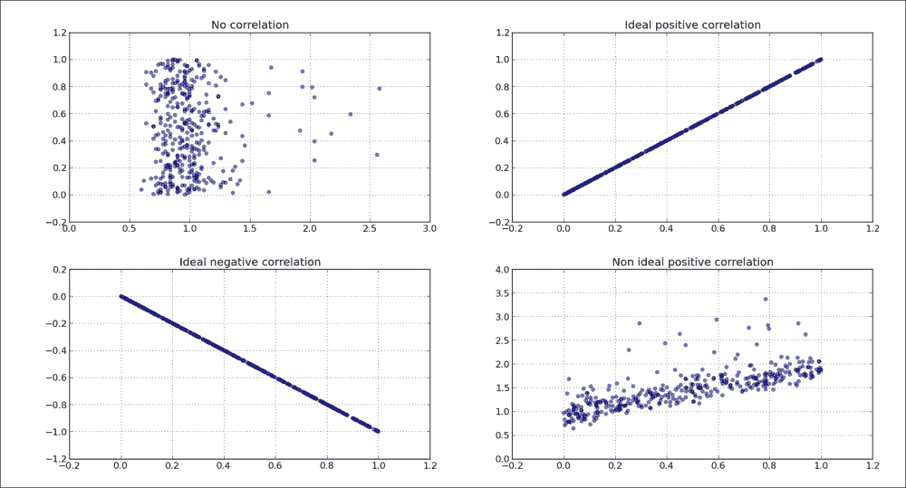

# 七、使用正确的绘图来理解数据

在这一章中，我们将涵盖以下食谱:

*   理解对数图
*   理解光谱图
*   创建主干图
*   绘制矢量流的流线
*   使用彩色地图
*   使用散点图和直方图
*   绘制两个变量之间的互相关
*   自相关的重要性

# 简介

在这一章中，我们将更加专注于理解我们想用我们呈现的数据说什么，以及如何有效地说出来。我们将展示一些新的技术和绘图，但所有这些都将通过理解我们想要传达给用户的信息来强调。让我们问一个问题，“为什么我们要在这种状态下呈现信息？”。这是在数据探索阶段应该问的最重要的问题。如果我们错过了理解数据并以某种方式呈现数据的机会，那么观众肯定无法正确理解数据。

# 理解对数图

更多时候不是，看日报和类似的文章，一就能找到被媒体机构用来歪曲事实的图表。一个常见的例子是使用线性标度来创建所谓的恐慌图，其中一个不断增长的值跟随很长一段时间(年)，并且起始值比最近的值小几个数量级。当这些值被正确地可视化时，将会(并且通常应该)产生线性或几乎线性的图表，从它们所展示的文章中消除一些恐慌。

## 做好准备

对于对数刻度，连续值的比率是恒定的。当我们试图读取日志图时，这一点很重要。对于线性(算术)标度，常数是连续值之间的距离。换句话说，对数图在数量级上具有恒定的距离。我们将在下面的图中看到这一点。接下来解释用于产生这个数字的代码。

作为一般经验法则，对数刻度应在以下情况下使用:

*   当呈现的数据具有跨越几个数量级的值时
*   当呈现的数据向大值倾斜时(某些点比其余数据大得多)
*   当你想显示变化率(增长率)，而不是变化值时

不要盲目遵循这些规则；它们更像是暗示，而不是规则。对于手头的数据和项目或客户向您提出的要求，始终使用您自己的判断。

根据数据范围，应使用不同的日志库。日志的标准基数是 10，但是如果数据范围较小，基数为 2 会更有用，因为它会在较小的范围内显示更多的分辨率。

如果我们有适合在对数标度上显示的数据范围，我们会注意到，以前过于接近而无法判断任何差异的值现在相距甚远。这使我们能够比以线性比例呈现数据更容易地阅读图表。

在收集长期时间序列数据的增长率图表中，我们希望看到的不是在某个时间点测量的绝对值，而是时间上的增长。我们仍将获得绝对值信息，但该信息的优先级较低。

此外，如果数据分布具有正偏斜，例如薪水，取值(薪水)的对数将有助于我们将数据拟合到模型中，因为对数变换将给出更正态的数据分布。

## 怎么做...

我们将用一个示例代码来举例说明这一点，该代码使用不同的比例(线性和对数)在两个不同的图上显示相同的两个数据集(一个是线性的，一个是对数的)。

我们将借助这些步骤后提到的代码来执行以下步骤:

1.  生成两个简单的数据集:y-指数/对数性质和 z-线性。
2.  创建一个包含四个子绘图网格的图形。
3.  创建两个包含 y 数据集的子图:一个是对数标度，一个是线性标度。
4.  创建另外两个包含 z 数据集的子图，一个是对数的，另一个是线性的。

以下是代码:

```py
from matplotlib import pyplot as plt
import numpy as np

x = np.linspace(1, 10)
y = [10 ** el for el in x]
z = [2 * el for el in x]

fig = plt.figure(figsize=(10, 8))

ax1 = fig.add_subplot(2, 2, 1)
ax1.plot(x, y, color='blue')
ax1.set_yscale('log')
ax1.set_title(r'Logarithmic plot of $ {10}^{x} $ ')
ax1.set_ylabel(r'$ {y} = {10}^{x} $')
plt.grid(b=True, which='both', axis='both')

ax2 = fig.add_subplot(2, 2, 2)
ax2.plot(x, y, color='red')
ax2.set_yscale('linear')
ax2.set_title(r'Linear plot of $ {10}^{x} $ ')
ax2.set_ylabel(r'$ {y} = {10}^{x} $')
plt.grid(b=True, which='both', axis='both')

ax3 = fig.add_subplot(2, 2, 3)
ax3.plot(x, z, color='green')
ax3.set_yscale('log')
ax3.set_title(r'Logarithmic plot of $ {2}*{x} $ ')
ax3.set_ylabel(r'$ {y} = {2}*{x} $')
plt.grid(b=True, which='both', axis='both')

ax4 = fig.add_subplot(2, 2, 4)
ax4.plot(x, z, color='magenta')
ax4.set_yscale('linear')
ax4.set_title(r'Linear plot of $ {2}*{x} $ ')
ax4.set_ylabel(r'$ {y} = {2}*{x} $')
plt.grid(b=True, which='both', axis='both')

plt.show()
```

该代码将产生以下输出:


## 它是如何工作的...

我们生成一些样本数据和两个因变量:y 和 z。变量 y 表示为 x(数据)的指数函数，变量 z 是 x 的简单线性函数。这有助于我们说明线性和指数图表的不同外观。

然后我们创建一个由四个子图组成的网格，其中顶行子图是数据(x，y)对，底行是数据(x，z)对。

从左侧看，这些列在 y 轴上具有对数刻度，而从右侧看，这些列处于线性刻度。我们使用`set_yscale('log')`为每个轴分别设置这个。

对于每个子图，我们设置标题和标签，其中标签也描述了绘制的功能。

通过`plt.grid(b=True, which='both', axis='both')`，我们为轴和大刻度与小刻度打开网格。

我们观察线性函数如何在线性图上是直线，而对数函数如何在线性图上是直线。

# 理解光谱图

频谱图是一种随时间变化的频谱表示，显示了信号的频谱密度如何随时间变化。

频谱图以视觉方式表示声音或其他信号的频谱。它被用于各种科学领域，从声音指纹如语音识别，到雷达工程和地震学。

通常一个谱图布局是这样的:x 轴代表时间，y 轴代表频率，第三维度是一个频率-时间对的幅度，用颜色编码。这是三维数据；因此，我们也可以创建 3D 图，其中强度表示为 z 轴上的高度。3D 图表的问题在于人类不善于理解和比较它们。此外，它们往往比 2D 图表占据更多的空间。

## 做好准备

对于严肃的信号处理，我们将深入到低层次的细节，以便能够检测模式并自动识别某些细节；但是对于这个数据可视化食谱，我们将利用几个众所周知的 Python 库来读取音频文件，对其进行采样，并绘制声谱图。

为了读取 WAV 文件来可视化声音，我们需要做一些准备工作。我们需要安装`libsndfile1`系统库来读写音频文件。这是通过您最喜欢的包管理器完成的。对于 Ubuntu，使用:

```py
$ sudo apt-get install libsndfile1-dev

```

安装`dev`包很重要，里面包含头文件，所以`pip`可以构建`scikits.audiolab`模块。

我们还可以安装`libasound`和 **ALSA** ( **高级 Linux 声音架构**)头文件到避免运行时警告。这是可选的，因为我们不会使用 ALSA 图书馆提供的功能。对于 Ubuntu Linux，发出以下命令:

```py
$ sudo apt-get install libasound2-dev

```

要安装`scikits.audiolab`，我们将使用它来读取 WAV 文件，我们将使用`pip`:

```py
$ pip install scikits.audiolab

```

### 注

始终记得进入当前项目的虚拟环境，因为您不想弄脏系统库。

## 怎么做...

对于这个食谱，我们将使用预先录制的声音文件`test.wav`，它可以在本书的文件库中找到。但是我们也可以生成一个样本，稍后我们会尝试。

在本例中，我们按顺序执行以下步骤:

1.  读取包含录音样本的 WAV 文件。
2.  使用`NFFT`定义傅里叶变换所用窗口的长度。
3.  Define the overlapping data points using `noverlap` while sampling.

    ```py
    import os
    from math import floor, log

    from scikits.audiolab import Sndfile
    import numpy as np
    from matplotlib import pyplot as plt

    # Load the sound file in Sndfile instance
    soundfile = Sndfile("test.wav")

    # define start/stop seconds and compute start/stop frames
    start_sec = 0
    stop_sec  = 5
    start_frame = start_sec * soundfile.samplerate
    stop_frame  = stop_sec * soundfile.samplerate

    # go to the start frame of the sound object
    soundfile.seek(start_frame)

    # read number of frames from start to stop
    delta_frames = stop_frame - start_frame
    sample = soundfile.read_frames(delta_frames)
    map = 'CMRmap'

    fig = plt.figure(figsize=(10, 6), )
    ax = fig.add_subplot(111)
    # define number of data points for FT
    NFFT = 128
    # define number of data points to overlap for each block
    noverlap = 65

    pxx,  freq, t, cax = ax.specgram(sample, Fs=soundfile.samplerate,
                                     NFFT=NFFT, noverlap=noverlap,
                                     cmap=plt.get_cmap(map))
    plt.colorbar(cax)
    plt.xlabel("Times [sec]")
    plt.ylabel("Frequency [Hz]")

    plt.show()
    ```

    该生成以下声谱图，每个音符都有类似白色的可见痕迹:

    

### 注

`NFFT`定义每个块中用于计算离散傅里叶变换的数据点数。最有效的计算是当`NFFT`是 2 的幂的值时。窗口可以重叠，重叠(即重复)的数据点数量由`noverlap`参数定义。

## 它是如何工作的...

我们需要先加载一个声音文件。为此，我们使用`scikits.audiolab.SndFile`方法并为其提供一个文件名。这将实例化一个声音对象，然后我们可以在其上查询数据并调用函数。

为了读取声谱图所需的数据，我们需要从声音对象中读取所需的数据帧。这是由`read_frames()`完成的，它接受开始和结束帧。我们通过将采样率乘以我们想要可视化的时间点(`start`、`end`)来计算帧数。

## 还有更多...

如果找不到音频(波)，可以轻松生成一个。以下是如何生成它:

```py
import numpy

def _get_mask(t, t1, t2, lvl_pos, lvl_neg):
    if t1 >= t2:
        raise ValueError("t1 must be less than t2")

    return numpy.where(numpy.logical_and(t > t1, t < t2), lvl_pos, lvl_neg)

def generate_signal(t):
    sin1 = numpy.sin(2 * numpy.pi * 100 * t)
    sin2 = 2 * numpy.sin(2 * numpy.pi * 200 * t)

    # add interval of high pitched signal
    sin2 = sin2 * _get_mask(t, 2, 5, 1.0, 0.0)

    noise = 0.02 * numpy.random.randn(len(t))
    final_signal = sin1 + sin2 + noise
    return final_signal
if __name__ == '__main__':
    step = 0.001
    sampling_freq=1000
    t = numpy.arange(0.0, 20.0, step)
    y = generate_signal(t)

    # we can visualize this now
    # in time 
    ax1 = plt.subplot(211)
    plt.plot(t, y)
    # and in frequency
    plt.subplot(212)
    plt.specgram(y, NFFT=1024, noverlap=900, 
        Fs=sampling_freq, cmap=plt.cm.gist_heat)

    plt.show()
```

这会给你下面的信号，上面的子图代表我们生成的信号。这里， x 轴代表时间，y 轴代表信号的幅度。底部子图表示频域中的相同信号。这里，x 轴表示时间，如顶部子图所示(我们通过选择采样率来匹配时间)，y 轴表示信号的频率。


# 创建主干图

二维茎图将数据显示为从基线沿 x 轴延伸的线。一个圆(默认)或其他标记，其 y 轴代表数据值，终止每个茎。

在这个食谱中，我们将讨论如何创建一个主干图。

不要将茎图与茎叶图混淆，茎叶图是一种通过将值的最后一个重要数字分离为叶，将较高阶的值分离为茎来表示数据的方法。


## 做好准备

对于这种图，我们希望使用一系列离散数据，而普通的线图无论如何都没有意义。

将离散序列绘制为主干，其中数据值表示为每个主干末端的标记。主干从基线(通常在 y = 0)延伸到数据点值。

## 怎么做...

我们将使用 matplotlib 使用`stem()`函数绘制主干图。当 x 值作为从 0 到 len(y) - 1 的简单序列生成时，该函数可以仅使用一系列 y 值。如果我们为`stem()`函数提供 x 和 y 序列，它们将用于两个轴。

我们要用主干图配置的是几个格式化程序:

*   `linefmt`:这是茎线的线格式器
*   `markerfmt`:行尾的茎用这个参数格式化
*   `basefmt`:这会格式化基线的外观
*   `label`:这定义了干图图例的标签
*   `hold`:保存当前坐标轴上的当前图形
*   `bottom`:设置基线位置在 y 轴上的位置，默认值为 0

参数保持被用作图的常用特征。如果打开(`True`)，以下所有图都将添加到当前轴。否则，每个图将创建新的图形和轴。

要创建主干图，请执行以下步骤:

1.  生成随机噪声数据。
2.  配置阀杆选项。
3.  画出主干。

下面是实现它的代码:

```py
import matplotlib.pyplot as plt
import numpy as np

# time domain in which we sample
x = np.linspace(0, 20, 50)

# random function to simulate sampled signal
y = np.sin(x + 1) + np.cos(x ** 2)

# here we can setup baseline position
bottom = -0.1

# True  -- hold current axes for further plotting
# False -- opposite. clear and use new figure/plot 
hold = False

# set label for legend.
label = "delta"

markerline, stemlines, baseline = plt.stem(x, y, bottom=bottom, 
                                           label=label, hold=hold)

# we use setp() here to setup 
# multiple properties of lines generated by stem()
plt.setp(markerline, color='red', marker='o')
plt.setp(stemlines, color='blue', linestyle=':')
plt.setp(baseline, color='grey', linewidth=2, linestyle='-')

# draw a legend
plt.legend()

plt.show()
```

先前的代码产生了如下图:


## 它是如何工作的...

首先，我们需要一些数据。对于这个配方，生成的采样伪信号就足够了。在现实世界中，任何离散的顺序数据都可以使用主干图进行适当的可视化。我们使用 Numpy 的`numpy.linspace`、`numpy.cos`和`numpy.sin`功能生成该信号。

然后我们为主干图和基线位置设置一个标签，默认为 **0.0** 。

如果我们想要绘制多个主干图，我们会将`hold`设置为`True`，并且生成的图调用将在同一组轴上渲染。

对`matplotlib.stem`的调用返回三个对象。首先是`markerline`，一个`Line2D`的例子。这保存了对表示茎本身的线的引用，只呈现标记，而不呈现连接标记的线。通过编辑`Line2D`实例的属性，可以使该行可见；这个过程将很快解释。最后一个也是一个`Line2D`实例，`baseline`，引用了一条代表`stemlines`来源的水平线。返回的第二个对象是`stemlines`，这当然是表示茎线的`Line2D`实例的集合(此时是 Python 列表)。

我们使用这些返回的对象来操纵主干图的视觉吸引力，使用`setp`函数将属性应用于这些对象中的所有线条(T1)实例，或者对象的集合。

尝试想要的设置，直到你理解`setp`如何改变你的绘图风格。

# 绘制矢量流的流线

流图用于可视化矢量场中的流。《科学与自然》中的例子包括磁力和重力领域以及液体物质的运动。

矢量场可以这样可视化，我们给每个点指定一条线和一个或多个箭头。强度可以用线的长度来表示，方向可以用指向特定方向的箭头来表示。

通常，力的强度随着特定流线的长度而可视化，但是密度也可以用于相同的目的。

## 做好准备

为了可视化矢量场，我们将使用 matplotlib 的`matplotlib.pyplot.streamplot`函数。这个函数从一个流的流线创建图，均匀地填充区域。速度场被插值，流线被积分。该功能的原始来源是可视化风模式或液体流动；因此，我们不需要严格的向量线，而是向量场的统一表示。

这个函数最重要的参数是(`X`、`Y`)，它们是一维 NumPy 阵列的均匀间隔网格，以及(`U`、`V`)，它们匹配(`X`、`Y`)速度的二维 NumPy 阵列。矩阵`U`和`V`的尺寸必须保证行数与`Y`的长度相等，列数必须与`X`的长度匹配。

如果给`linewidth`参数一个匹配 u 和 v 速度形状的二维数组，或者它可以只是一个所有行都接受的整数值，则可以控制每一行的流图的线宽。

颜色也可以只是所有流线的一个值和一个类似`linewidth`参数的矩阵。

箭头(类别`FancyArrowPatch`)用于指示矢量方向，我们可以使用两个参数来控制它们:`arrowsize`更改箭头的大小，`arrowstyle`更改箭头的格式(例如`"simple", "->"`...).

## 怎么做...

我们将从一个简单的例子开始，只是为了了解这里发生了什么。请执行以下步骤:

1.  创建数据向量。
2.  打印中间值。
3.  绘制溪流图。
4.  用流线显示我们的矢量。

以下是代码示例:

```py
import matplotlib.pyplot as plt
import numpy as np

Y, X = np.mgrid[0:5:100j, 0:5:100j]

U = X
V = Y

from pprint import pprint
print "X"
pprint(X)

print "Y"
pprint(Y)

plt.streamplot(X, Y, U, V)

plt.show()
```

前面的代码将给出以下文本输出:

```py
X
array([[ 0\.        ,  0.05050505,  0.1010101 , ...,  4.8989899 ,
 4.94949495,  5\.        ],
 [ 0\.        ,  0.05050505,  0.1010101 , ...,  4.8989899 ,
 4.94949495,  5\.        ],
 [ 0\.        ,  0.05050505,  0.1010101 , ...,  4.8989899 ,
 4.94949495,  5\.        ],
 ..., 
 [ 0\.        ,  0.05050505,  0.1010101 , ...,  4.8989899 ,
 4.94949495,  5\.        ],
 [ 0\.        ,  0.05050505,  0.1010101 , ...,  4.8989899 ,
 4.94949495,  5\.        ],
 [ 0\.        ,  0.05050505,  0.1010101 , ...,  4.8989899 ,
 4.94949495,  5\.        ]])
Y
array([[ 0\.        ,  0\.        ,  0\.        , ...,  0\.        ,
 0\.        ,  0\.        ],
 [ 0.05050505,  0.05050505,  0.05050505, ...,  0.05050505,
 0.05050505,  0.05050505],
 [ 0.1010101 ,  0.1010101 ,  0.1010101 , ...,  0.1010101 ,
 0.1010101 ,  0.1010101 ],
 ..., 
 [ 4.8989899 ,  4.8989899 ,  4.8989899 , ...,  4.8989899 ,
 4.8989899 ,  4.8989899 ],
 [ 4.94949495,  4.94949495,  4.94949495, ...,  4.94949495,
 4.94949495,  4.94949495],
 [ 5\.        ,  5\.        ,  5\.        , ...,  5\.        ,
5\.        ,  5\.        ]])

```

而它也生成了如下流线流程图:


## 它是如何工作的...

我们通过使用 NumPy 的`mgrid`实例索引二维网格来创建一个 X 和 Y 的矢量场。我们将网格的范围指定为开始和停止(分别为-2 和 2)。第三个索引代表步长。步长表示起点和终点之间包含的点数。如果我们想包含停止值，我们使用一个复数作为步长，其中幅度用于开始和停止之间所需的点的数量，停止是包含的。

网格，像这样充实，然后用来计算矢量速度。这里，为了举例，我们只使用相同的 `meshgrid`属性作为矢量速度。这将生成一个图，清楚地显示简单的线性相关性和所表示的矢量场的流动。

玩转`U`和`V`的值，了解一下`U`和`V`的值是如何影响溪流绘图的。比如做`U = np.sin(X)`或者`V = np.sin(Y)`。接下来，尝试更改开始和停止值。查看`U = np.sin(X)`如下图:


记住，绘图是一组生成的线条和箭头补丁；因此，没有办法(至少目前)更新现有的图，因为线和箭头对向量和场一无所知。未来的实现可能会包括这一点，但目前这是 matplotlib 当前版本的一个已知限制。

## 还有更多...

当然，这个例子只是提供了一个了解和理解 matplotlib 的流图特性和功能的机会。

真正的力量来自于你手头有真正的数据可以玩。在理解了这个方法之后，你将能够认识到你有什么工具，这样当你得到数据并且你知道它的领域时，你将能够为这项工作选择最好的工具。

# 使用彩色地图

对数据进行颜色编码会对观看者如何感知你的视觉效果产生很大的影响，因为它们带有关于颜色和颜色代表什么的假设。

显而易见，如果颜色被用来给数据增加额外的信息，它总是好的。知道何时以及如何在可视化中使用颜色更好。

## 做好准备

如果您的数据不是自然颜色编码的(如地球/地形高度或物体温度)，最好不要进行任何自然颜色的人工映射。我们希望正确理解数据，因此选择颜色来帮助读者轻松解码数据。如果我们表示的金融数据与凯尔温斯或摄氏温度无关，我们不希望读者不断试图压制学习的温度颜色映射。

如果可能的话，如果数据中没有很强的相关性，避免通常的红色/绿色关联，将它们与那些颜色关联起来。

为了帮助您选择正确的颜色映射，我们将解释`matplotlib`包中提供的一些颜色映射，如果您知道它们用于什么以及如何找到它们，这些颜色映射可以节省大量时间并帮助您。

彩色地图通常可分为以下几类:

*   **顺序**:这个代表同一个颜色从低到高饱和度的两个色调的单色色图，比如从白色到亮蓝色。这在大多数情况下是理想的，因为它们清楚地显示了从低值到高值的变化。
*   **发散**:这代表中心点，是中间值(通常是一些浅色)，但是范围在高值和低值的方向上有两个不同的色调。这对于具有显著中值的数据可能是理想的；例如，当中位数为 0 时，它清楚地显示了负值和正值之间的差异。
*   **定性**:对于的情况，数据没有固有的排序，你所要做的就是保证不同的类别之间容易辨别，这就是要选择的色图。
*   **循环**:这个使用起来很方便，数据可以环绕端点值，例如，表示一天中的时间、风向或相位角。

matplotlib 附带了很多预定义的地图，我们可以将它们分为几类。我们将建议何时使用这些颜色图。最常见的基础色图是`autumn`、`bone`、`cool`、`copper`、`flag`、`gray`、`hot`、`hsv`、`jet`、`pink`、`prism`、`sprint`、`summer`、`winter`和`spectral`。

我们还有一组来自约克科学可视化软件包的彩色地图。这是从 GIST 包演变而来的，所以这个集合中的所有颜色图都有`gist_`作为它们名称的前缀。

### 注

Yorick 科学可视化包也是用 C 语言编写的解释语言，最近不太活跃。你可以在它的官方网站[http://yorick.sourceforge.net/index.php](http://yorick.sourceforge.net/index.php)找到更多信息。

这些颜色映射集包含以下映射:`gist_earth`、`gist_heat`、`gist_ncar`、`gist_rainbow`和`gist_stern`。

然后，我们有了基于 color brewer([http://colorbrewer.org](http://colorbrewer.org))的颜色图，在这里我们可以将它们分类为以下几类:

*   **发散**:这个是亮度在中点最高，向不同端点降低的地方
*   **连续**:这是亮度单调下降的地方
*   **定性**:这是使用不同颜色集合来区分数据类别的地方

此外，还有一些其他颜色图可供使用:

<colgroup><col style="text-align: left"> <col style="text-align: left"></colgroup> 
| 

Colormap(颜色映射)

 | 

描述

 |
| --- | --- |
| `brg` | 这将代表一个发散的蓝-红-绿颜色图。 |
| `bwr` | 这将代表一个发散的蓝-白-红颜色图。 |
| `coolwarm` | 这对于三维着色、色盲和颜色排序非常有用。 |
| `rainbow` | 这表示具有发散亮度的光谱紫-蓝-绿-黄-橙-红颜色图。 |
| `seismic` | 这代表了一个发散的蓝-白-红颜色图。 |
| `terrain` | 这代表了 Mapmaker 的颜色——蓝色、绿色、黄色、棕色和白色——最初来自 IGOR Pro 软件。 |

这里展示的大部分地图可以通过将`_r`后缀放在颜色地图的名称后来反转，例如`hot_r`是`hot`的反转循环颜色地图。

## 怎么做...

我们可以在 matplotlib 中的许多项目上设置颜色映射。例如，可以在`image`、`pcolor`和`scatter`上设置色图。这通常通过函数调用的参数`cmap`来实现。这个论点接受了`colors.Colormap`的例子。

我们也可以使用`matplotlib.pyplot.set_cmap`为轴上绘制的最新对象设置`cmap`。

您可以通过`matplotlib.pyplot.colormaps`轻松获得所有可用的彩色地图。启动 IPython 并键入以下内容:

```py
In [1]: import matplotlib.pyplot as plt

In [2]: plt.colormaps()
Out[2]: 
['Accent',
 'Accent_r',
 'Blues',
 'Blues_r',
... 
 'winter',
 'winter_r']
```

请注意，我们已经缩短了前面的列表，因为它包含大约 140 个项目，并将在这里跨越几页。

这将导入`pyplot`函数界面，并允许我们调用 `colormaps`函数，该函数返回所有已注册颜色图的列表。

最后，我们想告诉你如何制作一个好看的彩色地图。在以下示例中，我们需要:

1.  导航到 ColorBrewer 网站，以十六进制格式获取不同的颜色映射颜色值。
2.  生成 x 和 y 的随机样本，其中 y 为数值的累计和(模拟股价变化)。
3.  将自定义应用于 matplotlib 的散点图功能。
4.  调整散点图标记线的颜色和宽度，使图对观察者来说更加易读和令人愉快。

    ```py
    import matplotlib as mpl
    import matplotlib.pyplot as plt
    import numpy as np

    # Red Yellow Green divergent colormap
    red_yellow_green = ['#d73027', '#f46d43', '#fdae61',
                        '#fee08b', '#ffffbf', '#d9ef8b',
                        '#a6d96a', '#66bd63', '#1a9850']

    sample_size = 1000
    fig, ax = plt.subplots(1)

    for i in range(9):
        y = np.random.normal(size=sample_size).cumsum()
        x = np.arange(sample_size)
        ax.scatter(x, y, label=str(i), linewidth=0.1, edgecolors='grey', 
                   facecolor=red_yellow_green[i])

    ax.legend()
    plt.show()
    ```

前面的代码将呈现一个漂亮的图形:


## 它是如何工作的...

我们使用 ColorBrewer 网站找出红-黄-绿发散色图中的颜色。然后，我们在代码中列出了这些颜色，并将其应用到散点图中。

### 注

ColorBrewer 是由*辛西娅·布鲁尔*、*马克·哈罗威*和*宾夕法尼亚州立大学*为探索彩色地图而开发的网络工具。这是一个非常方便的工具，可以提取不同范围的彩色地图，并使用微小的变化将它们应用到地图上，这样您就可以立即感觉到它们在图表上的样子。该特定地图位于 http://colorbrewer2.org/index.php?type=diverging[&方案=RdYlGn & n=9](http://colorbrewer2.org/index.php?type=diverging&scheme=RdYlGn&n=9) 。

有时，我们必须在`matplotlib.rcParams`上进行定制，这是我们在创建图形或任何轴之前首先要做的事情。

例如，`matplotlib.rcParams['axes.cycle_color']`是我们想要更改的配置设置，以便为大多数 matplotlib 函数设置默认的 colormap。

## 还有更多...

使用`matplotlib.pyplot.register_cmap`，我们可以向 matplotlib 注册一个新的颜色映射，这样就可以使用`get_cmap`功能找到它。我们可以用两种不同的方式来使用它。这是两个签名:

*   `register_cmap(name='swirly', cmap=swirly_cmap)`
*   `register_cmap(name='choppy', data=choppydata, lut=128)`

第一个签名允许我们指定一个颜色映射作为`colors.Colormap`的实例，并使用`name`参数注册它。参数`name`可以省略，在这种情况下，它将从提供的`cmap`实例的`name`属性继承。

对于后一种情况，我们将三个参数传递给线性分段的 colormap 构造函数，然后注册该 colormap。

使用`maplotlib.pyplot.get_cmap`我们可以使用`name`参数得到`colors.Colormap`实例。

以下是如何使用`matplotlib.colors.LinearSegmentedColormap`制作自己的地图:

```py
from pylab import *
cdict = {'red': ((0.0, 0.0, 0.0),
                 (0.5, 1.0, 0.7),
                 (1.0, 1.0, 1.0)),
         'green': ((0.0, 0.0, 0.0),
                   (0.5, 1.0, 0.0),
                   (1.0, 1.0, 1.0)),
         'blue': ((0.0, 0.0, 0.0),
                  (0.5, 1.0, 0.0),
                  (1.0, 0.5, 1.0))}
my_cmap = matplotlib.colors.LinearSegmentedColormap('my_colormap',cdict,256)
pcolor(rand(10,10),cmap=my_cmap)
colorbar()
```

执行这种方法是最简单的部分，而最困难的部分是实际上想出一个信息丰富的颜色组合，不会从我们想要可视化的数据中带走任何信息，并且对观察者来说也是令人愉快的。

对于基础图列表(前面表格中列出的颜色图)，我们可以使用`pylab`快捷方式来设置颜色图。例如:

```py
imshow(X)
hot()
```

这将把图像 X 的颜色映射设置为`cmap='hot'`。

# 使用散点图和直方图

散点图是经常遇到的，因为它们是可视化两个变量之间关系的最常见的图。如果我们想快速看一下这两个变量的数据，看看它们之间有没有关系(即相关性)，我们就画一个快速散点图。为了散点图的存在，我们必须有一个变量可以被系统地改变，例如，实验者，所以我们可以检查影响另一个变量的可能性。

这就是为什么，在这个食谱中，我们将学习如何理解散点图。

## 做好准备

例如，我们想看看两个事件是如何相互影响的，或者它们是否受到影响。这种可视化在大数据集上特别有用，当数据只是数字时，我们不能通过查看原始形式的数据来得出任何结论。

值之间的相关性，如果有的话，可以是正的也可以是负的。正相关是为了增加 X 值，我们也有 Y 值增加。在增加 X 值的负相关中，Y 值在减少。在理想情况下，正相关是从轴的左下角到右上角的一条线。理想的负相关是从轴的左上角开始到右下角的线。

两个数据点之间的理想正相关值为 1，理想负相关值为-1。这个区间内的所有东西都表示这两个值之间的相关性较弱。通常情况下，从两个变量存在实际联系的角度来看，0.5 到 0.5 之间的一切都不被认为是有价值的。

正相关的一个例子是，慈善罐子里的钱与看到罐子的人数直接正相关。负相关是从地点 A 到达地点 B 所需的时间，取决于地点 A 和地点 B 之间的距离，距离越大，我们完成旅行所需的时间就越多。

我们在这里给出的例子是正相关的，但是这并不完美，因为不同的人每次访问可能会投入不同的金额。但总的来说，我们可以假设看到罐子的人越多，里面剩下的钱就会越多。

但是请记住，即使散点图显示了两个变量之间的相关性，这种相关性也可能不是直接的。可能有第三个变量影响两个绘制的变量，所以相关性只是绘制的值与第三个变量相关的一种情况。最终，这种关联可能只是表面的，背后并不存在真正的联系。

## 怎么做...

通过下面的代码示例，我们将演示散点图如何解释变量之间的关系。

我们使用的数据是使用谷歌趋势门户网站获得的，在那里可以下载包含给定参数的相对搜索量的归一化值的 CSV 文件。

我们将我们的数据存储在`ch07_search_data.py` Python 模块中，这样我们就可以在后续的代码菜谱中导入它。以下是它的内容:

```py
# ch07_search_data

# daily search trend for keyword 'flowers' for a year

DATA = [
 1.04, 1.04, 1.16, 1.22, 1.46, 2.34, 1.16, 1.12, 1.24, 1.30, 1.44, 1.22, 1.26,
 1.34, 1.26, 1.40, 1.52, 2.56, 1.36, 1.30, 1.20, 1.12, 1.12, 1.12, 1.06, 1.06,
 1.00, 1.02, 1.04, 1.02, 1.06, 1.02, 1.04, 0.98, 0.98, 0.98, 1.00, 1.02, 1.02,
 1.00, 1.02, 0.96, 0.94, 0.94, 0.94, 0.96, 0.86, 0.92, 0.98, 1.08, 1.04, 0.74,
 0.98, 1.02, 1.02, 1.12, 1.34, 2.02, 1.68, 1.12, 1.38, 1.14, 1.16, 1.22, 1.10,
 1.14, 1.16, 1.28, 1.44, 2.58, 1.30, 1.20, 1.16, 1.06, 1.06, 1.08, 1.00, 1.00,
 0.92, 1.00, 1.02, 1.00, 1.06, 1.10, 1.14, 1.08, 1.00, 1.04, 1.10, 1.06, 1.06,
 1.06, 1.02, 1.04, 0.96, 0.96, 0.96, 0.92, 0.84, 0.88, 0.90, 1.00, 1.08, 0.80,
 0.90, 0.98, 1.00, 1.10, 1.24, 1.66, 1.94, 1.02, 1.06, 1.08, 1.10, 1.30, 1.10,
 1.12, 1.20, 1.16, 1.26, 1.42, 2.18, 1.26, 1.06, 1.00, 1.04, 1.00, 0.98, 0.94,
 0.88, 0.98, 0.96, 0.92, 0.94, 0.96, 0.96, 0.94, 0.90, 0.92, 0.96, 0.96, 0.96,
 0.98, 0.90, 0.90, 0.88, 0.88, 0.88, 0.90, 0.78, 0.84, 0.86, 0.92, 1.00, 0.68,
 0.82, 0.90, 0.88, 0.98, 1.08, 1.36, 2.04, 0.98, 0.96, 1.02, 1.20, 0.98, 1.00,
 1.08, 0.98, 1.02, 1.14, 1.28, 2.04, 1.16, 1.04, 0.96, 0.98, 0.92, 0.86, 0.88,
 0.82, 0.92, 0.90, 0.86, 0.84, 0.86, 0.90, 0.84, 0.82, 0.82, 0.86, 0.86, 0.84,
 0.84, 0.82, 0.80, 0.78, 0.78, 0.76, 0.74, 0.68, 0.74, 0.80, 0.80, 0.90, 0.60,
 0.72, 0.80, 0.82, 0.86, 0.94, 1.24, 1.92, 0.92, 1.12, 0.90, 0.90, 0.94, 0.90,
 0.90, 0.94, 0.98, 1.08, 1.24, 2.04, 1.04, 0.94, 0.86, 0.86, 0.86, 0.82, 0.84,
 0.76, 0.80, 0.80, 0.80, 0.78, 0.80, 0.82, 0.76, 0.76, 0.76, 0.76, 0.78, 0.78,
 0.76, 0.76, 0.72, 0.74, 0.70, 0.68, 0.72, 0.70, 0.64, 0.70, 0.72, 0.74, 0.64,
 0.62, 0.74, 0.80, 0.82, 0.88, 1.02, 1.66, 0.94, 0.94, 0.96, 1.00, 1.16, 1.02,
 1.04, 1.06, 1.02, 1.10, 1.22, 1.94, 1.18, 1.12, 1.06, 1.06, 1.04, 1.02, 0.94,
 0.94, 0.98, 0.96, 0.96, 0.98, 1.00, 0.96, 0.92, 0.90, 0.86, 0.82, 0.90, 0.84,
 0.84, 0.82, 0.80, 0.80, 0.76, 0.80, 0.82, 0.80, 0.72, 0.72, 0.76, 0.80, 0.76,
 0.70, 0.74, 0.82, 0.84, 0.88, 0.98, 1.44, 0.96, 0.88, 0.92, 1.08, 0.90, 0.92,
 0.96, 0.94, 1.04, 1.08, 1.14, 1.66, 1.08, 0.96, 0.90, 0.86, 0.84, 0.86, 0.82,
 0.84, 0.82, 0.84, 0.84, 0.84, 0.84, 0.82, 0.86, 0.82, 0.82, 0.86, 0.90, 0.84,
 0.82, 0.78, 0.80, 0.78, 0.74, 0.78, 0.76, 0.76, 0.70, 0.72, 0.76, 0.72, 0.70,
 0.64]
```

我们需要执行以下步骤:

1.  关键字`flowers`使用谷歌趋势搜索量一年的干净数据集；我们将这个数据集导入变量`d`。
2.  使用与我们的谷歌趋势数据集相同长度(365 个数据点)的随机正态分布；这将是数据集`d1`。
3.  创建一个包含四个子绘图的绘图。
4.  在第一个子绘图中，绘制`d`和`d1`的散点图。
5.  在第二个子绘图中，用`d1`绘制`d1`的散点图。
6.  在第三个子图中，用反转的`d1`渲染`d1`的散点图。
7.  在第四个子图中，使用由`d1`和`d`组合构建的相似数据集渲染`d1`的散点图。

下面的代码将说明这个配方前面解释的关系:

```py
import matplotlib.pyplot as plt
import numpy as np

# import the data

from ch07_search_data import DATA

d = DATA

# Now let's generate random data for the same period
d1 = np.random.random(365)
assert len(d) == len(d1)

fig = plt.figure()

ax1 = fig.add_subplot(221)
ax1.scatter(d, d1, alpha=0.5)
ax1.set_title('No correlation')
ax1.grid(True)

ax2 = fig.add_subplot(222)
ax2.scatter(d1, d1, alpha=0.5)
ax2.set_title('Ideal positive correlation')

ax2.grid(True)

ax3 = fig.add_subplot(223)
ax3.scatter(d1, d1*-1, alpha=0.5)
ax3.set_title('Ideal negative correlation')
ax3.grid(True)

ax4 = fig.add_subplot(224)
ax4.scatter(d1, d1+d, alpha=0.5)
ax4.set_title('Non ideal positive correlation')
ax4.grid(True)

plt.tight_layout()

plt.show()
```

下面的是我们在执行前面的代码时应该得到的输出:



## 它是如何工作的...

我们在前面的输出中看到的示例清楚地显示了不同数据集之间是否存在任何相关性。虽然第二个子图(右上)显示了数据集`d1`与`d1`本身的理想或完美的正相关(很明显)，但我们可以看到第四个子图(右下)暗示了正相关，尽管不理想。我们从`d1`和`d`(随机)构建了这个数据集来模拟两个相似的信号(事件)，而使用`d`和`d1`绘制的第二个子图中有一定的随机性(或噪声)，但仍然可以与原始(`d`)信号进行比较。

## 还有更多...

我们还可以将直方图添加到散点图中，这样它们可以告诉我们更多关于绘制的数据。我们可以添加水平和垂直直方图来显示 x 轴和 y 轴上数据点的频率。利用这个，我们可以同时看到整个数据集的概要(直方图)和单个数据点(散点图)。

以下是使用我们在本食谱中介绍的相同的两个数据集生成散点图-直方图组合的代码示例。代码的核心是这里给出的函数`scatterhist()`，用于在不同的数据集上重用，试图基于提供的数据集(直方图中的箱数、轴的限制等)设置一些变量。

我们从通常的进口开始:

```py
import numpy as np
import matplotlib.pyplot as plt
from mpl_toolkits.axes_grid1 import make_axes_locatable
```

下面的代码是我们的函数的定义，给定一个(x，y)数据集和一个`figsize`参数，我们可以生成散点图:

```py
def scatterhist(x, y, figsize=(8,8)):
    """
    Create simple scatter & histograms of data x, y inside given plot

    @param figsize: Figure size to create figure
    @type figsize: Tuple of two floats representing size in inches

    @param x: X axis data set
    @type x: np.array

    @param y: Y axis data set
    @type y: np.array
    """

_, scatter_axes = plt.subplots(figsize=figsize)

    # the scatter plot:
    scatter_axes.scatter(x, y, alpha=0.5)
    scatter_axes.set_aspect(1.)

    divider = make_axes_locatable(scatter_axes)
    axes_hist_x = divider.append_axes(position="top", sharex=scatter_axes, size=1, pad=0.1)
    axes_hist_y = divider.append_axes(position="right", 
harey=scatter_axes,
                                      size=1, pad=0.1)

    # compute bins accordingly
    binwidth = 0.25

    # global max value in both data sets
    xymax = np.max([np.max(np.fabs(x)), np.max(np.fabs(y))])
    # number of bins
    bincap = int(xymax / binwidth) * binwidth

    bins = np.arange(-bincap, bincap, binwidth)
    nx, binsx, _ = axes_hist_x.hist(x, bins=bins, histtype='stepfilled',
                     orientation='vertical')
    ny, binsy, _ = axes_hist_y.hist(y, bins=bins, histtype='stepfilled',
                     orientation='horizontal')

    tickstep = 50
    ticksmax = np.max([np.max(nx), np.max(ny)])
    xyticks = np.arange(0, ticksmax + tickstep, tickstep)

    # hide x and y ticklabels on histograms
    for tl in axes_hist_x.get_xticklabels():
        tl.set_visible(False)
    axes_hist_x.set_yticks(xyticks)

    for tl in axes_hist_y.get_yticklabels():
        tl.set_visible(False)
    axes_hist_y.set_xticks(xyticks)

    plt.show()
```

现在我们继续加载数据和函数调用，以生成并渲染所需的图表。

```py
if __name__ == '__main__':    # import the data
    from ch07_search_data import DATA as d

    # Now let's generate random data for the same period
    d1 = np.random.random(365)
    assert len(d) == len(d1)

    # try with the random data
#     d = np.random.randn(1000)
#     d1 = np.random.randn(1000)

    scatterhist(d, d1)
```

先前的代码应产生以下输出:


# 绘制两个变量之间的互相关

如果我们有来自两个不同观测的两个不同数据集，我们想知道这两个事件集是否相关。我们想交叉关联它们，看看它们是否有任何匹配。我们正在寻找一种在更大的数据样本中包含更小的数据样本的模式。模式不一定是明显或琐碎的模式。

## 做好准备

我们可以使用 pyplot 实验室的 matplot lib`matplotlib.pyplot.xcorr`函数。该函数可以绘制两个数据集之间的相关性，这样我们就可以看到绘制的值之间是否有任何显著的模式。假设`x`和`y`长度相同。

如果我们将参数`normed`作为`True`传递，我们可以在第 0 个滞后时(即没有时间延迟或时间滞后时)通过互相关进行归一化。

在幕后，关联是使用 NumPy 的`numpy.correlate`功能完成的。

使用参数`usevlines`(将其设置为`True`)，我们可以指示 matplotlib 使用`vlines()`而不是`plot()`来绘制相关图的线条。主要区别在于，如果我们使用的是`plot()`，我们可以使用在`**kwargs`参数中传递给`matplotlib.pyplot.xcorr`函数的标准`Line2D`属性来设置线条的样式。

## 怎么做...

在以下示例中，我们需要执行以下步骤:

1.  导入`matplotlib.pyplot`模块。
2.  导入`numpy`包。
3.  对关键词**花**使用一年谷歌搜索量趋势的干净数据集。
4.  绘制数据集(真实的和人工的)和互相关图。
5.  收紧布局，以便更好地了解标签和刻度。
6.  添加适当的标签和网格，以便于理解绘图。

以下是将执行上述步骤的代码:

```py
import matplotlib.pyplot as plt
import numpy as np

# import the data

from ch07_search_data import DATA as d

total = sum(d)
av = total / len(d)
z = [i - av for i in d]

# Now let's generate random data for the same period
d1 = np.random.random(365)
assert len(d) == len(d1)

total1 = sum(d1)
av1 = total1 / len(d1)
z1 = [i - av1 for i in d1]

fig = plt.figure()

# Search trend volume
ax1 = fig.add_subplot(311)
ax1.plot(d)
ax1.set_xlabel('Google Trends data for "flowers"')

# Random: "search trend volume"
ax2 = fig.add_subplot(312)
ax2.plot(d1)
ax2.set_xlabel('Random data')

# Is there a pattern in search trend for this keyword?
ax3 = fig.add_subplot(313)
ax3.set_xlabel('Cross correlation of random data')
ax3.xcorr(z, z1, usevlines=True, maxlags=None, normed=True, lw=2)
ax3.grid(True)
plt.ylim(-1, 1)

plt.tight_layout()

plt.show()
```

之前的代码将呈现以下输出:


## 它是如何工作的...

我们使用了一个真实数据集，其中有一个可识别的模式(两个峰值以相似的方式在整个数据集上重复；参考前面的图)。另一个数据集只是一些随机的正态分布数据，其长度与公共服务谷歌趋势的实际累积数据相同。

我们将两个数据集绘制在输出的上半部分，以可视化数据。

使用 matplotlib 的`xcorr`，反过来使用 NumPy 的`correlate()`函数，我们计算互相关，并将其绘制在屏幕的下半部分。

NumPy 中的互相关计算返回一个相关系数数组，该数组表示两个数据集(或信号，如果用于信号处理领域，通常称为信号)的相似程度。

互相关图(correlogram)告诉我们，这两个信号是不相关的，这由相关值的高度(出现在特定时间滞后的垂直线)来表示。我们可以看到不止一条垂直线(时滞 *n* 时的相关系数)在 0.5 以上。

例如，如果两个数据集在 100 的时间延迟时具有相关性(即，由两个不同传感器观察到的同一对象之间的 100 秒移动)，我们将在前面的输出中看到 x = 100 的垂直线(代表相关系数)。

# 自相关的重要性

**自相关**表示在连续的时间间隔内，给定的时间序列和自身的滞后(即时间延迟)版本之间的相似程度。它发生在时间序列研究中，当与给定时间周期相关的误差延续到未来的时间周期。例如，如果我们预测股票股息的增长，一年的高估很可能导致未来几年的高估。

时间序列分析数据出现在许多不同的科学应用和金融过程中。一些例子包括:生成的金融业绩报告、一段时间内的价格、计算波动性等。

如果我们在分析未知数据，自相关可以帮助我们检测数据是否随机。为此，我们可以使用相关图。它可以帮助提供问题的答案，例如:数据是随机的吗？这个时间序列数据是白噪声信号吗？是正弦曲线吗？是自回归吗？这个时间序列数据的模型是什么？

## 做好准备

我们将使用 matplotlib 来比较两组数据。一个是某个关键词一年(365 天)搜索量的谷歌日趋势。另一组是正态分布的 365 个随机测量值(生成的随机数据)。

我们将自动校正两个数据集，并比较相关图如何可视化数据中的模式。

## 怎么做...

在本节中，我们将执行以下步骤:

1.  导入`matplotlib.pyplot`模块。
2.  导入`numpy`包。
3.  使用一年谷歌搜索量的干净数据集。
4.  绘制数据集并绘制其自相关图。
5.  使用 NumPy 生成相同长度的随机数据集。
6.  在同一图上绘制随机数据集，并绘制其自相关图。
7.  添加适当的标签和网格，以便于理解绘图。

以下是代码:

```py
import matplotlib.pyplot as plt
import numpy as np

# import the data

from ch07_search_data import DATA as d

total = sum(d)
av = total / len(d)
z = [i - av for i in d]

fig = plt.figure()
# plt.title('Comparing autocorrelations')

# Search trend volume
ax1 = fig.add_subplot(221)
ax1.plot(d)
ax1.set_xlabel('Google Trends data for "flowers"')

# Is there a pattern in search trend for this keyword?
ax2 = fig.add_subplot(222)
ax2.acorr(z, usevlines=True, maxlags=None, normed=True, lw=2)
ax2.grid(True)
ax2.set_xlabel('Autocorrelation')

# Now let's generate random data for the same period
d1 = np.random.random(365)
assert len(d) == len(d1)

total = sum(d1)
av = total / len(d1)
z = [i - av for i in d1]

# Random: "search trend volume"
ax3 = fig.add_subplot(223)
ax3.plot(d1)
ax3.set_xlabel('Random data')

# Is there a pattern in search trend for this keyword?
ax4 = fig.add_subplot(224)
ax4.set_xlabel('Autocorrelation of random data')
ax4.acorr( z, usevlines=True, maxlags=None, normed=True, lw=2)
ax4.grid(True)

plt.show()
```

先前的代码将呈现以下输出:


## 它是如何工作的...

看左边的图，很容易发现搜索量数据中的模式，其中左下方的图具有模式不明显但仍然可能存在的正态分布随机数据。

计算和绘制随机数据的自相关，我们可以看到在 0 处有很高的相关性，这是预期的，数据与自身相关，没有任何时滞。但走前走后没有时间滞后，信号几乎为 0。因此，我们可以有把握地得出结论，原始时间的信号与所检查的任何时间滞后之间没有相关性。

看看真实的数据，谷歌搜索量的趋势，我们可以看到相同的行为在零时滞，仍然是我们可以期待的任何自相关信号。但是在零时差后的 30、60 和 110 天左右，我们有强烈的信号。这表明这个特定的搜索词和人们在谷歌搜索引擎上搜索它的方式有一种模式。

我们将把解释为什么这是一个非常不同的故事的练习留给读者。记住相关性和因果关系是两个截然不同的东西。

## 还有更多...

当我们想要识别未知数据的模型时，自相关经常被使用。当我们试图将数据拟合到模型中时，数据如何与其自身相关有时是为我们所看到的数据集确定合适模型的第一步。这需要的不仅仅是 Python 它需要数学建模和各种统计测试(Ljung-Box 测试、Box-Pierce 测试等)的知识，这些知识将帮助我们回答我们可能遇到的任何问题。