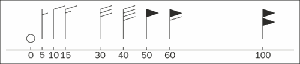
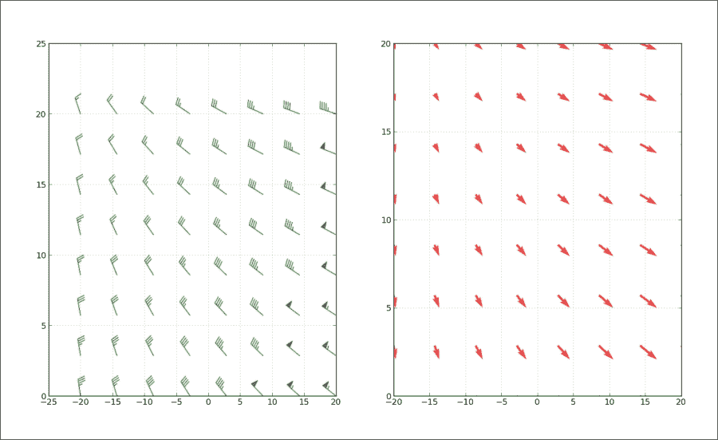
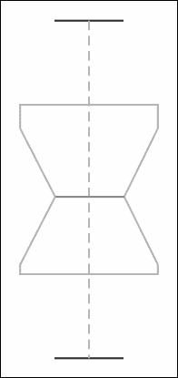
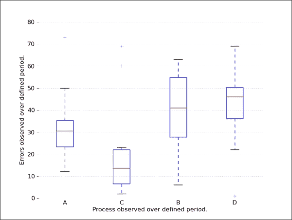
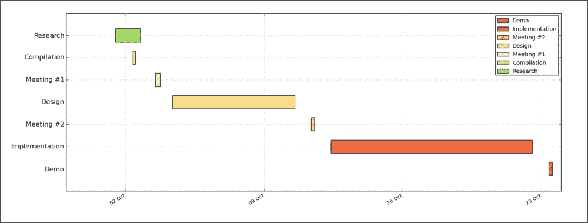
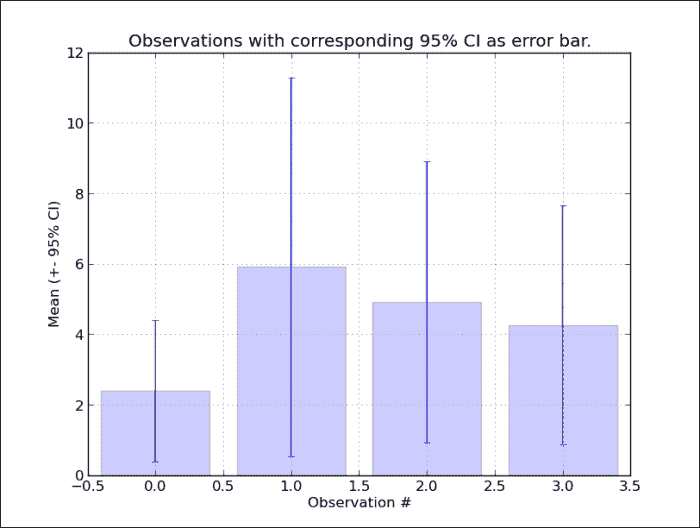
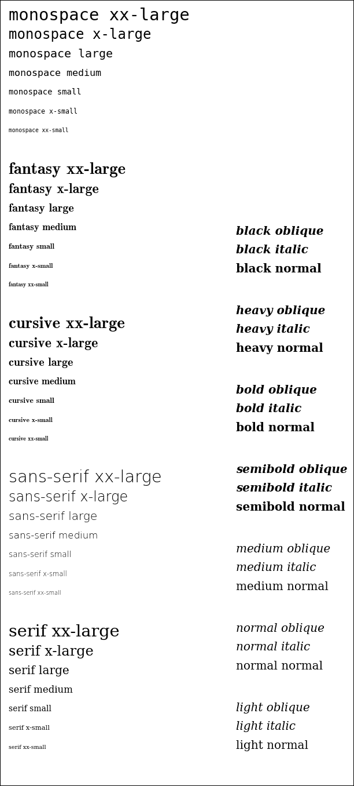
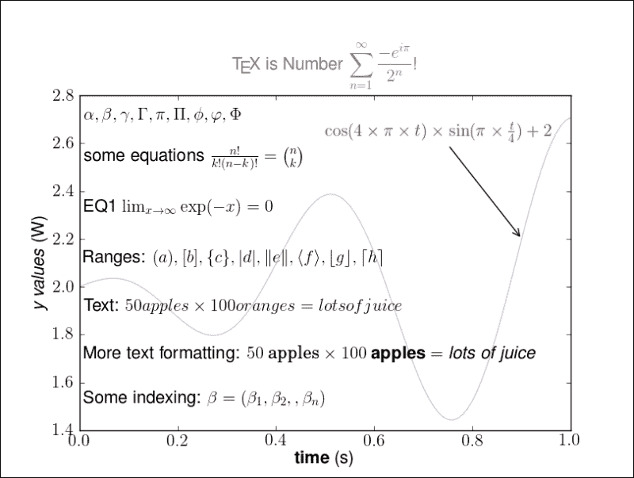
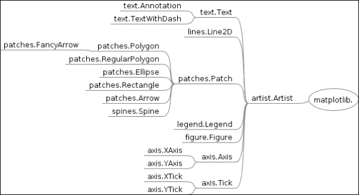
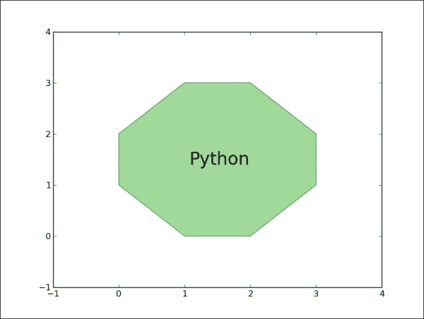

# 八、关于 matplotlib 绘图的更多信息

在本章中，我们将介绍:

*   画倒刺
*   制作方块和触须图
*   制作甘特图
*   制作误差线
*   利用文本和字体属性
*   用 LaTeX 渲染文本
*   理解 pyplot 和 OO API 的区别

# 简介

在本章中，我们将探索 matplotlib 包中一些不常用的特性。其中一些例子扩展了 matplotlib 最初的目标，但是它们展示了只要有一点创造力就可以完成的事情，并且证明了 matplotlib 是全功能的和通用的。

# 画倒刺

倒钩是风速和风向的表示，主要是气象科学家部署的。理论上，它们可以用来可视化任何类型的二维矢量。它们类似于箭头(颤动)，但不同之处在于箭头用箭头的长度来表示向量的大小，而倒钩通过使用线或三角形作为大小的增量来给出关于向量大小的更多信息。

我们将解释什么是倒钩，如何阅读它们，以及如何使用 Python 和 matplotlib 可视化它们。这里有一组典型的倒钩:



在上图中，三角形，也称为标志，代表最大增量。实线或倒钩代表较小的增量；半行是最小的增量。

对于半直线、直线和三角形，增量分别为 5、10 和 65。至少对气象学家来说，这里的数值代表了以海里/小时(节)为单位的风速。

我们从左到右排列倒刺，以表示以下数值:0、5、10、15、30、40、50、60 和 100 节。这里的方向对于每个倒钩都是相同的，并且是从北到南，因为东西方向的速度分量对于每个倒钩都是 0。

## 做好准备

可以从`matplotlib.pyplot.barbs`使用 matplotlib 函数创建倒刺。

倒钩函数接受各种参数，但是主要的用例是我们指定 X 和 Y 坐标，表示观测数据点的位置。第二对参数——U，V——表示矢量在南北和东西方向的大小，单位为节。

其他有用的参数是枢轴、大小和各种颜色参数。

透视参数(`pivot`)表示网格点上表示的箭头部分。当箭头围绕这个点旋转时，我们得到一个枢轴参数。箭头可以围绕顶端或中间旋转，这是透视参数的有效值。

因为倒刺由几个部分组成，我们可以设置这些部分的颜色。因此，我们可以设置一些与颜色相关的参数:

*   `barbcolor`:这定义了倒钩所有部分的颜色，除了旗帜
*   `flagcolor`这定义了倒钩上任何旗帜的颜色
*   `facecolor`:如果没有指定前面的颜色参数(或者从`rcParams`读取默认值)，则使用该参数

如果指定了任何前面的颜色相关参数，参数`facecolor`将被覆盖。参数`facecolor`是用于多边形着色的参数。

尺寸参数(`sizes`)指定特征与倒钩长度的比例。这是系数的集合，可以通过使用以下任意或所有键来指定:

*   `spacing`:这定义了标志/倒钩的特征之间的空间
*   `height`:这定义了从轴到旗帜或倒钩顶部的距离
*   `width`:这定义了旗帜的宽度
*   `emptybarb`:这定义了用于低量值的圆半径

## 怎么做...

让我们通过执行以下步骤来演示如何使用倒钩函数:

1.  生成坐标网格来模拟观测。
2.  模拟风速的观测值。
3.  绘制倒钩图。
4.  绘图抖动，以展示不同的外观。

以下代码将生成下图:

```py
import matplotlib.pyplot as plt 
import numpy as np 

x = np.linspace(-20, 20, 8) 
y = np.linspace(  0, 20, 8) 

# make 2D coordinates 
X, Y = np.meshgrid(x, y) 

U, V = X+25, Y-35 

# plot the barbs 
plt.subplot(1,2,1) 
plt.barbs(X, Y, U, V, flagcolor='green', alpha=0.75) 
plt.grid(True, color='gray') 

# compare that with quiver / arrows 
plt.subplot(1,2,2) 
plt.quiver(X, Y, U, V, facecolor='red', alpha=0.75) 

# misc settings 
plt.grid(True, color='grey') 
plt.show() 
```

上面的代码呈现了两个子场景，如下图所示:



## 它是如何工作的...

为了说明相同的数据如何带来不同的信息，我们使用 matplotlib 中的倒钩和颤动图来可视化模拟的观测风数据。

首先，我们使用 NumPy 为 x 和 y 数组生成变量样本。然后，我们使用 NumPy 的`meshgrid()`函数创建一个 2D 坐标网格，在该网格中，我们的观测数据在特定坐标下被采样。最后，U 和 V 是 NS(南北)和 EW(东西)方向的风速值，单位为节(海里/小时)。为了配方的目的，我们从已经可用的 X 和 Y 矩阵中调整了一些值。

然后我们将图分成两个子图，在最左边的图中绘制倒钩，在最右边的图中绘制箭头补丁。我们稍微调整了两个子图的颜色和透明度，并在两个子图上打开了网格。

## 还有更多...

在北半球，这一切都很好，那里的风以逆时针方向旋转，羽毛(三角形、倒刺的实线和半线)指向低压方向。在南半球，这是颠倒的，所以我们的风倒刺图不会正确地表示我们正在可视化的数据。

我们必须颠倒羽毛的这个方向。幸运的是，倒钩函数有参数`flip_barb`。当序列中的每个项目为每个倒钩指定翻转决策时，该参数可以是单个布尔值(`True`或`False`)或一系列布尔值，如其他数据数组的形状。

# 制作一个盒子和一个触须图

是否希望可视化一系列数据测量(或观察)以在一个图中显示数据系列的几个属性(如中值、数据的分布和数据的分布)？你想通过一种可以直观比较几个相似数据系列的方式来做到这一点吗？你会如何想象它们？欢迎来到方块触须绘图！如果你和习惯于信息密度的人交谈，这可能是比较分布的最好的图表类型。

框须图的使用示例范围从比较学校之间的考试成绩到比较变更(优化)前后的过程参数。

## 做好准备

方块图和触须图的要素是什么？正如我们在下图中看到的，我们有几个重要的元素在方块-触须图中携带信息。第一个组件是一个框，其中包含从下四分位数到上四分位数的四分位数区间信息。数据的中值由方框中的一条线表示。



络腮胡子从数据的第一个四分位数(25 百分位)到最后一个四分位数(75 百分位)从两边的方框中延伸出来。换句话说，晶须从四分位数范围的底部延伸 1.5 倍。在正态分布的情况下，晶须将覆盖总数据范围的 99.3%。

如果有超出胡须范围的值，它们将显示为传单。否则，胡须将覆盖数据的总范围。

可选地，框也可以携带关于中位数周围的置信区间的信息。这是由盒子上的一个缺口来表示的。该信息可用于指示两个系列中的数据是否具有相似的分布。然而，这并不严格，只是一个可以目视检查的指示。

## 怎么做...

在下面的食谱中，我们将学习如何使用 matplotlib 创建一个方块和触须图。我们将执行以下步骤:

1.  对一些比较过程数据进行采样，其中单个整数表示在运行过程的观察期间出现的错误。
2.  将`PROCESSES`字典中的数据读入`DATA`。
3.  将`PROCESSES`字典中的标签读入`LABELS`。
4.  使用`matplotlib.pyplot.boxplot`渲染方块触须图。
5.  从图中删除一些图表垃圾。
6.  添加轴标签。
7.  显示图形。

下面的代码实现了这些步骤:

```py
import matplotlib.pyplot as plt 
# define data 
PROCESSES = { 
    "A": [12, 15, 23, 24, 30, 31, 33, 36, 50, 73], 
    "B": [6, 22, 26, 33, 35, 47, 54, 55, 62, 63], 
    "C": [2, 3, 6, 8, 13, 14, 19, 23, 60, 69], 
    "D": [1, 22, 36, 37, 45, 47, 48, 51, 52, 69], 
    } 

DATA = PROCESSES.values() 
LABELS = PROCESSES.keys() 

plt.boxplot(DATA, notch=False, widths=0.3) 

# set ticklabel to process name 
plt.gca().xaxis.set_ticklabels(LABELS) 

# some clean up(removing chartjunk) 
# turn the spine off
for spine in plt.gca().spines.values(): 
    spine.set_visible(False) 

# turn all ticks for x-axis off 
plt.gca().xaxis.set_ticks_position('none')
# leave left ticks for y-axis on
plt.gca().yaxis.set_ticks_position('left')

# set axes labels 
plt.ylabel("Errors observed over defined period.") 
plt.xlabel("Process observed over defined period.") 

plt.show() 
```

代码前面的生成下图:



## 它是如何工作的...

通过首先计算`DATA`中给定数据的四分位数来绘制方块和触须图。

这些四分位数值用于计算绘制方框和须的线条。

我们对绘图进行了调整，使其在视觉上更加赏心悦目，不包含任何不必要的线条(指“图表垃圾”等多余的线条，如*爱德华·r·图菲特*的名著《定量信息的视觉展示》*中所述)。这些线没有携带信息，只是给观看者大脑中的心智模型施加了更大的压力，要求他们在发现真正有价值的信息之前解码所有的线。*

# 制作甘特图

一种非常广泛使用的基于时间的数据可视化形式是**甘特图**。它以 1910 年代发明它的机械工程师亨利·甘特·T4 的名字命名，几乎专门用于在项目管理中可视化工作分解结构。这个图表因其描述性的价值而受到管理者的喜爱，但却没有受到员工的喜爱，尤其是在项目截止日期临近的时候。

因为它非常普遍，几乎每个人都可以理解和阅读它，即使它超载了额外的(相关和不相关的)信息。

基本甘特图在 x 轴上有一个时间序列，在 y 轴上有一组表示任务或子任务的标签。任务持续时间通常被可视化为从给定任务的开始时间到结束时间的直线或条形图。

如果存在子任务，则一个或多个子任务有一个父任务，在这种情况下，任务的总时间是从子任务中聚合出来的，这样就考虑到了重叠和间隔时间。这对于执行关键路径分析非常有用。

关键路径分析是一种数学分析，它计算包含所有所需任务的路径，考虑任务的相互依赖性，以便可以计算项目的总开始到完成时间。这是项目管理领域的一个非常重要的工具，可以普遍应用于任何类型的项目进行调度和资源规划。

因此，在本食谱中，我们将介绍使用 Python 创建甘特图。

## 做好准备

有许多成熟的软件应用和服务可以让您制作非常灵活和复杂的甘特图。我们将尝试演示如何在纯 Python 中做到这一点，不依赖于外部应用，但实现整洁的外观和信息丰富的甘特图。

示例中显示的甘特图不支持嵌套任务，但对于简单的工作分解结构就足够了。

## 怎么做...

下面的代码示例将允许我们演示 Python 如何与 matplotlib 一起使用来呈现甘特图。我们将执行以下步骤:

1.  加载包含一组任务的`TEST_DATA`，并用`TEST_DATA`实例化甘特图类。
2.  每个任务都包含一个标签以及开始和结束时间。
3.  通过在轴上绘制水平条来处理所有任务。
4.  为我们渲染的数据设置 x 轴和 y 轴的格式。
5.  拧紧布局。
6.  显示甘特图。

以下是示例代码:

```py
from datetime import datetime
import sys

import numpy as np
import matplotlib.pyplot as plt
import matplotlib.font_manager as font_manager
import matplotlib.dates as mdates

import logging

class Gantt(object):
    '''
    Simple Gantt renderer.
    Uses *matplotlib* rendering capabilities.
    '''

    # Red Yellow Green diverging colormap
    # from http://colorbrewer2.org/
    RdYlGr = ['#d73027', '#f46d43', '#fdae61',
              '#fee08b', '#ffffbf', '#d9ef8b',
              '#a6d96a', '#66bd63', '#1a9850']

    POS_START = 1.0
    POS_STEP = 0.5

    def __init__(self, tasks):
        self._fig = plt.figure()
        self._ax = self._fig.add_axes([0.1, 0.1, .75, .5])

        self.tasks = tasks[::-1]

    def _format_date(self, date_string):
        '''
        Formats string representation of *date_string* into *matplotlib.dates*
        instance.
        '''
        try:
            date = datetime.strptime(date_string, '%Y-%m-%d %H:%M:%S')
        except ValueError as err:
            logging.error("String '{0}' can not be converted to datetime object: {1}"
                  .format(date_string, err))
            sys.exit(-1)
        mpl_date = mdates.date2num(date)
        return mpl_date

    def _plot_bars(self):
        '''
        Processes each task and adds *barh* to the current *self._ax* (*axes*).
        '''
        i = 0
        for task in self.tasks:
            start = self._format_date(task['start'])
            end = self._format_date(task['end'])
            bottom = (i * Gantt.POS_STEP) + Gantt.POS_START
            width = end - start
            self._ax.barh(bottom, width, left=start, height=0.3,
                          align='center', label=task['label'],
                          color = Gantt.RdYlGr[i])
            i += 1

    def _configure_yaxis(self):
        '''y axis'''
        task_labels = [t['label'] for t in self.tasks]
        pos = self._positions(len(task_labels))
        ylocs = self._ax.set_yticks(pos)
        ylabels = self._ax.set_yticklabels(task_labels)
        plt.setp(ylabels, size='medium')

    def _configure_xaxis(self):
        ''''x axis'''
        # make x axis date axis
        self._ax.xaxis_date()

        # format date to ticks on every 7 days
        rule = mdates.rrulewrapper(mdates.DAILY, interval=7)
        loc = mdates.RRuleLocator(rule)
        formatter = mdates.DateFormatter("%d %b")

        self._ax.xaxis.set_major_locator(loc)
        self._ax.xaxis.set_major_formatter(formatter)
        xlabels = self._ax.get_xticklabels()
        plt.setp(xlabels, rotation=30, fontsize=9)

    def _configure_figure(self):
        self._configure_xaxis()
        self._configure_yaxis()

        self._ax.grid(True, color='gray')
        self._set_legend()
        self._fig.autofmt_xdate()

    def _set_legend(self):
        '''
        Tweak font to be small and place *legend*
        in the upper right corner of the figure
        '''
        font = font_manager.FontProperties(size='small')
        self._ax.legend(loc='upper right', prop=font)

    def _positions(self, count):
        '''
        For given *count* number of positions, get array for the positions.
        '''
        end = count * Gantt.POS_STEP + Gantt.POS_START
        pos = np.arange(Gantt.POS_START, end, Gantt.POS_STEP)
        return pos
```

下面的代码定义了驱动甘特图生成的主要功能。在这个函数中，我们将数据加载到一个实例中，相应地绘制条形图，为时间轴(x 轴)设置日期格式化程序，并为 y 轴(项目的任务)设置值。

```py
    def show(self):
        self._plot_bars()
        self._configure_figure()
        plt.show()

if __name__ == '__main__':
    TEST_DATA = (
                 { 'label': 'Research',       'start':'2013-10-01 12:00:00', 'end': '2013-10-02 18:00:00'},  # @IgnorePep8
                 { 'label': 'Compilation',    'start':'2013-10-02 09:00:00', 'end': '2013-10-02 12:00:00'},  # @IgnorePep8
                 { 'label': 'Meeting #1',     'start':'2013-10-03 12:00:00', 'end': '2013-10-03 18:00:00'},  # @IgnorePep8
                 { 'label': 'Design',         'start':'2013-10-04 09:00:00', 'end': '2013-10-10 13:00:00'},  # @IgnorePep8
                 { 'label': 'Meeting #2',     'start':'2013-10-11 09:00:00', 'end': '2013-10-11 13:00:00'},  # @IgnorePep8
                 { 'label': 'Implementation', 'start':'2013-10-12 09:00:00', 'end': '2013-10-22 13:00:00'},  # @IgnorePep8
                 { 'label': 'Demo',           'start':'2013-10-23 09:00:00', 'end': '2013-10-23 13:00:00'},  # @IgnorePep8
                )

    gantt = Gantt(TEST_DATA)
    gantt.show()
```

这个代码将呈现一个简单、整洁的甘特图，如下图所示:



## 它是如何工作的...

在检查我们是否处于`"__main__"`的条件之后，我们可以从底部开始读取前面的代码。

在我们实例化赋予它`TEST_DATA`的甘特图类之后，我们设置实例的必要字段。我们将`TASK_DATA`保存在`self.tasks`字段中，并创建我们的图形和轴来保存我们将来创建的图表。

然后我们调用实例上的`show()`，引导我们完成渲染甘特图所需的步骤:

```py
    def show(self):
        self._plot_bars()
        self._configure_figure()
        plt.show()
```

绘制条形图需要一次迭代，我们将关于每个任务的名称和持续时间的数据应用到`matplotlib.pyplot.barh`函数，并将其添加到`self._ax`处的坐标轴。我们通过给每个任务一个不同的(递增的)底部参数值，把它放在一个单独的通道中。

此外，为了便于将任务映射到它们的名称，我们循环使用我们使用`colorbrewer2.org`工具生成的不同颜色的地图。

下一步是配置图形，这意味着我们在 x 轴上设置格式日期，在 y 轴上设置 tickers 的位置和标签，以匹配`matplotlib.pyplot.barh`绘制的任务。

我们对`grid`和`legend`进行最后的调整。

最后，我们调用`plt.show()`来显示图形。

# 制作误差线

误差线有助于显示图中数据的离散程度。作为可视化的一种形式，它们相对简单；然而，它们也有点问题，因为显示为错误的内容在不同的科学和出版物中有所不同。这并没有降低误差线的有用性，它只是强加了一种需要，那就是要始终保持谨慎，并明确说明误差线的性质。

## 做好准备

为了能够在原始观测数据中绘制误差线，我们需要计算平均值和要显示的误差。

我们计算的误差代表 95%的置信区间，即我们从观察中得到的平均值是稳定的，这意味着我们的观察是对整个人口的良好估计。

matplotlib 通过`matplotlib.pyplot.errorbar function`支持这些类型的绘图。

它提供了几个围绕误差线的功能。它们可以是垂直的(`yerr`)或水平的(`xerr`)，也可以是对称的或不对称的。

## 怎么做...

在下面的代码中，我们将:

1.  使用由四组观察值组成的样本数据。
2.  对于每组观测值，计算平均值。
3.  对于每组观察，计算 95%的置信区间。
4.  用垂直对称误差线渲染条。

这是代码:

```py
import matplotlib.pyplot as plt
import numpy as np
import scipy.stats as sc

TEST_DATA = np.array([[1,2,3,2,1,2,3,4,2,3,2,1,2,3,4,4,3,2,3,2,3,2,1],
                      [5,6,5,4,5,6,7,7,6,7,7,2,8,7,6,5,5,6,7,7,7,6,5],
                      [9,8,7,8,8,7,4,6,6,5,4,3,2,2,2,3,3,4,5,5,5,6,1],
                      [3,2,3,2,2,2,2,3,3,3,3,4,4,4,4,5,6,6,7,8,9,8,5],
                      ])

# find mean for each of our observations
y = np.mean(TEST_DATA, axis=1, dtype=np.float64)
# and the 95% confidence interval
ci95 = np.abs(y - 1.96 * sc.sem(TEST_DATA, axis=1))

# each set is one try
tries = np.arange(0, len(y), 1.0)

# tweak grid and setup labels, limits
plt.grid(True, alpha=0.5)
plt.gca().set_xlabel('Observation #')
plt.gca().set_ylabel('Mean (+- 95% CI)')
plt.title("Observations with corresponding 95% CI as error bar.")
plt.bar(tries, y, align='center', alpha=0.2)
plt.errorbar(tries, y, yerr=ci95, fmt=None)

plt.show()
```

前面的代码将绘制一个带有误差线的图，误差线显示 95%的置信区间为沿 y 轴延伸的须状。记住，胡须越宽，观察到的平均值为真的概率就越小。下图是之前代码的输出:



## 它是如何工作的...

为了避免迭代每组观测值，我们使用 NumPy 的矢量化方法来计算平均值和标准误差，用于绘制和计算误差值。

使用用 C 语言编写的 NumPy 的矢量化实现(从 Python 中调用)可以让我们将计算速度提高几个数量级。

对于少数数据点来说，这并不十分重要，但对于数百万数据点来说，它可以成就或破坏我们创建响应应用的努力。

另外，您可能注意到我们在`np.mean`函数调用中明确指定了`dtype=np.float 64`。根据官方 NumPy 文档参考([http://docs . scipy . org/doc/NumPy/reference/generated/NumPy . mean . html](http://docs.scipy.org/doc/numpy/reference/generated/numpy.mean.html))，`np.mean`单精度使用可能不准确；最好用`np.float32`计算，或者如果性能不是问题，用`np.float 64`。

## 还有更多...

误差线显示的内容一直是个问题。有人建议使用 *SD* 、 *2SD* 、 *SE* 或 *95%CI* 。我们必须了解所有这些价值之间的区别以及它们的用途，以便能够对何时使用什么进行推理。

标准差告诉我们平均值周围的单个数据点的分布。如果我们假设正态分布，那么我们知道 *68.2% (~2/3)* 的数据值将落在 *SD* 之间， *95.4%* 的数据值将落在 *2*SD* 之间。

标准误差按 *SD* 除以 *N* ( *SD/√N* )的平方根计算，其中 *N* 为数据点数。标准误差(SE)告诉我们平均值的可变性，如果我们能够不止一次地执行相同的采样(就像执行相同的研究数百次)。

置信区间由标准差计算，类似于数值范围由标准差计算。要计算 95%的置信区间，我们必须在平均值上加/减 *1.96 * SE* 或使用适当的符号: *95%置信区间= M (1.96 * SE)* 。置信区间越宽，我们就越不确定自己是对的。

我们看到，为了确保我们的估计是正确的，并且我们正在向我们的读者给出它的证明，我们应该显示置信区间，而置信区间又带有标准误差；这一点，如果小，证明我们的手段是稳定的。

# 利用文本和字体属性

我们已经学会了如何通过添加传说来标注绘图，但是有时候我们想要更多的文字。这个食谱将解释和演示 matplotlib 中文本操作的更多特性，为更高级的排版需求提供一个强大的工具包。

我们不会在这个食谱中涉及 LaTeX 支持，因为在本章中有一个名为*的食谱，用 LaTeX* 渲染文本。

## 做好准备

我们首先列出 matplotlib 提供的最有用的函数集。大多数功能都可以通过`pyplot`模块的界面获得，但是我们将它们的原始功能映射到这里，以便在特定的文本功能没有包含在本食谱中的情况下，您可以进行更多的探索。

matplotlib OO API 中的基本文本操作及其映射如下表所示:

<colgroup><col style="text-align: left"> <col style="text-align: left"> <col style="text-align: left"></colgroup> 
| 

matplotlib.pyplot

 | 

Matplotlib API

 | 

描述

 |
| --- | --- | --- |
| `text` | `matplotlib.axes.Axes.text` | 在(x，y)指定的位置向轴添加文本。参数`fontdict`允许我们覆盖通用字体属性，或者我们可以使用`kwargs`覆盖特定属性。 |
| `xlabel` | `matplotlib.axes.Axes.set_xlabel` | 设置 x 轴的标签。根据`labelpad`指定标签和 x 轴之间的间距。 |
| `ylabel` | `matplotlib.axes.Axes.set_ylabel` | 类似于`xlabel`，但用于 y 轴。 |
| `title` | `matplotlib.axes.Axes.set_title` | 设置轴的标题。接受所有常用的文本属性，如`fontdict`和`kwargs`。 |
| `suptitle` | `matplotlib.figure.Figure.suptitle` | 向图形添加居中的标题。通过`kwargs`接受所有常用的文本属性。使用图形坐标。 |
| `figtext` | `matplotlib.figure.Figure.text` | 将文本放在图上的任何位置。使用图形的归一化坐标，使用`x,y`定义位置。使用`fontdict`覆盖字体属性，但也支持`kwargs`覆盖任何与文本相关的属性。 |

在窗口或数据坐标内存储和绘制文本的基类是`matplotlib.text.Text`类。它支持文本对象位置的定义以及我们可以定义的属性范围，来调整我们的字符串将如何出现在图形或窗口上。

`matplotlib.text.Text`实例支持的字体属性有:

<colgroup><col style="text-align: left"> <col style="text-align: left"> <col style="text-align: left"></colgroup> 
| 

财产

 | 

价值观念

 | 

描述

 |
| --- | --- | --- |
| `family` | `'serif', 'sans-serif', 'cursive', 'fantasy', 'monospace'` | 指定字体名称或字体系列。如果这是一个列表，那么它是按优先级排序的，所以将使用第一个匹配的名称。 |
| `size` 或`fontsize` | `12, 10,... or 'xx-small', 'x-small', 'small', 'medium', 'large', 'x-large', 'xx-large'` | 以相对点或绝对点指定大小，或将相对大小指定为大小字符串。 |
| `style` 或`fontstyle` | `'normal', 'italic', 'oblique'` | 将字体样式指定为字符串。 |
| `variant` | `'normal', 'small-caps'` | 指定字体变体。 |
| `weight` 或`fontweigh` `t` | `0-1000 or 'ultralight', 'light', 'normal', 'regular', 'book', 'medium', 'roman', 'semibold', 'demibold', 'demi', 'bold', 'heavy', 'extra bold', 'black'` | 指定字体粗细或使用特定的粗细字符串。字体粗细定义为字符轮廓相对于其高度的粗细。 |
| `stretch` 或`fontstretch` | `0-1000 or 'ultra-condensed', 'extra-condensed', 'condensed', 'semi-condensed', 'normal', 'semi-expanded', 'expanded', 'extra-expanded', 'ultra-expanded'` | 指定字体的长度。拉伸被定义为水平凝结或膨胀。此属性当前未实现。 |
| `fontproperties` |   | 默认为`matplotlib.font_manager.FontProperties`实例。此类存储和管理字体属性，如 http://www.w3.org/TR/1998/REC-CSS2-19980512/W3C CSS Level 1 规范中所述。 |

我们还可以指定将包含文本的背景框，并且可以在颜色、边框和透明度方面进一步指定。

基本的文本颜色是从`rcParams['text.color']`读取的，当然如果当前实例上没有指定的话。

指定的文本也可以根据视觉需求进行对齐。有以下对齐属性:

*   `horizontalalignment`或`ha`:此允许文本水平对齐`center`、`left`和`right`。
*   `verticalalignment`或`va`:允许的值有`center`、`top`、`bottom`和`baseline`。
*   `multialignment`:这个允许跨多行的文本串对齐。允许值为:`left`、`right`和`center`。

## 怎么做...

到目前为止一切都很好，但是我们很难想象我们可以创建的字体中的所有这些变化。这将说明我们能做什么。在接下来的代码中，我们将执行以下步骤:

1.  列出所有我们想要改变字体的可能属性。
2.  迭代第一组变化:字体系列和大小。
3.  迭代第二组变量:重量和样式。
4.  为两个迭代渲染文本样本，并将变体组合作为文本打印在绘图上。
5.  从图形中移除轴，因为它们没有任何用途。

以下是代码:

```py
import matplotlib.pyplot as plt
from matplotlib.font_manager import FontProperties

# properties:
families = ['serif', 'sans-serif', 'cursive', 'fantasy', 'monospace']
sizes  = ['xx-small', 'x-small', 'small', 'medium', 'large',
         'x-large', 'xx-large']
styles  = ['normal', 'italic', 'oblique']
weights = ['light', 'normal', 'medium', 'semibold', 'bold', 'heavy', 'black']
variants = ['normal', 'small-caps']

fig = plt.figure(figsize=(9,17))
ax = fig.add_subplot(111)
ax.set_xlim(0,9)
ax.set_ylim(0,17)

   # VAR: FAMILY, SIZE
y = 0
size = sizes[0]
style = styles[0]
weight = weights[0]
variant = variants[0]

for family in families:
    x = 0
    y = y + .5
    for size in sizes:
        y = y + .4
        sample = family + " " + size
        ax.text(x, y, sample, family=family, size=size,
                style=style, weight=weight, variant=variant)
# VAR: STYLE, WEIGHT
y = 0
family = families[0] 
size = sizes[4]
variant = variants[0]

for weight in weights:
    x = 5
    y = y + .5
    for style in styles:
        y = y + .4
        sample = weight + " " + style
        ax.text(x, y, sample, family=family, size=size,
                style=style, weight=weight, variant=variant)

ax.set_axis_off()
plt.show()
```

在代码之前的将产生以下截图:



## 它是如何工作的...

代码非常简单，因为我们只需在打印其值的属性元组上迭代两次。

这里唯一采用的技巧是文本在图形画布上的定位，因为这允许我们有很好的文本样本布局，我们可以很容易地进行比较。

请记住，matplotlib 将使用的默认字体取决于您正在运行的操作系统，因此前面的截图可能看起来略有不同。这个截图是使用标准的 Ubuntu 13.04 安装字体渲染的。

# 用 LaTeX 渲染文本

如果我们想绘制更多的科学图形，并解释数学，因为它应该使用科学符号和复杂的方程在数字上，我们需要最好的支持。

虽然 matplotlib 支持数学文本渲染，但最好的支持来自 LaTeX 社区，这在使用了几十年的任务中得到了证明。

LaTeX 是生产科学和技术文件的高质量排版系统，是科学排版或出版的*事实上的*标准。它是一个免费软件，可在当今大多数桌面平台上作为预打包二进制安装使用；因此，很容易安装。

LaTeX 的基本语法类似于标记语言；因此，为了产生令人满意的内容，人们在写作时会更多地关注结构，而不是外观和风格。例如:

```py
\documentclass{article}
\title{This here is a title of my document}
\author{Peter J. S. Smith}
\date{September 2013}
\begin{document}
   \maketitle
   Hello world, from LaTeX!
\end{document}
```

我们看到这与通常的文字处理器有什么不同，在文字处理器中，您有所见即所得的编辑器环境，并且样式已经应用于您的文本。有时候这很好，但是对于科学出版物来说，风格是次要的考虑因素；主要重点是拥有正确、正确和有效的内容。这里，我们所说的内容也指数学符号(通常很多)，包括图表。

除此之外，还有许多功能，如自动生成书目和索引，这对大中型出版物非常重要。这些是 LaTeX 系统的主要焦点。

因为这不是一本关于 LaTeX 的书，我们就在这里简单介绍一下。更多的文档可以在位于[http://latex-project.org/](http://latex-project.org/)的项目网站上找到。

## 做好准备

在我们开始演示 matplotlib 对使用 LaTeX 呈现文本的支持之前，我们需要在系统上安装以下软件包:

*   **乳胶系统**:最常见的是特克斯活预包装配送
*   **DVI 到 PNG 转换器**:通过产生抗锯齿的屏幕分辨率图像，使 DVI 文件中的 PNG 图形成为从 TeX 获得的
*   **幽灵脚本**:这个是必须的，除非已经由 TeX Live 发行版安装

不同的操作系统有不同的 **LaTeX** 环境预打包系统。对于基于 Linux 的系统， **TeX Live** 是一个完整的 TeX 系统。对于 Mac OS，推荐的环境是 **MacTeX** 发行版；对于 Windows 环境来说， **proTeX** 系统将会安装所有的 TeX 支持，包括 LaTeX。

无论您安装哪个软件包，请确保它附带了字体库和程序，用于排版、预览和打印许多不同语言的 TeX 文档。

我们将使用 Ubuntu 的`texlive`和`dvipng`软件包安装我们的 Linux 软件包。我们可以使用以下命令来安装它:

```py
$  sudo apt-get install texlive dvipng

```

下一步是通过将`text.usetex`设置为`True`来告诉我们的 matplotlib 使用 LaTeX。我们可以在基于 Unix 系统的主目录(T3)中的自定义`.matplotlibrc`中，或者通过`rcParams['text']`在`C:\Documents and Settings\<user>\.matplotlibrc`中，或者通过使用以下代码来实现:

```py
matplotlib.pyplot.rc('text', usetex=True)
```

代码的开始将告诉 matplotlib 返回到 LaTeX 进行所有文本渲染。在我们添加任何图形和轴之前，这样做很重要。

并非所有后端都支持 LaTeX 渲染。只有 Agg、PS 和 PDF 后端支持通过 LaTeX 进行文本渲染。

## 怎么做...

我们在这里要做的是演示 LaTeX 的基本使用属性。我们将执行以下步骤:

1.  生成一些样本数据。
2.  设置 matplotlib 使用 LaTeX 进行绘图会话。
3.  设置要使用的字体和字体属性。
4.  写出等式语法。
5.  演示希腊符号语法的用法。
6.  画分数和分形的数学符号。
7.  写一些极限和指数表达式。
8.  写出可能的范围表达式。
9.  编写包含文本和格式化文本的表达式。
10.  在 x 和 y 标签上写一些数学表达式作为图形标题。

以下代码将执行这些步骤:

```py
import numpy as np 
import matplotlib.pyplot as plt 

# Example data 
t = np.arange(0.0, 1.0 + 0.01, 0.01) 
s = np.cos(4 * np.pi * t) * np.sin(np.pi*t/4) + 2 

plt.rc('text', usetex=True) 
plt.rc('font',**{'family':'sans-serif','sans-serif':['Helvetica'], 'size':16}) 

plt.plot(t, s, alpha=0.25) 

# first, the equation for 's' 
# note the usage of Python's raw strings
plt.annotate(r'$\cos(4 \times \pi \times {t}) \times \sin(\pi \times \frac {t} 4) + 2$', xy=(.9,2.2), xytext=(.5, 2.6), color='red', arrowprops={'arrowstyle':'->'}) 

# some math alphabet 
plt.text(.01, 2.7, r'$\alpha, \beta, \gamma, \Gamma, \pi, \Pi, \phi, \varphi, \Phi$') 
# some equation 
plt.text(.01, 2.5, r'some equations $\frac{n!}{k!(n-k)!} = {n \choose k}$') 
# more equations 
plt.text(.01, 2.3, r'EQ1 $\lim_{x \to \infty} \exp(-x) = 0$') 
# some ranges... 
plt.text(.01, 2.1, r'Ranges: $( a ), [ b ], \{ c \}, | d |, \| e \|, \langle f \rangle, \lfloor g \rfloor, \lceil h \rceil$') 
# you can multiply apples and oranges 
plt.text(.01, 1.9, r'Text: $50 apples \times 100 oranges = lots of juice$') 
plt.text(.01, 1.7, r'More text formatting: $50 \textrm{ apples} \times 100 \textbf{ apples} = \textit{lots of juice}$') 
plt.text(.01, 1.5, r'Some indexing: $\beta = (\beta_1,\beta_2,\dotsc,\beta_n)$') 
# we can also write on labels 
plt.xlabel(r'\textbf{time} (s)') 
plt.ylabel(r'\textit{y values} (W)') 
# and write titles using LaTeX 
plt.title(r"\TeX\ is Number " 
          r"$\displaystyle\sum_{n=1}^\infty\frac{-e^{i\pi}}{2^n}$!", 
          fontsize=16, color='gray') 
# Make room for the ridiculously large title. 
plt.subplots_adjust(top=0.8) 

plt.savefig('tex_demo') 
plt.show()
```

前面的代码将呈现以下文本饱和的图，该图演示了 LaTeX 呈现:



## 它是如何工作的...

设置渲染引擎和字体属性后，基本上使用标准 matplotlib 调用进行文本渲染，如`matplotlib.pyplot.annotate`、`matplotlib.pyplot.text`、`matplotlib.pyplot.xlabel`、`matplotlib.pyplot.ylabel`、`matplotlib.pyplot.title`。

这里的区别是，所有的字符串都是所谓的原始字符串，这意味着 Python 不会解释它们，也不会发生字符串替换；因此，LaTeX 引擎将接收与要执行的命令完全相同的字符串。

关于 TeX 语法以及如何在 matplotlib 中使用它的更多示例，可以在 matplotlib 官方文档中找到，网址为[http://matplotlib . org/users/mathtext . html # writing-数学表达式](http://matplotlib.org/users/mathtext.html#writing-mathematical-expressions)。

请注意，这个网址不在 LaTeX 上，而是在 matplotlib 自己的集成 TeX 解析器上。这个解析器支持几乎相同的语法，甚至可以满足您的需求。

## 还有更多...

如果您在设置此环境时遇到问题，或者字体有不同的问题要么看起来不好，要么无法产生 LaTeX 渲染，请确保您已经安装了所有必需的软件包，您的`$PATH`环境变量(如果在 Windows 上)被设置为包括所有必需的二进制文件，matplotlib 被设置为使用 LaTeX 进行文本渲染。

如果遵循了所有给出的说明，结果无法复制，请参考位于[http://matplotlib.org/users/usetex.html#possible-hangups](http://matplotlib.org/users/usetex.html#possible-hangups)的 matplotlib 官方网站和位于[http://tex.stackexchange.com/](http://tex.stackexchange.com/)的 LaTeX 社区，以获得进一步的帮助。

众所周知，这种设置并不像它应该的那样精简，并且由于各种原因可能会出现一些怪癖。

# 了解 pyplot 和 OO API 的区别

本食谱将尝试解释 matplotlib 中的一些编程接口，并对 pyplot 和面向对象的 API(应用编程接口)进行比较。根据手头的任务，这将允许我们决定为什么以及何时使用这些接口中的任何一个。

## 做好准备

matplotlib 库启动时，它类似于许多开源项目——一个人遇到的问题没有合适的(免费的)解决方案，所以他写了一个。MATLAB 遇到的问题是手头任务的性能([http://www.aosabook.org/en/matplotlib.html](http://www.aosabook.org/en/matplotlib.html))，原作者已经具备了 MATLAB 和 Python 的知识，所以他开始编写 matplotlib 作为当前项目需求的解决方案。

这就是 matplotlib 有一个类似于 MATLAB 的界面的主要原因，它允许人们快速绘制数据，而不用担心背景细节，matplotlib 运行在哪个平台上，底层的渲染库是什么(是在 Linux 或 Windows 上带有 GTK、Qt、TK 或 wxWidgets 的 Linux)，还是我们在可可工具包的帮助下运行在 Mac OS 上。这些都隐藏在 matplotlib 中`matplotlib.pyplot`模块中一个漂亮的过程接口下，这是一个有状态的接口处理逻辑，用于创建图形和轴，以将它们与配置的后端连接起来。它还保存了当前图形和轴的数据结构，这些数据结构通过`plot`命令调用。

这是我们在这本书的大部分时间里使用的界面(`matplotlib.pyplot`)，因为它简单、直接，并且足以完成我们试图完成的大部分任务。matplotlib 库就是根据这一理念设计的。我们必须能够用尽可能少的命令画出图，甚至只有一个命令(例如，`plt.plot([1,2,3,4,5]); plt.show()`起作用了！).对于这些任务，我们不想被迫考虑对象、实例、方法、属性、渲染后端、图形、画布、线条和其他图形元素。

如果你从一开始就在读这本书，你可能会注意到一些类开始出现在各种例子中；例如，`FontProperties`或`AxesGrid`，我们需要的不仅仅是`matplotlib.pyplot`模块提供的。

这是一个面向对象的编程接口，它实现了所有隐藏的硬东西，比如渲染图形元素，将它们渲染到平台的图形工具包，以及处理用户输入(鼠标和击键)。没有什么能阻止我们使用 OO API，这就是我们要做的。

如果我们把 matplotlib 看作一个软件，它由三部分组成:

*   **matplotlib.pylab 界面**:这个是一组功能，用户可以像在 MATLAB 中一样创建图
*   **matplotlib API(也叫 matplotlib 前端)**:这是一套用于创建和管理图形、文字、线条、绘图等的类
*   **后端**:这些是画图司机；他们将前面的抽象表示转换成文件或显示设备

这个后端层包含抽象接口类的具体实现。有诸如`FigureCanvas`(在纸上绘图的表面)、`Renderer`(在画布上绘图的画笔)和`Event`(处理用户击键和鼠标事件的类)之类的类。

代码也是分开的。基础抽象类在`matplotlib.backend_bases`中，每个具体的实现都在一个单独的模块中。例如，GTK 3 后端位于`matplotlib.backends.backend_gkt3agg`。

在这个堆栈中，有一个`Artist`类的层次结构，大部分硬东西都在这里完成。`Artist`了解`Renderer`以及如何使用它在`FigureCanvas`上绘制图像。我们感兴趣的大多数东西(文本、线条、记号、记号标签、图像等等)都是`Artist`或者`Artist`类的子类(位于`matplotlib.artist`模块中)。

类`matplotlib.artist.Artist`包含其子类的所有共享属性:坐标变换、剪辑框、标签、用户事件处理程序和可见性。



在这个图中`Artist`是其他大部分职业的基数。从`Artist`继承的类有两个基本类别。第一类是原始艺术家，是`Line2D`、`Rectangle`、`Circle`、`Text`等可见的物体。第二类是合成艺术家，是其他`Artists`的集合，如`Axis`、`Tick`、`Axes`、`Figure`。比如`Figure`有原始艺术家`Rectangle`的背景，但也至少包含一个合成艺术家，`Axes`。

大部分的策划都发生在`Axes`级(`matplotlib.axes.Axes`)。图背景元素如记号、轴线以及背景斑块的网格和颜色包含在`Axes`中。`Axes`的另一个重要特点是，所有的辅助方法都创建其他原始艺术家，并将其添加到`Axes`实例中；例如`plot`、`hist`和`imshow`。

例如，`Axes.hist`创建许多`matplotlib.patch.Rectangle`实例，并将它们存储在`Axes.patches`集合中。

`Axes.plot`创建一个或多个`matplotlib.lines.Line2D`并将它们存储在`Axes.lines`集合中。

## 怎么做...

举例来说，我们将:

1.  实例化 matplotlib `Path`对象进行自定义绘制。
2.  构建我们对象的顶点。
3.  构造路径的命令代码来连接这些顶点。
4.  创建补丁。
5.  将其添加到`figure`的`Axes`实例中。

以下代码实现了我们的意图:

```py
import matplotlib.pyplot as plt
from matplotlib.path import Path
import matplotlib.patches as patches

# add figure and axes
fig = plt.figure()
ax = fig.add_subplot(111)

coords = [
    (1., 0.),  # start position
    (0., 1.),
    (0., 2.),  # left side
    (1., 3.),
    (2., 3.),
    (3., 2.),  # top right corner
    (3., 1.),  # right side
    (2., 0.),
    (0., 0.),  # ignored
    ]

line_cmds = [Path.MOVETO,
         Path.LINETO,
         Path.LINETO,
         Path.LINETO,
         Path.LINETO,
         Path.LINETO,
         Path.LINETO,
         Path.LINETO,
         Path.CLOSEPOLY,
         ]

# construct path
path = Path(coords, line_cmds)
# construct path patch 
patch = patches.PathPatch(path, lw=1,
                          facecolor='#A1D99B', edgecolor='#31A354')
# add it to *ax* axes
ax.add_patch(patch)

ax.text(1.1, 1.4, 'Python', fontsize=24)
ax.set_xlim(-1, 4)
ax.set_ylim(-1, 4)
plt.show()
```

在代码之前的将产生以下内容:



## 它是如何工作的...

对于这个八边形，我们使用了基础面片`matplotlib.path.Path`，它支持绘制直线和曲线的基本图元集(`moveto`和`lineto`)。这些可以用来使用贝塞尔曲线绘制简单且更高级的多边形。

首先，我们在数据坐标中指定了一组坐标，我们用一组路径命令来匹配这些坐标(或者顶点，如果你喜欢的话)。我们以此为例`matplotlib.path.Path`。然后我们用该路径构建补丁实例`matplotlib.patched.PathPatch`，这是一个通用的多曲线路径补丁。

这个补丁现在可以添加到图形的轴上(T0 集合)，我们可以渲染图形来显示多边形。

在这个例子中我们不想做的是直接用`matplotlib.figure.Figure`代替`matplotlib.pyplot.figure()`调用。原因是`pyplot.figure()`调用在后台做了很多工作，比如从`matplotlibrc`文件中读取`rc`参数(加载默认的`figsize`、`dpi`和图形颜色设置)，设置图形管理器类(`Gcf`)等等。我们可以做所有这些，但是在我们真正知道我们在做什么之前，这是创建数字的推荐方法。

作为一般的经验法则，除非我们不能通过`pyplot`界面实现某件事，否则我们不应该去接触直接类，比如`Figure`、`Axes`、`Axis`，因为后台有很多状态管理；因此，除非我们正在开发 matplotlib，否则我们应该避免为此烦恼。

## 还有更多...

如果你想要交互性和探索性，最好通过 Python 交互外壳使用 matplotlib。为此，最著名的可能是 IPython pylab 模式。这为您提供了强大且内省的外壳中的所有 matplotlib 功能，具有丰富的功能集，例如历史、内嵌绘图，如果您使用 IPython Notebook，还可以共享您的工作。

IPython Notebook 是 IPython shell 的一个基于 web 的界面，在这里可以共享作品并将其转换为 HTML 或 PDF。Matplotlib 图被嵌入和内联，因此它们也可以被保存和共享。