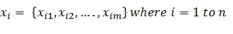
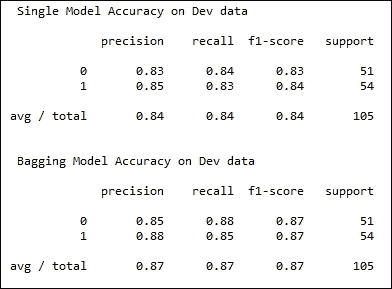

# 前言

如今，我们生活在一个万物互联的世界里，海量数据不断生成，而人类无法对所有数据进行分析并作出决策。人类的决策越来越多地被计算机做出的决策所替代，这得益于数据科学领域。数据科学深刻渗透到我们互联的世界中，市场上对那些不仅能彻底理解数据科学算法，还能编程实现这些算法的人才需求日益增长。数据科学是一个交叉学科的领域，涉及数据挖掘、机器学习、统计学等多个方面。这给各级数据科学家带来了巨大压力——无论是那些渴望成为数据科学家的人，还是目前已经从事这一领域的实践者。将这些算法视为黑箱并在决策系统中使用，会导致事与愿违的结果。在无数算法和复杂问题面前，必须深刻理解底层算法，才能为任何问题选择最合适的算法。

Python 作为一门编程语言，多年来不断发展，今天已成为数据科学家的首选语言。它不仅能够作为脚本语言快速构建原型，还具备用于完整软件开发的复杂语言结构，结合其强大的数值计算库支持，使其在数据科学家和广泛的科学编程社区中获得了极大的流行。不仅如此，Python 在 Web 开发者中也非常受欢迎，得益于如 Django 和 Flask 这样的框架。

本书经过精心编写，旨在满足不同数据科学家的需求——从初学者到有经验的数据科学家——通过精心设计的案例，涵盖了数据科学的不同方面，包括数据探索、数据分析与挖掘、机器学习和大规模机器学习。每一章都精心设计了案例，探索这些方面。书中提供了足够的数学知识，帮助读者深入理解算法的运作原理。必要时，还为好奇的读者提供了充分的参考资料。这些案例的编写方式简洁易懂，便于读者跟随与理解。

本书将数据科学的艺术与强大的 Python 编程带给读者，帮助他们掌握数据科学的核心概念。读者无需具备 Python 知识即可阅读本书。非 Python 程序员可以参考第一章，介绍 Python 的数据结构和函数式编程概念。

早期章节讲解数据科学的基础知识，后续章节则专注于高级数据科学算法。书中详细介绍了当前在行业中被领先数据科学家广泛使用的最先进的算法，包括集成方法、随机森林、带正则化的回归等。书中还详细介绍了一些在学术界非常流行、但在主流应用中尚未广泛推广的算法，如旋转森林。  

在当今市场上有很多关于数据科学的自学书籍，我们认为在涵盖数据科学算法背后的数学哲学与实现细节的正确平衡上存在空白。本书试图填补这一空白。在每个章节中，都会提供足够的数学介绍，让读者思考算法的原理；我相信读者能够在自己的应用中充分受益于这些方法。

需要注意的是，这些方法是为了向读者解释数据科学算法而编写的。它们并未在极端条件下经过严格的测试，因此未必适用于生产环境。生产级数据科学代码必须经过严格的工程化流程。  

本书既可以作为学习数据科学方法的指南，也可以作为快速参考手册。它是一本自成体系的书，旨在向没有编程背景的新读者介绍数据科学，并帮助他们成为该领域的专家。  

# 本书内容概述  

第一章，*数据科学中的 Python*，介绍了 Python 内置的数据结构和函数，这些在数据科学编程中非常实用。  

第二章，*Python 环境*，介绍了 Python 的科学编程和绘图库，包括 NumPy、matplotlib 和 scikit-learn。  

第三章，*数据分析 – 探索与处理*，涵盖了数据预处理和转换的常用方法，用于执行探索性数据分析任务，从而高效地构建数据科学算法。  

第四章，*数据分析 – 深入剖析*，介绍了降维概念，以应对数据科学中的维度灾难问题。首先介绍简单的方法，然后详细讨论了先进的最前沿降维技术。  

第五章，*数据挖掘 – 大海捞针*，讨论了无监督数据挖掘技术，从对距离方法和核方法的详细讨论开始，接着是聚类和异常值检测技术。  

第六章，*机器学习 1*，介绍了监督数据挖掘技术，包括最近邻、朴素贝叶斯和分类树。起初，我们将重点强调监督学习中的数据准备。

第七章，*机器学习 2*，介绍了回归问题，并接着讲解了包括 LASSO 和岭回归在内的正则化方法。最后，我们将讨论交叉验证技术，作为选择这些方法超参数的一种方式。

第八章，*集成方法*，介绍了包括 bagging、boosting 和梯度提升在内的各种集成技术。本章将展示如何通过构建一个集成模型或多个模型来实现一个强大的、先进的数据科学方法，而不是为给定问题构建单一模型。

第九章，*构建树*，介绍了一些基于树的算法的 bagging 方法。由于它们对噪声的鲁棒性以及对各种问题的普适性，它们在数据科学社区中非常流行。

第十章，*大规模机器学习 - 在线学习*，涵盖了大规模机器学习以及适用于处理此类大规模问题的算法。包括可以处理流数据和无法完全加载到内存中的数据的算法。

# 本书所需的工具

本书中的所有实验方法均在配备 Intel i7 处理器、运行 Windows 7 64 位操作系统的 8 GB 内存机器上进行开发和测试。

本书中的开发方法使用了 Python 2.7.5、NumPy 1.8.0、SciPy 0.13.2、Matplotlib 1.3.1、NLTK 3.0.2 和 scikit-learn 0.15.2 版本。

相同的代码也应该在 Linux 变种和 Mac 上运行，只要安装了这里提到的相应库。或者，可以创建一个包含这些库版本的 Python 虚拟环境，你可以在其中运行所有实验。

# 本书适合的人群

本书面向各类数据科学专业人士，无论是学生还是从业者，从初学者到专家。本书的不同配方满足不同读者的需求。初学者可以在前五章花些时间熟悉数据科学。专家可以参考后面的章节，了解如何使用 Python 实现高级技术。本书涵盖了适当的数学内容，并为希望理解数据科学的计算机程序员提供必要的参考资料。非 Python 背景的读者也能有效使用本书。书的第一章介绍了 Python 作为数据科学的编程语言。如果你有一些基础编程经验将更有帮助。本书大部分内容是自足的，旨在向新读者介绍数据科学，并帮助他们成为该领域的专家。

# 章节

在本书中，你会找到几个常见的标题（准备工作、如何操作、工作原理、还有更多、另见）。

为了清晰地说明如何完成一个配方，我们使用以下这些部分：

## 准备工作

本节告诉你在配方中应期待什么，并描述如何设置任何软件或配方所需的初步设置。

## 如何操作…

本节包含完成配方所需的步骤。

## 工作原理…

本节通常包括对上一节内容的详细解释。

## 还有更多…

本节包含配方的附加信息，旨在让读者更深入了解该配方。

## 另见

本节提供了配方的其他有用链接。

# 约定

在本书中，你会发现几种文本样式，用于区分不同类型的信息。以下是这些样式的一些示例及其含义说明。

文本中的代码词，如函数名，展示如下：

我们调用`get_iris_data()`函数来获取输入数据。我们使用 Scikit learn 的`train_test_split`函数来将输入数据集分成两个部分。

代码块设置如下：

```py
        # Shuffle the dataset
        shuff_index = np.random.shuffle(range(len(y)))
        x_train = x[shuff_index,:].reshape(x.shape)
        y_train = np.ravel(y[shuff_index,:])
```

公式通常以图像的形式呈现，如下所示，



通常，数学部分在每个配方的开始处引入。在一些章节中，本章大部分配方所需的常见数学知识会包含在第一个配方的引言部分。

外部网址如下所示：

[`scikit-learn.org/stable/modules/generated/sklearn.metrics.log_loss.html`](http://scikit-learn.org/stable/modules/generated/sklearn.metrics.log_loss.html)

针对第三方库中一些算法实现的具体调用细节如下所示。

“输入样本的预测类别被计算为具有最高平均预测概率的类别。如果基础估计器没有实现 predict_proba 方法，则使用投票法。”

在适用的地方，提供科学期刊和论文的参考文献，如下所示：

请参阅 Leo Breiman 的论文，获取有关 Bagging 的更多信息。

> *Leo Breiman. 1996\. Bagging predictors.Mach. Learn.24, 2 (August 1996), 123-140\. DOI=10.1023/A:1018054314350 http://dx.doi.org/10.1023/A:1018054314350*

程序输出和图表通常作为图片提供。例如：



任何命令行输入或输出如下所示：

```py
Counter({'Peter': 4, 'of': 4, 'Piper': 4, 'pickled': 4, 'picked': 4, 'peppers': 4, 'peck': 4, 'a': 2, 'A': 1, 'the': 1, 'Wheres': 1, 'If': 1})

```

在我们希望读者检查 Python shell 中的某些变量时，通常会指定如下：

```py
>>> print b_tuple[0]
1
>>> print b_tuple[-1]
c
>>> 
```

### 注意

警告或重要说明会以类似这样的框出现。

### 小贴士

提示和技巧通常以这种形式呈现。

# 读者反馈

我们始终欢迎读者的反馈。告诉我们您对本书的看法——您喜欢或不喜欢什么。读者反馈对我们非常重要，因为它帮助我们开发出您能够最大程度受益的书籍。

若要向我们发送一般反馈，请通过电子邮件发送到`<feedback@packtpub.com>`，并在邮件主题中提到本书的标题。

如果您在某个领域拥有专业知识，并且有兴趣撰写或参与书籍的编写，请参考我们的作者指南：[www.packtpub.com/authors](http://www.packtpub.com/authors)。

# 客户支持

现在，作为 Packt 书籍的骄傲拥有者，我们提供一些帮助，帮助您最大程度地从您的购买中获益。

## 下载示例代码

您可以从您的账户下载所有您购买的 Packt Publishing 书籍的示例代码文件，下载地址为[`www.packtpub.com`](http://www.packtpub.com)。如果您是在其他地方购买的本书，您可以访问[`www.packtpub.com/support`](http://www.packtpub.com/support)并注册，文件会直接通过电子邮件发送给您。

## 下载本书的彩色图片

我们还为您提供了包含本书所用屏幕截图/图表的彩色图片的 PDF 文件。彩色图片将帮助您更好地理解输出变化。您可以从[`www.packtpub.com/sites/default/files/downloads/1234OT_ColorImages.pdf`](http://www.packtpub.com/sites/default/files/downloads/1234OT_ColorImages.pdf)下载此文件。

## 勘误

虽然我们已经尽一切努力确保内容的准确性，但错误仍然可能发生。如果您在我们的书中发现错误——可能是文本错误或代码错误——我们将非常感激您向我们报告。这样，您可以帮助其他读者避免困扰，并帮助我们改进后续版本。如果您发现任何勘误，请访问[`www.packtpub.com/submit-errata`](http://www.packtpub.com/submit-errata)，选择您的书籍，点击**勘误提交表格**链接，输入勘误的详细信息。一旦您的勘误被验证，您的提交将被接受，勘误将上传到我们的网站或添加到该书名下的现有勘误列表中。

要查看之前提交的勘误信息，请访问[`www.packtpub.com/books/content/support`](https://www.packtpub.com/books/content/support)，并在搜索框中输入书名。所需的信息将显示在**勘误**部分。

## 盗版

互联网上的版权侵权问题在各类媒体中都持续存在。在 Packt，我们非常重视保护我们的版权和许可证。如果你在互联网上发现我们作品的任何非法复制品，请立即提供相关的网址或网站名称，以便我们采取措施进行处理。

如果您发现任何涉嫌盗版的内容，请通过`<copyright@packtpub.com>`联系我们，并附上盗版材料的链接。

感谢您帮助我们保护作者的权益，并支持我们为您提供有价值的内容。

## 问题

如果您对本书的任何部分有问题，可以通过`<questions@packtpub.com>`联系我们，我们将尽力解决问题。
