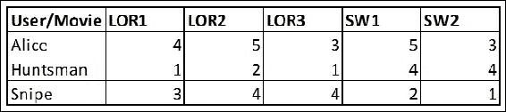

# 第一章：Python 数据科学

在本章中，我们将涵盖以下内容：

+   使用字典对象

+   操作字典中的字典

+   操作元组

+   使用集合

+   写入一个列表

+   从另一个列表创建列表 - 列表推导式

+   使用迭代器

+   生成迭代器和生成器

+   使用可迭代对象

+   将函数作为变量传递

+   在另一个函数中嵌入函数

+   将函数作为参数传递

+   返回函数

+   使用装饰器更改函数行为

+   使用 lambda 创建匿名函数

+   使用 map 函数

+   使用过滤器

+   使用 zip 和 izip

+   处理表格数据中的数组

+   预处理列

+   排序列表

+   使用键排序

+   使用 itertools

# 介绍

Python 编程语言提供了许多内建的数据结构和函数，这些对于数据科学编程非常有用。在本章中，我们将介绍一些最常用的结构和函数。在随后的章节中，你会看到这些将在不同主题的各个部分中使用。掌握这些结构和函数将有助于你快速启动程序，以便处理数据和开发算法。

虽然本章是对常用数据结构和方法的快速概览，但随着你成为熟练的 Python 用户，你将开始发现自己的方法，将这些数据结构结合使用，以满足你的需求。

每个数据结构都有其用途，虽然不同的情况可能需要同时使用两个或多个数据结构来满足需求。你将在本书的一些示例中看到这一点。

# 使用字典对象

在 Python 中，容器是可以容纳任意数量对象的对象。它们提供了一种访问子对象并对其进行迭代的方式。字典、元组、列表和集合是 Python 中的容器对象。`collections` 模块提供了更多的容器类型。让我们在本节中详细了解字典对象。

## 准备工作

让我们看一个 Python 脚本示例，理解字典是如何操作的。这个脚本试图获取文本中的单词计数，即每个单词在给定文本中出现的次数。

## 如何操作它……

让我们继续演示如何在 Python 中操作字典。我们将使用一个简单的句子来演示字典的使用。然后我们将进行实际的字典创建：

```py
# 1.Load a variable with sentences
sentence = "Peter Piper picked a peck of pickled peppers A peck of pickled \
peppers Peter Piper picked If Peter Piper picked a peck of pickled \
peppers Wheres the peck of pickled peppers Peter Piper picked"

# 2.Initialize a dictionary object
word_dict = {}

# 3.Perform the word count
for word in sentence.split():
    if word not in word_dict:
        word_dict[word] =1
    else:  
        word_dict[word]+=1
# 4.print the outputprint (word_dict)
```

## 它是如何工作的……

上述代码构建了一个单词频率表；每个单词及其频率都被计算出来。最终的打印语句会输出以下内容：

```py
{'a': 2, 'A': 1, 'Peter': 4, 'of': 4, 'Piper': 4, 'pickled': 4, 'picked': 4, 'peppers': 4, 'the': 1, 'peck': 4, 'Wheres': 1, 'If': 1}
```

上述输出是一个键值对。对于每个单词（键），我们有一个频率（值）。字典数据结构是一个哈希映射，其中值是按键存储的。在上面的示例中，我们使用了字符串作为键；然而，任何其他不可变的数据类型也可以用作键。

参阅以下 URL，了解 Python 中可变和不可变对象的详细讨论：

[`docs.python.org/2/reference/datamodel.html`](https://docs.python.org/2/reference/datamodel.html)

类似地，值可以是任何数据类型，包括自定义类。

在第 2 步中，我们初始化了字典。它在初始化时是空的。当向字典中添加新键时，通过新键访问字典将抛出 `KeyError`。在前面的示例第 3 步中，我们在 for 循环中包含了一个 if 语句来处理这种情况。然而，我们也可以使用以下方法：

```py
word_dict.setdefault(word,0)
```

每次访问字典的键时，如果我们在循环中向字典添加元素，这个语句必须重复，因为在循环中我们无法预知新的键。使用 `setdefault` 重写第 3 步如下所示：

```py
for word in sentence.split():
word_dict.setdefault(word,0)
word_dict[word]+=1
```

## 还有更多内容…

Python 2.5 及以上版本有一个名为 `defaultdict` 的类，它位于 `collections` 模块中。这个类处理了 `setdefault` 操作。`defaultdict` 类的调用方法如下：

```py
from collections import defaultdict

sentence = "Peter Piper picked a peck of pickled peppers  A peck of pickled \
            peppers Peter Piper picked If Peter Piper picked a peck of pickled \
            peppers Wheres the peck of pickled peppers Peter Piper picked"

word_dict = defaultdict(int)

for word in sentence.split():
    word_dict[word]+=1print word_dict   
```

如你所见，我们在代码中包含了 `collections.defaultdict` 并初始化了字典。请注意，`defaultdict` 需要一个函数作为参数。这里我们传递了 `int()` 函数，因此当字典遇到一个之前未出现的键时，它会使用 `int()` 函数返回的值来初始化该键，在本例中是零。稍后我们将在本书中使用 `defaultdict`。

### 注意

普通字典不会记住键插入的顺序。而在 `collections` 模块中，Python 提供了一个名为 `OrderedDict` 的容器，它可以记住键插入的顺序。更多细节请查看以下 Python 文档：

[`docs.python.org/2/library/collections.html#collections.OrderedDict`](https://docs.python.org/2/library/collections.html#collections.OrderedDict)

遍历字典非常简单；使用字典中提供的 keys() 函数，我们可以遍历键，使用 values() 函数，我们可以遍历值，或者使用 items() 函数，我们可以同时遍历键和值。请看以下示例：

```py
For key, value in word_dict.items():
print key,value
```

在这个示例中，使用 `dict.items()`，我们可以遍历字典中存在的键和值。

Python 的字典文档非常详尽，是处理字典时的得力助手：

[`docs.python.org/2/tutorial/datastructures.html#dictionaries`](https://docs.python.org/2/tutorial/datastructures.html#dictionaries)

字典作为中间数据结构非常有用。如果你的程序使用 JSON 在模块之间传递信息，字典是适合的正确数据类型。将字典从 JSON 文件中加载进来，或者将字典转储为 JSON 字符串，都非常方便。

Python 为我们提供了非常高效的处理 JSON 的库：

[`docs.python.org/2/library/json.html`](https://docs.python.org/2/library/json.html)

Counter 是字典的子类，用于计数可哈希对象。我们用词频计数的例子可以轻松通过 Counter 来实现。

看以下示例：

```py
from collections import Counter

sentence = "Peter Piper picked a peck of pickled peppers  A peck of pickled \
            peppers Peter Piper picked If Peter Piper picked a peck of pickled \
            peppers Wheres the peck of pickled peppers Peter Piper picked"

words = sentence.split()

word_count = Counter(words)

print word_count['Peter']print word_dict   
```

输出如下，你可以将这个输出与你之前的输出进行对比：

```py
Counter({'Peter': 4, 'of': 4, 'Piper': 4, 'pickled': 4, 'picked': 4, 'peppers': 4, 'peck': 4, 'a': 2, 'A': 1, 'the': 1, 'Wheres': 1, 'If': 1})
```

你可以通过以下链接了解更多关于 Counter 的信息：

[`docs.python.org/2/library/collections.html#collections.Counter`](https://docs.python.org/2/library/collections.html#collections.Counter)

## 参见

+   第一章中的 *使用字典的字典* 章节，*使用 Python 进行数据科学*

# 使用字典的字典

正如我们之前提到的，这些数据结构的真正力量在于你如何创造性地使用它们来完成任务。让我们通过一个例子来理解如何在字典中使用字典。

## 准备开始

看下面的表格：



在第一列，我们有三个用户，其他列是电影。单元格中的值是用户对电影的评分。假设我们想要在内存中表示这些数据，以便更大代码库的其他部分可以轻松访问这些信息。我们将使用字典的字典来实现这个目标。

## 如何实现……

我们将使用匿名函数创建 `user_movie_rating` 字典，演示字典的字典的概念。

我们将填充数据以展示字典的字典的有效使用：

```py
from collections import defaultdict

user_movie_rating = defaultdict(lambda :defaultdict(int))

# Initialize ratings for Alice
user_movie_rating["Alice"]["LOR1"] =  4
user_movie_rating["Alice"]["LOR2"] =  5
user_movie_rating["Alice"]["LOR3"] =  3
user_movie_rating["Alice"]["SW1"]  =  5
user_movie_rating["Alice"]["SW2"]  =  3
print user_movie_rating
```

## 它是如何工作的……

`user_movie_rating` 是一个字典的字典。如前一节所述，`defaultdict` 接受一个函数作为参数；在这个例子中，我们传入了一个内置的匿名函数 `lambda`，它返回一个字典。因此，每次传入新键到 `user_movie_rating` 时，都会为该键创建一个新的字典。我们将在后续章节中深入了解 `lambda` 函数。

通过这种方式，我们可以非常快速地访问任何用户-电影组合的评分。类似地，在很多场景中，字典的字典也非常有用。

作为对字典的总结，我想提到的是，熟练掌握字典数据结构将有助于简化你在数据科学编程中的许多任务。正如我们稍后将看到的，字典常用于在机器学习中存储特征和标签。Python 的 NLTK 库在文本挖掘中广泛使用字典来存储特征：

[`www.nltk.org/book/ch05.html`](http://www.nltk.org/book/ch05.html)

章节标题为 *使用 Python 字典将单词映射到属性* 是一本很好的阅读材料，有助于理解字典如何有效地使用。

## 参见

+   第一章中的 *创建匿名函数* 章节，*使用 Python 进行数据科学*

# 使用元组

元组是 Python 中的一种容器类型，属于序列类型。元组是不可变的，可以包含由逗号分隔并用圆括号括起来的异构元素序列。它们支持以下操作：

+   `in` 和 `not in`

+   比较、连接、切片和索引

+   `min()` 和 `max()`

## 准备工作

与我们使用字典时构建完整程序的方式不同，我们将在这里将元组视为碎片化代码，集中于创建和操作的过程。

## 如何做到……

让我们来看一些示例，演示如何创建和操作元组：

```py
# 1.Ways of creating a tuple
a_tuple = (1,2,'a')
b_tuple =1,2,'c'

# 2.Accessing elements of a tuple through index
print b_tuple[0]
print b_tuple[-1]

# 3.It is not possible to change the value of an item in a tuple,
# for example the next statement will result in an error.
try:
    b_tuple[0] = 20
except:
    print "Cannot change value of tuple by index"    

# 4.Though tuples are immutable
# But elements of a tuple can be mutable objects,
# for instance a list, as in the following line of code
c_tuple =(1,2,[10,20,30])
c_tuple[2][0] = 100

# 5.Tuples once created cannot be extended like list, 
# however two tuples can be concatenated.

print a_tuple + b_tuple

# 6 Slicing of uples
a =(1,2,3,4,5,6,7,8,9,10)
print a[1:]
print a[1:3]
print a[1:6:2]
print a[:-1]

# 7.Tuple min max
print min(a),max(a)

# 8.in and not in
if 1 in a:
    print "Element 1 is available in tuple a"
else:
print "Element 1 is available in tuple a"
```

## 它是如何工作的……

在第 1 步中，我们创建了一个元组。严格来说，圆括号并非必需，但为了更好的可读性，使用圆括号是一个选项。如你所见，我们创建了一个包含数字和字符串值的异构元组。第 2 步详细说明了如何通过索引访问元组中的元素。索引从零开始。可以使用负数来反向访问元组。打印语句的输出如下：

```py
>>> print b_tuple[0]
1
>>> print b_tuple[-1]
c
>>> 
```

Python 元组的索引从 0 开始。元组是不可变的。

在第 3 步中，我们将查看元组的最重要特性——不可变性。无法更改元组中某个元素的值；第 3 步会导致解释器抛出错误：

```py
Traceback (most recent call last):
  File "<stdin>", line 1, in <module>
TypeError: 'tuple' object does not support item assignment
```

这看起来可能有些局限；然而，从数据科学的角度来看，不可变特性具有巨大的价值。

### 提示

在构建机器学习程序时，特别是在从原始数据生成特征时，创建特征元组可以确保值不会被下游程序更改。

由于这些特征存在于元组中，因此没有下游程序可以意外地更改特征值。

然而，我们要指出，元组可以包含可变对象作为其成员，例如列表。如果我们有一个像第 4 步所示的元组，元组的第三个元素是一个列表。现在，让我们尝试更改列表中的一个元素：

```py
c_tuple[2][0] = 100
```

我们将如下打印元组：

```py
print  c_tuple
```

我们将得到如下输出：

```py
(1, 2, [100, 20, 30])
```

如你所见，列表中第一个元素的值已被更改为`100`。

在第 5 步中，我们连接了两个元组。另一种有趣的使用元组的方式是，当不同的模块为机器学习程序创建不同的特征时。

### 提示

举个例子，假设你有一个模块正在创建类似词袋的特征，另一个模块正在为典型的文本分类程序创建数值特征。这些模型可以输出元组，最终模块可以将这些元组连接起来，得到完整的特征向量。

由于其不可变特性，与列表不同，元组在创建后无法扩展。它不支持 `append` 函数。这个不可变特性的另一个好处是，元组可以作为字典中的键。

### 提示

通常在创建键时，我们可能需要使用自定义分隔符将不同的字符串值连接起来，形成一个唯一的键。而是可以创建一个包含这些字符串值的元组，作为键来使用。

这提高了程序输出的可读性，并且避免了在手动组合键时引入错误。

在第 6 步中，我们将详细介绍元组中的切片操作。通常，切片操作有三个数字，并用冒号分隔。第一个数字决定切片的起始索引，第二个数字决定结束索引，最后一个数字是步长。第 6 步的例子将会说明这一点：

```py
print a[1:]
```

它打印出的结果如下：

```py
(2, 3, 4, 5, 6, 7, 8, 9, 10)
```

在这种情况下，我们只指定了起始索引 `1`。（记住，索引从零开始。）我们得到了一个从索引 `1` 开始的元组切片。让我们看另一个例子：

```py
print a[1:3]
```

它打印出的结果如下：

```py
(2, 3)
```

在这里，我们指定了起始索引为 `1`，结束索引为 `3`。

### 注意

切片操作是右闭合的。

尽管我们指定了结束索引为 `3`，输出会返回到索引 `2`，即结束前一个索引。所以，`2` 和 `3` 都是我们输出切片的一部分。最后，让我们提供三个参数，包括起始和结束索引，以及步长：

```py
print a[1:6:2]
```

它显示出的结果如下：

```py
(2, 4, 6)
```

在这里，我们的步长为 `2`。除了起始和结束索引外，我们还指定了步长。因此，每次跳过两个索引，产生之前所示的输出。

让我们看一下负索引：

```py
print a[:-1]
```

在这里，我们使用了负索引。输出结果如下：

```py
(1, 2, 3, 4, 5, 6, 7, 8, 9)
```

除了最后一个元素外，切片返回的是所有元素：

```py
print a[::-1]
```

值得思考的是，前述语句的输出结果如下——一个好奇的读者应该能搞清楚我们是如何得到以下输出的：

```py
(10, 9, 8, 7, 6, 5, 4, 3, 2, 1)
```

在第 7 步中，我们将展示如何使用 `min()` 和 `max()` 函数来获取元组中的最小值和最大值：

```py
>>> print min(a), max(a)
1 10
>>>
```

在第 8 步中，我们将展示条件运算符 `in` 和 `not in`；这可以有效地用于判断一个元素是否属于元组：

```py
if 1 in a:
    print "Element 1 is available in tuple a"
else:
    print "Element 1 is available in tuple a"
```

## 还有更多…

正如我们在前面一节中看到的，我们通过索引访问元组中的元素。为了提高程序的可读性，假设我们希望为元组中的每个元素分配一个名称，并通过名称访问这些元素。这就是 `namedtuple` 发挥作用的地方。以下链接提供了 `namedtuple` 的详细文档：

[`docs.python.org/2/library/collections.html#collections.namedtuple`](https://docs.python.org/2/library/collections.html#collections.namedtuple)

让我们通过一个简单的例子来说明如何使用 `namedtuple`：

```py
from collections import namedtuple

vector = namedtuple("Dimension",'x y z')
vec_1 = vector(1,1,1)
vec_2 = vector(1,0,1)

manhattan_distance = abs(vec_1.x - vec_2.x) + abs(vec_1.y - vec_2.y) \
                            + abs(vec_1.z - vec_2.z)

print "Manhattan distance between vectors = %d"%(manhattan_distance)
```

你可以看到，我们使用对象表示法访问了 `vec_1` 和 `vec_2` 的元素，`vec_1.x`、`vec_1.y` 等等。现在，我们不再使用索引，而是编写了更易读的程序。`Vec_1.x` 相当于 `vec_1[0]`。

## 另见

+   *数据分析 – 探索与清洗*配方在第三章，*分析数据 - 探索与清洗*中将文本表示为词袋模型（Bag-of-words）。

# 使用集合

集合与列表数据结构非常相似，除了它不允许重复元素外。集合是一个无序的同类元素集合。通常，集合用于从列表中删除重复的元素。然而，集合支持诸如交集、并集、差集和对称差集等操作。这些操作在很多应用场景中非常实用。

## 准备中

在这一节中，我们将编写一个小程序来了解集合数据结构的各种实用功能。在我们的示例中，我们将使用杰卡德系数（Jaccard's coefficient）计算两句话之间的相似度分数。我们将在后续章节中详细讲解杰卡德系数以及其他类似的度量方法。这里是对该度量的简要介绍。杰卡德系数是一个介于零和一之间的数字，其中一表示高度相似。它是基于两个集合之间有多少元素是相同的来计算的。

## 如何实现…

让我们看一些用于集合创建和操作的 Python 脚本：

```py
# 1.Initialize two sentences.
st_1 = "dogs chase cats"
st_2 = "dogs hate cats"

# 2.Create set of words from strings
st_1_wrds = set(st_1.split())
st_2_wrds = set(st_2.split())

# 3.Find out the number of unique words in each set, vocabulary size.
no_wrds_st_1 = len(st_1_wrds)
no_wrds_st_2 = len(st_2_wrds)

# 4.Find out the list of common words between the two sets.
# Also find out the count of common words.
cmn_wrds = st_1_wrds.intersection(st_2_wrds)
no_cmn_wrds = len(st_1_wrds.intersection(st_2_wrds))

# 5.Get a list of unique words between the two sets.
# Also find out the count of unique words.
unq_wrds = st_1_wrds.union(st_2_wrds)
no_unq_wrds = len(st_1_wrds.union(st_2_wrds))

# 6.Calculate Jaccard similarity 
similarity = no_cmn_wrds / (1.0 * no_unq_wrds)

# 7.Let us now print to grasp our output.
print "No words in sent_1 = %d"%(no_wrds_st_1)
print "Sentence 1 words =", st_1_wrds
print "No words in sent_2 = %d"%(no_wrds_st_2)
print "Sentence 2 words =", st_2_wrds
print "No words in common = %d"%(no_cmn_wrds)
print "Common words =", cmn_wrds
print "Total unique words = %d"%(no_unq_wrds)
print "Unique words=",unq_wrds
print "Similarity = No words in common/No unique words, %d/%d = %.2f"%(no_cmn_wrds,no_unq_wrds,similarity)
```

## 它是如何工作的…

在步骤 1 和步骤 2 中，我们取了两句话，将它们分割成单词，并使用`set()`函数创建了两个集合。`set`函数可以用于将列表或元组转换为集合。请看下面的代码片段：

```py
>>> a =(1,2,1)
>>> set(a)
set([1, 2])
>>> b =[1,2,1]
>>> set(b)
set([1, 2]
```

在这个例子中，`a`是一个元组，`b`是一个列表。通过使用`set()`函数，重复的元素被移除，返回一个集合对象。`st_1.split()`和`st_2.split()`方法返回一个列表，我们将它传递给`set()`函数，以获得集合对象。

现在，让我们使用杰卡德系数计算两句话之间的相似度分数。我们将在后续章节的相似度度量部分详细讨论杰卡德系数以及其他类似的度量方法。我们将利用集合的`union()`和`intersection()`函数来计算相似度分数。

在步骤 4 中，我们将执行两个操作。首先，通过使用`intersection()`函数，我们将尝试找出两个集合之间共有的单词。两句话之间的共同单词是`'cats'`和`'dogs'`。接着，我们将找出共同单词的数量，这个数量是 2。在下一步中，我们将使用`union()`函数找出两个集合之间唯一单词的列表。这两句话之间唯一的单词是`'cats'`、`'hate'`、`'dogs'`和`'chase'`。这在自然语言处理领域有时被称为词汇表。最后，我们将在步骤 6 中计算杰卡德系数，它是两个集合之间共同单词的数量与两个集合之间唯一单词的数量之比。

这个程序的输出如下所示：

```py
No words in sent_1 = 3
Sentence 1 words = set(['cats', 'dogs', 'chase'])
No words in sent_2 = 3
Sentence 2 words = set(['cats', 'hate', 'dogs'])
No words in common = 2
Common words = set(['cats', 'dogs'])
Total unique words = 4
Unique words= set(['cats', 'hate', 'dogs', 'chase'])
Similarity = No words in common/No unique words, 2/4 = 0.50
```

## 还有更多…

我们给出前面的示例是为了展示集合函数的使用。然而，你也可以使用像 scikit-learn 这样的库中的内置函数。接下来，我们将尽可能多地利用这些库中的函数，而不是手动编写这些工具函数：

```py
# Load libraries
from sklearn.metrics import jaccard_similarity_score

# 1.Initialize two sentences.
st_1 = "dogs chase cats"
st_2 = "dogs hate cats"

# 2.Create set of words from strings
st_1_wrds = set(st_1.split())
st_2_wrds = set(st_2.split())

unq_wrds = st_1_wrds.union(st_2_wrds)

a  =[ 1 if w in st_1_wrds else 0 for w in unq_wrds ]
b  =[ 1 if w in st_2_wrds else 0 for w in unq_wrds]

print a
print b
print jaccard_similarity_score(a,b)
```

输出如下：

```py
[1, 0, 1, 1]
[1, 1, 1, 0]
0.5
```

# 编写一个列表

列表是一个容器对象和序列类型。它们与元组相似，但不同之处在于它们是同质的并且是可变的。列表允许执行添加操作。它们也可以用作堆栈或队列。与元组不同，列表是可扩展的；你可以在创建列表后使用 `append` 函数向列表中添加元素。

## 准备开始

类似于我们看到元组的方式，我们将看到列表作为碎片化的代码，在这些代码中我们将集中于创建和操作活动，而不是像处理字典那样编写完整的程序。

## 如何实现…

让我们看一些演示列表创建和操作活动的 Python 脚本：

```py
# 1.Let us look at a quick example of list creation. 
a = range(1,10)
print a
b = ["a","b","c"]
print b

# 2.List can be accessed through indexing. Indexing starts at 0.
print a[0]

# 3.With negative indexing the elements of a list are accessed from backwards.
a[-1]

# 4.Slicing is accessing a subset of list by providing two indices.
print a[1:3]  # prints [2, 3]
print a[1:]   # prints [2, 3, 4, 5, 6, 7, 8, 9]
print a[-1:]  # prints [9]
print a[:-1]  # prints [1, 2, 3, 4, 5, 6, 7, 8]

#5.List concatenation
a = [1,2]
b = [3,4]
print a + b # prints [1, 2, 3, 4]

# 6.	List  min max
print min(a),max(a)

# 7.	in and not in
if 1 in a:
    print "Element 1 is available in list a"
else:
    print "Element 1 is available in tuple a"

# 8\. Appending and extending list
a = range(1,10)
print a
a.append(10)
print a

# 9.List as a stack
a_stack = []

a_stack.append(1)
a_stack.append(2)
a_stack.append(3)

print a_stack.pop()
print a_stack.pop()
print a_stack.pop()

# 10.List as queue
a_queue = []

a_queue.append(1)
a_queue.append(2)
a_queue.append(3)

print a_queue.pop(0)
print a_queue.pop(0)
print a_queue.pop(0)

# 11.	List sort and reverse
from random import shuffle
a = range(1,20)
shuffle(a)
print a
a.sort()
print a

a.reverse()
print a
```

## 它是如何工作的…

在第 1 步中，我们看到了创建列表的不同方式。请注意，我们只有同质元素。列表中可以有重复元素，而不像集合那样没有重复。第 2、3、4、5、6 和 7 步与元组的操作相似。我们不再详细讨论这些步骤。它们包括索引、切片、拼接、最小值最大值以及 `in` 和 `not in` 操作，这些都与元组相似。

第 8 步展示了 `append` 和 `extend` 操作。这是列表与元组开始有所不同的地方。（当然，我们知道这些列表是同质的。）让我们来看一下代码第一部分的输出：

```py
>>> a = range(1,10)
>>> print a

[1, 2, 3, 4, 5, 6, 7, 8, 9]
>>> a.append(10)
>>> print a
[1, 2, 3, 4, 5, 6, 7, 8, 9, 10]
>>>
```

我们可以看到 10 已经被添加到 `a` 列表中。

以下是第二部分的输出，其中展示了 `extend`：

```py
>>> b=range(11,15)
>>> a.extend(b)
>>> print a
[1, 2, 3, 4, 5, 6, 7, 8, 9, 10, 11, 12, 13, 14]
>>>
```

我们通过另一个列表 `b` 扩展了原来的 `a` 列表。

在第 9 步中，我们将展示如何将列表用作堆栈。`pop()` 函数帮助检索列表中最后一个添加的元素。输出如下：

```py
3
2
1
```

最后一个被添加的元素是第一个被检索的元素，遵循**后进先出**（**LIFO**）的堆栈方式。

在第 10 步中，我们将使用列表实现一个队列。将 0 作为参数传递给 `pop()` 函数表示要获取的元素的索引。输出如下：

```py
1
2
3
```

输出遵循队列的 LIFO 样式。然而，这并不是一种高效的方法。弹出第一个元素并不最优，因为列表的实现方式。执行此操作的高效方法是使用下一个小节中解释的 deque 数据结构。

最后一步详细介绍了列表中的排序和反转操作。列表有一个内置函数，`sort()`，用于对列表的元素进行排序。默认情况下，它会按升序排序。排序的详细内容将在本章后面的小节中解释。`reverse()` 函数将反转列表中的元素。

我们将首先创建一个包含从 1 到 19 的元素的列表：

```py
a = range(1,20)
```

我们将使用`random`模块中的`shuffle()`函数对元素进行洗牌。这样我们就能展示排序操作。洗牌后的输出如下：

```py
[19, 14, 11, 12, 4, 13, 17, 5, 2, 3, 1, 16, 8, 15, 18, 6, 7, 9, 10]
```

现在，`a.sort()`进行就地排序，当我们打印`a`时，将得到以下输出：

```py
[1, 2, 3, 4, 5, 6, 7, 8, 9, 10, 11, 12, 13, 14, 15, 16, 17, 18, 19]
```

`a.reverse()`也是一个就地操作，产生以下输出：

```py
[19, 18, 17, 16, 15, 14, 13, 12, 11, 10, 9, 8, 7, 6, 5, 4, 3, 2, 1]
```

## 还有更多…

`deque`代表双端队列。与只能在一个方向进行附加和弹出的栈和队列不同，`deque`可以在两端进行`append`和`pop`操作：

[`docs.python.org/2/library/collections.html#collections.deque`](https://docs.python.org/2/library/collections.html#collections.deque)

# 从另一个列表创建列表——列表推导式

推导式是一种从另一个序列创建序列的方式。例如，我们可以从另一个列表或元组创建一个列表。让我们来看一个列表推导式。通常，列表推导式包括以下几个特点：

+   一个序列，比如我们感兴趣的元素列表

+   一个表示序列元素的变量

+   一个输出表达式，负责使用输入序列的元素生成输出序列

+   一个可选的谓词表达式

## 准备好

让我们定义一个简单的问题，以便理解推导式中涉及的所有不同元素。给定一个包含正负数的输入列表，我们需要一个输出列表，该列表包含所有负数元素的平方。

## 如何做…

在以下脚本中，我们将展示一个简单的列表推导式示例：

```py
# 1.	Let us define a simple list with some positive and negative numbers.
a = [1,2,-1,-2,3,4,-3,-4]

# 2.	Now let us write our list comprehension.
# pow() a power function takes two input and
# its output is the first variable raised to the power of the second.
b = [pow(x,2) for x in a if x < 0]

# 3.	Finally let us see the output, i.e. the newly created list b.
print b
```

## 它是如何工作的…

这个示例是用来解释推导式的各个组成部分的。让我们来看第 2 步：

```py
b = [pow(x,2) for x in a if x < 0]
```

这段代码的解释如下：

+   我们的输入列表是`a`，输出列表是`b`

+   我们将使用变量`x`表示列表中的每个元素

+   `pow(x, 2)`是输出表达式，它使用输入中的元素生成输出列表

+   最后，`if x < 0`是谓词表达式，控制哪些输入列表中的元素将用于生成输出列表

## 还有更多…

推导式的语法与字典完全相同。一个简单的示例将说明如下：

```py
a = {'a':1,'b':2,'c':3}
b = {x:pow(y,2) for x,y in a.items()}
print b
```

在前面的示例中，我们从输入字典`a`创建了一个新的字典`b`。输出如下：

```py
{'a': 1, 'c': 9, 'b': 4}
```

你可以看到我们保留了`a`字典的键，但是现在新值是`a`中原始值的平方。需要注意的一点是在推导式中使用了花括号而不是方括号。

我们可以通过一个小技巧对元组进行推导。请参见以下示例：

```py
def process(x):
    if isinstance(x,str):
        return x.lower()
    elif isinstance(x,int):
        return x*x
    else:
        return -9

a = (1,2,-1,-2,'D',3,4,-3,'A')
b = tuple(process(x) for x in a )

print b
```

我们没有使用`pow()`函数，而是用了一个新的过程函数。我会留给你作为练习来解读这个过程函数的作用。请注意，我们遵循了与列表推导式相同的语法；不过，我们使用了花括号而非方括号。该程序的输出如下：

```py
<generator object <genexpr> at 0x05E87D00>
```

哎呀！我们想要一个元组，但最终得到了一个生成器（更多关于生成器的内容将在后续章节中讨论）。正确的方法如下：

```py
b = tuple(process(x) for x in a )
```

现在，打印 `b` 语句将输出以下内容：

```py
(1, 4, 1, 4, 'd', 9, 16, 9, 'a')
```

Python 推导式基于集合构造符号：

[`en.wikipedia.org/wiki/Set-builder_notation`](http://en.wikipedia.org/wiki/Set-builder_notation)

Itertools.dropwhile：

[`docs.python.org/2/library/itertools.html#itertools.dropwhile`](https://docs.python.org/2/library/itertools.html#itertools.dropwhile)

使用谓词和序列，dropwhile 将只返回序列中满足谓词条件的项。

# 使用迭代器

对于数据科学程序来说，数据是一个显而易见的关键输入。数据的大小可能不同——有些数据可能适合存入内存，而有些则不行。记录访问机制可能因数据格式而异。有趣的是，不同的算法可能要求以不同长度的块进行处理。例如，假设你正在编写一个随机梯度下降算法，并希望在每个 epoch 中传递 5000 条记录，那么能够处理数据访问、理解数据格式、遍历数据并向调用者提供所需数据的抽象会非常有用。这样可以使代码更加简洁。大多数时候，重点在于我们如何使用数据，而不是如何访问数据。Python 为我们提供了一种优雅的方式——迭代器，来处理所有这些需求。

## 准备好

Python 中的迭代器实现了迭代器模式。它允许我们逐一遍历序列，而无需将整个序列实例化！

## 如何做……

让我们创建一个简单的迭代器，称为 simple counter，并提供一些代码来有效使用该迭代器：

```py
# 1.	Let us write a simple iterator.
class SimpleCounter(object):
    def __init__(self, start, end):
        self.current = start
        self.end = end

    def __iter__(self):
        'Returns itself as an iterator object'
        return self

    def next(self):
        'Returns the next value till current is lower than end'
        if self.current > self.end:

            raise StopIteration
        else:
            self.current += 1
            return self.current - 1

# 2.	Now let us try to access the iterator
c = SimpleCounter(1,3)
print c.next()
print c.next()
print c.next()
print c.next()

# 3.	Another way to access
for entry in iter(c):
    print entry     
```

## 它是如何工作的……

在步骤 1 中，我们定义了一个名为 `SimpleCounter` 的类。`__init__` 构造函数接受两个参数，`start` 和 `end`，定义了序列的开始和结束。注意这两个方法，`__iter__` 和 `next`。任何旨在作为迭代器对象的 Python 对象都应该支持这两个函数。`__iter__` 返回整个类对象作为迭代器对象。`next` 方法返回迭代器中的下一个值。

如步骤 2 所示，我们可以使用 `next()` 函数访问迭代器中的连续元素。Python 还为我们提供了一个方便的函数 `iter()`，它可以在循环中依次访问元素，如步骤 3 所示。`iter()` 内部使用 `next()` 函数。

需要注意的一点是，迭代器对象只能使用一次。运行上述代码后，我们将尝试如下访问迭代器：

```py
print next(c)
```

它会抛出 StopIteration 异常。在序列耗尽后，调用 `c.next()` 会导致 StopIteration 异常：

```py
    raise StopIteration
StopIteration
>>>
```

`iter()` 函数处理此异常，并在数据耗尽后退出循环。

## 还有更多……

让我们看另一个迭代器的例子。假设我们需要在程序中访问一个非常大的文件；然而，在程序中，我们每次只处理一行：

```py
f = open(some_file_of_interest)
for l in iter(f):
print l
f.close()
```

在 Python 中，文件对象是一个迭代器；它支持`iter()`和`next()`函数。因此，我们可以避免将整个文件加载到内存中，而是每次处理一行。

迭代器让你能够编写自定义代码，以一种应用程序所需的方式访问数据源。

以下链接提供了有关在 Python 中以多种方式使用迭代器的更多信息：

无限迭代器，`count()`，`cycle()`和`repeat()`在 itertools 中的使用：

[`docs.python.org/2/library/itertools.html#itertools.cycle`](https://docs.python.org/2/library/itertools.html#itertools.cycle)

# 生成迭代器和生成器

我们在上一节中看到迭代器是什么；现在在这一节中，让我们看看如何生成一个迭代器。

## 准备好

生成器提供了一种简洁的语法来遍历一系列值，省去了需要同时使用 __iter__ 和 next()两个函数的麻烦。我们不需要编写类。需要注意的一点是，生成器和可迭代对象都能生成一个迭代器。

## 它是如何做到的……

让我们看一下以下示例；如果你理解了上一节的推导式内容，应该很容易跟上。在这个例子中，我们使用了生成器推导式。如果你还记得，我们曾尝试用这种方式做一个元组推导式，结果得到了一个生成器对象：

```py
SimpleCounter  = (x**2 for x in range(1,10))

tot = 0
for val in SimpleCounter:
    tot+=val

print tot    
```

## 它是如何工作的……

```py
SimpleCounter and we use it in a for loop in order to access the underlying data sequentially. Note that we have not used the iter() function here. Notice how clean the code is. We successfully recreated our old SimpleCounter class in a very elegant manner.
```

## 还有更多……

让我们看看如何使用 yield 语句来创建生成器：

```py
def my_gen(low,high):
    for x in range(low,high):
        yield x**2

tot = 0     

for val in my_gen(1,10):
    tot+=val
print tot    
```

在上面的例子中，`my_gen()`函数是一个生成器；我们使用了 yield 语句以序列的形式返回输出。

在上一节中，我们提到过，生成器和可迭代对象都生成一个迭代器。让我们通过尝试使用`iter`函数来调用生成器，来验证这一点：

```py
gen = (x**2 for x in range(1,10))

for val in iter(gen):
    print val
```

在我们进入下一节关于可迭代对象的内容之前，需要注意的一点是，生成器一旦遍历完序列，就结束了——没有更多数据。

### 注意

使用生成器对象，我们只能遍历序列一次。

# 使用可迭代对象

可迭代对象与生成器类似，除了一个关键区别：我们可以一直使用一个可迭代对象，也就是说，一旦我们遍历完序列中的所有元素，我们可以从头再开始访问它，而不像生成器那样只能遍历一次。

它们是基于对象的生成器，不保存任何状态。任何具有`iter`方法并且能够生成数据的类，都可以作为一个无状态的对象生成器使用。

## 准备好

让我们通过一个简单的例子来理解可迭代对象。如果你已经理解了前面的生成器和迭代器的示例，那么这个步骤应该很容易跟上。

## 它是如何做到的……

让我们创建一个简单的可迭代对象，叫做 SimpleIterable，并展示一些操作它的脚本：

```py
# 1.	Let us define a simple class with __iter__ method.
class SimpleIterable(object):
    def __init__(self, start, end):
        self.start = start
        self.end = end

    def __iter__(self):
        for x in range(self.start,self.end):
            yield x**2

#  Now let us invoke this class and iterate over its values two times.
c = SimpleIterable(1,10)

# First iteration
tot = 0
for val in iter(c):
    tot+=val

print tot

# Second iteration
tot =0
for val in iter(c):
    tot+=val

print tot
```

## 它是如何工作的…

在第 1 步中，我们创建了一个简单的类，它是我们的可迭代对象。初始化构造函数接受两个参数，start 和 end，类似于我们之前的例子。我们定义了一个名为 iter 的函数，它将返回我们所需的序列。在这个给定的数字范围内，将返回这些数字的平方。

接下来，我们有两个循环。在第一个循环中，我们遍历了从 1 到 10 的数字范围。当我们运行第二个循环时，你会注意到它再次遍历序列，并且没有抛出任何异常。

## 另见

+   第一章中的*使用迭代器*食谱，*使用 Python 进行数据科学*

+   第一章中的*生成迭代器 - 生成器*食谱，*使用 Python 进行数据科学*

# 将函数作为变量传递

Python 除了支持命令式编程范式外，还支持函数式编程。在前面的部分中，我们已经看到了几个函数式编程构造，但没有明确解释。让我们在这一节中回顾它们。函数在 Python 中是头等公民。它们具有属性，可以被引用并赋值给变量。

## 准备工作

让我们看看这一节中将函数作为变量传递的范式。

## 如何做…

让我们定义一个简单的函数，看看它如何作为变量使用：

```py
# 1.Let us define a simple function.
def square_input(x):
    return x*x
# We will follow it by assigning that function to a variable
square_me = square_input

# And finally invoke the variable
print square_me(5)    
```

## 它是如何工作的…

我们在第 1 步中定义了一个简单的函数；它接受一个输入，返回该输入的平方。我们将这个函数赋值给 `square_me` 变量。最后，我们可以通过调用 `square_me` 并传入有效参数来调用该函数。这演示了如何在 Python 中将函数作为变量处理。这是一个非常重要的函数式编程构造。

# 将函数嵌套在另一个函数中

这个食谱将解释另一个函数式编程构造：在另一个函数中定义函数。

## 准备工作

让我们举一个简单的例子，编写一个函数，返回给定输入列表的平方和。

## 如何做…

让我们写一个简单的函数，演示在另一个函数中使用函数：

```py
# 1.	Let us define a function of function to find the sum of squares of the given input
def sum_square(x):
    def square_input(x):
        return x*x
    return sum([square_input(x1) for x1 in x])

# Print the output to check for correctness
print sum_square([2,4,5])    
```

## 它是如何工作的…

在第 1 步中，你可以看到我们在 `sum_square()` 函数中定义了一个 `square_input()` 函数。父函数使用它来执行平方和操作。在下一步中，我们调用了该函数并打印了它的输出。

输出结果如下：

```py
[4, 9, 16]
```

# 将函数作为参数传递

```py
How to do it…
```

现在让我们演示如何将一个函数作为参数传递：

```py
from math import log

def square_input(x):
    return x*x

# 1.	Define a generic function, which will take another function as input
# and will apply it on the given input sequence.
def apply_func(func_x,input_x):
    return map(func_x,input_x)

# Let us try to use the apply_func() and verify the results  
a = [2,3,4]

print apply_func(square_input,a)
print apply_func(log,a)    
```

## 它是如何工作的…

在第 1 步中，我们定义了一个 `apply_func` 函数，接受两个变量。第一个变量是一个函数，第二个变量是一个序列。如你所见，我们使用了 map 函数（后续的食谱中将详细介绍该函数）将给定的函数应用于序列中的所有元素。

接下来，我们对列表 a 调用了 `apply_func`；首先使用 `square_input` 函数，然后是 `log` 函数。输出结果如下：

```py
[4, 9, 16]
```

如你所见，a 中的所有元素都是平方的。map 函数将`square_input`函数应用于序列中的所有元素：

```py
[0.69314718055994529, 1.0986122886681098, 1.3862943611198906]
```

类似地，log 函数也应用于序列中的所有元素。

# 返回一个函数

在本节中，让我们看看那些会返回另一个函数的函数。

## 准备工作

让我们用一个高中例子来尝试解释函数返回函数的用法。

我们的问题是，给定一个半径为 r 的圆柱体，我们想知道它在不同高度下的体积：

[`www.mathopenref.com/cylindervolume.html`](http://www.mathopenref.com/cylindervolume.html)

```py
Volume = area * height = pi * r² * h
```

上述公式给出了填充圆柱体的确切立方单位。

## 如何实现……

让我们编写一个简单的函数来演示函数返回函数的概念。此外，我们将编写一小段代码来展示用法：

```py
# 1.	Let us define a function which will explain our
#  concept of function returning a function.
def cylinder_vol(r):
    pi = 3.141
    def get_vol(h):
        return pi * r**2 * h
    return get_vol

# 2.	Let us define a radius and find get a volume function,
#  which can now find out the volume for the given radius and any height.
radius = 10
find_volume = cylinder_vol(radius)

# 3.	Let us try to find out the volume for different heights
height = 10
print "Volume of cylinder of radius %d and height %d = %.2f  cubic units" \
                %(radius,height,find_volume(height))        

height = 20
print "Volume of cylinder of radius %d and height %d = %.2f  cubic units" \
                %(radius,height,find_volume(height))        
```

## 它是如何工作的……

在第 1 步中，我们定义了一个名为`cylinder_vol()`的函数；它接受一个参数`r`，即半径。在这个函数中，我们定义了另一个函数`get_vol()`。`get_vol()`函数可以访问 r 和 pi，并以高度作为参数。对于给定的半径 r，作为`cylinder_vol()`的参数，传递不同的高度作为参数给`get_vol()`。

在第 2 步中，我们定义了一个半径；在这个例子中，定义为 10，并用它调用`cylinder_vol()`函数。它返回`get_vol()`函数，我们将其存储在名为`find_volume`的变量中。

在第 3 步，我们用不同的高度 10 和 20 调用了`find_volume`。请注意，我们没有提供半径。

输出结果如下：

```py
Volume of cylinder of radius 10 and height 10 = 3141.00  cubic units
Volume of cylinder of radius 10 and height 20 = 6282.00  cubic units
```

## 还有更多……

Functools 是一个用于高阶函数的模块：

[`docs.python.org/2/library/functools.html`](https://docs.python.org/2/library/functools.html)

# 使用装饰器改变函数的行为

装饰器包装一个函数并改变其行为。通过一些实际示例更容易理解它们。让我们在这个示例中看看一些装饰器是如何工作的。

## 准备工作

你还记得我们解释函数作为参数传递给另一个函数，函数作为变量，以及函数返回函数的部分吗？最重要的是，你还记得圆柱体的例子吗？如果你跟上了，装饰器应该不难。在这个练习中，我们将对给定字符串进行一系列清理操作。对于一个含有混合大小写和标点符号的字符串，我们将使用装饰器编写一个清理程序，这个程序可以非常容易地扩展。

## 如何实现……

让我们为文本处理编写一个简单的装饰器：

```py
from string import punctuation

def pipeline_wrapper(func):

    def to_lower(x):
        return x.lower()

    def remove_punc(x):
        for p in punctuation:
            x = x.replace(p,'')
        return x

    def wrapper(*args,**kwargs):
        x = to_lower(*args,**kwargs)
        x = remove_punc(x)
        return func(x)
    return wrapper

@pipeline_wrapper        
def tokenize_whitespace(inText):
    return inText.split()

s = "string. With. Punctuation?"    
print tokenize_whitespace(s)
```

## 它是如何工作的……

让我们从最后两行开始：

```py
s = "string. With. Punctuation?" 
print tokenize_whitespace(s)
```

我们声明了一个字符串变量，想要清理这个字符串。在我们的例子中，我们希望具备以下功能：

+   我们希望字符串转换为小写

+   我们希望去除标点符号

+   我们希望返回一个单词列表

你可以看到我们调用了`tokenize_whitespace`函数，并将字符串 s 作为参数传递。让我们来看一下`tokenize_whitespace`函数：

```py
@pipeline_wrapper 
def tokenize_whitespace(inText):
return inText.split()
```

我们看到这是一个非常简单的函数，输入一个字符串，函数会通过空格将其拆分，并返回一个单词列表。我们将使用装饰器改变这个函数的行为。你可以看到，我们将为此函数使用的装饰器是 `@pipeline_wrapper`。这是一种更简便的调用方式：

`tokenize_whitespace` = `pipeline_wrapper (clean_tokens)`

现在，让我们来看一下装饰器函数：

```py
def pipeline_wrapper(func):

def to_lower(x):
return x.lower()
def remove_punc(x):
for p in punctuation:
x = x.replace(p,'')
return x
def wrapper(*args,**kwargs):
x = to_lower(*args,**kwargs)
x = remove_punc(x)
return func(x)
return wrapper
```

你可以看到，`pipeline_wrapper` 返回了 `wrapper` 函数。在 `wrapper` 函数中，你可以看到最后的返回语句返回了 `func`；这是我们传递给 `wrapper` 的原始函数。`wrapper` 修改了我们原始的 `tokenize_whitespace` 函数的行为。`tokenize_whitespace` 的输入首先被 `to_lower()` 函数修改，将输入字符串转换为小写，然后是 `remove_punc()` 函数，去除标点符号。最终输出如下：

```py
['string', 'with', 'punctuation']
```

完全是我们想要的——去除标点符号，将字符串转换为小写，最后得到一个单词列表。

# 使用 lambda 创建匿名函数

匿名函数是在 Python 中通过 `lambda` 语句创建的。未绑定到名称的函数被称为匿名函数。

## 准备好了吗

如果你跟随了关于将函数作为参数传递的部分，那么这一节的示例和之前的非常相似。我们在那一节传递了一个预定义函数；在这里，我们将传递一个 lambda 函数。

## 如何实现……

我们将看到一个简单的示例，使用玩具数据集来解释 Python 中的匿名函数：

```py
# 1.	Create a simple list and a function similar to the
# one in functions as parameter section.
a =[10,20,30]

def do_list(a_list,func):
    total = 0
    for element in a_list:
        total+=func(element)
    return total

print do_list(a,lambda x:x**2)   
print do_list(a,lambda x:x**3)   

b =[lambda x: x%3 ==0  for x in a  ]
```

## 它是如何工作的……

在第 1 步中，我们有一个名为`do_list`的函数，它接受另一个函数作为参数。`do_list`使用一个列表和一个函数，将输入函数应用于给定列表的元素，累加转换后的值并返回结果。

接下来，我们将调用 `do_list` 函数，第一个参数是我们的输入列表 `a`，第二个参数是我们的 lambda 函数。让我们解码我们的 lambda 函数：

```py
lambda x:x**2
```

匿名函数是通过关键字 `lambda` 声明的；紧跟其后的是为函数定义的参数。在这个例子中，`x` 是传递给这个匿名函数的参数的名称。冒号操作符后面的表达式是返回值。输入参数通过该表达式进行计算，并作为输出返回。在这个输入中，返回的是输入的平方。在接下来的 `print` 语句中，我们有一个 lambda 函数，它返回给定输入的立方值。

# 使用 `map` 函数

`map` 是一个内置的 Python 函数。它接受一个函数和一个可迭代对象作为参数：

```py
map(aFunction, iterable)
```

该函数会作用于可迭代对象的所有元素，并将结果作为列表返回。由于将一个函数传递给 `map`，所以 `lambda` 通常与 `map` 一起使用。

## 准备好了吗

让我们看看一个非常简单的使用 `map` 函数的示例。

## 如何实现……

让我们看看如何使用 `map` 函数的示例：

```py
#First let us declare a list.
a =[10,20,30]
# Let us now call the map function in our Print statement.
print map(lambda x:x**2,a)   
```

## 它是如何工作的……

这与前一个例子中的代码非常相似。`map` 函数接受两个参数，第一个是函数，第二个是序列。在我们的示例代码中，我们使用了一个匿名函数：

```py
lambda x:x**2
```

该函数对给定输入进行平方操作。我们还将一个列表传递给了 `map`。

`map` 函数应用于列表中的所有元素，计算它们的平方，并将结果作为列表返回。

输出结果如下：

```py
[100,400,900]
```

## 还有更多内容…

同样，任何其他函数也可以应用于列表：

```py
print map(lambda x:x**3,a)
```

使用 `map`，我们可以用一行代码替换前面例子中的代码：

```py
print sum(map(lambda x:x**2,a))
print sum(map(lambda x:x**3,a))
```

如果我们有 N 个序列，`map` 函数需要一个 N 参数的函数。让我们看一个例子来理解这一点：

```py
a =[10,20,30]
b = [1,2,3]

print map(pow,a,b) 
```

我们将两个序列 `a` 和 `b` 传递给 `map` 函数。注意，传递的函数是幂函数，它接受两个参数。让我们看一下前面代码片段的结果：

```py
[10, 400, 27000]
>>>
```

如你所见，列表 `a` 中的元素被提升为列表 `b` 中相同位置的值的幂。需要注意的是，两个列表应该具有相同的大小；如果不相同，Python 会用 `None` 填充较小的列表。虽然我们的示例操作的是列表，但任何可迭代对象都可以传递给 `map` 函数。

# 使用过滤器

凭借其名字，`filter` 函数根据给定的函数从序列中过滤元素。对于包含负数和正数的序列，我们可以使用 `filter` 函数，例如，筛选出所有负数。`filter` 是一个内置的 Python 函数，它接受一个函数和一个可迭代对象作为参数：

```py
Filter(aFunction, iterable)
```

作为参数传递的函数根据测试返回布尔值。

该函数应用于可迭代对象的所有元素，所有经过函数处理后返回 `True` 的项都会以列表的形式返回。匿名函数 `lambda` 是与 `filter` 一起使用的最常见方式。

## 准备工作

让我们看一个简单的代码，看看 `filter` 函数是如何工作的。

## 如何实现…

让我们看一个关于如何使用 `filter` 函数的例子：

```py
# Let us declare a list.
a = [10,20,30,40,50]
# Let us apply Filter function on all the elements of the list.
print filter(lambda x:x>10,a)
```

## 如何运作…

我们在这里使用的 `lambda` 函数非常简单；如果给定的值大于十，它返回 `True`，否则返回 `False`。我们的打印语句给出如下结果：

```py
[20, 30, 40, 50]

```

如你所见，只有大于十的元素被返回。

# 使用 `zip` 和 `izip`

`zip` 函数接受两个等长的集合，并将它们成对地合并在一起。`zip` 是一个内置的 Python 函数。

## 准备工作

让我们通过一个非常简单的示例演示 `zip`。

## 如何实现…

让我们将两个序列传递给 `zip` 函数并打印输出：

```py
print zip(range(1,5),range(1,5))
```

## 如何运作…

我们传递给 `zip` 函数的两个参数是两个列表，它们的值都在 `1` 到 `5` 之间。

`range` 函数接受三个参数：列表的起始值、结束值和步长值。默认的步长值为 1。在我们的例子中，我们传递了 1 和 5 作为列表的起始和结束值。记住，Python 的范围是右闭的，所以 `range(1, 5)` 会返回如下列表：

```py
[1,2,3,4]
```

我们将两个序列传递给 `zip` 函数，结果如下：

```py
[(1, 1), (2, 2), (3, 3), (4, 4)]
```

请记住，两个集合的大小应该相同；如果不同，则输出会被截断为最小集合的大小。

## 还有更多…

现在，看看以下代码：

```py
x,y = zip(*out)
print x,y
```

你能猜到输出是什么吗？

让我们看看 `*` 运算符的作用。`*` 运算符将集合解包到位置参数中：

```py
a =(2,3)
print pow(*a)
```

```py
a_dict = {"x":10,"y":10,"z":10,"x1":10,"y1":10,"z1":10} 
```

`**` 运算符将字典解包为一组命名参数。在这种情况下，当我们将 `**` 运算符应用于字典时，输出将是 6。看看以下接受六个参数的函数：

```py
def dist(x,y,z,x1,y1,z1):
return abs((x-x1)+(y-y1)+(z-z1))

print dist(**a_dict) 
```

print 语句的输出为零。

有了这两个运算符，我们可以编写一个没有变量数量限制的函数：

```py
def any_sum(*args):
tot = 0
for arg in args:
tot+=arg
return tot

print any_sum(1,2)
print any_sum(1,2,3)
```

```py
any_sum function can now work on any number of variables. A curious reader may comment about why not use a list instead as an argument to the any_sum function, where we can now pass a list of values. Very well, yes in this case, but we will soon encounter cases where we really don't know what kind of arguments will be passed.
```

回到 zip 工具。zip 的一个缺点是它会一次性计算出整个列表。当我们有两个非常大的列表时，这可能会成为问题。这时，`izip` 会派上用场。它们只有在需要时才计算元素。`izip` 是 `itertools` 的一部分。有关更多详细信息，请参考 itertools 的相关文档。

## 另请参见

+   在 第一章中的 *与 Itertools 一起工作* 配方，*使用 Python 进行数据科学*

# 从表格数据处理中处理数组

任何数据科学应用的核心是为特定问题找到合适的数据处理方法。在机器学习的情况下，方法要么是监督学习，要么是无监督学习，用于预测或分类数据。在这一步骤之前，会花费大量时间进行数据转换，使数据适合这些方法。

通常，数据以多种方式提供给数据科学程序。数据科学程序员面临的挑战是如何访问数据，并将其通过 Python 数据结构传递给后续代码部分。掌握通过 Python 访问数据的方法，在编写数据科学程序时非常有用，因为它能让你快速进入问题的核心。

通常，数据以文本文件的形式提供，数据项之间用逗号或制表符分隔。此时可以使用 Python 内建的文件对象工具。如我们之前所见，文件对象实现了 `__iter__()` 和 `next()` 方法。这使得我们能够处理非常大的文件，这些文件无法完全加载到内存中，而是每次读取文件的一小部分。

Python 机器学习库如 scikit-learn 依赖于 NumPy 库。在本节中，我们将介绍高效读取外部数据并将其转换为 NumPy 数组以便进行后续数据处理的方法。

## 准备开始

NumPy 提供了一个名为 `genfromtext` 的函数，用于从表格数据创建 NumPy 数组。一旦数据以 NumPy 数组的形式提供，后续的系统处理这些数据就变得更加容易。让我们看看如何利用 `genfromtext`。以下代码是使用 NumPy 版本 1.8.0 编写的。

## 如何实现…

让我们先导入必要的库。接下来，我们将定义一个示例输入。最后，我们将展示如何处理表格数据。

```py
# 1.	Let us simulate a small tablular input using StringIO
import numpy as np
from StringIO import StringIO
in_data = StringIO("10,20,30\n56,89,90\n33,46,89")

# 2.Read the input using numpy’s genfromtext to create a nummpy array.
data = np.genfromtxt(in_data,dtype=int,delimiter=",")

# cases where we may not need to use some columns.
in_data = StringIO("10,20,30\n56,89,90\n33,46,89")
data = np.genfromtxt(in_data,dtype=int,delimiter=",",usecols=(0,1))

# providing column names
in_data = StringIO("10,20,30\n56,89,90\n33,46,89")
data = np.genfromtxt(in_data,dtype=int,delimiter=",",names="a,b,c")

# using column names from data
in_data = StringIO("a,b,c\n10,20,30\n56,89,90\n33,46,89")
data = np.genfromtxt(in_data,dtype=int,delimiter=",",names=True)
```

## 它是如何工作的……

在第 1 步中，我们使用 `StringIO` 工具模拟了一个表格数据。我们有三行三列。行是以换行符分隔的，列是以逗号分隔的。

在第 2 步中，我们使用了 NumPy 中的 `genfromtxt` 将数据加载为 NumPy 数组。

`genfromtxt` 的第一个参数是文件的来源和文件名；在我们的案例中，它是 `StringIO` 对象。输入是以逗号为分隔符的；`delimiter` 参数允许我们指定分隔符。在运行前面的代码后，数据值如下所示：

```py
>>> data
array([[10, 20, 30],
       [56, 89, 90],
       [33, 46, 89]])
```

如你所见，我们成功地将数据从字符串加载到 NumPy 数组中。

## 还有更多……

以下是 `genfromtxt` 函数的各种参数和默认值：

```py
genfromtxt(fname, dtype=<type 'float'>, comments='#', delimiter=None, skiprows=0, skip_header=0, skip_footer=0, converters=None, missing='', missing_values=None, filling_values=None, usecols=None, names=None, excludelist=None, deletechars=None, replace_space='_', autostrip=False, case_sensitive=True, defaultfmt='f%i', unpack=None, usemask=False, loose=True, invalid_raise=True)
```

唯一的必需参数是数据来源的名称。在我们的案例中，我们使用了一个 `StringIO` 对象。它可以是对应文件名的字符串，或者是一个具有读取方法的类似文件的对象。它也可以是远程文件的 URL。

第一步是将给定的行拆分成列。一旦文件打开以供读取，`genfromtxt` 会将非空行拆分成一系列字符串。空行会被忽略，注释行也会被忽略。`comments` 选项帮助 `gentext` 判断哪些是注释行。字符串根据由 `delimiter` 选项指定的分隔符被拆分成列。在我们的示例中，我们使用了 `,` 作为分隔符。`/t` 也是一个常用的分隔符。在默认情况下，`gentext` 中的分隔符是 `None`，这意味着它假设行是通过空格来分隔成列的。

通常，当行被转换为字符串序列并随后提取列时，单独的列不会去除前导或尾随的空格。在代码的后面部分，必须处理这个问题，特别是当某些变量被用作字典的键时。例如，如果前导或尾随空格没有一致地处理，可能会导致代码中的错误。设置 `autostrip=True` 可以帮助避免这个问题。

很多时候，我们希望在读取文件时跳过前 n 行或后 n 行。这可能是由于文件中存在头部或尾部信息。`skip_header = n` 会在读取时跳过前 n 行，同样，`skip_footer = n` 会跳过最后 n 行。

类似于不需要的行，我们可能会遇到很多情况，在这些情况下我们不需要使用某些列。`usecols` 参数用于指定我们感兴趣的列列表：

```py
in_data = StringIO("10,20,30\n56,89,90\n33,46,89")

data = np.genfromtxt(in_data,dtype=int,delimiter=",",usecols=(0,1))
```

如前面的示例所示，我们仅选择了两列，第 0 列和第 1 列。数据对象如下所示：

```py
>>> data
array([[10, 20],
       [56, 89],
       [33, 46]])
```

可以使用 `names` 参数提供自定义的列名。一个由逗号分隔的列名字符串如下所示：

```py
in_data = StringIO("10,20,30\n56,89,90\n33,46,89")
data = np.genfromtxt(in_data,dtype=int,delimiter=",",names="a,b,c")

>>> data
array([(10, 20, 30), (56, 89, 90), (33, 46, 89)], 
      dtype=[('a', '<i4'), ('b', '<i4'), ('c', '<i4')])
```

通过将 `names` 设置为 `True`，输入数据中的第一行将作为列头：

```py
in_data = StringIO("a,b,c\n10,20,30\n56,89,90\n33,46,89")
data = np.genfromtxt(in_data,dtype=int,delimiter=",",names=True)

>>> data
array([(10, 20, 30), (56, 89, 90), (33, 46, 89)], 
      dtype=[('a', '<i4'), ('b', '<i4'), ('c', '<i4')])
```

NumPy 还有另一种简单的方法可以从文本输入创建 NumPy 数组，即 `loadtxt`：

[`docs.scipy.org/doc/numpy/reference/generated/numpy.loadtxt.html`](http://docs.scipy.org/doc/numpy/reference/generated/numpy.loadtxt.html)

这比 `genfromtxt` 要简单一些；如果你需要一个简单的读取器，而不需要任何复杂的数据处理机制（如处理缺失值），你可以选择 `loadtxt`。

然而，如果我们不想将数据加载为 NumPy 数组，而是希望加载为列表，Python 为我们提供了一个默认的 csv 库：

[`docs.python.org/2/library/csv.html`](https://docs.python.org/2/library/csv.html)

上述 csv 库中的一个有趣方法是 `csv.Sniffer.sniff()`。如果我们有一个非常大的 csv 文件，并且想要了解其结构，我们可以使用 `sniff()`。这将返回一个方言子类，包含 csv 文件的大部分属性。

# 预处理列

我们获得的数据通常不是我们可以直接使用的格式。在机器学习术语中，需要应用很多数据处理步骤，这些步骤通常被称为数据预处理。一种处理方法是将所有输入作为字符串导入，并在后续阶段进行必要的数据转换。另一种方法是直接在源头进行这些转换。`genfromtext` 提供了一些功能，可以在从源读取数据时执行这些数据转换。

## 准备工作

请考虑以下文本行：

```py
30kg,inr2000,31.11,56.33,1
52kg,inr8000.35,12,16.7,2
```

这是我们在现实生活中获取数据的典型例子。前两列包含字符串 kg 和 inr，分别附加在实际数值的前后。

让我们尝试将这些数据按如下方式导入到一个 NumPy 数组中：

```py
in_data = StringIO("30kg,inr2000,31.11,56.33,1\n52kg,inr8000.35,12,16.7,2")
data = np.genfromtxt(in_data,delimiter=",")
```

这将产生以下结果：

```py
>>> data
array([[   nan,    nan,  31.11,  56.33,   1\.  ],
       [   nan,    nan,  12\.  ,  16.7 ,   2\.  ]])
```

如你所见，前两列没有被读取。

## 如何操作…

让我们导入必要的库并开始。我们将继续定义一个示例输入，最后展示数据预处理过程。

```py
import numpy as np
from StringIO import StringIO

# Define a data set
in_data = StringIO("30kg,inr2000,31.11,56.33,1\n52kg,inr8000.35,12,16.7,2")

# 1.Let us define two data pre-processing using lambda functions,
strip_func_1 = lambda x : float(x.rstrip("kg"))
strip_func_2 = lambda x : float(x.lstrip("inr"))

# 2.Let us now create a dictionary of these functions,
convert_funcs = {0:strip_func_1,1:strip_func_2}

# 3.Now provide this dictionary of functions to genfromtxt.
data = np.genfromtxt(in_data,delimiter=",", converters=convert_funcs)

# Using a lambda function to handle conversions
in_data = StringIO("10,20,30\n56,,90\n33,46,89")
mss_func = lambda x : float(x.strip() or -999)
data = np.genfromtxt(in_data,delimiter=",", converters={1:mss_func})
```

## 它是如何工作的…

在第 1 步中，我们定义了两个 lambda 函数，一个用于第 1 列，需要去掉右侧的字符串 'kg'，另一个用于第 2 列，需要去掉左侧的字符串 'inr'。

在第 2 步中，我们将定义一个字典，其中键是需要应用函数的列名，值是该函数。这个字典作为参数传递给 `genfromtext`，参数名为 `converters`。

现在，输出结果如下：

```py
>>> data
array([[  3.00000000e+01,   2.00000000e+03,   3.11100000e+01,
          5.63300000e+01,   1.00000000e+00],
       [  5.20000000e+01,   8.00035000e+03,   1.20000000e+01,
          1.67000000e+01,   2.00000000e+00]])
```

请注意，Nan 已经消失，取而代之的是输入中的实际值。

## 还有更多…

转换器还可以通过 lambda 函数处理输入记录中的缺失值：

```py
in_data = StringIO("10,20,30\n56,,90\n33,46,89")
mss_func = lambda x : float(x.strip() or -999)
data = np.genfromtxt(in_data,delimiter=",", converters={1:mss_func})
```

lambda 函数将为缺失值返回 -999。在我们的输入中，第二行的第二列为空，应将其替换为 -999。最终输出如下：

```py
>>> data
array([[  10.,   20.,   30.],
       [  56., -999.,   90.],
       [  33.,   46.,   89.]])
```

请参考此处提供的 SciPy 文档以获取更多详细信息：

[`docs.scipy.org/doc/numpy/reference/generated/numpy.loadtxt.html`](http://docs.scipy.org/doc/numpy/reference/generated/numpy.loadtxt.html)

[`docs.scipy.org/doc/numpy/reference/generated/numpy.genfromtxt.html`](http://docs.scipy.org/doc/numpy/reference/generated/numpy.genfromtxt.html)

# 排序列表

我们将从排序一个列表开始，然后继续排序其他可迭代对象。

## 准备工作

有两种方法进行排序。第一种是使用列表中的内建`sort`函数，另一种是使用`sorted`函数。让我们通过一个示例来操作一下。

## 如何操作…

让我们看看如何利用`sort`和`sorted`函数：

```py
# Let us look at a very small code snippet, which does sorting of a given list.
a = [8, 0, 3, 4, 5, 2, 9, 6, 7, 1]
b = [8, 0, 3, 4, 5, 2, 9, 6, 7, 1]

print a
a.sort()
print a

print b
b_s = sorted(b)
print b_s
```

## 它是如何工作的…

我们声明了两个列表，`a`和`b`，它们具有相同的元素。为了方便验证输出，我们将打印列表`a`：

```py
[8, 0, 3, 4, 5, 2, 9, 6, 7, 1]
```

我们使用了列表数据类型提供的`sort`函数，`a.sort()`，来进行就地排序。以下的打印语句表明列表已经排序完成：

```py
[0, 1, 2, 3, 4, 5, 6, 7, 8, 9]
```

现在，我们将使用`sorted`函数。该函数对列表进行排序并返回一个新的已排序列表。你可以看到，我们通过`sorted(b)`调用了它，并将输出存储在`b_s`中。对`b_s`进行打印时，输出是排序后的结果：

```py
[0, 1, 2, 3, 4, 5, 6, 7, 8, 9]
```

## 还有更多内容…

`sort`函数仅适用于列表数据类型。默认情况下，排序是按升序进行的；可以通过`reverse`参数控制排序顺序。默认情况下，`reverse`设置为`False`：

```py
>>> a = [8, 0, 3, 4, 5, 2, 9, 6, 7, 1]
>>> print a
[8, 0, 3, 4, 5, 2, 9, 6, 7, 1]
>>> a.sort(reverse=True)
>>> print a
[9, 8, 7, 6, 5, 4, 3, 2, 1, 0]
>>>
Now, we have a descending order sorting.
For other iterables, we have to fall back on the sorted function. Let's look at a tuple example:
>>> a = (8, 0, 3, 4, 5, 2, 9, 6, 7, 1)
>>> sorted(a)
[0, 1, 2, 3, 4, 5, 6, 7, 8, 9]
>>>
```

# 按键排序

到目前为止，我们看到所有示例都是通过元素来排序列表或序列。现在，我们继续看看是否可以使用键来排序。在前面的示例中，元素就是键。在现实世界中，存在更复杂的记录，其中记录包含多个列，我们可能希望按一列或多列进行排序。我们将通过一系列元组来演示这一点，其他序列对象也是如此。

## 准备工作

在我们的示例中，一个元组表示一个人的记录，包括他的名字、ID 和年龄。我们来编写一个排序程序，按不同字段排序。

## 如何操作…

让我们通过使用列表和元组来定义一个类似记录的结构。我们将使用这些数据来演示如何通过键进行数据排序：

```py
#1.The first step is to create a list of tuples, which we will use to test our sorting.

employee_records = [ ('joe',1,53),('beck',2,26), \
                     ('ele',6,32),('neo',3,45),  \
                    ('christ',5,33),('trinity',4,29), \
                    ]

# 2.Let us now sort it by employee name
print sorted(employee_records,key=lambda emp : emp[0])
"""
It prints as follows
[('beck', 2, 26), ('christ', 5, 33), ('ele', 6, 32), ('joe', 1, 53), ('neo', 3, 45), ('trinity', 4, 29)]
"""
# 3.Let us now sort it by employee id
print sorted(employee_records,key=lambda emp : emp[1])
"""
It prints as follows
[('joe', 1, 53), ('beck', 2, 26), ('neo', 3, 45), ('trinity', 4, 29), ('christ', 5, 33), ('ele', 6, 32)]
"""
# 4.Finally we sort it with employee age
print sorted(employee_records,key=lambda emp : emp[2])
"""
Its prints as follows
[('beck', 2, 26), ('trinity', 4, 29), ('ele', 6, 32), ('christ', 5, 33), ('neo', 3, 45), ('joe', 1, 53)]
"""
```

## 它是如何工作的…

在我们的示例中，每个记录有三个字段：姓名、身份证和年龄。我们使用了`lambda`函数来传递一个排序键，用来排序给定的记录。在步骤 2 中，我们将姓名作为键进行排序。同样，在步骤 2 和 3 中，我们将 ID 和年龄作为键进行排序。我们可以看到在各个步骤中，输出按我们希望的特定键进行排序。

## 还有更多内容…

由于按键排序的重要性，Python 提供了一个方便的函数来访问键，而无需编写`lambda`。`operator`模块提供了`itemgetter`、`attrgetter`和`methodcaller`函数。我们看到的排序示例可以使用`itemgetter`这样编写：

```py
from operator import itemgetter
employee_records = [ ('joe',1,53),('beck',2,26), \
                     ('ele',6,32),('neo',3,45),  \
                     ('christ',5,33),('trinity',4,29), \
                     ]
print sorted(employee_records,key=itemgetter(0))
"""
[('beck', 2, 26), ('christ', 5, 33), ('ele', 6, 32), ('joe', 1, 53), ('neo', 3, 45), ('trinity', 4, 29)]
"""
print sorted(employee_records,key=itemgetter(1))
"""
[('joe', 1, 53), ('beck', 2, 26), ('neo', 3, 45), ('trinity', 4, 29), ('christ', 5, 33), ('ele', 6, 32)]
"""
print sorted(employee_records,key=itemgetter(2))
"""
[('beck', 2, 26), ('trinity', 4, 29), ('ele', 6, 32), ('christ', 5, 33), ('neo', 3, 45), ('joe', 1, 53)]
"""
```

注意，我们没有使用 lambda 函数，而是使用 `itemgetter` 来指定排序的键。若需要多级排序，可以向 `itemgetter` 提供多个字段；例如，假设我们需要按姓名排序，然后按年龄排序，我们的代码如下：

```py
>>> sorted(employee_records,key=itemgetter(0,1))
[('beck', 2, 26), ('christ', 5, 33), ('ele', 6, 32), ('joe', 1, 53), ('neo', 3, 45), ('trinity', 4, 29)]
```

`attrgetter` 和 `methodcaller` 在我们的可迭代元素是类对象时非常有用。看下面的例子：

```py
# Let us now enclose the employee records as class objects,
class employee(object):
    def __init__(self,name,id,age):
        self.name = name
        self.id = id
        self.age = age
    def pretty_print(self):
       print self.name,self.id,self.age

# Now let us populate a list with these class objects.
employee_records = []
emp1 = employee('joe',1,53)
emp2 = employee('beck',2,26)
emp3 = employee('ele',6,32)

employee_records.append(emp1)
employee_records.append(emp2)
employee_records.append(emp3)

# Print the records
for emp in employee_records:
    emp.pretty_print()

from operator import attrgetter
employee_records_sorted = sorted(employee_records,key=attrgetter('age'))
# Now let us print the sorted list,
for emp in employee_records_sorted:
    emp.pretty_print()
```

构造函数使用三个变量初始化类：姓名、年龄和 ID。我们还拥有 `pretty_print` 方法来打印类对象的值。

接下来，让我们用这些类对象填充一个列表：

```py
employee_records = []
emp1 = employee('joe',1,53)
emp2 = employee('beck',2,26)
emp3 = employee('ele',6,32)

employee_records.append(emp1)
employee_records.append(emp2)
employee_records.append(emp3)
```

现在，我们有一个员工对象列表。每个对象中有三个变量：姓名、ID 和年龄。让我们打印出列表，查看其顺序：

```py
joe 1 53
beck 2 26
ele 6 32
```

如你所见，插入顺序已经被保留。现在，让我们使用 `attrgetter` 按年龄字段对列表进行排序：

```py
employee_records_sorted = sorted(employee_records,key=attrgetter('age'))
```

让我们打印排序后的列表。

输出如下：

```py
beck 2 26
ele 6 32
joe 1 53
```

你可以看到，现在记录已经按年龄排序。

`methodcaller` 可用于排序，当我们希望使用类中的方法来决定排序时。为了演示，我们添加一个随机方法，它将年龄除以 ID：

```py
class employee(object):
    def __init__(self,name,id,age):
        self.name = name
        self.id = id
        self.age = age

    def pretty_print(self):
       print self.name,self.id,self.age

    def random_method(self):
       return self.age / self.id 

# Populate data
employee_records = []
emp1 = employee('joe',1,53)
emp2 = employee('beck',2,26)
emp3 = employee('ele',6,32)

employee_records.append(emp1)
employee_records.append(emp2)
employee_records.append(emp3)

from operator import methodcaller
employee_records_sorted = sorted(employee_records,key=methodcaller('random_method'))
for emp in employee_records_sorted:
    emp.pretty_print() 
```

现在我们可以通过调用此方法来对列表进行排序：

```py
sorted(employee_records,key=methodcaller('random_method'))
```

现在，让我们按排序顺序打印列表并查看输出：

```py
ele 6 32
beck 2 26
joe 1 53
```

# 使用 itertools 进行工作

Itertools 包括处理可迭代对象的函数；它的灵感来源于如 Haskell 这样的函数式编程语言。它们承诺内存高效且非常快速。

## 准备就绪

Itertools 中有很多函数可以使用；我们将在通过例子进行讲解时逐一介绍其中的一些。已提供完整函数列表的链接。

## 如何实现…

让我们继续看一组 Python 脚本，用于演示如何使用 itertools：

```py
# Load libraries
from itertools import chain,compress,combinations,count,izip,islice

# 1.Chain example, where different iterables can be combined together.
a = [1,2,3]
b = ['a','b','c']
print list(chain(a,b)) # prints [1, 2, 3, 'a', 'b', 'c']

# 2.Compress example, a data selector, where the data in the first iterator
#  is selected based on the second iterator.
a = [1,2,3]
b = [1,0,1]
print list(compress(a,b)) # prints [1, 3]

# 3.From a given list, return n length sub sequences.
a = [1,2,3,4]
print list(combinations(a,2)) # prints [(1, 2), (1, 3), (1, 4), (2, 3), (2, 4), (3, 4)]

# 4.A counter which produces infinite consequent integers, given a start integer,
a = range(5)
b = izip(count(1),a)
for element in b:
    print element

# 5.	Extract an iterator from another iterator, 
# let us say we want an iterator which only returns every 
# alternate elements from the input iterator
a = range(100)
b = islice(a,0,100,2)
print list(b)
```

## 它是如何工作的…

第 1 步是非常直接的，其中两个可迭代对象通过 `chain()` 被合并。需要注意的是，`chain()` 直到实际调用时才会被实现。请看以下命令行：

```py
>>> chain(a,b)
<itertools.chain object at 0x060DD0D0>
```

调用 `chain(a,b)` 返回链对象。然而，当我们运行以下命令时，实际输出是：

```py
>>> list(chain(a,b))
[1, 2, 3, 'a', 'b', 'c']
```

第 2 步介绍了 `compress`。在这个例子中，a 的元素根据 b 中的元素来选择。你可以看到，b 中的第二个值是零，因此 a 中的第二个值也没有被选中。

第 3 步进行简单的数学组合。我们有一个输入列表 a，并希望将 a 中的元素进行两两组合。

第 4 步解释了计数器对象，它可以作为一个无限序列号资源，给定一个起始号码。运行代码后，我们将得到如下输出：

```py
(1, 0)
(2, 1)
(3, 2)
(4, 3)
(5, 4)
```

你可以看到，我们在这里使用了 `izip`。 (`zip` 和 `izip` 在前面的章节中已经介绍过。) 我们的输出是一个元组，其中第一个元素由计数器提供，第二个元素由我们的输入列表 a 提供。

第 5 步详细介绍了 islice 操作；islice 与我们在前一节中讲解的 slice 相同，唯一的区别是 islice 更节省内存，且除非被调用，否则不会生成完整的输出。

参见[`docs.python.org/2/library/itertools.html`](https://docs.python.org/2/library/itertools.html)获取完整的 itertools 列表。
