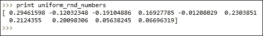

# 第二章. Python 环境

在这一章中，我们将介绍以下几个配方：

+   使用 NumPy 库

+   使用 matplotlib 绘图

+   使用 scikit-learn 进行机器学习

# 介绍

在这一章中，我们将介绍 Python 环境，这将在本书中被广泛使用。我们将从 NumPy 开始，它是一个用于高效处理数组和矩阵的 Python 库。它是本书中大多数其他库的基础。接着，我们将介绍一个名为 matplotlib 的 Python 绘图库。最后，我们将介绍一个名为 scikit-learn 的机器学习库。

# 使用 NumPy 库

NumPy 提供了一种高效的方式来处理 Python 中的大型数组。大多数 Python 科学计算库在内部都使用 NumPy 进行数组和矩阵操作。在本书中，我们将广泛使用 NumPy。在这一节中，我们将介绍 NumPy。

## 准备工作

我们将编写一系列 Python 语句来操作数组和矩阵，并在过程中学习如何使用 NumPy。我们的目的是让你习惯于使用 NumPy 数组，因为 NumPy 将作为本书中大多数配方的基础。

## 如何操作…

让我们从创建一些简单的矩阵和数组开始：

```py
#Recipe_1a.py
# Importing numpy as np
import numpy as np
# Creating arrays
a_list = [1,2,3]
an_array = np.array(a_list)
# Specify the datatype
an_array = np.array(a_list,dtype=float)

# Creating matrices
a_listoflist = [[1,2,3],[5,6,7],[8,9,10]]
a_matrix = np.matrix(a_listoflist,dtype=float)
```

现在我们将编写一个小的便利函数来检查我们的 NumPy 对象：

```py
#Recipe_1b.py
# A simple function to examine given numpy object 
def display_shape(a):
    print 
    print a
    print
    print "Nuber of elements in a = %d"%(a.size)
    print "Number of dimensions in a = %d"%(a.ndim)
    print "Rows and Columns in a ",a.shape
    print 

display_shape(a_matrix)
```

让我们看看创建数组的其他几种方法：

```py
#Recipe_1c.py
# Alternate ways of creating arrays
# 1\. Leverage np.arange to create numpy array
created_array = np.arange(1,10,dtype=float)
display_shape(created_array)

# 2\. Using np.linspace to create numpy array
created_array = np.linspace(1,10)
display_shape(created_array)

# 3\. Create numpy arrays in using np.logspace
created_array = np.logspace(1,10,base=10.0)
display_shape(created_array)

# Specify step size in arange while creating
# an array. This is where it is different
# from np.linspace
created_array = np.arange(1,10,2,dtype=int)
display_shape(created_array)
```

我们现在来看看创建一些特殊矩阵的方法：

```py
#Recipe_1d.py
# Create a matrix will all elements as 1
ones_matrix = np.ones((3,3))
display_shape(ones_matrix)
# Create a matrix with all elements as 0
zeros_matrix = np.zeros((3,3))
display_shape(zeros_matrix)

# Identity matrix
# k parameter  controls the index of 1
# if k =0, (0,0),(1,1,),(2,2) cell values
# are set to 1 in a 3 x 3 matrix
identity_matrix = np.eye(N=3,M=3,k=0)
display_shape(identity_matrix)
identity_matrix = np.eye(N=3,k=1)
display_shape(identity_matrix)
```

掌握了数组和矩阵创建的知识后，我们来看一些变形操作：

```py
Recipe_1e.py
# Array shaping
a_matrix = np.arange(9).reshape(3,3)
display_shape(a_matrix)
.
.
.
display_shape(back_array)
```

现在，继续查看一些矩阵操作：

```py
#Recipe_1f.py
# Matrix operations
a_matrix = np.arange(9).reshape(3,3)
b_matrix = np.arange(9).reshape(3,3)
.
.
.
print "f_matrix, row sum",f_matrix.sum(axis=1)
```

最后，让我们看看一些反向、复制和网格操作：

```py
#Recipe_1g.py
# reversing elements
display_shape(f_matrix[::-1])
.
.
.
zz = zz.flatten()
```

让我们看一下 NumPy 库中的一些随机数生成方法：

```py
#Recipe_1h.py
# Random numbers
general_random_numbers = np.random.randint(1,100, size=10)
print general_random_numbers
.
.
.
uniform_rnd_numbers = np.random.normal(loc=0.2,scale=0.2,size=(3,3))
```

## 它是如何工作的…

让我们从导入 NumPy 库开始：

```py
# Importing numpy as np
import numpy as np
```

让我们继续看一下在 NumPy 中创建数组的各种方式：

```py
# Arrays
a_list = [1,2,3]
an_array = np.array(a_list)
# Specify the datatype
an_array = np.array(a_list,dtype=float)
```

数组可以通过列表创建。在前面的示例中，我们声明了一个包含三个元素的列表。然后，我们可以使用`np.array()`将列表转换为一个 NumPy 一维数组。

数据类型也可以被指定，如前面代码中的最后一行所示：

我们现在将从数组转向矩阵：

```py
# Matrices
a_listoflist = [[1,2,3],[5,6,7],[8,9,10]]
a_matrix = np.matrix(a_listoflist,dtype=float)
```

我们将从一个`listoflist`创建一个矩阵。同样，我们可以指定数据类型。

在我们继续之前，我们将定义一个`display_shape`函数。我们将在后面频繁使用这个函数：

```py
def display_shape(a):
    print 
    print a
    print
    print "Nuber of elements in a = %d"%(a.size)
    print "Number of dimensions in a = %d"%(a.ndim)
    print "Rows and Columns in a ",a.shape
    print
```

每个 NumPy 对象都有以下三个属性：

**size**: 给定 NumPy 对象中的元素数量

**ndim**: 维度的数量

**shape**: shape 返回一个包含对象维度的元组

这个函数除了打印原始元素外，还会打印出所有三个属性。

让我们调用之前创建的矩阵来使用这个函数：

```py
display_shape(a_matrix)
```


正如你所看到的，我们的矩阵包含九个元素，并且有两个维度。最后，我们可以看到形状显示了每个维度的大小和元素的数量。在这种情况下，我们有一个三行三列的矩阵。

现在让我们看看创建数组的其他几种方式：

```py
created_array = np.arange(1,10,dtype=float)
display_shape(created_array)
```

NumPy 的 arrange 函数返回给定区间内均匀间隔的值。在此情况下，我们想要一个从 1 到 10 之间均匀间隔的数字。有关 arange 的更多信息，请参考以下链接：

[`docs.scipy.org/doc/numpy/reference/generated/numpy.arange.html`](http://docs.scipy.org/doc/numpy/reference/generated/numpy.arange.html)

```py
# An alternate way to create array
created_array = np.linspace(1,10)
display_shape(created_array)
```

NumPy 的 `linspace` 类似于 arrange。不同之处在于我们会请求所需样本的数量。使用 `linspace`，我们可以指定在给定范围内需要多少个元素。默认情况下，它返回 50 个元素。然而，在 arange 中，我们需要指定步长：

```py
created_array = np.logspace(1,10,base=10.0)
display_shape(created_array)
```

NumPy 提供了多种函数来创建特殊类型的数组：

```py
ones_matrix = np.ones((3,3))
display_shape(ones_matrix)

# Create a matrix with all elements as 0
zeros_matrix = np.zeros((3,3))
display_shape(zeros_matrix)
```

`ones()` 和 `zeros()` 函数分别用于创建一个包含 1 和 0 的矩阵：


矩阵的单位矩阵创建如下：

```py
identity_matrix = np.eye(N=3,M=3,k=0)
display_shape(identity_matrix)
```

`k` 参数控制值 `1` 开始的索引位置：

```py
identity_matrix = np.eye(N=3,k=1)
display_shape(identity_matrix)
```


数组的形状可以通过 `reshape` 函数来控制：

```py
# Array shaping
a_matrix = np.arange(9).reshape(3,3)
display_shape(a_matrix)
```

通过传递 `-1`，我们可以将数组重塑为所需的任意维度：

```py
# Paramter -1 refers to as many as dimension needed
back_to_array = a_matrix.reshape(-1)
display_shape(back_to_array)
```


`ravel` 和 `flatten` 函数可用于将矩阵转换为一维数组：

```py
a_matrix = np.arange(9).reshape(3,3)
back_array = np.ravel(a_matrix)
display_shape(back_array)

a_matrix = np.arange(9).reshape(3,3)
back_array = a_matrix.flatten()
display_shape(back_array)
```


让我们来看一些矩阵操作，比如加法：

```py
c_matrix = a_matrix + b_matrix
```

我们还将看一下逐元素乘法：

```py
d_matrix = a_matrix * b_matrix
```

以下代码展示了一个矩阵乘法操作：

```py
e_matrix = np.dot(a_matrix,b_matrix)
```

最后，我们将对矩阵进行转置：

```py
f_matrix = e_matrix.T
```

`min` 和 `max` 函数可用于找到矩阵中的最小值和最大值。`sum` 函数可用于找到矩阵中每行或每列的总和：

```py
print
print "f_matrix,minimum = %d"%(f_matrix.min())
print "f_matrix,maximum = %d"%(f_matrix.max())
print "f_matrix, col sum",f_matrix.sum(axis=0)
print "f_matrix, row sum",f_matrix.sum(axis=1)
```


矩阵的元素可以通过以下方式进行反转：

```py
# reversing elements
display_shape(f_matrix[::-1])
```

`copy` 函数可用于复制一个矩阵，如下所示：

```py
# Like python all elements are used by reference
# if copy is needed copy() command is used
f_copy = f_matrix.copy()
```

最后，让我们看看 mgrid 功能：

```py
# Grid commands
xx,yy,zz = np.mgrid[0:3,0:3,0:3]
xx = xx.flatten()
yy = yy.flatten()
zz = zz.flatten()
```

`mgrid` 功能可用于获取 m 维度的坐标。在前面的示例中，我们有三个维度。在每个维度中，我们的值范围从 `0` 到 `3`。让我们打印 `xx`，`yy` 和 `zz` 来更好地理解：


让我们看看每个数组的第一个元素。[`0`,`0`,`0`] 是我们三维空间中的第一个坐标。所有三个数组中的第二个元素，[`0`,`0`,`1`] 是我们空间中的另一个点。类似地，使用 `mgrid`，我们捕获了三维坐标系统中的所有点。

NumPy 为我们提供了一个名为 random 的模块，用于生成随机数。让我们看看一些随机数生成的例子：

```py
# Random numbers
general_random_numbers = np.random.randint(1,100, size=10)
print general_random_numbers
```

使用随机模块中的`randint`函数，我们可以生成随机整数。我们可以传递`start`、`end`和`size`参数。在我们的例子中，起始值是`1`，结束值是`100`，大小是`10`。我们希望获得 1 到 100 之间的 10 个随机整数。让我们看看返回的输出：


也可以生成其他分布的随机数。让我们来看一个例子，获取 10 个来自`normal`分布的随机数：

```py
uniform_rnd_numbers = np.random.normal(loc=0.2,scale=0.2,size=10)
print uniform_rnd_numbers
```

使用`normal`函数，我们将从`normal`分布中生成一个随机样本。`normal`分布的均值和标准差参数由`loc`和`scale`参数指定。最后，`size`决定了样本的数量。

通过传递一个包含行和列值的元组，我们也可以生成一个随机矩阵：

```py
uniform_rnd_numbers = np.random.normal(loc=0.2,scale=0.2,size=(3,3))
```

在前面的示例中，我们生成了一个 3 x 3 的矩阵，代码如下所示：



## 还有更多…

你可以参考以下链接，查看一些优秀的 NumPy 文档：

[`www.numpy.org/`](http://www.numpy.org/)

## 另请参见

+   在第三章中的*使用 matplotlib 绘图*示例，*分析数据 - 探索与整理*

+   在第三章中的*机器学习与 Scikit Learn*示例，*分析数据 - 探索与整理*

# 使用 matplotlib 绘图

Matplotlib Python 是一个二维绘图库。Python 可以生成各种图形，包括直方图、散点图、折线图、点图、热图等。在本书中，我们将使用`matplotlib`的`pyplot`接口来满足我们所有的可视化需求。

## 准备就绪

在这个示例中，我们将介绍使用`pyplot`的基本绘图机制。我们将在本书中的几乎所有示例中使用`pyplot`来进行可视化。

我们在本书中的所有示例中都使用了 matplotlib 版本 1.3.1。在你的命令行中，你可以调用`__version__`属性来检查版本：


## 如何操作…

让我们从查看如何使用 matplotlib 的`pyplot`模块绘制简单图形开始：

```py
#Recipe_2a.py
import numpy as np
import matplotlib.pyplot as plt
def simple_line_plot(x,y,figure_no):
    plt.figure(figure_no)
    plt.plot(x,y)
    plt.xlabel('x values')
    plt.ylabel('y values')
    plt.title('Simple Line')

def simple_dots(x,y,figure_no):
    plt.figure(figure_no)
    plt.plot(x,y,'or')
    plt.xlabel('x values')
    plt.ylabel('y values')
    plt.title('Simple Dots')

def simple_scatter(x,y,figure_no):
    plt.figure(figure_no)
    plt.scatter(x,y)
    plt.xlabel('x values')
    plt.ylabel('y values')
    plt.title('Simple scatter')

def scatter_with_color(x,y,labels,figure_no):
    plt.figure(figure_no)
    plt.scatter(x,y,c=labels)
    plt.xlabel('x values')
    plt.ylabel('y values')
    plt.title('Scatter with color')

if __name__ == "__main__":

    plt.close('all')
    # Sample x y data for line and simple dot plots
    x = np.arange(1,100,dtype=float)
    y = np.array([np.power(xx,2) for xx in x])

    figure_no=1
    simple_line_plot(x,y,figure_no)
    figure_no+=1
    simple_dots(x,y,figure_no)

    # Sample x,y data for scatter plot
    x = np.random.uniform(size=100)
    y = np.random.uniform(size=100)

    figure_no+=1
    simple_scatter(x,y,figure_no)
    figure_no+=1
    label = np.random.randint(2,size=100)
    scatter_with_color(x,y,label,figure_no)
    plt.show()
```

现在我们将继续探讨一些高级主题，包括生成热图和标记 *x* 和 *y* 轴：

```py
#Recipe_2b.py
import numpy as np
import matplotlib.pyplot as plt
def x_y_axis_labeling(x,y,x_labels,y_labels,figure_no):
    plt.figure(figure_no)
    plt.plot(x,y,'+r')
    plt.margins(0.2)
    plt.xticks(x,x_labels,rotation='vertical')
    plt.yticks(y,y_labels,)

def plot_heat_map(x,figure_no):
    plt.figure(figure_no)
    plt.pcolor(x)
    plt.colorbar()

if __name__ == "__main__":

    plt.close('all')
    x = np.array(range(1,6))
    y = np.array(range(100,600,100))
    x_label = ['element 1','element 2','element 3','element 4','element 5']
    y_label = ['weight1','weight2','weight3','weight4','weight5']

    x_y_axis_labeling(x,y,x_label,y_label,1)

    x = np.random.normal(loc=0.5,scale=0.2,size=(10,10))
    plot_heat_map(x,2)

    plt.show()
```

## 它是如何工作的…

我们将从导入所需的模块开始。在使用`pyplot`时，建议你导入 NumPy：

```py
import numpy as np
import matplotlib.pyplot as plt
```

我们从主函数的代码开始。可能会有之前程序运行生成的图形。关闭它们是个好习惯，因为我们将在程序中使用更多的图形：

```py
    plt.close('all')
```

我们将继续使用 NumPy 生成一些数据，以演示如何使用`pyplot`进行绘图：

```py
    # Sample x y data for line and simple dot plots
    x = np.arange(1,100,dtype=float)
    y = np.array([np.power(xx,2) for xx in x])
```

我们在 x 和 y 变量中各生成了 100 个元素。我们的 y 是 x 变量的平方。

让我们继续进行一个简单的折线图：

```py
    figure_no=1
    simple_line_plot(x,y,figure_no)
```

当我们的程序中有多个图表时，给每个图表编号是一种好的做法。变量 `figure_no` 用于编号我们的图表。让我们看看 `simple_line_plot` 函数：

```py
def simple_line_plot(x,y,figure_no):
    plt.figure(figure_no)
    plt.plot(x,y)
    plt.xlabel('x values')
    plt.ylabel('y values')
    plt.title('Simple Line')
```

如你所见，我们通过在 `pyplot` 中调用 figure 函数来开始编号图表。我们将 `figure_no` 变量从主程序中传入。之后，我们简单地调用 plot 函数，并传入我们的 x 和 y 值。我们可以通过使用 `xlabel` 和 `ylabel` 函数分别为 x 轴和 y 轴命名，使得图表更有意义。最后，我们还可以为图表添加标题。就这样，我们的第一个简单折线图就准备好了。直到调用 `show()` 函数，图表才会显示。在我们的代码中，我们将调用 `show()` 函数以查看所有图表。我们的图表如下所示：


在这里，我们将 `x` 值绘制在 x 轴上，将 `x 的平方` 绘制在 y 轴上。

我们创建了一个简单的折线图。我们可以看到一条漂亮的曲线，因为我们的**y 值**是**x 值**的平方。

接下来我们进行下一个图表：

```py
    figure_no+=1
    simple_dots(x,y,figure_no)
```

我们将增加图表编号并调用 `simple_dots` 函数。我们想将我们的 *x* 和 *y* 值绘制为点，而不是折线。让我们看一下 `simple_dots` 函数：

```py
def simple_dots(x,y,figure_no):
    plt.figure(figure_no)
    plt.plot(x,y,'or')
    plt.xlabel('x values')
    plt.ylabel('y values')
    plt.title('Simple Dots')
```

每一行都与我们之前的函数类似，除了以下这一行：

```py
    plt.plot(x,y,'or')
```

`or` 参数表示我们需要点 `(o)`，并且点的颜色是红色 (r)。以下是前一个命令的输出：


让我们继续下一个图表。

我们将要查看一个散点图。让我们使用 NumPy 生成一些数据：

```py
    # Sample x,y data for scatter plot
    x = np.random.uniform(size=100)
    y = np.random.uniform(size=100)
```

我们从均匀分布中抽取了 100 个数据点。现在我们将调用 `simple_scatter` 函数来生成我们的散点图：

```py
    figure_no+=1
    simple_scatter(x,y,figure_no)
```

在 `simple_scatter` 函数中，所有行都与之前的绘图程序类似，除了以下这一行：

```py
    plt.scatter(x,y)
```

我们没有在 `pyplot` 中调用 plot 函数，而是调用了 `scatter` 函数。我们的图表如下所示：


接下来，我们进行最终的图表绘制，这是一个散点图，但点的颜色根据它们所属的类别标签进行区分：

```py
    figure_no+=1
    label = np.random.randint(2,size=100)
    scatter_with_color(x,y,label,figure_no)
```

我们将增加图表编号以跟踪我们的图表。在接下来的代码行中，我们将为数据点分配一些随机标签，标签为 `1` 或 `0`。最后，我们将调用 `scatter_with_color` 函数，传入我们的 *x*、*y* 和标签变量。

在函数中，让我们看一下与之前的散点图代码不同的一行：

```py
    plt.scatter(x,y,c=labels)
```

我们将标签传递给 `c` 参数，表示颜色。每个标签将被分配一个唯一的颜色。在我们的例子中，所有标签为 `0` 的点将与标签为 `1` 的点有不同的颜色，如下所示：


让我们继续绘制一些热图，并添加坐标轴标签。

再次，我们将从主函数开始：

```py
    plt.close('all')
    x = np.array(range(1,6))
    y = np.array(range(100,600,100))
    x_label = ['element 1','element 2','element 3','element 4','element 5']
    y_label = ['weight1','weight2','weight3','weight4','weight5']

    x_y_axis_labeling(x,y,x_label,y_label,1)
```

作为良好的实践，我们将在生成新图形之前，通过调用 `close` 函数关闭所有之前的图形。接下来，我们将生成一些数据。我们的 x 是一个包含五个元素的数组，起始值为 `1`，结束值为 `5`。我们的 y 是一个包含五个元素的数组，起始值为 `100`，结束值为 `500`。我们定义了两个 `x_label` 和 `y_label` 列表，它们将作为我们绘图的标签。最后，我们调用了 `x_y_axis_labeling` 函数，目的是演示如何在 *x* 轴和 *y* 轴上标记刻度。

让我们来看一下以下函数：

```py
def x_y_axis_labeling(x,y,x_labels,y_labels,figure_no):
    plt.figure(figure_no)
    plt.plot(x,y,'+r')
    plt.margins(0.2)
    plt.xticks(x,x_labels,rotation='vertical')
    plt.yticks(y,y_labels,)
```

我们将通过调用 pyplot 的 dot 函数来绘制简单的点图。然而，在这种情况下，我们希望我们的点显示为 `+` 而不是 `o`。因此，我们将指定 `+r`。我们选择的颜色是红色，因此 `r`。

在接下来的两行中，我们将指定我们的 x 轴和 y 轴的刻度标记。通过调用 `xticks` 函数，我们将传递我们的 x 值及其标签。此外，我们会设置文本垂直旋转，以避免它们重叠。类似地，我们将为 *y* 轴指定刻度标记。让我们来看一下我们的图表，如下所示：


让我们看看如何使用 `pyplot` 生成热图：

```py
    x = np.random.normal(loc=0.5,scale=0.2,size=(10,10))
    plot_heat_map(x,2)
```

我们将生成一些数据用于热图。在这个例子中，我们生成了一个 10 x 10 的矩阵，矩阵中的值来自一个正态分布，其均值由 `loc` 变量指定为 `0.5`，标准差由 `scale` 变量指定为 `0.2`。我们将使用这个矩阵调用 `plot_heat_map` 函数。第二个参数是图形编号：

```py
def plot_heat_map(x,figure_no):
    plt.figure(figure_no)
    plt.pcolor(x)
    plt.colorbar()
```

我们将调用 `pcolor` 函数来生成热图。下一行调用了 `colorbar` 函数，用于显示我们值范围的颜色渐变：


## 还有更多…

有关 matplotlib 的更多信息，你可以参考 matplotlib 的常规文档，网址为 [`matplotlib.org/faq/usage_faq.html`](http://matplotlib.org/faq/usage_faq.html)。

以下链接是关于 `pyplot` 的一个极好的教程：

[`matplotlib.org/users/pyplot_tutorial.html`](http://matplotlib.org/users/pyplot_tutorial.html)

Matplotlib 提供了出色的三维绘图功能。有关更多信息，请参考以下链接：

[`matplotlib.org/mpl_toolkits/mplot3d/tutorial.html`](http://matplotlib.org/mpl_toolkits/mplot3d/tutorial.html)

matplotlib 中的 pylab 模块将 NumPy 的命名空间与 `pyplot` 结合在一起。Pylab 还可以用来生成本食谱中展示的各种类型的图表。

# 使用 scikit-learn 进行机器学习

Scikit-learn 是一个多功能的 Python 机器学习库。在本书中，我们将广泛使用这个库。我们在本书中的所有示例中使用了 scikit-learn 版本 0.15.2。在命令行中，你可以通过调用 `__version__` 属性来检查版本：


## 准备工作

在本例中，我们将展示 scikit-learn 的一些功能，并了解它们的 API 组织方式，以便在未来的例子中能顺利使用它。

## 如何操作…

Scikit-learn 为我们提供了一个内建的数据集。让我们看看如何访问这个数据集并使用它：

```py
#Recipe_3a.py
from sklearn.datasets import load_iris,load_boston,make_classification                         make_circles, make_moons

# Iris dataset
data = load_iris()
x = data['data']
y = data['target']
y_labels = data['target_names']
x_labels = data['feature_names']

print
print x.shape
print y.shape
print x_labels
print y_labels

# Boston dataset
data = load_boston()
x = data['data']
y = data['target']
x_labels = data['feature_names']

print
print x.shape
print y.shape
print x_labels

# make some classification dataset
x,y = make_classification(n_samples=50,n_features=5, n_classes=2)

print
print x.shape
print y.shape

print x[1,:]
print y[1]

# Some non linear dataset
x,y = make_circles()
import numpy as np
import matplotlib.pyplot as plt
plt.close('all')
plt.figure(1)
plt.scatter(x[:,0],x[:,1],c=y)

x,y = make_moons()
import numpy as np
import matplotlib.pyplot as plt
plt.figure(2)
plt.scatter(x[:,0],x[:,1],c=y)

plt.show()
```

让我们继续查看如何在 scikit-learn 中调用一些机器学习功能：

```py
#Recipe_3b.py
import numpy as np
from sklearn.preprocessing import PolynomialFeatures
# Data Preprocessing routines
x = np.asmatrix([[1,2],[2,4]])
poly = PolynomialFeatures(degree = 2)
poly.fit(x)
x_poly = poly.transform(x)

print "Original x variable shape",x.shape
print x
print
print "Transformed x variables",x_poly.shape
print x_poly

#alternatively 
x_poly = poly.fit_transform(x)

from sklearn.tree import DecisionTreeClassifier
from sklearn.datasets import load_iris

data = load_iris()
x = data['data']
y = data['target']

estimator = DecisionTreeClassifier()
estimator.fit(x,y)
predicted_y = estimator.predict(x)
predicted_y_prob = estimator.predict_proba(x)
predicted_y_lprob = estimator.predict_log_proba(x)

from sklearn.pipeline import Pipeline

poly = PolynomialFeatures(n=3)
tree_estimator = DecisionTreeClassifier()

steps = [('poly',poly),('tree',tree_estimator)]
estimator = Pipeline(steps=steps)
estimator.fit(x,y)
predicted_y = estimator.predict(x)
```

## 工作原理…

让我们加载 scikit-learn 库，并导入包含各种函数的模块，以便提取内建数据集：

```py
from sklearn.datasets import load_iris,load_boston,make_classification
```

我们将查看的第一个数据集是 iris 数据集。欲了解更多信息，请参考[`en.wikipedia.org/wiki/Iris_flower_data_set`](https://en.wikipedia.org/wiki/Iris_flower_data_set)。

由 Sir Donald Fisher 引入，这是一个经典的分类问题数据集：

```py
data = load_iris()
x = data['data']
y = data['target']
y_labels = data['target_names']
x_labels = data['feature_names']
```

`load_iris`函数在调用时，会返回一个字典对象。通过使用适当的键查询字典对象，可以提取出预测变量`x`、响应变量`y`、响应变量名称以及特征名称。

让我们继续打印它们并查看它们的值：

```py
print
print x.shape
print y.shape
print x_labels
print y_labels
```


如你所见，我们的预测变量有 150 个实例和四个属性。我们的`响应`变量有 150 个实例，每个预测实例都有一个类标签。接下来，我们将打印出特征名称——花瓣和萼片的宽度和长度，最后是类标签。在我们未来的大部分例子中，我们将广泛使用这个数据集。

让我们继续检查另一个内建的数据集——波士顿房价数据集，该数据集用于回归问题：

```py
# Boston dataset
data = load_boston()
x = data['data']
y = data['target']
x_labels = data['feature_names']
```

数据的加载与 iris 数据集非常相似，数据的各个组件，包括预测变量和响应变量，都是通过使用字典中的相应键进行查询的。让我们打印这些变量，以便检查它们：


如你所见，我们的预测变量集`x`有 506 个实例和 13 个特征。我们的响应变量有 506 个条目。最后，我们还将打印出特征名称。

Scikit-learn 还为我们提供了帮助我们生成具有某些期望属性的随机分类数据集的函数：

```py
# make some classification dataset
x,y = make_classification(n_samples=50,n_features=5, n_classes=2)
```

`make_classification`函数是一个可以用来生成分类数据集的函数。在我们的例子中，我们生成了一个包含 50 个实例的数据集，其中实例数由`n_samples`参数决定，特征数由`n_features`参数决定，类别数由`n_classes`参数设置。让我们检查该函数的输出：

```py
print x.shape
print y.shape

print x[1,:]
print y[1]
```


如你所见，我们的预测变量`x`有 150 个实例和五个特征。我们的响应变量有 150 个实例，每个预测实例都有一个类标签。

我们将打印出预测变量集 `x` 中的第二条记录。你可以看到，我们有一个维度为 `5` 的向量，表示我们请求的五个特征。最后，我们还将打印出响应变量 `y`。对于我们预测变量集中的第二行，类标签为 `1`。

Scikit-learn 还为我们提供了能够生成具有非线性关系的数据的函数：

```py
# Some non linear dataset
x,y = make_circles()
import numpy as npimport matplotlib.pyplot as plt
plt.close('all')
plt.figure(1)
plt.scatter(x[:,0],x[:,1],c=y)
```

你现在应该已经熟悉了前一个示例中的 `pyplot`。让我们先看看我们的图表，以便理解非线性关系：


如你所见，我们的分类结果生成了两个同心圆。我们的 `x` 是一个包含两个变量的数据集。变量 `y` 是类标签。正如同心圆所示，我们的预测变量之间的关系是非线性的。

另一个有趣的函数来生成非线性关系是 scikit-learn 中的 `make_moons`：

```py
x,y = make_moons()
import numpy as np
import matplotlib.pyplot as plt
plt.figure(2)
plt.scatter(x[:,0],x[:,1],c=y)
```

让我们通过查看其图表来理解非线性关系：


弯月形的图表显示了我们的预测变量集 `x` 中的属性是非线性相关的。

接下来，让我们换个角度来理解 scikit-learn 的 API 结构。使用 scikit-learn 的一个主要优势是它干净的 API 结构。所有从 `BaseEstimator` 类派生的数据建模类都必须严格实现 `fit` 和 `transform` 函数。我们将通过一些例子进一步了解这一点。

让我们从 scikit-learn 的预处理模块开始：

```py
import numpy as np
from sklearn.preprocessing import PolynomialFeatures
```

我们将使用 `PolynomialFeatures` 类来展示使用 scikit-learn SDK 的简便性。有关多项式的更多信息，请参见以下链接：

[`zh.wikipedia.org/wiki/多项式`](https://zh.wikipedia.org/wiki/Polynomial)

对于一组预测变量，我们可能想要添加更多的变量到预测集，以查看我们的模型准确度是否能够提高。我们可以使用现有特征的多项式作为新特征。`PolynomialFeatures` 类可以帮助我们做到这一点：

```py
# Data Preprocessing routines
x = np.asmatrix([[1,2],[2,4]])
```

我们将首先创建一个数据集。在此情况下，我们的数据集包含两个实例和两个属性：

```py
poly = PolynomialFeatures(degree = 2)
```

我们将继续实例化 `PolynomialFeatures` 类，并设置所需的多项式的阶数。在此情况下，我们选择的是二阶多项式：

```py
poly.fit(x)
x_poly = poly.transform(x)
```

然后，有两个函数，`fit` 和 `transform`。`fit` 函数用于执行转换所需的计算。在此情况下，`fit` 是多余的，但稍后我们将看到更多 `fit` 函数使用的例子。

`transform` 函数接收输入，并根据 `fit` 执行的计算来转换给定的输入：

```py
#alternatively 
x_poly = poly.fit_transform(x)
```

或者，在这种情况下，`fit` 和 `transform` 可以一次性调用。让我们看看原始 `x` 变量和转换后 `x` 变量的值和形状：


在 scikit-learn 中，任何实现机器学习方法的类都必须继承自 BaseEstimator。请参阅以下链接了解 BaseEstimator：

[`scikit-learn.org/stable/modules/generated/sklearn.base.BaseEstimator.html`](http://scikit-learn.org/stable/modules/generated/sklearn.base.BaseEstimator.html)

BaseEstimator 期望实现类提供 `fit` 和 `transform` 方法。这样可以保持 API 的简洁。

让我们看另一个例子。这里，我们从树模块中导入了一个名为 `DecisionTreeClassifier` 的类。`DecisionTreeClassifier` 实现了决策树算法：

```py
from sklearn.tree import DecisionTreeClassifier
```

让我们将这个类付诸实践：

```py
from sklearn.datasets import load_iris

data = load_iris()
x = data['data']
y = data['target']

estimator = DecisionTreeClassifier()
estimator.fit(x,y)
predicted_y = estimator.predict(x)
predicted_y_prob = estimator.predict_proba(x)
predicted_y_lprob = estimator.predict_log_proba(x)
```

让我们使用鸢尾花数据集来看看决策树算法如何应用。我们将在 `x` 和 `y` 变量中加载鸢尾花数据集。接下来，我们将实例化 `DecisionTreeClassifier`。然后通过调用 `fit` 函数，并传入我们的 `x 预测变量` 和 `y 响应变量`，来构建模型。这将构建出决策树模型。现在，我们已经准备好模型进行预测。我们将使用 `predict` 函数来预测给定输入的类别标签。如你所见，我们使用了与 `PolynomialFeatures` 中相同的 `fit` 和 `predict` 方法。还有两个其他方法，`predict_proba`，它给出预测的概率，以及 `predict_log_proba`，它提供预测概率的对数值。

现在，让我们来看一个有趣的工具叫做管道（pipe lining）。不同的机器学习方法可以通过管道链式连接在一起：

```py
from sklearn.pipeline import Pipeline

poly = PolynomialFeatures(n=3)
tree_estimator = DecisionTreeClassifier()
```

让我们从实例化数据处理例程 `PolynomialFeatures` 和 `DecisionTreeClassifier` 开始：

```py
steps = [('poly',poly),('tree',tree_estimator)]
```

我们将定义一个元组列表来表示我们的链式操作顺序。我们希望先运行多项式特征生成，然后是决策树：

```py
estimator = Pipeline(steps=steps)
estimator.fit(x,y)
predicted_y = estimator.predict(x)
```

现在我们可以通过使用 `steps` 变量声明的列表来实例化我们的 Pipeline 对象。接下来，我们可以像往常一样通过调用 `fit` 和 `predict` 方法继续进行业务操作。

我们可以调用 `named_steps` 属性来检查管道各个阶段的模型：


## 还有更多内容…

在 scikit-learn 中有许多其他数据集创建函数。请参考以下链接：

[`scikit-learn.org/stable/datasets/`](http://scikit-learn.org/stable/datasets/)

在使用 `make_circle` 和 `make_moons` 创建非线性数据集时，我们提到可以为数据集添加很多期望的属性。通过引入不正确的类别标签，数据可能会稍微被污染。请参考以下链接，了解可以引入这些细微变化的数据选项：

[`scikit-learn.org/stable/modules/generated/sklearn.datasets.make_circles.html`](http://scikit-learn.org/stable/modules/generated/sklearn.datasets.make_circles.html)

[`scikit-learn.org/stable/modules/generated/sklearn.datasets.make_moons.html`](http://scikit-learn.org/stable/modules/generated/sklearn.datasets.make_moons.html)

## 另见

+   第二章中的*绘图*教程，*使用 Python 环境*
