# 第三章 数据分析——探索与清洗

本章将介绍以下几种方法：

+   图形化分析单变量数据

+   分组数据并使用点图

+   使用散点图展示多变量数据

+   使用热力图

+   执行汇总统计和绘制图表

+   使用箱线图

+   填补缺失数据

+   执行随机抽样

+   缩放数据

+   标准化数据

+   执行分词

+   去除停用词

+   词干化

+   执行词形还原

+   将文本表示为词袋模型

+   计算词频和逆文档频率

# 介绍

在你开始任何数据科学应用之前，长期来看，深入了解你即将处理的数据总是很有帮助的。对底层数据的理解将帮助你为当前问题选择正确的算法。以不同粒度级别探索数据的过程叫做**探索性数据分析**（**EDA**）。在许多情况下，**EDA**能够揭示通常通过数据挖掘算法发现的模式。**EDA**帮助我们理解数据特征，并为你提供适当的指导，以便选择适合当前问题的算法。

本章将详细介绍**EDA**。我们将探讨用于有效执行**EDA**操作的实践技巧和工具。

数据预处理和转换是另外两个重要的过程，它们能够提高数据科学模型的质量，并增加数据科学项目的成功率。

数据预处理是使数据准备好供数据挖掘方法或机器学习算法使用的过程。它包括很多内容，如数据清洗、属性子集选择、数据转换等。我们将在本章中介绍数值数据预处理和文本数据预处理。

文本数据与数值数据有所不同。我们需要不同的转换方法，以使其适合机器学习算法的输入。在本章中，我们将看到如何转换文本数据。通常，文本转换是一个分阶段的过程，包含多个组件，形成一个管道。

一些组件如下所示：

+   分词

+   停用词移除

+   基本形式转换

+   特征推导

通常，这些组件会应用于给定的文本，以提取特征。在管道的最后，文本数据将被转换成适合机器学习算法输入的形式。在本章中，我们将为每个组件提供相应的解决方案。

许多时候，在数据收集阶段可能会引入很多错误。这些错误可能是由于人为错误、限制或数据测量/收集过程中的缺陷。数据不一致性是一个大挑战。我们将从数据填充开始我们的数据预处理工作，填充是处理输入数据中的错误的方法，然后继续采用其他方法。

# 通过图形分析单变量数据

仅包含一个变量/列的数据集称为单变量数据。单变量是数学中的一个通用术语，指的是只有一个变量的表达式、方程式、函数或多项式。在我们的例子中，我们将限制单变量函数于数据集。假设我们将测量一组人的身高（单位：米），数据将如下所示：

```py
5, 5.2, 6, 4.7,…
```

我们的测量仅涉及人群的一个属性——身高。这是单变量数据的一个示例。

## 准备工作

我们通过可视化查看样本单变量数据来开始我们的**EDA**流程。通过正确的可视化技术，分析数据特征变得容易。我们将使用`pyplot`绘制图表以可视化数据。Pyplot 是 matplotlib 绘图库的状态机接口。图形和坐标轴会自动创建，以生成所需的图表。以下链接是`pyplot`的一个很好的参考：

[`matplotlib.org/users/pyplot_tutorial.html`](http://matplotlib.org/users/pyplot_tutorial.html)

本例中，我们将使用国情咨文中总统向国会提出的请求数量。以下链接包含数据：

[`www.presidency.ucsb.edu/data/sourequests.php`](http://www.presidency.ucsb.edu/data/sourequests.php)

以下是数据的示例：

```py
1946, 41
1947, 23
1948, 16
1949, 28
1950, 20
1951, 11
1952, 19
1953, 14
1954, 39
1955, 32
1956, 
1957, 14
1958, 
1959, 16
1960, 6
```

我们将直观地查看这些数据，并识别数据中的任何异常值。我们将采用递归方法处理异常值。一旦识别出异常值，我们将从数据集中移除它们，并重新绘制剩余数据，以便寻找新的异常值。

### 注意

在每次迭代中移除识别出的异常值后，递归检查数据是检测异常值的常见方法。

## 如何操作…

我们将使用 NumPy 的数据加载工具加载数据。然后，我们将解决数据质量问题；在此案例中，我们将解决如何处理空值。正如你所看到的数据，1956 年和 1958 年存在空值。让我们使用 lambda 函数将空值替换为`0`。

接下来，让我们绘制数据，寻找任何趋势：

```py
# Load libraries
import numpy as np
from matplotlib.pylab import frange
import matplotlib.pyplot as plt

fill_data = lambda x : int(x.strip() or 0)
data = np.genfromtxt('president.txt',dtype=(int,int),converters={1:fill_data},\
            delimiter=",")
x = data[:,0]
y = data[:,1]

# 2.Plot the data to look for any trends or values
plt.close('all')
plt.figure(1)
plt.title("All data")
plt.plot(x,y,'ro')
plt.xlabel('year')plt.ylabel('No Presedential Request')
```

让我们计算百分位数值，并将其作为参考线绘制到已经生成的图中：

```py
#3.Calculate percentile values (25th, 50th,75th) for the data to understand data distribution
perc_25 = np.percentile(y,25)
perc_50 = np.percentile(y,50)
perc_75 = np.percentile(y,75)
print
print "25th Percentile    = %0.2f"%(perc_25)
print "50th Percentile    = %0.2f"%(perc_50)
print "75th Percentile    = %0.2f"%(perc_75)
print
#4.Plot these percentile values as reference in the plot we generated in the previous step.
# Draw horizontal lines at 25,50 and 75th percentile
plt.axhline(perc_25,label='25th perc',c='r')
plt.axhline(perc_50,label='50th perc',c='g')
plt.axhline(perc_75,label='75th perc',c='m')plt.legend(loc='best')
```

最后，我们通过可视化检查数据中的异常值，然后使用掩码函数将其移除。接下来，我们再次绘制去除异常值后的数据：

```py
#5.Look for outliers if any in the data by visual inspection.
# Remove outliers using mask function 
# Remove outliers 0 and 54
y_masked = np.ma.masked_where(y==0,y)
#  Remove point 54
y_masked = np.ma.masked_where(y_masked==54,y_masked)

#6 Plot the data again.
plt.figure(2)
plt.title("Masked data")
plt.plot(x,y_masked,'ro')
plt.xlabel('year')
plt.ylabel('No Presedential Request')
plt.ylim(0,60)

# Draw horizontal lines at 25,50 and 75th percentile
plt.axhline(perc_25,label='25th perc',c='r')
plt.axhline(perc_50,label='50th perc',c='g')
plt.axhline(perc_75,label='75th perc',c='m')
plt.legend(loc='best')plt.show()
```

## 它是如何工作的…

在第一步中，我们将应用在前一章中学到的一些数据加载技巧。你会注意到年份`1956`和`1958`被留空。我们将使用匿名函数将它们替换为`0`：

```py
fill_data = lambda x : int(x.strip() or 0)
```

`fill_data`匿名函数将替换数据集中的任何空值；在这种情况下，第 11 行和第 13 行将替换为 0：

```py
data = np.genfromtxt('president.txt',dtype=(int,int),converters={1:fill_data},delimiter=",")
```

我们将`fill_data`传递给`genfromtxt`函数的`converters`参数。请注意，`converters`接受一个字典作为输入。字典中的键指定我们的函数应该应用于哪一列。值表示函数。在此案例中，我们指定`fill_data`作为函数，并将键设置为 1，表示`fill_data`函数必须应用于第 1 列。现在让我们在控制台中查看数据：

```py
>>> data[7:15]
array([[1953,   14],
       [1954,   39],
       [1955,   32],
       [1956,    0],
       [1957,   14],
       [1958,    0],
       [1959,   16],
       [1960,    6]])
>>>
```

如我们所见，年份`1956`和`1958`被添加了一个`0`值。为了便于绘图，我们将把年份数据加载到 x 轴，国情咨文中总统向国会提出的请求数量加载到 y 轴：

```py
x = data[:,0]
y = data[:,1]
```

如你所见，在第一列，年份被加载到`x`中，下一列加载到`y`中。

在第 2 步中，我们将绘制数据，x 轴为年份，y 轴表示值：

```py
plt.close('all')
```

我们将首先关闭之前程序中打开的任何图形：

```py
plt.figure(1)
```

我们将为我们的图形指定一个编号。当程序中有很多图形时，这非常有用：

```py
plt.title("All data")
```

我们将为我们的图形指定一个标题：

```py
plt.plot(x,y,'ro')
```

最后，我们将绘制 x 和 y。'ro'参数告诉 pyplot 将 x 和 y 绘制为红色（r）的小圆点（0）：

```py
plt.xlabel('year')
plt.ylabel('No Presedential Request')
```

最后，提供了*x*和*y*轴的标签。

输出如下所示：

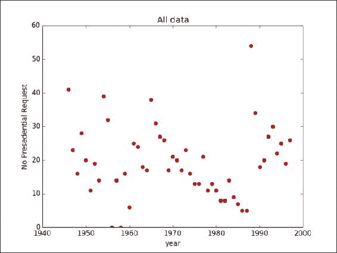

随便看一下这张图，你会发现数据分布得很广泛，第一眼看不出任何趋势或模式。然而，仔细观察，你会注意到三个点：一个位于右上方，另两个则位于**1960**年附近的*x*轴上。它们与样本中的所有其他点截然不同，因此，它们是异常值。

### 注意

异常值是指位于分布整体模式之外的观测值（Moore 和 McCabe 1999）。

为了进一步理解这些点，我们将借助百分位数来分析。

### 注意

如果我们有一个长度为 N 的向量 V，V 的第 q 个百分位数是 V 的排序副本中的第 q 个排名值。如果归一化排名与 q 不完全匹配，则两个最邻近点的值和距离，以及*插值*参数将决定百分位数。此函数与中位数相同，如果`q=50`，与最小值相同，如果`q=0`，与最大值相同，如果`q=100`。

请参考[`docs.scipy.org/doc/numpy-dev/reference/generated/numpy.percentile.html`](http://docs.scipy.org/doc/numpy-dev/reference/generated/numpy.percentile.html)了解更多信息。

为什么不使用平均值？我们将在总结统计部分探讨平均值；然而，查看百分位数有其独特的优势。平均值通常会被异常值所扭曲；例如，右上方的异常值会将平均值拉高，而接近 1960 的异常值则可能相反。百分位数能更清晰地反映数据集中值的范围。我们可以使用 NumPy 来计算百分位数。

在第 3 步中，我们将计算百分位数并打印出来。

计算并打印出的百分位数值如下：

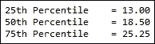

### 注意

百分位数的解读：

数据集中有 25%的点小于 13.00（25 百分位数值）。

数据集中有 50%的点小于 18.50（50 百分位数值）。

数据集中有 75%的点小于 25.25（75 百分位数值）。

需要注意的一点是，50 百分位数是中位数。百分位数给我们提供了数据值范围的良好视角。

在第 4 步中，我们将在图表中以水平线的形式绘制这些百分位数值，以增强我们的可视化效果：

```py
# Draw horizontal lines at 25,50 and 75th percentile
plt.axhline(perc_25,label='25th perc',c='r')
plt.axhline(perc_50,label='50th perc',c='g')
plt.axhline(perc_75,label='75th perc',c='m')
plt.legend(loc='best')
```

我们使用了`plt.axhline()`函数来绘制这些水平线。这个函数会在给定的 y 值处，从 x 的最小值绘制到 x 的最大值。通过 label 参数，我们给它命名，并通过 c 参数设置线条的颜色。

### 提示

理解任何函数的好方法是将函数名传递给 Python 控制台中的`help()`。在这种情况下，在 Python 控制台中输入`help(plt.axhline)`将提供相关详情。

最后，我们将使用`plt.legend()`添加图例，并通过`loc`参数，要求 pyplot 自动选择最佳位置放置图例，以免影响图表的可读性。

我们的图表现在如下所示：

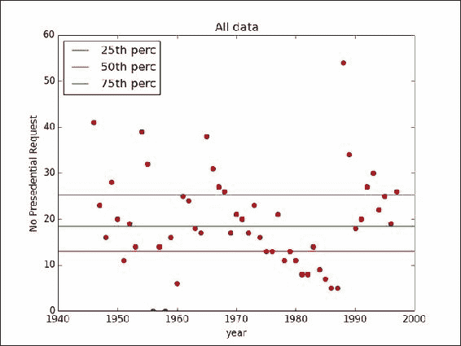

在第 5 步中，我们将使用 NumPy 中的掩码函数来移除异常值：

```py
# Remove zero values
y_masked = np.ma.masked_where(y==0,y)
#  Remove 54
y_masked = np.ma.masked_where(y_masked==54,y_masked)
```

掩码是隐藏数组中某些值的便捷方法，而不需要将其从数组中删除。我们使用了`ma.masked_where`函数，其中传入了一个条件和一个数组。该函数会根据条件掩盖数组中符合条件的值。我们的第一个条件是掩盖`y`数组中所有值为`0`的点。我们将新的掩盖后的数组存储为`y_masked`。然后，我们对`y_masked`应用另一个条件，移除第 54 个点。

最后，在第 6 步中，我们将重复绘图步骤。我们的最终图表如下所示：

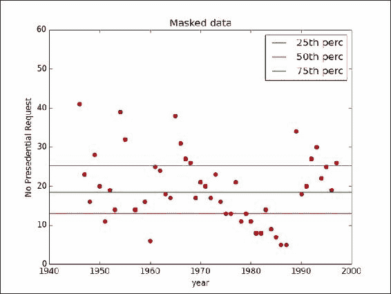

## 另见

+   *创建匿名函数* 例子见第一章, *Python 数据科学应用*

+   *预处理列* 例子见第一章, *Python 数据科学应用*

+   *使用 Python 获取数据* 例子见第一章, *Python 数据科学应用*

+   *离群值* 相关内容请参考 第四章，*数据分析 - 深度剖析*

# 对数据进行分组并使用点图

**EDA** 是通过从多个角度放大和缩小数据，以更好地理解数据。现在让我们用点图从不同的角度来看数据。点图是一种简单的图表，其中数据被分组并绘制在简单的尺度上。我们可以决定如何分组数据。

### 注意

点图最好用于小到中等大小的数据集。对于大型数据，通常使用直方图。

## 准备就绪

对于本练习，我们将使用与上一节相同的数据。

## 如何操作……

让我们加载必要的库。接着加载我们的数据，并在此过程中处理缺失值。最后，我们将使用频率计数器对数据进行分组：

```py
# Load libraries
import numpy as np
import matplotlib.pyplot as plt
from collections import Counter
from collections import OrderedDict
from matplotlib.pylab import frange

# 1.Load the data and handle missing values.
fill_data = lambda x : int(x.strip() or 0)
data = np.genfromtxt('president.txt',dtype=(int,int),converters={1:fill_data},delimiter=",")
x = data[:,0]
y = data[:,1]

# 2.Group data using frequency (count of individual data points).
# Given a set of points, Counter() returns a dictionary, where key is a data point,
# and value is the frequency of data point in the dataset.
x_freq = Counter(y)
x_ = np.array(x_freq.keys())y_ = np.array(x_freq.values())
```

我们将继续按年份范围对数据进行分组并绘制：

```py
# 3.Group data by range of years
x_group = OrderedDict()
group= 5
group_count=1
keys = []
values = []
for i,xx in enumerate(x):
    # Individual data point is appended to list keys
    keys.append(xx)
    values.append(y[i])
    # If we have processed five data points (i.e. five years)
    if group_count == group:
        # Convert the list of keys to a tuple
        # use the new tuple as the ke to x_group dictionary
        x_group[tuple(keys)] = values
        keys= []
        values =[]
        group_count = 1

    group_count+=1
# Accomodate the last batch of keys and values
x_group[tuple(keys)] = values 

print x_group
# 4.Plot the grouped data as dot plot.
plt.subplot(311)
plt.title("Dot Plot by Frequency")
# Plot the frequency
plt.plot(y_,x_,'ro')
plt.xlabel('Count')
plt.ylabel('# Presedential Request')
# Set the min and max limits for x axis
plt.xlim(min(y_)-1,max(y_)+1)

plt.subplot(312)
plt.title("Simple dot plot")
plt.xlabel('# Presendtial Request')plt.ylabel('Frequency')
```

最后，我们将准备数据用于简单的点图，并继续绘制：

```py
# Prepare the data for simple dot plot
# For every (item, frequency) pair create a 
# new x and y
# where x is a list, created using using np.repeat
# function, where the item is repeated frequency times.
# y is a list between 0.1 and frequency/10, incremented
# by 0.1
for key,value in x_freq.items():
    x__ = np.repeat(key,value)
    y__ = frange(0.1,(value/10.0),0.1)
    try:
        plt.plot(x__,y__,'go')
    except ValueError:
        print x__.shape, y__.shape
    # Set the min and max limits of x and y axis
    plt.ylim(0.0,0.4)
    plt.xlim(xmin=-1) 

plt.xticks(x_freq.keys())

plt.subplot(313)
x_vals =[]
x_labels =[]
y_vals =[]
x_tick = 1
for k,v in x_group.items():
    for i in range(len(k)):
        x_vals.append(x_tick)
        x_label = '-'.join([str(kk) if not i else str(kk)[-2:] for i,kk in enumerate(k)])
        x_labels.append(x_label)
    y_vals.extend(list(v))
    x_tick+=1

plt.title("Dot Plot by Year Grouping")
plt.xlabel('Year Group')
plt.ylabel('No Presedential Request')
try:
    plt.plot(x_vals,y_vals,'ro')
except ValueError:
    print len(x_vals),len(y_vals)

plt.xticks(x_vals,x_labels,rotation=-35)plt.show()
```

## 它是如何工作的……

在第 1 步中，我们将加载数据。这与前面的食谱中讨论的数据加载是一样的。在开始绘制数据之前，我们想对它们进行分组，以便查看整体数据特征。

在第 2 步和第 3 步中，我们将使用不同的标准对数据进行分组。

让我们来看第 2 步。

在这里，我们将使用来自 `collections` 包的 `Counter()` 函数。

### 注意

给定一组点，`Counter()` 返回一个字典，其中键是数据点，值是数据点在数据集中的频率。

我们将把数据集传递给 `Counter()`，从实际数据点中提取键，并将值（即频率）提取到 `numpy` 数组 `x_` 和 `y_` 中，以便绘图。因此，我们现在已经通过频率对数据进行了分组。

在我们继续绘制之前，我们将在第 3 步对这些数据进行再次分组。

我们知道 x 轴是年份。我们的数据也按年份升序排列。在这一步中，我们将按年份范围对数据进行分组，这里每组 5 年；也就是说，假设我们将前五年作为一组，第二组是接下来的五年，以此类推：

```py
group= 5
group_count=1
keys = []
values = []
```

`group` 变量定义了我们希望在一个组中包含多少年；在这个例子中，我们有 5 个组，`keys` 和 `values` 是两个空列表。我们将继续从 `x` 和 `y` 中填充它们，直到 `group_count` 达到 `group`，也就是 `5`：

```py
for i,xx in enumerate(x):
keys.append(xx)
values.append(y[i])
if group_count == group:
x_group[tuple(keys)] = values
keys= []
values =[]
group_count = 0
    group_count+=1
x_group[tuple(keys)] = values 
```

`x_group` 是现在存储值组的字典名称。我们需要保留插入记录的顺序，因此在这种情况下，我们将使用 `OrderedDict`。

### 注意

`OrderedDict` 会保留插入键的顺序。

现在让我们继续绘制这些值。

我们希望将所有图形绘制在单个窗口中；因此，我们将使用`subplot`参数到子图中，该参数定义了行数（3，百位数中的数字），列数（1，十位数中的数字），最后是绘图编号（个位数中的 1）。我们的绘图输出如下：

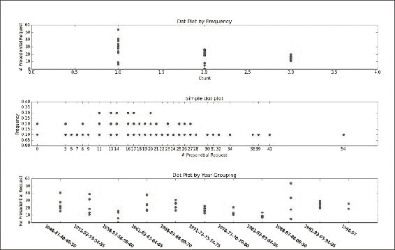

在顶部图表中，数据按频率分组。在这里，我们的 x 轴是计数，y 轴是总统请求的数量。我们可以看到，30 次或更多总统请求仅发生了一次。如前所述，点图在分析不同分组下数据点的范围方面表现良好。

中间图可以看作是一个非常简单的直方图。正如图表标题（`plt.title()`中）所说，这是点图的最简单形式，其中*x*轴是实际值，y 轴是数据集中该 x 值出现的次数。在直方图中，必须仔细设置箱体大小；否则，可能会扭曲关于数据的完整图像。然而，在这个简单的点图中可以避免这种情况。

在底部图表中，我们按年份对数据进行了分组。

## 另请参阅

+   *在第一章中的*创建匿名函数*章节中，*使用 Python 进行数据科学*

+   *在第一章中的*数据预处理*章节中，*使用 Python 进行数据科学*

+   *在第一章中的*使用 Python 获取数据*章节中，*使用 Python 进行数据科学*

+   *在第一章中的*使用字典对象*章节中，*使用 Python 进行数据科学*

# 使用散点图进行多变量数据分析

从单列开始，我们现在将转向多列。在多变量数据分析中，我们有兴趣看到我们分析的列之间是否有任何关系。在两列/变量情况下，最好的起点是标准散点图。关系可以分为四种类型，如下所示：

+   无关系

+   强

+   简单

+   多变量（不简单）关系

## 准备工作

我们将使用鸢尾花数据集。这是由罗纳德·菲舍尔爵士引入的多变量数据集。有关更多信息，请参阅[`archive.ics.uci.edu/ml/datasets/Iris`](https://archive.ics.uci.edu/ml/datasets/Iris)。

鸢尾花数据集有 150 个实例和四个属性/列。这 150 个实例由鸢尾花的三个物种（山鸢尾、维吉尼亚鸢尾和变色鸢尾）的每种 50 条记录组成。四个属性分别是以厘米为单位的萼片长度、萼片宽度、花瓣长度和花瓣宽度。因此，鸢尾花数据集还是一个很好的分类数据集。可以编写分类方法，通过适当的训练，给定一条记录，我们可以分类出该记录属于哪个物种。

## 如何做...

让我们加载必要的库并提取鸢尾花数据：

```py
# Load Librarires
from sklearn.datasets import load_iris
import numpy as np
import matplotlib.pyplot as plt
import itertools

# 1\. Load Iris dataset
data = load_iris()
x = data['data']
y = data['target']col_names = data['feature_names']
```

我们将继续演示如何使用散点图：

```py
# 2.Perform a simple scatter plot. 
# Plot 6 graphs, combinations of our columns, sepal length, sepal width,
# petal length and petal width.
plt.close('all')
plt.figure(1)
# We want a plot with
# 3 rows and 2 columns, 3 and 2 in
# below variable signifies that.
subplot_start = 321
col_numbers = range(0,4)
# Need it for labeling the graph
col_pairs = itertools.combinations(col_numbers,2)
plt.subplots_adjust(wspace = 0.5)

for col_pair in col_pairs:
    plt.subplot(subplot_start)
    plt.scatter(x[:,col_pair[0]],x[:,col_pair[1]],c=y)
    plt.xlabel(col_names[col_pair[0]])
    plt.ylabel(col_names[col_pair[1]])
    subplot_start+=1plt.show()
```

## 它是如何工作的……

scikit 库提供了一个方便的函数 `load_iris()` 来加载鸢尾花数据集。我们将在步骤 1 中使用此函数将鸢尾花数据加载到变量 `data` 中。`data` 是一个字典对象。通过 `data` 和 `target` 键，我们可以检索记录和类标签。我们将查看 `x` 和 `y` 值：

```py
>>> x.shape
(150, 4)
>>> y.shape
(150,)
>>>
```

如你所见，`x` 是一个包含 `150` 行和四列的矩阵；`y` 是一个长度为 `150` 的向量。还可以使用 `feature_names` 关键字查询 `data` 字典以查看列名，如下所示：

```py
>>> data['feature_names']

['sepal length (cm)', 'sepal width (cm)', 'petal length (cm)', 'petal width (cm)']
>>>
```

然后我们将在步骤 2 中创建一个散点图，展示鸢尾花数据的各个变量。像之前一样，我们将使用 `subplot` 来将所有图形容纳在一个单一的图形中。我们将使用 `itertools.Combination` 来获取我们列的两个组合：

```py
col_pairs = itertools.combinations(col_numbers,2)
```

我们可以迭代 `col_pairs` 来获取两个列的组合，并为每个组合绘制一个散点图，如下所示：

```py
plt.scatter(x[:,col_pair[0]],x[:,col_pair[1]],c=y)
```

我们将传递一个 `c` 参数来指定点的颜色。在这种情况下，我们将传递我们的 `y` 变量（类标签），这样鸢尾花的不同物种将在散点图中以不同的颜色绘制。

生成的图形如下：

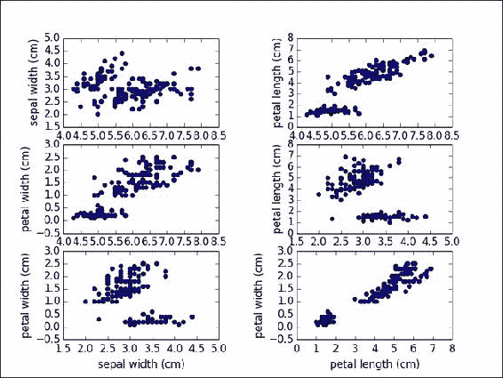

如你所见，我们已经绘制了两个列的组合。我们还使用三种不同的颜色来表示类标签。让我们看一下左下角的图形，花瓣长度与花瓣宽度的关系。我们看到，不同的值范围属于不同的类标签。现在，这为分类问题提供了很好的线索；如果问题是分类，那么花瓣宽度和花瓣长度是很好的候选变量。

### 注意

对于鸢尾花数据集，花瓣宽度和花瓣长度就可以将记录按其所属的花卉种类分类。

在特征选择过程中，可以通过双变量散点图快速做出此类观察。

## 另见

+   在第一章的 *使用迭代器* 这一节中，*使用 Python 数据科学*，

+   在第一章的 *与 itertools 一起工作* 这一节中，*使用 Python 数据科学*，

# 使用热力图

热力图是另一种有趣的可视化技术。在热力图中，数据以矩阵的形式表示，其中属性的取值范围以颜色渐变的形式表示。查看以下维基百科参考资料，了解热力图的一般介绍：

[`en.wikipedia.org/wiki/Heat_map`](http://en.wikipedia.org/wiki/Heat_map)

## 准备工作

我们将再次使用鸢尾花数据集来演示如何构建热力图。我们还将看到热力图在这组数据上可以如何使用的不同方式。

在这个示例中，我们将看到如何将整个数据表示为热力图，并如何从热力图中对数据进行各种解读。让我们继续构建鸢尾花数据集的热力图。

## 如何操作……

让我们加载必要的库并导入 Iris 数据集。我们将通过数据的均值来缩放变量：

```py
# Load libraries
from sklearn.datasets import load_iris
from sklearn.preprocessing import scale
import numpy as np
import matplotlib.pyplot as plt

# 1\. Load iris dataset
data = load_iris()
x = data['data']
y = data['target']
col_names = data['feature_names']

# 2\. Scale the variables, with mean value
x = scale(x,with_std=False)
x_ = x[1:26,]y_labels = range(1,26)
```

让我们绘制热图：

```py
# 3\. Plot the Heat map
plt.close('all')

plt.figure(1)
fig,ax = plt.subplots()
ax.pcolor(x_,cmap=plt.cm.Greens,edgecolors='k')
ax.set_xticks(np.arange(0,x_.shape[1])+0.5)
ax.set_yticks(np.arange(0,x_.shape[0])+0.5)
ax.xaxis.tick_top()
ax.yaxis.tick_left()
ax.set_xticklabels(col_names,minor=False,fontsize=10)
ax.set_yticklabels(y_labels,minor=False,fontsize=10)plt.show()
```

## 它是如何工作的…

在第 1 步中，我们将加载 Iris 数据集。与其他方法类似，我们将数据字典对象存储为 x 和 y，以确保清晰。在第 2 步中，我们将通过均值缩放变量：

```py
x = scale(x,with_std=False)
```

在参数标准设置为 false 的情况下，scale 函数将只使用列的均值来规范化数据。

缩放的原因是将每一列的值的范围调整到一个共同的尺度，通常是在 0 到 1 之间。将它们缩放到相同的尺度对于热图可视化非常重要，因为值决定了颜色梯度。

### 提示

别忘了缩放变量，使它们处于相同的范围内。如果没有适当的缩放，可能会导致某些变量的范围和尺度较大，从而主导其他变量。

在第 3 步中，我们将执行实际的绘图操作。在绘图之前，我们将对数据进行子集选择：

```py
x = x[1:26,]
col_names = data['feature_names']
y_labels = range(1,26)
```

如你所见，我们只选择了数据集中的前 25 条记录。我们这么做是为了使 y 轴上的标签可读。我们将把 x 轴和 y 轴的标签分别存储在`col_names`和`y_labels`中。最后，我们将使用 pyplot 中的`pcolor`函数绘制 Iris 数据的热图，并稍微调整一下 pcolor，使其看起来更加美观：

```py
ax.set_xticks(np.arange(0,x.shape[1])+0.5)
ax.set_yticks(np.arange(0,x.shape[0])+0.5)
```

*x*轴和*y*轴的刻度被均匀设置：

```py
ax.xaxis.tick_top()
```

x 轴刻度显示在图表的顶部：

```py
ax.yaxis.tick_left()
```

y 轴刻度显示在图表的左侧：

```py
ax.set_xticklabels(col_names,minor=False,fontsize=10)
ax.set_yticklabels(y_labels,minor=False,fontsize=10)
```

最后，我们将传递标签值。

输出图如下所示：

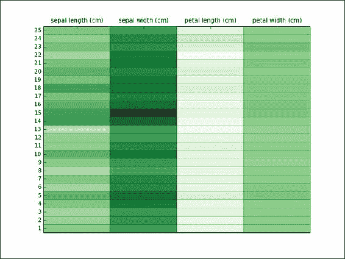

## 还有更多...

另一种有趣的使用热图的方法是查看按其各自类别分离的变量；例如，在 Iris 数据集中，我们将为三个类别绘制三个不同的热图。代码如下：

```py
x1 = x[0:50]
x2 = x[50:99]
x3 = x[100:149]

x1 = scale(x1,with_std=False)
x2 = scale(x2,with_std=False)
x3 = scale(x3,with_std=False)

plt.close('all')
plt.figure(2)
fig,(ax1, ax2, ax3) = plt.subplots(3, sharex=True, sharey=True)
y_labels = range(1,51)

ax1.set_xticks(np.arange(0,x.shape[1])+0.5)
ax1.set_yticks(np.arange(0,50,10))

ax1.xaxis.tick_bottom()
ax1.set_xticklabels(col_names,minor=False,fontsize=2)

ax1.pcolor(x1,cmap=plt.cm.Greens,edgecolors='k')
ax1.set_title(data['target_names'][0])

ax2.pcolor(x2,cmap=plt.cm.Greens,edgecolors='k')
ax2.set_title(data['target_names'][1])

ax3.pcolor(x3,cmap=plt.cm.Greens,edgecolors='k')
ax3.set_title(data['target_names'][2])plt.show()   
```

让我们看看这个图：

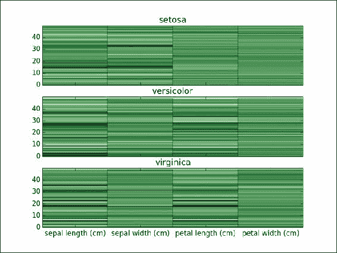

前 50 条记录属于`setosa`类，接下来的 50 条属于`versicolor`类，最后 50 条属于`virginica`类。我们将为每个类绘制三个热图。

单元格中填充的是记录的实际值。你可以注意到，对于`setosa`，萼片宽度变化较大，但对于`versicolor`和`virginica`来说则没有表现出明显的差异。

## 另见

+   *数据缩放*方法见第三章，*数据分析 - 探索与整理*

# 执行总结统计和绘图

使用总结统计的主要目的是很好地了解数据的位置和离散程度。总结统计包括均值、中位数和标准差，这些量是比较容易计算的。然而，在使用这些统计量时需要小心。如果底层数据不是单峰的，而是具有多个峰值，那么这些统计量可能并不十分有用。

### 注意

如果给定的数据是单峰的，即只有一个峰值，那么均值（给出位置）和标准差（给出方差）是非常有价值的指标。

## 准备就绪

让我们使用鸢尾花数据集来探索这些汇总统计量。在这一部分，我们没有一个完整的程序输出单一结果；然而，我们将通过不同的步骤展示不同的汇总度量。

## 如何操作……

让我们首先导入必要的库。接下来，我们将加载鸢尾花数据集：

```py
# Load Libraries
from sklearn.datasets import load_iris
import numpy as np
from scipy.stats import trim_mean

# Load iris data
data = load_iris()
x = data['data']
y = data['target']col_names = data['feature_names']
```

现在我们演示如何计算均值、修剪均值和范围值：

```py
# 1.	Calculate and print the mean value of each column in the Iris dataset
print "col name,mean value"
for i,col_name in enumerate(col_names):
    print "%s,%0.2f"%(col_name,np.mean(x[:,i]))
print    

# 2.	Trimmed mean calculation.
p = 0.1 # 10% trimmed mean
print
print "col name,trimmed mean value"
for i,col_name in enumerate(col_names):
    print "%s,%0.2f"%(col_name,trim_mean(x[:,i],p))
print

# 3.	Data dispersion, calculating and display the range values.
print "col_names,max,min,range"
for i,col_name in enumerate(col_names):
    print "%s,%0.2f,%0.2f,%0.2f"%(col_name,max(x[:,i]),min(x[:,i]),max(x[:,i])-min(x[:,i]))
print
```

最后，我们将展示方差、标准差、均值绝对偏差和中位数绝对偏差的计算：

```py
# 4.	Data dispersion, variance and standard deviation
print "col_names,variance,std-dev"
for i,col_name in enumerate(col_names):
    print "%s,%0.2f,%0.2f"%(col_name,np.var(x[:,i]),np.std(x[:,i]))
print

# 5.	Mean absolute deviation calculation  
def mad(x,axis=None):
    mean = np.mean(x,axis=axis)
    return np.sum(np.abs(x-mean))/(1.0 * len(x))

print "col_names,mad"
for i,col_name in enumerate(col_names):
    print "%s,%0.2f"%(col_name,mad(x[:,i]))
print

# 6.	Median absolute deviation calculation
def mdad(x,axis=None):
    median = np.median(x,axis=axis)
    return np.median(np.abs(x-median))

print "col_names,median,median abs dev,inter quartile range"
for i,col_name in enumerate(col_names):
    iqr = np.percentile(x[:,i],75) - np.percentile(x[i,:],25)
    print "%s,%0.2f,%0.2f,%0.2f"%(col_name,np.median(x[:,i]), mdad(x[:,i]),iqr)
print
```

## 它是如何工作的……

鸢尾花数据集的加载在此配方中没有重复。假设读者可以参考前面的配方来完成相同的操作。此外，我们假设 x 变量已经加载了所有鸢尾花记录的实例，每条记录有四列。

步骤 1 打印了鸢尾花数据集中每一列的均值。我们使用了 NumPy 的 `mean` 函数来完成此操作。打印语句的输出如下：

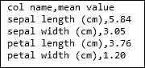

如您所见，我们得到了每列的均值。计算均值的代码如下：

```py
np.mean(x[:,i])
```

我们在循环中遍历了所有的行和列。因此，我们通过列计算均值。

另一个有趣的度量是所谓的修剪均值。它有其自身的优点。给定样本的 10% 修剪均值是通过排除样本中最大和最小的 10% 值，计算剩余 80% 样本的算术均值来得出的。

### 注意

与常规均值相比，修剪均值对异常值的敏感度较低。

SciPy 提供了一个修剪均值函数。我们将在步骤 2 中演示修剪均值的计算。输出结果如下：

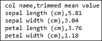

使用鸢尾花数据集时，我们没有看到太大的差异，但在实际数据集中，修剪均值非常有用，因为它能更好地反映数据的位置。

到目前为止，我们所看到的是数据的位置，均值和修剪均值能很好地推断出数据的位置。另一个重要的方面是数据的离散程度。查看数据离散度的最简单方法是范围，它的定义如下：给定一组值 x，范围是 x 的最大值减去 x 的最小值。在步骤 3 中，我们将计算并打印相同的结果：

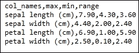

### 注意

如果数据的范围非常窄，例如，大多数值集中在单一值附近，且我们有一些极端值，那么范围可能会产生误导。

当数据落在一个非常狭窄的范围内，并且围绕单个值聚集时，方差被用作数据分布/扩展的典型度量。方差是单个值与均值之间差的平方的和，然后除以实例数。在第 4 步中，我们将看到方差计算。

在前面的代码中，除了方差，我们还可以看到标准差，即标准差。由于方差是差的平方，因此它与原始数据的度量尺度不同。我们将使用标准差，它是方差的平方根，以便将数据恢复到原始尺度。让我们来看一下打印语句的输出，其中列出了方差和标准差：

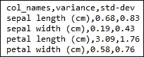

正如我们之前提到的，均值对异常值非常敏感；方差也使用均值，因此也容易受到与均值相同的问题影响。我们可以使用其他方差度量来避免这一陷阱。一个这样的度量是绝对平均偏差；它不是取单个值与均值之间差的平方并将其除以实例数，而是取均值与单个值之间差的绝对值，并将其除以实例数。在第 5 步中，我们将为此定义一个函数：

```py
def mad(x,axis=None):
mean = np.mean(x,axis=axis)
return np.sum(np.abs(x-mean))/(1.0 * len(x))
```

如您所见，函数返回均值与单个值之间的绝对差异。本步骤的输出如下：

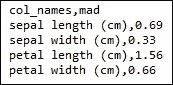

当数据包含许多异常值时，另有一组度量非常有用。它们是中位数和百分位数。我们在前一部分绘制单变量数据时已经看到过百分位数。传统上，中位数定义为数据集中一个值，使得数据集中一半的点小于该值，另一半大于该值。

### 注意

百分位数是中位数概念的推广。第 50 百分位数就是传统的中位数值。

我们在前一部分看到了第 25 百分位数和第 75 百分位数。第 25 百分位数是这样一个值，数据集中有 25%的点小于这个值：

```py
>>> 
>>> a = [8,9,10,11]
>>> np.median(a)
9.5
>>> np.percentile(a,50)
9.5
```

中位数是数据分布位置的度量。通过使用百分位数，我们可以得到数据分布的一个度量，即四分位差。四分位差是第 75 百分位数与第 25 百分位数之间的距离。类似于之前解释的均值绝对偏差，我们也有中位数绝对偏差。

在第 6 步中，我们将计算并显示四分位差和中位数绝对偏差。我们将定义以下函数以计算中位数绝对偏差：

```py
def mdad(x,axis=None):
median = np.median(x,axis=axis)
return np.median(np.abs(x-median))
```

输出结果如下：

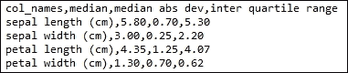

## 另见

+   第三章中的 *分组数据与使用图表* 章节，*数据分析 - 探索与整理*

# 使用箱形图和须状图

箱形图和须状图是与汇总统计信息非常配合的工具，可以查看数据的统计摘要。箱形图可以有效地表示数据中的四分位数，也可以显示离群值（如果有的话），突出显示数据的整体结构。箱形图由以下几个特征组成：

+   一条水平线表示中位数，标示数据的位置

+   跨越四分位距的箱体，表示测量分散度

+   一组从中央箱体水平和垂直延伸的须状线，它们表示数据分布的尾部。

## 准备开始

让我们使用箱形图来观察 Iris 数据集。

## 如何做…

让我们首先加载必要的库，然后加载 Iris 数据集：

```py
# Load Libraries
from sklearn.datasets import load_iris
import matplotlib.pyplot as plt

# Load Iris dataset
data = load_iris()
x = data['data']
plt.close('all')
```

让我们演示如何创建一个箱形图：

```py
# Plot the box and whisker
fig = plt.figure(1)
ax = fig.add_subplot(111)
ax.boxplot(x)
ax.set_xticklabels(data['feature_names'])
plt.show()    
```

## 工作原理…

这段代码非常简单。我们将加载 Iris 数据集到 x，并将 x 的值传递给 pyplot 中的箱形图函数。如你所知，我们的 x 有四列。箱形图如下所示：

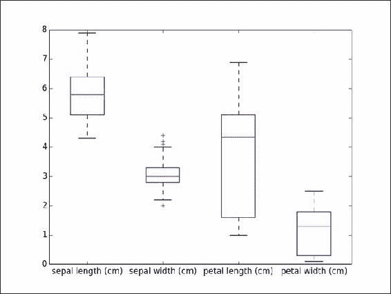

箱形图在一个图中捕捉了四个列的位置和变化。

水平的红线表示中位数，它标示了数据的位置。你可以看到，花萼长度的中位数高于其余列。

可以看到跨越四个变量的箱体，表示测量分散度的四分位距。

你可以看到一组从中央箱体水平和垂直延伸的须状线，它们表示数据分布的尾部。须状线帮助你观察数据集中的极端值。

## 还有更多内容…

看到数据如何在不同类标签中分布也是很有趣的。类似于我们在散点图中的做法，接下来我们将通过箱形图实现相同的操作。以下代码和图表展示了如何在不同类标签之间绘制箱形图：

```py
y=data['target']
class_labels = data['target_names']

fig = plt.figure(2,figsize=(18,10))
sub_plt_count = 321
for t in range(0,3):
    ax = fig.add_subplot(sub_plt_count)
    y_index = np.where(y==t)[0]
    x_ = x[y_index,:]
    ax.boxplot(x_)
    ax.set_title(class_labels[t])   
    ax.set_xticklabels(data['feature_names'])
    sub_plt_count+=1
plt.show()
```

如下图所示，我们现在为每个类标签绘制了一个箱形图：

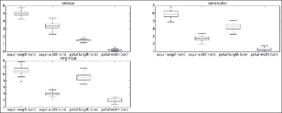

# 数据填充

在许多现实世界的场景中，我们会遇到不完整或缺失数据的问题。我们需要一个策略来处理这些不完整的数据。这个策略可以单独使用数据，或者在有类标签的情况下结合类标签来制定。

## 准备开始

让我们首先看看不使用类标签进行数据填充的方法。

一个简单的技术是忽略缺失值，因此避免数据填充的开销。然而，这只适用于数据充足的情况，而这并非总是如此。如果数据集中有非常少的缺失值，并且缺失值的百分比很小，我们可以忽略它们。通常情况下，问题不在于忽略单个变量的单个值，而在于忽略包含此变量的元组。在忽略整个元组时，我们必须更加小心，因为该元组中的其他属性可能对我们的任务非常关键。

处理缺失数据的更好方法是进行估算。现在，估算过程可以仅考虑数据或与类标签一起进行。对于连续变量，可以使用均值、中位数或最频繁的值来替换缺失值。Scikit-learn 在 preprocessing 模块中提供了一个`Imputer()`函数来处理缺失数据。让我们看一个例子，我们将在鸢尾花数据集中执行数据填充以更好地理解填充技术。

## 如何操作…

让我们首先加载必要的库来开始。我们将像往常一样加载鸢尾花数据集，并引入一些任意的缺失值：

```py
# Load Libraries
from sklearn.datasets import load_iris
from sklearn.preprocessing import Imputer
import numpy as np
import numpy.ma as ma

# 1\. Load Iris Data Set
data = load_iris()
x = data['data']
y = data['target']

# Make a copy of hte original x value
x_t = x.copy()

# 2.	Introduce missing values into second row
x_t[2,:] = np.repeat(0,x.shape[1])
```

让我们看看数据填充的实际效果：

```py
# 3.	Now create an imputer object with strategy as mean, 
# i.e. fill the missing values with the mean value of the missing column.
imputer = Imputer(missing_values=0,strategy="mean")
x_imputed = imputer.fit_transform(x_t)

mask = np.zeros_like(x_t)
mask[2,:] = 1
x_t_m = ma.masked_array(x_t,mask)

print np.mean(x_t_m,axis=0)print x_imputed[2,:]
```

## 工作原理…

第一步是将鸢尾花数据加载到内存中。在第二步中，我们将引入一些缺失值；在本例中，我们将所有第三行的列都设置为`0`。

在第 3 步中，我们将使用 Imputer 对象处理缺失数据：

```py
imputer = Imputer(missing_values=0,strategy="mean")
```

如您所见，我们需要两个参数，`missing_values`来指定缺失值，以及策略，这是一种处理这些缺失值的方法。Imputer 对象提供以下三种策略：

+   均值

+   中位数

+   most_frequent

使用均值，任何值为`0`的单元格都将被其所属列的均值替换。对于中位数，将使用中位数值来替换`0`，而对于`most_frequent`，正如其名称所示，将使用最频繁出现的值来替换`0`。基于我们应用程序的上下文，可以应用其中一种策略。

x[2,:]的初始值如下：

```py
>>> x[2,:]
array([ 4.7,  3.2,  1.3,  0.2])

```

我们将所有列中的值设置为`0`，并使用均值策略的填充器。

在查看填充器输出之前，让我们计算所有列的均值：

```py
import numpy.ma as ma
mask = np.zeros_like(x_t)
mask[2,:] = 1
x_t_m = ma.masked_array(x_t,mask)

print np.mean(x_t_m,axis=0)
```

输出如下：

```py
[5.851006711409397 3.053020134228189 3.7751677852349017 1.2053691275167793]
```

现在，让我们查看第 2 行的填充输出：

```py
print x_imputed[2,:]
```

以下是输出：

```py
[ 5.85100671  3.05302013  3.77516779  1.20536913]
```

正如您所见，填充器已经用各自列的均值填充了缺失的值。

## 还有更多内容…

正如我们讨论的，我们还可以利用类标签并使用均值或中位数来填补缺失值：

```py
# Impute based on class label
missing_y = y[2]
x_missing = np.where(y==missing_y)[0]
y = data['target']
# Mean stragegy 
print np.mean(x[x_missing,:],axis=0)
# Median stragegy
print np.median(x[x_missing,:],axis=0)
```

与其使用整个数据集的均值或中位数，我们将数据子集化到缺失元组的类变量中：

```py
missing_y = y[2]
```

我们在第三条记录中引入了缺失值。我们将把与此记录相关的类别标签赋值给 `missing_y` 变量：

```py
x_missing = np.where(y==missing_y)[0]
```

现在，我们将提取所有具有相同类别标签的元组：

```py
# Mean stragegy 
print np.mean(x[x_missing,:],axis=0)
# Median stragegy
print np.median(x[x_missing,:],axis=0)
```

我们现在可以通过用所有属于该类别标签的元组的均值或中位数来替换缺失的元组，应用均值或中位数策略。

我们取了该子集的均值/中位数作为数据插补过程。

## 参见

+   在第三章中的*执行汇总统计*食谱，*分析数据 - 探索与整理*

# 执行随机采样

在这里，我们将学习如何执行数据的随机采样。

## 准备工作

通常，在访问整个数据集非常昂贵的情况下，采样可以有效地用于提取数据集的一部分进行分析。采样在探索性数据分析（EDA）中也可以有效使用。样本应该是底层数据集的良好代表。它应具有与底层数据集相同的特征。例如，就均值而言，样本均值应尽可能接近原始数据的均值。

在简单随机采样中，每个元组被选中的机会是均等的。对于我们的示例，我们想从鸢尾花数据集中随机选择十条记录。

## 如何执行...

我们将从加载必要的库并导入鸢尾花数据集开始：

```py
# Load libraries
from sklearn.datasets import load_iris
import numpy as np

# 1.	Load the Iris data set
data = load_iris()
x = data['data']
```

让我们演示如何执行采样：

```py
# 2.	Randomly sample 10 records from the loaded dataset
no_records = 10
x_sample_indx = np.random.choice(range(x.shape[0]),no_records)
print x[x_sample_indx,:]
```

## 它是如何工作的…

在步骤 1 中，我们将加载鸢尾花数据集。在步骤 2 中，我们将使用 `numpy.random` 中的 `choice` 函数进行随机选择。

我们将传递给 `choice` 函数的两个参数是原始数据集中所有行的范围变量以及我们需要的样本大小。从零到原始数据集中的总行数，`choice` 函数会随机选择 n 个整数，其中 n 是样本的大小，由我们的 `no_records` 决定。

另一个重要方面是 `choice` 函数的一个参数是 `replace`，默认设置为 True；它指定是否需要进行有放回或无放回采样。无放回采样会从原始列表中移除已采样的项，因此它不会成为未来采样的候选项。有放回采样则相反；每个元素在未来的采样中都有相等的机会被再次采样，即使它之前已经被采样过。

## 还有更多…

### 分层采样

如果底层数据集由不同的组组成，简单的随机抽样可能无法捕获足够的样本以代表数据。例如，在一个二分类问题中，10%的数据属于正类，90%属于负类。这种问题在机器学习中被称为类别不平衡问题。当我们在这种不平衡数据集上进行抽样时，样本也应该反映前述的百分比。这种抽样方法叫做分层抽样。我们将在未来的机器学习章节中详细讨论分层抽样。

### 渐进式抽样

我们如何确定给定问题所需的正确样本大小？我们之前讨论了几种抽样技术，但我们没有选择正确样本大小的策略。这个问题没有简单的答案。一种方法是使用渐进式抽样。选择一个样本大小，通过任何抽样技术获取样本，对数据执行所需的操作，并记录结果。然后，增加样本大小并重复这些步骤。这种迭代过程叫做渐进式抽样。

# 数据缩放

在这一部分，我们将学习如何进行数据缩放。

## 准备就绪

缩放是一种重要的数据转换类型。通常，通过对数据集进行缩放，我们可以控制数据类型可以采用的值的范围。在一个包含多列的数据集中，范围和尺度更大的列往往会主导其他列。我们将对数据集进行缩放，以避免这些干扰。

假设我们正在根据功能数量和代码行数来比较两个软件产品。与功能数量的差异相比，代码行数的差异会非常大。在这种情况下，我们的比较将被代码行数所主导。如果我们使用任何相似度度量，结果的相似度或差异将主要受代码行数的影响。为了避免这种情况，我们将采用缩放。最简单的缩放方法是最小-最大缩放。让我们来看看在一个随机生成的数据集上如何进行最小-最大缩放。

## 如何做……

让我们生成一些随机数据来测试我们的缩放功能：

```py
# Load Libraries
import numpy as np

# 1.	Generate some random data for scaling
np.random.seed(10)
x = [np.random.randint(10,25)*1.0 for i in range(10)]
```

现在，我们将演示缩放：

```py
# 2.Define a function, which can perform min max scaling given a list of numbers
def min_max(x):
    return [round((xx-min(x))/(1.0*(max(x)-min(x))),2) for xx in x]

# 3.Perform scaling on the given input list.    
print x 
print min_max(x)    
```

## 它是如何工作的……

在步骤 1 中，我们将生成一个介于 10 到 25 之间的随机数字列表。在步骤 2 中，我们将定义一个函数来对给定的输入执行最小-最大缩放。最小-最大缩放的定义如下：

```py
x_scaled = x – min(x) / max(x) –min (x)
```

在步骤 2 中，我们定义一个函数来执行上述任务。

这会将给定值的范围进行转换。转换后，值将落在[0, 1]范围内。

在步骤 3 中，我们将首先打印原始输入列表。输出结果如下：

```py
[19, 23, 14, 10, 11, 21, 22, 19, 23, 10]
```

我们将把这个列表传递给我们的`min_max`函数，以获得缩放后的输出，结果如下：

```py
[0.69, 1.0, 0.31, 0.0, 0.08, 0.85, 0.92, 0.69, 1.0, 0.0]
```

你可以看到缩放的效果；最小的数字 `10` 被赋值为 `0.0`，而最大的数字 `23` 被赋值为 `1.0`。因此，我们将数据缩放到 [0,1] 范围内。

## 还有更多…

Scikit-learn 提供了一个 MinMaxScaler 函数来实现这个功能：

```py
from sklearn.preprocessing import MinMaxScaler
import numpy as np

np.random.seed(10)
x = np.matrix([np.random.randint(10,25)*1.0 for i in range(10)])
x = x.T
minmax = MinMaxScaler(feature_range=(0.0,1.0))
print x
x_t = minmax.fit_transform(x)
print x_t
```

输出如下：

```py
[19.0, 23.0, 14.0, 10.0, 11.0, 21.0, 22.0, 19.0, 23.0, 10.0]
[0.69, 1.0, 0.31, 0.0, 0.08, 0.85, 0.92, 0.69, 1.0, 0.0]
```

我们看到过将数据缩放到范围（0,1）的例子；这可以扩展到任何范围。假设我们的新范围是 `nr_min, nr_max`，那么最小-最大公式会修改如下：

```py
x_scaled =  ( x – min(x) / max(x) –min (x) ) * (nr_max- nr_min) + nr_min
```

以下是 Python 代码：

```py
import numpy as np

np.random.seed(10)
x = [np.random.randint(10,25)*1.0 for i in range(10)]

def min_max_range(x,range_values):
    return [round( ((xx-min(x))/(1.0*(max(x)-min(x))))*(range_values[1]-range_values[0]) \
    + range_values[0],2) for xx in x]

print min_max_range(x,(100,200))
```

其中，range_values 是一个包含两个元素的元组，0 位置是新范围的下限，1 位置是上限。让我们在输入数据上调用这个函数，看看输出结果如下：

```py
print min_max_range(x,(100,200))

[169.23, 200.0, 130.77, 100.0, 107.69, 184.62, 192.31, 169.23, 200.0, 100.0]
```

最低值 `10` 现在被缩放到 `100`，最高值 `23` 被缩放到 `200`。

# 数据标准化

标准化是将输入数据转换为均值为 `0`，标准差为 `1` 的过程。

## 准备就绪

如果你给定一个向量 X，X 的均值为 `0` 且标准差为 `1` 可以通过以下公式实现：

### 注意

标准化 X = x – 均值(值) / 标准差(X)

让我们看看如何在 Python 中实现这个过程。

## 如何实现…

首先，让我们导入必要的库。接着，我们将生成输入数据：

```py
# Load Libraries
import numpy as np
from sklearn.preprocessing import scale

# Input data generation
np.random.seed(10)
x = [np.random.randint(10,25)*1.0 for i in range(10)]
```

我们现在准备演示标准化：

```py
x_centered = scale(x,with_mean=True,with_std=False)
x_standard = scale(x,with_mean=True,with_std=True)

print x
print x_centered
print x_standard
print "Orginal x mean = %0.2f, Centered x mean = %0.2f, Std dev of \
        standard x =%0.2f"%(np.mean(x),np.mean(x_centered),np.std(x_standard))
```

## 它是如何工作的…

我们将使用 np.random 生成一些随机数据：

```py
x = [np.random.randint(10,25)*1.0 for i in range(10)]
```

我们将使用 scikit-learn 的 `scale` 函数进行标准化：

```py
x_centered = scale(x,with_mean=True,with_std=False)
x_standard = scale(x,with_mean=True,with_std=True)
```

`x_centered` 只使用均值进行缩放；你可以看到 `with_mean` 参数设置为 `True`，`with_std` 设置为 `False`。

`x_standard` 使用均值和标准差进行了标准化。

现在让我们来看一下输出。

原始数据如下：

```py
[19.0, 23.0, 14.0, 10.0, 11.0, 21.0, 22.0, 19.0, 23.0, 10.0]

Next, we will print x_centered, where we centered it with the mean value:

[ 1.8  5.8 -3.2 -7.2 -6.2  3.8  4.8  1.8  5.8 -7.2]

Finally we will print x_standardized, where we used both the mean and standard deviation:

[ 0.35059022  1.12967961 -0.62327151 -1.4023609  -1.20758855  0.74013492
  0.93490726  0.35059022  1.12967961 -1.4023609 ]

Orginal x mean = 17.20, Centered x mean = 0.00, Std dev of standard x =1.00
```

## 还有更多…

### 注意

标准化可以推广到任何级别和范围，具体如下：

标准化值 = 值 – 水平 / 范围

我们将前面的公式分成两部分：仅分子部分，称为居中，和整个公式，称为标准化。使用均值，居中在回归中起着关键作用。考虑一个包含两个属性的数据集，体重和身高。我们将对数据进行居中，使得预测变量体重的均值为 `0`。这使得解释截距变得更加容易。截距将被解释为在预测变量值设为其均值时，预期的身高。

# 执行分词

当你得到任何文本时，第一步是将文本分词成一个基于给定问题需求的格式。分词是一个非常广泛的术语；我们可以在以下不同的粒度级别进行分词：

+   段落级

+   句子级

+   词级

在本节中，我们将看到句子级别和词语级别的分词。方法相似，可以轻松应用于段落级别或根据问题需要的其他粒度级别。

## 准备就绪

我们将看到如何在一个示例中执行句子级别和词语级别的分词。

## 如何执行……

让我们开始演示句子分词：

```py
# Load Libraries
from nltk.tokenize import sent_tokenize
from nltk.tokenize import word_tokenize
from collections import defaultdict

# 1.Let us use a very simple text to demonstrate tokenization
# at sentence level and word level. You have seen this example in the
# dictionary recipe, except for some punctuation which are added.

sentence = "Peter Piper picked a peck of pickled peppers. A peck of pickled \
peppers, Peter Piper picked !!! If Peter Piper picked a peck of pickled \
peppers, Wheres the peck of pickled peppers Peter Piper picked ?"

# 2.Using nltk sentence tokenizer, we tokenize the given text into sentences
# and verify the output using some print statements.

sent_list = sent_tokenize(sentence)

print "No sentences = %d"%(len(sent_list))
print "Sentences"
for sent in sent_list: print sent

# 3.With the sentences extracted let us proceed to extract
# words from these sentences.
word_dict = defaultdict(list)
for i,sent in enumerate(sent_list):
    word_dict[i].extend(word_tokenize(sent))

print word_dict
```

下面简要了解一下 NLTK 如何执行句子分词：

```py
def sent_tokenize(text, language='english'):
    """
    Return a sentence-tokenized copy of *text*,
    using NLTK's recommended sentence tokenizer
    (currently :class:`.PunktSentenceTokenizer`
    for the specified language).

    :param text: text to split into sentences
    :param language: the model name in the Punkt corpus
    """
    tokenizer = load('tokenizers/punkt/{0}.pickle'.format(language))
    return tokenizer.tokenize(text)
```

## 它是如何工作的……

在第 1 步，我们将初始化一个名为 sentence 的变量，并为其赋值一个段落。这与我们在字典示例中使用的例子相同。在第 2 步，我们将使用 nltk 的`sent_tokenize`函数从给定的文本中提取句子。你可以查看[nltk 的`sent_tokenize`函数](http://www.nltk.org/api/nltk.tokenize.html#nltk.tokenize.sent_tokenize)的源代码。

如你所见，`sent_tokenize`加载了一个预构建的分词模型，使用这个模型，它将给定文本进行分词并返回输出。这个分词模型是`nltk.tokenize.punkt`模块中的 PunktSentenceTokenizer 实例。这个分词器在不同语言中有多个预训练的实例。在我们的案例中，你可以看到语言参数设置为英文。

让我们看一下这一步的输出：

```py
No sentences = 3
Sentences
Peter Piper picked a peck of pickled peppers.
A peck of pickled             peppers, Peter Piper picked !!!
If Peter Piper picked a peck of pickled             peppers, Wheres the peck of pickled peppers Peter Piper picked ?
```

如你所见，句子分词器已将输入文本拆分为三句。让我们继续进行第 3 步，在该步骤中我们将把这些句子分词成单词。这里，我们将使用`word_tokenize`函数从每个句子中提取单词，并将它们存储在一个字典中，其中键是句子编号，值是该句子的单词列表。让我们查看打印语句的输出：

```py
defaultdict(<type 'list'>, {0: ['Peter', 'Piper', 'picked', 'a', 'peck', 'of', 'pickled', 'peppers', '.'], 1: ['A', 'peck', 'of', 'pickled', 'peppers', ',', 'Peter', 'Piper', 'picked', '!', '!', '!'], 2: ['If', 'Peter', 'Piper', 'picked', 'a', 'peck', 'of', 'pickled', 'peppers', ',', 'Wheres', 'the', 'peck', 'of', 'pickled', 'peppers', 'Peter', 'Piper', 'picked', '?']})
```

`word_tokenize`使用正则表达式将句子分割成单词。查看`word_tokenize`的源代码会很有帮助，源代码可以在[`www.nltk.org/_modules/nltk/tokenize/punkt.html#PunktLanguageVars.word_tokenize`](http://www.nltk.org/_modules/nltk/tokenize/punkt.html#PunktLanguageVars.word_tokenize)找到。

## 还有更多内容…

对于句子分词，我们已经在 NLTK 中看到了实现方法。还有其他可用的方法。`nltk.tokenize.simple`模块有一个`line_tokenize`方法。让我们使用之前相同的输入句子，使用`line_tokenize`进行处理：

```py
# Load Libraries
from nltk.tokenize import line_tokenize

sentence = "Peter Piper picked a peck of pickled peppers. A peck of pickled \
peppers, Peter Piper picked !!! If Peter Piper picked a peck of pickled \
peppers, Wheres the peck of pickled peppers Peter Piper picked ?"

sent_list = line_tokenize(sentence)
print "No sentences = %d"%(len(sent_list))
print "Sentences"
for sent in sent_list: print sent

# Include new line characters
sentence = "Peter Piper picked a peck of pickled peppers. A peck of pickled\n \
peppers, Peter Piper picked !!! If Peter Piper picked a peck of pickled\n \
peppers, Wheres the peck of pickled peppers Peter Piper picked ?"

sent_list = line_tokenize(sentence)
print "No sentences = %d"%(len(sent_list))
print "Sentences"
for sent in sent_list: print sent
```

输出如下：

```py
No sentences = 1
Sentences
Peter Piper picked a peck of pickled peppers. A peck of pickled             peppers, Peter Piper picked !!! If Peter Piper picked a peck of pickled             peppers, Wheres the peck of pickled peppers Peter Piper picked ?
```

你可以看到我们只提取了输入中的句子。

现在让我们修改输入，包含换行符：

```py
sentence = "Peter Piper picked a peck of pickled peppers. A peck of pickled\n \
peppers, Peter Piper picked !!! If Peter Piper picked a peck of pickled\n \
peppers, Wheres the peck of pickled peppers Peter Piper picked ?"
```

注意，我们添加了一个换行符。我们将再次应用`line_tokenize`来获得以下输出：

```py
No sentences = 3
Sentences
Peter Piper picked a peck of pickled peppers. A peck of pickled
             peppers, Peter Piper picked !!! If Peter Piper picked a peck of pickled
             peppers, Wheres the peck of pickled peppers Peter Piper picked ?
```

你可以看到它已经根据换行符对我们的句子进行了分词，现在我们有了三句。

请参阅*第三章*的*NLTK*书籍，它有更多关于句子和词语分词的参考。可以在[`www.nltk.org/book/ch03.html`](http://www.nltk.org/book/ch03.html)找到。

## 另见

+   在第一章中使用*字典对象*，*使用 Python 进行数据科学*

+   在第一章中使用*写入列表*，*使用 Python 进行数据科学*

# 移除停用词

在文本处理过程中，我们关注的是能够帮助我们将给定文本与语料库中其他文本区分开来的词语或短语。我们将这些词语或短语称为关键词短语。每个文本挖掘应用程序都需要一种方法来找出关键词短语。信息检索应用程序需要关键词短语来轻松检索和排序搜索结果。文本分类系统则需要关键词短语作为特征，以供分类器使用。

这就是停用词的作用所在。

> *“有时，一些极为常见的词语，它们在帮助选择与用户需求匹配的文档方面似乎没有什么价值，会被完全从词汇表中排除。这些词语被称为停用词。”*

*由 Christopher D. Manning, Prabhakar Raghavan 和 Hinrich Schütze 编写的《信息检索导论》*

Python NLTK 库为我们提供了一个默认的停用词语料库，我们可以加以利用，如下所示：

```py
>>> from nltk.corpus import stopwords
>>> stopwords.words('english')
[u'i', u'me', u'my', u'myself', u'we', u'our', u'ours', u'ourselves', u'you', u'your', u'yours', u'yourself', u'yourselves', u'he', u'him', u'his', u'himself', u'she', u'her', u'hers', u'herself', u'it', u'its', u'itself', u'they', u'them', u'their', u'theirs', u'themselves', u'what', u'which', u'who', u'whom', u'this', u'that', u'these', u'those', u'am', u'is', u'are', u'was', u'were', u'be', u'been', u'being', u'have', u'has', u'had', u'having', u'do', u'does', u'did', u'doing', u'a', u'an', u'the', u'and', u'but', u'if', u'or', u'because', u'as', u'until', u'while', u'of', u'at', u'by', u'for', u'with', u'about', u'against', u'between', u'into', u'through', u'during', u'before', u'after', u'above', u'below', u'to', u'from', u'up', u'down', u'in', u'out', u'on', u'off', u'over', u'under', u'again', u'further', u'then', u'once', u'here', u'there', u'when', u'where', u'why', u'how', u'all', u'any', u'both', u'each', u'few', u'more', u'most', u'other', u'some', u'such', u'no', u'nor', u'not', u'only', u'own', u'same', u'so', u'than', u'too', u'very', u's', u't', u'can', u'will', u'just', u'don', u'should', u'now']
>>>
```

你可以看到，我们已经打印出了英语的停用词列表。

## 如何实现……

让我们加载必要的库并引入输入文本：

```py
# Load libraries
from nltk.corpus import stopwords
from nltk.tokenize import word_tokenize
import string

text = "Text mining, also referred to as text data mining, roughly equivalent to text analytics,\
refers to the process of deriving high-quality information from text. High-quality information is \
typically derived through the devising of patterns and trends through means such as statistical \
pattern learning. Text mining usually involves the process of structuring the input text \
(usually parsing, along with the addition of some derived linguistic features and the removal \
of others, and subsequent insertion into a database), deriving patterns within the structured data, \
and finally evaluation and interpretation of the output. 'High quality' in text mining usually \
refers to some combination of relevance, novelty, and interestingness. Typical text mining tasks \
include text categorization, text clustering, concept/entity extraction, production of granular \
taxonomies, sentiment analysis, document summarization, and entity relation modeling \
(i.e., learning relations between named entities).Text analysis involves information retrieval, \
lexical analysis to study word frequency distributions, pattern recognition, tagging/annotation, \
information extraction, data mining techniques including link and association analysis, \
visualization, and predictive analytics. The overarching goal is, essentially, to turn text \
into data for analysis, via application of natural language processing (NLP) and analytical \
methods.A typical application is to scan a set of documents written in a natural language and \
either model the document set for predictive classification purposes or populate a database \
or search index with the information extracted."
```

现在，让我们演示停用词移除的过程：

```py
words = word_tokenize(text)
# 2.Let us get the list of stopwords from nltk stopwords english corpus.
stop_words = stopwords.words('english')

print "Number of words = %d"%(len(words)) 
# 3.	Filter out the stop words.
words = [w for w in words if w not in stop_words]
print "Number of words,without stop words = %d"%(len(words)) 

words = [w for w in words if w not in string.punctuation]
print "Number of words,without stop words and punctuations = %d"%(len(words))
```

## 它是如何工作的……

在第 1 步中，我们将从 nltk 导入必要的库。我们需要英语停用词列表，因此我们将导入停用词语料库。我们还需要将输入文本分解为单词。为此，我们将从`nltk.tokenize`模块中导入`word_tokenize`函数。

对于我们的输入文本，我们从维基百科的文本挖掘介绍部分获取了段落，详细内容可以在[`en.wikipedia.org/wiki/Text_mining`](http://en.wikipedia.org/wiki/Text_mining)中找到。

最后，我们将使用`word_tokenize`函数将输入文本分词。现在，`words`是一个包含所有从输入中分词的单词的列表。让我们看看打印函数的输出，打印出`words`列表的长度：

```py
Number of words = 259
```

我们的列表中共有 259 个词。

在第 2 步中，我们将编译一个包含英语停用词的列表，称为`stop_words`。

在第 2 步中，我们将使用列表推导式来获取最终的词汇表；只有那些不在我们在第 2 步中创建的停用词列表中的词汇才会被保留。这样，我们就能从输入文本中移除停用词。现在让我们看看我们打印语句的输出，打印出移除停用词后的最终列表：

```py
Number of words,without stop words = 195
```

你可以看到，我们从输入文本中去除了将近 64 个停用词。

## 还有更多……

停用词不仅限于常规的英语单词。它是基于上下文的，取决于手头的应用程序以及您希望如何编程您的系统。理想情况下，如果我们不关心特殊字符，我们可以将它们包含在停用词列表中。让我们看一下以下代码：

```py
import string
words = [w for w in words if w not in string.punctuation]
print "Number of words,without stop words and punctuations = %d"%(len(words)) 
```

在这里，我们将执行另一个列表推导式，以便从单词中移除标点符号。现在，输出结果如下所示：

```py
Number of words, without stop words and punctuations = 156
```

### 提示

请记住，停用词移除是基于上下文的，并且取决于应用程序。如果您正在处理移动端或聊天室文本的情感分析应用，表情符号是非常有用的。您不会将它们移除，因为它们构成了下游机器学习应用的一个非常好的特征集。

通常情况下，在文档中，停用词的频率是非常高的。然而，您的语料库中可能还有其他词语，它们的频率也可能非常高。根据您的上下文，您可以将它们添加到停用词列表中。

## 另见

+   *执行分词* 方案在 第三章，*分析数据 - 探索与清洗*

+   *列表生成* 方案在 第一章，*使用 Python 进行数据科学*

# 词干提取

在这里，我们将看到如何进行词干提取。

## 准备工作

文本的标准化是一个不同的课题，我们需要不同的工具来应对它。在本节中，我们将探讨如何将单词转换为其基本形式，以便为我们的处理带来一致性。我们将从传统的方法开始，包括词干提取和词形还原。英语语法决定了某些单词在句子中的用法。例如，perform、performing 和 performs 表示相同的动作；它们根据语法规则出现在不同的句子中。

> *词干提取和词形还原的目标是将单词的屈折形式，有时还包括衍生形式，归约为一个共同的基本形式。*
> 
> *《信息检索简介》 作者：Christopher D. Manning, Prabhakar Raghavan & Hinrich Schütze*

让我们来看看如何使用 Python NLTK 执行词干提取。NLTK 为我们提供了一套丰富的功能，可以帮助我们轻松完成词干提取：

```py
>>> import nltk.stem
>>> dir(nltk.stem)
['ISRIStemmer', 'LancasterStemmer', 'PorterStemmer', 'RSLPStemmer', 'RegexpStemmer', 'SnowballStemmer', 'StemmerI', 'WordNetLemmatizer', '__builtins__', '__doc__', '__file__', '__name__', '__package__', '__path__', 'api', 'isri', 'lancaster', 'porter', 'regexp', 'rslp', 'snowball', 'wordnet']
>>>  
```

我们可以看到模块中的函数列表，针对我们的兴趣，以下是一些词干提取器：

+   Porter – Porter 词干提取器

+   Lancaster – Lancaster 词干提取器

+   Snowball – Snowball 词干提取器

Porter 是最常用的词干提取器。该算法在将单词转化为根形式时并不是特别激进。

Snowball 是对 Porter 的改进。它在计算时间上比 Porter 更快。

Lancaster 是最激进的词干提取器。与 Porter 和 Snowball 不同，最终的单词令牌在经过 Lancaster 处理后将无法被人类读取，但它是这三者中最快的。

在本方案中，我们将使用其中一些函数来查看如何进行单词的词干提取。

## 如何做…

首先，让我们加载必要的库并声明我们希望在其上演示词干提取的数据集：

```py
# Load Libraries
from nltk import stem

#1\. small input to figure out how the three stemmers perform.
input_words = ['movies','dogs','planes','flowers','flies','fries','fry','weeks','planted','running','throttle']
```

让我们深入了解以下不同的词干提取算法：

```py
#2.Porter Stemming
porter = stem.porter.PorterStemmer()
p_words = [porter.stem(w) for w in input_words]
print p_words

#3.Lancaster Stemming
lancaster = stem.lancaster.LancasterStemmer()
l_words = [lancaster.stem(w) for w in input_words]
print l_words

#4.Snowball stemming
snowball = stem.snowball.EnglishStemmer()
s_words = [snowball.stem(w) for w in input_words]
print s_words

wordnet_lemm = stem.WordNetLemmatizer()
wn_words = [wordnet_lemm.lemmatize(w) for w in input_words]
print wn_words
```

## 它是如何工作的…

在第 1 步中，我们将从 nltk 导入词干模块。我们还将创建一个我们希望进行词干提取的单词列表。如果你仔细观察，这些单词被选择时已经具有不同的词缀，包括 s、ies、ed、ing 等。此外，还有一些单词已经处于根形式，如“throttle”和“fry”。这个示例的目的是查看词干提取算法如何处理它们。

第 2、3 和 4 步非常相似；我们将分别对输入文本应用 porter、lancaster 和 snowball 词干提取器，并打印输出。我们将使用列表推导式将这些单词应用到输入上，最后打印输出。让我们查看打印输出，了解词干提取的效果：

```py
[u'movi', u'dog', u'plane', u'flower', u'fli', u'fri', u'fri', u'week', u'plant', u'run', u'throttl']
```

这是第 2 步的输出。我们对输入单词应用了 Porter 词干提取。我们可以看到，带有词缀 ies、s、ed 和 ing 的单词已被简化为它们的根形式：

```py
Movies – movi
Dogs   - dog
Planes – plane
Running – run and so on.
```

有趣的是，“throttle”没有发生变化。

在第 3 步中，我们将打印 Lancaster 词干提取器的输出，结果如下：

```py
[u'movy', 'dog', 'plan', 'flow', 'fli', 'fri', 'fry', 'week', 'plant', 'run', 'throttle']
```

单词“throttle”保持不变。请注意“movies”发生了什么变化。

类似地，让我们看看在第 4 步中 Snowball 词干提取器的输出：

```py
[u'movi', u'dog', u'plane', u'flower', u'fli', u'fri', u'fri', u'week', u'plant', u'run', u'throttl']
```

输出与 porter 词干提取器的结果非常相似。

## 还有更多…

这三种算法都相当复杂；深入了解这些算法的细节超出了本书的范围。我建议你可以通过网络进一步了解这些算法的更多细节。

有关 porter 和 snowball 词干提取器的详细信息，请参考以下链接：

[`snowball.tartarus.org/algorithms/porter/stemmer.html`](http://snowball.tartarus.org/algorithms/porter/stemmer.html)

## 另见

+   第一章中的*列表推导式*示例，*使用 Python 进行数据科学*

# 执行单词词形还原

在这部分中，我们将学习如何执行单词词形还原。

## 准备工作

词干提取是一个启发式过程，通过去除单词的词缀来获得单词的根形式。在前面的示例中，我们看到它可能会错误地去除正确的词汇，也就是去除派生词缀。

请参见以下维基百科链接，了解派生模式：

[`en.wikipedia.org/wiki/Morphological_derivation#Derivational_patterns`](http://en.wikipedia.org/wiki/Morphological_derivation#Derivational_patterns)

另一方面，词形还原使用形态学分析和词汇来获取单词的词根。它尝试仅改变屈折结尾，并从字典中给出基础单词。

请参阅维基百科有关屈折变化的更多信息：[`en.wikipedia.org/wiki/Inflection`](http://en.wikipedia.org/wiki/Inflection)。

在这个示例中，我们将使用 NLTK 的`WordNetLemmatizer`。

## 如何操作…

首先，我们将加载必要的库。和之前的示例一样，我们将准备一个文本输入来演示词形还原。然后我们将以如下方式实现词形还原：

```py
# Load Libraries
from nltk import stem

#1\. small input to figure out how the three stemmers perform.
input_words = ['movies','dogs','planes','flowers','flies','fries','fry','weeks', 'planted','running','throttle']

#2.Perform lemmatization.
wordnet_lemm = stem.WordNetLemmatizer()
wn_words = [wordnet_lemm.lemmatize(w) for w in input_words]
print wn_words
```

## 它是如何工作的…

第 1 步与我们的词干提取食谱非常相似。我们将提供输入。在第 2 步中，我们将进行词形还原。这个词形还原器使用 Wordnet 的内建 morphy 函数。

[`wordnet.princeton.edu/man/morphy.7WN.html`](https://wordnet.princeton.edu/man/morphy.7WN.html)

让我们看看打印语句的输出：

```py
[u'movie', u'dog', u'plane', u'flower', u'fly', u'fry', 'fry', u'week', 'planted', 'running', 'throttle']
```

第一个注意到的是单词 movie。你可以看到它得到了正确的处理。Porter 和其他算法将最后一个字母 e 去掉了。

## 还有更多…

让我们看看使用词形还原器的一个小例子：

```py
>>> wordnet_lemm.lemmatize('running')
'running'
>>> porter.stem('running')
u'run'
>>> lancaster.stem('running')
'run'
>>> snowball.stem('running')
u'run'
```

单词 running 理应还原为 run，我们的词形还原器应该处理得当。我们可以看到它没有对 running 做出任何更改。然而，我们的启发式词干提取器处理得很好！那么，我们的词形还原器怎么了？

### 提示

默认情况下，词形还原器假定输入是一个名词；我们可以通过将词汇的词性标签（POS）传递给词形还原器来进行修正，如下所示：

```py
>>> wordnet_lemm.lemmatize('running','v') u'run'
```

## 另见

+   在第三章中执行*分词*食谱，*分析数据 - 探索与整理*

# 将文本表示为词袋模型

在这里，我们将学习如何将文本表示为词袋模型。

## 准备就绪

为了对文本进行机器学习，我们需要将文本转换为数值特征向量。在本节中，我们将探讨词袋模型表示，其中文本被转换为数值向量，列名是底层的单词，值可以是以下几种：

+   二进制，表示词汇是否出现在给定的文档中。

+   频率，表示单词在给定文档中的出现次数。

+   TFIDF，这是一个分数，我们将在后面讲解。

词袋模型是最常见的文本表示方式。顾名思义，词语的顺序被忽略，只有词语的存在/缺失对这种表示方法至关重要。这是一个两步过程，如下所示：

1.  对于文档中每个出现在训练集中的单词，我们将分配一个整数并将其存储为字典。

1.  对于每个文档，我们将创建一个向量。向量的列是实际的单词本身。它们构成了特征。单元格的值可以是二进制、频率或 TFIDF。

## 如何操作…

让我们加载必要的库并准备数据集来演示词袋模型：

```py
# Load Libraries
from nltk.tokenize import sent_tokenize
from sklearn.feature_extraction.text import CountVectorizer
from nltk.corpus import stopwords

# 1.	Our input text, we use the same input which we had used in stop word removal recipe.
text = "Text mining, also referred to as text data mining, roughly equivalent to text analytics,\
refers to the process of deriving high-quality information from text. High-quality information is \
typically derived through the devising of patterns and trends through means such as statistical \
pattern learning. Text mining usually involves the process of structuring the input text \
(usually parsing, along with the addition of some derived linguistic features and the removal \
of others, and subsequent insertion into a database), deriving patterns within the structured data, \
and finally evaluation and interpretation of the output. 'High quality' in text mining usually \
refers to some combination of relevance, novelty, and interestingness. Typical text mining tasks \
include text categorization, text clustering, concept/entity extraction, production of granular \
taxonomies, sentiment analysis, document summarization, and entity relation modeling \
(i.e., learning relations between named entities).Text analysis involves information retrieval, \
lexical analysis to study word frequency distributions, pattern recognition, tagging/annotation, \
information extraction, data mining techniques including link and association analysis, \
visualization, and predictive analytics. The overarching goal is, essentially, to turn text \
into data for analysis, via application of natural language processing (NLP) and analytical \
methods.A typical application is to scan a set of documents written in a natural language and \
either model the document set for predictive classification purposes or populate a database \
or search index with the information extracted."
```

让我们深入了解如何将文本转换为词袋模型表示：

```py
#2.Let us divide the given text into sentences
sentences = sent_tokenize(text)

#3.Let us write the code to generate feature vectors.
count_v = CountVectorizer()
tdm = count_v.fit_transform(sentences)

# While creating a mapping from words to feature indices, we can ignore
# some words by providing a stop word list.
stop_words = stopwords.words('english')
count_v_sw = CountVectorizer(stop_words=stop_words)
sw_tdm = count_v.fit_transform(sentences)

# Use ngrams
count_v_ngram = CountVectorizer(stop_words=stop_words,ngram_range=(1,2))
ngram_tdm = count_v.fit_transform(sentences)
```

## 它是如何工作的…

在第 1 步中，我们将定义输入。这与我们用于停用词去除的输入相同。在第 2 步中，我们将导入句子分词器，并将给定的输入分割成句子。我们将把这里的每个句子当作一个文档：

### 提示

根据你的应用，文档的概念可以有所变化。在这个例子中，我们的句子被视为一个文档。在某些情况下，我们也可以将一个段落视为文档。在网页挖掘中，单个网页可以视为一个文档，或者被 `<p>` 标签分隔的网页部分也可以视为一个文档。

```py
>>> len(sentences)
6
>>>
```

如果我们打印句子列表的长度，我们会得到六，因此在我们的例子中，我们有六个文档。

在第 3 步中，我们将从 `scikit-learn.feature_extraction` 文本包中导入 `CountVectorizer`。它将文档集合——在此案例中是句子列表——转换为矩阵，其中行是句子，列是这些句子中的单词。这些单词的计数将作为单元格的值插入。

我们将使用 `CountVectorizer` 将句子列表转换为一个词项文档矩阵。让我们逐一解析输出。首先，我们来看一下 `count_v`，它是一个 `CountVectorizer` 对象。我们在引言中提到过，我们需要构建一个包含给定文本中所有单词的字典。`count_v` 的 `vocabulary_` 属性提供了单词及其相关 ID 或特征索引的列表：

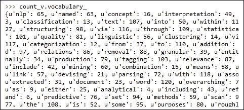

可以通过 `vocabulary_` 属性检索这个字典。它是一个将词项映射到特征索引的映射。我们还可以使用以下函数获取单词（特征）的列表：

```py
>>> count_v.get_feature_names()
```

现在让我们来看一下 `tdm`，这是我们使用 `CountVectorizer` 转换给定输入后得到的对象：

```py
>>> type(tdm)
<class 'scipy.sparse.csr.csr_matrix'>
>>>
```

如你所见，tdm 是一个稀疏矩阵对象。请参考以下链接，了解更多关于稀疏矩阵表示的信息：

[`docs.scipy.org/doc/scipy-0.14.0/reference/generated/scipy.sparse.csr_matrix.html`](http://docs.scipy.org/doc/scipy-0.14.0/reference/generated/scipy.sparse.csr_matrix.html)

我们可以查看这个对象的形状，并检查其中的一些元素，如下所示：

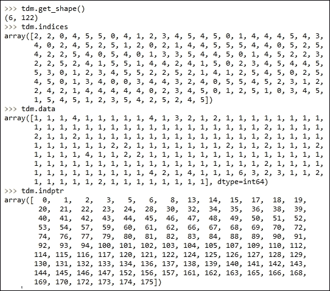

我们可以看到矩阵的形状是 6 X 122。我们有六个文档，也就是在我们的语境下的句子，122 个单词构成了词汇表。请注意，这是稀疏矩阵表示形式；因为并非所有句子都会包含所有单词，所以很多单元格的值会是零，因此我们只会打印那些非零条目的索引。

从 `tdm.indptr` 中，我们知道文档 1 的条目从 `0` 开始，在 `tdm.data` 和 `tdm.indices` 数组中结束于 18，如下所示：

```py
>>> tdm.data[0:17]
array([4, 2, 1, 1, 3, 1, 1, 1, 1, 1, 1, 1, 1, 1, 1, 1, 1], dtype=int64)
>>> tdm.indices[0:17]
array([107,  60,   2,  83, 110,   9,  17,  90,  28,   5,  84, 108,  77,
        67,  20,  40,  81])
>>>
```

我们可以通过以下方式验证这一点：

```py
>>> count_v.get_feature_names()[107]
u'text'
>>> count_v.get_feature_names()[60]
u'mining'
```

我们可以看到，`107` 对应单词 *text*，在第一句话中出现了四次，类似地，*mining* 出现了一次。因此，在这个示例中，我们将给定的文本转换成了一个特征向量，其中的特征是单词。

## 还有更多内容…

`CountVectorizer` 类提供了许多其他功能，用于将文本转换为特征向量。我们来看看其中的一些功能：

```py
>>> count_v.get_params()
{'binary': False, 'lowercase': True, 'stop_words': None, 'vocabulary': None, 'tokenizer': None, 'decode_error': u'strict', 'dtype': <type 'numpy.int64'>, 'charset_error': None, 'charset': None, 'analyzer': u'word', 'encoding': u'utf-8', 'ngram_range': (1, 1), 'max_df': 1.0, 'min_df': 1, 'max_features': None, 'input': u'content', 'strip_accents': None, 'token_pattern': u'(?u)\\b\\w\\w+\\b', 'preprocessor': None}
>>>	
```

第一个参数是二进制的，设置为`False`；我们也可以将其设置为`True`。这样，最终的矩阵将不再显示计数，而是根据单词是否出现在文档中，显示 1 或 0。

默认情况下，`lowercase`设置为`True`；输入文本会在单词映射到特征索引之前转为小写。

在创建单词与特征索引的映射时，我们可以通过提供一个停用词列表来忽略一些单词。请查看以下示例：

```py
from nltk.corpus import stopwords
stop_words = stopwords.words('english')

count_v = CountVectorizer(stop_words=stop_words)
sw_tdm = count_v.fit_transform(sentences)
```

如果我们打印出已构建的词汇表的大小，我们可以看到以下内容：

```py
>>> len(count_v_sw.vocabulary_)
106
>>>
```

我们可以看到现在有 106 个词，而之前是 122 个。

我们还可以为`CountVectorizer`提供一个固定的词汇集。最终的稀疏矩阵列将仅来自这些固定集，任何不在该集合中的内容将被忽略。

下一个有趣的参数是 n-gram 范围。你可以看到传递了一个元组（1,1）。这确保了在创建特征集时只使用单个词语或一元词。例如，可以将其更改为（1,2），这会告诉`CountVectorizer`创建一元词和二元词。让我们看一下下面的代码和输出：

```py
count_v_ngram = CountVectorizer(stop_words=stop_words,ngram_range=(1,2))
ngram_tdm = count_v.fit_transform(sentences)
```

现在一元词和二元词都成为了我们的特征集的一部分。

我将留给你去探索其他参数。这些参数的文档可以通过以下链接访问：

[`scikit-learn.org/stable/modules/generated/sklearn.feature_extraction.text.CountVectorizer.html`](http://scikit-learn.org/stable/modules/generated/sklearn.feature_extraction.text.CountVectorizer.html)

## 另见

+   *使用字典*食谱在第一章中，*Python 数据科学入门*

+   *去除停用词、词干提取、词形还原*食谱在第三章中，*数据分析——探索与整理*

# 计算词频和逆文档频率

在这一部分，我们将学习如何计算词频和逆文档频率。

## 准备工作

出现次数和计数作为特征值是不错的选择，但它们也存在一些问题。假设我们有四篇长度不同的文档，这会使得较长文档中的词语比较短文档中的词语权重更高。因此，我们将不使用原始的词频，而是对其进行归一化处理；我们将一个词在文档中出现的次数除以文档中的总词数。这个度量叫做词频。词频也并非没有问题。有些词语会出现在很多文档中。这些词会主导特征向量，但它们不足以区分语料库中的文档。在我们探讨一个可以避免这个问题的新度量之前，先来定义一下文档频率。类似于词频，它是相对于文档的局部度量，我们可以计算一个称为文档频率的得分，它是词语在语料库中出现的文档数除以语料库中的总文档数。

我们将使用的最终度量是词频和文档频率倒数的乘积，这就是所谓的 TFIDF 得分。

## 如何操作…

加载必要的库并声明将用于展示词频和逆文档频率的输入数据：

```py
# Load Libraries
from nltk.tokenize import sent_tokenize
from nltk.corpus import stopwords
from sklearn.feature_extraction.text import TfidfTransformer
from sklearn.feature_extraction.text import CountVectorizer

# 1.	We create an input document as in the previous recipe.

text = "Text mining, also referred to as text data mining, roughly equivalent to text analytics,\
refers to the process of deriving high-quality information from text. High-quality information is \
typically derived through the devising of patterns and trends through means such as statistical \
pattern learning. Text mining usually involves the process of structuring the input text \
(usually parsing, along with the addition of some derived linguistic features and the removal \
of others, and subsequent insertion into a database), deriving patterns within the structured data, \
and finally evaluation and interpretation of the output. 'High quality' in text mining usually \
refers to some combination of relevance, novelty, and interestingness. Typical text mining tasks \
include text categorization, text clustering, concept/entity extraction, production of granular \
taxonomies, sentiment analysis, document summarization, and entity relation modeling \
(i.e., learning relations between named entities).Text analysis involves information retrieval, \
lexical analysis to study word frequency distributions, pattern recognition, tagging/annotation, \
information extraction, data mining techniques including link and association analysis, \
visualization, and predictive analytics. The overarching goal is, essentially, to turn text \
into data for analysis, via application of natural language processing (NLP) and analytical \
methods.A typical application is to scan a set of documents written in a natural language and \
either model the document set for predictive classification purposes or populate a database \
or search index with the information extracted."
```

让我们看看如何计算词频和逆文档频率：

```py
# 2.	Let us extract the sentences.
sentences = sent_tokenize(text)

# 3.	Create a matrix of term document frequency.
stop_words = stopwords.words('english')

count_v = CountVectorizer(stop_words=stop_words)
tdm = count_v.fit_transform(sentences)

#4.	Calcuate the TFIDF score.
tfidf = TfidfTransformer()
tdm_tfidf = tfidf.fit_transform(tdm)
```

## 它是如何工作的…

步骤 1、2 和 3 与之前的教程相同。让我们来看一下步骤 4，在这一步骤中，我们将传递步骤 3 的输出，以计算 TFIDF 得分：

```py
>>> type(tdm)
<class 'scipy.sparse.csr.csr_matrix'>
>>>
```

Tdm 是一个稀疏矩阵。现在，让我们使用索引、数据和索引指针来查看这些矩阵的值：

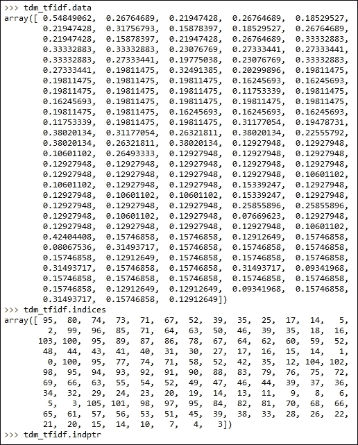

数据显示的是值，而不是出现次数，而是单词的归一化 TFIDF 得分。

## 还有更多内容…

再一次，我们可以通过查看可以传递的参数，深入了解 TFIDF 转换器：

```py
>>> tfidf.get_params()
{'use_idf': True, 'smooth_idf': True, 'sublinear_tf': False, 'norm': u'l2'}
>>>
```

相关文档可以在[`scikit-learn.org/stable/modules/generated/sklearn.feature_extraction.text.TfidfTransformer.html`](http://scikit-learn.org/stable/modules/generated/sklearn.feature_extraction.text.TfidfTransformer.html)找到。
