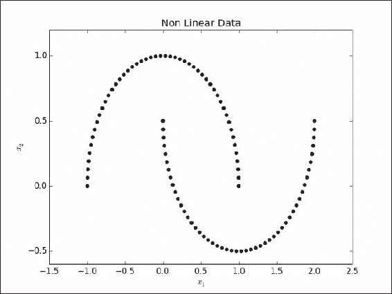
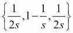

# 第四章 数据分析——深度分析

本章将涵盖以下主题：

+   提取主成分

+   使用内核 PCA

+   使用奇异值分解（SVD）提取特征

+   使用随机投影减少数据维度

+   使用**NMF**（**非负矩阵分解**）分解特征矩阵

# 简介

本章我们将讨论降维的相关技术。在上一章中，我们探讨了如何浏览数据以理解其特征，从而为实际应用提供有意义的使用方式。我们将讨论仅限于二元数据。想象一下，如果有一个拥有数百列的数据集，我们如何进行分析以了解如此大维度数据集的特征？我们需要高效的工具来解决这个难题，以便处理数据。

如今，高维数据无处不在。考虑为一个中等规模的电子商务网站构建产品推荐引擎。即便只有几千种产品，考虑的变量数量依然非常庞大。生物信息学也是另一个拥有极高维度数据的领域。基因表达的微阵列数据集可能包含成千上万的维度。

如果你的任务是探索数据或为算法准备数据，那么高维度，通常称为*维度灾难*，是一个很大的障碍。我们需要高效的方法来处理这个问题。此外，许多现有的数据挖掘算法的复杂度会随着维度数量的增加而呈指数级增长。随着维度的增加，算法的计算难度也变得无法处理，因此在许多应用中不可行。

降维技术尽可能保留数据的结构，同时减少维度的数量。因此，在降维后的特征空间中，算法的执行时间得以缩短，因为维度变得较低。由于数据的结构得以保留，获得的结果可以是原始数据空间的可靠近似。保留结构意味着两点；第一是保持原始数据集中的变异性，第二是保留新投影空间中数据向量之间的距离。

## 矩阵分解:

矩阵分解提供了几种降维技术。我们的数据通常是一个矩阵，实例位于行中，特征位于列中。在之前的例子中，我们一直将数据存储为 NumPy 矩阵。例如，在鸢尾花数据集（Iris dataset）中，我们的数据元组或实例表示为矩阵的行，而特征（如花萼和花瓣的宽度和长度）则为矩阵的列。

矩阵分解是一种表达矩阵的方法。假设 A 是两个其他矩阵 B 和 C 的乘积。矩阵 B 应该包含可以解释数据变化方向的向量。矩阵 C 应该包含这种变化的幅度。因此，我们的原始矩阵 A 现在表示为矩阵 B 和 C 的线性组合。

我们将在接下来的章节中看到的技术利用矩阵分解来解决降维问题。有些方法要求基本向量必须彼此正交，如主成分分析（PCA）；还有一些方法则不强求这一要求，如字典学习。

让我们系好安全带，在本章中看看这些技术如何实际应用。

# 提取主成分

我们将要看的第一个技术是 **主成分分析**（**PCA**）。PCA 是一种无监督方法。在多变量问题中，PCA 用于通过最小的信息损失来减少数据的维度，换句话说，就是保留数据中的最大变化。这里所说的变化，指的是数据扩展的最大方向。让我们来看一下下面的图：


我们有一个包含两个变量 *x1* 和 *x2* 的散点图。对角线表示最大变化方向。通过使用 PCA，我们的目标是捕捉这种变化的方向。因此，我们的任务不是使用两个变量 *x1* 和 *x2* 的方向来表示数据，而是要找到一个由蓝线表示的向量，并仅用这个向量来表示数据。实质上，我们希望将数据的维度从二维降到一维。

我们将利用数学工具特征值和特征向量来找到这个蓝色线向量。

我们在上一章中看到，方差衡量数据的离散程度或扩展程度。我们看到的是一维的示例。若维度超过一维，就很容易将变量之间的相关性表示为矩阵，这个矩阵称为协方差矩阵。当协方差矩阵的值被标准差归一化时，我们得到相关矩阵。在我们的例子中，协方差矩阵是一个二维的 2 X 2 矩阵，表示两个变量 *x1* 和 *x2*，它衡量这两个变量是否朝同一方向变化或一起变化的程度。

当我们进行特征值分解，即得到协方差矩阵的特征向量和特征值时，主特征向量是具有最大特征值的向量，它指向原始数据中最大方差的方向。

在我们的示例中，这应该是图中由蓝线表示的向量。然后，我们将继续把输入数据投影到这个蓝线向量上，以获得降维后的结果。

### 注

对于一个包含 n 个实例和 m 个维度的数据集（n x m），PCA 将其投影到一个较小的子空间（n x d），其中 d << m。

需要注意的一点是，PCA 在计算上非常昂贵。

PCA 可以在协方差矩阵和相关矩阵上执行。记住，当使用具有不均匀尺度的数据集的协方差矩阵进行 PCA 时，结果可能不太有用。感兴趣的读者可以参考 Bernard Flury 的《A First Course in Multivariate Statistics》一书，了解使用相关矩阵或协方差矩阵进行 PCA 的话题。

[`www.springer.com/us/book/9780387982069`](http://www.springer.com/us/book/9780387982069)

## 准备就绪

我们将使用 Iris 数据集来理解如何有效地使用 PCA 减少数据集的维度。Iris 数据集包含来自三种不同物种的 150 朵鸢尾花的测量数据。

Iris 数据集中的三种类别如下：

+   Iris Setosa

+   Iris Versicolor

+   Iris Virginica

以下是 Iris 数据集中的四个特征：

+   花萼长度（单位：厘米）

+   花萼宽度（单位：厘米）

+   花瓣长度（单位：厘米）

+   花瓣宽度（单位：厘米）

我们能否仅使用两列而不是四列来表示数据中大多数变化？我们的目标是减少数据的维度。在这种情况下，我们的数据有四列。假设我们正在构建一个分类器来预测一种新实例的花卉类型；我们能否在减少维度后的空间中完成这项任务？我们是否可以将列数从四列减少到两列，并且仍然为分类器实现较好的准确性？

PCA 的步骤如下：

1.  将数据集标准化，使其均值为零。

1.  找出数据集的相关矩阵和单位标准差值。

1.  将相关矩阵降维为其特征向量和特征值。

1.  根据按降序排列的特征值，选择前 n 个特征向量。

1.  将输入的特征向量矩阵投影到新的子空间。

## 如何操作……

让我们加载必要的库，并调用来自 scikit-learn 的实用函数`load_iris`来获取 Iris 数据集：

```py
import numpy as np
from sklearn.datasets import load_iris
from sklearn.preprocessing import scale
import scipy
import matplotlib.pyplot as plt

# Load Iris data
data = load_iris()
x = data['data']
y = data['target']

# Since PCA is an unsupervised method, we will not be using the target variable y
# scale the data such that mean = 0 and standard deviation = 1
x_s = scale(x,with_mean=True,with_std=True,axis=0)

# Calculate correlation matrix
x_c = np.corrcoef(x_s.T)

# Find eigen value and eigen vector from correlation matrix
eig_val,r_eig_vec = scipy.linalg.eig(x_c)
print 'Eigen values \n%s'%(eig_val)
print '\n Eigen vectors \n%s'%(r_eig_vec)

# Select the first two eigen vectors.
w = r_eig_vec[:,0:2]

# # Project the dataset in to the dimension
# from 4 dimension to 2 using the right eignen vector
x_rd = x_s.dot(w)

# Scatter plot the new two dimensions
plt.figure(1)
plt.scatter(x_rd[:,0],x_rd[:,1],c=y)
plt.xlabel("Component 1")
plt.ylabel("Component 2")
```

现在，我们将对这些数据进行标准化，使其均值为零，标准差为一，我们将利用`numpyscorr_coef`函数来找出相关矩阵：

```py
x_s = scale(x,with_mean=True,with_std=True,axis=0)
x_c = np.corrcoef(x_s.T)
```

然后，我们将进行特征值分解，并将我们的 Iris 数据投影到前两个主特征向量上。最后，我们将在降维空间中绘制数据集：

```py
eig_val,r_eig_vec = scipy.linalg.eig(x_c)
print 'Eigen values \n%s'%(eig_val)
print '\n Eigen vectors \n%s'%(r_eig_vec)
# Select the first two eigen vectors.
w = r_eig_vec[:,0:2]

# # Project the dataset in to the dimension
# from 4 dimension to 2 using the right eignen vector
x_rd = x_s.dot(w)

# Scatter plot the new two dimensions
plt.figure(1)
plt.scatter(x_rd[:,0],x_rd[:,1],c=y)
plt.xlabel("Component 1")
plt.ylabel("Component 2")
```

使用函数 scale。scale 函数可以执行中心化、缩放和标准化。中心化是将每个值减去均值，缩放是将每个值除以变量的标准差，最后标准化是先进行中心化，再进行缩放。使用变量 with_mean 和 with_std，scale 函数可以执行这三种归一化技术。

## 它是如何工作的……

Iris 数据集有四列。尽管列不多，但足以满足我们的需求。我们的目标是将 Iris 数据集的维度从四降到二，并且仍然保留数据的所有信息。

我们将使用 scikit-learn 中方便的`load_iris`函数将 Iris 数据加载到`x`和`y`变量中。`x`变量是我们的数据矩阵，我们可以查看它的形状：

```py
>>>x.shape
(150, 4)
>>>
```

我们将对数据矩阵`x`进行标准化，使其均值为零，标准差为一。基本规则是，如果你的数据中的所有列都在相同的尺度上测量并且具有相同的单位，你就不需要对数据进行标准化。这将允许 PCA 捕捉这些基本单位的最大变异性：

```py
x_s = scale(x,with_mean=True,with_std=True,axis=0)
```

我们将继续构建输入数据的相关性矩阵：

*n 个随机变量 X1, ..., Xn 的相关性矩阵是一个 n × n 的矩阵，其中第 i, j 个元素是 corr(Xi, Xj)，参考维基百科。*

然后我们将使用 SciPy 库计算矩阵的特征值和特征向量。让我们看看我们的特征值和特征向量：

```py
print Eigen values \n%s%(eig_val)
print \n Eigen vectors \n%s%(r_eig_vec)
```

输出如下：


在我们的案例中，特征值是按降序打印的。一个关键问题是，我们应该选择多少个组件？在接下来的章节中，我们将解释几种选择组件数量的方法。

你可以看到我们仅选择了右侧特征向量的前两列。所保留组件对`y`变量的区分能力，是测试数据中保留了多少信息或变异性的一个很好的方法。

我们将把数据投影到新的降维空间。

最后，我们将绘制`x`和`y`轴上的各个组件，并根据目标变量进行着色：


你可以看到，组件`1`和`2`能够区分三种鸢尾花的类别。因此，我们有效地使用 PCA 将维度从四降到二，并且仍然能够区分属于不同鸢尾花类别的样本。

## 更多内容…

在前一节中，我们提到过会概述几种方法，帮助我们选择应该包含多少个组件。在我们的方案中，我们只包含了两个。以下是一些更加经验性的方法，用于选择组件：

1.  特征值标准：

    一个特征值为一意味着该组件将解释大约一个变量的变异性。因此，根据这个标准，一个组件至少应当解释一个变量的变异性。我们可以说，我们将只包含特征值大于或等于一的组件。根据你的数据集，你可以设定这个阈值。在一个非常高维的数据集中，仅包含能够解释一个变量的组件可能并不是非常有用。

1.  方差解释比例标准：

    让我们运行以下代码：

    ```py
    print "Component, Eigen Value, % of Variance, Cummulative %"
    cum_per = 0
    per_var = 0
    for i,e_val in enumerate(eig_val):
        per_var = round((e_val / len(eig_val)),3)
        cum_per+=per_var
    print ('%d, %0.2f, %0.2f, %0.2f')%(i+1, e_val, per_var*100,cum_per*100)
    ```

1.  输出结果如下：

对每个主成分，我们打印了其特征值、该主成分所解释的方差百分比以及解释的方差的累计百分比。例如，主成分`1`的特征值为`2.91`；`2.91/4`给出了该主成分所解释的方差百分比，即 72.80%。现在，如果我们包含前两个主成分，我们就可以解释数据中 95.80%的方差。

将相关矩阵分解为其特征向量和特征值是一种通用技术，可以应用于任何矩阵。在本例中，我们将应用它来分析相关矩阵，以便理解数据分布的主轴，即观察数据最大变化的轴。

主成分分析（PCA）既可以作为探索性技术，也可以作为下游算法的数据准备技术。文档分类数据集问题通常具有非常大的维度特征向量。PCA 可以用来减少数据集的维度，从而在将数据输入到分类算法之前，只保留最相关的特征。

PCA 的一个缺点是它是一个计算开销较大的操作。最后，关于 numpy 的 corrcoeff 函数，需要指出的是，corrcoeff 函数会在内部对数据进行标准化作为其计算的一部分。但由于我们希望明确地说明缩放的原因，因此我们在本节中显式地进行了说明。

### 提示

**PCA 何时有效？**

输入数据集应该具有相关的列，才能使 PCA 有效工作。如果输入变量之间没有相关性，PCA 将无法帮助我们。

## 另见

+   在第四章中，*执行奇异值分解*的技巧，*数据分析 - 深度探讨*

# 使用核 PCA

PCA 假设数据中的所有主变化方向都是直线。然而，许多实际数据集并不符合这一假设。

### 注意

PCA 仅限于数据变化呈直线的那些变量。换句话说，它仅适用于线性可分的数据。

在本节中，我们将介绍核 PCA，它将帮助我们减少数据集的维度，尤其是当数据集中的变化不是直线时。我们将显式创建这样的数据集，并应用核 PCA 进行分析。

在核 PCA 中，核函数应用于所有数据点。这将输入数据转换为核空间。然后，在核空间中执行普通 PCA。

## 准备工作

我们在这里不会使用鸢尾花数据集，而是生成一个变化不是直线的数据集。这样，我们就不能在这个数据集上应用简单的 PCA。让我们继续查看我们的配方。

## 如何实现…

让我们加载必要的库。我们将使用 scikit-learn 库中的`make_circles`函数生成一个数据集。我们将绘制这个数据并在该数据集上执行普通 PCA：

```py
from sklearn.datasets import make_circles
import matplotlib.pyplot as plt
import numpy as np
from sklearn.decomposition import PCA
from sklearn.decomposition import KernelPCA

# Generate a dataset where the variations cannot be captured by a straight line.
np.random.seed(0)
x,y = make_circles(n_samples=400, factor=.2,noise=0.02)

# Plot the generated dataset
plt.close('all')
plt.figure(1)
plt.title("Original Space")
plt.scatter(x[:,0],x[:,1],c=y)
plt.xlabel("$x_1$")
plt.ylabel("$x_2$")

# Try to fit the data using normal PCA
pca = PCA(n_components=2)
pca.fit(x)
x_pca = pca.transform(x)
```

接下来，我们将绘制数据集的前两个主成分。我们只使用第一个主成分来绘制数据集：

```py
plt.figure(2)
plt.title("PCA")
plt.scatter(x_pca[:,0],x_pca[:,1],c=y)
plt.xlabel("$Component_1$")
plt.ylabel("$Component_2$")

# Plot using the first component from normal pca
class_1_indx = np.where(y==0)[0]
class_2_indx = np.where(y==1)[0]

plt.figure(3)
plt.title("PCA- One component")
plt.scatter(x_pca[class_1_indx,0],np.zeros(len(class_1_indx)),color='red')
plt.scatter(x_pca[class_2_indx,0],np.zeros(len(class_2_indx)),color='blue')
```

让我们通过执行核 PCA 并绘制主成分来完成它：

```py
# Create  KernelPCA object in Scikit learn, specifying a type of kernel as a parameter.
kpca = KernelPCA(kernel="rbf",gamma=10)
# Perform KernelPCA
kpca.fit(x)
x_kpca = kpca.transform(x)

# Plot the first two components.
plt.figure(4)
plt.title("Kernel PCA")
plt.scatter(x_kpca[:,0],x_kpca[:,1],c=y)
plt.xlabel("$Component_1$")
plt.ylabel("$Component_2$")
plt.show()
```

## 它是如何工作的…

在步骤 1 中，我们使用 scikit 的数据生成函数生成了一个数据集。在此案例中，我们使用了`make_circles`函数。我们可以用这个函数创建两个同心圆，一个大圆包含一个小圆。每个同心圆属于某一类。因此，我们创建了一个由两个同心圆组成的两类问题。

首先，让我们看看我们生成的数据。`make_circles`函数生成了一个包含 400 个数据点的二维数据集。原始数据的图如下：


这张图描述了我们的数据是如何分布的。外圈属于第一类，内圈属于第二类。我们能不能将这些数据用线性分类器来处理？我们无法做到。数据中的变化不是直线。我们无法使用普通的 PCA。因此，我们将求助于核 PCA 来变换数据。

在我们深入探讨核 PCA 之前，让我们先看看如果对这个数据集应用普通 PCA 会发生什么。

让我们看看前两个组件的输出图：


如你所见，PCA 的组件无法以线性方式区分这两个类别。

让我们绘制第一个主成分并看看它的类别区分能力。下面的图表是我们只绘制第一个主成分时的情况，解释了 PCA 无法区分数据：


普通的 PCA 方法是一种线性投影技术，当数据是线性可分时效果良好。在数据不可线性分割的情况下，需要使用非线性技术来进行数据集的降维。

### 注意

核 PCA 是一种用于数据降维的非线性技术。

让我们继续创建一个核 PCA 对象，使用 scikit-learn 库。以下是我们的对象创建代码：

```py
KernelPCA(kernel=rbf,gamma=10) 
```

我们选择了**径向基函数**（**RBF**）核，γ值为 10。γ是核的参数（用于处理非线性）——核系数。

在进一步讨论之前，让我们看一下有关核函数的一些理论。简单来说，核函数是一个计算两个向量点积的函数，也就是说，计算它们的相似度，这两个向量作为输入传递给它。

对于两个点 *x* 和 *x'*，在某个输入空间中，RBFGaussian 核的定义如下：


其中，


*RBF 随着距离的增加而减小，取值范围在 0 和 1 之间。因此，它可以被解释为一种相似性度量。RBF 核的特征空间具有无限维度——维基百科*。

可以在以下位置找到：

[`en.wikipedia.org/wiki/Radial_basis_function_kernel`](http://en.wikipedia.org/wiki/Radial_basis_function_kernel)。

现在，让我们将输入从特征空间转换到核空间。我们将在核空间中执行 PCA。

最后，我们将绘制前两个主成分的散点图。数据点的颜色根据它们的类别值来区分：


你可以在这个图中看到，数据点在核空间中是线性分开的。

## 还有更多…

Scikit-learn 的核 PCA 对象还允许使用其他类型的核，如下所示：

+   线性

+   多项式

+   Sigmoid

+   余弦

+   预计算

Scikit-learn 还提供了其他类型的非线性生成数据。以下是另一个示例：

```py
from sklearn.datasets import make_moons
x,y = make_moons(100)
plt.figure(5)
plt.title("Non Linear Data")
plt.scatter(x[:,0],x[:,1],c=y)
plt.xlabel("$x_1$")
plt.ylabel("$x_2$")
plt.savefig('fig-7.png')
plt.show()
```

数据图像如下所示：



# 使用奇异值分解提取特征

在我们讨论完 PCA 和核 PCA 之后，我们可以通过以下方式来解释降维：

+   你可以将相关变量转换为一组不相关的变量。通过这种方式，我们将得到一个较低维度的解释，揭示数据之间的关系而不损失任何信息。

+   你可以找出主轴，这些轴记录了最多的数据变异。

**奇异值分解** (**SVD**)是另一种矩阵分解技术，可以用来解决维度灾难问题。它可以用较少的维度找到原始数据的最佳近似。与 PCA 不同，SVD 作用于原始数据矩阵。

### 注意

SVD 不需要协方差矩阵或相关矩阵。它直接作用于原始数据矩阵。

SVD 将一个`m` x `n`的矩阵`A`分解成三个矩阵的乘积：


这里，U 是一个`m` x `k`的矩阵，V 是一个`n` x `k`的矩阵，S 是一个`k` x `k`的矩阵。U 的列称为左奇异向量，V 的列称为右奇异向量。

S 矩阵对角线上的值称为奇异值。

## 准备就绪

我们将使用鸢尾花数据集进行此次练习。我们的任务是将数据集的维度从四维降至二维。

## 如何做…

让我们加载必要的库并获取鸢尾花数据集：

```py
from sklearn.datasets import load_iris
import matplotlib.pyplot as plt
import numpy as np
from sklearn.preprocessing import scale
from scipy.linalg import svd

# Load Iris dataset
data = load_iris()
x = data['data']
y = data['target']

# Proceed by scaling the x variable w.r.t its mean,
x_s = scale(x,with_mean=True,with_std=False,axis=0)

# Decompose the matrix using SVD technique.We will use SVD implementation in scipy.
U,S,V = svd(x_s,full_matrices=False)

# Approximate the original matrix by selecting only the first two singular values.
x_t = U[:,:2]

# Finally we plot the datasets with the reduced components.
plt.figure(1)
plt.scatter(x_t[:,0],x_t[:,1],c=y)
plt.xlabel("Component 1")
plt.ylabel("Component 2")
plt.show()
```

现在，我们将展示如何对鸢尾花数据集执行 SVD 操作：

```py
# Proceed by scaling the x variable w.r.t its mean,
x_s = scale(x,with_mean=True,with_std=False,axis=0)
# Decompose the matrix using SVD technique.We will use SVD implementation in scipy.
U,S,V = svd(x_s,full_matrices=False)

# Approximate the original matrix by selecting only the first two singular values.
x_t = U[:,:2]

# Finally we plot the datasets with the reduced components.
plt.figure(1)
plt.scatter(x_t[:,0],x_t[:,1],c=y)
plt.xlabel("Component 1")
plt.ylabel("Component 2")
plt.show()
```

## 如何工作…

鸢尾花数据集有四列。虽然列数不多，但它足以满足我们的目的。我们计划将鸢尾花数据集的维度从四降到二，并仍然保留所有数据的信息。

我们将使用 Scikit-learn 中的`load_iris`函数将鸢尾花数据加载到`x`和`y`变量中。`x`变量是我们的数据矩阵；我们可以通过以下方式检查其形状：

```py
>>>x.shape
(150, 4)
>>>
```

我们使用数据矩阵`x`的均值对其进行中心化。经验法则是，如果所有列都在相同的尺度上测量并具有相同的度量单位，则无需缩放数据。这将使 PCA 捕捉到这些基础单位的最大变化。请注意，我们在调用 scale 函数时只使用了均值：

```py
x_s = scale(x,with_mean=True,with_std=False,axis=0)
```

1.  在我们缩放过的输入数据集上运行 SVD 方法。

1.  选择前两个奇异分量。该矩阵是原始输入数据的一个简化近似。

1.  最后，绘制矩阵的列，并根据类别值进行着色：

## 还有更多内容…

SVD 是一种双模因子分析方法，我们从一个任意的矩形矩阵开始，该矩阵包含两种类型的实体。这与我们之前的 PCA 方法不同，PCA 以相关矩阵作为输入，属于单模因子分析，因为输入的方阵的行和列表示的是相同的实体。

在文本挖掘应用中，输入通常以**术语-文档矩阵**（**TDM**）的形式呈现。在 TDM 中，行对应单词，列对应文档。单元格条目填充的是术语频率或**词频逆文档频率**（**TFIDF**）得分。它是一个包含两种实体的矩形矩阵：单词和文档，这些实体分别出现在矩阵的行和列中。

SVD 广泛应用于文本挖掘中，用于揭示单词和文档、文档和文档、单词和单词之间的隐藏关系（语义关系）。

通过在术语-文档矩阵上应用 SVD，我们将其转换为一个新的语义空间，其中那些在同一文档中不一起出现的单词，在新的语义空间中仍然可以靠得很近。SVD 的目标是找到一种有效的方式来建模单词和文档之间的关系。应用 SVD 后，每个文档和单词都可以表示为一个因子值的向量。我们可以选择忽略那些值非常低的分量，从而避免数据集中的噪声。这将导致对文本语料库的近似表示。这就是**潜在语义分析**（**LSA**）。

这一思路的应用在文档索引、搜索和信息检索中具有非常高的实用性。我们可以不再像传统倒排索引那样对原始单词进行索引，而是对 LSA（潜在语义分析）的输出进行索引。这有助于避免同义词和歧义词等问题。在同义词问题中，用户可能倾向于使用不同的词来表示同一个实体。常规索引在这种情况下容易出问题。由于文档是通过常规词汇进行索引的，搜索时可能无法获得相关结果。例如，如果我们为一些与金融工具相关的文档建立索引，通常涉及的词汇可能是货币、金钱等相似的词。货币和金钱是同义词。当用户搜索金钱时，他也应该看到与货币相关的文档。然而，使用常规索引时，搜索引擎只能返回包含“金钱”一词的文档。而使用潜在语义索引，包含“货币”一词的文档也会被检索到。在潜在语义空间中，货币和金钱彼此接近，因为它们在文档中的邻近词汇是相似的。

歧义词是指具有多重含义的词。例如，“银行”可以指金融机构或河岸。与同义词类似，歧义词也可以在潜在语义空间中处理。

有关 LSA 和潜在语义索引的更多信息，请参考 Deerwester 等人的论文：

[`citeseerx.ist.psu.edu/viewdoc/summary?doi=10.1.1.108.8490`](http://citeseerx.ist.psu.edu/viewdoc/summary?doi=10.1.1.108.8490)。有关特征值与奇异值的比较研究，请参阅 Cleve Moler 的《用 MATLAB 进行数值计算》一书。尽管示例使用 MATLAB，你仍然可以通过我们的教程将其在 Python 中实现：

[`in.mathworks.com/moler/eigs.pdf`](https://in.mathworks.com/moler/eigs.pdf)

# 使用随机投影减少数据维度

我们之前看到的降维方法计算开销较大，并且速度较慢。随机投影是另一种比这些方法更快的降维方式。

随机投影与 Johnson-Lindenstrauss 引理相关。根据该引理，存在一个将高维空间映射到低维欧几里得空间的映射，使得点之间的距离保持在ε范围内。目标是保持数据中任意两点之间的成对距离，同时减少数据的维度。

假设我们给定了一个`n`维的欧几里得空间数据，根据引理，我们可以将其映射到一个维度为 k 的欧几里得空间，在这个空间中，点之间的距离保持不变，误差范围在（1-ε）和（1+ε）之间。

## 准备开始

本次练习我们将使用 20 个新闻组数据集（[`qwone.com/~jason/20Newsgroups/`](http://qwone.com/~jason/20Newsgroups/)）。

这是一个包含大约 20,000 个新闻组文档的集合，几乎均匀地划分为 20 个不同的新闻类别。Scikit-learn 提供了一个方便的函数来加载这个数据集：

```py
from sklearn.datasets import fetch_20newsgroups
data = fetch_20newsgroups(categories=cat)
```

您可以通过提供一个类别字符串列表来加载所有库或感兴趣的类别列表。在我们的例子中，我们将使用`sci.crypt`类别。

我们将把输入文本加载为一个词项-文档矩阵，其中特征是单独的单词。在此基础上，我们将应用随机投影以减少维度数量。我们将尝试看看文档之间的距离是否在降维空间中得以保持，且每个实例是一个文档。

## 如何做到……

首先加载必要的库。使用 scikit 的工具函数`fetch20newsgroups`，我们将加载数据。我们将从所有数据中仅选择`sci.crypt`类别。然后，我们将把文本数据转化为向量表示：

```py
from sklearn.datasets import fetch_20newsgroups
from sklearn.feature_extraction.text import TfidfVectorizer
from sklearn.metrics import euclidean_distances
from sklearn.random_projection import GaussianRandomProjection
import matplotlib.pyplot as plt
import numpy as np

# Load 20 newsgroup dataset
# We select only sci.crypt category
# Other categories include
# 'sci.med', 'sci.space' ,'soc.religion.christian'
cat =['sci.crypt']
data = fetch_20newsgroups(categories=cat)

# Create a term document matrix, with term frequencies as the values
# from the above dataset.
vectorizer = TfidfVectorizer(use_idf=False)
vector = vectorizer.fit_transform(data.data)

# Perform the projection. In this case we reduce the dimension to 1000
gauss_proj = GaussianRandomProjection(n_components=1000)
gauss_proj.fit(vector)
# Transform the original data to the new space
vector_t = gauss_proj.transform(vector)

# print transformed vector shape
print vector.shape
print vector_t.shape

# To validate if the transformation has preserved the distance, we calculate the old and the new distance between the points
org_dist = euclidean_distances(vector)
red_dist = euclidean_distances(vector_t)

diff_dist = abs(org_dist - red_dist)

# We take the difference between these points and plot them 
# as a heatmap (only the first 100 documents).
plt.figure()
plt.pcolor(diff_dist[0:100,0:100])
plt.colorbar()
plt.show()
```

现在让我们继续演示随机投影的概念。

## 它是如何工作的……

加载新闻组数据集后，我们将通过`TfidfVectorizer(use_idf=False)`将其转换为矩阵。

请注意，我们已经将`use_idf`设置为`False`。这创建了我们的输入矩阵，其中行是文档，列是单独的单词，单元格的值是单词的计数。

如果我们使用`print vector.shape`命令打印我们的向量，我们将得到以下输出：

```py
(595, 16115)
```

我们可以看到，我们的输入矩阵有 595 个文档和 16115 个单词；每个单词是一个特征，因此也是一个维度。

我们将使用一个密集的高斯矩阵进行数据投影。高斯随机矩阵是通过从正态分布`N`(0, 1/组件数量)中抽样元素生成的。在我们的例子中，组件数量是 1000。我们的目标是将维度从 16115 降到 1000。然后，我们将打印出原始维度和降维后的维度，以验证维度的减少。

最后，我们想验证在投影之后数据特性是否得以保持。我们将计算向量之间的欧几里得距离。我们将记录原始空间和投影空间中的距离。我们将像第 7 步一样计算它们之间的差异，并将差异绘制成热图：


如您所见，梯度范围在 0.000 到 0.105 之间，表示原始空间和降维空间中向量距离的差异。原始空间和投影空间中距离的差异几乎都在一个非常小的范围内。

## 还有更多内容……

关于随机投影有很多参考文献。这是一个非常活跃的研究领域。有兴趣的读者可以参考以下论文：

随机投影实验：

[`dl.acm.org/citation.cfm?id=719759`](http://dl.acm.org/citation.cfm?id=719759)

机器学习中的随机投影实验：

[`citeseerx.ist.psu.edu/viewdoc/summary?doi=10.1.1.13.9205`](http://citeseerx.ist.psu.edu/viewdoc/summary?doi=10.1.1.13.9205)

在我们的方案中，我们使用了高斯随机投影，其中通过从正态分布 N(0,1/1000)中抽样生成了一个高斯随机矩阵，其中 1000 是降维空间的所需维度。

然而，使用稠密矩阵在处理时可能会产生严重的内存问题。为了避免这种情况，Achlioptas 提出了稀疏随机投影。与从标准正态分布中选择不同，矩阵条目是从{-1.0,1}中选择的，选择概率分别为`{1/6,2/3,1/6}`。如你所见，0 出现的概率为三分之二，因此最终的矩阵将是稀疏的。用户可以参考 Achlioptas 的开创性论文 *Dimitris Achlioptas*，*数据库友好的随机投影：使用二进制硬币的 Johnson-Lindenstrauss 方法。《计算机与系统科学杂志》，66(4):671–687，2003 年。*

scikit 实现允许用户选择结果矩阵的密度。假设我们将密度指定为 d，s 为 1/d，则矩阵的元素可以从以下方程中选择：


概率如下：



## 另见

+   *使用核 PCA* 配方见第四章，*数据分析 - 深入解析*

# 使用非负矩阵分解分解特征矩阵

我们之前从数据降维的角度讨论了所有的矩阵分解方法。现在，让我们从协同过滤的角度讨论这个方法，使它更有趣。虽然数据降维是我们的目标，**非负矩阵分解** (**NMF**) 在使用协同过滤算法的推荐系统中得到了广泛应用。

假设我们的输入矩阵 A 的维度为`m x n`。NMF 将输入矩阵分解为两个矩阵，`A_dash`和`H`：


假设我们想将 A 矩阵的维度减少到 d，即我们希望将原始的 m x n 矩阵分解成 m x d，其中 d << n。

`A_dash`矩阵的大小为 m x d，`H`矩阵的大小为 d x m。NMF 将其作为一个优化问题来解决，即最小化以下函数：


著名的 Netflix 挑战赛就是使用 NMF 解决的。请参阅以下链接：

*Gábor Takács 等人，（2008）。矩阵分解与基于邻域的算法解决 Netflix 奖问题。载于：2008 年 ACM 推荐系统大会论文集，瑞士洛桑，10 月 23 日至 25 日，267-274：*

[`dl.acm.org/citation.cfm?id=1454049`](http://dl.acm.org/citation.cfm?id=1454049)

## 准备就绪

为了说明 NMF，让我们创建一个推荐问题。像 MovieLens 或 Netflix 这样的典型推荐系统中，存在一组用户和一组物品（电影）。如果每个用户对一些电影进行了评分，我们希望预测他们对尚未评分电影的评分。我们假设用户没有看过他们没有评分的电影。我们的预测算法输出的是这些电影的评分。然后，我们可以推荐预测引擎给出非常高评分的电影给这些用户。

我们的玩具问题如下：我们有以下电影：

| 电影 ID | 电影名称 |
| --- | --- |
| 1 | 《星际大战》 |
| 2 | 《黑客帝国》 |
| 3 | 《盗梦空间》 |
| 4 | 《哈利·波特》 |
| 5 | 《霍比特人》 |
| 6 | 《纳瓦隆的枪》 |
| 7 | 《拯救大兵瑞恩》 |
| 8 | 《敌人门前》 |
| 9 | 《勇敢的心》 |
| 10 | 《大逃亡》 |

我们有十部电影，每部电影都有一个电影 ID。我们也有 10 个用户对这些电影进行了评分，具体如下：

|   | 电影 ID |
| --- | --- |
| **用户 ID** | 1 | 2 | 3 | 4 | 5 | 6 | 7 | 8 | 9 | 10 |
| 1 | 5.0 | 5.0 | 4.5 | 4.5 | 5.0 | 3.0 | 2.0 | 2.0 | 0.0 | 0.0 |
| 2 | 4.2 | 4.7 | 5.0 | 3.7 | 3.5 | 0.0 | 2.7 | 2.0 | 1.9 | 0.0 |
| 3 | 2.5 | 0.0 | 3.3 | 3.4 | 2.2 | 4.6 | 4.0 | 4.7 | 4.2 | 3.6 |
| 4 | 3.8 | 4.1 | 4.6 | 4.5 | 4.7 | 2.2 | 3.5 | 3.0 | 2.2 | 0.0 |
| 5 | 2.1 | 2.6 | 0.0 | 2.1 | 0.0 | 3.8 | 4.8 | 4.1 | 4.3 | 4.7 |
| 6 | 4.7 | 4.5 | 0.0 | 4.4 | 4.1 | 3.5 | 3.1 | 3.4 | 3.1 | 2.5 |
| 7 | 2.8 | 2.4 | 2.1 | 3.3 | 3.4 | 3.8 | 4.4 | 4.9 | 4.0 | 4.3 |
| 8 | 4.5 | 4.7 | 4.7 | 4.5 | 4.9 | 0.0 | 2.9 | 2.9 | 2.5 | 2.1 |
| 9 | 0.0 | 3.3 | 2.9 | 3.6 | 3.1 | 4.0 | 4.2 | 0.0 | 4.5 | 4.6 |
| 10 | 4.1 | 3.6 | 3.7 | 4.6 | 4.0 | 2.6 | 1.9 | 3.0 | 3.6 | 0.0 |

为了提高可读性，我们将数据保持为矩阵形式，其中行对应用户，列对应电影。单元格中的数值表示评分，范围从 1 到 5，其中 5 表示用户对电影的高度喜好，1 表示用户不喜欢。单元格中的 0 表示用户未对该电影进行评分。在本例中，我们将使用 NMF 对`user_id` x `movie_id`矩阵进行分解。

## 如何进行…

我们将首先加载必要的库，然后创建我们的数据集。我们将把数据集存储为矩阵：

```py
import numpy as np
from collections import defaultdict
from sklearn.decomposition import NMF
import matplotlib.pyplot as plt

# load our ratings matrix in python.
ratings = [
[5.0, 5.0, 4.5, 4.5, 5.0, 3.0, 2.0, 2.0, 0.0, 0.0],
[4.2, 4.7, 5.0, 3.7, 3.5, 0.0, 2.7, 2.0, 1.9, 0.0],
[2.5, 0.0, 3.3, 3.4, 2.2, 4.6, 4.0, 4.7, 4.2, 3.6],
[3.8, 4.1, 4.6, 4.5, 4.7, 2.2, 3.5, 3.0, 2.2, 0.0],
[2.1, 2.6, 0.0, 2.1, 0.0, 3.8, 4.8, 4.1, 4.3, 4.7],
[4.7, 4.5, 0.0, 4.4, 4.1, 3.5, 3.1, 3.4, 3.1, 2.5],
[2.8, 2.4, 2.1, 3.3, 3.4, 3.8, 4.4, 4.9, 4.0, 4.3],
[4.5, 4.7, 4.7, 4.5, 4.9, 0.0, 2.9, 2.9, 2.5, 2.1],
[0.0, 3.3, 2.9, 3.6, 3.1, 4.0, 4.2, 0.0, 4.5, 4.6],
[4.1, 3.6, 3.7, 4.6, 4.0, 2.6, 1.9, 3.0, 3.6, 0.0]
]

movie_dict = {
1:"Star Wars",
2:"Matrix",
3:"Inception",
4:"Harry Potter",
5:"The hobbit",
6:"Guns of Navarone",
7:"Saving Private Ryan",
8:"Enemy at the gates",
9:"Where eagles dare",
10:"Great Escape"
}

A = np.asmatrix(ratings,dtype=float)

# perform non negative matrix transformation on the data.
max_components = 2
reconstruction_error = []
nmf = None
nmf = NMF(n_components = max_components,random_state=1)
A_dash = nmf.fit_transform(A)

# Examine the reduced matrixfor i in range(A_dash.shape[0]):
for i in range(A_dash.shape[0]):
    print "User id = %d, comp1 score = %0.2f, comp 2 score = %0.2f"%(i+1,A_dash[i][0],A_dash[i][1])

plt.figure(1)
plt.title("User Concept Mapping")
x = A_dash[:,0]
y = A_dash[:,1]
plt.scatter(x,y)
plt.xlabel("Component 1 Score")
plt.ylabel("Component 2 Score")

# Let us examine our component matrix F.
F = nmf.components_
plt.figure(2)
plt.title("Movie Concept Mapping")
x = F[0,:]
y = F[1,:]
plt.scatter(x,y)
plt.xlabel("Component 1 score")
plt.ylabel("Component 2  score")
for i in range(F[0,:].shape[0]):
    plt.annotate(movie_dict[i+1],(F[0,:][i],F[1,:][i]))
plt.show()
```

现在我们将演示非负矩阵分解（NMF）：

```py
# perform non negative matrix transformation on the data.
max_components = 2
reconstruction_error = []
nmf = None
nmf = NMF(n_components = max_components,random_state=1)
A_dash = nmf.fit_transform(A)

# Examine the reduced matrixfor i in range(A_dash.shape[0]):
for i in range(A_dash.shape[0]):
    print "User id = %d, comp1 score = %0.2f, comp 2 score = %0.2f"%(i+1,A_dash[i][0],A_dash[i][1])
plt.figure(1)
plt.title("User Concept Mapping")
x = A_dash[:,0]
y = A_dash[:,1]
plt.scatter(x,y)
plt.xlabel("Component 1 Score")
plt.ylabel("Component 2 Score")

# Let us examine our component matrix F.
F = nmf.components_
plt.figure(2)
plt.title("Movie Concept Mapping")
x = F[0,:]
y = F[1,:]
plt.scatter(x,y)
plt.xlabel("Component 1 score")
plt.ylabel("Component 2  score")
for i in range(F[0,:].shape[0]):
    plt.annotate(movie_dict[i+1],(F[0,:][i],F[1,:][i]))
plt.show()
```

## 如何运作…

我们将从列表中将数据加载到 NumPy 矩阵 A 中。我们将根据`max_components`变量选择将维度降至 2。然后，我们将用组件数初始化 NMF 对象。最后，我们将应用该算法以获得降维后的矩阵`A_dash`。

这就是我们需要做的。scikit 库为我们隐藏了许多细节。现在让我们来看一下后台发生了什么。从正式角度来看，NMF 将原始矩阵分解成两个矩阵，这两个矩阵相乘后，可以得到我们原始矩阵的近似值。看一下我们代码中的以下一行：

```py
A_dash = nmf.fit_transform(A)
```

输入矩阵 `A` 被转换为简化后的矩阵 A_dash。让我们来看一下新矩阵的形状：

```py
>>>A_dash.shape
(10, 2)
```

原始矩阵被简化为两列，而不是原来的十列。这就是简化空间。从这个数据的角度来看，我们可以说我们的算法已经将原来的十部电影分成了两个概念。单元格的数值表示用户对每个概念的亲和力。

我们将打印并查看亲和力的表现：

```py
for i in range(A_dash.shape[0]):
print User id = %d, comp1 score = %0.2f, comp 2 score =%0.2f%(i+1,A_dash[i][0],A_dash[i][1])
```

输出如下所示：


看看用户 1；前面图像中的第一行显示，用户 1 在概念 1 上得分为 2.14，而在概念 2 上得分为 0，表明用户 1 对概念 1 有更强的亲和力。

看看用户 ID 为 3 的用户；这个用户对概念 1 有更多的亲和力。现在我们已经将输入数据集减少为二维，展示在图表中会更加清晰。

在我们的 *x* 轴上，我们有组件 1，*y* 轴上是组件 2。我们将以散点图的形式绘制各种用户。我们的图形如下所示：


你可以看到，我们有两组用户；一组是组件 1 得分大于 1.5 的用户，另一组是得分小于 1.5 的用户。我们能够将用户分为两类，基于简化的特征空间。

让我们看看另一个矩阵 `F`：

```py
F = nmf.components_
```

`F` 矩阵有两行；每一行对应我们的组件，十列，每一列对应一个电影 ID。换句话说，就是电影对这些概念的亲和力。我们来绘制这个矩阵。

你可以看到我们的 *x* 轴是第一行，*y* 轴是第二行。在步骤 1 中，我们声明了一个字典。我们希望这个字典为每个点标注电影名称：

```py
for i in range(F[0,:].shape[0]):
plt.annotate(movie_dict[i+1],(F[0,:][i],F[1,:][i]))
```

`annotate` 方法将字符串（用于标注）作为第一个参数，并且将 `x` 和 `y` 坐标作为一个元组。

你可以看到输出图表如下：


你可以看到，我们有两组明显不同的群体。所有战争电影的组件 1 得分非常低，而组件 2 得分非常高。所有奇幻电影的得分则正好相反。我们可以大胆地说，组件 1 包含了战争电影，而得分高的用户对战争电影有很强的亲和力。同样的情况也适用于奇幻电影。

因此，通过使用 NMF，我们能够发掘出输入矩阵中关于电影的隐藏特征。

## 还有更多内容……

我们看到特征空间从十维被简化到二维，接下来，让我们看看这如何应用于推荐引擎。我们从这两个矩阵中重建原始矩阵：

```py
reconstructed_A = np.dot(W,H)
np.set_printoptions(precision=1)
print reconstructed_A
```

重建后的矩阵如下所示：


它与原始矩阵有多大不同？原始矩阵在这里给出；请查看高亮的行：

|   | 电影 ID |
| --- | --- |
| **用户 ID** | 1 | 2 | 3 | 4 | 5 | 6 | 7 | 8 | 9 | 10 |
| 1 | 5.0 | 5.0 | 4.5 | 4.5 | 5.0 | 3.0 | 2.0 | 2.0 | 0.0 | 0.0 |
| 2 | 4.2 | 4.7 | 5.0 | 3.7 | 3.5 | 0.0 | 2.7 | 2.0 | 1.9 | 0.0 |
| 3 | 2.5 | 0.0 | 3.3 | 3.4 | 2.2 | 4.6 | 4.0 | 4.7 | 4.2 | 3.6 |
| 4 | 3.8 | 4.1 | 4.6 | 4.5 | 4.7 | 2.2 | 3.5 | 3.0 | 2.2 | 0.0 |
| 5 | 2.1 | 2.6 | 0.0 | 2.1 | 0.0 | 3.8 | 4.8 | 4.1 | 4.3 | 4.7 |
| **6** | **4.7** | **4.5** | **0.0** | **4.4** | **4.1** | **3.5** | **3.1** | **3.4** | **3.1** | **2.5** |
| 7 | 2.8 | 2.4 | 2.1 | 3.3 | 3.4 | 3.8 | 4.4 | 4.9 | 4.0 | 4.3 |
| 8 | 4.5 | 4.7 | 4.7 | 4.5 | 4.9 | 0.0 | 2.9 | 2.9 | 2.5 | 2.1 |
| 9 | 0.0 | 3.3 | 2.9 | 3.6 | 3.1 | 4.0 | 4.2 | 0.0 | 4.5 | 4.6 |
| 10 | 4.1 | 3.6 | 3.7 | 4.6 | 4.0 | 2.6 | 1.9 | 3.0 | 3.6 | 0.0 |

对于用户 6 和电影 3，我们现在有了评分。这将帮助我们决定是否推荐这部电影给用户，因为他还没有看过。记住，这是一个玩具数据集；现实世界中的场景有许多电影和用户。

## 另见

+   *使用奇异值分解提取特征* 配方在 第四章中，*数据分析 - 深入探讨*
