# 第五章 数据挖掘——大海捞针

在本章中，我们将覆盖以下主题：

+   使用距离度量

+   学习和使用核方法

+   使用 k-means 方法进行数据聚类

+   学习向量量化

+   在单变量数据中寻找异常值

+   使用局部异常因子方法发现异常值

# 介绍

本章我们将主要关注无监督数据挖掘算法。我们将从涵盖各种距离度量的食谱开始。理解距离度量和不同的空间在构建数据科学应用程序时至关重要。任何数据集通常都是一组属于特定空间的对象。我们可以将空间定义为从中抽取数据集中的点的点集。最常见的空间是欧几里得空间。在欧几里得空间中，点是实数向量。向量的长度表示维度的数量。

接下来，我们将介绍一个食谱，介绍核方法。核方法是机器学习中一个非常重要的主题。它们帮助我们通过线性方法解决非线性数据问题。我们将介绍核技巧的概念。

接下来，我们将介绍一些聚类算法的食谱。聚类是将一组点划分为逻辑组的过程。例如，在超市场景中，商品按类别进行定性分组。然而，我们将关注定量方法。具体来说，我们将把注意力集中在 k-means 算法上，并讨论它的局限性和优点。

我们的下一个食谱是一种无监督技术，称为学习向量量化。它既可以用于聚类任务，也可以用于分类任务。

最后，我们将讨论异常值检测方法。异常值是数据集中与其他观测值有显著差异的观测值。研究这些异常值非常重要，因为它们可能是反映异常现象或数据生成过程中存在错误的信号。在机器学习模型应用于数据之前，了解如何处理异常值对于算法非常关键。本章将重点介绍几种经验性的异常值检测技术。

在本章中，我们将重点依赖 Python 库，如 NumPy、SciPy、matplotlib 和 scikit-learn 来编写大部分食谱。我们还将从脚本编写转变为在本章中编写过程和类的风格。

# 使用距离度量

距离和相似度度量是各种数据挖掘任务的关键。在本食谱中，我们将看到一些距离度量的应用。我们的下一个食谱将涉及相似度度量。在查看各种距离度量之前，让我们先定义一个距离度量。

作为数据科学家，我们总是会遇到不同维度的点或向量。从数学角度来看，一组点被定义为一个空间。在这个空间中，距离度量被定义为一个函数 d(x,y)，它以空间中的两个点 x 和 y 作为参数，并输出一个实数。这个距离函数，即实数输出，应该满足以下公理：

1.  距离函数的输出应该是非负的，d(x,y) >= 0

1.  距离函数的输出只有在 x = y 时才为零

1.  距离应该是对称的，也就是说，d(x,y) = d(y,x)

1.  距离应该遵循三角不等式，也就是说，d(x,y) <= d(x,z) + d(z,y)

仔细查看第四个公理可以发现，距离是两点之间最短路径的长度。

你可以参考以下链接获取有关公理的更多信息：

[`en.wikipedia.org/wiki/Metric_%28mathematics%29`](http://en.wikipedia.org/wiki/Metric_%28mathematics%29)

## 准备开始

我们将研究欧几里得空间和非欧几里得空间中的距离度量。我们将从欧几里得距离开始，然后定义 Lr-norm 距离。Lr-norm 是一个距离度量家族，欧几里得距离是其中的一个成员。接着，我们会讨论余弦距离。在非欧几里得空间中，我们将研究 Jaccard 距离和汉明距离。

## 如何实现…

让我们从定义函数开始，以计算不同的距离度量：

```py
import numpy as np

def euclidean_distance(x,y):
    if len(x) == len(y):
        return np.sqrt(np.sum(np.power((x-y),2)))
    else:
        print "Input should be of equal length"
    return None

def lrNorm_distance(x,y,power):
    if len(x) == len(y):
        return np.power(np.sum (np.power((x-y),power)),(1/(1.0*power)))
    else:
        print "Input should be of equal length"
    return None

def cosine_distance(x,y):
    if len(x) == len(y):
        return np.dot(x,y) / np.sqrt(np.dot(x,x) * np.dot(y,y))
    else:
        print "Input should be of equal length"
    return None

def jaccard_distance(x,y):
    set_x = set(x)
    set_y = set(y)
    return 1 - len(set_x.intersection(set_y)) / len(set_x.union(set_y))

def hamming_distance(x,y):
    diff = 0
    if len(x) == len(y):
        for char1,char2 in zip(x,y):
            if char1 != char2:
                diff+=1
        return diff
    else:
        print "Input should be of equal length"
    return None
```

现在，让我们编写一个主程序来调用这些不同的距离度量函数：

```py
if __name__ == "__main__":

    # Sample data, 2 vectors of dimension 3
    x = np.asarray([1,2,3])
    y = np.asarray([1,2,3])
    # print euclidean distance    
    print euclidean_distance(x,y)
    # Print euclidean by invoking lr norm with
    # r value of 2    
    print lrNorm_distance(x,y,2)
    # Manhattan or citi block Distance
    print lrNorm_distance(x,y,1)

    # Sample data for cosine distance
    x =[1,1]
    y =[1,0]
    print 'cosine distance'
    print cosine_distance(x,y)

    # Sample data for jaccard distance    
    x = [1,2,3]
    y = [1,2,3]
    print jaccard_distance(x,y)

    # Sample data for hamming distance    
    x =[11001]
    y =[11011]
    print hamming_distance(x,y)
```

## 它是如何工作的…

让我们来看看主函数。我们创建了一个示例数据集和两个三维向量，并调用了`euclidean_distance`函数。

这是一种最常用的距离度量，即欧几里得距离。它属于 Lr-Norm 距离的家族。如果空间中的点是由实数构成的向量，那么该空间被称为欧几里得空间。它也被称为 L2 范数距离。欧几里得距离的公式如下：

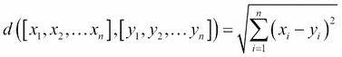

如你所见，欧几里得距离是通过在每个维度上计算距离（减去对应的维度），将距离平方，最后取平方根来推导出来的。

在我们的代码中，我们利用了 NumPy 的平方根和幂函数来实现前述公式：

```py
np.sqrt(np.sum(np.power((x-y),2)))
```

欧几里得距离是严格正的。当 x 等于 y 时，距离为零。通过我们如何调用欧几里得距离，可以清楚地看到这一点：

```py
x = np.asarray([1,2,3])
y = np.asarray([1,2,3])

print euclidean_distance(x,y)
```

如你所见，我们定义了两个 NumPy 数组，`x`和`y`。我们保持它们相同。现在，当我们用这些参数调用`euclidean_distance`函数时，输出是零。

现在，让我们调用 L2 范数函数，`lrNorm_distance`。

Lr-Norm 距离度量是距离度量家族中的一个成员，欧几里得距离属于该家族。我们可以通过它的公式来更清楚地理解这一点：

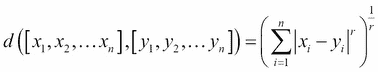

你可以看到，我们现在有了一个参数`r`。让我们将`r`替换为 2，这样会将前面的方程转化为欧几里得方程。因此，欧几里得距离也称为 L2 范数距离：

```py
lrNorm_distance(x,y,power):
```

除了两个向量外，我们还将传入一个名为`power`的第三个参数。这就是公式中定义的`r`。将其调用并设置`power`值为 2 时，将得到欧几里得距离。你可以通过运行以下代码来验证：

```py
print lrNorm_distance(x,y,2)
```

这将得到零作为结果，这类似于欧几里得距离函数。

让我们定义两个示例向量，`x`和`y`，并调用`cosine_distance`函数。

在将点视为方向的空间中，余弦距离表示给定输入向量之间角度的余弦值作为距离值。欧几里得空间以及点为整数或布尔值的空间，是余弦距离函数可以应用的候选空间。输入向量之间的角度余弦值是输入向量的点积与各自 L2 范数的乘积之比：

```py
np.dot(x,y) / np.sqrt(np.dot(x,x) * np.dot(y,y))
```

让我们看一下分子，其中计算了输入向量之间的点积：

```py
np.dot(x,y)
```

我们将使用 NumPy 的点积函数来获取点积值。`x`和`y`这两个向量的点积定义如下：

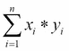

现在，让我们看一下分母：

```py
np.sqrt(np.dot(x,x) * np.dot(y,y))
```

我们再次使用点积函数来计算输入向量的 L2 范数：

```py
np.dot(x,x) is equivalent to 

tot = 0
for i in range(len(x)):
tot+=x[i] * x[i]
```

因此，我们可以计算两个输入向量之间角度的余弦值。

接下来，我们将讨论 Jaccard 距离。与之前的调用类似，我们将定义示例向量并调用`jaccard_distance`函数。

从实数值的向量开始，让我们进入集合。通常称为 Jaccard 系数，它是给定输入向量交集与并集大小的比率。减去这个值等于 Jaccard 距离。如你所见，在实现中，我们首先将输入列表转换为集合。这样我们就可以利用 Python 集合数据类型提供的并集和交集操作：

```py
set_x = set(x)
set_y = set(y)
```

最后，距离计算如下：

```py
1 - len(set_x.intersection(set_y)) / (1.0 * len(set_x.union(set_y)))
```

我们必须使用`set`数据类型中可用的交集和并集功能来计算距离。

我们的最后一个距离度量是汉明距离。对于两个比特向量，汉明距离计算这两个向量中有多少个比特不同：

```py
for char1,char2 in zip(x,y):
    if char1 != char2:
        diff+=1
return diff
```

如你所见，我们使用了`zip`功能来检查每个比特，并维护一个计数器，统计有多少个比特不同。汉明距离用于分类变量。

## 还有更多……

记住，通过从我们的距离值中减去 1，我们可以得到一个相似度值。

还有一种我们没有详细探讨的距离，但它被广泛使用，那就是曼哈顿距离或城市块距离。这是一种 L1 范数距离。通过将 r 值设置为 1 传递给 Lr 范数距离函数，我们将得到曼哈顿距离。

根据数据所处的底层空间，需要选择合适的距离度量。在算法中使用这些距离时，我们需要注意底层空间的情况。例如，在 k 均值算法中，每一步都会计算所有相互接近点的平均值作为簇中心。欧几里得空间的一个优点是点的平均值存在且也是该空间中的一个点。请注意，我们的 Jaccard 距离输入是集合，集合的平均值是没有意义的。

在使用余弦距离时，我们需要检查底层空间是否为欧几里得空间。如果向量的元素是实数，则空间是欧几里得的；如果它们是整数，则空间是非欧几里得的。余弦距离在文本挖掘中最为常见。在文本挖掘中，单词被视为坐标轴，文档是这个空间中的一个向量。两个文档向量之间夹角的余弦值表示这两个文档的相似度。

SciPy 实现了所有这些列出的距离度量及更多内容：

[`docs.scipy.org/doc/scipy/reference/spatial.distance.html`](http://docs.scipy.org/doc/scipy/reference/spatial.distance.html)。

上面的 URL 列出了 SciPy 支持的所有距离度量。

此外，scikit-learn 的`pairwise`子模块提供了一个叫做`pairwise_distance`的方法，可以用来计算输入记录之间的距离矩阵。你可以在以下位置找到：

[`scikitlearn.org/stable/modules/generated/sklearn.metrics.pairwise.pairwise_distances.html`](http://scikitlearn.org/stable/modules/generated/sklearn.metrics.pairwise.pairwise_distances.html)。

我们曾提到过汉明距离是用于分类变量的。这里需要提到的是，通常用于分类变量的一种编码方式是独热编码。在进行独热编码后，汉明距离可以作为输入向量之间的相似度/距离度量。

## 另见

+   *使用随机投影减少数据维度*，见第四章，*数据分析 - 深入探索*

# 学习和使用核方法

在本食谱中，我们将学习如何使用核方法进行数据处理。掌握核方法可以帮助你解决非线性问题。本食谱是核方法的入门介绍。

通常，线性模型——可以使用直线或超平面分离数据的模型——易于解释和理解。数据中的非线性使得我们无法有效使用线性模型。如果数据能够被转换到一个关系变为线性的空间中，我们就可以使用线性模型。然而，在变换后的空间中进行数学计算可能变成一个昂贵的操作。这就是核函数发挥作用的地方。

核函数是相似度函数。它接收两个输入参数，这两个输入之间的相似度就是核函数的输出。在这个示例中，我们将探讨核函数如何实现这种相似性。我们还将讨论所谓的“核技巧”。

正式定义一个核函数 K 是一个相似度函数：K(x1,x2) > 0 表示 x1 和 x2 之间的相似度。

## 准备就绪

在查看各种核函数之前，我们先来数学上定义一下：

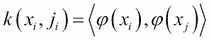

这里，`xi` 和 `xj` 是输入向量：

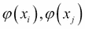

上述映射函数用于将输入向量转化为一个新的空间。例如，如果输入向量位于一个 n 维空间中，变换函数将其转换为一个维度为 m 的新空间，其中 m >> n：

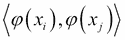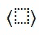

上图表示的是点积：


上图是点积，`xi` 和 `xj` 现在通过映射函数被转换到一个新的空间中。

在这个示例中，我们将看到一个简单的核函数在实际中的应用。

我们的映射函数如下所示：

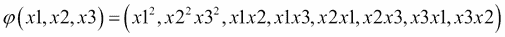

当原始数据被输入到这个映射函数时，它将输入转化为新的空间。

## 如何做到这一点…

让我们创建两个输入向量，并按照前面章节中描述的方式定义映射函数：

```py
import numpy as np
# Simple example to illustrate Kernel Function concept.
# 3 Dimensional input space
x = np.array([10,20,30])
y = np.array([8,9,10])

# Let us find a mapping function to transform this space
# phi(x1,x2,x3) = (x1x2,x1x3,x2x3,x1x1,x2x2,x3x3)
# this will transorm the input space into 6 dimesions

def mapping_function(x):
    output_list  =[]
    for i in range(len(x)):
        output_list.append(x[i]*x[i])

    output_list.append(x[0]*x[1])
    output_list.append(x[0]*x[2])
    output_list.append(x[1]*x[0])
    output_list.append(x[1]*x[2])
    output_list.append(x[2]*x[1])
    output_list.append(x[2]*x[0])
    return np.array(output_list)
```

现在，让我们看看主程序如何调用核变换。在主函数中，我们将定义一个核函数并将输入变量传递给它，然后打印输出：

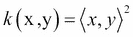

```py
if __name_ == "__main__"
    # Apply the mapping function
    tranf_x = mapping_function(x)
    tranf_y = mapping_function(y)
    # Print the output
    print tranf_x
    print np.dot(tranf_x,tranf_y)

    # Print the equivalent kernel functions
    # transformation output.
    output = np.power((np.dot(x,y)),2)
    print output
```

## 它是如何工作的…

让我们从主函数开始跟踪这个程序。我们创建了两个输入向量，`x` 和 `y`。这两个向量都是三维的。

然后我们定义了一个映射函数。这个映射函数利用输入向量的值，将输入向量转化为一个维度增加的新空间。在这个例子中，维度的数量从三维增加到九维。

现在，让我们对这些向量应用一个映射函数，将它们的维度增加到九维。

如果我们打印 `tranf_x`，我们将得到如下结果：

```py
[100 400 900 200 300 200 600 600 300]
```

如你所见，我们将输入向量 x 从三维空间转化为一个九维向量。

现在，让我们在变换后的空间中计算点积并打印输出。

输出为 313600，一个标量值。

现在让我们回顾一下：我们首先将两个输入向量转换到更高维的空间，然后计算点积以得到标量输出。

我们所做的是一个非常昂贵的操作，将原始的三维向量转换为九维向量，然后在其上执行点积操作。

相反，我们可以选择一个内核函数，它能够在不显式地将原始空间转换为新空间的情况下得到相同的标量输出。

我们的新内核定义如下：


对于两个输入，`x` 和 `y`，该内核计算向量的点积，并对它们进行平方。

在打印内核的输出后，我们得到了 313600。

我们从未进行过转换，但仍然能够得到与转换空间中点积输出相同的结果。这就是所谓的内核技巧。

选择这个内核并没有什么魔力。通过扩展内核，我们可以得到我们的映射函数。有关扩展的详细信息，请参考以下文献：

[`en.wikipedia.org/wiki/Polynomial_kernel`](http://en.wikipedia.org/wiki/Polynomial_kernel)。

## 还有更多...

有多种类型的内核。根据我们的数据特性和算法需求，我们需要选择合适的内核。以下是其中的一些：

线性内核：这是最简单的内核函数。对于两个给定的输入，它返回输入的点积：

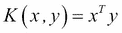

多项式内核：它的定义如下：

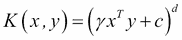

在这里，`x` 和 `y` 是输入向量，`d` 是多项式的次数，`c` 是常数。在我们的配方中，我们使用了次数为 2 的多项式内核。

以下是线性和多项式内核的 scikit 实现：

[`scikit-learn.org/stable/modules/generated/sklearn.metrics.pairwise.linear_kernel.html#sklearn.metrics.pairwise.linear_kernel`](http://scikit-learn.org/stable/modules/generated/sklearn.metrics.pairwise.linear_kernel.html#sklearn.metrics.pairwise.linear_kernel)

[`scikit-learn.org/stable/modules/generated/sklearn.metrics.pairwise.polynomial_kernel.html#sklearn.metrics.pairwise.polynomial_kernel`](http://scikit-learn.org/stable/modules/generated/sklearn.metrics.pairwise.polynomial_kernel.html#sklearn.metrics.pairwise.polynomial_kernel)。

## 另见

+   *使用内核 PCA* 配方见第四章，*数据分析 – 深入分析*

+   *通过随机投影减少数据维度* 配方见第四章，*数据分析 – 深入分析*

# 使用 k-means 方法进行数据聚类

在本节中，我们将讨论 k-means 算法。K-means 是一种寻求中心的无监督算法。它是一种迭代的非确定性方法。所谓迭代是指算法步骤会重复，直到达到指定步数的收敛。非确定性意味着不同的起始值可能导致不同的最终聚类结果。该算法需要输入聚类的数量`k`。选择`k`值没有固定的方法，它必须通过多次运行算法来确定。

对于任何聚类算法，其输出的质量由聚类间的凝聚度和聚类内的分离度来决定。同一聚类中的点应彼此靠近；不同聚类中的点应相互远离。

## 准备就绪

在我们深入了解如何用 Python 编写 k-means 算法之前，有两个关键概念需要讨论，它们将帮助我们更好地理解算法输出的质量。第一个是与聚类质量相关的定义，第二个是用于衡量聚类质量的度量标准。

每个由 k-means 检测到的聚类都可以通过以下度量进行评估：

1.  **聚类位置**：这是聚类中心的坐标。K-means 算法从一些随机点作为聚类中心开始，并通过迭代不断找到新的中心，使得相似的点被聚集到一起。

1.  **聚类半径**：这是所有点与聚类中心的平均偏差。

1.  **聚类质量**：这是聚类中点的数量。

1.  **聚类密度**：这是聚类质量与其半径的比值。

现在，我们将衡量输出聚类的质量。如前所述，这是一个无监督问题，我们没有标签来验证输出，因此无法计算诸如精确度、召回率、准确度、F1 分数或其他类似的度量指标。我们将为 k-means 算法使用的度量标准称为轮廓系数。它的取值范围是-1 到 1。负值表示聚类半径大于聚类之间的距离，从而导致聚类重叠，这表明聚类效果较差。较大的值，即接近 1 的值，表示聚类效果良好。

轮廓系数是为聚类中每个点定义的。对于一个聚类 C 和聚类中的一个点`i`，令`xi`为该点与聚类中所有其他点的平均距离。

现在，计算点`i`与另一个聚类 D 中所有点的平均距离，记为 D。选择这些值中的最小值，称为`yi`：

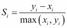

对于每个簇，所有点的轮廓系数的平均值可以作为簇质量的良好度量。所有数据点的轮廓系数的平均值可以作为整体簇质量的度量。

让我们继续生成一些随机数据：

```py
import numpy as np
import matplotlib.pyplot as plt

def get_random_data():
    x_1 = np.random.normal(loc=0.2,scale=0.2,size=(100,100))
    x_2 = np.random.normal(loc=0.9,scale=0.1,size=(100,100))
    x = np.r_[x_1,x_2]
    return x
```

我们从正态分布中采样了两组数据。第一组数据的均值为`0.2`，标准差为`0.2`。第二组数据的均值为`0.9`，标准差为`0.1`。每个数据集的大小为 100 * 100——我们有`100`个实例和`100`个维度。最后，我们使用 NumPy 的行堆叠函数将它们合并。我们的最终数据集大小为 200 * 100。

让我们绘制数据的散点图：

```py
x = get_random_data()

plt.cla()
plt.figure(1)
plt.title("Generated Data")
plt.scatter(x[:,0],x[:,1])
plt.show()
```

绘图如下：

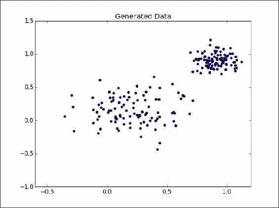

虽然我们只绘制了第一维和第二维，但你仍然可以清楚地看到我们有两个簇。现在，让我们开始编写我们的 k-means 聚类算法。

## 如何实现...

让我们定义一个函数，可以对给定的数据和参数`k`执行 k-means 聚类。该函数对给定数据进行聚类，并返回整体的轮廓系数。

```py
from sklearn.cluster import KMeans
from sklearn.metrics import silhouette_score

def form_clusters(x,k):
    """
    Build clusters
    """
    # k = required number of clusters
    no_clusters = k
    model = KMeans(n_clusters=no_clusters,init='random')
    model.fit(x)
    labels = model.labels_
    print labels
    # Cacluate the silhouette score
    sh_score = silhouette_score(x,labels)
    return sh_score
```

让我们调用上述函数，针对不同的`k`值，并存储返回的轮廓系数：

```py
sh_scores = []
for i in range(1,5):
    sh_score = form_clusters(x,i+1)
    sh_scores.append(sh_score)

no_clusters = [i+1 for i in range(1,5)]
```

最后，让我们绘制不同`k`值的轮廓系数。

```py
no_clusters = [i+1 for i in range(1,5)]

plt.figure(2)
plt.plot(no_clusters,sh_scores)
plt.title("Cluster Quality")
plt.xlabel("No of clusters k")
plt.ylabel("Silhouette Coefficient")
plt.show()
```

## 如何运作...

如前所述，k-means 是一个迭代算法。大致来说，k-means 的步骤如下：

1.  从数据集中初始化`k`个随机点作为初始中心点。

1.  按照以下步骤进行，直到指定次数的迭代收敛：

    +   将点分配给距离最近的簇中心。通常使用欧几里得距离来计算点与簇中心之间的距离。

    +   根据本次迭代中的分配重新计算新的簇中心。

    +   如果点的簇分配与上一次迭代相同，则退出循环。算法已收敛到最优解。

1.  我们将使用来自 scikit-learn 库的 k-means 实现。我们的聚类函数接受 k 值和数据集作为参数，并运行 k-means 算法：

    ```py
    model = KMeans(n_clusters=no_clusters,init='random')
    model.fit(x)
    ```

`no_clusters`是我们将传递给函数的参数。使用 init 参数时，我们将初始中心点设置为随机值。当 init 设置为 random 时，scikit-learn 会根据数据估算均值和方差，然后从高斯分布中采样 k 个中心。

最后，我们必须调用 fit 方法，在我们的数据集上运行 k-means 算法：

```py
labels = model.labels_
sh_score = silhouette_score(x,labels)
return sh_score
```

我们获取标签，即每个点的簇分配，并计算出簇中所有点的轮廓系数。

在实际场景中，当我们在数据集上启动 k-means 算法时，我们并不知道数据中存在的集群数量；换句话说，我们不知道 k 的理想值。然而，在我们的示例中，我们知道 k=2，因为我们生成的数据已经适配了两个集群。因此，我们需要针对不同的 k 值运行 k-means：

```py
sh_scores = []
for i in range(1,5):
sh_score = form_clusters(x,i+1)
sh_scores.append(sh_score)
```

对于每次运行，也就是每个 k 值，我们都会存储轮廓系数。k 与轮廓系数的图表可以揭示数据集的理想 k 值：

```py
no_clusters = [i+1 for i in range(1,5)]

plt.figure(2)
plt.plot(no_clusters,sh_scores)
plt.title("Cluster Quality")
plt.xlabel("No of clusters k")
plt.ylabel("Silhouette Coefficient")
plt.show()
```

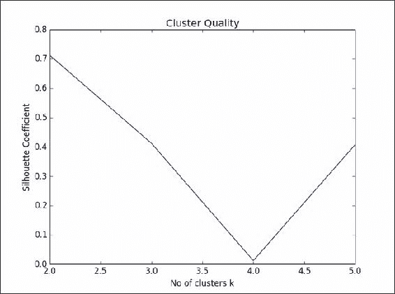

正如预期的那样，k=2 时，我们的轮廓系数非常高。

## 还有更多…

关于 k-means 需要注意的几点：k-means 算法不能用于类别数据，对于类别数据需要使用 k-medoids。k-medoids 不是通过平均所有点来寻找集群中心，而是选择一个点，使其与该集群中所有其他点的平均距离最小。

在分配初始集群时需要小心。如果数据非常密集且集群之间距离非常远，且初始随机中心选择在同一个集群中，那么 k-means 可能表现不佳。

通常情况下，k-means 算法适用于具有星形凸集群的数据。有关星形凸数据点的更多信息，请参考以下链接：

[`mathworld.wolfram.com/StarConvex.html`](http://mathworld.wolfram.com/StarConvex.html)

如果数据中存在嵌套集群或其他复杂集群，k-means 的结果可能会是无意义的输出。

数据中异常值的存在可能导致较差的结果。一种好的做法是在运行 k-means 之前，进行彻底的数据探索，以便了解数据特征。

一种在算法开始时初始化中心的替代方法是 k-means++方法。因此，除了将 init 参数设置为随机值外，我们还可以使用 k-means++来设置它。有关 k-means++的更多信息，请参考以下论文：

*k-means++：小心初始化的优势*。*ACM-SIAM 研讨会*关于*离散算法。2007 年*

## 另见

+   在第五章中的*距离度量工作法*配方，*数据挖掘 - 在大海捞针*

# 使用局部离群因子方法发现异常值

局部离群因子（LOF）是一种异常值检测算法，它通过比较数据实例与其邻居的局部密度来检测异常值。其目的是决定数据实例是否属于相似密度的区域。它可以在数据集群数量未知且集群具有不同密度和大小的情况下，检测出数据集中的异常值。它受 KNN（K-最近邻）算法的启发，并被广泛使用。

## 准备工作

在前一个配方中，我们研究了单变量数据。在这个配方中，我们将使用多变量数据并尝试找出异常值。让我们使用一个非常小的数据集来理解 LOF 算法进行异常值检测。

我们将创建一个 5 X 2 的矩阵，查看数据后我们知道最后一个元组是异常值。我们也可以将其绘制为散点图：

```py
from collections import defaultdict
import numpy as np

instances = np.matrix([[0,0],[0,1],[1,1],[1,0],[5,0]])

import numpy as np
import matplotlib.pyplot as plt

x = np.squeeze(np.asarray(instances[:,0]))
y = np.squeeze(np.asarray(instances[:,1]))
plt.cla()
plt.figure(1)
plt.scatter(x,y)
plt.show()
```

绘图结果如下：

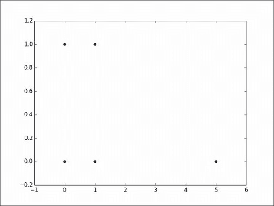

LOF 通过计算每个点的局部密度来工作。根据点的 k 近邻的距离，估算该点的局部密度。通过将点的局部密度与其邻居的密度进行比较，检测出异常值。与邻居相比，异常值的密度较低。

为了理解 LOF，我们需要了解一些术语定义：

+   对象 P 的 k 距离是对象 P 与其第 k 近邻之间的距离。K 是算法的一个参数。

+   P 的 k 距离邻域是所有距离 P 的距离小于或等于 P 与其第 k 近邻之间距离的对象 Q 的列表。

+   从 P 到 Q 的可达距离定义为 P 与其第 k 近邻之间的距离与 P 到 Q 之间的距离中的最大值。以下符号可能有助于澄清这一点：

    ```py
    Reachability distance (P ß Q) = > maximum(K-Distance(P), Distance(P,Q))
    ```

+   P 的局部可达密度（LRD(P)）是 P 的 k 距离邻域与 P 及其邻居的可达距离之和的比值。

+   P 的局部异常因子（LOF(P)）是 P 的局部可达密度与 P 的 k 近邻局部可达密度的比值的平均值。

## 如何实现……

1.  让我们计算点之间的`pairwise`距离：

    ```py
    k = 2
    distance = 'manhattan'

    from sklearn.metrics import pairwise_distances
    dist = pairwise_distances(instances,metric=distance)
    ```

1.  让我们计算 k 距离。我们将使用`heapq`来获取 k 近邻：

    ```py
    # Calculate K distance
    import heapq
    k_distance = defaultdict(tuple)
    # For each data point
    for i in range(instances.shape[0]):
        # Get its distance to all the other points.
        # Convert array into list for convienience
        distances = dist[i].tolist()
        # Get the K nearest neighbours
        ksmallest = heapq.nsmallest(k+1,distances)[1:][k-1]
        # Get their indices
        ksmallest_idx = distances.index(ksmallest)
        # For each data point store the K th nearest neighbour and its distance
        k_distance[i]=(ksmallest,ksmallest_idx)
    ```

1.  计算 k 距离邻域：

    ```py
    def all_indices(value, inlist):
        out_indices = []
        idx = -1
        while True:
            try:
                idx = inlist.index(value, idx+1)
                out_indices.append(idx)
            except ValueError:
                break
        return out_indices
    # Calculate K distance neighbourhood
    import heapq
    k_distance_neig = defaultdict(list)
    # For each data point
    for i in range(instances.shape[0]):
        # Get the points distances to its neighbours
        distances = dist[i].tolist()
        print "k distance neighbourhood",i
        print distances
        # Get the 1 to K nearest neighbours
        ksmallest = heapq.nsmallest(k+1,distances)[1:]
        print ksmallest
        ksmallest_set = set(ksmallest)
        print ksmallest_set
        ksmallest_idx = []
        # Get the indices of the K smallest elements
        for x in ksmallest_set:
                ksmallest_idx.append(all_indices(x,distances))
        # Change a list of list to list
        ksmallest_idx = [item for sublist in ksmallest_idx for item in sublist]
        # For each data pont store the K distance neighbourhood
        k_distance_neig[i].extend(zip(ksmallest,ksmallest_idx))
    ```

1.  然后，计算可达距离和 LRD：

    ```py
    #Local reachable density
    local_reach_density = defaultdict(float)
    for i in range(instances.shape[0]):
        # LRDs numerator, number of K distance neighbourhood
        no_neighbours = len(k_distance_neig[i])
        denom_sum = 0
        # Reachability distance sum
        for neigh in k_distance_neig[i]:
            # maximum(K-Distance(P), Distance(P,Q))
            denom_sum+=max(k_distance[neigh[1]][0],neigh[0])
        local_reach_density[i] = no_neighbours/(1.0*denom_sum)
    ```

1.  计算 LOF：

    ```py
    lof_list =[]
    #Local Outlier Factor
    for i in range(instances.shape[0]):
        lrd_sum = 0
        rdist_sum = 0
        for neigh in k_distance_neig[i]:
            lrd_sum+=local_reach_density[neigh[1]]
            rdist_sum+=max(k_distance[neigh[1]][0],neigh[0])
        lof_list.append((i,lrd_sum*rdist_sum))
    ```

## 它是如何工作的……

在步骤 1 中，我们选择曼哈顿距离作为距离度量，k 值为 2。我们正在查看数据点的第二近邻。

然后我们必须计算我们的元组之间的成对距离。成对相似性存储在 dist 矩阵中。正如你所看到的，dist 的形状如下：

```py
>>> dist.shape
(5, 5)
>>>
```

它是一个 5 X 5 的矩阵，其中行和列是各个元组，单元格的值表示它们之间的距离。

在步骤 2 中，我们导入`heapq`：

```py
import heapq
```

`heapq`是一种数据结构，也称为优先队列。它类似于常规队列，区别在于每个元素都有一个优先级，优先级高的元素会先于优先级低的元素被处理。

请参考维基百科链接获取有关优先队列的更多信息：

[`en.wikipedia.org/wiki/Priority_queue`](http://en.wikipedia.org/wiki/Priority_queue)。

Python 的 heapq 文档可以在[`docs.python.org/2/library/heapq.html`](https://docs.python.org/2/library/heapq.html)找到。

```py
k_distance = defaultdict(tuple)
```

接下来，我们定义一个字典，其中键是元组 ID，值是元组与其第 k 近邻的距离。在我们的情况下，应该是第二近邻。

然后，我们进入一个 for 循环，以便为每个数据点找到第 k 近邻的距离：

```py
distances = dist[i].tolist()
```

从我们的距离矩阵中，我们提取第 i 行。正如你所看到的，第 i 行捕获了对象`i`与所有其他对象之间的距离。记住，单元格值（`i`,`i`）表示与自身的距离。我们需要在下一步中忽略这一点。我们必须将数组转换为列表以方便操作。让我们通过一个例子来理解这一点。距离矩阵如下所示：

```py
>>> dist
array([[ 0.,  1.,  2.,  1.,  5.],
       [ 1.,  0.,  1.,  2.,  6.],
       [ 2.,  1.,  0.,  1.,  5.],
       [ 1.,  2.,  1.,  0.,  4.],
       [ 5.,  6.,  5.,  4.,  0.]]) 
```

假设我们处于 for 循环的第一次迭代中，因此我们的`i`=`0`。（记住，Python 的索引是从`0`开始的）。

所以，现在我们的距离列表将如下所示：

```py
[ 0.,  1.,  2.,  1.,  5.]
```

从中，我们需要第 k 近邻，即第二近邻，因为我们在程序开始时将 K 设置为`2`。

从中我们可以看到，索引 1 和索引 3 都可以作为我们的第 k 近邻，因为它们的值都是`1`。

现在，我们使用`heapq.nsmallest`函数。记住，我们之前提到过，`heapq`是一个普通队列，但每个元素都有一个优先级。在这种情况下，元素的值即为优先级。当我们说给我 n 个最小值时，`heapq`会返回最小的元素：

```py
# Get the Kth nearest neighbours
ksmallest = heapq.nsmallest(k+1,distances)[1:][k-1]
```

让我们看一下`heapq.nsmallest`函数的作用：

```py
>>> help(heapq.nsmallest)
Help on function nsmallest in module heapq:

nsmallest(n, iterable, key=None)
    Find the n smallest elements in a dataset.

    Equivalent to:  sorted(iterable, key=key)[:n]
```

它返回给定数据集中的 n 个最小元素。在我们的例子中，我们需要第二近邻。此外，我们需要避免之前提到的（`i`,`i`）。因此，我们必须传递 n=3 给`heapq.nsmallest`。这确保它返回三个最小元素。然后，我们对列表进行子集操作，排除第一个元素（参见 nsmallest 函数调用后的[1:]），最终获取第二近邻（参见[1:]后的`[k-1]`）。

我们还必须获取`i`的第二近邻的索引，并将其存储在字典中：

```py
# Get their indices
ksmallest_idx = distances.index(ksmallest)
# For each data point store the K th nearest neighbour and its distance
k_distance[i]=(ksmallest,ksmallest_idx)
```

让我们打印出我们的字典：

```py
print k_distance
defaultdict(<type 'tuple'>, {0: (1.0, 1), 1: (1.0, 0), 2: (1.0, 1), 3: (1.0, 0), 4: (5.0, 0)})
```

我们的元组有两个元素：距离和在距离数组中元素的索引。例如，对于`0`，第二近邻是索引为`1`的元素。

计算完所有数据点的 k 距离后，我们接下来找出 k 距离邻域。

在步骤 3 中，我们为每个数据点找到 k 距离邻域：

```py
# Calculate K distance neighbourhood
import heapq
k_distance_neig = defaultdict(list)
```

与前一步类似，我们导入了 heapq 模块并声明了一个字典，用来保存我们的 k 距离邻域的详细信息。让我们回顾一下什么是 k 距离邻域：

P 的 k 距离邻域是所有与 P 的距离小于或等于 P 与其第 k 近邻之间距离的对象 Q 的列表：

```py
distances = dist[i].tolist()
# Get the 1 to K nearest neighbours
ksmallest = heapq.nsmallest(k+1,distances)[1:]
ksmallest_set = set(ksmallest)
```

前两行应该对你很熟悉。我们在上一步已经做过了。看看第二行。在这里，我们再次调用了 n smallest，`n=3`（即 K+1），但我们选择了输出列表中的所有元素，除了第一个。（猜猜为什么？答案在前一步中）。

让我们通过打印值来查看其实际操作。像往常一样，在循环中，我们假设我们看到的是第一个数据点或元组，其中 i=0。

我们的距离列表如下所示：

```py
[0.0, 1.0, 2.0, 1.0, 5.0]
```

我们的`heapq.nsmallest`函数返回如下：

```py
[1.0, 1.0]
```

这些是 1 到 k 个最近邻的距离。我们需要找到它们的索引，简单的 list.index 函数只会返回第一个匹配项，因此我们将编写`all_indices`函数来检索所有索引：

```py
def all_indices(value, inlist):
    out_indices = []
    idx = -1
    while True:
        try:
            idx = inlist.index(value, idx+1)
            out_indices.append(idx)
        except ValueError:
            break
    return out_indices
```

通过值和列表，`all_indices`将返回值在列表中出现的所有索引。我们必须将 k 个最小值转换为集合：

```py
ksmallest_set = set(ksmallest)
```

所以，[1.0,1.0]变成了一个集合([1.0])。现在，使用 for 循环，我们可以找到所有元素的索引：

```py
# Get the indices of the K smallest elements
for x in ksmallest_set:
ksmallest_idx.append(all_indices(x,distances))
```

我们为 1.0 得到两个索引；它们是 1 和 2：

```py
ksmallest_idx = [item for sublist in ksmallest_idx for item in sublist]
```

下一个 for 循环用于将列表中的列表转换为列表。`all_indices`函数返回一个列表，我们然后将此列表添加到`ksmallest_idx`列表中。因此，我们通过下一个 for 循环将其展开。

最后，我们将 k 个最小的邻域添加到我们的字典中：

```py
k_distance_neig[i].extend(zip(ksmallest,ksmallest_idx))
```

然后我们添加元组，其中元组中的第一个项是距离，第二个项是最近邻的索引。让我们打印 k 距离邻域字典：

```py
defaultdict(<type 'list'>, {0: [(1.0, 1), (1.0, 3)], 1: [(1.0, 0), (1.0, 2)], 2: [(1.0, 1), (1.0, 3)], 3: [(1.0, 0), (1.0, 2)], 4: [(4.0, 3), (5.0, 0)]})
```

在步骤 4 中，我们计算 LRD。LRD 是通过可达距离来计算的。让我们回顾一下这两个定义：

+   从 P 到 Q 的可达距离被定义为 P 与其第 k 个最近邻之间的距离和 P 与 Q 之间的距离的最大值。以下符号可能有助于澄清这一点：

    ```py
    Reachability distance (P ß Q) = > maximum(K-Distance(P), Distance(P,Q))
    ```

+   P 的局部可达密度（LRD(P)）是 P 的 k 距离邻域与 k 及其邻域的可达距离之和的比率：

    ```py
    #Local reachable density
    local_reach_density = defaultdict(float)
    ```

我们首先声明一个字典来存储 LRD：

```py
for i in range(instances.shape[0]):
# LRDs numerator, number of K distance neighbourhood
no_neighbours = len(k_distance_neig[i])
denom_sum = 0
# Reachability distance sum
for neigh in k_distance_neig[i]:
# maximum(K-Distance(P), Distance(P,Q))
denom_sum+=max(k_distance[neigh[1]][0],neigh[0])
   local_reach_density[i] = no_neighbours/(1.0*denom_sum)
```

对于每个点，我们将首先找到该点的 k 距离邻域。例如，对于 i = 0，分子将是 len(`k_distance_neig[0]`)，即 2。

现在，在内部的 for 循环中，我们计算分母。然后我们计算每个 k 距离邻域点的可达距离。该比率存储在`local_reach_density`字典中。

最后，在步骤 5 中，我们计算每个点的 LOF：

```py
for i in range(instances.shape[0]):
lrd_sum = 0
rdist_sum = 0
for neigh in k_distance_neig[i]:
lrd_sum+=local_reach_density[neigh[1]]
rdist_sum+=max(k_distance[neigh[1]][0],neigh[0])
lof_list.append((i,lrd_sum*rdist_sum))
```

对于每个数据点，我们计算其邻居的 LRD 之和和与其邻居的可达距离之和，并将它们相乘以得到 LOF。

LOF 值非常高的点被视为异常点。让我们打印`lof_list`：

```py
[(0, 4.0), (1, 4.0), (2, 4.0), (3, 4.0), (4, 18.0)]
```

正如你所见，最后一个点与其他点相比，LOF 非常高，因此，它是一个异常点。

## 还有更多……

为了更好地理解 LOF，你可以参考以下论文：

*LOF：识别基于密度的局部异常点*

*Markus M. Breunig, Hans-Peter Kriegel, Raymond T. Ng, Jörg Sander*

*Proc. ACM SIGMOD 2000 国际数据管理会议，德克萨斯州达拉斯，2000 年*

# 学习向量量化

在这个示例中，我们将看到一种无模型的方法来聚类数据点，称为学习向量量化，简称 LVQ。LVQ 可以用于分类任务。使用这种技术很难在目标变量和预测变量之间做出推理。与其他方法不同，很难弄清楚响应变量 Y 与预测变量 X 之间存在哪些关系。它们在许多现实世界的场景中作为黑箱方法非常有效。

## 准备工作

LVQ 是一种在线学习算法，其中数据点一次处理一个。它的直观理解非常简单。假设我们已经为数据集中不同的类别识别了原型向量。训练点会朝向相似类别的原型靠近，并会排斥其他类别的原型。

LVQ 的主要步骤如下：

为数据集中的每个类别选择 k 个初始原型向量。如果是二分类问题，我们决定为每个类别选择两个原型向量，那么我们将得到四个初始原型向量。初始原型向量是从输入数据集中随机选择的。

我们将开始迭代。我们的迭代将在 epsilon 值达到零或预定义阈值时结束。我们将决定一个 epsilon 值，并在每次迭代中递减 epsilon 值。

在每次迭代中，我们将对一个输入点进行抽样（有放回抽样），并找到离该点最近的原型向量。我们将使用欧几里得距离来找到最近的点。我们将如下更新最近点的原型向量：

如果原型向量的类别标签与输入数据点相同，我们将通过原型向量与数据点之间的差值来增大原型向量。

如果类别标签不同，我们将通过原型向量与数据点之间的差值来减少原型向量。

我们将使用 Iris 数据集来演示 LVQ 的工作原理。如同我们之前的一些示例，我们将使用 scikit-learn 的方便数据加载函数来加载 Iris 数据集。Iris 是一个广为人知的分类数据集。然而我们在这里使用它的目的是仅仅为了演示 LVQ 的能力。没有类别标签的数据集也可以被 LVQ 使用或处理。由于我们将使用欧几里得距离，因此我们将使用 minmax 缩放来对数据进行缩放。

```py
from sklearn.datasets import load_iris
import numpy as np
from sklearn.metrics import euclidean_distances

data = load_iris()
x = data['data']
y = data['target']

# Scale the variables
from sklearn.preprocessing import MinMaxScaler
minmax = MinMaxScaler()
x = minmax.fit_transform(x)
```

## 如何实现…

1.  让我们首先声明 LVQ 的参数：

    ```py
    R = 2
    n_classes = 3
    epsilon = 0.9
    epsilon_dec_factor = 0.001
    ```

1.  定义一个类来保存原型向量：

    ```py
    class prototype(object):
        """
        Class to hold prototype vectors
        """

        def __init__(self,class_id,p_vector,eplsilon):
            self.class_id = class_id
            self.p_vector = p_vector
            self.epsilon = epsilon

        def update(self,u_vector,increment=True):
            if increment:
                # Move the prototype vector closer to input vector
                self.p_vector = self.p_vector + self.epsilon*(u_vector - self.p_vector)
            else:
                # Move the prototype vector away from input vector
                self.p_vector = self.p_vector - self.epsilon*(u_vector - self.p_vector)
    ```

1.  这是一个用于找到给定向量最接近的原型向量的函数：

    ```py
    def find_closest(in_vector,proto_vectors):
        closest = None
        closest_distance = 99999
        for p_v in proto_vectors:
            distance = euclidean_distances(in_vector,p_v.p_vector)
            if distance < closest_distance:
                closest_distance = distance
                closest = p_v
        return closest
    ```

1.  一个方便的函数，用来找到最接近的原型向量的类别 ID 如下：

    ```py
    def find_class_id(test_vector,p_vectors):
        return find_closest(test_vector,p_vectors).class_id
    ```

1.  选择初始的 K * 类别数的原型向量：

    ```py
    # Choose R initial prototypes for each class        
    p_vectors = []
    for i in range(n_classes):
        # Select a class
        y_subset = np.where(y == i)
        # Select tuples for choosen class
        x_subset  = x[y_subset]
        # Get R random indices between 0 and 50
        samples = np.random.randint(0,len(x_subset),R)
        # Select p_vectors
        for sample in samples:
            s = x_subset[sample]
            p = prototype(i,s,epsilon)
            p_vectors.append(p)

    print "class id \t Initial protype vector\n"
    for p_v in p_vectors:
        print p_v.class_id,'\t',p_v.p_vector
           print
    ```

1.  进行迭代调整原型向量，以便使用现有的数据点对任何新的输入点进行分类/聚类：

    ```py
    while epsilon >= 0.01:
        # Sample a training instance randonly
        rnd_i = np.random.randint(0,149)
        rnd_s = x[rnd_i]
        target_y = y[rnd_i]

        # Decrement epsilon value for next iteration
        epsilon = epsilon - epsilon_dec_factor    
        # Find closes prototype vector to given point
        closest_pvector = find_closest(rnd_s,p_vectors)

        # Update closes prototype vector
        if target_y == closest_pvector.class_id:
            closest_pvector.update(rnd_s)
        else:
            closest_pvector.update(rnd_s,False)
        closest_pvector.epsilon = epsilon

    print "class id \t Final Prototype Vector\n"
    for p_vector in p_vectors:
        print p_vector.class_id,'\t',p_vector.p_vector
    ```

1.  以下是一个小的测试，用来验证我们方法的正确性：

    ```py
    predicted_y = [find_class_id(instance,p_vectors) for instance in x ]

    from sklearn.metrics import classification_report

    print
    print classification_report(y,predicted_y,target_names=['Iris-Setosa','Iris-Versicolour', 'Iris-Virginica'])
    ```

## 它是如何工作的…

在第 1 步中，我们初始化了算法的参数。我们选择了 R 值为 2，也就是说，每个类别标签有两个原型向量。Iris 数据集是一个三类问题，所以我们一共有六个原型向量。我们必须选择我们的 epsilon 值和 epsilon 减小因子。

然后我们在第 2 步中定义了一个数据结构，用来存储每个原型向量的详细信息。我们的类为数据集中每个点存储以下内容：

```py
self.class_id = class_id
self.p_vector = p_vector
self.epsilon = epsilon
```

原型向量所属的类别 ID 就是向量本身和 epsilon 值。它还有一个 `update` 函数，用于更改原型值：

```py
def update(self,u_vector,increment=True):
if increment:
# Move the prototype vector closer to input vector
self.p_vector = self.p_vector + self.epsilon*(u_vector - self.p_vector)
else:
# Move the prototype vector away from input vector
self.p_vector = self.p_vector - self.epsilon*(u_vector - self.p_vector)
```

在第 3 步中，我们定义了以下函数，该函数以任意给定的向量作为输入，并接受所有原型向量的列表。在所有原型向量中，函数返回与给定向量最接近的原型向量：

```py
for p_v in proto_vectors:
distance = euclidean_distances(in_vector,p_v.p_vector)
if distance < closest_distance:
closest_distance = distance
closest = p_v
```

正如你所见，它会遍历所有的原型向量，找出最接近的一个。它使用欧几里得距离来衡量相似度。

第 4 步是一个小函数，可以返回与给定向量最接近的原型向量的类别 ID。

现在我们已经完成了 LVQ 算法所需的所有预处理，可以进入第 5 步的实际算法。对于每个类别，我们必须选择初始的原型向量。然后，我们从每个类别中选择 R 个随机点。外部循环遍历每个类别，对于每个类别，我们选择 R 个随机样本并创建我们的原型对象，具体如下：

```py
samples = np.random.randint(0,len(x_subset),R)
# Select p_vectors
for sample in samples:
s = x_subset[sample]
p = prototype(i,s,epsilon)
p_vectors.append(p)
```

在第 6 步中，我们迭代地增加或减少原型向量。我们会持续循环，直到 epsilon 值降到 0.01 以下。

然后我们从数据集中随机采样一个点，具体如下：

```py
# Sample a training instance randonly
rnd_i = np.random.randint(0,149)
rnd_s = x[rnd_i]
target_y = y[rnd_i]
```

点和它对应的类别 ID 已被提取。

然后我们可以找到最接近这个点的原型向量，具体如下：

```py
closest_pvector = find_closest(rnd_s,p_vectors)
```

如果当前点的类别 ID 与原型的类别 ID 匹配，我们会调用 `update` 方法，增量设置为 `True`，否则我们将调用 `update` 方法，增量设置为 `False`：

```py
# Update closes prototype vector
if target_y == closest_pvector.class_id:
closest_pvector.update(rnd_s)
else:
closest_pvector.update(rnd_s,False)
```

最后，我们更新最接近的原型向量的 epsilon 值：

```py
closest_pvector.epsilon = epsilon
```

我们可以打印出原型向量，以便手动查看：

```py
print "class id \t Final Prototype Vector\n"
for p_vector in p_vectors:
print p_vector.class_id,'\t',p_vector.p_vector
```

在第 7 步中，我们将原型向量投入实际应用，进行预测：

```py
predicted_y = [find_class_id(instance,p_vectors) for instance in x ]
```

我们可以使用 `find_class_id` 函数获得预测的类别 ID。我们将一个点和所有已学习的原型向量传递给它，以获取类别 ID。

最后，我们给出我们的预测输出，以生成分类报告：

```py
print classification_report(y,predicted_y,target_names=['Iris-Setosa','Iris-Versicolour', 'Iris-Virginica'])
```

分类报告函数是由 scikit-learn 库提供的一个便捷函数，用于查看分类准确度评分：

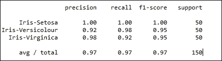

你可以看到我们在分类方面做得相当不错。请记住，我们并没有保留单独的测试集。绝不要根据训练数据来衡量模型的准确性。始终使用训练过程中未见过的测试集。我们这么做仅仅是为了说明。

## 还有更多...

请记住，这种技术不像其他分类方法那样涉及任何优化准则。因此，很难判断原型向量生成的效果如何。

在我们的配方中，我们将原型向量初始化为随机值。你也可以使用 K-Means 算法来初始化原型向量。

## 另见

+   *使用 K-Means 聚类数据* 配方见 第五章， *数据挖掘——大海捞针*

# 查找单变量数据中的异常值

异常值是与数据集中其他数据点相距较远的数据点。在数据科学应用中，它们必须小心处理。无意中将它们包含在某些算法中可能导致错误的结果或结论。正确处理异常值并使用合适的算法来应对它们是非常重要的。

|   | *“异常值检测是一个极其重要的问题，直接应用于许多领域，包括欺诈检测（Bolton, 2002）、识别计算机网络入侵和瓶颈（Lane, 1999）、电子商务中的犯罪活动和检测可疑活动（Chiu, 2003）。”* |   |
| --- | --- | --- |
|   | --*- Jayakumar 和 Thomas, 基于多变量异常值检测的聚类新程序（《数据科学期刊》11(2013), 69-84）* |

在本配方中，我们将查看如何检测单变量数据中的异常值，然后转向查看多变量数据和文本数据中的异常值。

## 准备就绪

在本配方中，我们将查看以下三种单变量数据异常值检测方法：

+   中位数绝对偏差

+   均值加减三个标准差

让我们看看如何利用这些方法来发现单变量数据中的异常值。在进入下一节之前，我们先创建一个包含异常值的数据集，以便我们可以通过经验评估我们的方法：

```py
import numpy as np
import matplotlib.pyplot as plt

n_samples = 100
fraction_of_outliers = 0.1
number_inliers = int ( (1-fraction_of_outliers) * n_samples )
number_outliers = n_samples - number_inliers
```

我们将创建 100 个数据点，其中 10% 会是异常值：

```py
# Get some samples from a normal distribution
normal_data = np.random.randn(number_inliers,1)
```

我们将在 NumPy 的 `random` 模块中使用 `randn` 函数生成我们的正常值数据。这将是一个均值为零，标准差为一的分布样本。让我们验证一下我们样本的均值和标准差：

```py
# Print the mean and standard deviation
# to confirm the normality of our input data.
mean = np.mean(normal_data,axis=0)
std = np.std(normal_data,axis=0)
print "Mean =(%0.2f) and Standard Deviation (%0.2f)"%(mean[0],std[0])
```

我们将使用 NumPy 中的函数来计算均值和标准差，并打印输出。让我们查看输出结果：

```py
Mean =(0.24) and Standard Deviation (0.90)
```

正如你所看到的，均值接近零，标准差接近一。

现在，让我们创建异常值数据。这将是整个数据集的 10%，即 10 个点，假设我们的样本大小是 100。正如你所看到的，我们从 -9 到 9 之间的均匀分布中采样了异常值。这个范围内的任何点都有相等的被选择的机会。我们将合并正常值和异常值数据。在运行异常值检测程序之前，最好通过散点图查看数据：

```py
# Create outlier data
outlier_data = np.random.uniform(low=-9,high=9,size=(number_outliers,1))
total_data = np.r_[normal_data,outlier_data]
print "Size of input data = (%d,%d)"%(total_data.shape)
# Eyeball the data
plt.cla()
plt.figure(1)
plt.title("Input points")
plt.scatter(range(len(total_data)),total_data,c='b')
```

让我们来看一下生成的图形：

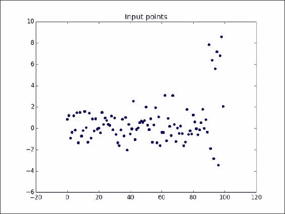

我们的*y*轴是我们生成的实际值，*x*轴是一个累积计数。您可以做一个练习，标记您认为是异常值的点。稍后我们可以将程序输出与您的手动选择进行比较。

## 如何操作…

1.  让我们从中位数绝对偏差开始。然后我们将绘制我们的值，并将异常值标记为红色：

    ```py
    # Median Absolute Deviation
    median = np.median(total_data)
    b = 1.4826
    mad = b * np.median(np.abs(total_data - median))
    outliers = []
    # Useful while plotting
    outlier_index = []
    print "Median absolute Deviation = %.2f"%(mad)
    lower_limit = median - (3*mad)
    upper_limit = median + (3*mad)
    print "Lower limit = %0.2f, Upper limit = %0.2f"%(lower_limit,upper_limit)
    for i in range(len(total_data)):
        if total_data[i] > upper_limit or total_data[i] < lower_limit:
            print "Outlier %0.2f"%(total_data[i])
            outliers.append(total_data[i])
            outlier_index.append(i)

    plt.figure(2)
    plt.title("Outliers using mad")
    plt.scatter(range(len(total_data)),total_data,c='b')
    plt.scatter(outlier_index,outliers,c='r')
    plt.show()
    ```

1.  继续进行均值加减三倍标准差的操作，我们将绘制我们的值，并将异常值标记为红色：

    ```py
    # Standard deviation
    std = np.std(total_data)
    mean = np.mean(total_data)
    b = 3
    outliers = []
    outlier_index = []
    lower_limt = mean-b*std
    upper_limt = mean+b*std
    print "Lower limit = %0.2f, Upper limit = %0.2f"%(lower_limit,upper_limit)
    for i in range(len(total_data)):
        x = total_data[i]
        if x > upper_limit or x < lower_limt:
            print "Outlier %0.2f"%(total_data[i])
            outliers.append(total_data[i])
            outlier_index.append(i)

    plt.figure(3)
    plt.title("Outliers using std")
    plt.scatter(range(len(total_data)),total_data,c='b')
    plt.scatter(outlier_index,outliers,c='r')
    plt.savefig("B04041 04 10.png")
    plt.show()
    ```

## 它是如何工作的…

在第一步中，我们使用中位数绝对偏差来检测数据中的异常值：

```py
median = np.median(total_data)
b = 1.4826
mad = b * np.median(np.abs(total_data - median))
```

我们首先使用 NumPy 中的中位数函数计算数据集的中位数值。接着，我们声明一个值为 1.4826 的变量。这个常数将与偏离中位数的绝对偏差相乘。最后，我们计算每个数据点相对于中位数值的绝对偏差的中位数，并将其乘以常数 b。

任何偏离中位数绝对偏差三倍以上的点都被视为我们方法中的异常值：

```py
lower_limit = median - (3*mad)
upper_limit = median + (3*mad)

print "Lower limit = %0.2f, Upper limit = %0.2f"%(lower_limit,upper_limit)
```

然后，我们计算了中位数绝对偏差的上下限，如前所示，并将每个点分类为异常值或正常值，具体如下：

```py
for i in range(len(total_data)):
if total_data[i] > upper_limit or total_data[i] < lower_limit:
print "Outlier %0.2f"%(total_data[i])
outliers.append(total_data[i])
outlier_index.append(i)
```

最后，所有异常值都存储在名为 outliers 的列表中。我们还必须将异常值的索引存储在一个名为 outlier_index 的单独列表中。这是为了方便绘图，您将在下一步中看到这一点。

然后我们绘制原始点和异常值。绘图结果如下所示：

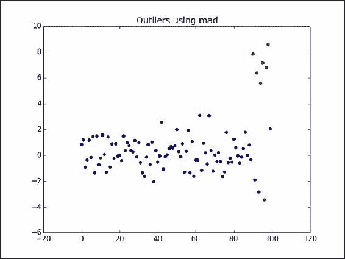

被红色标记的点被算法判定为异常值。

在第三步中，我们编写第二个算法，即均值加减三倍标准差：

```py
std = np.std(total_data)
mean = np.mean(total_data)
b = 3
```

我们接着计算数据集的标准差和均值。在这里，您可以看到我们设置了`b = 3`。正如我们算法的名字所示，我们需要一个标准差为三，而这个 b 也正是用来实现这个目标的：

```py
lower_limt = mean-b*std
upper_limt = mean+b*std

print "Lower limit = %0.2f, Upper limit = %0.2f"%(lower_limit,upper_limit)

for i in range(len(total_data)):
x = total_data[i]
if x > upper_limit or x < lower_limt:
print "Outlier %0.2f"%(total_data[i])
outliers.append(total_data[i])
outlier_index.append(i)
```

我们可以计算出上下限，方法是将均值减去三倍标准差。使用这些值，我们可以在 for 循环中将每个点分类为异常值或正常值。然后我们将所有异常值及其索引添加到两个列表中，outliers 和 outlier_index，以便绘图。

最后，我们绘制了异常值：

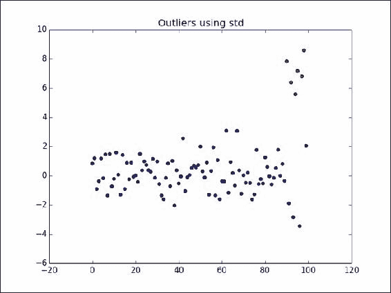

## 还有更多内容…

根据异常值的定义，给定数据集中的异常值是那些与其他数据点距离较远的点。数据集中心的估算值和数据集分布的估算值可以用来检测异常值。在我们在本食谱中概述的方法中，我们使用均值和中位数作为数据中心的估算值，使用标准差和中位数绝对偏差作为分布的估算值。分布也被称为尺度。

让我们稍微理清一下我们的检测异常值方法为何有效。首先从使用标准差的方法开始。对于高斯数据，我们知道 68.27% 的数据位于一个标准差内，95.45% 位于两个标准差内，99.73% 位于三个标准差内。因此，根据我们的规则，任何与均值的距离超过三个标准差的点都被归类为异常值。然而，这种方法并不稳健。我们来看一个小例子。

让我们从正态分布中抽取八个数据点，均值为零，标准差为一。

让我们使用 `NumPy.random` 中的便捷函数来生成我们的数据：

```py
np.random.randn(8)
```

这给出了以下数值：

```py
-1.76334861, -0.75817064,  0.44468944, -0.07724717,  0.12951944,0.43096092, -0.05436724, -0.23719402
```

现在我们手动添加两个异常值，例如 45 和 69，加入到这个列表中。

我们的数据集现在看起来如下：

```py
-1.763348607322289, -0.7581706357821458, 0.4446894368956213, -0.07724717210195432, 0.1295194428816003, 0.4309609200681169, -0.05436724238743103, -0.23719402072058543, 45, 69
```

前面数据集的均值是 11.211，标准差是 `23.523`。

我们来看一下上限规则，均值 + 3 * 标准差。这是 11.211 + 3 * 23.523 = 81.78。

现在，根据这个上限规则，45 和 69 两个点都不是异常值！均值和标准差是数据集中心和尺度的非稳健估计量，因为它们对异常值非常敏感。如果我们用一个极端值替换数据集中任意一个点（样本量为 n），这将完全改变均值和标准差的估计值。估计量的这一特性被称为有限样本断点。

### 注意

有限样本断点被定义为，在样本中，能被替换的观察值比例，替换后估计器仍然能准确描述数据。

因此，对于均值和标准差，有限样本断点是 0%，因为在大样本中，替换哪怕一个点也会显著改变估计值。

相比之下，中位数是一个更稳健的估计值。中位数是有限观察集合中按升序排序后的中间值。为了使中位数发生显著变化，我们必须替换掉数据中远离中位数的一半观察值。这就给出了中位数的 50% 有限样本断点。

中位绝对偏差法归因于以下论文：

*Leys, C., 等，检测异常值：不要使用均值周围的标准差，使用中位数周围的绝对偏差，《实验社会心理学杂志》（2013）*, [`dx.doi.org/10.1016/j.jesp.2013.03.013`](http://dx.doi.org/10.1016/j.jesp.2013.03.013)。

## 另见

+   第一章中的 *执行汇总统计和绘图* 配方，*使用 Python 进行数据科学*
