# 第六章 机器学习 1

本章我们将涵盖以下主题：

+   为模型构建准备数据

+   查找最近邻

+   使用朴素贝叶斯对文档进行分类

+   构建决策树解决多类别问题

# 介绍

本章我们将探讨监督学习技术。在上一章中，我们介绍了包括聚类和学习向量量化在内的无监督技术。我们将从一个分类问题开始，然后转向回归问题。分类问题的输入是在下一章中的一组记录或实例。

每条记录或实例可以写作一个集合（X，y），其中 X 是属性集，y 是对应的类别标签。

学习一个目标函数 F，该函数将每条记录的属性集映射到预定义的类别标签 y，是分类算法的任务。

分类算法的一般步骤如下：

1.  寻找合适的算法

1.  使用训练集学习模型，并使用测试集验证模型

1.  应用模型预测任何未见过的实例或记录

第一步是确定正确的分类算法。没有固定的方法来选择合适的算法，这需要通过反复的试错过程来完成。选择算法后，创建训练集和测试集，并将其提供给算法，以学习一个模型，也就是前面定义的目标函数 F。通过训练集创建模型后，使用测试集来验证模型。通常，我们使用混淆矩阵来验证模型。我们将在我们的食谱中进一步讨论混淆矩阵：查找最近邻。

我们将从一个食谱开始，展示如何将输入数据集划分为训练集和测试集。接下来我们将介绍一种懒惰学习者算法用于分类，称为 K-最近邻算法。然后我们将看一下朴素贝叶斯分类器。接下来我们将探讨一个使用决策树处理多类别问题的食谱。本章我们选择的算法并非随意选择。我们将在本章中介绍的三种算法都能够处理多类别问题，除了二分类问题。在多类别问题中，我们有多个类别标签，实例可以属于这些类别中的任意一个。

# 为模型构建准备数据

在这个示例中，我们将展示如何从给定的数据集中创建训练集和测试集用于分类问题。测试数据集永远不会被展示给模型。在实际应用中，我们通常会建立另一个名为 dev 的数据集。Dev 代表开发数据集：我们可以用它在模型的连续运行过程中持续调优模型。模型使用训练集进行训练，模型的性能度量，如准确率，则在 dev 数据集上进行评估。根据这些结果，如果需要改进，模型将进一步调优。在后续章节中，我们将介绍一些比简单的训练测试集拆分更复杂的数据拆分方法。

## 准备工作

我们将使用鸢尾花数据集来进行这个示例。由于我们已经在许多之前的示例中使用过它，所以使用这个数据集展示概念非常简单。

## 如何实现…

```py
# Load the necesssary Library
from sklearn.cross_validation import train_test_split
from sklearn.datasets import load_iris
import numpy as np

def get_iris_data():
    """
    Returns Iris dataset
    """
    # Load iris dataset
    data = load_iris()

    # Extract the dependend and independent variables
    # y is our class label
    # x is our instances/records
    x    = data['data']
    y    = data['target']

    # For ease we merge them
    # column merge
    input_dataset = np.column_stack([x,y])

    # Let us shuffle the dataset
    # We want records distributed randomly
    # between our test and train set

    np.random.shuffle(input_dataset)

    return input_dataset

# We need  80/20 split.
# 80% of our records for Training
# 20% Remaining for our Test set
train_size = 0.8
test_size  = 1-train_size

# get the data
input_dataset = get_iris_data()
# Split the data
train,test = train_test_split(input_dataset,test_size=test_size)

# Print the size of original dataset
print "Dataset size ",input_dataset.shape
# Print the train/test split
print "Train size ",train.shape
print "Test  size",test.shape
```

这很简单。让我们检查一下类别标签是否在训练集和测试集之间按比例分配。这是一个典型的类别不平衡问题：

def get_class_distribution(y):

```py
"""
Given an array of class labels
Return the class distribution
"""
    distribution = {}
    set_y = set(y)
    for y_label in set_y:
        no_elements = len(np.where(y == y_label)[0])
        distribution[y_label] = no_elements
    dist_percentage = {class_label: count/(1.0*sum(distribution.values())) for class_label,count in distribution.items()}
    return dist_percentage

def print_class_label_split(train,test):
  """
  Print the class distribution
  in test and train dataset
  """  
    y_train = train[:,-1]

    train_distribution = get_class_distribution(y_train)
    print "\nTrain data set class label distribution"
    print "=========================================\n"
    for k,v in train_distribution.items():
        print "Class label =%d, percentage records =%.2f"%(k,v)

    y_test = test[:,-1]    

    test_distribution = get_class_distribution(y_test)

    print "\nTest data set class label distribution"
    print "=========================================\n"

    for k,v in test_distribution.items():
        print "Class label =%d, percentage records =%.2f"%(k,v)

print_class_label_split(train,test)
```

让我们看看如何将类别标签均匀分配到训练集和测试集中：

```py
# Perform Split the data
stratified_split = StratifiedShuffleSplit(input_dataset[:,-1],test_size=test_size,n_iter=1)

for train_indx,test_indx in stratified_split:
    train = input_dataset[train_indx]
    test =  input_dataset[test_indx]
    print_class_label_split(train,test)
```

## 如何工作…

在我们导入必要的库模块后，必须编写一个方便的函数`get_iris_data()`，该函数将返回鸢尾花数据集。然后，我们将`x`和`y`数组按列连接成一个名为`input_dataset`的单一数组。接着，我们对数据集进行打乱，以便记录能够随机分配到测试集和训练集。该函数返回一个包含实例和类别标签的单一数组。

我们希望将 80%的记录包含在训练数据集中，剩余的用作测试数据集。`train_size`和`test_size`变量分别表示应该分配到训练集和测试集中的百分比值。

我们必须调用`get_iris_data()`函数以获取输入数据。然后，我们利用 scikit-learn 的`cross_validation`模块中的`train_test_split`函数将输入数据集拆分成两部分。

最后，我们可以打印原始数据集的大小，接着是测试集和训练集的大小：

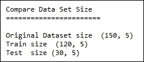

我们的原始数据集有 150 行和五列。记住，只有四个属性；第五列是类别标签。我们已经将`x`和`y`按列连接。

正如你所看到的，150 行数据中的 80%（即 120 条记录）已被分配到我们的训练集中。我们已经展示了如何轻松地将输入数据拆分为训练集和测试集。

记住，这是一个分类问题。算法应该被训练来预测给定未知实例或记录的正确类别标签。为此，我们需要在训练期间为算法提供所有类别的均匀分布。鸢尾花数据集是一个三类问题，我们应该确保所有三类都有相等的代表性。让我们看看我们的方法是否已经解决了这个问题。

我们必须定义一个名为`get_class_distribution`的函数，该函数接受一个单一的`y`参数（类别标签数组）。此函数返回一个字典，其中键是类别标签，值是该分布记录的百分比。因此，字典提供了类别标签的分布情况。我们必须在以下函数中调用此函数，以了解训练集和测试集中的类别分布。

`print_class_label_split`函数不言自明。我们必须将训练集和测试集作为参数传递。由于我们已经将`x`和`y`连接在一起，最后一列就是我们的类别标签。然后，我们提取`y_train`和`y_test`中的训练集和测试集类别标签。我们将它们传递给`get_class_distribution`函数，以获取类别标签及其分布的字典，最后打印出来。

最后，我们可以调用`print_class_label_split`，我们的输出应该如下所示：

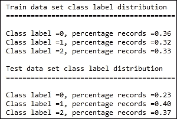

现在让我们查看输出结果。如您所见，我们的训练集和测试集中的类别标签分布不同。测试集中正好 40%的实例属于`class label 1`。这不是正确的分割方式。我们应该在训练集和测试集之间拥有相等的分布。

在最后一段代码中，我们使用了来自 scikit-learn 的`StratifiedShuffleSplit`，以实现训练集和测试集中类别的均匀分布。让我们查看`StratifiedShuffleSplit`的参数：

```py
stratified_split = StratifiedShuffleSplit(input_dataset[:,-1],test_size=test_size,n_iter=1)
```

第一个参数是输入数据集。我们传递所有行和最后一列。我们的测试集大小由我们最初声明的`test_size`变量定义。我们可以假设仅使用`n_iter`变量进行一次分割。然后，我们继续调用`print_class_label_split`函数打印类别标签的分布情况。让我们查看输出结果：

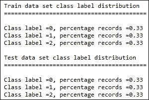

现在，我们已经在测试集和训练集之间均匀分布了类别标签。

## 还有更多...

在使用机器学习算法之前，我们需要仔细准备数据。为训练集和测试集提供均匀的类别分布是构建成功分类模型的关键。

在实际的机器学习场景中，除了训练集和测试集外，我们还会创建另一个称为开发集（dev set）的数据集。我们可能在第一次迭代中无法正确构建模型。我们不希望将测试数据集展示给我们的模型，因为这可能会影响我们下一次模型构建的结果。因此，我们创建了这个开发集，可以在迭代模型构建过程中使用。

我们在本节中指定的 80/20 法则是一个理想化的场景。然而，在许多实际应用中，我们可能没有足够的数据来留下如此多的实例作为测试集。在这种情况下，一些实用技术，如交叉验证，便派上用场。在下一章中，我们将探讨各种交叉验证技术。

# 查找最近邻

在我们进入具体步骤之前，让我们先花些时间了解如何检查我们的分类模型是否达到预期的表现。在介绍部分，我们提到过一个术语叫做混淆矩阵。

混淆矩阵是实际标签与预测标签的矩阵排列。假设我们有一个二分类问题，即`y`可以取值为`T`或`F`。假设我们训练了一个分类器来预测`y`。在我们的测试数据中，我们知道`y`的实际值，同时我们也有模型预测的`y`值。我们可以按照以下方式填充混淆矩阵：

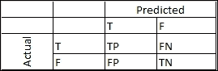

这里是一个表格，我们方便地列出了来自测试集的结果。记住，我们知道测试集中的类别标签，因此我们可以将分类模型的输出与实际类别标签进行比较。

+   在`TP`（真正例）下，我们统计的是测试集中所有标签为`T`的记录，且模型也预测为`T`的记录数。

+   在`FN`（假阴性）的情况下，我们统计的是所有实际标签为`T`，但算法预测为 N 的记录数。

+   `FP`表示假阳性，即实际标签为`F`，但算法预测为`T`

+   `TN`表示真阴性，即算法预测的标签和实际类别标签都为`F`

通过了解这个混淆矩阵，我们现在可以推导出一些性能指标，用于衡量我们分类模型的质量。在未来的章节中，我们将探索更多的指标，但现在我们将介绍准确率和错误率。

准确率定义为正确预测与总预测次数的比率。从混淆矩阵中，我们可以知道 TP 和 TN 的总和是正确预测的总数：

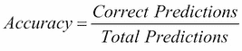

从训练集得出的准确率通常过于乐观。应该关注测试集上的准确率值，以确定模型的真实表现。

掌握了这些知识后，让我们进入我们的示例。我们首先要看的分类算法是 K-最近邻，简称 KNN。在详细讲解 KNN 之前，让我们先看看一个非常简单的分类算法，叫做死记硬背分类算法。死记硬背分类器会记住整个训练数据，也就是说，它将所有数据加载到内存中。当我们需要对一个新的训练实例进行分类时，它会尝试将新的训练实例与内存中的任何训练实例进行匹配。它会将测试实例的每个属性与训练实例中的每个属性进行匹配。如果找到匹配项，它会将测试实例的类别标签预测为匹配的训练实例的类别标签。

你现在应该知道，如果测试实例与加载到内存中的任何训练实例不相似，这个分类器会失败。

KNN 类似于死记硬背分类器，不同之处在于它不是寻找完全匹配，而是使用相似度度量。与死记硬背分类器类似，KNN 将所有训练集加载到内存中。当它需要对一个测试实例进行分类时，它会计算测试实例与所有训练实例之间的距离。利用这个距离，它会选择训练集中 K 个最接近的实例。现在，测试集的预测是基于 K 个最近邻的多数类别。

例如，如果我们有一个二分类问题，并且选择我们的 K 值为 3，那么如果给定的测试记录的三个最近邻类别分别为 1、1 和 0，它将把测试实例分类为 1，也就是多数类别。

KNN 属于一种叫做基于实例学习的算法家族。此外，由于对测试实例的分类决定是在最后做出的，因此它也被称为懒学习者。

## 准备中

对于这个示例，我们将使用 scikit 的 `make_classification` 方法生成一些数据。我们将生成一个包含四列/属性/特征和 100 个实例的矩阵：

```py
from sklearn.datasets import make_classification

import numpy as np
import matplotlib.pyplot as plt
import itertools

from sklearn.ensemble import BaggingClassifier
from sklearn.neighbors import KNeighborsClassifier

def get_data():
    """
    Make a sample classification dataset
    Returns : Independent variable y, dependent variable x
    """
    x,y = make_classification(n_features=4)
    return x,y

def plot_data(x,y):
    """
    Plot a scatter plot fo all variable combinations
    """
    subplot_start = 321
    col_numbers = range(0,4)
    col_pairs = itertools.combinations(col_numbers,2)

    for col_pair in col_pairs:
        plt.subplot(subplot_start)
        plt.scatter(x[:,col_pair[0]],x[:,col_pair[1]],c=y)
        title_string = str(col_pair[0]) + "-" + str(col_pair[1])
        plt.title(title_string)
        x_label = str(col_pair[0])
        y_label = str(col_pair[1])
        plt.xlabel(x_label)
        plt.xlabel(y_label)
        subplot_start+=1

    plt.show()

x,y = get_data()    
plot_data(x,y)
```

`get_data` 函数内部调用 `make_classification` 来生成任何分类任务的测试数据。

在将数据输入任何算法之前，最好先对数据进行可视化。我们的 `plot_data` 函数会生成所有变量之间的散点图：

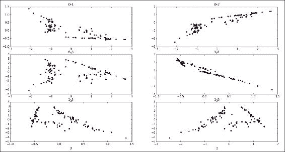

我们已经绘制了所有变量的组合。顶部的两个图表显示了第 0 列与第 1 列之间的组合，接着是第 0 列与第 2 列的组合。数据点也按其类别标签上色。这展示了这些变量组合在进行分类任务时提供了多少信息。

## 如何做…

我们将数据集准备和模型训练分成两个不同的方法：`get_train_test` 用来获取训练和测试数据，`build_model` 用来构建模型。最后，我们将使用 `test_model` 来验证我们模型的有效性：

```py
from sklearn.cross_validation import StratifiedShuffleSplit
from sklearn.neighbors import KNeighborsClassifier
from sklearn.metrics import classification_report

def get_train_test(x,y):
    """
    Perpare a stratified train and test split
    """
    train_size = 0.8
    test_size = 1-train_size
    input_dataset = np.column_stack([x,y])
    stratified_split = StratifiedShuffleSplit(input_dataset[:,-1],test_size=test_size,n_iter=1)

    for train_indx,test_indx in stratified_split:
        train_x = input_dataset[train_indx,:-1]
        train_y = input_dataset[train_indx,-1]
        test_x =  input_dataset[test_indx,:-1]
        test_y = input_dataset[test_indx,-1]
    return train_x,train_y,test_x,test_y

def build_model(x,y,k=2):
    """
    Fit a nearest neighbour model
    """
    knn = KNeighborsClassifier(n_neighbors=k)
    knn.fit(x,y)
    return knn

def test_model(x,y,knn_model):
    y_predicted = knn_model.predict(x)
    print classification_report(y,y_predicted)

if __name__ == "__main__":

    # Load the data    
    x,y = get_data()

    # Scatter plot the data
    plot_data(x,y)

    # Split the data into train and test    
    train_x,train_y,test_x,test_y = get_train_test(x,y)

    # Build the model
    knn_model = build_model(train_x,train_y)

    # Test the model
    print "\nModel evaluation on training set"
    print "================================\n"
    test_model(train_x,train_y,knn_model)

    print "\nModel evaluation on test set"
    print "================================\n"
    test_model(test_x,test_y,knn_model)
```

## 如何运作…

让我们尝试遵循主方法中的代码。我们必须从调用`get_data`并使用`plot_data`进行绘图开始，如前一部分所述。

如前所述，我们需要将一部分训练数据分离出来用于测试，以评估我们的模型。然后，我们调用`get_train_test`方法来完成这一操作。

在`get_train_test`中，我们决定了训练测试集的分割比例，标准为 80/20。然后，我们使用 80%的数据来训练我们的模型。现在，我们在拆分之前，使用 NumPy 的`column_stack`方法将 x 和 y 合并为一个矩阵。

然后，我们利用在前面配方中讨论的`StratifiedShuffleSplit`，以便在训练集和测试集之间获得均匀的类标签分布。

凭借我们的训练集和测试集，我们现在准备好构建分类器了。我们必须使用我们的训练集、属性`x`和类标签`y`来调用构建模型函数。该函数还接收`K`作为参数，表示邻居的数量，默认值为二。

我们使用了 scikit-learn 的 KNN 实现，`KNeighborsClassifier`。然后，我们创建分类器对象并调用`fit`方法来构建我们的模型。

我们准备好使用训练数据来测试模型的表现了。我们可以将训练数据（x 和 y）以及模型传递给`test_model`函数。

我们知道我们的实际类标签（y）。然后，我们调用预测函数，使用我们的 x 来获得预测标签。接着，我们打印出一些模型评估指标。我们可以从打印模型的准确率开始，接着是混淆矩阵，最后展示一个名为`classification_report`的函数的输出。scikit-learn 的 metrics 模块提供了一个名为`classification_report`的函数，可以打印出多个模型评估指标。

让我们来看看我们的模型指标：

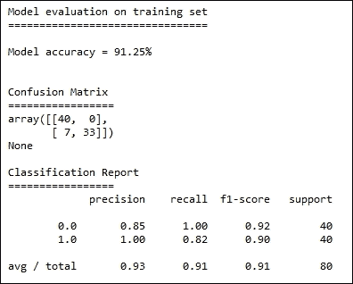

如你所见，我们的准确率得分是 91.25%。我们不会重复准确率的定义，你可以参考介绍部分。

现在让我们来看一下混淆矩阵。左上角的单元格是正确正类单元格。我们可以看到没有假负类，但有七个假正类（第二行的第一个单元格）。

最后，我们在分类报告中得到了精确度、召回率、F1 分数和支持度。让我们来看看它们的定义：

`精确度`是正确正类与正确正类和假正类之和的比率

`准确率`是正确正类与正确正类和假负类之和的比率

F1 分数是精确度和敏感度的调和平均值

我们将在未来章节的单独配方中更详细地讨论这个指标。现在，暂时可以说我们会有较高的精确度和召回率值。

知道我们模型的准确率约为 91%是好的，但真正的考验将是在测试数据上运行时。让我们看看测试数据的指标：

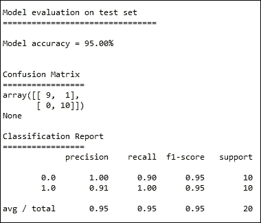

很高兴地知道，我们的模型在测试数据上的准确率为 95%，这表明我们在拟合模型方面做得很好。

## 还有更多内容…

让我们更深入地了解我们已经构建的模型：

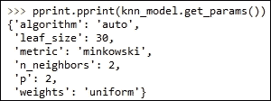

我们调用了一个名为`get_params`的函数。该函数返回所有传递给模型的参数。让我们来检查每个参数。

第一个参数指的是 KNN 实现所使用的底层数据结构。由于训练集中的每个记录都必须与其他所有记录进行比较，暴力实现可能会占用大量计算资源。因此，我们可以选择 `kd_tree` 或 `ball_tree` 作为数据结构。暴力方法会对每个记录使用暴力法，通过循环遍历所有记录。

叶子大小是传递给 `kd_tree` 或 `ball_tree` 方法的参数。

度量是用于寻找邻居的距离度量方法。两者的 p 值将 Minkowski 距离简化为欧几里得距离。

最后，我们有了权重参数。KNN 根据其 K 个最近邻的类别标签来决定测试实例的类别标签。多数投票决定测试实例的类别标签。但是，如果我们将权重设置为距离，那么每个邻居会被赋予一个与其距离成反比的权重。因此，在决定测试集的类别标签时，进行的是加权投票，而不是简单投票。

## 另请参见

+   *为模型构建准备数据* 这一方法在第六章，*机器学习 I*中有提到。

+   *距离度量法工作* 这一方法在第五章，*数据挖掘——大海捞针*中有提到。

# 使用朴素贝叶斯分类文档

在这个方案中，我们将查看一个文档分类问题。我们将使用的算法是朴素贝叶斯分类器。贝叶斯定理是驱动朴素贝叶斯算法的引擎，如下所示：

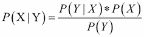

它展示了事件 X 发生的可能性，前提是我们已经知道事件 Y 已经发生。在我们的方案中，我们将对文本进行分类或分组。我们的分类问题是二分类问题：给定一条电影评论，我们想要分类评论是正面还是负面。

在贝叶斯术语中，我们需要找到条件概率：给定评论，评论为正的概率，和评论为负的概率。我们可以将其表示为一个方程：

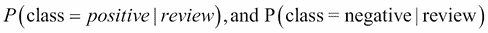

对于任何评论，如果我们有前面的两个概率值，我们可以通过比较这些值将评论分类为正面或负面。如果负面的条件概率大于正面的条件概率，我们将评论分类为负面，反之亦然。

现在，让我们通过贝叶斯定理来讨论这些概率：

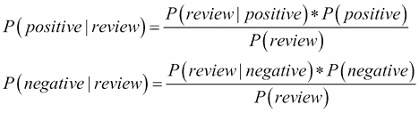

由于我们将比较这两个方程来最终确定预测结果，我们可以忽略分母，因为它只是一个简单的缩放因子。

上述方程的左侧（LHS）称为后验概率。

让我们看一下右侧（RHS）的分子部分：

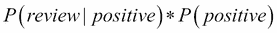

`P(positive)` 是正类的概率，称为先验概率。这是我们基于训练集对正类标签分布的信念。

我们将从我们的训练测试中进行估计。计算公式如下：

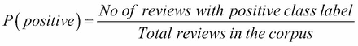

P(review|positive) 是似然度。它回答了这样一个问题：在给定类别为正类的情况下，获得该评论的可能性是多少。同样，我们将从我们的训练集中进行估计。

在我们进一步展开似然度方程之前，让我们引入独立性假设的概念。由于这个假设，该算法被称为朴素的。与实际情况相反，我们假设文档中的词是相互独立的。我们将利用这个假设来计算似然度。

一条评论是一个单词列表。我们可以将其用数学符号表示如下：

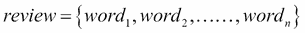

基于独立性假设，我们可以说，这些词在评论中共同出现的概率是评论中各个单词的单独概率的乘积。

现在我们可以将似然度方程写成如下形式：

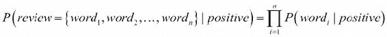

所以，给定一个新的评论，我们可以利用这两个方程——先验概率和似然度，来计算该评论是正面的还是负面的。

希望你到现在为止都跟上了。现在还有最后一块拼图：我们如何计算每个单词的概率？

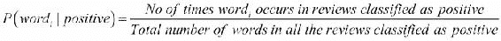

这一步是指训练模型。

从我们的训练集出发，我们将取出每个评论，并且我们也知道它的标签。对于评论中的每一个词，我们将计算条件概率并将其存储在表格中。这样，我们就可以利用这些值来预测未来的测试实例。

理论够了！让我们深入了解我们的步骤。

## 准备工作

对于这个步骤，我们将使用 NLTK 库来处理数据和算法。在安装 NLTK 时，我们也可以下载数据集。一个这样的数据集是电影评论数据集。电影评论数据集被分为两类，正面和负面。对于每个类别，我们都有一个词列表；评论已经预先分割成单词：

```py
from nltk.corpus import movie_reviews

```

如此处所示，我们将通过从 NLTK 导入语料库模块来包括数据集。

我们将利用 `NaiveBayesClassifier` 类，这个类定义在 NLTK 中，用来构建模型。我们将把我们的训练数据传递给一个名为 `train()` 的函数，以建立我们的模型。

## 如何操作……

让我们从导入必要的函数开始。接下来我们将导入两个工具函数。第一个函数用来获取电影评论数据，第二个函数帮助我们将数据划分为训练集和测试集：

```py
from nltk.corpus import movie_reviews
from sklearn.cross_validation import StratifiedShuffleSplit
import nltk
from nltk.corpus import stopwords
from nltk.collocations import BigramCollocationFinder
from nltk.metrics import BigramAssocMeasures

def get_data():
    """
    Get movie review data
    """
    dataset = []
    y_labels = []
    # Extract categories
    for cat in movie_reviews.categories():
        # for files in each cateogry    
        for fileid in movie_reviews.fileids(cat):
            # Get the words in that category
            words = list(movie_reviews.words(fileid))
            dataset.append((words,cat))
            y_labels.append(cat)
    return dataset,y_labels

def get_train_test(input_dataset,ylabels):
    """
    Perpare a stratified train and test split
    """
    train_size = 0.7
    test_size = 1-train_size
    stratified_split = StratifiedShuffleSplit(ylabels,test_size=test_size,n_iter=1,random_state=77)

    for train_indx,test_indx in stratified_split:
        train   = [input_dataset[i] for i in train_indx]
        train_y = [ylabels[i] for i in train_indx]

        test    = [input_dataset[i] for i in test_indx]
        test_y  = [ylabels[i] for i in test_indx]
    return train,test,train_y,test_y
```

现在我们将介绍三个函数，这些函数主要用于特征生成。我们需要为分类器提供特征或属性。这些函数根据评论生成一组特征：

```py
def build_word_features(instance):
    """
    Build feature dictionary
    Features are binary, name of the feature is word iteslf
    and value is 1\. Features are stored in a dictionary
    called feature_set
    """
    # Dictionary to store the features
    feature_set = {}
    # The first item in instance tuple the word list
    words = instance[0]
    # Populate feature dicitonary
    for word in words:
        feature_set[word] = 1
    # Second item in instance tuple is class label
    return (feature_set,instance[1])

def build_negate_features(instance):
    """
    If a word is preceeded by either 'not' or 'no'
    this function adds a prefix 'Not_' to that word
    It will also not insert the previous negation word
    'not' or 'no' in feature dictionary
    """
    # Retreive words, first item in instance tuple
    words = instance[0]
    final_words = []
    # A boolean variable to track if the 
    # previous word is a negation word
    negate = False
    # List of negation words
    negate_words = ['no','not']
    # On looping throught the words, on encountering
    # a negation word, variable negate is set to True
    # negation word is not added to feature dictionary
    # if negate variable is set to true
    # 'Not_' prefix is added to the word
    for word in words:
        if negate:
            word = 'Not_' + word
            negate = False
        if word not in negate_words:
            final_words.append(word)
        else:
            negate = True
    # Feature dictionary
    feature_set = {}
    for word in final_words:
        feature_set[word] = 1
    return (feature_set,instance[1])

def remove_stop_words(in_data):
    """
    Utility function to remove stop words
    from the given list of words
    """
    stopword_list = stopwords.words('english')
    negate_words = ['no','not']
    # We dont want to remove the negate words
    # Hence we create a new stop word list excluding
    # the negate words
    new_stopwords = [word for word in stopword_list if word not in negate_words]
    label = in_data[1]
    # Remove stopw words
    words = [word for word in in_data[0] if word not in new_stopwords]
    return (words,label)

def build_keyphrase_features(instance):
    """
    A function to extract key phrases
    from the given text.
    Key Phrases are words of importance according to a measure
    In this key our phrase of is our length 2, i.e two words or bigrams
    """
    feature_set = {}
    instance = remove_stop_words(instance)
    words = instance[0]

    bigram_finder  = BigramCollocationFinder.from_words(words)
    # We use the raw frequency count of bigrams, i.e. bigrams are
    # ordered by their frequency of occurence in descending order
    # and top 400 bigrams are selected.
    bigrams        = bigram_finder.nbest(BigramAssocMeasures.raw_freq,400)
    for bigram in bigrams:
        feature_set[bigram] = 1
    return (feature_set,instance[1])
```

现在让我们编写一个函数来构建我们的模型，并稍后检查我们的模型，以评估其有效性：

```py
def build_model(features):
    """
    Build a naive bayes model
    with the gvien feature set.
    """
    model = nltk.NaiveBayesClassifier.train(features)
    return model    

def probe_model(model,features,dataset_type = 'Train'):
    """
    A utility function to check the goodness
    of our model.
    """
    accuracy = nltk.classify.accuracy(model,features)
    print "\n" + dataset_type + " Accuracy = %0.2f"%(accuracy*100) + "%" 

def show_features(model,no_features=5):
    """
    A utility function to see how important
    various features are for our model.
    """
    print "\nFeature Importance"
    print "===================\n"
    print model.show_most_informative_features(no_features)        
```

在第一次尝试时，很难将模型调整到最佳状态。我们需要尝试不同的特征和参数调整。这基本上是一个反复试验的过程。在下一节代码中，我们将通过改进模型来展示我们的不同尝试：

```py
def build_model_cycle_1(train_data,dev_data):
    """
    First pass at trying out our model
    """
    # Build features for training set
    train_features =map(build_word_features,train_data)
    # Build features for test set
    dev_features = map(build_word_features,dev_data)
    # Build model
    model = build_model(train_features)    
    # Look at the model
    probe_model(model,train_features)
    probe_model(model,dev_features,'Dev')

    return model

def build_model_cycle_2(train_data,dev_data):
    """
    Second pass at trying out our model
    """

    # Build features for training set
    train_features =map(build_negate_features,train_data)
    # Build features for test set
    dev_features = map(build_negate_features,dev_data)
    # Build model
    model = build_model(train_features)    
    # Look at the model
    probe_model(model,train_features)
    probe_model(model,dev_features,'Dev')

    return model

def build_model_cycle_3(train_data,dev_data):
    """
    Third pass at trying out our model
    """

    # Build features for training set
    train_features =map(build_keyphrase_features,train_data)
    # Build features for test set
    dev_features = map(build_keyphrase_features,dev_data)
    # Build model
    model = build_model(train_features)    
    # Look at the model
    probe_model(model,train_features)
    probe_model(model,dev_features,'Dev')
    test_features = map(build_keyphrase_features,test_data)
    probe_model(model,test_features,'Test')

    return model
```

最后，我们将编写一段代码，以便调用我们之前定义的所有函数：

```py
if __name__ == "__main__":

    # Load data
    input_dataset, y_labels = get_data()
    # Train data    
    train_data,all_test_data,train_y,all_test_y = get_train_test(input_dataset,y_labels)
    # Dev data
    dev_data,test_data,dev_y,test_y = get_train_test(all_test_data,all_test_y)

    # Let us look at the data size in our different 
    # datasets
    print "\nOriginal  Data Size   =", len(input_dataset)
    print "\nTraining  Data Size   =", len(train_data)
    print "\nDev       Data Size   =", len(dev_data)
    print "\nTesting   Data Size   =", len(test_data)    

    # Different passes of our model building exercise    
    model_cycle_1 =  build_model_cycle_1(train_data,dev_data)
    # Print informative features
    show_features(model_cycle_1)    
    model_cycle_2 = build_model_cycle_2(train_data,dev_data)
    show_features(model_cycle_2)
    model_cycle_3 = build_model_cycle_3(train_data,dev_data)
    show_features(model_cycle_3)
```

## 它是如何工作的……

让我们尝试按照主函数中的步骤来执行这个过程。我们从调用`get_data`函数开始。如前所述，电影评论数据被存储为两类：正面和负面。我们的第一个循环遍历这些类别。在第二个循环中，我们使用这些类别来检索文件 ID。使用这些文件 ID，我们进一步获取单词，如下所示：

```py
            words = list(movie_reviews.words(fileid))
```

我们将这些单词附加到一个名为`dataset`的列表中。类别标签将附加到另一个名为`y_labels`的列表中。

最后，我们返回单词及其相应的类别标签：

```py
    return dataset,y_labels
```

凭借数据集，我们需要将其划分为测试集和训练集：

```py
 # Train data    
    train_data,all_test_data,train_y,all_test_y = get_train_test(input_dataset,y_labels)
```

我们调用了`get_train_test`函数，传入一个输入数据集和类别标签。此函数为我们提供了一个分层样本。我们使用 70%的数据作为训练集，剩余的作为测试集。

我们再次调用`get_train_test`，并传入上一步返回的测试数据集：

```py
    # Dev data
    dev_data,test_data,dev_y,test_y = get_train_test(all_test_data,all_test_y)
```

我们创建了一个单独的数据集，并称其为开发集。我们需要这个数据集来调整我们的模型。我们希望我们的测试集真正充当测试集的角色。在构建模型的不同过程中，我们不希望暴露测试集。

让我们打印出我们的训练集、开发集和测试集的大小：

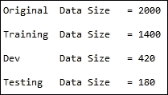

如你所见，70%的原始数据被分配到我们的训练集中。其余的 30%再次被划分为`Dev`和`Testing`的 70/30 分配。

让我们开始我们的模型构建活动。我们将调用`build_model_cycle_1`，并使用我们的训练集和开发集数据。在这个函数中，我们将首先通过调用`build_word_feature`并对数据集中的所有实例进行 map 操作来创建特征。`build_word_feature`是一个简单的特征生成函数。每个单词都是一个特征。这个函数的输出是一个特征字典，其中键是单词本身，值为 1。这种类型的特征通常被称为词袋模型（BOW）。`build_word_features`函数同时在训练集和开发集数据上调用：

```py
    # Build features for training set
    train_features =map(build_negate_features,train_data)
    # Build features for test set
    dev_features = map(build_negate_features,dev_data)
```

我们现在将继续使用生成的特征来训练我们的模型：

```py
    # Build model
    model = build_model(train_features)    
```

我们需要测试我们的模型有多好。我们使用`probe_model`函数来实现这一点。`Probe_model`接受三个参数。第一个参数是我们感兴趣的模型，第二个参数是我们希望评估模型性能的特征，最后一个参数是用于显示目的的字符串。`probe_model`函数通过在`nltk.classify`模块中使用准确度函数来计算准确率指标。

我们调用`probe_model`两次：第一次使用训练数据来查看模型在训练集上的表现，第二次使用开发集数据：

```py
    # Look at the model
    probe_model(model,train_features)
    probe_model(model,dev_features,'Dev')
```

现在让我们来看一下准确率数据：

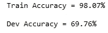

我们的模型在使用训练数据时表现得非常好。这并不令人惊讶，因为模型在训练阶段已经见过这些数据。它能够正确地分类训练记录。然而，我们的开发集准确率很差。我们的模型只能正确分类 60%的开发集实例。显然，我们的特征对于帮助模型高效分类未见过的实例并不够有信息量。查看哪些特征对将评论分类为正面或负面有更大贡献是很有帮助的：

```py
show_features(model_cycle_1) 
```

我们将调用`show_features`函数来查看各特征对模型的贡献。`Show_features`函数利用 NLTK 分类器对象中的`show_most_informative_feature`函数。我们第一个模型中最重要的特征如下：

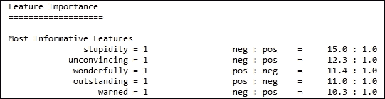

读取方式是：特征`stupidity = 1`在将评论分类为负面时比其他特征更有效 15 倍。

接下来，我们将使用一组新的特征来进行第二轮模型构建。我们将通过调用`build_model_cycle_2`来实现。`build_model_cycle_2`与`build_model_cycle_1`非常相似，唯一不同的是在 map 函数中调用了不同的特征生成函数。

特征生成函数称为 `build_negate_features`。通常，像 “not” 和 “no” 这样的词被称为否定词。假设我们的评论者说这部电影不好。如果我们使用之前的特征生成器，单词 “good” 在正面和负面评论中会被平等对待。但我们知道，单词 “good” 应该用于区分正面评论。为了避免这个问题，我们将查找单词列表中的否定词“no”和“not”。我们希望将我们的示例句子修改如下：

```py
"movie is not good" to "movie is not_good"
```

通过这种方式，`no_good` 可以作为一个很好的特征，帮助区分负面评论与正面评论。`build_negate_features` 函数完成了这个工作。

现在，让我们看看使用此否定特征构建的模型的探测输出：

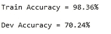

我们在开发数据上的模型准确率提高了近 2%。现在让我们看看这个模型中最具信息量的特征：

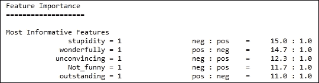

看看最后一个特征。添加否定词后，“`Not_funny`” 特征对于区分负面评论比其他特征信息量多 11.7 倍。

我们能提高模型的准确性吗？目前，我们的准确率是 70%。让我们进行第三次实验，使用一组新的特征。我们将通过调用 `build_model_cycle_3` 来实现。`build_model_cycle_3` 与 `build_model_cycle_2` 非常相似，除了在 map 函数内部调用的特征生成函数不同。

`build_keyphrase_features` 函数用作特征生成器。让我们详细看看这个函数。我们将不使用单词作为特征，而是从评论中生成关键词组，并将它们用作特征。关键词组是我们通过某种度量认为重要的短语。关键词组可以由两个、三个或多个单词组成。在我们的例子中，我们将使用两个单词（二元组）来构建关键词组。我们将使用的度量是这些短语的原始频率计数。我们将选择频率计数较高的短语。在生成关键词组之前，我们将进行一些简单的预处理。我们将从单词列表中移除所有停用词和标点符号。`remove_stop_words` 函数会被调用来移除停用词和标点符号。NLTK 的语料库模块中有一个英文停用词列表。我们可以按如下方式检索它：

```py
stopword_list = stopwords.words('english')
```

同样，Python 的字符串模块维护着一个标点符号列表。我们将按如下方式移除停用词和标点符号：

```py
words = [word for word in in_data[0] if word not in new_stopwords \
and word not in punctuation]
```

然而，我们不会移除“not”和`no`。我们将通过“not”创建一组新的停用词，其中包含前一步中的否定词：

```py
new_stopwords = [word for word in stopword_list if word not in negate_words]
```

我们将利用 NLTK 的 `BigramCollocationFinder` 类来生成我们的关键词组：

```py
    bigram_finder  = BigramCollocationFinder.from_words(words)
    # We use the raw frequency count of bigrams, i.e. bigrams are
    # ordered by their frequency of occurence in descending order
    # and top 400 bigrams are selected.
    bigrams        = bigram_finder.nbest(BigramAssocMeasures.raw_freq,400) 
```

我们的度量是频率计数。你可以看到，在最后一行中我们将其指定为 `raw_freq`。我们将要求搭配查找器返回最多 400 个短语。

装载了新特征后，我们将继续构建模型并测试模型的正确性。让我们看看模型的输出：

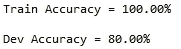

是的！我们在开发集上取得了很大进展。从第一次使用词语特征时的 68％准确率，我们通过关键短语特征将准确率从 12％提升至 80％。现在让我们将测试集暴露给这个模型，检查准确度：

```py
    test_features = map(build_keyphrase_features,test_data)
    probe_model(model,test_features,'Test')
```

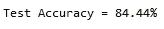

我们的测试集准确度高于开发集准确度。我们在训练一个在未见数据集上表现良好的模型方面做得不错。在结束本教程之前，我们来看一下最有信息量的关键短语：

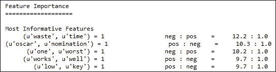

关键短语“奥斯卡提名”在区分评论为正面时比其他任何特征都要有帮助，效果是其他 10 倍。你无法否认这一点。我们可以看到我们的关键短语信息量非常大，因此我们的模型比前两次运行表现得更好。

## 还有更多…

我们是如何知道 400 个关键短语和度量频次计数是双词生成的最佳参数的呢？通过反复试验。虽然我们没有列出我们的试验过程，但基本上我们使用了不同的组合，比如 200 个短语与逐点互信息（pointwise mutual information），以及其他类似的方法。

这就是现实世界中需要做的事情。然而，我们不是每次都盲目地搜索参数空间，而是关注了最有信息量的特征。这给了我们有关特征区分能力的线索。

## 另见

+   在第六章中的*为模型构建准备数据*教程，*机器学习 I*

# 构建决策树来解决多类问题

在本教程中，我们将讨论构建决策树来解决多类分类问题。从直觉上看，决策树可以定义为通过一系列问题来得出答案的过程：一系列的“如果-那么”语句按层次结构排列构成了决策树。正因为这种特性，它们易于理解和解释。

请参考以下链接，详细了解决策树的介绍：

[`en.wikipedia.org/wiki/Decision_tree`](https://en.wikipedia.org/wiki/Decision_tree)

理论上，可以为给定的数据集构建许多决策树。某些树比其他树更准确。有一些高效的算法可以在有限的时间内开发出一个合理准确的树。一个这样的算法是亨特算法。像 ID3、C4.5 和 CART（分类和回归树）这样的算法都基于亨特算法。亨特算法可以概述如下：

给定一个数据集 D，其中有 n 条记录，每条记录包含 m 个属性/特征/列，并且每条记录被标记为 y1、y2 或 y3，算法的处理流程如下：

+   如果 D 中的所有记录都属于同一类别标签，例如 y1，那么 y1 就是树的叶子节点，并被标记为 y1。

+   如果 D 中的记录属于多个类标签，则会采用特征测试条件将记录划分为更小的子集。假设在初始运行时，我们对所有属性进行特征测试条件，并找到一个能够将数据集划分为三个子集的属性。这个属性就成为根节点。我们对这三个子集应用测试条件，以找出下一层的节点。这个过程是迭代进行的。

请注意，当我们定义分类时，我们定义了三个类别标签 y1、y2 和 y3。与前两个食谱中我们只处理了两个标签的问题不同，这是一个多类问题。我们在大多数食谱中使用的鸢尾花数据集就是一个三类问题。我们的记录分布在三个类别标签之间。我们可以将其推广到 n 类问题。数字识别是另一个例子，我们需要将给定图像分类为零到九之间的某个数字。许多现实世界的问题本质上就是多类问题。一些算法也天生可以处理多类问题。对于这些算法，无需进行任何修改。我们将在各章节中讨论的算法都能处理多类问题。决策树、朴素贝叶斯和 KNN 算法擅长处理多类问题。

让我们看看如何利用决策树来处理这个食谱中的多类问题。理解决策树的原理也有助于此。随机森林是下一章我们将探讨的一种更为复杂的方法，它在行业中被广泛应用，且基于决策树。

现在让我们深入了解决策树的使用方法。

## 准备就绪

我们将使用鸢尾花数据集来演示如何构建决策树。决策树是一种非参数的监督学习方法，可以用来解决分类和回归问题。如前所述，使用决策树的优点有很多，具体如下：

+   它们易于解释

+   它们几乎不需要数据准备和特征转换：请记住我们在前一个食谱中的特征生成方法

+   它们天然支持多类问题

决策树并非没有问题。它们存在的一些问题如下：

+   它们很容易发生过拟合：在训练集上表现出高准确率，而在测试数据上表现很差。

+   可以为给定数据集拟合出数百万棵树。

+   类别不平衡问题可能会对决策树产生较大影响。类别不平衡问题出现在我们的训练集在二分类问题中未包含相等数量的实例标签时。这个问题在多类问题中也同样适用。

决策树的一个重要部分是特征测试条件。让我们花些时间理解特征测试条件。通常，我们的实例中的每个属性可以被理解为以下之一。

**二元属性**：这是指一个属性可以取两个可能的值，比如 true 或 false。在这种情况下，特征测试条件应该返回两个值。

**名义属性**：这是指一个属性可以取多个值，比如 n 个值。特征测试条件应该返回 n 个输出，或者将它们分组为二元拆分。

**顺序属性**：这是指属性的值之间存在隐含的顺序关系。例如，假设我们有一个虚拟属性叫做 size，它可以取小、中、大这三个值。这个属性有三个值，并且它们之间有顺序：小、中、大。它们由特征属性测试条件处理，这类似于名义属性的处理方式。

**连续属性**：这些是可以取连续值的属性。它们会被离散化为顺序属性，然后进行处理。

特征测试条件是一种根据叫做“杂质”的标准或度量，将输入记录拆分为子集的方法。这个杂质是相对于每个属性在实例中的类别标签计算的。贡献最大杂质的属性被选为数据拆分属性，或者换句话说，就是树中该层的节点。

让我们通过一个例子来解释它。我们将使用一种叫做熵的度量来计算杂质。

熵的定义如下：

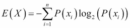

其中：

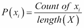

让我们考虑一个例子：

```py
X = {2,2}
```

现在我们可以根据这个集合计算熵，如下所示：

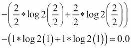

这个集合的熵为 0。熵为 0 表示同质性。在 Python 中编写熵计算非常简单。看一下以下的代码示例：

```py
import math

def prob(data,element):
    """Calculates the percentage count of a given element

    Given a list and an element, returns the elements percentage count

    """
    element_count =0
   	# Test conditoin to check if we have proper input
    if len(data) == 0 or element == None \
                or not isinstance(element,(int,long,float)):
        return None      
    element_count = data.count(element)
    return element_count / (1.0 * len(data))

def entropy(data):
    """"Calcuate entropy
    """
    entropy =0.0

    if len(data) == 0:
        return None

    if len(data) == 1:
        return 0
    try:
        for element in data:
            p = prob(data,element)
            entropy+=-1*p*math.log(p,2)
    except ValueError as e:
        print e.message

    return entropy
```

为了找到最佳的分割变量，我们将利用熵。首先，我们将根据类别标签计算熵，如下所示：

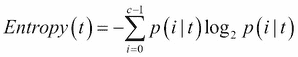

让我们定义另一个术语，称为信息增益。信息增益是一种衡量在给定实例中哪个属性对区分类别标签最有用的度量方法。

信息增益是父节点的熵与子节点的平均熵之间的差值。在树的每一层，我们将使用信息增益来构建树：

[`en.wikipedia.org/wiki/Information_gain_in_decision_trees`](https://en.wikipedia.org/wiki/Information_gain_in_decision_trees)

我们将从训练集中的所有属性开始，计算整体的熵。让我们来看以下的例子：

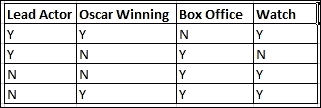

前面的数据集是为用户收集的虚拟数据，用来帮助他了解自己喜欢什么类型的电影。数据集包含四个属性：第一个属性是用户是否根据主演决定观看电影，第二个属性是用户是否根据电影是否获得奥斯卡奖来决定是否观看，第三个属性是用户是否根据电影是否票房成功来决定是否观看。

为了构建前面示例的决策树，我们将从整个数据集的熵计算开始。这是一个二类问题，因此 c = 2。并且，数据集共有四条记录，因此整个数据集的熵如下：

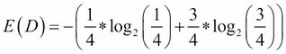

数据集的总体熵值为 0.811。

现在，让我们看一下第一个属性，即主演属性。对于主演为 Y 的实例，有一个实例类别标签为 Y，另一个实例类别标签为 N。对于主演为 N 的实例，两个实例类别标签均为 N。我们将按如下方式计算平均熵：

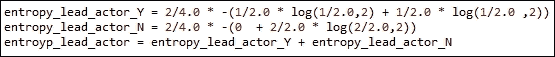

这是一个平均熵值。主演为 Y 的记录有两条，主演为 N 的记录也有两条；因此，我们有 `2/4.0` 乘以熵值。

当对这个数据子集计算熵时，我们可以看到在两个记录中，主演 Y 的一个记录的类别标签为 Y，另一个记录的类别标签为 N。类似地，对于主演为 N，两个记录的类别标签均为 N。因此，我们得到了该属性的平均熵。

主演属性的平均熵值为 0.5。

信息增益现在是 0.811 – 0.5 = 0.311。

同样地，我们将找到所有属性的信息增益。具有最高信息增益的属性胜出，并成为决策树的根节点。

相同的过程将重复进行，以便找到节点的第二级，依此类推。

## 如何操作…

让我们加载所需的库。接下来，我们将编写两个函数，一个用于加载数据，另一个用于将数据拆分为训练集和测试集：

```py
from sklearn.datasets import load_iris
from sklearn.cross_validation import StratifiedShuffleSplit
import numpy as np
from sklearn import tree
from sklearn.metrics import accuracy_score,classification_report,confusion_matrix
import pprint

def get_data():
    """
    Get Iris data
    """
    data = load_iris()
    x = data['data']
    y = data['target']
    label_names = data['target_names']

    return x,y,label_names.tolist()

def get_train_test(x,y):
    """
    Perpare a stratified train and test split
    """
    train_size = 0.8
    test_size = 1-train_size
    input_dataset = np.column_stack([x,y])
    stratified_split = StratifiedShuffleSplit(input_dataset[:,-1], \
            test_size=test_size,n_iter=1,random_state = 77)

    for train_indx,test_indx in stratified_split:
        train_x = input_dataset[train_indx,:-1]
        train_y = input_dataset[train_indx,-1]
        test_x =  input_dataset[test_indx,:-1]
        test_y = input_dataset[test_indx,-1]
    return train_x,train_y,test_x,test_y
```

让我们编写函数来帮助我们构建和测试决策树模型：

```py
def build_model(x,y):
    """
    Fit the model for the given attribute 
    class label pairs
    """
    model = tree.DecisionTreeClassifier(criterion="entropy")
    model = model.fit(x,y)
    return model

def test_model(x,y,model,label_names):
    """
    Inspect the model for accuracy
    """
    y_predicted = model.predict(x)
    print "Model accuracy = %0.2f"%(accuracy_score(y,y_predicted) * 100) + "%\n"
    print "\nConfusion Matrix"
    print "================="
    print pprint.pprint(confusion_matrix(y,y_predicted))

    print "\nClassification Report"
    print "================="

    print classification_report(y,y_predicted,target_names=label_names)
```

最后，调用我们定义的所有其他函数的主函数如下：

```py
if __name__ == "__main__":
    # Load the data
    x,y,label_names = get_data()
    # Split the data into train and test    
    train_x,train_y,test_x,test_y = get_train_test(x,y)
    # Build model    
    model = build_model(train_x,train_y)
    # Evaluate the model on train dataset    
    test_model(train_x,train_y,model,label_names)    
    # Evaluate the model on test dataset
    test_model(test_x,test_y,model,label_names)
```

## 它是如何工作的…

我们从主函数开始。我们在 `x`、`y` 和 `label_names` 变量中调用 `get_data` 来检索鸢尾花数据集。我们获取标签名称，以便在看到模型准确性时，可以根据单个标签进行衡量。如前所述，鸢尾花数据集是一个三类问题。我们需要构建一个分类器，可以将任何新实例分类为三种类型之一：setosa、versicolor 或 virginica。

一如既往，`get_train_test`返回分层的训练和测试数据集。然后，我们利用 scikit-learn 中的`StratifiedShuffleSplit`获取具有相等类标签分布的训练和测试数据集。

我们必须调用`build_model`方法，在我们的训练集上构建决策树。scikit-learn 中的`DecisionTreeClassifier`类实现了一个决策树：

```py
model = tree.DecisionTreeClassifier(criterion="entropy")
```

如你所见，我们指定了我们的特征测试条件是使用`criterion`变量来设置的熵。然后，我们通过调用`fit`函数来构建模型，并将模型返回给调用程序。

现在，让我们继续使用`test_model`函数来评估我们的模型。该模型接受实例`x`、类标签`y`、决策树模型`model`以及类标签名称`label_names`。

scikit-learn 中的模块度量提供了三种评估标准：

```py
from sklearn.metrics import accuracy_score,classification_report,confusion_matrix
```

我们在前面的步骤和引言部分定义了准确率。

混淆矩阵打印了引言部分定义的混淆矩阵。混淆矩阵是一种评估模型表现的好方法。我们关注的是具有真正例和假正例值的单元格值。

最后，我们还有`classification_report`来打印精确度、召回率和 F1 得分。

我们必须首先在训练数据上评估模型：

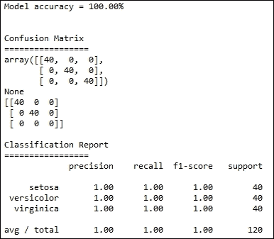

我们在训练数据集上做得非常好，准确率达到了 100%。真正的考验是使用测试数据集，那里才是决定成败的地方。

让我们通过使用测试数据集来查看模型评估：

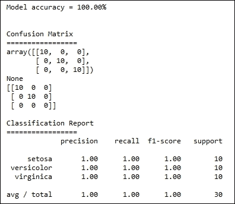

我们的分类器在测试集上的表现也非常出色。

## 还有更多…

让我们探查一下模型，看看各个特征如何有助于区分不同类别。

```py
def get_feature_names():
    data = load_iris()
    return data['feature_names']

def probe_model(x,y,model,label_names):

    feature_names = get_feature_names()
    feature_importance = model.feature_importances_
    print "\nFeature Importance\n"
    print "=====================\n"
    for i,feature_name in enumerate(feature_names):
        print "%s = %0.3f"%(feature_name,feature_importance[i])

    # Export the decison tree as a graph
    tree.export_graphviz(model,out_file='tree.dot')
```

决策树分类器对象提供了一个属性`feature_importances_`，可以调用它来获取各个特征对构建我们模型的重要性。

我们写了一个简单的函数`get_feature_names`，用于获取特征名称。不过，这也可以作为`get_data`的一部分来添加。

让我们来看一下打印语句的输出：

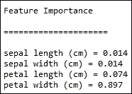

这看起来好像花瓣宽度和花瓣长度在我们的分类中贡献更大。

有趣的是，我们还可以将分类器构建的树导出为 dot 文件，并使用 GraphViz 包进行可视化。在最后一行，我们将模型导出为 dot 文件：

```py
# Export the decison tree as a graph
tree.export_graphviz(model,out_file='tree.dot')
```

你可以下载并安装 Graphviz 包来可视化它：

[`www.graphviz.org/`](http://www.graphviz.org/)

## 另请参见

+   *为模型构建准备数据*的步骤见第六章，*机器学习 I*

+   *查找最近邻*的步骤见第六章，*机器学习 I*

+   在第六章中，*使用朴素贝叶斯分类文档*的技巧，*机器学习 I*
