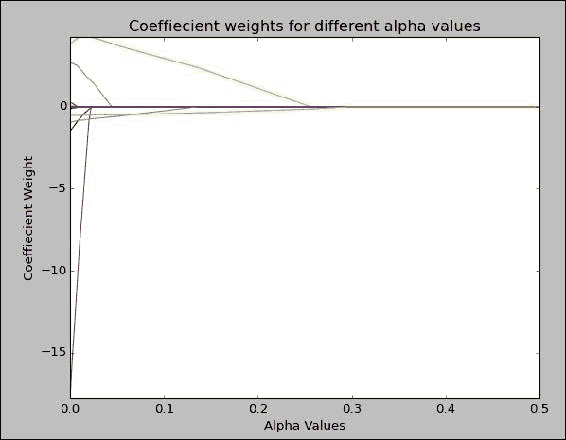
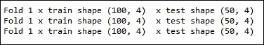

# 第七章 机器学习 2

在本章中，我们将介绍以下几种方法：

+   使用回归预测实值

+   学习带 L2 收缩的回归——岭回归

+   学习带 L1 收缩的回归——LASSO

+   使用交叉验证迭代器与 L1 和 L2 收缩

# 介绍

在本章中，我们将介绍回归技术及其在 Python 中的实现方法。接着，我们将讨论回归方法固有的一些缺点，并探讨如何通过收缩方法来解决这些问题。收缩方法中需要设置一些参数。我们将讨论交叉验证技术，以找到收缩方法的最佳参数值。

在上一章中，我们讨论了分类问题。在本章中，让我们将注意力转向回归问题。在分类问题中，响应变量`Y`要么是二元的，要么是一组离散值（在多类和多标签问题中）。而在回归中，响应变量是一个实值数字。

回归可以看作是一种函数逼近。回归的任务是找到一个函数，使得当`X`（一组随机变量）作为输入传递给该函数时，它应该返回`Y`，即响应变量。`X`也被称为自变量，而`Y`则被称为因变量。

我们将利用上一章中学到的技术，将数据集分为训练集、开发集和测试集，在训练集上迭代地构建模型，并在开发集上进行验证。最后，我们将使用测试集来全面评估模型的优劣。

本章将从使用最小二乘估计的简单线性回归方法开始。在第一种方法的开头，我们将简要介绍回归的框架，这是理解本章其他方法所必需的基础背景信息。尽管非常强大，简单回归框架也存在一个缺点。由于无法控制线性回归系数的上下限，它们往往会过拟合给定的数据。（线性回归的代价函数是无约束的，我们将在第一种方法中进一步讨论）。输出的回归模型可能在未见过的数据集上表现不佳。为了应对这个问题，使用了收缩方法。收缩方法也被称为正则化方法。在接下来的两种方法中，我们将介绍两种不同的收缩方法——LASSO 和岭回归。在最后一种方法中，我们将介绍交叉验证的概念，并展示如何利用它来估计传递给岭回归（作为一种收缩方法）的参数 alpha。

# 使用回归预测实值

在我们深入探讨此方案之前，先快速了解回归一般是如何运作的。这个介绍对于理解当前方案以及后续方案非常重要。

回归是一种特殊形式的函数逼近。以下是预测变量集：


每个实例`xi`具有`m`个属性：


回归的任务是找到一个函数，使得当`X`作为输入提供给该函数时，应该返回一个`Y`响应变量。`Y`是一个实值向量：


我们将使用波士顿房价数据集来解释回归框架。

以下链接提供了波士顿房价数据集的良好介绍：

[`archive.ics.uci.edu/ml/machine-learning-databases/housing/housing.names`](https://archive.ics.uci.edu/ml/machine-learning-databases/housing/housing.names)。

在本例中，响应变量`Y`是波士顿地区自有住房的中位数价值。有 13 个预测变量。前面的网页链接提供了所有预测变量的良好描述。回归问题的定义是找到一个函数`F`，使得如果我们给这个函数一个以前未见过的预测值，它应该能够给出中位数房价。

函数`F(X)`是我们线性回归模型的输出，它是输入`X`的线性组合，因此得名线性回归：


`wi`变量是前述方程中的未知值。建模过程的关键在于发现`wi`变量。通过使用我们的训练数据，我们将找到`wi`的值；`wi`被称为回归模型的系数。

线性回归建模问题可以表述为：使用训练数据来找到系数：


使得：


上述公式值尽可能小。

该方程的值越低（在优化术语中称为代价函数），线性回归模型越好。因此，优化问题就是最小化前述方程，即找到`wi`系数的值，使其最小化该方程。我们不会深入探讨优化算法的细节，但了解这个目标函数是有必要的，因为接下来的两个方案需要你理解它。

现在，问题是我们如何知道使用训练数据构建的模型，即我们新找到的系数`w1, w2,..wm`，是否足够准确地预测未见过的记录？我们将再次利用之前定义的成本函数。当我们将模型应用于开发集或测试集时，我们找到实际值和预测值之间差异平方的平均值，如下所示：


上述方程被称为均方误差（mean squared error）——这是我们用来判断回归模型是否值得使用的标准。我们希望得到一个输出模型，使得实际值和预测值之间的差异平方的平均值尽可能低。寻找系数的这个方法被称为最小二乘估计。

我们将使用 scikit-learn 的`LinearRegression`类。然而，它在内部使用`scipy.linalg.lstsq`方法。最小二乘法为我们提供了回归问题的闭式解。有关最小二乘法及其推导的更多信息，请参考以下链接：

[`en.wikipedia.org/wiki/Least_squares`](https://en.wikipedia.org/wiki/Least_squares)。

[`en.wikipedia.org/wiki/Linear_least_squares_(mathematics)`](https://en.wikipedia.org/wiki/Linear_least_squares_(mathematics))。

我们对回归做了一个非常简单的介绍。感兴趣的读者可以参考以下书籍：[`www.amazon.com/exec/obidos/ASIN/0387952845/trevorhastie-20`](http://www.amazon.com/exec/obidos/ASIN/0387952845/trevorhastie-20)。

[`www.amazon.com/Neural-Networks-Learning-Machines-Edition/dp/0131471392`](http://www.amazon.com/Neural-Networks-Learning-Machines-Edition/dp/0131471392)

## 准备就绪

波士顿数据集有 13 个属性和 506 个实例。目标变量是一个实数，房屋的中位数值在千美元左右。

参考以下 UCI 链接了解有关波士顿数据集的更多信息：[`archive.ics.uci.edu/ml/machine-learning-databases/housing/housing.names`](https://archive.ics.uci.edu/ml/machine-learning-databases/housing/housing.names)。

我们将提供这些预测变量和响应变量的名称，如下所示：


## 如何实现…

我们将从加载所有必要的库开始。接下来，我们将定义第一个函数`get_data()`。在这个函数中，我们将读取波士顿数据集，并将其作为预测变量`x`和响应变量`y`返回：

```py
# Load libraries
from sklearn.datasets import load_boston
from sklearn.cross_validation import train_test_split
from sklearn.linear_model import LinearRegression
from sklearn.metrics import mean_squared_error
import matplotlib.pyplot as plt
from sklearn.preprocessing import PolynomialFeatures
def get_data():
    """
    Return boston dataset
    as x - predictor and
    y - response variable
    """
    data = load_boston()
    x    = data['data']
    y    = data['target']
    return x,y    
```

在我们的`build_model`函数中，我们将使用给定的数据构建线性回归模型。以下两个函数，`view_model`和`model_worth`，用于检查我们所构建的模型：

```py
def build_model(x,y):
    """
    Build a linear regression model
    """
    model = LinearRegression(normalize=True,fit_intercept=True)
    model.fit(x,y)
    return model    

def view_model(model):
    """
    Look at model coeffiecients
    """
    print "\n Model coeffiecients"
    print "======================\n"
    for i,coef in enumerate(model.coef_):
        print "\tCoefficient %d  %0.3f"%(i+1,coef)

    print "\n\tIntercept %0.3f"%(model.intercept_)

def model_worth(true_y,predicted_y):
    """
    Evaluate the model
    """
    print "\tMean squared error = %0.2f"%(mean_squared_error(true_y,predicted_y))
```

`plot_residual`函数用于绘制我们回归模型中的误差：

```py
def plot_residual(y,predicted_y):
    """
    Plot residuals
    """
    plt.cla()
    plt.xlabel("Predicted Y")
    plt.ylabel("Residual")
    plt.title("Residual Plot")
    plt.figure(1)
    diff = y - predicted_y
    plt.plot(predicted_y,diff,'go')
    plt.show()
```

最后，我们将编写我们的`main`函数，用于调用之前的所有函数：

```py
if __name__ == "__main__":

    x,y = get_data()

    # Divide the data into Train, dev and test    
    x_train,x_test_all,y_train,y_test_all = train_test_split(x,y,test_size = 0.3,random_state=9)
    x_dev,x_test,y_dev,y_test = train_test_split(x_test_all,y_test_all,test_size=0.3,random_state=9)

    # Build the model
    model = build_model(x_train,y_train)
    predicted_y = model.predict(x_train)

    # Plot the residual
    plot_residual(y_train,predicted_y)
    # View model coeffiecients    
    view_model(model)

    print "\n Model Performance in Training set\n"
    model_worth(y_train,predicted_y)  

    # Apply the model on dev set
    predicted_y = model.predict(x_dev)
    print "\n Model Performance in Dev set\n"
    model_worth(y_dev,predicted_y)  

    #Prepare some polynomial features
    poly_features = PolynomialFeatures(2)
    poly_features.fit(x_train)
    x_train_poly = poly_features.transform(x_train)
    x_dev_poly   = poly_features.transform(x_dev)

    # Build model with polynomial features
    model_poly = build_model(x_train_poly,y_train)
    predicted_y = model_poly.predict(x_train_poly)
    print "\n Model Performance in Training set (Polynomial features)\n"
    model_worth(y_train,predicted_y)  

    # Apply the model on dev set
    predicted_y = model_poly.predict(x_dev_poly)
    print "\n Model Performance in Dev set  (Polynomial features)\n"
    model_worth(y_dev,predicted_y)  

    # Apply the model on Test set
    x_test_poly = poly_features.transform(x_test)
    predicted_y = model_poly.predict(x_test_poly)

    print "\n Model Performance in Test set  (Polynomial features)\n"
    model_worth(y_test,predicted_y)  

    predicted_y = model.predict(x_test)
    print "\n Model Performance in Test set  (Regular features)\n"
    model_worth(y_test,predicted_y)  
```

## 它是如何工作的…

让我们从主模块开始，跟着代码走。我们将使用 `get_data` 函数加载预测变量 `x` 和响应变量 `y`：

```py
def get_data():
    """
    Return boston dataset
    as x - predictor and
    y - response variable
    """
    data = load_boston()
    x    = data['data']
    y    = data['target']
    return x,y    
```

该函数调用了 scikit-learn 提供的便捷 `load_boston()` 函数，以便将波士顿房价数据集作为 NumPy 数组进行检索。

我们将使用 Scikit 库中的 `train_test_split` 函数，将数据划分为训练集和测试集。我们将保留数据集的 30% 用于测试：

```py
x_train,x_test_all,y_train,y_test_all = train_test_split(x,y,test_size = 0.3,random_state=9)
```

我们将在下一行中提取开发集：

```py
x_dev,x_test,y_dev,y_test = train_test_split(x_test_all,y_test_all,test_size=0.3,random_state=9)
```

在下一行，我们将通过调用 `build_model` 方法使用训练数据集来构建我们的模型。该模型创建一个 `LinearRegression` 类型的对象。`LinearRegression` 类封装了 SciPy 的最小二乘法：

```py
    model = LinearRegression(normalize=True,fit_intercept=True)
```

让我们看看初始化该类时传递的参数。

`fit_intercept` 参数设置为 `True`。这告诉线性回归类进行数据中心化。通过数据中心化，我们将每个预测变量的均值设置为零。线性回归方法要求数据根据其均值进行中心化，以便更好地解释截距。除了按均值对每个特征进行中心化外，我们还将通过其标准差对每个特征进行归一化。我们将使用 `normalize` 参数并将其设置为 `True` 来实现这一点。有关如何按列进行归一化的更多信息，请参考第三章，*缩放与数据标准化* 的相关内容。通过 `fit_intercept` 参数，我们将指示算法包含一个截距，以适应响应变量中的任何常数偏移。最后，我们将通过调用 fit 函数并使用响应变量 `y` 和预测变量 `x` 来拟合模型。

### 注意

有关线性回归方法的更多信息，请参考 Trevor Hastie 等人所著的《统计学习元素》一书。

检查我们构建的模型是一种良好的做法，这样我们可以更好地理解模型，以便进一步改进或提升可解释性。

现在，让我们绘制残差图（预测的 `y` 与实际的 `y` 之间的差异），并将预测的 `y` 值作为散点图展示。我们将调用 `plot_residual` 方法来实现：

```py
    # Plot the residual
    plot_residual(y_train,predicted_y)
```

让我们看看下面的图表：


我们可以使用这个散点图来验证数据集中的回归假设。我们没有看到任何模式，点均匀地分布在零残差值附近。

### 注意

有关使用残差图来验证线性回归假设的更多信息，请参考 *Daniel. T. Larose* 所著的《数据挖掘方法与模型》一书。

然后，我们将使用`view_model`方法检查我们的模型。在这个方法中，我们将打印截距和系数值。线性回归对象有两个属性，一个叫做`coef_`，它提供了系数的数组，另一个叫做`intercept_`，它提供截距值：


让我们来看一下`coefficient 6`，即房屋中可居住的房间数量。系数值的解释是：每增加一个房间，价格上升三倍。

最后，我们将通过调用`model_worth`函数来评估我们的模型好坏，该函数使用我们预测的响应值和实际响应值，二者均来自训练集和开发集。

这个函数打印出均方误差值，即实际值与预测值之间差值的平方的平均值：


我们在开发集中的值较低，这表明我们的模型表现良好。让我们看看是否可以改善均方误差。如果我们为模型提供更多特征会怎么样？让我们从现有的属性中创建一些特征。我们将使用 scikit-learn 中的`PolynomialFeatures`类来创建二阶多项式：

```py
    #Prepare some polynomial features
    poly_features = PolynomialFeatures(2)
    poly_features.fit(x_train)
    x_train_poly = poly_features.transform(x_train)
    x_dev_poly   = poly_features.transform(x_dev)
```

我们将`2`作为参数传递给`PolynomialFeatures`，表示我们需要二阶多项式。如果类初始化为空，`2`也是默认值：


快速查看新`x`的形状，我们现在有 105 个属性，而原本只有 13 个。让我们使用新的多项式特征来构建模型，并检查模型的准确性：

```py
    # Build model with polynomial features
    model_poly = build_model(x_train_poly,y_train)
    predicted_y = model_poly.predict(x_train_poly)
    print "\n Model Performance in Training set (Polynomial           features)\n"
    model_worth(y_train,predicted_y)  

    # Apply the model on dev set
    predicted_y = model_poly.predict(x_dev_poly)
    print "\n Model Performance in Dev set  (Polynomial features)\n"
    model_worth(y_dev,predicted_y)  
```


我们的模型已经很好地拟合了训练数据集。在开发集和训练集中，我们的多项式特征表现优于原始特征。

最后，让我们看看使用多项式特征的模型和使用常规特征的模型在测试集上的表现：

```py
    # Apply the model on Test set
    x_test_poly = poly_features.transform(x_test)
    predicted_y = model_poly.predict(x_test_poly)

    print "\n Model Performance in Test set  (Polynomial features)\n"
    model_worth(y_test,predicted_y)  

predicted_y = model.predict(x_test)
    print "\n Model Performance in Test set  (Regular features)\n"
    model_worth(y_test,predicted_y)  
```


我们可以看到，在测试数据集上，使用多项式特征的表现优于我们原始特征的表现。

这就是你需要知道的如何在 Python 中进行线性回归。我们了解了线性回归的工作原理，以及如何构建模型来预测实数值。

## 还有更多…

在继续之前，我们将查看`PolynomialFeatures`类中的另一个参数设置，叫做`interaction_only`：

```py
poly_features = PolynomialFeatures(interaction_only=True)
```

通过将`interaction_only`设置为`true-with x1`和`x2 attributes-only`，只会创建`x1*x2`属性。`x1`和`x2`的平方不会创建，假设阶数为二。

我们的测试集结果与开发集的结果不如预期，尤其是在普通特征和多项式特征上。这是线性回归的一个已知问题。线性回归对于处理方差的能力较弱。我们面临的问题是高方差和低偏差。随着模型复杂度的增加，也就是呈现给模型的特征数量增多，模型往往能够很好地拟合训练数据——因此偏差较低——但开始在测试数据上出现下降的结果。对此问题，有几种技术可以应对。

我们来看看一个叫做递归特征选择的方法。所需特征的数量作为参数传递给该方法。它递归地筛选特征。在第 i 次运行中，会对数据拟合一个线性模型，并根据系数的值来筛选特征；那些权重较低的特征会被剔除。如此一来，迭代就继续进行，直到我们得到所需数量的特征时，迭代才会停止。接下来，让我们看看一个代码示例：

```py
# Load libraries
from sklearn.datasets import load_boston
from sklearn.cross_validation import train_test_split
from sklearn.linear_model import LinearRegression
from sklearn.metrics import mean_squared_error
import matplotlib.pyplot as plt
from sklearn.preprocessing import PolynomialFeatures
from itertools import combinations
from sklearn.feature_selection import RFE

def get_data():
    """
    Return boston dataset
    as x - predictor and
    y - response variable
    """
    data = load_boston()
    x    = data['data']
    y    = data['target']
    return x,y    

def build_model(x,y,no_features):
    """
    Build a linear regression model
    """
    model = LinearRegression(normalize=True,fit_intercept=True)
    rfe_model = RFE(estimator=model,n_features_to_select=no_features)
    rfe_model.fit(x,y)
    return rfe_model    

def view_model(model):
    """
    Look at model coeffiecients
    """
    print "\n Model coeffiecients"
    print "======================\n"
    for i,coef in enumerate(model.coef_):
        print "\tCoefficient %d  %0.3f"%(i+1,coef)

    print "\n\tIntercept %0.3f"%(model.intercept_)

def model_worth(true_y,predicted_y):
    """
    Evaluate the model
    """
    print "\tMean squared error = %0.2f"%(mean_squared_error(true_y,predicted_y))
    return mean_squared_error(true_y,predicted_y)

def plot_residual(y,predicted_y):
    """
    Plot residuals
    """
    plt.cla()
    plt.xlabel("Predicted Y")
    plt.ylabel("Residual")
    plt.title("Residual Plot")
    plt.figure(1)
    diff = y - predicted_y
    plt.plot(predicted_y,diff,'go')
    plt.show()

def subset_selection(x,y):
    """
    subset selection method
    """
    # declare variables to track
    # the model and attributes which produces
    # lowest mean square error
    choosen_subset = None
    low_mse = 1e100
    choosen_model = None
    # k value ranges from 1 to the number of 
    # attributes in x
    for k in range(1,x.shape[1]+1):
        print "k= %d "%(k)
        # evaluate all attribute combinations
        # of size k+1
        subsets = combinations(range(0,x.shape[1]),k+1)
        for subset in subsets:
            x_subset = x[:,subset]
            model = build_model(x_subset,y)
            predicted_y = model.predict(x_subset)
            current_mse = mean_squared_error(y,predicted_y)
            if current_mse < low_mse:
                low_mse = current_mse
                choosen_subset = subset
                choosen_model = model

    return choosen_model, choosen_subset,low_mse    

if __name__ == "__main__":

    x,y = get_data()

    # Divide the data into Train, dev and test    
    x_train,x_test_all,y_train,y_test_all = train_test_split(x,y,test_size = 0.3,random_state=9)
    x_dev,x_test,y_dev,y_test = train_test_split(x_test_all,y_test_all,test_size=0.3,random_state=9)

    #Prepare some polynomial features
    poly_features = PolynomialFeatures(interaction_only=True)
    poly_features.fit(x_train)
    x_train_poly = poly_features.transform(x_train)
    x_dev_poly   = poly_features.transform(x_dev)

    #choosen_model,choosen_subset,low_mse = subset_selection(x_train_poly,y_train)    
    choosen_model = build_model(x_train_poly,y_train,20)
    #print choosen_subse
    predicted_y = choosen_model.predict(x_train_poly)
    print "\n Model Performance in Training set (Polynomial features)\n"
    mse  = model_worth(y_train,predicted_y)  

    # Apply the model on dev set
    predicted_y = choosen_model.predict(x_dev_poly)
    print "\n Model Performance in Dev set  (Polynomial features)\n"
    model_worth(y_dev,predicted_y)  

    # Apply the model on Test set
    x_test_poly = poly_features.transform(x_test)
    predicted_y = choosen_model.predict(x_test_poly)

    print "\n Model Performance in Test set  (Polynomial features)\n"
    model_worth(y_test,predicted_y)  
```

这段代码与之前的线性回归代码非常相似，唯一不同的是`build_model`方法：

```py
def build_model(x,y,no_features):
    """
    Build a linear regression model
    """
    model = LinearRegression(normalize=True,fit_intercept=True)
    rfe_model = RFE(estimator=model,n_features_to_select=no_features)
    rfe_model.fit(x,y)
    return rfe_model    
```

除了预测变量`x`和响应变量`y`，`build_model`方法还接受一个参数，即要保留的特征数量`no_features`。在这个例子中，我们传递了一个值 20，要求递归特征消除方法只保留 20 个重要特征。如你所见，我们首先创建了一个线性回归对象。这个对象被传递给`RFE`类。RFE 代表递归特征消除，这是 scikit-learn 提供的一个类，用于实现递归特征消除。现在，我们来评估一下我们的模型在训练集、开发集和测试集上的表现：


测试数据集的均方误差为 13.20，几乎是之前的一半。因此，我们能够有效地使用递归特征消除方法进行特征选择，从而提升我们的模型。

## 另请参见

+   第三章中的*数据标准化*方法，*数据分析 – 探索与整理*

+   第三章中的*数据标准化*方法，*数据分析 – 探索与整理*

+   第六章中的*为模型构建准备数据*方法，*机器学习 I*

# 使用 L2 收缩学习回归 – 岭回归

让我们将之前讨论的回归技术扩展，以包括正则化。在训练线性回归模型时，一些系数可能会取非常高的值，导致模型的不稳定。正则化或收缩是一种控制系数权重的方法，目的是使它们不会取非常大的值。让我们再次看看线性回归的成本函数，以理解回归固有的问题，以及我们通过控制系数权重所指的内容：


线性回归试图找到系数`w0…wm`，使得它最小化上述方程。线性回归存在一些问题。

如果数据集包含许多相关的预测变量，数据的非常小的变化可能导致模型不稳定。此外，我们还会面临解释模型结果的问题。例如，如果我们有两个负相关的变量，这些变量将对响应变量产生相反的影响。我们可以手动查看这些相关性，移除其中一个有影响的变量，然后继续构建模型。然而，如果我们能够自动处理这些场景，那将更有帮助。

我们在之前的例子中介绍了一种方法，叫做递归特征消除，用来保留最具信息性的属性并丢弃其余的属性。然而，在这种方法中，我们要么保留一个变量，要么不保留它；我们的决策是二元的。在这一部分，我们将看到一种方法，能够以控制变量权重的方式，强烈惩罚不必要的变量，使它们的权重降到极低。

我们将修改线性回归的成本函数，以包含系数。如你所知，成本函数的值应该在最佳模型时达到最小。通过将系数包含在成本函数中，我们可以对取非常高值的系数进行严重惩罚。一般来说，这些技术被称为收缩方法，因为它们试图收缩系数的值。在这个例子中，我们将看到 L2 收缩，通常称为岭回归。让我们看看岭回归的成本函数：


如你所见，系数的平方和被加入到成本函数中。这样，当优化程序试图最小化上述函数时，它必须大幅减少系数的值才能达到目标。α参数决定了收缩的程度。α值越大，收缩越大。系数值会被减小至零。

在了解了这些数学背景后，让我们进入实际操作，看看岭回归的应用。

## 准备工作

再次使用波士顿数据集来演示岭回归。波士顿数据集有 13 个属性和 506 个实例。目标变量是一个实数，房屋的中位数价格在几千美元之间。有关波士顿数据集的更多信息，请参考以下 UCI 链接：

[`archive.ics.uci.edu/ml/machine-learning-databases/housing/housing.names`](https://archive.ics.uci.edu/ml/machine-learning-databases/housing/housing.names)

我们打算生成二次的多项式特征，并仅考虑交互效应。在本教程的最后，我们将看到系数如何受到惩罚。

## 如何操作……

我们将首先加载所有必要的库。接下来，我们将定义第一个函数`get_data()`。在这个函数中，我们将读取波士顿数据集，并将其返回为预测变量`x`和响应变量`y`：

```py
# Load libraries
from sklearn.datasets import load_boston
from sklearn.cross_validation import train_test_split
from sklearn.linear_model import Ridge
from sklearn.metrics import mean_squared_error
from sklearn.preprocessing import PolynomialFeatures

def get_data():
    """
    Return boston dataset
    as x - predictor and
    y - response variable
    """
    data = load_boston()
    x    = data['data']
    y    = data['target']
    x    = x - np.mean(x,axis=0)

    return x,y    
```

在我们的下一个`build_model`函数中，我们将使用给定的数据构建岭回归模型。以下两个函数，`view_model`和`model_worth`，用于检查我们构建的模型：

```py
def build_model(x,y):
    """
    Build a Ridge regression model
    """
    model = Ridge(normalize=True,alpha=0.015)
    model.fit(x,y)
    # Track the scores- Mean squared residual for plot
    return model    

def view_model(model):
    """
    Look at model coeffiecients
    """
    print "\n Model coeffiecients"
    print "======================\n"
    for i,coef in enumerate(model.coef_):
        print "\tCoefficient %d  %0.3f"%(i+1,coef)

    print "\n\tIntercept %0.3f"%(model.intercept_)

def model_worth(true_y,predicted_y):
    """
    Evaluate the model
    """
    print "\tMean squared error = %0.2f"%(mean_squared_error(true_y,predicted_y))
    return mean_squared_error(true_y,predicted_y)
```

最后，我们将编写我们的`main`函数，该函数用于调用所有前面的函数：

```py
if __name__ == "__main__":

    x,y = get_data()

    # Divide the data into Train, dev and test    
    x_train,x_test_all,y_train,y_test_all = train_test_split(x,y,test_size = 0.3,random_state=9)
    x_dev,x_test,y_dev,y_test = train_test_split(x_test_all,y_test_all,test_size=0.3,random_state=9)

    #Prepare some polynomial features
    poly_features = PolynomialFeatures(interaction_only=True)
    poly_features.fit(x_train)
    x_train_poly = poly_features.transform(x_train)
    x_dev_poly   = poly_features.transform(x_dev)
    x_test_poly = poly_features.transform(x_test)

    #choosen_model,choosen_subset,low_mse = subset_selection(x_train_poly,y_train)    
    choosen_model = build_model(x_train_poly,y_train)

    predicted_y = choosen_model.predict(x_train_poly)
    print "\n Model Performance in Training set (Polynomial features)\n"
    mse  = model_worth(y_train,predicted_y)  
    view_model(choosen_model)

    # Apply the model on dev set
    predicted_y = choosen_model.predict(x_dev_poly)
    print "\n Model Performance in Dev set  (Polynomial features)\n"
    model_worth(y_dev,predicted_y)  

    # Apply the model on Test set
    predicted_y = choosen_model.predict(x_test_poly)

    print "\n Model Performance in Test set  (Polynomial features)\n"
    model_worth(y_test,predicted_y)  
```

## 它是如何工作的……

让我们从主模块开始，并跟随代码。我们使用`get_data`函数加载了预测变量`x`和响应变量`y`。该函数调用了 scikit-learn 的便捷函数`load_boston()`，将波士顿房价数据集作为 NumPy 数组获取。

接下来，我们将使用 scikit-learn 库中的`train_test_split`函数将数据集划分为训练集和测试集。我们将保留 30%的数据集用于测试。在下一行，我们将从中提取开发集。

然后，我们将构建多项式特征：

```py
poly_features = PolynomialFeatures(interaction_only=True)
poly_features.fit(x_train)
```

如你所见，我们将`interaction_only`设置为`true`。通过将`interaction_only`设置为`true`，对于`x1`和`x2`属性，仅创建`x1*x2`属性，而不创建`x1`和`x2`的平方，假设度数为 2。默认的度数为 2：

```py
x_train_poly = poly_features.transform(x_train)
x_dev_poly = poly_features.transform(x_dev)
x_test_poly = poly_features.transform(x_test)
```

使用`transform`函数，我们将转换我们的训练集、开发集和测试集，以包含多项式特征。

在下一行，我们将通过调用`build_model`方法使用训练数据集构建我们的岭回归模型：

```py
model = Ridge(normalize=True,alpha=0.015)
model.fit(x,y)
```

数据集中的属性通过其均值进行中心化，并使用标准差进行标准化，方法是使用`normalize`参数并将其设置为`true`。`Alpha`控制收缩的程度，其值设置为`0.015`。我们不是凭空得出这个数字的，而是通过多次运行模型得出的。稍后在本章中，我们将看到如何通过经验得出此参数的正确值。我们还将使用`fit_intercept`参数来拟合该模型的截距。然而，默认情况下，`fit_intercept`参数设置为`true`，因此我们不会显式指定它。

现在让我们看看模型在训练集中的表现。我们将调用 `model_worth` 方法来获取均方误差。此方法需要预测的响应变量和实际的响应变量，以返回均方误差：

```py
predicted_y = choosen_model.predict(x_train_poly)
print "\n Model Performance in Training set (Polynomial features)\n"
mse = model_worth(y_train,predicted_y) 
```

我们的输出如下所示：


在将模型应用于测试集之前，让我们先看看系数的权重。我们将调用一个名为 `view_model` 的函数来查看系数的权重：

```py
view_model(choosen_model)
```


我们没有展示所有的系数，共有 92 个。然而，从一些系数来看，收缩效应应该是显而易见的。例如，系数 1 几乎为 0（请记住，它是一个非常小的值，这里仅显示了前三位小数）。

让我们继续看看模型在开发集中的表现：

```py
predicted_y = choosen_model.predict(x_dev_poly)
print "\n Model Performance in Dev set (Polynomial features)\n"
model_worth(y_dev,predicted_y) 
```


不错，我们已经达到了比训练误差更低的均方误差。最后，让我们来看一下我们模型在测试集上的表现：


与前面配方中的线性回归模型相比，我们在测试集上的表现更好。

## 还有更多…

我们之前提到过，线性回归模型对数据集中的任何小变化都非常敏感。让我们看一个小例子，来演示这一点：

```py
# Load libraries
from sklearn.datasets import load_boston
from sklearn.cross_validation import train_test_split
from sklearn.linear_model import Ridge
from sklearn.metrics import mean_squared_error
from sklearn.preprocessing import PolynomialFeatures

def get_data():
    """
    Return boston dataset
    as x - predictor and
    y - response variable
    """
    data = load_boston()
    x    = data['data']
    y    = data['target']
    x    = x - np.mean(x,axis=0)

    return x,y    
```

在这段代码中，我们将使用 `build_model` 函数对原始数据进行线性回归和岭回归模型的拟合：

```py
lin_model,ridg_model = build_model(x,y)
```

我们将在原始数据中引入少量噪声，具体如下：

```py
# Add some noise to the dataset
noise = np.random.normal(0,1,(x.shape))
x = x + noise
```

我们将再次在噪声数据集上拟合模型。最后，我们将比较系数的权重：


在添加了少量噪声后，当我们尝试使用线性回归拟合模型时，分配的权重与前一个模型分配的权重非常不同。现在，让我们看看岭回归的表现：


权重在第一个和第二个模型之间没有发生剧烈变化。希望这可以展示岭回归在噪声数据条件下的稳定性。

选择合适的 alpha 值总是很棘手。一个粗暴的方法是通过多个值来运行，并跟踪系数的路径。通过路径，选择一个系数变化不剧烈的 alpha 值。我们将使用 `coeff_path` 函数绘制系数的权重。

我们来看看 `coeff_path` 函数。它首先生成一组 alpha 值：

```py
alpha_range = np.linspace(10,100.2,300)
```

在这种情况下，我们生成了从 10 到 100 之间均匀分布的 300 个数字。对于这些 alpha 值中的每一个，我们将构建一个模型并保存其系数：

```py
for alpha in alpha_range:
    model = Ridge(normalize=True,alpha=alpha)
    model.fit(x,y)
    coeffs.append(model.coef_)
```

最后，我们将绘制这些系数权重与 alpha 值的关系图：


如您所见，值在 alpha 值为 100 附近趋于稳定。您可以进一步缩放到接近 100 的范围，并寻找一个理想的值。

## 另见

+   在第七章中的*使用回归预测实数值*方法，*机器学习 II*

+   在第三章中的*数据缩放*方法，*数据分析 – 探索与整理*

+   在第三章中的*标准化数据*方法，*数据分析 – 探索与整理*

+   在第六章中的*准备数据以构建模型*方法，*机器学习 I*

# 使用 L1 收缩学习回归 – LASSO

**最小绝对收缩与选择算子**（**LASSO**）是另一种常用的回归问题收缩方法。与岭回归相比，LASSO 能得到稀疏解。所谓稀疏解，指的是大部分系数被缩减为零。在 LASSO 中，很多系数被设为零。对于相关变量，LASSO 只选择其中一个，而岭回归则为两个变量的系数分配相等的权重。因此，LASSO 的这一特性可以用来进行变量选择。在这个方法中，让我们看看如何利用 LASSO 进行变量选择。

让我们看一下 LASSO 回归的代价函数。如果你已经跟随前两个方法，你应该能很快识别出区别：


系数会受到系数绝对值之和的惩罚。再次强调，alpha 控制惩罚的程度。我们来尝试理解为什么 L1 收缩会导致稀疏解的直观原因。

我们可以将前面的方程重写为一个无约束的代价函数和一个约束，如下所示：

最小化：


受约束条件的影响：


记住这个方程，我们在系数空间中绘制`w0`和`w1`的代价函数值：


蓝色线条表示不同`w0`和`w1`值下代价函数（无约束）的等高线。绿色区域表示由 eta 值决定的约束形状。两个区域交汇的优化值是`w0`设为 0 时的情况。我们展示了一个二维空间，在这个空间中，通过将`w0`设为 0，我们的解变得稀疏。在多维空间中，我们将有一个菱形区域，LASSO 通过将许多系数缩减为零，给出一个稀疏解。

## 准备开始

我们将再次使用波士顿数据集来演示 LASSO 回归。波士顿数据集有 13 个属性和 506 个实例。目标变量是一个实数，房屋的中位数价值在千元范围内。

有关更多波士顿数据集的信息，请参考以下 UCI 链接：

[`archive.ics.uci.edu/ml/machine-learning-databases/housing/housing.names`](https://archive.ics.uci.edu/ml/machine-learning-databases/housing/housing.names)。

我们将看到如何使用 LASSO 进行变量选择。

## 如何操作……

我们将首先加载所有必要的库。接下来我们定义我们的第一个函数`get_data()`。在此函数中，我们将读取波士顿数据集，并将其作为预测变量`x`和响应变量`y`返回：

```py
# Load libraries
from sklearn.datasets import load_boston
from sklearn.cross_validation import train_test_split
from sklearn.linear_model import Lasso, LinearRegression
from sklearn.metrics import mean_squared_error
import matplotlib.pyplot as plt
from sklearn.preprocessing import PolynomialFeatures
import numpy as np

def get_data():
    """
    Return boston dataset
    as x - predictor and
    y - response variable
    """
    data = load_boston()
    x    = data['data']
    y    = data['target']
    return x,y    
```

在我们接下来的`build_model`函数中，我们将使用给定的数据构建 LASSO 回归模型。接下来的两个函数，`view_model`和`model_worth`，用于检查我们构建的模型：

```py
def build_models(x,y):
    """
    Build a Lasso regression model
    """
    # Alpha values uniformly
    # spaced between 0.01 and 0.02
    alpha_range = np.linspace(0,0.5,200)
    model = Lasso(normalize=True)
    coeffiecients = []
    # Fit a model for each alpha value
    for alpha in alpha_range:
        model.set_params(alpha=alpha)
        model.fit(x,y)
        # Track the coeffiecients for plot
        coeffiecients.append(model.coef_)
    # Plot coeffients weight decay vs alpha value
    # Plot model RMSE vs alpha value
    coeff_path(alpha_range,coeffiecients)
    # View coeffiecient value
    #view_model(model)

def view_model(model):
    """
    Look at model coeffiecients
    """
    print "\n Model coeffiecients"
    print "======================\n"
    for i,coef in enumerate(model.coef_):
        print "\tCoefficient %d  %0.3f"%(i+1,coef)

    print "\n\tIntercept %0.3f"%(model.intercept_)

def model_worth(true_y,predicted_y):
    """
    Evaluate the model
    """
    print "\t Mean squared error = %0.2f\n"%(mean_squared_error(true_y,predicted_y))
```

我们将定义两个函数，`coeff_path`和`get_coeff`，来检查我们的模型系数。`coeff_path`函数由`build_model`函数调用，用于绘制不同 alpha 值下的系数权重。`get_coeff`函数则由主函数调用：

```py
def coeff_path(alpha_range,coeffiecients):
    """
    Plot residuals
    """
    plt.close('all')
    plt.cla()

    plt.figure(1)
    plt.xlabel("Alpha Values")
    plt.ylabel("Coeffiecient Weight")
    plt.title("Coeffiecient weights for different alpha values")
    plt.plot(alpha_range,coeffiecients)
    plt.axis('tight')

    plt.show()

def get_coeff(x,y,alpha):
    model = Lasso(normalize=True,alpha=alpha)
    model.fit(x,y)
    coefs = model.coef_
    indices = [i for i,coef in enumerate(coefs) if abs(coef) > 0.0]
    return indices
```

最后，我们将编写我们的`main`函数，用于调用之前所有的函数：

```py
if __name__ == "__main__":

    x,y = get_data()
    # Build multiple models for different alpha values
    # and plot them    
    build_models(x,y)
    print "\nPredicting using all the variables"
    full_model = LinearRegression(normalize=True)
    full_model.fit(x,y)
    predicted_y = full_model.predict(x)
    model_worth(y,predicted_y)    

    print "\nModels at different alpha values\n"
    alpa_values = [0.22,0.08,0.01]
    for alpha in alpa_values:

        indices = get_coeff(x,y,alpha)   
        print "\t alpah =%0.2f Number of variables selected = %d "%(alpha,len(indices))
        print "\t attributes include ", indices
        x_new = x[:,indices]
        model = LinearRegression(normalize=True)
        model.fit(x_new,y)
        predicted_y = model.predict(x_new)
        model_worth(y,predicted_y)
```

## 它是如何工作的……

让我们从主模块开始，跟随代码进行。我们将使用`get_data`函数加载预测变量`x`和响应变量`y`。该函数调用了 scikit-learn 提供的便捷`load_boston()`函数，从而将波士顿房价数据集作为 NumPy 数组载入。

我们将继续调用`build_models`。在`build_models`中，我们将为不同的`alpha`值构建多个模型：

```py
alpha_range = np.linspace(0,0.5,200)
model = Lasso(normalize=True)
coeffiecients = []
# Fit a model for each alpha value
for alpha in alpha_range:
model.set_params(alpha=alpha)
model.fit(x,y)
# Track the coeffiecients for plot
coeffiecients.append(model.coef_)
```

正如你所看到的，在 for 循环中，我们还将不同 alpha 值的系数值存储在一个列表中。

让我们通过调用`coeff_path`函数来绘制不同 alpha 值下的系数值：

```py
plt.close('all')
plt.cla()

plt.figure(1)
plt.xlabel("Alpha Values")
plt.ylabel("Coeffiecient Weight")
plt.title("Coeffiecient weights for different alpha values")
plt.plot(alpha_range,coeffiecients)
plt.axis('tight')
plt.show()
```

在`x`轴上，你可以看到我们有 alpha 值，而在`y`轴上，我们将为给定的 alpha 值绘制所有系数。让我们看看输出的图表：



不同颜色的线条代表不同的系数值。正如你所看到的，随着 alpha 值的增大，系数权重趋向于零。从这个图表中，我们可以选择 alpha 的值。

作为参考，我们先拟合一个简单的线性回归模型：

```py
print "\nPredicting using all the variables"
full_model = LinearRegression(normalize=True)
full_model.fit(x,y)
predicted_y = full_model.predict(x)
model_worth(y,predicted_y) 
```

让我们看看当我们尝试使用新构建的模型进行预测时的均方误差：


让我们继续根据 LASSO 来选择系数：

```py
print "\nModels at different alpha values\n"
alpa_values = [0.22,0.08,0.01]
for alpha in alpa_values:
indices = get_coeff(x,y,alpha) 
```

根据之前的图表，我们选择了`0.22`、`0.08`和`0.01`作为 alpha 值。在循环中，我们将调用`get_coeff`方法。该方法使用给定的 alpha 值拟合 LASSO 模型，并仅返回非零系数的索引：

```py
model = Lasso(normalize=True,alpha=alpha)
model.fit(x,y)
coefs = model.coef_

indices = [i for i,coef in enumerate(coefs) if abs(coef) > 0.0]
```

本质上，我们只选择那些系数值非零的属性——特征选择。让我们回到我们的`for`循环，在那里我们将使用减少后的系数拟合线性回归模型：

```py
print "\t alpah =%0.2f Number of variables selected = %d "%(alpha,len(indices))
print "\t attributes include ", indices
x_new = x[:,indices]
model = LinearRegression(normalize=True)
model.fit(x_new,y)
predicted_y = model.predict(x_new)
model_worth(y,predicted_y)
```

我们想要了解的是，如果我们使用减少后的属性集来预测模型，与使用整个数据集最初构建的模型相比，模型的效果如何：


看看我们的第一次尝试，alpha 值为`0.22`时。只有两个系数的非零值，分别为`5`和`12`。均方误差为`30.51`，仅比使用所有变量拟合的模型多了`9`。

类似地，对于`0.08`的 alpha 值，存在三个非零系数。我们可以看到均方误差有所改善。最后，对于`0.01`的 alpha 值，13 个属性中有 9 个被选择，且均方误差非常接近使用所有属性构建的模型。

如你所见，我们并没有使用所有属性来拟合模型。我们能够使用 LASSO 自动选择一部分属性子集。因此，我们已经看到了 LASSO 如何用于变量选择。

## 还有更多内容……

通过保留最重要的变量，LASSO 避免了过拟合。然而，如你所见，均方误差值并不理想。我们可以看到，LASSO 导致了预测能力的损失。

如前所述，对于相关变量，LASSO 只选择其中一个，而岭回归则对两个变量的系数赋予相等的权重。因此，与 LASSO 相比，岭回归具有更高的预测能力。然而，LASSO 能够进行变量选择，而岭回归则不能。

### 注意

请参考*Trevor Hastie 等人*的《*稀疏统计学习：Lasso 与泛化*》一书，了解更多关于 LASSO 和岭回归方法的信息。

## 另见：

+   在第三章中，*数据标准化*的内容，*数据分析 – 探索与清洗*

+   在第三章中，*数据标准化*的内容，*数据分析 – 探索与清洗*

+   在第六章中，*模型构建数据准备*的内容，*机器学习 I*

+   在第七章中，*L2 收缩回归 – 岭回归*的内容，*机器学习 II*

# 使用交叉验证迭代器与 L1 和 L2 收缩

在上一章中，我们介绍了将数据划分为训练集和测试集的方法。在接下来的步骤中，我们再次对测试数据集进行划分，以得到开发数据集。其目的是将测试集从模型构建周期中分离出来。然而，由于我们需要不断改进模型，因此我们使用开发集来测试每次迭代中的模型准确性。虽然这是一个好的方法，但如果数据集不是很大，实施起来会比较困难。我们希望尽可能多地提供数据来训练模型，但仍然需要保留部分数据用于评估和最终测试。在许多实际场景中，获取一个非常大的数据集是非常罕见的。

在这个示例中，我们将看到一种叫做交叉验证的方法，帮助我们解决这个问题。这个方法通常被称为 k 折交叉验证。训练集被分成 k 个折叠。模型在 K-1（K 减 1）个折叠上进行训练，剩下的折叠用来测试。这样，我们就不需要单独的开发数据集了。

让我们看看 scikit-learn 库提供的一些迭代器，以便有效地执行 k 折交叉验证。掌握了交叉验证的知识后，我们将进一步了解如何利用交叉验证选择收缩方法中的 alpha 值。

## 准备工作

我们将使用鸢尾花数据集来演示各种交叉验证迭代器的概念。接着，我们会回到波士顿住房数据集，演示如何利用交叉验证成功找到收缩方法中的理想 alpha 值。

## 如何实现…

让我们看看如何使用交叉验证迭代器：

```py
from sklearn.datasets import load_iris
from sklearn.cross_validation import KFold,StratifiedKFold

def get_data():
    data = load_iris()
    x = data['data']
    y = data['target']
    return x,y

def class_distribution(y):
        class_dist = {}
        total = 0
        for entry in y:
            try:
                class_dist[entry]+=1
            except KeyError:
                class_dist[entry]=1
            total+=1

        for k,v in class_dist.items():
            print "\tclass %d percentage =%0.2f"%(k,v/(1.0*total))

if __name__ == "__main__":
    x,y = get_data()
    # K Fold
    # 3 folds
    kfolds = KFold(n=y.shape[0],n_folds=3)
    fold_count  =1
    print
    for train,test in kfolds:
        print "Fold %d x train shape"%(fold_count),x[train].shape,\
        " x test shape",x[test].shape
        fold_count==1
    print
    #Stratified KFold
    skfolds = StratifiedKFold(y,n_folds=3)
    fold_count  =1
    for train,test in skfolds:
        print "\nFold %d x train shape"%(fold_count),x[train].shape,\
        " x test shape",x[test].shape
        y_train = y[train]
        y_test  = y[test]
        print "Train Class Distribution"
        class_distribution(y_train)
        print "Test Class Distribution"
        class_distribution(y_test)

        fold_count+=1

    print
```

在我们的主函数中，我们将调用`get_data`函数来加载鸢尾花数据集。然后我们将演示一个简单的 k 折和分层 k 折交叉验证。

通过掌握 k 折交叉验证的知识，让我们写一个食谱，利用这些新获得的知识来提升岭回归：

```py
# Load libraries
from sklearn.datasets import load_boston
from sklearn.cross_validation import KFold,train_test_split
from sklearn.linear_model import Ridge
from sklearn.grid_search import GridSearchCV
from sklearn.metrics import mean_squared_error
from sklearn.preprocessing import PolynomialFeatures
import numpy as np

def get_data():
    """
    Return boston dataset
    as x - predictor and
    y - response variable
    """
    data = load_boston()
    x    = data['data']
    y    = data['target']
    return x,y    
```

我们将首先加载所有必要的库。接下来，我们将定义我们的第一个函数`get_data()`。在这个函数中，我们将读取波士顿数据集，并将其返回为预测变量`x`和响应变量`y`。

在我们的下一个`build_model`函数中，我们将使用给定的数据构建岭回归模型，并利用 k 折交叉验证。

以下两个函数，`view_model`和`model_worth`，用于 introspect（内省）我们构建的模型。

最后，我们将编写`display_param_results`函数，以查看每个折叠中的模型误差：

```py
def build_model(x,y):
    """
    Build a Ridge regression model
    """
    kfold = KFold(y.shape[0],5)
    model = Ridge(normalize=True)

    alpha_range = np.linspace(0.0015,0.0017,30)
    grid_param = {"alpha":alpha_range}
    grid = GridSearchCV(estimator=model,param_grid=grid_param,cv=kfold,scoring='mean_squared_error')
    grid.fit(x,y)
    display_param_results(grid.grid_scores_)
    print grid.best_params_
    # Track the scores- Mean squared residual for plot
    return grid.best_estimator_

def view_model(model):
    """
    Look at model coeffiecients
    """
    #print "\n Estimated Alpha = %0.3f"%model.alpha_
    print "\n Model coeffiecients"
    print "======================\n"
    for i,coef in enumerate(model.coef_):
        print "\tCoefficient %d  %0.3f"%(i+1,coef)

    print "\n\tIntercept %0.3f"%(model.intercept_)

def model_worth(true_y,predicted_y):
    """
    Evaluate the model
    """
    print "\tMean squared error = %0.2f"%(mean_squared_error(true_y,predicted_y))
    return mean_squared_error(true_y,predicted_y)

def display_param_results(param_results):
    fold = 1
    for param_result in param_results:
        print "Fold %d Mean squared error %0.2f"%(fold,abs(param_result[1])),param_result[0]
        fold+=1
```

最后，我们将编写我们的`main`函数，用来调用所有前面的函数：

```py
if __name__ == "__main__":

    x,y = get_data()

    # Divide the data into Train and test    
    x_train,x_test,y_train,y_test = train_test_split(x,y,test_size = 0.3,random_state=9)

    #Prepare some polynomial features
    poly_features = PolynomialFeatures(interaction_only=True)
    poly_features.fit(x_train)
    x_train_poly = poly_features.transform(x_train)
    x_test_poly  = poly_features.transform(x_test)

    choosen_model = build_model(x_train_poly,y_train)
    predicted_y = choosen_model.predict(x_train_poly)
    model_worth(y_train,predicted_y)

    view_model(choosen_model)

    predicted_y = choosen_model.predict(x_test_poly)
    model_worth(y_test,predicted_y)
```

## 工作原理…

让我们从主方法开始。我们将从`KFold`类开始。这个迭代器类是通过实例化数据集中实例的数量和我们所需的折数来创建的：

```py
kfolds = KFold(n=y.shape[0],n_folds=3)
```

现在，我们可以按以下方式遍历这些折叠：

```py
fold_count =1
print
for train,test in kfolds:
print "Fold %d x train shape"%(fold_count),x[train].shape,\
" x test shape",x[test].shape
fold_count==1
```

让我们看看打印语句的输出：



我们可以看到数据被分成三部分，每部分有 100 个实例用于训练，50 个实例用于测试。

接下来，我们将转到`StratifiedKFold`。回想一下我们在上一章中讨论的关于训练集和测试集中的类分布均匀的问题。`StratifiedKFold`在三个折叠中实现了均匀的类分布。

它是这样调用的：

```py
skfolds = StratifiedKFold(y,n_folds=3)
```

由于它需要知道数据集中类标签的分布，因此这个迭代器对象将响应变量`y`作为其参数之一。另一个参数是请求的折叠数。

让我们打印出这三折数据集中训练集和测试集的形状，并查看它们的类分布。我们将使用`class_distribution`函数打印每一折中的类分布：

```py
fold_count =1
for train,test in skfolds:
print "\nFold %d x train shape"%(fold_count),x[train].shape,\
" x test shape",x[test].shape
y_train = y[train]
y_test = y[test]
print "Train Class Distribution"
class_distribution(y_train)
print "Test Class Distribution"
class_distribution(y_test)

fold_count+=1
```


你可以看到类的分布是均匀的。

假设你构建了一个五折交叉验证的数据集，拟合了五个不同的模型，并得到了五个不同的准确度分数。现在，你可以取这些分数的平均值来评估模型的好坏。如果你不满意，你可以继续调整参数，重新构建模型，再在五折数据上运行并查看平均准确度分数。这样，你可以通过仅使用训练数据集找到合适的参数值，不断改进模型。

掌握了这些知识后，我们来重新审视我们之前的岭回归问题。

让我们从`main`模块开始，跟着代码走。我们将使用`get_data`函数加载预测变量`x`和响应变量`y`。该函数调用 scikit-learn 便捷的`load_boston()`函数，将波士顿房价数据集作为 NumPy 数组提取出来。

接下来，我们将使用 scikit-learn 库中的`train_test_split`函数将数据分割为训练集和测试集。我们将保留 30%的数据集用于测试。

然后我们将构建多项式特征：

```py
poly_features = PolynomialFeatures(interaction_only=True)
poly_features.fit(x_train)
```

如你所见，我们将`interaction_only`设置为`true`。通过将`interaction_only`设置为`true`——并配合`x1`和`x2`属性——只会创建`x1*x2`属性。`x1`和`x2`的平方不会被创建，假设度数为二。默认度数为二：

```py
x_train_poly = poly_features.transform(x_train)
x_test_poly = poly_features.transform(x_test)
```

使用`transform`函数，我们将转换训练集和测试集，以包含多项式特征。我们来调用`build_model`函数。在`build_model`函数中，我们首先注意到的是 k 折交叉验证的声明。我们将在此应用交叉验证的知识，并创建一个五折数据集：

```py
kfold = KFold(y.shape[0],5)
```

然后我们将创建我们的岭回归对象：

```py
model = Ridge(normalize=True)
```

现在让我们看看如何利用 k 折交叉验证来找出岭回归的理想 alpha 值。在接下来的行中，我们将使用`GridSearchCV`创建一个对象：

```py
grid = GridSearchCV(estimator=model,param_grid=grid_param,cv=kfold,scoring='mean_squared_error')
```

`GridSearchCV`是 scikit-learn 中的一个便捷函数，帮助我们使用一系列参数训练模型。在这种情况下，我们希望找到理想的 alpha 值，因此我们想用不同的 alpha 值训练我们的模型。让我们看看传递给`GridSearchCV`的参数：

估算器：这是应该使用给定参数和数据运行的模型类型。在我们的例子中，我们希望运行岭回归。因此，我们将创建一个岭回归对象，并将其传递给`GridSearchCV`。

参数网格：这是我们希望用来评估模型的参数字典。让我们详细处理这个问题。我们将首先声明要用于构建模型的 alpha 值范围：

```py
alpha_range = np.linspace(0.0015,0.0017,30)
```

这给我们一个 NumPy 数组，包含 30 个均匀间隔的元素，起始于 0.0015，结束于 0.0017。我们希望为每个这些值构建一个模型。我们将创建一个名为`grid_param`的字典对象，并在 alpha 键下添加生成的 NumPy 数组作为 alpha 值：

```py
grid_param = {"alpha":alpha_range}
```

我们将把这个字典作为参数传递给`GridSearchCV`。看一下条目`param_grid=grid_param`。

Cv：这定义了我们感兴趣的交叉验证类型。我们将传递之前创建的 k 折（五折）迭代器作为 cv 参数。

最后，我们需要定义一个评分函数。在我们的案例中，我们关注的是求得平方误差。这是我们用来评估模型的指标。

因此，内部的`GridSearchCV`将为我们的每个参数值构建五个模型，并在排除的折中测试时返回平均分数。在我们的案例中，我们有五个测试折，因此会返回这五个测试折中分数的平均值。

解释完这些后，我们将开始拟合我们的模型，也就是说，启动网格搜索活动。

最后，我们想查看不同参数设置下的输出。我们将使用`display_param_results`函数来显示不同折中的平均均方误差：


输出的每一行显示了参数 alpha 值和来自测试折的平均均方误差。我们可以看到，当我们深入到 0.0016 的范围时，均方误差在增加。因此，我们决定停在 0.0015。我们可以查询网格对象以获取最佳参数和估计器：

```py
print grid.best_params_
return grid.best_estimator_
```

这不是我们测试的第一组 alpha 值。我们最初的 alpha 值如下：

```py
alpha_range = np.linspace(0.01,1.0,30)
```

以下是我们的输出：


当我们的 alpha 值超过 0.01 时，均方误差急剧上升。因此，我们又给出了一个新的范围：

```py
alpha_range = np.linspace(0.001,0.1,30)
```

我们的输出如下：


这样，我们通过迭代的方式得到了一个范围，从 0.0015 开始，到 0.0017 结束。

然后，我们将从我们的网格搜索中获取最佳估计器，并将其应用于我们的训练和测试数据：

```py
choosen_model = build_model(x_train_poly,y_train)
predicted_y = choosen_model.predict(x_train_poly)
model_worth(y_train,predicted_y)
```

我们的`model_worth`函数打印出我们训练数据集中的均方误差值：


让我们查看我们的系数权重：


我们没有显示所有的系数，但当你运行代码时，可以查看所有的值。

最后，让我们将模型应用到我们的测试数据集：


因此，我们通过交叉验证和网格搜索成功地得出了岭回归的 alpha 值。与岭回归配方中的值相比，我们的模型实现了较低的均方误差。

## 还有更多内容……

scikit-learn 提供了其他交叉验证迭代器。在这种情况下，特别值得关注的是留一法迭代器。你可以在[`scikit-learn.org/stable/modules/cross_validation.html#leave-one-out-loo`](http://scikit-learn.org/stable/modules/cross_validation.html#leave-one-out-loo)上阅读更多关于它的信息。

在这种方法中，给定折数，它会留出一条记录进行测试，并将其余的记录用于训练。例如，如果你的输入数据有 100 个实例，并且我们要求五折交叉验证，那么每一折中我们将有 99 个实例用于训练，一个实例用于测试。

在我们之前使用的网格搜索方法中，如果没有为**交叉验证**（**cv**）参数提供自定义迭代器，它将默认使用留一法交叉验证方法：

```py
grid = GridSearchCV(estimator=model,param_grid=grid_param,cv=None,scoring='mean_squared_error')
```

## 另见

+   第三章中的*数据缩放*方法，*数据分析 – 探索与整理*

+   第三章中的*标准化数据*方法，*数据分析 – 探索与整理*

+   第六章中的*为模型构建准备数据*方法，*机器学习 I*

+   第七章中的*L2 缩减回归 – 岭回归*方法，*机器学习 II*

+   第七章中的*L2 缩减回归 – Lasso*方法，*机器学习 II*
