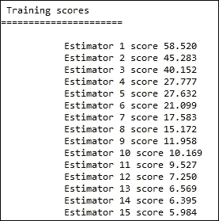

# 第八章 集成方法

在本章中，我们将讨论以下内容：

+   理解集成方法——袋装法（Bagging）

+   理解集成方法——提升法（Boosting），AdaBoost

+   理解集成方法——梯度提升（Gradient Boosting）

# 介绍

在本章中，我们将讨论涉及集成方法的内容。当我们在现实生活中面临不确定性决策时，通常会向多个朋友寻求意见。我们根据从这些朋友那里获得的集体知识做出决策。集成方法在机器学习中的概念类似。前几章中，我们为我们的数据集构建了单一模型，并使用该模型对未见过的测试数据进行预测。如果我们在这些数据上构建多个模型，并根据所有这些模型的预测结果做出最终预测，会怎么样呢？这就是集成方法的核心思想。使用集成方法解决某个问题时，我们会构建多个模型，并利用它们所有的预测结果来对未见过的数据集做出最终预测。对于回归问题，最终输出可能是所有模型预测值的平均值。在分类问题中，则通过多数投票来决定输出类别。

基本思想是拥有多个模型，每个模型在训练数据集上产生略有不同的结果。有些模型比其他模型更好地学习数据的某些方面。其信念是，所有这些模型的最终输出应该优于任何单一模型的输出。

如前所述，集成方法的核心是将多个模型结合在一起。这些模型可以是相同类型的，也可以是不同类型的。例如，我们可以将神经网络模型的输出与贝叶斯模型的输出结合在一起。本章中我们将限制讨论使用相同类型的模型进行集成。通过像袋装法（Bagging）和提升法（Boosting）这样的技术，数据科学社区广泛使用相同类型模型的集成方法。

自助聚合（Bootstrap aggregation），通常称为袋装法（Bagging），是一种优雅的技术，用于生成大量模型并将它们的输出结合起来以做出最终预测。袋装法中的每个模型只使用部分训练数据。袋装法的核心思想是减少数据的过拟合。如前所述，我们希望每个模型与其他模型略有不同。因此，我们对每个模型的训练数据进行有放回的抽样，从而引入了变异性。引入模型变异的另一种方式是对属性进行抽样。我们不会将所有属性提供给模型，而是让不同的模型获得不同的属性集。袋装法可以轻松并行化。基于现有的并行处理框架，可以在不同的训练数据子集上并行构建模型。袋装法不适用于线性预测器，如线性回归。

Boosting 是一种集成技术，能够产生一系列逐渐复杂的模型。它是按顺序工作的，通过基于前一个模型的错误来训练新的模型。每一个训练出来的模型都会有一个与之关联的权重，这个权重是根据该模型在给定数据上表现的好坏来计算的。当最终做出预测时，这些权重决定了某个特定模型对最终结果的影响程度。与 Bagging 不同，Boosting 不太容易进行并行化处理。由于模型是按序列构建的，它无法并行化处理。序列中较早的分类器所犯的错误被视为难以分类的实例。该框架的设计是让序列中后续的模型拾取前一个预测器所犯的错误或误分类，并尝试改进它们。Boosting 通常使用非常弱的分类器，例如决策树桩，即一个只有一个分裂节点和两个叶子的决策树，作为集成中的一部分。关于 Boosting 的一个非常著名的成功案例是 Viola-Jones 人脸检测算法，其中多个弱分类器（决策树桩）被用来找出有效特征。你可以在以下网站上查看更多关于该成功案例的内容：

[`en.wikipedia.org/wiki/Viola%E2%80%93Jones_object_detection_framework`](https://en.wikipedia.org/wiki/Viola%E2%80%93Jones_object_detection_framework)

在本章中，我们将详细研究 Bagging 和 Boosting 方法。我们将在最后的配方中扩展讨论一种特殊类型的 Boosting，叫做梯度 Boosting。我们还将探讨回归和分类问题，并看看如何通过集成学习来解决这些问题。

# 理解集成学习—Bagging 方法

集成方法属于一种叫做基于委员会学习的方法家族。与其将分类或回归的决策交给单一模型，不如通过一组模型来共同决策。Bagging 是一种著名且广泛使用的集成方法。

Bagging 也叫做自助聚合。只有当我们能够在基础模型中引入变异性时，Bagging 才能发挥作用。也就是说，如果我们能够成功地在基础数据集中引入变异性，就会导致具有轻微变化的模型。

我们利用自助采样为这些模型引入数据集的变异性。自助采样是通过随机抽取给定数据集中的实例，指定次数地进行采样，且可以选择是否有放回。 在 Bagging 中，我们通过自助采样生成 `m` 个不同的数据集，并为每个数据集构建一个模型。最后，我们对所有模型的输出进行平均，来产生回归问题中的最终预测结果。

假设我们对数据进行 `m` 次自助采样，我们将得到 `m` 个模型，也就是 `y m` 个值，最终的预测结果如下：


对于分类问题，最终的输出是通过投票决定的。假设我们的集成模型中有一百个模型，并且我们有一个二类分类问题，类别标签为{+1,-1}。如果超过 50 个模型预测输出为+1，我们就将预测结果判定为+1。

随机化是另一种可以在模型构建过程中引入变化的技术。例如，可以随机选择每个集成模型的一个属性子集。这样，不同的模型将拥有不同的属性集。这种技术叫做随机子空间方法。

对于非常稳定的模型，Bagging 可能无法取得很好的效果。如果基础分类器对数据的微小变化非常敏感，Bagging 则会非常有效。例如，决策树非常不稳定，未剪枝的决策树是 Bagging 的良好候选模型。但是，如果是一个非常稳定的模型，比如最近邻分类器 K，我们可以利用随机子空间方法，为最近邻方法引入一些不稳定性。

在接下来的方案中，你将学习如何在 K 最近邻算法中应用 Bagging 和随机子空间方法。我们将解决一个分类问题，最终的预测将基于多数投票。

## 准备工作…

我们将使用 Scikit learn 中的`KNeighborsClassifier`进行分类，并使用`BaggingClassifier`来应用 Bagging 原理。我们将通过`make_classification`便捷函数生成本方案的数据。

## 如何实现

让我们导入必要的库，并编写一个`get_data()`函数，为我们提供数据集，以便我们可以处理这个方案：

```py
from sklearn.datasets import make_classification
from sklearn.neighbors import KNeighborsClassifier
from sklearn.ensemble import BaggingClassifier
from sklearn.metrics import classification_report
from sklearn.cross_validation import train_test_split

def get_data():
    """
    Make a sample classification dataset
    Returns : Independent variable y, dependent variable x
    """
    no_features = 30
    redundant_features = int(0.1*no_features)
    informative_features = int(0.6*no_features)
    repeated_features = int(0.1*no_features)
    print no_features,redundant_features,informative_features,repeated_features
    x,y = make_classification(n_samples=500,n_features=no_features,flip_y=0.03,\
            n_informative = informative_features, n_redundant = redundant_features \
            ,n_repeated = repeated_features,random_state=7)
    return x,y
```

让我们开始编写三个函数：

函数`build_single_model`用给定数据构建一个简单的 K 最近邻模型。

函数`build_bagging_model`实现了 Bagging 过程。

函数`view_model`用于检查我们已经构建的模型：

```py
def build_single_model(x,y):
    model = KNeighborsClassifier()
    model.fit(x,y)
    return model

def build_bagging_model(x,y):
	bagging = BaggingClassifier(KNeighborsClassifier(),n_estimators=100,random_state=9 \
             ,max_samples=1.0,max_features=0.7,bootstrap=True,bootstrap_features=True)
	bagging.fit(x,y)
	return bagging

def view_model(model):
    print "\n Sampled attributes in top 10 estimators\n"
    for i,feature_set in  enumerate(model.estimators_features_[0:10]):
        print "estimator %d"%(i+1),feature_set
```

最后，我们将编写主函数，调用其他函数：

```py
if __name__ == "__main__":
    x,y = get_data()    

    # Divide the data into Train, dev and test    
    x_train,x_test_all,y_train,y_test_all = train_test_split(x,y,test_size = 0.3,random_state=9)
    x_dev,x_test,y_dev,y_test = train_test_split(x_test_all,y_test_all,test_size=0.3,random_state=9)

    # Build a single model    
    model = build_single_model(x_train,y_train)
    predicted_y = model.predict(x_train)
    print "\n Single Model Accuracy on training data\n"
    print classification_report(y_train,predicted_y)
    # Build a bag of models
    bagging = build_bagging_model(x_train,y_train)
    predicted_y = bagging.predict(x_train)
    print "\n Bagging Model Accuracy on training data\n"
    print classification_report(y_train,predicted_y)
	view_model(bagging)

    # Look at the dev set
    predicted_y = model.predict(x_dev)
    print "\n Single Model Accuracy on Dev data\n"
    print classification_report(y_dev,predicted_y)

    print "\n Bagging Model Accuracy on Dev data\n"
    predicted_y = bagging.predict(x_dev)
    print classification_report(y_dev,predicted_y)
```

## 它是如何工作的…

我们从主方法开始。首先调用`get_data`函数，返回一个包含预测变量的矩阵 x 和响应变量的向量 y。让我们来看一下`get_data`函数：

```py
    no_features = 30
    redundant_features = int(0.1*no_features)
    informative_features = int(0.6*no_features)
    repeated_features = int(0.1*no_features)
 x,y =make_classification(n_samples=500,n_features=no_features,flip_y=0.03,\
n_informative = informative_features, n_redundant = redundant_features \
            ,n_repeated = repeated_features,random_state=7)
```

看一下传递给`make_classification`方法的参数。第一个参数是所需的实例数；在这种情况下，我们说需要 500 个实例。第二个参数是每个实例所需的属性数。我们说我们需要`30`个属性，这由变量`no_features`定义。第三个参数，`flip_y`，会随机交换 3%的实例。这是为了在我们的数据中引入一些噪声。下一个参数指定了这`30`个特征中应该有多少个是足够信息量大的，可以用于我们的分类。我们指定 60%的特征，也就是 30 个中的 18 个应该是有信息量的。下一个参数是关于冗余特征的。这些特征是由信息性特征的线性组合生成的，用于在特征之间引入相关性。最后，重复特征是从信息性特征和冗余特征中随机抽取的重复特征。

让我们使用`train_test_split`将数据划分为训练集和测试集。我们保留 30%的数据用于测试：

```py
    # Divide the data into Train, dev and test    
    x_train,x_test_all,y_train,y_test_all = train_test_split(x,y,test_size = 0.3,random_state=9)
```

我们再次利用`train_test_split`将我们的测试数据分为开发集和测试集。

```py
    x_dev,x_test,y_dev,y_test = train_test_split(x_test_all,y_test_all,test_size=0.3,random_state=9)
```

在划分好数据以构建、评估和测试模型后，我们继续构建模型。我们将首先通过调用以下代码构建一个单一模型，使用`KNeighborsClassifier`：

```py
model = build_single_model(x_train,y_train)
```

在这个函数内部，我们创建了一个`KNeighborsClassifier`类型的对象，并将我们的数据进行拟合，如下所示：

```py
def build_single_model(x,y):
    model = KNeighborsClassifier()
    model.fit(x,y)
    return model
```

如前一节所述，`KNearestNeighbor`是一个非常稳定的算法。让我们看看这个模型的表现。我们在训练数据上执行预测，并查看我们的模型指标：

```py
    predicted_y = model.predict(x_train)
    print "\n Single Model Accuracy on training data\n"
    print classification_report(y_train,predicted_y)
```

`classification_report`是 Scikit learn 模块中的一个方便函数。它给出一个包含`precision`、`recall`和`f1-score`的表格：


在`350`个实例中，我们的精确度为 87%。有了这个结果，让我们继续构建我们的集成模型：

```py
    bagging = build_bagging_model(x_train,y_train)
```

我们使用训练数据调用`build_bagging_model`函数，构建一个分类器集合，如下所示：

```py
def build_bagging_model(x,y):
bagging =             BaggingClassifier(KNeighborsClassifier(),n_estimators=100,random_state=9 \
           ,max_samples=1.0,max_features=0.7,bootstrap=True,bootstrap_features=True)
bagging.fit(x,y)
return bagging
```

在这个方法中，我们调用了`BaggingClassifier`类。让我们看一下我们传递给这个类的参数，以便初始化它。

第一个参数是底层估计器或模型。通过传递`KNeighborClassifier`，我们告诉集成分类器我们想要构建一个由`KNearestNeighbor`分类器组成的集合。下一个参数指定了我们将构建的估计器的数量。在这种情况下，我们说需要`100`个估计器。`random_state`参数是随机数生成器使用的种子。为了在不同的运行中保持一致性，我们将其设置为一个整数值。

我们的下一个参数是 max_samples，指定在从输入数据集进行自助采样时，每个估计器选择的实例数。在这种情况下，我们要求集成程序选择所有实例。

接下来，参数 max_features 指定在为估计器进行自助采样时要包含的属性数量。我们假设只选择 70%的属性。因此，在集成中的每个估计器/模型将使用不同的属性子集来构建模型。这就是我们在上一节中介绍的随机空间方法。该函数继续拟合模型并将模型返回给调用函数。

```py
    bagging = build_bagging_model(x_train,y_train)
    predicted_y = bagging.predict(x_train)
    print "\n Bagging Model Accuracy on training data\n"
    print classification_report(y_train,predicted_y)
```

让我们看看模型的准确性：


你可以看到模型指标有了大幅提升。

在测试模型之前，让我们先查看通过调用 view_model 函数分配给不同模型的属性：

```py
    view_model(bagging)
```

我们打印出前十个模型选择的属性，如下所示：

```py
def view_model(model):
    print "\n Sampled attributes in top 10 estimators\n"
    for i,feature_set in  enumerate(model.estimators_features_[0:10]):
        print "estimator %d"%(i+1),feature_set
```


从结果中可以看出，我们已经几乎随机地为每个估计器分配了属性。通过这种方式，我们为每个估计器引入了变异性。

让我们继续检查我们单一分类器和估计器集合在开发集中的表现：

```py
    # Look at the dev set
    predicted_y = model.predict(x_dev)
    print "\n Single Model Accuracy on Dev data\n"
    print classification_report(y_dev,predicted_y)

    print "\n Bagging Model Accuracy on Dev data\n"
    predicted_y = bagging.predict(x_dev)
    print classification_report(y_dev,predicted_y)
```


正如预期的那样，与单一分类器相比，我们的估计器集合在开发集中的表现更好。

## 还有更多……

正如我们之前所说，对于分类问题，获得最多票数的标签将被视为最终预测。除了投票方案，我们还可以要求组成模型输出标签的预测概率。最终，可以取这些概率的平均值来决定最终的输出标签。在 Scikit 的情况下，API 文档提供了关于如何执行最终预测的详细信息：

> *'输入样本的预测类别是通过选择具有最高平均预测概率的类别来计算的。如果基础估计器没有实现*predict phobia*方法，则会使用投票。'*

[`scikit-learn.org/stable/modules/generated/sklearn.ensemble.BaggingClassifier.html`](http://scikit-learn.org/stable/modules/generated/sklearn.ensemble.BaggingClassifier.html)

在上一章中，我们讨论了交叉验证。虽然交叉验证看起来与 Bagging 非常相似，但它们在实际使用中是不同的。在交叉验证中，我们创建 K 折，并根据这些折的模型输出来选择模型的参数，就像我们为岭回归选择 alpha 值一样。这样做主要是为了避免在模型构建过程中暴露我们的测试数据。交叉验证可以用于 Bagging，以确定我们需要向 Bagging 模块添加的估计器数量。

然而，Bagging 的一个缺点是我们失去了模型的可解释性。考虑一个经过剪枝的简单决策树，它很容易解释。但一旦我们有了 100 个这样的模型集合，它就变成了一个黑箱。为了提高准确性，我们牺牲了可解释性。

有关 Bagging 的更多信息，请参阅 Leo Breiman 的以下论文：

> *Leo Breiman. 1996\. Bagging predictors.*Mach. Learn.*24, 2 (August 1996), 123-140\. DOI=10.1023/A:1018054314350 http://dx.doi.org/10.1023/A:1018054314350*

## 另请参见

+   *使用交叉验证迭代器*，请参阅第七章，《机器学习 2》

+   *构建决策树解决多类问题*，请参阅第六章，《机器学习 1》

# 理解集成 - 提升方法

Boosting 是一种强大的集成技术。它几乎被用在大多数数据科学应用中。事实上，它是数据科学家工具包中最重要的工具之一。Boosting 技术利用了类似于 Bagging 的一组估计器。但在这里相似性就结束了。在我们深入研究我们的方法之前，让我们快速看一下 Boosting 如何作为一种非常有效的集成技术。

让我们来看一个熟悉的二类分类问题，其中输入是一组预测变量（`X`），输出是一个响应变量（`Y`），它可以取`0`或`1`作为值。分类问题的输入表示如下：


分类器的任务是找到一个可以近似的函数：


分类器的误分类率定义为：


假设我们构建了一个非常弱的分类器，其错误率略好于随机猜测。在 Boosting 中，我们在略微修改的数据集上构建了一系列弱分类器。我们为每个分类器轻微修改数据，并最终得到 M 个分类器：


最后，它们所有的预测通过加权多数投票进行组合：


这种方法称为 AdaBoost。

权重 alpha 和模型构建的顺序方式是 Boosting 与 Bagging 不同的地方。正如前面提到的，Boosting 在每个分类器上构建了一系列略微修改的数据集上的弱分类器。让我们看看这个微小的数据修改指的是什么。正是从这个修改中我们得出了我们的权重 alpha。

最初对于第一个分类器，m=1，我们将每个实例的权重设置为 1/N，也就是说，如果有一百条记录，每条记录的权重为 0.001。让我们用 w 来表示权重-现在我们有一百个这样的权重：


所有记录现在都有相等的机会被分类器选择。我们构建分类器，并在训练数据上测试它，以获得误分类率。请参考本节前面给出的误分类率公式。我们将稍微修改它，加入权重，如下所示：


其中 abs 表示结果的绝对值。根据这个误差率，我们计算我们的 alpha（模型权重）如下：


其中 epsilon 是一个非常小的值。

假设我们的模型 1 的误差率是 0.3，也就是说，模型能够正确分类 70%的记录。因此，该模型的权重大约是 0.8，这是一个不错的权重。基于此，我们将返回并设置个别记录的权重，如下所示：


正如你所看到的，所有被错误分类的属性的权重都会增加。这增加了被下一个分类器选择的错误分类记录的概率。因此，下一个分类器在序列中选择权重更大的实例并尝试拟合它。通过这种方式，所有未来的分类器将开始集中处理之前分类器错误分类的记录。

这就是提升方法的威力。它能够将多个弱分类器转化为一个强大的集成模型。

让我们看看提升方法如何应用。在我们编写代码的过程中，我们还将看到 AdaBoost 的一个小变种，称为 SAMME。

## 开始使用…

我们将利用 scikit-learn 的`DecisionTreeClassifier`类进行分类，并使用`AdaBoostClassifier`应用提升原理。我们将使用`make_classification`便捷函数生成数据。

## 如何实现

让我们导入必要的库，并编写一个函数`get_data()`，为我们提供一个数据集来实现这个方案。

```py
from sklearn.datasets import make_classification
from sklearn.ensemble import AdaBoostClassifier
from sklearn.metrics import classification_report,zero_one_loss
from sklearn.cross_validation import train_test_split
from sklearn.tree import DecisionTreeClassifier
import numpy as np
import matplotlib.pyplot as plt
import itertools

def get_data():
    """
    Make a sample classification dataset
    Returns : Independent variable y, dependent variable x
    """
    no_features = 30
    redundant_features = int(0.1*no_features)
    informative_features = int(0.6*no_features)
    repeated_features = int(0.1*no_features)
    print no_features,redundant_features,informative_features,repeated_features
    x,y = make_classification(n_samples=500,n_features=no_features,flip_y=0.03,\
            n_informative = informative_features, n_redundant = redundant_features \
            ,n_repeated = repeated_features,random_state=7)
    return x,y

def build_single_model(x,y):
    model = DecisionTreeClassifier()
    model.fit(x,y)
    return model

def build_boosting_model(x,y,no_estimators=20):
    boosting = AdaBoostClassifier(DecisionTreeClassifier(max_depth=1,min_samples_leaf=1),random_state=9 \
    ,n_estimators=no_estimators,algorithm="SAMME")
    boosting.fit(x,y)
    return boosting

def view_model(model):
    print "\n Estimator Weights and Error\n"
    for i,weight in  enumerate(model.estimator_weights_):
        print "estimator %d weight = %0.4f error = %0.4f"%(i+1,weight,model.estimator_errors_[i])

    plt.figure(1)
    plt.title("Model weight vs error")
    plt.xlabel("Weight")
    plt.ylabel("Error")
    plt.plot(model.estimator_weights_,model.estimator_errors_)

def number_estimators_vs_err_rate(x,y,x_dev,y_dev):
    no_estimators = range(20,120,10)
    misclassy_rate = []
    misclassy_rate_dev = []

    for no_estimator in no_estimators:
        boosting = build_boosting_model(x,y,no_estimators=no_estimator)
        predicted_y = boosting.predict(x)
        predicted_y_dev = boosting.predict(x_dev)        
        misclassy_rate.append(zero_one_loss(y,predicted_y))
        misclassy_rate_dev.append(zero_one_loss(y_dev,predicted_y_dev))

    plt.figure(2)
    plt.title("No estimators vs Mis-classification rate")
    plt.xlabel("No of estimators")
    plt.ylabel("Mis-classification rate")
    plt.plot(no_estimators,misclassy_rate,label='Train')
    plt.plot(no_estimators,misclassy_rate_dev,label='Dev')

    plt.show() 

if __name__ == "__main__":
    x,y = get_data()    
    plot_data(x,y)

    # Divide the data into Train, dev and test    
    x_train,x_test_all,y_train,y_test_all = train_test_split(x,y,test_size = 0.3,random_state=9)
    x_dev,x_test,y_dev,y_test = train_test_split(x_test_all,y_test_all,test_size=0.3,random_state=9)

    # Build a single model    
    model = build_single_model(x_train,y_train)
    predicted_y = model.predict(x_train)
    print "\n Single Model Accuracy on training data\n"
    print classification_report(y_train,predicted_y)
    print "Fraction of misclassfication = %0.2f"%(zero_one_loss(y_train,predicted_y)*100),"%"

    # Build a bag of models
    boosting = build_boosting_model(x_train,y_train, no_estimators=85)
    predicted_y = boosting.predict(x_train)
    print "\n Boosting Model Accuracy on training data\n"
    print classification_report(y_train,predicted_y)
    print "Fraction of misclassfication = %0.2f"%(zero_one_loss(y_train,predicted_y)*100),"%"

    view_model(boosting)

    # Look at the dev set
    predicted_y = model.predict(x_dev)
    print "\n Single Model Accuracy on Dev data\n"
    print classification_report(y_dev,predicted_y)
    print "Fraction of misclassfication = %0.2f"%(zero_one_loss(y_dev,predicted_y)*100),"%"

    print "\n Boosting Model Accuracy on Dev data\n"
    predicted_y = boosting.predict(x_dev)
    print classification_report(y_dev,predicted_y)
    print "Fraction of misclassfication = %0.2f"%(zero_one_loss(y_dev,predicted_y)*100),"%"

    number_estimators_vs_err_rate(x_train,y_train,x_dev,y_dev)
```

让我们继续并编写以下三个函数：

函数 build_single_model 用于使用给定数据构建一个简单的决策树模型。

函数 build_boosting_model，它实现了提升算法。

函数 view_model，用于检查我们构建的模型。

```py
def build_single_model(x,y):
    model = DecisionTreeClassifier()
    model.fit(x,y)
    return model

def build_boosting_model(x,y,no_estimators=20):
    boosting = AdaBoostClassifier(DecisionTreeClassifier(max_depth=1,min_samples_leaf=1),random_state=9 \
    ,n_estimators=no_estimators,algorithm="SAMME")
    boosting.fit(x,y)
    return boosting

def view_model(model):
    print "\n Estimator Weights and Error\n"
    for i,weight in  enumerate(model.estimator_weights_):
        print "estimator %d weight = %0.4f error = %0.4f"%(i+1,weight,model.estimator_errors_[i])

    plt.figure(1)
    plt.title("Model weight vs error")
    plt.xlabel("Weight")
    plt.ylabel("Error")
    plt.plot(model.estimator_weights_,model.estimator_errors_)
```

然后我们编写一个名为 number_estimators_vs_err_rate 的函数。我们使用此函数来查看随着集成模型中模型数量的变化，我们的误差率是如何变化的。

```py
def number_estimators_vs_err_rate(x,y,x_dev,y_dev):
    no_estimators = range(20,120,10)
    misclassy_rate = []
    misclassy_rate_dev = []

    for no_estimator in no_estimators:
        boosting = build_boosting_model(x,y,no_estimators=no_estimator)
        predicted_y = boosting.predict(x)
        predicted_y_dev = boosting.predict(x_dev)        
        misclassy_rate.append(zero_one_loss(y,predicted_y))
        misclassy_rate_dev.append(zero_one_loss(y_dev,predicted_y_dev))

    plt.figure(2)
    plt.title("No estimators vs Mis-classification rate")
    plt.xlabel("No of estimators")
    plt.ylabel("Mis-classification rate")
    plt.plot(no_estimators,misclassy_rate,label='Train')
    plt.plot(no_estimators,misclassy_rate_dev,label='Dev')

    plt.show()
```

最后，我们将编写主函数，它将调用其他函数。

```py
if __name__ == "__main__":
    x,y = get_data()    
    plot_data(x,y)

    # Divide the data into Train, dev and test    
    x_train,x_test_all,y_train,y_test_all = train_test_split(x,y,test_size = 0.3,random_state=9)
    x_dev,x_test,y_dev,y_test = train_test_split(x_test_all,y_test_all,test_size=0.3,random_state=9)

    # Build a single model    
    model = build_single_model(x_train,y_train)
    predicted_y = model.predict(x_train)
    print "\n Single Model Accuracy on training data\n"
    print classification_report(y_train,predicted_y)
    print "Fraction of misclassfication = %0.2f"%(zero_one_loss(y_train,predicted_y)*100),"%"

    # Build a bag of models
    boosting = build_boosting_model(x_train,y_train, no_estimators=85)
    predicted_y = boosting.predict(x_train)
    print "\n Boosting Model Accuracy on training data\n"
    print classification_report(y_train,predicted_y)
    print "Fraction of misclassfication = %0.2f"%(zero_one_loss(y_train,predicted_y)*100),"%"

    view_model(boosting)

    # Look at the dev set
    predicted_y = model.predict(x_dev)
    print "\n Single Model Accuracy on Dev data\n"
    print classification_report(y_dev,predicted_y)
    print "Fraction of misclassfication = %0.2f"%(zero_one_loss(y_dev,predicted_y)*100),"%"

    print "\n Boosting Model Accuracy on Dev data\n"
    predicted_y = boosting.predict(x_dev)
    print classification_report(y_dev,predicted_y)
    print "Fraction of misclassfication = %0.2f"%(zero_one_loss(y_dev,predicted_y)*100),"%"

    number_estimators_vs_err_rate(x_train,y_train,x_dev,y_dev)
```

## 它是如何工作的…

让我们从主方法开始。我们首先调用`get_data`函数返回数据集，其中 x 为预测变量矩阵，y 为响应变量向量。让我们深入了解`get_data`函数：

```py
    no_features = 30
    redundant_features = int(0.1*no_features)
    informative_features = int(0.6*no_features)
    repeated_features = int(0.1*no_features)
 x,y =make_classification(n_samples=500,n_features=no_features,flip_y=0.03,\
n_informative = informative_features, n_redundant = redundant_features \
            ,n_repeated = repeated_features,random_state=7)
```

查看传递给`make_classification`方法的参数。第一个参数是所需的实例数量；在这种情况下，我们说我们需要 500 个实例。第二个参数给出了每个实例所需的属性数量。我们说我们需要 30 个属性，正如`no_features`变量所定义的那样。第三个参数`flip_y`，随机交换 3%的实例。这是为了在数据中引入一些噪音。接下来的参数指定了这些 30 个特征中应该有多少个是足够有用的，可以用于分类。我们指定 60%的特征，即 30 个特征中的 18 个应该是有信息量的。接下来的参数是冗余特征。这些特征是通过有信息特征的线性组合生成的，用来引入特征之间的相关性。最后，重复特征是从有信息特征和冗余特征中随机选取的重复特征。

让我们使用`train_test_split`将数据分为训练集和测试集。我们将 30%的数据保留用于测试。

```py
    # Divide the data into Train, dev and test    
    x_train,x_test_all,y_train,y_test_all = train_test_split(x,y,test_size = 0.3,random_state=9)
```

再次，我们利用`train_test_split`将我们的测试数据分为开发集和测试集。

```py
    x_dev,x_test,y_dev,y_test = train_test_split(x_test_all,y_test_all,test_size=0.3,random_state=9)
```

在将数据分为用于构建、评估和测试模型的部分后，我们开始构建我们的模型。

让我们先拟合一棵单一的决策树，并查看该树在训练集上的表现：

```py
    # Build a single model    
    model = build_single_model(x_train,y_train)
```

我们通过调用`build_single_model`函数，传入预测变量和响应变量来构建模型。在这个过程中，我们拟合一棵单一的决策树，并将树返回给调用函数。

```py
def build_single_model(x,y):
    model = DecisionTreeClassifier()
    model.fit(x,y)
    return model
```

让我们使用`classification_report`评估模型的好坏，这是来自 Scikit learn 的一个实用函数，它显示一组指标，包括`precision`（精确度）、`recall`（召回率）和`f1-score`；我们还会显示误分类率。

```py
    predicted_y = model.predict(x_train)
    print "\n Single Model Accuracy on training data\n"
    print classification_report(y_train,predicted_y)
    print "Fraction of misclassfication =     
           %0.2f"%(zero_one_loss(y_train,predicted_y)*100),"%"
```


如你所见，我们的决策树模型完美地拟合了数据——我们的误分类率为 0。在我们在开发集上测试该模型之前，让我们构建我们的集成模型：

```py
    # Build a bag of models
    boosting = build_boosting_model(x_train,y_train, no_estimators=85)
```

使用`build_boosting_model`方法，我们按如下方式构建我们的集成模型：

```py
    boosting = AdaBoostClassifier(DecisionTreeClassifier(max_depth=1,min_samples_leaf=1),random_state=9 \
    ,n_estimators=no_estimators,algorithm="SAMME")
    boosting.fit(x,y)
```

我们利用 Scikit learn 中的`AdaBoostClassifier`构建我们的提升集成。我们使用以下参数实例化该类：

估计器——在我们的案例中，我们说我们想要构建一个决策树的集成。因此，我们传入`DecisionTreeClassifier`对象。

`max_depth`——我们不希望在集成中使用完全生长的树木。我们只需要树桩——只有两个叶子节点和一个分割节点的树。因此，我们将`max_depth`参数设置为 1。

使用`n_estimators`参数，我们指定要生成的树木数量；在此案例中，我们将生成 86 棵树。

最后，我们有一个参数叫做 algorithm，它被设置为`SAMME`。`SAMME`代表逐阶段加法建模，使用多类指数损失函数。`SAMME`是对 AdaBoost 算法的改进。它试图将更多的权重分配给误分类的记录。模型权重α是`SAMME`与 AdaBoost 的区别所在。


我们在前面的公式中忽略了常数 0.5。让我们来看一下新的添加项：log(K-1)。如果 K=2，那么前面的公式就简化为 AdaBoost。在这里，K 是响应变量中的类别数。对于二分类问题，SAMME 就会简化为 AdaBoost，正如前面所述。

让我们拟合模型，并将其返回给调用函数。我们在训练数据集上运行该模型，再次查看模型的表现：

```py
    predicted_y = boosting.predict(x_train)
    print "\n Boosting Model Accuracy on training data\n"
    print classification_report(y_train,predicted_y)
    print "Fraction of misclassfication = %0.2f"%(zero_one_loss(y_train,predicted_y)*100),"%"
```


结果与我们原始模型的表现没有太大不同。我们已经正确分类了几乎 98%的记录。

在对开发集进行测试之前，让我们首先查看我们构建的 Boosting 集成模型：

```py
    view_model(boosting)
```

在 view_model 内部，我们首先打印出分配给每个分类器的权重：

```py
    print "\n Estimator Weights and Error\n"
    for i,weight in  enumerate(model.estimator_weights_):
        print "estimator %d weight = %0.4f error = %0.4f"%(i+1,weight,model.estimator_errors_[i])
```


这里我们展示了前 20 个集成的权重。根据它们的误分类率，我们为这些估计器分配了不同的权重。

让我们继续绘制一个图表，显示估计器权重与每个估计器所产生错误之间的关系：

```py
    plt.figure(1)
    plt.title("Model weight vs error")
    plt.xlabel("Weight")
    plt.ylabel("Error")
    plt.plot(model.estimator_weights_,model.estimator_errors_)
```


正如你所看到的，正确分类的模型被分配了比错误率较高的模型更多的权重。

现在让我们看看单一决策树和集成决策树在开发数据上的表现：

```py
    # Look at the dev set
    predicted_y = model.predict(x_dev)
    print "\n Single Model Accuracy on Dev data\n"
    print classification_report(y_dev,predicted_y)
    print "Fraction of misclassfication = %0.2f"%(zero_one_loss(y_dev,predicted_y)*100),"%"

    print "\n Boosting Model Accuracy on Dev data\n"
    predicted_y = boosting.predict(x_dev)
    print classification_report(y_dev,predicted_y)
    print "Fraction of misclassfication = %0.2f"%(zero_one_loss(y_dev,predicted_y)*100),"%"
```

就像我们对训练数据做的那样，我们打印出分类报告和误分类率：


正如你所看到的，单一决策树表现不佳。尽管它在训练数据上显示了 100%的准确率，但在开发数据上却误分类了近 40%的记录——这是过拟合的迹象。相比之下，Boosting 模型能够更好地拟合开发数据。

我们如何改进 Boosting 模型？其中一种方法是测试训练集中的错误率与我们想要在集成中包含的分类器数量之间的关系。

```py
    number_estimators_vs_err_rate(x_train,y_train,x_dev,y_dev)
```

以下函数会根据集成的数量递增并绘制错误率：

```py
def number_estimators_vs_err_rate(x,y,x_dev,y_dev):
    no_estimators = range(20,120,10)
    misclassy_rate = []
    misclassy_rate_dev = []

    for no_estimator in no_estimators:
        boosting = build_boosting_model(x,y,no_estimators=no_estimator)
        predicted_y = boosting.predict(x)
        predicted_y_dev = boosting.predict(x_dev)        
        misclassy_rate.append(zero_one_loss(y,predicted_y))
        misclassy_rate_dev.append(zero_one_loss(y_dev,predicted_y_dev))

    plt.figure(2)
    plt.title("No estimators vs Mis-classification rate")
    plt.xlabel("No of estimators")
    plt.ylabel("Mis-classification rate")
    plt.plot(no_estimators,misclassy_rate,label='Train')
    plt.plot(no_estimators,misclassy_rate_dev,label='Dev')

    plt.show()
```

如你所见，我们声明了一个列表，起始值为 20，结束值为 120，步长为 10。在`for`循环中，我们将列表中的每个元素作为估计器参数传递给`build_boosting_model`，然后继续访问模型的错误率。接着我们检查开发集中的错误率。现在我们有两个列表—一个包含训练数据的所有错误率，另一个包含开发数据的错误率。我们将它们一起绘制，*x*轴是估计器的数量，*y*轴是开发集和训练集中的错误分类率。


上述图表给出了一个线索，在大约 30 到 40 个估计器时，开发集中的错误率非常低。我们可以进一步实验树模型参数，以获得一个良好的模型。

## 还有更多内容…

Boosting 方法首次在以下开创性论文中提出：

> *Freund, Y. & Schapire, R. (1997), 'A decision theoretic generalization of on-line learning and an application to boosting', Journal of Computer and System Sciences 55(1), 119–139.*

最初，大多数 Boosting 方法将多类问题简化为二类问题和多个二类问题。以下论文将 AdaBoost 扩展到多类问题：

> *Multi-class AdaBoost Statistics and Its Interface, Vol. 2, No. 3 (2009), pp. 349-360, doi:10.4310/sii.2009.v2.n3.a8 by Trevor Hastie, Saharon Rosset, Ji Zhu, Hui Zou*

本文还介绍了 SAMME，这是我们在配方中使用的方法。

## 另请参见

+   在第六章中，*构建决策树解决多类问题*的配方，*机器学习 I*

+   在第七章中，*使用交叉验证迭代器*的配方，*机器学习 II*

+   在第八章中，*理解集成方法 – 自助法*的配方，*模型选择与评估*

# 理解集成方法 – 梯度 Boosting

让我们回顾一下前面配方中解释的 Boosting 算法。在 Boosting 中，我们以逐步的方式拟合加法模型。我们顺序地构建分类器。构建每个分类器后，我们估计分类器的权重/重要性。根据权重/重要性，我们调整训练集中实例的权重。错误分类的实例比正确分类的实例权重更高。我们希望下一个模型能够选择那些错误分类的实例并在其上进行训练。训练集中的那些没有正确拟合的实例会通过这些权重被识别出来。换句话说，这些记录是前一个模型的不足之处。下一个模型试图克服这些不足。

梯度 Boosting 使用梯度而非权重来识别这些不足之处。让我们快速了解如何使用梯度来改进模型。

让我们以一个简单的回归问题为例，假设我们已知所需的预测变量*X*和响应变量*Y*，其中*Y*是一个实数。


梯度提升过程如下：

它从一个非常简单的模型开始，比如均值模型。


预测值仅仅是响应变量的均值。

然后它会继续拟合残差。残差是实际值 y 与预测值 y_hat 之间的差异。


接下来的分类器是在如下数据集上进行训练的：


随后模型会在前一个模型的残差上进行训练，因此算法会继续构建所需数量的模型，最终形成集成模型。

让我们尝试理解为什么我们要在残差上进行训练。现在应该清楚，Boosting 方法构建的是加性模型。假设我们建立两个模型`F1(X)`和`F2(X)`来预测`Y1`。根据加性原理，我们可以将这两个模型结合起来，如下所示：


也就是说，我们结合两个模型的预测结果来预测 Y_1。

等价地，我们可以这样说：


残差是模型未能很好拟合的部分，或者简单来说，残差就是前一个模型的不足之处。因此，我们利用残差来改进模型，即改进前一个模型的不足。基于这个讨论，你可能会好奇为什么这种方法叫做梯度提升（Gradient Boosting）而不是残差提升（Residual Boosting）。

给定一个可微的函数，梯度表示该函数在某些值处的一阶导数。在回归问题中，目标函数为：


其中，`F(xi)`是我们的回归模型。

线性回归问题是通过最小化前述函数来解决的。我们在`F(xi)`的值处求该函数的一阶导数，如果用该导数值的负值来更新权重系数，我们将朝着搜索空间中的最小解前进。前述成本函数关于`F(xi)`的一阶导数是`F(xi ) – yi`。请参阅以下链接了解推导过程：

[`zh.wikipedia.org/wiki/%E6%A0%B9%E5%87%BB%E4%BD%8D%E9%9A%8F`](https://zh.wikipedia.org/wiki/%E6%A0%B9%E5%87%BB%E4%BD%8D%E9%9A%8F)

`F(xi ) – yi`，即梯度，是我们残差`yi – F(xi)`的负值，因此得名梯度提升（Gradient Boosting）。

有了这个理论，我们可以进入梯度提升的具体步骤。

## 开始使用……

我们将使用波士顿数据集来演示梯度提升。波士顿数据集有 13 个特征和 506 个实例。目标变量是一个实数，即房屋的中位数价格（单位为千美元）。波士顿数据集可以从 UCI 链接下载：

[`archive.ics.uci.edu/ml/machine-learning-databases/housing/housing.names`](https://archive.ics.uci.edu/ml/machine-learning-databases/housing/housing.names)

我们打算生成 2 次方的多项式特征，并仅考虑交互效应。

## 如何操作

让我们导入必要的库，并编写一个`get_data()`函数来提供我们需要使用的数据集，以便完成这个任务：

```py
# Load libraries
from sklearn.datasets import load_boston
from sklearn.cross_validation import train_test_split
from sklearn.ensemble import GradientBoostingRegressor
from sklearn.metrics import mean_squared_error
from sklearn.preprocessing import PolynomialFeatures
import numpy as np
import matplotlib.pyplot as plt

def get_data():
    """
    Return boston dataset
    as x - predictor and
    y - response variable
    """
    data = load_boston()
    x    = data['data']
    y    = data['target']
    return x,y    

def build_model(x,y,n_estimators=500):
    """
    Build a Gradient Boost regression model
    """
    model = GradientBoostingRegressor(n_estimators=n_estimators,verbose=10,\
            subsample=0.7, learning_rate= 0.15,max_depth=3,random_state=77)
    model.fit(x,y)
    return model    

def view_model(model):
    """
    """
    print "\n Training scores"
    print "======================\n"
    for i,score in enumerate(model.train_score_):
        print "\tEstimator %d score %0.3f"%(i+1,score)

    plt.cla()
    plt.figure(1)
    plt.plot(range(1,model.estimators_.shape[0]+1),model.train_score_)
    plt.xlabel("Model Sequence")
    plt.ylabel("Model Score")
    plt.show()

    print "\n Feature Importance"
    print "======================\n"
    for i,score in enumerate(model.feature_importances_):
        print "\tFeature %d Importance %0.3f"%(i+1,score)

def model_worth(true_y,predicted_y):
    """
    Evaluate the model
    """
    print "\tMean squared error = %0.2f"%(mean_squared_error(true_y,predicted_y))

if __name__ == "__main__":

    x,y = get_data()

    # Divide the data into Train, dev and test    
    x_train,x_test_all,y_train,y_test_all = train_test_split(x,y,test_size = 0.3,random_state=9)
    x_dev,x_test,y_dev,y_test = train_test_split(x_test_all,y_test_all,test_size=0.3,random_state=9)

    #Prepare some polynomial features
    poly_features = PolynomialFeatures(2,interaction_only=True)
    poly_features.fit(x_train)
    x_train_poly = poly_features.transform(x_train)
    x_dev_poly   = poly_features.transform(x_dev)

    # Build model with polynomial features
    model_poly = build_model(x_train_poly,y_train)
    predicted_y = model_poly.predict(x_train_poly)
    print "\n Model Performance in Training set (Polynomial features)\n"
    model_worth(y_train,predicted_y)  

    # View model details
    view_model(model_poly)

    # Apply the model on dev set
    predicted_y = model_poly.predict(x_dev_poly)
    print "\n Model Performance in Dev set  (Polynomial features)\n"
    model_worth(y_dev,predicted_y)  

    # Apply the model on Test set
    x_test_poly = poly_features.transform(x_test)
    predicted_y = model_poly.predict(x_test_poly)

    print "\n Model Performance in Test set  (Polynomial features)\n"
    model_worth(y_test,predicted_y)  
```

让我们编写以下三个函数。

build_model 函数实现了梯度提升算法。

view_model 和 model_worth 函数，用于检查我们构建的模型：

```py
def build_model(x,y,n_estimators=500):
    """
    Build a Gradient Boost regression model
    """
    model = GradientBoostingRegressor(n_estimators=n_estimators,verbose=10,\
            subsample=0.7, learning_rate= 0.15,max_depth=3,random_state=77)
    model.fit(x,y)
    return model    

def view_model(model):
    """
    """
    print "\n Training scores"
    print "======================\n"
    for i,score in enumerate(model.train_score_):
        print "\tEstimator %d score %0.3f"%(i+1,score)

    plt.cla()
    plt.figure(1)
    plt.plot(range(1,model.estimators_.shape[0]+1),model.train_score_)
    plt.xlabel("Model Sequence")
    plt.ylabel("Model Score")
    plt.show()

    print "\n Feature Importance"
    print "======================\n"
    for i,score in enumerate(model.feature_importances_):
        print "\tFeature %d Importance %0.3f"%(i+1,score)

def model_worth(true_y,predicted_y):
    """
    Evaluate the model
    """
    print "\tMean squared error = %0.2f"%(mean_squared_error(true_y,predicted_y))
```

最后，我们编写主函数，该函数将调用其他函数：

```py
if __name__ == "__main__":

    x,y = get_data()

    # Divide the data into Train, dev and test    
    x_train,x_test_all,y_train,y_test_all = train_test_split(x,y,test_size = 0.3,random_state=9)
    x_dev,x_test,y_dev,y_test = train_test_split(x_test_all,y_test_all,test_size=0.3,random_state=9)

    #Prepare some polynomial features
    poly_features = PolynomialFeatures(2,interaction_only=True)
    poly_features.fit(x_train)
    x_train_poly = poly_features.transform(x_train)
    x_dev_poly   = poly_features.transform(x_dev)

    # Build model with polynomial features
    model_poly = build_model(x_train_poly,y_train)
    predicted_y = model_poly.predict(x_train_poly)
    print "\n Model Performance in Training set (Polynomial features)\n"
    model_worth(y_train,predicted_y)  

    # View model details
    view_model(model_poly)

    # Apply the model on dev set
    predicted_y = model_poly.predict(x_dev_poly)
    print "\n Model Performance in Dev set  (Polynomial features)\n"
    model_worth(y_dev,predicted_y)  

    # Apply the model on Test set
    x_test_poly = poly_features.transform(x_test)
    predicted_y = model_poly.predict(x_test_poly)

    print "\n Model Performance in Test set  (Polynomial features)\n"
    model_worth(y_test,predicted_y)  
```

## 如何运作…

让我们从主模块开始，跟随代码进行操作。我们使用 get_data 函数加载预测变量 x 和响应变量 y：

```py
def get_data():
    """
    Return boston dataset
    as x - predictor and
    y - response variable
    """
    data = load_boston()
    x    = data['data']
    y    = data['target']
    return x,y    
```

该函数调用 Scikit learn 的便捷函数`load_boston()`来获取波士顿房价数据集，并将其作为 numpy 数组加载。

我们继续使用 Scikit 库中的 train_test_split 函数将数据划分为训练集和测试集。我们保留 30%的数据集用于测试。

```py
x_train,x_test_all,y_train,y_test_all = 
train_test_split(x,y,test_size = 0.3,random_state=9)
```

从这 30%的数据中，我们在下一行再次提取开发集：

```py
x_dev,x_test,y_dev,y_test = train_test_split(x_test_all,y_test_all,test_size=0.3,random_state=9)
```

我们接下来构建多项式特征如下：

```py
poly_features = PolynomialFeatures(interaction_only=True)
poly_features.fit(x_train)
```

如你所见，我们已将 interaction_only 设置为 True。将 interaction_only 设置为 True 时，给定 x1 和 x2 属性时，只会创建 x1*x2 的交互项，而不会创建 x1 的平方和 x2 的平方，假设多项式的度数为 2。默认的度数是 2。

```py
x_train_poly = poly_features.transform(x_train)
x_dev_poly = poly_features.transform(x_dev)
x_test_poly = poly_features.transform(x_test)
```

使用 transform 函数，我们将训练集、开发集和测试集转换为包含多项式特征的数据集：

让我们继续构建我们的模型：

```py
    # Build model with polynomial features
    model_poly = build_model(x_train_poly,y_train)
```

在 build_model 函数内部，我们按如下方式实例化 GradientBoostingRegressor 类：

```py
    model = GradientBoostingRegressor(n_estimators=n_estimators,verbose=10,\
            subsample=0.7, learning_rate= 0.15,max_depth=3,random_state=77)
```

让我们看看这些参数。第一个参数是集成模型的数量。第二个参数是 verbose——当设置为大于 1 的数字时，它会在每个模型（在此为树）的构建过程中打印进度。下一个参数是 subsample，它决定了模型将使用的训练数据百分比。在本例中，0.7 表示我们将使用 70%的训练数据集。下一个参数是学习率。它是一个收缩参数，用于控制每棵树的贡献。接下来的参数 max_depth 决定了构建树的大小。random_state 参数是随机数生成器使用的种子。为了在不同的运行中保持一致性，我们将其设置为一个整数值。

由于我们将 verbose 参数设置为大于 1，在拟合模型时，我们会在每次模型迭代过程中看到以下结果：


如你所见，训练损失随着每次迭代而减少。第四列是袋外改进得分。在子采样中，我们仅选择了数据集的 70%；袋外得分是用剩下的 30%计算的。与前一个模型相比，损失有所改善。例如，在第二次迭代中，相较于第一次迭代构建的模型，我们有 10.32 的改进。

让我们继续检查集成模型在训练数据上的表现：

```py
    predicted_y = model_poly.predict(x_train_poly)
    print "\n Model Performance in Training set (Polynomial features)\n"
    model_worth(y_train,predicted_y)  
```


如你所见，我们的提升集成模型已经完美地拟合了训练数据。

model_worth 函数打印出模型的更多细节，具体如下：



在详细输出中看到的每个不同模型的得分，都作为属性存储在模型对象中，可以通过以下方式检索：

```py
print "\n Training scores"
print "======================\n"
for i,score in enumerate(model.train_score_):
print "\tEstimator %d score %0.3f"%(i+1,score)
```

让我们在图表中展示这个结果：

```py
plt.cla()
plt.figure(1)
plt.plot(range(1,model.estimators_.shape[0]+1),model.train_score_)
plt.xlabel("Model Sequence")
plt.ylabel("Model Score")
plt.show()
```

*x* 轴表示模型编号，y 轴显示训练得分。记住，提升是一个顺序过程，每个模型都是对前一个模型的改进。


如图所示，均方误差（即模型得分）随着每一个后续模型的增加而减小。

最后，我们还可以看到与每个特征相关的重要性：

```py
    print "\n Feature Importance"
    print "======================\n"
    for i,score in enumerate(model.feature_importances_):
        print "\tFeature %d Importance %0.3f"%(i+1,score)
```

让我们看看各个特征之间的堆叠情况。


梯度提升将特征选择和模型构建统一为一个操作。它可以自然地发现特征之间的非线性关系。请参考以下论文，了解如何将梯度提升用于特征选择：

> *Zhixiang Xu, Gao Huang, Kilian Q. Weinberger, 和 Alice X. Zheng. 2014\. 梯度提升特征选择。在 *第 20 届 ACM SIGKDD 国际知识发现与数据挖掘大会论文集*(KDD '14)。ACM, 纽约, NY, USA, 522-531。*

让我们将开发数据应用到模型中并查看其表现：

```py
    # Apply the model on dev set
    predicted_y = model_poly.predict(x_dev_poly)
    print "\n Model Performance in Dev set  (Polynomial features)\n"
    model_worth(y_dev,predicted_y)  
```


最后，我们来看一下测试集上的表现。


如你所见，与开发集相比，我们的集成模型在测试集上的表现极为出色。

## 还有更多内容…

欲了解更多关于梯度提升的信息，请参考以下论文：

> *Friedman, J. H. (2001). 贪婪函数逼近：一种梯度提升机。统计年鉴，第 1189–1232 页。*
> 
> *在这份报告中，我们用平方损失函数解释了梯度提升。然而，梯度提升应该被视为一个框架，而不是一个方法。任何可微分的损失函数都可以在这个框架中使用。用户可以选择任何学习方法和可微损失函数，并将其应用于梯度提升框架。*
> 
> *Scikit Learn 还提供了一种用于分类的梯度提升方法，称为 GradientBoostingClassifier。*

[`scikit-learn.org/stable/modules/generated/sklearn.ensemble.GradientBoostingClassifier.html`](http://scikit-learn.org/stable/modules/generated/sklearn.ensemble.GradientBoostingClassifier.html)

## 另见

+   *理解集成方法, Bagging 方法* 配方见 第八章，*模型选择与评估*

+   *理解集成方法*，*AdaBoost 增强方法* 配方见 第八章，*模型选择与评估*

+   *使用回归预测实值数* 配方见 第七章，*机器学习 II*

+   *使用 LASSO 回归进行变量选择* 配方见 第七章，*机器学习 II*

+   *使用交叉验证迭代器* 配方见 第七章，*机器学习 II*
