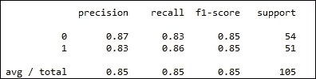

# 第九章：生长树

本章我们将涵盖以下食谱：

+   从树到森林——随机森林

+   生长极度随机化的树

+   生长旋转森林

# 介绍

在本章中，我们将看到更多基于树的算法的袋装方法。由于它们对噪声的鲁棒性以及对各种问题的普适性，它们在数据科学社区中非常受欢迎。

大多数这些方法的名声在于它们相比其他方法能够在没有任何数据准备的情况下获得非常好的结果，而且它们可以作为黑盒工具交给软件工程师使用。

除了前文提到的过高的要求外，还有一些其他优点。

从设计上看，袋装法非常适合并行化。因此，这些方法可以轻松应用于集群环境中的大规模数据集。

决策树算法在树的每一层将输入数据划分为不同的区域。因此，它们执行了隐式的特征选择。特征选择是构建良好模型中的一个重要任务。通过提供隐式特征选择，决策树相较于其他技术处于有利位置。因此，带有决策树的袋装法具备这一优势。

决策树几乎不需要数据准备。例如，考虑属性的缩放。属性的缩放对决策树的结构没有影响。此外，缺失值不会影响决策树。异常值对决策树的影响也很小。

在我们之前的一些食谱中，我们使用了多项式特征，仅保留了交互项。通过集成树方法，这些交互关系得到了处理。我们无需进行显式的特征转换来适应特征交互。

基于线性回归的模型在输入数据中存在非线性关系时会失败。当我们解释核主成分分析（Kernel PCA）食谱时，我们看到过这种效果。基于树的算法不受数据中非线性关系的影响。

对于树基方法的主要投诉之一是树的剪枝困难，容易导致过拟合。大树往往也会拟合底层数据中的噪声，从而导致低偏差和高方差。然而，当我们生长大量树木，并且最终预测是所有树的输出的平均值时，就能避免方差问题。

本章我们将介绍三种基于树的集成方法。

我们的第一个食谱是实现随机森林用于分类问题。Leo Breiman 是这一算法的发明者。随机森林是一种集成技术，通过内部使用大量的树来构建模型，用于解决回归或分类问题。

我们的第二个方法是极端随机化树（Extremely Randomized trees），这是一种与随机森林非常相似的算法。通过与随机森林相比，增加更多的随机化，它声称可以更有效地解决方差问题。此外，它还稍微减少了计算复杂度。

我们的最后一个方法是旋转森林（Rotation Forest）。前两个方法需要大量的树作为其集成的一部分，以获得良好的性能。旋转森林声称可以用较少的树实现类似或更好的性能。此外，该算法的作者声称，其基础估计器可以是任何其他的模型，而不仅仅是树。通过这种方式，它被视为构建类似于梯度提升（Gradient Boosting）集成的新框架。

# 从树到森林——随机森林

随机森林方法构建了许多相互之间不相关的树（森林）。给定一个分类或回归问题，该方法构建许多树，最终的预测结果要么是森林中所有树的预测平均值（对于回归），要么是多数投票分类的结果。

这应该让你想起 Bagging。随机森林是另一种 Bagging 方法。Bagging 背后的基本思想是使用大量的噪声估计器，通过平均来处理噪声，从而减少最终输出中的方差。树对训练数据集中的噪声非常敏感。由于树是噪声估计器，它们非常适合用于 Bagging。

让我们写下构建随机森林的步骤。森林中所需的树的数量是用户指定的一个参数。假设 T 是需要构建的树的数量：

我们从 1 到 T 进行迭代，也就是说，我们构建 T 棵树：

+   对于每棵树，从我们的输入数据集中抽取大小为 D 的自助抽样。

+   我们继续将一棵树 t 拟合到输入数据：

    +   随机选择 m 个属性。

    +   选择最好的属性作为分裂变量，使用预定义的标准。

    +   将数据集分成两部分。记住，树是二叉的。在树的每一层，输入数据集都会被分成两部分。

    +   我们继续在已分割的数据集上递归地执行前面三步。

+   最后，我们返回 T 棵树。

为了对一个新实例做出预测，我们在 T 中所有的树上进行多数投票来做分类；对于回归问题，我们取每棵树 t 在 T 中返回的平均值。

我们之前提到过，随机森林构建的是非相关的树。让我们看看集成中的各个树是如何彼此不相关的。通过为每棵树从数据集中抽取自助样本，我们确保不同的树会接触到数据的不同部分。这样，每棵树都会尝试建模数据集的不同特征。因此，我们遵循集成方法引入底层估计器的变化。但这并不保证底层树之间完全没有相关性。当我们进行节点分裂时，并不是选择所有特征，而是随机选择特征的一个子集。通过这种方式，我们尝试确保我们的树之间没有相关性。

与 Boosting 相比，我们的估计器集成在 Boosting 中是弱分类器，而在随机森林中，我们构建具有最大深度的树，以使其完美拟合自助样本，从而降低偏差。其结果是引入了高方差。然而，通过构建大量的树并使用平均化原则进行最终预测，我们希望解决这个方差问题。

让我们继续深入了解我们的随机森林配方。

## 准备开始

我们将生成一些分类数据集，以演示随机森林算法。我们将利用 scikit-learn 中的随机森林实现，该实现来自集成模块。

## 如何操作…

我们将从加载所有必要的库开始。让我们利用 `sklearn.dataset` 模块中的 `make_classification` 方法来生成训练数据，以演示随机森林：

```py
from sklearn.datasets import make_classification
from sklearn.metrics import classification_report, accuracy_score
from sklearn.cross_validation import train_test_split
from sklearn.ensemble import RandomForestClassifier
from sklearn.grid_search import RandomizedSearchCV
from operator import itemgetter

import numpy as np

def get_data():
    """
    Make a sample classification dataset
    Returns : Independent variable y, dependent variable x
    """
    no_features = 30
    redundant_features = int(0.1*no_features)
    informative_features = int(0.6*no_features)
    repeated_features = int(0.1*no_features)
    x,y = make_classification(n_samples=500,n_features=no_features,flip_y=0.03,\
            n_informative = informative_features, n_redundant = redundant_features \
            ,n_repeated = repeated_features,random_state=7)
    return x,y
```

现在我们将编写 `build_forest` 函数来构建完全生长的树，并继续评估森林的性能。接着我们将编写可用于搜索森林最优参数的方法：

```py
def build_forest(x,y,x_dev,y_dev):
    """
    Build a random forest of fully grown trees
    and evaluate peformance
    """
    no_trees = 100
    estimator = RandomForestClassifier(n_estimators=no_trees)
    estimator.fit(x,y)

    train_predcited = estimator.predict(x)
    train_score = accuracy_score(y,train_predcited)
    dev_predicted = estimator.predict(x_dev)
    dev_score = accuracy_score(y_dev,dev_predicted)

    print "Training Accuracy = %0.2f Dev Accuracy = %0.2f"%(train_score,dev_score)

def search_parameters(x,y,x_dev,y_dev):
    """
    Search the parameters of random forest algorithm
    """
    estimator = RandomForestClassifier()
    no_features = x.shape[1]
    no_iterations = 20
    sqr_no_features = int(np.sqrt(no_features))

    parameters = {"n_estimators"      : np.random.randint(75,200,no_iterations),
                 "criterion"         : ["gini", "entropy"],
                 "max_features"      : [sqr_no_features,sqr_no_features*2,sqr_no_features*3,sqr_no_features+10]
                 }

    grid = RandomizedSearchCV(estimator=estimator,param_distributions=parameters,\
    verbose=1, n_iter=no_iterations,random_state=77,n_jobs=-1,cv=5)
    grid.fit(x,y)
    print_model_worth(grid,x_dev,y_dev)

    return grid.best_estimator_

def print_model_worth(grid,x_dev,y_dev):    
    # Print the goodness of the models
    # We take the top 5 models
    scores = sorted(grid.grid_scores_, key=itemgetter(1), reverse=True) [0:5]

    for model_no,score in enumerate(scores):
        print "Model %d, Score = %0.3f"%(model_no+1,score.mean_validation_score)
        print "Parameters = {0}".format(score.parameters)
    print
    dev_predicted = grid.predict(x_dev)

    print classification_report(y_dev,dev_predicted)
```

最后，我们编写一个主函数，用于调用我们之前定义的函数：

```py
if __name__ == "__main__":
    x,y = get_data()    

    # Divide the data into Train, dev and test    
    x_train,x_test_all,y_train,y_test_all = train_test_split(x,y,test_size = 0.3,random_state=9)
    x_dev,x_test,y_dev,y_test = train_test_split(x_test_all,y_test_all,test_size=0.3,random_state=9)

    build_forest(x_train,y_train,x_dev,y_dev)
    model = search_parameters(x,y,x_dev,y_dev)
    get_feature_importance(model)
```

## 它是如何工作的…

让我们从我们的主函数开始。我们调用 `get_data` 来获取预测器特征 `x` 和响应特征 `y`。在 `get_data` 中，我们利用 `make_classification` 数据集来生成我们的随机森林训练数据：

```py
def get_data():
    """
    Make a sample classification dataset
    Returns : Independent variable y, dependent variable x
    """
    no_features = 30
    redundant_features = int(0.1*no_features)
    informative_features = int(0.6*no_features)
    repeated_features = int(0.1*no_features)
    x,y = make_classification(n_samples=500,n_features=no_features,flip_y=0.03,\
            n_informative = informative_features, n_redundant = redundant_features \
            ,n_repeated = repeated_features,random_state=7)
    return x,y
```

让我们看看传递给`make_classification`方法的参数。第一个参数是所需的实例数量；在此例中，我们需要 500 个实例。第二个参数是每个实例所需的属性数量。我们设定需要 30 个属性。第三个参数`flip_y`会随机交换 3%的实例。这是为了向数据中引入一些噪声。接下来的参数指定从这 30 个属性中有多少个是足够有用的信息属性，用于我们的分类任务。我们设定 60%的特征，即 30 个特征中的 18 个应该具有信息量。下一个参数与冗余特征有关。这些冗余特征是通过信息特征的线性组合生成的，以引入特征之间的相关性。最后，重复特征是重复的特征，它们是从信息特征和冗余特征中随机抽取的。

让我们使用`train_test_split`将数据划分为训练集和测试集。我们将 30%的数据保留用于测试：

```py
    # Divide the data into Train, dev and test    
    x_train,x_test_all,y_train,y_test_all = train_test_split(x,y,test_size = 0.3,random_state=9)
```

我们再次使用`train_test_split`将我们的测试数据分成开发集和测试集：

```py
    x_dev,x_test,y_dev,y_test = train_test_split(x_test_all,y_test_all,test_size=0.3,random_state=9)
```

在数据被分配用于构建、评估和测试模型后，我们继续构建我们的模型：

```py
build_forest(x_train,y_train,x_dev,y_dev)
```

我们使用训练集和开发集数据调用`build_forest`函数来构建随机森林模型。让我们来看一下这个函数的内部实现：

```py
    no_trees = 100
    estimator = RandomForestClassifier(n_estimators=no_trees)
    estimator.fit(x,y)

    train_predcited = estimator.predict(x)
    train_score = accuracy_score(y,train_predcited)
    dev_predicted = estimator.predict(x_dev)
    dev_score = accuracy_score(y_dev,dev_predicted)

    print "Training Accuracy = %0.2f Dev Accuracy = %0.2f"%(train_score,dev_score)
```

我们的集成中需要 100 棵树，所以我们使用变量`no_trees`来定义树的数量。我们利用 scikit-learn 中的`RandomForestClassifier`类进行检查并应用。正如你所见，我们将所需的树的数量作为参数传递。然后，我们继续拟合我们的模型。

现在让我们找到我们训练集和开发集的模型准确度分数：


不错！我们在开发集上达到了 83%的准确率。让我们看看是否可以提高我们的得分。随机森林中还有其他可调的参数，可以调节以获得更好的模型。有关可以调节的参数列表，请参考以下链接：

[`scikit-learn.org/stable/modules/generated/sklearn.ensemble.RandomForestClassifier.html`](http://scikit-learn.org/stable/modules/generated/sklearn.ensemble.RandomForestClassifier.html)

我们调用`search_parameters`函数，并使用训练数据和开发数据来调整我们随机森林模型的各项参数。

在一些前面的实例中，我们使用了 GridSearchCV 来遍历参数空间，以寻找最佳的参数组合。GridSearchCV 进行的是非常彻底的搜索。然而，在本实例中，我们将使用 RandomizedSearchCV。我们为每个参数提供一个参数值的分布，并指定所需的迭代次数。在每次迭代中，RandomizedSearchCV 将从参数分布中随机选择一个值并拟合模型：

```py
parameters = {"n_estimators" : np.random.randint(75,200,no_iterations),
"criterion" : ["gini", "entropy"],
"max_features" : [sqr_no_features,sqr_no_features*2,sqr_no_features*3,sqr_no_features+10]
}
```

我们提供一个参数字典，就像我们在 GridSearchCV 中做的那样。在我们的情况下，我们想要测试三个参数。

第一个参数是模型中的树木数量，通过`n_estimators`参数表示。通过调用 randint 函数，我们获得一个 75 到 200 之间的整数列表。树木的大小由`no_iterations`参数定义：

```py
no_iterations = 20
```

这是我们将传递给 RandomizedSearchCV 的参数，表示我们希望执行的迭代次数。在这`20`个元素的数组中，RandomizedSearchCV 将为每次迭代随机抽取一个值。

下一个参数是准则，我们在基尼指数和熵之间随机选择，并将其作为每次迭代中拆分节点的准则。

最重要的参数`max_features`定义了算法在拆分每个节点时应该选择的特征数量。在我们描述随机森林的伪代码中，我们指定了每次拆分节点时需要随机选择 m 个特征。`max_features`参数定义了 m。在这里，我们提供了一个包含四个值的列表。变量`sqr_no_features`是输入数据集中特征数量的平方根：

```py
sqr_no_features = int(np.sqrt(no_features))
```

列表中的其他值是平方根的一些变化。

让我们用这个参数分布来实例化 RandomizedSearchCV：

```py
grid = RandomizedSearchCV(estimator=estimator,param_distributions=parameters,\
verbose=1, n_iter=no_iterations,random_state=77,n_jobs=-1,cv=5)
```

第一个参数是底层估算器，即我们试图优化其参数的模型。它是我们的`RandomForestClassifier`：

```py
estimator = RandomForestClassifier()
```

第二个参数`param_distributions`是通过字典参数定义的分布。我们定义了迭代次数，即我们希望运行 RandomForestClassifier 的次数，使用参数`n_iter`。通过`cv`参数，我们指定所需的交叉验证次数，在我们的例子中是`5`次交叉验证。

让我们继续拟合模型，看看模型的效果如何：

```py
grid.fit(x,y)
print_model_worth(grid,x_dev,y_dev)
```


如你所见，我们有五个折叠，也就是说，我们希望在每次迭代中进行五折交叉验证。我们总共执行`20`次迭代，因此我们将构建 100 个模型。

让我们看看`print_model_worth`函数内部。我们将网格对象和开发数据集传递给这个函数。网格对象在一个名为`grid_scores_`的属性中存储了它构建的每个模型的评估指标，这个属性是一个列表。让我们将这个列表按降序排序，以构建最佳模型：

```py
scores = sorted(grid.grid_scores_, key=itemgetter(1), reverse=True) [0:5]
```

我们选择排名前五的模型，如索引所示。接下来我们打印这些模型的详细信息：

```py
for model_no,score in enumerate(scores):
print "Model %d, Score = %0.3f"%(model_no+1,score.mean_validation_score)
print "Parameters = {0}".format(score.parameters)
print
```

我们首先打印评估分数，并接着展示模型的参数：


我们根据模型的得分将模式按降序排列，从而将最佳的模型参数放在最前面。我们将选择这些参数作为我们的模型参数。属性`best_estimator_`将返回具有这些参数的模型。

让我们使用这些参数并测试我们的开发数据：

```py
dev_predicted = grid.predict(x_dev)
print classification_report(y_dev,dev_predicted)
```

predict 函数将内部使用`best_estimtor`：


太棒了！我们有一个完美的模型，分类准确率为 100%。

## 还有更多…

在内部，`RandomForestClassifier`使用`DecisionTreeClassifier`。有关构建决策树时传递的所有参数，请参考以下链接：

[`scikit-learn.org/stable/modules/generated/sklearn.tree.DecisionTreeClassifier.html`](http://scikit-learn.org/stable/modules/generated/sklearn.tree.DecisionTreeClassifier.html)

一个我们感兴趣的参数是 splitter。splitter 的默认值设置为 best。根据`max_features`属性，内部实现将选择划分机制。可用的划分机制包括以下几种：

+   best: 从由`max_features`参数定义的给定属性集中选择最佳可能的划分

+   random: 随机选择一个划分属性

你可能已经注意到，在实例化`RandomForestClassifier`时，这个参数不可用。唯一的控制方式是为`max_features`参数赋值，该值应小于数据集中的属性数量。

在工业界，随机森林被广泛用于变量选择。在 Scikit learn 中，变量重要性是通过基尼不纯度（gini impurity）来计算的。用于节点划分的基尼和熵准则根据它们将数据集划分为高不纯度的子集的能力来识别最佳划分属性，以便后续的划分能产生良好的分类。一个变量的重要性由它能在划分后的数据集中引入的不纯度量决定。有关更多详细信息，请参考以下书籍：

> *Breiman, Friedman, "分类与回归树"，1984 年。*

我们可以编写一个小函数来打印重要特征：

```py
def get_feature_importance(model):
    feature_importance = model.feature_importances_
    fm_with_id = [(i,importance) for i,importance in enumerate(feature_importance)]
    fm_with_id = sorted(fm_with_id, key=itemgetter(1),reverse=True)[0:10]
    print "Top 10 Features"
    for importance in fm_with_id:
        print "Feature %d importance = %0.3f"%(importance[0],importance[1])
    print
```

一个 Random Forest 对象有一个名为`feature_importances_`的变量。我们使用这个变量并创建一个包含特征编号和重要性的元组列表：

```py
    feature_importance = model.feature_importances_
    fm_with_id = [(i,importance) for i,importance in enumerate(feature_importance)]
```

我们接着按重要性降序排列，并选择前 10 个特征：

```py
    fm_with_id = sorted(fm_with_id, key=itemgetter(1),reverse=True)[0:10]
```

然后我们打印出前 10 个特征：


随机森林的另一个有趣方面是`袋外估计（OOB）`。记住，我们最初从数据集中对每棵树进行自助采样（bootstrap）。由于自助采样，某些记录在某些树中不会被使用。假设记录 1 在 100 棵树中被使用，在 150 棵树中未被使用。然后，我们可以使用那 150 棵树来预测该记录的类别标签，从而计算该记录的分类误差。袋外估计可以有效地评估我们森林的质量。以下网址给出了 OOB 如何有效使用的示例：

[`scikit-learn.org/dev/auto_examples/ensemble/plot_ensemble_oob.html`](http://scikit-learn.org/dev/auto_examples/ensemble/plot_ensemble_oob.html)

Scikit learn 中的 RandomForestClassifier 类来源于`ForestClassifier`。其源代码可以在以下链接找到：

[`github.com/scikit-learn/scikit-learn/blob/a95203b/sklearn/ensemble/forest.py#L318`](https://github.com/scikit-learn/scikit-learn/blob/a95203b/sklearn/ensemble/forest.py#L318)

当我们在 RandomForestClassifier 中调用`predict`方法时，它内部调用了在 ForestClassifier 中定义的`predict_proba`方法。在这里，最终的预测不是通过投票完成，而是通过对森林中不同树的每个类别的概率进行平均，并基于最高概率决定最终类别。

Leo Breiman 关于随机森林的原始论文可以在以下链接下载：

[`link.springer.com/article/10.1023%2FA%3A1010933404324`](http://link.springer.com/article/10.1023%2FA%3A1010933404324)

你还可以参考 Leo Breiman 和 Adele Cutler 维护的网站：

[`www.stat.berkeley.edu/~breiman/RandomForests/cc_home.htm`](https://www.stat.berkeley.edu/~breiman/RandomForests/cc_home.htm)

## 另请参见

+   第六章中的*构建决策树以解决多类问题*配方，*机器学习 I*。

+   第八章中的*理解集成，梯度提升*配方，*模型选择与评估*。

+   第八章中的*理解集成，袋装方法*配方，*模型选择与评估*。

# 生长极端随机树

极端随机树，也称为 Extra Trees 算法，与前面配方中描述的随机森林在两方面有所不同：

1.  它不使用自助法（bootstrapping）为集成中的每棵树选择实例；相反，它使用完整的训练数据集。

1.  给定 K 作为在某个节点上要随机选择的属性数量，它选择一个随机切分点，而不考虑目标变量。

如前面的配方所示，随机森林在两个地方使用了随机化。首先，选择用于训练森林中树的实例时使用了自助法来选择训练实例。其次，在每个节点，随机选择了一组属性，从中选出一个属性，依据的是基尼不纯度或熵准则。极端随机树更进一步，随机选择分裂属性。

极端随机树在以下论文中被提出：

*P. Geurts, D. Ernst., 和 L. Wehenkel，“极端随机树”，《机器学习》，63(1)，3-42，2006*。

根据本文，除了之前列出的技术方面，还有两个方面使得极端随机树更为适用：

Extra-Trees 方法背后的原理是，通过显式地随机化切分点和属性，结合集成平均法，应该能够比其他方法使用的较弱随机化方案更强烈地减少方差。

与随机森林相比，切分点的随机化（即在每个节点选择用于切分数据集的属性）结合切分点的随机化，即忽略任何标准，最后平均每棵树的结果，将在未知数据集上表现出更优的性能。

第二个优点是计算复杂度：

从计算角度来看，假设树是平衡的，树的生长过程的复杂度与学习样本大小呈 N log N 的数量级，就像大多数树生长过程一样。然而，考虑到节点切分过程的简洁性，我们预计常数因子将比其他集成方法中局部优化切分点的情况要小得多。

由于没有计算时间用于识别最佳的切分属性，这种方法比随机森林在计算上更高效。

让我们写下构建极度随机化树的步骤。森林中所需的树的数量通常由用户指定。设 T 为需要构建的树的数量。

我们从 1 迭代到 T，也就是我们构建 T 棵树：

+   对于每棵树，我们选择完整的输入数据集。

+   然后我们继续拟合一棵树 t 到输入数据：

    +   随机选择 m 个属性。

    +   随机选择一个属性作为切分变量。

    +   将数据集分成两部分。请记住，树是二叉的。在树的每一层，输入数据集都会被分成两部分。

    +   对我们分割的数据集递归执行前述三个步骤。

+   最后，我们返回 T 棵树。

+   让我们看看极度随机化树的配方。

## 准备好了...

我们将生成一些分类数据集来演示极度随机化树。为此，我们将利用 Scikit Learn 中极度随机化树集成模块的实现。

## 如何做到这一点...

我们从加载所有必要的库开始。让我们利用`sklearn.dataset`模块中的`make_classification`方法来生成训练数据：

```py
from sklearn.datasets import make_classification
from sklearn.metrics import classification_report, accuracy_score
from sklearn.cross_validation import train_test_split, cross_val_score
from sklearn.ensemble import ExtraTreesClassifier
from sklearn.grid_search import RandomizedSearchCV
from operator import itemgetter

def get_data():
 """
 Make a sample classification dataset
 Returns : Independent variable y, dependent variable x
 """
 no_features = 30
 redundant_features = int(0.1*no_features)
 informative_features = int(0.6*no_features)
 repeated_features = int(0.1*no_features)
 x,y = make_classification(n_samples=500,n_features=no_features,flip_y=0.03,\
 n_informative = informative_features, n_redundant = redundant_features \
 ,n_repeated = repeated_features,random_state=7)
    return x,y
```

我们编写`build_forest`函数，在其中构建完全生长的树，并继续评估森林的性能：

```py
def build_forest(x,y,x_dev,y_dev):
    """
    Build a Extremely random tress
    and evaluate peformance
    """
    no_trees = 100
    estimator = ExtraTreesClassifier(n_estimators=no_trees,random_state=51)
    estimator.fit(x,y)

    train_predcited = estimator.predict(x)
    train_score = accuracy_score(y,train_predcited)
    dev_predicted = estimator.predict(x_dev)
    dev_score = accuracy_score(y_dev,dev_predicted)

    print "Training Accuracy = %0.2f Dev Accuracy = %0.2f"%(train_score,dev_score)
    print "cross validated score"
    print cross_val_score(estimator,x_dev,y_dev,cv=5)

def search_parameters(x,y,x_dev,y_dev):
    """
    Search the parameters 
    """
    estimator = ExtraTreesClassifier()
    no_features = x.shape[1]
    no_iterations = 20
    sqr_no_features = int(np.sqrt(no_features))

    parameters = {"n_estimators"      : np.random.randint(75,200,no_iterations),
                 "criterion"         : ["gini", "entropy"],
                 "max_features"      : [sqr_no_features,sqr_no_features*2,sqr_no_features*3,sqr_no_features+10]
                 }

    grid = RandomizedSearchCV(estimator=estimator,param_distributions=parameters,\
    verbose=1, n_iter=no_iterations,random_state=77,n_jobs=-1,cv=5)
    grid.fit(x,y)
    print_model_worth(grid,x_dev,y_dev)

    return grid.best_estimator_
```

最后，我们编写一个主函数来调用我们定义的函数：

```py
if __name__ == "__main__":
    x,y = get_data()    

    # Divide the data into Train, dev and test    
    x_train,x_test_all,y_train,y_test_all = train_test_split(x,y,test_size = 0.3,random_state=9)
    x_dev,x_test,y_dev,y_test = train_test_split(x_test_all,y_test_all,test_size=0.3,random_state=9)

    build_forest(x_train,y_train,x_dev,y_dev)
    model = search_parameters(x,y,x_dev,y_dev)
```

## 它是如何工作的…

让我们从主函数开始。我们调用`get_data`来获取预测属性和响应属性。在`get_data`函数内部，我们利用 make_classification 数据集来生成我们配方的训练数据，具体如下：

```py
def get_data():
    """
    Make a sample classification dataset
    Returns : Independent variable y, dependent variable x
    """
    no_features = 30
    redundant_features = int(0.1*no_features)
    informative_features = int(0.6*no_features)
    repeated_features = int(0.1*no_features)
    x,y = make_classification(n_samples=500,n_features=no_features,flip_y=0.03,\
            n_informative = informative_features, n_redundant = redundant_features \
            ,n_repeated = repeated_features,random_state=7)
    return x,y
```

让我们看看传递给`make_classification`方法的参数。第一个参数是所需的实例数量；在这个例子中，我们需要 500 个实例。第二个参数是每个实例所需的属性数量。我们需要 30 个属性。第三个参数，`flip_y`，会随机交换 3%的实例。这样做是为了给我们的数据引入一些噪声。下一个参数指定了这些 30 个特征中，有多少个特征应足够信息量，以便用于分类。我们指定 60%的特征，也就是 30 个中的 18 个，应该是有信息量的。下一个参数是冗余特征。这些特征是通过有信息量的特征的线性组合生成的，以便在特征之间引入相关性。最后，重复特征是从有信息量特征和冗余特征中随机选取的重复特征。

让我们使用`train_test_split`将数据分为训练集和测试集。我们将 30%的数据用于测试：

```py
    # Divide the data into Train, dev and test    
    x_train,x_test_all,y_train,y_test_all = train_test_split(x,y,test_size = 0.3,random_state=9)
```

再次，我们使用`train_test_split`将我们的测试数据分为开发集和测试集：

```py
    x_dev,x_test,y_dev,y_test = train_test_split(x_test_all,y_test_all,test_size=0.3,random_state=9)
```

数据已经分割用于构建、评估和测试模型，我们继续构建我们的模型：

```py
build_forest(x_train,y_train,x_dev,y_dev)
```

我们调用`build_forest`函数，使用我们的训练集和开发集数据来构建极端随机化树模型。让我们来看一下这个函数：

```py
no_trees = 100
    estimator = ExtraTreesClassifier(n_estimators=no_trees,random_state=51)
    estimator.fit(x,y)

    train_predcited = estimator.predict(x)
    train_score = accuracy_score(y,train_predcited)
    dev_predicted = estimator.predict(x_dev)
    dev_score = accuracy_score(y_dev,dev_predicted)

    print "Training Accuracy = %0.2f Dev Accuracy = %0.2f"%(train_score,dev_score)
    print "cross validated score"
    print cross_val_score(estimator,x_dev,y_dev,cv=5)
```

我们需要 100 棵树来构建我们的集成模型，因此我们使用变量 no_trees 来定义树的数量。我们利用 Scikit Learn 中的`ExtraTreesClassifier`类。如你所见，我们将所需的树的数量作为参数传递。这里有一个需要注意的点是参数 bootstrap。有关 ExtraTreesClassifier 的参数，请参考以下网址：

[`scikit-learn.org/stable/modules/generated/sklearn.ensemble.ExtraTreesClassifier.html`](http://scikit-learn.org/stable/modules/generated/sklearn.ensemble.ExtraTreesClassifier.html)

参数 bootstrap 默认设置为`False`。与以下网址给出的`RandomForestClassifier`的 bootstrap 参数进行对比：

[`scikit-learn.org/stable/modules/generated/sklearn.ensemble.RandomForestClassifier.html`](http://scikit-learn.org/stable/modules/generated/sklearn.ensemble.RandomForestClassifier.html)

如前所述，森林中的每棵树都是用所有记录进行训练的。

我们继续如下拟合我们的模型：

```py
    train_predcited = estimator.predict(x)
```

然后我们继续找到训练集和开发集数据的模型准确度得分：

```py
    train_score = accuracy_score(y,train_predcited)
    dev_predicted = estimator.predict(x_dev)
    dev_score = accuracy_score(y_dev,dev_predicted)
```

让我们打印出训练集和开发集的数据得分：

```py
    print "Training Accuracy = %0.2f Dev Accuracy = %0.2f"%(train_score,dev_score)
```


现在让我们进行五折交叉验证，查看模型预测的结果：


相当不错的结果。我们几乎在其中一个折叠中达到了 90%的准确率。我们可以像对随机森林一样在参数空间内进行随机搜索。让我们调用 `search_parameters` 函数，传入我们的训练和测试数据集。请参阅前面的内容了解 RandomizedSearchCV 的解释。然后，我们将打印 `search_parameters` 函数的输出：


如同前面的步骤，我们已按得分从高到低对模型进行排名，因此最好的模型参数会排在最前面。我们将选择这些参数作为我们的模型参数。属性 `best_estimator_` 将返回具有这些参数的模型。

接下来，您将看到为最佳估计器生成的分类报告。预测函数将内部使用 `best_estimator_`。报告是通过以下代码生成的：

```py
dev_predicted = grid.predict(x_dev)
print classification_report(y_dev,dev_predicted)
```

很棒！我们有一个完美的模型，分类准确率为 100%。

## 还有更多内容……

极端随机树在时间序列分类问题中非常受欢迎。有关更多信息，请参阅以下论文：

> *Geurts, P., Blanco Cuesta A., 和 Wehenkel, L. (2005a). 生物序列分类的分段与组合方法。收录于：IEEE 生物信息学与计算生物学计算智能研讨会论文集，194–201。*

## 参见

+   *构建决策树解决多类别问题* 章节内容参见 第六章，*机器学习 I*

+   *理解集成方法，袋装法* 章节内容参见 第八章，*模型选择与评估*

+   *从树到森林的生长，随机森林* 章节内容参见 第九章，*机器学习 III*

# 旋转森林的生长

随机森林和袋装法在非常大的集成中能够给出令人印象深刻的结果；拥有大量估计器会提高这些方法的准确性。相反，旋转森林是设计用来处理较小数量的集成。

让我们写下构建旋转森林的步骤。森林中所需的树木数量通常由用户指定。让 T 表示需要构建的树的数量。

我们从 1 开始迭代直到 T，也就是说，我们构建 T 棵树。

对于每棵树 t，执行以下步骤：

+   将训练集中的特征分成 K 个大小相等的不重叠子集。

+   我们有 K 个数据集，每个数据集包含 K 个特征。对于每个 K 数据集，我们进行如下操作：从每个 K 数据集中自助抽取 75%的数据，并使用抽取的样本进行后续步骤：

    +   对 K 中的第 i 个子集进行主成分分析。保留所有主成分。对于 Kth 子集中的每个特征 j，我们有一个主成分 a。我们将其表示为 aij，这是第 i 个子集中的第 j 个属性的主成分。

    +   存储子集的主成分。

+   创建一个大小为 n X n 的旋转矩阵，其中 n 是属性的总数。将主成分排列在矩阵中，使得这些成分匹配原始训练数据集中特征的位置。

+   使用矩阵乘法将训练数据集投影到旋转矩阵上。

+   使用投影数据集构建决策树。

+   存储树和旋转矩阵。

有了这些知识，让我们跳入我们的配方。

## 准备工作…

我们将生成一些分类数据集来演示旋转森林。根据我们的了解，目前没有现成的 Python 实现来支持旋转森林。因此，我们将编写自己的代码。我们将利用 Scikit Learn 实现的决策树分类器，并使用`train_test_split`方法进行自助抽样。

## 如何实现…

我们将从加载所有必要的库开始。让我们利用来自`sklearn.dataset`模块的`make_classification`方法生成训练数据。接着我们使用一个方法来选择一个随机属性子集，称为`gen_random_subset`：

```py
from sklearn.datasets import make_classification
from sklearn.metrics import classification_report
from sklearn.cross_validation import train_test_split
from sklearn.decomposition import PCA
from sklearn.tree import DecisionTreeClassifier
import numpy as np

def get_data():
    """
    Make a sample classification dataset
    Returns : Independent variable y, dependent variable x
    """
    no_features = 50
    redundant_features = int(0.1*no_features)
    informative_features = int(0.6*no_features)
    repeated_features = int(0.1*no_features)
    x,y = make_classification(n_samples=500,n_features=no_features,flip_y=0.03,\
            n_informative = informative_features, n_redundant = redundant_features \
            ,n_repeated = repeated_features,random_state=7)
    return x,y

def get_random_subset(iterable,k):
    subsets = []
    iteration = 0
    np.random.shuffle(iterable)
    subset = 0
    limit = len(iterable)/k
    while iteration < limit:
        if k <= len(iterable):
            subset = k
        else:
            subset = len(iterable)
        subsets.append(iterable[-subset:])
        del iterable[-subset:]
        iteration+=1
    return subsets
```

现在我们编写一个函数`build_rotationtree_model`，在其中我们将构建完全生长的树，并使用`model_worth`函数评估森林的表现：

```py
def build_rotationtree_model(x_train,y_train,d,k):
    models = []
    r_matrices = []
    feature_subsets = []
    for i in range(d):
        x,_,_,_ = train_test_split(x_train,y_train,test_size=0.3,random_state=7)
        # Features ids
        feature_index = range(x.shape[1])
        # Get subsets of features
        random_k_subset = get_random_subset(feature_index,k)
        feature_subsets.append(random_k_subset)
        # Rotation matrix
        R_matrix = np.zeros((x.shape[1],x.shape[1]),dtype=float)
        for each_subset in random_k_subset:
            pca = PCA()
            x_subset = x[:,each_subset]
            pca.fit(x_subset)
            for ii in range(0,len(pca.components_)):
                for jj in range(0,len(pca.components_)):
                    R_matrix[each_subset[ii],each_subset[jj]] = pca.components_[ii,jj]

        x_transformed = x_train.dot(R_matrix)

        model = DecisionTreeClassifier()
        model.fit(x_transformed,y_train)
        models.append(model)
        r_matrices.append(R_matrix)
    return models,r_matrices,feature_subsets

def model_worth(models,r_matrices,x,y):

    predicted_ys = []
    for i,model in enumerate(models):
        x_mod =  x.dot(r_matrices[i])
        predicted_y = model.predict(x_mod)
        predicted_ys.append(predicted_y)

    predicted_matrix = np.asmatrix(predicted_ys)
    final_prediction = []
    for i in range(len(y)):
        pred_from_all_models = np.ravel(predicted_matrix[:,i])
        non_zero_pred = np.nonzero(pred_from_all_models)[0]  
        is_one = len(non_zero_pred) > len(models)/2
        final_prediction.append(is_one)

    print classification_report(y, final_prediction)
```

最后，我们编写一个主函数，用于调用我们之前定义的函数：

```py
if __name__ == "__main__":
    x,y = get_data()    
#    plot_data(x,y)

    # Divide the data into Train, dev and test    
    x_train,x_test_all,y_train,y_test_all = train_test_split(x,y,test_size = 0.3,random_state=9)
    x_dev,x_test,y_dev,y_test = train_test_split(x_test_all,y_test_all,test_size=0.3,random_state=9)

    # Build a bag of models
    models,r_matrices,features = build_rotationtree_model(x_train,y_train,25,5)
    model_worth(models,r_matrices,x_train,y_train)
    model_worth(models,r_matrices,x_dev,y_dev)
```

## 它是如何工作的…

让我们从主函数开始。我们调用`get_data`来获取响应属性中的预测器属性。在`get_data`内部，我们利用`make_classification`数据集生成我们的训练数据，具体如下：

```py
def get_data():
    """
    Make a sample classification dataset
    Returns : Independent variable y, dependent variable x
    """
    no_features = 30
    redundant_features = int(0.1*no_features)
    informative_features = int(0.6*no_features)
    repeated_features = int(0.1*no_features)
    x,y = make_classification(n_samples=500,n_features=no_features,flip_y=0.03,\
            n_informative = informative_features, n_redundant = redundant_features \
            ,n_repeated = repeated_features,random_state=7)
    return x,y
```

让我们看一下传递给`make_classification`方法的参数。第一个参数是所需实例的数量；在这种情况下，我们需要 500 个实例。第二个参数是每个实例所需的属性数量。我们需要 30 个属性。第三个参数`flip_y`随机交换 3%的实例。这样做是为了在数据中引入一些噪声。下一个参数是关于 30 个特征中应该具有足够信息量用于分类的特征数量。我们规定，60%的特征，也就是 30 个中的 18 个应该具有信息量。下一个参数是冗余特征。冗余特征是通过信息性特征的线性组合生成的，用于在特征之间引入相关性。最后，重复特征是从信息性特征和冗余特征中随机选择的重复特征。

让我们使用`train_test_split`将数据分割成训练集和测试集。我们将 30%的数据用于测试：

```py
    # Divide the data into Train, dev and test    
    x_train,x_test_all,y_train,y_test_all = train_test_split(x,y,test_size = 0.3,random_state=9)
```

我们再次利用`train_test_split`将测试数据分成开发集和测试集，具体如下：

```py
    x_dev,x_test,y_dev,y_test = train_test_split(x_test_all,y_test_all,test_size=0.3,random_state=9)
```

在数据被划分为用于构建、评估和测试模型的部分后，我们开始构建我们的模型：

```py
    models,r_matrices,features = build_rotationtree_model(x_train,y_train,25,5)
```

我们调用`build_rotationtree_model`函数来构建我们的旋转森林。我们传入我们的训练数据、预测变量`x_train`和响应变量`y_train`，要构建的树的总数（在本例中为`25`），以及要使用的特征子集（在本例中为`5`）。

让我们跳到该函数：

```py
    models = []
    r_matrices = []
    feature_subsets = []
```

我们首先声明三个列表，用于存储每棵决策树、该树的旋转矩阵，以及在该迭代中使用的特征子集。然后我们继续构建我们的集成中的每棵树。

作为第一项工作，我们进行自助法以保留数据的 75％：

```py
        x,_,_,_ = train_test_split(x_train,y_train,test_size=0.3,random_state=7)
```

我们利用 Scikit learn 中的`train_test_split`函数进行自助法（bootstrapping）。然后我们按以下方式决定特征子集：

```py
        # Features ids
        feature_index = range(x.shape[1])
        # Get subsets of features
        random_k_subset = get_random_subset(feature_index,k)
        feature_subsets.append(random_k_subset)
```

`get_random_subset`函数接受特征索引和所需 k 个子集的数量作为参数，并返回 K 个子集。

在该函数内部，我们会打乱特征索引。特征索引是一个数字数组，从 0 开始，直到训练集中的特征数量：

```py
    np.random.shuffle(iterable)
```

假设我们有 10 个特征，我们的 k 值是 5，表示我们需要具有 5 个不重叠特征索引的子集；我们需要进行两次迭代。我们将所需的迭代次数存储在 limit 变量中：

```py
    limit = len(iterable)/k
    while iteration < limit:
        if k <= len(iterable):
            subset = k
        else:
            subset = len(iterable)
        iteration+=1
```

如果我们的所需子集少于总属性数，我们可以继续使用我们可迭代对象中的前 k 个条目。由于我们已经打乱了可迭代对象，我们将在不同的时间返回不同的数量：

```py
        subsets.append(iterable[-subset:])
```

在选择一个子集后，我们将其从可迭代对象中移除，因为我们需要不重叠的集合：

```py
        del iterable[-subset:]
```

当所有子集准备好后，我们按以下方式声明我们的旋转矩阵：

```py
        # Rotation matrix
        R_matrix = np.zeros((x.shape[1],x.shape[1]),dtype=float)
```

如您所见，我们的旋转矩阵的大小是 n x n，其中 n 是我们数据集中的属性数量。您可以看到，我们使用了 shape 属性来声明这个填充了零的矩阵：

```py
        for each_subset in random_k_subset:
            pca = PCA()
            x_subset = x[:,each_subset]
            pca.fit(x_subset)
```

对于每个只有 K 个特征的数据子集，我们继续进行主成分分析。

我们按如下方式填充我们的旋转矩阵：

```py
            for ii in range(0,len(pca.components_)):
                for jj in range(0,len(pca.components_)):
                    R_matrix[each_subset[ii],each_subset[jj]] = pca.components_[ii,jj]
```

例如，假设我们的子集中有三个属性，总共有六个属性。为了说明，假设我们的子集是：

```py
2,4,6 and 1,3,5
```

我们的旋转矩阵 R 是 6 x 6 的大小。假设我们要填充第一个特征子集的旋转矩阵。我们将有三个主成分，分别对应于 2、4 和 6，大小为 1 x 3。

来自 Scikit learn 的 PCA 输出是一个大小为主成分 X 特征的矩阵。我们通过 for 循环遍历每个主成分值。在第一次运行时，我们感兴趣的特征是 2，来自 PCA 的主成分矩阵（`0`,`0`）的单元格给出了特征 2 对主成分 1 的贡献值。我们需要找到旋转矩阵中这个值的位置。我们使用主成分矩阵中的索引 ii 和 jj 与子集列表结合来找到旋转矩阵中的正确位置：

```py
                    R_matrix[each_subset[ii],each_subset[jj]] = pca.components_[ii,jj]
```

`each_subset[0]`和`each_subset[0]`将使我们处于旋转矩阵中的(2,2)单元格。随着循环的进行，组件矩阵中(0,1)单元格中的下一个组件值将被放置到旋转矩阵中的(2,4)单元格，最后一个将放在旋转矩阵中的(2,6)单元格。这对于第一个子集中的所有属性都是如此。让我们进入第二个子集；这里第一个属性是 1。组件矩阵中的(0,0)单元格对应于旋转矩阵中的(1,1)单元格。

以这种方式进行，你会发现属性组件的值与属性本身的顺序一致。

在旋转矩阵准备好后，让我们将输入数据投影到旋转矩阵上：

```py
        x_transformed = x_train.dot(R_matrix)
```

现在是时候拟合我们的决策树了：

```py
model = DecisionTreeClassifier()
model.fit(x_transformed,y_train)
```

最后，我们存储我们的模型和相应的旋转矩阵：

```py
models.append(model)
r_matrices.append(R_matrix)
```

构建好模型后，让我们使用`model_worth`函数来检验模型在训练数据和开发数据上的表现：

```py
model_worth(models,r_matrices,x_train,y_train)
model_worth(models,r_matrices,x_dev,y_dev)
```

让我们看看我们的`model_worth`函数：

```py
    for i, model in enumerate(models):
        x_mod =  x.dot(r_matrices[i])
        predicted_y = model.predict(x_mod)
        predicted_ys.append(predicted_y)
```

在这个函数内部，我们使用每棵树进行预测。然而，在预测之前，我们先使用旋转矩阵对输入数据进行投影。我们将所有预测的输出存储在一个名为`predicted_ys`的列表中。假设我们有 100 个实例需要预测，并且我们有 10 个模型。在每个实例中，我们会有 10 个预测结果。为了方便起见，我们将这些结果存储为一个矩阵：

```py
predicted_matrix = np.asmatrix(predicted_ys)
```

现在我们继续为每个输入记录给出最终分类：

```py
    final_prediction = []
    for i in range(len(y)):
        pred_from_all_models = np.ravel(predicted_matrix[:,i])
        non_zero_pred = np.nonzero(pred_from_all_models)[0]  
        is_one = len(non_zero_pred) > len(models)/2
        final_prediction.append(is_one)
```

我们会将最终的预测结果存储在一个名为`final_prediction`的列表中。我们遍历每个实例的预测结果。假设我们在第一个实例（在 for 循环中 i=0）；`pred_from_all_models`存储来自我们模型中所有树的输出。它是一个由 0 和 1 组成的数组，表示在该实例中模型所分类的类别。

我们将其转换为另一个数组`non_zero_pred`，该数组只包含父数组中非零的条目。

最后，如果这个非零数组的长度大于我们模型数量的一半，我们就说我们最终的预测结果是该实例的类别为 1。我们在这里实现的是经典的投票机制。

让我们通过调用`classification_report`来看看我们的模型现在有多好：

```py
    print classification_report(y, final_prediction)
```

以下是我们模型在训练集上的表现：


让我们看看我们的模型在开发数据集上的表现：



## 还有更多内容…

有关旋转森林的更多信息可以参考以下论文：

> *旋转森林：一种新的分类器集成方法，Juan J. Rodriguez，IEEE 计算机学会会员，Ludmila I. Kuncheva，IEEE 会员，Carlos J. Alonso*
> 
> *该论文还声称，在 33 个数据集上将极度随机化树与 Bagging、AdBoost 和随机森林进行比较时，极度随机化树的表现优于其他三种算法。*
> 
> *与梯度提升法类似，论文的作者声称极度随机化方法是一个总体框架，且基础集成方法不一定非得是决策树。目前正在进行其他算法的测试工作，如朴素贝叶斯、神经网络等。*

## 另见

+   *提取主成分* 配方见于第四章，*数据分析 - 深度解析*

+   *通过随机投影减少数据维度* 配方见于第四章，*数据分析 - 深度解析*

+   *建立决策树以解决多分类问题* 配方见于第六章，*机器学习 I*

+   *理解集成方法，梯度提升法* 配方见于第八章，*模型选择与评估*

+   *从树到森林，随机森林* 配方见于第九章，*机器学习 III*

+   *生长极度随机化树* 配方见于第九章，*机器学习 III*
