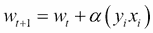
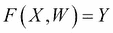

# 第十章 大规模机器学习 – 在线学习

在本章中，我们将看到以下内容：

+   使用感知机作为在线线性算法

+   使用随机梯度下降进行回归

+   使用随机梯度下降进行分类

# 引言

本章中，我们将专注于大规模机器学习以及适合解决此类大规模问题的算法。直到现在，当我们训练所有模型时，我们假设训练集可以完全存入计算机的内存中。在本章中，我们将看到如何在这一假设不再成立时构建模型。我们的训练数据集非常庞大，因此无法完全加载到内存中。我们可能需要按块加载数据，并且仍能生成一个具有良好准确度的模型。训练集无法完全存入计算机内存的问题可以扩展到流数据上。对于流数据，我们不会一次性看到所有的数据。我们应该能够根据我们所接触到的数据做出决策，并且还应有一个机制，在新数据到达时不断改进我们的模型。

我们将介绍基于随机梯度下降的算法框架。这是一个多功能的框架，用于处理非常大规模的数据集，这些数据集无法完全存入我们的内存中。包括逻辑回归、线性回归和线性支持向量机等多种类型的线性算法，都可以通过该框架进行处理。我们在前一章中介绍的核技巧，也可以纳入该框架中，以应对具有非线性关系的数据集。

我们将从感知机算法开始介绍，感知机是最古老的机器学习算法。感知机易于理解和实现。然而，感知机仅限于解决线性问题。基于核的感知机可以用于解决非线性数据集。

在我们的第二个案例中，我们将正式介绍基于梯度下降的方法框架，以及如何使用该方法执行回归任务。我们将查看不同的损失函数，看看如何使用这些函数构建不同类型的线性模型。我们还将看到感知机如何属于随机梯度下降家族。

在我们的最后一个案例中，我们将看到如何使用随机梯度下降框架构建分类算法。

即使我们没有直接的流数据示例，通过现有的数据集，我们将看到如何解决流数据的使用场景。在线学习算法不限于流数据，它们也可以应用于批量数据，只是它们一次只处理一个实例。

# 使用感知机作为在线学习算法

如前所述，感知机是最古老的机器学习算法之一。它最早在 1943 年的一篇论文中提到：

*《神经活动中固有思想的逻辑演算》*。沃伦·S·麦卡洛克和沃尔特·皮茨，伊利诺伊大学医学学院，伊利诺伊神经精神病学研究所精神病学系，芝加哥大学，美国芝加哥。

让我们重新审视分类问题的定义。每个记录或实例可以表示为一个集合(X, y)，其中 X 是一组属性，y 是相应的类标签。

学习一个目标函数 F，该函数将每个记录的属性集映射到预定义的类标签 y，是分类算法的任务。

我们的差异在于我们面对的是一个大规模的学习问题。我们的所有数据无法完全加载到主内存中。因此，我们需要将数据保存在磁盘上，并且每次只使用其中的一部分来构建我们的感知器模型。

让我们继续概述感知器算法：

1.  将模型的权重初始化为一个小的随机数。

1.  将输入数据`x`以其均值进行中心化。

1.  在每个时间步 t（也称为 epoch）：

    +   洗牌数据集

    +   选择单个记录实例并进行预测。

    +   观察预测与真实标签输出的偏差。

    +   如果预测与真实标签不同，则更新权重。

让我们考虑以下场景。我们将完整的数据集存储在磁盘上。在单个 epoch 中，即在步骤 3 中，所有提到的步骤都在磁盘上的所有数据上执行。在在线学习场景中，一组基于窗口函数的实例将随时提供给我们。我们可以在单个 epoch 中根据窗口中的实例数量更新权重。

让我们来看一下如何更新我们的权重。

假设我们的输入 X 如下：


我们的`Y`如下：


我们将定义我们的权重如下方程：


我们在看到每个记录后的预测定义如下：


符号函数在权重和属性的乘积为正时返回+1，如果乘积为负，则返回-1。

感知器接着将预测的 y 与实际的 y 进行比较。如果预测的 y 是正确的，它将继续处理下一个记录。如果预测错误，则有两种情况。如果预测的 y 是+1，而实际的 y 是-1，则减小该权重值与 x 的乘积，反之亦然。如果实际的 y 是+1，而预测的 y 是-1，则增加权重。我们可以用方程式来更清楚地表示这一点：


通常，学习率 alpha 会被提供，以便以可控的方式更新权重。由于数据中存在噪声，完全的增量和减量将导致权重无法收敛：



Alpha 是一个非常小的值，范围在 0.1 到 0.4 之间。

现在让我们跳入我们的配方。

## 准备工作

我们将使用 `make_classification` 生成数据，采用生成器函数批量生成，以模拟大规模数据和数据流，并继续编写感知机算法。

## 如何实现…

让我们加载必要的库。然后我们将编写一个名为 `get_data` 的生成器函数：

```py
from sklearn.datasets import make_classification
from sklearn.metrics import  classification_report
from sklearn.preprocessing import scale
import numpy as np

def get_data(batch_size):
    """
    Make a sample classification dataset
    Returns : Independent variable y, dependent variable x
    """
    b_size = 0
    no_features = 30
    redundant_features = int(0.1*no_features)
    informative_features = int(0.8*no_features)
    repeated_features = int(0.1*no_features)

    while b_size < batch_size:
        x,y = make_classification(n_samples=1000,n_features=no_features,flip_y=0.03,\
                n_informative = informative_features, n_redundant = redundant_features \
                ,n_repeated = repeated_features, random_state=51)
        y_indx = y < 1
        y[y_indx] = -1
        x = scale(x,with_mean=True,with_std=True)

        yield x,y
        b_size+=1
```

我们将编写两个函数，一个用来构建感知机模型，另一个用来测试我们的模型的有效性：

```py
def build_model(x,y,weights,epochs,alpha=0.5):
    """
    Simple Perceptron
    """

    for i in range(epochs):

        # Shuffle the dataset
        shuff_index = np.random.shuffle(range(len(y)))
        x_train = x[shuff_index,:].reshape(x.shape)
        y_train = np.ravel(y[shuff_index,:])

        # Build weights one instance at a time
        for index in range(len(y)):
            prediction = np.sign( np.sum(x_train[index,:] * weights) ) 
            if prediction != y_train[index]:
                weights = weights + alpha * (y_train[index] * x_train[index,:])

    return weights

def model_worth(x,y,weights):
    prediction = np.sign(np.sum(x * weights,axis=1))
print classification_report(y,prediction)
```

最后，我们将编写主函数来调用所有前面的函数，以展示感知机算法：

```py
if __name__ == "__main__":
    data = get_data(10)    
    x,y = data.next()
    weights = np.zeros(x.shape[1])    
    for i in range(10):
        epochs = 100
        weights = build_model(x,y,weights,epochs)
        print
        print "Model worth after receiving dataset batch %d"%(i+1)    
        model_worth(x,y,weights)
        print
        if i < 9:
            x,y = data.next()
```

## 工作原理…

让我们从主函数开始。我们将要求生成器给我们发送 10 组数据：

```py
    data = get_data(10)    
```

在这里，我们希望模拟大规模数据和数据流。在构建模型时，我们无法访问所有数据，只能访问部分数据：

```py
    x,y = data.next()
```

我们将使用生成器中的 `next()` 函数来获取下一组数据。在 `get_data` 函数中，我们将使用 scikit-learn 的 `make_classification` 函数：

```py
        x,y = make_classification(n_samples=1000,n_features=no_features,flip_y=0.03,\
                n_informative = informative_features, n_redundant = redundant_features \
                ,n_repeated = repeated_features, random_state=51)
```

让我们看看传递给 `make_classification` 方法的参数。第一个参数是所需的实例数量，在本例中，我们需要 1,000 个实例。第二个参数是每个实例所需的属性数量。我们假设需要 30 个属性。第三个参数 `flip_y` 随机交换 3% 的实例。这是为了在数据中引入一些噪声。下一个参数涉及这 30 个特征中有多少个应该足够有信息量，以便用于我们的分类。我们指定 60% 的特征，即 30 个特征中的 18 个，应该是有信息量的。下一个参数是冗余特征。这些特征是通过有信息量的特征的线性组合生成的，以便在特征之间引入相关性。最后，重复特征是从有信息量的特征和冗余特征中随机抽取的重复特征。

当我们调用 `next()` 时，我们将获得 1,000 个数据实例。该函数返回一个 y 标签，值为 `{0,1}`；我们希望得到 `{-1,+1}`，因此我们将 y 中的所有零改为 `-1`：

```py
        y_indx = y < 1
        y[y_indx] = -1
```

最后，我们将使用 scikit-learn 的 scale 函数来对数据进行中心化处理。

让我们使用第一批数据来构建模型。我们将用零初始化我们的权重矩阵：

```py
    weights = np.zeros(x.shape[1])    
```

由于我们需要 10 批数据来模拟大规模学习和数据流，因此我们将在 for 循环中执行 10 次模型构建：

```py
    for i in range(10):
        epochs = 100
        weights = build_model(x,y,weights,epochs)
```

我们的感知机算法在`build_model`中构建。一个预测变量 x、响应变量 y、权重矩阵和时间步数或周期数作为参数传递。在我们的情况下，我们已将周期数设置为`100`。此函数还有一个附加参数：alpha 值：

```py
def build_model(x,y,weights,epochs,alpha=0.5)
```

默认情况下，我们将 alpha 值设置为`0.5`。

让我们在`build_model`中查看。我们将从数据洗牌开始：

```py
        # Shuffle the dataset
        shuff_index = np.random.shuffle(range(len(y)))
        x_train = x[shuff_index,:].reshape(x.shape)
        y_train = np.ravel(y[shuff_index,:])
```

我们将遍历数据集中的每条记录，并开始更新我们的权重：

```py

 # Build weights one instance at a time
        for index in range(len(y)):
            prediction = np.sign( np.sum(x_train[index,:] * weights) ) 
            if prediction != y_train[index]:
                weights = weights + alpha * (y_train[index] * x_train[index,:])
```

在 for 循环中，你可以看到我们在做预测：

```py
            prediction = np.sign( np.sum(x_train[index,:] * weights) ) 
```

我们将把训练数据与权重相乘，并将它们加在一起。最后，我们将使用 np.sign 函数来获取我们的预测结果。根据预测结果，我们将更新我们的权重：

```py
                weights = weights + alpha * (y_train[index] * x_train[index,:])
```

就是这样。我们将把权重返回给调用函数。

在我们的主函数中，我们将调用`model_worth`函数来打印模型的优度。这里，我们将使用`classification_report`便捷函数来打印模型的准确度评分：

```py
        print
        print "Model worth after receiving dataset batch %d"%(i+1)    
        model_worth(x,y,weights)
```

然后我们将继续更新模型以处理下一批输入数据。请注意，我们没有更改`weights`参数。它会随着每批新数据的到来而更新。

让我们看看`model_worth`打印了什么：


## 还有更多…

Scikit-learn 为我们提供了感知机的实现。更多细节请参考以下网址：

[`scikit-learn.org/stable/modules/generated/sklearn.linear_model.Perceptron.html`](http://scikit-learn.org/stable/modules/generated/sklearn.linear_model.Perceptron.html)。

感知机算法中可以改进的另一个方面是使用更多特征。

记住预测方程，我们可以将其重写如下：


我们用一个函数替换了 x 值。在这里，我们可以发送一个特征生成器。例如，一个多项式特征生成器可以添加到我们的`get_data`函数中，如下所示：

```py
def get_data(batch_size):
    """
    Make a sample classification dataset
    Returns : Independent variable y, dependent variable x
    """
    b_size = 0
    no_features = 30
    redundant_features = int(0.1*no_features)
    informative_features = int(0.8*no_features)
    repeated_features = int(0.1*no_features)
    poly = PolynomialFeatures(degree=2)

    while b_size < batch_size:
        x,y = make_classification(n_samples=1000,n_features=no_features,flip_y=0.03,\
                n_informative = informative_features, n_redundant = redundant_features \
                ,n_repeated = repeated_features, random_state=51)
        y_indx = y < 1
        y[y_indx] = -1
        x = poly.fit_transform(x)
        yield x,y
        b_size+=1
```

最后，基于核的感知机算法可以处理非线性数据集。有关基于核的感知机的更多信息，请参阅维基百科文章：

[`en.wikipedia.org/wiki/Kernel_perceptron`](https://en.wikipedia.org/wiki/Kernel_perceptron)。

## 另见

+   在第五章中，*学习和使用核*的方法，*数据挖掘 - 在大海捞针中找针*。

# 使用随机梯度下降进行回归

在典型的回归设置中，我们有一组预测变量（实例），如下所示：


每个实例有 m 个属性，如下所示：


响应变量 Y 是一个实值条目的向量。回归的任务是找到一个函数，使得当 x 作为输入提供给该函数时，它应返回 y：


前面的函数通过一个权重向量进行参数化，也就是说，使用权重向量和输入向量的组合来预测`Y`，因此通过权重向量重新编写函数会得到如下形式：



所以，现在的问题是我们如何知道我们拥有正确的权重向量？我们将使用损失函数 L 来得到正确的权重向量。损失函数衡量了预测错误的成本。它通过经验来衡量预测 y 时的成本，当实际值为 y 时。回归问题现在变成了寻找正确的权重向量的问题，该向量能够最小化损失函数。对于我们包含`n`个元素的整个数据集，总的损失函数如下：


我们的权重向量应该是那些能够最小化前面值的权重向量。

梯度下降是一种优化技术，用于最小化前面的方程。对于这个方程，我们将计算梯度，即相对于 W 的一阶导数。

不同于批量梯度下降等其他优化技术，随机梯度下降每次只操作一个实例。随机梯度下降的步骤如下：

1.  对于每一个周期，打乱数据集。

1.  选择一个实例及其响应变量 y。

1.  计算损失函数及其相对于权重的导数。

1.  更新权重。

假设：


这表示相对于 w 的导数。权重更新如下：


如你所见，权重朝着与梯度相反的方向移动，从而实现下降，最终得到的权重向量值能够减少目标成本函数。

平方损失是回归中常用的损失函数。一个实例的平方损失定义如下：


前面方程的导数被代入到权重更新方程中。通过这些背景知识，让我们继续介绍随机梯度下降回归的步骤。

如感知机中所解释的，学习率 eta 被添加到权重更新方程中，以避免噪声的影响：


## 准备工作

我们将利用 scikit-learn 实现的 SGD 回归。与之前的一些示例一样，我们将使用 scikit-learn 中的`make_regression`函数生成数据，以展示随机梯度下降回归。

## 如何操作…

让我们从一个非常简单的示例开始，演示如何构建一个随机梯度下降回归器。

我们首先将加载所需的库。然后我们将编写一个函数来生成预测变量和响应变量，以演示回归：

```py
from sklearn.datasets import make_regression
from sklearn.linear_model import SGDRegressor
from sklearn.metrics import mean_absolute_error, mean_squared_error
from sklearn.cross_validation import train_test_split

def get_data():
    """
    Make a sample classification dataset
    Returns : Independent variable y, dependent variable x
    """
    no_features = 30

    x,y = make_regression(n_samples=1000,n_features=no_features,\
             random_state=51)
    return x,y
```

我们将继续编写有助于我们构建、验证和检查模型的函数：

```py
def build_model(x,y):
    estimator = SGDRegressor(n_iter = 10, shuffle=True,loss = "squared_loss", \
            learning_rate='constant',eta0=0.01,fit_intercept=True, \
            penalty='none')
    estimator.fit(x,y)

    return estimator

def model_worth(model,x,y):
    predicted_y = model.predict(x)
    print "\nMean absolute error = %0.2f"%mean_absolute_error(y,predicted_y)
    print "Mean squared error = %0.2f"%mean_squared_error(y,predicted_y)

def inspect_model(model):
    print "\nModel Itercept {0}".format(model.intercept_)
    print
    for i,coef in enumerate(model.coef_):
        print "Coefficient {0} = {1:.3f}".format(i+1,coef)
```

最后，我们将编写我们的主函数来调用所有前面的函数：

```py
if __name__ == "__main__":
    x,y = get_data()

    # Divide the data into Train, dev and test    
    x_train,x_test_all,y_train,y_test_all = train_test_split(x,y,test_size = 0.3,random_state=9)
    x_dev,x_test,y_dev,y_test = train_test_split(x_test_all,y_test_all,test_size=0.3,random_state=9)

    model = build_model(x_train,y_train)

    inspect_model(model)

    print "Model worth on train data"
    model_worth(model,x_train,y_train)
    print "Model worth on dev data"
    model_worth(model,x_dev,y_dev)

    # Building model with l2 regularization
    model = build_model_regularized(x_train,y_train)
    inspect_model(model)
```

## 工作原理…

让我们从主函数开始。我们将调用`get_data`函数来生成我们的预测变量 x 和响应变量 y：

```py
    x,y = get_data()
```

在`get_data`函数中，我们将利用 scikit-learn 中便捷的`make_regression`函数来生成回归问题的数据集：

```py
    no_features = 30
    x,y = make_regression(n_samples=1000,n_features=no_features,\
             random_state=51)	
```

如您所见，我们将生成一个包含 1,000 个实例的数据集，其中实例数量由`n_samples`参数指定，特征数量由`n_features`参数定义，共有 30 个特征。

让我们使用`train_test_split`将数据划分为训练集和测试集。我们将保留 30%的数据用于测试：

```py
    # Divide the data into Train, dev and test    
    x_train,x_test_all,y_train,y_test_all = train_test_split(x,y,test_size = 0.3,random_state=9)
```

我们将再次利用`train_test_split`来将测试数据划分为开发集和测试集：

```py
    x_dev,x_test,y_dev,y_test = train_test_split(x_test_all,y_test_all,test_size=0.3,random_state=9)
```

在数据划分为用于构建、评估和测试模型之后，我们将继续构建我们的模型。

我们将使用训练数据集调用`build_model`函数：

```py
    model = build_model(x_train,y_train)
```

在`build_model`中，我们将利用 scikit-learn 的 SGD 回归器类来构建我们的随机梯度下降方法：

```py
    estimator = SGDRegressor(n_iter = 10, shuffle=True,loss = "squared_loss", \
            learning_rate='constant',eta0=0.01,fit_intercept=True, \
            penalty='none')
    estimator.fit(x,y)
```

SGD 回归器是一种广泛的方法，可以用于拟合具有大量参数的多种线性模型。我们将首先解释随机梯度下降的基本方法，然后再继续解释其他细节。

让我们看看我们使用的参数。第一个参数是我们希望通过数据集的次数，用于更新权重。这里，我们将设置为 10 次迭代。与感知机类似，在遍历所有记录一次之后，我们需要在开始下一次迭代时打乱输入记录。我们使用`shuffle`参数来实现这一点。`shuffle`的默认值为`true`，我们这里包含它是为了说明。我们的损失函数是平方损失，并且我们要进行线性回归，因此我们将通过`loss`参数指定这一点。

我们的学习率`eta`是一个常数，我们将通过`learning_rate`参数指定。我们将通过`eta=0`来为学习率提供一个值。然后我们会说我们需要拟合截距，因为我们没有按数据的均值来对数据进行中心化。最后，惩罚参数控制所需的收缩类型。在我们的案例中，我们不需要任何收缩，因此使用`none`字符串。

我们将通过调用拟合函数并传入我们的预测变量和响应变量来构建模型。最后，我们将把构建好的模型返回给调用函数。

现在让我们检查一下我们的模型，并查看截距和系数的值：

```py
    inspect_model(model)
```

在检查模型时，我们将打印模型截距和系数的值：


现在让我们来看一下我们的模型在训练数据中的表现：

```py
    print "Model worth on train data"
    model_worth(model,x_train,y_train)
```

我们将调用 `model_worth` 函数来查看模型的表现。`model_worth` 函数打印出平均绝对误差和均方误差的值。

均方误差定义如下：


平均绝对误差定义如下：


均方误差对异常值非常敏感。因此，平均绝对误差是一个更稳健的衡量标准。让我们通过训练数据来查看模型的表现：


现在让我们来看一下使用开发数据的模型表现：


## 还有更多…

我们可以在随机梯度下降框架中加入正则化。回顾前一章节中岭回归的成本函数：


在这里，我们加入了平方损失函数的扩展版本，并添加了正则化项——权重平方和。我们可以将其包含在我们的梯度下降过程中。假设我们将正则化项表示为 R(W)。我们的权重更新规则现在如下：


如你所见，现在我们有了损失函数关于权重向量 w 的导数，正则化项对权重的导数被添加到我们的权重更新规则中。

让我们写一个新的函数来构建包含正则化的模型：

```py
def build_model_regularized(x,y):
    estimator = SGDRegressor(n_iter = 10,shuffle=True,loss = "squared_loss", \
            learning_rate='constant',eta0=0.01,fit_intercept=True, \
            penalty='l2',alpha=0.01)
    estimator.fit(x,y)

    return estimator
```

我们可以通过如下方式从主函数中调用这个函数：

```py
model = build_model_regularized(x_train,y_train)
inspect_model(model)
```

让我们来看看与之前构建模型方法相比，我们传递的新参数：

```py
    estimator = SGDRegressor(n_iter = 10,shuffle=True,loss = "squared_loss", \
            learning_rate='constant',eta0=0.01,fit_intercept=True, \
            penalty='l2',alpha=0.01)
```

之前，我们提到过惩罚项为 none。现在，你可以看到我们提到需要在模型中加入 L2 惩罚项。我们将给 `alpha` 参数一个值为 `0.01`。让我们来看看我们的系数：


你可以看到 L2 正则化的效果：很多系数已被压缩为零。类似地，L1 正则化和结合了 L1 和 L2 正则化的弹性网方法，也可以通过惩罚参数来实现。

记得在介绍中提到过，随机梯度下降更像是一个框架，而不是单一的方法。通过更改损失函数，可以使用这个框架生成其他线性模型。

可以使用不敏感于 epsilon 的损失函数构建支持向量机回归模型。这个损失函数定义如下：


请参考以下网址，了解可以传递给 scikit-learn 中 SGD 回归器的各种参数：

[`scikit-learn.org/stable/modules/generated/sklearn.linear_model.SGDRegressor.html`](http://scikit-learn.org/stable/modules/generated/sklearn.linear_model.SGDRegressor.html)。

## 另见

+   在第七章中，*使用回归预测实数值* 的方法，*机器学习 II*

+   第七章中的*岭回归的收缩*示例，*机器学习 II*

# 使用随机梯度下降进行分类

分类问题的设置与回归问题非常相似，唯一的区别在于响应变量。在分类问题中，响应是一个类别变量。由于其性质，我们有不同的损失函数来衡量错误预测的代价。假设我们的讨论和配方是针对二分类器的，我们的目标变量 Y 可以取值 {`0`,`1`}。

我们将使用该损失函数的导数作为权重更新规则，以得到我们的权重向量。

scikit-learn 的 SGD 分类器类为我们提供了多种损失函数。然而，在本示例中，我们将看到对数损失，它将给出逻辑回归。

逻辑回归为以下形式的数据拟合一个线性模型：


我们已经给出了一个广义的符号表示。假设截距是我们权重向量的第一维。对于二分类问题，应用对数几率函数来得到预测，如下所示：


上述函数也被称为 sigmoid 函数。对于非常大的正值 x_i，该函数将返回接近 1 的值，反之，对于非常大的负值，将返回接近 0 的值。由此，我们可以将对数损失函数定义如下：


将上述损失函数应用于梯度下降的权重更新规则，我们可以得到适当的权重向量。

对于在 scikit-learn 中定义的对数损失函数，请参考以下网址：

[`scikit-learn.org/stable/modules/generated/sklearn.metrics.log_loss.html`](http://scikit-learn.org/stable/modules/generated/sklearn.metrics.log_loss.html)。

了解这些知识后，让我们进入基于随机梯度下降的分类配方。

## 准备工作

我们将利用 scikit-learn 实现的随机梯度下降分类器。就像在之前的一些示例中一样，我们将使用 scikit-learn 的 `make_classification` 函数来生成数据，以演示随机梯度下降分类。

## 如何实现……

我们从一个非常简单的例子开始，演示如何构建一个随机梯度下降回归器。

我们将首先加载所需的库。然后，我们将编写一个函数来生成预测变量和响应变量：

```py
from sklearn.datasets import make_classification
from sklearn.metrics import  accuracy_score
from sklearn.cross_validation import train_test_split
from sklearn.linear_model import SGDClassifier

import numpy as np

def get_data():
    """
    Make a sample classification dataset
    Returns : Independent variable y, dependent variable x
    """
    no_features = 30
    redundant_features = int(0.1*no_features)
    informative_features = int(0.6*no_features)
    repeated_features = int(0.1*no_features)
    x,y = make_classification(n_samples=1000,n_features=no_features,flip_y=0.03,\
            n_informative = informative_features, n_redundant = redundant_features \
            ,n_repeated = repeated_features,random_state=7)
    return x,y
```

我们将继续编写一些函数，帮助我们构建和验证我们的模型：

```py
def build_model(x,y,x_dev,y_dev):
    estimator = SGDClassifier(n_iter=50,shuffle=True,loss="log", \
                learning_rate = "constant",eta0=0.0001,fit_intercept=True, penalty="none")
    estimator.fit(x,y)
    train_predcited = estimator.predict(x)
    train_score = accuracy_score(y,train_predcited)
    dev_predicted = estimator.predict(x_dev)
    dev_score = accuracy_score(y_dev,dev_predicted)

    print 
    print "Training Accuracy = %0.2f Dev Accuracy = %0.2f"%(train_score,dev_score)
```

最后，我们将编写主函数，调用所有先前的函数：

```py
if __name__ == "__main__":
    x,y = get_data()    

    # Divide the data into Train, dev and test    
    x_train,x_test_all,y_train,y_test_all = train_test_split(x,y,test_size = 0.3,random_state=9)
    x_dev,x_test,y_dev,y_test = train_test_split(x_test_all,y_test_all,test_size=0.3,random_state=9)

    build_model(x_train,y_train,x_dev,y_dev)
```

## 它是如何工作的……

让我们从主函数开始。我们将调用`get_data`来获取我们的`x`预测属性和`y`响应属性。在`get_data`中，我们将利用`make_classification`数据集来生成用于随机森林方法的训练数据：

```py
def get_data():
    """
    Make a sample classification dataset
    Returns : Independent variable y, dependent variable x
    """
    no_features = 30
    redundant_features = int(0.1*no_features)
    informative_features = int(0.6*no_features)
    repeated_features = int(0.1*no_features)
    x,y = make_classification(n_samples=500,n_features=no_features,flip_y=0.03,\
            n_informative = informative_features, n_redundant = redundant_features \
            ,n_repeated = repeated_features,random_state=7)
    return x,y
```

让我们来看一下传递给`make_classification`方法的参数。第一个参数是所需的实例数量。在这种情况下，我们需要 500 个实例。第二个参数是每个实例所需的属性数量。我们设置为 30。第三个参数`flip_y`，随机交换 3%的实例。这是为了在数据中引入噪声。接下来的参数是关于这 30 个特征中有多少个应该足够信息量，可以用于分类。我们指定 60%的特征，也就是 30 个中的 18 个，应该是有信息量的。接下来的参数是冗余特征。这些特征是通过信息特征的线性组合生成的，用来在特征之间引入相关性。最后，重复特征是从信息特征和冗余特征中随机抽取的重复特征。

让我们使用`train_test_split`将数据分为训练集和测试集。我们将预留 30%的数据用于测试：

```py
    # Divide the data into Train, dev and test    
    x_train,x_test_all,y_train,y_test_all = train_test_split(x,y,test_size = 0.3,random_state=9)
```

再一次，我们将利用`train_test_split`将测试数据分成开发集和测试集：

```py
    x_dev,x_test,y_dev,y_test = train_test_split(x_test_all,y_test_all,test_size=0.3,random_state=9)
```

我们将数据分为用于构建、评估和测试模型的三部分，然后开始构建我们的模型：

```py
build_model(x_train,y_train,x_dev,y_dev)
```

在`build_model`中，我们将利用 scikit-learn 的`SGDClassifier`类来构建我们的随机梯度下降方法：

```py
    estimator = SGDClassifier(n_iter=50,shuffle=True,loss="log", \
                learning_rate = "constant",eta0=0.0001,fit_intercept=True, penalty="none")
```

让我们来看一下我们使用的参数。第一个参数是我们希望遍历数据集的次数，以更新权重。在这里，我们设定为 50 次迭代。与感知机一样，在遍历完所有记录一次后，我们需要对输入记录进行洗牌，开始下一轮迭代。`shuffle`参数用于控制这个操作。`shuffle`的默认值是 true，这里我们加上它是为了说明。我们的损失函数是对数损失：我们希望进行逻辑回归，并且通过`loss`参数来指定这一点。我们的学习率 eta 是一个常数，我们将通过`learning_rate`参数来指定。我们将通过`eta0`参数来提供学习率的值。接着，我们将设置需要拟合截距，因为我们没有通过均值对数据进行中心化。最后，`penalty`参数控制所需的收缩类型。在我们的案例中，我们将设置不需要任何收缩，使用`none`字符串。

我们将通过调用`fit`函数来构建我们的模型，并用训练集和开发集来评估我们的模型：

```py
 estimator.fit(x,y)
    train_predcited = estimator.predict(x)
    train_score = accuracy_score(y,train_predcited)
    dev_predicted = estimator.predict(x_dev)
    dev_score = accuracy_score(y_dev,dev_predicted)

    print 
    print "Training Accuracy = %0.2f Dev Accuracy = %0.2f"%(train_score,dev_score)
```

让我们看看我们的准确度得分：


## 还有更多内容……

对于 SGD 分类，可以应用正则化（L1、L2 或弹性网）。这个过程与回归相同，因此我们在这里不再重复。请参考前面的步骤。

在我们的示例中，学习率（eta）是常数，但这不一定是必要的。在每次迭代时，eta 值可以被减小。学习率参数`learning_rate`可以设置为一个最优的字符串或 invscaling。请参考以下 scikit 文档：

[`scikit-learn.org/stable/modules/sgd.html`](http://scikit-learn.org/stable/modules/sgd.html)

该参数的设置如下：

```py
estimator = SGDClassifier(n_iter=50,shuffle=True,loss="log", \
learning_rate = "invscaling",eta0=0.001,fit_intercept=True, penalty="none")
```

我们使用`fit`方法来构建我们的模型。如前所述，在大规模机器学习中，我们知道所有数据不会一次性提供给我们。当我们按批次接收数据时，需要使用`partial_fit`方法，而不是`fit`。使用`fit`方法会重新初始化权重，并且我们将失去上一批数据的所有训练信息。有关`partial_fit`的更多信息，请参考以下链接：

[`scikit-learn.org/stable/modules/generated/sklearn.linear_model.SGDClassifier.html#sklearn.linear_model.SGDClassifier.partial_fit`](http://scikit-learn.org/stable/modules/generated/sklearn.linear_model.SGDClassifier.html#sklearn.linear_model.SGDClassifier.partial_fit)

## 另请参见

+   在第七章中，*使用岭回归进行收缩*的食谱，*机器学习 II*

+   在第九章中，*使用随机梯度下降进行回归*的食谱，*机器学习 III*
