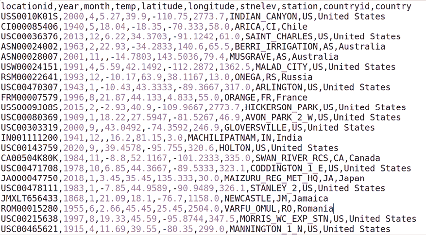
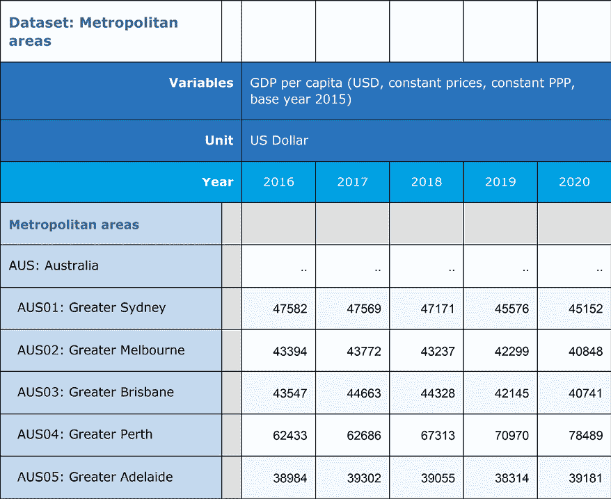
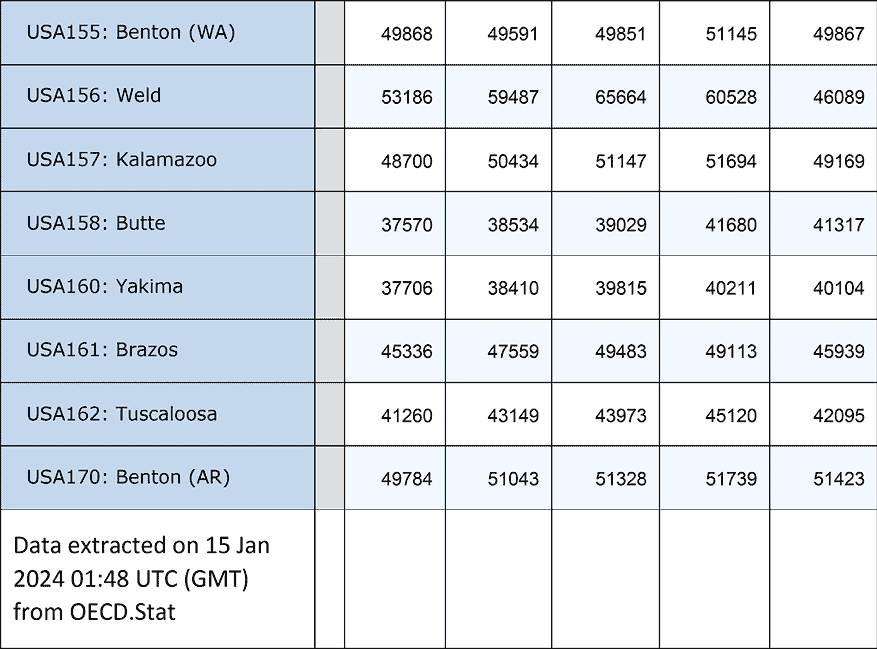

# 第一章：预见导入表格数据时的清洗问题，使用 pandas

科学版的**Python**（如 Anaconda、WinPython、Canopy 等）为分析师提供了广泛的数据处理、探索和可视化工具。其中一个重要的工具是 pandas。pandas 由 Wes McKinney 于 2008 年开发，但真正获得广泛关注是在 2012 年之后，它如今已成为 Python 数据分析中的必备库。本书中的实例展示了许多常见的数据准备任务如何通过 pandas 比其他工具更加轻松地完成。虽然我们在本书中广泛使用 pandas，但也使用了其他流行的软件包，如 Numpy、matplotlib 和 scipy。

一个关键的 pandas 对象是**DataFrame**，它将数据表示为一个表格结构，具有行和列。这样，它与我们在本章讨论的其他数据存储方式类似。然而，pandas 的 DataFrame 还具有索引功能，使得选择、合并和转换数据相对简单，正如本书中的示例所展示的那样。

在我们可以利用这个强大的功能之前，我们需要将数据导入到 pandas 中。数据以多种格式呈现给我们：作为 CSV 或 Excel 文件，从 SQL 数据库的表格中，来自统计分析软件包如 SPSS、Stata、SAS 或 R，来自非表格来源如 JSON，以及网页数据。

在本示例中，我们将介绍导入表格数据的工具。具体而言，我们将涵盖以下主题：

+   导入 CSV 文件

+   导入 Excel 文件

+   从 SQL 数据库导入数据

+   导入 SPSS、Stata 和 SAS 数据

+   导入 R 数据

+   持久化表格数据

# 技术要求

本章的代码和笔记本可以在 GitHub 上找到：[`github.com/michaelbwalker/Python-Data-Cleaning-Cookbook-Second-Edition`](https://github.com/michaelbwalker/Python-Data-Cleaning-Cookbook-Second-Edition)。你可以使用任何你选择的**IDE**（**集成开发环境**）——如 IDLE、Visual Studio、Sublime、Spyder 等——或 Jupyter Notebook 来操作本章的代码，或本书中的任何一章。关于如何开始使用 Jupyter Notebook 的好指南可以在这里找到：[`www.dataquest.io/blog/jupyter-notebook-tutorial/`](https://www.dataquest.io/blog/jupyter-notebook-tutorial/)。我使用了 Spyder IDE 编写本章的代码。

我在本章及后续章节的所有代码中使用了 pandas 2.2.1 和 NumPy 版本 1.24.3。我也在 pandas 1.5.3 上测试了所有代码。

# 导入 CSV 文件

`pandas`库的`read_csv`方法可以用来读取一个**逗号分隔值**（**CSV**）文件，并将其加载到内存中作为 pandas 的 DataFrame。在本示例中，我们导入了一个 CSV 文件，并解决了一些常见问题：创建我们能理解的列名，解析日期，以及删除含有重要缺失数据的行。

原始数据通常以 CSV 文件格式存储。这些文件在每行数据的末尾有一个回车符，用于区分每一行数据，并且数据值之间有逗号分隔。除了逗号外，也可以使用其他分隔符，比如制表符。值周围可能会有引号，尤其是当分隔符本身出现在某些值中时（比如逗号出现在值中）。

CSV 文件中的所有数据都是字符类型，无论其逻辑数据类型是什么。这就是为什么当 CSV 文件不太大的时候，很容易在文本编辑器中查看它。pandas 的`read_csv`方法会对每一列的数据类型进行推测，但你需要帮助它，以确保这些推测是准确的。

## 准备工作

为本章节创建一个文件夹，然后在该文件夹中创建一个新的 Python 脚本或**Jupyter Notebook**文件。创建一个数据子文件夹，然后将`landtempssample.csv`文件放入该子文件夹。或者，你也可以从 GitHub 仓库中获取所有文件，包括数据文件。以下是 CSV 文件开头的截图：



图 1.1：陆地温度数据

**数据说明**

该数据集来自全球历史气候网络（Global Historical Climatology Network）集成数据库，由美国国家海洋和大气管理局（NOAA）在[`www.ncei.noaa.gov/products/land-based-station/global-historical-climatology-network-monthly`](https://www.ncei.noaa.gov/products/land-based-station/global-historical-climatology-network-monthly)提供公开使用。我使用的是第 4 版的数据。本食谱中的数据使用了完整数据集中的 100,000 行样本，完整数据集也可以在仓库中找到。

## 如何操作…

我们将把 CSV 文件导入到 pandas 中，利用一些非常有用的`read_csv`选项：

1.  导入`pandas`库，并设置环境以便更方便地查看输出：

    ```py
    import pandas as pd
    pd.options.display.float_format = '{:,.2f}'.format
    pd.set_option('display.width', 85)
    pd.set_option('display.max_columns', 8) 
    ```

1.  读取数据文件，设置新的标题名称，并解析日期列。

将参数`1`传递给`skiprows`参数，以跳过第一行，将列的列表传递给`parse_dates`，以便从这些列创建一个 pandas 日期时间列，并将`low_memory`设置为`False`。这样，pandas 会一次性将所有数据加载到内存中，而不是分块加载。我们这样做是为了让 pandas 自动识别每一列的数据类型。在*更多内容…*部分，我们会看到如何手动设置每列的数据类型：

```py
landtemps = pd.read_csv('data/landtempssample.csv',
...     names=['stationid','year','month','avgtemp','latitude',
...       'longitude','elevation','station','countryid','country'],
...     skiprows=1,
...     parse_dates=[['month','year']],
...     low_memory=False)
type(landtemps) 
```

```py
<class 'pandas.core.frame.DataFrame'> 
```

**备注**

我们必须使用`skiprows`，因为我们正在将列名列表传递给`read_csv`。如果我们使用 CSV 文件中的列名，则不需要为`names`或`skiprows`指定值。

1.  快速浏览一下数据。

查看前几行。显示所有列的数据类型，以及行和列的数量：

```py
landtemps.head(7) 
```

```py
 month_year    stationid  ...  countryid              country
0 2000-04-01  USS0010K01S  ...         US        United States
1 1940-05-01  CI000085406  ...         CI                Chile
2 2013-12-01  USC00036376  ...         US        United States
3 1963-02-01  ASN00024002  ...         AS            Australia
4 2001-11-01  ASN00028007  ...         AS            Australia
5 1991-04-01  USW00024151  ...         US        United States
6 1993-12-01  RSM00022641  ...         RS               Russia
[7 rows x 9 columns] 
```

```py
landtemps.dtypes 
```

```py
month_year       datetime64[ns]
stationed        object
avgtemp          float64
latitude         float64
longitude        float64
elevation        float64
station          object
countryid        object
country          object
dtype: object 
```

```py
landtemps.shape 
```

```py
(100000, 9) 
```

1.  给日期列起个更合适的名字，并查看平均月温的总结统计：

    ```py
    landtemps.rename(columns={'month_year':'measuredate'}, inplace=True)
    landtemps.dtypes 
    ```

    ```py
    measuredate      datetime64[ns]
    stationid        object
    avgtemp          float64
    latitude         float64
    longitude        float64
    elevation        float64
    station          object
    countryid        object
    country          object
    dtype:           object 
    ```

    ```py
    landtemps.avgtemp.describe() 
    ```

    ```py
    count   85,554.00
    mean    10.92
    std     11.52
    min     -70.70
    25%     3.46
    50%     12.22
    75%     19.57
    max     39.95
    Name: avgtemp, dtype: float64 
    ```

1.  查找每列的缺失值。

使用`isnull`，它会对每一列的缺失值返回`True`，对非缺失值返回`False`。将其与`sum`链式调用来计算每列的缺失值数量。（在处理布尔值时，`sum`将`True`视为`1`，将`False`视为`0`。我将在*后续内容...*部分讨论方法链式调用）：

```py
landtemps.isnull().sum() 
```

```py
measuredate    0
stationed      0
avgtemp        14446
latitude       0
longitude      0
elevation      0
station        0
countryid      0
country        5
dtype: int64 
```

1.  删除缺失`avgtemp`数据的行。

使用`subset`参数告诉`dropna`在`avgtemp`缺失时删除行。将`inplace`设置为`True`。如果将`inplace`保持在默认值`False`，则会显示 DataFrame，但我们所做的更改不会被保留。使用 DataFrame 的`shape`属性获取行数和列数：

```py
landtemps.dropna(subset=['avgtemp'], inplace=True)
landtemps.shape 
```

```py
(85554, 9) 
```

就是这样！将 CSV 文件导入 pandas 就是这么简单。

## 它是如何工作的……

本书中的几乎所有食谱都使用`pandas`库。为了方便后续引用，我们将其称为`pd`。这是惯例。我们还使用`float_format`以可读的方式显示浮动值，并使用`set_option`使终端输出足够宽，以容纳所需的变量数量。

大部分工作由*第 2 步*中的第一行完成。我们使用`read_csv`加载一个 pandas DataFrame 到内存中，并将其命名为`landtemps`。除了传递文件名外，我们将`names`参数设置为我们首选的列标题列表。我们还告诉`read_csv`跳过第一行，通过将`skiprows`设置为 1，因为 CSV 文件的第一行包含了原始列标题。如果不告诉它跳过第一行，`read_csv`会将文件中的标题行当作实际数据来处理。

`read_csv`还为我们解决了日期转换问题。我们使用`parse_dates`参数要求它将`month`和`year`列转换为日期值。

*第 3 步*进行了一些标准的数据检查。我们使用`head(7)`打印出前七行的所有列。我们使用 DataFrame 的`dtypes`属性显示所有列的数据类型。每列都具有预期的数据类型。在 pandas 中，字符数据具有对象数据类型，这是一个允许混合值的数据类型。`shape`返回一个元组，其第一个元素是 DataFrame 的行数（此例中为 100,000），第二个元素是列数（9）。

当我们使用`read_csv`解析`month`和`year`列时，它会将结果列命名为`month_year`。我们在*第 4 步*中使用`rename`方法为该列命名了更合适的名称。我们需要指定`inplace=True`，以便在内存中将旧列名替换为新列名。`describe`方法提供了`avgtemp`列的汇总统计信息。

注意，`avgtemp`的计数显示有 85,554 行具有有效的`avgtemp`值。这是在整个 DataFrame 的 100,000 行中，`shape`属性提供了这个信息。*第 5 步*中的缺失值列表（`landtemps.isnull().sum()`）确认了这一点：*100,000 – 85,554 = 14,446*。

*第 6 步*删除所有`avgtemp`值为`NaN`的行。(`NaN`值，即非数字，是 pandas 表示缺失值的方式。）`subset`用于指定检查缺失值的列。此时，`landtemps`的`shape`属性显示共有 85,554 行，这与通过`describe`获取的前一次计数一致。

## 还有更多...

如果你读取的文件使用的是除逗号外的其他分隔符，例如制表符，可以在`read_csv`的`sep`参数中指定。当创建 pandas DataFrame 时，还会创建一个索引。在运行`head`时，输出最左侧的数字即为索引值。`head`可以指定任意数量的行，默认值是`5`。

与其将`low_memory`设置为`False`，为了让 pandas 更好地猜测数据类型，我们可以手动设置数据类型：

```py
landtemps = pd.read_csv('data/landtempssample.csv',
    names=['stationid','year','month','avgtemp','latitude',
      'longitude','elevation','station','countryid','country'],
    skiprows=1,
    parse_dates=[['month','year']],
    dtype={'stationid':'object', 'avgtemp':'float64',
     'latitude':'float64','longitude':'float64',
     'elevation':'float64','station':'object',
     'countryid':'object','country':'object'},
    )
landtemps.info() 
```

```py
<class 'pandas.core.frame.DataFrame'>
RangeIndex: 100000 entries, 0 to 99999
Data columns (total 9 columns):
 #   Column      Non-Null Count   Dtype       
---  ------      --------------   -----       
 0   month_year  100000 non-null  datetime64[ns]
 1   stationid   100000 non-null  object      
 2   avgtemp     85554 non-null   float64     
 3   latitude    100000 non-null  float64     
 4   longitude   100000 non-null  float64     
 5   elevation   100000 non-null  float64     
 6   station     100000 non-null  object      
 7   countryid   100000 non-null  object      
 8   country     99995 non-null   object      
dtypes: datetime64ns, float64(4), object(4)
memory usage: 6.9+ MB 
```

`landtemps.isnull().sum()`语句是方法链的一个例子。首先，`isnull`返回一个`True`和`False`值组成的 DataFrame，表示测试每一列值是否为`null`。`sum`函数对这个 DataFrame 进行求和，计算每列中`True`值的数量，`True`值按`1`计，`False`值按`0`计。如果我们使用以下两步操作，也能得到相同的结果：

```py
checknull = landtemps.isnull()
checknull.sum() 
```

什么时候链式调用方法，什么时候不调用，并没有硬性规定。我发现，当整体操作看起来像是一个单一步骤时，即使它实际上是两个或多个步骤，从机械角度来看，链式调用是有帮助的。链式调用还有一个附带的好处，就是不会创建我可能不需要的额外对象。

本食谱中使用的数据集仅为完整的土地温度数据库的一个样本，包含近 1700 万条记录。如果你的机器能够处理的话，可以运行更大的文件，使用以下代码：

```py
landtemps = pd.read_csv('data/landtemps.zip',
...   compression='zip', names=['stationid','year',
...     'month','avgtemp','latitude','longitude',
...     'elevation','station','countryid','country'],
...     skiprows=1,
...     parse_dates=[['month','year']],
...     low_memory=False) 
```

`read_csv`可以读取压缩的 ZIP 文件。我们通过传递 ZIP 文件的名称和压缩类型来实现这一功能。

## 另见

本章以及其他章节的后续食谱设置了索引，以提高行和合并操作的导航效率。

在使用全球历史气候网络原始数据之前，进行了大量的数据重塑。我们在*第十一章*，*整理和重塑数据*中展示了这一过程。

# 导入 Excel 文件

`pandas`库的`read_excel`方法可以用来从 Excel 文件中导入数据，并将其加载到内存中作为 pandas DataFrame。在本食谱中，我们导入一个 Excel 文件，并处理一些常见问题，如多余的页眉和页脚信息、选择特定的列、删除没有数据的行以及连接到特定的工作表。

尽管 Excel 的表格结构鼓励将数据组织成行和列，但电子表格并不是数据集，且不要求人们以这种方式存储数据。即使某些数据符合这些期望，通常在数据导入前后，行或列中还有其他信息。数据类型并不总是像创建电子表格的人所理解的那样清晰。这对于任何曾经与导入前导零作斗争的人来说，都是再熟悉不过的了。此外，Excel 并不要求某一列中的所有数据类型相同，也不要求列标题适合用于像 Python 这样的编程语言。

幸运的是，`read_excel` 提供了多个选项，用于处理 Excel 数据中的杂乱问题。这些选项使得跳过行、选择特定列以及从特定工作表或多个工作表中提取数据变得相对简单。

## 准备工作

您可以从本书的 GitHub 仓库下载 `GDPpercapita22b.xlsx` 文件，以及此配方的代码。代码假设 Excel 文件位于数据子文件夹中。以下是文件开头的视图（出于显示目的，某些列被隐藏）：



图 1.2：数据集视图

这里是文件末尾的视图：



图 1.3：数据集视图

**数据注释**

该数据集来自经济合作与发展组织（OECD），可在 [`stats.oecd.org/`](https://stats.oecd.org/) 上公开获取。

## 如何操作…

我们将一个 Excel 文件导入 pandas 并进行一些初步的数据清理：

1.  导入 `pandas` 库：

    ```py
    import pandas as pd 
    ```

1.  阅读 Excel 人均 GDP 数据。

选择包含我们所需数据的工作表，但跳过我们不需要的列和行。使用 `sheet_name` 参数指定工作表。将 `skiprows` 设置为 `4`，将 `skipfooter` 设置为 `1`，以跳过前四行（第一行被隐藏）和最后一行。我们为 `usecols` 提供值，从列 `A` 和列 `C` 到列 `W` 获取数据（列 `B` 是空白的）。使用 `head` 查看前几行，使用 `shape` 获取行数和列数：

```py
percapitaGDP = pd.read_excel("data/GDPpercapita22b.xlsx",
...    sheet_name="OECD.Stat export",
...    skiprows=4,
...    skipfooter=1,
...    usecols="A,C:W")
percapitaGDP.head() 
```

```py
 Year	2000	...	2019	2020
0	Metropolitan areas	       ...	NaN 	...	NaN	NaN
1	AUS: Australia	..	       ...	...  	...	...	...
2	AUS01: Greater Sydney	       ...	... 	... 	45576	45152
3	AUS02: Greater Melbourne     ...	... 	... 	42299	40848
4	AUS03: Greater Brisbane      ...	... 	... 	42145	40741
[5 rows x 22 columns] 
```

```py
percapitaGDP.shape 
```

```py
(731, 22) 
```

**注意**

如果 Excel 文件没有使用 utf-8 编码，您可能会遇到 `read_excel` 的问题。一种解决方法是将 Excel 文件另存为 CSV 文件，重新打开并保存为 utf-8 编码格式。

1.  使用 DataFrame 的 `info` 方法查看数据类型和 `non-null` 数量。注意所有列的数据类型都是 `object`：

    ```py
    percapitaGDP.info() 
    ```

    ```py
    <class 'pandas.core.frame.DataFrame'>
    RangeIndex: 731 entries, 0 to 730
    Data columns (total 22 columns):
     #   Column  Non-Null Count  Dtype
    ---  ------  --------------  -----
     0   Year    731 non-null    object
     1   2000    730 non-null    object
     2   2001    730 non-null    object
     3   2002    730 non-null    object
     4   2003    730 non-null    object
     5   2004    730 non-null    object
     6   2005    730 non-null    object
     7   2006    730 non-null    object
     8   2007    730 non-null    object
     9   2008    730 non-null    object
     10  2009    730 non-null    object
     11  2010    730 non-null    object
     12  2011    730 non-null    object
     13  2012    730 non-null    object
     14  2013    730 non-null    object
     15  2014    730 non-null    object
     16  2015    730 non-null    object
     17  2016    730 non-null    object
     18  2017    730 non-null    object
     19  2018    730 non-null    object
     20  2019    730 non-null    object
     21  2020    730 non-null    object
    dtypes: object(22)
    memory usage: 125.8+ KB 
    ```

1.  将 `Year` 列重命名为 `metro`，并去除前导空格。

给大都市区域列起一个合适的名称。在某些情况下，大都市值前面有额外的空格。我们可以使用 `startswith(' ')` 测试是否有前导空格，然后使用 `any` 来检查是否有一个或多个前导空格的情况。我们可以使用 `endswith(' ')` 来检查尾随空格。我们使用 `strip` 去除前后空格。再次测试尾随空格时，我们看到没有：

```py
percapitaGDP.rename(columns={'Year':'metro'}, inplace=True)
percapitaGDP.metro.str.startswith(' ').any() 
```

```py
True 
```

```py
percapitaGDP.metro.str.endswith(' ').any() 
```

```py
False 
```

```py
percapitaGDP.metro = percapitaGDP.metro.str.strip()
percapitaGDP.metro.str.startswith(' ').any() 
```

```py
False 
```

1.  将数据列转换为数值型。

遍历所有 GDP 年度列（2000–2020），并将数据类型从 `object` 转换为 `float`。即使存在字符数据（例如这个例子中的 `..`），也要强制转换。我们希望这些列中的字符值变为 `missing`，这正是发生的情况。将年份列重命名为更能反映列中数据的名称：

```py
for col in percapitaGDP.columns[1:]:
...   percapitaGDP[col] = pd.to_numeric(percapitaGDP[col],
...     errors='coerce')
...   percapitaGDP.rename(columns={col:'pcGDP'+col},
...     inplace=True)
...
percapitaGDP.head() 
```

```py
 metro  pcGDP2000  pcGDP2001  ...  \
0        Metropolitan areas        NaN        NaN  ... 
1            AUS: Australia        NaN        NaN  ... 
2     AUS01: Greater Sydney        NaN      41091  ... 
3  AUS02: Greater Melbourne        NaN      40488  ... 
4   AUS03: Greater Brisbane        NaN      35276  ... 
   pcGDP2018  pcGDP2019  pcGDP2020
0        NaN        NaN        NaN
1        NaN        NaN        NaN
2      47171      45576      45152
3      43237      42299      40848
4      44328      42145      40741
[5 rows x 22 columns] 
```

```py
percapitaGDP.dtypes 
```

```py
metro          object
pcGDP2000      float64
pcGDP2001      float64
abbreviated to save space
pcGDP2019      float64
pcGDP2020      float64
dtype: object 
```

1.  使用 `describe` 方法生成 DataFrame 中所有数值数据的摘要统计信息：

    ```py
    percapitaGDP.describe() 
    ```

    ```py
     pcGDP2000  pcGDP2001  pcGDP2002  ...  pcGDP2018  \
    count        158        450        479  ...        692 
    mean       33961      38874      39621  ...      41667 
    std        15155      13194      13061  ...      17440 
    min         2686       7805       7065  ...       5530 
    25%        21523      30790      31064  ...      31322 
    50%        35836      38078      39246  ...      41428 
    75%        42804      46576      47874  ...      51130 
    max        95221      96941      98929  ...     147760 
           pcGDP2019  pcGDP2020
    count        596        425
    mean       42709      39792
    std        18893      19230
    min         5698       5508
    25%        29760      24142
    50%        43505      41047
    75%        53647      51130
    max       146094     131082
    [8 rows x 21 columns] 
    ```

1.  删除所有人均 GDP 值缺失的行。

使用 `dropna` 的 `subset` 参数检查所有列，从第二列（基于零索引）开始，到最后一列。使用 `how` 参数指定只有当 `subset` 中所有列的值都缺失时才删除行。使用 `shape` 来显示结果 DataFrame 中的行数和列数：

```py
percapitaGDP.dropna(subset=percapitaGDP.columns[1:], how="all", inplace=True)
percapitaGDP.shape 
```

```py
(692, 22) 
```

1.  使用大都市区域列设置 DataFrame 的索引。

确认 `metro` 有 692 个有效值，并且这 692 个值是唯一的，然后再设置索引：

```py
percapitaGDP.metro.count() 
```

```py
692 
```

```py
percapitaGDP.metro.nunique() 
```

```py
692 
```

```py
percapitaGDP.set_index('metro', inplace=True)
percapitaGDP.head() 
```

```py
 pcGDP2000  pcGDP2001  ...  \
metro                                           ... 
AUS01: Greater Sydney           NaN      41091  ... 
AUS02: Greater Melbourne        NaN      40488  ... 
AUS03: Greater Brisbane         NaN      35276  ... 
AUS04: Greater Perth            NaN      43355  ... 
AUS05: Greater Adelaide         NaN      36081  ... 
                          pcGDP2019  pcGDP2020
metro                                         
AUS01: Greater Sydney         45576      45152
AUS02: Greater Melbourne      42299      40848
AUS03: Greater Brisbane       42145      40741
AUS04: Greater Perth          70970      78489
AUS05: Greater Adelaide       38314      39181
[5 rows x 21 columns]
percapitaGDP.loc['AUS02: Greater Melbourne']
pcGDP2000     NaN
pcGDP2001   40488
...
pcGDP2019   42299
pcGDP2020   40848
Name: AUS02: Greater Melbourne, dtype: float64 
```

我们现在已经将 Excel 数据导入到 pandas DataFrame 中，并清理了一些电子表格中的杂乱数据。

## 它是如何工作的…

我们在 *步骤 2* 中通过跳过不需要的行和列，基本上获得了我们想要的数据，但仍然存在一些问题——`read_excel` 将所有的 GDP 数据解释为字符数据，许多行加载了无用的数据，而且列名未能很好地表示数据。此外，大都市区域列可能作为索引很有用，但存在前后空格，并且可能存在缺失或重复的值。

`read_excel` 将 `Year` 解释为大都市区域数据的列名，因为它查找该 Excel 列数据上方的标题，并发现了 `Year`。我们在 *步骤 4* 中将该列重命名为 `metro`。我们还使用 `strip` 修复了前后空格问题。我们本来也可以只使用 `lstrip` 去除前导空格，或者如果有尾随空格，使用 `rstrip`。假设任何字符数据可能存在前导或尾随空格，并在初次导入后立即清理数据是一个好习惯。

电子表格作者使用 `..` 表示缺失数据。由于这实际上是有效的字符数据，这些列获得了对象数据类型（这是 pandas 处理具有字符或混合数据的列的方式）。我们在*第 5 步*强制转换为数值类型。这也导致将 `..` 的原始值替换为 `NaN`（不是一个数字），这是 pandas 表示数字缺失值的方式。这正是我们想要的。

使用 pandas 能够仅通过几行代码修复所有人均 GDP 列，因为 pandas 提供了对 DataFrame 列进行迭代的简便方法。通过指定 `[1:]`，我们从第二列迭代到最后一列。然后，我们可以将这些列更改为数值类型，并重命名为更合适的名称。

有几个原因值得考虑清理年度 GDP 列标题 – 这帮助我们记住数据的实际内容; 如果我们按都会区域与其他数据合并，我们将不必担心冲突的变量名称; 我们可以使用属性访问来处理基于这些列的 pandas Series，我将在本配方的*还有更多…*部分详细讨论。

*第 6 步*中的 `describe` 显示我们有少于 500 行有效数据的人均 GDP 的一些年份。当我们在*第 7 步*中删除所有人均 GDP 列中缺失值的所有行时，我们最终得到 DataFrame 中的 692 行。

## 还有更多…

一旦我们有了 pandas DataFrame，我们可以将列视为不仅仅是列。我们可以使用属性访问（例如 `percapitaGPA.metro`）或括号表示法（`percapitaGPA['metro']`）来获取 pandas Series 的功能。任何一种方法都可以使用 Series 的字符串检查方法，如 `str.startswith`，以及计数方法，如 `nunique`。请注意，`20##` 的原始列名不允许属性访问，因为它们以数字开头，所以 `percapitaGDP.pcGDP2001.count()` 可以工作，但 `percapitaGDP.2001.count()` 返回语法错误，因为 `2001` 不是有效的 Python 标识符（因为它以数字开头）。

pandas 提供了丰富的字符串操作和 Series 操作功能。我们将在后续的示例中尝试其中许多功能。本示例展示了在导入 Excel 数据时我认为最有用的功能。

## 另请参阅

有很多理由考虑重塑这些数据。与每个都会区域的 21 列人均 GDP 数据相比，我们应该为每个都会区域有 21 行数据，年份和人均 GDP 数据的列。有关重塑数据的配方可以在*第十一章*，*整理和重塑数据*中找到。

# 从 SQL 数据库导入数据

在本教程中，我们将使用`pymssql`和`mysql apis`从**Microsoft SQL Server**和**MySQL**（现在由**Oracle**拥有）数据库中读取数据。像这些来源的数据通常结构良好，因为它们旨在促进组织成员及与之互动的人员的同时交易。每一笔交易也可能与其他组织交易相关联。

这意味着，尽管来自企业系统的数据表比 CSV 文件和 Excel 文件中的数据结构更加可靠，但它们的逻辑较少是自包含的。你需要了解一个表中的数据与另一个表中的数据如何关联，才能理解其完整含义。在提取数据时，必须保留这些关系，包括主键和外键的完整性。此外，结构良好的数据表不一定是简单的数据表。往往存在复杂的编码方案来确定数据值，这些编码方案可能会随着时间的推移而发生变化。例如，零售商店连锁的商品代码可能在 1998 年与 2024 年有所不同。同样，经常会有缺失值的代码，如 99,999，pandas 会将其识别为有效值。

由于其中许多逻辑是业务逻辑，并且在存储过程或其他应用程序中实现，因此当数据从这一更大的系统中提取出来时，这些逻辑会丢失。在为分析准备数据时，丢失的部分最终需要被重建。这几乎总是涉及到将多个表中的数据合并，因此保留这种能力非常重要。然而，它也可能涉及在将 SQL 表加载到 pandas DataFrame 后，将一些编码逻辑重新加入。我们将在本教程中探讨如何做到这一点。

## 准备工作

本教程假设你已经安装了`pymssql`和`mysql apis`。如果没有，可以通过`pip`轻松安装。在终端或`powershell`（在 Windows 中）中输入`pip install pymssql`或`pip install mysql-connector-python`。我们将在本教程中使用有关教育水平的数据。

**数据说明**

本教程使用的数据集可以通过[`archive.ics.uci.edu/ml/machine-learning-databases/00320/student.zip`](https://archive.ics.uci.edu/ml/machine-learning-databases/00320/student.zip)公开下载。

## 如何操作...

我们将 SQL Server 和 MySQL 的数据表导入到 pandas DataFrame 中，如下所示：

1.  导入`pandas`、`numpy`、`pymssql`和`mysql`。

此步骤假设你已经安装了`pymssql`和`mysql apis`：

```py
import pandas as pd
import numpy as np
import pymssql
import mysql.connector 
```

1.  使用`pymssql api`和`read_sql`从 SQL Server 实例中检索并加载数据。

从 SQL Server 数据中选择我们需要的列，使用 SQL 别名改善列名（例如，`fedu AS fathereducation`）。通过将数据库凭证传递给 `pymssql` 的 `connect` 函数，建立与 SQL Server 数据的连接。通过将 `SELECT` 语句和连接对象传递给 `read_sql` 创建 pandas DataFrame。使用 `close` 将连接返回到服务器上的连接池：

```py
sqlselect = "SELECT studentid, school, sex, age, famsize,\
...   medu AS mothereducation, fedu AS fathereducation,\
...   traveltime, studytime, failures, famrel, freetime,\
...   goout, g1 AS gradeperiod1, g2 AS gradeperiod2,\
...   g3 AS gradeperiod3 From studentmath"
server = "pdcc.c9sqqzd5fulv.us-west-2.rds.amazonaws.com"
user = "pdccuser"
password = "pdccpass"
database = "pdcctest"
conn = pymssql.connect(server=server,
...   user=user, password=password, database=database)
studentmath = pd.read_sql(sqlselect,conn)
conn.close() 
```

**注意**

尽管像 `pymssql` 这样的工具使得连接到 SQL Server 实例相对简单，但如果不熟悉，语法可能还是需要一些时间适应。前一步展示了你通常需要传递给连接对象的参数值——服务器名称、具有凭证的用户名称、该用户的密码，以及服务器上 SQL 数据库的名称。

1.  检查数据类型和前几行：

    ```py
    studentmath.dtypes 
    ```

    ```py
    studentid          object
    school             object
    sex                object
    age                int64
    famsize            object
    mothereducation    int64
    fathereducation    int64
    traveltime         int64
    studytime          int64
    failures           int64
    famrel             int64
    freetime           int64
    gout               int64
    gradeperiod1       int64
    gradeperiod2       int64
    gradeperiod3       int64
    dtype: object 
    ```

    ```py
    studentmath.head() 
    ```

    ```py
     studentid    school  ...      gradeperiod2    gradeperiod3
    0	001	    GP      ...	6	        6
    1	002	    GP      ...	5	        6
    2	003	    GP      ...	8	        10
    3	004	    GP      ...	14	        15
    4	005	    GP      ...	10	        10
    [5 rows x 16 columns] 
    ```

1.  连接到 MySQL 服务器与连接到 SQL Server 实例没有太大不同。我们可以使用 `mysql` 连接器的 `connect` 方法来完成此操作，然后使用 `read_sql` 加载数据。

创建与 `mysql` 数据的连接，将该连接传递给 `read_sql` 以检索数据，并将其加载到 pandas DataFrame 中（相同的学生数学成绩数据文件已经上传到 SQL Server 和 MySQL，因此我们可以使用与上一步骤相同的 SQL `SELECT` 语句）：

```py
host = "pdccmysql.c9sqqzd5fulv.us-west-2.rds.amazonaws.com"
user = "pdccuser"
password = "pdccpass"
database = "pdccschema"
connmysql = mysql.connector.connect(host=host, \
...   database=database,user=user,password=password)
studentmath = pd.read_sql(sqlselect,connmysql)
connmysql.close() 
```

1.  重新排列列，设置索引，并检查缺失值。

将成绩数据移到 DataFrame 的左侧，紧跟在 `studentid` 后面。同时，将 `freetime` 列移到 `traveltime` 和 `studytime` 后面。确认每行都有一个 ID 且 ID 是唯一的，并将 `studentid` 设置为索引：

```py
newcolorder = ['studentid', 'gradeperiod1',
...   'gradeperiod2','gradeperiod3', 'school',
...   'sex', 'age', 'famsize','mothereducation',
...   'fathereducation', 'traveltime',
...   'studytime', 'freetime', 'failures',
...   'famrel','goout']
studentmath = studentmath[newcolorder]
studentmath.studentid.count() 
```

```py
395 
```

```py
studentmath.studentid.nunique() 
```

```py
395 
```

```py
studentmath.set_index('studentid', inplace=True) 
```

1.  使用 DataFrame 的 `count` 函数检查缺失值：

    ```py
    studentmath.count() 
    ```

    ```py
    gradeperiod1		395
    gradeperiod2		395
    gradeperiod3		395
    school		395
    sex			395
    age			395
    famsize		395
    mothereducation	395
    fathereducation	395
    traveltime		395
    studytime		395
    freetime		395
    failures		395
    famrel		395
    goout			395
    dtype: int64 
    ```

1.  用更具信息量的值替换编码数据值。

创建一个字典，包含要替换的列的值，然后使用 `replace` 设置这些值：

```py
setvalues= \
...   {"famrel":{1:"1:very bad",2:"2:bad",
...     3:"3:neutral",4:"4:good",5:"5:excellent"},
...   "freetime":{1:"1:very low",2:"2:low",
...     3:"3:neutral",4:"4:high",5:"5:very high"},
...   "goout":{1:"1:very low",2:"2:low",3:"3:neutral",
...     4:"4:high",5:"5:very high"},
...   "mothereducation":{0:np.nan,1:"1:k-4",2:"2:5-9",
...     3:"3:secondary ed",4:"4:higher ed"},
...   "fathereducation":{0:np.nan,1:"1:k-4",2:"2:5-9",
...     3:"3:secondary ed",4:"4:higher ed"}}
studentmath.replace(setvalues, inplace=True) 
```

1.  将已更改数据的列类型改为 `category`。

检查内存使用情况的任何变化：

```py
setvalueskeys = [k for k in setvalues]
studentmath[setvalueskeys].memory_usage(index=False) 
```

```py
famrel		3160
freetime		3160
goout			3160
mothereducation	3160
fathereducation	3160
dtype: int64 
```

```py
for col in studentmath[setvalueskeys].columns:
...   studentmath[col] = studentmath[col]. \
...     astype('category')
...
studentmath[setvalueskeys].memory_usage(index=False) 
```

```py
famrel		607
freetime		607
goout			607
mothereducation	599
fathereducation	599
dtype: int64 
```

1.  计算 `famrel` 列中的值的百分比。

运行 `value_counts`，并将 `normalize` 设置为 `True` 以生成百分比：

```py
studentmath['famrel'].value_counts(sort=False, normalize=True) 
```

```py
1:very bad	0.02
2:bad		0.05
3:neutral	0.17
4:good	0.49
5:excellent	0.27
Name: famrel, dtype: float64 
```

1.  使用 `apply` 计算多个列的百分比：

    ```py
    studentmath[['freetime','goout']].\
    ...   apply(pd.Series.value_counts, sort=False,
    ...   normalize=True) 
    ```

    ```py
     freetime   goout
    1:very low	0.05	    0.06
    2:low		0.16	    0.26
    3:neutral	0.40	    0.33
    4:high	0.29	    0.22
    5:very high	0.10	    0.13 
    ```

    ```py
    studentmath[['mothereducation','fathereducation']].\
    ...   apply(pd.Series.value_counts, sort=False,
    ...   normalize=True) 
    ```

    ```py
     mothereducation	fathereducation
    1:k-4			0.15			0.21
    2:5-9			0.26			0.29
    3:secondary ed	0.25			0.25
    4:higher ed		0.33			0.24 
    ```

上述步骤从 SQL 数据库中检索了一个数据表，将数据加载到 pandas 中，并进行了初步的数据检查和清理。

## 它是如何工作的…

由于企业系统中的数据通常比 CSV 或 Excel 文件更有结构性，我们无需执行像跳过行或处理列中的不同逻辑数据类型等操作。然而，在开始探索性分析之前，通常仍然需要做一些数据处理。通常列的数量超过我们需要的，而且一些列名并不直观，或者没有以最适合分析的顺序排列。为了避免输入错误并节省存储空间，许多数据值的意义并未存储在数据表中。例如，`3`表示母亲的教育程度，而不是“中等教育”。最好在清理过程中尽早重构这种编码。

要从 SQL 数据库服务器中提取数据，我们需要一个连接对象来进行身份验证，以及一个 SQL 选择字符串。这些可以传递给`read_sql`以检索数据并加载到 pandas DataFrame 中。我通常在此时使用 SQL 的`SELECT`语句对列名进行一些清理。有时我也会重新排列列，但在这个步骤我是在稍后的操作中做的。

我们在*步骤 5*中设置了索引，首先确认每行都有`studentid`的值，并且它是唯一的。当处理企业数据时，这一点通常更为重要，因为我们几乎总是需要将获取的数据与系统中的其他数据文件合并。虽然合并时不要求必须有索引，但设置索引的习惯让我们为后续更复杂的合并操作做好了准备。这也可能提高合并的速度。

我们使用 DataFrame 的`count`函数检查缺失值，并确认没有缺失值——对于非缺失值，每一列的计数都是 395（行数）。这几乎好得令人难以置信。可能存在逻辑上缺失的值——也就是说，有效的数字却表示缺失值，比如`-1`、`0`、`9`或`99`。我们将在下一步处理中解决这个问题。

*步骤 7*展示了一个用于替换多个列数据值的有用技巧。我们创建一个字典，将每列的原始值映射到新值，然后使用`replace`运行它。为了减少新长格式值占用的存储空间，我们将这些列的数据类型转换为`category`。我们通过生成`setvalues`字典的键列表来实现这一点——`setvalueskeys = [k for k in setvalues]`生成[`famrel`、`freetime`、`goout`、`mothereducation`和`fathereducation`]。然后，我们遍历这五列，并使用`astype`方法将数据类型更改为`category`。注意，这些列的内存使用量显著减少。

最后，我们通过使用`value_counts`查看相对频率来检查新值的分配情况。我们使用`apply`，因为我们想对多个列运行`value_counts`。为了防止`value_counts`按频率排序，我们将`sort`设置为`False`。

`replace`方法也是处理逻辑缺失值的便利工具，当通过`read_sql`检索时，这些值将不被识别为缺失。对于`mothereducation`和`fathereducation`的`0`值似乎属于这种情况。我们在`setvalues`字典中通过指示`mothereducation`和`fathereducation`的`0`值应替换为`NaN`来解决这个问题。在初始导入后不久解决这类缺失值问题很重要，因为它们并不总是显而易见，而且可能会显著影响后续所有工作。

像*SPPS*、*SAS*和*R*等软件包的用户会注意到这种方法与 SPSS 和 R 中的值标签以及 SAS 中的`proc`格式的差异。在 pandas 中，我们需要更改实际数据以获得更详细的值。然而，通过为列指定`category`数据类型，我们减少了实际存储的数据量。这类似于 R 中的`factors`。

## 还有更多内容……

我将成绩数据移到了 DataFrame 的开头附近。我发现将潜在的目标或依赖变量放在最左边的列中是有帮助的，这样可以将它们保持在脑海中的最前沿。将类似的列放在一起也是有帮助的。在这个例子中，个人人口统计变量（性别和年龄）相邻，家庭变量（`mothereducation`和`fathereducation`）相邻，以及学生如何花时间（`traveltime`、`studytime`和`freetime`）。

在*Step 7*中，你本可以使用`map`而不是`replace`。在 pandas 的 19.2 版本之前，`map` 的效率显著更高。此后，效率差异已经小得多。如果你正在处理非常大的数据集，这种差异仍然足以考虑使用`map`。

## 另请参阅

在*Chapter 10*的配方中，解决数据合并时的数据问题会详细介绍数据合并的细节。我们将在*Chapter 4*中更仔细地研究变量之间的双变量和多变量关系，以及如何在本章后续的 SPSS、SAS 和 R 中使用一些相同的方法。

# 导入 SPSS、Stata 和 SAS 数据

我们将使用`pyreadstat`从三个流行的统计软件包中读取数据到 pandas 中。`pyreadstat`的主要优势在于允许数据分析师导入这些软件包的数据而不丢失元数据，例如变量和值标签。

我们收到的 SPSS、Stata 和 SAS 数据文件通常已经解决了 CSV 和 Excel 文件以及 SQL 数据库中的数据问题。通常我们不会遇到 CSV 或 Excel 文件中可能出现的无效列名、数据类型变化和不明确的缺失值，也不太会遇到 SQL 数据中常见的数据与业务逻辑脱节的问题（比如数据代码的含义）。当某人或某个组织与我们共享来自这些软件包的数据文件时，他们通常会为分类数据添加变量标签和数值标签。例如，一个假设的数据列`presentsat`可能有`总体满意度`的变量标签和`1`到`5`的数值标签，其中`1`表示完全不满意，`5`表示非常满意。

挑战在于从这些系统导入数据到 pandas 时如何保留元数据。pandas 没有与变量和数值标签完全对应的功能，并且用于导入 SAS、Stata 和 SAS 数据的内建工具会丢失元数据。在这个教程中，我们将使用`pyreadstat`加载变量和数值标签信息，并使用一些技巧将这些信息表示在 pandas 中。

## 准备工作

本教程假设你已经安装了`pyreadstat`包。如果没有安装，你可以通过`pip`来安装它。在终端或 PowerShell（Windows）中输入`pip install pyreadstat`。运行此代码需要 SPSS、Stata 和 SAS 数据文件。

我们将使用来自美国**国家纵向调查**（**NLS**）青少年数据的数据。

**数据说明**

青少年 NLS 调查由美国劳工统计局进行。该调查始于 1997 年，最初的受访者是在高中年龄时完成调查的，出生年份在 1980 至 1985 年之间。每年都有后续调查，一直到 2023 年。对于本教程，我从调查中数百个数据项中提取了 42 个变量，涵盖了成绩、就业、收入和对政府的态度。可以从数据仓库下载 SPSS、Stata 和 SAS 的独立文件。

原始的 NLS 数据可以从[`www.nlsinfo.org/investigator/pages/search`](https://www.nlsinfo.org/investigator/pages/search)下载，同时也有用于从下载中的 ASCII 数据文件创建 SPSS、Stata 或 SAS 文件的代码。

## 如何操作...

我们将从 SPSS、Stata 和 SAS 中导入数据，保留元数据，如数值标签：

1.  导入`pandas`、`numpy`和`pyreadstat`。

这一步假设你已经安装了`pyreadstat`：

```py
import pandas as pd
import numpy as np
import pyreadstat 
```

1.  获取 SPSS 数据。

将路径和文件名传递给`pyreadstat`的`read_sav`方法。显示前几行和频率分布。注意，列名和数值标签是非描述性的，并且`read_sav`返回一个 pandas DataFrame 和一个`meta`对象：

```py
nls97spss, metaspss = pyreadstat.read_sav('data/nls97.sav')
nls97spss.dtypes 
```

```py
R0000100	float64
R0536300	float64
R0536401	float64
...
U2962900	float64
U2963000	float64
Z9063900	float64
dtype: object 
```

```py
nls97spss.head() 
```

```py
 R0000100  R0536300  ...  U2963000  Z9063900
0	1	2         ...  nan       52
1	2	1         ...  6         0
2	3	2         ...  6         0
3	4	2         ...  6         4
4	5	1         ...  5         12
[5 rows x 42 columns] 
```

```py
nls97spss['R0536300'].value_counts(normalize=True) 
```

```py
1.00	0.51
2.00	0.49
Name: R0536300, dtype: float64 
```

1.  获取元数据以改进列标签和数值标签。

在我们调用`read_sav`时创建的`metaspss`对象包含了 SPSS 文件中的列标签和值标签。使用`variable_value_labels`字典将值映射到某一列（`R0536300`）的值标签。（这不会改变数据，仅在运行`value_counts`时改进显示。）使用`set_value_labels`方法将值标签实际应用于 DataFrame：

```py
metaspss.variable_value_labels['R0536300'] 
```

```py
{0.0: 'No Information', 1.0: 'Male', 2.0: 'Female'} 
```

```py
nls97spss['R0536300'].\
...   map(metaspss.variable_value_labels['R0536300']).\
...   value_counts(normalize=True) 
```

```py
Male		0.51
Female	0.49
Name: R0536300, dtype: float64 
```

```py
nls97spss = pyreadstat.set_value_labels(nls97spss, metaspss, formats_as_category=True) 
```

1.  使用元数据中的列标签来重命名列。

要在我们的 DataFrame 中使用`metaspss`中的列标签，我们只需将`metaspss`中的列标签分配给 DataFrame 的列名。稍微清理一下列名，将其转换为小写字母，将空格替换为下划线，并删除所有剩余的非字母数字字符：

```py
nls97spss.columns = metaspss.column_labels
nls97spss['KEY!SEX (SYMBOL) 1997'].value_counts(normalize=True) 
```

```py
Male		0.51
Female	0.49
Name: KEY!SEX (SYMBOL) 1997, dtype: float64 
```

```py
nls97spss.dtypes 
```

```py
PUBID - YTH ID CODE 		1997	float64
KEY!SEX (SYMBOL) 			1997	category
KEY!BDATE M/Y (SYMBOL)		1997	float64
KEY!BDATE M/Y (SYMBOL) 		1997	float64
CV_SAMPLE_TYPE 			1997	category
KEY!RACE_ETHNICITY (SYMBOL) 	1997	category
"... abbreviated to save space"
HRS/WK R WATCHES TELEVISION 	2017	category
HRS/NIGHT R SLEEPS 		 	2017	float64
CVC_WKSWK_YR_ALL L99			float64
dtype: object 
```

```py
nls97spss.columns = nls97spss.columns.\
...     str.lower().\
...     str.replace(' ','_').\
...     str.replace('[^a-z0-9_]', '', regex=True)
nls97spss.set_index('pubid__yth_id_code_1997', inplace=True) 
```

1.  通过从一开始就应用值标签来简化这个过程。

实际上，在初始调用`read_sav`时，就可以通过设置`apply_value_formats`为`True`来应用数据值。这消除了稍后调用`set_value_labels`函数的需求：

```py
nls97spss, metaspss = pyreadstat.read_sav('data/nls97.sav', apply_value_formats=True, formats_as_category=True)
nls97spss.columns = metaspss.column_labels
nls97spss.columns = nls97spss.columns.\
...   str.lower().\
...   str.replace(' ','_').\
...   str.replace('[^a-z0-9_]', '', regex=True) 
```

1.  显示列和几行数据：

    ```py
    nls97spss.dtypes 
    ```

    ```py
    pubid__yth_id_code_1997	float64
    keysex_symbol_1997		category
    keybdate_my_symbol_1997	float64
    keybdate_my_symbol_1997	float64
    hrsnight_r_sleeps_2017	float64
    cvc_wkswk_yr_all_l99	float64
    dtype: object 
    ```

    ```py
    nls97spss.head() 
    ```

    ```py
     pubid__yth_id_code_1997 keysex_symbol_1997  ...  \
    0	1	Female  ... 
    1	2	Male  ... 
    2	3	Female  ... 
    3	4	Female  ... 
    4	5	Male  ... 
       hrsnight_r_sleeps_2017  cvc_wkswk_yr_all_l99
    0	nan	52
    1	6	0
    2	6	0
    3	6	4
    4	5	12
    [5 rows x 42 columns] 
    ```

1.  对某一列运行频率，并设置索引：

    ```py
    nls97spss.govt_responsibility__provide_jobs_2006.\
    ...   value_counts(sort=False) 
    ```

    ```py
    Definitely should be	454
    Definitely should not be	300
    Probably should be		617
    Probably should not be	462
    Name: govt_responsibility__provide_jobs_2006, dtype: int64 
    ```

    ```py
    nls97spss.set_index('pubid__yth_id_code_1997', inplace=True) 
    ```

1.  这展示了如何将 SPSS 数据转换。现在我们尝试使用 Stata 数据。

1.  导入 Stata 数据，应用值标签，并改进列标题。

对 Stata 数据使用与 SPSS 数据相同的方法：

```py
nls97stata, metastata = pyreadstat.read_dta('data/nls97.dta', apply_value_formats=True, formats_as_category=True)
nls97stata.columns = metastata.column_labels
nls97stata.columns = nls97stata.columns.\
...     str.lower().\
...     str.replace(' ','_').\
...     str.replace('[^a-z0-9_]', '', regex=True)
nls97stata.dtypes 
```

```py
pubid__yth_id_code_1997	float64
keysex_symbol_1997		category
keybdate_my_symbol_1997	float64
keybdate_my_symbol_1997	float64
hrsnight_r_sleeps_2017	float64
cvc_wkswk_yr_all_l99	float64
dtype: object 
```

1.  查看几行数据并运行频率：

    ```py
    nls97stata.head() 
    ```

    ```py
     pubid__yth_id_code_1997    keysex_symbol_1997  ...  \
    0                        1                Female  ... 
    1                        2                  Male  ... 
    2                        3                Female  ... 
    3                        4                Female  ... 
    4                        5                  Male  ... 
       hrsnight_r_sleeps_2017    cvc_wkswk_yr_all_l99
    0                      -5                      52
    1                       6                       0
    2                       6                       0
    3                       6                       4
    4                       5                      12
    [5 rows x 42 columns] 
    ```

    ```py
    nls97stata.govt_responsibility__provide_jobs_2006.\
    ...   value_counts(sort=False) 
    ```

    ```py
    -5.0	1425
    -4.0	5665
    -2.0	56
    -1.0	5
    Definitely should be	454
    Definitely should not be	300
    Probably should be		617
    Probably should not be	462
    Name: govt_responsibility__provide_jobs_2006, dtype: int64 
    ```

1.  修复 Stata 数据中出现的逻辑缺失值，并设置索引。我们可以使用`replace`方法将任何列中介于`–9`和`–1`之间的值设置为缺失值：

    ```py
    nls97stata.min(numeric_only=True) 
    ```

    ```py
    pubid__yth_id_code_1997          1
    keybdate_my_symbol_1997          1
    keybdate_my_symbol_1997      1,980
    trans_sat_verbal_hstr           -4
    trans_sat_math_hstr             -4
    trans_crd_gpa_overall_hstr      -9
    trans_crd_gpa_eng_hstr          -9
    trans_crd_gpa_math_hstr         -9
    trans_crd_gpa_lp_sci_hstr       -9
    cv_ba_credits_l1_2011           -5
    cv_bio_child_hh_2017            -5
    cv_bio_child_nr_2017            -5
    hrsnight_r_sleeps_2017          -5
    cvc_wkswk_yr_all_l99            -4
    dtype: float64 
    ```

    ```py
    nls97stata.replace(list(range(-9,0)), np.nan, inplace=True)
    nls97stata.min(numeric_only=True) 
    ```

    ```py
    pubid__yth_id_code_1997          1
    keybdate_my_symbol_1997          1
    keybdate_my_symbol_1997      1,980
    trans_sat_verbal_hstr           14
    trans_sat_math_hstr              7
    trans_crd_gpa_overall_hstr      10
    trans_crd_gpa_eng_hstr           0
    trans_crd_gpa_math_hstr          0
    trans_crd_gpa_lp_sci_hstr        0
    cv_ba_credits_l1_2011            0
    cv_bio_child_hh_2017             0
    cv_bio_child_nr_2017             0
    hrsnight_r_sleeps_2017           0
    cvc_wkswk_yr_all_l99             0
    dtype: float64 
    ```

    ```py
    nls97stata.set_index('pubid__yth_id_code_1997', inplace=True) 
    ```

当处理 SAS 数据文件时，流程与接下来的几个步骤类似。

1.  使用 SAS 目录文件来检索 SAS 数据的值标签：

SAS 的数据值存储在目录文件中。设置目录文件路径和文件名可以检索值标签并应用它们：

```py
nls97sas, metasas = pyreadstat.read_sas7bdat('data/nls97.sas7bdat', catalog_file='data/nlsformats3.sas7bcat', formats_as_category=True)
nls97sas.columns = metasas.column_labels
nls97sas.columns = nls97sas.columns.\
...     str.lower().\
...     str.replace(' ','_').\
...     str.replace('[^a-z0-9_]', '', regex=True)
nls97sas.head() 
```

```py
 pubid__yth_id_code_1997   keysex_symbol_1997    ...  \
0			     1		       Female    ... 
1			     2		         Male    ... 
2			     3		       Female    ... 
3			     4		       Female    ... 
4			     5		         Male    ... 
   hrsnight_r_sleeps_2017  cvc_wkswk_yr_all_l99
0			  nan			   52
1			    6			    0
2			    6			    0
3			    6			    4
4			    5			   12
[5 rows x 42 columns] 
```

```py
nls97sas.keysex_symbol_1997.value_counts() 
```

```py
Male		4599
Female	4385
Name: keysex_symbol_1997, dtype: int64 
```

```py
nls97sas.set_index('pubid__yth_id_code_1997', inplace=True) 
```

这展示了如何导入 SPSS、SAS 和 Stata 数据，而不丢失重要的元数据。

## 它是如何工作的...

`Pyreadstat`的`read_sav`、`read_dta`和`read_sas7bdat`方法，分别用于 SPSS、Stata 和 SAS 数据文件，工作方式相似。在读取数据时，可以通过设置`apply_value_formats`为`True`来应用值标签（适用于 SPSS 和 Stata 文件，见*步骤 5 和 8*），或者通过提供 SAS 目录文件路径和文件名来应用值标签（见*步骤 12*）。

我们可以将`formats_as_category`设置为`True`，以便将那些数据值会变化的列的数据类型更改为`category`。元对象包含了统计软件包中的列名和列标签，因此，元数据列标签可以随时分配给 pandas DataFrame 的列名（`nls97spss.columns = metaspss.column_labels`）。我们甚至可以在将元数据列标签分配给列之后，使用元数据列名将 pandas 列名恢复为原始列标题（`nls97spss.columns = metaspss.column_names`）。

在*步骤 3*中，我们在应用值标签之前查看了一些 SPSS 数据。我们查看了某个变量的字典（`metaspss.variable_value_labels['R0536300']`），但我们也可以查看所有变量的字典（`metaspss.variable_value_labels`）。当我们确认标签合理后，可以通过调用 `set_value_labels` 函数来设置它们。这是一种好的方法，尤其是在你对数据不太了解时，想在应用标签之前先检查它们。

来自元对象的列标签通常比原始列标题更为合适。列标题可能会非常晦涩，特别是当 SPSS、Stata 或 SAS 文件基于一个大型调查时，就像这个例子一样。然而，这些标签通常也不是理想的列标题。它们有时包含空格、不太有用的大写字母和非字母数字字符。我们通过一些字符串操作将其转换为小写，替换空格为下划线，并去除非字母数字字符。

处理缺失值在这些数据文件中并不总是那么简单，因为数据缺失往往有很多不同的原因。如果文件来自于一项调查，缺失值可能是因为调查跳过模式、受访者未作回应、回应无效等原因。NLS 有九种可能的缺失值，从 `–1` 到 `–9`。SPSS 导入会自动将这些值设置为 `NaN`，而 Stata 导入则保留了原始值。（我们本可以通过将 `user_missing` 设置为 `True`，让 SPSS 导入保留这些值。）对于 Stata 数据，我们需要告知它将所有从 `–1` 到 `–9` 的值替换为 `NaN`。我们通过使用 DataFrame 的 `replace` 函数，并传入从 `–9` 到 `–1` 的整数列表（`list(range(-9,0))`）来实现这一点。

## 还有更多…

你可能已经注意到，这个步骤和前面的步骤在设置值标签方面有相似之处。`set_value_labels` 函数类似于我们在上一步中用于设置值标签的 DataFrame `replace` 操作。我们将一个字典传递给 `replace`，该字典将列与值标签映射起来。在这个步骤中，`set_value_labels` 函数本质上做了同样的事情，它使用元对象的 `variable_value_labels` 属性作为字典。

来自统计软件包的数据通常没有 SQL 数据库那样结构化，尤其在一个重要的方面。因为这些软件包的设计目的是为了促进分析，它们常常违反数据库的规范化规则。通常会有一个隐含的关系结构，可能需要在某个时刻进行*反扁平化*。例如，数据可能会将个体和事件级别的数据结合在一起——一个人和医院就诊记录，一个棕熊和它从冬眠中苏醒的日期。通常情况下，这些数据需要在某些分析方面进行重塑。

## 另见

`pyreadstat`包有很好的文档，地址是[`github.com/Roche/pyreadstat`](https://github.com/Roche/pyreadstat)。这个包有许多有用的选项，可以选择列并处理缺失数据，但由于篇幅限制，我无法在本食谱中展示。我们将在*第十一章*，*整理和重塑数据*中，讨论如何规范化可能已为分析目的而扁平化的数据。

# 导入 R 数据

我们将使用`pyreadr`将 R 数据文件读取到 pandas 中。由于`pyreadr`无法捕捉元数据，我们需要编写代码来重构值标签（类似于 R 中的因子）和列标题。这与我们在*从 SQL 数据库导入数据*食谱中做的类似。

R 统计包在许多方面类似于 Python 和 pandas 的组合，至少在其功能范围上是如此。两者都在数据准备和数据分析任务中拥有强大的工具。部分数据科学家同时使用 R 和 Python，可能在 Python 中进行数据处理，在 R 中进行统计分析，或者反过来，具体取决于他们偏好的包。然而，目前在将 R 中保存的数据（如`rds`或`rdata`文件）读取到 Python 中的工具仍然比较稀缺。分析师通常先将数据保存为 CSV 文件，然后再加载到 Python 中。我们将使用`pyreadr`，它与`pyreadstat`同一作者开发，因为它不需要安装 R。

当我们接收到 R 文件，或处理我们自己创建的 R 文件时，可以指望它的结构相对完善，至少比 CSV 或 Excel 文件要好。每一列只有一种数据类型，列标题会有适合 Python 变量的名称，所有行也会有相同的结构。然而，我们可能需要恢复一些编码逻辑，就像处理 SQL 数据时一样。

## 准备工作

本食谱假设你已经安装了`pyreadr`包。如果尚未安装，你可以使用`pip`安装它。在终端或 Windows 的 Powershell 中输入`pip install pyreadr`。

在这个食谱中，我们将再次使用 NLS 数据。你需要从 GitHub 仓库下载本食谱中使用的`rds`文件，以便运行代码。

## 如何实现…

我们将导入 R 数据，同时不会丢失重要的元数据：

1.  加载`pandas`，`numpy`，`pprint`和`pyreadr`包：

    ```py
    import pandas as pd
    import numpy as np
    import pyreadr
    import pprint 
    ```

1.  获取 R 数据。

将路径和文件名传递给`read_r`方法，以检索 R 数据，并将其加载为 pandas DataFrame。`read_r`可以返回一个或多个对象。当读取`rds`文件（与`rdata`文件相对）时，它会返回一个对象，键为`None`。我们通过指定`None`来获取 pandas DataFrame：

```py
nls97r = pyreadr.read_r('data/nls97.rds')[None]
nls97r.dtypes 
```

```py
R0000100	int32
R0536300	int32
...
U2962800	int32
U2962900	int32
U2963000	int32
Z9063900	int32
dtype: object 
```

```py
nls97r.head(10) 
```

```py
 R0000100  R0536300  ...      U2963000    Z9063900
0	1	  2         ...      -5          52
1	2	  1         ...       6          0
2	3	  2         ...       6          0
3	4	  2         ...       6          4
4	5	  1         ...       5          12
5	6	  2         ...       6          6
6	7	  1         ...      -5          0
7	8	  2         ...      -5          39
8	9	  1         ...       4          0
9	10	  1         ...       6          0
[10 rows x 42 columns] 
```

1.  设置值标签和列标题的字典。

加载一个将列映射到值标签的字典，并创建如下的首选列名列表：

```py
with open('data/nlscodes.txt', 'r') as reader:
...     setvalues = eval(reader.read())
...
pprint.pprint(setvalues) 
```

```py
{'R0536300': {0.0: 'No Information', 1.0: 'Male', 2.0: 'Female'},
 'R1235800': {0.0: 'Oversample', 1.0: 'Cross-sectional'},
 'S8646900': {1.0: '1\. Definitely',
              2.0: '2\. Probably ',
              3.0: '3\. Probably not',
              4.0: '4\. Definitely not'}}
...abbreviated to save space
newcols = ['personid','gender','birthmonth',
...   'birthyear','sampletype','category',
...   'satverbal','satmath','gpaoverall',
...   'gpaeng','gpamath','gpascience','govjobs',
...   'govprices','govhealth','goveld','govind',
...   'govunemp','govinc','govcollege',
...   'govhousing','govenvironment','bacredits',
...   'coltype1','coltype2','coltype3','coltype4',
...   'coltype5','coltype6','highestgrade',
...   'maritalstatus','childnumhome','childnumaway',
...   'degreecol1','degreecol2','degreecol3',
...   'degreecol4','wageincome','weeklyhrscomputer',
...   'weeklyhrstv','nightlyhrssleep',
...   'weeksworkedlastyear'] 
```

1.  设置值标签和缺失值，并将选定的列更改为`category`数据类型。

使用 `setvalues` 字典将现有值替换为值标签。用 `NaN` 替换所有从 `–9` 到 `–1` 的所有值：

```py
nls97r.replace(setvalues, inplace=True)
nls97r.head() 
```

```py
 R0000100   R0536300  ...     U2963000  Z9063900
0    1          Female    ...     -5        52
1    2          Male      ...     6         0
2    3          Female    ...     6         0
3    4          Female    ...     6         4
4    5          Male      ...     5         12
[5 rows x 42 columns] 
```

```py
nls97r.replace(list(range(-9,0)), np.nan, inplace=True)
for col in nls97r[[k for k in setvalues]].columns:
...     nls97r[col] = nls97r[col].astype('category')
...
nls97r.dtypes 
```

```py
R0000100	int64
R0536300	category
R0536401	int64
R0536402	int64
R1235800	category
              ... 
U2857300	category
U2962800	category
U2962900	category
U2963000	float64
Z9063900	float64
Length: 42, dtype: object 
```

1.  设置有意义的列标题：

    ```py
    nls97r.columns = newcols
    nls97r.dtypes 
    ```

    ```py
    personid	int64
    gender	category
    birthmonth	int64
    birthyear	int64
    sampletype	category
                             ... 
    wageincome	category
    weeklyhrscomputer	category
    weeklyhrstv	category
    nightlyhrssleep	float64
    weeksworkedlastyear	float64
    Length: 42, dtype: object 
    ```

这展示了如何将 R 数据文件导入 pandas 并分配值标签。

## 它的工作原理是……

使用 `pyreadr` 将 R 数据读入 pandas 相当简单。将文件名传递给 `read_r` 函数即可。由于 `read_r` 可以一次返回多个对象，我们需要指定哪个对象。在读取 `rds` 文件时（而不是 `rdata` 文件），只返回一个对象。它的键为 `None`。

在 *第 3 步* 中，我们加载了一个将变量映射到值标签的字典，并为我们首选的列标题加载了一个列表。在 *第 4 步* 中，我们应用了值标签。我们还将应用值的数据类型更改为 `category`，用 `[k for k in setvalues]` 生成了 `setvalues` 字典中键的列表，然后迭代这些列。

我们将 *第 5 步* 中的列标题更改为更直观的标题。请注意这里顺序很重要。在更改列名之前，我们需要设置值标签，因为 `setvalues` 字典基于原始列标题。

使用 `pyreadr` 将 R 文件直接读入 pandas 的主要优势是我们无需首先将 R 数据转换为 CSV 文件。一旦编写了读取文件的 Python 代码，只需在 R 数据更改时重新运行它即可。当我们在没有安装 R 的机器上工作时，这尤其有帮助。

## 还有更多内容……

`Pyreadr` 能够返回多个数据帧。当我们将多个数据对象保存为 `rdata` 文件时，这将非常有用。我们可以一次性返回它们所有。

`Pprint` 是改善 Python 字典显示的一个方便工具。

我们本可以使用 `rpy2` 而不是 `pyreadr` 导入 R 数据。`rpy2` 要求也安装了 R，但它比 `pyreadr` 更强大。它将读取 R 因子并自动将它们设置为 pandas DataFrame 值。参见以下代码：

```py
import rpy2.robjects as robjects
from rpy2.robjects import pandas2ri
pandas2ri.activate()
readRDS = robjects.r['readRDS']
nls97withvalues = readRDS('data/nls97withvalues.rds')
nls97withvalues 
```

```py
 R0000100      R0536300     ...    U2963000         Z9063900
1         1             Female       ...    -2147483648      52
2         2             Male         ...    6                0
3         3             Female       ...    6                0
4         4             Female       ...    6                4
5         5             Male         ...    5                12
...       ...           ...          ...    ...             ...
8980     9018           Female       ...    4                49
8981     9019           Male         ...    6                0
8982     9020           Male         ...    -2147483648      15
8983     9021           Male         ...    7                50
8984     9022           Female       ...    7                20
[8984 rows x 42 columns] 
```

这会生成异常的 *–2147483648* 值。这是当 `readRDS` 解释数值列中的缺失数据时发生的情况。确认该数值不是有效值后，将该数字全局替换为 `NaN`，是一个不错的下一步。

## 另请参阅

`pyreadr` 的清晰说明和示例可在 [`github.com/ofajardo/pyreadr`](https://github.com/ofajardo/pyreadr) 查看。

Feather 文件是一种相对较新的格式，可以被 R 和 Python 都读取。我将在下一个示例中讨论这些文件。

# 持久化表格数据

我们持久化数据，将其从内存复制到本地或远程存储，有几个原因：为了能够在不重复生成数据的步骤的情况下访问数据，便于与他人共享数据，或者为了使数据能被不同的软件使用。在本食谱中，我们将加载到 pandas DataFrame 中的数据保存为不同的文件类型（CSV、Excel、Pickle 和 Feather）。

另一个重要的，但有时被忽视的，持久化数据的原因是保存我们需要更仔细检查的某个数据片段；也许它需要在我们完成分析之前被其他人审查。对于在中型到大型组织中处理操作数据的分析师来说，这一过程是日常数据清理工作流程的一部分。

除了这些持久化数据的原因外，我们关于何时和如何序列化数据的决策还受到其他几个因素的影响：我们处于数据分析项目的哪个阶段，保存和重新加载数据的机器的硬件和软件资源，以及我们的数据集大小。分析师在保存数据时往往比在字处理应用程序中按 *Ctrl* + *S* 时更需要谨慎。

一旦我们持久化数据，它就会与我们用于创建它的逻辑分开存储。我认为这是对我们分析完整性构成的最重要威胁之一。我们常常会加载那些我们在过去保存的数据（一个星期前？一个月前？一年前？），却忘记了一个变量是如何定义的，它与其他变量的关系是什么。如果我们正处于数据清理的过程中，最好不要持久化数据，只要我们的工作站和网络能够轻松地处理数据的重新生成。只有在我们完成了工作的里程碑时，才应该持久化数据。

除了*何时*持久化数据的问题，还有*如何*持久化数据的问题。如果我们是为了自己在相同软件中重新使用数据，最好将其保存为该软件本地的二进制格式。对于 SPSS、SAS、Stata 和 R 等工具来说，这很简单，但对于 pandas 来说就没有那么容易了。不过从某种意义上来说，这也是好消息。我们有很多选择，从 CSV 和 Excel 到 Pickle 和 Feather。在本食谱中，我们会将数据保存为所有这些文件类型。

**注意**

Pickle 和 Feather 是可以用来存储 pandas DataFrame 的二进制文件格式。

## 准备工作

如果系统中没有安装 Feather，你需要安装它。可以通过在终端窗口或 Windows 的 `powershell` 中输入 `pip install pyarrow` 来安装。如果在你的 `chapter 1` 文件夹中没有名为 `Views` 的子文件夹，你需要创建一个，以便运行本食谱中的代码。

**数据说明**

这个数据集来自全球历史气候网络集成数据库，由美国国家海洋和大气管理局提供公开使用，网址为[`www.ncei.noaa.gov/products/land-based-station/global-historical-climatology-network-monthly`](https://www.ncei.noaa.gov/products/land-based-station/global-historical-climatology-network-monthly)。我使用的是版本 4 的数据。本例中的数据使用的是完整数据集中的 100,000 行样本，完整数据集也可在仓库中获得。

## 如何做到这一点...

我们将 CSV 文件加载到 pandas 中，然后将其保存为 Pickle 和 Feather 格式。我们还将数据的子集保存为 CSV 和 Excel 格式：

1.  导入`pandas`和`pyarrow`。

需要导入`pyarrow`才能将 pandas 数据保存为 Feather 格式：

```py
import pandas as pd
import pyarrow 
```

1.  将土地温度的 CSV 文件加载到 pandas 中，删除包含缺失数据的行，并设置索引：

    ```py
    landtemps = \
    ...   pd.read_csv('data/landtempssample.csv',
    ...     names=['stationid','year','month','avgtemp',
    ...       'latitude','longitude','elevation',
    ...       'station','countryid','country'],
    ...     skiprows=1,
    ...     parse_dates=[['month','year']],
    ...     low_memory=False)
    landtemps.rename(columns={'month_year':'measuredate'}, inplace=True)
    landtemps.dropna(subset=['avgtemp'], inplace=True)
    landtemps.dtypes 
    ```

    ```py
    measuredate	datetime64[ns]
    stationid	object
    avgtemp	float64
    latitude	float64
    longitude	float64
    elevation	float64
    station	object
    countryid	object
    country	object
    dtype: object 
    ```

    ```py
    landtemps.set_index(['measuredate','stationid'], inplace=True) 
    ```

1.  将`temperature`的极端值写入 CSV 和 Excel 文件。

使用`quantile`方法选择异常值行，这些行位于分布两端的千分之一水平：

```py
extremevals = landtemps[(landtemps.avgtemp < landtemps.avgtemp.quantile(.001)) | (landtemps.avgtemp > landtemps.avgtemp.quantile(.999))]
extremevals.shape 
```

```py
(171, 7) 
```

```py
extremevals.sample(7) 
```

```py
 avgtemp  ...   country
measuredate  stationid              ...       
2013-08-01	QAM00041170	35.30    ...	Qatar
2005-01-01	RSM00024966	-40.09   ...	Russia
1973-03-01	CA002401200	-40.26   ...	Canada
2007-06-01	KU000405820	37.35    ...	Kuwait
1987-07-01	SUM00062700	35.50    ...	Sudan
1998-02-01	RSM00025325	-35.71   ...	Russia
1968-12-01	RSM00024329	-43.20   ...	Russia
[7 rows x 7 columns] 
```

```py
extremevals.to_excel('views/tempext.xlsx')
extremevals.to_csv('views/tempext.csv') 
```

1.  保存为 Pickle 和 Feather 文件。

为了保存 Feather 文件，需要重置索引：

```py
landtemps.to_pickle('data/landtemps.pkl')
landtemps.reset_index(inplace=True)
landtemps.to_feather("data/landtemps.ftr") 
```

1.  加载我们刚保存的 Pickle 和 Feather 文件。

注意，当保存和加载 Pickle 文件时，我们的索引得到了保留：

```py
landtemps = pd.read_pickle('data/landtemps.pkl')
landtemps.head(2).T 
```

```py
measuredate	2000-04-01	1940-05-01
stationid	USS0010K01S	CI000085406
avgtemp	5.27		18.04
latitude	39.90		-18.35
longitude	-110.75		-70.33
elevation	2,773.70	58.00
station	INDIAN_CANYON	ARICA
countryid	US		CI
country	United States	Chile 
```

```py
landtemps = pd.read_feather("data/landtemps.ftr")
landtemps.head(2).T 
```

```py
 0                    1
measuredate	2000-04-01 00:00:00	1940-05-01 00:00:00
stationid	USS0010K01S		CI000085406
avgtemp	5.27			18.04
latitude	39.90			-18.35
longitude	-110.75			-70.33
elevation	2,773.70		58.00
station	INDIAN_CANYON		ARICA
countryid	US			CI
country	United States		Chile 
```

前面的步骤展示了如何使用两种不同的格式，Pickle 和 Feather，序列化 pandas 的 DataFrame。

## 它是如何工作的...

持久化 pandas 数据非常简单。DataFrame 有`to_csv`、`to_excel`、`to_pickle`和`to_feather`方法。Pickle 格式能保留我们的索引。

## 还有更多内容...

存储数据到 CSV 文件的优点是保存时几乎不占用额外的内存。缺点是写入 CSV 文件的速度比较慢，而且我们会失去重要的元数据，例如数据类型。(`read_csv`在重新加载文件时通常能识别数据类型，但并不总是如此。) Pickle 文件能保留这些数据，但在序列化时可能会给资源较少的系统带来负担。Feather 格式对资源的要求较低，且可以在 R 和 Python 中轻松加载，但为了序列化我们必须牺牲索引。此外，Feather 的作者未对长期支持做出承诺。

你可能已经注意到，我没有就数据序列化提出全球性的建议——除非是在项目里程碑时限制持久化完整数据集。这绝对是一个“对的工具用于对的工作”的情形。当我想与同事分享文件的一个片段进行讨论时，我使用 CSV 或 Excel 文件。当我进行持续的 Python 项目时，尤其是当我使用内存较小、处理器较旧并且还要使用 R 的机器时，我使用 Feather 格式。当我完成一个项目时，我会使用 Pickle 格式保存 DataFrames。

# 总结

我们的 Python 数据项目通常从存储在各种格式中的原始数据开始，这些数据由多种软件工具导出。最常见的表格格式和工具包括 CSV 和 Excel 文件、SQL 表格，以及 SPSS、Stata、SAS 和 R 数据集。在本章中，我们将所有这些来源的数据转换为 pandas DataFrame，并解决了最常见的挑战。我们还探索了持久化表格数据的方法。在下一章中，我们将处理其他格式的数据。

# 加入我们的 Discord 社区

加入我们社区的 Discord 空间，与作者和其他读者进行讨论：

[`discord.gg/p8uSgEAETX`](https://discord.gg/p8uSgEAETX )


