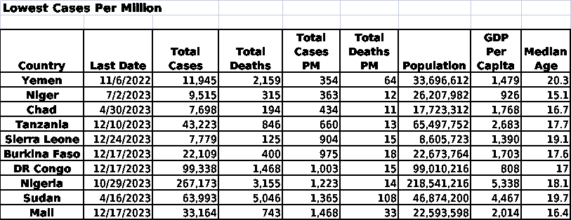

# 第二章：预测处理 HTML、JSON 和 Spark 数据时的数据清理问题

本章继续讨论从各种来源导入数据的工作，以及导入数据后需要进行的初步检查。在过去的 25 年里，数据分析师发现他们越来越需要处理非表格型的半结构化数据。有时，他们甚至会在这些形式中创建和持久化数据。本章将以 JSON 这一传统表格数据集的常见替代方案为例，但这些一般概念也可以扩展到 XML 和 NoSQL 数据存储，如 MongoDB。此外，我们还将讨论从网站抓取数据时常遇到的问题。

数据分析师还发现，分析数据的量的增加速度超过了机器处理能力的提升，至少是在本地可用的计算资源方面。处理大数据有时需要依赖像 Apache Spark 这样的技术，它可以利用分布式资源。

本章中，我们将依次解决以下几种方法：

+   导入简单的 JSON 数据

+   从 API 导入更复杂的 JSON 数据

+   从网页导入数据

+   使用 Spark 数据

+   持久化 JSON 数据

+   数据版本管理

# 技术要求

完成本章中的方法，您需要使用 pandas、NumPy 和 Matplotlib。我使用的是 pandas 2.1.4，但该代码也适用于 pandas 1.5.3 及以后的版本。

本章中的代码可以从本书的 GitHub 仓库下载，链接：[`github.com/PacktPublishing/Python-Data-Cleaning-Cookbook-Second-Edition`](https://github.com/PacktPublishing/Python-Data-Cleaning-Cookbook-Second-Edition)。

# 导入简单的 JSON 数据

**JavaScript 对象表示法**（**JSON**）已成为一种极其有用的标准，用于在不同的机器、进程或节点之间传输数据。通常，客户端向服务器发送数据请求，服务器随后查询本地存储中的数据，并将其从 SQL Server、MySQL 或 PostgreSQL 表等格式转换为 JSON，客户端可以使用该数据。这有时会被进一步复杂化，例如，第一个服务器（比如一个 Web 服务器）将请求转发给数据库服务器。JSON 和 XML 都能方便地完成这一过程，具体方式如下：

+   可被人类阅读

+   适用于大多数客户端设备

+   不受结构限制

JSON 具有相当高的灵活性，这意味着它几乎可以容纳任何内容，无论这些内容多么不明智。结构甚至可以在 JSON 文件内发生变化，因此在不同的地方可能会出现不同的键。例如，文件可能以一些解释性键开始，而这些键的结构与其余的*数据*键截然不同，或者某些键在某些情况下可能会出现，而在其他情况下则不会出现。我们将讨论处理这种混乱（呃，灵活性）的一些方法。

## 准备工作

在这个示例中，我们将处理有关政治候选人的新闻故事数据。这些数据可以在 [dataverse.harvard.edu/dataset.xhtml?persistentId=doi:10.7910/DVN/0ZLHOK](https://dataverse.harvard.edu/dataset.xhtml?persistentId=doi:10.7910/DVN/0ZLHOK) 上公开使用。我已将该处的 JSON 文件合并为一个文件，并从合并的数据中随机选择了 60,000 条新闻故事。这些样本（`allcandidatenewssample.json`）可以在本书的 GitHub 仓库中找到。

在这个示例中，我们将进行一些列表和字典推导式的操作。如果你对列表推导式或字典推导式感到生疏，或者没有经验，可以参考 *DataCamp* 提供的很好的教程：[Python 列表推导式](https://www.datacamp.com/community/tutorials/python-list-comprehension) 和 [Python 字典推导式](https://www.datacamp.com/community/tutorials/python-dictionary-comprehension)。

## 操作步骤…

我们将在做一些数据检查和清理后，将 JSON 文件导入到 pandas 中：

1.  导入 `json` 和 `pprint` 库。

`pprint` 改善了加载 JSON 数据时返回的列表和字典的显示方式：

```py
import pandas as pd
import numpy as np
import json
import pprint
from collections import Counter 
```

1.  加载 JSON 数据并查找潜在的问题。

使用 `json load` 方法返回关于政治候选人的新闻故事数据。`load` 返回一个字典列表。使用 `len` 获取列表的大小，即新闻故事的总数。在这个例子中，每个列表项都是一个字典，包含标题、来源等键值对。使用 `pprint` 显示前两个字典。获取第一个列表项中 `source` 键的值：

```py
with open('data/allcandidatenewssample.json') as f:
...   candidatenews = json.load(f)
...
len(candidatenews) 
```

```py
60000 
```

```py
pprint.pprint(candidatenews[0:2]) 
```

```py
[{'date': '2019-12-25 10:00:00',
  'domain': 'www.nbcnews.com',
  'panel_position': 1,
  'query': 'Michael Bloomberg',
  'source': 'NBC News',
  'story_position': 6,
  'time': '18 hours ago',
  'title': 'Bloomberg cuts ties with company using prison inmates to make campaign calls',
  'url': 'https://www.nbcnews.com/politics/2020-election/bloomberg-cuts-ties-company-using-prison-inmates-make-campaign-calls-n1106971'},
 {'date': '2019-11-09 08:00:00',
  'domain': 'www.townandcountrymag.com',
  'panel_position': 1,
  'query': 'Amy Klobuchar',
  'source': 'Town & Country Magazine',
  'story_position': 3,
  'time': '18 hours ago',
  'title': "Democratic Candidates React to Michael Bloomberg's Potential Run",
  'url': 'https://www.townandcountrymag.com/society/politics/a29739854/michael-bloomberg-democratic-candidates-campaign-reactions/'}] 
```

```py
pprint.pprint(candidatenews[0]['source']) 
```

```py
'NBC News' 
```

1.  检查字典结构的差异。

使用 `Counter` 检查列表中是否有字典的键数少于或多于正常的 9 个。查看一些几乎没有数据的字典（只有两个键）然后再将其删除。确认剩余字典列表的长度符合预期——`60000-2382=57618`：

```py
Counter([len(item) for item in candidatenews]) 
```

```py
Counter({9: 57202, 2: 2382, 10: 416}) 
```

```py
pprint.pprint(next(item for item in candidatenews if len(item)<9)) 
```

```py
{'date': '2019-09-11 18:00:00', 'reason': 'Not collected'} 
```

```py
pprint.pprint(next(item for item in candidatenews if len(item)>9)) 
```

```py
{'category': 'Satire',
 'date': '2019-08-21 04:00:00',
 'domain': 'politics.theonion.com',
 'panel_position': 1,
 'query': 'John Hickenlooper',
 'source': 'Politics | The Onion',
 'story_position': 8,
 'time': '4 days ago',
 'title': ''And Then There Were 23,' Says Wayne Messam Crossing Out '
          'Hickenlooper Photo \n'
          'In Elaborate Grid Of Rivals',
 'url': 'https://politics.theonion.com/and-then-there-were-23-says-wayne-messam-crossing-ou-1837311060'} 
```

```py
pprint.pprint([item for item in candidatenews if len(item)==2][0:2]) 
```

```py
[{'date': '2019-09-11 18:00:00', 'reason': 'Not collected'},
 {'date': '2019-07-24 00:00:00', 'reason': 'No Top stories'}, 
```

```py
3candidatenews = [item for item in candidatenews if len(item)>2]
len(candidatenews) 
```

```py
57618 
```

1.  从 JSON 数据中生成统计数据。

获取仅针对 *Politico*（一个报道政治新闻的网站）的字典，并显示其中的几个字典：

```py
politico = [item for item in candidatenews if item["source"] == "Politico"]
len(politico) 
```

```py
2732 
```

```py
pprint.pprint(politico[0:2]) 
```

```py
[{'date': '2019-05-18 18:00:00',
  'domain': 'www.politico.com',
  'panel_position': 1,
  'query': 'Marianne Williamson',
  'source': 'Politico',
  'story_position': 7,
  'time': '1 week ago',
  'title': 'Marianne Williamson reaches donor threshold for Dem debates',
  'url': 'https://www.politico.com/story/2019/05/09/marianne-williamson-2020-election-1315133'},
 {'date': '2018-12-27 06:00:00',
  'domain': 'www.politico.com',
  'panel_position': 1,
  'query': 'Julian Castro',
  'source': 'Politico',
  'story_position': 1,
  'time': '1 hour ago',
  'title': "O'Rourke and Castro on collision course in Texas",
  'url': 'https://www.politico.com/story/2018/12/27/orourke-julian-castro-collision-texas-election-1073720'}] 
```

1.  获取 `source` 数据，并确认其长度符合预期。

显示新 `sources` 列表中的前几个项目。生成按来源统计的新闻故事数量，并展示 10 个最受欢迎的来源。注意，来自 *The Hill* 的故事可能会在 `source` 中显示为 `TheHill`（没有空格）或 `The Hill`：

```py
sources = [item.get('source') for item in candidatenews]
type(sources) 
```

```py
<class 'list'> 
```

```py
len(sources) 
```

```py
57618 
```

```py
sources[0:5] 
```

```py
['NBC News', 'Town & Country Magazine', 'TheHill', 'CNBC.com', 'Fox News'] 
```

```py
pprint.pprint(Counter(sources).most_common(10)) 
```

```py
[('Fox News', 3530),
 ('CNN.com', 2750),
 ('Politico', 2732),
 ('TheHill', 2383),
 ('The New York Times', 1804),
 ('Washington Post', 1770),
 ('Washington Examiner', 1655),
 ('The Hill', 1342),
 ('New York Post', 1275),
 ('Vox', 941)] 
```

1.  修正字典中值的错误。

修正 `The Hill` 的 `source` 值。注意，现在 `The Hill` 是新闻故事中最常见的来源：

```py
for newsdict in candidatenews:
...     newsdict.update((k, "The Hill") for k, v in newsdict.items()
...      if k == "source" and v == "TheHill")
...
sources = [item.get('source') for item in candidatenews]
pprint.pprint(Counter(sources).most_common(10)) 
```

```py
[('The Hill', 3725),
 ('Fox News', 3530),
 ('CNN.com', 2750),
 ('Politico', 2732),
 ('The New York Times', 1804),
 ('Washington Post', 1770),
 ('Washington Examiner', 1655),
 ('New York Post', 1275),
 ('Vox', 941),
 ('Breitbart', 799)] 
```

1.  创建一个 pandas DataFrame。

将 JSON 数据传递给 pandas 的 `DataFrame` 方法。将 `date` 列转换为 `datetime` 数据类型：

```py
candidatenewsdf = pd.DataFrame(candidatenews)
candidatenewsdf.dtypes 
```

```py
title             object
url               object
source            object
time              object
date              object
query             object
story_position     int64
panel_position    object
domain            object
category          object
dtype: object 
```

1.  确认我们得到了预期的 `source` 值。

同时，重命名 `date` 列：

```py
candidatenewsdf.rename(columns={'date':'storydate'}, inplace=True)
candidatenewsdf.storydate = candidatenewsdf.storydate.astype('datetime64[ns]')
candidatenewsdf.shape 
```

```py
(57618, 10) 
```

```py
candidatenewsdf.source.value_counts(sort=True).head(10) 
```

```py
The Hill               3725
Fox News               3530
CNN.com                2750
Politico               2732
The New York Times     1804
Washington Post        1770
Washington Examiner    1655
New York Post          1275
Vox                     941
Breitbart               799
Name: source, dtype: int64 
```

现在我们有一个 pandas DataFrame，只包含那些具有有意义数据且 `source` 值已固定的新闻故事。

## 工作原理……

`json.load` 方法返回一个字典列表。这使得在处理这些数据时可以使用许多熟悉的工具：列表方法、切片、列表推导、字典更新等等。有时候（也许当你只需要填充一个列表或统计给定类别中的个体数量时）根本不需要使用 pandas。

在 *步骤 2* 到 *6* 中，我们使用列表方法执行许多与前面的 pandas 配方相同的检查。在 *步骤* *3* 中，我们使用 `Counter` 与列表推导式（`Counter([len(item) for item in candidatenews])`）来获取每个字典中的键的数量。这告诉我们有 2,382 个字典只有 2 个键，416 个字典有 10 个键。我们使用 `next` 查找一个字典示例，看看是否有少于或多于 9 个键的字典，以了解这些项的结构。我们使用切片展示 2 个只有 2 个键的字典，看看这些字典中是否有数据。然后，我们仅选择那些有超过 2 个键的字典。

在 *步骤 4* 中，我们创建了字典列表的一个子集，仅包含 `source` 等于 `Politico` 的项，并查看了其中的几项。然后，我们创建了一个仅包含源数据的列表，并在 *步骤 5* 中使用 `Counter` 来列出 10 个最常见的来源。

*步骤 6* 演示了如何在字典列表中有条件地替换关键值。在这种情况下，当 `key (k)` 为 `source` 且 `value (v)` 为 `TheHill` 时，我们将键值更新为 `The Hill`。`for k, v in newsdict.items()` 这一部分是此行代码的无名英雄。它遍历了 `candidatenews` 中所有字典的所有键/值对。

通过将字典列表传递给 pandas 的 `DataFrame` 方法，很容易创建一个 pandas DataFrame。我们在 *步骤 7* 中执行了这一操作。主要的复杂性在于我们需要将日期列从字符串转换为日期格式，因为在 JSON 中日期实际上只是字符串。

## 还有更多……

在 *步骤* *5* 和 *6* 中，我们使用 `item.get('source')` 而不是 `item['source']`。当字典中可能缺少键时，这非常方便。`get` 方法在键缺失时返回 `None`，但我们可以使用可选的第二个参数指定返回的值。

我在 *步骤 8* 中将 `date` 列重命名为 `storydate`。这不是必须的，但这是一个好主意。`date` 列不仅不能告诉你日期实际代表什么，而且它作为列名太过通用，最终会在某些情况下引起问题。

新闻故事数据非常适合表格结构。将每个列表项表示为一行，键值对作为该行的列和值，逻辑上是合理的。没有复杂的情况，例如键值本身是字典列表。假设每个故事的 `authors` 键包含一个列表，列表中的每个项代表一位作者，而该项是关于作者的字典信息。在使用 Python 处理 JSON 数据时，这种情况并不少见。下一个食谱将展示如何处理这种结构的数据。

# 从 API 导入更复杂的 JSON 数据

在前面的食谱中，我们讨论了处理 JSON 数据的一个重要优势（也是挑战）——它的灵活性。一个 JSON 文件可以拥有几乎任何其作者能想象的结构。这通常意味着这些数据并不像我们到目前为止讨论过的数据源那样具有表格结构，也不像 pandas DataFrame 那样有明确的行列结构。分析师和应用程序开发者之所以使用 JSON，正是因为它不强制要求表格结构。我知道我就是这么做的！

从多个表中检索数据通常需要我们进行一对多合并。将这些数据保存到一个表或文件中意味着在“一”方重复数据。例如，学生的人口统计数据与所学课程的数据合并，人口统计数据会为每个课程重复。在 JSON 中，不需要重复数据即可在一个文件中捕获这些数据项。我们可以将所学课程的数据嵌套在每个学生的数据中。

但是，以这种方式结构化的 JSON 数据进行分析，最终会要求我们以不同于习惯的方式操作数据，或者将 JSON 转换为表格形式。我们将在 *第十二章：使用用户定义函数和类自动化数据清理* 的 *处理非表格数据结构的类* 食谱中探讨第一种方法。本食谱采用第二种方法，使用一个非常方便的工具 `json_normalize` 将 JSON 的指定节点转换为表格结构。

我们首先使用 API 获取 JSON 数据，因为这正是 JSON 数据常见的使用方式。通过 API 获取数据的一个优势是，相比于从本地保存的文件中读取数据，当源数据更新时，我们的代码可以更容易地重新运行。

## 准备工作

本食谱假设你已经安装了 `requests` 和 `pprint` 库。如果没有安装，你可以通过 pip 安装它们。在终端（或 Windows 中的 PowerShell）中，输入 `pip install requests` 和 `pip install pprint`。

以下是使用克利夫兰艺术博物馆 Collections API 时生成的 JSON 文件结构。文件开头有一个有用的*info*部分，但我们关注的是*data*部分。由于这些数据不适合直接放入表格结构中，所以我们需要展平数据。每个收藏项可能有多个`citations`对象和多个`creators`对象。我已简化了 JSON 文件以节省空间：

```py
{"info": { "total": 778, "parameters": {"african_american_artists": "" }},
"data": [
{
"id": 165157,
"accession_number": "2007.158",
"title": "Fulton and Nostrand",
"creation_date": "1958",
"citations": [
  {
   "citation": "Annual Exhibition: Sculpture, Paintings...",
   "page_number": "Unpaginated, [8],[12]",
   "url": null
   },
  {
   "citation": "\"Moscow to See Modern U.S. Art,\"<em> New York...", 
   "page_number": "P. 60",
   "url": null
  }]
"creators": [
      {
     "description": "Jacob Lawrence (American, 1917-2000)",
     "extent": null,
     "qualifier": null,
     "role": "artist",
     "birth_year": "1917",
     "death_year": "2000"
     }
  ]
 } 
```

**数据说明**

本配方使用的 API 由克利夫兰艺术博物馆提供，可以在[`openaccess-api.clevelandart.org/`](https://openaccess-api.clevelandart.org/)上公开访问。

由于调用 API 会检索实时数据，运行此代码时可能会得到不同的输出。

## 如何实现……

使用博物馆的收藏数据创建一个 DataFrame，每个`citation`对应一行，`title`和`creation_date`会被重复：

1.  导入`json`、`requests`和`pprint`库。

我们需要`requests`库来使用 API 获取 JSON 数据。`pprint`可以改善列表和字典的显示效果：

```py
import pandas as pd
import numpy as np
import json
import pprint
import requests 
```

1.  使用 API 加载 JSON 数据。

向克利夫兰艺术博物馆的 Collections API 发送`get`请求。使用查询字符串来表示只获取非裔美国艺术家的收藏。显示第一个收藏项。为了节省空间，我已截断了第一个项目的输出：

```py
response = requests.get("https://openaccess-api.clevelandart.org/api/artworks/?african_american_artists")
camcollections = json.loads(response.text)
len(camcollections['data']) 
```

```py
778 
```

```py
pprint.pprint(camcollections['data'][0]) 
```

```py
{'accession_number': '2007.158',
 'catalogue_raisonne': None,
 'citations': [
   {'citation': 'Annual Exhibition: Sculpture...',
    'page_number': 'Unpaginated, [8],[12]',
    'url': None},
  {'citation': '"Moscow to See Modern U.S....',
    'page_number': 'P. 60',
    'url': None}]
 'collection': 'American - Painting',
 'creation_date': '1958',
 'creators': [
  {'biography': 'Jacob Lawrence (born 1917)...',
   'birth_year': '1917',
   'description': 'Jacob Lawrence (American...)',
   'role': 'artist'}],
 'type': 'Painting'} 
```

1.  展平 JSON 数据。

使用`json_normalize`方法从 JSON 数据创建 DataFrame。需要说明的是，引用的数量将决定行数，而`accession_number`、`title`、`creation_date`、`collection`、`creators`和`type`将被重复显示。可以通过显示前两条记录并使用`.T`选项转置它们，来观察数据已经被展平：

```py
camcollectionsdf = \
...   pd.json_normalize(camcollections['data'],
...    'citations',
...    ['accession_number','title','creation_date',
...    'collection','creators','type'])
camcollectionsdf.head(2).T 
```

```py
 0                         1
citation          Annual Exhibiti...  "Moscow to See Modern...
page_number             Unpaginated,                     P. 60
url                             None                      None
accession_number            2007.158                  2007.158
title               Fulton and No...          Fulton and No...
creation_date                   1958                      1958
collection          American - Pa...          American - Pa...
creators       [{'description':'J...     [{'description':'J...
type                        Painting                  Painting 
```

1.  从`creators`中提取`birth_year`值：

    ```py
    creator = camcollectionsdf[:1].creators[0]
    type(creator[0]) 
    ```

    ```py
    dict 
    ```

    ```py
    pprint.pprint(creator) 
    ```

    ```py
    [{'biography': 'Jacob Lawrence (born 1917) has been a prominent art...',
      'birth_year': '1917',
      'death_year': '2000',
      'description': 'Jacob Lawrence (American, 1917-2000)',
      'extent': None,
      'name_in_original_language': None,
      'qualifier': None,
      'role': 'artist'}] 
    ```

    ```py
    camcollectionsdf['birthyear'] = camcollectionsdf.\
    ...   creators.apply(lambda x: x[0]['birth_year'])
    camcollectionsdf.birthyear.value_counts().\
    ...   sort_index().head() 
    ```

    ```py
    1821    18
    1886     2
    1888     1
    1892    13
    1899    17
    Name: birthyear, dtype: int64 
    ```

这将给我们一个 pandas DataFrame，其中每个`citation`都有一行，并且每个收藏项的信息（`title`、`creation_date`等）会被重复。

## 它是如何工作的……

在这道配方中，我们使用的 JSON 文件比前一个更为*有趣*。JSON 文件中的每个对象都是克利夫兰艺术博物馆收藏中的一项物品。在每个收藏项内，包含一个或多个引用。唯一能够将这些信息以表格形式存储的方法是将其展平。每个收藏项还有一个或多个关于创作者（艺术家）的字典。这些字典包含我们所需的`birth_year`值。

我们希望每个集合项的每个引用都对应一行。为了理解这一点，可以想象我们正在处理关系数据，拥有一个集合表和一个引用表，我们正在进行集合到引用的一个对多合并。我们通过将*citations*作为第二个参数，使用`json_normalize`做类似的事情。这告诉`json_normalize`为每个引用创建一行，并使用每个引用字典中的键值——`citation`、`page_number`和`url`——作为数据值。

调用`json_normalize`时的第三个参数包含了列名列表，这些列将在每个引用中重复。注意到`access_number`、`title`、`creation_date`、`collection`、`creators`和`type`在前两个观测值中是重复的。`Citation`和`page_number`发生变化。（`url`在第一个和第二个引用中是相同的值。否则，它也会发生变化。）

这仍然给我们留下了`creators`字典的问题（可能有多个创作者）。当我们运行`json_normalize`时，它会抓取我们指示的每个键的值（在第三个参数中），并将其存储在该列和行的数据中，无论该值是简单文本还是字典列表，如`creators`的情况。我们查看*步骤 4*中第一个集合行的第一个（也是唯一的）`creators`项，将其命名为`creator`。（注意，`creators`列表在所有集合项的`citations`中是重复的，正如`title`、`creation_date`等值也是一样。）

我们想要每个集合项的第一个创作者的出生年份，可以在`creator[0]['birth_year']`中找到。为了使用这个值创建`birthyear`系列，我们使用`apply`和`lambda`函数：

```py
camcollectionsdf['birthyear'] = camcollectionsdf.\
...   creators.apply(lambda x: x[0]['birth_year']) 
```

我们仔细研究了*第六章*，*使用系列操作清理和探索数据*中的 lambda 函数。在这里，将`x`视为表示`creators`系列是有帮助的，因此`x[0]`给我们带来我们想要的列表项`creators[0]`。我们从`birth_year`键中提取值。

## 还有更多…

你可能注意到，我们在调用`json_normalize`时省略了一些 API 返回的 JSON。我们传递给`json_normalize`的第一个参数是`camcollections['data']`。实际上，我们忽略了 JSON 数据开头的`info`对象。我们需要的信息直到`data`对象才开始。这在概念上与上一章第二个食谱中的`skiprows`参数没有太大区别。JSON 文件开头有时会包含类似的元数据。

## 另见

上述食谱展示了一些有用的技术，用于在没有 pandas 的情况下进行数据完整性检查，包括列表操作和推导式。这些对于本食谱中的数据也是相关的。

# 从网页导入数据

我们在本教程中使用**Beautiful Soup**从网页抓取数据，并将这些数据加载到 pandas 中。**网页抓取**在网站上有定期更新的数据而没有 API 时非常有用。每当页面更新时，我们可以重新运行代码生成新的数据。

不幸的是，当目标页面的结构发生变化时，我们构建的网络爬虫可能会被破坏。而 API 则不太可能发生这种情况，因为它们是为数据交换设计的，并且在设计时就考虑到了这一点。大多数网页设计师的优先考虑事项是信息展示的质量，而非数据交换的可靠性和便捷性。这就导致了独特的网页抓取数据清理挑战，包括 HTML 元素将数据存放在不同且不断变化的位置、格式化标签使得底层数据变得模糊不清，以及解释性文本帮助数据解读但难以提取。除了这些挑战，抓取还会遇到一些常见的数据清理问题，比如列中数据类型的变化、不理想的标题以及缺失值。在本教程中，我们将处理这些最常见的数据问题。

## 准备工作

要运行本教程中的代码，你需要安装 Beautiful Soup。你可以通过在终端窗口或 Windows PowerShell 中输入`pip install beautifulsoup4`来安装它。

我们将从一个网页中抓取数据，找到该页面上的以下表格，并将其加载到 pandas DataFrame 中：



图 2.1：COVID-19 数据来自病例数每百万人最少的国家

**数据** **备注**

我创建了这个网页，[`www.alrb.org/datacleaning/highlowcases.html`](http://www.alrb.org/datacleaning/highlowcases.html)，基于来自*Our World in Data*的 COVID-19 数据，供公众使用，数据可在[`ourworldindata.org/covid-cases`](https://ourworldindata.org/covid-cases)找到。

## 如何操作…

我们从网站抓取 COVID-19 数据并进行一些常规的数据检查：

1.  导入`pprint`、`requests`和`BeautifulSoup`库：

    ```py
    import pandas as pd
    import numpy as np
    import json
    import pprint
    import requests
    from bs4 import BeautifulSoup 
    ```

1.  解析网页并获取表格的表头行。

使用 Beautiful Soup 的`find`方法获取我们需要的表格，然后使用`find_all`方法提取该表格中`th`元素内的内容。根据`th`行的文本创建列标签列表：

```py
webpage = requests.get("http://www.alrb.org/datacleaning/highlowcases.html")
bs = BeautifulSoup(webpage.text, 'html.parser')
theadrows = bs.find('table', {'id':'tblLowCases'}).thead.find_all('th')
type(theadrows) 
```

```py
<class 'bs4.element.ResultSet'> 
```

```py
labelcols = [j.get_text() for j in theadrows]
labelcols[0] = "rowheadings"
labelcols 
```

```py
['rowheadings',
 'Last Date',
 'Total Cases',
 'Total Deaths',
 'Total Cases PM',
 'Total Deaths PM',
 'Population',
 'GDP Per Capita',
 'Median Age'] 
```

1.  从表格单元格中获取数据。

找到我们需要的表格的所有表格行。对于每一行表格，找到`th`元素并提取文本。我们将使用这些文本作为行标签。同时，对于每一行，找到所有的`td`元素（表格单元格中的数据），并将它们的文本存入一个列表中。

这给我们提供了`datarows`，其中包含表格中的所有数字数据。（你可以确认它与网页中的表格匹配。）然后，我们将`labelrows`列表（包含行标题）插入到`datarows`中的每个列表的开头：

```py
rows = bs.find('table', {'id':'tblLowCases'}).tbody.find_all('tr')
datarows = []
labelrows = []
for row in rows:
...   rowlabels = row.find('th').get_text()
...   cells = row.find_all('td', {'class':'data'})
...   if (len(rowlabels)>3):
...     labelrows.append(rowlabels)
...   if (len(cells)>0):
...     cellvalues = [j.get_text() for j in cells]
...     datarows.append(cellvalues)
...
pprint.pprint(datarows[0:2]) 
```

```py
[['11/6/2022', '11,945', '2,159', '354', '64', '33,696,612', '1,479', '20.3'],
 ['7/2/2023', '9,515', '315', '363', '12', '26,207,982', '926', '15.1']] 
```

```py
pprint.pprint(labelrows[0:2]) 
```

```py
['Yemen', 'Niger'] 
```

```py
for i in range(len(datarows)):
...   datarows[i].insert(0, labelrows[i])
...
pprint.pprint(datarows[0:2]) 
```

```py
[['Yemen',
  '11/6/2022',
  '11,945',
  '2,159',
  '354',
  '64',
  '33,696,612',
  '1,479',
  '20.3'],
 ['Niger',
  '7/2/2023',
  '9,515',
  '315',
  '363',
  '12',
  '26,207,982',
  '926',
  '15.1']] 
```

1.  将数据加载到 pandas 中。

将 `datarows` 列表传递给 pandas 的 `DataFrame` 方法。请注意，所有数据都以对象数据类型读取到 pandas 中，并且一些数据的当前格式无法转换为数值（由于逗号的存在）：

```py
lowcases = pd.DataFrame(datarows, columns=labelcols)
lowcases.iloc[:,1:5].head() 
```

```py
 Last Date   Total Cases   Total Deaths   Total Cases PM
0    11/6/2022        11,945          2,159              354
1     7/2/2023         9,515            315              363
2    4/30/2023         7,698            194              434
3   12/10/2023        43,223            846              660
4   12/24/2023         7,779            125              904 
```

```py
lowcases.dtypes 
```

```py
rowheadings                object
Last Date                  object
Total Cases                object
Total Deaths               object
Total Cases PM             object
Total Deaths PM            object
Population                 object
GDP Per Capita             object
Median Age                 object
dtype: object 
```

1.  修复列名并将数据转换为数值。

删除列名中的空格。删除第一列数据中的所有非数字数据，包括逗号（`str.replace("[⁰-9]","")`）。将数据转换为数值，处理大多数列为整数，将 `last_date` 列转换为日期时间格式，将 `median_age` 列转换为浮动数值，并将 `rowheadings` 保留为对象类型：

```py
lowcases.columns = lowcases.columns.str.replace(" ", "_").str.lower()
for col in lowcases.columns[2:-1]:
  lowcases[col] = lowcases[col].\
str.replace("[⁰-9]","",regex=True).astype('int64')
lowcases['last_date'] = pd.to_datetime(lowcases.last_date)
lowcases['median_age'] = lowcases['median_age'].astype('float')
lowcases.dtypes 
```

```py
rowheadings                 object
last_date            datetime64[ns]
total_cases                 int64
total_deaths                int64
total_cases_pm              int64
total_deaths_pm             int64
population                  int64
gdp_per_capita              int64
median_age                float64
dtype: object 
```

我们现在已经从 `html` 表格创建了一个 pandas DataFrame。

## 它是如何工作的…

Beautiful Soup 是一个非常有用的工具，用于在网页中查找特定的 HTML 元素并从中提取文本。你可以使用 `find` 获取一个 HTML 元素，使用 `find_all` 获取一个或多个元素。`find` 和 `find_all` 的第一个参数是要获取的 HTML 元素，第二个参数是一个 Python 字典，包含属性。你可以使用 `get_text` 从所有找到的 HTML 元素中提取文本。

处理元素和文本通常需要一定的循环操作，就像在 *步骤 2* 和 *步骤 3* 中一样。*步骤 2* 中的这两条语句是比较典型的：

```py
theadrows = bs.find('table', {'id':'tblLowCases'}).thead.find_all('th')
labelcols = [j.get_text() for j in theadrows] 
```

第一个语句查找我们想要的所有 `th` 元素，并从找到的元素创建一个名为 `theadrows` 的 Beautiful Soup 结果集。第二个语句使用 `get_text` 方法遍历 `theadrows` 结果集，从每个元素中提取文本，并将其存储在 `labelcols` 列表中。

*步骤 3* 稍微复杂一些，但它使用了相同的 Beautiful Soup 方法。我们在目标表格中查找所有的表格行 (`tr`)（`rows = bs.find('table', {'id':'tblLowCases'}).tbody.find_all('tr')`）。然后我们遍历每一行，查找 `th` 元素并获取该元素中的文本（`rowlabels = row.find('th').get_text()`）。我们还查找每行的所有表格单元格 (`td`)（`cells = row.find_all('td', {'class':'data'})`）并提取所有表格单元格的文本（`cellvalues = [j.get_text() for j in cells]`）。请注意，这段代码依赖于 `td` 元素的类名为 `data`。

最后，我们将从 `th` 元素中获取的行标签插入到 `datarows` 中每个列表的开头：

```py
for i in range(len(datarows)):
...   datarows[i].insert(0, labelrows[i]) 
```

在 *步骤 4* 中，我们使用 `DataFrame` 方法将我们在 *步骤 2* 和 *步骤 3* 中创建的列表加载到 pandas 中。然后，我们进行一些清理工作，类似于本章之前的配方。我们使用 `string replace` 移除列名中的空格，并删除所有非数字数据（包括逗号），以便这些原本有效的数字值能正确转换。我们将所有列转换为数值，除了 `rowheadings` 列保留为对象类型。

## 还有更多内容…

我们的爬取代码依赖于网页结构的几个方面不发生变化：感兴趣的表格的 ID、包含列和行标签的`th`标签的存在，以及`td`元素继续拥有其类名等于 data。好消息是，如果网页结构确实发生变化，通常只会影响`find`和`find_all`调用。其余的代码无需更改。

# 使用 Spark 数据

在处理大型数据集时，我们有时需要依赖分布式资源来清理和操作数据。使用 Apache Spark，分析师可以利用多台计算机的处理能力。本教程中我们将使用 PySpark，它是一个用于处理 Spark 数据的 Python API。我们还将介绍如何使用 PySpark 工具来初步查看数据、选择数据的某些部分，并生成一些简单的汇总统计信息。

## 准备工作

要运行本节中的代码，你需要在计算机上运行 Spark。如果你已经安装了 Anaconda，可以按照以下步骤操作来使用 Spark：

1.  使用`conda install openjdk`安装`Java`。

1.  使用`conda install pyspark`或`conda install -c conda-forge pyspark`安装`PySpark`。

1.  使用`conda install -c conda-forge findspark`安装`findspark`。

    **注意**

    安装 PySpark 可能会有些棘手，特别是在设置必要的环境变量时。虽然`findspark`有助于此，但一个常见问题是，当运行 PySpark 命令时，Java 安装可能无法被识别。如果在尝试运行本教程中的代码时出现`JAVA_HOME is not set`错误，那么很可能是这个问题。

    以下链接中的*步骤 3*展示了如何为 Linux、macOS 和 Windows 机器设置环境变量：[`www.dei.unipd.it/~capri/BDC/PythonInstructions.html`](https://www.dei.unipd.it/~capri/BDC/PythonInstructions.html)。

我们将使用来自*第一章*的陆地温度数据、*使用 pandas 导入表格数据时预期的数据清理问题*以及本章的候选新闻数据。所有数据和我们将在本教程中运行的代码都可以在本书的 GitHub 仓库中找到。

**数据** **注意**

该数据集来自全球历史气候网络集成数据库，由美国国家海洋和大气管理局提供，供公众使用，网址：[`www.ncei.noaa.gov/data/global-historical-climatology-network-monthly/v4/`](https://www.ncei.noaa.gov/data/global-historical-climatology-network-monthly/v4/)。

本教程中我们将使用 PySpark 来读取存储在本地的数据。

## 如何操作...

要读取和探索数据，请按照以下步骤操作：

1.  让我们开始一个 Spark 会话并加载陆地温度数据。我们可以使用会话对象的 read 方法来创建一个 Spark DataFrame。我们需要指出，导入的 CSV 文件的第一行是标题：

    ```py
    from pyspark.sql import SparkSession
    spark = SparkSession.builder \
       .getOrCreate()
    landtemps = spark.read.option("header",True) \
         .csv("data/landtemps.tar.gz")
    type(landtemps) 
    ```

    ```py
    pyspark.sql.dataframe.DataFrame 
    ```

请注意，`read`方法返回的是 Spark DataFrame，而不是 pandas DataFrame。我们将需要使用不同的方法来查看数据，而不是我们目前为止使用的方法。

我们加载了完整的数据集，而不仅仅是第一章中我们使用的 10 万行样本。如果你的系统资源有限，可以改为导入`landtempssample.csv`文件。

1.  我们应该查看导入的行数、列名以及数据类型。`temp`列被读取为字符串类型，但它应该是浮动类型。我们将在后续步骤中修正这一点：

    ```py
    landtemps.count() 
    ```

    ```py
    16904868 
    ```

    ```py
    landtemps.printSchema() 
    ```

    ```py
    root
     |-- locationid: string (nullable = true)
     |-- year: string (nullable = true)
     |-- month: string (nullable = true)
     |-- temp: string (nullable = true)
     |-- latitude: string (nullable = true)
     |-- longitude: string (nullable = true)
     |-- stnelev: string (nullable = true)
     |-- station: string (nullable = true)
     |-- countryid: string (nullable = true)
     |-- country: string (nullable = true) 
    ```

1.  让我们查看几行数据。我们可以通过使用`select`方法选择部分列：

    ```py
    landtemps.select("station",'country','month','year','temp') \
        .show(5, False) 
    ```

    ```py
    +-------+-------------------+-----+----+-----+
    |station|country            |month|year|temp |
    +-------+-------------------+-----+----+-----+
    |SAVE   |Antigua and Barbuda|1    |1961|-0.85|
    |SAVE   |Antigua and Barbuda|1    |1962|1.17 |
    |SAVE   |Antigua and Barbuda|1    |1963|-7.09|
    |SAVE   |Antigua and Barbuda|1    |1964|0.66 |
    |SAVE   |Antigua and Barbuda|1    |1965|0.48 |
    +-------+-------------------+-----+----+-----+
    only showing top 5 rows 
    ```

1.  我们应该修正`temp`列的数据类型。我们可以使用`withColumn`函数在 Spark 中进行一系列列操作。在这里，我们使用它将`temp`列转换为`float`类型：

    ```py
    landtemps = landtemps \
      .withColumn("temp",landtemps.temp.cast('float'))
    landtemps.select("temp").dtypes 
    ```

    ```py
    [('temp', 'float')] 
    ```

1.  现在我们可以对`temp`变量运行摘要统计信息。我们可以使用`describe`方法来实现：

    ```py
    landtemps.describe('temp').show() 
    ```

    ```py
    +-------+------------------+
    |summary|              temp|
    +-------+------------------+
    |  count|          14461547|
    |   mean|10.880725773138536|
    | stddev|11.509636369381685|
    |    min|             -75.0|
    |    max|             42.29|
    +-------+------------------+ 
    ```

1.  Spark 会话的 read 方法可以导入各种不同的数据文件，而不仅仅是 CSV 文件。让我们尝试使用之前在本章中处理过的`allcandidatenews` JSON 文件：

    ```py
    allcandidatenews = spark.read \
         .json("data/allcandidatenewssample.json")
    allcandidatenews \
      .select("source","title","story_position") \
      .show(5) 
    ```

    ```py
    +--------------------+--------------------+--------------+
    |              source|               title|story_position|
    +--------------------+--------------------+--------------+
    |            NBC News|Bloomberg cuts ti...|             6|
    |Town & Country Ma...|Democratic Candid...|             3|
    |                null|                null|          null|
    |             TheHill|Sanders responds ...|             7|
    |            CNBC.com|From Andrew Yang'...|             2|
    +--------------------+--------------------+--------------+
    only showing top 5 rows 
    ```

1.  我们可以再次使用`count`和`printSchema`方法来查看数据：

    ```py
    allcandidatenews.count() 
    ```

    ```py
    60000 
    ```

    ```py
    allcandidatenews.printSchema() 
    ```

    ```py
    root
     |-- category: string (nullable = true)
     |-- date: string (nullable = true)
     |-- domain: string (nullable = true)
     |-- panel_position: string (nullable = true)
     |-- query: string (nullable = true)
     |-- reason: string (nullable = true)
     |-- source: string (nullable = true)
     |-- story_position: long (nullable = true)
     |-- time: string (nullable = true)
     |-- title: string (nullable = true)
     |-- url: string (nullable = true) 
    ```

1.  我们还可以对`story_position`变量生成一些摘要统计信息：

    ```py
    allcandidatenews \
       .describe('story_position') \
       .show() 
    ```

    ```py
    +-------+-----------------+
    |summary|   story_position|
    +-------+-----------------+
    |  count|            57618|
    |   mean|5.249626852719636|
    | stddev|2.889001922195635|
    |    min|                1|
    |    max|               10|
    +-------+-----------------+ 
    ```

这些步骤展示了如何将数据文件导入到 Spark DataFrame，查看数据结构，并生成摘要统计信息。

## 它是如何工作的…

PySpark API 显著减少了 Python 程序员使用 Apache Spark 处理大数据文件时需要做的工作。我们可以使用的操作方法与我们在 pandas DataFrame 中使用的并没有太大区别。我们可以查看行列数、检查并更改数据类型，生成摘要统计信息。

## 还有更多…

在我们分析的某个阶段，我们可能需要将 Spark DataFrame 转换为 pandas DataFrame。这是一个相对昂贵的过程，并且我们会失去使用 Spark 的优势，所以通常只有在分析阶段需要 pandas 库或依赖 pandas 的库时，我们才会这样做。但当我们需要转换到 pandas 时，操作非常简单——不过如果你处理的是大量数据，而且你的计算机处理器和内存并不算顶级，可能最好先开始转换，然后去喝个茶或咖啡。

以下代码将我们创建的`allcandidatenews` Spark DataFrame 转换为 pandas DataFrame，并显示结果 DataFrame 的结构：

```py
allcandidatenewsdf = allcandidatenews.toPandas()
allcandidatenewsdf.info() 
```

```py
<class 'pandas.core.frame.DataFrame'>
RangeIndex: 60000 entries, 0 to 59999
Data columns (total 11 columns):
 #   Column          Non-Null Count  Dtype
---  ------          --------------  ------
 0   category          416 non-null  object
 1   date            60000 non-null  object
 2   domain          57618 non-null  object
 3   panel_position  57618 non-null  object
 4   query           57618 non-null  object
 5   reason          2382 non-null   object
 6   source          57618 non-null  object
 7   story_position  57618 non-null float64
 8   time            57618 non-null  object
 9   title           57618 non-null  object
 10  url             57618 non-null  object
dtypes: float64(1), object(10)
memory usage: 5.0+ MB 
```

在本章中，我们主要使用了非传统数据存储：JSON 文件、HTML 页面中的数据和 Spark 文件。在我们的数据清理工作中，通常会遇到一个阶段，在这个阶段保存数据清理结果是有意义的。我们在 *第一章* 的结尾——*通过 pandas 导入表格数据时预见数据清理问题* 中，已经探讨过如何持久化表格数据。在数据能很好地通过列和行来捕捉的情况下，这种方法效果很好。但当数据无法用表格结构表示时（例如，当我们处理的是包含复杂子文档的 JSON 文件时），我们可能希望在持久化数据时保留其原始结构。在接下来的食谱中，我们将讲解如何持久化 JSON 数据。

# 持久化 JSON 数据

我们可能有几个原因希望序列化 JSON 文件：

+   我们可能通过 API 获取了数据，但需要保存数据的快照。

+   JSON 文件中的数据相对静态，并且在项目的多个阶段中为我们的数据清理和分析提供信息。

+   我们可能会决定，像 JSON 这样的无模式格式的灵活性有助于解决许多数据清理和分析问题。

值得特别提到的是使用 JSON 的最后一个原因——它可以解决许多数据问题。尽管表格数据结构显然有很多优点，尤其对于操作性数据，它们往往不是存储分析数据的最佳方式。在准备数据进行分析时，往往会花费大量时间将不同表格的数据合并，或者在处理平面文件时应对数据冗余问题。这些过程不仅耗时，而且每次合并或重塑都会让我们面临广泛的数据错误风险。这也意味着我们可能会过于关注数据操作的技巧，而忽视了工作核心的概念问题。

在本篇食谱中，我们回到克利夫兰艺术博物馆的藏品数据。该数据文件至少有三个可能的分析单位——藏品项目级别、创作者级别和引用级别。JSON 允许我们在藏品中嵌套引用和创作者。（你可以在本食谱的*准备工作*部分查看 JSON 文件的结构。）如果不扁平化文件，这些数据无法以表格结构持久化，这一点我们在本章前面 *从 API 导入更复杂的 JSON 数据* 食谱中已经做过了。在本食谱中，我们将使用两种不同的方法来持久化 JSON 数据，每种方法都有其优缺点。

## 准备工作

我们将使用来自克利夫兰艺术博物馆的关于非裔美国艺术家作品的收藏数据。以下是 API 返回的 JSON 数据的结构。为了节省空间，数据已被简化：

```py
{"info": { "total": 778, "parameters": {"african_american_artists": "" }},
"data": [
{
"id": 165157,
"accession_number": "2007.158",
"title": "Fulton and Nostrand",
"creation_date": "1958",
"citations": [
  {
   "citation": "Annual Exhibition: Sculpture, Paintings...",
   "page_number": "Unpaginated, [8],[12]",
   "url": null
   },
  {
   "citation": "\"Moscow to See Modern U.S. Art,\"<em> New York...", 
   "page_number": "P. 60",
   "url": null
  }]
"creators": [
      {
     "description": "Jacob Lawrence (American, 1917-2000)",
     "extent": null,
     "qualifier": null,
     "role": "artist",
     "birth_year": "1917",
     "death_year": "2000"
     }
  ]
 } 
```

## 如何操作……

我们将使用两种不同的方法来序列化 JSON 数据：

1.  加载 `pandas`、`json`、`pprint`、`requests` 和 `msgpack` 库：

    ```py
    import pandas as pd
    import json
    import pprint
    import requests
    import msgpack 
    ```

1.  从 API 加载 JSON 数据。我已经将 JSON 输出进行了简化：

    ```py
    response = requests.get("https://openaccess-api.clevelandart.org/api/artworks/?african_american_artists")
    camcollections = json.loads(response.text)
    len(camcollections['data']) 
    ```

    ```py
    778 
    ```

    ```py
    pprint.pprint(camcollections['data'][0]) 
    ```

    ```py
    {'accession_number': '2007.158',
     'catalogue_raisonne': None,
     'citations': [
       {'citation': 'Annual Exhibition: Sculpture...',
        'page_number': 'Unpaginated, [8],[12]',
        'url': None},
      {'citation': '"Moscow to See Modern U.S....',
        'page_number': 'P. 60',
        'url': None}]
     'collection': 'American - Painting',
     'creation_date': '1958',
     'creators': [
      {'biography': 'Jacob Lawrence (born 1917)...',
       'birth_year': '1917',
       'description': 'Jacob Lawrence (American...)',
       'role': 'artist'}],
     'type': 'Painting'} 
    ```

1.  使用 Python 的`json`库保存并重新加载 JSON 文件。

以人类可读的形式持久化 JSON 数据。从保存的文件重新加载数据，并通过从第一个`collections`项中检索`creators`数据来确认它是否有效：

```py
with open("data/camcollections.json","w") as f:
...   json.dump(camcollections, f)
...
with open("data/camcollections.json","r") as f:
...   camcollections = json.load(f)
...
pprint.pprint(camcollections['data'][0]['creators']) 
```

```py
[{'biography': 'Jacob Lawrence (born 1917) has been a prominent artist since...'
  'birth_year': '1917',
  'description': 'Jacob Lawrence (American, 1917-2000)',
  'role': 'artist'}] 
```

1.  使用`msgpack`保存并重新加载 JSON 文件：

    ```py
    with open("data/camcollections.msgpack", "wb") as outfile:
    ...     packed = msgpack.packb(camcollections)
    ...     outfile.write(packed)
    ... 
    ```

    ```py
    1586507 
    ```

    ```py
    with open("data/camcollections.msgpack", "rb") as data_file:
    ...     msgbytes = data_file.read()
    ...
    camcollections = msgpack.unpackb(msgbytes)
    pprint.pprint(camcollections['data'][0]['creators']) 
    ```

    ```py
    [{'biography': 'Jacob Lawrence (born 1917) has been a prominent...',
      'birth_year': '1917',
      'death_year': '2000',
      'description': 'Jacob Lawrence (American, 1917-2000)',
      'role': 'artist'}] 
    ```

## 它是如何工作的…

我们使用克利夫兰艺术博物馆的收藏 API 来获取收藏品。查询字符串中的`african_american_artists`标志表示我们只想要这些创作者的收藏。`json.loads`返回一个名为`info`的字典和一个名为`data`的字典列表。我们检查`data`列表的长度。这告诉我们收藏中有 778 个项目。然后，我们展示第一个收藏品以更好地了解数据的结构。（我已经简化了 JSON 输出。）

我们在*步骤 3*中使用 Python 的 JSON 库保存并重新加载数据。以这种方式持久化数据的优点是它保持数据以人类可读的形式。不幸的是，它有两个缺点：保存的时间比其他序列化方法要长，而且它使用更多的存储空间。

在*步骤 4*中，我们使用`msgpack`来持久化数据。这比 Python 的`json`库更快，而且保存的文件占用更少的空间。当然，缺点是生成的 JSON 是二进制格式，而不是基于文本的。

## 还有更多…

在我的工作中，我同时使用这两种方法来持久化 JSON 数据。当我处理较少的数据，并且这些数据相对静态时，我更倾向于使用人类可读的 JSON。这在前一章中的食谱案例中非常适用，我们需要为其创建值标签。

当我处理大量数据且这些数据经常变化时，我使用`msgpack`。`msgpack`文件在你想要定期获取企业数据库中关键表的快照时也非常适用。

克利夫兰艺术博物馆的收藏数据在至少一个重要方面与我们每天使用的数据相似。分析单元经常变化。在这里，我们查看的是收藏品、引文和创作者。在我们的工作中，我们可能需要同时查看学生和课程，或家庭和存款。博物馆数据的企业数据库系统可能会有单独的收藏品、引文和创作者表，最终我们需要将它们合并。合并后的文件将存在数据冗余问题，我们需要在每次改变分析单元时考虑到这些问题。

当我们修改数据清理过程，使其直接处理 JSON 或其部分内容时，我们最终消除了一个主要的错误源。在*第十二章*的*处理非表格数据结构的类*食谱中，我们用 JSON 进行了更多的数据清理，*自动化数据清理与用户定义的函数、类和管道*。

# 版本控制数据

有时候我们希望在不覆盖数据文件的先前版本的情况下持久化数据。这可以通过将时间戳或唯一标识符附加到文件名来实现。然而，还有更优雅的解决方案。一种这样的解决方案就是 Delta Lake 库，我们将在本节中进行探索。

在本节中，我们将再次使用陆地温度数据。我们将加载数据，保存到数据湖中，然后将更改过的版本保存到同一个数据湖。

## 准备中

本节将使用 Delta Lake 库，可以通过`pip install deltalake`进行安装。我们还需要`os`库，以便为数据湖创建目录。

## 如何操作...

你可以按以下方式开始使用数据并对其进行版本管理：

1.  我们首先导入 Delta Lake 库。然后，我们创建一个名为`temps_lake`的文件夹，用于存储我们的数据版本：

    ```py
    import pandas as pd
    from deltalake.writer import write_deltalake
    from deltalake import DeltaTable
    import os
    os.makedirs("data/temps_lake", exist_ok=True) 
    ```

1.  现在，让我们加载陆地温度数据：

    ```py
    landtemps = pd.read_csv('data/landtempssample.csv',
        names=['stationid','year','month','avgtemp','latitude',
          'longitude','elevation','station','countryid','country'],
        skiprows=1,
    parse_dates=[['month','year']])
    landtemps.shape 
    ```

    ```py
    (100000, 9) 
    ```

1.  我们将 landtemps DataFrame 保存到数据湖中：

    ```py
    write_deltalake("data/temps_lake", landtemps) 
    ```

1.  现在，让我们获取刚刚保存的数据。我们指定要获取第一个版本，尽管这并不是必要的，因为如果没有指定版本，将会获取最新版本。返回的是一个`DeltaTable`类型，我们可以将其转换为 pandas DataFrame：

    ```py
    tempsdelta = DeltaTable("data/temps_lake", version=0)
    type(tempsdelta) 
    ```

    ```py
    deltalake.table.DeltaTable 
    ```

    ```py
    tempsdfv1 = tempsdelta.to_pandas()
    tempsdfv1.shape 
    ```

    ```py
    (100000, 9) 
    ```

1.  让我们将前 1,000 行的陆地温度数据持久化到数据湖中，而不替换现有数据。我们将`overwrite`作为`mode`参数的值传入。这将保存一个新的数据集到数据湖，而不是替换之前的版本。`overwrite`参数的值在这里有点令人困惑。当我们稍后使用`append`参数值时，这一点会更清楚：

    ```py
    write_deltalake("data/temps_lake", landtemps.head(1000), mode="overwrite") 
    ```

1.  现在，让我们提取数据的最新版本。请注意，这个版本只有 1,000 行：

    ```py
    tempsdfv2 = DeltaTable("data/temps_lake", version=1).to_pandas()
    tempsdfv2.shape 
    ```

    ```py
    (1000, 9) 
    ```

1.  如果我们改为指定`append`，则会将`write_deltalake`第二个参数中的 DataFrame 行添加到先前版本的行中：

    ```py
    write_deltalake("data/temps_lake", landtemps.head(1000), mode="append")
    tempsdfv3 = DeltaTable("data/temps_lake", version=2).to_pandas()
    tempsdfv3.shape 
    ```

    ```py
    (2000, 9) 
    ```

1.  让我们确认数据湖中第一个版本的数据集仍然可以访问，并且包含我们预期的行数：

    ```py
    DeltaTable("data/temps_lake", version=0).to_pandas().shape 
    ```

    ```py
    (100000, 9) 
    ```

## 工作原理...

关于覆盖（overwrite）和追加（append）的术语有点令人困惑，但如果你把覆盖看作是对先前数据集的逻辑删除，而不是物理删除，可能会更容易理解。最新版本包含所有新数据，但之前的版本仍然存储着。

# 总结

本章的食谱探讨了导入和准备各种形式的非表格数据，包括 JSON 和 HTML。我们介绍了用于处理大数据的 Spark，并讨论了如何持久化表格和非表格数据。我们还研究了如何为版本管理创建数据湖。下一章，我们将学习如何评估我们的数据。

# 加入我们在 Discord 上的社区

加入我们社区的 Discord 空间，与作者和其他读者进行讨论：

[`discord.gg/p8uSgEAETX`](https://discord.gg/p8uSgEAETX )


