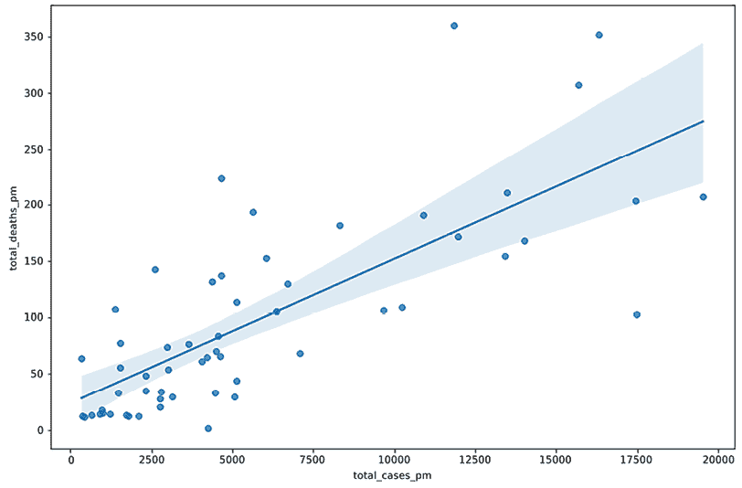

# 第三章：测量你的数据

在收到新数据集的一周内，至少会有人问我们一个熟悉的问题——“那么，看起来怎么样？”这个问题并不总是以轻松的语气提出，别人通常也不太兴奋地听我们已经发现的所有警告信号。可能会有一种紧迫感，希望宣告数据已经准备好进行分析。当然，如果我们太快地签字确认，这可能会带来更大的问题；无效结果的展示、变量关系的误解，以及不得不重新做大部分分析。关键是要在探索数据的其他部分之前，理清我们需要了解的数据内容。本章中的技巧提供了判断数据是否足够清晰以开始分析的方法，即使我们不能说“看起来很好”，至少我们可以说“我很确定我已经识别出主要问题，问题在这里。”

我们的领域知识通常非常有限，或者至少不如那些创建数据的人那么熟练。即使我们对数据中的个体或事件了解不多，我们也必须迅速了解我们所面对的数据内容。很多时候（对我们中的一些人来说，几乎是大多数时候）并没有类似数据字典或代码书这样的东西来帮助我们理解数据。

快速地问问自己，在这种情况下你首先想弄清楚的事情是什么；也就是说，当你获得一些你知道很少的数据时，首先要弄清楚的可能是这样的事情：

+   数据集的行是如何被唯一标识的？（分析单元是什么？）

+   数据集中有多少行和列？

+   关键的分类变量是什么？每个值的频率是多少？

+   重要的连续变量是如何分布的？

+   变量之间可能如何相关——例如，连续变量的分布如何根据数据中的类别而变化？

+   哪些变量的值超出了预期范围，缺失值是如何分布的？

本章介绍了回答前四个问题的基本工具和策略。接下来的章节我们将讨论最后两个问题。

我必须指出，尽管数据结构已经很熟悉，但对数据的第一次处理仍然很重要。例如，当我们收到同一列名和数据类型的新月度或年度数据时，很容易产生一种错误的感觉，认为我们可以直接重新运行之前的程序；我们很难像第一次处理数据时那样保持警觉。大多数人可能都有过这种经历：我们收到结构相同的新数据，但之前问题的答案却有了实质性变化：关键类别变量的新有效值；一直允许但在几期内未曾出现的稀有值；以及客户/学生/顾客状态的意外变化。建立理解数据的例程并始终遵循它们是非常重要的，不论我们是否对数据熟悉。

本章将重点介绍以下主题：

+   初步了解你的数据

+   选择和组织列

+   选择行

+   为分类变量生成频率

+   生成连续变量的汇总统计

+   使用生成性 AI 显示描述性统计数据

# 技术要求

本章中的食谱需要 pandas、Numpy 和 Matplotlib 库。我使用的是 pandas 2.1.4，但代码也可以在 pandas 1.5.3 或更高版本上运行。

本章中的代码可以从本书的 GitHub 仓库下载，[`github.com/PacktPublishing/Python-Data-Cleaning-Cookbook-Second-Edition`](https://github.com/PacktPublishing/Python-Data-Cleaning-Cookbook-Second-Edition)。

# 初步了解你的数据

本章我们将处理两个数据集：*1997 年度国家纵向青少年调查*，这是美国政府进行的一项调查，跟踪了同一群体从 1997 年到 2023 年的情况；以及来自 *Our World in Data* 的各国 COVID-19 案例和死亡人数数据。

## 准备工作…

本食谱主要使用 pandas 库。我们将使用 pandas 工具更深入地了解**国家纵向调查**（**NLS**）和 COVID-19 案例数据。

**数据说明**

青少年 NLS 调查由美国劳工统计局进行。该调查从 1997 年开始，针对 1980 年至 1985 年之间出生的一群人，进行每年跟踪，直到 2023 年。本食谱中，我从调查中的数百个数据项中提取了关于成绩、就业、收入和对政府态度的 89 个变量。SPSS、Stata 和 SAS 的独立文件可以从仓库下载。NLS 数据可以从 [`www.nlsinfo.org`](https://www.nlsinfo.org) 下载。你需要创建一个研究者账户来下载数据，但无需收费。

我们的《全球数据》提供了 COVID-19 的公共使用数据，网址是 [`ourworldindata.org/covid-cases`](https://ourworldindata.org/covid-cases)。该数据集包括总病例数、死亡病例数、已做的检测、医院床位数以及人口统计数据，如中位年龄、国内生产总值和人类发展指数，后者是衡量生活水平、教育水平和寿命的综合指标。本文所用的数据集于 2024 年 3 月 3 日下载。

## 如何操作…

我们将初步查看 NLS 和 COVID-19 数据，包括行数、列数和数据类型：

1.  导入所需的库并加载数据框：

    ```py
    import pandas as pd
    import numpy as np
    nls97 = pd.read_csv("data/nls97.csv")
    covidtotals = pd.read_csv("data/covidtotals.csv",
    ...   parse_dates=['lastdate']) 
    ```

1.  设置并显示 `nls97` 数据的索引和大小。

另外，检查索引值是否唯一：

```py
nls97.set_index("personid", inplace=True)
nls97.index 
```

```py
Index([100061, 100139, 100284, 100292, 100583, 100833,             		...
            999543, 999698, 999963],
           dtype='int64', name='personid', length=8984) 
```

```py
nls97.shape 
```

```py
(8984, 88) 
```

```py
nls97.index.nunique() 
```

```py
8984 
```

1.  显示数据类型和 `non-null` 值的计数：

    ```py
    nls97.info() 
    ```

    ```py
    <class 'pandas.core.frame.DataFrame'>
    Int64Index: 8984 entries, 100061 to 999963
    Data columns (total 88 columns):
     #   Column                Non-Null Count		Dtype 
    ---  ------                --------------		----- 
     0   gender			8984 non-null		object
     1   birthmonth		8984 non-null		int64 
     2   birthyear		8984 non-null		int64 
     3   highestgradecompleted	6663 non-null		float64
     4   maritalstatus		6672 non-null		object
     5   childathome		4791 non-null		float64
     6   childnotathome		4791 non-null		float64
     7   wageincome		5091 non-null		float64
     8   weeklyhrscomputer	6710 non-null		object
     9   weeklyhrstv		6711 non-null		object
     10  nightlyhrssleep	6706 non-null		float64
     11  satverbal		1406 non-null		float64
     12  satmath			1407 non-null		float64
    ...
     83  colenroct15		7469 non-null		object
     84  colenrfeb16		7036 non-null		object
     85  colenroct16		6733 non-null		object
     86  colenrfeb17		6733 non-null		object
     87  colenroct17		6734 non-null		object
    dtypes: float64(29), int64(2), object(57)
    memory usage: 6.1+ MB 
    ```

1.  显示 `nls97` 数据的前两行。

使用转置来显示更多输出：

```py
nls97.head(2).T 
```

```py
personid			100061			100139
gender			Female			Male
birthmonth			5			9
birthyear			1980			1983
highestgradecompleted	13			12
maritalstatus		Married			Married
...	                     	...           		...
colenroct15			1\. Not enrolled	1\. Not enrolled
colenrfeb16			1\. Not enrolled	1\. Not enrolled
colenroct16			1\. Not enrolled	1\. Not enrolled
colenrfeb17			1\. Not enrolled	1\. Not enrolled
colenroct17			1\. Not enrolled	1\. Not enrolled 
```

1.  设置并显示 COVID-19 数据的索引和大小。

另外，检查索引值是否唯一：

```py
covidtotals.set_index("iso_code", inplace=True)
covidtotals.index 
```

```py
Index(['AFG', 'ALB', 'DZA', 'ASM', 'AND', 'AGO', 'AIA', 'ATG', 'ARG',
       'ARM',
       ...
       'URY', 'UZB', 'VUT', 'VAT', 'VEN', 'VNM', 'WLF', 'YEM', 'ZMB',
       'ZWE'],
      dtype='object', name='iso_code', length=231) 
```

```py
covidtotals.shape 
```

```py
(231, 16) 
```

```py
covidtotals.index.nunique() 
```

```py
231 
```

1.  显示数据类型和 `non-null` 值的计数：

    ```py
    covidtotals.info() 
    ```

    ```py
    <class 'pandas.core.frame.DataFrame'>
    Index: 231 entries, AFG to ZWE
    Data columns (total 16 columns):
     #	Column			Non-Null Count  	Dtype        
    ---  ------			--------------  	-----        
     0	lastdate		231 non-null		datetime64[ns]
     1	location		231 non-null		object       
     2	total_cases		231 non-null		float64      
     3	total_deaths		231 non-null		float64      
     4	total_cases_pm		231 non-null		float64      
     5	total_deaths_pm	231 non-null		float64      
     6	population		231 non-null		int64        
     7	pop_density		209 non-null		float64      
     8	median_age		194 non-null		float64      
     9	gdp_per_capita		191 non-null		float64      
     10	hosp_beds		170 non-null		float64      
     11	vac_per_hund		13 non-null		float64      
     12	aged_65_older		188 non-null		float64      
     13	life_expectancy	227 non-null		float64      
     14	hum_dev_ind		187 non-null		float64      
     15	region			231 non-null		object       
    dtypes: datetime64ns, float64(12), int64(1), object(2)
    memory usage: 38.8+ KB 
    ```

1.  显示 COVID-19 数据的两行样本：

    ```py
    covidtotals.sample(2, random_state=1).T 
    ```

    ```py
    iso_code		GHA		NIU
    lastdate		2023-12-03	2023-12-31
    location		Ghana		Niue
    total_cases		171,834		993
    total_deaths		1,462		0
    total_cases_pm	5,133		508,709
    total_deaths_pm	44		0
    population		33475870	1952
    pop_density		127		NaN
    median_age		21		NaN
    gdp_per_capita	4,228		NaN
    hosp_beds		1		NaN
    vac_per_hund		NaN		NaN
    aged_65_older	3		NaN
    life_expectancy	64		74
    hum_dev_ind		1		NaN
    region		West Africa	Oceania / Aus 
    ```

这为我们理解数据框提供了良好的基础，包括它们的大小和列数据类型。

## 它是如何工作的…

在*步骤 2*中，我们为 `nls97` 数据框设置并显示了索引 `personid`。它是一个比默认的 pandas `RangeIndex` 更有意义的索引，后者本质上是从零开始的行号。通常在处理个体作为分析单元时，会有一个唯一标识符，这是一个很好的索引候选。它使得通过该标识符选择一行变得更加简单。我们不需要使用 `nls97.loc[personid==1000061]` 语句来获取该人的数据行，而是可以使用 `nls97.loc[1000061]`。我们将在下一个示例中尝试这一方法。

pandas 使得查看每列的行数和列数、数据类型、非缺失值的数量，以及数据中前几行的列值变得容易。这可以通过使用 `shape` 属性和调用 `info` 方法实现，接着使用 `head` 或 `sample` 方法。使用 `head(2)` 方法显示前两行，但有时从数据框中任意一行获取数据会更有帮助，这时我们可以使用 `sample`。 （当我们调用 `sample` 时，我们设置了种子（`random_state=1`），这样每次运行代码时都会得到相同的结果。）我们可以将对 `head` 或 `sample` 的调用链式调用 `T` 来转置数据框。这将反转行和列的显示顺序。当列的数量比水平方向上能显示的更多时，这个操作很有用，你可以通过转置查看所有列。通过转置行和列，我们能够看到所有的列。

`nls97` DataFrame 的`shape`属性告诉我们该数据集有 8,984 行和 88 列非索引列。由于`personid`是索引，因此不包含在列数中。`info`方法显示，许多列的数据类型是对象型，且部分列有大量缺失值。`satverbal`和`satmath`只有大约 1,400 个有效值。

`covidtotals` DataFrame 的`shape`属性告诉我们该数据集有 231 行和 16 列，其中不包括作为索引使用的国家`iso_code`列（`iso_code`是每个国家的唯一三位数标识符）。对于我们进行的大部分分析，关键变量是`total_cases`、`total_deaths`、`total_cases_pm`和`total_deaths_pm`。`total_cases`和`total_deaths`对每个国家都有数据，但`total_cases_pm`和`total_deaths_pm`在一个国家的数据缺失。

## 还有更多...

我发现，在处理数据文件时，考虑索引能提醒我分析的单位。这在 NLS 数据中并不明显，因为它实际上是伪装成个人级数据的面板数据。面板数据，或称纵向数据，包含同一组个体在一段时间内的数据。在这种情况下，数据收集的时间跨度为 26 年，从 1997 年到 2023 年。调查管理员为了分析方便，通过创建某些年份响应的列（例如，大学入学情况(`colenroct15`至`colenroct17`)）将数据进行了平展。这是一个相对标准的做法，但我们可能需要对某些分析进行重新整形。

我在接收任何面板数据时特别注意的是关键变量在时间上的响应下降。注意从`colenroct15`到`colenroct17`有效值的下降。到 2017 年 10 月，只有 75%的受访者提供了有效回应（6,734/8,984）。在后续分析中，必须牢记这一点，因为剩余的 6,734 名受访者可能在重要方面与整体样本 8,984 人有所不同。

## 另见

*第一章*中的一个食谱，*在导入表格数据时预测数据清理问题（使用 pandas）*，展示了如何将 pandas DataFrame 保存为 feather 或 pickle 文件。在本章后续的食谱中，我们将查看这两个 DataFrame 的描述性统计和频率分析。

我们在*第十一章*中对 NLS 数据进行了整形，*数据整理与重塑*，恢复了其作为面板数据的实际结构。这对于生存分析等统计方法是必要的，也更接近整洁数据的理想状态。

# 选择和组织列

在本食谱中，我们探索了几种从 DataFrame 中选择一个或多个列的方法。我们可以通过将列名列表传递给`[]`括号操作符，或者使用 pandas 特定的`loc`和`iloc`数据访问器来选择列。

在清理数据或进行探索性分析或统计分析时，专注于与当前问题或分析相关的变量是非常有帮助的。这使得根据列之间的实质性或统计关系对列进行分组，或在任何时候限制我们正在研究的列变得非常重要。我们有多少次对自己说过类似 *“为什么变量 A 在变量 B 为 y 时的值是 x？”* 的话呢？只有当我们查看的数据量在某一时刻不超过我们当时的感知能力时，我们才能做到这一点。

## 准备工作……

在本食谱中，我们将继续使用**国家纵向调查**（**NLS**）数据。

## 如何做到……

我们将探索几种选择列的方法：

1.  导入 `pandas` 库并将 NLS 数据加载到 pandas 中。

同时，将 NLS 数据中所有对象数据类型的列转换为类别数据类型。通过使用 `select_dtypes` 选择对象数据类型的列，并利用 `transform` 及 `lambda` 函数将数据类型转换为 `category` 来实现：

```py
import pandas as pd
import numpy as np
nls97 = pd.read_csv("data/nls97.csv")
nls97.set_index("personid", inplace=True)
nls97[nls97.select_dtypes(['object']).columns] = \
  nls97.select_dtypes(['object']). \
  transform(lambda x: x.astype('category')) 
```

1.  使用 pandas 的 `[]` 括号操作符和 `loc` 以及 `iloc` 访问器选择列。

我们将一个与列名匹配的字符串传递给括号操作符，从而返回一个 pandas Series。如果我们传入一个包含该列名的单一元素的列表（`nls97[['gender']]`），则返回一个 DataFrame。我们还可以使用 `loc` 和 `iloc` 访问器来选择列：

```py
analysisdemo = nls97['gender']
type(analysisdemo) 
```

```py
<class 'pandas.core.series.Series'> 
```

```py
analysisdemo = nls97[['gender']]
type(analysisdemo) 
```

```py
<class 'pandas.core.frame.DataFrame'> 
```

```py
analysisdemo = nls97.loc[:,['gender']]
type(analysisdemo) 
```

```py
<class 'pandas.core.frame.DataFrame'> 
```

```py
analysisdemo = nls97.iloc[:,[0]]
type(analysisdemo) 
```

```py
<class 'pandas.core.frame.DataFrame'> 
```

1.  从 pandas DataFrame 中选择多个列。

使用括号操作符和 `loc` 选择几个列：

```py
analysisdemo = nls97[['gender','maritalstatus',
...  'highestgradecompleted']]
analysisdemo.shape 
```

```py
(8984, 3) 
```

```py
analysisdemo.head() 
```

```py
 gender		maritalstatus		highestgradecompleted
personid                                             
100061	Female		Married			13
100139	Male		Married			12
100284	Male		Never-married		7
100292	Male		NaN			nan
100583	Male		Married			13 
```

```py
analysisdemo = nls97.loc[:,['gender','maritalstatus',
...  'highestgradecompleted']]
analysisdemo.shape 
```

```py
(8984, 3) 
```

```py
analysisdemo.head() 
```

```py
 gender  	maritalstatus		highestgradecompleted
personid                                             
100061	Female		Married			13
100139	Male		Married			12
100284	Male		Never-married		7
100292	Male		NaN			nan
100583	Male		Married			13 
```

1.  基于列名列表选择多个列。

如果你选择的列超过几个，最好单独创建一个列名列表。在这里，我们创建了一个用于分析的关键变量 `keyvars` 列表：

```py
keyvars = ['gender','maritalstatus',
...  'highestgradecompleted','wageincome',
...  'gpaoverall','weeksworked17','colenroct17']
analysiskeys = nls97[keyvars]
analysiskeys.info() 
```

```py
<class 'pandas.core.frame.DataFrame'>
Int64Index: 8984 entries, 100061 to 999963
Data columns (total 7 columns):
 #   Column			Non-Null Count		Dtype  
---  ------			--------------		-----  
 0   gender			8984 non-null		category
 1   maritalstatus		6672 non-null		category
 2   highestgradecompleted	6663 non-null		float64
 3   wageincome		5091 non-null		float64
 4   gpaoverall		6004 non-null		float64
 5   weeksworked17		6670 non-null		float64
 6   colenroct17		6734 non-null		category
dtypes: category(3), float64(4)
memory usage: 377.7 KB 
```

1.  通过列名过滤选择一个或多个列。

使用 `filter` 操作符选择所有的 `weeksworked##` 列：

```py
analysiswork = nls97.filter(like="weeksworked")
analysiswork.info() 
```

```py
<class 'pandas.core.frame.DataFrame'>
Int64Index: 8984 entries, 100061 to 999963
Data columns (total 18 columns):
 #   Column         Non-Null Count  Dtype 
---  ------         --------------  ----- 
 0   weeksworked00  8603 non-null   float64
 1   weeksworked01  8564 non-null   float64
 2   weeksworked02  8556 non-null   float64
 3   weeksworked03  8490 non-null   float64
 4   weeksworked04  8458 non-null   float64
 5   weeksworked05  8403 non-null   float64
 6   weeksworked06  8340 non-null   float64
 7   weeksworked07  8272 non-null   float64
 8   weeksworked08  8186 non-null   float64
 9   weeksworked09  8146 non-null   float64
 10  weeksworked10  8054 non-null   float64
 11  weeksworked11  7968 non-null   float64
 12  weeksworked12  7747 non-null   float64
 13  weeksworked13  7680 non-null   float64
 14  weeksworked14  7612 non-null   float64
 15  weeksworked15  7389 non-null   float64
 16  weeksworked16  7068 non-null   float64
 17  weeksworked17  6670 non-null   float64
dtypes: float64(18)
memory usage: 1.3 MB 
```

1.  选择所有类别数据类型的列。

使用 `select_dtypes` 方法按数据类型选择列：

```py
analysiscats = nls97.select_dtypes(include=["category"])
analysiscats.info() 
```

```py
<class 'pandas.core.frame.DataFrame'>
Int64Index: 8984 entries, 100061 to 999963
Data columns (total 57 columns):
 #   Column			Non-Null Count		Dtype  
---  ------			--------------		-----  
 0   gender			8984 non-null		category
 1   maritalstatus		6672 non-null		category
 2   weeklyhrscomputer	6710 non-null		category
 3   weeklyhrstv		6711 non-null		category
 4   highestdegree		8953 non-null		category
...
 49  colenrfeb14		7624 non-null		category
 50  colenroct14		7469 non-null		category
 51  colenrfeb15		7469 non-null		category
 52  colenroct15		7469 non-null		category
 53  colenrfeb16		7036 non-null		category
 54  colenroct16		6733 non-null		category
 55  colenrfeb17		6733 non-null		category
 56  colenroct17		6734 non-null		category
dtypes: category(57)
memory usage: 580.0 KB 
```

1.  使用列名列表组织列。

使用列表组织 DataFrame 中的列。通过这种方式，你可以轻松地更改列的顺序或排除一些列。在这里，我们将 `demoadult` 列表中的列移到前面：

```py
demo = ['gender','birthmonth','birthyear']
highschoolrecord = ['satverbal','satmath','gpaoverall',
...  'gpaenglish','gpamath','gpascience']
govresp = ['govprovidejobs','govpricecontrols',
...   'govhealthcare','govelderliving','govindhelp',
...   'govunemp','govincomediff','govcollegefinance',
...   'govdecenthousing','govprotectenvironment']
demoadult = ['highestgradecompleted','maritalstatus',
...   'childathome','childnotathome','wageincome',
...   'weeklyhrscomputer','weeklyhrstv','nightlyhrssleep',
...   'highestdegree']
weeksworked = ['weeksworked00','weeksworked01',
...   'weeksworked02','weeksworked03','weeksworked04',
       ...
      'weeksworked14','weeksworked15','weeksworked16',
...   'weeksworked17']
colenr = ['colenrfeb97','colenroct97','colenrfeb98',
...   'colenroct98','colenrfeb99','colenroct99',
       .
...   'colenrfeb15','colenroct15','colenrfeb16',...   'colenroct16','colenrfeb17','colenroct17'] 
```

1.  创建新的重新组织后的 DataFrame：

    ```py
    nls97 = nls97[demoadult + demo + highschoolrecord + \
    ...   govresp + weeksworked + colenr]
    nls97.dtypes 
    ```

    ```py
    highestgradecompleted	float64
    maritalstatus		category
    childathome			float64
    childnotathome		float64
    wageincome			float64
                               ...  
    colenroct15			category
    colenrfeb16			category
    colenroct16			category
    colenrfeb17			category
    colenroct17			category
    Length: 88, dtype: object 
    ```

上述步骤展示了如何在 `pandas` DataFrame 中选择列并更改列的顺序。

## 它是如何工作的……

`[]` 括号操作符和 `loc` 数据访问器在选择和组织列时非常方便。当传入一个列名列表时，它们都会返回一个 DataFrame，列的顺序将按照传入的列名列表进行排列。

在*步骤 1*中，我们使用`nls97.select_dtypes(['object'])`来选择数据类型为对象的列，并将其与`transform`和`lambda`函数（`transform(lambda x: x.astype('category'))`）链式调用，将这些列转换为类别类型。我们使用`loc`访问器只更新数据类型为对象的列（`nls97.loc[:, nls97.dtypes == 'object']`）。我们将在*第六章*中详细讲解`transform`、`apply`（与`transform`类似）和`lambda`函数的使用，*清理和探索数据操作*。

我们在*步骤 6*中通过数据类型选择列。`select_dtypes`在将列传递给如`describe`或`value_counts`等方法时非常有用，尤其是当你想将分析限制为连续变量或类别变量时。

在*步骤 8*中，当使用括号操作符时，我们将六个不同的列表连接起来。这将`demoadult`中的列名移到前面，并根据这六个组重新组织所有列。现在，我们的 DataFrame 列中有了清晰的*高中记录*和*工作周数*部分。

## 还有更多…

我们还可以使用`select_dtypes`来排除数据类型。如果我们只对`info`结果感兴趣，我们可以将`select_dtypes`与`info`方法链式调用：

```py
nls97.select_dtypes(exclude=["category"]).info() 
```

```py
<class 'pandas.core.frame.DataFrame'>
Int64Index: 8984 entries, 100061 to 999963
Data columns (total 31 columns):
 #   Column				Non-Null Count		Dtype 
---  ------				--------------		----- 
 0   highestgradecompleted		6663 non-null		float64
 1   childathome			4791 non-null		float64
 2   childnotathome		4	791 non-null		float64
 3   wageincome			5091 non-null		float64
 4   nightlyhrssleep		6706 non-null		float64
 5   birthmonth			8984 non-null		int64 
 6   birthyear			8984 non-null		int64 
...
 25  weeksworked12			7747 non-null		float64
 26  weeksworked13			7680 non-null		float64
 27  weeksworked14			7612 non-null		float64
 28  weeksworked15			7389 non-null		float64
 29  weeksworked16			7068 non-null		float64
 30  weeksworked17			6670 non-null		float64
dtypes: float64(29), int64(2)
memory usage: 2.2 MB 
```

`filter`操作符也可以接受正则表达式。例如，你可以返回列名中包含`income`的列：

```py
nls97.filter(regex='income') 
```

```py
 wageincome	govincomediff
personid                         
100061	12,500		NaN
100139	120,000		NaN
100284	58,000		NaN
100292	nan		NaN
100583	30,000		NaN
...		...		...
999291	35,000		NaN
999406	116,000		NaN
999543	nan		NaN
999698	nan		NaN
999963	50,000		NaN 
```

## 另见

许多这些技巧也可以用于创建`pandas`的 Series 以及 DataFrame。我们在*第六章*中演示了这一点，*清理和探索数据操作*。

# 选择行

当我们在衡量数据并回答问题*“它看起来怎么样？”*时，我们不断地放大和缩小，查看汇总数据和特定行。但也有一些只有在中等缩放级别下才能明显看到的数据问题，只有当我们查看某些行的子集时，这些问题才会浮现。本篇食谱展示了如何使用`pandas`工具在数据的子集上检测数据问题。

## 准备就绪...

在本篇食谱中，我们将继续使用 NLS 数据。

## 如何操作...

我们将讨论几种选择`pandas` DataFrame 中行的技巧：

1.  导入`pandas`和`numpy`，并加载`nls97`数据：

    ```py
    import pandas as pd
    import numpy as np
    nls97 = pd.read_csv("data/nls97.csv")
    nls97.set_index("personid", inplace=True) 
    ```

1.  使用切片从第 1001 行开始，到第 1004 行结束。

`nls97[1000:1004]`选择从左侧冒号指示的整数所在的行（此例中是`1000`）开始，到右侧冒号指示的整数所在的行（此例中是`1004`）之前的行。由于基于零索引，`1000`行实际上是第 1001 行。每一行都作为列出现在输出中，因为我们对结果 DataFrame 进行了转置：

```py
nls97[1000:1004].T 
```

```py
personid                 195884  195891           195970           195996
gender                   Male    Male             Female           Female
birthmonth               12      9                3                9
birthyear                1981    1980             1982             1980
highestgradecompleted    NaN     12               17               NaN
maritalstatus            NaN     Never-married    Never-married    NaN
...                      ...     ...              ...              ...colenroct15              NaN     1\. Not enrolled  1\. Not enrolled  NaN
colenrfeb16              NaN     1\. Not enrolled  1\. Not enrolled  NaN
colenroct16              NaN     1\. Not enrolled  1\. Not enrolled  NaN
colenrfeb17              NaN     1\. Not enrolled  1\. Not enrolled  NaN
colenroct17              NaN     1\. Not enrolled  1\. Not enrolled  NaN 
```

1.  使用切片从第 1001 行开始，到第 1004 行结束，跳过每隔一行。

第二个冒号后的整数（在这里是`2`）表示步长。当步长被省略时，它默认是 1。注意，设置步长为`2`时，我们跳过了每隔一行的行：

```py
nls97[1000:1004:2].T 
```

```py
personid			195884		195970
gender			Male		Female
birthmonth			12		3
birthyear			1981		1982
highestgradecompleted	NaN		17
maritalstatus		NaN		Never-married
...				...		...
colenroct15			NaN		1\. Not enrolled
colenrfeb16			NaN		1\. Not enrolled
colenroct16			NaN		1\. Not enrolled
colenrfeb17			NaN		1\. Not enrolled
colenroct17			NaN		1\. Not enrolled 
```

1.  使用`[]`操作符切片选择前三行。

在`[:3]`中不提供冒号左侧的值，意味着我们告诉操作符从 DataFrame 的起始位置获取行：

```py
nls97[:3].T 
```

```py
personid	100061           100139           100284
gender	Female           Male             Male
birthmonth	5                9                11
birthyear	1980             1983             1984
...          ...              ...              ...
colenroct15	1\. Not enrolled  1\. Not enrolled  1\. Not enrolled
colenrfeb16  1\. Not enrolled  1\. Not enrolled  1\. Not enrolled
colenroct16  1\. Not enrolled  1\. Not enrolled  1\. Not enrolled
colenrfeb17  1\. Not enrolled  1\. Not enrolled  1\. Not enrolled
colenroct17  1\. Not enrolled  1\. Not enrolled  1\. Not enrolled 
```

请注意，`nls97[:3]`返回的 DataFrame 与`nls97.head(3)`返回的是相同的。

1.  使用`[]`操作符切片选择最后三行：

    ```py
    nls97[-3:].T 
    ```

    ```py
    personid	999543	999698	999963
    gender	Female	Female	Female
    birthmonth	8	5	9
    birthyear	1984	1983	1982
    ...                      ...              ...              ...
    colenroct15  1\. Not enrolled  1\. Not enrolled  1\. Not enrolled
    colenrfeb16  1\. Not enrolled  1\. Not enrolled  1\. Not enrolled
    colenroct16  1\. Not enrolled  1\. Not enrolled  1\. Not enrolled
    colenrfeb17  1\. Not enrolled  1\. Not enrolled  1\. Not enrolled
    colenroct17  1\. Not enrolled  1\. Not enrolled  1\. Not enrolled 
    ```

请注意，`nls97[-3:]`返回的 DataFrame 与`nls97.tail(3)`返回的是相同的。

1.  使用`loc`数据访问器选择几行。

使用`loc`访问器按`index`标签选择。我们可以传递一个索引标签的列表，或者指定一个标签范围。（回顾一下，我们已经将`personid`设置为索引。）请注意，`nls97.loc[[195884,195891,195970]]`和`nls97.loc[195884:195970]`返回的是相同的 DataFrame，因为这些行是连续的。

```py
nls97.loc[[195884,195891,195970]].T 
```

```py
personid		     195884 195891		195970
gender		     Male   Male		Female
birthmonth		     12     9			3
birthyear		     1981   1980		1982
highestgradecompleted    NaN    12			17
maritalstatus            NaN    Never-married    Never-married
...                      ...   ...              ...
colenroct15              NaN    1\. Not enrolled  1\. Not enrolled
colenrfeb16              NaN    1\. Not enrolled  1\. Not enrolled
colenroct16              NaN    1\. Not enrolled  1\. Not enrolled
colenrfeb17              NaN    1\. Not enrolled  1\. Not enrolled
colenroct17              NaN    1\. Not enrolled  1\. Not enrolled 
```

```py
nls97.loc[195884:195970].T 
```

```py
personid		     195884  195891		 195970
gender		     Male    Male		 Female
birthmonth		     12      9			 3
birthyear		     1981    1980		 1982
highestgradecompleted    NaN     12		 17
maritalstatus            NaN     Never-married    Never-married
...                      ...     ...              ...
colenroct15              NaN     1\. Not enrolled  1\. Not enrolled
colenrfeb16              NaN     1\. Not enrolled  1\. Not enrolled
colenroct16              NaN     1\. Not enrolled  1\. Not enrolled
colenrfeb17              NaN     1\. Not enrolled  1\. Not enrolled
colenroct17              NaN     1\. Not enrolled  1\. Not enrolled 
```

1.  使用`iloc`数据访问器从 DataFrame 的开始位置选择一行。

`iloc`与`loc`的不同之处在于，它接受一组行位置的整数，而不是索引标签。因此，它的工作方式类似于括号操作符切片。在这一步中，我们首先传递一个包含值`0`的单元素列表。这将返回一个包含第一行的 DataFrame：

```py
nls97.iloc[[0]].T 
```

```py
personid			100061
gender			Female
birthmonth			5
birthyear			1980
highestgradecompleted	13
maritalstatus		Married
...                                ...
colenroct15			1\. Not enrolled
colenrfeb16			1\. Not enrolled
colenroct16			1\. Not enrolled
colenrfeb17			1\. Not enrolled
colenroct17			1\. Not enrolled 
```

1.  使用`iloc`数据访问器选择数据框的几行。

我们传递一个包含三个元素的列表`[0,1,2]`，以返回`nls97`的前三行的 DataFrame：

```py
nls97.iloc[[0,1,2]].T 
```

```py
personid      100061            100139            100284
gender        Female            Male              Male
birthmonth    5                 9                 11
birthyear     1980              1983              1984
...           ...               ...               ...
colenroct15   1\. Not enrolled   1\. Not enrolled   1\. Not enrolled
colenrfeb16   1\. Not enrolled   1\. Not enrolled   1\. Not enrolled
colenroct16   1\. Not enrolled   1\. Not enrolled   1\. Not enrolled
colenrfeb17   1\. Not enrolled   1\. Not enrolled   1\. Not enrolled
colenroct17   1\. Not enrolled   1\. Not enrolled   1\. Not enrolled 
```

如果我们将`[0:3]`传递给访问器，结果是一样的。

1.  使用`iloc`数据访问器从 DataFrame 的末尾选择几行。

使用`nls97.iloc[[-3,-2,-1]]`来获取 DataFrame 的最后三行：

```py
nls97.iloc[[-3,-2,-1]].T 
```

```py
personid	999543           999698           999963
gender	Female           Female           Female
birthmonth	8                5                9
birthyear	1984             1983             1982
...          ...              ...              ...
colenroct15  1\. Not enrolled  1\. Not enrolled  1\. Not enrolled
colenrfeb16  1\. Not enrolled  1\. Not enrolled  1\. Not enrolled
colenroct16  1\. Not enrolled  1\. Not enrolled  1\. Not enrolled
colenrfeb17  1\. Not enrolled  1\. Not enrolled  1\. Not enrolled
colenroct17  1\. Not enrolled  1\. Not enrolled  1\. Not enrolled 
```

使用`nls97.iloc[-3:]`也能得到相同的结果。通过不在`[-3:]`的冒号右侧提供值，我们告诉访问器获取从倒数第三行到 DataFrame 结尾的所有行。

1.  使用布尔索引按条件选择多行。

创建一个只包含睡眠时间极少的个体的 DataFrame。约有 5%的调查对象每晚睡眠时间为 4 小时或更少，调查共有 6,706 人回答了该问题。通过`nls97.nightlyhrssleep<=4`来测试哪些人每晚睡眠 4 小时或更少，这将生成一个`True`和`False`值的 pandas 系列，我们将其赋值给`sleepcheckbool`。将该系列传递给`loc`访问器以创建一个`lowsleep` DataFrame。`lowsleep`大约有我们预期的行数。我们不需要额外的步骤来将布尔系列赋值给变量。这里这样做仅仅是为了说明：

```py
nls97.nightlyhrssleep.quantile(0.05) 
```

```py
4.0 
```

```py
nls97.nightlyhrssleep.count() 
```

```py
6706 
```

```py
sleepcheckbool = nls97.nightlyhrssleep<=4
sleepcheckbool 
```

```py
personid
100061    False
100139    False
100284    False
100292    False
100583    False
          ... 
999291    False
999406    False
999543    False
999698    False
999963    False
Name: nightlyhrssleep, Length: 8984, dtype: bool 
```

```py
lowsleep = nls97.loc[sleepcheckbool]
lowsleep.shape 
```

```py
(364, 88) 
```

1.  基于多个条件选择行。

可能有些没有得到充足睡眠的人，也有不少孩子和他们一起生活。使用`describe`来了解那些有`lowsleep`的人群中，孩子数量的分布情况。大约四分之一的人有三个或更多孩子。创建一个新的 DataFrame，包含那些`nightlyhrssleep`为 4 小时或更少，且家中有 3 个或更多孩子的个体。`&`是 pandas 中的逻辑*与*运算符，表示只有当两个条件都满足时，行才会被选中：

```py
lowsleep.childathome.describe() 
```

```py
count		293.00
mean		1.79
std		1.40
min		0.00
25%		1.00
50%		2.00
75%		3.00
max		9.00 
```

```py
lowsleep3pluschildren = nls97.loc[(nls97.nightlyhrssleep<=4) & (nls97.childathome>=3)]
lowsleep3pluschildren.shape 
```

```py
(82, 88) 
```

如果我们从`lowsleep` DataFrame 开始，结果是一样的 – `lowsleep3pluschildren = lowsleep.loc[lowsleep.childathome>=3]` – 但那样我们就无法展示多个条件的测试。

1.  根据多个条件选择行和列。

将条件传递给`loc`访问器以选择行。还可以传递一个列名的列表来选择列：

```py
lowsleep3pluschildren = nls97.loc[(nls97.nightlyhrssleep<=4) & (nls97.childathome>=3), ['nightlyhrssleep','childathome']]
lowsleep3pluschildren 
```

```py
 nightlyhrssleep	childathome
personid                             
119754	4			4
141531	4			5
152706	4			4
156823	1			3
158355	4			4
...         ...			...
905774	4			3
907315	4			3
955166	3			3
956100	4			6
991756	4			3 
```

上述步骤展示了在 pandas 中选择行的关键技巧。

## 它是如何工作的…

在*步骤 2*到*步骤 5*中，我们使用了`[]`方括号运算符来做标准的类似 Python 的切片操作，选择行。这个运算符使得我们可以根据列出或范围的值，轻松选择行。切片表示法的形式为`[start:end:step]`，其中如果没有提供`step`值，则默认假定为`1`。当`start`使用负数时，它表示从 DataFrame 的末尾开始算起的行数。

`loc`访问器，在*步骤 6*中使用，根据行索引标签选择行。由于`personid`是 DataFrame 的索引，我们可以将一个或多个`personid`值的列表传递给`loc`访问器，以获得具有这些索引标签的行的 DataFrame。我们也可以将一系列索引标签传递给访问器，这将返回一个包含所有行的 DataFrame，这些行的索引标签介于冒号左边和右边的标签之间（包含这两个标签）；因此，`nls97.loc[195884:195970]`将返回`personid`在`195884`和`195970`之间的行的 DataFrame，包括这两个值。

`iloc`访问器的工作方式与方括号运算符非常相似。这一点在*步骤 7*到*步骤 9*中有所体现。我们可以传递整数列表或使用切片表示法传递一个范围。

pandas 最有价值的功能之一是布尔索引。它使得条件选择行变得非常简单。我们在*步骤 10*中看到了这一点。一个测试返回一个布尔序列。`loc`访问器选择所有测试为`True`的行。实际上，我们并不需要将布尔数据序列赋值给一个变量，再将该变量传递给`loc`运算符。我们本可以直接将测试条件传递给`loc`访问器，如`nls97.loc[nls97.nightlyhrssleep<=4]`。

我们应该仔细查看如何在 *步骤 11* 中使用 `loc` 访问器选择行。在 `nls97.loc[(nls97.nightlyhrssleep<=4) & (nls97.childathome>=3)]` 中，每个条件都被括号括起来。如果省略括号，将会产生错误。`&` 操作符在标准 Python 中等同于 `and`，意味着 *两个* 条件都必须为 `True`，对应的行才会被选择。如果我们想选择 *任一* 条件为 `True` 的行，则会使用 `|` 来代替 `&`。

最后，*步骤 12* 演示了如何在一次调用 `loc` 访问器时同时选择行和列。选择行的条件出现在逗号前，选择的列出现在逗号后，如以下语句所示：

```py
nls97.loc[(nls97.nightlyhrssleep<=4) & (nls97.childathome>=3), ['nightlyhrssleep','childathome']] 
```

这将返回 `nightlyhrssleep` 和 `childathome` 列的所有行，其中每行的 `nightlyhrssleep` 小于或等于 4，且 `childathome` 大于或等于 3。

## 还有更多…

在本食谱中，我们使用了三种不同的工具从 pandas DataFrame 中选择行：`[]` 方括号操作符、以及两个 pandas 特有的访问器，`loc` 和 `iloc`。如果你是 pandas 新手，这可能有点混淆，但只需几个月的使用，你就会明白在不同情况下该使用哪个工具。如果你是带着一定的 Python 和 NumPy 经验来学习 pandas 的，你可能会发现 `[]` 操作符最为熟悉。然而，pandas 文档建议在生产代码中不要使用 `[]` 操作符。我已经习惯了仅在从 DataFrame 中选择列时使用该操作符。选择行时，我使用 `loc` 访问器进行布尔索引或按索引标签选择，使用 `iloc` 访问器按行号选择行。由于我的工作流程中使用了大量布尔索引，我比其他方法使用 `loc` 要多得多。

## 另见

紧接着前面的食谱，*选择和组织列*，对列选择有更详细的讨论。

# 为分类变量生成频率

多年前，一位经验丰富的研究人员对我说，*“我们要找到的 90%的内容，都会在频率分布中看到。”* 这句话一直深深印在我心中。通过对 DataFrame 做更多的一维和二维频率分布（交叉表），我对其理解也越来越深刻。在本食谱中，我们将进行一维分布，之后的食谱将介绍交叉表。

## 准备好…

我们将继续处理 NLS 数据集。我们还会使用过滤方法进行大量的列选择。虽然不必重新审视本章关于列选择的食谱，但它可能会有所帮助。

## 如何操作…

我们使用 pandas 工具生成频率，尤其是非常方便的 `value_counts`：

1.  加载 `pandas` 库和 `nls97` 文件。

此外，将对象数据类型的列转换为类别数据类型：

```py
import pandas as pd
nls97 = pd.read_csv("data/nls97.csv")
nls97.set_index("personid", inplace=True)
nls97[nls97.select_dtypes(['object']).columns] = \
  nls97.select_dtypes(['object']). \
  transform(lambda x: x.astype('category')) 
```

1.  显示类别数据类型列的名称，并检查缺失值的数量。

请注意，`gender` 列没有缺失值，`highestdegree` 只有少数缺失值，但 `maritalstatus` 和其他列有许多缺失值：

```py
catcols = nls97.select_dtypes(include=["category"]).columns
nls97[catcols].isnull().sum() 
```

```py
gender		0
maritalstatus	2312
weeklyhrscomputer	2274
weeklyhrstv		2273
highestdegree	31
                    ...
colenroct15		1515
colenrfeb16		1948
colenroct16		2251
colenrfeb17		2251
colenroct17		2250
Length: 57, dtype: int64 
```

1.  显示婚姻状况的频率：

    ```py
    nls97.maritalstatus.value_counts() 
    ```

    ```py
    Married		3066
    Never-married	2766
    Divorced		663
    Separated		154
    Widowed		23
    Name: maritalstatus, dtype: int64 
    ```

1.  关闭按频率排序：

    ```py
    nls97.maritalstatus.value_counts(sort=False) 
    ```

    ```py
    Divorced		663
    Married		3066
    Never-married	2766
    Separated		154
    Widowed		23
    Name: maritalstatus, dtype: int64 
    ```

1.  显示百分比而非计数：

    ```py
    nls97.maritalstatus.value_counts(sort=False, normalize=True) 
    ```

    ```py
    Divorced		0.10
    Married		0.46
    Never-married	0.41
    Separated		0.02
    Widowed		0.00
    Name: maritalstatus, dtype: float64 
    ```

1.  显示所有政府责任列的百分比。

仅筛选出政府责任列的 DataFrame，然后使用 `apply` 在该 DataFrame 的所有列上运行 `value_counts`：

```py
nls97.filter(like="gov").apply(pd.Series.value_counts, normalize=True) 
```

```py
 govprovidejobs		govpricecontrols	...  \
1\. Definitely	0.25			0.54			...  
2\. Probably		0.34			0.33			...  
3\. Probably not	0.25			0.09			...  
4\. Definitely not	0.16			0.04			...  
                    govdecenthousing	govprotectenvironment 
1\. Definitely	0.44			0.67 
2\. Probably		0.43			0.29 
3\. Probably not	0.10			0.03 
4\. Definitely not	0.02			0.02 
```

1.  找出所有政府责任列中已婚人数的百分比。

做我们在 *第 6 步* 中所做的，但首先选择仅 `maritalstatus` 为 `Married` 的行：

```py
nls97[nls97.maritalstatus=="Married"].\
... filter(like="gov").\
... apply(pd.Series.value_counts, normalize=True) 
```

```py
 govprovidejobs		govpricecontrols	...  \
1\. Definitely	0.17			0.46			...  
2\. Probably		0.33			0.38			...  
3\. Probably not	0.31			0.11			...  
4\. Definitely not	0.18			0.05			...  
                    govdecenthousing	govprotectenvironment 
1\. Definitely	0.36			0.64 
2\. Probably		0.49			0.31 
3\. Probably not	0.12			0.03 
4\. Definitely not	0.03			0.01 
```

1.  找出所有类别列的频率和百分比。

首先，打开一个文件以写出频率：

```py
for col in nls97.\
  select_dtypes(include=["category"]):
    print(col, "----------------------",
      "frequencies",
    nls97[col].value_counts(sort=False),
      "percentages",
    nls97[col].value_counts(normalize=True,
      sort=False),
    sep="\n\n", end="\n\n\n", file=freqout)
freqout.close() 
```

这会生成一个文件，其开头如下所示：

```py
gender
----------------------
frequencies
Female	4385
Male		4599
Name: gender, dtype: int64
percentages
Female	0.49
Male		0.51
Name: gender, dtype: float64 
```

正如这些步骤所展示的，`value_counts` 在我们需要为一个或多个 DataFrame 列生成频率时非常有用。

## 它是如何工作的……

`nls97` DataFrame 中大部分列（88 列中的 57 列）具有对象数据类型。如果我们处理的数据在逻辑上是类别型的，但在 pandas 中没有类别数据类型，将其转换为类别类型是有充分理由的。这不仅节省内存，还使得数据清理变得更简单，就像我们在本教程中看到的那样。

本教程的重点是 `value_counts` 方法。它可以为 Series 生成频率，就像我们使用 `nls97.maritalstatus.value_counts` 所做的那样。它也可以在整个 DataFrame 上运行，就像我们使用 `nls97.filter(like="gov").apply(pd.Series.value_counts, normalize=True)` 所做的那样。我们首先创建一个只包含政府责任列的 DataFrame，然后将生成的 DataFrame 传递给 `value_counts` 与 `apply` 一起使用。

你可能注意到在 *第 7 步* 中，我将链式操作拆分成了多行，以便更易于阅读。关于何时拆分并没有严格的规则。我通常会在链式操作涉及三次或更多操作时尝试这样做。

在 *第 8 步* 中，我们遍历了所有类别数据类型的列：`for col in nls97.select_dtypes(include=["category"])`。对于每一列，我们运行了 `value_counts` 获取频率，再次运行 `value_counts` 获取百分比。我们使用 `print` 函数生成换行符，使输出更易读。所有这些都保存在 `views` 子文件夹中的 `frequencies.txt` 文件中。我发现保留一组单向频率数据是非常方便的，便于在对类别变量进行任何工作之前进行检查。*第 8 步* 就是实现这一目标的。

## 还有更多……

频率分布可能是发现类别数据潜在问题最重要的统计工具。我们在本教程中生成的单向频率是进一步洞察的良好基础。

然而，我们通常只有在检查分类变量与其他变量（无论是分类的还是连续的）之间的关系时，才能发现问题。尽管在这个例子中我们没有进行双向频率分析，但我们确实在*第 7 步*中开始了拆分数据进行调查的过程。在那一步中，我们查看了已婚个体的政府责任回应，并发现这些回应与整体样本的回应有所不同。

这引发了我们需要探索的几个关于数据的问题。婚姻状况是否会影响回应率，这是否会对政府责任变量的分布产生影响？在得出结论之前，我们还需要谨慎考虑潜在的混杂变量。已婚的受访者是否更可能年纪较大或拥有更多孩子，这些因素是否对他们的政府责任回答更为重要？

我使用婚姻状况变量作为示例，说明生成单向频率（如本例中的频率）可能会引发的查询问题。在遇到类似问题时，准备一些双变量分析（如相关矩阵、交叉表或一些散点图）总是明智的。我们将在接下来的两章中生成这些分析。

# 为连续变量生成总结统计数据

pandas 提供了大量工具，我们可以利用它们了解连续变量的分布。我们将在本例中重点展示`describe`的强大功能，并演示直方图在可视化变量分布中的作用。

在对连续变量进行任何分析之前，理解它的分布非常重要——它的集中趋势、分布范围以及偏态性。这些理解大大帮助我们识别离群值和异常值。然而，这本身也是至关重要的信息。我认为并不夸张地说，如果我们能够很好地理解某个变量的分布，我们就能很好地理解它，而没有这种理解的任何解释都会不完整或有缺陷。

## 准备就绪……

在这个例子中，我们将使用 COVID-19 总数数据。你需要**Matplotlib**来运行此代码。如果你的机器上尚未安装它，可以通过在终端输入`pip install matplotlib`来安装。

## 如何做……

让我们看一下几个关键连续变量的分布：

1.  导入`pandas`、`numpy`和`matplotlib`，并加载 COVID-19 病例总数数据：

    ```py
    import pandas as pd
    import numpy as np
    import matplotlib.pyplot as plt
    covidtotals = pd.read_csv("data/covidtotals.csv",
    ...   parse_dates=['lastdate'])
    covidtotals.set_index("iso_code", inplace=True) 
    ```

1.  让我们回顾一下数据的结构：

    ```py
    covidtotals.shape 
    ```

    ```py
    (231, 16) 
    ```

    ```py
    covidtotals.sample(1, random_state=1).T 
    ```

    ```py
    iso_code		GHA  \
    lastdate		2023-12-03 00:00:00  
    location		Ghana  
    total_cases		171,834.00  
    total_deaths		1,462.00  
    total_cases_pm	5,133.07  
    total_deaths_pm	43.67  
    population		33475870  
    pop_density		126.72  
    median_age		21.10  
    gdp_per_capita	4,227.63  
    hosp_beds		0.90  
    vac_per_hund		NaN  
    aged_65_older	3.38  
    life_expectancy	64.07  
    hum_dev_ind		0.61  
    region		West Africa 
    ```

    ```py
    covidtotals.dtypes 
    ```

    ```py
    lastdate		datetime64[ns]
    location		object
    total_cases		float64
    total_deaths		float64
    total_cases_pm	float64
    total_deaths_pm	float64
    population		int64
    pop_density		float64
    median_age		float64
    gdp_per_capita	float64
    hosp_beds		float64
    vac_per_hund		float64
    aged_65_older	float64
    life_expectancy	float64
    hum_dev_ind		float64
    region		object
    dtype: object 
    ```

1.  获取 COVID-19 总数列的描述性统计：

    ```py
    totvars = ['total_cases',
      'total_deaths','total_cases_pm',
      'total_deaths_pm']
    covidtotals[totvars].describe() 
    ```

    ```py
     total_cases  total_deaths  total_cases_pm  total_deaths_pm
    count         231.0         231.0           231.0            231.0
    mean    3,351,598.6      30,214.2       206,177.8          1,261.8
    std    11,483,211.8     104,778.9       203,858.1          1,315.0
    min             4.0           0.0           354.5              0.0
    25%        25,671.5         177.5        21,821.9            141.2
    50%       191,496.0       1,937.0       133,946.3            827.0
    75%     1,294,286.0      14,150.0       345,689.8          1,997.5
    max   103,436,829.0   1,127,152.0       763,475.4          6,507.7 
    ```

1.  更仔细地查看病例和死亡列的值分布。

使用 NumPy 的`arange`方法将从 0 到 1.0 的浮动数列表传递给 DataFrame 的`quantile`方法：

```py
covidtotals[totvars].\
  quantile(np.arange(0.0, 1.1, 0.1)) 
```

```py
 total_cases		total_deaths		total_cases_pm \
0.0		4.0			0.0			354.5  
0.1		8,359.0			31.0			3,138.6  
0.2		17,181.0		126.0			10,885.7  
0.3		38,008.0		294.0			35,834.6  
0.4		74,129.0		844.0			86,126.2  
0.5		191,496.0		1,937.0			133,946.3  
0.6		472,755.0		4,384.0			220,429.4  
0.7		1,041,111.0		9,646.0			293,737.4  
0.8		1,877,065.0		21,218.0		416,608.1  
0.9		5,641,992.0		62,288.0		512,388.4  
1.0		103,436,829.0		1,127,152.0		763,475.4  
		total_deaths_pm 
0.0		0.0 
0.1		32.9 
0.2		105.3 
0.3		210.5 
0.4		498.8 
0.5		827.0 
0.6		1,251.3 
0.7		1,697.6 
0.8		2,271.7 
0.9		3,155.9 
1.0		6,507.7 
```

1.  查看总病例的分布：

    ```py
    plt.hist(covidtotals['total_cases']/1000, bins=12)
    plt.title("Total COVID-19 Cases (in thousands)")
    plt.xlabel('Cases')
    plt.ylabel("Number of Countries")
    plt.show() 
    ```


图 3.1：COVID-19 总病例数的图表

前面的步骤展示了`describe`方法和 Matplotlib 的`hist`方法的使用，这些是处理连续变量时的基本工具。

## 它是如何工作的…

我们在*步骤 3*中使用了`describe`方法来检查一些汇总统计数据和关键变量的分布。当均值和中位数（50^(th)百分位的值）差异巨大时，这通常是一个警示信号。病例和死亡数严重偏向右侧（这一点通过均值远高于中位数得以体现）。这提示我们在上端存在离群值。即使调整了人口规模，`total_cases_pm`和`total_deaths_pm`依然表现出相同的偏态。我们将在下一章进行更多关于离群值的分析。

*步骤 4*中的更详细的百分位数据进一步支持了这种偏态感。例如，病例和死亡数在 90^(th)-百分位和 100^(th)-百分位之间的差距相当大。这些都是表明我们处理的数据不是正态分布的良好初步指标。即使这不是由于错误导致的，这对于我们未来进行的统计检验也是至关重要的。当被问到*“数据看起来怎么样？”*时，我们首先想说的就是这些内容。

总病例数的直方图确认，大部分数据分布在 0 到 100,000 之间，且有一些离群值和 1 个极端离群值。从视觉效果来看，分布更接近对数正态分布，而非正态分布。对数正态分布具有更胖的尾部，并且没有负值。

## 另见

我们将在下一章深入探讨离群值和意外值。在*第五章*中，我们将做更多关于可视化的工作，*使用可视化识别意外值*。

# 使用生成式 AI 显示描述性统计数据

生成式 AI 工具为数据科学家提供了一个极好的机会，以简化数据清洗和探索工作流程。尤其是大型语言模型，具有使这项工作变得更容易、更直观的潜力。通过使用这些工具，我们可以按条件选择行和列，生成汇总统计，并绘制变量图。

将生成式 AI 工具引入数据探索的一个简单方法是使用 PandasAI。PandasAI 利用 OpenAI 的 API 将自然语言查询转换为 pandas 能够理解的数据选择和操作。截至 2023 年 7 月，OpenAI 是唯一可以与 PandasAI 配合使用的大型语言模型 API，尽管该库的开发者预计将来会添加其他 API。

我们可以使用 PandasAI 大幅减少编写代码的行数，以便生成我们在本章中创建的某些表格和可视化。此处的步骤展示了如何实现这一点。

## 准备工作…

要运行本食谱中的代码，你需要安装 PandasAI。你可以使用`pip install pandasai`来安装。我们将再次使用 COVID-19 数据，该数据可在 GitHub 仓库中找到，代码也是如此。

你还需要一个来自 OpenAI 的 API 密钥。你可以在[platform.openai.com](https://platform.openai.com)获取一个。你需要设置一个帐户，然后点击右上角的个人资料，再点击**查看 API 密钥**。

## 如何操作…

我们在以下步骤中创建一个 PandasAI 实例，并使用它查看 COVID-19 数据：

1.  我们首先导入`pandas`和`PandasAI`库：

    ```py
    import pandas as pd
    from pandasai.llm.openai import OpenAI
    from pandasai import SmartDataframe 
    ```

1.  接下来，我们加载 COVID-19 数据并实例化一个`PandasAI SmartDataframe`对象。`SmartDataframe`对象将允许我们使用自然语言处理数据：

    ```py
    covidtotals = pd.read_csv("data/covidtotals.csv",
      parse_dates=['lastdate'])
    covidtotals.set_index("iso_code", inplace=True)
    llm = OpenAI(api_token="Your API Key")
    covidtotalssdf = SmartDataframe(covidtotals, config={"llm": llm}) 
    ```

1.  让我们看看 COVID-19 数据的结构。我们可以通过向 SmartDataframe 的`chat`方法传递自然语言指令来做到这一点：

    ```py
    covidtotalssdf.chat("Show me some information about the data") 
    ```

    ```py
    <class 'pandas.core.frame.DataFrame'>
    RangeIndex: 231 entries, 0 to 230
    Data columns (total 17 columns):
     #   Column           Non-Null Count  Dtype        
    ---  ------           --------------  -----        
     0   iso_code         231 non-null    object       
     1   lastdate         231 non-null    datetime64[ns]
     2   location         231 non-null    object       
     3   total_cases      231 non-null    float64      
     4   total_deaths     231 non-null    float64      
     5   total_cases_pm   231 non-null    float64      
     6   total_deaths_pm  231 non-null    float64      
     7   population       231 non-null    int64        
     8   pop_density      209 non-null    float64      
     9   median_age       194 non-null    float64      
     10  gdp_per_capita   191 non-null    float64      
     11  hosp_beds        170 non-null    float64      
     12  vac_per_hund     13 non-null     float64      
     13  aged_65_older    188 non-null    float64      
     14  life_expectancy  227 non-null    float64      
     15  hum_dev_ind      187 non-null    float64      
     16  region           231 non-null    object       
    dtypes: datetime64ns, float64(12), int64(1), object(3)
    memory usage: 30.8+ KB 
    ```

1.  也可以轻松查看前几行数据：

    ```py
    covidtotalssdf.chat("Show first five rows.") 
    ```

    ```py
     lastdate	    location  		total_cases       ...  \
    iso_code                                                           ...  
    AFG		2024-02-04	    Afghanistan	231,539           ...  
    ALB		2024-01-28	    Albania		334,863           ...  
    DZA		2023-12-03	    Algeria		272,010           ...  
    ASM		2023-09-17	    American Samoa	8,359             ...  
    AND		2023-05-07	    Andorra		48,015            ...  
    		life_expectancy   hum_dev_ind		region 
    iso_code                                               
    AFG		65		   1			South Asia 
    ALB		79		   1			Eastern Europe 
    DZA		77		   1			North Africa 
    ASM		74		   NaN			Oceania / Aus 
    AND		84		   1			Western Europe 
    [5 rows x 16 columns] 
    ```

1.  我们可以查看哪些地点（国家）有最高的总病例数：

    ```py
    covidtotalssdf.chat("Show total cases for locations with the five most total cases.") 
    ```

    ```py
     location		total_cases
    iso_code                           
    USA		United States		103,436,829
    CHN		China			99,329,249
    IND		India			45,026,139
    FRA		France			38,997,490
    DEU		Germany			38,437,756 
    ```

1.  我们还可以显示每百万最高总病例数，并且展示其他列数据。

注意，我们不需要在`total_cases_pm`或`total_deaths_pm`中添加下划线。`chat`方法会自动识别我们指的就是这些内容：

```py
covidtotalssdf.chat("Show total cases pm, total deaths pm, and location for locations with the 10 highest total cases pm.") 
```

```py
 total_cases_pm	  total_deaths_pm	location
iso_code                                                
BRN	  763,475		  396			Brunei
CYP	  760,161		  1,523			Cyprus
SMR	  750,727		  3,740			San Marino
AUT	  680,263		  2,521			Austria
KOR	  667,207		  693			South Korea
FRO	  652,484		  527			Faeroe Islands
SVN	  639,408		  4,697			Slovenia
GIB	  628,883		  3,458			Gibraltar
MTQ	  626,793		  3,004			Martinique
LUX	  603,439		  1,544			Luxembourg 
```

1.  我们还可以创建一个包含选定列的`SmartDataframe`。当我们在这一步使用`chat`方法时，它会自动识别应该返回一个`SmartDataframe`：

    ```py
    covidtotalsabb = covidtotalssdf.chat("Select total cases pm, total deaths pm, and location.")
    type(covidtotalsabb) 
    ```

    ```py
    pandasai.smart_dataframe.SmartDataframe 
    ```

    ```py
    covidtotalsabb 
    ```

    ```py
     total_cases_pm	  total_deaths_pm	location
    iso_code                                                   
    AFG		5,630		  194			Afghanistan
    ALB		117,813		  1,268			Albania
    DZA		6,058		  153			Algeria
    ASM		188,712		  768			American Samoa
    AND		601,368		  1,991			Andorra
    		...		  ...			...
    VNM		118,387		  440			Vietnam
    WLF		306,140		  690			Wallis and Futuna
    YEM		354		  64			Yemen
    ZMB		17,450		  203			Zambia
    ZWE		16,315		  352			Zimbabwe
    [231 rows x 3 columns] 
    ```

1.  我们不需要在传递给 PandasAI 的语言中非常精确。我们本可以写`Get`或`Grab`，而不是`Select`：

    ```py
    covidtotalsabb = covidtotalssdf.chat("Grab total cases pm, total deaths pm, and location.")
    covidtotalsabb 
    ```

    ```py
     total_cases_pm	total_deaths_pm	location
    iso_code                                                   
    AFG	  5,630			194			Afghanistan
    ALB	  117,813		1,268			Albania
    DZA	  6,058			153			Algeria
    ASM	  188,712		768			American Samoa
    AND	  601,368		1,991			Andorra
    	  ...			...			...
    VNM	  118,387		440			Vietnam
    WLF	  306,140		690			Wallis and Futuna
    YEM	  354			64			Yemen
    ZMB	  17,450		203			Zambia
    ZWE	  16,315		352			Zimbabwe
    [231 rows x 3 columns] 
    ```

1.  我们可以通过汇总统计选择行。例如，我们可以选择那些每百万总病例数高于第 95 百分位的行。请注意，这可能需要一些时间在你的机器上运行：

    ```py
    covidtotalssdf.chat("Show total cases pm and location where total cases pm greater than 95th percentile.") 
    ```

    ```py
     location	total_cases_pm
    iso_code                               
    AND		Andorra		601,368
    AUT		Austria		680,263
    BRN		Brunei		763,475
    CYP		Cyprus		760,161
    FRO		Faeroe		Islands	652,484
    FRA		France		603,428
    GIB		Gibraltar	628,883
    LUX		Luxembourg	603,439
    MTQ		Martinique	626,793
    SMR		San Marino	750,727
    SVN		Slovenia	639,408
    KOR		South Korea	667,207 
    ```

1.  我们可以通过请求它们的分布来查看连续变量是如何分布的：

    ```py
    covidtotalssdf.chat("Summarize values for total cases pm and total deaths pm.").T 
    ```

    ```py
     total_cases_pm		total_deaths_pm
    count		231			231
    mean		206,178			1,262
    std		203,858			1,315
    min		354			0
    25%		21,822			141
    50%		133,946			827
    75%		345,690			1,998
    max		763,475			6,508 
    ```

1.  我们还可以获取各组的总数。让我们按地区获取总病例数和死亡数：

    ```py
    covidtotalssdf.chat("Show sum of total cases and total deaths by region.") 
    ```

    ```py
     region			total_cases	total_deaths
    0	Caribbean		4,258,031	32,584
    1	Central Africa		640,579		8,128
    2	Central America	4,285,644	54,500
    3	Central Asia		3,070,921	40,365
    4	East Africa		2,186,107	28,519
    5	East Asia		205,704,775	604,355
    6	Eastern Europe		62,360,832	969,011
    7	North Africa		3,727,507	83,872
    8	North America		115,917,286	1,516,239
    9	Oceania / Aus		14,741,706	31,730
    10	South America		68,751,186	1,354,440
    11	South Asia		51,507,806	632,374
    12	Southern Africa	5,627,277	126,376
    13	West Africa		953,756		12,184
    14	West Asia		41,080,675	360,258
    15	Western Europe		189,405,185	1,124,545 
    ```

1.  我们可以轻松生成关于 COVID-19 数据的图表：

    ```py
    covidtotalssdf.chat("Plot the total_cases_pm column data distribution") 
    ```

这段代码生成以下图表：


图 3.2：每百万总病例数的分布

1.  我们还可以生成散点图。让我们看看每百万总病例数与每百万总死亡数的关系：

    ```py
    covidtotalssdf.chat( "Plot total cases pm values against total deaths pm values") 
    ```

这段代码生成以下图表：


图 3.3：每百万总病例数与每百万总死亡数的散点图

1.  我们可以指定要使用哪个绘图工具。这里使用`regplot`可能有助于更好地理解病例数与死亡数之间的关系：

    ```py
    covidtotalssdf.chat("Use regplot to show total deaths pm against total cases pm") 
    ```

这段代码生成以下图表：


图 3.4：回归图

1.  对于病例或死亡的极端值，会使得在大部分范围内很难看到两者之间的关系。让我们也请求 PandasAI 去除这些极端值：

    ```py
    covidtotalssdf.chat("Use regplot to show total deaths pm against total cases pm without extreme values") 
    ```

这将生成以下图表：



图 3.5：去除极端值后的回归图

这次移除了每百万死亡超过 350 和每百万病例超过 20,000 的数据。这样可以更容易地看到数据大部分部分的关系趋势。我们将在*第五章*，*使用可视化方法识别意外值*中与`regplot`和许多其他绘图工具进行更多的操作。

## 它是如何工作的……

这些示例展示了使用 PandasAI 的直观性。像 PandasAI 这样的生成式 AI 工具有潜力通过使我们几乎能像想出新的分析一样快速与数据互动，从而提升我们的探索性工作。我们只需将自然语言查询传递给 PandasAI 对象，就能获得我们想要的结果。

我们传递的查询并不是命令。我们可以使用任何能表达我们意图的语言。例如，回想一下，我们能够使用`select`、`get`，甚至`grab`来选择列。OpenAI 的大型语言模型通常非常擅长理解我们的意思。

查看 PandasAI 日志文件，以查看你传递给 SmartDataframe `chat`方法时生成的代码是个好主意。pandasai.log 文件将位于与你的 Python 代码同一文件夹中。

一个帮助我们更快速从问题到答案过渡的工具可以提高我们的思维和分析能力。如果你还没有尝试过这个方法，值得进行尝试，即使你已经有了查看数据的成熟流程。

## 另见

PandasAI 的 GitHub 仓库是获取更多信息并了解库更新的好地方。你可以通过以下链接访问：[`github.com/gventuri/pandas-ai`](https://github.com/gventuri/pandas-ai)。我们将在本书的各个配方中继续使用 PandasAI 库。

# 摘要

本章涵盖了将原始数据转换为 pandas DataFrame 后的关键步骤。我们探讨了检查数据结构的技巧，包括行数、列数和数据类型。我们还学习了如何生成类别变量的频率，并开始研究一个变量的值如何随着另一个变量的值而变化。最后，我们了解了如何检查连续变量的分布，包括使用均值、最小值和最大值等样本统计量，并通过绘图展示。这为下一章的主题做了准备，在那一章中我们将使用技术来识别数据中的异常值。

# 加入我们的 Discord 社区

加入我们社区的 Discord 空间，与作者和其他读者进行讨论：

[`discord.gg/p8uSgEAETX`](https://discord.gg/p8uSgEAETX )


