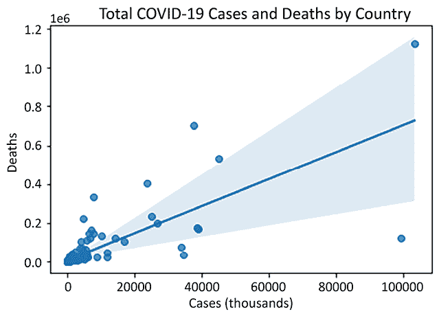

# 第四章：在数据子集中识别异常值

异常值和意外值不一定是错误。它们通常不是。个体和事件是复杂的，常常出乎分析师的意料。有些人确实有 7 英尺 4 英寸的身高，也有些人年收入 5000 万美元。有时候，数据混乱是因为人们和情况本身就很混乱；然而，极端值可能会对我们的分析产生过大的影响，尤其是当我们使用假设正态分布的参数化技术时。

当处理数据子集时，这些问题可能会变得更加明显。这不仅仅是因为在样本较小时，极端或意外的值权重更大。还因为当考虑双变量和多变量关系时，它们可能显得不合逻辑。当一个身高 7 英尺 4 英寸的人，或一个年收入 5000 万美元的人，只有 10 岁时，警示信号会更加显眼。这可能表明某些测量或数据收集的错误。

但关键问题是异常值对我们从数据中得出的推断可能产生的不当影响。事实上，将异常值视为具有非常规变量值，或变量值之间关系的观察，可能是有帮助的，这些观察值的异常之处使得它们无法帮助解释数据中其余部分的关系。这对于统计推断非常重要，因为我们不能假设异常值对我们的总结统计量或参数估计有中立的影响。有时，我们的模型会花费大量精力去构建能够解释异常值观察模式的参数估计，这样我们就会妥协模型对所有其他观察值的解释或预测能力。如果你曾经花费数天试图解读一个模型，却在去除一些异常值后才发现你的系数和预测完全改变了，那就举手吧。

异常值的识别和处理是数据分析项目中最重要的数据准备任务之一。在本章中，我们将探讨一系列用于检测和处理异常值的策略。具体来说，本章的食谱将涵盖以下内容：

+   使用单一变量识别异常值

+   在双变量关系中识别异常值和意外值

+   使用子集来检查变量关系中的逻辑不一致性

+   使用线性回归识别具有显著影响的数据点

+   使用*k*最近邻（KNN）算法来发现异常值

+   使用隔离森林（Isolation Forest）来发现异常值

+   使用 PandasAI 识别异常值

# 技术要求

你需要使用 pandas、NumPy 和 Matplotlib 来完成本章的食谱。我使用的是 pandas 2.1.4，但代码也可以在 pandas 1.5.3 或更高版本上运行。

本章的代码可以从本书的 GitHub 仓库下载，链接为[`github.com/PacktPublishing/Python-Data-Cleaning-Cookbook-Second-Edition`](https://github.com/PacktPublishing/Python-Data-Cleaning-Cookbook-Second-Edition)。

# 使用单一变量识别异常值

异常值的概念有一定的主观性，但它与特定分布的特性密切相关；即其集中趋势、分散度和形态。我们根据变量的分布假设某个值是否为预期或意外值，依据是该值出现在当前分布中的可能性。如果某个值远离均值多个标准差，并且该分布近似为正态分布（对称、偏度低且尾部较瘦），我们更倾向于将其视为异常值。

如果我们设想从均匀分布中识别异常值，这一点会变得清晰。均匀分布没有集中趋势，也没有尾部。每个值出现的概率相同。例如，如果每个国家的 COVID-19 病例数是均匀分布的，最小值为 1，最大值为 10,000,000，那么 1 或 10,000,000 都不会被认为是异常值。

我们需要了解一个变量的分布情况，之后才能识别异常值。几个 Python 库提供了帮助我们理解感兴趣变量分布的工具。在本指南中，我们将使用其中的一些工具来识别当某个值偏离范围时，是否需要引起关注。

## 准备工作

除了 `pandas` 和 `numpy`，你还需要 `matplotlib`、`statsmodels` 和 `scipy` 库来运行本指南中的代码。你可以通过在终端客户端或 PowerShell（Windows 系统）中输入 `pip install matplotlib`、`pip install statsmodels` 和 `pip install scipy` 来安装这些库。你可能还需要安装 `openpyxl` 来保存 Excel 文件。

在本指南中，我们将处理 COVID-19 病例数据。该数据集包含每个国家的 COVID-19 总病例数和死亡人数。

**数据说明**

Our World in Data 提供了 COVID-19 的公共数据，网址为 [`ourworldindata.org/covid-cases`](https://ourworldindata.org/covid-cases)。该数据集包括总病例数、死亡人数、已进行的测试数量、医院床位数量，以及诸如中位年龄、国内生产总值和人类发展指数等人口统计数据。人类发展指数是标准生活水平、教育水平和预期寿命的综合衡量标准。本指南使用的数据集于 2024 年 3 月 3 日下载。

## 操作步骤...

我们详细查看 COVID-19 数据中一些关键连续变量的分布情况。我们分析分布的集中趋势和形态，生成正态性度量和可视化图表：

1.  加载 `pandas`、`numpy`、`matplotlib`、`statsmodels` 和 `scipy` 库，以及 COVID-19 病例数据文件。

同时，设置 COVID-19 病例和人口统计数据列：

```py
import pandas as pd
import numpy as np
import matplotlib.pyplot as plt
import statsmodels.api as sm
import scipy.stats as scistat
covidtotals = pd.read_csv("data/covidtotals.csv")
covidtotals.set_index("iso_code", inplace=True)
totvars = ['location','total_cases',
...   'total_deaths','total_cases_pm',
...   'total_deaths_pm']
demovars = ['population','pop_density',
...   'median_age','gdp_per_capita',
...    'hosp_beds','hum_dev_ind'] 
```

1.  获取 COVID-19 病例数据的描述性统计信息。

创建一个只包含关键信息的 DataFrame：

```py
covidtotalsonly = covidtotals.loc[:, totvars]
covidtotalsonly.describe() 
```

```py
 total_cases  total_deaths  total_cases_pm  total_deaths_pm
count               231           231             231              231
mean          3,351,599        30,214         206,178            1,262
std          11,483,212       104,779        2 03,858            1,315
min                   4             0             354                0
25%              25,672           178          21,822              141
50%             191,496         1,937         133,946              827
75%           1,294,286        14,150         345,690            1,998
max         103,436,829     1,127,152         763,475            6,508 
```

1.  显示更详细的百分位数据。我们指示只对数值进行操作，因此会跳过位置列。

    ```py
    covidtotalsonly.quantile(np.arange(0.0, 1.1, 0.1),
       numeric_only=True) 
    ```

    ```py
     total_cases  total_deaths  total_cases_pm  total_deaths_pm
    0.0           4.0           0.0           354.5              0.0
    0.1       8,359.0          31.0         3,138.6             32.9
    0.2      17,181.0         126.0        10,885.7            105.3
    0.3      38,008.0         294.0        35,834.6            210.5
    0.4      74,129.0         844.0        86,126.2            498.8
    0.5     191,496.0       1,937.0       133,946.3            827.0
    0.6     472,755.0       4,384.0       220,429.4          1,251.3
    0.7   1,041,111.0       9,646.0       293,737.4          1,697.6
    0.8   1,877,065.0      21,218.0       416,608.1          2,271.7
    0.9   5,641,992.0      62,288.0       512,388.4          3,155.9
    1.0 103,436,829.0   1,127,152.0       763,475.4          6,507.7 
    ```

**注意**

从 pandas 版本 2.0.0 开始，`quantile`函数的`numeric_only`参数默认值为`False`。我们需要将`numeric_only`的值设置为`True`，以便让`quantile`跳过`location`列。

你还应该显示偏度和峰度。偏度和峰度分别描述了分布的对称性和尾部的肥胖程度。对于`total_cases`和`total_deaths`，这两个值显著高于如果变量呈正态分布时的预期值：

```py
covidtotalsonly.skew(numeric_only=True) 
```

```py
total_cases       6.3
total_deaths      7.1
total_cases_pm    0.8
total_deaths_pm   1.3
dtype: float64 
```

```py
covidtotalsonly.kurtosis(numeric_only=True) 
```

```py
total_cases       47.1
total_deaths      61.7
total_cases_pm    -0.4
total_deaths_pm    1.3
dtype: float64 
```

原型正态分布的偏度为`0`，峰度为`3`。

1.  测试 COVID-19 数据的正态性。

使用`scipy`库中的 Shapiro-Wilk 检验。输出检验的*p*值（若* p *值低于`0.05`，则可在 95%的置信水平上拒绝正态分布的`null`假设）：

```py
def testnorm(var, df):
  stat, p = scistat.shapiro(df[var])
  return p
print("total cases: %.5f" % testnorm("total_cases", covidtotalsonly))
print("total deaths: %.5f" % testnorm("total_deaths", covidtotalsonly))
print("total cases pm: %.5f" % testnorm("total_cases_pm", covidtotalsonly))
print("total deaths pm: %.5f" % testnorm("total_deaths_pm", covidtotalsonly)) 
```

```py
total cases: 0.00000
total deaths: 0.00000
total cases pm: 0.00000
total deaths pm: 0.00000 
```

1.  显示总病例数和每百万总病例数的常规量化-量化图（`qqplots`）。

直线显示了如果分布是正态分布时的样子：

```py
sm.qqplot(covidtotalsonly[['total_cases']]. \
...   sort_values(['total_cases']), line='s')
plt.title("QQ Plot of Total Cases")
sm.qqplot(covidtotals[['total_cases_pm']]. \
...   sort_values(['total_cases_pm']), line='s')
plt.title("QQ Plot of Total Cases Per Million")
plt.show() 
```

这将生成以下散点图：


图 4.1：COVID-19 病例分布与正态分布的比较

通过按人口调整每百万总病例数列后，分布更接近正态分布：


图 4.2：每百万 COVID-19 病例的分布与正态分布的比较

1.  显示总病例的异常值范围。

定义连续变量异常值的一种方法是基于第三四分位数以上或第一四分位数以下的距离。如果该距离超过 1.5 倍的*四分位差*（第一四分位数和第三四分位数之间的距离），则该值被认为是异常值。本步骤中的计算表明，超过 3,197,208 的值可以被视为异常值。在这种情况下，我们可以忽略小于 0 的异常值阈值，因为这是不可能的：

```py
thirdq, firstq = covidtotalsonly.total_cases.quantile(0.75), covidtotalsonly.total_cases.quantile(0.25)
interquartilerange = 1.5*(thirdq-firstq)
outlierhigh, outlierlow = interquartilerange+thirdq, firstq-interquartilerange
print(outlierlow, outlierhigh, sep=" <--> ") 
```

```py
-1877250 <--> 3197208 
```

1.  生成异常值的 DataFrame 并将其写入 Excel。

遍历四个 COVID-19 病例列。按照前一步的操作计算每列的异常值阈值。从 DataFrame 中选择那些高于上限阈值或低于下限阈值的行。添加表示所检验变量（`varname`）的异常值和阈值级别的列：

```py
def getoutliers():
...   dfout = pd.DataFrame(columns=covidtotals. \
...     columns, data=None)
...   for col in covidtotalsonly.columns[1:]:
...     thirdq, firstq = covidtotalsonly[col].\
...       quantile(0.75),covidtotalsonly[col].\
...       quantile(0.25)
...     interquartilerange = 1.5*(thirdq-firstq)
...     outlierhigh, outlierlow = \
...       interquartilerange+thirdq, \
...       firstq-interquartilerange
...     df = covidtotals.loc[(covidtotals[col]> \
...       outlierhigh) | (covidtotals[col]< \
...       outlierlow)]
...     df = df.assign(varname = col,
...       threshlow = outlierlow,
...       threshhigh = outlierhigh)
...     dfout = pd.concat([dfout, df])
...   return dfout
...
outliers = getoutliers()
outliers.varname.value_counts() 
```

```py
total_deaths          39
total_cases           33
total_deaths_pm        4
Name: varname, dtype: int64 
```

```py
outliers.to_excel("views/outlierscases.xlsx") 
```

这将生成以下 Excel 文件（某些列已隐藏以节省空间）：


图 4.3：包含异常值案例的 Excel 文件

根据四分位数法，共识别出 39 个国家在`total_deaths`值上为异常值，33 个`total_cases`异常值。注意，`total_cases_pm`没有异常值。

1.  更加仔细地查看每百万总死亡数的异常值。

使用我们在上一步骤中创建的`varname`列来选择`total_deaths_pm`的离群值。显示可能有助于解释这些列极端值的列`(median_age`和`hum_dev_ind`)。我们还显示了这些列的 25^(th)、50^(th)和 75^(th)百分位的全数据集对比值：

```py
outliers.loc[outliers.varname=="total_deaths_pm",
  ['location','total_deaths_pm','total_cases_pm',
   'median_age','hum_dev_ind']]. \
  sort_values(['total_deaths_pm'], ascending=False) 
```

```py
 location      total_deaths_pm  \
PER                    Peru              6,507.7  
BGR                Bulgaria              5,703.5  
BIH  Bosnia and Herzegovina              5,066.3  
HUN                 Hungary              4,918.3  
           total_cases_pm    median_age    hum_dev_ind 
PER             133,239.0          29.1            0.8 
BGR             195,767.9          44.7            0.8 
BIH             124,806.3          42.5            0.8 
HUN             223,685.2          43.4            0.9 
```

```py
covidtotals[['total_deaths_pm','median_age',
  'hum_dev_ind']]. \
  quantile([0.25,0.5,0.75]) 
```

```py
 total_deaths_pm  median_age  hum_dev_ind
0.25           141.18       22.05         0.60
0.50           827.05       29.60         0.74
0.75         1,997.51       38.70         0.83 
```

所有四个国家的死亡人数每百万均远超 75^(th)百分位。四个国家中的三个国家在中位年龄和人类发展指数方面接近或超过了 75^(th)百分位。出乎意料的是，人类发展指数与每百万死亡人数之间存在正相关关系。我们将在下一个配方中显示相关性矩阵。

1.  显示总病例数的直方图：

    ```py
    plt.hist(covidtotalsonly['total_cases']/1000, bins=7)
    plt.title("Total COVID-19 Cases (thousands)")
    plt.xlabel('Cases')
    plt.ylabel("Number of Countries")
    plt.show() 
    ```

这段代码会生成以下图形：


图 4.4：COVID-19 总病例数的直方图

1.  对 COVID-19 数据进行对数转换。显示总病例数的对数转换后的直方图：

    ```py
    covidlogs = covidtotalsonly.copy()
    for col in covidlogs.columns[1:]:
    ...   covidlogs[col] = np.log1p(covidlogs[col])
    plt.hist(covidlogs['total_cases'], bins=7)
    plt.title("Total COVID-19 Cases (log)")
    plt.xlabel('Cases')
    plt.ylabel("Number of Countries")
    plt.show() 
    ```

这段代码会生成以下内容：


图 4.5：COVID-19 总病例数的对数转换直方图

我们在前面的步骤中使用的工具为我们提供了有关 COVID-19 病例和死亡的分布，以及离群值所在位置的相当多的信息。

## 它是如何工作的……

*步骤 3*中显示的百分位数据反映了病例和死亡数据的偏斜性。例如，如果我们观察 20^(th)到 30^(th)百分位之间的数值范围，并将其与 70^(th)到 80^(th)百分位之间的范围进行比较，会发现较高百分位的每个变量的范围都远大于较低百分位的范围。这一点从偏度和峰度的非常高值中得到了证实，而正态分布的偏度和峰度值分别为`0`和`3`。我们在*步骤 4*中进行了正态性检验，结果表明，COVID-19 变量的分布在高度显著性水平下不符合正态分布。

这与我们在*步骤 5*中运行的`qqplots`一致。总病例数和每百万总病例数的分布与正态分布有显著差异，如直线所示。许多病例集中在零附近，右尾的斜率急剧增加。

我们在*步骤 6 和 7*中识别了离群值。使用 1.5 倍四分位差来确定离群值是一个合理的经验法则。我喜欢将这些值和相关数据输出到 Excel 文件中，以便查看我能在数据中发现什么模式。当然，这通常会引发更多的问题。我们将在下一个配方中尝试解答其中的一些问题，但我们现在可以考虑的一个问题是，是什么原因导致每百万死亡人数较高的国家，如*步骤 8*所示。中位年龄和人类发展指数似乎可能是其中的一部分原因。值得进一步探索这些双变量关系，我们将在后续的配方中进行探索。

我们在*步骤 7*中识别异常值的前提是假设正态分布，但这个假设我们已经证明是不成立的。查看*步骤 9*中的总病例分布，它看起来更像是对数正态分布，值集中在`0`附近，并呈右偏。我们在*步骤 10*中对数据进行了转换，并绘制了转换结果。

## 还有更多……

我们也可以使用标准差，而不是四分位差，来识别*步骤 6 和 7*中的异常值。

我应该在这里补充一点，异常值不一定是数据收集或测量错误，我们可能需要，也可能不需要对数据进行调整。然而，极端值可能会对我们的分析产生有意义且持久的影响，特别是在像这样的较小数据集上。

我们对 COVID-19 病例数据的总体印象是相对干净的；也就是说，严格定义下并没有太多无效值。独立地查看每个变量，而不考虑它与其他变量的关系，无法识别出明显的清晰数据错误。然而，变量的分布在统计学上是相当有问题的。基于这些变量构建统计模型将变得复杂，因为我们可能需要排除参数检验。

还值得记住的是，我们对什么构成异常值的理解是由我们对正态分布的假设所塑造的。相反，如果我们让期望值由数据的实际分布来引导，我们对极端值的理解会有所不同。如果我们的数据反映的是一个社会、或生物学、或物理过程，这些过程本身就不是正态分布（如均匀分布、对数分布、指数分布、威布尔分布、泊松分布等），那么我们对异常值的定义应该相应调整。

## 另见

箱线图在这里也可能会有启发作用。我们在*第五章*中对这些数据做了箱线图，*使用可视化识别意外值*。我们在*第八章*中更详细地探讨了变量转换，*编码、转换与特征缩放*。

我们将在下一个配方中探讨这个数据集中双变量关系，以便从中获得任何关于异常值和意外值的见解。在后续章节中，我们将考虑补充缺失数据和对极端值进行调整的策略。

# 识别双变量关系中的异常值和意外值

一个值即使不是极端值，如果它没有显著偏离分布均值，也可能是意外的。当第二个变量有某些特定值时，第一个变量的一些值会变得意外。这在一个变量是分类变量而另一个是连续变量时，尤其容易说明。

以下图表显示了几年期间每天的鸟类观察数量，但对两个地点的分布做了不同的展示。一个地点的平均每天观察数为 33，另一个为 52（这是虚拟数据）。总体平均值（未显示）为 42。那么，58 次每日观察应该如何解读？它是异常值吗？这显然取决于观察的是哪一个地点。

如果在地点 A 有 58 次观察，58 将是一个异常高的数值。而对于地点 B 来说，58 次观察与该地点的平均值并没有太大不同：


图 4.6：按地点分类的每日鸟类观察数

这提示了一个有用的经验法则：每当某个感兴趣的变量与另一个变量显著相关时，在尝试识别异常值时（或者在进行任何涉及该变量的统计分析时），我们应当考虑到这种关系。将这一点表述得更准确一点，并扩展到两个变量都是连续的情况。如果我们假设变量 *x* 和变量 *y* 之间存在线性关系，那么我们可以用熟悉的 *y* = *mx* + *b* 方程来描述这种关系，其中 *m* 是斜率，*b* 是 *y* 截距。然后我们可以预期，*y* 会随着 *x* 增加 1 单位而增加 *m*。异常值是那些偏离这一关系较大的值，其中 *y* 的值远高于或低于根据 *x* 的值所预测的值。这可以扩展到多个 *x* 或预测变量。

在本例中，我们演示了如何通过检查一个变量与另一个变量的关系来识别异常值和意外值。在本章接下来的例子中，我们使用多元方法来进一步改进我们的异常值检测。

## 准备工作

在本例中，我们使用了`matplotlib`和`seaborn`库。你可以通过终端客户端或 PowerShell（在 Windows 中）输入`pip install matplotlib`和`pip install seaborn`来安装它们。

## 操作方法...

我们检查了 COVID-19 数据库中总病例数和总死亡数之间的关系。我们仔细查看了那些死亡人数高于或低于根据病例数预期值的国家：

1.  加载`pandas`、`matplotlib`、`seaborn`以及 COVID-19 累积数据：

    ```py
    import pandas as pd
    import matplotlib.pyplot as plt
    import seaborn as sns
    covidtotals = pd.read_csv("data/covidtotals.csv")
    covidtotals.set_index("iso_code", inplace=True) 
    ```

1.  生成累积数据和人口统计学列的相关性矩阵。

不出所料，总病例数和总死亡数之间的相关性较高（`0.76`），而每百万总病例数与每百万总死亡数之间的相关性较低（`0.44`）。人均 GDP 与每百万病例数之间有强相关性（`0.66`）（注意，并未显示所有相关性）：

```py
covidtotals.corr(method="pearson", numeric_only=True) 
```

```py
 total_cases  total_deaths  \
total_cases             1.00          0.76  
total_deaths            0.76          1.00  
total_cases_pm          0.10          0.01  
total_deaths_pm         0.15          0.27  
population              0.70          0.47  
pop_density            -0.03         -0.04  
median_age              0.29          0.19  
gdp_per_capita          0.19          0.13  
hosp_beds               0.21          0.05  
vac_per_hund            0.02         -0.07  
aged_65_older           0.29          0.19  
life_expectancy         0.19          0.11  
hum_dev_ind             0.26          0.21  
                 total_cases_pm  ...  aged_65_older  \
total_cases                0.10  ...           0.29  
total_deaths               0.01  ...           0.19  
total_cases_pm             1.00  ...           0.72  
total_deaths_pm            0.44  ...           0.68  
population                -0.13  ...          -0.01  
pop_density                0.19  ...           0.07  
median_age                 0.74  ...           0.92  
gdp_per_capita             0.66  ...           0.51  
hosp_beds                  0.48  ...           0.65  
vac_per_hund               0.24  ...           0.35  
aged_65_older              0.72  ...           1.00  
life_expectancy            0.69  ...           0.73  
hum_dev_ind                0.76  ...           0.78  
                 life_expectancy  hum_dev_ind 
total_cases                 0.19         0.26 
total_deaths                0.11         0.21 
total_cases_pm              0.69         0.76 
total_deaths_pm             0.49         0.60 
population                 -0.04        -0.02 
pop_density                 0.20         0.14 
median_age                  0.83         0.90 
gdp_per_capita              0.68         0.75 
hosp_beds                   0.46         0.57 
vac_per_hund                0.67         0.51 
aged_65_older               0.73         0.78 
life_expectancy             1.00         0.91 
hum_dev_ind                 0.91         1.00 
[13 rows x 13 columns] 
```

1.  检查一些国家是否存在与总病例数相比，总死亡人数异常高或低的情况。

使用`qcut`创建一个列，将数据分成分位数。显示按总死亡数分位数排列的总病例数分位数交叉表：

```py
covidtotals['total_cases_q'] = pd.\
...   qcut(covidtotals['total_cases'],
...   labels=['very low','low','medium',
...   'high','very high'], q=5, precision=0)
covidtotals['total_deaths_q'] = pd.\
...   qcut(covidtotals['total_deaths'],
...   labels=['very low','low','medium',
...   'high','very high'], q=5, precision=0)
pd.crosstab(covidtotals.total_cases_q,
...   covidtotals.total_deaths_q) 
```

```py
total_deaths_q  very low    low     medium    high    very high
total_cases_q                                        
very low              36     10          1       0            0
low                   11     26          8       1            0
medium                 0      9         27      10            0
high                   0      1          8      31            6
very high              0      0          2       4           40 
```

1.  看看那些不符合对角线关系的国家。

有一个国家病例总数很高，但死亡总数很低。由于`covidtotals`和`covidtotalsonly`数据框有相同的索引，我们可以使用从后者创建的布尔序列来返回前者的选定行：

```py
covidtotals.loc[(covidtotals. \
  total_cases_q=="high") & \
  (covidtotals.total_deaths_q=="low")].T 
```

```py
iso_code                QAT
lastdate         2023-06-25
location              Qatar
total_cases      514,524.00
total_deaths         690.00
total_cases_pm   190,908.72
total_deaths_pm      256.02
population          2695131
pop_density          227.32
median_age            31.90
gdp_per_capita   116,935.60
hosp_beds              1.20
vac_per_hund            NaN
aged_65_older          1.31
life_expectancy       80.23
hum_dev_ind            0.85
region            West Asia 
```

1.  绘制总病例数与总死亡数的散点图。

使用 Seaborn 的`regplot`方法，除了散点图之外，还生成线性回归线：

```py
ax = sns.regplot(x=covidtotals.total_cases/1000, y=covidtotals.total_deaths)
ax.set(xlabel="Cases (thousands)", ylabel="Deaths", title="Total COVID-19 Cases and Deaths by Country")
plt.show() 
```

这产生了以下散点图：



图 4.7：带有线性回归线的总病例数与死亡数散点图

1.  检查回归线之上的意外值。

仔细观察数据中明显位于回归线之上或之下的国家，看看这些国家的病例数和死亡数坐标。有两个国家的病例数少于 4000 万，但死亡人数超过 40 万：

```py
covidtotals.loc[(covidtotals.total_cases<40000000) \
  & (covidtotals.total_deaths>400000)].T 
```

```py
iso_code                   BRA             RUS
lastdate            2023-10-01      2024-01-28
location                Brazil          Russia
total_cases      37,519,960.00   23,774,451.00
total_deaths        702,116.00      401,884.00
total_cases_pm      174,257.35      164,286.55
total_deaths_pm       3,260.90        2,777.11
population           215313504       144713312
pop_density              25.04            8.82
median_age               33.50           39.60
gdp_per_capita       14,103.45       24,765.95
hosp_beds                 2.20            8.05
vac_per_hund               NaN             NaN
aged_65_older             8.55           14.18
life_expectancy          75.88           72.58
hum_dev_ind               0.77            0.82
region           South America  Eastern Europe 
```

1.  检查回归线下方的意外值。

有两个国家的病例数超过 3000 万，但死亡数少于 10 万：

```py
covidtotals.loc[(covidtotals.total_cases>30000000) \
  & (covidtotals.total_deaths<100000)].T 
```

```py
iso_code                  JPN           KOR
lastdate           2023-05-14    2023-09-10
location                Japan   South Korea
total_cases     33,803,572.00 34,571,873.00
total_deaths        74,694.00     35,934.00
total_cases_pm     272,715.69    667,207.06
total_deaths_pm        602.61        693.50
population          123951696      51815808
pop_density            347.78        527.97
median_age              48.20         43.40
gdp_per_capita      39,002.22     35,938.37
hosp_beds               13.05         12.27
vac_per_hund              NaN           NaN
aged_65_older           27.05         13.91
life_expectancy         84.63         83.03
hum_dev_ind              0.92          0.92
region              East Asia     East Asia 
```

1.  绘制每百万人总病例数与每百万人总死亡数的散点图：

    ```py
    ax = sns.regplot(x="total_cases_pm", y="total_deaths_pm", data=covidtotals)
    ax.set(xlabel="Cases Per Million", ylabel="Deaths Per Million", title="Total COVID-19 Cases per Million and Deaths per Million by Country")
    plt.show() 
    ```

这产生了以下散点图：


图 4.8：每百万人病例数与死亡数散点图，带有线性回归线

前面的步骤考察了变量之间的关系，以识别异常值。

## 其工作原理…

通过观察双变量关系，我们提出了一些在前一个步骤中未显现出来的问题。我们确认了预期中的关系，比如总病例数与总死亡数的关系，但这也让偏离这种关系的情况更加引人注目。根据一定数量的病例数，有可能有实质性的解释来说明异常高的死亡率，但测量误差或病例报告不准确也不能排除。

*步骤 2*显示了总病例数和总死亡数之间的高度相关性（0.76），但即便如此，仍然存在一些差异。我们在*步骤 3*中将病例数和死亡数划分为分位数，然后做一个分位数值的交叉表。大多数国家位于对角线上或接近对角线。然而，有一个国家的病例数非常高，但死亡数较低，即卡塔尔。合理的怀疑是是否存在潜在的报告问题。

我们在*步骤 5*中绘制了总病例数与总死亡数的散点图。两者之间强烈的向上倾斜关系得到了确认，但有一些国家的死亡数位于回归线之上。我们可以看到，巴西和俄罗斯的死亡数比根据病例数预测的要高，而日本和韩国的死亡数则远低于预测值。

不出所料，在每百万案例和每百万死亡人数的散点图中，回归线周围的散点更为分散。虽然存在正相关关系，但回归线的斜率并不陡峭。

## 还有更多...

我们已经开始对数据的样貌有了较好的了解，但以这种形式的数据并不能让我们检查单变量分布和双变量关系如何随时间变化。例如，一个国家每百万死亡人数超过每百万案例人数的原因，可能是因为自首次确诊病例以来已经过去了更多的时间。我们无法在累积数据中探索这一点。为此，我们需要每日数据，在接下来的章节中我们将探讨这个问题。

这个食谱，以及之前的那个，展示了数据清理如何渗透到探索性数据分析中，即使在你刚开始对数据有所了解时。我一定会在数据探索和我们现在所做的工作之间做出区分。我们正在尝试了解数据是如何相互关联的，以及为什么在某些情况下，某些变量会取某些值而在其他情况下不取。我们希望做到当我们开始进行分析时，数据中不会有大的惊讶。

我发现做一些小的调整来规范这个过程很有帮助。我对那些尚未准备好进行分析的文件使用不同的命名规范。即使没有别的，这也帮助我提醒自己，在这个阶段生成的任何数据都远未准备好分发。

## 另见

我们仍然没有做太多工作来检查可能的数据问题，这些问题只有在检查数据子集时才会显现出来；例如，声称自己不工作的人的正工资收入值（这两个变量都来自**国家纵向调查**或**NLS**）。我们将在下一个食谱中解决这个问题。

在*第五章*中，我们将使用 Matplotlib 和 Seaborn 做更多工作，主题是*利用可视化识别异常值*。

# 使用子集工具检查变量关系中的逻辑不一致性

在某些时候，数据问题归结为推理逻辑问题，比如当变量 *y* 小于某个量 *b* 时，变量 *x* 必须大于某个量 *a*。一旦完成一些初步的数据清理，检查逻辑不一致性就变得很重要。`pandas`通过子集工具如`loc`和布尔索引，使这种错误检查相对简单。我们可以将这些工具与 Series 和 DataFrame 的汇总方法结合使用，从而轻松地将特定行的值与整个数据集或某些行的子集进行比较。我们还可以轻松地对列进行聚合。关于变量之间的逻辑关系的任何问题，都可以通过这些工具得到解答。我们将在这个食谱中演示一些示例。

## 准备工作

我们将使用 NLS 数据，主要涉及就业和教育方面的数据。在本例中，我们多次使用 `apply` 和 `lambda` 函数，但我们会在*第九章*，*在聚合时修复混乱数据*中详细介绍它们的使用。然而，即使你没有这些工具的经验，也不需要回顾*第九章*，就能跟随操作。

**数据说明**

美国劳工统计局进行的国家青少年纵向调查（NLS）始于 1997 年，调查对象为 1980 至 1985 年间出生的一组人群，每年进行一次跟踪，直到 2023 年。本次例子中，我从调查中的数百个数据项中提取了 106 个变量，涵盖了成绩、就业、收入和对政府态度等信息。NLS 数据可以从[nlsinfo.org](https://nlsinfo.org)下载。

## 操作方法：

我们对 NLS 数据进行了多次逻辑检查，比如有研究生入学记录但没有本科入学记录的个体，或者有工资收入但没有工作周数的个体。我们还检查给定个体在不同时期之间关键值的巨大变化：

1.  导入 `pandas`，然后加载 NLS 数据：

    ```py
    import pandas as pd
    nls97 = pd.read_csv("data/nls97f.csv", low_memory=False)
    nls97.set_index("personid", inplace=True) 
    ```

1.  查看一些就业和教育数据。

数据集中包含 2000 年至 2023 年每年的工作周数，以及 1997 年 2 月到 2022 年 10 月每月的大学入学状态。我们利用 `loc` 访问器来选择从冒号左侧指定的列到右侧指定的列的所有数据。例如，`nls97.loc[:, "colenroct15":"colenrfeb22"]`：

```py
nls97[['wageincome20','highestgradecompleted',
  'highestdegree']].head(3).T 
```

```py
personid                     135335          999406  \
wageincome20                    NaN         115,000  
highestgradecompleted           NaN              14  
highestdegree          4\. Bachelors  2\. High School  
personid                     151672 
wageincome20                    NaN 
highestgradecompleted            16 
highestdegree          4\. Bachelors 
```

```py
nls97.loc[:, "weeksworked18":"weeksworked22"].head(3).T 
```

```py
personid       135335  999406  151672
weeksworked18     NaN      52      52
weeksworked19     NaN      52       9
weeksworked20     NaN      52       0
weeksworked21     NaN      46       0
weeksworked22     NaN     NaN       3 
```

```py
nls97.loc[:, "colenroct15":"colenrfeb22"].head(2).T 
```

```py
personid              135335           999406
colenroct15  1\. Not enrolled  1\. Not enrolled
colenrfeb16              NaN  1\. Not enrolled
colenroct16              NaN  1\. Not enrolled
colenrfeb17              NaN  1\. Not enrolled
colenroct17              NaN  1\. Not enrolled
colenrfeb18              NaN  1\. Not enrolled
colenroct18              NaN  1\. Not enrolled
colenrfeb19              NaN  1\. Not enrolled
colenroct19              NaN  1\. Not enrolled
colenrfeb20              NaN  1\. Not enrolled
colenroct20              NaN  1\. Not enrolled
colenrfeb21              NaN  1\. Not enrolled
colenroct21              NaN  1\. Not enrolled
colenrfeb22              NaN              NaN 
```

显示有工资收入但没有工作周数的个体：

```py
nls97.loc[(nls97.weeksworked20==0) &
   (nls97.wageincome20>0),
  ['weeksworked20','wageincome20']] 
```

```py
 weeksworked20  wageincome20
personid                            
674877                0        40,000
692251                0        12,000
425230                0       150,000
391939                0        10,000
510545                0        72,000
                    ...           ...
947109                0         1,000
706862                0        85,000
956396                0       130,000
907078                0        10,000
274042                0       130,000
[132 rows x 2 columns] 
```

1.  检查个体是否曾经在四年制大学就读过。

链接多个方法。首先，创建一个包含以 `colenr` 开头的列的 DataFrame（`nls97.filter(like="colenr")`）。这些是每年 10 月和 2 月的大学入学列。然后，使用 `apply` 运行一个 `lambda` 函数，检查每个 `colenr` 列的第一个字符（`apply(lambda x: x.str[0:1]=='3')`）。这将为所有大学入学列返回一个 `True` 或 `False` 值；如果字符串的第一个值为 `3`，表示四年制大学入学，则返回 `True`。最后，使用 `any` 函数测试从前一步返回的任何值是否为 `True`（`any(axis=1)`）。这将识别个体是否在 1997 年 2 月到 2022 年 10 月期间曾就读四年制大学。这里的第一个语句仅用于说明前两步的结果。要获得所需的结果，只需运行第二个语句，查看个体是否曾在某个时刻入读四年制大学：

```py
nls97.filter(like="colenr").\
  apply(lambda x: x.str[0:1]=='3').\
  head(2).T 
```

```py
personid     135335  999406
colenrfeb97   False   False
colenroct97   False   False
colenrfeb98   False   False
colenroct98   False   False
colenrfeb99   False   False
colenroct99    True   False
colenrfeb00    True   False
colenroct00    True    True
colenrfeb01    True    True
colenroct01    True   False
colenrfeb02    True   False
colenroct02    True    True
colenrfeb03    True    True 
```

```py
nls97.filter(like="colenr").\
  apply(lambda x: x.str[0:1]=='3').\
  any(axis=1).head(2) 
```

```py
personid
135335    True
999406    True
dtype: bool 
```

1.  显示有研究生入学记录但没有本科入学记录的个体。

我们可以使用在*步骤 4*中测试的内容进行一些检查。我们希望找到那些在任何一个月的`colenr`字段的首字符为`4`（研究生入学），但从未出现过`3`（本科入学）值的个体。注意测试的第二部分前面的~符号，用于取反。共有 24 个个体符合这个条件：

```py
nobach = nls97.loc[nls97.filter(like="colenr").\
  apply(lambda x: x.str[0:1]=='4').\
  any(axis=1) & ~nls97.filter(like="colenr").\
  apply(lambda x: x.str[0:1]=='3').\
  any(axis=1), "colenrfeb17":"colenrfeb22"]
len(nobach) 
```

```py
24 
```

```py
nobach.head(2).T 
```

```py
personid              793931               787976
.....abbreviated to save space
colenrfeb01        1\. Not enrolled        1\. Not enrolled
colenroct01      2\. 2-year college        1\. Not enrolled
colenrfeb02      2\. 2-year college        1\. Not enrolled
colenroct02      2\. 2-year college        1\. Not enrolled
colenrfeb03      2\. 2-year college        1\. Not enrolled
colenroct03        1\. Not enrolled        1\. Not enrolled
colenrfeb04      2\. 2-year college        1\. Not enrolled
colenroct04    4\. Graduate program        1\. Not enrolled
colenrfeb05    4\. Graduate program        1\. Not enrolled
.....
colenrfeb14        1\. Not enrolled        1\. Not enrolled
colenroct14        1\. Not enrolled      2\. 2-year college
colenrfeb15        1\. Not enrolled      2\. 2-year college
colenroct15        1\. Not enrolled      2\. 2-year college
colenrfeb16        1\. Not enrolled        1\. Not enrolled
colenroct16        1\. Not enrolled    4\. Graduate program
colenrfeb17        1\. Not enrolled    4\. Graduate program
colenroct17        1\. Not enrolled    4\. Graduate program
colenrfeb18        1\. Not enrolled    4\. Graduate program
colenroct18        1\. Not enrolled        1\. Not enrolled
..... 
```

1.  显示拥有学士学位或更高学位，但没有四年制大学入学的个体。

使用`isin`来将`highestdegree`字段的首字符与列表中的所有值进行比较（`nls97.highestdegree.str[0:1].isin(['4','5','6','7'])`）：

```py
nls97.highestdegree.value_counts().sort_index() 
```

```py
highestdegree
0\. None             877
1\. GED             1167
2\. High School     3531
3\. Associates       766
4\. Bachelors       1713
5\. Masters          704
6\. PhD               64
7\. Professional     130
Name: count, dtype: int64 
```

```py
no4yearenrollment = \
...   nls97.loc[nls97.highestdegree.str[0:1].\
...   isin(['4','5','6','7']) & \
...   ~nls97.filter(like="colenr").\
...   apply(lambda x: x.str[0:1]=='3').\
...   any(axis=1), "colenrfeb97":"colenrfeb22"]
len(no4yearenrollment) 
```

```py
42 
```

```py
no4yearenrollment.head(2).T 
```

```py
personid                 417244               124616
.....abbreviated to save space
colenroct04     1\. Not enrolled    2\. 2-year college
colenrfeb05     1\. Not enrolled    2\. 2-year college
colenroct05     1\. Not enrolled      1\. Not enrolled
colenrfeb06     1\. Not enrolled      1\. Not enrolled
colenroct06     1\. Not enrolled      1\. Not enrolled
colenrfeb07     1\. Not enrolled      1\. Not enrolled
colenroct07     1\. Not enrolled      1\. Not enrolled
colenrfeb08     1\. Not enrolled      1\. Not enrolled
colenroct08     1\. Not enrolled      1\. Not enrolled
colenrfeb09   2\. 2-year college      1\. Not enrolled
colenroct09   2\. 2-year college      1\. Not enrolled
colenrfeb10   2\. 2-year college      1\. Not enrolled
colenroct10   2\. 2-year college      1\. Not enrolled
colenrfeb11   2\. 2-year college      1\. Not enrolled
colenroct11   2\. 2-year college      1\. Not enrolled
colenrfeb12   2\. 2-year college      1\. Not enrolled
colenroct12     1\. Not enrolled      1\. Not enrolled
colenrfeb13     1\. Not enrolled      1\. Not enrolled 
```

1.  显示高工资收入的个体。

将高工资定义为高于平均值三个标准差的收入。看起来工资收入的值已经在 380,288 美元处被截断：

```py
highwages = \
 nls97.loc[nls97.wageincome20 >
 nls97.wageincome20.mean()+ \
 (nls97.wageincome20.std()*3),
 ['wageincome20']]
highwages 
```

```py
 wageincome20
personid              
989896         380,288
718416         380,288
693498         380,288
811201         380,288
553982         380,288
               ...
303838         380,288
366297         380,288
436132         380,288
964406         380,288
433818         380,288
[104 rows x 1 columns] 
```

1.  显示在最近一年中，工作周数变化较大的个体。

计算每个人 2016 到 2020 年间的平均工作周数（`nls97.loc[:, "weeksworked16":"weeksworked20"].mean(axis=1)`）。我们通过`axis=1`来表示按列计算每个个体的平均值，而不是按个体计算。然后，我们找到那些平均值*不*在 2021 年工作周数的一半到两倍之间的行。（注意我们早些时候使用的*~*操作符）。我们还表示，对于那些 2021 年工作周数为`null`的行，我们不感兴趣。共有 1,099 个个体在 2021 年与 2016 至 2020 年平均值相比，工作周数发生了大幅变化：

```py
workchanges = nls97.loc[~nls97.loc[:,
  "weeksworked16":"weeksworked20"].mean(axis=1).\
  between(nls97.weeksworked21*0.5,\
  nls97.weeksworked21*2) \
  & ~nls97.weeksworked21.isnull(),
  "weeksworked16":"weeksworked21"]
len(workchanges) 
```

```py
1099 
```

```py
workchanges.head(6).T 
```

```py
personid       151672  620126  ...  692251  483488
weeksworked16      53      45  ...       0      53
weeksworked17      52       0  ...       0      52
weeksworked18      52       0  ...       0      52
weeksworked19       9       0  ...       0      52
weeksworked20       0       0  ...       0      15
weeksworked21       0       0  ...      51      13
[6 rows x 6 columns] 
```

1.  显示最高学历和最高学位的不一致之处。

使用`crosstab`函数，显示`highestgradecompleted`根据`highestdegree`的分类情况，筛选`highestgradecompleted`小于 12 的个体。这些个体中有相当一部分表明他们已经完成了高中学业，这在美国是比较不寻常的，除非完成的最高年级低于 12 年级：

```py
ltgrade12 = nls97.loc[nls97.highestgradecompleted<12, ['highestgradecompleted','highestdegree']]
pd.crosstab(ltgrade12.highestgradecompleted, ltgrade12.highestdegree) 
```

```py
highestdegree           0\. None    1\. GED  \
highestgradecompleted                   
5                             0         0  
6                            11         4  
7                            23         7  
8                           108        82  
9                            98       182  
10                          105       207  
11                          113       204  
highestdegree          2\. High School  3\. Associates 
highestgradecompleted                                
5                                   1              0 
6                                   0              1 
7                                   1              0 
8                                   7              0 
9                                   8              1 
10                                 14              1 
11                                 42              2 
```

这些步骤揭示了 NLS 数据中的若干逻辑不一致。

## 它是如何工作的……

如果你是第一次看到这个语法，可能会觉得做这类子集筛选的语法有点复杂。但你会逐渐习惯它，而且它允许你快速对数据运行任何你能想到的查询。

一些不一致或意外的值表明可能存在受访者或录入错误，值得进一步调查。当`weeks worked`的值为`0`时，很难解释正的工资收入值。其他意外的值可能根本不是数据问题，而是表明我们应该小心如何使用这些数据。例如，我们可能不想单独使用 2021 年的工作周数。相反，我们可能考虑在许多分析中使用三年平均值。

## 另见

*第三章*，*评估你的数据*中的*选择和组织列*与*选择行*食谱展示了这里使用的一些数据子集技术。我们将在*第九章*，*修复聚合数据时的脏数据*中更详细地讲解`apply`函数。

# 使用线性回归来识别具有显著影响的数据点

本章剩余的教程使用统计建模来识别离群值。这些技术的优点在于它们不太依赖于关注变量的分布，并且比单变量或双变量分析考虑得更多。这使得我们能够识别那些原本不显眼的离群值。另一方面，通过考虑更多因素，多变量技术可能会提供证据，表明一个先前可疑的值实际上在预期范围内，并提供有意义的信息。

在本教程中，我们使用线性回归来识别对目标或因变量模型有过大影响的观察值（行）。这可能表明某些观察值的一个或多个值极端，以至于影响了其他所有观察值的模型拟合。

## 准备开始

本教程中的代码需要 `matplotlib` 和 `statsmodels` 库。你可以通过在终端窗口或 PowerShell（在 Windows 上）输入 `pip install matplotlib` 和 `pip install statsmodels` 来安装它们。

我们将处理有关每个国家 COVID-19 总病例和死亡数据。

## 如何操作…

我们将使用 statsmodels 的 `OLS` 方法来拟合每百万人总病例数的线性回归模型。然后，我们将识别出对该模型有最大影响的国家：

1.  导入 `pandas`、`matplotlib` 和 `statsmodels`，并加载 COVID-19 疫情数据：

    ```py
    import pandas as pd
    import matplotlib.pyplot as plt
    import statsmodels.api as sm
    covidtotals = pd.read_csv("data/covidtotals.csv")
    covidtotals.set_index("iso_code", inplace=True) 
    ```

1.  创建分析文件并生成描述性统计数据。

仅获取分析所需的列。删除分析列中有缺失数据的行：

```py
xvars = ['pop_density','median_age','gdp_per_capita']
covidanalysis = covidtotals.loc[:,['total_cases_pm'] + xvars].dropna()
covidanalysis.describe() 
```

```py
 total_cases_pm  pop_density  median_age  gdp_per_capita
count                  180          180         180             180
mean               167,765          204          30          18,290
std                190,965          631           9          19,392
min                    354            2          15             661
25%                 11,931           36          22           3,790
50%                 92,973           82          29          11,822
75%                263,162          205          38          26,785
max                763,475        7,916          48          116,936 
```

1.  拟合线性回归模型。

有充分的概念性理由相信，人口密度、中位年龄和人均 GDP 可能是每百万人总病例数的预测因子。我们在模型中使用这三个变量：

```py
def getlm(df):
...   Y = df.total_cases_pm
...   X = df[['pop_density',
        'median_age','gdp_per_capita']]
...   X = sm.add_constant(X)
...   return sm.OLS(Y, X).fit()
...
lm = getlm(covidanalysis)
lm.summary() 
```

```py
 coef       std err         t      P>|t|
----------------------------------------------------------------
Const              -2.382e+05      3.41e+04    -6.980      0.000
pop_density           12.4060        14.664     0.846      0.399
median_age              11570      1291.446     8.956      0.000
gdp_per_capita         2.9674         0.621     4.777      0.000 
```

1.  确定对模型有过大影响的国家。

Cook 距离值大于 0.5 的数据应仔细审查：

```py
influence = lm.get_influence().summary_frame()
influence.loc[influence.cooks_d>0.5, ['cooks_d']] 
```

```py
 cooks_d
iso_code         
QAT          0.70
SGP          3.12 
```

```py
covidanalysis.loc[influence.cooks_d>0.5] 
```

```py
 total_cases_pm  pop_density  median_age  gdp_per_capita
iso_code                                                        
QAT             190,909          227          32         116,936
SGP             531,184        7,916          42          85,535 
```

1.  创建影响图。

具有更高 Cook 距离值的国家显示出更大的圆圈：

```py
fig, ax = plt.subplots(figsize=(8,8))
sm.graphics.influence_plot(lm, ax = ax, alpha=5, criterion="cooks")
plt.show() 
```

这将生成以下图表：


图 4.9：影响图，包括具有最高 Cook 距离的国家

1.  在不包括两个离群值的情况下运行模型。

删除这些离群值会影响模型的每个系数，特别是人口密度（即使在 95% 的置信水平下仍然不显著）：

```py
covidanalysisminusoutliers = covidanalysis.loc[influence.cooks_d<0.5]
lm = getlm(covidanalysisminusoutliers)
lm.summary() 
```

```py
 coef    std err          t      P>|t|
--------------------------------------------------------------
const              -2.158e+05   3.43e+04     -6.288      0.000
pop_density           61.2396     34.260      1.788      0.076
median_age          9968.5170   1346.416      7.404      0.000
gdp_per_capita         4.1112      0.704      5.841      0.000 
```

这让我们大致了解了哪些国家在与人口统计变量和每百万人总病例数的关系上与其他国家最为不同。

## 它是如何工作的...

Cook’s 距离是衡量每个观察值对模型影响程度的指标。两个异常值对模型的巨大影响在 *步骤 6* 中得到了验证，当我们在不包含这些异常值的情况下重新运行模型时。分析师需要问的问题是，像这些异常值是否提供了重要的信息，还是扭曲了模型并限制了其适用性。第一次回归结果中，`median_age` 的系数为 11570，表示中位数年龄每增加一年，病例数每百万人增加 11570。这一数字在去除异常值后的模型中大幅缩小，降至 9969。

回归输出中的 `P>|t|` 值告诉我们系数是否显著不同于 `0`。在第一次回归中，`median_age` 和 `gdp_per_capita` 的系数在 99% 的显著性水平上显著；也就是说，`P>|t|` 值小于 0.01。

## 还有更多内容…

在这个食谱中，我们运行了一个线性回归模型，并非主要是因为我们对模型的参数估计感兴趣，而是因为我们想要确定是否有任何观察值对我们可能进行的多元分析产生了潜在的过大影响。显然，这在此情况下确实是成立的。

通常，删除异常值是有道理的，正如我们在这里所做的那样，但这并不总是如此。当我们有能够很好地捕捉异常值不同之处的自变量时，其他自变量的参数估计会更不容易受到扭曲。我们也可以考虑转换，例如我们在前一个食谱中进行的对数转换，以及我们在接下来的两个食谱中将要进行的标准化。根据你的数据，适当的转换可以通过限制极端值的残差大小来减少异常值的影响。

# 使用 k-最近邻找出异常值

无监督机器学习工具可以帮助我们识别与其他观察结果不同的观察值，特别是在我们没有标签数据的情况下；也就是说，当没有目标变量或因变量时。（在前一个食谱中，我们使用了每百万人总病例数作为因变量。）即使选择目标和因素相对简单，识别异常值而不对变量之间的关系做任何假设也可能会很有帮助。我们可以使用 **k**-最近邻（**KNN**）来找出与其他观察值最不同的观测值，即那些它们的值与最近邻值之间差异最大的值。

## 准备工作

你需要 **Python 异常值检测** (**PyOD**) 和 scikit-learn 来运行这个食谱中的代码。你可以通过在终端或 PowerShell（在 Windows 系统中）输入 `pip install pyod` 和 `pip install sklearn` 来安装这两个工具。

## 操作步骤…

我们将使用 KNN 来识别属性最异常的国家：

1.  加载 `pandas`、`pyod` 和 `sklearn`，以及 COVID-19 病例数据：

    ```py
    import pandas as pd
    from pyod.models.knn import KNN
    from sklearn.preprocessing import StandardScaler
    covidtotals = pd.read_csv("data/covidtotals.csv")
    covidtotals.set_index("iso_code", inplace=True) 
    ```

1.  为分析列创建一个标准化的 DataFrame：

    ```py
    standardizer = StandardScaler()
    analysisvars = ['location','total_cases_pm',
    ...   'total_deaths_pm',  'pop_density',
    ...   'median_age','gdp_per_capita']
    covidanalysis = covidtotals.loc[:, analysisvars].dropna()
    covidanalysisstand = standardizer.fit_transform(covidanalysis.iloc[:, 1:]) 
    ```

1.  运行 KNN 模型并生成异常得分。

我们通过将污染参数设置为 0.1 来创建一个任意数量的异常值：

```py
clf_name = 'KNN'
clf = KNN(contamination=0.1)
clf.fit(covidanalysisstand) 
```

```py
KNN(algorithm='auto', contamination=0.1, leaf_size=30, method='largest',
  metric='minkowski', metric_params=None, n_jobs=1, n_neighbors=5, p=2,
  radius=1.0) 
```

```py
y_pred = clf.labels_
y_scores = clf.decision_scores_ 
```

1.  显示模型的预测结果。

从`y_pred`和`y_scores`的 NumPy 数组中创建一个数据框。将索引设置为`covidanalysis`数据框的索引，以便稍后能够轻松地将其与该数据框合并。注意，异常值的决策得分都高于内点（异常值=0）的得分：

```py
pred = pd.DataFrame(zip(y_pred, y_scores),
...   columns=['outlier','scores'],
...   index=covidanalysis.index)
pred.sample(10, random_state=2) 
```

```py
 outlier  scores
iso_code                 
BHR             1    2.69
BRA             0    0.75
ZWE             0    0.21
BGR             1    1.62
CHN             0    0.94
BGD             1    1.52
GRD             0    0.68
UZB             0    0.37
MMR             0    0.37
ECU             0    0.58 
```

```py
pred.outlier.value_counts() 
```

```py
0    162
1     18
Name: outlier, dtype: int64 
```

```py
pred.groupby(['outlier'])[['scores']].agg(['min','median','max']) 
```

```py
scores                      
          min   median   max
outlier                     
0         0.08   0.60   1.40
1         1.42   1.65  11.94 
```

1.  显示异常值的 COVID-19 数据。

首先，合并`covidanalysis`和`pred`数据框：

```py
covidanalysis.join(pred).\
...   loc[pred.outlier==1,\
...   ['location','total_cases_pm',
...   'total_deaths_pm','scores']].\
...   sort_values(['scores'],
...   ascending=False).head(10) 
```

```py
 location  total_cases_pm  \
iso_code                                        
SGP                  Singapore      531,183.84  
QAT                      Qatar      190,908.72  
BHR                    Bahrain      473,167.02  
LUX                 Luxembourg      603,439.46  
PER                       Peru      133,239.00  
BRN                     Brunei      763,475.44  
MDV                   Maldives      356,423.66  
MLT                      Malta      227,422.82  
ARE       United Arab Emirates      113,019.21  
BGR                   Bulgaria      195,767.89  
          total_deaths_pm  scores 
iso_code                          
SGP                346.64   11.94 
QAT                256.02    3.04 
BHR              1,043.31    2.69 
LUX              1,544.16    2.49 
PER              6,507.66    2.27 
BRN                396.44    2.26 
MDV                603.29    1.98 
MLT              1,687.63    1.96 
ARE                248.81    1.69 
BGR              5,703.52    1.62 
```

这些步骤展示了我们如何利用 KNN 基于多变量关系来识别异常值。

## 工作原理...

PyOD 是一个 Python 异常值检测工具包。我们在这里将其作为 scikit-learn 的 KNN 包的封装器使用，这简化了某些任务。

本例的重点不是构建模型，而是通过考虑我们拥有的所有数据，了解哪些观察结果（国家）是显著的异常值。这个分析支持我们逐渐形成的看法，即新加坡和卡塔尔在我们的数据集中与其他国家有很大不同。它们具有非常高的决策得分。（*步骤 5*中的表格按得分降序排列。）

像巴林和卢森堡这样的国家也可能被视为异常值，尽管这种判断不那么明确。之前的方案没有表明它们对回归模型有压倒性的影响。然而，那个模型没有同时考虑每百万病例和每百万死亡人数。这也可能解释为什么新加坡在这里比卡塔尔更为异常。新加坡既有很高的每百万病例，又有低于平均水平的每百万死亡。

Scikit-learn 使得数据标准化变得非常简单。我们在*步骤 2*中使用了标准化器，它为数据框中的每个值返回了*z*分数。*z*分数将每个变量值减去该变量的均值，并除以该变量的标准差。许多机器学习工具需要标准化的数据才能良好运作。

## 还有更多...

KNN 是一个非常流行的机器学习算法。它易于运行和解释。它的主要限制是，在大型数据集上运行时速度较慢。

我们跳过了构建机器学习模型时通常会采取的一些步骤。例如，我们没有创建单独的训练集和测试集。PyOD 允许轻松完成此操作，但在这里我们并不需要这么做。

## 另请参见

我们在*第八章*《编码、转换和标准化特征》中详细介绍了数据转换。关于使用 KNN 的一个好资源是《使用机器学习进行数据清理与探索》，这本书也由我撰写。

PyOD 工具包提供了大量有监督和无监督学习技术，用于检测数据中的异常值。你可以在[`pyod.readthedocs.io/en/latest/`](https://pyod.readthedocs.io/en/latest/)找到相关文档。

# 使用隔离森林检测异常值

孤立森林是一种相对较新的机器学习技术，用于识别异常值。它之所以快速流行，部分原因是其算法优化于发现异常值而不是正常值。它通过对数据的连续分区来找到异常值，直到一个数据点被孤立出来。需要更少分区来孤立的点将获得较高的异常分数。这个过程在系统资源上相对容易。在这个配方中，我们演示了如何使用它来检测异常的 COVID-19 病例和死亡人数。

## 准备工作

要运行本配方中的代码，您需要安装 scikit-learn 和 Matplotlib。您可以在终端或 PowerShell（Windows 中）中输入`pip install sklearn`和`pip install matplotlib`来安装它们。

## 如何做到这一点……

我们将使用孤立森林来找出那些属性表明它们是最异常的国家：

1.  加载`pandas`、`matplotlib`以及从`sklearn`中加载的`StandardScaler`和`IsolationForest`模块：

    ```py
    import pandas as pd
    import matplotlib.pyplot as plt
    from sklearn.preprocessing import StandardScaler
    from sklearn.ensemble import IsolationForest
    covidtotals = pd.read_csv("data/covidtotals.csv")
    covidtotals.set_index("iso_code", inplace=True) 
    ```

1.  创建一个标准化分析的 DataFrame。

首先，删除所有带有缺失数据的行：

```py
analysisvars = ['location','total_cases_pm','total_deaths_pm',
...   'pop_density','median_age','gdp_per_capita']
standardizer = StandardScaler()
covidtotals.isnull().sum() 
```

```py
lastdate             0
location             0
total_cases          0
total_deaths         0
total_cases_pm       0
total_deaths_pm      0
population           0
pop_density         11
median_age          24
gdp_per_capita      27
hosp_beds           45
region               0
dtype: int64 
```

```py
covidanalysis = covidtotals.loc[:, analysisvars].dropna()
covidanalysisstand = standardizer.fit_transform(covidanalysis.iloc[:, 1:]) 
```

1.  运行孤立森林模型来检测异常值。

将标准化数据传递给`fit`方法。共有 18 个国家被识别为异常值。（这些国家的异常值为`-1`。）这是由`0.1`的污染度数确定的：

```py
clf=IsolationForest(n_estimators=100,
  max_samples='auto', contamination=.1,
  max_features=1.0)
clf.fit(covidanalysisstand) 
```

```py
IsolationForest(contamination=0.1) 
```

```py
covidanalysis['anomaly'] = \
  clf.predict(covidanalysisstand)
covidanalysis['scores'] = \
  clf.decision_function(covidanalysisstand)
covidanalysis.anomaly.value_counts() 
```

```py
1          156
-1          18
Name: anomaly, dtype: int64 
```

1.  创建异常值和正常值 DataFrame。

根据异常分数列出前 10 个异常值：

```py
inlier, outlier = \
  covidanalysis.loc[covidanalysis.anomaly==1],\
  covidanalysis.loc[covidanalysis.anomaly==-1]
outlier[['location','total_cases_pm',
  'total_deaths_pm','median_age',
  'gdp_per_capita','scores']].\
  sort_values(['scores']).\
  head(10) 
```

```py
 location  total_cases_pm  total_deaths_pm  \
iso_code                                               
SGP        Singapore      531,183.84           346.64  
BHR          Bahrain      473,167.02         1,043.31  
BRN           Brunei      763,475.44           396.44  
QAT            Qatar      190,908.72           256.02  
PER             Peru      133,239.00         6,507.66  
MLT            Malta      227,422.82         1,687.63  
MDV         Maldives      356,423.66           603.29  
LUX       Luxembourg      603,439.46         1,544.16  
BGR         Bulgaria      195,767.89         5,703.52  
BGD       Bangladesh       11,959.46           172.22  
          median_age  gdp_per_capita  scores 
iso_code                                     
SGP            42.40       85,535.38   -0.26 
BHR            32.40       43,290.71   -0.09 
BRN            32.40       71,809.25   -0.09 
QAT            31.90      116,935.60   -0.08 
PER            29.10       12,236.71   -0.08 
MLT            42.40       36,513.32   -0.06 
MDV            30.60       15,183.62   -0.06 
LUX            39.70       94,277.96   -0.06 
BGR            44.70       18,563.31   -0.04 
BGD            27.50        3,523.98   -0.04 
```

1.  绘制异常值和正常值：

    ```py
    ax = plt.axes(projection='3d')
    ax.set_title('Isolation Forest Anomaly Detection')
    ax.set_zlabel("Cases Per Million")
    ax.set_xlabel("GDP Per Capita")
    ax.set_ylabel("Median Age")
    ax.scatter3D(inlier.gdp_per_capita, inlier.median_age, inlier.total_cases_pm, label="inliers", c="blue")
    ax.scatter3D(outlier.gdp_per_capita, outlier.median_age, outlier.total_cases_pm, label="outliers", c="red")
    ax.legend()
    plt.tight_layout()
    plt.show() 
    ```

这将生成以下图表：


图 4.10：按人均 GDP、中位年龄和每百万人病例的正常值和异常值国家

上述步骤演示了使用孤立森林作为异常检测的替代方法。

## 它是如何工作的……

在本配方中，我们使用孤立森林的方式类似于前一配方中使用 KNN 的方式。在*步骤 3*中，我们传递了一个标准化的数据集给孤立森林的`fit`方法，然后使用它的`predict`和`decision_function`方法来获取异常标志和分数，分别在*步骤 4*中使用异常标志将数据分成正常值和异常值。

我们在*步骤 5*中绘制正常值和异常值。由于图中只有三个维度，它并没有完全捕捉到我们孤立森林模型中的所有特征，但是异常值（红色点）明显具有更高的人均 GDP 和中位年龄；这些通常位于正常值的右侧和后方。

孤立森林的结果与 KNN 结果非常相似。新加坡、巴林和卡塔尔是四个最高（最负）异常分数中的三个国家。

## 还有更多……

孤立森林是 KNN 的一个很好的替代方法，特别是在处理大数据集时。其算法的高效性使其能够处理大样本和大量变量。

我们在过去三个食谱中使用的异常检测技术旨在改进多变量分析和机器学习模型的训练。然而，我们可能希望排除它们帮助我们在分析过程中较早识别的异常值。例如，如果排除卡塔尔对我们的建模有意义，那么排除卡塔尔在某些描述性统计中的数据可能也是合理的。

## 另见

除了对异常检测有用外，Isolation Forest 算法在直观上也相当令人满意。（我认为 KNN 也可以说是一样的。）你可以在这里阅读更多关于 Isolation Forest 的内容：[`cs.nju.edu.cn/zhouzh/zhouzh.files/publication/icdm08b.pdf`](https://cs.nju.edu.cn/zhouzh/zhouzh.files/publication/icdm08b.pdf)。

# 使用 PandasAI 识别异常值

我们可以使用 PandasAI 来支持本章中我们为识别异常值所做的一些工作。我们可以根据单变量分析检查极端值。我们还可以查看双变量和多变量关系。PandasAI 还将帮助我们轻松生成可视化。

## 准备工作

你需要安装 PandasAI 以运行这个食谱中的代码。你可以通过`pip install pandasai`来安装。我们将再次使用 COVID-19 数据，这些数据可以在 GitHub 仓库中找到，代码也是如此。

你还需要一个来自 OpenAI 的 API 密钥。你可以在[platform.openai.com](https://platform.openai.com)获取一个。你需要注册一个账户，然后点击右上角的个人资料，再点击查看 API 密钥。

PandasAI 库发展迅速，自从我开始编写这本书以来，一些内容已经发生了变化。我在本食谱中使用的是 PandasAI 版本 2.0.30。使用的 Pandas 版本也很重要。我在本食谱中使用的是 Pandas 版本 2.2.1。

## 如何操作...

我们通过以下步骤创建一个 PandasAI 实例，并用它来查找 COVID-19 数据中的极端和意外值：

1.  我们导入`pandas`和`PandasAI`库：

    ```py
    import pandas as pd
    from pandasai.llm.openai import OpenAI
    from pandasai import SmartDataframe
    llm = OpenAI(api_token="Your API key") 
    ```

1.  我们加载 COVID-19 数据并创建一个`PandasAI SmartDataframe`：

    ```py
    covidtotals = pd.read_csv("data/covidtotals.csv")
    covidtotalssdf = SmartDataframe(covidtotals, config={"llm": llm}) 
    ```

1.  我们可以将自然语言查询传递给`chat`方法的`SmartDataframe`。这包括绘制图表：

    ```py
    covidtotalssdf.chat("Plot histogram of total cases per million") 
    ```

这生成了以下图表：


图 4.11：每百万总病例的直方图

1.  我们还可以创建一个箱型图：

    ```py
    covidtotalssdf.chat("Show box plot of total cases per million") 
    ```

这生成了以下图表：


图 4.12：每百万总病例的箱型图

1.  我们还可以显示病例与死亡之间关系的散点图。我们指定希望使用`regplot`，以确保绘制回归线：

    ```py
    covidtotalssdf.chat("regplot total_deaths_pm on total_cases_pm") 
    ```

这生成了以下图表：


图 4.13：病例与死亡之间关系的散点图

1.  显示总病例的高值和低值：

    ```py
    covidtotalssdf.chat("Show total cases per million for 7 highest values and 7 lowest values of total cases per million sorted by total cases per million") 
    ```

    ```py
     iso_code                       location             total_cases_pm
    190      SVN                       Slovenia                    639,408
    67       FRO                 Faeroe Islands                    652,484
    194      KOR                    South Korea                    667,207
    12       AUT                        Austria                    680,263
    180      SMR                     San Marino                    750,727
    52       CYP                         Cyprus                    760,161
    30       BRN                         Brunei                    763,475
    228      YEM                          Yemen                        354
    148      NER                          Niger                        363
    40       TCD                           Chad                        434
    204      TZA                       Tanzania                        660
    186      SLE                   Sierra Leone                        904
    32       BFA                   Burkina Faso                        975
    54       COD   Democratic Republic of Congo                      1,003 
    ```

这将高组的数据按升序排序，然后对低组的数据进行升序排序。

1.  我们可以找到每个地区病例数最多的国家：

    ```py
    covidtotalssdf.chat("Show total cases per million for locations with highest total cases per million in each region") 
    ```

    ```py
     location       total_cases_pm
    region                                              
    Caribbean                       Martinique              626,793
    Central Africa       Sao Tome and Principe               29,614
    Central America                 Costa Rica              237,539
    Central Asia                       Armenia              162,356
    East Africa                        Reunion              507,765
    East Asia                           Brunei              763,475
    Eastern Europe                      Cyprus              760,161
    North Africa                       Tunisia               93,343
    North America    Saint Pierre and Miquelon              582,158
    Oceania / Aus                          Niue             508,709
    South America              Falkland Islands             505,919
    South Asia                          Bahrain             473,167
    Southern Africa                Saint Helena             401,037
    West Africa                      Cape Verde             108,695
    West Asia                            Israel             512,388
    Western Europe                   San Marino             750,727 
    ```

1.  我们可以让`chat`向我们展示病例数较高而死亡数相对较低的国家：

    ```py
    covidtotalssdf.chat("Show total cases per million and total deaths per million for locations with high total_cases_pm and low total_deaths_pm") 
    ```

    ```py
     location       total_cases_pm  total_deaths_pm
    30            Brunei              763,475              396
    46      Cook Islands              422,910              117
    68  Falkland Islands              505,919                0
    81         Greenland              211,899              372
    93           Iceland              562,822              499
    126 Marshall Islands              387,998              409
    142            Nauru              424,947               79
    150             Niue              508,709                0
    156            Palau              346,439              498
    167            Qatar              190,909              256
    172 Saint Barthelemy              500,910              455
    173     Saint Helena              401,037                0
    177 Saint Pierre and Miquelon     582,158              340
    187        Singapore              531,184              347
    209            Tonga              158,608              112
    214           Tuvalu              259,638               88
    217 United Arab Emirates          113,019              249
    226          Vietnam              118,387              440 
    ```

这些只是 PandasAI 如何帮助我们通过极少的代码找到异常值或意外值的几个示例。

## 它是如何工作的……

我们在这个食谱中使用了 PandasAI 和 OpenAI 提供的大型语言模型。你只需要一个 API 令牌。你可以从[platform.openai.com](https://platform.openai.com)获取。获得令牌后，开始通过自然语言查询数据库时，只需导入 OpenAI 和`SmartDataframe`模块并实例化一个`SmartDataframe`对象。

我们在*步骤 2*中创建了一个`SmartDataframe`对象，代码为`covidtotalssdf = SmartDataframe(covidtotals, config={"llm": llm})`。一旦我们有了`SmartDataframe`，就可以通过其`chat`方法传递各种自然语言指令。在这个食谱中，这些指令从请求可视化、查找最高和最低值到检查数据子集的值不等。

定期检查`pandasai.log`文件是一个好主意，该文件与您的 Python 脚本位于同一文件夹中。以下是 PandasAI 在响应`covidtotalssdf.chat("Show total cases per million and total deaths per million for locationss with high total_cases_pm and low total_deaths_pm")`时生成的代码：

```py
import pandas as pd
# Filter rows with high total_cases_pm and low total_deaths_pm
filtered_df = dfs[0][(dfs[0]['total_cases_pm'] > 100000) & (dfs[0]['total_deaths_pm'] < 500)]
# Select only the required columns
result_df = filtered_df[['location', 'total_cases_pm', 'total_deaths_pm']]
result = {"type": "dataframe", "value": result_df}
            ```

```py

```

2024-04-18 09:30:01 [INFO] 执行步骤 4：CachePopulation

2024-04-18 09:30:01 [INFO] 执行步骤 5：CodeCleaning

2024-04-18 09:30:01 [INFO]

代码运行中：

```py
filtered_df = dfs[0][(dfs[0]['total_cases_pm'] > 100000) & (dfs[0]['total_deaths_pm'] < 500)]
result_df = filtered_df[['location', 'total_cases_pm', 'total_deaths_pm']]
result = {'type': 'dataframe', 'value': result_df} 
```

## 还有更多…

我们在*步骤 4*中生成了一个箱型图，这是一个非常有用的工具，用于可视化连续变量的分布。箱体显示了四分位距，即第一四分位数和第三四分位数之间的距离。箱内的线表示中位数。在*第五章*《使用可视化识别异常值》中，我们会详细讲解箱型图。

## 另请参见

*第三章*《衡量您的数据》中关于*使用生成型 AI 创建描述性统计*的食谱提供了更多信息，介绍了 PandasAI 如何使用 OpenAI，以及如何生成总体和按组统计数据及可视化。我们在本书中随时使用 PandasAI，凡是它能够改善我们的数据准备工作或简化操作时，我们都会使用它。

# 总结

本章介绍了用于识别数据中异常值的 pandas 工具。我们探索了多种单变量、双变量和多变量方法，用以检测足够偏离范围或其他异常的观测值，这些异常值可能会扭曲我们的分析。这些方法包括使用四分位距来识别极值，调查与相关变量的关系，以及分别使用线性回归和 KNN 等参数化和非参数化的多变量技术。我们还展示了可视化如何帮助我们更好地理解变量的分布情况，以及它如何与相关变量一起变化。下一章我们将详细探讨如何创建和解释可视化。

# 加入我们的 Discord 社区

加入我们社区的 Discord 空间，与作者和其他读者讨论：

[`discord.gg/p8uSgEAETX`](https://discord.gg/p8uSgEAETX)


