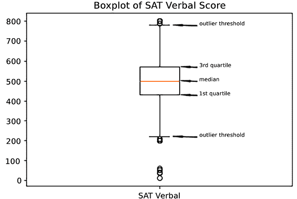

# 第五章：使用可视化工具识别意外值

在上一章的多个配方中，我们已初步接触了可视化的内容。我们使用了直方图和 QQ 图来检查单一变量的分布，使用散点图查看两个变量之间的关系。但这仅仅是我们在 Matplotlib 和 Seaborn 库中丰富的可视化工具的冰山一角。熟悉这些工具及其似乎无穷无尽的功能，可以帮助我们发现通过标准描述性统计无法轻易察觉的模式和异常。

例如，箱形图是一个非常适合可视化超出特定范围的值的工具。这些工具可以通过分组箱形图或小提琴图进行扩展，允许我们比较不同数据子集之间的分布。我们还可以用散点图做更多的探索，而不仅仅是上一章所做的那样，甚至可以获得一些关于多变量关系的见解。直方图如果将多个直方图绘制在同一图表中，或者创建堆叠直方图时，也能提供更多的见解。本章将深入探讨这些功能。

本章的配方具体展示了以下内容：

+   使用直方图检查连续变量的分布

+   使用箱形图识别连续变量的异常值

+   使用分组箱形图发现特定组中的意外值

+   使用小提琴图同时检查分布形态和异常值

+   使用散点图查看双变量关系

+   使用折线图检查连续变量的趋势

+   基于相关矩阵生成热图

# 技术要求

完成本章中的配方，你将需要 Pandas、Numpy、Matplotlib 和 Seaborn。我使用的是`pandas 2.1.4`，但代码在`pandas 1.5.3`或更高版本上也能运行。

本章中的代码可以从本书的 GitHub 仓库下载，`https://github.com/PacktPublishing/Python-Data-Cleaning-Cookbook-Second-Edition`。

# 使用直方图检查连续变量的分布

统计学家用来理解单个变量分布的首选可视化工具是直方图。直方图将一个连续变量绘制在*X*轴上，分箱由研究者确定，频率分布则显示在*Y*轴上。

直方图提供了一个清晰且有意义的分布形态图示，包括集中趋势、偏度（对称性）、超额峰度（相对较胖的尾部）和分散程度。这对于统计检验至关重要，因为许多检验会假设变量的分布。此外，我们对数据值的预期应该以对分布形态的理解为指导。例如，来自正态分布的 90^(th)百分位值与来自均匀分布的值有着非常不同的含义。

我要求初学统计学的学生做的第一项任务之一是从一个小样本手动构建直方图。下一节课我们将学习箱型图。直方图和箱型图一起为后续分析提供了坚实的基础。在我的数据科学工作中，我尽量记得在数据导入和清理之后，尽快为所有感兴趣的连续变量构建直方图和箱型图。在本食谱中，我们将创建直方图，接下来的两个食谱中我们将创建箱型图。

## 准备工作

我们将使用`Matplotlib`库生成直方图。在 Matplotlib 中，一些任务可以快速且直接地完成，直方图就是其中之一。在本章中，我们将根据哪个工具更容易生成所需的图形，来在 Matplotlib 和基于 Matplotlib 的 Seaborn 之间切换。

我们还将使用`statsmodels`库。你可以使用`pip install matplotlib`和`pip install statsmodels`通过 pip 安装 Matplotlib 和 statsmodels。

在本食谱中，我们将处理地球表面温度和 COVID-19 病例的数据。地表温度数据框包含每个天气站的一行数据。COVID-19 数据框包含每个国家的一行数据，其中包括总病例数和人口统计信息。

**注意**

地表温度数据框包含来自全球超过 12,000 个站点的 2023 年平均温度读数（单位：°C），尽管大多数站点位于美国。原始数据来自全球历史气候网络（GHCN）集成数据库。美国国家海洋和大气管理局提供该数据供公众使用，网址为[`www.ncei.noaa.gov/products/land-based-station/global-historical-climatology-network-monthly`](https://www.ncei.noaa.gov/products/land-based-station/global-historical-climatology-network-monthly)。

*我们的世界数据*提供了供公众使用的 COVID 数据，网址为[`ourworldindata.org/covid-cases`](https://ourworldindata.org/covid-cases)。本食谱中使用的数据是 2024 年 3 月 3 日下载的。

## 如何操作……

我们仔细查看了 2023 年各天气站的地表温度分布，以及每个国家每百万人的 COVID-19 总病例数。我们首先进行一些描述性统计，然后绘制 QQ 图、直方图和堆积直方图：

1.  导入`pandas`、`matplotlib`和`statsmodels`库。

此外，加载地表温度和 COVID-19 病例的数据：

```py
import pandas as pd
import matplotlib.pyplot as plt
import statsmodels.api as sm
landtemps = pd.read_csv("data/landtemps2023avgs.csv")
covidtotals = pd.read_csv("data/covidtotals.csv", parse_dates=["lastdate"])
covidtotals.set_index("iso_code", inplace=True) 
```

1.  显示一些天气站的温度行。

`latabs`列是纬度的值，不包括北方或南方指示符；因此，位于大约 30 度北纬的埃及开罗和位于大约 30 度南纬的巴西阿雷格里港有相同的值：

```py
landtemps[['station','country','latabs',
...   'elevation','avgtemp']].\
...   sample(10, random_state=1) 
```

```py
 station        country  \
11924         WOLF_POINT_29_ENE  United States  
10671             LITTLE_GRASSY  United States  
10278  FLOWERY_TRAIL_WASHINGTON  United States  
8436                ROCKSPRINGS  United States  
1715               PETERBOROUGH         Canada  
5650          TRACY_PUMPING_PLT  United States  
335              NEPTUNE_ISLAND      Australia  
372                     EUDUNDA      Australia  
2987                  KOZHIKODE          India  
7588                      TRYON  United States  
       latabs  elevation  avgtemp 
11924      48        636        6 
10671      37      1,859       10 
10278      48        792        8 
8436       30        726       20 
1715       44        191        8 
5650       38         19       18 
335        35         32       16 
372        34        415       16 
2987       11          5       30 
7588       35        366       16 
```

1.  显示一些描述性统计信息。

此外，查看偏度和峰度：

```py
landtemps.describe() 
```

```py
 latabs  elevation  avgtemp
count  12,137     12,137   12,137
mean       40        598       12
std        13        775        8
min         0       -350      -57
25%        35         78        6
50%        41        271       11
75%        47        824       17
max        90      9,999       34 
```

```py
landtemps.avgtemp.skew() 
```

```py
-0.3856060165979757 
```

```py
landtemps.avgtemp.kurtosis() 
```

```py
2.7939884544586033 
```

1.  绘制平均温度的直方图。

此外，在整体均值处绘制一条线：

```py
plt.hist(landtemps.avgtemp)
plt.axvline(landtemps.avgtemp.mean(), color='red', linestyle='dashed', linewidth=1)
plt.title("Histogram of Average Temperatures (Celsius)")
plt.xlabel("Average Temperature")
plt.ylabel("Frequency")
plt.show() 
```

这将产生以下直方图：


图 5.1：2019 年各气象站的平均温度直方图

1.  运行 QQ 图，检查分布与正态分布的偏离情况。

注意到大部分温度分布沿着红线分布（如果分布完全正常，所有点都会落在红线上，但尾部明显偏离正常分布）：

```py
sm.qqplot(landtemps[['avgtemp']].sort_values(['avgtemp']), line='s')
plt.title("QQ Plot of Average Temperatures")
plt.show() 
```

这产生了以下 QQ 图：


图 5.2：各气象站的平均温度与正态分布的对比图

1.  显示每百万的总 COVID-19 病例的偏度和峰度。

这来自 COVID-19 数据框，其中每一行代表一个国家：

```py
covidtotals.total_cases_pm.skew() 
```

```py
0.8349032460009967 
```

```py
covidtotals.total_cases_pm.kurtosis() 
```

```py
-0.4280595203351645 
```

1.  做一个 COVID-19 病例数据的堆叠直方图。

从四个地区选择数据。（堆叠直方图如果类别超过这个数目会显得很杂乱。）定义一个 `getcases` 函数，返回一个地区内各国的 `total_cases_pm` Series。将这些 Series 传递给 `hist` 方法（`[getcases(k) for k in showregions]`）以创建堆叠直方图。注意，西欧与其他地区的差异，几乎所有每百万病例数超过 500,000 的国家都位于该地区：

```py
showregions = ['Oceania / Aus','East Asia','Southern Africa',
...   'Western Europe']
def getcases(regiondesc):
...   return covidtotals.loc[covidtotals.\
...     region==regiondesc,
...     'total_cases_pm']
...
plt.hist([getcases(k) for k in showregions],\
...   color=['blue','mediumslateblue','plum','mediumvioletred'],\
...   label=showregions,\
...   stacked=True)
plt.title("Stacked Histogram of Cases Per Million for Selected Regions")
plt.xlabel("Cases Per Million")
plt.ylabel("Frequency")
plt.legend()
plt.show() 
```

这产生了以下堆叠直方图：


图 5.3：按地区分布的各国病例数的堆叠直方图，每百万人的不同病例数水平

1.  在同一图形中显示多个直方图。

这允许不同的 *x* 和 *y* 坐标轴值。我们需要循环遍历每个坐标轴，并为每个子图选择 `showregions` 中的一个不同地区：

```py
fig, axes = plt.subplots(2, 2)
fig.suptitle("Histograms of COVID-19 Cases Per Million by Selected Regions")
axes = axes.ravel()
for j, ax in enumerate(axes):
...   ax.hist(covidtotals.loc[covidtotals.region==showregions[j]].\
...     total_cases_pm, bins=7)
...   ax.set_title(showregions[j], fontsize=10)
...   for tick in ax.get_xticklabels():
...     tick.set_rotation(45)
...
plt.tight_layout()
fig.subplots_adjust(top=0.88)
plt.show() 
```

这产生了以下直方图：


图 5.4：按每百万病例不同水平，按地区分布的国家数量的直方图

之前的步骤演示了如何通过直方图和 QQ 图来可视化连续变量的分布。

## 它是如何工作的……

*步骤 4* 显示了显示直方图是多么容易。这可以通过将一个 Series 传递给 Matplotlib 的 `pyplot` 模块中的 `hist` 方法来完成。（我们为 Matplotlib 使用了 `plt` 的别名。）我们也可以传递任何 `ndarray`，甚至是数据 Series 的列表。

我们还可以很好地访问图形及其坐标轴的属性。我们可以设置每个坐标轴的标签、刻度标记和刻度标签。我们还可以指定图例的内容及其外观。在本章中，我们将经常利用这一功能。

我们将多个 Series 传递给 *步骤 7* 中的 `hist` 方法，以生成堆叠直方图。每个 Series 是一个地区内各国的 `total_cases_pm`（每百万人的病例数）值。为了获得每个地区的 Series，我们为 `showregions` 中的每个项调用 `getcases` 函数。我们为每个 Series 选择颜色，而不是让系统自动分配颜色。我们还使用 `showregions` 列表选择图例的标签。

在*步骤 8*中，我们首先指定要创建四个子图，分为两行两列。这就是 `plt.subplots(2, 2)` 的返回结果，它返回了图形和四个坐标轴。我们通过 `for j, ax in enumerate(axes)` 循环遍历坐标轴。在每次循环中，我们从 `showregions` 中选择一个不同的区域来绘制直方图。在每个坐标轴内，我们循环遍历刻度标签并改变其旋转角度。我们还调整子图的起始位置，以腾出足够的空间放置图形标题。请注意，在这种情况下，我们需要使用 `suptitle` 来添加标题，使用 `title` 只会将标题添加到子图中。

## 还有更多...

陆地温度数据并不是完全正态分布的，正如*步骤 3-5*中的直方图以及偏度和峰度测量所显示的那样。它偏向左侧（偏度为 `-0.39`），且尾部接近正态分布（峰度为 2.79，接近 3）。虽然存在一些极端值，但与数据集的整体规模相比，它们并不多。虽然数据分布不是完美的钟形曲线，但陆地温度数据框比 COVID-19 病例数据要容易处理得多。

COVID-19 的 `每百万病例` 变量的偏度和峰度显示它与正态分布相距较远。偏度为 0.83，峰度为 -0.43，表明该分布具有一定的正偏态，并且尾部比正态分布更窄。这在直方图中也得到了体现，即使我们按地区查看数据。大多数地区有许多国家的每百万病例数非常低，只有少数几个国家病例数很高。本章中的*使用分组箱型图揭示某一特定组中的异常值*示例显示几乎每个地区都有异常值。

如果你完成了本章中的所有示例，并且你对 Matplotlib 和 Seaborn 相对较为陌生，你会发现这两个库要么是灵活实用，要么是灵活得让人困惑。甚至很难选择一种策略并坚持下去，因为你可能需要以某种特定的方式设置图形和坐标轴才能获得你想要的可视化效果。在处理这些示例时，记住两件事是很有帮助的：第一，通常你需要创建一个图形和一个或多个子图；第二，主要的绘图函数通常是类似的，因此 `plt.hist` 和 `ax.hist` 都能经常奏效。

# 使用箱型图识别连续变量的异常值

箱型图本质上是我们在*第四章：使用单个变量识别异常值*中所做工作的图形表示，在这一章中我们使用了**四分位距**（**IQR**）的概念——即第一个四分位数和第三个四分位数之间的距离——来确定异常值。任何大于（`1.5 * IQR`）+ 第三个四分位数的值，或小于第一个四分位数 - (`1.5 * IQR`) 的值，都被认为是异常值。箱型图正是揭示了这一点。

## 准备工作

我们将使用关于 COVID-19 病例和死亡数据的累计数据，以及**国家纵向调查**（**NLS**）数据。你需要安装 Matplotlib 库，以便在你的计算机上运行代码。

## 如何操作…

我们使用箱线图来展示**学术能力评估测试**（**SAT**）分数、工作周数以及 COVID-19 病例和死亡数的形状和分布：

1.  加载`pandas`和`matplotlib`库。

另外，加载 NLS 和 COVID-19 数据：

```py
import pandas as pd
import matplotlib.pyplot as plt
nls97 = pd.read_csv("data/nls97f.csv", low_memory=False)
nls97.set_index("personid", inplace=True)
covidtotals = pd.read_csv("data/covidtotals.csv", parse_dates=["lastdate"])
covidtotals.set_index("iso_code", inplace=True) 
```

1.  绘制 SAT 语言成绩的箱线图。

首先生成一些描述性统计。`boxplot`方法生成一个矩形，表示四分位数间距（IQR），即第一和第三四分位数之间的值。须根从该矩形延伸到 1.5 倍的 IQR。任何超过须根范围的值（我们标记为异常值阈值）都被视为异常值（我们使用`annotate`标记第一和第三四分位点、中位数以及异常值阈值）：

```py
nls97.satverbal.describe() 
```

```py
count	1,406
mean	500
std	112
min	14
25%	430
50%	500
75%	570
max	800
Name: satverbal, dtype: float64 
```

```py
plt.boxplot(nls97.satverbal.dropna(), labels=['SAT Verbal'])
plt.annotate('outlier threshold', xy=(1.05,780), xytext=(1.15,780), size=7, arrowprops=dict(facecolor='black', headwidth=2, width=0.5, shrink=0.02))
plt.annotate('3rd quartile', xy=(1.08,570), xytext=(1.15,570), size=7, arrowprops=dict(facecolor='black', headwidth=2, width=0.5, shrink=0.02))
plt.annotate('median', xy=(1.08,500), xytext=(1.15,500), size=7, arrowprops=dict(facecolor='black', headwidth=2, width=0.5, shrink=0.02))
plt.annotate('1st quartile', xy=(1.08,430), xytext=(1.15,430), size=7, arrowprops=dict(facecolor='black', headwidth=2, width=0.5, shrink=0.02))
plt.annotate('outlier threshold', xy=(1.05,220), xytext=(1.15,220), size=7, arrowprops=dict(facecolor='black', headwidth=2, width=0.5, shrink=0.02))
plt.title("Boxplot of SAT Verbal Score")
plt.show() 
```

这将生成以下箱线图：



图 5.5：带有四分位数范围和异常值标签的 SAT 语言成绩箱线图

1.  接下来，显示一些关于工作周数的描述性统计：

    ```py
    weeksworked = nls97.loc[:, ['highestdegree',
      'weeksworked20','weeksworked21']]
    weeksworked.describe() 
    ```

    ```py
     weeksworked20  weeksworked21
    count          6,971          6,627
    mean              38             36
    std               21             18
    min                0              0
    25%               21             35
    50%               52             43
    75%               52             50
    max               52             52 
    ```

1.  绘制工作周数的箱线图：

    ```py
    plt.boxplot([weeksworked.weeksworked20.dropna(),
      weeksworked.weeksworked21.dropna()],
      labels=['Weeks Worked 2020','Weeks Worked 2021'])
    plt.title("Boxplots of Weeks Worked")
    plt.tight_layout()
    plt.show() 
    ```

这将生成以下箱线图：


图 5.6：并排显示的两个变量的箱线图

1.  显示 COVID-19 数据的一些描述性统计。

创建一个标签列表（`totvarslabels`），供后续步骤使用：

```py
totvars = ['total_cases','total_deaths',
...   'total_cases_pm','total_deaths_pm']
totvarslabels = ['cases','deaths',
...   'cases per million','deaths per million']
covidtotalsonly = covidtotals[totvars]
covidtotalsonly.describe() 
```

```py
 total_cases  total_deaths  total_cases_pm  total_deaths_pm
count          231           231             231              231
mean     3,351,599        30,214         206,178            1,262
std     11,483,212       104,779         203,858            1,315
min              4             0             354                0
25%         25,672           178          21,822              141
50%        191,496         1,937         133,946              827
75%      1,294,286        14,150         345,690            1,998
max    103,436,829     1,127,152         763,475            6,508 
```

1.  绘制每百万病例和死亡数的箱线图：

    ```py
    fig, ax = plt.subplots()
    plt.title("Boxplots of COVID-19 Cases and Deaths Per Million")
    ax.boxplot([covidtotalsonly.total_cases_pm,covidtotalsonly.total_deaths_pm],\
    ...   labels=['cases per million','deaths per million'])
    plt.tight_layout()
    plt.show() 
    ```

这将生成以下箱线图：


图 5.7：并排显示的两个变量的箱线图

1.  将箱线图作为单独的子图显示在一张图上。

当变量值差异很大时（例如 COVID-19 病例和死亡数），在一张图上查看多个箱线图会很困难。幸运的是，Matplotlib 允许我们在每张图上创建多个子图，每个子图可以使用不同的*x*和*y*轴。我们还可以将数据以千为单位呈现，以提高可读性：

```py
fig, axes = plt.subplots(2, 2)
fig.suptitle("Boxplots of COVID-19 Cases and Deaths in Thousands")
axes = axes.ravel()
for j, ax in enumerate(axes):
  ax.boxplot(covidtotalsonly.iloc[:, j]/1000, labels=[totvarslabels[j]])
plt.tight_layout()
fig.subplots_adjust(top=0.9)
plt.show() 
```

这将生成以下箱线图：


图 5.8：具有不同 y 轴的箱线图

箱线图是一种相对简单但极其有用的方式，用于查看变量的分布情况。它们使得在一个图形中同时可视化数据的分布、集中趋势和异常值变得非常容易。

## 它是如何工作的…

使用 Matplotlib 创建箱线图相当简单，正如*步骤 2*所示。只需将一个系列传递给 pyplot（我们使用`plt`别名）即可。我们调用 pyplot 的`show`方法来显示图形。这一步也展示了如何使用`annotate`向图形添加文本和符号。我们在*步骤 4*中通过将多个系列传递给 pyplot 来展示多个箱线图。

当尺度差异很大时（例如 COVID-19 结果数据：病例数、死亡数、每百万病例数和每百万死亡数），在单一图形中显示多个箱形图可能会很困难。*步骤 7*展示了处理这一问题的方法之一。我们可以在一张图上创建多个子图。首先，我们指定希望有四个子图，分布在两列两行。这就是`plt.subplots(2, 2)`所得到的结果，它返回一个图形和四个坐标轴。然后，我们可以遍历这些坐标轴，在每个上调用`boxplot`。挺巧妙的！

然而，由于某些极端值的存在，仍然很难看到病例和死亡数的四分位距（IQR）。在下一个示例中，我们去除一些极端值，以便更好地可视化剩余数据。

## 还有更多内容...

*步骤 2*中的 SAT 语文分数的箱形图表明该数据呈现相对正态分布。中位数接近 IQR 的中心位置。这并不令人惊讶，因为我们所做的描述性统计显示均值和中位数的值相同。然而，较低端的异常值空间远大于上端。（实际上，SAT 语文分数非常低似乎不可信，应该进行检查。）

*步骤 4*中的 2020 年和 2021 年工作的周数的箱形图显示了与 SAT 分数相比，变量分布差异非常大。中位数远高于均值，这表明存在负偏态。此外，注意到 2020 年值的分布上端没有胡须或异常值，因为中位数处于最大值附近或等于最大值。

## 另见

一些箱形图表明我们正在检查的数据并非呈正态分布。*第四章*中的*识别异常值*示例涵盖了一些正态分布检验。它还展示了如何更仔细地查看超出异常值阈值的值：即箱形图中的圆点。

# 使用分组箱形图发现特定组中的意外值

在前面的示例中，我们看到箱形图是检查连续变量分布的一个很好的工具。当我们想查看不同部分的数据集是否具有不同的分布时，箱形图也很有用，例如不同年龄组的薪资、按婚姻状况划分的子女数量，或不同哺乳动物物种的胎儿大小。分组箱形图是通过类别查看变量分布差异的一个方便直观的方式。

## 准备工作

我们将使用 NLS 和 COVID-19 病例数据。你需要在计算机上安装 Matplotlib 和 Seaborn 库，以便运行本示例中的代码。

## 如何操作...

我们生成了按最高学位获得情况分类的工作周数的描述性统计数据。然后，我们使用分组箱形图来可视化按学位类别划分的工作周数分布以及按地区划分的 COVID-19 病例分布。

1.  导入`pandas`、`matplotlib`和`seaborn`库：

    ```py
    import pandas as pd
    import matplotlib.pyplot as plt
    import seaborn as sns
    nls97 = pd.read_csv("data/nls97f.csv", low_memory=False)
    nls97.set_index("personid", inplace=True)
    covidtotals = pd.read_csv("data/covidtotals.csv", 
                               parse_dates=["lastdate"])
    covidtotals.set_index("iso_code", inplace=True) 
    ```

1.  查看每个学位获得水平的工作周数的中位数以及第一和第三四分位数值。

首先，定义一个返回这些值的函数作为 Series，然后使用`apply`对每个组调用该函数：

```py
def gettots(x):
...   out = {}
...   out['min'] = x.min()
...   out['qr1'] = x.quantile(0.25)
...   out['med'] = x.median()
...   out['qr3'] = x.quantile(0.75)
...   out['max'] = x.max()
...   out['count'] = x.count()
...   return pd.Series(out)
...
nls97.groupby(['highestdegree'])['weeksworked21'].\
  apply(gettots).unstack() 
```

```py
 min  qr1  med  qr3  max  count
highestdegree                                 
0\. None            0    0   39   49   52    487
1\. GED             0    7   42   50   52    853
2\. High School     0   27   42   50   52  2,529
3\. Associates      0   38   43   49   52    614
4\. Bachelors       0   40   43   50   52  1,344
5\. Masters         0   41   45   52   52    614
6\. PhD             0   41   44   49   52     59
7\. Professional    0   41   45   51   52    105 
```

1.  绘制按最高学位划分的工作周数的箱线图。

使用 Seaborn 库绘制这些箱线图。首先，创建一个子图并命名为`myplt`。这使得稍后访问子图属性更加方便。使用`boxplot`的`order`参数按最高学位排序。注意，对于那些从未获得学位的人群，低端没有异常值或胡须，因为这些人群的 IQR 几乎覆盖了所有的值范围。25%分位数的值为 0：

```py
myplt = \
  sns.boxplot(x='highestdegree',y='weeksworked21',
  data=nls97,
  order=sorted(nls97.highestdegree.dropna().unique()))
myplt.set_title("Boxplots of Weeks Worked by Highest Degree")
myplt.set_xlabel('Highest Degree Attained')
myplt.set_ylabel('Weeks Worked 2021')
myplt.set_xticklabels(myplt.get_xticklabels(), rotation=60, horizontalalignment='right')
plt.tight_layout()
plt.show() 
```

这将产生以下的箱线图：


图 5.9：按最高学位划分的工作周数的箱线图，包含 IQR 和异常值

1.  查看按区域划分的每百万人病例的最小值、最大值、中位数，以及第一和第三四分位数值。

使用在*步骤 2*中定义的`gettots`函数：

```py
covidtotals.groupby(['region'])['total_cases_pm'].\
  apply(gettots).unstack() 
```

```py
 min     qr1     med     qr3     max  count
region                                                       
Caribbean   2,979 128,448 237,966 390,758 626,793  26
Central Af    434   2,888   4,232   9,948  29,614  11
Central Am  2,319  38,585  70,070 206,306 237,539   7
Central As  1,787   7,146  45,454  79,795 162,356   6
East Africa   660   2,018   4,062  71,435 507,765  15
East Asia   8,295  26,930  69,661 285,173 763,475  15
East. Eu  104,252 166,930 223,685 459,646 760,161  21
North Afr   4,649   6,058  34,141  74,463  93,343   5
North Am   60,412 108,218 214,958 374,862 582,158   4
Oceania/Aus 4,620  75,769 259,196 356,829 508,709  24
South Am   19,529 101,490 133,367 259,942 505,919  14
South As    5,630  11,959  31,772  80,128 473,167   9
South. Af   4,370  15,832  40,011  67,775 401,037  10
West Af       363   1,407   2,961   4,783 108,695  16
West Asia     354  78,447 123,483 192,995 512,388  16
West. Eu   32,178 289,756 465,940 587,523 750,727  32 
```

1.  绘制按区域划分的每百万人病例的箱线图。

由于区域数量较多，需要翻转坐标轴。同时，绘制一个蜂群图，以显示按区域划分的国家数量。蜂群图为每个区域中的每个国家显示一个点。由于极端值，某些 IQR（四分位距）难以观察：

```py
sns.boxplot(x='total_cases_pm', y='region', data=covidtotals)
sns.swarmplot(y="region", x="total_cases_pm", data=covidtotals, size=2, color=".3", linewidth=0)
plt.title("Boxplots of Total Cases Per Million by Region")
plt.xlabel("Cases Per Million")
plt.ylabel("Region")
plt.xticks(rotation=45)
plt.tight_layout()
plt.show() 
```

这将产生以下的箱线图：


图 5.10：按区域划分的每百万人病例的箱线图和蜂群图，包含 IQR 和异常值

1.  显示每百万人病例的最高值：

    ```py
    highvalue = covidtotals.total_cases_pm.quantile(0.9)
    highvalue 
    ```

    ```py
    512388.401 
    ```

    ```py
    covidtotals.loc[covidtotals.total_cases_pm>=highvalue,\
      ['location','total_cases_pm']] 
    ```

    ```py
     location  total_cases_pm
    iso_code                                          
    AND                         Andorra       601,367.7
    AUT                         Austria       680,262.6
    BRN                          Brunei       763,475.4
    CYP                          Cyprus       760,161.5
    DNK                         Denmark       583,624.9
    FRO                  Faeroe Islands       652,484.1
    FRA                          France       603,427.6
    GIB                       Gibraltar       628,882.7
    GRC                          Greece       540,380.1
    GLP                      Guadeloupe       513,528.3
    GGY                        Guernsey       557,817.1
    ISL                         Iceland       562,822.0
    ISR                          Israel       512,388.4
    JEY                          Jersey       599,218.4
    LVA                          Latvia       528,300.3
    LIE                   Liechtenstein       548,113.3
    LUX                      Luxembourg       603,439.5
    MTQ                      Martinique       626,793.1
    PRT                        Portugal       549,320.5
    SPM       Saint Pierre and Miquelon       582,158.0
    SMR                      San Marino       750,727.2
    SGP                       Singapore       531,183.8
    SVN                        Slovenia       639,407.7
    KOR                     South Korea       667,207.1 
    ```

1.  重新绘制不包含极端值的箱线图：

    ```py
    sns.boxplot(x='total_cases_pm', y='region', data=covidtotals.loc[covidtotals.total_cases_pm<highvalue])
    sns.swarmplot(y="region", x="total_cases_pm", data=covidtotals.loc[covidtotals.total_cases_pm<highvalue], size=3, color=".3", linewidth=0)
    plt.title("Total Cases Without Extreme Values")
    plt.xlabel("Cases Per Million")
    plt.ylabel("Region")
    plt.tight_layout()
    plt.show() 
    ```

这将产生以下的箱线图：


图 5.11：按区域划分的每百万人病例的箱线图（不包含极端值）

这些分组箱线图展示了按人口调整后的病例分布在各个区域之间的变化情况。

## 工作原理...

我们在本配方中使用 Seaborn 库来创建图形。我们也可以使用 Matplotlib。实际上，Seaborn 是基于 Matplotlib 构建的，扩展了 Matplotlib 的某些功能，并使一些操作变得更加简单。与 Matplotlib 的默认设置相比，它有时能生成更加美观的图形。

在创建包含多个箱线图的图形之前，最好先准备一些描述性信息。在*步骤* *2*中，我们获取每个学位获得水平的第一个和第三个四分位数值，以及中位数。我们通过首先创建一个名为`gettots`的函数来实现，该函数返回一个包含这些值的序列。我们通过以下语句将`gettots`应用于数据框中的每个组：

```py
nls97.groupby(['highestdegree'])['weeksworked21'].apply(gettots).unstack() 
```

`groupby`方法创建一个包含分组信息的数据框，并将其传递给`apply`函数。然后，`gettots`为每个组计算汇总值。`unstack`方法将返回的行进行重塑，将每组中的多行（每个汇总统计量一行）转换为每组一行，并为每个汇总统计量创建列。

在*Step* *3*中，我们为每个学位层次生成一个箱线图。当我们使用 Seaborn 的`boxplot`方法时，通常不需要为创建的子图对象命名。但在这一步中，我们将其命名为`myplt`，以便稍后可以轻松更改属性，例如刻度标签。我们使用`set_xticklabels`旋转*x*轴上的标签，以避免它们重叠。

在*Step 5*中，我们翻转箱线图的轴，因为区域的层级比连续变量每百万病例数的刻度多。为此，我们将`total_cases_pm`作为第一个参数的值，而不是第二个。我们还做了一个 swarm plot，以便了解每个地区的观察数量（国家）。

极端值有时会使箱线图难以查看。箱线图显示异常值和四分位数间距（IQR），但当异常值是第三或第一四分位值的数倍时，IQR 矩形将非常小而难以查看。在*Step 7*中，我们删除所有大于或等于 512,388 的`total_cases_pm`值。这改善了可视化细节的呈现。

## 还有更多内容…

在*Step* *3*中的教育程度的周工作箱线图显示了工作周数的高变异性，这在单变量分析中并不明显。教育程度越低，工作周数的波动就越大。2021 年，持有高中以下学历的个体的工作周数存在相当大的变异性，而拥有大学学位的个体的变异性非常小。

这对于我们理解以工作周数衡量的异常值是非常相关的。例如，一个拥有大学学位的人工作了 20 周，算是一个异常值，但如果他们只有高中以下文凭，则不会被视为异常值。

*每百万人口病例数*的箱线图也邀请我们更加灵活地思考什么是异常值。例如，在北非的每百万人口病例数的异常值在整个数据集中并不算是高异常值。北非的最大值实际上低于西欧的第一四分位数值。

当我看箱线图时，我首先注意到的是中位数在 IQR 中的位置。如果中位数与中心完全不接近，我知道我在处理的不是正态分布的变量。它还让我对偏斜的方向有了很好的感觉。如果它靠近 IQR 的底部，意味着中位数比第三四分位数接近第一四分位数，那么存在正偏斜。比较东欧和西欧的箱线图。大量低值和少量高值使东欧的中位数接近西欧的第一四分位数值。

## 另请参见

在*第九章* *解决混乱数据聚合*中，我们更多地使用`groupby`。在*第十一章* *整理和重塑数据*中，我们更多地使用`stack`和`unstack`。

# 使用小提琴图检查分布形状和异常值

小提琴图将直方图和箱线图结合在一张图中。它们显示了 IQR、中位数、须条，以及各个数值范围内观察值的频率。如果没有实际的小提琴图，很难想象这是如何做到的。我们使用与上一个食谱中箱线图相同的数据生成几个小提琴图，以便更容易理解它们的工作原理。

## 准备工作

我们将使用 NLS 数据。你需要在计算机上安装 Matplotlib 和 Seaborn 才能运行本食谱中的代码。

## 如何操作…

我们使用小提琴图来查看分布的范围和形态，并将它们显示在同一图表中。然后我们按组进行小提琴图绘制：

1.  加载 `pandas`、`matplotlib` 和 `seaborn`，以及 NLS 数据：

    ```py
    import pandas as pd
    import numpy as np
    import matplotlib.pyplot as plt
    import seaborn as sns
    nls97 = pd.read_csv("data/nls97f.csv", low_memory=False)
    nls97.set_index("personid", inplace=True) 
    ```

1.  绘制 SAT verbal 分数的小提琴图：

    ```py
    sns.violinplot(y=nls97.satverbal, color="wheat", orient="v")
    plt.title("Violin Plot of SAT Verbal Score")
    plt.ylabel("SAT Verbal")
    plt.text(0.08, 780, 'outlier threshold', horizontalalignment='center', size='x-small')
    plt.text(0.065, nls97.satverbal.quantile(0.75), '3rd quartile', horizontalalignment='center', size='x-small')
    plt.text(0.05, nls97.satverbal.median(), 'Median', horizontalalignment='center', size='x-small')
    plt.text(0.065, nls97.satverbal.quantile(0.25), '1st quartile', horizontalalignment='center', size='x-small')
    plt.text(0.08, 210, 'outlier threshold', horizontalalignment='center', size='x-small')
    plt.text(-0.4, 500, 'frequency', horizontalalignment='center', size='x-small')
    plt.show() 
    ```

这将产生以下小提琴图：


图 5.12：SAT verbal 分数的小提琴图，带有 IQR 和异常值阈值的标签

1.  获取工作周数的描述性统计：

    ```py
    nls97.loc[:, ['weeksworked20','weeksworked21']].describe() 
    ```

    ```py
     weeksworked20  weeksworked21
    count          6,971          6,627
    mean              38             36
    std               21             18
    min                0              0
    25%               21             35
    50%               52             43
    75%               52             50
    max               52             52 
    ```

1.  显示 2020 年和 2021 年的工作周数。

使用更面向对象的方法，以便更容易访问某些轴的属性。请注意，`weeksworked` 分布是双峰的，分布的顶部和底部都有峰值。另外，注意 2020 年和 2021 年的 IQR 非常不同：

```py
myplt = sns.violinplot(data=nls97.loc[:, ['weeksworked20','weeksworked21']])
myplt.set_title("Violin Plots of Weeks Worked")
myplt.set_xticklabels(["Weeks Worked 2020","Weeks Worked 2021"])
plt.show() 
```

这将产生以下小提琴图：


图 5.13：显示两个变量分布范围和形态的小提琴图，按组并排展示

1.  按性别和婚姻状况绘制工资收入的小提琴图。

首先，创建一个合并的婚姻状况列。指定性别为 *x* 轴，工资为 *y* 轴，新的合并婚姻状况列为 `hue`。`hue` 参数用于分组，这将与 *x* 轴已使用的任何分组一起添加。我们还指定 `scale="count"`，以便根据每个类别中的观察值数量生成大小不同的小提琴图：

```py
nls97["maritalstatuscollapsed"] = \
  nls97.maritalstatus.replace(['Married',
   'Never-married','Divorced','Separated',
   'Widowed'],\
  ['Married','Never Married','Not Married',
   'Not Married','Not Married'])
sns.violinplot(x="gender", y="wageincome20", hue="maritalstatuscollapsed",
  data=nls97, scale="count")
plt.title("Violin Plots of Wage Income by Gender and Marital Status")
plt.xlabel('Gender')
plt.ylabel('Wage Income 2020')
plt.legend(title="", loc="upper center", framealpha=0, fontsize=8)
plt.tight_layout()
plt.show() 
```

这将产生以下小提琴图：


图 5.14：显示两个不同组之间分布范围和形态的小提琴图

1.  按最高学历绘制工作周数的小提琴图：

    ```py
    nls97 = nls97.sort_values(['highestdegree'])
    myplt = sns.violinplot(x='highestdegree',y='weeksworked21', data=nls97)
    myplt.set_xticklabels(myplt.get_xticklabels(), rotation=60, horizontalalignment='right')
    myplt.set_title("Violin Plots of Weeks Worked by Highest Degree")
    myplt.set_xlabel('Highest Degree Attained')
    myplt.set_ylabel('Weeks Worked 2021')
    plt.tight_layout()
    plt.show() 
    ```

这将产生以下小提琴图：


图 5.15：按组显示分布范围和形态的小提琴图

这些步骤展示了小提琴图如何告诉我们 DataFrame 中连续变量的分布情况，以及它们在不同组之间可能的变化。

## 工作原理…

类似于箱型图，小提琴图显示了中位数、第一四分位数、第三四分位数和胡须。它们还显示了变量值的相对频率。（当小提琴图垂直显示时，相对频率就是某一点的宽度。）*第 2 步*中生成的小提琴图及其相关注释提供了一个很好的示例。从小提琴图中我们可以看出，SAT 语文成绩的分布与正态分布没有显著差异，除了低端的极端值外。最大隆起（最大宽度）出现在中位数处，从那里对称地下降。中位数与第一和第三四分位数的距离大致相等。

我们可以通过将一个或多个数据系列传递给`violinplot`方法来在 Seaborn 中创建小提琴图。我们也可以传递整个 DataFrame 中的一列或多列。在*第 4 步*中，我们这么做是因为我们希望绘制多个连续变量。

有时我们需要稍微调整图例，以使其既具有信息性，又不显得突兀。在*第 5 步*中，我们使用了以下命令来移除图例标题（因为从数值中已经很清楚），将图例放置在图形的最佳位置，并使框体透明（`framealpha=0`）：

```py
plt.legend(title="", loc="upper center", framealpha=0, fontsize=8) 
```

## 还有更多…

一旦你掌握了小提琴图，你就会欣赏到它在一张图上呈现的海量信息。我们可以了解分布的形状、中心趋势和分散程度。我们也可以轻松地展示不同数据子集的这些信息。

2020 年工作周数的分布与 2021 年工作周数的分布差异足够大，以至于让细心的分析师停下来思考。2020 年的四分位距（IQR）为 31（从 21 到 52），而 2021 年为 15（从 35 到 50）。（2020 年的工作周数分布可能受到疫情的影响。）

在检查*第 5 步*中生成的小提琴图时，揭示了一个关于工资收入分布的不寻常现象。已婚男性的收入在分布的顶部出现了集中现象，已婚女性也有类似的现象。这对于工资收入分布来说是相当不寻常的。事实证明，工资收入有一个上限为$380,288。这是我们在未来包括工资收入的分析中必须考虑的一个因素。

不同性别和婚姻状况的收入分布形状相似，都在中位数下方略有隆起，并具有延伸的正尾。四分位距的长度相对相似。然而，已婚男性的分布明显高于（或在选择的方向上偏右）其他组。

按学历划分的工作周数的提琴图显示出不同组别间的分布差异，正如我们在上一节的箱型图中发现的那样。更清晰的一点是，低学历人群的分布呈双峰态。在没有大学学位的人群中，工作周数较少的集中在低周数（例如工作 5 周或更少），而没有高中文凭的人群在 2021 年工作 5 周或更少的可能性几乎和工作 50 周或更多的可能性一样。

在本食谱中，我们仅使用了 Seaborn 来生成提琴图。Matplotlib 也可以生成提琴图，但 Matplotlib 中提琴图的默认图形与 Seaborn 的图形差别很大。

## 另请参阅

将本节中本食谱的提琴图与本章前面的直方图、箱型图和分组箱型图进行比较可能会有所帮助。

# 使用散点图查看双变量关系

我的感觉是，数据分析师依赖的图表中，散点图是最常见的图表之一，可能只有直方图例外。我们都非常习惯查看可以在二维平面上展示的关系。散点图捕捉了重要的现实世界现象（变量之间的关系），并且对大多数人来说非常直观。这使得它们成为我们可视化工具箱中不可或缺的一部分。

## 准备工作

本食谱需要`Matplotlib`和`Seaborn`。我们将使用`landtemps`数据集，它提供了 2023 年全球 12,137 个气象站的平均温度数据。

## 如何操作……

我们在上一章提升了散点图技能，能够可视化更加复杂的关系。我们通过在一张图表中显示多个散点图、创建三维散点图以及显示多条回归线，来展示平均温度、纬度和海拔之间的关系：

1.  加载`pandas`、`numpy`、`matplotlib`和`seaborn`：

    ```py
    import pandas as pd
    import numpy as np
    import matplotlib.pyplot as plt
    import seaborn as sns
    landtemps = pd.read_csv("data/landtemps2023avgs.csv") 
    ```

1.  运行纬度（`latabs`）与平均温度的散点图：

    ```py
    plt.scatter(x="latabs", y="avgtemp", data=landtemps)
    plt.xlabel("Latitude (N or S)")
    plt.ylabel("Average Temperature (Celsius)")
    plt.yticks(np.arange(-60, 40, step=20))
    plt.title("Latitude and Average Temperature in 2023")
    plt.show() 
    ```

结果如下散点图：


图 5.16：按平均温度绘制的纬度散点图

1.  用红色显示高海拔点。

创建低海拔和高海拔的数据框。请注意，在每个纬度下，高海拔点通常较低（即温度较低）：

```py
low, high = landtemps.loc[landtemps.elevation<=1000], landtemps.loc[landtemps.elevation>1000]
plt.scatter(x="latabs", y="avgtemp", c="blue", data=low)
plt.scatter(x="latabs", y="avgtemp", c="red", data=high)
plt.legend(('low elevation', 'high elevation'))
plt.xlabel("Latitude (N or S)")
plt.ylabel("Average Temperature (Celsius)")
plt.title("Latitude and Average Temperature in 2023")
plt.show() 
```

结果如下散点图：


图 5.17：按平均温度和海拔绘制的纬度散点图

1.  查看温度、纬度和海拔的三维图。

看起来在高海拔站点的纬度增加下，温度的下降趋势较为陡峭：

```py
fig = plt.figure()
plt.suptitle("Latitude, Temperature, and Elevation in 2023")
ax = plt.axes(projection='3d')
ax.set_xlabel("Elevation")
ax.set_ylabel("Latitude")
ax.set_zlabel("Avg Temp")
ax.scatter3D(low.elevation, low.latabs, low.avgtemp, label="low elevation", c="blue")
ax.scatter3D(high.elevation, high.latabs, high.avgtemp, label="high elevation", c="red")
ax.legend()
plt.show() 
```

结果如下散点图：


图 5.18：按平均温度绘制的纬度和海拔的三维散点图

1.  显示纬度与温度的回归线。

使用`regplot`获取回归线：

```py
sns.regplot(x="latabs", y="avgtemp", color="blue", data=landtemps)
plt.title("Latitude and Average Temperature in 2023")
plt.xlabel("Latitude (N or S)")
plt.ylabel("Average Temperature")
plt.show() 
```

结果如下散点图：


图 5.19：纬度与平均温度的散点图，带有回归线

1.  显示低海拔和高海拔车站的回归线。

这次我们使用`lmplot`，而不是`regplot`。这两种方法有类似的功能。不出所料，高海拔车站的回归线看起来具有较低的截距（即线与*y*轴的交点）以及更陡峭的负斜率：

```py
landtemps['elevation'] = np.where(landtemps.elevation<=1000,'low','high')
sns.lmplot(x="latabs", y="avgtemp", hue="elevation", palette=dict(low="blue", high="red"),  facet_kws=dict(legend_out=False), data=landtemps)
plt.xlabel("Latitude (N or S)")
plt.ylabel("Average Temperature")
plt.yticks(np.arange(-60, 40, step=20))
plt.title("Latitude and Average Temperature in 2023")
plt.show() 
```

这将产生以下的散点图：


图 5.20：纬度与温度的散点图，带有不同海拔的回归线

1.  显示一些位于低海拔和高海拔回归线上的车站。我们可以使用我们在*步骤 3*中创建的`high`和`low` DataFrame：

    ```py
    high.loc[(high.latabs>38) & \
    ...   (high.avgtemp>=18),
    ...   ['station','country','latabs',
    ...   'elevation','avgtemp']] 
    ```

    ```py
     station   country  latabs  elevation  avgtemp
    82     YEREVAN   Armenia      40      1,113       19
    3968  LAJES_AB  Portugal      39      1,016       19 
    ```

    ```py
    low.loc[(low.latabs>47) & \
    ...   (low.avgtemp>=14),
    ...   ['station','country','latabs',
    ...   'elevation','avgtemp']] 
    ```

    ```py
     station        country  latabs  elevation  avgtemp
    1026    COURTENAY_PUNTLEDGE         Canada      50         40       16
    1055    HOWE_SOUNDPAM_ROCKS         Canada      49          5       14
    1318  FORESTBURG_PLANT_SITE         Canada      52        663       18
    2573        POINTE_DU_TALUT         France      47         43       14
    2574      NANTES_ATLANTIQUE         France      47         27       14
    4449           USTORDYNSKIJ         Russia      53        526       17
    6810   WALKER_AH_GWAH_CHING  United States      47        430       20
    7050     MEDICINE_LAKE_3_SE  United States      48        592       16
    8736                 QUINCY  United States      47        392       14
    9914       WINDIGO_MICHIGAN  United States      48        213       16 
    ```

散点图是查看两个变量之间关系的好方法。这些步骤还展示了我们如何为数据的不同子集显示这些关系。

## 它是如何工作的……

我们只需提供`x`和`y`的列名以及一个 DataFrame，就可以运行一个散点图。无需其他更多的操作。我们可以访问与运行直方图和箱线图时相同的图形和坐标轴属性——标题、坐标轴标签、刻度线和标签等。请注意，为了访问像坐标轴标签（而不是图形上的标签）这样的属性，我们使用`set_xlabels`或`set_ylabels`，而不是`xlabels`或`ylabels`。

3D 图稍微复杂一些。首先，我们将坐标轴的投影设置为`3d`——`plt.axes(projection='3d')`，就像我们在*步骤 4*中做的那样。然后我们可以为每个子图使用`scatter3D`方法。

由于散点图旨在说明回归变量（`x`变量）与因变量之间的关系，因此在散点图上看到最小二乘回归线是非常有帮助的。Seaborn 提供了两种方法来做到这一点：`regplot`和`lmplot`。我通常使用`regplot`，因为它资源消耗较少。但有时，我需要`lmplot`的特性。我们在*步骤 6*中使用`lmplot`及其`hue`属性，为每个海拔水平生成单独的回归线。

在*步骤 7*中，我们查看一些异常值：那些温度明显高于其所属组的回归线的车站。我们想要调查葡萄牙的`LAJES_AB`车站和亚美尼亚的`YEREVAN`车站的数据（`(high.latabs>38) & (high.avgtemp>=18)`）。这些车站的平均温度高于根据给定纬度和海拔水平预测的温度。

## 还有更多……

我们看到了纬度与平均温度之间的预期关系。随着纬度的增加，温度下降。但是，海拔是另一个重要因素。能够同时可视化所有三个变量有助于我们更容易识别异常值。当然，温度的其他影响因素也很重要，比如暖流。遗憾的是，这些数据在当前的数据集中没有。

散点图非常适合可视化两个连续变量之间的关系。通过一些调整，Matplotlib 和 Seaborn 的散点图工具也可以通过增加第三维度（当第三维度为分类变量时，通过颜色的创意使用，或通过改变点的大小）来提供对三个变量之间关系的理解（*第四章*中*使用线性回归识别具有高影响力的数据点*的实例展示了这一点）。

## 另见

这是一本关于可视化的章节，着重于通过可视化识别意外值。但这些图形也迫切需要我们在*第四章*中进行的多变量分析，*在数据子集中的异常值识别*。特别是，线性回归分析和对残差的深入分析，对于识别异常值会很有帮助。

# 使用折线图检查连续变量的趋势

可视化连续变量在规律时间间隔内的值的典型方法是通过折线图，尽管有时对于较少的时间间隔，柱状图也可以使用。在本配方中，我们将使用折线图来展示变量趋势，并检查趋势的突变以及按组别的时间差异。

## 准备工作

本配方将处理每日的 COVID-19 病例数据。在之前的配方中，我们使用了按国家统计的总数。每日数据提供了每个国家每日新增病例和新增死亡人数，以及我们在其他配方中使用的相同人口统计变量。你需要安装 Matplotlib 才能运行本配方中的代码。

## 如何操作……

我们使用折线图来可视化每日 COVID-19 病例和死亡趋势。我们按地区创建折线图，并使用堆叠图来更好地理解一个国家如何影响整个地区的病例数量：

1.  导入`pandas`、`matplotlib`以及`matplotlib.dates`和日期格式化工具：

    ```py
    import pandas as pd
    import numpy as np
    import matplotlib.pyplot as plt
    import matplotlib.dates as mdates
    from matplotlib.dates import DateFormatter
    coviddaily = pd.read_csv("data/coviddaily.csv", parse_dates=["casedate"]) 
    ```

1.  查看几行 COVID-19 每日数据：

    ```py
    coviddaily.sample(2, random_state=1).T 
    ```

    ```py
     628             26980
    iso_code                    AND             PRT
    casedate             2020-03-15      2022-12-04
    location                Andorra        Portugal
    continent                Europe          Europe
    new_cases                     1           3,963
    new_deaths                    0              69
    population                79843        10270857
    pop_density                 164             112
    median_age                  NaN              46
    gdp_per_capita              NaN          27,937
    hosp_beds                   NaN               3
    vac_per_hund                NaN             NaN
    aged_65_older               NaN              22
    life_expectancy              84              82
    hum_dev_ind                   1               1
    region           Western Europe  Western Europe 
    ```

1.  按天计算新增病例和死亡人数。

选择 2023 年 7 月 1 日到 2024 年 3 月 3 日之间的日期，然后使用`groupby`汇总每一天所有国家的病例和死亡数据：

```py
coviddailytotals = \
  coviddaily.loc[coviddaily.casedate.\
    between('2023-07-01','2024-03-03')].\
  groupby(['casedate'])[['new_cases','new_deaths']].\
  sum().\
  reset_index() 
```

```py
coviddailytotals.sample(7, random_state=1)
     casedate  new_cases  new_deaths
27 2024-01-07    181,487       1,353
3  2023-07-23    254,984         596
22 2023-12-03    282,319       1,535
18 2023-11-05    158,346       1,162
23 2023-12-10    333,155       1,658
17 2023-10-29    144,325         905
21 2023-11-26    238,282       1,287 
```

1.  按天显示新增病例和新增死亡的折线图。

在不同的子图中显示病例和死亡数据：

```py
fig = plt.figure()
plt.suptitle("New COVID-19 Cases and Deaths By Day Worldwide 2023-2024")
ax1 = plt.subplot(2,1,1)
ax1.plot(coviddailytotals.casedate, coviddailytotals.new_cases)
ax1.xaxis.set_major_formatter(DateFormatter("%b"))
ax1.set_xlabel("New Cases")
ax2 = plt.subplot(2,1,2)
ax2.plot(coviddailytotals.casedate, coviddailytotals.new_deaths)
ax2.xaxis.set_major_formatter(DateFormatter("%b"))
ax2.set_xlabel("New Deaths")
plt.tight_layout()
fig.subplots_adjust(top=0.88)
plt.show() 
```

这将产生以下的折线图：


图 5.21：全球 COVID-19 病例和死亡的每日趋势线

1.  按天和地区计算新增病例和死亡人数：

    ```py
    regiontotals = \
      coviddaily.loc[coviddaily.casedate.\
        between('2023-07-01','2024-03-03')].\
      groupby(['casedate','region'])\
        [['new_cases','new_deaths']].\
      sum().\
      reset_index()
    regiontotals.sample(7, random_state=1) 
    ```

    ```py
     casedate         region  new_cases  new_deaths
    110 2023-08-13      West Asia      2,313          25
    147 2023-09-03   Central Asia        600           7
    494 2024-02-04  Oceania / Aus     12,594          38
    325 2023-11-19      East Asia     20,088          15
    189 2023-09-17    West Africa         85           0
    218 2023-10-01  South America      4,203          54
    469 2024-01-21  Oceania / Aus     17,503         129 
    ```

1.  按选定地区显示新增病例的折线图。

遍历`showregions`中的各个地区。为每个地区绘制按天计算的`new_cases`总数的折线图。使用`gca`方法获取*x*轴并设置日期格式：

```py
showregions = ['East Asia','Southern Africa',
...   'North America','Western Europe']
for j in range(len(showregions)):
...   rt = regiontotals.loc[regiontotals.\
...     region==showregions[j],
...     ['casedate','new_cases']]
...   plt.plot(rt.casedate, rt.new_cases,
...     label=showregions[j])
plt.title("New COVID-19 Cases By Day and Region in 2023-2024")
plt.gca().get_xaxis().set_major_formatter(DateFormatter("%b"))
plt.ylabel("New Cases")
plt.legend()
plt.show() 
```

这将产生以下的折线图：

 图 5.22：按地区显示的 COVID-19 每日趋势线

1.  使用堆叠图来更仔细地检查一个地区的趋势。

查看南美洲是否是由一个国家（巴西）推动了趋势线。为南美洲按天创建一个`new_cases`的 DataFrame（`sa`）。然后，将巴西的`new_cases`系列添加到`sa` DataFrame 中。接着，在`sa` DataFrame 中为南美洲的病例创建一个新的 Series，去除巴西的病例（`sacasesnobr`）：

```py
sa = \
  coviddaily.loc[(coviddaily.casedate.\
    between('2023-01-01','2023-10-31')) & \
    (coviddaily.region=='South America'),
    ['casedate','new_cases']].\
  groupby(['casedate'])\
    [['new_cases']].\
  sum().\
  reset_index().\
  rename(columns={'new_cases':'sacases'})
br = coviddaily.loc[(coviddaily.\
  location=='Brazil') & \
  (coviddaily.casedate. \
  between('2023-01-01','2023-10-31')),
  ['casedate','new_cases']].\
  rename(columns={'new_cases':'brcases'})
sa = pd.merge(sa, br, left_on=['casedate'], right_on=['casedate'], how="left")
sa.fillna({"sacases": 0},
  inplace=True)
sa['sacasesnobr'] = sa.sacases-sa.brcases
fig = plt.figure()
ax = plt.subplot()
ax.stackplot(sa.casedate, sa.sacases, sa.sacasesnobr, labels=['Brazil','Other South America'])
ax.xaxis.set_major_formatter(DateFormatter("%m-%d"))
plt.title("New COVID-19 Cases in South America in 2023")
plt.tight_layout()
plt.legend(loc="upper left")
plt.show() 
```

这将生成以下堆叠图：


图 5.23 – 巴西及南美洲其他地区每日病例的堆叠趋势

这些步骤展示了如何使用折线图查看变量随时间的变化趋势，并且如何在一张图上显示不同组的趋势。

## 它是如何工作的……

在绘制折线图之前，我们需要对每日 COVID-19 数据进行一些处理。在*步骤 3*中，我们使用`groupby`来汇总每个国家每天的新病例和死亡病例。在*步骤 5*中，我们使用`groupby`来汇总每个地区和每天的病例和死亡人数。

在*步骤 4*中，我们使用`plt.subplot(2,1,1)`设置了第一个子图。这将为我们提供一个包含两行一列的图形。第三个参数中的`1`表示这个子图将是第一个，也就是最上面的子图。我们可以传入一个日期数据序列以及*y*轴的数值。到目前为止，这与我们在使用`hist`、`scatterplot`、`boxplot`和`violinplot`方法时做的基本相同。但由于我们在处理日期数据，这里我们利用 Matplotlib 的日期格式化工具，并通过`xaxis.set_major_formatter(DateFormatter("%b"))`来设置只显示月份。由于我们在使用子图，我们使用`set_xlabel`而不是`xlabel`来指示我们想要的*X*轴标签。

我们在*步骤 6*中为四个选定的地区展示了折线图。我们通过对每个想要绘制的地区调用`plot`来实现这一点。我们本可以对所有地区进行绘制，但那样图形将过于复杂，难以查看。

在*步骤 7*中，我们需要做一些额外的处理，将巴西的新病例从南美洲的病例中分离出来。完成这一操作后，我们可以绘制一个堆叠图，将南美洲的病例（不包括巴西）和巴西的病例分别显示。这张图表明，2023 年南美洲的新病例趋势主要受到巴西趋势的影响。

## 还有更多内容……

*步骤 6*中生成的图表揭示了一些潜在的数据问题。2023 年 4 月，东亚地区出现了一个不寻常的峰值。检查这些总数是否存在数据收集错误非常重要。

很难忽视不同地区趋势的差异。当然，这些差异背后有实际的原因。不同的曲线反映了我们所知道的不同国家和地区传播速度的现实情况。然而，值得探索趋势线方向或斜率的任何重大变化，以确保我们能确认数据的准确性。

## 另见

我们将在*第九章*更详细地介绍`groupby`，在*第十章*像在*步骤 7*中那样合并数据时，解决数据问题。

# 基于相关矩阵生成热图

两个变量之间的相关性是衡量它们一起移动程度的指标。相关系数为 1 意味着两个变量完全正相关。一个变量增大时，另一个也增大。值为-1 意味着它们完全负相关。一个变量增大时，另一个减小。相关系数为 1 或-1 很少发生，但大于 0.5 或小于-0.5 的相关可能仍具有意义。有几种测试可以告诉我们这种关系是否具有统计学意义（如皮尔逊、斯皮尔曼和肯德尔）。因为这是关于可视化的章节，我们将专注于查看重要的相关性。

## 准备工作

运行此配方中的代码需要安装 Matplotlib 和 Seaborn。两者都可以使用`pip`安装，命令为`pip install matplotlib`和`pip install seaborn`。

## 如何做...

我们首先展示 COVID-19 数据的部分相关矩阵，并展示一些关键关系的散点图。然后展示相关矩阵的热图，以可视化所有变量之间的相关性：

1.  导入`matplotlib`和`seaborn`，并加载 COVID-19 总数据：

    ```py
    import pandas as pd
    import numpy as np
    import matplotlib.pyplot as plt
    import seaborn as sns
    covidtotals = pd.read_csv("data/covidtotals.csv", parse_dates=["lastdate"]) 
    ```

1.  生成相关矩阵。

查看矩阵的一部分：

```py
corr = covidtotals.corr(numeric_only=True)
corr[['total_cases','total_deaths',
  'total_cases_pm','total_deaths_pm']] 
```

```py
 total_cases  total_deaths  \
total_cases             1.00          0.76  
total_deaths            0.76          1.00  
total_cases_pm          0.10          0.01  
total_deaths_pm         0.15          0.27  
population              0.70          0.47  
pop_density            -0.03         -0.04  
median_age              0.29          0.19  
gdp_per_capita          0.19          0.13  
hosp_beds               0.21          0.05  
vac_per_hund            0.02         -0.07  
aged_65_older           0.29          0.19  
life_expectancy         0.19          0.11  
hum_dev_ind             0.26          0.21  
                 total_cases_pm  total_deaths_pm 
total_cases                0.10             0.15 
total_deaths               0.01             0.27 
total_cases_pm             1.00             0.44 
total_deaths_pm            0.44             1.00 
population                -0.13            -0.07 
pop_density                0.19             0.02 
median_age                 0.74             0.69 
gdp_per_capita             0.66             0.29 
hosp_beds                  0.48             0.39 
vac_per_hund               0.24            -0.07 
aged_65_older              0.72             0.68 
life_expectancy            0.69             0.49 
hum_dev_ind                0.76             0.60 
```

1.  显示中位年龄和国内生产总值（GDP）每人的散点图按百万人口病例。

指示我们希望子图共享*y*轴值，使用`sharey=True`：

```py
fig, axes = plt.subplots(1,2, sharey=True)
sns.regplot(x="median_age", y="total_cases_pm", data=covidtotals, ax=axes[0])
sns.regplot(x="gdp_per_capita", y="total_cases_pm", data=covidtotals, ax=axes[1])
axes[0].set_xlabel("Median Age")
axes[0].set_ylabel("Cases Per Million")
axes[1].set_xlabel("GDP Per Capita")
axes[1].set_ylabel("")
plt.suptitle("Scatter Plots of Age and GDP with Cases Per Million")
plt.tight_layout()
fig.subplots_adjust(top=0.92)
plt.show() 
```

这导致以下散点图：


图 5.24：中位年龄和 GDP 按百万人口病例并排的散点图

1.  生成相关矩阵的热图：

    ```py
    sns.heatmap(corr, xticklabels=corr.columns, yticklabels=corr.columns, cmap="coolwarm")
    plt.title('Heat Map of Correlation Matrix')
    plt.tight_layout()
    plt.show() 
    ```

这导致以下热图：


图 5.25：COVID-19 数据的热图，最强相关性显示为红色和桃色

热图是可视化我们 DataFrame 中所有关键变量如何相互相关的好方法。

## 它是如何工作的...

DataFrame 的`corr`方法生成所有数值变量与其他数值变量的相关系数。我们在*步骤 2*中显示了部分矩阵。在*步骤 3*中，我们制作了中位年龄按百万人口病例和 GDP 每人按百万人口病例的散点图。这些图表显示了当相关系数为 0.74 时（中位年龄与百万人口病例）和当相关系数为 0.66 时（GDP 每人与百万人口病例）。年龄较高或 GDP 较高的国家 tend to have higher cases per million of population.

热图提供了我们在*步骤 2*中创建的相关矩阵的可视化。所有红色方块表示相关系数为 1.0（即变量与自身的相关性）。桃色矩形表示显著的正相关，如中位数年龄、人均 GDP、人类发展指数和百万案例数之间的相关性。深色矩形表示强负相关关系，例如每十万人接种疫苗与每百万人死亡数之间的关系。

## 还有更多……

在进行探索性分析或统计建模时，我发现随时拥有一个相关矩阵或热图非常有帮助。当我能够牢记这些双变量关系时，我能更好地理解数据。

## 另见

我们将在*第四章*中更详细地讨论检查两个变量关系的工具，具体是*识别双变量关系中的异常值和意外值*这一部分，*在数据子集中的异常值识别*。

# 总结

直方图、箱线图、散点图、小提琴图、折线图和热图都是理解变量分布的基本工具。散点图、小提琴图和热图还可以帮助我们更好地理解变量之间的关系，无论它们是连续的还是分类的。在本章中，我们使用了所有这些工具来创建可视化。在下一章中，我们将探讨如何在 pandas 中创建新的 Series，或修改现有 Series 中的值。

# 留下评论！

喜欢这本书吗？通过在亚马逊上留下评论，帮助像你一样的读者。扫描下面的二维码，获取你选择的免费电子书。


