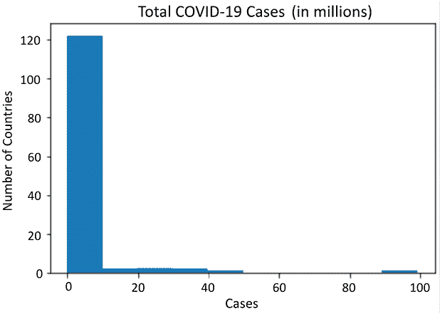
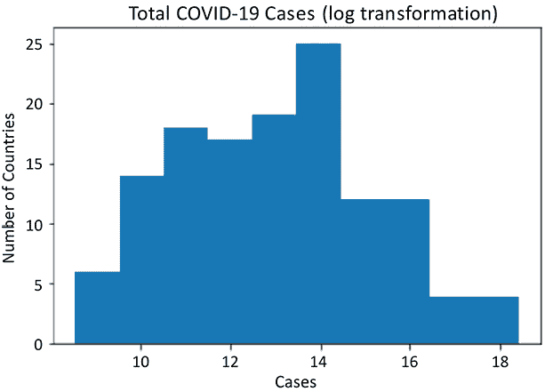
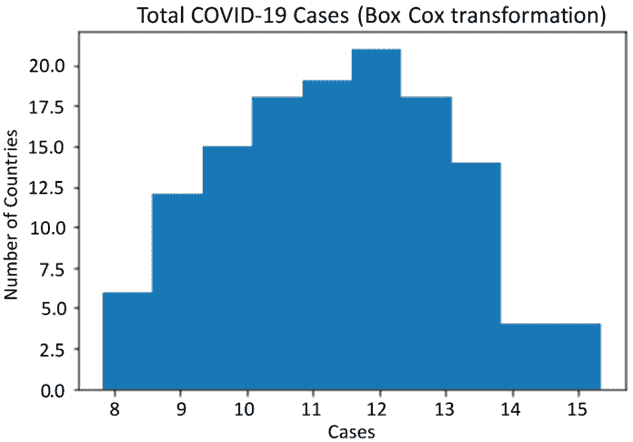
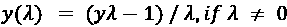
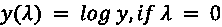
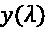
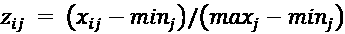
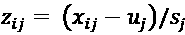
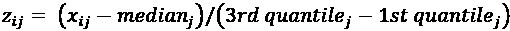
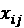

# 第八章：编码、转换和缩放特征

我们的数据清理工作通常是为了准备数据，以便将其用于机器学习算法。机器学习算法通常需要对变量进行某种形式的编码。我们的模型通常也需要进行某种形式的缩放，以防止具有更高变异性的特征压倒优化过程。本章中将展示相关的例子，并说明标准化如何解决这个问题。

机器学习算法通常需要对变量进行某种形式的编码。我们几乎总是需要对特征进行编码，以便算法能够正确理解它们。例如，大多数算法无法理解 *female* 或 *male* 这些值，或者无法意识到不能将邮政编码当作有序数据处理。尽管通常不必要，但当我们的特征范围差异巨大时，缩放通常是一个非常好的选择。当我们使用假设特征服从高斯分布的算法时，可能需要对特征进行某种形式的转换，以使其符合该假设。

本章我们将探讨以下内容：

+   创建训练数据集并避免数据泄漏

+   识别并移除无关或冗余的观测值

+   对类别特征进行编码：独热编码

+   对类别特征进行编码：有序编码

+   对中等或高基数的特征进行编码

+   转换特征

+   分箱特征

+   *k*-均值分箱

+   缩放特征

# 技术要求

完成本章的配方，你需要使用 pandas、NumPy 和 Matplotlib。我使用的是 pandas 2.1.4，但代码也能在 pandas 1.5.3 或更高版本上运行。

本章的代码可以从本书的 GitHub 仓库下载，[`github.com/PacktPublishing/Python-Data-Cleaning-Cookbook-Second-Edition`](https://github.com/PacktPublishing/Python-Data-Cleaning-Cookbook-Second-Edition)。

# 创建训练数据集并避免数据泄漏

对我们模型性能的最大威胁之一就是数据泄漏。**数据泄漏**指的是当我们的模型被告知一些不在训练数据集中的数据时发生的情况。我们有时会无意中用一些训练数据本身无法提供的信息来帮助模型训练，结果导致我们对模型准确性的评估过于乐观。

数据科学家并不希望发生这种情况，因此才有了“泄漏”这一术语。这不是一个“*不要这样做*”的讨论。我们都知道不该这么做。这更像是一个“*我该采取哪些步骤来避免这个问题？*”的讨论。实际上，除非我们制定出防止泄漏的程序，否则很容易发生数据泄漏。

例如，如果我们在某个特征中有缺失值，我们可能会用整个数据集的均值来填充这些缺失值。然而，为了验证我们的模型，我们随后将数据拆分为训练集和测试集。这样，我们可能会不小心将数据泄露引入训练集，因为数据集的完整信息（全局均值）已被使用。

数据泄漏会严重影响我们的模型评估，使得预测结果看起来比实际更可靠。数据科学家为了避免这种情况，采取的一个做法是尽可能在分析开始时就建立独立的训练集和测试集。

**注意**

在本书中，我主要使用 *变量* 这个术语，指的是可以计数或衡量的某些统计属性，比如年龄或时间长度。我使用 *列* 这个术语时，指的是数据集中某一列数据的特定操作或属性。在本章中，我将频繁使用特征一词，指的是用于预测分析的变量。在机器学习中，我们通常称特征（也叫自变量或预测变量）和目标（也叫因变量或响应变量）。

## 准备工作

本章中，我们将广泛使用 scikit-learn 库。你可以通过 `pip` 安装 scikit-learn，命令是 `pip install scikit-learn`。本章的代码使用的是 `sklearn` 版本 0.24.2。

我们可以使用 scikit-learn 来创建 **国家青少年纵向调查**（**NLS**）数据的训练和测试 DataFrame。

**数据说明**

国家青少年纵向调查由美国劳工统计局进行。该调查始于 1997 年，调查对象为 1980 年至 1985 年间出生的一群人，每年进行一次跟踪调查，直到 2023 年。本案例中，我从数百个调查数据项中提取了 104 个与成绩、就业、收入以及对政府态度相关的变量。NLS 数据可以从 `nlsinfo.org` 下载，供公众使用。

## 如何操作...

我们将使用 scikit-learn 来创建训练和测试数据：

1.  首先，我们从 `sklearn` 导入 `train_test_split` 模块并加载 NLS 数据：

    ```py
    import pandas as pd
    from sklearn.model_selection import train_test_split
    nls97 = pd.read_csv("data/nls97g.csv", low_memory=False)
    nls97.set_index("personid", inplace=True) 
    ```

1.  然后，我们可以为特征（`X_train` 和 `X_test`）以及目标（`y_train` 和 `y_test`）创建训练和测试 DataFrame。在这个例子中，`wageincome20` 是目标变量。我们将 `test_size` 参数设置为 0.3，留出 30%的样本用于测试。我们将只使用来自 NLS 的 **学术评估测试**（**SAT**）和 **绩点**（**GPA**）数据。我们需要记住为 `random_state` 设置一个值，以确保如果以后需要重新运行 `train_test_split`，我们可以得到相同的 DataFrame：

    ```py
    feature_cols = ['satverbal','satmath','gpascience',
      'gpaenglish','gpamath','gpaoverall']
    X_train, X_test, y_train, y_test =  \
      train_test_split(nls97[feature_cols],\
      nls97[['wageincome20']], test_size=0.3, random_state=0) 
    ```

1.  让我们看看使用`train_test_split`创建的训练 DataFrame。我们得到了预期的观测值数量 6,288，占 NLS DataFrame 总数 8,984 的 70%：

    ```py
    nls97.shape[0] 
    ```

    ```py
    8984 
    ```

    ```py
    X_train.info() 
    ```

    ```py
    <class 'pandas.core.frame.DataFrame'>
    Index: 6288 entries, 639330 to 166002
    Data columns (total 6 columns):
     #   Column      Non-Null Count  Dtype 
    ---  ------      --------------  ----- 
     0   satverbal   1010 non-null   float64
     1   satmath     1010 non-null   float64
     2   gpascience  4022 non-null   float64
     3   gpaenglish  4086 non-null   float64
     4   gpamath     4076 non-null   float64
     5   gpaoverall  4237 non-null   float64
    dtypes: float64(6)
    memory usage: 343.9 KB 
    ```

    ```py
    y_train.info() 
    ```

    ```py
    <class 'pandas.core.frame.DataFrame'>
    Index: 6288 entries, 639330 to 166002
    Data columns (total 1 columns):
     #   Column        Non-Null Count  Dtype 
    ---  ------        --------------  ----- 
     0   wageincome20  3652 non-null   float64
    dtypes: float64(1)
    memory usage: 98.2 KB 
    ```

1.  我们还来看一下测试 DataFrame。正如我们预期的那样，我们得到了 30% 的观测数据：

    ```py
    X_test.info() 
    ```

    ```py
    <class 'pandas.core.frame.DataFrame'>
    Index: 2696 entries, 624557 to 201518
    Data columns (total 6 columns):
     #   Column      Non-Null Count  Dtype 
    ---  ------      --------------  ----- 
     0   satverbal   396 non-null    float64
     1   satmath     397 non-null    float64
     2   gpascience  1662 non-null   float64
     3   gpaenglish  1712 non-null   float64
     4   gpamath     1690 non-null   float64
     5   gpaoverall  1767 non-null   float64
    dtypes: float64(6)
    memory usage: 147.4 KB 
    ```

    ```py
    y_test.info() 
    ```

    ```py
    <class 'pandas.core.frame.DataFrame'>
    Index: 2696 entries, 624557 to 201518
    Data columns (total 1 columns):
     #   Column        Non-Null Count  Dtype 
    ---  ------        --------------  ----- 
     0   wageincome20  1549 non-null   float64
    dtypes: float64(1)
    memory usage: 42.1 KB 
    ```

这些步骤展示了如何创建训练和测试的 DataFrame。

## 它是如何工作的...

对于使用 Python 的数据科学家，并且经常使用机器学习算法的人员来说，`train_test_split`是一个非常流行的选择，可以在准备数据进行分析时避免数据泄漏。

`train_test_split`将返回四个 DataFrame：一个包含训练数据的 DataFrame，其中包含我们打算在分析中使用的特征或自变量，一个包含这些变量测试数据的 DataFrame，一个包含目标变量（也称为响应或因变量）训练数据的 DataFrame，以及一个包含目标变量的测试 DataFrame。

`test_train_split`的第一个参数可以接受 DataFrame、NumPy 数组或其他二维数组结构。在这里，我们将包含特征的 pandas DataFrame 传递给第一个参数，然后将仅包含目标变量的另一个 pandas DataFrame 传递给第二个参数。我们还指定希望测试数据占数据集行的 30%。

行是由`test_train_split`随机选择的。如果我们想要重现这个拆分结果，我们需要为`random_state`提供一个值。

## 另请参见

当我们的项目涉及预测建模和评估这些模型时，我们的数据准备需要成为机器学习管道的一部分，通常从训练数据和测试数据的划分开始。Scikit-learn 提供了很好的工具来构建从数据准备到模型评估的机器学习管道。一本很好的资源是我的书*《机器学习中的数据清洗与探索》*。

在本章的其余部分，我们将使用`sklearn`的`train_test_split`来创建独立的训练和测试 DataFrame。接下来，我们通过移除显然无用的特征开始特征工程工作，因为这些特征与其他特征的数据相同，或者响应值没有变化。

# 移除冗余或无用的特征

在数据清洗和操作的过程中，我们常常会得到一些不再有意义的数据。也许我们根据单一特征值对数据进行了子集划分，并保留了该特征，尽管现在它对所有观测值都有相同的值。或者，在我们使用的数据子集中，两个特征的值相同。理想情况下，我们会在数据清洗过程中捕捉到这些冗余。然而，如果我们在该过程中没有捕捉到它们，我们可以使用开源的`feature-engine`包来帮助我们解决这个问题。

也可能存在一些特征之间高度相关，以至于我们几乎不可能构建出能够有效使用所有特征的模型。`feature-engine`提供了一个名为`DropCorrelatedFeatures`的方法，可以在特征与另一个特征高度相关时轻松删除该特征。

## 准备工作

在本章中，我们将大量使用`feature-engine`和`category_encoders`包。你可以通过 pip 安装这些包，命令为`pip install feature-engine`和`pip install category_encoders`。本章的代码使用的是`feature-engine`的 1.7.0 版本和`category_encoders`的 2.6.3 版本。注意，`pip install feature-engine`和`pip install feature_engine`都可以正常工作。

在本节中，我们将使用土地温度数据，除了 NLS 数据外，这里我们只加载波兰的温度数据。

**数据说明**

土地温度 DataFrame 包含了 2023 年来自全球超过 12,000 个气象站的平均温度数据（单位为^°C），尽管大部分气象站位于美国。原始数据来自全球历史气候网络（Global Historical Climatology Network）集成数据库。这些数据由美国国家海洋和大气管理局（NOAA）提供，公众可以在[`www.ncei.noaa.gov/products/land-based-station/global-historical-climatology-network-monthly`](https://www.ncei.noaa.gov/products/land-based-station/global-historical-climatology-network-monthly)上访问。

## 如何操作...

1.  让我们从`feature_engine`和`sklearn`中导入所需的模块，然后加载 NLS 数据和波兰的温度数据。波兰的数据来自一个包含全球 12,000 个气象站的更大数据集。我们使用`dropna`方法删除含有任何缺失数据的观测值：

    ```py
    import pandas as pd
    import feature_engine.selection as fesel
    from sklearn.model_selection import train_test_split
    nls97 = pd.read_csv("data/nls97g.csv",low_memory=False)
    nls97.set_index("personid", inplace=True)
    ltpoland = pd.read_csv("data/ltpoland.csv")
    ltpoland.set_index("station", inplace=True)
    ltpoland.dropna(inplace=True) 
    ```

1.  接下来，我们将创建训练和测试的 DataFrame，就像在上一节中所做的那样：

    ```py
    feature_cols = ['satverbal','satmath','gpascience',
      'gpaenglish','gpamath','gpaoverall']
    X_train, X_test, y_train, y_test =  \
      train_test_split(nls97[feature_cols],\
      nls97[['wageincome20']], test_size=0.3, random_state=0) 
    ```

1.  我们可以使用 pandas 的`corr`方法来查看这些特征之间的相关性：

    ```py
    X_train.corr() 
    ```

    ```py
     satverbal  satmath  gpascience  \
    satverbal        1.00     0.74        0.42  
    satmath          0.74     1.00        0.47  
    gpascience       0.42     0.47        1.00  
    gpaenglish       0.44     0.44        0.67  
    gpamath          0.36     0.50        0.62  
    gpaoverall       0.40     0.48        0.79  
                gpaenglish  gpamath  gpaoverall 
    satverbal         0.44     0.36        0.40 
    satmath           0.44     0.50        0.48 
    gpascience        0.67     0.62        0.79 
    gpaenglish        1.00     0.61        0.84 
    gpamath           0.61     1.00        0.76 
    gpaoverall        0.84     0.76        1.00 
    ```

`gpaoverall`与`gpascience`、`gpaenglish`和`gpamath`高度相关。`corr`方法默认返回皮尔逊相关系数。当我们可以假设特征之间存在线性关系时，这种方式是合适的。但当这一假设不成立时，我们应该考虑请求斯皮尔曼相关系数。我们可以通过将`spearman`传递给`corr`方法的参数来实现这一点。

1.  让我们删除与其他特征的相关性超过 0.75 的特征。我们将 0.75 传递给 `DropCorrelatedFeatures` 的 `threshold` 参数，并且通过将变量设置为 `None` 来表示我们希望使用皮尔逊系数并评估所有特征。我们在训练数据上使用 `fit` 方法，然后对训练和测试数据进行转换。`info` 方法显示，结果训练 DataFrame (`X_train_tr`) 中包含所有特征，除了 `gpaoverall`，它与 `gpascience` 和 `gpaenglish` 的相关性分别为 `0.79` 和 `0.84`（`DropCorrelatedFeatures` 会从左到右进行评估，因此如果 `gpamath` 和 `gpaoverall` 高度相关，它会删除 `gpaoverall`）。

如果 `gpaoverall` 在 `gpamath` 的左边，它将删除 `gpamath`：

```py
tr = fesel.DropCorrelatedFeatures(variables=None, method='pearson', threshold=0.75)
tr.fit(X_train)
X_train_tr = tr.transform(X_train)
X_test_tr = tr.transform(X_test)
X_train_tr.info() 
```

```py
<class 'pandas.core.frame.DataFrame'>
Index: 6288 entries, 639330 to 166002
Data columns (total 5 columns):
 #   Column      Non-Null Count  Dtype 
---  ------      --------------  ----- 
 0   satverbal   1010 non-null   float64
 1   satmath     1010 non-null   float64
 2   gpascience  4022 non-null   float64
 3   gpaenglish  4086 non-null   float64
 4   gpamath     4076 non-null   float64
dtypes: float64(5)
memory usage: 294.8 KB 
```

我们通常会在决定删除某个特征之前仔细评估它。然而，有时特征选择是管道的一部分，我们需要自动化这个过程。这可以通过 `DropCorrelatedFeatures` 实现，因为所有 `feature_engine` 方法都可以被带入 scikit-learn 管道。

1.  现在让我们从波兰的土地温度数据中创建训练和测试 DataFrame。`year` 的值对所有观测值都是相同的，`country` 的值也是相同的。每个观测值的 `latabs` 值也与 `latitude` 相同：

    ```py
    feature_cols = ['year','month','latabs','latitude','elevation',
      'longitude','country']
    X_train, X_test, y_train, y_test =  \
      train_test_split(ltpoland[feature_cols],\
      ltpoland[['temperature']], test_size=0.3, random_state=0)
    X_train.sample(5, random_state=99) 
    ```

    ```py
     year  month  latabs  latitude  elevation  longitude   country
    station                                   
    SIEDLCE    2023     11      52        52        152         22   Poland
    OKECIE     2023      6      52        52        110         21   Poland
    BALICE     2023      1      50        50        241         20   Poland
    BALICE     2023      7      50        50        241         20   Poland
    BIALYSTOK  2023     11      53        53        151         23   Poland 
    ```

    ```py
    X_train.year.value_counts() 
    ```

    ```py
    year
    2023    84
    Name: count, dtype: int64 
    ```

    ```py
    X_train.country.value_counts() 
    ```

    ```py
    country
    Poland    84
    Name: count, dtype: int64 
    ```

    ```py
    (X_train.latitude!=X_train.latabs).sum() 
    ```

    ```py
    0 
    ```

1.  让我们删除在训练数据集中值相同的特征。注意，`year` 和 `country` 在转换后被删除：

    ```py
    tr = fesel.DropConstantFeatures()
    tr.fit(X_train)
    X_train_tr = tr.transform(X_train)
    X_test_tr = tr.transform(X_test)
    X_train_tr.head() 
    ```

    ```py
     month  latabs  latitude  elevation  longitude
    station                                                
    OKECIE         1      52        52        110         21
    LAWICA         8      52        52         94         17
    LEBA          11      55        55          2         18
    SIEDLCE       10      52        52        152         22
    BIALYSTOK     11      53        53        151         23 
    ```

1.  让我们删除那些与其他特征值相同的特征。在这种情况下，转换会删除 `latitude`，因为它与 `latabs` 的值相同：

    ```py
    tr = fesel.DropDuplicateFeatures()
    tr.fit(X_train_tr)
    X_train_tr = tr.transform(X_train_tr)
    X_train_tr.head() 
    ```

    ```py
     month  latabs  elevation  longitude
    station                                      
    OKECIE         1      52        110         21
    LAWICA         8      52         94         17
    LEBA          11      55          2         18
    SIEDLCE       10      52        152         22
    BIALYSTOK     11      53        151         23 
    ```

## 它是如何工作的……

这解决了我们在 NLS 数据和波兰温度数据中的一些显而易见的问题。我们从包含其他 GPA 特征的 DataFrame 中删除了 `gpaoverall`，因为它与其他特征高度相关。我们还移除了冗余数据，删除了整个 DataFrame 中值相同的特征和重复其他特征值的特征。

在 *步骤 6* 中，我们使用了 *feature engine* 中 `selection` 对象的 `fit` 方法。这收集了进行后续转换所需的信息。在这种情况下，转换是删除具有常量值的特征。我们通常只在训练数据上执行拟合。我们可以通过使用 `fit_transform` 将拟合和转换结合在一起，这将在本章的大部分内容中使用。

本章的其余部分探讨了一些较为复杂的特征工程挑战：编码、转换、分箱和缩放。

# 编码类别特征：独热编码

在大多数机器学习算法中，我们可能需要对特征进行编码，原因有几个。首先，这些算法通常要求数据为数值型。其次，当一个类别特征用数字表示时，例如，女性为 1，男性为 2，我们需要对这些值进行编码，使其被识别为类别数据。第三，该特征可能实际上是顺序的，具有离散的值，这些值表示某种有意义的排序。我们的模型需要捕捉到这种排序。最后，一个类别特征可能具有大量取值（称为高基数），我们可能希望通过编码来合并某些类别。

我们可以使用独热编码来处理具有有限取值的特征，假设取值为 15 或更少。我们将在本节中介绍独热编码，接下来讨论顺序编码。随后，我们将讨论如何处理高基数类别特征的策略。

独热编码对每个特征的取值创建一个二进制向量。所以，如果一个特征，称为 *letter*，有三个唯一的值，*A*、*B* 和 *C*，独热编码会创建三个二进制向量来表示这些值。第一个二进制向量，称为 *letter_A*，当 *letter* 的值为 *A* 时为 1，当它是 *B* 或 *C* 时为 0。*letter_B* 和 *letter_C* 也会按类似的方式编码。经过转换的特征 *letter_A*、*letter_B* 和 *letter_C*，通常被称为 **虚拟变量**。*图 8.1* 展示了独热编码的示意图。

| **letter** | **letter_A** | **letter_B** | **letter_C** |
| --- | --- | --- | --- |
| A | 1 | 0 | 0 |
| B | 0 | 1 | 0 |
| C | 0 | 0 | 1 |

图 8.1：类别特征的独热编码

## 准备工作

我们将在接下来的两个食谱中使用 `feature_engine` 和 `scikit_learn` 中的 `OneHotEncoder` 和 `OrdinalEncoder` 模块。我们将继续使用 NLS 数据。

## 如何做到这一点...

来自 NLS 数据的若干特征适合进行独热编码。我们在以下代码块中编码其中的一些特征：

1.  让我们从导入 `feature_engine` 中的 `OneHotEncoder` 模块和加载数据开始。我们还导入了 `scikit-learn` 中的 `OrdinalEncoder` 模块，因为我们稍后将使用它。

    ```py
    import pandas as pd
    from feature_engine.encoding import OneHotEncoder
    from sklearn.preprocessing import OrdinalEncoder
    from sklearn.model_selection import train_test_split
    nls97 = pd.read_csv("data/nls97g.csv", low_memory=False)
    nls97.set_index("personid", inplace=True) 
    ```

1.  接下来，我们为 NLS 数据创建训练和测试 DataFrame。

在本节中，我们为了简化处理，会丢弃缺失数据的行：

```py
feature_cols = ['gender','maritalstatus','colenroct99']
nls97demo = nls97[['wageincome20'] + feature_cols].dropna()
X_demo_train, X_demo_test, y_demo_train, y_demo_test =  \
  train_test_split(nls97demo[feature_cols],\
  nls97demo[['wageincome20']], test_size=0.3, random_state=0) 
```

1.  我们可以选择的编码方式之一是 pandas 的 `get_dummies` 方法。我们可以使用它来指示我们希望转换 `gender` 和 `maritalstatus` 特征。`get_dummies` 为 `gender` 和 `maritalstatus` 的每个取值创建一个虚拟变量。例如，`gender` 有 Female 和 Male 两个取值。`get_dummies` 创建一个特征 `gender_Female`，当 `gender` 为 Female 时其值为 1，当 `gender` 为 Male 时其值为 0。当 `gender` 为 Male 时，`gender_Male` 为 1，`gender_Female` 为 0。这是一种经过验证的方法，统计学家多年来一直使用它进行编码：

    ```py
    pd.get_dummies(X_demo_train,
      columns=['gender','maritalstatus'], dtype=float).\
      head(2).T 
    ```

    ```py
     606986             764231
    colenroct99      3\. 4-year college    1\. Not enrolled
    gender_Female                    1                  0
    gender_Male                      0                  1
    maritalstatus_Divorced           0                  0
    maritalstatus_Married            0                  1
    maritalstatus_Never-married      1                  0
    maritalstatus_Separated          0                  0
    maritalstatus_Widowed            0                  0 
    ```

我们没有使用`get_dummies`创建一个新的 DataFrame，因为我们将在这个食谱的后续步骤中使用另一种技术来进行编码。

我们通常为特征的*k*个唯一值创建*k*-1 个虚拟变量。因此，如果`gender`在我们的数据中有两个值，我们只需要创建一个虚拟变量。如果我们知道`gender_Female`的值，也就知道`gender_Male`的值，因此后者是多余的。类似地，如果我们知道其他`maritalstatus`虚拟变量的值，我们就能知道`maritalstatus_Divorced`的值。以这种方式创建冗余被不优雅地称为**虚拟变量陷阱**。为了避免这个问题，我们从每个组中删除一个虚拟变量。

**注意**

对于某些机器学习算法，比如线性回归，删除一个虚拟变量实际上是必需的。在估计线性模型的参数时，矩阵需要进行求逆。如果我们的模型有截距，并且包括所有虚拟变量，那么矩阵就无法求逆。

1.  我们可以将`get_dummies`的`drop_first`参数设置为`True`，以从每个组中删除第一个虚拟变量：

    ```py
    pd.get_dummies(X_demo_train,
      columns=['gender','maritalstatus'], dtype=float,
      drop_first=True).head(2).T 
    ```

    ```py
     606986           764231
    colenroct99           3\. 4-year college  1\. Not enrolled
    gender_Male                           0                1
    maritalstatus_Married                 0                1
    maritalstatus_Never-married           1                0
    maritalstatus_Separated               0                0
    maritalstatus_Widowed                 0                0 
    ```

`get_dummies`的替代方法是`sklearn`或`feature_engine`中的独热编码器。这些独热编码器的优势在于它们可以轻松集成到机器学习管道中，并且能够将从训练数据集中获取的信息传递到测试数据集中。

1.  让我们使用`feature_engine`中的`OneHotEncoder`进行编码。我们将`drop_last`设置为`True`，以从每个组中删除一个虚拟变量。然后我们将编码拟合到训练数据上，并对训练数据和测试数据进行转换。

    ```py
    ohe = OneHotEncoder(drop_last=True,
      variables=['gender','maritalstatus'])
    ohe.fit(X_demo_train)
    X_demo_train_ohe = ohe.transform(X_demo_train)
    X_demo_test_ohe = ohe.transform(X_demo_test)
    X_demo_train_ohe.filter(regex='gen|mar', axis="columns").head(2).T 
    ```

    ```py
     606986   764231
    gender_Female                   1        0
    maritalstatus_Never-married     1        0
    maritalstatus_Married           0        1
    maritalstatus_Divorced          0        0
    maritalstatus_Separated         0        0 
    ```

这证明了独热编码是一种相当简单的方法，用于为机器学习算法准备名义数据。

## 它是如何工作的…

pandas 的`get_dummies`方法是创建虚拟变量或独热编码的便捷方式。我们在*步骤 3*中看到了这一点，当时我们只需将训练 DataFrame 和需要虚拟变量的列传递给`get_dummies`。请注意，我们为`dtype`使用了`float`。根据你的 pandas 版本，可能需要这样做，以返回 0 和 1 的值，而不是 true 和 false 的值。

我们通常需要从虚拟变量组中删除一个值，以避免*虚拟变量陷阱*。我们可以将`drop_first`设置为`True`，以从每个虚拟变量组中删除第一个虚拟变量。这就是我们在*步骤 4*中所做的。

我们在*步骤 5*中查看了另一个独热编码工具`feature_engine`。我们能够使用*feature_engine*的`OneHotEncoder`完成与`get_dummies`相同的任务。使用`feature_engine`的优势是它提供了多种工具，可在 scikit-learn 数据管道中使用，包括能够处理训练集或测试集中的类别，但不能同时处理两者。

## 还有更多

我没有在本教程中讨论 scikit-learn 自带的 one-hot 编码器。它的工作原理与 `feature_engine` 的 one-hot 编码器非常相似。虽然使用其中一个没有比使用另一个有太多优势，但我发现 `feature_engine` 的 `transform` 和 `fit_transform` 方法返回的是 DataFrame，而 scikit-learn 的这些方法返回的是 NumPy 数组，这一点挺方便的。

# 编码类别特征：顺序编码

类别特征可以是名义性的或顺序性的。性别和婚姻状况是名义性的，它们的值没有顺序。例如，未婚并不比离婚的值更高。

然而，当类别特征是顺序时，我们希望编码能捕捉到值的排序。例如，如果我们有一个特征，值为低、中和高，那么 one-hot 编码会丢失这个排序。相反，如果我们将低、中、高分别转化为 1、2、3 的值，这样会更好。我们可以通过顺序编码来实现这一点。

NLS 数据集中的大学入学特征可以视为顺序特征。其值从 *1. 未入学* 到 *3. 4 年制大学*。我们应该使用顺序编码将其准备好用于建模。接下来，我们就这么做。

## 准备工作

我们将在本教程中使用来自 `scikit-learn` 的 `OrdinalEncoder` 模块。

## 如何操作...

1.  1999 年的大学入学情况可能是顺序编码的一个很好的候选。让我们先查看 `colenroct99` 编码前的值。虽然这些值是字符串类型的，但它们有一个隐含的顺序：

    ```py
    X_demo_train.colenroct99.\
      sort_values().unique() 
    ```

    ```py
    array(['1\. Not enrolled', '2\. 2-year college ', '3\. 4-year college'],
          dtype=object) 
    ```

    ```py
    X_demo_train.head() 
    ```

    ```py
     gender  maritalstatus        colenroct99
    606986  Female  Never-married  3\. 4-year college
    764231    Male        Married    1\. Not enrolled
    673419    Male  Never-married  3\. 4-year college
    185535    Male        Married    1\. Not enrolled
    903011    Male  Never-married    1\. Not enrolled 
    ```

我们需要小心线性假设。例如，如果我们尝试建模大学入学特征对某个目标变量的影响，我们不能假设从 1 到 2 的变化（从未入学到入学 2 年）与从 2 到 3 的变化（从 2 年制大学到 4 年制大学入学）具有相同的影响。

1.  我们可以通过将上述数组传递给 `categories` 参数，告诉 `OrdinalEncoder` 按照隐含的顺序对值进行排序。然后，我们可以使用 `fit_transform` 方法来转换大学入学字段 `colenroct99`。（sklearn 的 `OrdinalEncoder` 的 `fit_transform` 方法返回一个 NumPy 数组，因此我们需要使用 pandas DataFrame 方法来创建 DataFrame。）最后，我们将编码后的特征与训练数据中的其他特征连接起来：

    ```py
    oe = OrdinalEncoder(categories=\
      [X_demo_train.colenroct99.sort_values().\
       unique()])
    colenr_enc = \
      pd.DataFrame(oe.fit_transform(X_demo_train[['colenroct99']]),
        columns=['colenroct99'], index=X_demo_train.index)
    X_demo_train_enc = \
      X_demo_train[['gender','maritalstatus']].\
      join(colenr_enc) 
    ```

1.  让我们查看从结果 DataFrame 中获得的一些观测值。我们还应将原始大学入学特征与转换后的特征进行比较：

    ```py
    X_demo_train_enc.head() 
    ```

    ```py
     gender  maritalstatus  colenroct99
    606986  Female  Never-married            2
    764231    Male        Married            0
    673419    Male  Never-married            2
    185535    Male        Married            0
    903011    Male  Never-married            0 
    ```

    ```py
    X_demo_train.colenroct99.value_counts().\
      sort_index() 
    ```

    ```py
     colenroct99
    1\. Not enrolled       2843
    2\. 2-year college      137
    3\. 4-year college      324
    Name: count, dtype: int64 
    ```

    ```py
    X_demo_train_enc.colenroct99.value_counts().\
      sort_index() 
    ```

    ```py
     colenroct99
    0              2843
    1               137
    2               324
    Name: count, dtype: int64 
    ```

顺序编码将 `colenroct99` 的初始值替换为从 0 到 2 的数字。它现在的形式可以被许多机器学习模型使用，并且我们保留了有意义的排序信息。

## 它是如何工作的...

*Scitkit-learn* 的 `OrdinalEncoder` 使用起来非常简单。我们在 *步骤 2* 开始时实例化了一个 `OrdinalEncoder` 对象，并传递了一个按意义排序的值数组作为类别。然后，我们将仅包含 `colenroct99` 列的训练数据传递给 `OrdinalEncoder` 的 `fit_transform` 方法。最后，我们将 `fit_transform` 返回的 NumPy 数组转换为 DataFrame，并使用训练数据的索引，使用 `join` 方法将其余的训练数据附加到其中。

## 更多内容

序数编码适用于非线性模型，如决策树。在线性回归模型中可能没有意义，因为这会假定值之间的距离在整个分布中是均等有意义的。在本例中，这将假定从 0 到 1 的增加（从未注册到两年注册）与从 1 到 2 的增加（从两年注册到四年注册）是相同的。

One-hot 和序数编码是工程化分类特征的相对直接的方法。当有更多唯一值时，处理分类特征可能会更加复杂。我们将在下一节介绍处理这些特征的几种技术。

# 对具有中等或高基数的分类特征进行编码

当我们处理具有许多唯一值的分类特征时，比如 15 个或更多时，为每个值创建虚拟变量可能不切实际。当基数很高时，即唯一值的数量非常大时，某些值的观察次数可能太少，以至于无法为我们的模型提供足够的信息。极端情况下，对于 ID 变量，每个值只有一个观察结果。

处理中等或高基数的分类特征有几种方法。一种方法是为前 k 个类别创建虚拟变量，并将其余的值分组到 *其他* 类别中。另一种方法是使用特征哈希，也称为哈希技巧。我们将在本示例中探讨这两种策略。

## 准备工作

在本例中，我们将继续使用 `feature_engine` 中的 `OneHotEncoder`。我们还将使用 `category_encoders` 中的 `HashingEncoder`。在这个例子中，我们将使用 COVID-19 数据，该数据包括各国的总病例和死亡情况，以及人口统计数据。

**数据注意**

Our World in Data 在 [`ourworldindata.org/covid-cases`](https://ourworldindata.org/covid-cases) 提供 COVID-19 的公共数据。本示例中使用的数据是在 2024 年 3 月 3 日下载的。

## 如何做...

1.  让我们从 COVID-19 数据中创建训练和测试 DataFrame，然后导入 `feature_engine` 和 `category_encoders` 库：

    ```py
    import pandas as pd
    from feature_engine.encoding import OneHotEncoder
    from category_encoders.hashing import HashingEncoder
    from sklearn.model_selection import train_test_split
    covidtotals = pd.read_csv("data/covidtotals.csv")
    feature_cols = ['location','population',
        'aged_65_older','life_expectancy','region']
    covidtotals = covidtotals[['total_cases'] + feature_cols].dropna()
    X_train, X_test, y_train, y_test =  \
      train_test_split(covidtotals[feature_cols],\
      covidtotals[['total_cases']], test_size=0.3, random_state=0) 
    ```

区域特征有 16 个唯一值，其中前 5 个值的计数为 10 或更多：

```py
X_train.region.value_counts() 
```

```py
region
Eastern Europe     15
Western Europe     15
West Asia          12
South America      11
Central Africa     10
East Asia           9
Caribbean           9
Oceania / Aus       9
West Africa         7
Southern Africa     7
Central Asia        6
South Asia          6
East Africa         5
Central America     5
North Africa        4
North America       1
Name: count, dtype: int64 
```

1.  我们可以再次使用`feature_engine`中的`OneHotEncoder`来编码`region`特征。这一次，我们使用`top_categories`参数来指示我们只想为前六个类别值创建虚拟变量。所有不属于前六名的`region`值将为所有虚拟变量赋值为 0：

    ```py
    ohe = OneHotEncoder(top_categories=6, variables=['region'])
    covidtotals_ohe = ohe.fit_transform(covidtotals)
    covidtotals_ohe.filter(regex='location|region',
      axis="columns").sample(5, random_state=2).T 
    ```

    ```py
     31        157        2     170     78
    location                Bulgaria  Palestine  Algeria  Russia  Ghana
    region_Eastern Europe          1          0        0       1      0
    region_Western Europe          0          0        0       0      0
    region_West Africa             0          0        0       0      1
    region_West Asia               0          1        0       0      0
    region_East Asia               0          0        0       0      0
    region_Caribbean               0          0        0       0      0 
    ```

当分类特征具有许多唯一值时，**特征哈希**是一种替代的独热编码方法。

特征哈希将大量唯一的特征值映射到较少的虚拟变量上。我们可以指定要创建的虚拟变量数量。每个特征值仅映射到一个虚拟变量组合。然而，冲突是可能的——也就是说，一些特征值可能映射到相同的虚拟变量组合。随着我们减少请求的虚拟变量数量，冲突的数量会增加。

1.  我们可以使用`category_encoders`中的`HashingEncoder`来进行特征哈希。我们使用`n_components`来指定我们想要 6 个虚拟变量（在转换之前，我们复制了`region`特征，以便可以将原始值与新的虚拟变量进行比较）：

    ```py
    X_train['region2'] = X_train.region
    he = HashingEncoder(cols=['region'], n_components=6)
    X_train_enc = he.fit_transform(X_train)
    X_train_enc.\
     groupby(['col_0','col_1','col_2','col_3','col_4',
       'col_5','region2']).\
     size().reset_index(name="count") 
    ```

    ```py
     col_0  col_1  col_2  col_3  col_4  col_5          region2  count
    0      0      0      0      0      0      1        Caribbean      9
    1      0      0      0      0      0      1   Central Africa     10
    2      0      0      0      0      0      1      East Africa      5
    3      0      0      0      0      0      1     North Africa      4
    4      0      0      0      0      1      0  Central America      5
    5      0      0      0      0      1      0   Eastern Europe     15
    6      0      0      0      0      1      0    North America      1
    7      0      0      0      0      1      0    Oceania / Aus      9
    8      0      0      0      0      1      0  Southern Africa      7
    9      0      0      0      0      1      0        West Asia     12
    10     0      0      0      0      1      0   Western Europe     15
    11     0      0      0      1      0      0     Central Asia      6
    12     0      0      0      1      0      0        East Asia      9
    13     0      0      0      1      0      0       South Asia      6
    14     0      0      1      0      0      0      West Africa      7
    15     1      0      0      0      0      0    South America     11 
    ```

不幸的是，这会导致大量的冲突。例如，加勒比地区、中非、东非和北非都获得相同的虚拟变量值。至少在这种情况下，使用独热编码并指定类别数量，或增加哈希编码器的组件数量，能为我们提供更好的结果。

## 它是如何工作的...

我们以与*编码分类特征：独热编码*配方相同的方式使用了`feature_engine`中的`OneHotEncoder`。这里的区别是，我们将虚拟变量限制为具有最多行数的六个区域（在这种情况下是国家）。所有不属于前六个区域的国家都会为所有虚拟变量赋值为零，例如*步骤 2*中的阿尔及利亚。

在*步骤 3*中，我们使用了`category_encoders`中的`HashingEncoder`。我们指定了要使用的列`region`，并且我们想要六个虚拟变量。我们使用了`HashingEncoder`的`fit_transform`方法来拟合和转换我们的数据，正如我们在`feature_engine`的`OneHotEncoder`和 scikit-learn 的`OrdinalEncoder`中所做的那样。

我们在最后三个配方中已经涵盖了常见的编码策略：独热编码、序数编码和特征哈希。在我们可以将几乎所有的分类特征应用到模型之前，几乎都会需要某种编码。但有时我们还需要以其他方式修改我们的特征，包括变换、分箱和缩放。我们将在接下来的三个配方中探讨修改特征的原因，并探索用于实现这些操作的工具。

# 使用数学变换

有时候，我们希望使用的特征不具备高斯分布，而机器学习算法假设我们的特征是以这种方式分布的。当出现这种情况时，我们要么需要改变使用的算法（例如选择 KNN 或随机森林而不是线性回归），要么转换我们的特征，使其近似于高斯分布。在本示例中，我们讨论了几种实现后者的策略。

## 准备工作

在本示例中，我们将使用来自 feature engine 的 transformation 模块。我们继续使用 COVID-19 数据，其中每个国家都有总病例和死亡数以及一些人口统计数据。

## 如何实现...

1.  我们首先从 feature_engine 导入 transformation 模块，从 sklearn 导入 train_test_split，从 scipy 导入 stats。我们还使用 COVID-19 数据创建了训练和测试 DataFrame：

    ```py
    import pandas as pd
    from feature_engine import transformation as vt
    from sklearn.model_selection import train_test_split
    import matplotlib.pyplot as plt
    from scipy import stats
    covidtotals = pd.read_csv("data/covidtotals.csv")
    feature_cols = ['location','population',
        'aged_65_older','life_expectancy','region']
    covidtotals = covidtotals[['total_cases'] + feature_cols].dropna()
    X_train, X_test, y_train, y_test =  \
      train_test_split(covidtotals[feature_cols],\
      covidtotals[['total_cases']], test_size=0.3, random_state=0) 
    ```

1.  让我们看看各国总病例分布如何。我们还应计算偏度：

    ```py
    y_train.total_cases.skew() 
    ```

    ```py
    6.092053479609332 
    ```

    ```py
    plt.hist(y_train.total_cases)
    plt.title("Total COVID-19 Cases (in millions)")
    plt.xlabel('Cases')
    plt.ylabel("Number of Countries")
    plt.show() 
    ```

这产生了以下直方图：



图 8.1：总 COVID-19 病例的直方图

这说明了总病例的非常高的偏度。实际上，它看起来是对数正态分布，这并不奇怪，考虑到非常低的值和几个非常高的值的大量存在。

1.  让我们尝试一个对数变换。要使 feature_engine 执行变换，我们只需调用 `LogTransformer` 并传递要转换的特征：

    ```py
    tf = vt.LogTransformer(variables = ['total_cases'])
    y_train_tf = tf.fit_transform(y_train)
    y_train_tf.total_cases.skew() 
    ```

    ```py
    0.09944093918837159 
    ```

    ```py
    plt.hist(y_train_tf.total_cases)
    plt.title("Total COVID-19 Cases (log transformation)")
    plt.xlabel('Cases')
    plt.ylabel("Number of Countries")
    plt.show() 
    ```

这产生了以下直方图：



图 8.2：经对数变换后的总 COVID-19 病例的直方图

实际上，对数变换增加了分布低端的变异性，并减少了高端的变异性。这产生了一个更对称的分布。这是因为对数函数的斜率对较小值比对较大值更陡。

1.  这确实是一个很大的改进，但我们还是尝试一个 Box-Cox 变换，看看得到的结果：

    ```py
    tf = vt.BoxCoxTransformer(variables = ['total_cases'])
    y_train_tf = tf.fit_transform(y_train)
    y_train_tf.total_cases.skew() 
    ```

    ```py
    0.010531307863482307 
    ```

    ```py
    plt.hist(y_train_tf.total_cases)
    plt.title("Total COVID-19 Cases (Box Cox transformation)")
    plt.xlabel('Cases')
    plt.ylabel("Number of Countries")
    plt.show() 
    ```

这产生了以下直方图：



图 8.3：经 Box-Cox 变换后的总 COVID-19 病例的直方图

Box-Cox 变换可识别一个在 -5 到 5 之间的 lambda 值，生成最接近正态分布的分布。它使用以下方程进行变换：



或



其中  是我们的转换后特征。仅仅出于好奇，让我们看看用于转换 `total_cases` 的 lambda 值：

```py
stats.boxcox(y_train.total_cases)[1] 
```

```py
-0.020442184436288167 
```

Box-Cox 变换的 lambda 是 -0.02。作为比较，具有高斯分布特征的 lambda 值为 1.000，意味着不需要进行任何变换。

## 工作原理...

我们的许多研究或建模项目需要对特征或目标变量进行某些转换，以便获得良好的结果。像*feature engine*这样的工具使我们能够轻松地在数据准备过程中结合这些转换。我们在*步骤 1*中导入了`transformation`模块，然后在*步骤 3*中使用它进行了对数转换，在*步骤 4*中进行了 Box-Cox 转换。

经过对数和 Box-Cox 转换后，转换后的总病例特征看起来不错。这可能是一个更容易建模的目标。将此转换与其他预处理步骤集成到管道中也非常简单。`Feature_engine`还有许多其他转换，类似于对数和 Box-Cox 转换。

## 参见

你可能会想，我们是如何使用转换后的目标进行预测或评估模型的。实际上，设置我们的管道以在进行预测时恢复值为原始值是相当简单的。我在我的书《数据清理与机器学习探索》中详细介绍了这一点。

# 特征分箱：等宽和等频

我们有时需要将一个特征从连续型转换为类别型。创建* k *个等间距区间，覆盖从最小值到最大值的分布过程称为**分箱**，或者更不友好的说法是**离散化**。分箱可以解决特征的几个重要问题：偏斜、过度峰度以及异常值的存在。

## 准备工作

对于 COVID-19 总病例数据，分箱可能是一个不错的选择。它也可能对数据集中的其他变量有用，包括总死亡人数和人口，但我们目前只处理总病例数据。`total_cases`是以下代码中的目标变量，因此它是`y_train`数据框中的一列——唯一的一列。

让我们尝试使用 COVID-19 数据进行等宽和等频分箱。

## 如何操作...

1.  我们首先需要从`feature_engine`导入`EqualFrequencyDiscretiser`和`EqualWidthDiscretiser`。我们还需要从 COVID-19 数据中创建训练和测试数据框：

    ```py
    import pandas as pd
    from feature_engine.discretisation import EqualFrequencyDiscretiser as efd
    from feature_engine.discretisation import EqualWidthDiscretiser as ewd
    from sklearn.preprocessing import KBinsDiscretizer
    from sklearn.model_selection import train_test_split
    covidtotals = pd.read_csv("data/covidtotals.csv")
    feature_cols = ['location','population',
        'aged_65_older','life_expectancy','region']
    covidtotals = covidtotals[['total_cases'] + feature_cols].dropna()
    X_train, X_test, y_train, y_test =  \
      train_test_split(covidtotals[feature_cols],\
      covidtotals[['total_cases']], test_size=0.3, random_state=0) 
    ```

1.  我们可以使用 pandas 的`qcut`方法及其`q`参数来创建 10 个相对等频的分箱：

    ```py
    y_train['total_cases_group'] = \
      pd.qcut(y_train.total_cases, q=10,
      labels=[0,1,2,3,4,5,6,7,8,9])
    y_train.total_cases_group.value_counts().\
      sort_index() 
    ```

    ```py
     total_cases_group
    0    14
    1    13
    2    13
    3    13
    4    13
    5    13
    6    13
    7    13
    8    13
    9    13
    Name: count, dtype: int64 
    ```

1.  我们可以通过`EqualFrequencyDiscretiser`实现相同的效果。首先，我们定义一个函数来运行转换。该函数接受一个`feature_engine`转换器以及训练和测试数据框。它返回转换后的数据框（虽然定义函数不是必要的，但在这里定义有意义，因为我们稍后会在本食谱中重复这些步骤）：

    ```py
    def runtransform(bt, dftrain, dftest):
      bt.fit(dftrain)
      train_bins = bt.transform(dftrain)
      test_bins = bt.transform(dftest)
      return train_bins, test_bins 
    ```

1.  接下来，我们创建一个`EqualFrequencyDiscretiser`转换器，并调用我们刚刚创建的`runtransform`函数：

    ```py
    y_train.drop(['total_cases_group'], axis=1, inplace=True)
    bintransformer = efd(q=10, variables=['total_cases'])
    y_train_bins, y_test_bins = runtransform(bintransformer, y_train, y_test)
    y_train_bins.total_cases.value_counts().sort_index() 
    ```

    ```py
     total_cases
    0    14
    1    13
    2    13
    3    13
    4    13
    5    13
    6    13
    7    13
    8    13
    9    13
    Name: count, dtype: int64 
    ```

这为我们提供了与`qcut`相同的结果，但它的优势在于，它更容易集成到机器学习管道中，因为我们使用`feature_engine`来生成它。等频分箱解决了偏斜和异常值问题。

1.  `EqualWidthDiscretiser`的工作方式类似：

    ```py
    bintransformer = ewd(bins=10, variables=['total_cases'])
    y_train_bins, y_test_bins = runtransform(bintransformer, y_train, y_test)
    y_train_bins.total_cases.value_counts().sort_index() 
    ```

    ```py
     total_cases
    0    122
    1      2
    2      3
    3      2
    4      1
    9      1
    Name: count, dtype: int64 
    ```

这是一个远未成功的转换。几乎所有的值都处于分布底部，所以平均宽度分箱会出现相同的问题是不奇怪的。尽管我们请求了 10 个箱，但结果只有 6 个。

1.  让我们来看看每个箱的范围。我们可以看到，由于分布顶部观察值数量较少，等宽分箱器甚至不能构建等宽箱：

    ```py
    y_train_bins = y_train_bins.\
      rename(columns={'total_cases':'total_cases_group'}).\
      join(y_train)
    y_train_bins.groupby("total_cases_group")["total_cases"].\
      agg(['min','max']) 
    ```

    ```py
     min           max
    total_cases_group                     
    0                      5,085     8,633,769
    1                 11,624,000    13,980,340
    2                 23,774,451    26,699,442
    3                 37,519,960    38,437,756
    4                 45,026,139    45,026,139
    9                 99,329,249    99,329,249 
    ```

虽然在这种情况下等宽分箱是一个糟糕的选择，但有时它是有意义的。当数据更均匀分布或等宽的时候，它可以很有用。

# k-means 分箱

另一个选项是使用*k*-means 聚类来确定箱的位置。*k*-means 算法随机选择*k*个数据点作为聚类的中心，然后将其他数据点分配到最近的聚类中。计算每个聚类的均值，然后将数据点重新分配到最近的新聚类中。这个过程重复进行，直到找到最佳的中心。

当使用*k*-means 进行分箱时，同一聚类中的所有数据点将具有相同的序数值。

## 准备工作

这次我们将使用 scikit-learn 进行分箱。*Scitkit-learn*有一个很好的工具，可以基于*k*-means 创建箱，即`KBinsDiscretizer`。

## 如何做...

1.  我们首先实例化一个`KBinsDiscretizer`对象。我们将用它来创建 COVID-19 案例数据的箱：

    ```py
    kbins = KBinsDiscretizer(n_bins=10, encode='ordinal',
      strategy='kmeans', subsample=None)
    y_train_bins = \
      pd.DataFrame(kbins.fit_transform(y_train),
      columns=['total_cases'], index=y_train.index)
    y_train_bins.total_cases.value_counts().sort_index() 
    ```

    ```py
     total_cases
    0    57
    1    19
    2    25
    3    10
    4    11
    5     2
    6     3
    7     2
    8     1
    9     1
    Name: count, dtype: int64 
    ```

1.  让我们比较原始总案例变量的偏斜和峰度与分箱变量的偏斜和峰度。回想一下，我们期望具有高斯分布的变量的偏斜为 0，峰度接近 3。分箱变量的分布更接近高斯分布：

    ```py
    y_train.total_cases.agg(['skew','kurtosis']) 
    ```

    ```py
    skew        6.092
    kurtosis   45.407
    Name: total_cases, dtype: float64 
    ```

    ```py
    y_train_bins.total_cases.agg(['skew','kurtosis']) 
    ```

    ```py
    skew       1.504
    kurtosis   2.281
    Name: total_cases, dtype: float64 
    ```

1.  让我们更仔细地查看每个箱中总案例值的范围。第一个箱的范围达到 272,010 个总案例，下一个箱的范围达到 834,470 个。大约在 860 万个总案例后，国家数量有相当大的减少。我们可以考虑将箱的数量减少到 5 或 6 个：

    ```py
    y_train_bins.rename(columns={'total_cases':'total_cases_bin'}, inplace=True)
    y_train.join(y_train_bins).\
      groupby(['total_cases_bin'])['total_cases'].\
      agg(['min','max','size']) 
    ```

    ```py
     min        max  size
    total_cases_bin                           
    0                    5,085    272,010    57
    1                  330,417    834,470    19
    2                  994,037  2,229,538    25
    3                2,465,545  4,536,733    10
    4                5,269,967  8,633,769    11
    5               11,624,000 13,980,340     2
    6               23,774,451 26,699,442     3
    7               37,519,960 38,437,756     2
    8               45,026,139 45,026,139     1
    9               99,329,249 99,329,249     1 
    ```

这些步骤展示了如何使用*k*-means 进行分箱。

## 工作原理...

运行*k*-means 分箱所需的全部是实例化一个`KBinsDiscretizer`对象。我们指定了我们想要的箱数`10`，并且我们希望箱是`ordinal`的。我们指定`ordinal`是因为我们希望较高的箱值反映出较高的总案例值。我们将从 scikit-learn 的`fit_transform`返回的 NumPy 数组转换为 DataFrame。在数据流水线中，这通常是不必要的，但我们在这里这样做是因为我们将在后续步骤中使用 DataFrame。

分箱可以帮助我们处理数据中的偏斜、峰度和异常值。然而，它确实掩盖了特征变化的大部分，并降低了其解释能力。通常情况下，一些形式的缩放，如最小-最大或 z 分数，是更好的选择。让我们在下一个示例中来看一下特征缩放。

# 特征缩放

通常，想要在模型中使用的特征处于不同的尺度上。换句话说，最小值和最大值之间的距离，或范围，在不同的特征中有很大差异。例如，在 COVID-19 数据中，`total cases` 特征的值从 5000 到近 1 亿，而 `aged 65 or older` 特征的值从 9 到 27（表示人口的百分比）。

特征的尺度差异会影响许多机器学习算法。例如，KNN 模型通常使用欧几里得距离，尺度更大的特征将对模型产生更大的影响。缩放可以解决这个问题。

本节将介绍两种常见的缩放方法：**最小-最大缩放**和**标准**（或**z-score**）缩放。最小-最大缩放将每个值替换为其在范围中的位置。更具体地说：



在这里，*z*[ij] 是最小-最大得分，*x*[ij] 是 *i*^(th) 观测值对应的 *j*^(th) 特征的值，*min*[j] 和 *max*[j] 分别是 *j*^(th) 特征的最小值和最大值。

标准缩放将特征值标准化为均值为 0 的数据。那些学过本科统计学的人会认识到这就是 z-score。具体来说：



在这里，*x*[ij] 是 *i*^(th) 观测值对应的 *j*^(th) 特征的值，*u*[j] 是 *j* 特征的均值，*s*[j] 是该特征的标准差。

## 准备就绪

我们将使用 scikit-learn 的预处理模块进行本食谱中的所有变换。我们将再次使用 COVID-19 数据。

## 如何进行...

我们可以使用 scikit-learn 的预处理模块来获取最小-最大和标准缩放器：

1.  我们首先导入 `preprocessing` 模块，并从 COVID-19 数据中创建训练和测试 DataFrame：

    ```py
    import pandas as pd
    from sklearn.model_selection import train_test_split
    from sklearn.preprocessing import MinMaxScaler, StandardScaler, RobustScaler
    covidtotals = pd.read_csv("data/covidtotals.csv")
    feature_cols = ['population','total_deaths',
        'aged_65_older','life_expectancy']
    covidtotals = covidtotals[['total_cases'] + feature_cols].dropna()
    X_train, X_test, y_train, y_test =  \
      train_test_split(covidtotals[feature_cols],\
      covidtotals[['total_cases']], test_size=0.3, random_state=0) 
    ```

1.  现在我们可以运行最小-最大缩放器。正如我们在之前的食谱中使用 scikit-learn 的 `fit_transform` 时所做的那样，我们将 NumPy 数组转换为 DataFrame，以便使用训练 DataFrame 的列和索引返回。注意，现在所有特征的值都在 0 到 1 之间：

    ```py
    scaler = MinMaxScaler()
    X_train_mms = pd.DataFrame(scaler.fit_transform(X_train),
      columns=X_train.columns, index=X_train.index)
    X_train_mms.describe() 
    ```

    ```py
     population  total_deaths  aged_65_older  life_expectancy
    count          131.00        131.00         131.00           131.00
    mean             0.03          0.05           0.34             0.65
    std              0.13          0.14           0.28             0.23
    min              0.00          0.00           0.00             0.00
    25%              0.00          0.00           0.11             0.54
    50%              0.01          0.01           0.24             0.69
    75%              0.02          0.03           0.60             0.81
    max              1.00          1.00           1.00             1.00 
    ```

1.  我们以相同的方式运行标准缩放器：

    ```py
    scaler = StandardScaler()
    X_train_ss = pd.DataFrame(scaler.fit_transform(X_train),
      columns=X_train.columns, index=X_train.index)
    X_train_ss.describe() 
    ```

    ```py
     population  total_deaths  aged_65_older  life_expectancy
    count         131.00        131.00         131.00           131.00
    mean           -0.00         -0.00          -0.00             0.00
    std             1.00          1.00           1.00             1.00
    min            -0.28         -0.39          -1.24            -2.79
    25%            -0.26         -0.38          -0.84            -0.48
    50%            -0.22         -0.34          -0.39             0.18
    75%            -0.09         -0.15           0.93             0.67
    max             7.74          6.95           2.37             1.51 
    ```

如果数据中有异常值，鲁棒缩放可能是一个不错的选择。鲁棒缩放从每个变量的值中减去中位数，并将该值除以四分位数间距。因此，每个值是：



其中  是 *j*^(th) 特征的值，*median*[j]、3^(rd) *quantile*[j] 和 1^(st) *quantile*[j] 分别是 *j*^(th) 特征的中位数、第三四分位数和第一四分位数。鲁棒缩放对极端值的敏感度较低，因为它不使用均值或方差。

1.  我们可以使用 scikit-learn 的 `RobustScaler` 模块来进行鲁棒缩放：

    ```py
    scaler = RobustScaler()
    X_train_rs = pd.DataFrame(scaler.fit_transform(X_train),
      columns=X_train.columns, index=X_train.index)
    X_train_rs.describe() 
    ```

    ```py
     population    total_deaths    aged_65_older    life_expectancy
    count         131.00          131.00           131.00             131.00
    mean            1.29            1.51             0.22              -0.16
    std             5.81            4.44             0.57               0.87
    min            -0.30           -0.20            -0.48              -2.57
    25%            -0.22           -0.16            -0.26              -0.58
    50%             0.00            0.00             0.00               0.00
    75%             0.78            0.84             0.74               0.42
    max            46.09           32.28             1.56               1.15 
    ```

之前的步骤演示了三种常见的缩放变换：标准缩放、最小-最大缩放和鲁棒缩放。

## 它是如何工作的...

我们在大多数机器学习算法中都使用特征缩放。虽然它并非总是必要的，但它会带来明显更好的结果。最小-最大缩放和标准缩放是常见的缩放技术，但有时使用鲁棒缩放可能是更好的选择。

*Scikit-learn*的`preprocessing`模块使得使用各种缩放转换变得简单。我们只需实例化缩放器，然后运行`fit`、`transform`或`fit_transform`方法。

# 总结

本章中我们涵盖了广泛的特征工程技术。我们使用工具删除冗余或高度相关的特征。我们探讨了最常见的编码方法——独热编码、顺序编码和哈希编码。然后我们使用变换改善特征的分布。最后，我们使用常见的分箱和缩放方法来解决偏斜、峰度和异常值问题，并调整具有不同范围的特征。在下一章，我们将学习如何在汇总时修复杂乱的数据。

# 留下评论！

享受这本书吗？通过留下亚马逊评论来帮助像您这样的读者。扫描下面的二维码，免费获取您选择的电子书。


