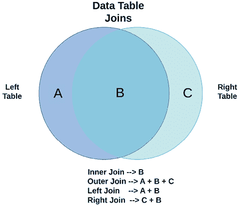

# 第十章：解决合并 DataFrame 时的数据问题

在大多数数据清洗项目的某个阶段，分析师必须将来自不同数据表的数据进行合并。这包括将具有相同结构的数据追加到现有的数据行中，或执行合并以从另一张数据表中提取列。前者有时称为垂直合并数据，或连接数据，而后者则称为水平合并数据，或合并数据。

合并可以根据合并依据列值的重复量进行分类。在一对一合并中，合并依据列的值在每张数据表中各出现一次。在一对多合并中，合并依据列的值在一方没有重复，而在另一方则存在重复。在多对多合并中，合并依据列的值在两方中都有重复。合并过程进一步复杂化，因为数据表中的合并依据值通常没有完全匹配的关系；每个数据表的合并依据列可能包含在另一张数据表中没有的值。

在合并数据时，可能会引入新的数据问题。当数据被追加时，即使列的名称和数据类型相同，也可能与原始数据具有不同的逻辑值。对于合并操作，每当合并依据的某一方缺少值时，该方的其他列也将缺少值。对于一对一或一对多的合并，合并依据值可能会出现意外的重复，导致其他列的值被不小心重复。

本章将介绍如何垂直和水平合并 DataFrame，并考虑如何处理合并时常见的数据问题。具体来说，本章的内容将涵盖以下主题：

+   垂直合并 DataFrame

+   一对一合并

+   通过多列进行一对一合并

+   一对多合并

+   多对多合并

+   开发合并例程

# 技术要求

为了完成本章中的所有内容，您需要使用 pandas、NumPy 和 Matplotlib。我使用的是 pandas 2.1.4，但代码也可以在 pandas 1.5.3 或更高版本上运行。

本章的代码可以从本书的 GitHub 仓库下载，[`github.com/PacktPublishing/Python-Data-Cleaning-Cookbook-Second-Edition`](https://github.com/PacktPublishing/Python-Data-Cleaning-Cookbook-Second-Edition)。

# 垂直合并 DataFrame

在某些情况下，我们需要将一张数据表中的行追加到另一张数据表中。这通常是将几乎相同列和数据类型的表格数据进行合并。例如，我们每个月可能会获得一份包含医院病人结果的新的 CSV 文件，并需要将其添加到现有的数据中。或者，我们可能会在某个学区的办公室工作，接收来自不同学校的数据。在这种情况下，我们可能会想要在进行分析之前先将这些数据合并。

即使跨月份和跨学校（在这些示例中）的数据结构在理论上是相同的，实际情况中可能并非如此。商业实践可能会从一个时期到另一个时期发生变化。这可能是有意为之，也可能是由于人员流动或其他外部因素而无意发生的。一个机构或部门的实践可能与另一个有所不同，并且某些数据值可能在某些机构中有所不同，甚至完全缺失。

当我们放松警惕时，通常会遇到看似相似的数据变化，通常是在我们开始假设新数据将与旧数据相似时。我每次合并数据时都会提醒自己这一点。在本章的其余部分，我将使用“纵向合并”或“附加”来指代将数据纵向合并。

在本食谱中，我们将使用 pandas 的`concat`函数将一组 pandas DataFrame 的行附加到另一个 DataFrame 中。我们还将对`concat`操作进行一些常见检查，以确认最终的 DataFrame 是否符合我们的预期。

## 准备工作

在本食谱中，我们将使用来自多个国家的陆地温度数据。这些数据包括 2023 年期间每个国家多个气象站的月平均温度、纬度、经度和海拔。每个国家的数据都保存在一个 CSV 文件中。

**数据备注**

陆地温度 DataFrame 包含 2023 年来自全球 12,000 多个气象站的平均温度（以°C 为单位），尽管大多数气象站位于美国。原始数据是从全球历史气候学网络集成数据库获取的。美国国家海洋和大气管理局在[`www.ncei.noaa.gov/products/land-based-station/global-historical-climatology-network-monthly`](https://www.ncei.noaa.gov/products/land-based-station/global-historical-climatology-network-monthly)上提供公开使用。

## 如何做……

在本食谱中，我们将纵向合并结构相似的 DataFrame，检查合并后数据的值，并修复缺失值。让我们开始吧：

1.  导入`pandas`和`numpy`，以及`os`模块：

    ```py
    import pandas as pd
    import numpy as np
    import os 
    ```

1.  从喀麦隆和阿曼加载数据并检查行数和列数：

    ```py
    ltcameroon = pd.read_csv("data/ltcountry/ltcameroon.csv")
    ltoman = pd.read_csv("data/ltcountry/ltoman.csv")
    ltcameroon.shape 
    ```

    ```py
    (48, 11) 
    ```

    ```py
    ltoman.shape 
    ```

    ```py
    (288, 10) 
    ```

比较喀麦隆和阿曼 DataFrame 中的列。通过查看列，我们可以看到喀麦隆的 DataFrame 中有`latabs`列，而阿曼的 DataFrame 中没有。我们可以使用`symetric_difference`来确认这一点，并确保没有其他列只出现在一个 DataFrame 中而不在另一个中。它显示`latabs`是唯一只在一个 DataFrame 中出现的列：

```py
ltcameroon.columns 
```

```py
Index(['locationid', 'year', 'month', 'temperature',
       'latitude', 'longitude', 'elevation', 'station',
       'countryid', 'country', 'latabs'],
      dtype='object') 
```

```py
ltoman.columns 
```

```py
Index(['locationid', 'year', 'month', 'temperature',
       'latitude', 'longitude', 'elevation', 'station',
       'countryid', 'country'],
      dtype='object') 
```

```py
ltcameroon.columns.\
  symmetric_difference(ltoman.columns) 
```

```py
Index(['latabs'], dtype='object') 
```

1.  我们仍然可以合并这两个 DataFrame。唯一的问题是，现在我们有一个名为`latabs`的列，该列在喀麦隆的所有行中都有非缺失值，而在阿曼的所有行中都是缺失值。我们将在本食谱的最后一步解决这个问题：

    ```py
    ltall = pd.concat([ltcameroon, ltoman])
    ltall.country.value_counts() 
    ```

    ```py
    country
    Oman        288
    Cameroon     48
    Name: count, dtype: int64 
    ```

    ```py
    ltall[['country','station','temperature',
      'latitude','latabs']].\
      sample(5, random_state=3) 
    ```

    ```py
     country          station    temperature    latitude    latabs
    276        Oman            BAHLA          21.44      23.000       NaN
    26         Oman             DIBA          21.85      25.617       NaN
    281        Oman      RAS_AL_HADD          23.74      22.300       NaN
    15     Cameroon           GAROUA          33.91       9.336     9.336
    220        Oman      SOHAR_MAJIS          30.85      24.467       NaN 
    ```

    ```py
    ltall.groupby(['country'])['latabs'].count() 
    ```

    ```py
    country
    Cameroon    48
    Oman         0
    Name: latabs, dtype: int64 
    ```

1.  创建一个函数来进行合并，并结合我们已做的数据检查。该函数接受一个文件名列表，遍历列表，读取与每个文件名相关联的 CSV 文件到一个 DataFrame 中，然后合并该 DataFrame。我们可以得到预期的计数。我们没有检查列名，接下来我们将在下一步进行。

    ```py
    def concatfiles(filelist):
      directory = "data/ltcountry/"
      ltall = pd.DataFrame()
      for filename in filelist:
        ltnew = pd.read_csv(directory + filename + ".csv")
        print(filename + " has " +
          str(ltnew.shape[0]) + " rows.")
        ltall = pd.concat([ltall, ltnew])
      return ltall
    ltall = concatfiles(['ltcameroon','ltoman']) 
    ```

    ```py
    ltcameroon has 48 rows.
    ltoman has 288 rows. 
    ```

    ```py
    ltall.country.value_counts() 
    ```

    ```py
    country
    Oman        288
    Cameroon     48
    Name: count, dtype: int64 
    ```

如果我们有很多文件需要合并，创建一个文件名列表可能会很麻烦。我们可以通过加载文件夹中所有具有 CSV 文件扩展名的文件，利用 Python 的`os`模块来帮助我们。接下来我们来做这件事，同时还要加入一些代码来检查列。我们将基于前一步的代码进行构建。

1.  合并文件夹中所有国家的数据文件。

遍历包含每个国家 CSV 文件的文件夹中的所有文件名。使用`endswith`方法检查文件名是否具有 CSV 文件扩展名。使用`read_csv`创建一个新的 DataFrame 并打印行数。使用`concat`将新 DataFrame 的行附加到已附加的行上。最后，显示最近的 DataFrame 中缺失的列，或者是最近的 DataFrame 中有而之前的 DataFrame 中没有的列：

```py
def concatallfiles():
  directory = "data/ltcountry"
  ltall = pd.DataFrame()
  for filename in os.listdir(directory):
    if filename.endswith(".csv"):
      fileloc = os.path.join(directory, filename)

      # open the next file
      with open(fileloc):
        ltnew = pd.read_csv(fileloc)
        print(filename + " has " +
          str(ltnew.shape[0]) + " rows.")
        ltall = pd.concat([ltall, ltnew])

        # check for differences in columns
        columndiff = ltall.columns.\
          symmetric_difference(ltnew.columns)
        if (not columndiff.empty):
          print("", "Different column names for:",
           filename, columndiff, "", sep="\n")

  return ltall 
```

1.  使用我们刚刚创建的函数来读取子文件夹中所有的国家 CSV 文件，显示行数并检查列名。我们再次看到`ltoman` DataFrame 缺少`latabs`列：

    ```py
    ltall = concatallfiles() 
    ```

    ```py
    ltpoland.csv has 120 rows.
    ltcameroon.csv has 48 rows.
    ltmexico.csv has 852 rows.
    ltjapan.csv has 1800 rows.
    ltindia.csv has 1116 rows.
    ltoman.csv has 288 rows.
    Different column names for:
    ltoman.csv
    Index(['latabs'], dtype='object')
    ltbrazil.csv has 1008 rows. 
    ```

1.  显示一些合并后的数据：

    ```py
    ltall[['country','station','month',
     'temperature','latitude']].\
     sample(5, random_state=1) 
    ```

    ```py
     country               station   month   temperature   latitude
    583   Japan             TOKUSHIMA       4            16         34
    635   India   NEW_DELHI_SAFDARJUN       7            31         29
    627  Mexico      COATZACOALCOSVER       9            30         18
    28   Poland               WLODAWA       3             5         52
    775  Mexico           ARRIAGACHIS      11            28         16 
    ```

1.  检查合并数据中的值。

注意到阿曼的`latabs`值全部缺失。这是因为阿曼的 DataFrame 中缺少`latabs`列（`latabs`是每个站点纬度的绝对值）：

```py
ltall.country.value_counts().sort_index() 
```

```py
country
Brazil      1008
Cameroon      48
India       1116
Japan       1800
Mexico       852
Oman         288
Poland       120
Name: count, dtype: int64 
```

```py
ltall.groupby(['country']).\
  agg({'temperature':['mean','max','count'],
  'latabs':['mean','max','count']}) 
```

```py
 temperature              latabs         
                mean   max   count     mean   max   count
country                                       
Brazil            25    34     900       14    34    1008
Cameroon          27    35      39        8    10      48
India             26    35    1096       21    34    1116
Japan             14    31    1345       36    45    1800
Mexico            23    36     685       22    32     852
Oman              28    38     264      NaN   NaN       0
Poland            10    21     120       52    55     120 
```

1.  修复缺失的值。

将阿曼的`latabs`值设置为`latitude`值。（阿曼的所有`latitude`值都位于赤道以北且为正数。在全球历史气候学网络集成数据库中，赤道以北的纬度值为正，而赤道以南的纬度值为负）。具体操作如下：

```py
ltall['latabs'] = np.where(ltall.country=="Oman", ltall.latitude, ltall.latabs)
ltall.groupby(['country']).\
...   agg({'temperature':['mean','max','count'],
...   'latabs':['mean','max','count']}) 
```

```py
 temperature             latabs         
                mean   max   count     mean   max   count
country                                       
Brazil            25    34     900       14    34    1008
Cameroon          27    35      39        8    10      48
India             26    35    1096       21    34    1116
Japan             14    31    1345       36    45    1800
Mexico            23    36     685       22    32     852
Oman              28    38     264       22    26     288
Poland            10    21     120       52    55     120 
```

到此为止，我们已经将选定文件夹中找到的七个 CSV 文件的数据合并了。我们还确认了已附加正确数量的行，找出了某些文件中缺失的列，并修复了缺失的值。

## 它是如何工作的...

我们在*第 3 步*中将一个 pandas DataFrame 的列表传递给了 pandas 的`concat`函数。第二个 DataFrame 的行被附加到了第一个 DataFrame 的底部。如果我们列出了第三个 DataFrame，那么这些行就会附加到前两个 DataFrame 合并后的行上。在合并之前，我们在*第 2 步*使用了`shape`属性来检查行数，并检查了列名。在*第 3 步*合并后，我们确认了结果 DataFrame 包含了每个国家的预期行数。

我们有时需要连接两个或三个以上的文件。*第 4 步*到*第 6 步*指导我们通过定义一个函数来重复代码，从而处理多个文件。在*第 4 步*中，我们将文件名列表传递给了这个函数。

在*第 5 步*和*第 6 步*中，我们查找了指定文件夹中的所有 CSV 文件，将找到的每个文件加载到内存中，然后将每个文件的行追加到一个 DataFrame 中。我们打印了每个加载的数据文件的行数，以便稍后将这些数字与拼接数据中的总数进行比较。我们还标识了任何与其他文件列不同的 DataFrame。在*第 8 步*中，我们使用 `value_counts` 确认了每个国家的行数是否正确。

pandas 的 `groupby` 方法可以用来检查每个原始 DataFrame 中的列值。我们按国家分组，因为它能标识每个原始 DataFrame 的行——每个 DataFrame 中的所有行对于国家都有相同的值。（即使该信息不用于后续分析，始终在拼接后的 DataFrame 中保留标识原始 DataFrame 的列也是很有帮助的。）在*第 8 步*中，这帮助我们注意到阿曼的 `latabs` 列没有值。在*第 9 步*中，我们替换了阿曼 `latabs` 列的缺失值。

## 还有更多内容...

根据你正在附加的 DataFrame 的大小和工作站的可用内存，合并 DataFrame 可能会消耗机器的资源，甚至在内存使用超过一定的资源量时导致代码提前终止。确保数据文件尽可能高效地存储数据始终是一个好主意。例如，将数字值进行降位处理，或者在适当时将字符数据转换为分类数据，都是良好的做法。

## 另请参见

我们在*第九章*《修复聚合时的脏数据》中详细讨论了强大的 pandas `groupby` 方法。

我们在*第六章*《使用 Series 操作清理和探索数据》中讨论了 NumPy 的 `where` 函数。

# 进行一对一合并

本章的其余部分将探讨横向合并数据；即，将一个数据表的列与另一个数据表的列合并。借用 SQL 开发中的术语，我们通常将这种操作称为连接操作：左连接、右连接、内连接和外连接。本节将研究一对一合并，其中合并依据的值在两个文件中都没有重复。后续的章节将展示一对多合并，其中合并依据的值在*右*数据表中有重复，以及多对多合并，其中合并依据的值在*左和右*数据表中都有重复。

我们常常说合并的左侧和右侧，在本章中我们将遵循这一约定。但这并没有实际的意义，除了为了更清晰的阐述。如果 A 是左侧数据表，B 是右侧数据表，我们可以通过合并完成完全相同的操作，反之亦然。

在本章中，我使用了“合并列”和“合并值”这些表达方式，而不是“关键列”或“索引列”。这样可以避免与 pandas 索引对齐产生可能的混淆。索引可以作为合并列使用，但也可以使用其他列。我还希望避免在讨论中依赖于关系数据库中的概念，如主键或外键。当我们从关系型系统中提取数据时，了解哪些数据列作为主键或外键是有帮助的，且我们在设置 pandas 索引时应考虑这一点。但是，对于大多数数据清洗项目中的合并，往往超出了这些键的范畴。

在简单的 1 对 1 合并情况下，左侧数据表中的每一行都会根据合并值与右侧数据表中的一行（且仅一行）匹配。当合并值出现在一张数据表中，但另一张数据表中没有时，合并结果的处理方式取决于指定的连接类型。下图展示了四种不同的连接类型：



图 10.1：展示四种不同类型连接的图示

当两个数据表通过内连接合并时，只有当合并值同时出现在左侧和右侧数据表中时，相关行才会保留。这是左侧和右侧数据表的交集，如前图中的**B**所示。外连接会返回所有行；也就是说，返回在两个数据表中都出现合并值的行、在左侧数据表中出现但在右侧数据表中未出现的行，以及在右侧数据表中出现但在左侧数据表中未出现的行——分别是**B**、**A**和**C**。这被称为并集。左连接返回合并值在左侧数据表中出现的行，无论它们是否出现在右侧数据表中。这是**A**和**B**。右连接返回合并值在右侧数据表中出现的行，无论它们是否出现在左侧数据表中。

缺失值可能由外连接、左连接或右连接产生。这是因为返回的合并数据表会在合并条件未找到的列中出现缺失值。例如，在执行左连接时，左侧数据集可能包含一些在右侧数据集中没有出现的合并条件值。在这种情况下，右侧数据集的所有列都会缺失。（这里我说*可能*是因为可以执行外连接、左连接或右连接，得到与内连接相同的结果，因为相同的合并条件值出现在两边。有时，我们做左连接是为了确保返回的所有行都来自左侧数据集，并且仅返回这些行。）

在本教程中，我们将查看四种连接类型。

## 准备工作

我们将处理来自**全国纵向调查**（**NLS**）的两个文件。这两个文件每个包含一行数据。一个包含就业、教育程度和收入数据，另一个文件包含受访者父母的收入和教育程度数据。

**数据说明**

**全国纵向调查**（**NLS**），由美国劳工统计局管理，是对 1997 年开始进行调查时在高中就读的个人进行的纵向调查。参与者每年都会接受调查，直到 2023 年。调查结果可以在[nlsinfo.org](https://nlsinfo.org)上公开获取。

## 如何操作...

在本教程中，我们将对两个数据框执行左连接、右连接、内连接和外连接，每个合并条件值有一行数据。让我们开始吧：

1.  导入`pandas`并加载两个 NLS 数据框：

    ```py
    import pandas as pd
    nls97 = pd.read_csv("data/nls97f.csv", low_memory=False)
    nls97.set_index("personid", inplace=True)
    nls97add = pd.read_csv("data/nls97add.csv") 
    ```

1.  查看一些 NLS 数据：

    ```py
    nls97.head() 
    ```

    ```py
     gender    birthmonth    birthyear  ...  \
    personid                                       ...  
    135335      Female             9         1981  ...  
    999406        Male             7         1982  ...  
    151672      Female             9         1983  ...  
    750699      Female             2         1981  ...  
    781297        Male            10         1982  ...  
                  colenrfeb22   colenroct22    originalid 
    personid                                          
    135335                NaN           NaN             1 
    999406                NaN           NaN             2 
    151672    1\. Not enrolled           NaN             3 
    750699                NaN           NaN             4 
    781297                NaN           NaN             5 
    [5 rows x 106 columns] 
    ```

    ```py
    nls97.shape 
    ```

    ```py
    (8984, 106) 
    ```

    ```py
    nls97add.head() 
    ```

    ```py
     originalid    motherage    parentincome  \
    0             1           26              -3  
    1             2           19              -4  
    2             3           26           63000  
    3             4           33           11700  
    4             5           34              -3  
         fatherhighgrade    motherhighgrade 
    0                 16                  8 
    1                 17                 15 
    2                 -3                 12 
    3                 12                 12 
    4                 12                 12 
    ```

    ```py
    nls97add.shape 
    ```

    ```py
    (8984, 5) 
    ```

1.  检查`originalid`的唯一值数量是否等于行数。

我们将稍后使用`originalid`作为我们的合并列：

```py
nls97.originalid.nunique()==nls97.shape[0] 
```

```py
True 
```

```py
nls97add.originalid.nunique()==nls97add.shape[0] 
```

```py
True 
```

1.  创建一些不匹配的 ID。

不幸的是，NLS 数据对于我们的目的来说有点过于干净。因此，我们将会故意修改一些`originalid`的值：

```py
nls97 = nls97.sort_values('originalid')
nls97add = nls97add.sort_values('originalid')
nls97.loc[[135335,999406], "originalid"] = \
  nls97.originalid+10000
nls97.originalid.head(2) 
```

```py
personid
135335    10001
999406    10002
Name: originalid, dtype: int64 
```

```py
nls97add.loc[[0,1], "originalid"] = \
  nls97add.originalid+20000
nls97add.originalid.head(2) 
```

```py
0    20001
1    20002
Name: originalid, dtype: int64 
```

1.  使用`join`执行左连接。

`nls97`是左数据框，`nls97add`是右数据框，当我们以这种方式使用`join`时。显示不匹配 ID 的值。注意，在右数据框没有匹配 ID 时，来自右数据框的列值都会缺失（`originalid`值 10001 和 10002 出现在左数据框中，但右数据框中没有这些 ID）：

```py
nls97.set_index("originalid", inplace=True)
nls97add.set_index("originalid", inplace=True)
nlsnew = nls97.join(nls97add)
nlsnew.loc[nlsnew.index>9999, ['originalid','gender','birthyear','motherage','parentincome']] 
```

```py
 gender    birthyear    motherage    parentincome
originalid                                           
10001         Female         1981          NaN             NaN
10002           Male         1982          NaN             NaN 
```

1.  使用`merge`执行左连接。

第一个数据框是左数据框，第二个数据框是右数据框。使用`on`参数指定合并的列。将`how`参数的值设置为`left`以执行左连接。我们得到的结果与使用`join`时相同：

```py
nlsnew = pd.merge(nls97, nls97add, on=['originalid'], how="left")
nlsnew.loc[nlsnew.index>9999, ['gender','birthyear','motherage','parentincome']] 
```

```py
 gender    birthyear    motherage   parentincome
originalid                                
10001         Female         1981          NaN            NaN
10002           Male         1982          NaN            NaN 
```

1.  执行右连接。

使用右连接时，当左数据框中没有匹配 ID 时，左数据框的值会缺失：

```py
nlsnew = pd.merge(nls97, nls97add, on=['originalid'], how="right")
nlsnew.loc[nlsnew.index>9999, ['gender','birthyear','motherage','parentincome']] 
```

```py
 gender    birthyear    motherage    parentincome
originalid                               
20001           NaN          NaN           26              -3
20002           NaN          NaN           19              -4 
```

1.  执行内连接。

在内连接后，所有不匹配的 ID（值大于`9999`）都不会出现。这是因为它们在两个数据框中都没有出现：

```py
nlsnew = pd.merge(nls97, nls97add, on=['originalid'], how="inner")
nlsnew.loc[nlsnew.index>9999, ['gender','birthyear','motherage','parentincome']] 
```

```py
Empty DataFrame
Columns: [gender, birthyear, motherage, parentincome]
Index: [] 
```

1.  执行外连接。

这会保留所有的行，因此左侧 DataFrame 中有合并列值但右侧没有的行将被保留（`originalid` 值为 `10001` 和 `10002`），而右侧 DataFrame 中有合并列值但左侧没有的行也会被保留（`originalid` 值为 `20001` 和 `20002`）：

```py
nlsnew = pd.merge(nls97, nls97add, on=['originalid'], how="outer")
nlsnew.loc[nlsnew.index>9999, ['gender','birthyear','motherage','parentincome']] 
```

```py
 gender    birthyear    motherage      parentincome
originalid                                
10001         Female        1,981          NaN               NaN
10002           Male        1,982          NaN               NaN
20001            NaN          NaN           26                -3
20002            NaN          NaN           19                -4 
```

1.  创建一个函数来检查 ID 不匹配。

该函数接受一个左侧和一个右侧的 DataFrame，以及一个合并列。它执行外连接，因为我们想查看在任一 DataFrame 中，或者两者中都存在的合并列值：

```py
def checkmerge(dfleft, dfright, idvar):
...   dfleft['inleft'] = "Y"
...   dfright['inright'] = "Y"
...   dfboth = pd.merge(dfleft[[idvar,'inleft']],\
...     dfright[[idvar,'inright']], on=[idvar], how="outer")
...   dfboth.fillna('N', inplace=True)
...   print(pd.crosstab(dfboth.inleft, dfboth.inright))
...
checkmerge(nls97.reset_index(),nls97add.reset_index(), "originalid") 
```

```py
inright    N       Y
inleft         
N          0       2
Y          2    8982 
```

到此为止，我们展示了如何在一对一合并中执行四种类型的连接。

## 它是如何工作的...

一对一的合并相对简单。合并列值在左侧和右侧的 DataFrame 中仅出现一次。然而，某些合并列值可能只出现在其中一个 DataFrame 中。这使得连接的类型变得重要。如果所有的合并列值都出现在两个 DataFrame 中，那么左连接、右连接、内连接或外连接将返回相同的结果。我们在前几步中查看了这两个 DataFrame。

在*第 3 步*中，我们确认了按 `originalid` 列合并时，唯一值的数量等于两个 DataFrame 中的行数。这告诉我们将进行一对一的合并。

如果合并列是索引，则执行左连接的最简单方法是使用 `join` DataFrame 方法。我们在*第 5 步*中做了这个操作。我们将右侧 DataFrame 传递给左侧 DataFrame 的 `join` 方法。当我们在*第 6 步*中使用 pandas 的 `merge` 函数执行左连接时，返回了相同的结果。我们使用 `how` 参数指定左连接，并通过 `on` 来指示合并列。

在*第 7 步*到*第 9 步*中，我们分别执行了右连接、内连接和外连接。这是通过 `how` 参数指定的，这是这些步骤中唯一不同的部分。

我们在*第 10 步*中创建的简单 `checkmerge` 函数统计了在一个 DataFrame 中存在但在另一个 DataFrame 中不存在的合并列值的行数，以及两个 DataFrame 中都存在的值的数量。将这两个 DataFrame 的副本传递给此函数告诉我们，左侧 DataFrame 中有两行不在右侧，右侧 DataFrame 中有两行不在左侧，且有 8,982 行在两者中都存在。

## 还有更多...

在进行任何非平凡的合并之前，你应该运行一个类似于我们在*第 10 步*中创建的 `checkmerge` 函数——在我看来，几乎所有的合并都算是非平凡合并。

`merge` 函数比我在本例中使用的示例更灵活。例如，在*第 6 步*中，我们不需要将左侧的 DataFrame 作为第一个参数。我本可以像这样显式地指定左侧和右侧的 DataFrame：

```py
nlsnew = pd.merge(right=nls97add, left=nls97, on=['originalid'], how="left") 
```

我们还可以通过使用 `left_on` 和 `right_on` 来指定左侧和右侧 DataFrame 的不同合并列，而不是使用 `on`：

```py
nlsnew = pd.merge(nls97, nls97add, left_on=['originalid'], right_on=['originalid'], how="left") 
```

`merge`函数的灵活性使它成为每当我们需要水平合并数据时的一个极好的工具。

# 使用多个列进行一对一合并

我们用来执行一对一合并的逻辑同样适用于多个合并列的合并。无论是两个还是更多的合并列，内连接、外连接、左连接和右连接的工作方式都是一样的。我们将在本食谱中演示这一点。

## 准备工作

我们将在本食谱中使用 NLS 数据，特别是 2017 年至 2021 年的工作周和大学注册数据。工作周和大学注册文件每个文件每年包含一行数据。

## 如何操作...

我们将使用多个合并列对两个数据框进行一对一合并。让我们开始：

1.  导入`pandas`并加载 NLS 工作周和大学注册数据：

    ```py
    import pandas as pd
    nls97weeksworked = pd.read_csv("data/nls97weeksworked.csv")
    nls97colenr = pd.read_csv("data/nls97colenr.csv") 
    ```

1.  看一下部分 NLS 工作周数据：

    ```py
    nls97weeksworked.loc[nls97weeksworked.\
      originalid.isin([2,3])] 
    ```

    ```py
     originalid    year    weeksworked
    5            2    2017             52
    6            2    2018             52
    7            2    2019             52
    8            2    2020             52
    9            2    2021             46
    10           3    2017             52
    11           3    2018             52
    12           3    2019              9
    13           3    2020              0
    14           3    2021              0 
    ```

    ```py
    nls97weeksworked.shape 
    ```

    ```py
    (44920, 3) 
    ```

    ```py
    nls97weeksworked.originalid.nunique() 
    ```

    ```py
    8984 
    ```

1.  看一下部分 NLS 大学注册数据：

    ```py
    nls97colenr.loc[nls97colenr.\
      originalid.isin([2,3])] 
    ```

    ```py
     originalid    year             colenr
    1                 2    2017    1\. Not enrolled
    2                 3    2017    1\. Not enrolled
    8985              2    2018    1\. Not enrolled
    8986              3    2018    1\. Not enrolled
    17969             2    2019    1\. Not enrolled
    17970             3    2019    1\. Not enrolled
    26953             2    2020    1\. Not enrolled
    26954             3    2020    1\. Not enrolled
    35937             2    2021    1\. Not enrolled
    35938             3    2021    1\. Not enrolled 
    ```

    ```py
    nls97colenr.shape 
    ```

    ```py
    (44920, 3) 
    ```

    ```py
    nls97colenr.originalid.nunique() 
    ```

    ```py
    8984 
    ```

1.  检查合并列中的唯一值。

我们获得的按列值组合的合并数量（`44,920`）与两个数据框中的行数相同：

```py
nls97weeksworked.groupby(['originalid','year'])\
...   ['originalid'].count().shape 
```

```py
(44920,) 
```

```py
nls97colenr.groupby(['originalid','year'])\
...   ['originalid'].count().shape 
```

```py
(44920,) 
```

1.  检查合并列中的不匹配情况。所有`originalid`和`year`的组合在两个文件中都有出现：

    ```py
    def checkmerge(dfleft, dfright, idvar):
    ...   dfleft['inleft'] = "Y"
    ...   dfright['inright'] = "Y"
    ...   dfboth = pd.merge(dfleft[idvar + ['inleft']],\
    ...     dfright[idvar + ['inright']], on=idvar, how="outer")
    ...   dfboth.fillna('N', inplace=True)
    ...   print(pd.crosstab(dfboth.inleft, dfboth.inright))
    ...
    checkmerge(nls97weeksworked.copy(),nls97colenr.copy(), ['originalid','year']) 
    ```

    ```py
    inright      Y
    inleft       
    Y        44920 
    ```

1.  使用多个合并列执行合并：

    ```py
    nls97workschool = \
      pd.merge(nls97weeksworked, nls97colenr,
      on=['originalid','year'], how="inner")
    nls97workschool.shape 
    ```

    ```py
    (44920, 4) 
    ```

    ```py
    nls97workschool.loc[nls97workschool.\
      originalid.isin([2,3])] 
    ```

    ```py
     originalid    year    weeksworked             colenr
    5            2    2017             52    1\. Not enrolled
    6            2    2018             52    1\. Not enrolled
    7            2    2019             52    1\. Not enrolled
    8            2    2020             52    1\. Not enrolled
    9            2    2021             46    1\. Not enrolled
    10           3    2017             52    1\. Not enrolled
    11           3    2018             52    1\. Not enrolled
    12           3    2019              9    1\. Not enrolled
    13           3    2020              0    1\. Not enrolled
    14           3    2021              0    1\. Not enrolled 
    ```

这些步骤表明，当有多个合并列时，运行合并的语法几乎没有变化。

## 工作原理...

NLS 数据中的每个人在工作周和大学注册数据框中都有五行数据，每年从 2017 年到 2021 年都有一行。两个文件都包含 44,920 行数据，涉及 8,984 个独特的个体（由`originalid`表示）。这一切都是有道理的（8,984*5=44,920）。

*第 4 步* 确认了我们将用于合并的列组合即使在个人数据重复的情况下也不会重复。每个人每年只有一行数据。这意味着工作周和大学注册数据的合并将是一次一对一的合并。在*第 5 步*中，我们检查了是否有在一个数据框中存在但另一个数据框中不存在的个人和年份组合。没有发现。

最后，在*第 6 步*中，我们准备好了进行合并。我们将`on`参数设置为一个包含两个列名的列表（`['originalid','year']`），以告诉合并函数使用这两列进行合并。我们指定了内连接，尽管使用任何连接都会得到相同的结果。这是因为相同的合并列值在两个文件中都存在。

## 还有更多...

我们在前一个食谱中讨论的所有合并数据的逻辑和潜在问题都适用，无论我们是用一个合并列还是多个合并列。内连接、外连接、右连接和左连接的工作方式相同。我们仍然可以在执行合并之前计算出返回的行数。我们还应该检查合并列的唯一值数量以及两个数据框之间的匹配情况。

如果你在之前的章节中使用过涉及 NLS 工作周和大学入学数据的示例，你可能注意到这里的结构不同。在之前的示例中，每个人有一行数据，包含多个关于工作周数和大学入学的列，表示多年的工作周数和大学入学情况。例如，`weeksworked21`表示 2021 年工作的周数。我们在本示例中使用的工作周数和大学入学数据框架结构比我们在早期示例中使用的 NLS 数据框架更为*整洁*。我们将在*第十一章*《整理和重塑数据》中学习如何整理数据。

# 执行一对多合并

在一对多合并中，左侧数据表的合并列（或列组合）具有不重复的值，而右侧数据表中的这些列则具有重复的值。对于这种合并，我们通常会使用内连接或左连接。当合并列的值在右侧数据表中缺失时，选择使用哪种连接方式是非常重要的。在进行左连接时，所有从内连接中返回的行都会返回，此外，对于左侧数据集中存在但右侧数据集缺失的每个合并列值，还会多返回一行。对于这些额外的行，右侧数据表中所有列的值将在结果合并数据中缺失。这个相对简单的事实实际上非常重要，在编写一对多合并代码之前，应该仔细考虑。

这是我开始感到紧张的地方，我认为在这里感到紧张是有道理的。在进行数据清洗工作坊时，我会在开始这个话题之前停顿一下，告诉大家，*“在你能带上朋友之前，不要开始一对多合并。”*

当然，我是在开玩笑……大部分时间是这样。我想表达的重点是，在进行非平凡的合并之前，应该有所停顿，而一对多的合并从来都不简单。我们的数据结构可能发生很多变化。

具体来说，在开始之前，我们需要了解将要合并的两个数据框架的一些信息。首先，我们应该知道每个数据框架上哪些列可以作为合并列。一对多合并通常用于从企业数据库系统中重新捕捉关系，并且需要与使用的主键和外键一致。（在关系型数据库中，左侧数据表上的主键通常与右侧数据表上的外键关联。）其次，我们应该知道将使用哪种连接方式以及原因。

第三，我们应该知道两个数据表各有多少行。第四，我们应该大致了解根据连接类型、每个数据集的行数以及对合并值的初步检查，将保留多少行。如果所有的合并值在两个数据集中都有，或者如果我们正在做内连接，那么行数将等于右侧数据集的行数，适用于一对多合并。但通常情况并不像这样简单。我们经常进行左连接的一对多合并。在左连接的情况下，保留的行数将等于右数据集中具有匹配合并值的行数，加上左数据集中没有匹配合并值的行数。

一旦我们通过本教程中的示例进行操作，这应该会更加清晰。

## 准备工作

本教程将使用来自全球历史气候网络（Global Historical Climatology Network）集成数据库的气象站数据。一个数据框包含每个国家的一行数据，另一个包含每个气象站的一行数据。每个国家通常有多个气象站。

## 如何实现…

在本教程中，我们将进行一对多的合并，将每个国家一行的数据与气象站数据合并，气象站数据包含每个国家的多个站点。让我们开始吧：

1.  导入`pandas`并加载气象站和国家数据：

    ```py
    import pandas as pd
    countries = pd.read_csv("data/ltcountries.csv")
    locations = pd.read_csv("data/ltlocations.csv") 
    ```

1.  为气象站（`locations`）和国家数据设置索引。

确认`countries`数据框中的合并列值是唯一的：

```py
countries.set_index(['countryid'], inplace=True)
locations.set_index(['countryid'], inplace=True)
countries.head() 
```

```py
 country
countryid                     
AC              Antigua and Barbuda
AE             United Arab Emirates
AF                      Afghanistan
AG                          Algeria
AJ                       Azerbaijan 
```

```py
countries.index.nunique()==countries.shape[0] 
```

```py
True 
```

```py
locations[['locationid','latitude','stnelev']].head(10) 
```

```py
 locationid	latitude	stnelev
countryid                               
AC		ACW00011604	58		18
AE		AE000041196	25		34
AE		AEM00041184	26		31
AE		AEM00041194	25		10
AE		AEM00041216	24		3
AE		AEM00041217	24		27
AE		AEM00041218	24		265
AF		AF000040930	35		3,366
AF		AFM00040911	37		378
AF		AFM00040938	34		977 
```

1.  使用`join`对国家和地点进行左连接：

    ```py
    stations = countries.join(locations)
    stations[['locationid','latitude',
    ...   'stnelev','country']].head(10) 
    ```

    ```py
     locationid	latitude	stnelev  \
    countryid                                  
    AC		ACW00011604	58		18  
    AE		AE000041196	25		34  
    AE		AEM00041184	26		31  
    AE		AEM00041194	25		10  
    AE		AEM00041216	24		3  
    AE		AEM00041217	24		27  
    AE		AEM00041218	24		265  
    AF		AF000040930	35		3,366  
    AF		AFM00040911	37		378  
    AF		AFM00040938	34		977  
                               country 
    countryid                       
    AC             Antigua and Barbuda 
    AE            United Arab Emirates 
    AE            United Arab Emirates 
    AE            United Arab Emirates 
    AE            United Arab Emirates 
    AE            United Arab Emirates 
    AE            United Arab Emirates 
    AF                     Afghanistan 
    AF                     Afghanistan 
    AF                     Afghanistan 
    ```

连接似乎正常工作。但我们试着改用 merge 方法。

1.  在进行合并之前，检查合并列是否匹配。

首先，重新加载数据框，因为我们做了一些更改。`checkmerge`函数显示，在两个数据框中有`countryid`合并值的行数为`27,472`，在`countries`（左侧数据框）中存在但在`locations`中不存在的行数为 2。这意味着内连接将返回`27,472`行，左连接将返回`27,474`行。该函数的最后语句标识出在一个数据框中有但在另一个数据框中没有的`countryid`值：

```py
countries = pd.read_csv("data/ltcountries.csv")
locations = pd.read_csv("data/ltlocations.csv")
def checkmerge(dfleft, dfright, idvar):
...   dfleft['inleft'] = "Y"
...   dfright['inright'] = "Y"
...   dfboth = pd.merge(dfleft[[idvar,'inleft']],\
...     dfright[[idvar,'inright']], on=[idvar], how="outer")
...   dfboth.fillna('N', inplace=True)
...   print(pd.crosstab(dfboth.inleft, dfboth.inright))
...   print(dfboth.loc[(dfboth.inleft=='N') | (dfboth.inright=='N')])
...
checkmerge(countries.copy(), locations.copy(), "countryid") 
```

```py
inright	N	Y
inleft          
N	0	1
Y	2	27472
      countryid inleft inright
9715         LQ      Y       N
13103        ST      Y       N
27474        FO      N       Y 
```

1.  显示一个文件中有而另一个文件中没有的行。

上一步的最后语句显示了在`countries`中有但在`locations`中没有的两个`countryid`值，以及在`locations`中有但在`countries`中没有的一个值：

```py
countries.loc[countries.countryid.isin(["LQ","ST"])] 
```

```py
 countryid                          country
124          LQ    Palmyra Atoll [United States]
195          ST                      Saint Lucia 
```

```py
locations.loc[locations.countryid=="FO"] 
```

```py
 locationid  latitude  longitude  stnelev   station countryid
7363  FOM00006009        61         -7      102  AKRABERG        FO 
```

1.  合并`locations`和`countries`数据框。

执行左连接。同时，统计在国家数据中存在但在气象站数据中缺失的每一列的缺失值数量：

```py
stations = pd.merge(countries, locations, on=["countryid"], how="left")
stations[['locationid','latitude',
...   'stnelev','country']].head(10) 
```

```py
 locationid	latitude	stnelev		country
0	ACW00011604	58		18		Antigua and Barbuda
1	AE000041196	25		34		United Arab Emirates
2	AEM00041184	26		31		United Arab Emirates
3	AEM00041194	25		10		United Arab Emirates
4	AEM00041216	24		3		United Arab Emirates
5	AEM00041217	24		27		United Arab Emirates
6	AEM00041218	24		265		United Arab Emirates
7	AF000040930	35		3,366		Afghanistan
8	AFM00040911	37		378		Afghanistan
9	AFM00040938	34		977		Afghanistan 
```

```py
stations.shape 
```

```py
(27474, 7) 
```

```py
stations.loc[stations.countryid.isin(["LQ","ST"])].isnull().sum() 
```

```py
countryid	0
country	0
locationid	2
latitude	2
longitude	2
stnelev	2
station	2
dtype: int64 
```

一对多合并返回预期的行数以及新的缺失值。

## 它是如何工作的…

在*第 3 步*中，我们使用了`join` DataFrame 方法，执行了`countries`和`locations` DataFrame 的左连接。这是执行连接的最简单方法。由于`join`方法使用 DataFrame 的索引进行连接，我们需要首先设置索引。然后，我们将右侧 DataFrame 传递给左侧 DataFrame 的`join`方法。

尽管`join`比这个例子中所示的稍微灵活（例如，你可以指定连接类型），但对于所有但最简单的连接，我更喜欢使用较为冗长的 pandas `merge`函数。我可以确信，使用`merge`函数时，所有我需要的选项都可以使用。在我们使用`merge`函数之前，我们在*第 4 步*中做了一些检查。这告诉我们如果执行内连接或左连接，合并后的 DataFrame 预期行数分别为 27,472 或 27,474。

我们还展示了一个 DataFrame 中有 merge-by 值的行，而另一个没有。如果我们要做左连接，我们需要决定如何处理右侧 DataFrame 中缺失的值。在这个例子中，有两个 merge-by 值在右侧 DataFrame 中未找到，导致这些列出现了缺失值。

## 还有更多…

你可能已经注意到，在我们调用`checkmerge`时，我们传递了`countries`和`locations` DataFrame 的副本：

```py
checkmerge(countries.copy(), locations.copy(), "countryid") 
```

我们在这里使用`copy`，因为我们不希望`checkmerge`函数对原始 DataFrame 做任何修改。

## 另见

我们在本章的*进行一对一连接*部分详细讨论了连接类型。

# 进行多对多连接

多对多连接会在左侧和右侧 DataFrame 中都产生重复的 merge-by 值。我们应该只在少数情况下才需要进行多对多的连接。即使数据以这种形式出现，通常也是因为我们缺少在多个一对多关系中的核心文件。例如，有捐赠者、捐赠者贡献和捐赠者联系信息的数据表，后两个文件每个捐赠者有多行。但是，在这个案例中，我们无法访问捐赠者文件，它与捐赠和联系信息文件有一对多关系。这种情况比你想象的更常见。人们有时会给我们提供数据，而不了解数据的底层结构。当我做多对多连接时，通常是因为我缺少一些关键信息，而不是因为数据库就是这么设计的。

多对多连接返回 merge-by 列值的笛卡尔积。因此，如果一个捐赠者 ID 在捐赠者联系信息文件中出现两次，在捐赠者贡献文件中出现五次，那么连接将返回 10 行数据。这在分析时通常会引发一些问题。在这个例子中，多对多连接将重复捐赠者的贡献，每个地址一次。

当面对潜在的多对多合并情况时，解决方案往往不是进行合并。相反，我们可以恢复隐含的单对多关系。以捐赠者为例，我们可以删除所有行，保留最新的联系信息，从而确保每个捐赠者只有一行数据。然后我们可以与捐赠者贡献文件进行单对多合并。但我们并不总能避免进行多对多合并。有时，我们必须生成一个分析文件或平面文件，保持所有数据，不考虑重复。这份指南展示了在需要时如何进行这些合并。

## 准备工作

我们将使用克利夫兰艺术博物馆（Cleveland Museum of Art）的数据。我们将使用两个 CSV 文件：一个包含集合中每个项目的媒体引用，另一个包含每个项目的创作者。

**数据说明**

克利夫兰艺术博物馆提供了一个公共 API，用于访问这些数据：[`openaccess-api.clevelandart.org/`](https://openaccess-api.clevelandart.org/)。通过该 API 可以获取比引用和创作者数据更多的数据。本指南中的数据是 2024 年 4 月下载的。

## 如何做...

按照以下步骤完成这份指南：

1.  加载`pandas`并加载**克利夫兰艺术博物馆**（**CMA**）的收藏数据：

    ```py
    import pandas as pd
    cmacitations = pd.read_csv("data/cmacitations.csv")
    cmacreators = pd.read_csv("data/cmacreators.csv") 
    ```

1.  看看`citations`数据。`itemid`是集合项的标识符。前 10 个引用都是针对集合项`94979`的：

    ```py
    cmacitations['citation'] = cmacitations.citation.str[0:15]
    cmacitations.head(10) 
    ```

    ```py
     itemid            citation
    0   94979     Perkins, August
    1   94979     Bayley, Frank W
    2   94979     W. H. D. "The F
    3   94979     <em>The America
    4   94979     "Clevel'd Gets
    5   94979     "The Inaugurati
    6   94979     Bell, Hamilton.
    7   94979     Cleveland Museu
    8   94979     "Special Exhibi
    9   94979     Dunlap, William 
    ```

    ```py
    cmacitations.shape 
    ```

    ```py
    (16053, 2) 
    ```

    ```py
    cmacitations.itemid.nunique() 
    ```

    ```py
    974 
    ```

1.  看看`creators`数据。`creatorid`是创作者的标识符：

    ```py
    cmacreators['creator'] = cmacreators.creator.str[0:15]
    cmacreators.loc[:,['itemid','creator','birth_year',
     'creatorid']].head(10) 
    ```

    ```py
     itemid            creator   birth_year    creatorid
    0   94979    John Singleton          1738         2409
    1  102578    William Merritt         1849         3071
    2   92937    George Bellows          1882         3005
    3  151904    Thomas Eakins (         1844         4037
    4  141639    Frederic Edwin          1826         2697
    5  110180    Albert Pinkham          1847         3267
    6  149112    Charles Sheeler         1883          889
    7  126769    Henri Rousseau          1844         1804
    8  149410    Paul Gauguin (F         1848         1776
    9  135299    Vincent van Gog         1853         1779 
    ```

    ```py
    cmacreators.shape 
    ```

    ```py
    (694, 8) 
    ```

    ```py
    cmacreators.itemid.nunique() 
    ```

    ```py
    618 
    ```

    ```py
    cmacreators.creatorid.nunique() 
    ```

    ```py
    486 
    ```

1.  显示`citations`数据中重复的合并值。

集合项 148758 有 182 条媒体引用：

```py
cmacitations.itemid.value_counts().head(10) 
```

```py
itemid
148758    182
113164    127
122351    125
155783    119
151904    112
124245    108
92937     104
123168     98
94979      98
149112     97
Name: count, dtype: int64 
```

1.  显示`creators`数据中重复的合并值：

    ```py
    cmacreators.itemid.value_counts().head(10) 
    ```

    ```py
    itemid
    149386    4
    142753    3
    112932    3
    149042    3
    114538    3
    140001    3
    146797    3
    149041    3
    140427    3
    109147    2
    Name: count, dtype: int64 
    ```

1.  检查合并结果。

使用我们在*进行单对多合并*中使用的`checkmerge`函数：

```py
def checkmerge(dfleft, dfright, idvar):
...   dfleft['inleft'] = "Y"
...   dfright['inright'] = "Y"
...   dfboth = pd.merge(dfleft[[idvar,'inleft']],\
...     dfright[[idvar,'inright']], on=[idvar], how="outer")
...   dfboth.fillna('N', inplace=True)
...   print(pd.crosstab(dfboth.inleft, dfboth.inright))
...
checkmerge(cmacitations.copy(), cmacreators.copy(), "itemid") 
```

```py
inright     N      Y
inleft             
N           0     14
Y        4277  12710 
```

1.  显示在两个数据框中都重复的合并值：

    ```py
    cmacitations.loc[cmacitations.itemid==124733] 
    ```

    ```py
     itemid             citation
    14533      124733      Weigel, J. A. G
    14534      124733      Winkler, Friedr
    14535      124733       Francis, Henry
    14536      124733      Kurz, Otto. <em
    14537      124733      Minneapolis Ins
    14538      124733      Pilz, Kurt. "Ha
    14539      124733      Koschatzky, Wal
    14540      124733      Johnson, Mark M
    14541      124733      Kaufmann, Thoma
    14542      124733        Koreny, Fritz.
    14543      124733      Achilles-Syndra
    14544      124733       Schoch, Rainer,
    14545      124733      DeGrazia, Diane
    14546      124733       Dunbar, Burton 
    ```

    ```py
    cmacreators.loc[cmacreators.itemid==124733,
    ...   ['itemid','creator','birth_year','title']] 
    ```

    ```py
     itemid              creator      birth_year                title
    591  124733      Hans Hoffmann (           1545      Dead Blue Roller
    592  124733      Albrecht Dürer            1471      Dead Blue Roller 
    ```

1.  进行多对多合并：

    ```py
    cma = pd.merge(cmacitations, cmacreators, on=['itemid'], how="outer")
    cma.set_index("itemid", inplace=True)
    cma.loc[124733, ['citation','creator','birth_year']] 
    ```

    ```py
     citation             creator    birth_year
    itemid                                                      
    124733     Weigel, J. A. G     Hans Hoffmann (          1545
    124733     Weigel, J. A. G     Albrecht Dürer           1471
    124733     Winkler, Friedr     Hans Hoffmann (          1545
    124733     Winkler, Friedr     Albrecht Dürer           1471
    124733      Francis, Henry     Hans Hoffmann (          1545
    124733     Francis, Henry      Albrecht Dürer           1471
    124733     Kurz, Otto. <em     Hans Hoffmann (          1545
    124733     Kurz, Otto. <em     Albrecht Dürer           1471
    124733     Minneapolis Ins     Hans Hoffmann (          1545
    124733     Minneapolis Ins     Albrecht Dürer           1471
    124733     Pilz, Kurt. "Ha     Hans Hoffmann (          1545
    124733     Pilz, Kurt. "Ha     Albrecht Dürer           1471
    124733     Koschatzky, Wal     Hans Hoffmann (          1545
    124733     Koschatzky, Wal     Albrecht Dürer           1471
    ... last 14 rows removed to save space 
    ```

现在，既然我已经带你了解了多对多合并的复杂性，我将再多说一点它是如何工作的。

## 它是如何工作的...

*步骤 2*告诉我们有 16,053 条引用，涉及 974 个独特项目。每个项目都有一个唯一的 ID，`itemid`，表示博物馆中的每个项目。平均而言，每个项目有 16 条媒体引用（16,053/974）。*步骤 3*告诉我们，博物馆有 694 位创作者，涉及 618 个有创作者的项目，因此绝大多数作品只有一个创作者。但`citations`和`creators`数据框中都存在重复的`itemid`（我们用于合并的值），这意味着我们的合并将是多对多合并。

*步骤 4*让我们了解了哪些`itemid`在`citations` DataFrame 中重复。博物馆中的一些项目有超过 100 个引用。值得仔细查看这些项目的引用，以判断它们是否合理。*步骤 5*显示，即使有多个创作者，通常也不会超过三个。在*步骤 6*中，我们看到大多数`itemid`出现在`citations`文件和`creators`文件中，但也有相当一部分有`citations`行但没有`creators`行。如果我们进行内连接或右连接，我们将丢失那 4,277 行数据，但进行左连接或外连接则不会丢失。（假设`citations` DataFrame 是左侧 DataFrame，`creators` DataFrame 是右侧 DataFrame。）

我们查看了*步骤 7*中在两个 DataFrame 中重复的`itemid`值。该集合项在`citations` DataFrame 中有 14 行，在`creators` DataFrame 中有 2 行。这将导致在合并的 DataFrame 中生成 28 行（2 * 14）。`citations`数据将会为`creators`中的每一行重复。

当我们查看在*步骤 8*中合并的结果时，这一点得到了确认。我们使用`itemid`作为合并列进行了外连接。当我们展示合并文件中相同 ID 的行时，使用的是在*步骤 7*中使用的 ID，我们得到了预期的 28 行（为了节省空间，我删除了最后 14 行输出）。

## 还有更多…

理解何时进行多对多合并非常重要，因为有时这是无法避免的。但即便在这种情况下，我们可以知道，多对多关系其实只是两个一对多关系，只是数据文件在其中一侧缺失。很可能会有一个数据表，其中每一行代表一个集合项，并且与`citations`数据和`creators`数据都有一对多关系。当我们无法访问类似的文件时，最好尝试重新生成一个具有该结构的文件。利用这些数据，我们可以创建一个包含`itemid`，也许还包括`title`的文件，然后分别与`citations`和`creators`数据进行一对多合并。

然而，有时我们必须生成一个平面文件以供后续分析。当我们，或者从我们这里获取清洗数据的同事，使用无法很好处理关系数据的软件时，可能需要这么做。例如，其他部门的某个人可能会使用 Excel 做很多数据可视化工作。只要那个人知道哪些分析需要去除重复的行，那么像我们在*步骤 8*中生成的结构可能会很好用。

# 开发合并程序

我发现将数据合并看作数据清理过程中的停车场很有帮助。数据合并和停车似乎是例行公事，但它们是意外发生的高发地带。避免在停车场发生事故的一种方法是，每次进入某个特定停车场时，都使用类似的策略。也许你总是去一个相对交通较少的区域，并且大部分时间你都是通过相同的方式到达那里。

我认为类似的方法可以应用于在数据合并时相对不受损害地进出。如果我们选择一种对我们有效的通用方法，能在 80%到 90%的情况下起作用，我们可以专注于最重要的内容——数据，而不是操控数据的技术。

在这个方法中，我将展示对我有效的一般方法，但我使用的具体技术并不重要。我认为拥有一种你了解并且能够熟练使用的方法是很有帮助的。

## 准备工作

我们将回到本章的*进行一对多合并*方法中所关注的目标。我们想要对`countries`数据和全球历史气候网络集成数据库中的`locations`数据进行左连接。

## 如何实现……

在这个方法中，我们将在检查合并依据值的不匹配后，对`countries`和`locations`数据进行左连接。让我们开始吧：

1.  导入`pandas`并加载气象站和国家数据：

    ```py
    import pandas as pd
    countries = pd.read_csv("data/ltcountries.csv")
    locations = pd.read_csv("data/ltlocations.csv") 
    ```

1.  检查合并依据的列是否匹配：

    ```py
    def checkmerge(dfleft, dfright, mergebyleft, mergebyright):
    ...   dfleft['inleft'] = "Y"
    ...   dfright['inright'] = "Y"
    ...   dfboth = \
    ...     pd.merge(dfleft[[mergebyleft,'inleft']],\
    ...     dfright[[mergebyright,'inright']],\
    ...     left_on=[mergebyleft],\
    ...     right_on=[mergebyright], how="outer")
    ...   dfboth.fillna('N', inplace=True)
    ...   print(pd.crosstab(dfboth.inleft,
    ...     dfboth.inright))
    ...   print(dfboth.loc[(dfboth.inleft=='N') | \
    ...     (dfboth.inright=='N')].head(20))
    checkmerge(countries.copy(), locations.copy(), "countryid", "countryid") 
    ```

    ```py
    inright            N         Y
    inleft                        
    N                  0         1
    Y                  2     27472
          countryid inleft inright
    7363         FO      N       Y
    9716         LQ      Y       N
    13104        ST      Y       N 
    ```

1.  合并国家和位置数据：

    ```py
    stations = pd.merge(countries, locations, left_on=["countryid"], right_on=["countryid"], how="left")
    stations[['locationid','latitude',
    ...   'stnelev','country']].head(10) 
    ```

    ```py
     locationid      latitude      stnelev                 country
    0  ACW00011604       57.7667         18.0     Antigua and Barbuda
    1  AE000041196       25.3330         34.0    United Arab Emirates
    2  AEM00041184       25.6170         31.0    United Arab Emirates
    3  AEM00041194       25.2550         10.4    United Arab Emirates
    4  AEM00041216       24.4300          3.0    United Arab Emirates
    5  AEM00041217       24.4330         26.8    United Arab Emirates
    6  AEM00041218       24.2620        264.9    United Arab Emirates
    7  AF000040930       35.3170       3366.0             Afghanistan
    8  AFM00040911       36.7000        378.0             Afghanistan
    9  AFM00040938       34.2100        977.2             Afghanistan 
    ```

    ```py
    stations.shape 
    ```

    ```py
    (27474, 7) 
    ```

在这里，我们从左连接中得到了预期的行数：`27,472`行数据在两个 DataFrame 中都有合并依据值，另外有两行数据在左侧 DataFrame 中有合并依据值，但右侧没有。

## 它是如何工作的……

对于我进行的大多数合并，类似于*步骤 2*和*步骤 3*中使用的逻辑效果很好。我们在前一个方法中使用的`checkmerge`函数中添加了一个第四个参数。这使我们能够为左右两个 DataFrame 指定不同的合并依据列。每次进行合并时我们不需要重新创建这个函数。我们只需要将它包含在一个模块中并导入即可。（在本书的最后一章，我们将讨论如何将辅助函数添加到模块中。）

在进行合并之前调用`checkmerge`函数，能给我们足够的信息，让我们知道在使用不同的连接类型进行合并时会得到什么结果。我们将知道通过内连接、外连接、左连接或右连接返回多少行数据。我们还会知道在实际合并之前，哪些地方会生成新的缺失值。当然，这个操作相当耗费资源，因为每次我们都需要运行两次合并——一次诊断性的外连接，接着再进行我们选择的任何连接类型。但我认为这通常是值得的，至少可以帮助我们停下来思考我们在做什么。

最后，我们在*步骤 3*中进行了合并。这是我偏好的语法。我总是将左侧的 DataFrame 用作第一个参数，右侧的 DataFrame 用作第二个参数，尽管`merge`允许我们以不同的方式指定左右 DataFrame。我还为`left_on`和`right_on`设置了值，即使合并列相同，我也可以使用`on`（就像我们在前面的例子中所做的那样）。这样做是为了避免在合并列不同的情况下需要更改语法，我也喜欢它能让两个 DataFrame 的合并列变得显式。

一个稍微有争议的做法是，我默认使用左连接，将`how`参数初始设置为左连接。我将其作为起始假设，然后问自己是否有理由使用其他连接类型。左侧 DataFrame 中的行通常代表我的分析单元（如学生、病人、客户等），而我正在从右侧 DataFrame 中添加补充数据（如 GPA、血压、邮政编码等）。如果合并列在右侧 DataFrame 中不存在（例如执行内连接时），删除分析单元中的行可能会导致问题。例如，在本章的*一对一合并*食谱中，如果删除主 NLS 数据中没有出现在我们为父母提供的补充数据中的行，可能就没有意义。

## 另请参见

我们将在*第十二章，自动化数据清理与用户自定义函数、类和管道*中创建包含有用数据清理功能的模块。

我们在本章的*一对一合并*食谱中讨论了连接的类型。

# 总结

我们在本章仔细研究了纵向合并数据（也称为拼接）和横向合并数据（也称为合并）。我们讨论了拼接数据时的关键数据问题，包括文件之间的不同列。我们还考虑了合并数据时的关键问题，如合并列的缺失值和数据的意外重复。我们还探讨了不同连接类型对这些问题的影响。在下一章中，我们将学习如何整理和重塑混乱的数据。

# 留下评论！

享受本书吗？通过在亚马逊上留下评论，帮助像您一样的读者。扫描下面的二维码获取您选择的免费电子书。


