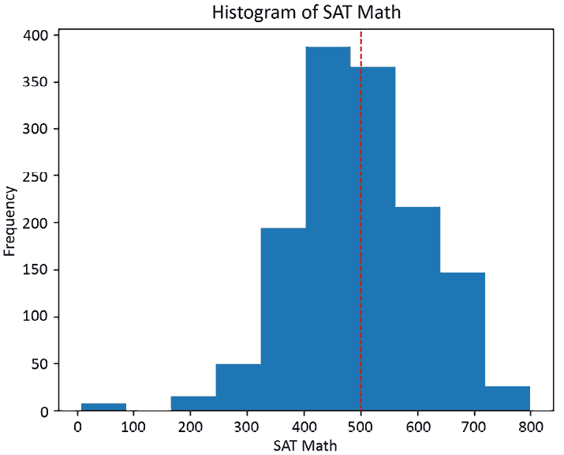
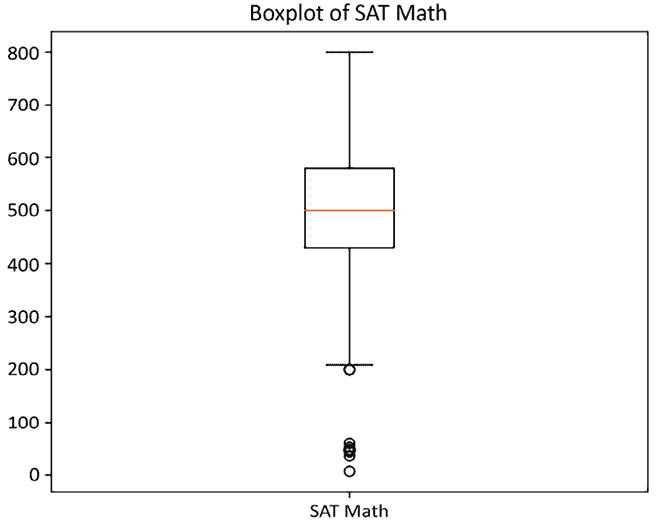
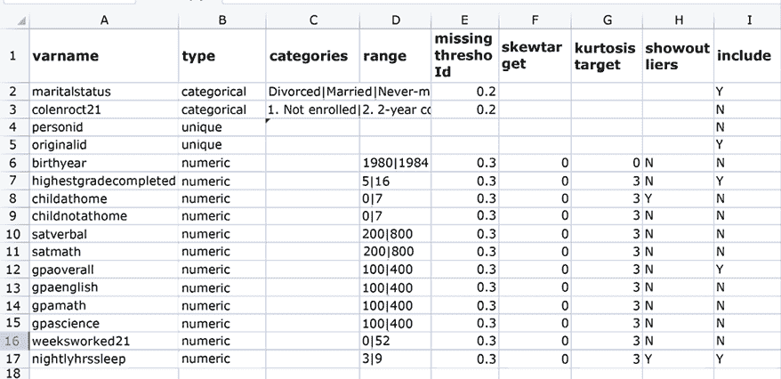

# 第十二章：使用用户定义的函数、类和管道来自动化数据清理

编写可重用的代码有很多很好的理由。当我们从当前的数据清理问题中退一步，考虑它与非常相似的问题的关系时，实际上能够帮助我们加深对关键问题的理解。当我们将目光投向长期解决方案而非短期解决方案时，也更有可能以系统化的方式处理任务。这还带来了一个额外的好处，即帮助我们将数据处理的实质问题与操作数据的机制分开。

在本章中，我们将创建多个模块来完成常规的数据清理任务。这些模块中的函数和类是可以跨 DataFrame 或针对一个 DataFrame 在较长时间内重用的代码示例。这些函数处理了我们在前十一章中讨论的许多任务，但方式是允许我们重用代码的。

本章中的教程具体包括以下内容：

+   获取数据初步信息的函数

+   显示汇总统计信息和频率的函数

+   识别异常值和意外值的函数

+   聚合或合并数据的函数

+   包含更新 Series 值逻辑的类

+   处理非表格数据结构的类

+   检查整体数据质量的函数

+   使用管道进行数据预处理：一个简单的例子

+   使用管道进行数据预处理：一个更复杂的例子

# 技术要求

完成本章中的教程，你将需要 pandas、NumPy 和 Matplotlib。我使用的是 pandas 2.1.4，但代码也能在 pandas 1.5.3 或更高版本上运行。

本章中的代码可以从本书的 GitHub 仓库下载，[`github.com/PacktPublishing/Python-Data-Cleaning-Cookbook-Second-Edition`](https://github.com/PacktPublishing/Python-Data-Cleaning-Cookbook-Second-Edition)。

# 获取数据初步信息的函数

我们在将数据导入 pandas DataFrame 后，所进行的最初几步操作基本上是相同的，不论数据的特点如何。我们几乎总是想知道列数和行数、列的数据类型，并查看前几行数据。我们也可能想查看索引，并检查是否存在唯一标识符来区分 DataFrame 的行。这些离散且容易重复的任务是很好的候选项，可以将其组织成一个模块中的函数。

在这个教程中，我们将创建一个包含函数的模块，这些函数可以让我们快速了解任何 pandas DataFrame 的基本情况。模块只是一个 Python 代码的集合，我们可以将其导入到其他 Python 程序中。模块便于重用，因为任何能够访问存储模块文件夹的程序都可以引用它。

## 准备工作

在这个示例中，我们创建两个文件：一个包含我们将用来查看数据的函数，另一个用来调用该函数。让我们将包含我们将使用的函数的文件命名为 `basicdesciptives.py`，并将其放在名为 `helperfunctions` 的子文件夹中。

在这个示例中，我们使用**国家纵向调查**（**NLS**）数据。

**数据注释**

NLS 由美国劳工统计局管理，是一个关于在 1997 年高中毕业的个人的纵向调查集合。参与者每年接受调查直到 2023 年。这些调查可供公众在 [nlsinfo.org](https://nlsinfo.org) 上使用。

## 如何做...

我们将创建一个函数来初步查看 DataFrame。

1.  创建包含我们想要的函数的 `basicdescriptives.py` 文件。

`getfirstlook` 函数将返回一个包含 DataFrame 摘要信息的字典。将文件保存在 `helperfunctions` 子文件夹中，文件名为 `basicdescriptives.py`。（你也可以直接从 GitHub 仓库下载代码。）另外，创建一个函数（`displaydict`）来美化字典的显示：

```py
import pandas as pd
def getfirstlook(df, nrows=5, uniqueids=None):
...   out = {}
...   out['head'] = df.head(nrows)
...   out['dtypes'] = df.dtypes
...   out['nrows'] = df.shape[0]
...   out['ncols'] = df.shape[1]
...   out['index'] = df.index
...   if (uniqueids is not None):
...     out['uniqueids'] = df[uniqueids].nunique()
...   return out
def displaydict(dicttodisplay):
...   print(*(': '.join(map(str, x)) \
...     for x in dicttodisplay.items()), sep='\n\n') 
```

1.  创建一个单独的文件 `firstlook.py`，用来调用 `getfirstlook` 函数。

导入 `pandas`、`os` 和 `sys` 库，并加载 NLS 数据：

```py
import pandas as pd
import os
import sys
nls97 = pd.read_csv("data/nls97g.csv", low_memory=False)
nls97.set_index('personid', inplace=True) 
```

1.  导入 `basicdescriptives` 模块。

首先将 `helperfunctions` 子文件夹添加到 Python 路径中。然后我们可以导入 `basicdescriptives`。我们使用与要导入的模块文件名相同的名称。我们创建一个别名 `bd`，以便稍后更容易访问模块中的函数。（如果我们需要重新加载 `basicdescriptives`，可以使用 `importlib`，这里被注释掉，因为我们在该模块中进行了一些更改。）

```py
sys.path.append(os.getcwd() + "/helperfunctions")
import basicdescriptives as bd
# import importlib
# importlib.reload(bd) 
```

1.  首先查看 NLS 数据。

我们可以将 DataFrame 直接传递给 `basicdescriptives` 模块中的 `getfirstlook` 函数，以快速摘要 NLS 数据。`displaydict` 函数为我们提供了字典的更漂亮打印：

```py
dfinfo = bd.getfirstlook(nls97)
bd.displaydict(dfinfo) 
```

```py
head:       gender    birthmonth    birthyear    ...    parentincome  \
personid                                         ...               
135335     Female             9       1981       ...              -3  
999406       Male             7       1982       ...              -4  
151672     Female             9       1983       ...           63000  
750699     Female             2       1981       ...           11700  
781297       Male            10       1982       ...              -3  
          fatherhighgrade   motherhighgrade 
personid                                  
135335                16                  8 
999406                17                 15 
151672                -3                 12 
750699                12                 12 
781297                12                 12 
[5 rows x 110 columns]
dtypes: gender      object
birthmonth          int64
birthyear           int64
sampletype         object
ethnicity          object
originalid          int64
motherage           int64
parentincome        int64
fatherhighgrade     int64
motherhighgrade     int64
Length: 110, dtype: object
nrows: 8984
ncols: 110
index: Index([135335, 999406, 151672, 750699, 781297, 613800, 403743,
       474817, 530234, 351406,
       ...
       290800, 209909, 756325, 543646, 411195, 505861, 368078,
       215605, 643085, 713757],
      dtype='int64', name='personid', length=8984) 
```

1.  将值传递给 `getfirstlook` 的 `nrows` 和 `uniqueids` 参数。

这两个参数默认值分别为 5 和 `None`，除非我们提供值：

```py
dfinfo = bd.getfirstlook(nls97,2,'originalid')
bd.displaydict(dfinfo) 
```

```py
head:       gender    birthmonth    birthyear    ...    parentincome  \
personid                                         ...               
135335      Female             9         1981    ...              -3  
999406        Male             7         1982    ...              -4  
         fatherhighgrade  motherhighgrade 
personid                                  
135335                16                8 
999406                17               15 
[2 rows x 110 columns]
dtypes: gender      object
birthmonth          int64
birthyear           int64
sampletype         object
ethnicity          object
originalid          int64
motherage           int64
parentincome        int64
fatherhighgrade     int64
motherhighgrade     int64
Length: 110, dtype: object
nrows: 8984
ncols: 110
index: Index([135335, 999406, 151672, 750699, 781297, 613800, 403743,
       474817, 530234, 351406,
       ...
       290800, 209909, 756325, 543646, 411195, 505861, 368078,
       215605, 643085, 713757],
      dtype='int64', name='personid', length=8984)
uniqueids: 8984 
```

1.  使用一些返回的字典键和值。

我们还可以显示从 `getfirstlook` 返回的字典中选择的关键值。显示行数和数据类型，并检查每行是否具有 `uniqueid` 实例（`dfinfo['nrows'] == dfinfo['uniqueids']`）：

```py
dfinfo['nrows'] 
```

```py
8984 
```

```py
dfinfo['dtypes'] 
```

```py
gender             object
birthmonth          int64
birthyear           int64
sampletype         object
ethnicity          object
originalid          int64
motherage           int64
parentincome        int64
fatherhighgrade     int64
motherhighgrade     int64
Length: 110, dtype: object 
```

```py
dfinfo['nrows'] == dfinfo['uniqueids'] 
```

```py
True 
```

让我们更仔细地看看函数的工作原理以及如何调用它。

## 工作原理...

在这个示例中，几乎所有的操作都在 `getfirstlook` 函数中，我们将在*步骤 1*中查看。我们将 `getfirstlook` 函数放在一个单独的文件中，命名为 `basicdescriptives.py`，我们可以将其作为模块导入，名称为该名称（去掉扩展名）。

我们本可以将函数键入到我们正在使用的文件中，并从那里调用它。但是，将其放入一个模块中，我们可以从任何具有对模块保存的文件夹的访问权限的文件中调用它。当我们在*步骤 3*中导入 `basicdescriptives` 模块时，我们加载了 `basicdescriptives` 中的所有代码，从而可以调用该模块中的所有函数。

`getfirstlook` 函数返回一个关于传递给它的 DataFrame 的有用信息的字典。我们看到前五行、列数和行数、数据类型和索引。通过向 `uniqueid` 参数传递一个值，我们还可以得到该列的唯一值数。

通过添加具有默认值的关键字参数（`nrows` 和 `uniqueid`），我们提高了 `getfirstlook` 的灵活性，而不会增加在不需要额外功能时调用函数所需的工作量。

在第一次调用中，在*步骤 4*中，我们没有为 `nrows` 或 `uniqueid` 传递值，保持默认值。在*步骤 5*中，我们指示只显示两行，并且要检查 `originalid` 的唯一值。

## 还有更多...

这个示例及其后续示例的重点不是提供可以下载并在自己的数据上运行的代码，尽管您当然可以这样做。我主要是想演示如何将您喜欢的数据清理方法收集到方便的模块中，以及如何通过这种方式实现轻松的代码重用。这里的具体代码只是一种供参考的建议。

每当我们使用位置参数和关键字参数的组合时，位置参数必须首先出现。

# 用于显示摘要统计和频率的函数

在与 DataFrame 工作的头几天，我们尝试对连续变量的分布和分类变量的计数有一个良好的了解。我们经常按选定的组进行计数。虽然 pandas 和 NumPy 有许多内置方法用于这些目的——`describe`、`mean`、`valuecounts`、`crosstab` 等等——数据分析师通常对如何使用这些工具有自己的偏好。例如，如果分析师发现他们通常需要看到比`describe`生成的更多的百分位数，他们可以使用自己的函数代替。我们将在这个示例中创建用于显示摘要统计和频率的用户定义函数。

## 准备工作

在这个示例中，我们将再次使用 `basicdescriptives` 模块。我们将定义的所有函数都保存在该模块中。我们将继续使用 NLS 数据。

## 如何做...

我们将使用我们创建的函数生成摘要统计和计数：

1.  在 `basicdescriptives` 模块中创建 `gettots` 函数。

该函数接受一个 pandas DataFrame，并创建一个包含选定摘要统计的字典。它返回一个 pandas DataFrame：

```py
def gettots(df):
...   out = {}
...   out['min'] = df.min()
...   out['per15'] = df.quantile(0.15)
...   out['qr1'] = df.quantile(0.25)
...   out['med'] = df.median()
...   out['qr3'] = df.quantile(0.75)
...   out['per85'] = df.quantile(0.85)
...   out['max'] = df.max()
...   out['count'] = df.count()
...   out['mean'] = df.mean()
...   out['iqr'] = out['qr3']-out['qr1']
...   return pd.DataFrame(out) 
```

1.  导入 `pandas`、`os` 和 `sys` 库。

从一个不同的文件中执行此操作，您可以将其命名为 `taking_measure.py`：

```py
import pandas as pd
import os
import sys
nls97 = pd.read_csv("data/nls97g.csv", low_memory=False)
nls97.set_index('personid', inplace=True) 
```

1.  导入`basicdescriptives`模块：

    ```py
    sys.path.append(os.getcwd() + "/helperfunctions")
    import basicdescriptives as bd 
    ```

1.  显示连续变量的汇总统计。

使用我们在*步骤 1*中创建的`basicdescriptives`模块中的`gettots`函数：

```py
bd.gettots(nls97[['satverbal','satmath']]).T 
```

```py
 satverbal  satmath
min           14        7
per15        390      390
qr1          430      430
med          500      500
qr3          570      580
per85        620      621
max          800      800
count      1,406    1,407
mean         500      501
iqr          140      150 
```

```py
bd.gettots(nls97.filter(like="weeksworked")) 
```

```py
 min  per15  qr1  ...  count  mean  iqr
weeksworked00    0      0    5  ...   8626    26   45
weeksworked01    0      0   10  ...   8591    30   41
weeksworked02    0      0   13  ...   8591    32   39
weeksworked03    0      0   14  ...   8535    34   38
weeksworked04    0      1   17  ...   8513    35   35
weeksworked05    0      5   22  ...   8468    37   31
weeksworked06    0      9   27  ...   8419    38   25
weeksworked07    0     10   30  ...   8360    39   22
weeksworked08    0      9   30  ...   8292    39   22
weeksworked09    0      0   22  ...   8267    38   30
weeksworked10    0      0   21  ...   8198    37   31
weeksworked11    0      0   22  ...   8123    38   31
weeksworked12    0      0   23  ...   7988    38   29
weeksworked13    0      0   28  ...   7942    39   24
weeksworked14    0      0   26  ...   7896    39   26
weeksworked15    0      0   33  ...   7767    40   19
weeksworked16    0      0   31  ...   7654    40   22
weeksworked17    0      0   38  ...   7496    40   14
weeksworked18    0      0   35  ...   7435    40   17
weeksworked19    0      4   42  ...   7237    41   10
weeksworked20    0      0   21  ...   6971    38   31
weeksworked21    0      0   35  ...   6627    36   15
weeksworked22    0      0    2  ...   2202    11   17
[23 rows x 10 columns] 
```

1.  创建一个函数，通过列和行来计算缺失值的数量。

`getmissings`函数将接受一个 DataFrame 和一个显示百分比或计数的参数。它返回两个 Series，一个显示每列的缺失值，另一个显示每行的缺失值。将该函数保存到`basicdescriptives`模块中：

```py
def getmissings(df, byrowperc=False):
  return df.isnull().sum(),\
    df.isnull().sum(axis=1).\
    value_counts(normalize=byrowperc).\
    sort_index() 
```

1.  调用`getmissings`函数。

首先调用它，将`byrowperc`（第二个参数）设置为`True`。这样可以显示每行缺失值数量的百分比。例如，`missingbyrows`值显示`weeksworked20`和`weeksworked21`的 73%的行没有缺失值。然后再次调用它，保持`byrowperc`为默认值`False`，以获取计数：

```py
missingsbycols, missingsbyrows = \
  bd.getmissings(nls97[['weeksworked20',
  'weeksworked21']], True)
missingsbycols 
```

```py
weeksworked20    2013
weeksworked21    2357
dtype: int64 
```

```py
missingsbyrows 
```

```py
0   0.73
1   0.05
2   0.22
Name: proportion, dtype: float64 
```

```py
missingsbycols, missingsbyrows = \
  bd.getmissings(nls97[['weeksworked20',
  'weeksworked21']])
missingsbyrows 
```

```py
0    6594
1     410
2    1980
Name: count, dtype: int64 
```

1.  创建一个函数，计算所有类别变量的频率。

`makefreqs`函数遍历传递的 DataFrame 中所有类别数据类型的列，并对每一列运行`value_counts`。频率将保存到由`outfile`指定的文件中：

```py
def makefreqs(df, outfile):
...   freqout = open(outfile, 'w')
...   for col in df.\
...     select_dtypes(include=["category"]):
...       print(col, "----------------------",
...         "frequencies",
...         df[col].value_counts().sort_index(),
...         "percentages",
...         df[col].value_counts(normalize=True).\
...         sort_index(),
...         sep="\n\n", end="\n\n\n",
...         file=freqout)
...   freqout.close() 
```

1.  调用`makefreqs`函数。

首先，将每个对象列的数据类型更改为`category`。此调用会对 NLS DataFrame 中的类别数据列运行`value_counts`，并将频率保存到当前文件夹中的`views`子文件夹下的`nlsfreqs.txt`文件中。

```py
nls97.loc[:, nls97.dtypes == 'object'] = \
...   nls97.select_dtypes(['object']). \
...   apply(lambda x: x.astype('category'))
bd.makefreqs(nls97, "views/nlsfreqs.txt") 
```

1.  创建一个函数，根据组来获取计数。

`getcnts`函数计算`cats`（一个列名列表）中每一组合列值的行数。它还计算排除`cats`中最后一列后的每一组合列值的行数。这将提供最后一列所有值的总数。（接下来的步骤会展示它的效果。）

```py
def getcnts(df, cats, rowsel=None):
...   tots = cats[:-1]
...   catcnt = df.groupby(cats, dropna=False).size().\
...     reset_index(name='catcnt')
...   totcnt = df.groupby(tots, dropna=False).size().\
...     reset_index(name='totcnt')
...   percs = pd.merge(catcnt, totcnt, left_on=tots,
...     right_on=tots, how="left")
...   percs['percent'] = percs.catcnt / percs.totcnt
...   if (rowsel is not None):
...     percs = percs.loc[eval("percs." + rowsel)]
...   return percs 
```

1.  将`maritalstatus`和`colenroct00`列传递给`getcnts`函数。

这将返回一个 DataFrame，包含每个列值组合的计数，以及排除最后一列后的所有列值组合的计数。此结果用于计算组内的百分比。例如，有 669 名受访者已离婚，其中 560 人（即 84%）在 2000 年 10 月时没有入学：

```py
bd.getcnts(nls97,
  ['maritalstatus','colenroct00']) 
```

```py
 maritalstatus           colenroct00   catcnt   totcnt   percent
0        Divorced       1\. Not enrolled      560      669      0.84
1        Divorced     2\. 2-year college       50      669      0.07
2        Divorced     3\. 4-year college       59      669      0.09
3         Married       1\. Not enrolled     2264     3068      0.74
4         Married     2\. 2-year college      236     3068      0.08
5         Married     3\. 4-year college      568     3068      0.19
6   Never-married       1\. Not enrolled     2363     2767      0.85
7   Never-married     2\. 2-year college      131     2767      0.05
8   Never-married     3\. 4-year college      273     2767      0.10
9       Separated       1\. Not enrolled      127      148      0.86
10      Separated     2\. 2-year college       13      148      0.09
11      Separated     3\. 4-year college        8      148      0.05
12        Widowed       1\. Not enrolled       19       23      0.83
13        Widowed     2\. 2-year college        1       23      0.04
14        Widowed     3\. 4-year college        3       23      0.13
15            NaN       1\. Not enrolled     1745     2309      0.76
16            NaN     2\. 2-year college      153     2309      0.07
17            NaN     3\. 4-year college      261     2309      0.11
18            NaN                   NaN     150      2309      0.06 
```

1.  使用`getcnts`的`rowsel`参数限制输出为特定行。这将仅显示未入学的行：

    ```py
    bd.getcnts(nls97,
      ['maritalstatus','colenroct20'],
      "colenroct20.str[0:1]=='1'") 
    ```

    ```py
     maritalstatus       colenroct00   catcnt    totcnt    percent
    0         Divorced   1\. Not enrolled      560       669       0.84
    3          Married   1\. Not enrolled     2264      3068       0.74
    6    Never-married   1\. Not enrolled     2363      2767       0.85
    9        Separated   1\. Not enrolled      127       148       0.86
    12         Widowed   1\. Not enrolled       19        23       0.83
    15             NaN   1\. Not enrolled     1745      2309       0.76 
    ```

这些步骤展示了如何创建函数并使用它们生成汇总统计和频率。

## 它是如何工作的...

在*步骤 1*中，我们创建了一个名为`gettots`的函数，用于计算 DataFrame 中所有列的描述性统计，并将这些结果返回为一个汇总的 DataFrame。大多数统计量可以通过`describe`方法生成，但我们添加了一些额外的统计量——第 15 百分位数、第 85 百分位数和四分位距。我们在*步骤 4*中调用了这个函数两次，第一次是针对 SAT 语言和数学成绩，第二次是针对所有工作周数的列。

*步骤 5* 和 *步骤 6* 创建并调用一个函数，显示传递给 DataFrame 的每列的缺失值数量。该函数还计算每行的缺失值数量，并显示缺失值的频率。通过将`True`传递给`byrowperc`参数，还可以将每行的缺失值频率显示为所有行的百分比。

*步骤 7* 和 *步骤 8* 会生成一个文本文件，其中包含传递给 DataFrame 的所有分类变量的频率。我们只需循环遍历所有类别数据类型的列，并运行`value_counts`。由于输出通常很长，我们将其保存到文件中。将频率保存在某处以供以后参考也是很有用的。

我们在 *步骤 9* 中创建并在 *步骤 10* 和 *步骤 11* 中调用的`getcnts`函数有点特殊。pandas 有一个非常有用的`crosstab`函数，我经常使用。但我经常需要一种简单的方法来查看组内子组的组计数和百分比。`getcnts`函数可以做到这一点。

## 还有更多...

即使一个函数没有做很多事情，它也可能非常有帮助。`getmissings`函数中的代码并不多，但我经常检查缺失值，所以小小的时间节省在累积起来时是显著的。它还提醒我按列和按行检查缺失值。

## 另请参阅

我们将在 *第三章*，*测量数据*中探索 pandas 用于生成摘要统计信息和频率的工具。

# 用于识别异常值和意外值的函数

如果我必须选择一个数据清理领域，我发现可重复使用的代码最有益处的领域，那就是识别异常值和意外值。这是因为我们的先前假设通常导致我们关注分布的中心趋势，而不是极端值。快速想象一只猫——除非你在想你生活中的某只特定猫，否则你脑海中可能会浮现一只体重在 8 到 10 磅之间的普通猫；而不是一只体重为 6 磅或 22 磅的猫。

我们经常需要更有意识地提升极端值到意识中。在这里，拥有一套标准的诊断函数来运行我们的数据非常有帮助。即使没有特别的触发条件，我们也可以运行这些函数。这个示例提供了我们可以定期使用的函数示例，用于识别异常值和意外值。

## 准备工作

在这个示例中，我们将创建两个文件，一个包含我们将用来检查异常值的函数，另一个包含我们将用来调用这些函数的代码。让我们把包含我们将使用的函数的文件命名为`outliers.py`，并将其放在一个名为`helperfunctions`的子文件夹中。

为了运行本示例中的代码，你需要`matplotlib`和`scipy`库，除了 pandas。你可以通过在终端客户端或 Windows PowerShell 中输入`pip install matplotlib`和`pip install scipy`来安装`matplotlib`和`scipy`。你还需要`pprint`实用程序，你可以通过`pip install pprint`来安装。

在本示例中，我们将处理 NLS 和 COVID-19 数据。COVID-19 数据中每一行代表一个国家，包含该国的累计病例和死亡数。

**数据说明**

Our World in Data 提供了 COVID-19 公共使用数据，网址：[`ourworldindata.org/covid-cases`](https://ourworldindata.org/covid-cases)。该数据集包括各国的累计病例和死亡数、已进行的测试、医院床位以及一些人口统计数据，如中位年龄、国内生产总值和糖尿病患病率。本示例使用的数据集是在 2024 年 3 月 3 日下载的。

## 如何操作...

我们创建并调用函数来检查变量的分布、列出极端值并可视化分布：

1.  导入`pandas`、`os`、`sys`和`pprint`库。

同时，加载 NLS 和 COVID-19 数据：

```py
import pandas as pd
import os
import sys
import pprint
nls97 = pd.read_csv("data/nls97g.csv", low_memory=False)
nls97.set_index('personid', inplace=True)
covidtotals = pd.read_csv("data/covidtotals.csv") 
```

1.  创建一个函数来展示分布的一些重要属性。

`getdistprops`函数接受一个 Series 并生成中心趋势、形状和分布的度量。该函数返回一个包含这些度量的字典。它还处理 Shapiro 正态性检验未返回值的情况。若发生这种情况，将不会为`normstat`和`normpvalue`添加键。将该函数保存在当前目录下`helperfunctions`子文件夹中的一个名为`outliers.py`的文件中。（同时加载我们在此模块中其他函数需要的`pandas`、`matplotlib`、`scipy`和`math`库。）

```py
import pandas as pd
import matplotlib.pyplot as plt
import scipy.stats as scistat
import math
def getdistprops(seriestotest):
...   out = {}
...   normstat, normpvalue = scistat.shapiro(seriestotest)
...   if (not math.isnan(normstat)):
...     out['normstat'] = normstat
...     if (normpvalue>=0.05):
...       out['normpvalue'] = str(round(normpvalue, 2)) + ": Accept Normal"
...     elif (normpvalue<0.05):
...       out['normpvalue'] = str(round(normpvalue, 2)) + ": Reject Normal"
...   out['mean'] = seriestotest.mean()
...   out['median'] = seriestotest.median()
...   out['std'] = seriestotest.std()
...   out['kurtosis'] = seriestotest.kurtosis()
...   out['skew'] = seriestotest.skew()
...   out['count'] = seriestotest.count()
...   return out 
```

1.  将每百万总病例数的 Series 传递给`getdistprops`函数。

`skew`和`kurtosis`值表明`total_cases_pm`的分布有正偏态且尾部比正态分布的变量更短。Shapiro 正态性检验（`normpvalue`）证实了这一点。（使用`pprint`改进`getdistprops`返回的字典的显示效果。）

```py
dist = ol.getdistprops(covidtotals.total_cases_pm)
pprint.pprint(dist) 
```

```py
{'count': 231,
 'kurtosis': -0.4280595203351645,
 'mean': 206177.79462337663,
 'median': 133946.251,
 'normpvalue': '0.0: Reject Normal',
 'normstat': 0.8750641345977783,
 'skew': 0.8349032460009967,
 'std': 203858.09625231632} 
```

1.  创建一个函数来列出 DataFrame 中的异常值。

`getoutliers`函数遍历`sumvars`中的所有列。它为这些列确定异常值阈值，设置阈值为第一四分位数下方或第三四分位数上方 1.5 倍四分位间距的值。然后，它选择所有超出高阈值或低阈值的行。它还会添加表示检查的变量（`varname`）的列以及阈值水平的列。它还会包括`othervars`列表中的列，并将其返回为 DataFrame：

```py
def getoutliers(dfin, sumvars, othervars):
...   dfin = dfin[sumvars + othervars]
...   dfout = pd.DataFrame(columns=dfin.columns, data=None)
...   dfsums = dfin[sumvars]
...   for col in dfsums.columns:
...     thirdq, firstq = dfsums[col].quantile(0.75),\
...       dfsums[col].quantile(0.25)
...     interquartilerange = 1.5*(thirdq-firstq)
...     outlierhigh, outlierlow = interquartilerange+thirdq,\
...       firstq-interquartilerange
...     df = dfin.loc[(dfin[col]>outlierhigh) | \
...       (dfin[col]<outlierlow)]
...     df = df.assign(varname = col, threshlow = outlierlow,\
...       threshhigh = outlierhigh)
...     dfout = pd.concat([dfout, df])
...   return dfout 
```

1.  调用`getoutlier`函数。

将检查异常值的列的列表（`sumvars`）和要包含在返回的 DataFrame 中的列的另一个列表（`othervars`）传递给函数。展示每个变量的异常值计数，并查看 SAT 数学的异常值：

```py
sumvars = ['satmath','wageincome20']
othervars = ['originalid','highestdegree','gender','maritalstatus']
outliers = ol.getoutliers(nls97, sumvars, othervars)
outliers.varname.value_counts(sort=False) 
```

```py
varname
satmath          10
wageincome20    234
Name: count, dtype: int64 
```

```py
outliers.loc[outliers.varname=='satmath', othervars + sumvars] 
```

```py
 originalid      highestdegree   ...    satmath    wageincome20
337438         159     2\. High School   ...     200.00       32,000.00
448463         326       4\. Bachelors   ...      47.00             NaN
799095         535         5\. Masters   ...      59.00             NaN
267254        1622     2\. High School   ...      48.00             NaN
955430        2547     2\. High School   ...     200.00             NaN
748274        3394       4\. Bachelors   ...      42.00             NaN
399109        3883     2\. High School   ...      36.00       37,000.00
223058        6696            0\. None   ...      46.00             NaN
291029        7088     2\. High School   ...      51.00             NaN
738290        7705     2\. High School   ...       7.00       50,000.00
[10 rows x 6 columns] 
```

```py
outliers.to_excel("views/nlsoutliers.xlsx") 
```

1.  创建一个生成直方图和箱型图的函数。

`makeplot`函数接受一个 Series、标题和*x*-轴的标签。默认绘图类型为直方图：

```py
def makeplot(seriestoplot, title, xlabel, plottype="hist"):
...   if (plottype=="hist"):
...     plt.hist(seriestoplot)
...     plt.axvline(seriestoplot.mean(), color='red',\
...       linestyle='dashed', linewidth=1)
...     plt.xlabel(xlabel)
...     plt.ylabel("Frequency")
...   elif (plottype=="box"):
...     plt.boxplot(seriestoplot.dropna(), labels=[xlabel])
...   plt.title(title)
...   plt.show() 
```

1.  调用`makeplot`函数来创建直方图：

    ```py
    ol.makeplot(nls97.satmath, "Histogram of SAT Math", "SAT Math") 
    ```

这将生成以下直方图：



图 12.1：SAT 数学值的频率分布

1.  使用`makeplot`函数创建一个箱线图：

    ```py
    ol.makeplot(nls97.satmath, "Boxplot of SAT Math", "SAT Math", "box") 
    ```

这将生成以下箱线图：



图 12.2：使用箱线图显示中位数、四分位距和异常值阈值

前面的步骤展示了我们如何开发可重复使用的代码来检查异常值和意外值。

## 工作原理...

我们首先通过将 Series 传递给*步骤 3*中的`getdistprop`函数来获取分布的关键属性，包括均值、中位数、标准差、偏度和峰度。我们得到一个包含这些度量值的字典。

*步骤 4*中的函数选择了`sumvars`中某一列具有异常值的行。它还包括了`othervars`列的值和返回的 DataFrame 中的阈值金额。

我们在*步骤 6*中创建了一个函数，使得创建简单直方图或箱线图变得更加容易。`matplotlib`的功能很强大，但是当我们只想创建一个简单的直方图或箱线图时，可能需要花一点时间来回想语法。我们可以通过定义一个带有几个常规参数的函数来避免这种情况：Series、标题和*x*-label。我们在*步骤 7*和*8*中调用该函数。

## 还有更多...

在对连续变量进行过多处理之前，我们需要先了解其数值分布情况；中心趋势和分布形状是什么？如果我们对关键连续变量运行类似本示例中的函数，那么我们就会有一个良好的起点。

Python 模块的相对轻松可移植性使得这变得相当容易。如果我们想使用本示例中使用的`outliers`模块，只需将`outliers.py`文件保存到我们的程序可以访问的文件夹中，将该文件夹添加到 Python 路径中，并导入它。

通常，当我们检查极端值时，我们希望更好地了解其他变量的背景，这些变量可能解释为什么该值是极端的。例如，178 厘米的身高对于成年男性来说不是异常值，但对于 9 岁的孩子来说绝对是异常值。*步骤 4*和*5*生成的 DataFrame 为我们提供了异常值以及可能相关的其他数据。将数据保存到 Excel 文件中使得以后检查异常行或与他人分享数据变得更加容易。

## 另请参阅

我们在*第四章*中详细讨论了如何检测异常值和意外值，*在数据子集中识别异常值*。我们在*第五章*中研究了直方图、箱线图和许多其他可视化方法，*使用可视化方法识别意外值*。

# 用于聚合或合并数据的函数

大多数数据分析项目都需要对数据进行某种形状的调整。我们可能需要按组聚合数据，或者纵向或横向合并数据。在准备数据以进行这些形状调整时，我们每次都会进行类似的任务。我们可以通过函数将其中一些任务标准化，从而提高代码的可靠性和完成工作的效率。有时我们需要在合并之前检查按值合并的列是否匹配，检查面板数据在一个周期到下一个周期之间的值是否发生了意外变化，或者一次性连接多个文件并验证数据是否已正确合并。

这些只是数据聚合和组合任务的一些示例，这些任务可能更适合使用更通用的编码解决方案。在这个示例中，我们定义了可以帮助完成这些任务的函数。

## 准备工作

在这个示例中，我们将使用 COVID-19 每日数据。该数据包括按天计算的每个国家的新病例和新死亡人数。我们还将使用 2023 年多个国家的土地温度数据。每个国家的数据在单独的文件中，并且每个月的每个气象站有一行数据。

**数据说明**

土地温度数据框包含来自全球超过 12,000 个站点的 2023 年平均温度数据（单位：°C），尽管大多数站点位于美国。原始数据来自全球历史气候学网络集成数据库。美国国家海洋和大气管理局在[`www.ncei.noaa.gov/products/land-based-station/global-historical-climatology-network-monthly`](https://www.ncei.noaa.gov/products/land-based-station/global-historical-climatology-network-monthly)上为公众提供了这些数据。

## 如何实现...

我们将使用函数来聚合数据，纵向合并数据，并检查按值合并：

1.  导入`pandas`、`os`和`sys`库：

    ```py
    import pandas as pd
    import os
    import sys 
    ```

1.  创建一个函数（`adjmeans`）来按组汇总每个周期的值。

按组（`byvar`）和然后按`period`对传入的数据框的值进行排序。将数据框的值转换为 NumPy 数组。循环遍历这些值，按`var`列做一个累加，并在遇到`byvar`的新值时将累加值重置为 0。在进行聚合之前，检查每个周期之间值的极端变化。`changeexclude`参数表示从一个周期到下一个周期应该视为极端变化的大小。`excludetype`参数表示`changeexclude`值是`var`列均值的绝对值还是百分比。在`helperfunctions`子文件夹中将该函数保存在名为`combineagg.py`的文件中：

```py
def adjmeans(df, byvar, var, period, changeexclude=None, excludetype=None):
...   df = df.sort_values([byvar, period])
...   df = df.dropna(subset=[var])
...   # iterate using numpy arrays
...   prevbyvar = 'ZZZ'
...   prevvarvalue = 0
...   rowlist = []
...   varvalues = df[[byvar, var]].values
...   # convert exclusion ratio to absolute number
...   if (excludetype=="ratio" and changeexclude is not None):
...     changeexclude = df[var].mean()*changeexclude
...   # loop through variable values
...   for j in range(len(varvalues)):
...     byvar = varvalues[j][0]
...     varvalue = varvalues[j][1]
...     if (prevbyvar!=byvar):
...       if (prevbyvar!='ZZZ'):
...         rowlist.append({'byvar':prevbyvar, 'avgvar':varsum/byvarcnt,\
...           'sumvar':varsum, 'byvarcnt':byvarcnt})
...       varsum = 0
...       byvarcnt = 0
...       prevbyvar = byvar
...     # exclude extreme changes in variable value
...     if ((changeexclude is None) or (0 <= abs(varvalue-prevvarvalue) \
...       <= changeexclude) or (byvarcnt==0)):
...       varsum += varvalue
...       byvarcnt += 1
...     prevvarvalue = varvalue
...   rowlist.append({'byvar':prevbyvar, 'avgvar':varsum/byvarcnt, \
...     'sumvar':varsum, 'byvarcnt':byvarcnt})
...   return pd.DataFrame(rowlist) 
```

1.  导入`combineagg`模块：

    ```py
    sys.path.append(os.getcwd() + "/helperfunctions")
    import combineagg as ca 
    ```

1.  加载数据框（DataFrames）：

    ```py
    coviddaily = pd.read_csv("data/coviddaily.csv")
    ltbrazil = pd.read_csv("data/ltbrazil.csv")
    countries = pd.read_csv("data/ltcountries.csv")
    locations = pd.read_csv("data/ltlocations.csv") 
    ```

1.  调用`adjmeans`函数按组和时间周期汇总面板数据。

指明我们希望按`location`对`new_cases`进行汇总：

```py
ca.adjmeans(coviddaily, 'location','new_cases','casedate') 
```

```py
 byvar     avgvar        sumvar     byvarcnt
0             Afghanistan      1,129       231,539          205
1                 Albania      1,914       334,863          175
2                 Algeria      1,439       272,010          189
3          American Samoa        144         8,359           58
4                 Andorra        304        48,015          158
..                    ...        ...           ...          ...
226               Vietnam     60,542    11,624,000          192
227     Wallis and Futuna        154         3,550           23
228                 Yemen         98        11,945          122
229                Zambia      2,019       349,304          173
230              Zimbabwe      1,358       266,266          196
[231 rows x 4 columns] 
```

1.  再次调用`adjmeans`函数，这次排除`new_cases`从一天到下一天的变化超过 5,000 的值。注意，一些国家的计数有所减少：

    ```py
    ca.adjmeans(coviddaily, 'location','new_cases','casedate', 5000) 
    ```

    ```py
     byvar     avgvar     sumvar     byvarcnt
    0             Afghanistan      1,129    231,539          205
    1                 Albania      1,855    322,772          174
    2                 Algeria      1,290    239,896          186
    3          American Samoa        144      8,359           58
    4                 Andorra        304     48,015          158
    ..                    ...        ...        ...          ...
    226               Vietnam      6,410    967,910          151
    227     Wallis and Futuna        154      3,550           23
    228                 Yemen         98     11,945          122
    229                Zambia      1,555    259,768          167
    230              Zimbabwe      1,112    214,526          193
    [231 rows x 4 columns] 
    ```

1.  创建一个函数来检查一个文件中合并列的值，但在另一个文件中没有这些值。

`checkmerge`函数对传入的两个 DataFrame 进行外连接，使用第三个和第四个参数作为第一个和第二个 DataFrame 的合并列。然后，它生成一个交叉表，显示在两个 DataFrame 中都存在的合并列值的行数，以及只出现在一个 DataFrame 中而另一个 DataFrame 中不存在的行数。它还会显示最多 20 行只在一个文件中找到的合并列值的数据：

```py
def checkmerge(dfleft, dfright, mergebyleft, mergebyright):
...   dfleft['inleft'] = "Y"
...   dfright['inright'] = "Y"
...   dfboth = pd.merge(dfleft[[mergebyleft,'inleft']],\
...     dfright[[mergebyright,'inright']], left_on=[mergebyleft],\
...     right_on=[mergebyright], how="outer")
...   dfboth.fillna('N', inplace=True)
...   print(pd.crosstab(dfboth.inleft, dfboth.inright))
...   print(dfboth.loc[(dfboth.inleft=='N') | (dfboth.inright=='N')].head(20)) 
```

1.  调用`checkmerge`函数。

检查`countries`土地温度 DataFrame（每个国家一行）和`locations` DataFrame（每个国家每个气象站一行）之间的合并。交叉表显示，27,472 个合并列值同时存在于两个 DataFrame 中，两个值只在`countries`文件中，而不在`locations`文件中，一个值只在`locations`文件中，而不在`countries`文件中：

```py
ca.checkmerge(countries.copy(), locations.copy(),\
...   "countryid", "countryid") 
```

```py
inright    N        Y
inleft          
N          0        1
Y          2    27472
        countryid    inleft    inright
7363           FO         N          Y
9716           LQ         Y          N
13104          ST         Y          N 
```

1.  创建一个函数，用于连接文件夹中的所有 CSV 文件。

该函数遍历指定文件夹中的所有文件名。它使用`endswith`方法检查文件名是否具有 CSV 文件扩展名。然后，它加载 DataFrame 并打印出行数。最后，它使用`concat`将新 DataFrame 的行追加到已追加的行中。如果文件中的列名不同，它会打印出这些列名：

```py
def addfiles(directory):
...   dfout = pd.DataFrame()
...   columnsmatched = True
...   # loop through the files
...   for filename in os.listdir(directory):
...     if filename.endswith(".csv"):
...       fileloc = os.path.join(directory, filename)
...       # open the next file
...       with open(fileloc) as f:
...         dfnew = pd.read_csv(fileloc)
...         print(filename + " has " + str(dfnew.shape[0]) + " rows.")
...         dfout = pd.concat([dfout, dfnew])
...         # check if current file has any different columns
...         columndiff = dfout.columns.symmetric_difference(dfnew.columns)
...         if (not columndiff.empty):
...           print("", "Different column names for:", filename,\
...             columndiff, "", sep="\n")
...           columnsmatched = False
...   print("Columns Matched:", columnsmatched)
...   return dfout 
```

1.  使用`addfiles`函数连接所有`countries`土地温度文件。

看起来阿曼（`ltoman`）的文件稍有不同。它没有`latabs`列。注意，合并后的 DataFrame 中每个国家的行数与每个国家文件中的行数相匹配：

```py
landtemps = ca.addfiles("data/ltcountry") 
```

```py
ltpoland.csv has 120 rows.
ltcameroon.csv has 48 rows.
ltmexico.csv has 852 rows.
ltjapan.csv has 1800 rows.
ltindia.csv has 1116 rows.
ltoman.csv has 288 rows.
Different column names for:
ltoman.csv
Index(['latabs'], dtype='object')
ltbrazil.csv has 1008 rows.
Columns Matched: False 
```

```py
landtemps.country.value_counts() 
```

```py
country
Japan       1800
India       1116
Brazil      1008
Mexico       852
Oman         288
Poland       120
Cameroon      48
Name: count, dtype: int64 
```

上述步骤演示了我们如何将一些杂乱的数据重塑工作系统化。我相信你可以想到许多其他可能有用的函数。

## 它是如何工作的……

你可能注意到，在*步骤 2*中定义的`adjmeans`函数中，我们实际上并不会在到达下一个`byvar`列值之前追加`var`列值的汇总。这是因为，直到我们到达下一个`byvar`列值时，无法知道我们是否已经到了某个`byvar`值的最后一行。这不是问题，因为我们会在重置为`0`之前将汇总追加到`rowlist`中。这也意味着，我们需要做一些特别的处理来输出最后一个`byvar`值的总计，因为没有下一个`byvar`值。这是通过在循环结束后进行最终的追加操作来实现的。

在*步骤 5*中，我们调用了*步骤 2*中定义的`adjmeans`函数。由于我们没有为`changeexclude`参数设置值，该函数会将所有值包含在聚合中。这将给我们与使用`groupby`和聚合函数相同的结果。然而，当我们传递一个参数给`changeexclude`时，我们就能确定从聚合中排除哪些行。在*步骤 6*中，调用`adjmeans`时的第五个参数表示我们应该排除新案例值与前一天的值相差超过 5000 个案例的行。

*步骤 9*中的函数在要合并的数据文件结构相同或几乎相同时效果很好。当列名不同时，我们会打印出警告，正如*步骤 10*所示。`latabs`列在阿曼文件中不存在。这意味着在合并后的文件中，阿曼的所有行将缺少`latabs`这一列。

## 还有更多...

`adjmeans`函数在将每个新值加入总数之前会进行相对简单的检查。但我们也可以想象更加复杂的检查。我们甚至可以在`adjmeans`函数中调用另一个函数，用来决定是否包含某行数据。

## 另见

我们将在*第十章*《合并数据框时处理数据问题》中讨论垂直和水平合并 DataFrame。

# 包含更新 Series 值逻辑的类

我们有时会长时间处理一个特定的数据集，甚至可能是几年。数据可能会定期更新，添加新的月份或年份，或者增加额外的个体，但数据结构可能相对稳定。如果该数据集还包含大量列，我们通过实现类，可能会提高代码的可靠性和可读性。

当我们创建类时，会定义对象的属性和方法。在我的数据清理工作中，我倾向于将类概念化为代表我的分析单元。所以，如果我的分析单元是学生，那么我会创建一个学生类。由该类创建的每个学生实例可能具有出生日期和性别属性，以及课程注册方法。我还可以为校友创建一个子类，继承学生类的方法和属性。

NLS DataFrame 的数据清理可以通过类来很好地实现。该数据集在过去 25 年里相对稳定，无论是变量还是每个变量的允许值。我们在本食谱中探索如何为 NLS 调查响应创建一个 respondent 类。

## 准备工作

为了运行本食谱中的代码，你需要在当前目录中创建一个名为`helperfunctions`的子文件夹。我们将把新类的文件（`respondent.py`）保存在这个子文件夹中。

## 如何操作...

我们将定义一个 respondent 类，根据 NLS 数据创建几个新的 Series：

1.  导入`pandas`、`os`、`sys`和`pprint`库。

我们将这段代码存储在一个不同于保存响应者类的文件中。我们将这个文件命名为`class_cleaning.py`。我们将在这个文件中实例化响应者对象：

```py
import pandas as pd
import os
import sys
import pprint 
```

1.  创建一个`Respondent`类，并将其保存到`helperfunctions`子文件夹中的`respondent.py`文件中。

当我们调用我们的类（实例化类对象）时，`__init__`方法会自动运行。（`init`前后都有双下划线。）`__init__`方法的第一个参数是`self`，正如任何实例方法一样。此类的`__init__`方法还有一个`respdict`参数，它期望一个来自 NLS 数据的字典值。在后续步骤中，我们将为 NLS DataFrame 中的每一行数据实例化一个响应者对象。

`__init__`方法将传递的`respdict`值赋给`self.respdict`，以创建一个实例变量，我们可以在其他方法中引用它。最后，我们递增一个计数器`respondentcnt`。稍后我们可以用它来确认我们创建的`respondent`实例的数量。我们还导入了`math`和`datetime`模块，因为稍后会需要它们。（请注意，类名通常是大写的。）

```py
import math
import datetime as dt
class Respondent:
...   respondentcnt = 0
...   def __init__(self, respdict):
...     self.respdict = respdict
...     Respondent.respondentcnt+=1 
```

1.  添加一个方法，用于计算孩子的数量。

这是一个非常简单的方法，它将与响应者同住的孩子数和不与响应者同住的孩子数相加，得到孩子的总数。它使用`self.respdict`字典中的`childathome`和`childnotathome`键值：

```py
def childnum(self):
...   return self.respdict['childathome'] + self.respdict['childnotathome'] 
```

1.  添加一个方法，用于计算调查中 25 年期间的平均工作周数。

使用字典推导式创建一个字典（`workdict`），其中包含没有缺失值的工作周数键。将`workdict`中的值相加并除以`workdict`的长度：

```py
def avgweeksworked(self):
...   workdict = {k: v for k, v in self.respdict.items() \
...     if k.startswith('weeksworked') and not math.isnan(v)}
...   nweeks = len(workdict)
...   if (nweeks>0):
...     avgww = sum(workdict.values())/nweeks
...   else:
...     avgww = 0
...   return avgww 
```

1.  添加一个方法，用于计算某个特定日期的年龄。

此方法采用一个日期字符串（`bydatestring`）作为年龄计算的结束日期。我们使用`datetime`模块将`date`字符串转换为`datetime`对象`bydate`。我们从`self.respdict`中减去出生年份值，并从该计算中减去 1，如果出生日期在该年还没有发生。（我们在 NLS 数据中只有出生月和出生年，所以我们选择 15 作为中间点。）

```py
def ageby(self, bydatestring):
...   bydate = dt.datetime.strptime(bydatestring, '%Y%m%d')
...   birthyear = self.respdict['birthyear']
...   birthmonth = self.respdict['birthmonth']
...   age = bydate.year - birthyear
...   if (bydate.month<birthmonth or (bydate.month==birthmonth \
...       and bydate.day<15)):
...     age = age -1
...   return age 
```

1.  添加一个方法，如果响应者曾经在 4 年制大学注册过，则创建一个标志。

使用字典推导式检查是否有任何大学注册值为 4 年制大学：

```py
def baenrollment(self):
...   colenrdict = {k: v for k, v in self.respdict.items() \
...     if k.startswith('colenr') and v=="3\. 4-year college"}
...   if (len(colenrdict)>0):
...     return "Y"
...   else:
...     return "N" 
```

1.  导入响应者类。

现在我们已经准备好实例化一些`Respondent`对象了！我们从*步骤 1*开始的`class_cleaning.py`文件中进行操作。首先，我们导入响应者类。（此步骤假设`respondent.py`文件位于`helperfunctions`子文件夹中。）

```py
sys.path.append(os.getcwd() + "/helperfunctions")
import respondent as rp 
```

1.  加载 NLS 数据并创建字典列表。

使用`to_dict`方法创建字典列表（`nls97list`）。DataFrame 中的每一行将是一个字典，列名作为键。显示第一个字典的一部分（第一行）：

```py
nls97 = pd.read_csv("data/nls97g.csv", low_memory=False)
nls97list = nls97.to_dict('records')
nls97.shape 
```

```py
(8984, 111) 
```

```py
len(nls97list) 
```

```py
8984 
```

```py
pprint.pprint(nls97list[0:1]) 
```

```py
[{'birthmonth': 9,
  'birthyear': 1981,
  'childathome': nan,
  'childnotathome': nan,
  'colenrfeb00': '3\. 4-year college',
  'colenrfeb01': '3\. 4-year college',
  ...
  'weeksworked21': nan,
  'weeksworked22': nan}] 
```

1.  遍历列表，每次创建一个`respondent`实例。

我们将每个字典传递给`rp.Respondent(respdict)`响应者类。一旦我们创建了一个响应者对象（`resp`），我们就可以使用所有实例方法来获取我们需要的值。我们使用这些方法返回的值创建一个新的字典，然后将该字典追加到`analysisdict`中：

```py
analysislist = []
for respdict in nls97list:
...   resp = rp.Respondent(respdict)
...   newdict = dict(originalid=respdict['originalid'],
...     childnum=resp.childnum(),
...     avgweeksworked=resp.avgweeksworked(),
...     age=resp.ageby('20201015'),
...     baenrollment=resp.baenrollment())
...   analysislist.append(newdict) 
```

1.  将字典传递给 pandas `DataFrame`方法。

首先，检查`analysislist`中的项数和创建的实例数：

```py
len(analysislist) 
```

```py
8984 
```

```py
resp.respondentcnt 
```

```py
8984 
```

```py
pprint.pprint(analysislist[0:2]) 
```

```py
[{'age': 39,
  'avgweeksworked': 48.4375,
  'baenrollment': 'Y',
  'childnum': nan,
  'originalid': 1},
 {'age': 38,
  'avgweeksworked': 49.90909090909091,
  'baenrollment': 'Y',
  'childnum': nan,
  'originalid': 2}] 
```

```py
analysis = pd.DataFrame(analysislist)
analysis.head(2) 
```

```py
 originalid    childnum   avgweeksworked    age    baenrollment
0            1         NaN               48     39               Y
1            2         NaN               50     38               Y 
```

这些步骤展示了如何在 Python 中创建一个类，如何向类传递数据，如何创建类的实例，以及如何调用类的方法来更新变量值。

## 它是如何工作的...

这个配方中的关键工作在*第 2 步*中完成。它创建了响应者类，并为剩余的步骤做好了准备。我们将每行的值传递给该类的`__init__`方法。`__init__`方法将该字典分配给一个实例变量，该变量对所有类的方法都可用（`self.respdict = respdict`）。

*第 3 步*到*第 6 步*使用该字典来计算子女数量、每年平均工作周数、年龄和大学入学情况。*第 4 步*和*第 6 步*展示了字典推导式在我们需要对多个键测试相同值时的有用性。字典推导式选择相关的键（`weeksworked##`、`colenroct##`、`colenrfeb##`），并允许我们检查这些键的值。当我们的数据以这种方式杂乱无章时，这非常有用，正如调查数据常常表现出来的那样。

在*第 8 步*中，我们使用`to_dict`方法创建一个字典列表。它包含预期数量的列表项，8,984，与 DataFrame 中的行数相同。我们使用`pprint`来显示字典在第一个列表项中的样子。该字典具有列名作为键，列值作为值。

我们在*第 9 步*中遍历列表，创建一个新的响应者对象并传递列表项。我们调用方法来获取我们想要的值，除了`originalid`，它可以直接从字典中提取。我们用这些值创建一个字典（`newdict`），并将其追加到列表（`analysislist`）中。

在*第 10 步*中，我们从在*第 9 步*创建的列表（`analysislist`）中创建一个 pandas DataFrame。我们通过将列表传递给 pandas DataFrame 方法来完成这一操作。

## 还有更多...

我们传递字典给类，而不是数据行，这也是一种选择。我们这么做是因为，相比于通过 `itertuples` 或 `iterrows` 遍历 DataFrame，遍历 NumPy 数组更高效。当我们使用字典而非 DataFrame 行时，我们并没有失去类所需的太多功能。我们依然可以使用诸如 `sum` 和 `mean` 等函数，并计算符合特定条件的值的数量。

在这种响应者类的概念化中，很难避免必须遍历数据。这个响应者类与我们对分析单元——调查响应者——的理解是一致的。这也正是数据呈现给我们的方式。但即使是更高效的 NumPy 数组，逐行遍历数据也是资源密集型的。

然而，我认为，在处理具有许多列且结构在时间上变化不大的数据时，通过构建像这样的类，你获得的好处超过了失去的。最重要的优势在于它符合我们对数据的直观理解，并将我们的工作集中在理解每个响应者的数据上。我还认为，当我们构建类时，通常会比否则情况减少很多遍历数据的次数。

## 另见

我们在 *第九章*，*聚合时修复杂乱数据* 中，探讨了如何遍历 DataFrame 行和 NumPy 数组。

这是一篇关于在 Python 中使用类的简要介绍。如果你想深入了解 Python 中的面向对象编程，我推荐 Dusty Phillips 编写的 *Python 3 面向对象编程*，*第三版*。

# 处理非表格数据结构的类

数据科学家越来越多地接收到非表格数据，通常是 JSON 或 XML 文件。JSON 和 XML 的灵活性使得组织能够在一个文件中捕捉数据项之间复杂的关系。在企业数据系统中存储在两个表中的一对多关系，可以通过 JSON 通过一个父节点来表示一方，多个子节点来表示多方数据，来很好地表示。

当我们接收 JSON 数据时，我们通常会尝试对其进行规范化。事实上，在本书的一些实例中，我们就是这么做的。我们尝试恢复由于 JSON 灵活性而混淆的数据中的一对一和一对多关系。但也有另一种处理这种数据的方式，它有许多优势。

我们可以创建一个类，在适当的分析单元上实例化对象，并使用类的方法来导航一对多关系的多个方面，而不是规范化数据。例如，如果我们获取一个包含学生节点的 JSON 文件，并且每个学生所修课程都有多个子节点，我们通常会通过创建一个学生文件和一个课程文件来规范化数据，学生 ID 作为两个文件的合并列。在本例中，我们将探讨另一种方法：保持数据原样，创建一个学生类，并创建方法对子节点进行计算，例如计算总学分。

让我们通过这个食谱来尝试，使用来自克利夫兰艺术博物馆的数据，其中包含了收藏项目、每个项目的一个或多个媒体引文节点，以及每个项目的一个或多个创作者节点。

## 准备工作

本示例假设你已经安装了`requests`和`pprint`库。如果没有安装，可以通过`pip`进行安装。在终端或 PowerShell（Windows 系统中）输入`pip install requests`和`pip install pprint`。

这里展示了使用克利夫兰艺术博物馆（Cleveland Museum of Art）`collections` API 时创建的 JSON 文件结构（我已将 JSON 文件缩短以节省空间）。

```py
{
"id": 165157,
"title": "Fulton and Nostrand",
"creation_date": "1958",
"citations": [
  {
   "citation": "Annual Exhibition: Sculpture, Paintings, Watercolors, Drawings, 
   "page_number": "Unpaginated, [8],[12]",
   "url": null
   },
  {
   "citation": "\"Moscow to See Modern U.S. Art,\"<em> New York Times</em> (May 31, 1959).",  
   "page_number": "P. 60",
   "url": null
  }]
"creators": [
      {
     "description": "Jacob Lawrence (American, 1917-2000)",
     "role": "artist",
     "birth_year": "1917",
     "death_year": "2000"
     }
  ]
 } 
```

**数据说明**

克利夫兰艺术博物馆提供了一个 API，允许公众访问这些数据：[`openaccess-api.clevelandart.org/`](https://openaccess-api.clevelandart.org/)。通过 API 可以访问的内容远远超过本例中使用的引文和创作者数据。

## 如何实现...

我们创建了一个收藏项目类，用于汇总创作者和媒体引文的数据：

1.  导入`pandas`、`json`、`pprint`和`requests`库。

首先，我们创建一个文件，用来实例化收藏项目对象，命名为`class_cleaning_json.py`：

```py
import pandas as pd
import json
import pprint
import requests 
```

1.  创建一个`Collectionitem`类。

我们将每个收藏项目的字典传递给类的`__init__`方法，该方法在类的实例化时会自动运行。我们将收藏项目字典分配给实例变量。将该类保存为`collectionitem.py`文件，并放置在`helperfunctions`文件夹中：

```py
class Collectionitem:
...   collectionitemcnt = 0
...   def __init__(self, colldict):
...     self.colldict = colldict
...     Collectionitem.collectionitemcnt+=1 
```

1.  创建一个方法来获取每个收藏项目的第一个创作者的出生年份。

请记住，收藏项目可能有多个创作者。这意味着`creators`键的值可能是一个或多个列表项，这些项本身是字典。要获取第一个创作者的出生年份，我们需要`['creators'][0]['birth_year']`。我们还需要考虑出生年份键可能缺失的情况，因此首先要进行检查：

```py
def birthyearcreator1(self):
...   if ("birth_year" in self.colldict['creators'][0]):
...     byear = self.colldict['creators'][0]['birth_year']
...   else:
...     byear = "Unknown"
...   return byear 
```

1.  创建一个方法来获取所有创作者的出生年份。

使用列表推导式循环遍历所有`creators`项。这将返回一个包含出生年份的列表：

```py
def birthyearsall(self):
...   byearlist = [item.get('birth_year') for item in \
...     self.colldict['creators']]
...   return byearlist 
```

1.  创建一个方法来统计创作者的数量：

    ```py
    def ncreators(self):
    ...   return len(self.colldict['creators']) 
    ```

1.  创建一个方法来统计媒体引文的数量：

    ```py
    def ncitations(self):
    ...   return len(self.colldict['citations']) 
    ```

1.  导入`collectionitem`模块。

我们从*步骤 1*创建的`class_cleaning_json.py`文件中执行此操作：

```py
sys.path.append(os.getcwd() + "/helperfunctions")
import collectionitem as ci 
```

1.  加载艺术博物馆的收藏数据。

这返回的是一个字典列表。我们只提取了带有非裔美国艺术家数据的博物馆收藏子集：

```py
response = requests.get("https://openaccess-api.clevelandart.org/api/artworks/?african_american_artists")
camcollections = json.loads(response.text)
camcollections = camcollections['data'] 
```

1.  遍历`camcollections`列表。

为`camcollections`中的每个项目创建一个集合项实例。将每个项目（即包含集合、创作者和引用键的字典）传递给类。调用我们刚刚创建的方法，并将它们返回的值分配给一个新的字典（`newdict`）。将该字典附加到一个列表（`analysislist`）中。（一些值可以直接从字典中提取，如`title=colldict['title']`，因为我们不需要以任何方式更改其值。）

```py
analysislist = []
for colldict in camcollections:
...   coll = ci.Collectionitem(colldict)
...   newdict = dict(id=colldict['id'],
...     title=colldict['title'],
...     type=colldict['type'],
...     creationdate=colldict['creation_date'],
...     ncreators=coll.ncreators(),
...     ncitations=coll.ncitations(),
...     birthyearsall=coll.birthyearsall(),
...     birthyear=coll.birthyearcreator1())
...   analysislist.append(newdict) 
```

1.  使用新的字典列表创建一个分析 DataFrame。

确认我们获得了正确的计数，并打印第一个项目的字典：

```py
len(camcollections) 
```

```py
1000 
```

```py
len(analysislist) 
```

```py
1000 
```

```py
pprint.pprint(analysislist[0:1]) 
```

```py
[{'birthyear': '1917',
  'birthyearsall': ['1917'],
  'creationdate': '1958',
  'id': 165157,
  'ncitations': 30,
  'ncreators': 1,
  'title': 'Fulton and Nostrand',
  'type': 'Painting'}] 
```

```py
analysis = pd.DataFrame(analysislist)
analysis.birthyearsall.value_counts().head() 
```

```py
birthyearsall
[1951]          283
[1953]          119
[1961, None]    105
[1937]           55
[1922]           41
Name: count, dtype: int64 
```

```py
analysis.head(2).T 
```

```py
 0              1
id                          165157         163769
title          Fulton and Nostrand  Go Down Death
type                      Painting       Painting
creationdate                  1958           1934
ncreators                        1              1
ncitations                      30             18
birthyearsall               [1917]         [1899]
birthyear                     1917           1899 
```

这些步骤展示了我们如何使用类来处理非表格数据。

## 它是如何工作的……

本食谱展示了如何直接处理 JSON 文件，或任何包含隐式一对多或多对多关系的文件。我们在分析单元（本例中为一个集合项）中创建了一个类，然后创建了方法来汇总每个集合项的多个数据节点。

我们在*步骤 3*到*步骤 6*中创建的方法非常简洁。当我们第一次查看数据的结构时，它在本食谱的*准备工作*部分中展示，确实很难不觉得它会非常难以清理。看起来似乎什么都行。但事实证明，它有一个相对可靠的结构。我们可以依赖`creators`和`citations`中的一个或多个子节点。每个`creators`和`citations`节点也有子节点，这些子节点是键值对。这些键不总是存在，所以我们需要先检查它们是否存在，然后再尝试获取它们的值。这就是我们在*步骤 3*中所做的。

## 还有更多……

我在*第二章*《在处理 HTML、JSON 和 Spark 数据时预见数据清理问题》中详细讨论了直接处理 JSON 文件的优势。我认为博物馆的收藏数据是一个很好的例子，说明了为什么如果可能的话，我们可能更愿意坚持使用 JSON 格式。即使数据的形式非常不同，它的结构实际上是有意义的。当我们试图将其规范化时，始终存在一个风险，那就是我们可能会遗漏其结构的某些方面。

# 用于检查整体数据质量的函数

我们可以通过更明确地说明我们正在评估的内容来加强数据质量检查。我们在数据分析项目的初期，可能已经对变量值的分布、允许值的范围以及缺失值的数量有了一些预期。这些预期可能来自文档、我们对数据所代表的基础现实世界过程的理解，或者我们对统计学的理解。建立一个常规流程，用于明确这些初步假设、测试它们并在项目过程中修订假设是个不错的主意。本节将演示这个过程可能是什么样的。

我们为每个感兴趣的变量设定了数据质量目标。这包括类别变量的允许值和缺失值的阈值，也包括数值的取值范围、缺失值、偏度和峰度阈值，并检查异常值。我们将检查唯一标识符变量是否存在重复和缺失值。我们从这个 CSV 文件中的假设开始，关于 NLS 文件中的变量：



图 12.3：对选定 NLS 列的数据检查

*图 12.3*展示了我们的初步假设。例如，对于`maritalstatus`，我们假设类别值为*离婚|已婚|从未结婚|分居|寡妇*，且不超过 20%的值将缺失。对于`nightlyhrssleep`（一个数值变量），我们假设值将在 3 到 9 之间，不超过 30%的值将缺失，且其偏度和峰度接近正态分布。

我们还指明了我们想要检查异常值。最后一列是一个标志，如果我们只想对某些变量进行数据检查，可以使用它。在这里，我们指出要对`maritalstatus`、`originalid`、`highestgradecompleted`、`gpaenglish`和`nightlyhrssleep`进行检查。

## 准备工作

我们将在本节中再次使用 NLS 数据。

## 如何操作...

我们使用预定义的数据检查目标来分析选定的 NLS 数据变量。

1.  创建我们需要的函数进行数据检查，并将其保存在`helperfunctions`子文件夹中，命名为`runchecks.py`。以下两个函数，`checkcats`和`checkoutliers`，将分别用于测试列表中的值和异常值。我们将在接下来的步骤中看到它是如何工作的：

    ```py
    def checkcats(cat1,cat2):
      missingcats = \
       set(cat1).symmetric_difference(set(cat2))
      return missingcats
    def checkoutliers(values):
      thirdq, firstq = values.\
        quantile(0.75),values.\
        quantile(0.25)
      interquartilerange = 1.5*(thirdq-firstq)
      outlierhigh, outlierlow = \
        interquartilerange+thirdq, \
        firstq-interquartilerange
      return outlierhigh, outlierlow 
    ```

1.  然后我们定义一个函数来运行所有的检查，`runchecks`，它将接受一个 DataFrame（`df`）、我们的数据目标（`dc`）、一个数值列列表（`numvars`）、一个类别列列表（`catvars`）和一个标识符列列表（`idvars`）：

    ```py
    def runchecks(df,dc,numvars,catvars,idvars): 
    ```

1.  在`runchecks`函数中，我们对数据检查中的分类变量列进行循环。我们通过`dcvals = dc.loc[col]`获取该变量的所有目标值。我们从类别值中创建一个 NumPy 数组`compcat`，然后将该数组与传入 DataFrame 中该列的所有值进行比较（`df[col].dropna().str.strip().unique()`）。如果一个数组中有而另一个数组中没有某个类别（即`valuediff`），我们会将其打印到控制台。我们还计算缺失值百分比。如果超出了我们指定的阈值，我们会打印一条消息：

    ```py
     for col in df[catvars]:
        dcvals = dc.loc[col]
        print("\n\nChecks for categorical variable", col)
        compcat = list(dcvals.categories.split('|'))
        valuediff = checkcats(compcat,df[col].dropna().\
          str.strip().unique())
        if len(valuediff) > 0:
          print("at least one non-matching category:",
            valuediff)

        missingper = df[col].isnull().sum()/df.shape[0]
        if missingper > dcvals.missingthreshold:
          print("missing percent beyond threshold of",
          dcvals.missingthreshold, "is", missingper) 
    ```

1.  现在让我们看一下检查数值变量的循环。我们从数据检查目标中的范围值创建一个 NumPy 数组，`range = np.fromstring(dcvals.range, sep='|')`。`range`的第一个元素是范围的下限，第二个元素是上限。然后，我们从 DataFrame 中获取变量的最小值和最大值，并将其与目标文件中指示的范围进行比较。

我们计算缺失值百分比，并在超过数据检查目标文件中设置的阈值时打印出来。

如果`showoutliers`标志被设置为`Y`，我们将显示离群值。我们使用之前设置的`checkoutliers`函数，该函数通过简单的四分位距计算来确定离群值。最后，我们检查偏度和峰度，以便了解该变量与正态分布的差距：

```py
 for col in df[numvars]:
    dcvals = dc.loc[col]
    print("\n\nChecks for numeric variable", col)

    range = np.fromstring(dcvals.range, sep='|')
    min = df[col].min()
    max = df[col].max()
    if min < range[0]:
      print("at least one record below range starting at ",
       range[0], "min value is", min)
    if max > range[1]:
      print("at least one record above range ending at ",
       range[1], "max value is", max)
    missingper = df[col].isnull().sum()/df.shape[0]
    if missingper > dcvals.missingthreshold:
      print("missing percent beyond threshold of",
       dcvals.missingthreshold, "is", missingper)

    if dcvals.showoutliers == "Y":
      outlierhigh, outlierlow = checkoutliers(df[col])
      print("\nvalues less than", outlierlow, "\n",
        df.loc[df[col]<outlierlow,col].\
        agg(["min",'max','count']), end="\n")
      print("\nvalues greater than", outlierhigh,
        "\n", df.loc[df[col]>outlierhigh,col].\
        agg(["min",'max','count']), end="\n")
    skewcol = df[col].skew()
    if abs(skewcol-dcvals.skewtarget)>1.2:
      print("skew substantially different from target of",
        dcvals.skewtarget, "is", skewcol)

    kurtosiscol = df[col].kurtosis()
    if abs(kurtosiscol-dcvals.kurtosistarget)>1.2:
      print("kurtosis substantially different from target of",
        dcvals.kurtosistarget, "is", kurtosiscol) 
```

1.  对于目标文件中标识为 id 变量的变量，我们进行一些简单的检查。我们检查该变量是否有重复值，并检查是否有缺失值：

    ```py
     for col in df[idvars]:
        print("\n\nChecks for id variable", col)

        uniquevals = df[col].nunique()
        nrows = df.shape[0]
        if uniquevals != nrows:
          print("not unique identifier", uniquevals,
            "unique values not equal to", nrows, "rows.")

        missingvals = df[col].isnull().sum()
        if missingvals > 0:
          print("unique value has", missingvals,
            "missing values") 
    ```

1.  现在我们准备开始运行数据检查。我们首先加载 NLS DataFrame 和数据检查目标。

    ```py
    import pandas as pd
    import numpy as np
    import os
    import sys
    nls97 = pd.read_csv("data/nls97g.csv", low_memory=False)
    dc = pd.read_csv("data/datacheckingtargets.csv")
    dc.set_index('varname', inplace=True) 
    ```

1.  我们导入刚刚创建的`runchecks`模块。

    ```py
    sys.path.append(os.getcwd() + "/helperfunctions")
    import runchecks as rc 
    ```

1.  让我们故意破坏一些 id 变量值来测试代码。我们还修复了`highestgradecompleted`的逻辑缺失值，将其设置为实际缺失值。

    ```py
    nls97.originalid.head(7) 
    ```

    ```py
    0    1
    1    2
    2    3
    3    4
    4    5
    5    6
    6    7
    Name: originalid, dtype: int64 
    ```

    ```py
    nls97.loc[nls97.originalid==2,"originalid"] = 1
    nls97.loc[nls97.originalid.between(3,7), "originalid"] = np.nan
    nls97.originalid.head(7) 
    ```

    ```py
    0    1.0
    1    1.0
    2    NaN
    3    NaN
    4    NaN
    5    NaN
    6    NaN
    Name: originalid, dtype: float64 
    ```

    ```py
    nls97["highestgradecompleted"] = nls97.highestgradecompleted.replace(95, np.nan) 
    ```

1.  我们只选择那些被标记为包含的目标。然后，我们根据数据检查目标文件创建分类变量、数值变量和 id 变量列表：

    ```py
    dc = dc.loc[dc.include=="Y"]
    numvars = dc.loc[dc.type=="numeric"].index.to_list()
    catvars = dc.loc[dc.type=="categorical"].index.to_list()
    idvars = dc.loc[dc.type=="unique"].index.to_list() 
    ```

1.  现在，我们准备开始运行检查。

    ```py
    rc.runchecks(nls97,dc,numvars,catvars,idvars) 
    ```

这将产生以下输出：


图 12.4：运行检查

我们发现`maritalstatus`的缺失值比我们设置的 20%的阈值（26%）多。`highestgradecompleted`和`gpaoverall`的值超出了预期范围。两个变量的峰度较低。`nightlyhrssleep`有显著低于和高于四分位距的离群值。31 名受访者的`nightlyhrssleep`为 2 小时或更少。27 名受访者的`nightlyhrssleep`非常高，达到 12 小时或更多。

这些步骤展示了我们如何利用之前的领域知识和统计学理解，更好地针对数据质量问题进行调查。

## 它是如何工作的...

我们创建了一个包含数据检查目标的 CSV 文件，并在检查 NLS 数据时使用了该文件。我们通过将 NLS DataFrame 和数据检查目标一起传递给`runchecks`来完成此操作。`runchecks`中的代码遍历数据检查文件中的列名，并根据变量类型进行检查。

每个变量的目标由`dcvals = dc.loc[col]`定义，它抓取目标文件中该行的所有目标值。然后我们可以引用`dcvals.missingthreshold`来获取缺失值阈值，例如。接着，我们将缺失值的百分比（`df[col].isnull().sum()/df.shape[0]`）与缺失阈值进行比较，如果缺失值百分比大于阈值，就打印一条消息。我们对值的范围、偏斜、异常值等进行相同类型的检查，具体取决于变量的类型。

我们可以在不更改`runchecks`代码的情况下，向数据检查目标文件添加新变量。我们还可以更改目标值。

## 还有更多……

有时候，我们需要主动进行数据检查。展示一些样本统计数据和频率分布以大致了解数据，和动用我们领域知识和统计理解来仔细检查数据质量是不同的。一个更有目的的方法可能要求我们偶尔从 Python 开发环境中抽离片刻，反思我们对数据值及其分布的预期。设置初始的数据质量目标，并定期回顾这些目标，可以帮助我们做到这一点。

# 使用管道进行数据预处理：一个简单的示例

在进行预测分析时，我们通常需要将所有的预处理和特征工程折叠进管道中，包括缩放、编码以及处理异常值和缺失值。我们在*第八章*，*编码、转换和缩放特征*中讨论了为什么我们可能需要将所有数据准备工作纳入数据管道。那一章的主要观点是，当我们构建解释性模型并且需要避免数据泄漏时，管道至关重要。尤其是当我们使用*k*-折交叉验证进行模型验证时，这一问题更加复杂，因为在评估过程中，测试和训练的 DataFrame 会发生变化。交叉验证已成为构建预测模型的标准做法。

**注意**

*k*-折交叉验证通过对所有的*k*折（或部分）进行训练，留下一个折用于测试。这会重复*k*次，每次排除不同的折进行测试。性能度量是基于*k*折的平均得分。

管道的另一个好处是，它们有助于确保结果的可重复性，因为它们通常旨在将我们的分析从原始数据带到模型评估。

虽然这个配方演示了如何通过管道来进行模型评估，但我们不会在此详细讨论。关于模型评估和使用 scikit-learn 工具的管道，一个很好的资源是我写的书《数据清理与机器学习探索》。

我们从一个相对简单的例子开始，这里有一个包含两个数值特征和一个数值目标的模型。在下一个配方中，我们将处理一个更加复杂的例子。

## 准备工作

在这个配方中，我们将使用 scikit-learn 的管道工具，并结合其他一些模块来对数据进行编码、缩放，以及填补缺失值。我们将再次使用土地温度数据。

## 如何操作...

1.  我们首先加载本配方中将要使用的`scikit-learn`模块，用于转换我们的数据。我们将使用`StandardScaler`来标准化特征，使用`SimpleImputer`填补缺失值，并使用`make_pipeline`将所有预处理步骤组合在一起。我们还使用`train_test_split`来创建训练和测试数据框。其他模块将在使用时进行讲解：

    ```py
    import pandas as pd
    from sklearn.model_selection import train_test_split
    from sklearn.preprocessing import StandardScaler
    from sklearn.linear_model import LinearRegression
    from sklearn.impute import SimpleImputer
    from sklearn.pipeline import make_pipeline
    from sklearn.model_selection import cross_validate
    from sklearn.model_selection import KFold 
    ```

1.  我们加载土地温度数据并创建训练和测试数据框。我们将尝试将温度建模为纬度和海拔的函数。考虑到`latabs`和`elevation`变量的范围差异，数据缩放会变得非常重要：

    ```py
    landtemps = pd.read_csv("data/landtemps2023avgs.csv")
    feature_cols = ['latabs','elevation']
    X_train, X_test, y_train, y_test =  \
      train_test_split(landtemps[feature_cols],\
      landtemps[['avgtemp']], test_size=0.1, random_state=0) 
    ```

有关`train_test_split`的介绍，请参见*第八章*，*特征编码、转换和缩放*。

1.  我们设置了*k*-折交叉验证。我们指定希望有五个折叠，并且数据需要被打乱：

    ```py
    kf = KFold(n_splits=5, shuffle=True, random_state=0) 
    ```

1.  现在，我们准备好设置管道了。管道将进行标准缩放，当值缺失时填补均值，然后运行线性回归模型。两个特征将以相同的方式处理。

    ```py
    pipeline = \
      make_pipeline(StandardScaler(),
      SimpleImputer(strategy="mean"),LinearRegression()) 
    ```

1.  在构建好管道并实例化*k*-折交叉验证对象后，我们准备好执行预处理、估算模型并生成评估指标。我们将管道传递给`cross_validate`函数，并传入我们的训练数据。我们还传递了在*步骤 3*中创建的`Kfold`对象。我们得到了一个相当不错的*R*平方值。

    ```py
    scores = \
      cross_validate(pipeline, X=X_train, y=y_train.values,
      cv=kf, scoring=['r2','neg_mean_absolute_error'],
      n_jobs=1)
    print("Mean Absolute Error: %.2f, R-squared: %.2f" %
      (scores['test_neg_mean_absolute_error'].mean(),
      scores['test_r2'].mean())) 
    ```

    ```py
    Mean Absolute Error: -2.53, R-squared: 0.82 
    ```

## 它是如何工作的...

我们使用了 scikit-learn 的`make_pipeline`来创建一个仅包含三步的管道：应用标准缩放、基于该变量的均值填补缺失值，并拟合一个线性回归模型。管道的一个很有用的地方是它们会自动将一个步骤的转换结果传递给下一个步骤。一旦我们掌握了这项操作，尽管有*k*-折交叉验证的复杂性，这个过程仍然很简单。

我们可以想象一下，当训练和测试数据框不断变化时（比如*k*-折交叉验证中那样），如果我们自己编写代码来处理这些数据将会有多么复杂。即使是使用均值进行填补这样简单的操作也是棘手的。每次训练数据发生变化时，我们都需要重新计算训练数据的均值。我们的管道会自动处理这些问题。

那是一个相对简单的例子，只有几个我们可以用相同方式处理的特征。我们也没有检查离群值或对目标变量进行缩放。在下一个例子中，我们将使用管道处理一个更复杂的建模项目。

# 使用管道进行数据预处理：一个更复杂的例子

如果你曾经构建过数据管道，你就会知道，当你处理多个不同的数据类型时，事情可能会有些混乱。例如，我们可能需要对连续特征的缺失值进行中位数插补，对于类别特征则使用最频繁的值。我们可能还需要转换我们的目标变量。在这个例子中，我们将探讨如何对不同变量应用不同的预处理。

## 准备开始

在这个例子中，我们将使用相当多的 scikit-learn 模块。虽然一开始可能会有些混乱，但你会很快感激 scikit-learn 提供的几乎可以做任何你需要的工具。如果需要，scikit-learn 还允许我们将自定义的转换器添加到管道中。我将在这个例子中演示如何构建我们自己的转换器。

我们将使用来自 NLS 的工资和就业数据。

## 如何做...

1.  我们首先加载在前一个例子中使用的库。然后我们添加 `ColumnTransformer` 和 `TransformedTargetRegressor` 类。我们将使用这些类分别转换我们的特征和目标变量。

    ```py
    import pandas as pd
    from sklearn.model_selection import train_test_split
    from sklearn.preprocessing import StandardScaler
    from sklearn.linear_model import LinearRegression
    from sklearn.impute import SimpleImputer
    from sklearn.pipeline import make_pipeline
    from feature_engine.encoding import OneHotEncoder
    from sklearn.impute import KNNImputer
    from sklearn.model_selection import cross_validate, KFold
    from sklearn.compose import ColumnTransformer
    from sklearn.compose import TransformedTargetRegressor 
    ```

1.  列转换器非常灵活。我们甚至可以使用它与我们自己定义的预处理函数。下面的代码块从 `helperfunctions` 子文件夹中的 `preprocfunc` 模块导入 `OutlierTrans` 类。

    ```py
    import os
    import sys
    sys.path.append(os.getcwd() + "/helperfunctions")
    from preprocfunc import OutlierTrans 
    ```

1.  `OutlierTrans` 类通过与四分位距的距离来识别缺失值。这是一种我们在*第四章*，“*识别数据子集中的离群值*”中演示过的技术，并且在本章中多次使用。

为了在 scikit-learn 管道中使用，我们的类必须具有 `fit` 和 `transform` 方法。我们还需要继承 `BaseEstimator` 和 `TransformerMixin` 类。

在这个类中，几乎所有的操作都发生在 `transform` 方法中。任何高于第三四分位数或低于第一四分位数超过 1.5 倍四分位距的值都会被标记为缺失，尽管这个阈值可以更改：

```py
class OutlierTrans(BaseEstimator,TransformerMixin):
  def __init__(self,threshold=1.5):
    self.threshold = threshold

  def fit(self,X,y=None):
    return self

  def transform(self,X,y=None):
    Xnew = X.copy()
    for col in Xnew.columns:
      thirdq, firstq = Xnew[col].quantile(0.75),\
        Xnew[col].quantile(0.25)
      inlierrange = self.threshold*(thirdq-firstq)
      outlierhigh, outlierlow = inlierrange+thirdq,\
        firstq-inlierrange
      Xnew.loc[(Xnew[col]>outlierhigh) | \
        (Xnew[col]<outlierlow),col] = np.nan
    return Xnew.values 
```

我们的 `OutlierTrans` 类可以像使用 `StandardScaler` 和其他转换器一样，在我们的管道中使用。我们稍后会这样做。

1.  现在我们准备加载需要处理的数据。我们将使用 NLS 工资数据。工资收入将作为我们的目标变量，而我们将使用高中 GPA、母亲和父亲的最高学历、父母收入、性别、工作周数以及个人是否完成本科学位作为特征。

我们在这里创建了处理不同方式的特征列表。稍后在我们指示管道对数值型、类别型和二进制特征进行不同操作时，这将非常有用。

```py
nls97wages = pd.read_csv("data/nls97wages.csv" , low_memory=False)
nls97wages.set_index("personid", inplace=True)
num_cols = ['gpascience','gpaenglish','gpamath',
  'gpaoverall','motherhighgrade','fatherhighgrade',
  'parentincome','weeksworked20']
cat_cols = ['gender']
bin_cols = ['completedba']
target = nls97wages[['wageincome20']]
features = nls97wages[num_cols + cat_cols + bin_cols]
X_train, X_test, y_train, y_test =  \
  train_test_split(features,\
  target, test_size=0.2, random_state=0) 
```

1.  现在我们可以设置列转换器。我们首先创建用于处理数值数据（`standtrans`）、分类数据和二元数据的管道。

对于数值数据（连续型数据），我们希望将异常值设为缺失值。我们将值 2 传递给`OutlierTrans`的`threshold`参数，表示我们希望将超出四分位距 2 倍范围以上或以下的值设置为缺失值。请记住，通常使用 1.5，所以我们这里比较保守。

我们对`gender`列进行了独热编码，本质上创建了一个虚拟变量。我们丢弃了最后一个类别，以避免**虚拟变量陷阱**，正如*第八章*《编码、转换和缩放特征》中讨论的那样。

然后，我们创建一个`ColumnTransformer`对象，将刚刚创建的三个管道传递给它，并指明每个管道应该应用于哪些特征。

对于数值变量，我们暂时不担心缺失值。我们稍后会处理它们：

```py
standtrans = make_pipeline(OutlierTrans(2),
  StandardScaler())
cattrans = \
  make_pipeline(SimpleImputer(strategy=\
  "most_frequent"),OneHotEncoder(drop_last=True))
bintrans = \
  make_pipeline(SimpleImputer(strategy=\
  "most_frequent"))
coltrans = ColumnTransformer(
  transformers=[
    ("stand", standtrans, num_cols),
    ("cat", cattrans, ['gender']),
    ("bin", bintrans, ['completedba'])
  ]
) 
```

1.  现在，我们可以将列转换器添加到一个包含我们想要运行的线性模型的管道中。我们将 KNN 插补添加到管道中，以处理数值数据的缺失值。对于分类变量的缺失值，我们已经处理过了。

我们还需要对目标进行缩放，这不能在我们的管道中完成。我们使用 scikit-learn 的`TransformedTargetRegressor`来完成这项工作。我们将刚才创建的管道传递给目标回归器的`regressor`参数。

```py
lr = LinearRegression()
pipe1 = make_pipeline(coltrans,
  KNNImputer(n_neighbors=5), lr)
ttr=TransformedTargetRegressor(regressor=pipe1,
  transformer=StandardScaler()) 
```

1.  让我们使用这个管道进行*k*-折交叉验证。我们可以通过目标回归器`ttr`将我们的管道传递给`cross_validate`函数。

    ```py
    kf = KFold(n_splits=10, shuffle=True, random_state=0)
    scores = cross_validate(ttr, X=X_train, y=y_train,
      cv=kf, scoring=('r2', 'neg_mean_absolute_error'),
      n_jobs=1)
    print("Mean Absolute Error: %.2f, R-squared: %.2f" %
      (scores['test_neg_mean_absolute_error'].mean(),
      scores['test_r2'].mean())) 
    ```

    ```py
    Mean Absolute Error: -32899.64, R-squared: 0.16 
    ```

这些得分不是很好，尽管这并不是这次练习的重点。这里的关键是，我们通常希望将大部分预处理工作纳入管道中进行处理。这是避免数据泄露的最佳方法。列转换器是一个极其灵活的工具，允许我们对不同的特征应用不同的转换。

## 它是如何工作的...

我们创建了几个不同的管道来预处理数据，在拟合模型之前，一个用于数值数据，一个用于分类数据，一个用于二元数据。列转换器通过允许我们将不同的管道应用于不同的列来帮助我们。我们在*步骤 5*中设置了列转换器。

我们在*步骤 6*中创建了另一个管道。这个管道实际上从列转换器开始。然后，列转换器预处理后的数据集将传递给 KNN 插补器，以处理数值列中的缺失值，接着传递给线性回归模型。

值得注意的是，我们可以向 scikit-learn 管道中添加转换操作，即使是我们自己设计的转换操作，因为它们继承了`BaseEstimator`和`TransformerMixin`类，正如我们在*步骤 3*中看到的那样。

## 还有更多...

有一件关于管道的事非常酷而且实用，而在这个示例中并未展示。如果你曾经需要根据经过缩放或转化的变量生成预测，你可能会记得那是多么麻烦。好消息是，管道帮我们处理了这个问题，生成了适当单位的预测结果。

## 另见

这只是管道技术的一小部分内容。如果你想深入了解，请参阅我写的书《*使用机器学习进行数据清理和探索*》。

# 摘要

本章包含了不少内容，介绍了几种自动化数据清理的方式。我们创建了用于显示数据结构和生成描述性统计的函数。我们还创建了用于重构和聚合数据的函数。此外，我们还开发了用于处理大量变量的数据清理的 Python 类，这些变量需要非常不同的处理方式。我们还展示了如何利用 Python 类简化直接操作 JSON 文件的过程。我们还探讨了通过将数据与预定义目标进行对比，使数据清理更有针对性。最后，我们探讨了如何通过管道自动化数据清理。

# 留下评论！

喜欢这本书吗？帮助像你一样的读者，通过在亚马逊上留下评论。扫描下方二维码，获得你选择的免费电子书。


[packt.com](https://www.packt.com)

订阅我们的在线数字图书馆，全面访问超过 7,000 本书籍和视频，以及行业领先的工具，帮助你规划个人发展并推动职业生涯发展。欲了解更多信息，请访问我们的网站。

# 为什么要订阅？

+   用来自 4,000 多位行业专家的实用电子书和视频，减少学习时间，增加编程时间

+   用专门为你打造的技能规划提升你的学习

+   每月获得一本免费电子书或视频

+   完全可搜索，便于获取关键信息

+   复制、粘贴、打印和书签内容

在[www.packt.com](https://www.packt.com)，你还可以阅读一系列免费的技术文章，注册各种免费电子报，并获得 Packt 书籍和电子书的独家折扣和优惠。

# 你可能喜欢的其他书籍

如果你喜欢这本书，你可能会对 Packt 出版的以下其他书籍感兴趣：


**Azure 数据工厂实用指南（第二版）**

Dmitry Foshin

Dimtry Anoshin

Tonya Chernyshova

Xenia Ireton

ISBN: 978-1-80324-659-8

+   在 ADF 中创建编排和转换作业

+   使用 Azure Synapse 开发、执行和监控数据流

+   使用 Databricks 和 Delta 表创建大数据管道

+   使用 Spark 池在 Azure Data Lake 中处理大数据

+   将本地 SSIS 作业迁移到 ADF

+   将 ADF 与常用的 Azure 服务（如 Azure ML、Azure Logic Apps 和 Azure Functions）集成

+   在 HDInsight 和 Azure Databricks 中运行大数据计算任务

+   使用 ADF 的内置连接器，将数据从 AWS S3 和 Google Cloud Storage 复制到 Azure Storage


**AWS 数据工程 - 第二版**

Gareth Eagar

ISBN: 978-1-80461-442-6

+   无缝地摄取流数据，使用 Amazon Kinesis Data Firehose

+   使用 AWS Glue Studio 优化、反规范化并连接数据集

+   使用 Amazon S3 事件触发 Lambda 进程来转换文件

+   将数据加载到 Redshift 数据仓库中，并轻松运行查询

+   使用 Amazon QuickSight 可视化和探索数据

+   使用 Amazon Comprehend 从数据集中提取情感数据

+   使用 Apache Iceberg 与 Amazon Athena 构建事务性数据湖

+   了解如何在 AWS 上实现数据网格方法

# Packt 正在寻找像你这样的作者

如果你有兴趣成为 Packt 的作者，请访问[authors.packtpub.com](https://authors.packtpub.com)并今天就申请。我们与成千上万的开发者和技术专业人士合作，帮助他们与全球技术社区分享他们的见解。你可以提交一般申请，申请我们正在招聘作者的特定热门话题，或提交你自己的想法。

# 分享你的想法

现在你已经完成了*Python 数据清理食谱，第二版*，我们很想听听你的想法！如果你是在亚马逊购买的这本书，请[点击这里直接前往亚马逊书评页面](https://packt.link/r/1803239875)，分享你的反馈或在购买网站上留下评论。

你的评论对我们和技术社区非常重要，将帮助我们确保提供卓越的内容质量。
