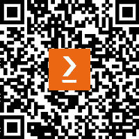

# 前言

在今天这个快节奏的数据驱动的世界里，人们容易被**人工智能**（**AI**）突破性进展和先进的**机器学习**（**ML**）模型所吸引。但问问任何经验丰富的数据科学家或工程师，他们都会告诉你同样的事情：*任何成功数据项目的真正基础不是炫目的算法或复杂的模型——而是数据本身， 更重要的是，如何准备这些数据*。

在我的职业生涯中，我学到数据预处理是数据科学中的默默无闻的英雄。它是一个细致且常常复杂的过程，将原始数据转化为可靠的资产，准备好进行分析、建模，最终用于决策。我亲眼见证了正确的预处理技术如何改变一个组织对数据的处理方式，将潜在的挑战转化为强大的机会。

然而，尽管数据预处理如此重要，它常常被忽视或低估。许多人将其视为一个繁琐的步骤，一个拖慢构建模型和提供洞察力的瓶颈。但我一直认为，这个阶段才是最关键的工作阶段。毕竟，即便是最复杂的算法也无法弥补数据质量差的不足。这就是为什么我将自己大部分的职业生涯都奉献给了掌握这一艺术——探索最佳的工具、技术和策略，使得预处理更加高效、可扩展，并且与不断发展的 AI 领域保持一致。

本书旨在揭开数据预处理过程的神秘面纱，既提供传统方法的扎实基础，也展望了新兴技术的前景。我们将探讨如何利用 Python 更有效地清理、转换和组织数据。我们还将关注**大语言模型**（**LLMs**）的出现，如何重新定义这个领域的可能性。这些模型已经证明是改变游戏规则的工具，自动化了曾经需要手工完成且耗时的任务，并提供了提升数据质量和可用性的新方法。

在本书的过程中，我将分享我的经验、遇到的挑战和一路上学到的教训。我希望不仅能为你提供一个技术性的路线图，还能让你更深入理解数据预处理在当今数据生态系统中的战略重要性。我坚信“通过实践学习”的理念，因此本书包含了大量的代码示例，供你跟随学习。我鼓励你尝试这些示例，实验代码，并挑战自己将这些技术应用到你自己的数据集中。

在本书的结尾，你将具备足够的知识和技能，不仅将数据预处理视为一个必要步骤，而是将其视为你整体数据策略中的一个关键组成部分。

所以，无论你是数据科学家、工程师、分析师，还是仅仅希望提升数据处理理解的人，我邀请你与我一起踏上这段旅程。我们将共同探索如何利用数据预处理的力量，释放数据的全部潜力。

# 本书适用对象

本书适合具有 Python 基础知识、较好掌握统计概念，并有一定数据操作经验的读者。本书不会从零开始，而是建立在现有技能的基础上，向你介绍复杂的预处理策略、实践代码示例和实际练习，要求读者对数据科学和分析的核心原理有一定的熟悉程度。

# 本书内容

*第一章*，*数据摄取技术*，提供了关于数据摄取过程的全面概述，强调了它在从各种来源收集和导入数据到存储系统进行分析中的作用。你将探索不同的摄取方法，如批量模式和流模式，比较实时和半实时数据摄取，并了解数据源背后的技术。本章突出了这些方法的优缺点及其实际应用。

*第二章*，*数据质量的重要性*，强调了数据质量在商业决策中的关键作用。它突出了使用不准确、不一致或过时数据的风险，这可能导致错误的决策、损害声誉和错失机会。你将了解为什么数据质量至关重要，如何在不同维度上衡量数据质量，以及数据孤岛对维持数据质量的影响。

*第三章*，*数据剖析——理解数据结构、质量和分布*，探索了数据剖析，重点审视和验证数据集，以理解其结构、模式和质量。你将学习如何使用工具如 pandas Profiler 和 Great Expectations 进行数据剖析，并了解何时使用每个工具。此外，本章还涉及了处理大量数据的方法，并比较了不同的剖析方法，以提高数据验证的效果。

*第四章*，*清理混乱的数据和数据操作*，重点介绍了清理和操作数据的关键策略，帮助实现高效准确的分析。内容包括重命名列、删除无关或冗余数据、修正不一致的数据类型和处理日期时间格式等技术。掌握这些方法后，你将学会如何提升数据集的质量和可靠性。

*第五章*，*数据转换* *–* *合并与连接*，探索了通过合并、连接和拼接数据集来转换和操作数据的技术。它涵盖了从多个来源合并数据集、有效处理重复数据并提高合并性能的方法。本章还提供了一些实用技巧，以简化合并过程，确保数据高效集成，便于洞察分析。

*第六章*，*数据分组、聚合、过滤与应用函数*，涵盖了数据分组和聚合的基本技术，这对于总结大数据集并生成有意义的洞察至关重要。本章讨论了通过聚合值、减少数据量和提高处理效率来处理缺失或噪声数据的方法。它还重点讲解了如何通过不同的键对数据进行分组、应用聚合和自定义函数，以及过滤数据，以创建有价值的特征，供深入分析或机器学习使用。

*第七章*，*数据接收端*，聚焦于数据处理中的关键决策，特别是选择适合存储和处理需求的数据接收端。它深入探讨了四个基本要素：选择合适的数据接收端、选择正确的文件类型、优化分区策略，以及理解如何设计一个可扩展的在线零售数据平台。本章为你提供了提高数据处理管道效率、可扩展性和性能的工具。

*第八章*，*检测与处理缺失值与异常值*，深入探讨了识别和处理缺失值及异常值的技术。它介绍了从统计方法到先进的机器学习模型的多种方法，以有效解决这些问题。本章的重点领域包括检测和处理缺失数据、识别单变量和多变量异常值，以及管理各种数据集中的异常值。

*第九章*，*归一化与标准化*，涵盖了诸如特征缩放、归一化和标准化等关键预处理技术，这些技术确保机器学习模型能够有效地从数据中学习。你将探索包括将特征缩放到某个范围、Z-score 缩放和使用鲁棒缩放器等不同技术，以应对机器学习任务中的各种数据挑战。

*第十章*，*处理类别特征*，讲解了管理类别特征的重要性，类别特征代表数据集中的非数值信息。你将学习多种编码技术，包括标签编码、一热编码、目标编码、频率编码和二进制编码，以将类别数据转化为机器学习模型可以使用的格式。

*第十一章*，*时间序列数据分析*，深入探讨了时间序列分析的基础知识，涵盖了各行业中的关键概念、方法论和应用。内容包括理解时间序列数据的组成部分和类型，识别和处理缺失值，以及分析趋势和模式的技术。本章还讲解了如何处理异常值和特征工程，以提高时间序列数据预测建模的效果。

*第十二章*，*LLM 时代的文本预处理*，重点介绍了掌握文本预处理技术，这些技术对于优化 LLMs（大语言模型）的性能至关重要。它涵盖了清洗文本、处理稀有词汇和拼写变化、分块以及分词策略的方法。此外，它还讨论了将词元转换为嵌入向量的过程，强调了调整预处理方法以最大化 LLMs 潜力的重要性。

*第十三章*，*使用 LLMs 进行图像和音频预处理*，探讨了针对非结构化数据，特别是图像和音频的预处理技术，以提取有意义的信息。它包括图像预处理方法，如 **光学字符识别**（**OCR**）和使用 BLIP 模型生成图像描述。本章还探讨了音频数据处理，包括使用 Whisper 模型将音频转换为文本，全面介绍了在 LLMs 背景下处理多媒体数据的相关内容。

# 为了最大限度地发挥本书的效用

为了充分利用本书的内容，你应该具备良好的 Python 基础，并掌握数据工程和数据科学的基本知识。

| **本书涉及的软件/硬件** | **操作系统要求** |
| --- | --- |
| Python 3 | Windows、macOS 或 Linux |
| Visual Studio Code（或你首选的 IDE） |  |

**如果你使用的是本书的电子版，我们建议你自己输入代码，或者通过书中的 GitHub 仓库访问代码（链接会在下一个章节提供）。这样可以避免复制和粘贴代码时可能出现的错误。**

GitHub 仓库遵循本书的章节结构，所有脚本按照每个章节中的部分进行编号。每个脚本是独立的，因此你可以无需事先运行所有脚本就继续往前进行。然而，强烈建议按照书中的流程进行操作，以确保你不会遗漏任何必要的信息。

# 下载示例代码文件

你可以从 GitHub 上下载本书的示例代码文件，链接为 [`github.com/PacktPublishing/Python-Data-Cleaning-and-Preparation-Best-Practices`](https://github.com/PacktPublishing/Python-Data-Cleaning-and-Preparation-Best-Practices)。如果代码有更新，GitHub 仓库会同步更新。

我们的丰富图书和视频目录中还有其他代码包，您可以访问[`github.com/PacktPublishing/`](https://github.com/PacktPublishing/)查看。

# 使用的约定

本书中使用了多种文本约定。

`文本中的代码`：表示文本中的代码字、数据库表名、文件夹名称、文件名、文件扩展名、路径名、虚拟 URL、用户输入和 Twitter 用户名。示例：“delete_entry() 函数用于删除条目，展示了如何从存储中删除数据”

代码块设置如下：

```py
def process_in_batches(data, batch_size): 
    for i in range(0, len(data), batch_size): 
        yield data[i:i + batch_size]
```

当我们希望您注意代码块中的某个特定部分时，相关的行或项目会使用粗体显示：

```py
user_satisfaction_scores = [random.randint(1, 5) for _ in range(num_users)]
```

任何命令行输入或输出如下所示：

```py
$ mkdir data
pip install pandas
```

**粗体**：表示新术语、重要单词或您在屏幕上看到的词。例如，菜单或对话框中的单词以**粗体**显示。示例：“它涉及将数据存储在远程服务器上，可以通过互联网从任何地方访问，而**不是在** **本地设备**上”

提示或重要注意事项

如此显示。

# 保持联系

我们始终欢迎读者的反馈。

**一般反馈**：如果您对本书的任何方面有疑问，请通过电子邮件联系我们：customercare@packtpub.com，并在邮件主题中注明书名。

**勘误**：尽管我们已尽力确保内容的准确性，但错误仍然会发生。如果您在本书中发现错误，我们将非常感激您向我们报告。请访问[www.packtpub.com/support/errata](http://www.packtpub.com/support/errata)并填写表单。

**盗版**：如果您在互联网上发现我们的作品的非法复制版本，我们将非常感激您提供该位置地址或网站名称。请通过版权@packt.com 与我们联系，并附上该材料的链接。

**如果您有兴趣成为作者**：如果您在某个领域有专业知识，并且有兴趣写书或为书籍做贡献，请访问[authors.packtpub.com](http://authors.packtpub.com)。

# 分享您的想法

一旦您阅读完《Python 数据清理与准备最佳实践》，我们很想听听您的想法！请[点击此处直接进入 Amazon 书评页面](https://packt.link/r/1-837-63474-2)并分享您的反馈。

您的书评对我们和技术社区都非常重要，将帮助我们确保提供优质内容。

# 下载本书的免费 PDF 版本

感谢您购买本书！

您是否喜欢在旅途中阅读，但又无法随身携带纸质书籍？

你的电子书购买是否与所选设备不兼容？

别担心，现在每本 Packt 书籍都会附带该书的 DRM-free PDF 版本，免费提供。

在任何地方、任何设备上阅读。搜索、复制并粘贴你最喜欢的技术书籍中的代码，直接应用到你的应用程序中。

优惠不仅仅如此，你还可以获得独家折扣、时事通讯和每天发送到你邮箱的精彩免费内容

按照这些简单的步骤即可享受福利：

1.  扫描二维码或访问下面的链接



[`packt.link/free-ebook/9781837634743`](https://packt.link/free-ebook/9781837634743)

2. 提交你的购买证明

3. 就是这样！我们会直接将免费的 PDF 和其他福利发送到你的邮箱

# 第一部分：上游数据摄取与清理

本部分聚焦于数据处理的基础阶段，从数据摄取开始，确保数据的质量和结构，以便于后续任务的处理。它指导读者完成导入、清理和转换数据的关键步骤，为有效的数据分析奠定基础。章节内容涵盖了多种数据摄取方法、如何保持高质量的数据集、如何进行数据剖析以获得更好的见解，并且如何清理杂乱数据以使其准备好进行分析。此外，还涉及了如合并、连接、分组和过滤数据等高级技术，同时介绍了如何选择合适的数据接收端或存储地，以优化处理管道。本部分的每个章节都为读者提供了处理原始数据、将其转化为干净、结构化且可用形式的知识。

本部分包含以下章节：

+   *第一章**，数据摄取技术*

+   *第二章**，数据质量的重要性*

+   *第三章**，数据剖析* *–* *理解数据结构、质量和分布*

+   *第四章**，清理杂乱数据与数据操作*

+   *第五章**，数据转换* *–* *合并与连接*

+   *第六章**，数据分组、聚合、过滤与应用函数*

+   *第七章**，数据接收端*
