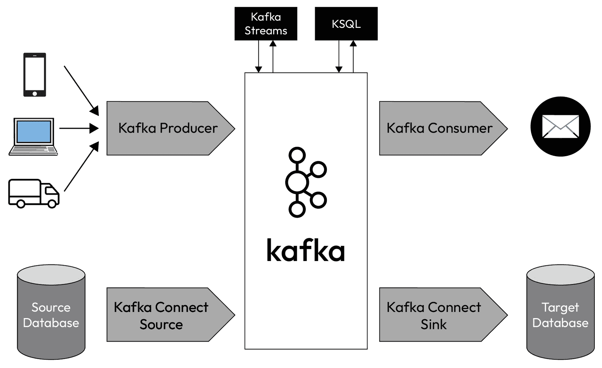

# 第一章：数据摄取技术

**数据摄取**是数据生命周期的一个关键组成部分，它为随后的数据转换和清理奠定了基础。它涉及从各种来源收集和导入数据到存储系统的过程，数据可以在此系统中访问和分析。有效的数据摄取对于确保数据的质量、完整性和可用性至关重要，这直接影响数据转换和清理过程的效率和准确性。在本章中，我们将深入探讨不同类型的数据源，探索各种数据摄取方法，并讨论它们各自的优缺点以及实际应用。

本章将涵盖以下主题：

+   批量模式的数据摄取

+   流式模式的数据摄取

+   实时摄取与半实时摄取

+   数据源技术

# 技术要求

你可以在以下 GitHub 仓库中找到本章的所有代码：

[`github.com/PacktPublishing/Python-Data-Cleaning-and-Preparation-Best-Practices/tree/main/chapter01`](https://github.com/PacktPublishing/Python-Data-Cleaning-and-Preparation-Best-Practices/tree/main/chapter01)

你可以使用你喜欢的 IDE（VS Code、PyCharm、Google Colab 等）来编写和执行代码。

# 批量模式的数据摄取

**批量摄取**是一种数据处理技术，其中大量数据在预定的时间间隔内收集、处理并加载到系统中，而不是实时进行。通过将数据分成批次处理，组织可以高效地处理大量数据。例如，一家公司可能会在一天内收集客户交易数据，然后在非高峰时段将其作为一个批次处理。这种方法对于需要处理大量数据但不要求即时分析的组织特别有用。

批量摄取有益于优化系统资源，通过将处理负载分配到计划好的时间，通常是在系统空闲时进行。这减少了计算资源的压力，并且可以降低成本，尤其是在基于云的环境中，计算能力是按使用量计费的。此外，批处理简化了数据管理，因为它允许对大规模数据集应用一致的转换和验证。对于数据流规律可预测的组织，批量摄取提供了一种可靠、可扩展且具有成本效益的数据处理和分析解决方案。

让我们更详细地探讨批量摄取，从其优点和缺点开始。

## 优势与劣势

批量摄取提供了几个显著的优势，使其成为许多数据处理需求的有吸引力的选择：

+   **效率**是一个关键优势，因为批处理允许在一次操作中处理大量数据，优化了资源使用并最小化了开销。

+   **成本效益**是另一个好处，减少了对连续处理资源的需求，降低了运营成本。

+   **简单性**使得相对于实时摄取，更容易管理和实现周期性数据处理任务，后者通常需要更复杂的基础设施和管理。

+   **鲁棒性**，因为批处理非常适合进行复杂的数据转换和全面的数据验证，确保高质量、可靠的数据。

然而，批处理摄取也带来一些缺点：

+   数据生成和可用性之间存在固有的延迟，对于需要实时洞察力的应用程序来说，这可能是一个关键问题。

+   批处理窗口期间可能会出现资源峰值，导致高资源使用率和潜在的性能瓶颈。

+   可伸缩性也可能是一个问题，处理非常大的数据集可能需要大量的基础设施投资和管理。

+   最后，维护是批处理摄取的一个关键方面；它需要仔细的调度和持续的维护，以确保批处理作业的及时可靠执行。

让我们来看看批处理模式中数据摄取的一些常见用例。

## 批处理摄取的常见用例

任何数据分析平台，如数据仓库或数据湖，都需要定期更新的数据用于**商业智能**（**BI**）和报告。批处理摄取至关重要，因为它确保数据始终使用最新信息进行更新，使企业能够进行全面和最新的分析。通过批处理处理数据，组织可以高效处理大量的交易和运营数据，将其转换为适合查询和报告的结构化格式。这支持 BI 倡议，允许分析师和决策者生成深刻见解的报告，跟踪**关键绩效指标**（**KPIs**），并做出数据驱动的决策。

**提取、转换和加载**（**ETL**）过程是数据集成项目的基石，批量摄取在这些工作流程中起着关键作用。在 ETL 过程中，数据从各种来源提取，经过转换以适应目标系统的操作需求，然后加载到数据库或数据仓库中。批处理允许有效处理这些步骤，特别是在处理需要大量转换和清洗的大型数据集时。这种方法非常适合周期性数据整合，将来自不同系统的数据集成为统一视图，支持数据迁移、系统集成和主数据管理等活动。

批量数据导入在备份和归档中也得到了广泛应用，这些过程对于数据的保存和灾难恢复至关重要。定期的批处理允许按计划备份数据库，确保所有数据都能在定期间隔内被捕获并安全存储。这种方法最大限度地减少了数据丢失的风险，并在系统故障或数据损坏时提供可靠的恢复点。此外，批处理还用于数据归档，将历史数据定期从活动系统转移到长期存储解决方案中。这不仅有助于管理存储成本，还能确保重要数据被保留并可供合规、审计或历史分析使用。

## 批量数据导入的使用案例

批量数据导入是一个系统化的过程，涉及多个关键步骤：数据提取、数据转换、数据加载、调度和自动化。为了说明这些步骤，让我们以一个投资银行为例，探讨它如何处理和分析交易数据以确保合规性和生成绩效报告。

### 投资银行的批量数据导入

投资银行需要从多个金融市场收集、转换并加载交易数据到一个中央数据仓库。这些数据将用于生成每日合规报告、评估交易策略以及做出明智的投资决策。

### 数据提取

第一步是识别数据提取的来源。对于投资银行来说，这包括交易系统、市场数据提供商和内部风险管理系统。这些来源包含关键数据，如交易执行细节、市场价格和风险评估。一旦确定了来源，数据就会通过连接器或脚本进行收集。这涉及建立数据管道，从交易系统提取数据，导入实时市场数据流，并从内部系统提取风险指标。提取的数据将暂时存储在暂存区，待处理。

### 数据转换

提取的数据通常包含不一致、重复和缺失值。数据清洗会移除重复项、填补缺失信息并纠正错误。对于投资银行来说，这确保了交易记录的准确性和完整性，为合规报告和绩效分析提供了可靠的基础。清洗后，数据会进行如聚合、连接和计算等转换。例如，投资银行可能会聚合交易数据以计算每日交易量，连接交易记录与市场数据以分析价格波动，并计算关键指标如**盈亏**（**P&L**）和风险暴露。转换后的数据必须映射到目标系统的模式中。这涉及将数据字段与数据仓库的结构对齐。例如，交易数据可能会映射到代表交易、市场数据和风险指标的表中，确保与现有数据模型的无缝集成。

### 数据加载

转换后的数据以批处理方式进行处理，这使得投资银行能够高效地处理大量数据，在一次运行中执行复杂的转换和聚合。一旦处理完成，数据会被加载到目标存储系统中，如数据仓库或数据湖。对于投资银行来说，这意味着将清洗和转换后的交易数据加载到他们的数据仓库中，从而可以用于合规报告和绩效分析。

### 调度与自动化

为了确保批量摄取过程顺利且一致地运行，通常会使用调度工具，如 Apache Airflow 或 Cron 作业。这些工具自动化数据摄取工作流，并安排在固定的时间间隔运行，例如每晚或每天一次。这使得投资银行能够在没有人工干预的情况下获得最新的数据以供分析。实施监控至关重要，用于跟踪批处理作业的成功与性能。监控工具提供作业执行的洞察，帮助识别任何失败或性能瓶颈。对于投资银行来说，这确保了数据摄取过程中出现的任何问题都能及时被发现并解决，从而维护数据管道的完整性和可靠性。

## 带示例的批量摄取

让我们来看一个用 Python 编写的简单批处理摄取系统示例。这个示例将模拟 ETL 过程。我们将生成一些模拟数据，按批处理方式处理它，并将其加载到模拟数据库中。

你可以在 GitHub 仓库的[`github.com/PacktPublishing/Python-Data-Cleaning-and-Preparation-Best-Practices/blob/main/chapter01/1.batch.py`](https://github.com/PacktPublishing/Python-Data-Cleaning-and-Preparation-Best-Practices/blob/main/chapter01/1.batch.py)中找到这部分代码。要运行这个示例，我们不需要安装任何特别的库，只需要确保在标准的 Python 环境（Python 3.x）中运行即可。

1.  我们创建一个`generate_mock_data`函数，用于生成模拟数据记录的列表：

    ```py
    def generate_mock_data(num_records):
        data = []
        for _ in range(num_records):
            record = {
                'id': random.randint(1, 1000),
                'value': random.random() * 100
            }
            data.append(record)
    return data
     A list of dictionaries is returned, each representing a data record.
    ```

1.  接下来，我们创建一个批处理函数：

    ```py
    def process_in_batches(data, batch_size):
        for i in range(0, len(data), batch_size):
            yield data[i:i + batch_size]
    ```

    该函数将数据（数据记录的列表）和`batch_size`（每个批次的记录数）作为参数。该函数使用`for`循环以`batch_size`为步长遍历数据。使用`yield`关键字生成每个大小为`batch_size`的数据批次，返回一个生成器来产生数据批次。

1.  我们创建一个`transform_data`函数，用于转换批次中的每一条记录：

    ```py
    def transform_data(batch):
        transformed_batch = []
        for record in batch:
            transformed_record = {
                'id': record['id'],
                'value': record['value'],
                'transformed_value': record['value'] * 1.1
            }
            transformed_batch.append(transformed_record)
    return transformed_batch
    ```

    该函数的参数是批次，它是一个需要转换的数据记录列表。转换逻辑很简单：每个记录中添加一个新的`transformed_value`字段，它是原始值乘以 1.1。最后，我们得到了一个转换后的记录列表。让我们看看一些转换后的记录：

    ```py
    {'id': 558, 'value': 12.15160339587219, 'transformed_value': 13.36676373545941}
    {'id': 449, 'value': 99.79699336555473, 'transformed_value': 109.77669270211021}
    {'id': 991, 'value': 79.65999078145887, 'transformed_value': 87.62598985960477}
    ```

1.  接下来，我们创建一个`load_data`函数来加载数据。这个函数模拟将每个转换后的记录加载到数据库中的过程：

    ```py
    def load_data(batch):
        for record in batch:
            # Simulate loading data into a database
            print(f"Loading record into database: {record}")
    ```

    该函数以批次作为参数，批次是一个准备加载的转换后的数据记录列表。每条记录都会打印到控制台，以模拟将其加载到数据库中。

1.  最后，我们创建一个`main`函数。这个函数调用了所有前面提到的函数：

    ```py
    def main():
        # Parameters
        num_records = 100 # Total number of records to generate
        batch_size = 10 # Number of records per batch
        # Generate data
        data = generate_mock_data(num_records)
        # Process and load data in batches
        for batch in process_in_batches(data, batch_size):
            transformed_batch = transform_data(batch)
            print("Batch before loading:")
            for record in transformed_batch:
                print(record)
            load_data(transformed_batch)
            time.sleep(1) # Simulate time delay between batches
    ```

    这个函数调用`generate_mock_data`来生成模拟数据，并使用`process_in_batches`将数据分成批次。对于每个批次，函数执行以下操作：

    +   使用`transform_data`转换批次

    +   打印批处理，以显示加载前的内容

    +   使用`load_data`模拟加载批次

现在，让我们从批处理转向流式处理模式。在流式处理中，数据在到达时被处理，而不是在预定义的批次中处理。

# 以流式模式摄取数据

**流式摄取**是一种数据处理技术，通过该技术，数据在生成时实时收集、处理并加载到系统中。与批处理摄取不同，批处理摄取是在预定的时间间隔内积累数据进行处理，流式摄取则是持续处理数据，允许组织立即分析和采取行动。例如，一家公司可以在客户交易发生时就处理交易数据，从而实现实时的洞察和决策。这种方法对于那些需要实时数据分析的组织尤其有用，比如金融交易、欺诈检测或传感器数据监控等领域。

流数据摄取具有优势，因为它可以实现数据的即时处理，减少延迟并使组织能够快速响应变化的环境条件。这在及时响应至关重要的场景中尤其有益，比如检测异常、个性化用户体验或应对实时事件。此外，流式处理可以通过将处理负载均匀地分布在时间上，而不是集中在特定的批处理窗口内，从而提高资源利用效率。在基于云的环境中，这也可以转化为成本节约，因为可以动态扩展资源以匹配实时数据流。对于数据流不规则或不可预测的组织，流数据摄取提供了一种灵活、响应迅速且可扩展的数据处理和分析方法。让我们来看一下它的一些优点和缺点。

## 优势与劣势

流数据摄取具有几个明显的优势，使其成为某些数据处理需求的必要选择：

+   其中一个主要的好处是能够从数据中获取实时洞察。这种即时性对于诸如欺诈检测、实时分析和动态定价等应用至关重要，其中及时的数据是至关重要的。

+   流数据摄取支持连续的数据处理，使系统能够在数据到达时进行处理，从而减少延迟并提高响应能力。

+   这种方法具有高度可扩展性，能够有效管理来自多个来源的高速数据流而不会产生显著延迟。

然而，流数据摄取也面临一些挑战：

+   实施流数据摄取系统可能是*复杂的*，需要精密的基础设施和专门的工具来有效管理数据流。

+   持续处理需要不断的计算资源，这可能是昂贵且资源密集型的。

+   在流式环境中确保数据一致性和准确性可能很困难，因为数据不断涌入，并且可能会出现乱序或重复记录。

让我们来看一下批量模式下数据摄取的常见应用场景。

## 流数据摄取的常见应用场景

虽然批量处理非常适合周期性的大规模数据更新和转换，但流数据摄取对实时数据分析和需要即时洞察的应用至关重要。以下是流数据摄取的常见应用场景。

### 实时欺诈检测和安全监控

金融机构使用流数据来实时检测欺诈活动，分析交易数据。即时异常检测帮助在欺诈造成重大损失之前予以阻止。流数据还用于网络安全领域，以便立即检测和应对威胁。对网络流量、用户行为和系统日志的持续监控有助于在发生安全漏洞时进行识别和缓解。

### 物联网和传感器数据

在制造业中，来自机器设备传感器的流式数据可以实现预测性维护。通过持续监控设备健康状况，公司能够防止设备故障并优化维护计划。

物联网和传感器领域的另一个有趣应用是**智慧城市**。来自城市中各种传感器（如交通、天气、污染等）的流式数据有助于实时管理城市运营，改善交通管理、应急响应等服务。

### 在线推荐与个性化

流式数据使电子商务平台能够根据用户当前的浏览和购买行为，向用户提供实时推荐。这提升了用户体验，并增加了销售额。像 Netflix 和 Spotify 这样的平台利用流式数据在用户与服务互动时更新推荐，实时提供个性化内容建议。

### 金融市场数据

股票交易员依赖流式数据获取关于股价和市场状况的最新信息，从而做出明智的交易决策。自动化交易系统利用流式数据根据预设标准执行交易，这需要实时数据处理以确保最佳性能。

### 电信

电信公司使用流式数据实时监控网络性能和使用情况，确保服务质量最佳并能迅速解决问题。流式数据还帮助跟踪客户互动和服务使用情况，实现个性化客户支持，提升整体体验。

### 实时物流与供应链管理

来自 GPS 设备的流式数据使物流公司能够实时追踪车辆位置并优化路线，提高交付效率。实时库存跟踪帮助企业维持最佳库存水平，减少过度库存和缺货现象，同时确保及时补货。

## 电子商务平台中的流式数据摄取

流式数据摄取是一个有序的过程，涉及多个关键步骤：数据提取、数据转换、数据加载以及监控与告警。为了说明这些步骤，让我们探讨一个电子商务平台的用例，该平台需要实时处理和分析用户活动数据，以实现个性化推荐和动态库存管理。

一个电子商务平台需要收集、转换并加载来自各种来源的用户活动数据，如网站点击、搜索查询和购买交易，将其导入到中央系统中。这些数据将用于生成实时个性化推荐、监控用户行为，并动态管理库存。

### 数据提取

第一步是识别数据将从哪些来源提取。对于电子商务平台，这些来源包括 Web 服务器、移动应用程序和第三方分析服务。这些来源包含关键信息，如用户点击、搜索查询和交易详情。一旦确定了数据来源，就可以使用流式连接器或 API 进行数据采集。这涉及到设置数据管道，从 Web 服务器、移动应用程序和分析服务中实时提取数据。提取的数据随后会流式传输到如 Apache Kafka 或 AWS Kinesis 等处理系统。

### 数据转换

提取的数据通常包含不一致和噪音。实时数据清洗会过滤掉不相关的信息，处理缺失值并纠正错误。对于电子商务平台来说，这确保了用户活动记录的准确性，并且对分析有意义。清洗之后，数据会进行诸如解析、丰富和聚合等转换。例如，电子商务平台可能会解析用户点击流数据，以识别浏览模式，用产品详情丰富交易数据，并聚合搜索查询以识别流行的产品。转换后的数据必须映射到目标系统的架构中。这涉及到将数据字段与实时分析系统的结构对齐。例如，用户活动数据可能会映射到表示会话、产品和用户档案的表格中，确保与现有数据模型的无缝集成。

### 数据加载

转换后的数据通过 Apache Flink 或 Apache Spark Streaming 等工具持续处理。持续处理使电子商务平台能够高效地处理高速数据流，实时执行转换和聚合。一旦处理完成，数据会被加载到目标存储系统中，如实时数据库或分析引擎，在那里可以进行个性化推荐和动态库存管理。

### 监控与告警

为确保流式数据摄取过程顺利且一致地运行，使用 Prometheus 或 Grafana 等监控工具。这些工具提供有关数据摄取管道性能和健康状况的实时洞察，能够识别任何故障或性能瓶颈。实现告警机制至关重要，以便及时发现并解决流式数据摄取过程中的问题。对于电子商务平台来说，这确保了数据流中断能迅速得到解决，从而保持数据管道的完整性和可靠性。

## 流式数据摄取示例

如我们所说，在流式处理中，数据是随着到达而被处理，而不是按照预定义的批次进行处理。让我们修改批处理示例，转向流式处理范式。为了简化起见，我们将持续生成数据，数据一到达就立即处理，进行转换，然后加载：

1.  `generate_mock_data` 函数使用生成器*持续*生成记录，并模拟每条记录之间的延迟：

    ```py
    def generate_mock_data():
        while True:
            record = {
                'id': random.randint(1, 1000),
                'value': random.random() * 100
            }
            yield record
            time.sleep(0.5)  # Simulate data arriving every 0.5 seconds
    ```

1.  `process_stream` 函数处理来自数据生成器的每条记录，而无需等待批次填充：

    ```py
    def process_stream(run_time_seconds=10):
        start_time = time.time()
        for record in generate_mock_data():
            transformed_record = transform_data(record)
            load_data(transformed_record)
            # Check if the run time has exceeded the limit
            if time.time() – start_time > run_time_seconds:
                print("Time limit reached. Terminating the stream processing.")
                break
    ```

1.  `transform_data` 函数在每条记录到达时分别进行转换：

    ```py
    def transform_data(record):
        transformed_record = {
            'id': record['id'],
            'value': record['value'],
            'transformed_value': record['value'] * 1.1  # Example transformation
        }
        return transformed_record
    ```

1.  `load_data` 函数模拟通过处理每一条记录来加载数据，而不是像以前那样在批次中处理每一条记录：

    ```py
    def load_data(record):
        print(f"Loading record into database: {record}")
    ```

让我们从实时处理转向半实时处理，可以将其视为在短时间间隔内的批处理。这通常称为微批处理。

# 实时与半实时数据摄取

实时数据摄取是指几乎即时地收集、处理和加载数据的过程，正如我们所讨论的那样。这种方法对于需要立即洞察和行动的应用程序至关重要，例如欺诈检测、股票交易和实时监控系统。实时数据摄取提供了*最低延迟*，使企业能够在事件发生时立即做出反应。*然而，它需要强大的基础设施和持续的资源分配，这使得其维护复杂且可能昂贵*。

半实时数据摄取，另一方面，也称为接近实时数据摄取，涉及在*最小延迟*下处理数据，通常是几秒钟或几分钟，而不是即时处理。这种方法*在实时和批处理之间达成平衡*，提供及时的洞察，同时减少了与真正的实时系统相关的资源强度和复杂性。半实时数据摄取适用于社交媒体监控、客户反馈分析和运营仪表板等应用，其中接近即时的数据处理是有益的，但并非至关重要的时间敏感。

## 接近实时摄取的常见用例

让我们来看一些常见的用例，其中可以使用接近实时的数据摄取。

### 实时分析

流式处理使组织能够持续监控数据流动，允许实时仪表板和可视化。这在金融行业尤为重要，因为股票价格、市场趋势和交易活动需要实时跟踪。它还允许即时生成报告，促进及时决策，并减少数据生成与分析之间的延迟。

### 社交媒体和情感分析

企业实时跟踪社交媒体上的提及和情感，以管理品牌声誉并迅速回应客户反馈。流式数据使得可以持续分析公众对品牌、产品或事件的情感，提供即时洞察，这些洞察可能影响营销和公关策略。

### 客户体验提升

近实时处理使支持团队能够访问客户问题和行为的最新信息，从而更快更准确地回应客户询问。企业还可以利用近实时数据更新客户档案，并在客户与网站或应用程序互动后不久触发个性化的营销信息，如电子邮件或通知。

## 带有示例的半实时模式

从实时数据处理过渡到半实时数据处理涉及调整示例，引入更结构化的方式来处理数据更新，而不是在每条记录到达时立即处理。可以通过在短时间间隔内批量处理数据更新来实现，这样可以更高效地处理数据，同时保持响应式的数据处理管道。让我们看看这个示例，和往常一样，您可以在 GitHub 仓库中找到代码 [`github.com/PacktPublishing/Python-Data-Cleaning-and-Preparation-Best-Practices/blob/main/chapter01/3.semi_real_time.py`](https://github.com/PacktPublishing/Python-Data-Cleaning-and-Preparation-Best-Practices/blob/main/chapter01/3.semi_real_time.py)：

1.  连续生成模拟数据，与之前的示例没有变化。这个过程会持续生成模拟数据记录，并有轻微的延迟（`time.sleep(0.1)`）。

1.  对于半实时处理，我们可以使用一个双端队列（deque）来缓存传入的记录。这个功能会在指定的时间间隔过去，或者缓冲区达到指定大小（`batch_size`）时处理记录。然后，它将双端队列转换为列表（`list(buffer)`），再传递给 `transform_data`，确保数据是以批处理的方式进行处理：

    ```py
    def process_semi_real_time(batch_size, interval):
        buffer = deque()
        start_time = time.time()
        for record in generate_mock_data():
            buffer.append(record)
    ```

1.  检查间隔是否已过，或缓冲区大小是否已达到：

    ```py
            if (time.time() - start_time) >= interval or len(buffer) >= batch_size:
    ```

1.  处理并清理缓冲区：

    ```py
                transformed_batch = transform_data(list(buffer))  # Convert deque to list
                print(f"Batch of {len(transformed_batch)} records before loading:")
                for rec in transformed_batch:
                    print(rec)
                load_data(transformed_batch)
                buffer.clear()
                start_time = time.time()  # Reset start time
    ```

1.  然后，我们转换批次中的每一条记录。与之前的示例没有变化，我们加载数据。

当您运行此代码时，它会持续生成模拟数据记录。记录会被缓冲，直到指定的时间间隔（`interval`）过去，或者缓冲区达到指定的大小（`batch_size`）。一旦条件满足，缓冲的记录将作为一个批次进行处理、转换，然后“加载”（打印）到模拟数据库中。

在讨论适合批处理、流式处理或半实时流处理的不同类型数据源时，必须考虑这些数据源的多样性和特性。数据可以来自多种来源，例如数据库、日志、物联网设备、社交媒体或传感器，正如我们将在下一部分看到的那样。

# 数据源解决方案

在现代数据分析和处理的世界中，可供摄取的数据源种类繁多，涵盖了从传统文件格式（如 CSV、JSON 和 XML）到强大的数据库系统（包括 SQL 和 NoSQL 系统）的广泛范围。此外，还包括动态 API（如 REST），以便实时获取数据。像 Kafka 这样的消息队列提供了可扩展的解决方案来处理事件驱动的数据，而 Kinesis 和 pub/sub 等流媒体服务则支持连续的数据流，这对于要求即时洞察的应用至关重要。理解并有效利用这些多样化的数据摄取来源，是构建支持广泛分析和操作需求的强大数据管道的基础。

让我们从事件处理开始。

## 事件数据处理解决方案

在实时处理系统中，数据几乎是即时摄取、处理并响应的，正如我们之前讨论过的。实时处理系统通常使用消息队列来处理传入的数据流，并确保数据按接收顺序处理，不会产生延迟。

以下 Python 代码展示了使用消息队列处理消息的基本示例，这是实时和半实时数据处理系统中的基础概念。Python `queue` 模块中的 `Queue` 类用于创建队列——一个遵循先进先出（FIFO）原则的数据结构。在队列中，消息（例如`message 0`、`message 1` 等）会按照顺序被添加。这模拟了事件或任务的生成，需要按到达的顺序进行处理。我们来看看代码的每个部分。你可以在 [`github.com/PacktPublishing/Python-Data-Cleaning-and-Preparation-Best-Practices/blob/main/chapter01/4.work_with_queue.py`](https://github.com/PacktPublishing/Python-Data-Cleaning-and-Preparation-Best-Practices/blob/main/chapter01/4.work_with_queue.py) 找到完整代码文件：

1.  `read_message_queue()` 函数使用来自 `queue` 模块的 `Queue` 类初始化一个队列对象 `q`：

    ```py
    def read_message_queue():
        q = Queue()
    ```

1.  这个循环将 10 条消息添加到队列中。每条消息是一个格式为 `message i` 的字符串，其中 `i` 从 0 到 9 不等：

    ```py
    for i in range(10): # Mocking messages
        q.put(f"message {i}")
    ```

1.  这个循环会持续从队列中获取并处理消息，直到队列为空。`q.get()` 从队列中获取消息，`q.task_done()` 表示已处理完获取的消息：

    ```py
    while not q.empty():
        message = q.get()
        process_message(message)
        q.task_done() # Signal that the task is done
    ```

1.  以下函数接收一个消息作为输入，并将其打印到控制台，模拟消息的处理：

    ```py
    def process_message(message):
        print(f"Processing message: {message}")
    ```

1.  调用 `read_message_queue` 函数：

    ```py
    read_message_queue()
    ```

在这里，`read_message_queue` 函数从队列中读取消息，并使用 `process_message` 函数逐一处理这些消息。这演示了基于事件的系统如何处理任务——通过将它们放入队列并在任务变得可用时进行处理。

`while not q.empty()` 循环确保每条消息都按照加入队列的顺序被处理。这在许多现实世界的应用中至关重要，例如处理用户请求或日志时，处理顺序非常重要。

`q.task_done()` 方法表示消息已被处理。在现实世界的系统中，这一点非常重要，因为跟踪任务完成情况对于确保系统的可靠性和正确性至关重要，尤其是在有多个工作线程或线程的系统中。

在现实世界的应用中，消息队列通常会与更复杂的数据流平台集成，以确保可扩展性、容错性和高可用性。例如，在实时数据处理中，像 Kafka 和 AWS Kinesis 这样的平台就发挥了作用。

## 使用 Apache Kafka 摄取事件数据

有多种技术可用于摄取和处理事件数据。我们将讨论的一种技术是 Apache Kafka。Kafka 是一个开源的分布式事件流平台，最初由 LinkedIn 开发，后来捐赠给了 Apache 软件基金会。它被设计用来实时处理大量数据，并提供一个可扩展、容错的系统，用于处理和存储数据流。



图 1.1 – Apache Kafka 的组件

让我们来看一下 Apache Kafka 的不同组件：

+   **摄取**:*：可以使用 Kafka 生产者将数据流摄取到 Kafka 中。生产者是将数据写入 Kafka 主题的应用程序，Kafka 主题是可以存储和组织数据流的逻辑通道。

+   **处理**：Kafka 可以使用 Kafka Streams 处理数据流，Kafka Streams 是一个用于构建实时流处理应用程序的客户端库。Kafka Streams 允许开发人员构建自定义的流处理应用程序，可以对数据流进行转换、聚合和其他操作。

+   **存储**:*：Kafka 将数据流存储在分布式的、容错的集群中，这些集群被称为 Kafka 经纪人（brokers）。经纪人将数据流存储在分区中，这些分区在多个经纪人之间进行复制，以确保容错性。

+   **消费**:*：可以使用 Kafka 消费者从 Kafka 获取数据流。消费者是从 Kafka 主题读取数据并根据需要处理数据的应用程序。

可以使用多个库与 Apache Kafka 进行交互；我们将在下一节中探讨其中最流行的几个。

### 应该使用哪个库来处理你的使用案例？

`Kafka-Python` 是 Kafka 协议的纯 Python 实现，提供了一个更加 Pythonic 的接口，用于与 Kafka 交互。它设计简洁、易于使用，尤其适合初学者。它的主要优点之一就是简便性，相比其他 Kafka 库，它更易于安装和使用。Kafka-Python 灵活且非常适合小型到中型应用，提供了进行基本 Kafka 操作所需的必要功能，而不涉及额外的复杂依赖。由于它是纯 Python 库，因此不依赖于任何超出 Python 本身的外部库，从而简化了安装和设置过程。

`Confluent-kafka-python` 是由 Confluent（Kafka 的原创开发者）开发并维护的一个库。它以高性能和低延迟能力而著称，利用 `librdkafka` C 库进行高效操作。该库提供了类似 Java Kafka 客户端的广泛配置选项，并与 Kafka 的功能集高度契合，常常率先支持 Kafka 的新特性。它特别适用于生产环境，在性能和稳定性至关重要的情况下，是处理高吞吐量数据流和确保关键应用中可靠消息处理的理想选择。

从事件数据处理转向数据库涉及将重点从实时数据流转移到持久数据存储和检索。事件数据处理强调处理连续的数据流，以便快速获得洞察或采取行动，而数据库则是结构化的存储库，旨在长期存储和管理数据。

## 从数据库中摄取数据

数据库，无论是关系型还是非关系型，都是数据管理系统的基础组成部分。经典数据库和 NoSQL 数据库是两种不同类型的数据库管理系统，它们在架构和特性上有所不同。经典数据库，也称为关系型数据库，将数据存储在具有固定模式的表格中。经典数据库非常适合需要复杂查询和事务一致性的应用，例如金融系统或企业应用。

另一方面，NoSQL 数据库不会将数据存储在具有固定模式的表格中。它们采用基于文档的方式，以灵活的模式格式存储数据。它们设计为可扩展并能处理大量数据，重点是高性能的数据检索。NoSQL 数据库非常适合需要高性能和可扩展性的应用，例如实时分析、内容管理系统和电子商务平台。

让我们从关系型数据库开始。

### 从关系型数据库执行数据摄取

关系数据库在批量 ETL 过程中非常有用，其中需要将来自各种源的结构化数据进行整合、转换并加载到数据仓库或分析系统中。在处理之前，基于 SQL 的操作可以有效地进行数据连接和聚合。让我们尝试了解 SQL 数据库如何使用表格、行和列来表示数据，使用代码示例。我们将使用 Python 字典来模拟基本的 SQL 数据库交互，以表示表格和行。您可以在[`github.com/PacktPublishing/Python-Data-Cleaning-and-Preparation-Best-Practices/blob/main/chapter01/5.sql_databases.py`](https://github.com/PacktPublishing/Python-Data-Cleaning-and-Preparation-Best-Practices/blob/main/chapter01/5.sql_databases.py)看到完整的代码示例：

1.  我们创建一个`read_sql`函数，模拟从 SQL 表格中读取行，这里表示为一个字典列表，其中每个字典对应表中的一行：

    ```py
    def read_sql():
    # Simulating a SQL table with a dictionary
        sql_table = [
            {"id": 1, "name": "Alice", "age": 30},
            {"id": 2, "name": "Bob", "age": 24},
        ]
        for row in sql_table:
            process_row(row)
    ```

1.  `process_row`函数将一个行（字典）作为输入，并打印其内容，模拟从 SQL 表格中处理行的过程：

    ```py
    def process_row(row):
        print(f"Processing row: id={row['id']}, name={row['name']}, age={row['age']}")
    read_sql()
    ```

1.  让我们以正确的格式打印我们的 SQL 表格：

    ```py
    print(f"{'id':<5} {'name':<10} {'age':<3}")
    print("-" * 20)
    # Print each row
    for row in sql_table:
        print(f"{row['id']:<5} {row['name']:<10} {row['age']:<3}")
    ```

    这将打印如下输出：

    ```py
    id   name     age
    ------------------
    1    Alice    30
    2    Bob      24
    ```

从前面的例子中学习的关键是理解 SQL 数据库通过由行和列组成的表来结构化和管理数据，以及如何通过编程方式高效检索和处理这些行。这些知识是至关重要的，因为它为任何应用程序中的有效数据库管理和数据操作奠定了基础。

在实际应用程序中，这种交互通常由像**Java 数据库连接**（**JDBC**）或**开放数据库连接**（**ODBC**）这样的库和驱动程序实现，它们提供了连接和查询数据库的标准方法。这些库通常被 Python 中的更高级别框架或库包装，使开发人员能够从各种 SQL 数据库中导入数据，而不必担心底层连接细节。可以使用多个库与 Python 交互 SQL 数据库；我们将在下一节探讨最流行的几个。

### 对于您的用例应该使用哪个库？

让我们探索 Python 中用于与 SQL 数据库交互的不同库，并理解何时使用每个库：

+   **SQLite** (sqlite3)非常适合小到中型应用程序、本地存储和原型设计。它的零配置、无服务器架构使其非常适合轻量级、嵌入式数据库需求和快速开发周期。在不需要完整数据库服务器开销的场景中特别有用。避免在需要高并发或大量写操作的应用程序中使用 sqlite3，或者多用户需要同时访问数据库的场景。它不适合大规模应用或需要强大安全功能和高级数据库功能的场景。

+   **SQLAlchemy** 适用于需要对原始 SQL 进行高度抽象、支持多种数据库引擎以及复杂查询和数据模型的应用程序。它非常适合需要灵活性、可扩展性，并且能够在不同数据库之间切换而无需做大量代码修改的大规模生产环境。避免在小型轻量级应用程序中使用 SQLAlchemy，因为它的全面 ORM 功能会带来不必要的开销。如果您需要直接、低级地访问特定数据库的功能，并且能够编写原始 SQL 查询，那么像 sqlite3、Psycopg2 或 MySQL Connector/Python 这样的简单数据库适配器可能会更合适。

+   **Psycopg2** 是与 PostgreSQL 数据库交互的首选工具，适用于需要利用 PostgreSQL 高级功能（如 ACID 合规性、复杂查询和丰富数据类型）的应用程序。它非常适合需要可靠性和效率来处理 PostgreSQL 数据库的生产环境。如果您的应用程序不与 PostgreSQL 交互，请避免使用 Psycopg2。如果您需要与多个数据库系统兼容或需要更高层次的抽象，请考虑使用 SQLAlchemy。另外，对于不需要完整 PostgreSQL 设置的轻量级应用程序，Psycopg2 可能不是最佳选择。

+   `mysql-connector-python`）非常适合需要与 MySQL 数据库直接交互的应用程序。它适用于需要兼容性并获得 Oracle 官方支持的环境，也适用于利用 MySQL 功能（如事务管理和连接池）的应用程序。如果您的应用程序需要与多个数据库系统兼容或需要更高层次的抽象，请不要使用 MySQL Connector/Python。对于那些不需要完整 MySQL 设置的简单应用程序，或者不特别需要 MySQL 功能的应用程序，可以考虑其他轻量级的替代方案。

在了解了与 SQL 数据库交互的各种库及其使用场景后，探索在传统关系型 SQL 数据库可能不太适用的情况下的替代方案同样重要。这引出了 NoSQL 数据库，它们提供了处理非结构化或半结构化数据的灵活性、可扩展性和性能。让我们深入研究与流行的 NoSQL 数据库进行交互的关键 Python 库，并探讨何时以及如何有效地使用它们。

### 从 NoSQL 数据库进行数据摄取

非关系型数据库可以用于存储和处理大量半结构化或非结构化数据的批量操作。它们在模式可以演变或需要以统一方式处理多种数据类型时尤其有效。NoSQL 数据库在流式处理和半实时工作负载中表现出色，因为它们能够处理高吞吐量和低延迟的数据摄取。它们通常用于捕获和处理来自 IoT 设备、日志、社交媒体动态以及其他生成连续数据流的来源的实时数据。

提供的 Python 代码模拟了一个使用字典的 NoSQL 数据库，并处理每个键值对。让我们来看看代码的每个部分：

1.  `process_entry`函数从数据存储中获取一个键及其关联的值，并打印出一条格式化的消息，展示该键值对的处理过程。它提供了一种简单的方法来查看或处理单个条目，突出显示如何基于键访问和操作数据：

    ```py
    def process_entry(key, value):
        print(f"Processing key: {key} with value: {value}")
    ```

1.  以下函数以表格格式打印整个`data_store`字典：

    ```py
    def print_data_store(data_store):
        print(f"{'Key':<5} {'Name':<10} {'Age':<3}")
        print("-" * 20)
        for key, value in data_store.items():
            print(f"{key:<5} {value['name']:<10} {value['age']:<3}")
    ```

    它首先打印`Key`、`Name`和`Age`的列标题，然后跟随一条分隔线以增加清晰度。接着，它遍历`data_store`字典中的所有键值对，打印每个条目的键、名称和年龄。这个函数有助于可视化当前数据存储的状态。数据的初始状态如下：

    ```py
    Initial Data Store:
    Key   Name      Age
    -----------------------
    1     Alice     30
    data_store dictionary:

    ```

    def create_entry(data_store, key, value):

    data_store[key] = value

    return data_store

    ```py

    It takes a key and a value, then inserts the value into `data_store` under the specified key. The updated `data_store` dictionary is then returned. This demonstrates the ability to add new data to the store, showcasing the creation aspect of `update_entry` function updates an existing entry in the `data_store` dictionary:

    ```

    def update_entry(data_store, key, new_value):

    if key in data_store:

    data_store[key] = new_value

    return data_store

    ```py

    It takes a key and `new_value`, and if the key exists in the `data_store` dictionary, it updates the corresponding value with `new_value`. The updated `data_store` dictionary is then returned. This illustrates how existing data can be modified, demonstrating the update aspect of CRUD operations.
    ```

1.  以下函数从`data_store`字典中移除一个条目：

    ```py
    def delete_entry(data_store, key):
        if key in data_store:
            del data_store[key]
        return data_store
    ```

    它接受一个键，如果该键在`data_store`字典中找到，则删除相应的条目。更新后的`data_store`字典会被返回。

1.  以下函数将所有过程整合在一起：

    ```py
    def read_nosql():
        data_store = {
            "1": {"name": "Alice", "age": 30},
            "2": {"name": "Bob", "age": 24},
        }
        print("Initial Data Store:")
        print_data_store(data_store)
        # Create: Adding a new entry
        new_key = "3"
        new_value = {"name": "Charlie", "age": 28}
        data_store = create_entry(data_store, new_key, new_value)
        # Read: Retrieving and processing an entry
        print("\nAfter Adding a New Entry:")
        process_entry(new_key, data_store[new_key])
        # Update: Modifying an existing entry
        update_key = "1"
        updated_value = {"name": "Alice", "age": 31}
        data_store = update_entry(data_store, update_key, updated_value)
        # Delete: Removing an entry
        delete_key = "2"
        data_store = delete_entry(data_store, delete_key)
        # Print the final state of the data store
        print("\nFinal Data Store:")
        print_data_store(data_store)
    ```

    这段代码演示了 NoSQL 数据库的核心原则，包括架构灵活性、键值对存储和基本的 CRUD 操作。它从 `read_nosql()` 函数开始，该函数使用字典 `data_store` 模拟了一个 NoSQL 数据库，其中每个键值对代表一个唯一的标识符和相关的用户信息。最初，`print_data_store()` 函数以表格格式显示数据，突出展示了 NoSQL 系统固有的架构灵活性。接着，代码演示了 CRUD 操作。首先，`create_entry()` 函数添加了一个新条目，展示了如何将新数据插入存储中。随后，`process_entry()` 函数检索并打印新添加条目的详细信息，展示了读取操作。接下来，`update_entry()` 函数修改了一个现有条目，展示了 NoSQL 数据库的更新能力。`delete_entry()` 函数则用于删除一个条目，展示了如何从存储中删除数据。最后，再次打印更新后的 `data_store` 字典，清晰地展示了数据在这些操作中的变化过程。

1.  让我们执行整个过程：

    ```py
    read_nosql()
    ```

    这将返回最终的数据存储：

    ```py
    Final Data Store:
    Key   Name      Age
    -----------------------
    1     Alice     31
    2     Charlie   28
    ```

在前面的示例中，我们演示了如何使用 Python 与一个*模拟*的 NoSQL 系统进行交互，以便展示 NoSQL 数据库的核心原则，例如架构灵活性、键值对存储和基本的 CRUD 操作。现在我们可以更好地理解 NoSQL 数据库在数据建模和高效处理非结构化或半结构化数据方面与传统 SQL 数据库的区别。

有多个库可以用来与 NoSQL 数据库进行交互。在接下来的章节中，我们将探索其中最受欢迎的几个。

### 你应该根据自己的使用案例选择哪一个库？

让我们探索在 Python 中与 NoSQL 数据库交互的不同库，并了解何时使用每一个：

+   `pymongo` 是 MongoDB 的官方 Python 驱动，MongoDB 是一种因其灵活性和可扩展性而广受欢迎的 NoSQL 数据库。`pymongo` 允许 Python 应用程序与 MongoDB 无缝互动，提供了一个简洁的 API 来执行 CRUD 操作、管理索引以及执行复杂查询。`pymongo` 特别受到欢迎，因为它易于使用且与 Python 数据结构兼容，使其适用于从简单原型到大规模生产系统的各种应用。

+   `cassandra-driver`（Cassandra）：`cassandra-driver` 库为 Python 应用程序提供了直接访问 Apache Cassandra 的能力，Cassandra 是一个高度可扩展的 NoSQL 数据库，设计用于处理分布式普通服务器上的大量数据。Cassandra 的架构针对写密集型工作负载进行了优化，并提供了可调的一致性级别，适用于实时分析、物联网数据及其他需要高可用性和容错性的应用。

从数据库过渡到文件系统涉及将重点从结构化的数据存储和检索机制转向更灵活和多功能的存储解决方案。

## 从基于云的文件系统执行数据摄取

云存储是一种服务模型，允许通过互联网远程维护、管理和备份数据。它涉及将数据存储在远程服务器上，并通过互联网从任何地方访问，*而不是存储在本地设备上*。云存储彻底改变了我们存储和访问数据的方式。它为个人和组织提供了一种灵活且可扩展的解决方案，使他们能够存储大量数据，*无需投资物理硬件*。这对于确保数据始终可访问并且可以轻松共享尤其有用。

Amazon S3、Microsoft Azure Blob Storage 和 Google Cloud Storage 都是基于云的对象存储服务，允许你在云中存储和检索文件。基于云的文件系统因多个原因变得越来越流行。

首先，它们提供了一种灵活且可扩展的存储解决方案，可以轻松适应组织不断变化的需求。这意味着，随着数据量的增长，可以在不需要大量资本投资或物理基础设施更改的情况下增加额外的存储容量。因此，它可以帮助减少与维护和升级本地存储基础设施相关的资本支出和运营成本。

其次，基于云的文件系统提供高水平的可访问性和可用性。数据存储在云中，用户可以从任何有互联网连接的地方访问它，这使得跨不同团队、部门或地点的协作和信息共享变得更加容易。此外，基于云的文件系统设计了冗余和故障转移机制，确保数据在硬件故障或停机事件发生时仍然可用。最后，它们提供增强的安全功能，以防止未经授权的访问、数据泄露或数据丢失。云服务提供商通常具备先进的安全协议、加密和监控工具来保护数据，并确保遵守数据隐私法规。

云存储系统中的文件本质上与本地设备上的文件相同，但它们存储在远程服务器上并通过互联网访问。然而，这些文件在云存储系统中是如何组织的呢？接下来我们来讨论这个问题。

### 在云存储系统中组织文件

在云存储中组织文件的主要方法之一是使用文件夹结构，这类似于本地文件系统。用户可以创建文件夹和子文件夹，以系统地分类和存储文件。我们来看一下最佳实践：

+   创建一个符合逻辑且直观的层级结构，反映出你的工作方式或项目结构是至关重要的。这涉及设计一个与工作流程相匹配的文件夹结构，使文件的定位和管理更加简便。例如，你可以为不同的部门、项目或客户创建主文件夹，并为特定任务或文档类型创建子文件夹。这种层级组织不仅通过减少寻找文件所需的努力节省时间，还通过提供一个清晰且一致的框架，提升了团队成员之间的协作，便于大家快速导航。

+   使用*一致的命名规范*来命名文件夹和文件对于确保云存储中的文件便捷检索和保持有序至关重要。标准化的命名方案有助于避免混淆，减少错误，并加快查找特定文档的过程。例如，采用如`YYYY-MM-DD_ 项目名称 _ 文档类型`这样的格式，可以提供即时的上下文信息，并使排序和搜索变得更加直接。一致的命名还促进了自动化和与其他工具的集成，因为可预测的文件名更易于被脚本和应用程序处理。

+   按项目或客户对文件进行分组是保持相关文档集中和简化项目管理的有效方法。这种方法涉及为每个项目或客户创建专门的文件夹，所有相关文件，如合同、通信和交付物，都存储在这些文件夹中。

+   许多云存储系统允许通过关键字或元数据为文件加标签，这大大增强了文件分类和搜索功能。标签本质上是你可以附加到文件上的标签，使得根据特定标准对文档进行分组和查找变得更加容易。元数据包括详细信息，如作者、日期、项目名称和文件类型，这些信息提供了额外的上下文，有助于更精确的搜索。通过使用相关标签和全面的元数据，你可以快速筛选并定位文件，无论它们位于文件夹层级的哪个位置。这种做法在大型存储系统中尤为有用，因为在这些系统中，传统的文件夹结构可能会变得笨重。

从讨论云存储系统开始，焦点现在转向探索 API 所提供的功能和集成机会。

## APIs

近年来，API 变得越来越受欢迎，因为它们能够实现不同系统和服务之间的无缝通信和集成。API 为开发者提供了一种标准化且灵活的方式，能够访问其他系统的数据和功能，使他们能够轻松构建利用现有资源的新应用和服务。API 已成为现代软件开发的基础构件，广泛应用于各个行业和领域。

现在我们理解了 API 的含义，让我们继续了解`requests` Python 库，它使开发人员能够以编程方式访问和操作远程服务器上的数据。

### `requests`库

在使用 Python 与 API 进行交互时，`requests`库是用于向 API 和其他网络服务发送 HTTP 请求的首选 Python 库。它使得用 Python 发送 HTTP/1.1 请求变得简单，并提供了许多方便的功能来处理 HTTP 响应。

运行以下命令来安装`requests`库：

```py
pip install requests==2.32.3
```

让我们快速看看如何使用这个库：

1.  导入`requests`库：

    ```py
    import requests
    ```

1.  指定 API 端点的 URL：

    ```py
    url = "https://jsonplaceholder.typicode.com/posts"
    ```

1.  对 API 端点发起`GET`请求：

    ```py
    response = requests.get(url)
    ```

1.  获取响应内容：

    ```py
    print(response.content)
    ```

在这里，我们向[`jsonplaceholder.typicode.com/posts`](https://jsonplaceholder.typicode.com/posts)的 API 端点发起了`GET`请求，并将`response`对象存储在`response`变量中。然后，我们可以使用`response`对象的`content`属性打印响应内容。`requests`库提供了许多其他方法和功能来发起 HTTP 请求，包括对`POST`、`PUT`、`DELETE`等 HTTP 方法的支持、处理头信息和 Cookies，以及处理重定向和身份验证。

现在我们已经解释了`requests`库，让我们来看看一个具体的例子，如何从`Cocktail DB` API 中获取玛格丽塔鸡尾酒的数据，这可以说明如何将实际的网页请求应用到访问和整合实时数据源到应用程序中。

### 学习如何制作玛格丽塔鸡尾酒！

本用例演示了如何使用 Python 从`Cocktail DB` API 中检索鸡尾酒数据。如果你想提高你的调酒技能并给朋友留下深刻印象，你可以使用开放 API 获取任何鸡尾酒所需成分的实时信息。为此，我们将使用`Cocktail DB` API 和`requests`库，看看我们需要哪些成分来制作玛格丽塔：

1.  定义 API 端点 URL。我们正在向 Cocktail DB API 端点发出请求，搜索名称为`margarita`的鸡尾酒：

    ```py
    url = "https://www.thecocktaildb.com/api/json/v1/1/search.php?s=margarita"
    ```

1.  发起 API 请求。我们将 API 端点 URL 定义为字符串，并将其传递给`requests.get()`函数来发起`GET`请求：

    ```py
    response = requests.get(url)
    ```

1.  检查请求是否成功（状态码`200`），并获取数据。API 响应以 JSON 字符串形式返回，我们可以通过调用`response.json()`方法来提取它。然后，我们将这个 JSON 数据赋值给一个名为`data`的变量：

    ```py
    if response.status_code == 200:
        # Extract the response JSON data
        data = response.json()
        # Check if the API response contains cocktails data
        if 'drinks' in data:
            # Create DataFrame from drinks data
            df = pd.DataFrame(data['drinks'])
            # Print the resulting DataFrame
            print(df.head())
        else:
            print("No drinks found.")
    ```

1.  如果请求不成功，请打印此错误信息：

    ```py
    else:
        print(f"Failed to retrieve data from API. Status code: {response.status_code}")
    ```

你可以将`margarita`搜索参数替换为其他鸡尾酒名称或成分，以获取不同饮品的数据。

到这里，我们已经结束了第一章。让我们总结一下到目前为止学到的内容。

# 总结

在本章中，我们涵盖了现代计算和数据管理中的重要技术。我们首先讨论了批量摄取，这是一种在预定时间间隔内收集和处理大量数据的方法，为数据流可预测的组织提供了高效且具成本效益的解决方案。与之相对，我们探讨了流式摄取，它允许数据实时处理，从而能够即时分析并迅速应对变化的条件。接着我们介绍了如 Kafka 等流式服务，用于实时数据处理。随后我们讲解了 SQL 和 NoSQL 数据库——如 PostgreSQL、MySQL、MongoDB 和 Cassandra——并突出了它们在结构化和灵活数据存储方面的优势。我们还探索了像 REST 这样的 API，以实现系统的无缝集成。此外，我们深入讨论了文件系统、文件类型及其属性，并介绍了如 Amazon S3 和 Google Cloud Storage 等云存储解决方案，强调了可扩展性和数据管理策略。这些技术共同推动了当今数字生态系统中强大、可扩展且高效的应用程序。

在即将到来的章节中，我们将深入探讨数据质量的关键方面及其在构建可靠数据产品中的重要性。我们将探索为什么确保高数据质量对于做出明智的商业决策、提升客户体验和维持运营效率至关重要。
