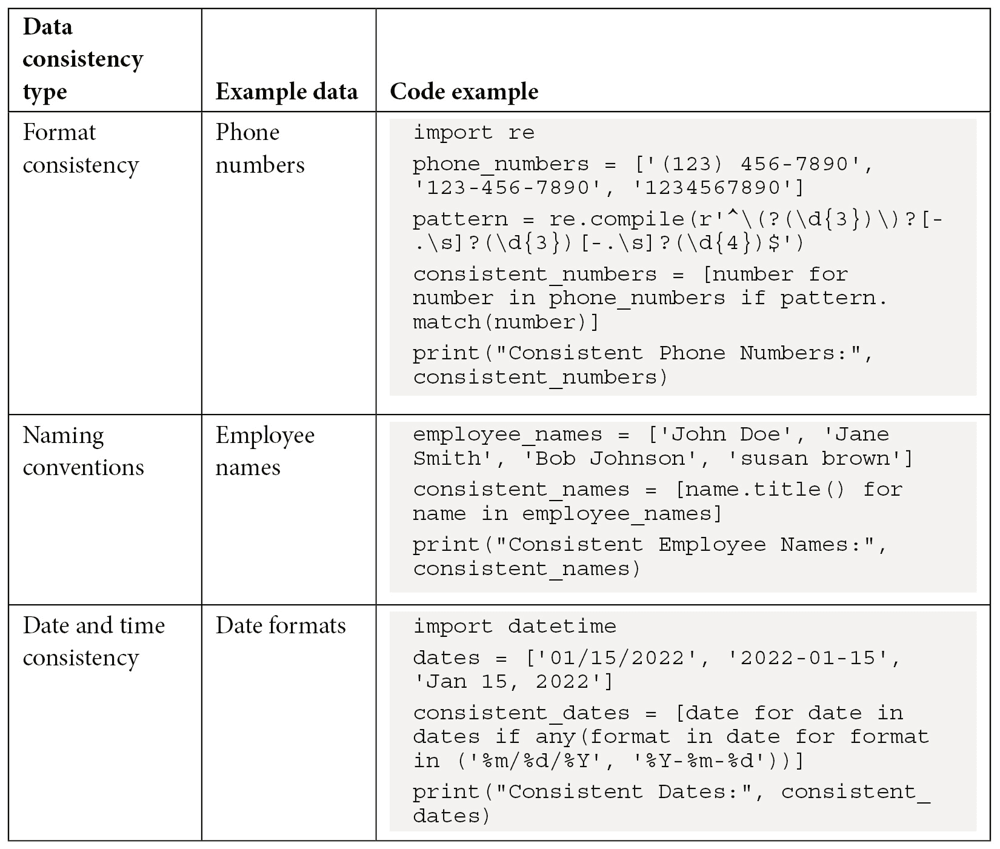
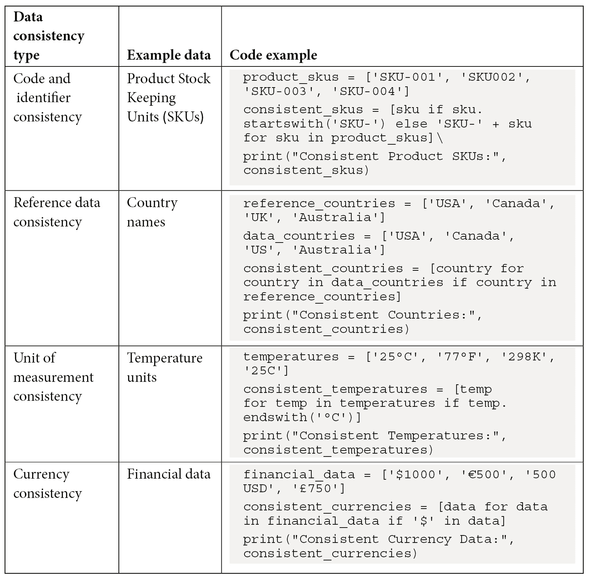
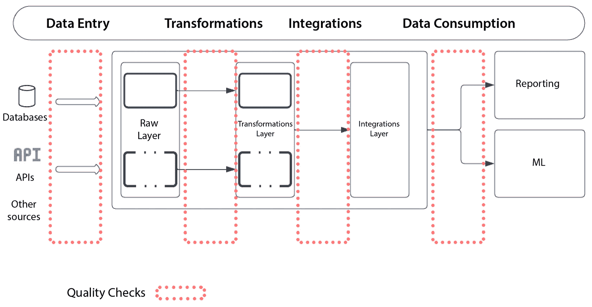

# 第二章：数据质量的重要性

你知道数据是许多重要商业决策的支柱吗？没有准确、完整、一致的信息，企业可能会做出错误的判断，这可能损害企业的声誉、客户关系及整体业务。不同数据集之间的一致性问题可能会造成混乱，阻碍有意义的分析。无关或过时的数据可能会误导决策者的判断，导致做出次优选择。另一方面，构建高质量的数据产品则是一个强有力的资产，能够帮助组织做出明智的决策、发现有价值的洞察、识别趋势、降低风险并获得竞争优势。

在本章中，我们将深入探讨以下话题：

+   为什么数据质量很重要

+   用于衡量数据产品中数据质量的不同维度

+   数据孤岛对数据质量的影响

# 技术要求

你可以在以下的 GitHub 仓库中找到本章的所有代码：

[`github.com/PacktPublishing/Python-Data-Cleaning-and-Preparation-Best-Practices/tree/main/chapter02`](https://github.com/PacktPublishing/Python-Data-Cleaning-and-Preparation-Best-Practices/tree/main/chapter02)

# 为什么数据质量很重要

让我来揭示一下为什么数据质量如此重要：

+   **准确的数据能带来竞争优势**：组织依赖数据来识别模式、趋势、偏好以及支配其生态系统的其他关键因素。如果你的数据质量不合格，结果分析和结论可能会失真，导致错误的决策，这可能会危及整个业务。

+   **完整的数据是成本优化的基石**：数据构成了自动化和优化的基础，若能得当地执行，能够提高生产力并降低费用。不完整或低质量的数据会导致瓶颈并增加成本。试想一下，如果数据录入标准更高，许多本可以避免的错误就不会浪费无数的人工时间去修正。

+   **顶级数据能够带来长期忠诚的满意客户**：每个企业的生命力依赖于满意的客户，客户的忠诚度能够确保企业的持续增长。关于客户的错误数据可能会导致个性化体验不匹配客户特征，甚至出现错误的账单和未满足的请求。这些失望的客户可能会把生意带到别处，导致公司面临生存困境。

+   **合规的数据是避免不必要法律后果的必要条件**：许多行业必须遵循有关数据精度、安全性和隐私的特定规则。遵守这些规则需要高质量的数据，以满足严格的指南，并防止法律处罚以及可能失去消费者信任。

+   **为了避免数据孤岛，你需要信任你的数据**：当企业中的多个实体必须协作利用数据时，确保数据的完整性至关重要。数据的不兼容或差异可能会妨碍合作，阻碍集成工作，并导致数据孤岛的形成。

+   **数据质量实际上意味着信任**：数据质量直接影响利益相关者对组织的信任和信誉。通过保持高质量的数据，组织可以在客户、合作伙伴和投资者之间建立信任。

现在我们更清楚数据质量为何重要，接下来进入下一部分，我们将深入探讨数据质量的不同维度。

# 数据质量的维度

如前所述，卓越的数据质量是构建明智决策和战略洞察力的基础。考虑到这一点，我们现在来探讨我们可以使用哪些**关键绩效指标**（**KPIs**）来衡量我们资产的数据质量。

## 完整性

完整性衡量数据的完整程度，即数据是否缺少任何值或字段。关键绩效指标可能包括缺失数据的百分比或每条记录缺失的数据点数。

以下代码将输出数据集中每列的完整性百分比。较高的百分比表示较高的完整性水平，而较低的百分比则表示更多缺失值：

1.  我们将首先导入`pandas`库以处理数据集：

    ```py
    import pandas as pd
    ```

1.  接下来，我们创建一个包含以下列的示例数据集：`Name`（姓名）、`Age`（年龄）、`Gender`（性别）和`City`（城市）。其中有些值故意缺失（用`None`表示）：

    ```py
    data = {
      'Name': ['Alice', 'Bob', 'Charlie', 'David', 'Eve'],
      'Age': [25, 30, None, 28, 22],
      'Gender': ['Female', 'Male', 'Male', 'Male', 'Female'],
      'City': ['New York', 'Los Angeles', 'Chicago', None, 'San Francisco']
    }
    ```

1.  然后，我们创建一个 pandas DataFrame：

    ```py
    df = pd.DataFrame(data)
    ```

1.  然后，我们将使用`isnull()`函数来识别每列的缺失值，并使用`sum()`函数计算每列缺失值的总数：

    ```py
    completeness = df.isnull().sum()
    ```

1.  接下来，我们将计算完整性百分比：

    ```py
    total_records = len(df)
    completeness_percentage = (1- completeness / total_records) * 100
    ```

    这将打印以下输出：

    ```py
    Completeness Check:
    Name      0
    Age       1
    Gender    0
    City      1
    Completeness Percentage:
    Name      100.0
    Age        80.0
    Gender    100.0
    City       80.0
    ```

完整性检查显示每列缺失值的数量，完整性百分比表示每列缺失值相对于总记录数的比例。该输出表明，`Name`（姓名）和`Gender`（性别）列的完整性为 100%，而`Age`（年龄）和`City`（城市）列的完整性为 80%。

注释 – 完整性百分比

完整性百分比通过将缺失值的数量除以数据集中的总记录数，然后乘以 100 来计算。它表示缺失值相对于数据集大小的比例。

**完整性百分比越高，** **越好！**

## 准确性

准确性通过将数据与可信来源或基准进行比较，来评估数据的正确性。

以下代码将根据实际值与期望值的比较输出准确度百分比：

1.  我们首先加载所需的库：

    ```py
    import pandas as pd
    ```

1.  接下来，我们创建一个名为`data`的示例数据集和一个名为`reference_data`的参考数据集。两个数据集具有相同的结构（列：`Name`、`Age`、`Gender`和`City`）：

    ```py
    data = {
      'Name': ['Alice', 'Bob', 'Charlie', 'David', 'Eve'],
      'Age': [25, 30, 28, 28, 22],
      'Gender': ['Female', 'Male', 'Male', 'Male', 'Female'],
      'City': ['New York', 'Los Angeles', 'Chicago', 'New York', 'San Francisco']
    }
    # Reference dataset for accuracy comparison
    reference_data = {
      'Name': ['Alice', 'Bob', 'Charlie', 'David', 'Eve'],
      'Age': [25, 30, 29, 28, 22],
      'Gender': ['Female', 'Male', 'Male', 'Male', 'Female'],
      'City': ['New York', 'Los Angeles', 'Chicago', 'New York', 'San Francisco']
    }
    ```

1.  我们使用示例数据和参考数据分别创建两个名为`df`和`reference_df`的 pandas 数据框：

    ```py
    df = pd.DataFrame(data)
    reference_df = pd.DataFrame(reference_data)
    ```

1.  我们创建一个`accuracy_check`变量，并将`df`和`reference_df`之间比较的结果赋值给它。此比较使用`==`运算符，它为匹配的值返回`True`，为不匹配的值返回`False`：

    ```py
    accuracy_check = df == reference_df
    ```

    我们可以使用`==`运算符将实际值列与期望值列进行比较。

1.  我们然后通过对每一列的`accuracy_check`数据框求平均值来计算准确率百分比。`mean`操作将`True`视为`1`，将`False`视为`0`，因此它有效地计算了每一列中匹配值的百分比：

    ```py
    accuracy_percentage = accuracy_check.mean() * 100
    ```

1.  最后，我们打印结果：

    ```py
    # Display the accuracy results
    print("Accuracy Check:")
    print(accuracy_check)
    print("\nAccuracy Percentage:")
    print(accuracy_percentage)
    ```

    输出如下：

    ```py
    Accuracy Check:
       Name    Age  Gender  City
    0  True   True    True  True
    1  True   True    True  True
    2  True  False    True  True
    3  True   True    True  True
    4  True   True    True  True
    Accuracy Percentage:
    Name      100.0
    Age        80.0
    Gender    100.0
    City      100.0
    ```

    准确性检查显示`True`表示数据与参考数据集匹配，`False`表示不匹配。准确率百分比表示每列中匹配值相对于记录总数的比例。该输出表示在这种情况下，`Age`列是唯一需要更多关注的列。其他所有列的准确率为 100%。

注意 – 准确率百分比

准确率百分比可以通过对所有列的比较结果求平均值，并乘以 100 来计算。这个百分比代表了匹配数据值相对于总数据点数量的比例。

准确率越高，结果越好！

想知道如何构建基准数据集吗？

基准数据必须能够代表你要解决的任务。这意味着，取决于数据生命周期的不同阶段，基准数据的构建方式不同，所起的作用也不同。

构建基准数据集对于各种数据角色至关重要，包括数据工程师、数据分析师和机器学习从业者。对于数据工程师而言，基准数据对于数据验证和测试至关重要。好消息是，在大多数情况下，数据工程师可以通过历史数据构建基准标签，方法如下：

+   **数据验证规则**：建立验证规则和约束，以验证数据在流经管道时的准确性。

+   **人工检查**：手动检查数据样本以识别不一致性或错误，并创建经过验证和修正的数据集。这可以作为基准数据集。

数据分析师依赖基准数据来验证他们的发现的准确性，这些数据可以通过专家注释、历史数据和用户反馈获得，确保分析见解反映了现实世界的现象：

+   **专家注释**：如果处理的是非结构化或文本数据，领域专家可以手动为数据样本标注正确的标签或类别，作为分析的真实标签。

+   **历史数据**：使用具有良好文档化准确度的历史数据作为真实标签。这在分析趋势、模式或历史事件时尤其有价值。

+   **调查和用户反馈**：从调查或用户反馈中收集数据，以验证从数据中得出的见解和结论。这些可以作为定性真实标签。

最后，在机器学习的背景下，真实标签数据是模型训练和评估的基础：

+   **手动标注**：手动为数据样本添加注释，以创建标注数据集。这对于图像分类、情感分析或目标检测等任务很常见。

+   **众包**：使用众包平台收集来自多个人工工人的注释，他们共同建立真实标签数据。

+   **现有数据集**：许多机器学习任务从已被研究社区广泛使用的基准数据集中获益。你可以根据需要使用和更新这些数据集。

+   **领域专家标签**：请咨询领域专家，为数据提供标签或注释，尤其是在需要领域特定知识时。

+   **合成数据生成**：生成带有已知真实标签的合成数据，以开发和测试机器学习模型。这在没有真实标签数据的情况下尤其有用。

无论是哪种角色，创建、维护并不断评估真实标签数据的质量都是至关重要的，并要注意潜在的偏差和局限性。因为它对数据工程、分析和机器学习工作效果有着重要影响。

## 时效性

时效性评估数据的捕获、处理和可用的速度。时效性关键绩效指标（KPI）可能包括诸如数据延迟（数据捕获与可用之间的时间差）或遵循数据刷新计划等指标。

测量数据的时效性涉及评估数据在特定时间范围或事件中的新鲜度或有效性。让我们来看一个例子：

1.  我们首先导入所需的库：

    ```py
    import pandas as pd
    import numpy as np
    from datetime import datetime, timedelta
    ```

1.  然后我们生成一个包含时间戳和值的随机数据集。时间戳在给定时间范围内随机分布，以模拟真实世界的数据：

    ```py
    np.random.seed(0) # For reproducibility
    n_samples = 100
    start_time = datetime(2023, 10, 25, 9, 0, 0)
    end_time = datetime(2023, 10, 25, 16, 0, 0)
    timestamps = [start_time + timedelta(minutes=np.random.randint(0, (end_time - start_time).total_seconds() / 60)) for _ in range(n_samples)]
    values = np.random.randint(50, 101, n_samples)
    df = pd.DataFrame({'Timestamp': timestamps, 'Value': values})
    ```

1.  我们定义一个参考时间戳，用来与数据集的时间戳进行对比：

    ```py
    reference_timestamp = datetime(2023, 10, 25, 12, 0, 0)
    ```

1.  我们设置了 30 分钟的时效性阈值。时间戳在参考时间戳 30 分钟以内的数据将被视为及时：

    ```py
    timeliness_threshold = 30
    ```

1.  我们通过计算参考时间戳与每条记录时间戳之间的时间差（以分钟为单位），来计算数据集中每条记录的时效性。我们还创建了一个布尔列，用来指示记录是否符合时效性标准，根据阈值判断：

    ```py
    df['Timeliness'] = (reference_timestamp - df['Timestamp']).dt.total_seconds() / 60
    df['Timely'] = df['Timeliness'] <= timeliness_threshold
    ```

1.  最后，我们计算数据集的平均时效性并显示结果：

    ```py
    average_timeliness = df['Timeliness'].mean()
    ```

1.  这将显示以下输出：

    ```py
    Dataset with Timestamps:
                Timestamp  Value  Timeliness  Timely
    0 2023-10-25 11:52:00     71         8.0    True
    1 2023-10-25 09:47:00     98       133.0    False
    2 2023-10-25 10:57:00     99        63.0    False
    3 2023-10-25 12:12:00     55       -12.0    True
    4 2023-10-25 14:23:00     91      -143.0    True
    Average Timeliness (in minutes): -23.8
    Percentage of Timely Records: 61.0 %
    ```

此示例提供了一个更真实的数据集及时性模拟，其中包含随机生成的时间戳和及时性阈值。*平均及时性表示数据集相对于* *参考时间戳的平均时间偏差*。

### 良好的及时性

低平均及时性和高及时记录的百分比表明数据集当前，并且与参考时间戳很好地对齐。这在实时应用或数据最新性至关重要的场景中是可取的。

这里的一个重要考虑因素是如何定义参考时间戳。参考时间戳是数据集时间戳与之比较的时间点。它代表数据的期望或预期时间。例如：在零售店扫描会员卡时创建记录的时间，参考时间是记录在数据库中登录的时间。因此，我们计算的是从事件实际创建到新条目存储在数据库中所需的时间。

参考阈值越小，应用程序需要越*实时*。另一方面，参考阈值越大，将数据带入系统所需的时间越长（**批量应用**）。实时处理和批处理之间的选择取决于应用程序的具体要求：

+   **实时处理**：当需要即时响应、低延迟以及能够在数据到达时立即采取行动时，选择实时处理是合适的。适用于需要做出时间敏感决策的应用场景。

+   **批处理**：当低延迟不是严格要求，且可以容忍数据处理中的一些延迟时，选择批处理通常更具成本效益，适合可以安排和自动化的任务。

### 不同数据角色中及时性定义的变化

及时性是数据质量的一个重要方面，适用于各种角色，从数据工程师到数据分析师和机器学习从业者。以下是每个角色如何在现实世界中利用及时性：

+   **数据工程师**：

    +   **数据管道监控**：数据工程师可以将及时性作为监控数据管道的关键指标。他们可以设置自动警报或检查，确保数据按时到达，并识别和解决数据摄取中的延迟。

    +   **数据验证**：数据工程师可以将及时性检查作为其数据验证流程的一部分，确保数据在用于下游流程之前满足指定的时间条件。

+   **数据分析师**：

    +   **实时分析**：金融或电子商务等领域的分析师依赖实时数据做出信息化决策。他们需要确保分析的数据是最新的，反映当前的情况。

    +   **KPI 监控**：及时性在监控关键绩效指标中至关重要。分析师使用及时数据来跟踪和评估各种业务指标的表现。

+   **机器学习从业者**：

    +   **特征工程**：及时性在机器学习模型的特征工程中起着重要作用。保持特征尽可能更新对模型的训练和评分有直接影响。

    +   **模型训练和评估**：在实时预测模型中，模型训练和评估依赖于及时数据。从业者必须确保训练数据是当前的，以建立有效的模型或执行实时推断。

    +   **概念漂移检测**：及时性对于检测概念漂移至关重要，概念漂移是指数据内部关系随时间变化的情况。机器学习模型需要适应这些变化，及时的数据监控和检测变化至关重要。

这里是及时性的一些实际应用：

+   **金融**：在金融领域，及时性对股票交易、欺诈检测和风险管理至关重要，及时的数据可以带来更好的决策和降低风险。

+   **医疗保健**：及时性对于医疗数据至关重要，特别是在患者监测和实时健康数据分析中。

+   **电子商务**：及时的数据对电子商务公司来说至关重要，可以实时监控销售、客户行为和库存。

+   **运输与物流**：在供应链管理和物流中，实时跟踪和及时的数据对路线优化和库存管理至关重要。

让我们继续谈一谈一致性。

## 一致性

一致性衡量数据内部一致性的程度，包括确保数据在整个数据集中遵循建立的规则、标准和格式。具体而言，我们应检查以下内容：

+   **相同格式**：所有记录或列的数据都应该遵循相同的格式、结构和标准。这种一致性确保数据可以轻松处理和比较。

+   **遵守标准**：数据应符合预定义的规则、指南、命名约定和参考数据。例如，如果数据集包含产品名称，一致性要求所有产品名称都遵循标准化的命名约定。

+   **数据类型和格式**：一致性检查包括验证数据类型（例如文本、数字和日期）和数据格式（例如日期格式和数值表示）是否一致。

让我们通过一个例子更好地理解：

1.  我们首先导入`pandas`库：

    ```py
    import pandas as pd
    ```

1.  然后我们创建一个包含产品信息的样本数据集，包括产品名称。在这个例子中，我们将检查所有产品名称是否按照命名约定以`PROD`开头：

    ```py
    data = {
      'ProductID': [1, 2, 3, 4, 5],
      'ProductName': ['PROD001', 'PROD002', 'Product003', 'PROD004', 'PROD005'],
    }
    df = pd.DataFrame(data)
    ```

1.  让我们定义预期的前缀：

    ```py
    expected_prefix = "PROD"
    ```

1.  我们通过确保所有产品名称以`PROD`开头来检查`ProductName`列的一致性。不一致的名称将被标记：

    ```py
    inconsistent_mask = ~df['ProductName'].str.startswith(expected_prefix)
    df['Consistency'] = ~inconsistent_mask
    ```

1.  然后我们计算一致行的百分比：

    ```py
    consistent_percentage = (df['Consistency'].sum() / len(df)) * 100
    ```

1.  最后，我们展示结果，包括包含完整性检查结果的数据集：

    ```py
    print("Dataset with Consistency Check:")
    print(df)
    ```

    以下是最终输出：

    ```py
    Dataset with Consistency Check:
       ProductID  ProductName  Consistency
    0          1     PROD001         True
    1          2     PROD002         True
    2          3  Product003         False
    3          4     PROD004         True
    4          5     PROD005         True
    Percentage of Consistent Rows: 80.00%
    ```

在这个特定的数据集中，五个产品名称中有三个符合命名规范，因此一致性率为 80%。`Product003`条目被标记为不一致，因为它没有以`PROD`开头

这种类型的完整性检查对于确保数据遵循特定标准或约定非常有用，计算出的百分比提供了一个定量衡量，表示有多少记录符合标准

注意

更高的一致性百分比意味着相应列中的值更加一致和符合标准。如果百分比很低，那么说明数据集中有许多不同的值，只要我们理解列代表的含义并且所有唯一值都有其背后的意义，这并不是一个错误

你是否在想，还可以应用哪些其他的完整性检查？



表 2.1 – 不同的完整性检查选项

让我们接下来讨论唯一性

## 唯一性

唯一性衡量数据集中唯一值的存在。它可以帮助识别异常，例如重复的键

代码将输出每一列的有效性结果，指示每一列中的值是否符合定义的有效性规则：

1.  我们导入`pandas`库：

    ```py
    import pandas as pd
    ```

1.  然后我们创建一个包含电子邮件地址的示例数据集。我们想检查数据集中的所有电子邮件地址是否唯一：

    ```py
    # Create a sample dataset
    data = {
        'Email': ['john.doe@example.com', 'jane.smith@example.com', 
        'james.doe@example.com', 'susan.brown@example.com'],
    }
    df = pd.DataFrame(data)
    ```

1.  我们检查`Email`列的唯一性，确保数据集中的电子邮件地址没有重复：

    ```py
    # Check uniqueness and create a Boolean mask for duplicated email addresses
    duplicated_mask = df['Email'].duplicated(keep='first')
    # Create a new column to indicate uniqueness
    df['Uniqueness'] = ~duplicated_mask
    ```

1.  接下来，我们计算唯一性百分比：

    ```py
    unique_percentage = (df['Uniqueness'].sum() / len(df)) * 100
    ```

1.  最后，我们展示结果，包括包含唯一性检查结果的数据集。以下是输出：

    ```py
    Dataset with Uniqueness Check:
                         Email  Uniqueness
    0     john.doe@example.com        True
    1   jane.smith@example.com        True
    2    james.doe@example.com        True
    3  susan.brown@example.com        True
    Percentage of Unique Records: 100.00%
    ```

这个输出表示数据集中的值都是唯一的

唯一性检查在各个行业和使用案例中都很常见。以下是一些常见的现实场景中唯一性检查的例子：

+   **客户编号**：在客户数据库中，每位客户应有一个唯一的标识符（客户编号），以防止重复的客户记录

+   **产品 SKU**：在库存和电子商务数据库中，每个产品应该有一个唯一的 SKU，以便识别和管理产品，避免重复

+   **电子邮件地址**：电子邮件地址在邮件列表或用户数据库中应该是唯一的，以避免发送重复的邮件或创建多个相同电子邮件地址的账户

+   **员工编号**：在人力资源数据库中，每位员工通常有一个唯一的员工编号，用以区分员工并有效管理他们的记录

+   **车辆识别号码**（**VIN**）：在汽车行业中，VIN 是每辆车的唯一标识符，用于追踪其历史和所有权

+   **条形码和二维码**：在零售和物流行业，条形码和二维码为产品、包裹和物品提供唯一的标识符，用于追踪和库存管理

+   **用户名和用户 ID**：在在线平台和应用中，用户名和用户 ID 对每个用户都是唯一的，用来区分用户并管理账户。

+   **序列号**：在制造业中，产品通常会有唯一的序列号，用于识别和跟踪单个物品。

+   **交易 ID**：在金融系统中，每笔交易都会分配一个唯一的交易 ID，以防止重复并确保正确的记录保存。

当数据集中有非唯一记录时，意味着存在具有相同关键属性（例如，ID、姓名或电子邮件地址）的重复条目或记录。非唯一记录可能会导致数据质量问题，甚至在数据分析和报告时产生错误。要修复数据集中的非唯一记录，你可以使用多种方法，包括去除重复、汇总数据或根据具体数据和需求解决冲突。我们将在后续章节讨论这些策略。

## 重复数据

重复数据评估数据集中的重复或冗余数据的存在。如果你的数据中有重复记录，意味着同一条信息或记录在数据集中出现多次。

### 示例——客户数据库

假设你在一个公司工作，公司拥有一个客户数据库，跟踪每个客户的信息，包括他们的联系详情、购买记录和互动信息。

### 问题——重复的客户记录

你发现数据库中有重复的客户记录。这些重复记录可能是由于数据输入错误、系统问题或其他原因造成的。例如，一个名为 John Smith 的客户有两个独立的记录，联系信息略有不同。一个记录的电子邮件地址是`john.smith@email.com`，另一个是`jsmith@email.com`。

这通常被认为是不可取的，原因有多个：

+   **数据准确性**：当你有多个相同信息的副本时，很难确定哪个版本是正确或最新的。这可能导致数据不一致和混乱。

+   **存储效率**：重复记录会占用不必要的存储空间。尤其在处理大数据集时，这可能导致存储成本增加和数据检索时间延长。

+   **数据完整性**：重复记录可能会影响数据完整性。在数据关系至关重要的情况下，重复记录可能会破坏数据模型的完整性。

+   **高效的数据处理**：分析、查询和处理重复较少的数据集会更高效。处理时间更短，结果也更有意义，因为你不需要处理重复信息。

+   **数据分析**：在进行数据分析或运行统计模型时，重复记录可能会扭曲结果，导致错误的结论。减少重复数据对于准确和有意义的分析至关重要。

+   **成本节约**：存储和管理重复记录会增加存储基础设施和数据管理的成本。消除重复记录可以带来成本节约。

现在假设我们将同样的问题推广到管理数百万客户的公司。你能想象引入重复记录会有多么昂贵和混乱吗？

尽管在数据集中最小化重复记录通常是一种最佳实践，但在某些特定场景下，接受或允许重复记录可能是一个合理的选择：

| **场景** | **数据表示** |
| --- | --- |
| 客户订单历史 | 每一行代表客户的单独订单。允许同一客户 ID 的多行以展示订单历史。 |
| 服务请求 | 记录代表服务请求，包括同一客户或地点随时间发生的多个请求。允许重复记录以保留详细历史。 |
| 传感器数据 | 每一行包含传感器读数，可能包括多个相同数据值的条目。允许重复记录以跟踪每次读数。 |
| 日志记录和审计跟踪 | 日志条目记录事件或操作，有些事件可能生成重复条目。保留重复记录以便进行详细的审计跟踪。 |
| 用户交互数据 | 记录捕捉用户与网站或应用程序的交互。重复记录可以代表重复的交互，用于分析用户行为。 |
| 变更历史 | 数据版本或文档变更导致多个记录，包括捕捉历史修订的重复记录。保留重复记录用于版本历史。 |

表 2.2 – 重复记录场景

在这些场景中，允许重复记录是为了实现特定的数据管理或分析目标，例如保留历史数据、记录变更或捕捉详细的用户交互。数据的表示方式与这些目标一致，重复记录是*故意*保留的，以支持这些用例。

让我们通过一个代码示例来看如何跟踪重复记录。代码将输出数据集中找到的重复记录数量：

1.  首先，我们导入 `pandas`：

    ```py
    import pandas as pd
    ```

1.  接下来，我们创建一个包含员工信息的示例数据集。我们故意引入重复的员工 ID 来演示如何识别重复记录：

    ```py
    data = {
        'EmployeeID': [101, 102, 103, 101, 104, 105, 102],
        'FirstName': ['Alice', 'Bob', 'Charlie', 'David', 'Eve', 'Frank', 'Bob'],
        'LastName': ['Smith', 'Johnson', 'Brown', 'Davis', 'Lee', 'White', 'Johnson'],
    }
    df = pd.DataFrame(data)
    ```

1.  我们将使用 pandas 根据 `EmployeeID` 列来识别并标记重复记录。`duplicated()` 函数用于创建布尔掩码，`True` 表示重复记录：

    ```py
    duplicated_mask = df.duplicated(subset='EmployeeID', keep='first')
    ```

    `subset='EmployeeID'` 参数指定用于检查重复的列。`keep='first'` 会将重复记录标记为 `True`，除了第一次出现的记录。你可以根据需要将此参数更改为 `last` 或 `False`。

1.  然后，我们在 DataFrame 中创建一个新的列 `'IsDuplicate'`，用于指示每条记录是否为重复记录：

    ```py
    df['IsDuplicate'] = duplicated_mask
    ```

1.  我们通过将重复记录的数量（在`IsDuplicate`列中标记为`True`的记录）除以记录总数，然后乘以 100 来计算重复记录的百分比，并将其表示为百分比：

    ```py
    duplicate_percentage = (df['IsDuplicate'].sum() / len(df)) * 100
    ```

1.  最后，我们显示包含`IsDuplicate`列的数据集，以查看哪些记录是重复的。以下是最终的输出：

    ```py
       EmployeeID  FirstName  LastName  IsDuplicate
    0         101     Alice    Smith        False
    1         102       Bob  Johnson        False
    2         103   Charlie    Brown        False
    3         101     David    Davis         True
    4         104       Eve      Lee        False
    5         105     Frank    White        False
    6         102       Bob  Johnson         True
    Percentage of Duplicate Records: 28.57%
    ```

该输出表示数据集中的 28.57%的记录是重复的。

注意

**重复记录越少，** **越好！**

数据集中什么样的重复记录数量被认为是“可接受”或“良好”的标准，可能会根据具体情况和数据管理或分析的目标而有所不同。这个问题没有统一的答案，因为它取决于数据类型、数据集的目的和行业标准等因素。

## 数据使用

数据使用评估数据在组织内的有效利用程度。数据使用的关键绩效指标（KPI）可以包括数据利用率、数据请求或查询的数量，或者关于数据可用性和质量的用户满意度调查。

### 场景 – 企业商业智能仪表板

假设一家大型企业依赖数据驱动决策来优化其运营、营销策略和财务表现。该公司有一个集中式的**商业智能**（**BI**）仪表板，向不同部门和团队提供各种数据分析和洞察。这个仪表板对于监控公司的业绩并做出明智决策至关重要。

在这种情况下，评估数据使用指标对于优化 BI 仪表板的有效性以及确保它满足组织的数据需求至关重要。以下是我们在代码示例中将要追踪的内容：

+   **数据利用率**：通过跟踪不同部门和团队的数据利用率，组织可以评估仪表板的访问频率以及其中数据的使用广度。例如，营销部门可能有较高的数据利用率，表明他们在依赖仪表板进行活动绩效分析。此指标有助于识别组织中数据驱动洞察最为关键的领域。

+   **数据请求或查询的数量**：监控用户发出的数据请求或查询的数量，可以为我们提供关于通过仪表板进行的数据分析量的洞察。较高的数据请求数量可能表明对数据驱动决策的强烈需求。此指标还可以帮助识别使用高峰时段和受欢迎的数据源。

+   **用户满意度得分**：通过调查收集用户满意度得分，可以衡量 BI 仪表板在多大程度上满足用户的期望。较低的平均用户满意度得分可能表示仪表板的功能或用户体验需要改进。来自用户的反馈可以指导仪表板的改进。

+   **组织数据利用率**：计算整个组织的总体数据利用率有助于评估仪表板的相关性及其在实现更广泛业务目标中的有效性。这还为衡量数据利用率的改进提供了一个基准。

要计算上个月的数据请求数量，你需要记录应用程序的数据请求及其相关的时间戳。我们来看一个例子：

1.  首先，我们导入`random`库：

    ```py
    import random
    ```

1.  接下来，我们创建一个函数来模拟数据使用指标。在这个函数中，我们将组织中的用户数量设置为 500 个用户，但在实际场景中，你需要用组织中实际的用户数量来替代。让我们来看一下下面的函数：

    ```py
    def simulate_data_usage():
        num_users = 500
        data_utilization_rates = [random.uniform(20, 90) for _ in range(num_users)]
        data_requests = [random.randint(1, 100) for _ in range(num_users)]
        organization_data_utilization_rate = sum(data_utilization_rates) / num_users
        total_data_requests = sum(data_requests)
        user_satisfaction_scores = [for _ in range(num_users)]
        avg_user_satisfaction_score = sum(user_satisfaction_scores) / num_users
        return {
            "data_utilization_rates": data_utilization_rates,
            "organization_data_utilization_rate": organization_data_utilization_rate,
            "data_requests": data_requests,
            "total_data_requests": total_data_requests,
            "user_satisfaction_scores": user_satisfaction_scores,
            "avg_user_satisfaction_score": avg_user_satisfaction_score,
    }
    ```

    该函数的主要目标是模拟组织中每个用户的数据利用率。`random.uniform(20, 90)`函数生成一个介于 20 和 90 之间的随机浮动数值。我们对每个用户都进行这种操作，结果是一个数据利用率的列表。同样，我们模拟每个用户所做的数据请求或查询的数量。在这里，我们使用`random.randint(1, 100)`为每个用户生成一个 1 到 100 之间的随机整数，表示数据请求的次数。接下来，我们计算两个组织级的指标，第一个是整个组织的平均数据利用率，第二个是所有用户的总数据请求或查询次数。我们使用 1 到 5 的评分来模拟用户满意度分数。每个用户都会得到一个随机的满意度分数。我们基于模拟的满意度分数来计算整个组织的平均用户满意度分数。

1.  我们调用`simulate_data_usage()`函数来运行模拟并将结果存储在`data_usage_metrics`变量中：

    ```py
    data_usage_metrics = simulate_data_usage()
    ```

1.  最后，我们展示模拟的数据显示指标。输出结果如下：

    ```py
    Organization Data Utilization Rate:
    54.83%
    Total Number of Data Requests or Queries:
    25794
    Average User Satisfaction Score:
    2.93
    ```

捕捉不同数据产品的使用情况对于几个原因至关重要，特别是在那些依赖数据进行决策和提升运营效率的组织中：

+   **优化资源**：通过了解数据产品的使用情况，组织可以有效地分配资源。这包括识别哪些数据源被大量使用，哪些数据源可能未被充分利用。这有助于优化数据存储、处理和基础设施资源。

+   **提升数据质量**：监控数据使用情况可以突显数据质量问题。例如，如果某些数据产品很少被访问，可能表明这些数据质量较差或已不再相关。捕捉使用情况可以促进数据质量的改进。

+   **识别趋势和模式**：数据使用模式可以揭示数据如何被消费，以及哪些类型的分析或报告对用户最有价值。这些信息可以为数据产品的开发和改进策略提供依据。

+   **成本管理**：了解哪些数据产品需求量大有助于管理与数据相关的成本。它使组织能够明智投资资源，避免在维护或存储使用较少的数据上产生不必要的费用。

+   **安全和合规性**：跟踪数据使用对数据安全和合规性至关重要。组织可以识别未经授权访问或异常使用模式，这可能表明安全漏洞。它还有助于通过展示对数据访问的控制来遵守数据隐私法规。

+   **用户满意度**：了解数据产品的使用方式及其是否满足用户需求对用户满意度至关重要。它允许组织根据用户要求定制数据产品，从而提供更好的用户体验。

+   **容量规划**：捕捉使用数据有助于数据基础设施的容量规划。它确保在高峰使用期间有足够的容量处理数据流量，避免性能瓶颈。

+   **投资回报率** (**ROI**) **测量**：对于投资于数据产品的组织来说，跟踪使用情况对于衡量投资回报率至关重要。它有助于确定数据收集、处理和呈现所耗费的资源是否因其对决策和业务结果的影响而合理。

接下来，让我们讨论数据合规性。

## 数据合规性

数据合规性评估数据遵守法规要求、行业标准或内部数据治理政策的程度。合规性 KPI 可能涉及诸如非合规数据记录数量、符合特定法规的数据百分比或数据合规审计结果等指标。在今天的数据驱动和高度监管的业务环境中，数据合规性对几个重要原因尤为关键，如下表所示。

| **后果/挑战** | **描述** |
| --- | --- |
| 法律和监管后果 | 不合规可能导致法律诉讼、罚款和处罚 |
| 声誉损失 | 负面宣传和失去顾客及利益相关者的信任 |
| 财务影响 | 与罚款、法律费用、数据泄露通知等相关的成本 |
| 数据泄露 | 增加安全漏洞和未经授权访问的风险 |
| 数据质量问题 | 不准确或不完整的数据影响决策和效率 |
| 顾客流失 | 顾客中断与不合规组织的关系 |
| 法律责任 | 个人和组织可能面临的法律责任 |
| 额外的监控和监督 | 强化的法规监控和监督 |
| 难以扩展到国际市场 | 因国际非合规性而阻碍全球扩展 |

表 2.3 – 忽视数据合规性的后果

这里有一个 Python 示例，用于说明一个简化的情景，我们使用随机生成的数据检查数据记录是否符合特定规定的合规性：

1.  我们首先导入`random`库：

    ```py
    import random
    ```

1.  接下来，我们创建一个函数来模拟带有合规性检查的数据集，数据记录的数量由给定的值决定：

    ```py
    def simulate_data_compliance(num_records):
      data_records = []
      compliant_count = 0  # Counter for compliant records
    ```

1.  每条数据记录由诸如`Age`和`Consent Given`等属性组成，这些属性是随机生成的：

    ```py
      for _ in range(num_records):
        # Generate a random record (e.g., containing age and consent fields)
        age = random.randint(18, 100)
        consent_given = random.choice([True, False])
    ```

1.  我们根据一个简化的场景定义这些属性的合规性规则，例如，个人必须年满 18 岁或以上才能提供同意：

    ```py
        age_rule = age >= 18
        consent_rule = age >= 18 and consent_given
    ```

1.  我们检查是否符合特定的法规，并且对于每条数据记录，我们报告其是否符合`Age`和`Consent`要求：

    ```py
        age_compliant = "Age Compliant" if age_rule else "Age Non-Compliant"
        consent_compliant = "Consent Compliant" if consent_rule else "Consent Non-Compliant"
        # Define overall compliance status
        compliance_status = "Compliant" if age_rule and consent_rule else "Non-Compliant"
    ```

1.  我们引入了一个`compliant_count`变量，用于跟踪符合合规性的记录数量：

    ```py
        # Count compliant records
        if compliance_status == "Compliant":
          compliant_count += 1
        data_records.append({
            "Age": age,
            "Consent Given": consent_given,
            "Age Compliance": age_compliant,
            "Consent Compliance": consent_compliant,
            "Overall Compliance Status": compliance_status
        })
    ```

    在生成数据记录的循环内部，每当记录符合定义的规则时，我们就递增`compliant_count`。

1.  在生成所有记录后，我们计算符合合规性记录的百分比为`(compliant_count / num_records) * 100`，并将其存储在`percentage_compliant`变量中：

    ```py
      # Calculate the percentage of compliant records
      percentage_compliant = (compliant_count / num_records) * 100
      return data_records, percentage_compliant
    ```

1.  我们定义了要模拟的记录数量，并通过调用我们的`simulate_data_compliance`函数开始模拟合规性检查：

    ```py
    # Define the number of data records to simulate
    num_records = 100
    # Simulate data compliance checks
    data_records, percentage_compliant = simulate_data_compliance(num_records)
    ```

1.  最后，我们显示结果：

    ```py
    # Display the results for a sample of data records and the percentage of compliance
    sample_size = 10
    for record in data_records[:sample_size]:
        print(record)
    print(f"\nPercentage of Compliant Records: {percentage_compliant:.2f}%")
    ```

    这将显示以下输出：

    ```py
    Percentage of Compliant Records: 49.00%
    ```

下面是一个总结常见合规性检查及其示例的表格：

| **合规性检查** | **描述** **和示例** |
| --- | --- |
| 数据隐私合规性 | 确保**个人身份信息**（**PII**）的保护；一个例子是安全存储客户姓名和地址 |
| GDPR 合规性 | 遵守 GDPR；一个例子是处理用户数据访问和删除请求 |
| HIPAA 合规性 | 根据 HIPAA 确保医疗数据保护；一个例子是对**电子受保护健康信息**（**ePHI**）的安全处理 |
| PCI DSS 合规性 | 遵守 PCI DSS；一个例子是支付处理过程中加密信用卡信息 |
| 数据保留合规性 | 管理数据保留期限，并确保安全归档或删除 |
| 同意合规性 | 验证用户对数据收集和处理的明确同意；一个例子是电子邮件营销的选择同意 |
| 准确性与完整性合规性 | 定期检查和修正数据的准确性与完整性 |
| 数据分类与处理合规性 | 根据敏感性对数据进行标记并强制访问控制；一个例子是将数据分类为**机密**并限制访问 |
| 数据加密合规性 | 对敏感数据进行传输中和静态加密 |
| 访问控制合规性 | 实施基于角色的访问控制以限制数据访问 |
| 审计与日志记录合规性 | 维护数据访问和更改的审计日志 |
| 数据屏蔽与匿名化合规性 | 通过数据屏蔽或匿名化保护敏感数据 |
| 数据生命周期管理合规性 | 按照政策管理数据从创建到销毁的整个过程 |
| 数据伦理和道德合规 | 确保数据实践符合伦理标准 |
| 避免歧视合规性 | 避免数据的歧视性使用；例如，金融服务中的公平贷款实践 |

表 2.4 – 关键合规性检查

实际中，组织可能会选择按日、周、月或季度计算数据质量 KPI，包括完整性。在测量频率和有效评估所需资源之间取得平衡是非常重要的。定期监控和调整计算频率可以帮助确保数据质量根据业务需求持续评估和维护。

如果数据有频繁的更新，数据的监控指标也应当频繁。这确保了数据的任何变化或更新都能及时捕捉，并且质量指标保持最新。

数据越关键，监控指标更新的频率应该越高。这里是关键数据的定义：

| **特征** | **描述** |
| --- | --- |
| 对核心运营至关重要 | 对日常组织功能至关重要 |
| 决策的关键 | 在战略、战术和运营决策中起到关键作用 |
| 高价值和影响 | 与显著的财务价值和运营影响相关 |
| 敏感和机密 | 经常包含敏感和机密信息 |
| 业务连续性和灾难恢复 | 对于连续性规划和恢复措施至关重要 |
| 客户信任与满意度 | 直接影响信任与满意度 |
| 竞争优势 | 可能提供竞争优势 |
| 战略资产 | 被视为战略资源 |

表 2.5 – 关键数据定义

如果用于质量衡量的数据对关键决策过程或敏感操作至关重要，则可能需要更频繁地计算质量 KPI。

现在我们理解了如何根据不同的质量 KPI 评估我们的数据产品，让我们看看在数据生命周期的哪些节点需要应用这些指标。

# 实施数据生命周期中的质量控制

数据质量应当是数据整个生命周期中的根本考虑。从数据采集到下游分析团队的使用，数据经历了各种变化，确保每个步骤中的质量至关重要。以下是质量检查生命周期的示意图：



图 2.1 – 质量检查生命周期

让我们更深入地了解每个步骤需要发生的内容：

+   **数据输入/采集**：验证数据源，并确保数据在进入系统时准确、一致地捕获，可以减少下游过程中的错误。

    数据角色 --> 数据工程师

+   **数据转化**：通过在数据转化层中加入质量检查，组织确保数据在从原始来源到最终目的地的整个过程中始终保持可靠、准确和一致。

    数据角色 --> 数据工程师

+   **数据整合**：当从多个来源或系统合并数据时，数据整合可能会引入错误和不一致。此层次的质量检查有助于防止数据质量问题在数据生态系统中传播，并支持对整合数据的高度信任。

    数据角色 --> 数据工程师和数据科学家

+   **数据消费**：分析和机器学习模型在很大程度上依赖于输入数据的质量。在当今以数据为驱动的环境中，这一点尤为重要，因为数据质量直接影响组织的成功与竞争优势。

    数据角色 --> 数据科学家，分析师

如前面列表所示，数据在系统中流动。不同的团队合作定义质量指标并应用质量控制。现在，让我们看看如果不同团队之间没有合作，会发生什么。

# 数据孤岛及其对数据质量的影响

数据孤岛，也称为孤立的数据存储库，在今天的许多组织中普遍存在。数据孤岛是指将数据存储和管理在组织内部孤立或不连接的系统或部门中的做法。这些孤立的数据存储库随着时间的推移发展起来，不同部门或业务单元单独维护数据，导致数据整合变得复杂。组织越来越意识到数据孤岛带来的局限性，认识到它们妨碍了数据驱动的决策和运营效率。因此，打破数据孤岛、推动数据整合和质量提升的努力正在增加，旨在充分挖掘数据资源的潜力。

这些孤岛在我们已经讨论过的维度中给数据质量的维护带来了挑战：

+   **不与组织其他部门共享数据会削弱其竞争优势**：数据孤岛通过迫使员工花时间从不同的来源寻找数据，拖慢了决策过程，将他们的注意力从获取洞察力和采取行动转移开。通常，数据孤岛与重复性工作相关联，因为各团队独立完成相似任务，缺乏高效的协作和信息共享。不同的数据源之间常常会出现对指标的不同解读，导致团队之间的混淆和争议。假设和视角的不一致阻碍了进展和方向。建立清晰的沟通指南并执行标准化方法是确保对齐期望、促进整个组织理解的关键。

+   **不与整个组织共享数据是非常昂贵的**：数据孤岛由于维护跨组织的多个分散系统而增加了成本。维护这些不同的系统需要专门的资源，包括人员和基础设施（例如在多个地方的冗余存储）。由于数据存储分散，检索相关信息变得耗时，导致延迟。手动整合来自不同来源的数据会引入潜在错误。

现在，让我们总结一下本章所学的内容。

# 总结

在本章中，我们讨论了高质量数据的重要性，它为分析、机器学习和明智决策提供了坚实的基础。为了确保数据质量，组织在数据管道的各个阶段实施了一系列检查和措施：

+   数据录入/摄取：数据源会进行验证，以确保数据捕获的准确性和一致性，主要由数据工程师监管。

+   数据转化：质量检查被纳入转化层，以保持数据的可靠性和准确性，通常由数据工程师管理。

+   数据集成：检查可以防止数据质量问题的蔓延，并支持对集成数据的信任，涉及数据工程师和数据科学家。

+   数据消费：高质量的数据输入对于分析和机器学习至关重要，影响用户信任和竞争优势，由数据科学家和分析师推动。

这些质量检查确保数据遵循定义的标准，符合监管要求，并适合其预定用途。通过实施这些检查，组织保持数据的准确性、可靠性和透明度，从而促进更好的决策制定，确保数据驱动的成功。

在下一章，我们将探讨如何使用分析工具持续且自动地监控数据质量。
