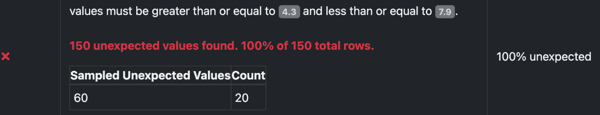

# 第三章：数据分析 – 理解数据结构、质量和分布

**数据分析**指的是对数据集进行细致检查、理解和验证，从中了解其潜在的结构、模式和质量。这是数据管理和数据摄取中的关键步骤，因为它能提高数据质量和准确性，并确保符合监管标准。在本章中，你将学习如何使用不同的工具进行数据分析，并了解如何随着数据量的增加调整策略。

在本章中，我们将深入探讨以下主题：

+   理解数据分析

+   使用 pandas profiler 进行数据分析

+   使用《远大前程》进行数据验证

+   比较《远大前程》和 pandas profiler – 何时使用哪一个

+   如何分析大数据量

# 技术要求

本章需要安装 Python 解释器，可以通过以下链接下载并按照说明进行安装：[`www.python.org/downloads/`](https://www.python.org/downloads/)。

你可以在以下 GitHub 仓库找到本章的所有代码：[`github.com/PacktPublishing/Python-Data-Cleaning-and-Preparation-Best-Practices/tree/main/chapter03`](https://github.com/PacktPublishing/Python-Data-Cleaning-and-Preparation-Best-Practices/tree/main/chapter03)。

# 理解数据分析

如果在开始本章之前，你从未听说过 **数据分析**，它是一个全面的过程，涉及分析和检查来自不同来源的数据，以深入了解数据集的结构、质量和整体特征。让我们从描述数据分析的主要目标开始。

## 数据分析目标识别

数据分析帮助我们理解数据的结构和质量。因此，我们可以更好地了解如何组织不同的数据集，识别潜在的数据整合问题，评估数据质量，并识别和解决可能影响数据可靠性和可信度的问题。

让我们深入探讨数据分析的三个主要目标。

### 数据结构

数据分析的主要目标之一是理解数据的结构。这包括检查数据类型、格式和不同数据字段之间的关系。

这里有一个简单的表格结构示例。考虑一个名为 `Employee` 的表格，存储公司员工的信息：

| `EmployeeID` | `FirstName` | `LastName` | `Position` | `Department` | `Salary` |
| --- | --- | --- | --- | --- | --- |
| `1` | `John` | `Doe` | `软件工程师` | `IT` | `75000` |
| `2` | `Jane` | `Smith` | `数据分析师` | `分析` | `60000` |
| `3` | `Bob` | `Johnson` | `项目经理` | `项目管理` | `85000` |

让我们来分析一下这个表格：

+   `EmployeeID`: 每个员工的唯一标识符

+   `FirstName` 和 `LastName` 是存储员工姓名的字段

+   `Position`: 员工的职位或职称

+   `Department`: 员工所在的部门

+   `Salary`：员工的薪资

这个表格结构按行和列进行组织。每一行代表一个特定的员工，每一列代表员工的不同属性或信息。表格结构便于查询、过滤和连接数据。每一列中的值遵循特定的数据类型（例如整数、字符串等），并且可以通过键建立表格之间的关系。

这是一个简化的示例，但在实际应用中，表格可能包含更多列和复杂的关系。

### 数据质量

**数据质量**涉及评估数据的整体可靠性和可信度。通过数据分析，我们可以识别出各种数据质量问题，包括重复记录、错误或不一致的值、缺失值和异常值。通过量化这些问题，组织能够了解数据在分析中可以信赖和依赖的程度。

### 数据分布

理解每个字段或列中的数据分布是数据分析的另一个关键目标。通过分析数据分布，组织可以深入了解数据中的模式、频率和异常。

假设我们为一家电子商务公司工作，收集每天的销售收入数据。通过检查数据分布，我们可以识别出销售趋势：


图 3.1 – 每日销售收入分布

在这个直方图中，我们可以看到销售数据呈正态分布，说明靠近均值的数据比远离均值的数据出现的频率更高。通过这种方式，我们可以了解在正常情况下每天的平均销售额。

现在我们已经了解了数据分析可以解决的挑战，让我们来看看你可以通过哪些不同的方式进行数据分析。

# 探索性数据分析选项 – 分析工具与手动方法

在进行**探索性数据分析（EDA）**时，你可以采取不同的方法来理解你的数据，包括进行手动分析或使用分析工具。

**手动探索性数据分析（EDA）**涉及编写自定义代码或使用通用数据分析库（例如 Python 中的 pandas）来探索数据。它给予你更多的灵活性和对分析过程的控制。你可以根据具体需求和问题定制分析。手动 EDA 允许更深入的探索，包括自定义计算、特征工程和高级可视化。当处理复杂数据或你拥有特定领域知识时，手动 EDA 会很有帮助。

**分析工具**是专门用于分析和总结数据的工具或库。它自动化了许多 EDA 任务，并提供数据结构、汇总统计、缺失值、数据类型和分布的快速洞察。它通过自动化重复性任务并提供数据集的全面概览，节省了时间。

让我们更详细地了解何时使用什么：

|  | **手动 EDA** | **数据分析工具** |
| --- | --- | --- |
| **优点** | 根据特定需求灵活探索数据 | 自动化流程，快速洞察 |
|  | 通过自定义代码深入理解数据 | 跨数据集的一致性和标准化分析 |
|  | 更大控制权的分析技术和可视化 | 自动化的可视化和汇总统计 |
|  | 数据质量问题和异常的识别 |
| **缺点** | 需要大量时间且需人工干预，过程重复 | 生成的报告自定义选项有限 |
|  | 更高的人工错误或偏见的可能性 | 可能无法捕捉复杂的关系或模式 |
|  | 分析师或团队之间缺乏标准化 | 与手动分析相比，灵活性较差 |
|  | **手动 EDA** | **数据分析工具** |
|  |  | 依赖预定义的算法和技术 |

表 3.1 – 手动 EDA 与使用分析工具的比较

随着数据量的增加，手动 EDA 变得越来越耗时，并容易出错，导致结果不一致，并可能忽视数据问题。手动方法也缺乏可扩展性和可重复性，处理大型数据集和有效协作变得困难。这就是为什么在本章其余部分，我们将重点介绍如何使用不同的分析工具对数据进行 EDA；但在实践中，通常会采用结合的方法。我们还将提供一些关于如何根据数据量改变工具的见解。

# 使用 pandas 的 ydata_profiling 进行数据分析

让我们通过一个 Python 示例来展示使用`ydata-profiling`库中的`ProfileReport`类进行数据分析。

首先，让我们从安装一些库开始：

```py
pip install pandas
pip install ydata-profiling
pip install ipywidgets
```

在下面的代码示例中，我们将使用`seaborn`库中的`iris`数据集，它是一个开源数据集。

接下来，我们将读取数据集并使用*最少的代码*进行初步的 EDA！

1.  我们将通过导入库并使用`pandas`的`read_csv()`函数直接从 URL 加载数据集来开始：

    ```py
    import pandas as pd
    import ydata_profiling as pp
    ```

1.  从`seaborn`库加载`iris`数据集：

    ```py
    iris_data = pd.read_csv('https: //raw. githubusercontent .com/mwaskom/ seaborn-data/master/ iris.csv')
    ```

1.  接下来，我们将通过使用`pandas_profiling`中的`ProfileReport()`函数来执行数据分析：

    ```py
    profile = pp.ProfileReport(iris_data)
    ```

1.  我们将使用`to_file()`方法生成 HTML 报告，将分析结果导出为 HTML 文件，便于分享和进一步分析：

    ```py
    profile.to_file("data_profile_report.html")
    ```

1.  可选地，我们可以将报告嵌入到笔记本中：

    ```py
    profile.to_notebook_iframe()
    ```

1.  将报告写入 JSON 文件是可选的，但这是一个最佳实践：

    ```py
    profile.to_file(output_path+"/pandas_profiler.json")
    ```

让我们逐一探索分析工具的结果。

## 概览

分析报告中的第一部分是**概览**部分。在**概览**部分，你可以看到多个标签，如下图所示：


图 3.2 – pandas 分析器结果概览

在分析器结果的**概览**标签中，我们可以看到以下内容：

+   **变量数量**：鸢尾花数据集包含五个变量——花萼长度、花萼宽度、花瓣长度、花瓣宽度和物种

+   **观测数**：数据集包含 150 行

+   **缺失单元格**：鸢尾花数据集中没有缺失值

+   **重复行**：有一行重复数据

然后，我们可以看到**警告**标签，如下图所示：


图 3.3 – ydata_profiling 分析器的警告标签

在`sepal_length`部分：


图 3.4 – 数值特征分析

在`sepal_length`部分的分析页面中，我们可以获取更多关于特定数值特征的详细信息。对数据集中的所有其他数值特征也进行了类似的分析。我们可以看到该特征有 35 个不同的值，且数据集中没有缺失值。所有值都是正数，这很合理，因为该特征代表花萼的长度，值的范围应在 4.3 到 7.9 之间。直方图展示了该特征的分布情况。


图 3.5 – 类别特征分析

在`species`部分的分析页面中，我们可以获取更多关于特定类别特征的详细信息。对数据集中的所有其他类别特征也进行了类似的分析。我们可以看到该特征有三个不同的值（`sectosa`、`versicolor`和`virginica`），且数据集中没有缺失值。从图表中可以看出，每个特征值的记录数相同（50 条）。

## 交互作用

分析报告中的另一个部分是**交互作用**部分，展示了数据集中不同列之间的关系和潜在的交互作用。这些图表特别有助于识别变量之间的潜在相关性或依赖性，通常以*散点图*的形式呈现。

下图展示了不同变量之间的交互作用。该图表可以针对所有不同的*数值*变量组合进行创建。我们来看一下花瓣长度与花瓣宽度的示例。


图 3.6 – 花瓣长度与花瓣宽度的交互作用图

在交互图中，我们可以看到一个变量如何影响另一个变量。例如，随着花瓣长度的增加，花瓣宽度也增加。因此，这两者之间存在着线性关系。由于这两个变量之间有强烈的相互作用，因此深入研究这种相互作用并详细检查这一对变量的相关性图表是一个好主意。

## 相关性

**相关矩阵**还描绘了变量之间的相互作用，每个单元格表示两个列之间的关系。单元格的颜色根据检测到的相互作用的强度或类型进行编码。这有助于识别两个变量之间的关系强度。正相关通常以一种颜色显示（例如，蓝色），而负相关则以另一种颜色显示（例如，红色），颜色的深浅表示相关性的强度。

例如，花瓣长度和花瓣宽度之间可能存在正相关，表明花瓣长度增加时，花瓣宽度也会增加。


图 3.7 – 数值变量之间的相关性图

从图表中可以看到，蓝色越深，变量之间的相关性越强。花瓣长度和花瓣宽度的正相关性超过 0.75，表明其中一个增加时另一个也会增加。在进行任何建模工作之前，我们需要注意这一点，因为我们可能不需要在数据集中保留这两个变量，因为拥有其中一个就能预测另一个。例如，如果两个变量高度相关，你可以删除其中一个，或者创建一个新特征来包含这两个变量的信息。在某些情况下，移除高度相关的特征可以加快某些机器学习算法的训练时间，因为算法不需要处理冗余信息；此外，简化模型也能让模型更容易理解，减少过拟合的风险。

注意

**高相关性阈值**：设置高相关性的阈值（例如，0.8 或 0.9）。相关系数高于此阈值的变量被视为高度相关。

## 缺失值

数据质量的另一个关键方面是**缺失值**。它指的是数据集中特定条目或变量中缺少数据。缺失值可能由于多种原因出现，例如数据输入错误、传感器故障或数据获取过程中的错误。如果忽视这些缺失值，可能导致偏倚和不准确的结果。

下图显示了数据中每一列非缺失值的百分比：


图 3.8 – 数据中非缺失值的百分比

在当前示例中，我们可以看到数据集中的所有值都是完整的，且所有特征都有 150 个非空值。因此，这对我们来说是个好消息，我们可以继续进行下一步检查。

## 重复行

数据集中的**重复行**是指每一列的值都与另一行相同的行。这意味着数据集中的每一列，在重复行中的值与它所重复的行的值完全一致。揭示重复行的存在和范围有助于我们快速识别潜在的数据质量问题。正如我们所说，重复行可能是由于各种原因产生的，例如数据整合问题、错误的去重过程，或只是数据收集过程的性质。

在分析报告中，我们可以在**最常见的重复项**下看到重复行，其中展示了数据集中重复项的一个示例。


图 3.9 – 数据中的重复行

一般来说，要查找重复行，您需要识别应当唯一的关键列或列的组合。通常，我们会根据数据集中的所有列来识别重复项。如果存在重复项，说明我们有重复的行。我们的示例数据集中只有两行重复数据，如前图所示。

在当前的分析阶段，我们并不处理重复项，因为我们的重点是理解数据的结构和特征。然而，我们需要调查这些重复项的性质和来源。鉴于它们在数据中所占比例很小，我们可以简单地删除每对相同的行中的一行。

## 示例数据集

抽样是指从较大的数据集中选择一个数据子集的过程，而不是使用整个数据集。在探索性数据分析（EDA）步骤中，我们通常会使用数据的一个样本，因为它可以提供初步的洞见，并帮助在进行全面分析之前提出假设。


图 3.10 – 示例数据集

现在我们已经了解了如何使用 `ydata_profiling` 库构建数据分析报告，接下来让我们更详细地看看一个非常流行且类似的分析工具——**pandas** **数据分析工具**。

# 使用 pandas 数据分析工具分析大量数据

**Pandas Profiling** 是一个强大的库，用于生成数据集的详细报告。然而，对于大数据集来说，分析过程可能会变得耗时且占用大量内存。处理大数据集时，您可能需要考虑一些优化分析过程的策略：

+   **抽样**：与其对整个数据集进行分析，不如对数据进行随机抽样来生成报告。这可以显著减少计算时间和内存需求，同时仍然提供数据集的代表性概览：

    ```py
    from ydata_profiling import ProfileReport
    sample_df = iris_data.sample(n=1000)  # Adjust the sample size as per your needs
    report = ProfileReport(sample_df)
    ```

+   **子集选择**：如果你对数据集中的特定列或子集感兴趣，可以仅选择这些列进行分析。这会减少计算负载，并将关注点集中在感兴趣的变量上：

    ```py
    subset_df = iris_data [['sepal_length', 'sepal_width']]  # Select columns to profile
    report = ProfileReport(subset_df)
    ```

+   **配置分析器选项**：pandas profiling 库提供了多个配置选项，允许你精细调整分析过程。你可以调整这些选项，以限制分析的深度、减少计算量，或者跳过某些在分析中不必要的耗时任务：

    ```py
    report = ProfileReport(df, minimal=True)  # Generate a minimal report
    ```

+   **并行处理**：如果你的系统支持并行处理，你可以利用它加速分析过程。通过将工作负载分配到多个核心或机器上，你可以可能减少分析大数据集所需的时间：

    ```py
    import multiprocessing
    with multiprocessing.Pool() as pool:
        report = pool.map(ProfileReport, [df1, df2, df3])  # Profiling multiple DataFrames in parallel
    ```

+   **增量分析**：如果你的数据集过大，无法完全加载到内存中，可以考虑通过将数据拆分为更小的块并分别进行分析来执行增量分析。然后，你可以将分析结果合并，获得整个数据集的概览：

    ```py
    chunk_size = 10000
    chunks = [df[i:i + chunk_size] for i in range(0, len(df), chunk_size)]
    reports = [ProfileReport(chunk) for chunk in chunks]
    combined_report = ProfileReport(pd.concat(reports))
    ```

注意

这些策略中的一些旨在优化大数据集的分析过程，但与对整个数据集进行分析相比，可能会导致一些粒度和细节的丧失。必须在计算效率和所需的分析深度之间找到平衡。

我们接下来要审查的工具通常用于数据工程密集型的工作流程，因为它提供了大量的灵活性、自动化功能，并且可以与其他工具轻松集成。

# 使用 Great Expectations 库进行数据验证

**Great Expectations** 是一个开源的 Python 库，旨在促进数据验证和文档化。它提供了一个框架，用于定义、管理和执行数据质量检查，从而使得在整个数据管道中更容易确保数据的完整性和可靠性。质量检查可以在数据生命周期的不同阶段执行，如下图所示：


图 3.11 – 数据生命周期不同阶段的质量检查

让我们讨论数据生命周期中每个可以应用质量检查的接触点，如前面的图所示：

+   **数据输入**：在数据输入或数据收集过程中，会进行检查以确保数据的准确捕获和记录。这可能涉及验证数据的格式、范围和类型，以及根据预定义规则或标准进行验证检查。

+   **数据转换**：如果数据经历了任何转换或变换，如数据清洗或数据标准化，则需要执行质量检查以验证转换后数据的准确性。这有助于确保数据在整个过程中保持完整性。

+   **数据集成**：在将来自不同来源或系统的数据合并时，必须进行数据质量检查，以识别任何不一致或差异。这可能包括检查重复记录、解决缺失或不匹配的数据，以及调和任何冲突的信息。

+   **数据消费**：在进行任何数据分析或生成报告之前，必须运行数据质量检查以确保数据的完整性。这包括根据预定义的标准验证数据，检查异常值或不一致，并验证数据集的整体质量。

Great Expectations 允许你为数据设定期望或规则，并在数据生命周期的任何阶段验证数据是否符合这些期望。*图 3.12*更详细地展示了该库的功能。


图 3.12 – Great Expectations 从数据收集到数据质量结果的流程

如你所见，使用 Great Expectations 时，需要注意三个主要步骤：

+   收集/整理所有你希望应用期望的数据

+   编写期望并将其应用于不同的数据

+   享受干净、高质量和可信数据带来的好处

在下一节中，我们将介绍如何配置 Great Expectations 来验证数据集。

## 配置 Great Expectations 以适应你的项目

你可以使用 Great Expectations 对照定义的期望来验证数据。该库提供了执行这些验证的功能，并帮助识别数据中的任何不一致或问题。

你需要安装`great-expectations`库以进行数据分析。你可以使用以下命令在任何 IDE 或终端中安装该库：

```py
pip install great-expectations==0.18.16
```

这应该会安装该库。我们将使用与之前相同的数据集，以便展示工具之间的差异：

1.  让我们从设置项目开始。打开终端，导航到你希望设置新项目的位置，然后运行以下命令来创建一个新文件夹：

    ```py
    mkdir great_expectations
    ```

1.  然后，我们将进入新创建的文件夹，输入以下命令：

    ```py
    great_expectations in your project directory where we’ll store all the Expectations we are going to build. The second command will navigate you inside the great_expectations folder we just created.
    ```

1.  接下来，我们将创建一些文件夹来存储我们的数据和运行示例所需的代码。确保你在`great_expectations`目录下，并运行以下命令：

    ```py
    mkdir code
    mkdir data
    ```

    你应该已经创建了以下项目结构：


图 3.13 – Great Expectations 项目初始化

1.  接下来，我们将运行以下命令来初始化一个新的 Great Expectations 项目。确保你在`great_expectations`文件夹中：

    ```py
    great_expectations.yml configuration file, the Expectations and data directories, and other project-specific files. The initialization step is a one-time setup that allows you to define and manage your data Expectations, create validation checkpoints, and generate documentation using Great Expectations. It helps you establish a project-specific configuration and directory structure that enables you to organize your Expectations and maintain consistency across your data pipelines. Once you have initialized the project, you can define Expectations, validate data, and generate reports based on those Expectations using Great Expectations.The preceding code will display the following output:
    ```


图 3.14 – Great Expectations 项目初始化

1.  当提示时，按 *Y*，Great Expectations 将继续在 `great_expectations` 文件夹中为我们构建项目结构。文件夹结构将如下所示：


图 3.15 – Great Expectations 文件夹结构

Great Expectations 的文件夹结构遵循特定的约定，用于组织与数据管道相关的配置、期望和数据文档。让我们来进一步了解一下结构：

+   `/uncommitted/`：该目录包含所有未提交的配置和验证文件。在这里，你定义和修改期望、验证以及数据文档。

+   `/checkpoints/`：该目录存储检查点文件，这些文件包含一组期望（Expectations），用于与特定数据批次进行验证。检查点对于在数据的特定部分或子集上运行验证非常有用。

+   `/expectations/`：该目录存储期望套件（Expectation Suites）和期望文件（Expectation files）。期望套件是相关期望的集合，而期望文件包含单个期望。你可以在此文件夹内创建子目录，以根据数据源或数据资产组织你的期望。

+   `/plugins/`：此文件夹用于存储你可能开发的自定义插件和扩展，用以扩展 Great Expectations 的功能。

+   `great_expectations.yml`：该配置文件存储 Great Expectations 的部署设置。它包含定义 Great Expectations 如何在你的部署环境中运行的必要信息和参数。

现在我们已经设置并初始化了一个 Great Expectations 项目，接下来让我们使用 Great Expectations 创建我们的第一个数据源。

## 创建你的第一个 Great Expectations 数据源

到目前为止，我们已经创建了项目结构来构建我们的期望（Expectations）。下一步是获取一些数据来构建期望。为了获取数据集，请访问 [`github.com/PacktPublishing/Python-Data-Cleaning-and-Preparation-Best-Practices/tree/main/chapter03/great_expectations/code`](https://github.com/PacktPublishing/Python-Data-Cleaning-and-Preparation-Best-Practices/tree/main/chapter03/great_expectations/code)，获取 `1.data_set_up.py` 脚本，并将其保存在 `great_expectations/code/` 文件夹中。现在，让我们通过运行以下 Python 脚本将一些测试数据写入文件夹：`great_expectations/code/1.data_set_up.py`。下面是该脚本的样子：

```py
import numpy as np
import pandas as pd
# Load the 'iris' dataset from seaborn library
iris_data = pd.read_csv('https ://raw.githubusercontent .com/mwaskom /seaborn-data /master/iris. csv')
iris_data.to_csv('../data/iris_data.csv', index=False)
print("File written! :)")
```

在终端中，进入 `great_expectations/code/` 目录，执行以下命令：

```py
python 1.data_set_up.py
```

该脚本执行了一个简单的任务：使用 pandas 库从远程源加载 `iris` 数据集，该数据集位于 `seaborn` 库的 GitHub 仓库中。然后，它将此数据集保存为 `iris_data.csv` 文件，保存在 `great_expectations/data` 目录下。最后，它打印确认信息，表示文件已成功保存。

现在，我们需要告诉 Great Expectations 我们想使用哪些数据来构建 Great Expectations，以及在哪里找到这些数据。在终端中执行以下命令：

```py
great_expectations datasource new
```

这将显示以下提示：


图 3.16 – Great Expectations 文件配置

请按照终端中的步骤操作，如*图 3.16*所示，确保选择`1`选项，因为我们将处理文件而不是 SQL 数据库。由于我们的数据集足够小，可以放入内存，因此我们可以使用 pandas 进行操作。所以，我们再次选择选项`1`。接下来，它会提示您输入数据集文件的路径，由于我们将数据集保存在`data`文件夹中，请输入`../data`。

完成此步骤后，Great Expectations 会自动为我们创建一个 Jupyter 笔记本以供探索！这个笔记本存储在`great_expectations/gx/uncommitted/datasource_new.ipynb`路径下，执行后，如果您不想维护不必要的代码，可以直接删除它。这个笔记本的目的是帮助您创建一个 pandas 数据源配置，避免任何人工错误。

打开笔记本，更新`datasource_name`，如以下截图所示，并执行笔记本中的所有单元格。


图 3.17 – Great Expectations – 自定义数据源名称

此时我们可以给它任何名称，但为了与传入的数据保持一致，我们将其命名为`iris_data`。从现在开始，当我们提到`iris_data`时，我们知道我们正在处理在前一步中创建的`iris`数据源的 Expectations。

注意

在 Expectation 验证和数据源之间保持一致和清晰的命名，可以提高可读性，减少错误，并简化维护和调试！

## 创建您的第一个 Great Expectations 套件

现在我们已经声明了要为其构建 Expectation 的数据源，接下来让我们为`iris`数据集构建第一个套件。

打开终端并执行以下命令：

```py
great_expectations suite new
```

如下图所示，您可以通过多种方式创建 Expectation 套件。


图 3.18 – Great Expectations – 创建您的套件的选项

让我们探讨每个选项：

+   `手动操作，不与样本批数据交互（默认）`：这种方法涉及手动定义 Expectations 并配置套件，而不直接与样本批数据交互。Expectations 通常基于您对数据的了解和项目的具体要求。通过指定条件、范围、模式和其他您期望数据满足的标准来定义 Expectations。此方法需要对数据和领域知识有透彻的了解，以定义准确的 Expectations。

+   `交互式，使用样本数据批次`: 在这种方法中，你将一个小的代表性数据批次加载到 Great Expectations 中，并使用它交互式地定义期望值。这使你能够直观地检查数据，识别模式，并探索各种数据统计信息。你可以基于对数据的观察和理解，迭代地构建和完善期望值。

+   `自动化，通过数据助手`: Great Expectations 提供了一个数据助手功能，该功能根据数据自动建议期望值（Expectations）。数据助手分析数据并生成一组建议的期望值，您可以查看并自定义这些期望值。当你对数据了解有限或希望快速生成期望值的起始点时，这个方法特别有帮助。你可以利用建议的期望值作为基础，并根据自己的领域知识和具体要求进一步优化它们。数据助手通过自动生成初始期望值来加速构建期望值套件的过程。

在这个例子中，我们将使用第三个选项自动构建套件。此功能类似于 pandas profiling 提供的功能，我们之前已经在*使用 pandas’ ydata_profiling 进行数据分析*部分中探讨过。所以，请继续在终端中选择选项`3`，如*图 3.19*所示。


图 3.19 – Great Expectations – 数据助手选项

下一步，你将被要求选择希望为其创建套件的数据源，这将是上一步的输出。键入`1`以选择我们之前构建的`iris_data`源，然后输入新期望值套件的名称：`expect_iris`。

执行前面的命令后，一个新的笔记本将会自动创建在`great_expectations/gx/uncommitted/edit_expect_iris.ipynb`。打开并阅读该笔记本以理解代码的逻辑；总的来说，这个笔记本帮助你从数据中选择你关心的列和其他因素，并让分析器为你创建一些可以稍后调整的期望值（Expectations）。

你可以选择为数据集中的所有列或其中的一部分创建期望值，如*图 3.20*所示。


图 3.20 – Great Expectations – 套件中包含的列

你可以将所有你不希望创建期望值的列名称添加到`exclude_column_name`列表中。对于没有添加到该列表中的任何列，`great_expectations`将为你构建期望值。在我们的例子中，我们希望为所有列创建期望值，因此我们将列表留空，如*图 3.21*所示。


图 3.21 – Great Expectations – 从套件中排除列

记得执行笔记本中的所有单元格，让我们来看看`great_expectations`为我们自动构建的所有不同期望。

## Great Expectations 套件报告

让我们来看看由`great_expectations`创建的分析结果。如图*3.22*所示，已创建 52 个期望，且都已成功通过。我们可以在**概览**选项卡中监控成功百分比，以便快速了解每当新的数据流入您的数据管道时，有多少期望通过。


图 3.22 – 报告概览统计

让我们更仔细地看看我们正在验证数据的期望。首先要考虑的是跨表或表级期望，如下图所示：


图 3.23 – 表级期望

这些期望检查数据集中的列是否与给定的列名集匹配，并且数据集是否具有预期的列数。这对于确保传入的数据包含所有预期列非常有用。如果传入的数据未包含期望中的所有列，则该过程将失败。


图 3.24 – 列级期望

下一组期望是为表格中的每一列创建的，我们将其称为特征期望。


图 3.25 – 特征级期望

这些期望会针对每一列分别检查，它们可以包含特征的最小值和最大值、是否接受该列的空值以及其他许多内容。记住，到目前为止，所有的期望都是通过我们使用的工具自动生成的，这些工具并不理解数据的业务上下文。所以，记得根据对数据的业务理解来检查并更新期望，正如我们将在下一部分展示的那样。

## 手动编辑 Great Expectations

虽然自动生成的期望提供了一个很好的起点，但它们可能不足以满足生产环境下的数据验证需求。在这一阶段，进一步精炼和定制期望套件非常重要。您可以选择手动或交互式编辑期望套件。通常，当您清楚理解预期的数据属性，并希望高效、准确地定义期望时，手动编辑是首选。由于我们已经完成了数据的基本自动分析，因此我们将选择手动编辑方法。

打开终端并执行以下命令：

```py
great_expectations suite edit expect_iris
```

您将被提示选择如何更新期望套件，可以选择手动或交互式更新。我们将选择手动进行更新。

提供必要的输入后，Great Expectations 会在以下位置打开可用的 Jupyter Notebook：`great_expectations/gx/uncommitted/edit_expect_iris.ipynb`。该 Notebook 显示了所有自动生成的 Expectations 的完整列表。这使你能够详细查看和检查 Expectations，清晰地了解 Great Expectations 从数据中推断出的验证规则。查看我们创建的所有 Expectations，并根据需要更新它们。如果你不想使用 Notebook，可以直接打开 `great_expectations/gx/expectations/expect_iris.json` 文件并在其中更新。

## 检查点

到目前为止，我们已经建立了与训练数据集的连接，并根据训练数据定义了 Expectations。下一步是将这些 Expectations 应用到新的数据流上，以验证新数据集，并确保其通过检查。因此，我们需要创建 Great Expectation 套件与新数据之间的连接以进行验证。我们可以通过检查点来实现这一点。为此，我们将首先模拟一些测试数据来应用 Expectations。你可以在以下位置找到脚本：[`github.com/PacktPublishing/Python-Data-Cleaning-and-Preparation-Best-Practices/blob/main/chapter03/great_expectations/code/2.mock_test_dataset.py`](https://github.com/PacktPublishing/Python-Data-Cleaning-and-Preparation-Best-Practices/blob/main/chapter03/great_expectations/code/2.mock_test_dataset.py)。

将其保存在 `great_expectations/code/` 文件夹中。脚本会自动将测试文件保存到所需的位置，即 `great_expectations/data/`。

在终端中，在 `great_expectations/code/` 目录下，执行以下命令：

```py
python 2.mock_test_dataset.py
```

让我们仔细看一下我们刚刚执行的代码，从导入语句开始：

```py
import numpy as np
import pandas as pd
```

从 `seaborn` 库加载 `iris` 数据集：

```py
iris_data = pd.read_csv('https: //raw.githubusercontent.com/ mwaskom/seaborn-data /master/iris. csv')
```

我们将做一些转换，这些转换会导致 Expectations 失败，在这种情况下，我们将把 `sepal_length` 的值更新为 `60`，这将打破我们的 Expectations：

```py
iris_data['sepal_length'] = 60
```

我们还将重命名列名，以展示列名的更改，并进一步展示数据预期的模式：

```py
iris_data.rename(columns={'petal_width': 'petal_w'}, inplace=True)
```

我们将编写一个 DataFrame，作为新的数据源来测试我们的 Expectations：

```py
iris_data.to_csv('../data/iris_data_test.csv', index=False)
print("File written! :)")
```

然后，我们需要创建一个检查点，执行我们在测试数据集上创建的 Great Expectation Suite。要启动检查点，你可以在终端中运行以下命令：

```py
great_expectations checkpoint new expect_iris_ckpnt
```

执行后，Great Expectations 会自动生成一个 Jupyter Notebook，提供有关检查点的有用信息，位置在：`/great_expectations/gx/uncommitted/edit_checkpoint_expect_iris_ckpnt.ipynb`。其中包含有关应用检查点的数据的详细信息。在执行 Notebook 之前，我们需要更新文件名，并指向测试文件，如下所示：

```py
my_checkpoint_name = "expect_iris_ckpnt" # This was populated from your CLI command.
yaml_config = f"""
name: {my_checkpoint_name}
config_version: 1.0
class_name: SimpleCheckpoint
run_name_template: "%Y%m%d-%H%M%S-my-run-name-template"
validations:
    - batch_request:
        datasource_name: iris_data.csv
        data_connector_name: default_inferred_data_connector_name
        data_asset_name: iris_data_test.csv
        data_connector_query:
          index: -1
    expectation_suite_name: expect_iris
"""
print(yaml_config)
```

取消注释最后两行代码，然后执行 Notebook 中的所有单元格：

```py
context.run_checkpoint(checkpoint_name=my_checkpoint_name)
context.open_data_docs()
```

上述笔记本将把检查点应用于新的数据集，并创建一份报告，列出所有通过或失败的期望。让我们看看结果吧！


图 3.26 – 期望结果

正如预期的那样，我们的期望在列名和花瓣宽度上失败，因为它由于架构变化无法找到正确的列名。


图 3.27 – 由于架构变化导致的期望失败

它还提醒了我们 `sepal_length` 变量，因为所有值都不符合预期，超出了它所看到的可接受范围！



图 3.28 – 由于超出范围的值导致的期望失败

你能看到它能为我们节省多少问题吗？如果这批数据没有经过检查并直接被导入，后续的处理和集成管道会失败，并且需要大量工作来确定哪个流程失败以及原因。在我们的案例中，我们清楚地知道问题从哪里开始，并且有明确的修复方法。

注意

检查点设计为可重用的，因此你可以在多个数据批次到达时，使用相同的检查点配置来运行。这使得你能够始终如一地验证传入数据是否符合相同的期望集。此外，检查点可以通过各种操作进行增强，例如发送通知、更新数据文档（Data Docs），或根据验证结果触发下游流程。

现在，如果你对 Great Expectations 提供的自动化印象深刻，并希望了解如何将你迄今为止使用 pandas profiling 的所有内容迁移到 Great Expectations Suites 中，那么我们为你准备了相关内容。继续阅读吧。

## 使用 pandas profiler 构建你的 Great Expectations Suite

pandas profiler 具有一个功能，允许你通过 pandas profiling 过程构建 Expectation Suites。让我们看一下以下示例 `great_expectations/code/3.with_pandas_profiler.py`：

```py
import pandas as pd
from ydata_profiling import ProfileReport
# Load the 'iris' dataset from seaborn library
iris_data = pd.read_csv('https: //raw.githubusercontent. com/mwaskom/seaborn-data /master/iris. csv')
# run Pandas Profiling
profile = ProfileReport(iris_data, title="Pandas Profiling Report", explorative=True)
# obtain an Expectation Suite from the profiling
suite = profile.to_expectation_suite(suite_name="my_pandas_profiling_suite")
```

在这段代码示例中，我们获取了数据并创建了一个 pandas profiling。接着，我们从之前创建的报告中获得了一个 Expectation Suite。我们可以使用这个套件进一步验证并检查另一批数据。

到目前为止，我们已经回顾了不同的分析工具及其工作原理。接下来的步骤是更好地理解何时使用哪种工具以及从哪里开始。

# 比较 Great Expectations 和 pandas profiler – 何时使用哪个

Pandas profiling 和 Great Expectations 都是数据分析和数据概况分析中有价值的工具，但它们各自有不同的优势和应用场景。以下是对这两种工具的比较。

|  | **Pandas Profiler** | **Great Expectations** |
| --- | --- | --- |
| **数据探索** | 提供快速的洞察和探索性数据总结 | 专注于数据验证和文档编制 |
| **数据验证** | 限制的数据验证能力 | 高级数据验证，具有明确的期望和规则 |
| **定制化** | 限制的定制选项 | 提供广泛的定制选项，用于定义期望和规则 |
| **学习曲线** | 相对容易使用 | 定义期望和配置时具有较陡的学习曲线 |
| **可扩展性** | 适用于小型到中型数据 | 可扩展至大数据环境，支持分布式处理 |
| **可视化** | 生成交互式可视化 | 更注重数据验证和文档编制，而非可视化 |
| **使用案例** | 快速数据探索和初步洞察 | 数据质量控制和强制数据一致性 |

表 3.2 – Great Expectations 与 pandas profiler 比较

Pandas profiling 非常适合快速的数据探索和初步洞察，而 Great Expectations 则在数据验证、文档编制和执行数据质量规则方面表现突出。Pandas profiling 更适合初学者，能提供即时的洞察，而 Great Expectations 则提供更多的定制选项，并且能够扩展到更大的数据集。选择两者之间的工具，取决于项目的具体需求以及所需的数据质量控制级别。

随着数据量的增加，我们需要确保所选择的工具也能够进行扩展。让我们看看如何使用 Great Expectations 实现这一点。

## Great Expectations 与大数据

虽然《远大前程》可以有效地用于较小的数据集，但它也提供了机制来解决在大数据环境中扩展数据验证和文档编制的挑战。以下是随着数据量增加，扩展 Great Expectations 的一些注意事项：

+   **分布式处理框架**：Great Expectations 与流行的分布式处理框架（如 Apache Spark）无缝集成。通过利用这些框架的并行处理能力，Great Expectations 可以将数据验证工作负载分布到集群中，从而实现高效的处理和扩展性。

+   **分区和采样**：Great Expectations 简化了分区和采样大数据集的过程，并提高了性能和可扩展性。与需要在诸如 pandas profiling 等工具中手动进行分区不同，Great Expectations 自动创建数据子集或分区以供分析和验证。此功能使您能够验证数据的特定子集或分区，而无需一次处理整个数据集。通过自动化分区过程，Great Expectations 简化了分析流程，并消除了手动创建数据块的需求，节省了时间和精力。

+   **增量验证**：Great Expectations 支持增量验证，而不是每次都重新验证整个大数据集。这意味着当新数据被摄入或处理时，只需要验证相关部分或变化，从而减少整体验证的时间和精力。这是减少检查全部数据所需时间并优化成本的绝佳技巧！

+   **缓存和记忆化**：Great Expectations 采用缓存和记忆化技术，以优化在重复执行相同验证时的性能。当处理大数据集时，特别有益，因为先前计算的结果可以存储并重复使用，从而最小化冗余计算。

+   **基于云的基础设施**：利用基于云的基础设施和服务可以提升 Great Expectations 的可扩展性。通过使用云计算平台，如 AWS 或 Azure，你可以动态地扩展资源，以应对增加的数据量和处理需求。

+   **高效数据存储**：选择适合大数据的优化数据存储技术，如分布式文件系统或列式数据库，可以提升 Great Expectations 的性能和可扩展性。这些技术旨在高效处理大规模数据，并为验证和处理任务提供更快的访问速度。

注意

尽管 Great Expectations 提供了可扩展性选项，但具体的可扩展性措施可能取决于底层基础设施、数据存储系统和你所使用的大数据环境中的分布式处理框架。

# 总结

本章详细说明了数据分析在确保数据集质量、完整性和可靠性方面的重要性。该过程涉及对数据的深入分析，以了解数据结构、模式和潜在问题。为了进行有效的分析，诸如 pandas profiling 和 Great Expectations 等工具提供了强大的解决方案。Pandas profiling 自动生成综合报告，提供有关数据特征的宝贵见解。而 Great Expectations 则便于创建数据质量预期并允许系统化验证。虽然这些工具在小型数据集上表现出色，但将分析扩展到大数据需要专门的方法。学习数据抽样和并行处理等技巧，有助于在大数据集上进行高效且可扩展的分析。

在下一章中，我们将重点讨论如何清理和处理数据，确保数据格式正确，能够通过预期验证并成功摄入。
