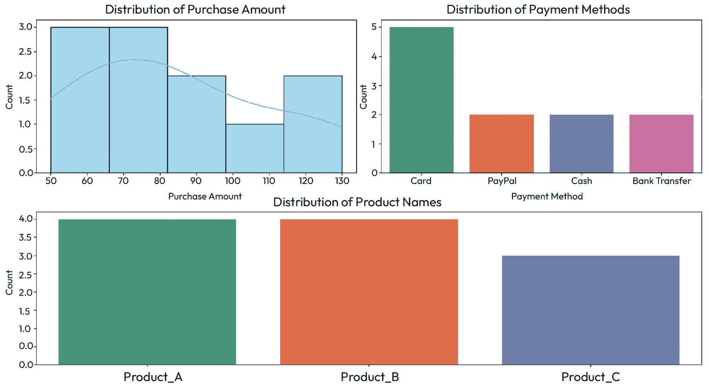

# 第四章：清理杂乱数据与数据处理

在本章中，我们将深入探讨**数据处理**的策略，重点介绍高效清理和修复杂乱数据集的技巧。我们将移除无关列，系统地处理不一致的数据类型，并修复日期和时间。

在本章中，我们将涵盖以下主题：

+   重命名列

+   移除无关或冗余的列

+   修复数据类型

+   处理日期和时间

# 技术要求

你可以在以下 GitHub 链接找到本章的所有代码：[`github.com/PacktPublishing/Python-Data-Cleaning-and-Preparation-Best-Practices/tree/main/chapter04`](https://github.com/PacktPublishing/Python-Data-Cleaning-and-Preparation-Best-Practices/tree/main/chapter04)。

每个文件都根据本章所涉及的相应章节命名。

# 重命名列

为列重命名更具描述性和意义的名称，使得每列的内容和目的更加容易理解。清晰直观的列名提高了数据集的可解释性，特别是在与他人共享或协作时。

为了更好地理解本章中介绍的所有概念，我们将在本章中使用一个场景。假设有一家电子商务公司，想要分析客户的购买数据，以优化其营销策略。数据集包含有关客户交易的信息，如购买金额、支付方式和交易时间戳。然而，数据集很杂乱，需要清理和处理才能提取有意义的洞察。

以下图展示了特征的分布。要构建以下的统计图表，请执行文件：[`github.com/PacktPublishing/Python-Data-Cleaning-and-Preparation-Best-Practices/blob/main/chapter04/1.descriptive_stats.py`](https://github.com/PacktPublishing/Python-Data-Cleaning-and-Preparation-Best-Practices/blob/main/chapter04/1.descriptive_stats.py)。运行此脚本后，数据和图表会自动生成。



图 4.1 – 数据转化前的特征分布

数据集包含五个列：

+   `CustomerID`：每个客户的唯一标识符。在这个示例中，客户 ID 的范围是`1`到`11`。

+   `ProductName`：表示购买的产品名称。在数据集中，考虑了三种产品：`Product_A`、`Product_B`和`Product_C`。

+   `PurchaseAmount`：表示客户在某个产品上的消费金额。金额使用的是任意货币。

+   `PaymentMethod`：描述客户用于购买的支付方式。支付方式包括`Card`、`PayPal`、`Cash`和`Bank Transfer`。

+   `Timestamp`：表示购买发生的日期和时间。它以`datetime`对象的格式呈现。

我们首先要检查和更新的是列名。让我们在接下来的部分开始这项工作。

## 重命名单个列

现在，这家电子商务公司决定重新品牌化其产品，需要更改与产品信息相关的列名。我们将从重命名一个列开始，然后进一步重命名多个列以配合品牌重塑的计划。有关重命名示例，请访问 [`github.com/PacktPublishing/Python-Data-Cleaning-and-Preparation-Best-Practices/blob/main/chapter04/2.rename_columns.py`](https://github.com/PacktPublishing/Python-Data-Cleaning-and-Preparation-Best-Practices/blob/main/chapter04/2.rename_columns.py)。

让我们看看如何在数据集中重命名一个列：

```py
df.rename(columns={'ProductName': 'OldProductName'}, inplace=True)
```

`inplace=True` 参数是 pandas DataFrame 方法中的一个可选参数，它允许你直接修改 DataFrame，而不必创建一个新的 DataFrame 对象。

当`inplace`设置为`True`时，DataFrame 会就地修改，这意味着更改会应用到原始的 DataFrame 对象上。这在你想更新或修改 DataFrame 而无需将修改后的 DataFrame 分配给新变量时非常有用。

如果没有指定`inplace=True`或者将其设置为`False`（这是默认行为），DataFrame 方法会返回一个新的修改后的 DataFrame 对象，原始 DataFrame 不会被改变。在这种情况下，你需要将修改后的 DataFrame 分配给一个新变量以保存更改。

注意

需要注意的是，使用`inplace=True`可能是一个破坏性操作，因为它会直接修改原始的 DataFrame。因此，建议谨慎使用，并确保在需要时有原始 DataFrame 的备份。如果你有一个大数据集，原地修改可以帮助节省内存。

在下一节中，我们将重命名多个列，以便与品牌重塑活动保持一致。

## 重命名所有列

在一次品牌重塑活动后，公司决定将`OldProductName`重命名为`NewProductName`，并将`PurchaseAmount`重命名为`NewPurchaseAmount`，以便与更新后的产品名称一致。此代码演示了如何一次性重命名多个列：

```py
df.rename(columns={'OldProductName': 'NewProductName', 'PurchaseAmount': 'NewPurchaseAmount'}, inplace=True)
```

如果你想重命名 DataFrame 中的列，并确保过程顺利且无错误，我们可以添加错误处理。例如，确保你打算重命名的列确实存在于 DataFrame 中。如果某个列名拼写错误或不存在，重命名操作将引发错误：

```py
if 'OldProductName' in df.columns:
try:
# Attempt to rename multiple columns
  df.rename(columns={'OldProductName': 'NewProductName', 'PurchaseAmount': 'NewPurchaseAmount'}, inplace=True)
except ValueError as ve:
  print(f"Error: {ve}")
else:
  print("Error: Column 'OldProductName' does not exist in the DataFrame.")
```

注意

确保新的列名在 DataFrame 中不存在，以避免覆盖已有的列。

重命名列是我们让数据更整洁、易于理解的最简单操作之一。接下来，我们通常会做的是只保留我们需要的或关心的列，如下一节所讨论的那样。

# 删除无关或冗余的列

大型数据集通常包含大量列，其中一些可能与当前的分析或任务无关。通过删除这些列，我们可以获得一些显著的好处。首先，存储需求大幅减少，从而节省成本并提高资源的使用效率。此外，精简后的数据集使查询性能更快，内存使用更加优化，并且加快了复杂分析的处理时间。这不仅提高了数据处理任务的整体效率，也简化了大型数据集的管理和维护。此外，在基于云的环境中，存储成本是一个重要因素，删除不必要的列有助于提高成本效率。所以，让我们看看如何以高效的方式删除列。

在我们之前展示的电子商务数据集中，我们收集了有关客户购买的信息。然而，由于你的分析侧重于与产品相关的指标和客户行为，某些列，如`CustomerID`和`Timestamp`，可能对当前分析而言不相关。目标是通过删除这些列来精简数据集。你可以通过以下 Python 脚本进行操作：[`github.com/PacktPublishing/Python-Data-Cleaning-and-Preparation-Best-Practices/blob/main/chapter04/3.dropping_columns.py`](https://github.com/PacktPublishing/Python-Data-Cleaning-and-Preparation-Best-Practices/blob/main/chapter04/3.dropping_columns.py)：

```py
columns_to_drop = ['CustomerID', 'Timestamp'] # Replace with the names of the columns you want to drop
try:
# Drop columns considered irrelevant for the current analysis
    df.drop(columns=columns_to_drop, inplace=True)
except KeyError as ke:
    print(f"Error: {ke}")
```

现在，如果你查看数据集，删除前的列是这样的：

```py
Index(['CustomerID', 'NewProductName', 'NewPurchaseAmount', 'PaymentMethod','Timestamp'],dtype='object')
```

删除这两列后，我们得到如下结果：

```py
Index(['NewProductName', 'NewPurchaseAmount', 'PaymentMethod'], dtype='object')
```

注意

Python 默认区分大小写。这意味着`ColumnName`和`columnname`被视为不同的。

我们如前所示成功移除了不必要的列。为了进一步评估内存效率，我们可以计算删除列前后 DataFrame 的内存消耗。以下代码提供了一个 Python 示例，演示如何计算删除列前后 DataFrame 的内存使用量：

```py
print("Initial Memory Usage:")
print(df.memory_usage().sum() / (1024 ** 2), "MB") # Convert bytes to megabytes
print("\nMemory Usage After Dropping Columns:")
print(df.memory_usage().sum() / (1024 ** 2), "MB") # Convert bytes to megabytes
```

初始时，DataFrame 的内存使用量大约为 0.00054 兆字节，删除列后，内存使用量降至约 0.00037 兆字节。内存使用量的减少展示了接近 31%的优化。

虽然这个示例涉及的是一个小数据集，但当这些原则扩展到大数据场景时，内存效率的影响更加显著。在大规模数据集中，删除不必要的列的影响将更加明显。

为了强调操作的重要性，考虑一个包含大量数据集的场景。最初，数据集的大小为 100,000 兆字节，经过去除不必要的列后，大小减少到 69,000 兆字节。为了执行相同的工作负载，最初的选择是使用 AWS EC2 实例类型`r7g.4xlarge`，其小时费率为$1.0064，内存为 128 GiB，因为我们需要 100GB 的内存才能加载数据集。然而，通过将数据集大小减少到 61GB，便可以选择一种更具成本效益的替代方案，使用`r7g.2xlarge`实例，小时费率为$0.5032，内存为 64 GiB。在五分钟的工作负载运行时间的背景下，操作前的数据处理成本如下：

```py
Cost_before = (Hourly Rate/60) * Runtime(in minutes) = (1.0064/60) * 5 = 0.0838$
Cost_after = (Hourly Rate/60) * Runtime(in minutes) = (0.5032/60) * 5 = 0.041$
```

去除不必要的列后，解决方案的成本大约降低了 50%。这代表通过优化数据集并使用更合适的 AWS 实例类型所实现的成本节省。

这个例子的简洁性突显了一个重要的讯息：

*通过关注真正重要的部分来简化你的数据操作，让这种简洁性* *推动成本效益的提高。*

从去除列到修复不一致数据类型的过渡涉及确保数据集中剩余列的质量和完整性。

# 处理不一致和错误的数据类型

在处理 DataFrame 时，确保每一列具有正确的数据类型非常重要。不一致或错误的数据类型可能会导致分析中的错误、意外的行为以及在执行操作时遇到困难。让我们看看如何处理这种情况。你可以在这里找到这个例子的代码：[`github.com/PacktPublishing/Python-Data-Cleaning-and-Preparation-Best-Practices/blob/main/chapter04/4.data_types.py`](https://github.com/PacktPublishing/Python-Data-Cleaning-and-Preparation-Best-Practices/blob/main/chapter04/4.data_types.py)。

## 检查列

检查数据中每一列的类型是识别任何不一致或错误数据类型的重要步骤。DataFrame 的`dtypes`属性提供了每一列的数据类型信息。让我们检查数据集中各列的数据类型：

```py
print("\nUpdated Data Types of Columns:")
print(df.dtypes)
```

这里展示了几种类型：

```py
CustomerID         int64
ProductName       object
PurchaseAmount     int64
PaymentMethod     object
Timestamp         object
```

检查数据类型可以帮助你了解当前数据的表示方式，并判断是否需要进行数据类型转换或变换以便进一步分析或数据清理。接下来的章节中，我们将进行不同类型的转换。

## 列类型转换

在数据处理的世界里，`astype`方法是你的好帮手。你应该熟悉的最常见的类型转换将在接下来的章节中介绍。

## 转换为数值类型

在 pandas 中，`astype()` 函数用于将列转换为指定的数字数据类型。例如，要将名为`PurchaseAmount`的列转换为整数类型，可以使用以下方法：

```py
df['PurchaseAmount'] = pd.to_numeric(df['PurchaseAmount'], errors='coerce')
```

现在，让我们看看如何将列转换为字符串。

## 转换为字符串类型

你可以使用`astype()`函数将列转换为字符串类型：

```py
df['ProductName'] = df['ProductName'].astype('str')
```

现在，让我们看看如何将列转换为类别类型。

## 转换为类别类型

**类别类型**（**categorical type**）指的是表示类别或离散变量的数据类型。类别变量可以取有限的，通常是固定的不同类别或级别。这些变量通常表示定性数据或没有内在顺序的属性：

```py
df['PaymentMethod'] = df['PaymentMethod'].astype('category')
```

我们将讨论的最后一个转换是布尔值（Boolean）。

## 转换为布尔类型

一个基于特定条件或标准的 `True`/`False` 值。这种转换通常用于创建二进制指示符或标志，使得数据更容易处理和分析：

```py
df['HasDive'] = df['ProductName'].str.contains('Dive', case=False)
```

前面的代码部分检查 `ProductName` 列中的每个元素是否包含子字符串 `Dive`。它返回一个布尔序列，其中每个元素如果满足条件则为 `True`，否则为 `False`：

```py
df['HasDive'] = df['HasDive'].astype('bool')
```

`astype('bool')` 方法用于显式地将 `HasDive` 列的数据类型转换为布尔类型。

使用 `astype(bool)` 时需要注意的事项

如果你遇到所有值都被转换为 `True` 的情况，可能是由于以下原因之一：

1\. 在布尔上下文中，`.astype(bool)` 会将所有非零值转换为 `True`。在这种情况下，请考虑该列是否包含了意外或不必要的非零值。

2\. 使用 `.astype(bool)` 时为 `True`。检查该列中是否存在缺失值，并考虑如何处理这些缺失值。在转换之前，可能需要填充或删除缺失值。

在本章的最后一部分，我们将讨论如何处理日期和时间。

# 处理日期和时间

想象一下，你有关于事件发生时间的数据——能够理解和处理这些时间相关的数据是理解模式和趋势的关键。它不仅仅是了解事件发生的时间，而是通过数据更轻松地进行可视化和讲述故事。无论是分析随时间变化的趋势，筛选特定时期的数据，还是使用机器学习进行预测，熟练掌握日期和时间是从涉及时间维度的数据集中解锁宝贵见解的关键。

现在我们理解了为什么处理日期和时间如此重要，下一步是学习如何获取与时间相关的信息并让它为我们所用。

## 导入并解析日期和时间数据

Python 提供了几种主要的日期解析函数，具体取决于输入日期字符串的格式和所需的输出。让我们讨论一些常用的日期解析函数。

### pandas 库中的 `pd.to_datetime()`

此函数专门用于解析 pandas DataFrame 或 Series 中的日期字符串，但也可以独立使用。当处理表格数据时非常适用，并且允许同时处理多种日期格式：

```py
df['Timestamp3'] = pd.to_datetime(df['Timestamp'], format='%Y-%m-%d %H:%M:%S')
```

`format`参数指定了输入字符串的预期格式。在此示例中，`%Y`表示四位数字的年份，`%m`表示月份，`%d`表示日期，`%H`表示小时，`%M`表示分钟，`%S`表示秒。

注意事项

如果您的数据集包含缺失或不一致的时间戳值，请考虑使用`errors`参数。例如，`errors='coerce'`将把解析错误替换为**非时间**（**NaT**）值。

尽管`pd.to_datetime`效率较高，但对于大数据集，它可能会对性能产生影响。为了提高性能，考虑使用`infer_datetime_format=True`参数来自动推断格式（对标准格式效果较好）。当`infer_datetime_format`设置为`True`，并且`parse_dates`启用时，Pandas 将尝试自动推断列中日期时间字符串的格式。如果成功，它将切换到更高效的解析方法，在某些场景下可能将解析速度提高 5 到 10 倍。

如果您的数据涉及不同的时区，请考虑使用`utc`和`tz`参数来处理**协调世界时**（**UTC**）转换和时区本地化。

在下一节中，我们将介绍另一种方法，`strftime`。此方法允许自定义日期时间值，从而创建特定且易于阅读的时间表示。

### strftime()来自 datetime 模块

此函数用于根据*指定的格式字符串*将日期字符串解析为日期时间对象。当您有已知的日期格式并希望精确控制解析过程时，它非常适用：

```py
df['FormattedTimestamp'] = df['Timestamp'].dt.strftime('%b %d, %Y %I:%M %p')
```

结果 DataFrame 如下：

```py
             Timestamp     FormattedTimestamp
0  2022-01-01 08:30:45  Jan 01, 2022 08:30 AM
1  2022-01-02 14:20:30  Jan 02, 2022 02:20 PM
```

格式由格式说明符控制，每个说明符以百分号（`%`）字符开头，表示日期和时间的不同组成部分（例如，`%Y`表示年份，`%m`表示月份，`%d`表示日期，`%H`表示小时，`%M`表示分钟，`%S`表示秒等）。可以在 Python 文档中找到完整的格式说明符列表：[`strftime.org/`](https://strftime.org/)。

与`strftime`所要求的严格结构不同，`dateutil.parser.parse()`在解释各种日期和时间表示方式方面表现出色，提供了一种动态的解决方案，用于解析多种不同的日期时间字符串，正如我们将在下一节中看到的那样。

### dateutil.parser.parse()来自 dateutil 库

此函数提供了一种灵活的方法来解析日期字符串，*自动推断*输入的格式。当处理多种日期格式或格式未知时，它非常有用：

```py
df['Timestamp2'] = df['Timestamp'].apply(parser.parse)
```

需要注意的是，这种方法的解析器可以推断并*处理时区信息*，使得处理来自不同时间区的数据变得更加便捷。

在下一部分中，我们不再处理日期和时间，而是转向将其分割为各个部分，如天、月和年。

## 提取日期和时间的组件

你可以使用 datetime 模块提供的属性提取 datetime 对象的特定组件，如年份、月份、日期、小时、分钟或秒：

```py
df['Day'] = df['Timestamp'].dt.day
df['Month'] = df['Timestamp'].dt.month
df['Year'] = df['Timestamp'].dt.year
```

使用 `.dt` 访问器，我们可以从 `Timestamp` 列中提取天、月和年的组件，并创建新的列 `Day`、`Month` 和 `Year`，如下所示：

```py
             Timestamp  Day  Month  Year
0  2022-01-01 08:30:45    1      1  2022
1  2022-01-02 14:20:30    2      1  2022
```

提取组件在以下情况下非常有用：

+   **时间分析**：如果你的分析涉及到跨天、跨月或跨年的模式或趋势，提取这些组件有助于进行更为专注的探索。

+   **分组与聚合**：当基于时间模式对数据进行分组时，提取组件可以方便地进行聚合和总结。

+   **时间序列分析**：对于时间序列分析，将日期时间值分解为各个组件对理解季节性和趋势至关重要。

继续计算时间差异和持续时间，将通过引入动态维度提升我们对时间数据的探索。

## 计算时间差异和持续时间

当使用减法计算两个 datetime 对象之间的时间差时，你可以利用 Python `datetime` 库的内在能力来生成一个 `timedelta` 对象。这个对象封装了两个时间戳之间的持续时间，以天、小时、分钟和秒为单位，提供了对时间差的全面表示。该部分的代码可以在此找到：[`github.com/PacktPublishing/Python-Data-Cleaning-and-Preparation-Best-Practices/blob/main/chapter04/8.time_deltas.py`](https://github.com/PacktPublishing/Python-Data-Cleaning-and-Preparation-Best-Practices/blob/main/chapter04/8.time_deltas.py):

```py
df['TimeSincePreviousPurchase'] = df['Timestamp'].diff()
```

这个 pandas 函数 `.diff()` 计算 `Timestamp` 列中每个元素与前一个元素之间的差异。它有效地计算了自上一个时间戳以来的时间差。

```py
df['TimeUntilNextPurchase'] = -df['Timestamp'].diff(-1)
```

与第一行类似，这计算了 `Timestamp` 列中每个元素与下一个元素之间的差异。它计算了直到下一个时间戳的时间持续。负号应用于反转时间差的符号。这样做是为了获取直到下次购买的时间差的正表示。

让我们看看数据中时间差是如何表现的：

```py
             Timestamp TimeSincePreviousPurchase TimeUntilNextPurchase
0  2022-01-01 08:30:45                       NaT       1 days 05:49:45
1  2022-01-02 14:20:30           1 days 05:49:45       1 days 05:54:40
```

如果你在考虑何时在数据工作流程中加入一些时间差异，可以阅读以下内容：

+   **基于时间的分析**：计算时间差异可以分析事件或时间戳之间的持续时间。它有助于量化不同过程、活动或间隔所花费的时间。

+   **性能测量**：通过测量任务或事件的持续时间，可以评估性能指标，如响应时间、处理时间或完成操作所需的时间。这些信息可以指导优化工作，并识别改进的领域。

+   **事件排序**：通过比较时间戳，您可以确定事件发生的时间顺序。这种排序有助于理解事件之间的关系及其依赖性。

+   **服务级别协议（SLA）监控**：时间差异对于 SLA 监控非常有用。通过比较与 SLA 指标相关的时间戳，例如响应时间或解决时间，您可以确保遵守约定的服务水平。监控时间差异有助于识别 SLA 违反并采取适当的措施。

pandas 中的`.diff()`方法主要用于计算 Series 或 DataFrame 中*连续*元素之间的差异。虽然计算一阶差异（即相邻元素之间的差异）是直接的，但还有其他需要考虑和探索的变体。

### 指定时间间隔

您可以自定义`.diff()`来计算特定*时间间隔*内元素之间的差异。这是通过传递`periods`参数来指定要移动的元素数量：

```py
df['TimeDifference'] = df['Timestamp'].diff(periods=2)
```

让我们观察以下结果：

```py
           Timestamp TimeSincePreviousPurchase TimeDifference2periods
0  2022-01-01 08:30:45                      NaT                   NaT
1  2022-01-02 14:20:30          1 days 05:49:45                   NaT
2  2022-01-03 20:15:10          1 days 05:54:40       2 days 11:44:25
3  2022-01-04 12:45:30          0 days 16:30:20       1 days 22:25:00
```

如您所见，`.diff(periods=2)`计算了每个时间戳与之前两个位置之间的差异。`periods`参数允许您指定计算差异时要移动的元素数量。在这种情况下，它是`periods=2`，但您可以为其分配任何适合您用例的值。

### 处理缺失值

使用`diff(periods=2)`时，`.diff()`方法会为前两个元素引入 NaN，因为没有前一个元素来计算差异。您可以根据具体用例处理或填充这些缺失值：

```py
df['TimeDifference'] = df['Timestamp']. diff(periods=2).fillna(0)
```

让我们观察结果：

```py
             Timestamp TimeDiff2periods_nonulls TimeDifference2periods
0  2022-01-01 08:30:45                        0                    NaT
1  2022-01-02 14:20:30                        0                    NaT
2  2022-01-03 20:15:10          2 days 11:44:25        2 days 11:44:25
3  2022-01-04 12:45:30          1 days 22:25:00        1 days 22:25:00
```

如您所见，`fillna(0)`将 NaN 值替换为`0`。

从时间差异和持续时间到时区和夏令时，我们现在将讨论如何处理跨不同区域的时间数据的细节。

## 处理时区和夏令时

处理时区在处理跨多个地理区域的数据或准确的时间表示至关重要。时区帮助标准化不同地点的时间，考虑到由于地理边界和夏令时调整导致的 UTC 偏移。在我们的示例数据集中，我们将演示如何使用 pandas 处理时区：

```py
df['Timestamp_UTC'] = df['Timestamp'].dt.tz_localize('UTC')
```

我们将时间戳本地化到特定的时区，在这个例子中是`'UTC'`。

```py
df['Timestamp_NY'] = df['Timestamp_UTC'].dt.tz_convert('America/New_York')
```

然后，我们将本地化的时间戳转换为不同的时区，在这个例子中是`'America/New_York'`。让我们观察以下结果：

```py
             Timestamp             Timestamp_UTC              Timestamp_NY
0  2022-01-01 08:30:45 2022-01-01 08:30:45+00:00 2022-01-01 03:30:45-05:00
1  2022-01-02 14:20:30 2022-01-02 14:20:30+00:00 2022-01-02 09:20:30-05:00
```

想了解管理时区的重要性吗？让我们来看看它为什么重要：

+   在处理来自不同时间区的数据时，必须处理时区以确保准确的分析和解读。如果没有正确的时区处理，分析结果可能会因为时间表示不一致而出现偏差。

+   对于需要精确时间表示的应用，如金融交易、日志条目或事件跟踪，时区处理变得至关重要。

+   在整合来自不同来源的数据或合并数据集时，时区处理变得必要，以确保时间戳的准确对齐。这确保了事件的正确时间顺序，并避免了基于时间的分析中的不一致。

+   如果你正在开发面向不同时间区用户的应用或服务，处理时区是至关重要的，能够为用户提供基于他们本地时间的准确和相关信息。

考虑事项

时区处理应该在数据处理流程中始终如一地实施，以避免不一致或错误。

让我们总结一下本章的学习内容。

# 总结

本章讨论了清理和处理数据的技巧。从混乱数据的挑战开始，我们介绍了如何删除无关的列以及如何处理不一致的数据类型。通过电子商务数据集展示了实际案例，展示了使用 Python 代码进行有效的数据转换。特别强调了删除不必要列的重要性，突出了潜在的成本降低和内存效率提升，尤其是在大数据环境下。数据类型转换，包括数字、字符串、分类和布尔值转换，通过实际示例进行了说明。接着，本章深入探讨了处理日期和时间的复杂问题，展示了诸如`pd.to_datetime()`、`strftime`和`dateutil.parser.parse()`等方法。

随着本章的结束，它为下一章的数据合并和转换奠定了坚实的基础。
