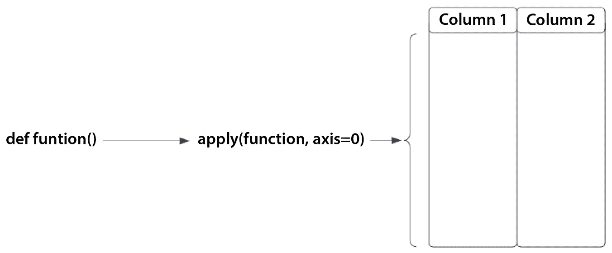
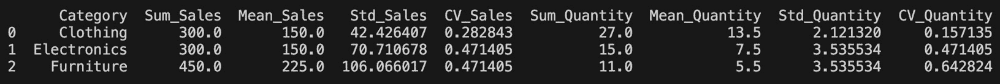
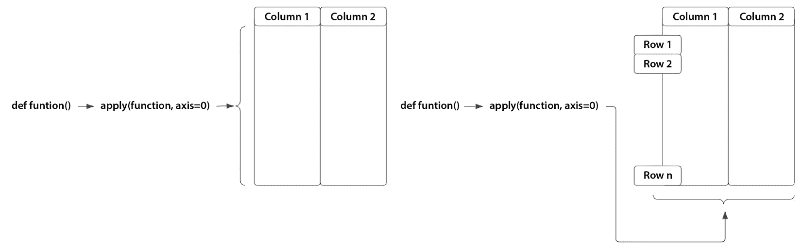

# 第六章：数据分组、聚合、过滤和应用函数

**数据分组**和**聚合**是数据清理和预处理中的基础技术，具有多个关键用途。首先，它们能够对大规模数据集进行总结，将庞大的原始数据转化为简洁、有意义的汇总，方便分析和洞察的提取。此外，聚合有助于处理缺失或噪声数据，通过平滑不一致性并填补数据空白。这些技术还帮助减少数据量，提高处理效率，并为进一步的分析或机器学习模型创建有价值的特征。

数据分组和聚合的主要组成部分包括分组键，它定义了数据的分段方式；聚合函数，它执行诸如求和、平均、计数等操作；以及输出列，它显示分组键和聚合后的值。

在本章中，我们将涵盖以下主要内容：

+   使用一个或多个键进行数据分组

+   对分组数据应用聚合函数

+   对分组数据应用函数

+   数据过滤

# 技术要求

你可以在以下 GitHub 仓库中找到本章的代码：[`github.com/PacktPublishing/Python-Data-Cleaning-and-Preparation-Best-Practices/tree/main/chapter06`](https://github.com/PacktPublishing/Python-Data-Cleaning-and-Preparation-Best-Practices/tree/main/chapter06)。

# 使用一个或多个键进行数据分组

在 pandas 中，数据分组是一项基础操作，它涉及根据一个或多个键将数据拆分为多个组，然后在每个组内执行操作。分组常用于数据分析，以便对数据子集进行汇总计算并获得洞察。让我们更深入地探讨数据分组，并通过示例来说明它们的使用。本节的代码可以在这里找到：[`github.com/PacktPublishing/Python-Data-Cleaning-and-Preparation-Best-Practices/blob/main/chapter06/2.groupby_full_example.py`](https://github.com/PacktPublishing/Python-Data-Cleaning-and-Preparation-Best-Practices/blob/main/chapter06/2.groupby_full_example.py)。

## 使用一个键进行数据分组

使用一个键进行数据分组是数据分析中的常见操作。

要使用一个键对数据进行分组，我们可以使用 DataFrame 的`groupby()`方法，并指定我们希望作为分组键的列：

```py
grouped = df.groupby('column_name')
```

在分组之后，你通常需要执行一些聚合操作。常见的聚合函数包括：

+   `grouped.sum()`：这会计算所有数值列的总和

+   `grouped.mean()`：这会计算平均值（算术平均）

+   `grouped.count()`：这会统计非空值的数量

+   `grouped.agg(['sum', 'mean', 'count'])`：这会同时应用多个聚合函数：`sum`、`mean` 和 `count`

让我们展示一个常见的应用案例，来应用我们的学习成果。假设我们为一家电子零售公司工作，需要分析不同产品的销售数据。以下是数据的一个样本：

```py
       Category Sub-Category Region  Sales        Date
0   Electronics       Mobile  North    200  2023-01-01
1   Electronics       Laptop  South    300  2023-01-02
2   Electronics       Tablet   East    250  2023-01-03
3   Electronics       Laptop   West    400  2023-01-04
4     Furniture        Chair  North    150  2023-01-05
5     Furniture        Table  South    350  2023-01-06
```

在数据分析中，某些列由于其*类别*性质，通常是进行分组的候选列。这些列通常表示类别、分类或时间相关的分段，适合围绕这些进行数据聚合：

+   **类别列**：表示数据中不同组别或类型的列。例如，产品类别、用户类型或服务类型。这些列有助于理解每个组的表现或行为。

+   **地理列**：表示地理区域的列，例如国家、地区、城市或商店位置。这些对于区域表现分析很有用。

+   **时间列**：表示与时间相关的信息的列，例如年份、季度、月份、周或天。按这些列进行分组有助于进行趋势分析。

+   **人口统计列**：描述人口统计属性的列，例如年龄段、性别或收入水平。这些列对于根据人口特征进行数据细分非常有用。

+   **交易相关列**：与交易性质相关的列，例如交易类型、支付方式或订单状态。这些列有助于理解交易数据的不同方面。

根据我们示例中的数据，适合进行分组的列包括`类别`、`子类别`和`地区`。如果我们每天有多个记录，并且想计算每日销售量，那么`日期`也可以作为一个候选列。在我们的例子中，经理要求我们报告每个类别的总销售量（销售额）。让我们看看如何计算这个：

```py
category_sales = df.groupby('Category')['Sales'].sum().reset_index()
```

在这个代码示例中，我们按`类别`列对数据进行分组，对每个类别的`销售`列求和，并重置索引。结果的 DataFrame 如下所示：

```py
      Category  Sales
0     Clothing   1070
1  Electronics   1370
2    Furniture   1270
```

现在我们已经看到了如何按单个键进行分组，让我们通过按`类别`和`地区`分组来增加一些复杂性。

## 使用多个键对数据进行分组

按多个键进行分组可以更细致、详细地检查数据。这种方法有助于发现仅使用单一键时可能隐藏的见解，从而更深入地理解数据集中的关系和模式。在我们的示例中，按`地区`和`类别`进行分组，不仅可以看到整体的销售表现，还能看到不同类别在每个地区的表现。这有助于识别哪些产品在特定地区受欢迎，从而根据地区特征调整营销策略。

要使用多个键对数据进行分组，我们将列名列表传递给`groupby()`方法。Pandas 将根据这些列的*唯一组合*来创建组：

```py
category_region_sales = df.groupby(['Category', 'Region'])['Sales'].sum().reset_index()
```

在这段代码中，我们按`Category`和`Region`列对数据进行分组，然后通过对每个组的`Sales`列求和来执行聚合。最后，我们重置索引。让我们看看这次操作的输出：

```py
       Category Region  Sales
0      Clothing   East    420
1      Clothing  North    100
2      Clothing  South    250
3      Clothing   West    300
4   Electronics   East    250
5   Electronics  North    420
6   Electronics  South    300
7   Electronics   West    400
8     Furniture   East    200
9     Furniture  North    150
10    Furniture  South    350
11    Furniture   West    570
```

只需一行代码，我们就能汇总并展示每个`Category`和`Region`值的所有销售数据，使我们的经理非常满意。现在，让我们看看在使用 groupby 语句时的一些最佳实践。

## 分组的最佳实践

在 pandas 中进行数据分组时，需要考虑几件事，以确保结果准确：

+   **缺失数据**：要注意用于分组的列中是否存在缺失数据。Pandas 会*排除*包含缺失数据的行，这可能会影响最终的计算结果。

+   `MultiIndex`：当按多个列分组时，pandas 会返回一个层次索引（`MultiIndex`）。在使用`MultiIndex`时要熟悉，并考虑在需要时重置索引，就像我们为了简化所做的那样。

+   **运算顺序**：执行分组和聚合的顺序*可能会影响结果*。请注意应用分组和聚合函数的顺序。

+   **分组大数据集**：对于大型数据集，分组可能会占用大量内存。考虑使用分块处理或并行处理等技术来管理内存使用和计算时间。

我们的管理团队看到了我们执行的 groupby 操作的效率，他们要求我们提供更详细的销售总结！通过设置多个键，我们可以通过对`Sales`列应用多个聚合函数，进一步增强我们的分析。这将为我们提供更详细的数据总结。

# 对分组数据应用聚合函数

在 pandas 中，使用`groupby()`方法对数据进行分组后，可以应用聚合函数对分组数据执行计算。**聚合函数**用于总结或计算每个组的统计信息，结果是一个新的 DataFrame 或 Series。让我们更深入地探讨如何在分组数据上应用聚合函数，并提供一些示例来说明其用法。

## 基本聚合函数

我们在第一部分中已经介绍了基本的聚合函数，因为没有聚合函数就无法执行 groupby。在本节中，我们将进一步探讨每个函数的作用，以及何时使用每个函数，首先展示以下表格中的所有可用函数：

| **聚合** **函数** | **描述** | **使用时机** | **代码示例** |
| --- | --- | --- | --- |
| `sum` | 对组中的所有值求和 | 当你需要每个组的总值时。**示例**：按类别计算总销售额。 | `df.groupby('Category')['Sales'].sum()` |
| `mean` | 计算组中值的平均数 | 当你需要每个组的平均值时。**示例**：按区域计算平均销售额。 | `df.groupby('Category')['Sales'].mean()` |
| `count` | 计算组中非空值的数量 | 当你需要知道每个组中出现次数时。**示例**：每个子类别的销售交易次数。 | `df.groupby('Category')['Sales'].count()` |
| `min` | 查找组中的最小值 | 当你需要每个组中的最小值时。**示例**：每个地区的最小销售值。 | `df.groupby('Category')['Sales'].min()` |
| **聚合** **函数** | **描述** | **何时** **使用** | **代码示例** |
| `max` | 查找组中的最大值 | 当你需要每个组中的最大值时。**示例**：每个类别的最大销售值。 | `df.groupby('Category')['Sales'].max()` |
| `median` | 查找组中的中位数值 | 当你需要一个排序数字列表中的中间值时。**示例**：每个类别的中位销售值。 | `df.groupby('Category')['Sales'].median()` |
| `std`（标准差） | 衡量组中数值的分布 | 当你需要了解数值的变化时。**示例**：每个地区的销售标准差。 | `df.groupby('Category')['Sales'].std()` |

表 6.1 – 基本聚合函数的汇总表

你可以逐个调用这些函数，也可以将它们一起调用，例如：

```py
total_sales = df.groupby('Category')['Sales'].sum().reset_index()
```

这计算了每个类别的销售数量，正如我们所学的，如果这是你从数据集中提取的唯一聚合信息，那么这已经足够了。然而，如果你被要求为不同的产品类别生成多个销售聚合，一个更高效的方法是一次性执行所有的聚合：

```py
category_region_sales_agg = df.groupby(['Category', 'Region'])['Sales'].agg(['sum', 'mean']).reset_index()
```

在这段代码中，我们对 `Sales` 列应用了多个聚合函数（`sum` 和 `mean`）。结果如下：

```py
       Category Region  sum   mean
0      Clothing   East  420  210.0
1      Clothing  North  100  100.0
2      Clothing  South  250  250.0
3      Clothing   West  300  300.0
4   Electronics   East  250  250.0
5   Electronics  North  420  210.0
6   Electronics  South  300  300.0
7   Electronics   West  400  400.0
8     Furniture   East  200  200.0
9     Furniture  North  150  150.0
10    Furniture  South  350  350.0
11    Furniture   West  570  285.0
```

注意

我们可以在分组子句中添加任意数量的聚合。

我们在计算管理团队要求的各种指标时非常高效，结果是他们现在热衷于理解每个地区和类别的销售指标以及唯一子类别的销售数量。接下来我们来做这个。

## 使用多个列的高级聚合

为了了解每个地区和类别的销售指标以及每个子类别的唯一销售数量，我们可以对额外的列进行分组，并对 `Sales` 和 `Subcategory` 列应用多个聚合：

```py
advanced_agg = df.groupby(['Category', 'Region']).agg({
  'Sales': ['sum', 'mean', 'count'],
  'Sub-Category': 'nunique' # Unique count of Sub-Category
}).reset_index()
```

在这段代码中，我们通过 `Category` 和 `Region` 对 DataFrame 进行分组，并执行了几个聚合操作：

+   `'Sales': ['sum', 'mean', 'count']` 计算每个组的总销售额、平均销售额和交易次数（行数）。

+   `'Sub-Category': 'nunique'` 计算每个 `Category` 和 `Region` 组内唯一子类别的数量。

这里展示的是汇总结果：

```py
       Category Region Sales              Sub-Category
                         sum   mean count      nunique
0      Clothing   East   420  210.0     2            2
1      Clothing  North   100  100.0     1            1
2      Clothing  South   250  250.0     1            1
3      Clothing   West   300  300.0     1            1
4   Electronics   East   250  250.0     1            1
5   Electronics  North   420  210.0     2            1
6   Electronics  South   300  300.0     1            1
```

现在，你可能会想，我们通过这些计算学到了什么？让我来回答这个问题！我们计算了总销售额、平均销售额和交易次数，以了解不同类别-地区组合的财务表现。此外，`Sub-Category` 的唯一计数揭示了我们产品分销策略的关键方面。此分析有多个目的：它为每个类别-地区细分内产品的多样性提供了洞察。例如，在我们的数据背景下，了解在不同类别下，每个地区销售的独特产品（子类别）数量，有助于了解市场细分和产品组合策略。它还帮助评估市场渗透率，通过突出显示提供更多产品的地区，支持产品组合管理的战略决策，包括扩展和针对区域偏好的库存策略。

标准的聚合函数，如求和、平均值和计数，提供了基本统计信息。然而，自定义函数使你能够计算那些特定于你业务需求或分析目标的指标。例如，计算销售数据的范围或变异系数，可以揭示不同组内销售的分布和变异性。如你所见，我们被要求实现这些自定义指标，接下来我们将进行此操作。

## 应用自定义聚合函数

当聚合需要复杂的计算，超出简单统计时，自定义函数非常有价值。你可以在需要计算那些独特于你分析目标或业务背景的指标时使用它们。例如，在销售分析中，你可能希望计算利润率、客户生命周期价值或流失率，这些通常不是通过标准聚合函数能够获得的。

让我们回到示例中，构建我们被要求计算的指标：对于每个地区，我们要计算销售范围和销售变异性。让我们看看下面的代码：

1.  我们创建一个计算销售范围（最大值与最小值的差）的函数：

    ```py
    def range_sales(series):
      return series.max() - series.min()
    ```

1.  然后，我们创建一个计算销售变异系数的函数，它衡量相对于均值的相对变异性：

    ```py
    def coefficient_of_variation(series):
      return series.std() / series.mean()
    ```

1.  `df` 数据框随后按 `Region` 分组：

    ```py
    advanced_agg_custom = df.groupby('Region').agg({
      'Sales': ['sum', 'mean', 'count', range_sales, coefficient_of_variation],
      'Sub-Category': 'nunique'
    }).reset_index()
    ```

    `Sales: ['sum', 'mean', 'count', range_sales, coefficient_of_variation]` 使用自定义函数计算总销售额、平均销售额、交易次数、销售范围和变异系数。`'Sub-Category':'nunique'` 计算每个组内独特子类别的数量。然后，我们重置索引以扁平化 `df` 数据框，使其更易于处理。

1.  最后，我们重命名聚合后的列，以便输出更加清晰和易于阅读：

    ```py
    advanced_agg_custom.columns = [
      'Region', 'Total Sales', 'Average Sales', 'Number of Transactions',
      'Sales Range', 'Coefficient of Variation', 'Unique Sub-Categories'
    ]
    ```

1.  让我们打印最终的数据框：

    ```py
    print(advanced_agg_custom)
    ```

最终的数据框在这里呈现：

```py
  Region  TotalSales SalesRange  Coef Unique Sub-Categories
0   East         870        120  0.24                     4
1  North         670        120  0.32                     3
2  South         900        100  0.16                     3
3   West        1270        230  0.34                     4
```

让我们花点时间了解一下各个区域的销售波动性。每个区域内销售额的范围可以揭示**差异**或**区别**，即最高和最低销售额之间的差距。例如，较大的范围可能表明不同区域间消费者需求或销售表现的显著差异。变异系数有助于将销售波动性相对于其平均值进行标准化。较高的变异系数表明更大的相对波动性，这可能促使进一步调查影响销售波动的因素。

注意

我希望你能清楚地理解，只要一个函数能够从输入的值序列中计算出*单一*的聚合结果，你就可以将它作为自定义聚合函数来构建。该函数还应返回一个单一的标量值，这是该组聚合的结果。

现在，让我们来看一下在使用聚合函数时的一些最佳实践。

## 聚合函数的最佳实践

在使用 Pandas 中的聚合函数时，需要考虑一些事项，以确保结果的准确性：

+   编写高效的自定义函数，尽量减少计算开销，特别是在处理大型数据集时。避免不必要的循环或操作，这些操作可能会减慢处理时间。

+   清楚地记录自定义聚合函数的逻辑和目的。这有助于在团队或组织内部维护和共享代码，确保分析的透明性和可重复性。

+   通过将结果与已知基准或手动计算进行比较，验证自定义聚合函数的准确性。此步骤对于确保自定义指标的可靠性和正确实现至关重要。

在 Pandas 中，使用 `.agg()` 方法与 `groupby` 时，你定义的聚合函数*理想情况下*应该为每个操作的列返回单一的标量值。然而，在某些情况下，你可能希望返回多个值或执行更复杂的操作。虽然 Pandas 的 `.agg()` 方法期望返回标量值，但你可以通过使用返回元组或列表的自定义函数来实现更复杂的聚合。然而，这需要谨慎处理，并且在 Pandas 的原生聚合框架中通常并不简单。对于需要返回多个值或执行复杂计算的更复杂场景，我们可以使用 `apply()` 替代 `agg()`，它更灵活，正如我们将在下一节中看到的。

# 在分组数据上使用 apply 函数

Pandas 中的 `apply()` 函数是一个强大的方法，用于沿着 DataFrame 或 Series 的轴应用自定义函数。它非常灵活，可以用于各种场景，以根据自定义逻辑操作数据、计算复杂的聚合或转换数据。`apply()` 函数可以用于以下操作：

+   按行或按列应用函数

+   当与 `groupby()` 配合使用时，将函数应用于数据组

在接下来的章节中，我们将重点讨论如何在数据分组后使用`apply`函数，首先按我们想要的列进行分组，然后执行`apply`操作。

注意

使用不带`groupby`的`apply`函数，可以直接对 DataFrame 的行或列应用函数。这在你需要执行不需要分组数据的行或列级别的操作时非常有用。应用相同的学习，只需跳过`groupby`子句。

在使用 pandas 的`apply`函数时，`axis=0`（默认）将函数应用于每一列，而`axis=1`则将其应用于每一行。我们来深入了解一下这一点。

`axis=0`将函数应用于*行*。换句话说，它独立处理每一*列*。当你想按列汇总数据（例如，对每列的值求和）时，通常会使用此方法，如下图所示：



图 6.1 – Apply()与 axis=0

如果我们回到我们的用例，管理团队希望了解每个类别中产品的实际销售数量，而不仅仅是销售总额。我们的示例变得越来越复杂，因此，用`apply()`实现这个功能是个好主意。我们来看一个代码示例，代码也可以在这里找到：[`github.com/PacktPublishing/Python-Data-Cleaning-and-Preparation-Best-Practices/blob/main/chapter06/3.apply_axis0.py`](https://github.com/PacktPublishing/Python-Data-Cleaning-and-Preparation-Best-Practices/blob/main/chapter06/3.apply_axis0.py)。

1.  让我们扩展我们的 DataFrame，添加`Quantity`列：

    ```py
    data = {
      'Category': ['Electronics', 'Electronics', 'Furniture', 'Furniture', 'Clothing', 'Clothing'],
      'Sub-Category': ['Mobile', 'Laptop', 'Chair', 'Table', 'Men', 'Women'],
      'Sales': [100, 200, 150, 300, 120, 180],
      'Quantity': [10, 5, 8, 3, 15, 12],
      'Date': ['2023-01-01', '2023-01-02', '2023-01-03', '2023-01-04', '2023-01-05', '2023-01-06']
    }
    df = pd.DataFrame(data)
    ```

1.  然后我们将`Date`列转换为日期时间格式：

    ```py
    df['Date'] = pd.to_datetime(df['Date'])
    ```

1.  现在，让我们定义一个自定义函数来计算`Sales`和`Quantity`的多个统计量：

    ```py
    def compute_statistics(series):
        sum_sales = series['Sales'].sum()
        mean_sales = series['Sales'].mean()
        std_sales = series['Sales'].std()
        cv_sales = std_sales / mean_sales
        sum_quantity = series['Quantity'].sum()
        mean_quantity = series['Quantity'].mean()
        std_quantity = series['Quantity'].std()
        cv_quantity = std_quantity / mean_quantity
        return pd.Series([sum_sales, mean_sales, std_sales, cv_sales, sum_quantity, mean_quantity, std_quantity, cv_quantity],
    index=['Sum_Sales', 'Mean_Sales', 'Std_Sales', 'CV_Sales',
    'Sum_Quantity', 'Mean_Quantity', 'Std_Quantity', 'CV_Quantity'])
    ```

    这个自定义函数（`compute_statistics`）现在计算了在每个由`Category`定义的组内，`Sales`和`Quantity`列的多个统计量（总和、均值、标准差、变异系数）。对于每个类别组（系列），它计算以下内容：

    +   `Sum_Sales`：销售总和

    +   `Mean_Sales`：销售的均值

    +   `Std_Sales`：销售的标准差

    +   `CV_Sales`：`Sum_Quantity`：数量的总和

    +   `Mean_Quantity`：数量的均值

    +   `Std_Quantity`：数量的标准差

    +   `CV_Quantity`：数量的变异系数

    最终，它返回一个包含这些计算统计量的 pandas Series，并适当地进行索引。

1.  接下来，我们将在`Category`上执行`groupby`操作，并应用我们自定义的函数来计算`Sales`和`Quantity`的统计量：

    ```py
    result_complex = df.groupby('Category').apply(compute_statistics).reset_index()
    ```

    我们将`apply()`与`groupby('Category')`结合使用，将`compute_statistics`函数应用于由`Category`列定义的每组销售数据。该函数作用于整个组（系列），允许同时计算`Sales`和`Quantity`列的统计数据。最后，使用`reset_index()`将结果 DataFrame 展平，提供按类别划分的两个列的统计数据结构化输出。我们来看一下最终的 DataFrame：



通过按`Category`对数据进行分组，我们可以在类别层面分析销售和数量指标，这有助于我们理解不同类型的产品（电子产品、家具、服装）在销售和数量方面的表现。正如我们从呈现的结果中看到的，`Furniture`（家具）是主要的收入来源，因为它具有最高的`Sum_Sales`和`Mean_Sales`，这表明该类别包含受欢迎或高价值的产品。具有较低`CV_Sales`和`CV_Quantity`值的类别，如`Clothing`（服装），在销售和数量上更为稳定，表明需求稳定或销售模式可预测，而具有较高变动性的类别（`Std_Sales`和`Std_Quantity`）可能表示销售波动或季节性需求。

这在数据分析方面非常有用，但现在，我们需要做出一些与产品组合、定价策略和市场营销措施相关的战略决策。在这一点上，让我们更加富有创意：

+   高`Sum_Sales`值且指标稳定（`CV_Sales`，`CV_Quantity`）的类别是扩展产品线或投资市场营销的最佳候选者

+   高变动性的类别（`Std_Sales`，`Std_Quantity`）可能需要动态定价策略或季节性促销来优化销售

+   我们可以使用`Mean_Sales`和`Mean_Quantity`的值来识别具有增长潜力的类别

在使用 pandas 中的`apply()`函数时，如果没有指定 axis 参数，默认行为是`axis=0`。这意味着该函数将应用于每一列（即，它将独立处理每一列）。这就是我们在之前示例代码中所采用的方法。根据你的具体使用情况，可以调整`apply()`来按行（`axis=1`）或按列（`axis=0`）操作。接下来，让我们关注`axis=1`。

`axis=1`沿列应用函数，因此它独立处理每一行。这通常用于你想要执行按行操作时（例如，为每一行计算自定义指标）。



图 6.2 – Apply() 使用 axis=1

按行应用函数允许进行行级转换和计算。让我们通过 `axis=1` 来查看一个代码示例。我们先定义一个要跨列（`axis=1`）应用的函数。代码可以在这里找到：[`github.com/PacktPublishing/Python-Data-Cleaning-and-Preparation-Best-Practices/blob/main/chapter06/4.apply_axis1.py`](https://github.com/PacktPublishing/Python-Data-Cleaning-and-Preparation-Best-Practices/blob/main/chapter06/4.apply_axis1.py)：

1.  `row_summary` 函数将 DataFrame 的单行作为输入，并返回该行数据的汇总。该函数的输入是关键，理解这一点是至关重要的，它是作为 pandas Series 传入的 DataFrame 单行：

    ```py
    def row_summary(row):
        total_sales_quantity = row['Sales'] + row['Quantity']
        sales_quantity_ratio = row['Sales'] / row['Quantity'] if row['Quantity'] != 0 else np.nan
        return pd.Series(
            [total_sales_quantity,sales_quantity_ratio],
            index=['Total_Sales_Quantity',
            'Sales_Quantity_Ratio'])
    ```

    `total_sales_quantity` 变量将存储该行的 `Sales` 和 `Quantity` 的总和。`sales_quantity_ratio` 变量将存储该行的 `Sales` 与 `Quantity` 的比率，如果数量为零，则为 `np.nan`，以提供销售效率的洞察。

1.  我们按行应用函数（`axis=1`）：

    ```py
    df_row_summary = df.apply(row_summary, axis=1)
       Total_Sales_Quantity  Sales_Quantity_Ratio
    0                 110.0                 10.00
    1                 205.0                 40.00
    2                 158.0                 18.75
    3                 303.0                100.00
    4                 135.0                  8.00
    5                 192.0                 15.0
    ```

    这将生成一个新的 `df_row_summary` DataFrame，其中每一行对应于原始 `df` 中每行的 `total_sales_quantity` 和 `sales_quantity_ratio` 计算值。

1.  最后，我们按 `Category` 分组，以计算每个类别的指标：

    ```py
    category_metrics = df.groupby('Category')[['Total_Sales_Quantity', 'Sales_Quantity_Ratio']].mean().reset_index()
    ```

让我们看看最终结果：

```py
     Category  Total_Sales_Quantity  Sales_Quantity_Ratio
0     Clothing                 163.5                11.500
1  Electronics                 157.5                25.000
2    Furniture                 230.5                59.375
```

`total_sales_quantity` 指标提供了一个简单但有效的衡量标准，帮助我们了解每笔交易的总体销售表现，理解销售数量（`Quantity`）和销售价值（`Sales`）的综合影响。通过分析 `total_sales_quantity`，我们可以识别出销售和数量都较高的交易，这可能表示受欢迎的产品类别或成功的销售策略。相反，它也有助于识别表现不佳的交易，从而指导库存管理和促销调整，以提高销售效率和产品表现。这种双重洞察有助于战略决策，以优化销售和库存管理。

`sales_quantity_ratio` 指标提供了每单位数量的销售效率的宝贵洞察，揭示了产品如何有效地将数量转化为收入。这个指标对于评估每单位销售所产生的价值至关重要。通过它，我们可以识别每单位产生高收入的产品，表明这些可能是值得优先考虑营销的高价值商品。相反，它有助于发现每单位收入较低的产品，提示可能需要调整价格、进行有针对性的促销，或重新评估产品组合，以优化盈利能力和销售表现。

注意

在可能的情况下，出于性能考虑，优先使用矢量化操作（内置的 pandas 方法或 NumPy 函数）而不是 `apply`。矢量化操作通常更快，因为它们利用了优化的 C 代码。

到目前为止我们探讨的概念和技巧直接体现了数据清理中筛选的重要性。一旦我们应用了转换或聚合数据，筛选就能帮助我们聚焦于对分析有意义的特定数据子集，或满足特定条件的子集。例如，在计算了不同产品类别的销售表现指标（如`Total_Sales_Quantity`和`Sales_Quantity_Ratio`）之后，筛选可以帮助我们识别需要进一步调查的类别或产品，比如那些具有异常高或低表现指标的产品。

# 数据筛选

**数据筛选**是数据处理中的一项基本操作，涉及根据指定条件或标准选择数据子集。它用于从较大的数据集中提取相关信息、排除不需要的数据点，或集中关注分析或报告所需的特定部分。

在下面的示例中，我们筛选了 DataFrame，仅保留`Quantity`列大于`10`的行。这个操作选择了销量超过 10 个单位的产品，重点分析潜在的高绩效产品。[`github.com/PacktPublishing/Python-Data-Cleaning-and-Preparation-Best-Practices/blob/main/chapter06/5.simple_filtering.py`](https://github.com/PacktPublishing/Python-Data-Cleaning-and-Preparation-Best-Practices/blob/main/chapter06/5.simple_filtering.py)：

```py
filtered_data = df[df['Quantity'] > 10]
```

让我们来看一下筛选后的 DataFrame：

```py
   Category Sub-Category  Sales  Quantity        Date
4  Clothing          Men    120        15  2023-01-05
5  Clothing        Women    180        12  2023-01-06
```

超越简单筛选可以帮助我们识别符合更复杂条件的电子产品，正如我们将在下一节看到的那样。

## 多重筛选条件

筛选可能涉及复杂的条件，比如结合逻辑`AND`和`OR`操作，或使用嵌套条件。假设管理团队要求我们识别高价值的电子产品（`sales > 1000`），且销售数量相对较低（`quantity <` `30`）。

让我们看看如何使用多个筛选条件来完成这个操作（代码可以在这里找到：[`github.com/PacktPublishing/Python-Data-Cleaning-and-Preparation-Best-Practices/blob/main/chapter06/6.advanced_filtering.py`](https://github.com/PacktPublishing/Python-Data-Cleaning-and-Preparation-Best-Practices/blob/main/chapter06/6.advanced_filtering.py)）：

```py
filtered_data = df[(df['Sales'] > 1000) & (df['Quantity'] < 30)]
```

在这个示例中，我们定义了一个筛选条件，筛选出销售额大于`1000`且数量小于`30`的行。让我们来看一下筛选后的 DataFrame：

```py
      Category Sub-Category  Sales  Quantity        Date
1  Electronics       Laptop   1500        25  2023-01-02
```

筛选是一个直接的操作，但让我们探索一些最佳实践，以优化其效果。

## 筛选的最佳实践

让我们探讨一些最佳实践，以提升筛选操作的效果：

+   根据分析目标清晰定义筛选标准。使用那些具体且与您想要得出的见解相关的条件。

+   利用数据操作库（如 Python 中的 pandas 或数据库中的 SQL 查询）提供的内置过滤函数。这些函数在性能和易用性上进行了优化。

+   确保过滤条件不会排除那些可能对分析有价值的重要数据点。验证结果以确认它们与预期的结果一致。

+   记录过滤条件和应用步骤，以保持透明度并促进分析的可重复性。

随着数据集的增长，过滤变得至关重要，用于高效管理和提取洞察。没有有效的过滤策略，处理大量数据的操作可能会变得极其缓慢。通过减少每次需要存储和处理的数据量，过滤有助于优化资源利用，如内存和处理能力。

## 随着数据增长，性能考虑因素

让我们来看一下随着数据增长需要注意的事项：

+   过滤操作通过减少需要处理的行或列数来优化查询执行，从而加快数据查询和分析的响应速度。

+   大型数据集消耗大量内存和存储资源。过滤减少了存储在内存中或硬盘上的数据量，提高了效率，并降低了与数据存储相关的运营成本。

现在，让我们总结一下本章的学习内容。

# 总结

在本章中，我们探讨了一些强大的技术，例如分组、聚合和应用自定义函数。这些方法对于总结和转化数据至关重要，有助于深入洞察数据集。我们学习了如何根据类别变量（如`Category`和`Region`）高效地分组数据，并应用聚合函数（如求和、平均值和自定义指标）来得出有意义的总结。

此外，我们深入探讨了`apply`函数的多功能性，它允许进行行或列的自定义计算。强调了优化函数效率、处理缺失值和理解性能影响等最佳实践，以确保有效的数据处理。最后，我们讨论了过滤器的战略性应用，基于特定标准精炼数据集，提升数据分析精度。

在下一章中，我们将讨论设计和优化数据写入操作，以高效地存储转化和清洗后的数据。
