# 第八章：检测和处理缺失值与离群值

本章讨论了处理缺失值和离群值的技术，这两个问题是数据分析中两个关键挑战，可能会显著影响我们数据产品的完整性和准确性。我们将探讨从统计方法到先进机器学习模型的广泛技术，以识别和管理这些数据异常。通过实践示例和真实数据集，我们将提出应对这些问题的策略，确保我们的分析具有稳健性、可靠性，并能够生成有意义的洞察。

本章的关键点如下：

+   检测和处理缺失数据

+   检测单变量和多变量离群值

+   处理单变量和多变量离群值

# 技术要求

你可以在以下链接中找到本章的所有代码：

[`github.com/PacktPublishing/Python-Data-Cleaning-and-Preparation-Best-Practices/tree/main/chapter08`](https://github.com/PacktPublishing/Python-Data-Cleaning-and-Preparation-Best-Practices/tree/main/chapter08)

不同的代码文件对应章节的不同部分。让我们安装以下库：

```py
pip install spacy==3.7.5
```

# 检测缺失数据

缺失数据是现实世界数据集中的常见且不可避免的问题。它发生在某个观察或记录中缺少一个或多个值。这种数据缺失可能会严重影响任何基于这些数据构建的分析或模型的有效性和可靠性。正如我们在数据领域所说：*垃圾进，垃圾出*，意味着如果你的数据不正确，那么基于这些数据创建的模型或分析也不会正确。

在接下来的部分中，我们将通过一个场景来演示如何检测缺失数据以及不同的填补方法是如何工作的。这个场景如下：

*假设你正在分析一个包含学生信息的数据集，包括他们的年龄和测试分数。然而，由于各种原因，一些年龄和测试分数* *是缺失的。*

本节的代码可以在[`github.com/PacktPublishing/Python-Data-Cleaning-and-Preparation-Best-Practices/blob/main/chapter08/1.detect_missing_data.py`](https://github.com/PacktPublishing/Python-Data-Cleaning-and-Preparation-Best-Practices/blob/main/chapter08/1.detect_missing_data.py)找到。

在这个脚本中，我们创建了整个章节中将使用的数据。让我们从导入语句开始：

```py
import pandas as pd
```

让我们生成一些缺失年龄和测试分数的学生数据。这个字典数据包含两个键，`Age` 和 `Test_Score`，每个键都有一个值列表。其中一些值为 `None`，表示缺失的数据：

```py
data = {
    'Age': [18, 20, None, 22, 21, 19, None, 23, 18, 24, 40, 41, 45, None, 34, None, 25, 30, 32, 24, 35, 38, 76, 90],
    'Test_Score': [85, None, 90, 92, None, 88, 94, 91, None, 87, 75, 78, 80, None, 74, 20, 50, 68, None, 58, 48, 59, 10, 5]}
df = pd.DataFrame(data)
```

数据集的前五行如下：

```py
     Age  Test_Score
0   18.0        85.0
1   20.0         NaN
2    NaN        90.0
3   22.0        92.0
4   21.0         NaN
```

正如我们所看到的，数据集的两列中都有 NaN 值。为了了解数据集中缺失值的程度，让我们统计一下整个 DataFrame 中有多少缺失值：

```py
missing_values = df.isnull()
```

`df.isnull()` 方法会创建一个与 `df` 形状相同的 `missing_values` DataFrame，其中每个单元格如果对应的 `df` 单元格是 `None`（缺失值），则为 `True`，否则为 `False`，如图所示：

```py
      Age  Test_Score
0   False       False
1   False        True
2    True       False
3   False       False
4   False        True
```

在之前的 DataFrame 中，任何包含 `NaN` 值的单元格现在都被替换为 `True`。以这种格式存储数据有助于我们计算出有多少个 `NaN` 值：

```py
null_rows_count = missing_values.any(axis=1).sum()
print("Count of Rows with at least one Missing Value:", null_rows_count)
print(8/len(df))
```

`missing_values.any(axis=1)` 参数检查每一行是否包含缺失值，返回一个 `True` 或 `False` 的 Series 来表示每一行。然后 `.sum()` 统计这个 Series 中 `True` 的个数，从而得出至少有一个缺失值的行数：

```py
Count of Rows with at least one Missing Value: 8
% of rows with at least one missing value: 33%
```

现在我们知道数据集中缺失了多少数据。这个练习的下一个目标是找到最好的填补方法来补充这些缺失值。

# 处理缺失数据

处理缺失数据涉及做出谨慎的决策，以最小化其对分析和模型的影响。最常见的策略包括以下几种：

+   移除包含缺失值的记录

+   使用各种技术来填补缺失值，比如均值、中位数、众数填补，或更先进的方法，如基于回归的填补或 k-近邻填补

+   引入二进制指示变量来标记缺失数据；这可以告诉模型哪些值是缺失的

+   利用主题领域的专业知识来理解缺失数据的原因，并做出有关如何处理缺失值的明智决策

让我们深入研究这些方法，并详细观察它们在前面部分中展示的数据集上的结果。

## 删除缺失数据

处理缺失数据的一种方法是简单地删除包含缺失值的记录（行）。这是一种快捷且简单的策略，通常在缺失数据的百分比较*低*且缺失数据随机分布时更为合适。

在开始删除数据之前，我们需要更好地了解我们的数据集。继续使用之前示例中的数据，我们先打印描述性统计信息，再开始删除数据点。该部分的代码可以在 [`github.com/PacktPublishing/Python-Data-Cleaning-and-Preparation-Best-Practices/blob/main/chapter08/2.delete_missing_data.py`](https://github.com/PacktPublishing/Python-Data-Cleaning-and-Preparation-Best-Practices/blob/main/chapter08/2.delete_missing_data.py) 找到。

注意

为了使本章的篇幅适中，我们仅展示了关键的代码片段。要查看所有示例，请访问仓库。

为了生成描述性统计，我们可以直接调用 pandas 中的 `.describe()` 方法：

```py
print(df.describe())
```

这里展示了描述性统计信息：

```py
             Age  Test_Score
count  20.000000   19.000000
mean   33.750000   65.894737
std    18.903843   27.989869
min    18.000000    5.000000
25%    21.750000   54.000000
50%    27.500000   75.000000
75%    38.500000   87.500000
max    90.000000   94.000000
```

让我们也为数据集的每一列创建分布图。

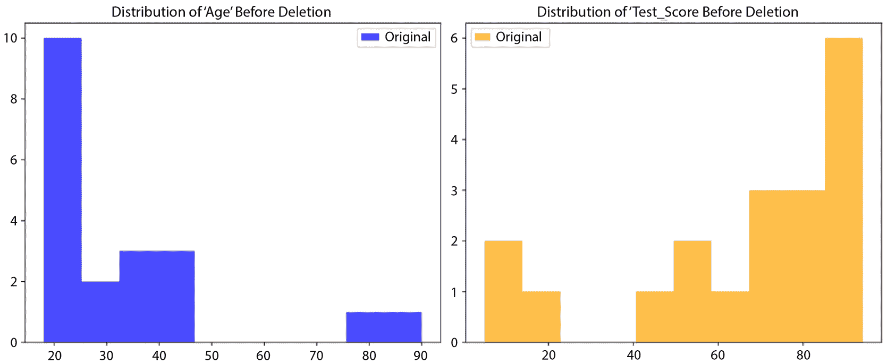

图 8.1 – 变动前特征的分布

完成此分析后，我们可以获得一些关于数据集的关键见解。对于`年龄`，数据量为 20，平均年龄大约为 33.7 岁，标准差为 18.9 岁，显示出中等程度的变异性。年龄范围从 18 岁到 90 岁，年龄的中间 50%落在 21.75 岁到 38.5 岁之间。对于`测试分数`，基于 19 个值，均值约为 65.8，标准差为 27.9，显示出较高的变异性。测试分数范围从 5 到 94 分，**四分位差**（**IQR**）从 54 到 87.5。

现在，让我们看看如何删除缺失数据。让我们关注数据集的变化：

```py
df_no_missing = df.dropna()
```

让我们探索数据删除后的特征分布：

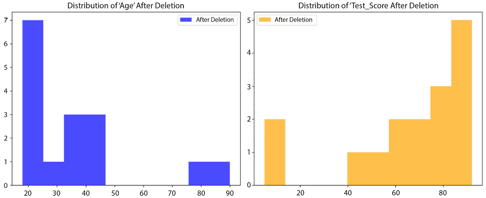

图 8.2 – 数据删除后的特征分布

让我们再看一下修改后的数据集的总结统计：

```py
print(df_no_missing.describe())
             Age  Test_Score
count  16.000000   16.000000
mean   36.500000   65.500000
std    20.109699   26.610775
min    18.000000    5.000000
25%    23.750000   56.000000
50%    32.000000   74.500000
75%    40.250000   85.500000
max    90.000000   92.000000
```

看到两个数据集的描述性统计后，观察到的变化如下：

+   **计数变化**：删除缺失值的行后，年龄和测试分数的观测数量都从 20 减少到 16。

+   **均值变化**：平均年龄从 33.75 增加到 36.50，而平均测试分数略微下降，从 65.89 降至 65.50。这一变化反映了删除数据后剩余数据集中的值。

+   **标准差变化**：年龄的标准差从 18.90 增加到 20.11，表明年龄的分布范围更广，而测试分数的标准差则从 27.99 降至 26.61。

+   **最小值和最大值**：最小年龄保持不变，仍为 18 岁，而最小测试分数保持为 5 分。年龄和测试分数的最大值都有轻微变化，测试分数的最大值从 94 降至 92。

+   **百分位变化**：由于数据集的变化，百分位值（25%、50%、75%）发生了变化：

    +   年龄的第 25 百分位从 21.75 增加到 23.75，测试分数的第 25 百分位从 54.00 增加到 56.00。

    +   年龄的中位数（第 50 百分位）从 27.50 增加到 32.00，而测试分数的中位数从 75.00 略微下降到 74.50。

    +   年龄的第 75 百分位从 38.50 增加到 40.25，而测试分数的第 75 百分位从 87.50 降至 85.50。

删除缺失值的行导致数据集变小，剩余数据现在具有*不同的统计特性*。当缺失值占数据集的比例较小且删除它们对数据没有显著影响时，这种方法是适用的。

那么，什么算是一个小比例呢？

一个常见的经验法则是，如果数据缺失少于 5%，通常认为缺失比例较小，删除这些数据可能不会对分析产生重大影响。通过比较有缺失数据和无缺失数据的分析结果，可以评估删除数据所造成的变化的显著性。如果结果一致，删除可能就不那么重要。

在这些缺失数据较为严重的情况下，我们将在下一部分探讨其他填充方法或更高级的技术，可能会更为适用。

# 缺失数据的填充

填充通常用于当删除缺失记录会导致显著信息丢失的情况。填充是指用估算或计算出的值替代缺失值。常见的填充方法包括均值填充、中位数填充和众数填充，或使用更高级的技术。

让我们来看看针对我们场景的不同填充方法。

## 均值填充

均值填充将缺失值替换为*观察到的值的均值*。这是一种非常简单的方法，当缺失值完全随机时，它不会引入偏差。然而，该方法对异常值敏感，并且可能会扭曲特征的分布。你可以在这个[链接](https://github.com/PacktPublishing/Python-Data-Cleaning-and-Preparation-Best-Practices/blob/main/chapter08/3.mean_imputation.py)找到相关代码。

让我们看看均值填充的代码示例。在这个示例中，我们将使用之前解释过的相同数据集：

```py
df_mean_imputed = df.copy()
df_mean_imputed['Age'].fillna(round(df['Age'].mean()), inplace=True)
```

前一行将`Age`列中的任何缺失值填充为原始`df`数据框中`Age`列的均值。`df['Age'].mean()`参数计算`Age`列的均值，并将该均值四舍五入到最接近的整数。然后，`fillna()`方法使用这个四舍五入后的均值替换`Age`列中的任何`NaN`值。`inplace=True`参数确保更改直接在`df_mean_imputed`中进行，而不会创建新的数据框。

```py
df_mean_imputed['Test_Score'].fillna(df['Test_Score'].mean(), inplace=True)
```

同样，前一行将`df_mean_imputed`中`Test_Score`列的任何缺失值填充为原始`df`数据框中`Test_Score`列的均值。

让我们来看一下填充后的数据集：

```py
print(df_mean_imputed)
     Age  Test_Score
0   18.0   85.000000
1   20.0   65.894737
2   34.0   90.000000
3   22.0   92.000000
4   21.0   65.894737
5   19.0   88.000000
6   34.0   94.000000
7   23.0   91.000000
8   18.0   65.894737
9   24.0   87.000000
10  40.0   75.000000
```

如我们所见，四舍五入后的均值已替代了年龄特征中的所有`NaN`值，而绝对均值（abs mean）则替代了`Test_Score`列中的`NaN`值。我们对`Age`列的均值进行了四舍五入，以确保它表示的是有意义的内容。

这里展示的是更新后的分布：

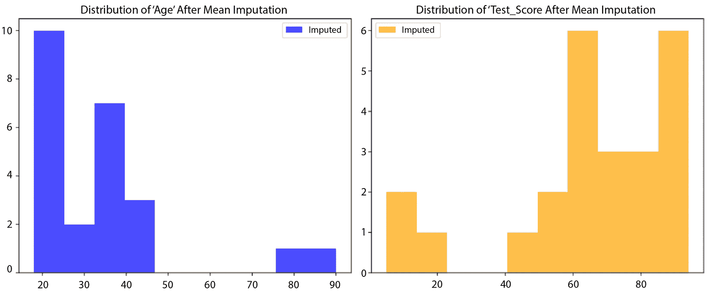

图 8.3 – 均值填充后的特征分布

从图表中可以看到，两个变量的分布都有些微变化。让我们来看看填补数据集的描述性统计：

```py
print(df_mean_imputed.describe())
             Age  Test_Score
count  24.000000   24.000000
mean   33.791667   65.894737
std    17.181839   24.761286
min    18.000000    5.000000
25%    22.750000   58.750000
50%    33.000000   66.947368
75%    35.750000   85.500000
max    90.000000   94.000000
```

在查看了两个数据集的描述性统计后，观察到的变化如下：

+   `Age`和`Test_Score`在填补后从 20 增加到 24，表示缺失值已经成功填补。

+   **均值和中位数的变化**：均值年龄保持稳定，略微从 33.75 增加到 33.79。均值测试分数保持在 65.89 不变。中位数年龄从 27.50 增加到 33.00，反映了年龄分布的变化。中位数测试分数略微从 75.00 下降到 66.95。

+   `Age`从 18.90 下降到 17.18，表明填补后的年龄变异性减小。`Test_Score`的标准差也从 27.99 下降到 24.76，反映出测试分数的变异性减少。

+   `Age`从 21.75 增加到 22.75，`Test_Score`的 Q1 从 54.00 增加到 58.75。`Age`从 38.50 略微下降到 35.75，而`Test_Score`的 Q3 则保持相对稳定，从 87.50 略微下降到 85.50。

均值填补保持了整体均值，并通过填补缺失值增加了数据集的大小。然而，它减少了变异性（如`Age`和`Test_Score`的标准差减少所示），并改变了数据的分布（尤其是在四分位数上）。这些变化是均值填补的典型特征，因为它倾向于低估变异性并平滑数据中的差异，这可能会影响某些对数据分布敏感的分析。

现在，让我们继续进行中位数填补，看看它如何影响数据集。

## 中位数填补

中位数填补通过填补缺失值为数据集的中位数，即将数据按顺序排列后的中间值。中位数填补在存在离群值时更为稳健，且在数据分布偏斜时是一个不错的选择。它能够保持分布的形状，除非遇到复杂的分布。相关代码可以在[`github.com/PacktPublishing/Python-Data-Cleaning-and-Preparation-Best-Practices/blob/main/chapter08/4.median_imputation.py`](https://github.com/PacktPublishing/Python-Data-Cleaning-and-Preparation-Best-Practices/blob/main/chapter08/4.median_imputation.py)找到。

让我们看一下中位数填补的代码示例：

```py
df_median_imputed = df.copy()
```

以下代码行将`df_median_imputed`数据框中`Age`列的缺失值填补为原始`df`数据框中`Age`列的中位数。`df['Age'].median()`参数计算`Age`列的中位数（即中间值）。然后，`fillna()`方法将`Age`列中的任何`NaN`值替换为这个中位数。`inplace=True`参数确保更改直接应用到`df_median_imputed`中，而不创建新的数据框：

```py
df_median_imputed['Age'].fillna(df['Age'].median(), inplace=True)
```

同样，以下行填充了 `Test_Score` 中的任何缺失值：

```py
df_median_imputed['Test_Score'].fillna(df['Test_Score'].median(), inplace=True)
```

让我们来看看经过中位数填充后的数据集：

```py
print(df_median_imputed)
     Age  Test_Score
0   18.0        85.0
1   20.0        75.0
2   27.5        90.0
3   22.0        92.0
4   21.0        75.0
5   19.0        88.0
6   27.5        94.0
7   23.0        91.0
8   18.0        75.0
9   24.0        87.0
10  40.0        75.0
```

如我们所见，中位数填充已替换了 `Age` 特征（27.5）和 `Test_Score` 列（75）中的所有 `NaN` 值。更新后的分布如下。

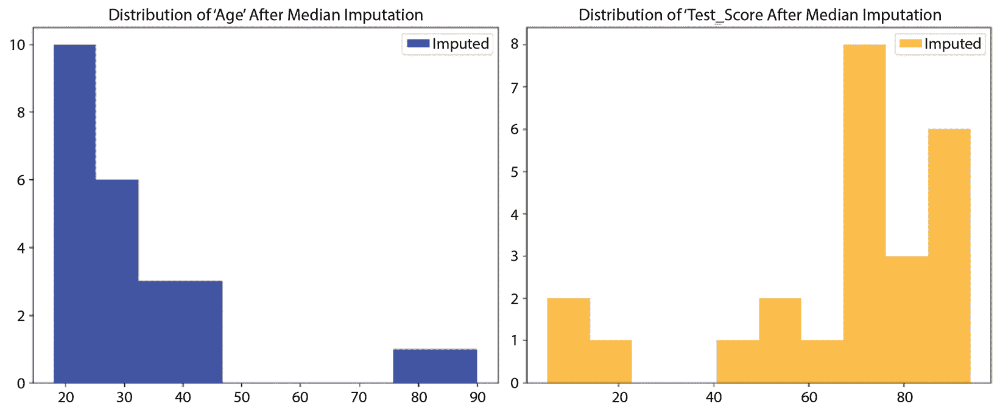

图 8.4 – 中位数填充后的特征分布

我们从图表中可以看到，这两个变量的分布略有变化。让我们看看填充后数据集的描述性统计：

```py
print(df_median_imputed.describe())
             Age  Test_Score
count  24.000000   24.000000
mean   32.708333   67.791667
std    17.345540   25.047744
min    18.000000    5.000000
25%    22.750000   58.750000
50%    27.500000   75.000000
75%    35.750000   85.500000
max    90.000000   94.000000
```

在查看了两个数据集的描述性统计后，观察到的变化在这里呈现：

+   `Age` 和 `Test_Score` 在经过中位数填充后分别从 20（年龄）和 19（测试分数）增加到 24，表明缺失值已成功填充。

+   **均值变化**：填充后，均值年龄从 33.75 降低到 32.71，均值测试分数略微增加，从 65.89 增加到 67.79。这些变化反映了填充后数据的特性。

+   `Age` 从 18.90 降低到 17.35，表明年龄的变异性有所减小。`Test_Score` 的标准差也从 27.99 降低到 25.05，反映出在填充后测试成绩的变异性较小。

+   `Age` 从 21.75 稍微增加到 22.75，而 `Test_Score` 的 Q1 从 54.00 增加到 58.75。`Age` 的 Q3（75%）从 38.50 降低到 35.75，`Test_Score` 的 Q3 也略微减少，从 87.50 降低到 85.50。

+   `Age` 保持稳定在 27.50，而 `Test_Score` 的中位数也保持在 75.00，突出了填充后数据的中央趋势得到了保持。

中位数填充成功地填补了缺失值，同时保持了 `Age` 和 `Test_Score` 的中位数。这导致均值发生了轻微变化并减少了变异性，这是中位数填充的典型特征。中央趋势（中位数）得到了保持，这是中位数填充的一个重要优势，特别是在偏斜分布的情况下。但它也减少了数据的分布，这对某些类型的分析可能具有影响。

在接下来的部分，我们将使用到目前为止学到的关于填充的内容。我们还将增加一个额外的步骤，即标记数据集中缺失值所在的位置，供后续参考。

## 创建指示变量

指标变量补全，也叫标志变量或虚拟变量补全，涉及创建一个二进制指标变量，标记某个观测值在特定变量中是否缺失。这个单独的虚拟变量在缺失值时取值为 1，在观察到的值时取值为 0。当缺失值存在某种模式时，指标变量补全很有用，它能帮助你明确建模并捕捉缺失值的情况。记住，*我们是在添加一个全新的变量，创建了一个更高维的数据集*。在创建完指标变量后，*它们的作用是提醒我们哪些值是被补全的，哪些值不是*，然后我们可以使用任意方法（例如中位数或均值）补全数据集。

让我们看看这种补全方法的代码示例。和往常一样，你可以在仓库中看到完整的代码：

[`github.com/PacktPublishing/Python-Data-Cleaning-and-Preparation-Best-Practices/blob/main/chapter08/5.indicator_imputation.py`](https://github.com/PacktPublishing/Python-Data-Cleaning-and-Preparation-Best-Practices/blob/main/chapter08/5.indicator_imputation.py)

另外，记住我们在整章中使用的是完全相同的数据框，因此这里省略了数据框的创建部分：

```py
df['Age_missing'] = df['Age'].isnull().astype(int)
df['Test_Score_missing'] = df['Test_Score'].isnull().astype(int)
```

这段代码在 `df` 数据框中创建了新列，用以指示 `Age` 和 `Test_Score` 列中是否有缺失值（`NaN`）。`df['Age'].isnull()` 检查 `Age` 列中的每个值是否为 `NaN`（缺失）。它返回一个布尔型的序列，其中 `True` 表示缺失值，`False` 表示非缺失值。`.astype(int)` 方法将布尔型序列转换为整数型序列，`True` 变为 1（表示缺失值），`False` 变为 0（表示非缺失值）。`df['Age_missing']` 数据框将这个整数序列存储在一个名为 `Age_missing` 的新列中。

类似地，`df['Test_Score_missing']` 是用来指示 `Test_Score` 列中的缺失值：

```py
df_imputed['Age'].fillna(df_imputed['Age'].mean(), inplace=True)
df_imputed['Test_Score'].fillna(df_imputed['Test_Score'].mean(), inplace=True)
```

这段代码将 `df_imputed` 数据框中 `Age` 和 `Test_Score` 列中的缺失值填充为各自列的均值，就像我们在前一部分学习的那样。让我们看看经过指标变量补全后的数据集：

```py
print(df_imputed)
      Age  Test_Score  Age_missing  Test_Score_missing
0   18.00   85.000000            0                   0
1   20.00   65.894737            0                   1
2   33.75   90.000000            1                   0
3   22.00   92.000000            0                   0
4   21.00   65.894737            0                   1
5   19.00   88.000000            0                   0
6   33.75   94.000000            1                   0
7   23.00   91.000000            0                   0
8   18.00   65.894737            0                   1
9   24.00   87.000000            0                   0
10  40.00   75.000000            0                   0
```

从补全后的数据集可以看出，我们添加了两个指标变量（`Age_missing` 和 `Test_Score_missing`），如果对应的变量缺失，则其值为 1，否则为 0。所以，我们主要标记了*哪些原始行的值* *是被补全的*。

让我们看看指标变量的分布情况：

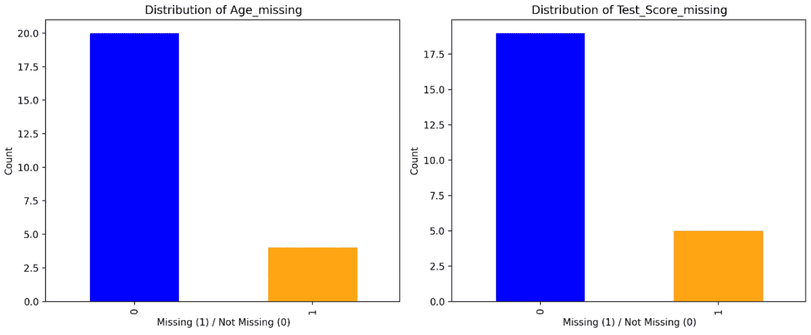

图 8.5 – 指标变量的分布

现在，让我们通过构建一些箱型图来探索指标变量与数据集中其他特征之间的关系：

```py
import seaborn as sns
import matplotlib.pyplot as plt
plt.figure(figsize=(12, 5))
plt.subplot(1, 2, 1)
sns.boxplot(x='Age_missing', y='Test_Score', data=df_imputed)
plt.title("Boxplot of Test_Score by Age_missing")
plt.subplot(1, 2, 2)
sns.boxplot(x='Test_Score_missing', y='Age', data=df_imputed)
plt.title("Boxplot of Age by Test_Score_missing")
plt.tight_layout()
plt.show()
```

创建的箱型图可以在*图 8.6*中看到：

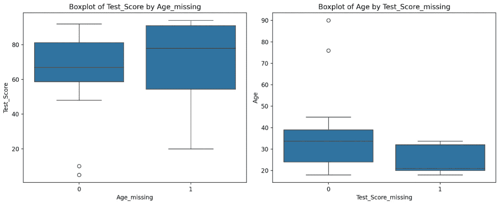

图 8.6 – 箱型图比较指示变量与其他特征之间的关系

提示 – 如何读取箱型图

**箱体范围**：箱型图中的箱体表示四分位距（IQR），其中包含数据的中心 50%。箱内的值被视为典型值或正常范围内的值。

**胡须**：胡须从箱体延伸，显示典型值的范围。异常值通常定义为超出某一倍数（例如 1.5 倍）四分位距（IQR）的值。

**异常值**：超出胡须之外的个别数据点被视为潜在的异常值。异常值通常以单独的点或星号表示。

**疑似异常值**：有时，位于胡须之外的点可能被标记为疑似异常值，单独标记以表明它们是潜在的异常值，但并非极端值。

回到我们的例子，`Test_Score` 按 `Age Missing` 的箱型图显示，当数据中的年龄缺失时，`Test_Score` 的均值大约为 80，分布值介于 55 到 85 之间。当 `Age` 不缺失时，均值大约为 65，大部分值集中在 60 和 80 之间，少数异常值集中在 20 附近。现在，当分数缺失时，学生的平均年龄约为 20，而有分数的学生的平均年龄约为 35。

注意

在构建预测模型时，将指示变量作为附加特征以捕捉缺失值对目标变量的影响。评估包含和不包含指示变量的模型表现，以评估它们的贡献。

## 插补方法的比较

以下表格提供了根据数据特征和任务目标选择合适插补方法的指南。

记住，没有一种方法适用于所有情况！

| **插补方法** | **使用场景** | **优点** | **缺点** |
| --- | --- | --- | --- |
| **均值插补** | 正态分布数据，缺失值为 MCAR 或 MAR | 简单易行，保留分布的均值 | 对异常值敏感，若缺失不是随机的，可能扭曲分布 |
| **中位数插补** | 偏斜或非正态分布数据，存在异常值 | 对异常值具有鲁棒性，保留分布的中位数 | 忽略变量之间的潜在关系，可能对非偏斜数据精度较低 |
| **指示变量插补** | 缺失数据中的系统性模式 | 捕捉缺失模式 | 增加维度性 假设缺失模式有意义，但这并不总是成立 |
| **删除行** | MCAR 或 MAR 缺失机制，存在异常值 | 保留现有数据结构，当缺失是随机时有效 | 减少样本量，如果缺失不是完全随机，可能导致偏倚结果 |

表 8.1 – 各种填补方法的比较

在提供的示例中，我们一致地对数据集的每一列应用了相同的填补方法。然而，正如我们所展示的那样，我们的分析和考虑是针对每一列单独量身定制的。这意味着我们可以根据*每一列*的具体特征和需求来定制填补策略。作为一个实际练习，花些时间尝试为数据集中的不同列使用不同的填补方法，并观察这些选择如何影响你的结果。

为了在我们已经建立的填补策略基础上进一步发展，必须认识到数据清理不仅仅是处理缺失值。数据预处理的另一个关键方面是识别和管理离群值。在接下来的部分，我们将深入探讨如何检测和处理离群值，确保我们的数据集尽可能准确和可靠。

# 检测和处理离群值

离群值是指在数据集中与大多数数据点显示的总体模式或趋势显著偏离的数据点。它们位于数据分布中心异常远的位置，并且可能对统计分析、可视化和模型性能产生重大影响。定义离群值包括识别那些不符合数据预期行为的数据点，并理解它们发生的背景。

## 离群值的影响

离群值虽然通常只占数据集的一小部分，但它们对数据集的影响不成比例，可能会破坏数据集的完整性。它们的存在可能会扭曲统计总结、误导可视化，并对模型的性能产生负面影响。

让我们深入探讨离群值如何扭曲事实：

+   **扭曲的统计汇总**：离群值可能会显著扭曲统计汇总，给出数据中心趋势的误导性印象：

    +   **均值和中位数**：均值作为一种常见的集中趋势测量，可能会受到离群值的极大影响。一个远高于或低于其他数据点的离群值可能会将均值拉向它。另一方面，中位数是通过排序数据集中的中间值来确定的。它有效地作为数据的中心点，将数据分为两等部分，因此不容易受到极端值的影响。

    +   **方差和标准差**：离群值可能会膨胀方差和标准差，使数据看起来比实际更为分散。这可能会误导数据的大多数变异性。

+   **误导性的可视化**：离群值可能会扭曲可视化的尺度和形状，导致误解：

    +   **箱型图**：离群值可能会导致箱型图过度延伸，使数据的大部分看起来被压缩。这可能会使分布看起来不如实际情况那样分散。

    +   **直方图**：异常值可能导致创建仅包含少数极端值的区间，导致其他区间显得不成比例地小，且分布形态被扭曲。

+   **对模型性能的影响**：异常值可能会对预测模型的性能产生负面影响：

    +   **回归**：异常值可能会严重影响回归线的斜率和截距，从而导致模型过度受到极端值的影响。

    +   **聚类**：异常值可能会影响聚类的中心点和边界，可能导致创建无法准确表示数据分布的聚类。

异常值可以根据维度分为单变量异常值和多变量异常值。在下一节中，我们将使用第一部分中的示例，看看如何处理单变量异常值。

## 识别单变量异常值

单变量异常值发生在单个变量中观察到极端值时，与其他变量的值无关。它们基于单个变量的分布进行检测，通常使用可视化或统计方法（如 Z 分数或四分位距）来识别。

在下一部分中，我们将构建最常见的可视化图形之一，用于识别异常值。

### 识别异常值的经典可视化方法

在深入讨论识别异常值的统计方法之前，我们可以先创建一些简单的可视化图形来帮助识别它们。我们一直使用的数据示例仍然适用于这一部分，你可以在[`github.com/PacktPublishing/Python-Data-Cleaning-and-Preparation-Best-Practices/blob/main/chapter08/6.outliers_visualisation.py`](https://github.com/PacktPublishing/Python-Data-Cleaning-and-Preparation-Best-Practices/blob/main/chapter08/6.outliers_visualisation.py)找到完整的代码。

我们从第一个可视化图——箱线图开始，其中异常值表现为箱须两侧的点。以下代码片段为每个变量创建箱线图：

```py
plt.figure(figsize=(12, 5))
plt.subplot(1, 2, 1)
plt.title("Box Plot for 'Age'")
plt.boxplot(df['Age'].dropna(), vert=False)
plt.subplot(1, 2, 2)
plt.title("Box Plot for 'Test_Score'")
plt.boxplot(df['Test_Score'].dropna(), vert=False)
plt.tight_layout()
plt.show()
```

创建的箱线图如下所示：

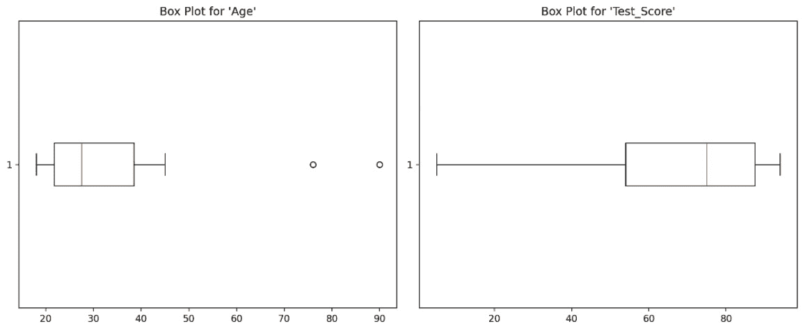

图 8.7 – 箱线图用来识别异常值

在我们的示例中，我们可以看到`Age`特征有一些明显的异常值。

另一个经典的图形是小提琴图，如*图 8.8*所示。小提琴图是一种强大的可视化工具，结合了箱线图和核密度图的特点。要创建小提琴图，请运行以下代码片段：

```py
plt.figure(figsize=(12, 5))
plt.subplot(1, 2, 1)
plt.title("Violin Plot for 'Age'")
plt.violinplot(df['Age'].dropna(), vert=False)
plt.subplot(1, 2, 2)
plt.title("Violin Plot for 'Test_Score'")
plt.violinplot(df['Test_Score'].dropna(), vert=False)
plt.tight_layout()
plt.show()
```

创建的小提琴图如下所示：

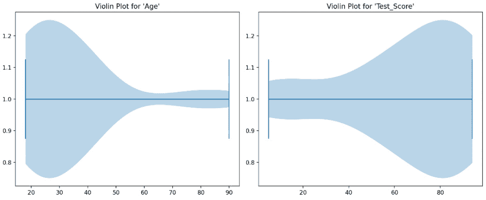

图 8.8 – 小提琴图用来识别异常值

提示 – 如何阅读小提琴图：

**小提琴的宽度**：小提琴的宽度表示数据在不同值处的密度。较宽的部分表示在特定值处数据点的密度较高，意味着该值在总体中出现的概率较高；而较窄的部分表示概率较低。

**箱线图元素**：在小提琴图内，你可能会看到一个类似于传统箱线图的箱线图。箱子表示 IQR（四分位距），而中位数通常以一条水平线显示在箱内。胡须从箱子延伸，表示数据的范围。

**核密度估计**（**KDE**）：小提琴图的整体形状是 KDE 的镜像表示。KDE 提供了数据分布的平滑表示，帮助你观察数据的峰值和谷值。

**异常值**：异常值可能表现为超出胡须末端的点，或超出小提琴整体形状的点。

现在我们已经看过这些图表，开始对`Age`列中异常值的存在形成一些假设。下一步是使用一些统计方法验证这些假设，首先从 Z 分数方法开始。

### Z 分数方法

Z 分数方法是一种统计技术，通过衡量单个数据点相对于均值的标准差偏离程度，用于识别数据集中的单变量异常值。数据点的 Z 分数使用以下公式计算：

Z = (X − Mean) / Standard Deviation

其中，*X*是数据点，*Mean*是数据集的平均值，*Standard Deviation*量化数据的离散程度。

通常，选择一个阈值 Z 分数来确定异常值。常用的阈值是*Z > 3*或*Z < −3*，表示偏离均值超过三个标准差的数据点被视为异常值。

让我们回到之前的代码示例，计算`Age`和`Test_Score`列的 Z 分数。我们将继续之前开始的示例。你可以在[`github.com/PacktPublishing/Python-Data-Cleaning-and-Preparation-Best-Practices/blob/main/chapter08/7.identify_univariate_outliers.py`](https://github.com/PacktPublishing/Python-Data-Cleaning-and-Preparation-Best-Practices/blob/main/chapter08/7.identify_univariate_outliers.py)找到完整的代码。

让我们计算 Z 分数：

```py
z_scores_age = np.abs(stats.zscore(df['Age'].dropna()))
```

`stats.zscore(df['Age'].dropna())`函数计算`Age`列的 Z 分数。Z 分数表示一个数据点距离均值多少个标准差。`dropna()`函数用于在计算 Z 分数之前排除`NaN`值：

```py
z_scores_test_score = np.abs(stats.zscore(df['Test_Score'].dropna()))
```

`np.abs()`函数用于计算 Z 分数的绝对值。这是因为 Z 分数可以为负（表示值低于均值）或为正（表示值高于均值）。通过使用绝对值，我们只关注偏离均值的大小，而不考虑方向。

```py
z_threshold = 3
outliers_age = np.where(z_scores_age > z_threshold)[0]
outliers_test_score = np.where(z_scores_test_score > z_threshold)[0]
```

`np.where(z_scores_age > z_threshold)[0]`识别`年龄`列中 Z-score 大于`3`的那些数据点的索引。最后的`[0]`用于提取索引作为数组。`outliers_age`和`outliers_test_score`变量分别存储`年龄`和`测试成绩`列中的异常值数据点索引。

如果我们绘制每个观察值和特征的 Z-scores，就可以开始发现一些异常值了。

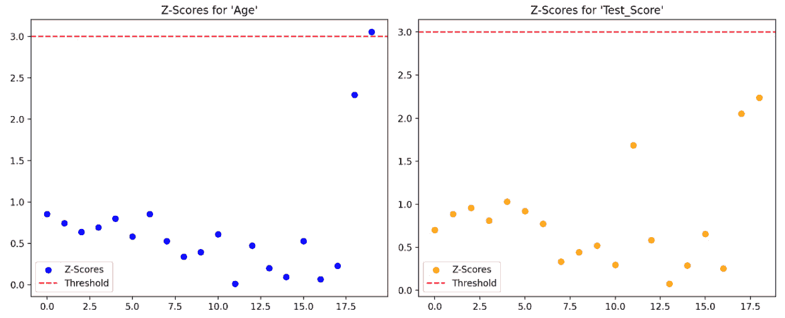

图 8.9 – 使用 Z-score 进行异常值检测

在这些 Z-score 的散点图中，每个点代表一个数据点的 Z-score。红色虚线表示所选的 Z-score 阈值（在此案例中为`3`）。异常值被标识为高于此阈值的点。如我们所见，在`年龄`上，清晰地捕捉到了一个异常值。

#### 如何选择合适的 Z-score 阈值？

Z-score 告诉你一个数据点距离均值有多少个标准差。在正态分布中，以下是成立的：

+   大约 68%的数据落在均值的*一个标准差*范围内。

+   大约 95%的数据落在*两个* *标准差*内。

+   大约 99.7%的数据落在*三个* *标准差*内。

这意味着`3`的 Z-score 阈值通常被使用，因为它捕捉到的是*极度偏离均值*的值，识别出最极端的异常值。在完美的正态分布中，只有 0.3%的数据点会有 Z-score 大于 3 或小于-3。这使得它成为检测不太可能属于正常数据分布的异常值的合理阈值。

现在，除了 Z-score，另一种常见的方法是 IQR，我们将在接下来的部分讨论这一方法。

### IQR 方法

IQR 是统计离散度的一个衡量标准，表示数据集中 Q1 和 Q3 之间的范围。IQR 是一种稳健的*离散度*衡量方式，因为它对异常值的敏感性较低。此时，可以清楚地看出 IQR 是基于四分位数的。四分位数将数据集分为几个区间，由于 Q1 和 Q3 对极端值不那么敏感，因此 IQR 不容易受到异常值的影响。另一方面，标准差会受到每个数据点与均值偏差的影响。偏差较大的异常值会对标准差产生不成比例的影响。

提示 – 如何计算 IQR

**计算 Q1（25 百分位数）**：确定数据中有 25%落在其下方的值。

**计算 Q3（75 百分位数）**：确定数据中有 75%落在其下方的值。

**计算 IQR**：IQR = Q3 - Q1。

使用 IQR 识别潜在的异常值，请按以下步骤操作：

1.  按照以下方式计算上下界：下界 = Q1 - 1.5 * IQR，上界 = Q3 + 1.5 * IQR。

1.  任何低于或高于上下界的数据点都被视为潜在的异常值。

需要注意的是，乘数的选择（在本例中为`1.5`）是有些任意的，但在实际中已经广泛采用。调整这个乘数可以使得该方法对潜在离群值的敏感度更高或更低。例如，使用更大的乘数会导致边界更广，可能会识别出更多的潜在离群值，而较小的乘数则会使该方法对离群值的敏感度降低。

我们将使用之前的脚本，脚本可以在[`github.com/PacktPublishing/Python-Data-Cleaning-and-Preparation-Best-Practices/blob/main/chapter08/7.identify_univariate_outliers.py`](https://github.com/PacktPublishing/Python-Data-Cleaning-and-Preparation-Best-Practices/blob/main/chapter08/7.identify_univariate_outliers.py)找到。让我们看看如何计算 IQR 并识别离群值：

```py
def identify_outliers(column):
    Q1 = df[column].quantile(0.25)
    Q3 = df[column].quantile(0.75)
    IQR = Q3 - Q1
    lower_bound = Q1 - 1.5 * IQR
    upper_bound = Q3 + 1.5 * IQR
    outliers = df[(df[column] < lower_bound) | (df[column] > upper_bound)]
    return outliers
```

这段代码定义了一个函数，用于通过 IQR 方法识别 DataFrame 中任何列的离群值。它计算 IQR，设定正常数据的上下限，然后过滤出那些列中的值落在这些边界之外的行。

然后，我们来识别并打印`Age`（年龄）列中的离群值：

```py
age_outliers = identify_outliers('Age')
print("Outliers in 'Age':")
print(age_outliers)
```

识别并打印`Test_Score`（考试成绩）列中的离群值：

```py
test_score_outliers = identify_outliers('Test_Score')
print("\nOutliers in 'Test_Score':")
print(test_score_outliers)
```

运行这段代码后，我们可以在打印语句中看到基于`Age`列识别出的离群值/行：

```py
   Age  Test_Score
  76.0        10.0
  90.0         5.0
```

如前所述，IQR（四分位距）的简便性以及其对离群值的稳健性使其在各种分析场景中非常受欢迎。然而，它也有一定的缺点。一个限制是信息的丢失，因为 IQR 仅考虑数据集的中央 50%，忽略了整个范围。此外，IQR 对样本大小的敏感性，尤其是在较小的数据集里，可能会影响其反映数据真实分布的准确性。

最后，我们将简要讨论如何利用领域知识来识别离群值。

### 领域知识

为了更好地理解领域知识在离群值检测中的应用，我们以考试成绩为例。假设数据集代表的是学生的考试成绩，并且根据教育标准，考试成绩应该落在 0 到 100 的范围内。任何超出此范围的成绩都可以被认为是离群值。通过利用教育领域的知识，我们可以设定这些边界来识别潜在的离群值。例如，如果某个成绩记录为 120，那么它很可能会被标记为离群值，因为它超出了最高分 100 的范围。同样，负数的成绩或低于 0 的成绩也会被视为离群值。以这种方式整合领域知识，使我们能够为离群值检测设定有意义的阈值，确保分析符合教育领域中的预期规范。

## 处理单变量离群值

处理单变量异常值是指识别、评估和管理那些显著偏离数据集典型模式或分布的个别变量数据点的过程。其目的是减少这些极端值对数据产品的影响。

处理单变量异常值有几种方法。我们将从删除开始，始终使用本章开头的示例进行操作。

### 删除异常值

删除异常值是指从数据集中移除那些被认为异常极端或偏离数据整体模式的数据点。删除异常值有其利弊。一方面，这是处理极端值的最简单方法；另一方面，它会导致样本量的减少，并可能丧失宝贵的信息。此外，如果异常值不是错误数据，而是反映数据的合理波动，删除它们可能会引入偏差。

回到我们的示例，在使用均值填充缺失数据并计算 IQR 之后，我们删除了超过异常值阈值的异常值。让我们来看一下执行这些步骤的代码；你也可以在仓库中找到它：[`github.com/PacktPublishing/Python-Data-Cleaning-and-Preparation-Best-Practices/blob/main/chapter08/8.handle_univariate_outliers_deletions.py`](https://github.com/PacktPublishing/Python-Data-Cleaning-and-Preparation-Best-Practices/blob/main/chapter08/8.handle_univariate_outliers_deletions.py)。

让我们计算 IQR 并利用它来设定正常数据范围的上下界限：

```py
(IQR) Q1 = df['Test_Score'].quantile(0.25)
Q3 = df['Test_Score'].quantile(0.75)
IQR = Q3 - Q1
outlier_threshold = 1.5
```

让我们定义下限和上限异常值界限。任何超出此范围的值都将被标记为异常值：

```py
lower_bound = Q1 - outlier_threshold * IQR
upper_bound = Q3 + outlier_threshold * IQR
```

最后一行过滤了 DataFrame（`df`），仅保留`Test_Score`值在计算出的下限和上限之间的行：

```py
df_no_outliers = df[(df['Test_Score'] >= lower_bound) & (df['Test_Score'] <= upper_bound)].copy()
```

在以下图表中，我们可以看到删除异常值后的更新分布图：

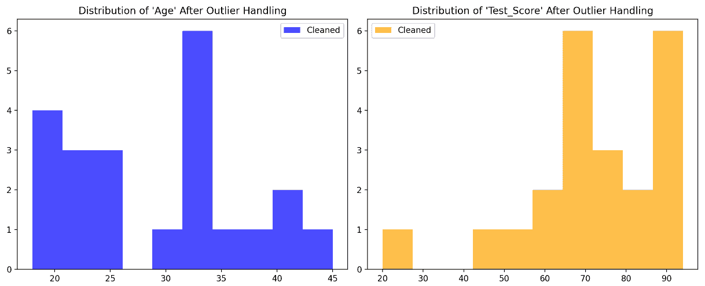

图 8.10 – 删除异常值后的分布图

让我们看看删除异常值后的描述性统计数据：

```py
             Age  Test_Score
count  22.000000   22.000000
mean   29.272727   71.203349
std     8.163839   17.794339
min    18.000000   20.000000
25%    22.250000   65.894737
50%    31.000000   71.000000
75%    33.937500   86.500000
max    45.000000   94.000000
```

删除异常值后观察到的变化如下所示：

+   **平均年龄变化**：删除异常值后，平均年龄从 33.75 略微下降至约 29.27。这一变化表明，删除的异常值是年龄较大的个体。

+   **年龄标准差变化**：年龄的标准差从 17.18 降至 8.16，表明删除异常值后年龄的分布略微变窄，可能是因为原数据中的异常值导致了较大的变异性。

+   **最小和最大年龄值**：最小年龄保持不变，仍为 18 岁，而最大年龄从 90 岁降至 45 岁，表明在处理异常值时，年龄较大的个体（潜在的异常值）被移除。

+   **平均测试成绩变化**：在删除异常值后，平均测试成绩从 65.89 轻微上升至 71.20，表明被删除的异常值是低分，拉低了原始的均值。

+   **测试成绩的标准差变化**：标准差从 24.76 降至 17.79，表明测试成绩的分布变得更为集中。

+   **最低和最高测试成绩**：最低测试成绩从 5.00 上升到 20.00，而最高测试成绩保持不变，为 94.00。这表明极低的分数在处理异常值时被移除。

删除异常值导致了均值和标准差的下降，同时平均测试成绩略有上升。虽然删除异常值可以提高数据质量，尤其是当异常值由于数据输入错误或测量不准确时，但它也会减少数据集的变异性。如果异常值代表了总体中的真实变异性，删除它们可能会扭曲数据的整体情况。因此，必须谨慎考虑异常值是否为真实数据点或错误数据。

注意

一些统计模型假设数据符合正态分布，因此可能对异常值非常敏感。删除异常值有助于满足某些模型的假设。因此，在删除之前，你需要更好地理解你正在解决的问题以及要使用的技术。

如果你不想完全删除数据中的异常值，还有其他方法可以处理它们。在接下来的部分，我们将讨论异常值的修剪和温莎化处理。

### 修剪

修剪是指从分布的两端删除一定比例的数据，然后计算均值。对于修剪，我们需要定义修剪比例，这个比例表示在计算修剪后的均值时，从*分布的两端*去除的数据比例。它用于排除一定比例的极端值（异常值）在均值计算中的影响。修剪比例的值介于 0 和 0.5 之间，满足以下条件：

+   0 表示不进行修剪（包括所有数据点）

+   0.1 表示从每个尾部修剪 10%的数据

+   0.2 表示从每个尾部修剪 20%的数据

+   0.5 表示从每个尾部修剪 50%的数据（排除最极端的值）

在我们的案例中，分析表明`Age`列存在最显著的异常值。为此，我们决定通过排除`Age`列中最上面和最下面的百分位数来修剪数据集。以下示例代码演示了这一修剪过程。我们仍在使用相同的数据集，因此这里跳过了 DataFrame 的创建。不过，你可以在以下链接查看完整代码：[`github.com/PacktPublishing/Python-Data-Cleaning-and-Preparation-Best-Practices/blob/main/chapter08/9.trimming.py`](https://github.com/PacktPublishing/Python-Data-Cleaning-and-Preparation-Best-Practices/blob/main/chapter08/9.trimming.py)。

让我们看看下面的代码片段，它创建了一个新的数据框（`df_trimmed`），只包括`Age`（年龄）值位于第 10 百分位和第 90 百分位之间的行。这实际上去除了`Age`列中最低的 10%和最高的 10%的值：

```py
df_trimmed = df[(df['Age'] >= df['Age'].quantile(0.1)) & (df['Age'] <= df['Age'].quantile(0.9))]
```

现在让我们来计算每一列的修剪均值：

```py
df_trimmed_mean = df_trimmed.mean()
```

在修剪数据后，最后一行计算了`df_trimmed`数据框中每列的均值。修剪后计算的均值被称为*修剪均值*。它表示去除最极端的 20%（每侧 10%）后的中央 80%数据的平均值。

注意

请记住，修剪比例是平衡修剪均值的稳健性与排除数据量之间的一个方式。你可能需要尝试不同的比例，以找到适合你数据的平衡点。

让我们看看修剪后的更新分布：

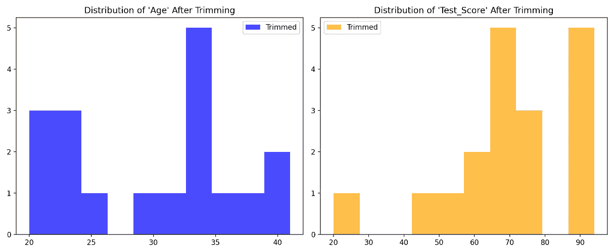

图 8.11 – 在 10% 阈值下去除异常值后的分布图

让我们也来看看更新后的数据统计信息：

```py
             Age  Test_Score
count  18.000000   18.000000
mean   30.222222   69.309942
std     6.757833   18.797436
min    20.000000   20.000000
25%    24.000000   60.723684
50%    32.875000   66.947368
75%    33.937500   84.750000
max    41.000000   94.000000
```

在原始数据集中，`Age`列的均值为 33.75，标准差为 17.18，而修剪后的数据表现为更高的均值 30.22，且标准差大幅降低至 6.76。修剪数据中的最低年龄值从 18 增加到 20，表明去除了低值异常值。最高年龄值从 90 下降到 41，表明排除了高值异常值。

对于`Test_Score`（测试分数）列，原始数据集中的均值为 65.89，标准差为 24.76。在修剪后的数据中，均值上升至 69.31，标准差下降至 18.80，表明测试分数的分布范围变窄。最低测试分数从 5 增加到 20，表明去除了低值异常值，而最高测试分数保持在 94 不变。

总体而言，去除异常值导致了数据的集中趋势（均值）和分布范围（标准差）发生变化，`Age`（年龄）和`Test_Score`（测试分数）均如此。这表明修剪后的数据集变得更加集中在中间值周围，极端值被移除。

记住！

虽然修剪有助于减少极端值的影响，但它也意味着丢弃一部分数据。这可能导致信息丢失，而修剪后的变量可能无法完全代表原始数据集。

在接下来的部分，我们将介绍一种稍微不同的处理异常值的方法，叫做**温莎化**。

### 温莎化

与直接去除极端值的修剪不同，winsorizing（温莎化）是通过*用较不极端的值替代它们*。极端值被替换为接近分布中心的值，通常是在指定的百分位数。温莎化在你希望*保留数据集的大小*并帮助保持数据分布的整体形态时非常有用。

回到我们的示例用例，看看代码。你可以在[`github.com/PacktPublishing/Python-Data-Cleaning-and-Preparation-Best-Practices/blob/main/chapter08/10.winsorizing.py`](https://github.com/PacktPublishing/Python-Data-Cleaning-and-Preparation-Best-Practices/blob/main/chapter08/10.winsorizing.py)找到完整的代码：

```py
winsorizing_fraction = 0.1
```

`winsorizing_fraction`设置为`0.1`，表示在数据分布的两端调整的数据比例。它以百分比的形式表示，值通常在 0 和 50%之间。确定 Winsor 化比例的过程涉及考虑你希望减少极端值的影响程度。一个常见的选择是将两端的某个百分比进行 Winsor 化，例如 5%或 10%。

这里还需要了解的一点是，Winsor 化过程是针对每一列*单独且独立地进行的*。记住：我们在这里以*单变量*的方式处理离群值：

```py
df_winsorized = df.apply(lambda x: mstats.winsorize(x, limits=[winsorizing_fraction, winsorizing_fraction]))
```

`limits=[winsorizing_fraction, winsorizing_fraction]`参数指定了从分布两端 Winsor 化的数据比例。这里从下端和上端各调整 10%。极端值（最低的 10%和最高的 10%）将被替换为指定范围内的最近值，从而减少它们对统计量的影响。

这里展示了 Winsor 化后的更新分布：

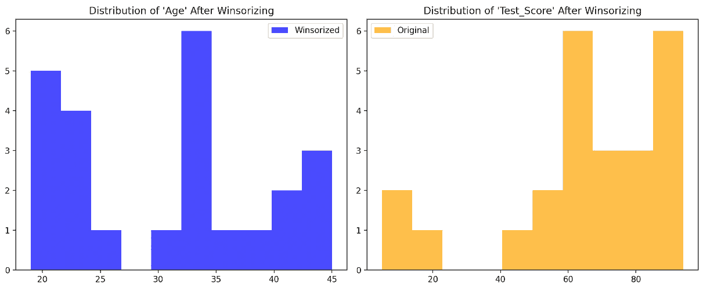

图 8.12 – 经 Winsor 化后的离群值分布图

让我们看看数据的更新统计信息：

```py
             Age  Test_Score  Age_Winsorized
count  24.000000   24.000000       24.000000
mean   33.750000   65.894737       30.666667
std    17.181575   24.761286        8.857773
min    18.000000    5.000000       19.000000
25%    22.750000   58.750000       22.750000
50%    32.875000   66.947368       32.875000
75%    35.750000   85.500000       35.750000
max    90.000000   94.000000       45.000000
```

`Age`列的均值从 33.75 降至 30.67，表明由于极端高值被调整，数据分布向较低值偏移。标准差也从 17.18 显著降低至 8.86，说明数据集的变异性减少。最小值从 18 略微增加到 19，最大值从 90 降至 45，反映了极端值的限制。

至于`Test_Score`，Winsor 化后均值保持在 65.89，标准差保持在 24.76，表明测试分数的变异性未受 Winsor 化过程的影响。最大值保持不变，依然为 94，显示上端极端值没有发生变化。

总体而言，对`Age`列进行 Winsor 化后，数据的分布变得更加集中，标准差的减小也证明了这一点。Winsor 化成功地减少了极端值在`Age`列中的影响，使数据更加集中于中间范围。对于`Test_Score`列，Winsor 化并未对分布产生影响，可能是因为极端值已经在接受范围内。

接下来，我们将探讨如何通过数学变换来最小化离群值的影响。

### 数据变换

应用对数或平方根等数学变换是处理偏斜数据或稳定方差的常见技术。

提醒

偏度是分布不对称的度量。正偏度表示分布有右尾，而负偏度表示分布有左尾。

当数据右偏（正偏度）时，即大部分数据点集中在左侧，右侧有少数较大值时，应用对数变换会压缩较大值，使分布更对称，更接近正态分布。

类似于对数变换，平方根变换用于减少较大值的影响，并使分布更对称。当分布的右尾包含极端值时，特别有效。

另一点需要注意的是，当数据的方差随均值增加（异方差性）时，对数和平方根变换可以压缩较大值，减少极端值的影响，并稳定方差。

让我们回到我们的例子，并对数据集的两列进行对数变换。如往常一样，你可以在 [`github.com/PacktPublishing/Python-Data-Cleaning-and-Preparation-Best-Practices/blob/main/chapter08/11.data_transformation.py`](https://github.com/PacktPublishing/Python-Data-Cleaning-and-Preparation-Best-Practices/blob/main/chapter08/11.data_transformation.py) 找到完整的代码。

让我们对 `Age` 和 `Test_Score` 应用对数变换：

```py
df_log_transformed = df.copy()
df_log_transformed['Age'] = np.log1p(df_log_transformed['Age'])
df_log_transformed['Test_Score'] = np.log1p(df_log_transformed['Test_Score'])
```

`np.log1p` 是 NumPy 中的一个函数，用于计算 `Age` 和 `Test_Score` 列中每个值的 *1 + x* 的自然对数。`log1p` 函数用于处理数据集中的零值和负值，而不会出现错误，相比简单的对数函数 (`np.log`) 更为实用。在处理包含零值或非常小数值的数据时特别有用。这种变换可以减小偏斜度，并使分布更接近正态分布，这对于各种假设数据正态分布的统计技术非常有用。

更多变换的实施

在代码中，你会发现对数据应用了对数和平方根变换。花些时间探索和理解这两种方法之间的差异。通过考虑每种变换对数据分布和方差的影响，评估哪种变换更适合你的数据。

更新后的分布在以下图表中展示，其中对 `Age` 列进行了对数变换，对 `Test_Score` 列进行了平方根变换：

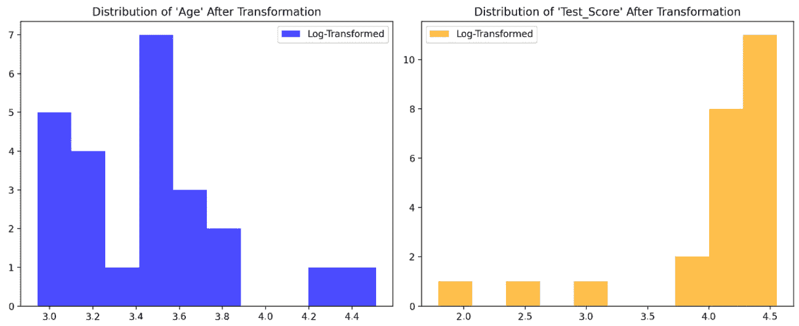

图 8.13 – 对数和平方根变换后的分布图

让我们也来看一下数据的更新统计信息：

```py
            Age  Test_Score
count  24.000000   24.000000
mean    3.462073    4.059624
std     0.398871    0.687214
min     2.944439    1.791759
25%     3.167414    4.090143
50%     3.522344    4.218613
75%     3.603530    4.460095
max     4.510860    4.553877
```

描述性统计显示了对`Age`变量进行对数转换和对`Test_Score`变量进行平方根转换的影响。在转换之前，原始数据集中的`Age`呈右偏分布，均值为 33.75，标准差较大，为 17.18。`Test_Score`的均值为 65.89，范围从 5 到 94，标准差为 24.76，表明测试成绩分布较广。

在应用了转换后，两个变量的分布明显发生了变化：

+   对`Age`进行对数转换后，值的分布被压缩，标准差从原始的 17.18 降至 0.40。转换后的值范围从 2.94 到 4.51，显示出极端值的压缩。

+   对于`Test_Score`，对数据进行对数转换后，值的分布变得更加均匀，标准差从 24.76 降低到 0.69。数据变得更加紧凑且对称，范围从 1.79 到 4.55。

这些转换对两个变量产生了明显的平滑效应，减少了偏斜度和变异性。这一点从标准差的减少和范围的缩小可以看出，使得数据更加对称，接近正态分布。

然而，需要注意的是，转换，特别是对数转换，会压缩数值的尺度，可能影响可解释性。虽然它们通过减少偏斜度和异方差性，有助于满足统计方法的假设，但转换后的数据可能比原始数据尺度更难以理解。尽管如此，这种转换在准备回归模型或其他假设数据呈正态分布的分析时，仍然非常有用。

注意

请记住，对数转换不适用于包含零或负值的数据，因为对数在这些值上是未定义的。

本章的这一部分最后，我们汇总了一个表格，概述了处理异常值时使用的各种方法。该表格突出了每种技术的最佳使用场景，并提供了它们各自的优缺点概览。

| **技术** | **何时使用** | **优点** | **缺点** |
| --- | --- | --- | --- |
| **修剪** | 轻度异常值，保留整体数据结构 | 保留大部分数据集，保持数据完整性 | 减少样本量，可能影响代表性，修剪百分比的选择可能带有随意性 |
| **温莎化** | 中度异常值，保留整体数据 | 保持数据分布，减轻极端值的影响 | 改变数据值；可能扭曲分布；需要指定修剪的限度 |
| **删除数据** | 严重异常值 | 移除极端值的影响，简化分析 | 减少样本量，可能丧失信息；可能使结果偏向中心趋势 |
| **变换** | 偏斜或非正态分布 | 稳定方差，使数据更对称，适应传统统计技术 | 解释挑战，结果可能不太直观，变换方法的选择是主观的 |

表 8.2 – 单变量方法处理异常值的总结

在探讨了各种处理单变量异常值的技术后，包括从简单到复杂的方法，接下来的部分将深入探讨在处理含有异常值的数据时，一般更为偏好的不同统计量。

### 稳健统计

使用如中位数和**中位数绝对偏差**（**MAD**）等稳健的统计量而非均值和标准差，可以减少异常值的影响。

在处理包含异常值或偏斜分布的数据集时，选择稳健的统计量对于获取准确且具有代表性的总结至关重要。使用稳健的量度，如中位数和 MAD，在极端值可能影响传统量度（如均值和标准差）的场景中证明了其优势。中位数是排序后数据的中间值，它对异常值不那么敏感，提供了一个更可靠的集中趋势测量。此外，MAD 评估数据的分布，并且对异常值具有稳健性，从而进一步确保数据集变异性的更准确表示。

MAD

MAD 是一种衡量统计离散度的指标，用于量化数据集的离散程度或分布。它是通过计算每个数据点与数据集的中位数之间的绝对差的中位数来得出的。

该表总结了使用中位数和 MAD 与使用均值和标准差时的关键考虑因素、优缺点：

| **标准** | **中位数** **和 MAD** | **均值和** **标准差** |
| --- | --- | --- |
| **何时使用** | 异常值的存在 | 正态或对称分布 |
| 偏斜分布 | 测量的精确性 |
| **优点** | 对异常值的稳健性 | 对正态分布的效率 |
| 对偏斜数据的适用性 | 解释的简便性 |
| **缺点** | 没有异常值时缺乏敏感性 | 对异常值敏感 |
| 在存在异常值的情况下不稳健 |
| **考虑因素** | 当需要稳定的集中趋势时很有用 | 适用于极端值最少或没有极端值的数据集 |
| 提供在正态分布中的精确度量 |

表 8.3 – 哪些统计方法在处理异常值时更有效

本章接下来的部分将讨论如何识别多变量异常值。

## 识别多变量异常值

多元离群值发生在一个观测值在多个变量的上下文中同时是极端的。这些离群值不能仅通过分析单个变量来检测；相反，它们需要考虑变量之间的相互作用。检测多元离群值涉及在更高维空间中评估数据点。在接下来的部分中，我们将概述不同的方法来识别多元离群值，并为每种方法提供代码示例。

### 马哈拉诺比斯距离

马哈拉诺比斯距离是一种统计量，用于识别多元数据中的离群值。它考虑了变量之间的相关性，并计算每个数据点与数据集均值在缩放空间中的距离。然后，将这个距离与一个阈值进行比较，以识别那些显著偏离多元均值的观测值。

对于这个示例，我们创建了一个新的数据集，包含一些多元学生数据，以便我们可以以最佳方式展示这一技术。完整代码可以在仓库中查看：[`github.com/PacktPublishing/Python-Data-Cleaning-and-Preparation-Best-Practices/blob/main/chapter08/12.mahalanobis_distance.py`](https://github.com/PacktPublishing/Python-Data-Cleaning-and-Preparation-Best-Practices/blob/main/chapter08/12.mahalanobis_distance.py)。该过程的关键步骤如下：

1.  让我们首先导入所需的库：

    ```py
    import pandas as pd
    import numpy as np
    import matplotlib.pyplot as plt
    from scipy.stats import chi2
    from mpl_toolkits.mplot3d import Axes3D
    ```

1.  让我们生成多元学生数据：

    ```py
    np.random.seed(42)
    data = np.random.multivariate_normal(mean=[0, 0], cov=[[1, 0.5], [0.5, 1]], size=100)
    ```

    我们从一个多元正态分布中生成了 100 个样本，指定均值向量为`[0, 0]`，协方差矩阵为`[[1, 0.5], [0.5, 1]]`。

1.  让我们引入离群值并创建数据框：

    ```py
    outliers = np.array([[8, 8], [9, 9]])
    data = np.concatenate([data, outliers])
    df = pd.DataFrame(data, columns=['X1', 'X2'])
    ```

1.  以下函数根据均值和协方差矩阵的逆计算每个数据点的马哈拉诺比斯距离：

    ```py
    def mahalanobis_distance(x, mean, inv_cov_matrix):
        centered_data = x - mean
        mahalanobis_dist = np.sqrt(np.dot(centered_data,
                                   np.dot(inv_cov_matrix,
                                   centered_data)))
        return mahalanobis_dist
    ```

1.  计算数据集的均值、协方差矩阵和协方差矩阵的逆：

    ```py
    mean = np.mean(df[['X1', 'X2']], axis=0)
    cov_matrix = np.cov(df[['X1', 'X2']], rowvar=False)
    inv_cov_matrix = np.linalg.inv(cov_matrix)
    ```

1.  为每个数据点计算马哈拉诺比斯距离，并将其作为新列添加到数据框中：

    ```py
    df['Mahalanobis_Distance'] = df.apply(lambda row: mahalanobis_distance(row[['X1', 'X2']], mean, inv_cov_matrix), axis=1)
    ```

1.  设置离群值检测的显著性水平：

    ```py
    alpha = 0.01
    ```

    显著性水平（`alpha`）表示在零假设为真的情况下拒绝它的概率，在本上下文中，它指的是错误地将数据点识别为离群值的概率。`alpha`常见的选择值为`0.01`，意味着错误地将正常数据点归类为离群值的概率为 1%。较低的`alpha`值使得离群值检测更加保守，减少假阳性（正常点被标记为离群值）。相反，较高的`alpha`值使检测更加宽松，可能会识别出更多的离群值，但增加了假阳性的机会。

1.  接下来，我们设置卡方阈值：

    ```py
    chi2_threshold = chi2.ppf(1 - alpha, df=2) # df is the degrees of freedom, which is the number of features
    ```

    卡方阈值是从卡方分布中得到的临界值，用于定义异常值检测的截止点。`chi2.ppf`函数计算卡方分布的百分位点函数（累积分布函数的反函数）。自由度等于马氏距离计算中使用的特征或变量的数量。在这种情况下，是`2`（对于 X1 和 X2）。卡方阈值用于确定超过该值的马氏距离被认为过高，表示相应的数据点是异常值。例如，使用`alpha = 0.01`时，表示你正在寻找一个阈值，超过该阈值的只有 1%的数据点，假设数据是正态分布的。

1.  这一步涉及将每个数据点的马氏距离与卡方阈值进行比较，以确定它是否为异常值：

    ```py
    outliers = df[df['Mahalanobis_Distance'] > chi2_threshold]
    df_no_outliers = df[df['Mahalanobis_Distance'] <= chi2_threshold]
    ```

    距离大于阈值的数据点被标记为异常值，并与其余数据分开。

1.  现在让我们来可视化异常值：

    ```py
    fig = plt.figure(figsize=(10, 8))
    ax = fig.add_subplot(111, projection='3d')
    ax.scatter(df_no_outliers['X1'], df_no_outliers['X2'], df_no_outliers['Mahalanobis_Distance'], color='blue', label='Data Points')
    ax.scatter(outliers['X1'], outliers['X2'], outliers['Mahalanobis_Distance'], color='red', label='Outliers')
    ax.set_xlabel('X1')
    ax.set_ylabel('X2')
    ax.set_zlabel('Mahalanobis Distance')
    ax.set_title('Outlier Detection using Mahalanobis Distance')
    plt.legend()
    plt.show()
    ```

在下面的图表中，我们可以看到所有数据点在 3D 空间中的投影，并且可以看到标记为*x*的异常值：

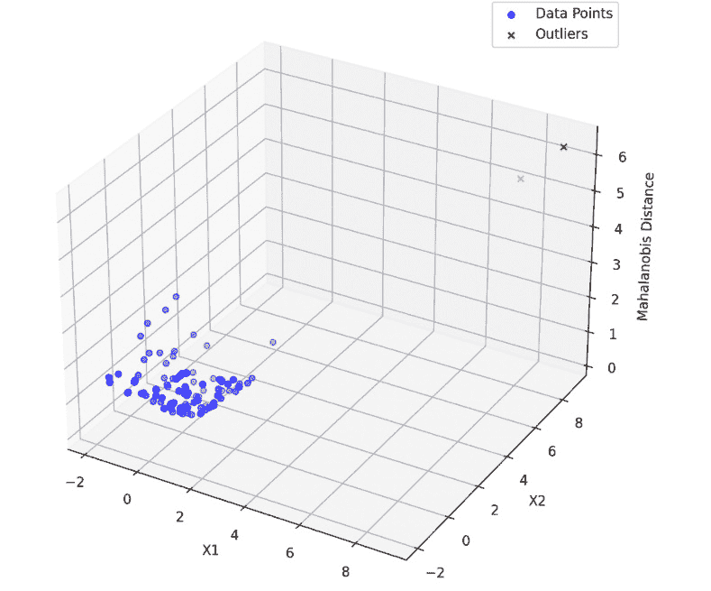

图 8.14 – 使用马氏距离绘制的数据

注意

在你的笔记本电脑上运行可视化程序，以便能够看到这个空间并在 3D 视图中移动，挺酷的！

从 3D 图中可以看出，数据中的异常值非常容易识别。马氏距离在处理涉及多个变量的数据集时最为有效，因为它考虑了变量之间的均值和协方差，并能够识别在单个变量中可能无法显现的异常值。在变量具有不同单位或尺度的情况下，马氏距离可以规范化变量间的距离，从而提供更有意义的异常值度量。与单变量方法不同，马氏距离对变量之间的关系非常敏感。它捕捉每个数据点与数据分布中心的距离，同时考虑了变量之间的相关性。

在多变量部分的下一节中，我们将讨论聚类方法如何帮助我们检测异常值。

### 聚类技术

聚类方法，如 k-means 或层次聚类，可以用于将相似的数据点分组。那些不属于任何聚类或形成小聚类的数据点，可能会被视为多变量异常值。

一种常见的异常值检测方法是使用**基于密度的空间聚类应用与噪声**（**DBSCAN**）算法。DBSCAN 可以识别密集的数据点簇，并将异常值分类为噪声。DBSCAN 的优势在于它*不需要事先指定聚类的数量*，并且能够基于密度有效地识别异常值。它是一个相对简单但功能强大的异常值检测方法，尤其在聚类可能不完全分离或异常值形成孤立点的情况下表现良好。

让我们深入了解 DBSCAN 的代码。与往常一样，你可以在[`github.com/PacktPublishing/Python-Data-Cleaning-and-Preparation-Best-Practices/blob/main/chapter08/13.clustering.py`](https://github.com/PacktPublishing/Python-Data-Cleaning-and-Preparation-Best-Practices/blob/main/chapter08/13.clustering.py)的代码库中找到完整的代码：

1.  让我们导入所需的库：

    ```py
    import pandas as pd
    import numpy as np
    import matplotlib.pyplot as plt
    from sklearn.cluster import DBSCAN
    from sklearn.preprocessing import StandardScaler
    ```

1.  让我们生成用于该方法的示例数据集。数据集由 100 个样本组成，来自一个多元正态分布，均值向量为`[0, 0]`，协方差矩阵为`[[1, 0.5], [0.5, 1]]`。这将创建一个围绕原点的正态分布点簇，其中各特征之间存在一定的相关性：

    ```py
    np.random.seed(42)
    data = np.random.multivariate_normal(mean=[0, 0], cov=[[1, 0.5], [0.5, 1]], size=100)
    outliers = np.random.multivariate_normal(mean=[8, 8], cov=[[1, 0], [0, 1]], size=10)
    data_with_outliers = np.vstack([data, outliers])
    ```

1.  让我们将数据转换为 DataFrame：

    ```py
    df = pd.DataFrame(data_with_outliers, columns=['Feature1', 'Feature2'])
    ```

1.  通过去除均值并缩放到单位方差来标准化数据。`sklearn.preprocessing`中的`StandardScaler`用于拟合和转换数据。标准化确保所有特征在距离计算中贡献相等，通过将它们缩放到均值为 0、标准差为 1 来实现。这对于基于距离的算法（如 DBSCAN）尤其重要：

    ```py
    scaler = StandardScaler()
    data_scaled = scaler.fit_transform(df)
    ```

1.  应用 DBSCAN 进行异常值检测。`eps=0.4` 设置了被视为同一邻域的点之间的最大距离，`min_samples=5` 指定了形成密集区域所需的最小点数。DBSCAN 是一种聚类算法，可以识别不属于任何簇的异常值。DBSCAN 将标记为 `-1` 的点视为异常值。`eps` 和 `min_samples` 参数的选择会显著影响异常值的检测，这些值可能需要根据具体数据集进行调优：

    ```py
    dbscan = DBSCAN(eps=0.4, min_samples=5)
    df['Outlier'] = dbscan.fit_predict(data_scaled)
    ```

在下图中，我们将所有数据点绘制在二维空间中，可以看到图表右侧的异常值：

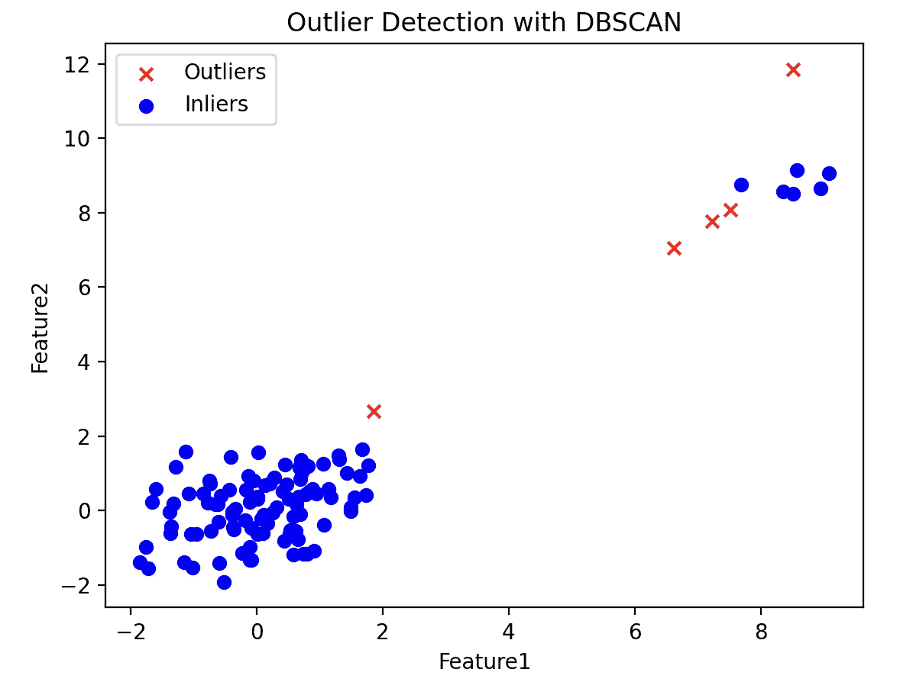

图 8.15 – 基于 DBSCAN 的异常值检测聚类

在 DBSCAN 中有一个关键参数需要调整：`eps`。`eps`（epsilon）参数本质上定义了数据点周围的半径，所有位于该半径内的其他数据点都被视为该数据点的邻居。

在执行 DBSCAN 聚类时，算法首先选择一个数据点，并识别所有距离该点在`eps`范围内的数据点。如果在这个距离内的数据点数量超过指定的阈值（`min_samples`），则选中的数据点被视为核心点，所有在其 epsilon 邻域内的点将成为同一聚类的一部分。然后，算法通过递归地查找邻居的邻居，直到没有更多的点可以添加为止，从而扩展聚类。

`eps`的选择取决于数据集的特定特征和所需的聚类粒度。它可能需要一些实验和领域知识来找到适合的`eps`值。

使用 k-means 代替 DBSCAN 提供了另一种方法。K-means 是一种基于质心的聚类算法，需要*预先指定聚类数量*，因此必须有先验知识或进行探索性分析，以确定*k*的合适值。虽然它对异常值敏感，但 k-means 的简洁性和计算效率使其在某些场景中成为一个有吸引力的选择。当聚类之间分离良好并且具有相对均匀的结构时，k-means 可能特别适用。然而，必须注意，k-means 可能在处理不规则形状或重叠的聚类时表现不佳，并且在试图最小化平方距离和时，可能会受到异常值的影响。

发现多变量异常值后，我们需要决定如何处理这些异常值。这是下一部分的重点。

## 处理多变量异常值

处理多变量异常值涉及到解决在多个变量背景下显著偏离的数据点。在本章的这一部分，我们将提供不同方法来处理多变量异常值的解释和代码示例。

### 多变量修剪

该方法涉及基于多个变量的综合评估来限制极端值。例如，修剪的限制可以通过考虑马哈拉诺比斯距离来确定，马哈拉诺比斯距离考虑了变量之间的相关性。这种技术在处理跨多个变量存在异常值的数据集时尤其有用。其思路是在减少极端值影响的同时，保留数据的整体结构。

在这个例子中，我们将继续处理马哈拉诺比斯距离示例中的数据，在计算完马哈拉诺比斯距离后，我们将丢弃超过阈值的异常值。你可以在[`github.com/PacktPublishing/Python-Data-Cleaning-and-Preparation-Best-Practices/blob/main/chapter08/14.multivariate_trimming.py`](https://github.com/PacktPublishing/Python-Data-Cleaning-and-Preparation-Best-Practices/blob/main/chapter08/14.multivariate_trimming.py)的代码库中找到完整代码：

1.  让我们从导入库开始：

    ```py
    import pandas as pd
    import numpy as np
    import matplotlib.pyplot as plt
    import seaborn as sns
    from scipy.stats import chi2
    from mpl_toolkits.mplot3d import Axes3D
    ```

1.  让我们生成多变量学生数据。

    ```py
    np.random.seed(42)
    data = np.random.multivariate_normal(mean=[0, 0], cov=[[1, 0.5], [0.5, 1]], size=100)
    outliers = np.array([[8, 8], [9, 9]])
    data = np.concatenate([data, outliers])
    df = pd.DataFrame(data, columns=['X1', 'X2'])
    ```

1.  定义计算马氏距离的函数，该距离衡量数据点与分布均值的距离，考虑特征之间的相关性：

    ```py
    def mahalanobis_distance(x, mean, inv_cov_matrix):
        centered_data = x - mean
        mahalanobis_dist = np.sqrt(np.dot(centered_data, np.dot(inv_cov_matrix, centered_data)))
        return mahalanobis_dist
    ```

1.  为异常值检测准备数据：

    ```py
    df[['X1', 'X2']] = df[['X1', 'X2']].astype(float)
    mean = np.mean(df[['X1', 'X2']], axis=0)
    cov_matrix = np.cov(df[['X1', 'X2']], rowvar=False)
    inv_cov_matrix = np.linalg.inv(cov_matrix)
    ```

1.  计算每个数据点的马氏距离：

    ```py
    df['Mahalanobis_Distance'] = df.apply(lambda row: mahalanobis_distance(row[['X1', 'X2']], mean, inv_cov_matrix), axis=1)
    ```

1.  设置异常值检测的阈值：

    ```py
    alpha = 0.1
    chi2_threshold = chi2.ppf(1 - alpha, df=2)
    ```

1.  过滤数据框，分离出异常值与其余数据。

    ```py
    outliers = df[df['Mahalanobis_Distance'] > chi2_threshold]
    df_no_outliers = df[df['Mahalanobis_Distance'] <= chi2_threshold]
    ```

在处理异常值之前，让我们先展示分布图。

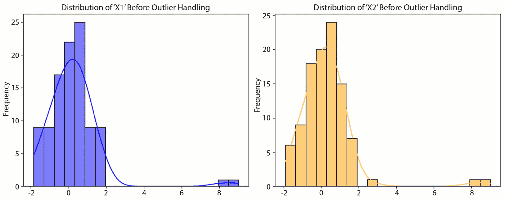

图 8.16 – 包含多变量异常值的分布图

原始数据的描述性统计如下：

```py
               X1          X2
count  102.000000  102.000000
mean     0.248108    0.281463
std      1.478963    1.459212
min     -1.852725   -1.915781
25%     -0.554778   -0.512700
50%      0.108116    0.218681
75%      0.715866    0.715485
max      9.000000    9.000000
```

在删除被认为是多变量异常值的数据后，我们可以观察到以下分布的变化：

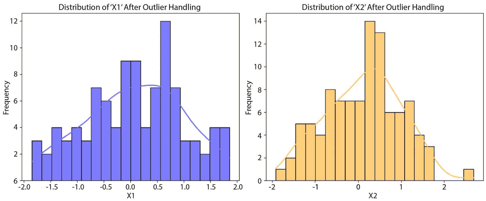

图 8.17 – 移除多变量异常值后的分布图

最后，让我们来看看更新后的描述性统计：

```py
               X1          X2  Mahalanobis_Distance
count  100.000000  100.000000            100.000000
mean     0.083070    0.117093              1.005581
std      0.907373    0.880592              0.547995
min     -1.852725   -1.915781              0.170231
25%     -0.574554   -0.526337              0.534075
50%      0.088743    0.200745              0.874940
75%      0.699309    0.707639              1.391190
max      1.857815    2.679717              2.717075
```

在修剪掉异常值之后，让我们讨论数据中观察到的变化：

+   移除异常值后，观察的数量从 102 降至 100，因此我们丢弃了两条记录。

+   在`X1`列中，均值从 0.248 降至 0.083，标准差从 1.479 降至 0.907。

+   在`X2`列中，均值从 0.281 降至 0.117，标准差从 1.459 降至 0.881。

+   `X1`和`X2`的最大值分别被限制在 1.857815 和 2.679717，表明极端异常值已被移除。

总的来说，移除异常值后，数据集的变异性减小，尤其是在均值和标准差方面。极端值可能对分析产生偏差的风险已被减轻。

让我们总结本章的关键要点。

# 总结

在本章中，我们深入探讨了缺失值和异常值的处理。我们理解了缺失值如何扭曲我们的分析，并学习了从简单的均值插补到先进的基于机器学习的插补技术等多种插补方法。同样，我们认识到异常值可能会偏移我们的结果，并深入研究了在单变量和多变量背景下检测和管理异常值的方法。通过结合理论和实践示例，我们对确保数据质量和可靠性的考虑、挑战及策略有了更深入的理解。

拥有这些见解后，我们现在可以进入下一章，讨论特征的缩放、归一化和标准化。
