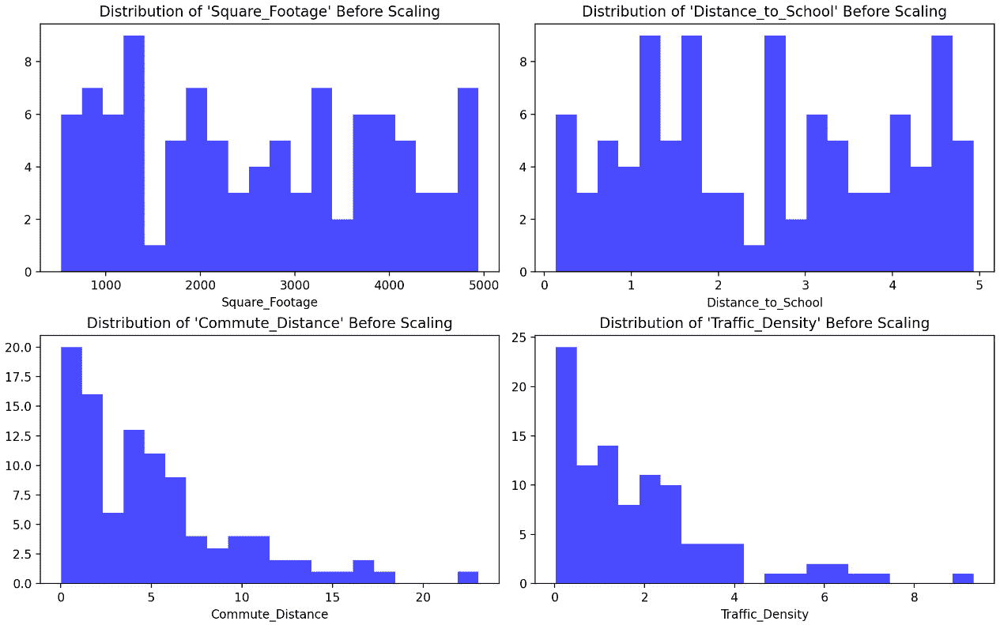
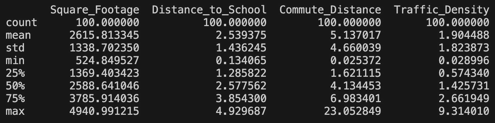
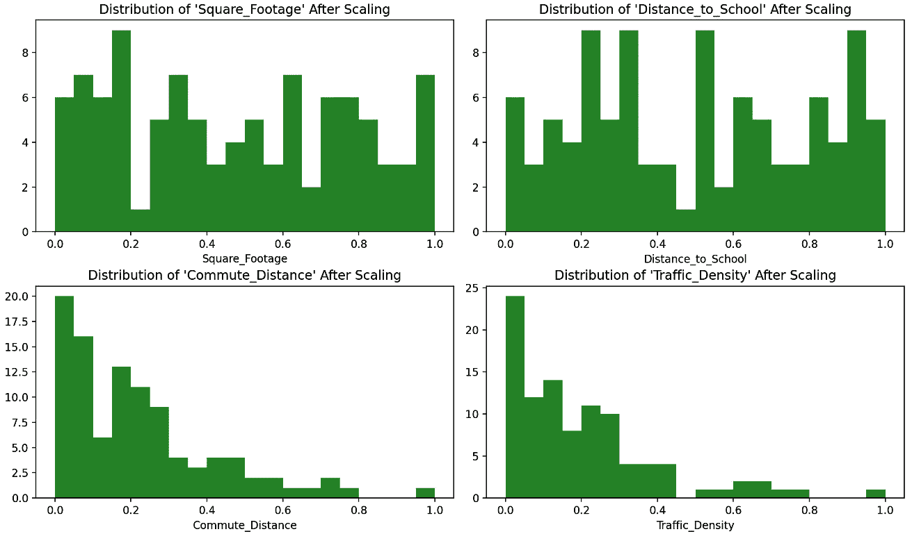
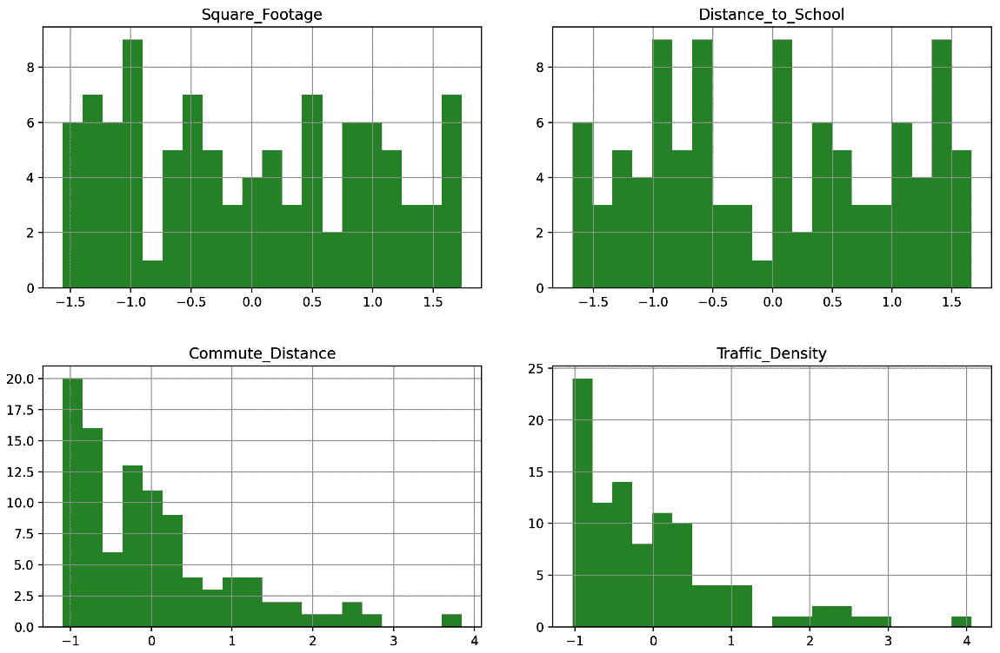
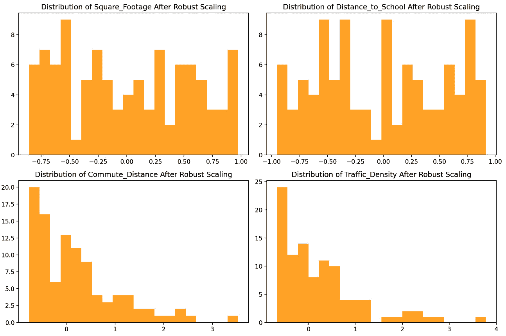

# 第九章：归一化与标准化

特征缩放、归一化和标准化是机器学习中的重要预处理步骤，能够帮助确保机器学习模型能够有效地从数据中学习。这些技术解决了与数值稳定性、算法收敛性、模型性能等相关的问题，最终有助于在数据分析和机器学习任务中获得更好、更可靠的结果。

在本章中，我们将深入探讨以下主题：

+   将特征缩放到一个范围

+   Z-score 缩放

+   鲁棒缩放

# 技术要求

你可以在[`github.com/PacktPublishing/Python-Data-Cleaning-and-Preparation-Best-Practices/tree/main/chapter09`](https://github.com/PacktPublishing/Python-Data-Cleaning-and-Preparation-Best-Practices/tree/main/chapter09)找到本章的所有代码。

不同的代码文件遵循章节中不同部分的名称。

# 将特征缩放到一个范围

特征缩放是机器学习中的一种预处理技术，它对数据集的独立变量或特征进行*范围*重缩放。它的目的是通过将所有特征调整到一个共同的尺度上，确保所有特征在模型训练过程中对模型的贡献相同。特征缩放对于那些对输入特征尺度敏感的算法尤为重要，如 k 近邻算法和基于梯度下降的优化算法。

注意

在进行特征缩放时，我们实际上是在改变数据分布的范围。

让我们通过一个例子来帮助理解特征缩放的概念。假设你正在进行一个机器学习项目，目的是根据房屋的各种特征来预测房价，例如以下几个特征：

+   建筑面积（平方英尺）

+   到最近学校的距离（英里）

+   到最近公共交通站点的距离（英里）

现在，让我们来讨论一下在这个背景下特征缩放为什么如此重要。**建筑面积**这一特征的范围可能从几百平方英尺到几千平方英尺不等。而**到最近学校的距离**和**到最近公共交通站点的距离**可能从几分之一英里到几英里不等。如果不对这些特征进行缩放，算法可能会给较大值过高的权重，从而使得建筑面积在预测房价中占主导地位。像到最近学校的距离这样的特征可能会被不公平地忽略。

对于本章的所有部分，我们将使用上述示例来展示不同的缩放方法。让我们先来看一下这个示例的数据创建过程；代码可以在[`github.com/PacktPublishing/Python-Data-Cleaning-and-Preparation-Best-Practices/blob/main/chapter09/min_max_scaling.py`](https://github.com/PacktPublishing/Python-Data-Cleaning-and-Preparation-Best-Practices/blob/main/chapter09/min_max_scaling.py)找到：

1.  让我们从导入所需的库开始：

    ```py
    import pandas as pd
    import numpy as np
    import matplotlib.pyplot as plt
    from sklearn.preprocessing import MinMaxScaler
    ```

1.  接下来，我们将创建一个与房价相关的特征数据集：

    ```py
    np.random.seed(42)
    num_samples = 100
    ```

    我们将创建以下影响房价的特征：

    +   平方英尺面积：

        ```py
        square_footage = np.random.uniform(500, 5000, num_samples)
        ```

    +   到最近学校的距离（以英里为单位）：

        ```py
        distance_to_school = np.random.uniform(0.1, 5, num_samples)
        ```

    +   通勤到工作的距离（以英里为单位）：

        ```py
        commute_distance = np.random.exponential(5, num_samples)
        ```

    +   交通密度（偏态特征）：

        ```py
        traffic_density = np.random.exponential(2, num_samples)
        ```

1.  然后，我们创建一个包含所有特征的 DataFrame：

    ```py
    data = pd.DataFrame({
            'Square_Footage': square_footage,
            'Distance_to_School': distance_to_school,
            'Commute_Distance': commute_distance,
            'Traffic_Density': traffic_density
    })
    ```

1.  最后，我们绘制原始分布：

    ```py
    plt.figure(figsize=(12, 8))
    ```

    你可以在这里看到数据的原始分布：



图 9.1 – 房价预测用例的分布

1.  让我们显示数据集的统计信息：

    ```py
    print("Original Dataset Statistics:")
    print(data.describe())
    ```

    这将打印以下输出：



图 9.2 – 原始数据集统计信息

现在让我们讨论最常见的缩放方法之一——**min-max 缩放**。

# Min-max 缩放

Min-max 缩放，也称为**归一化**，将变量的值缩放到一个特定的范围，通常在 0 和 1 之间。Min-max 缩放在你想确保变量中的所有值都落在标准化范围内，使它们可以直接比较时非常有用。当变量的分布不假设为正态分布时，它通常被应用。

让我们看一下计算 min-max 缩放的公式：

X _ 缩放 = (X − X _ min) / (X _ max − X _ min)

从公式中可以看出，min-max 缩放保持了值的相对顺序，但*将它们压缩到一个特定的范围*。需要注意的是，这*不是处理异常值*的方法，如果数据中存在异常值，这些极端值可能会不成比例地影响缩放。因此，最好先处理异常值，然后再进行特征的缩放。

当满足以下条件时，缩放到特定范围是合适的：

+   你已经知道数据的大致上下限

+   你的数据在这个范围内遵循相对均匀或钟形分布

+   你选择的机器学习算法或模型通过将特征限制在特定范围内，通常是`[0, 1]`或任何其他期望的范围，会受益。

这个场景的经典例子是年龄。年龄值通常从 0 到 90，整个范围内有大量个体。然而，不太建议对收入进行缩放，因为高收入个体的数量有限。如果你对收入进行线性缩放，缩放的上限将变得异常高，大多数数据点将集中在一个狭窄的范围内，导致信息丢失和失真。

让我们看一下我们之前讨论的*房价预测用例*的代码，了解 min-max 缩放器如何转换数据：

1.  首先，我们使用`MinMaxScaler()`来缩放数据：

    ```py
    scaler = MinMaxScaler()
    data_scaled = pd.DataFrame(scaler.fit_transform(data), columns=data.columns)
    ```

1.  我们可以使用以下代码显示缩放后的数据集统计信息：

    ```py
    print("\nDataset Statistics After Scaling:")
    print(data_scaled.describe())
    ```

1.  让我们绘制并观察缩放后的分布：

    ```py
    plt.figure(figsize=(12, 8))
    ```

让我们看看标准化后修改的数据分布：



图 9.3 – 经过最小最大标准化后的房价预测用例分布

我们应用了最小最大标准化，将每一列转化为标准化的 0 到 1 之间的范围。由于最小最大标准化保持了数据点之间的相对距离，因此原始特征分布的形状在标准化后保持不变。标准化对数据起到了归一化的作用，将所有特征带到了一个共同的尺度。这在特征具有不同单位或范围时尤为重要，可以防止某个特征支配其他特征。

注意

如果你的数据集是稀疏的（包含许多零值），则最小最大标准化可能不适用，因为它可能导致信息丢失。可以考虑使用替代方法，如**MaxAbsScaler**或鲁棒缩放器。

在接下来的部分，我们将讨论 Z 分数标准化。

# Z 分数标准化

Z 分数标准化，也称为标准化，适用于当你想将数据转化为均值为 0，标准差为 1 的形式时。Z 分数标准化在统计分析和机器学习中被广泛应用，尤其是在使用 k-means 聚类或**主成分分析**（**PCA**）等算法时。

这是 Z 分数的公式：

X _ scaled =(X − mean(X)) / std(X)

让我们继续使用房价预测用例来展示 Z 分数标准化。代码可以在 [`github.com/PacktPublishing/Python-Data-Cleaning-and-Preparation-Best-Practices/blob/main/chapter09/zscaler.py`](https://github.com/PacktPublishing/Python-Data-Cleaning-and-Preparation-Best-Practices/blob/main/chapter09/zscaler.py) 找到：

1.  我们首先执行 Z 分数标准化：

    ```py
    data_zscore = (data - data.mean()) / data.std()
    ```

1.  然后，我们打印数据集统计信息：

    ```py
    print("\nDataset Statistics after Z-score Scaling:")
    print(data_zscore.describe())
    ```

1.  最后，我们可视化分布：

    ```py
    data_zscore.hist(figsize=(12, 10), bins=20, color='green', alpha=0.7)
    plt.suptitle('Data Distributions after Z-score Scaling')
    plt.show()
    ```

让我们看看标准化后修改的数据分布：



图 9.4 – 经过 Z 标准化后的房价预测用例分布

标准化后的每个特征的均值非常接近 0，这是 Z 分数标准化的预期结果。数据现在已围绕 0 进行集中。每个特征的标准差大约为 1，使得不同特征之间的尺度具有可比性。最小值和最大值已被转换，但保持了数据的相对分布。

## 何时使用 Z 分数标准化

让我们还讨论一些关于何时使用 Z 分数标准化的注意事项：

+   Z-score 缩放假设数据大致呈正态分布，或者至少围绕中心均值呈对称分布。如果数据高度偏斜或具有非标准分布，标准化可能在使数据更符合高斯分布方面效果不佳。如你所见，`Commute_Distance` 和 `Traffic_Density` 特征呈偏斜分布，且由于数据未围绕均值集中，z-score 缩放效果并不理想。

+   这种方法最适用于数值特征，而非分类或有序特征。确保你要标准化的数据是定量性质的。

+   极端异常值可能对均值和标准差产生重大影响，而这些是 z-score 缩放中使用的统计量。因此，在标准化之前处理异常值非常重要，因为它们可能扭曲缩放效果。

+   Z-score 缩放假设变量之间存在线性关系。如果底层关系是非线性的，其他缩放方法或变换可能更为合适。

+   Z-score 缩放假设变量是独立的，或至少不高度相关。如果变量之间高度相关，标准化可能不会提供额外的好处，且应单独考虑相关性结构。

+   Z-score 缩放会改变数据的原始单位，这可能会影响结果的可解释性。考虑在分析中是否需要保持原始单位。

对于小型数据集，z-score 缩放的影响可能更为显著。对非常小的数据集应用标准化时要小心，因为它可能会过度强调异常值的影响。

# 稳健缩放

稳健缩放，也叫**稳健标准化**，是一种特征缩放方法，特别适用于处理包含异常值的数据集。与可能对异常值敏感的最小-最大缩放和 z-score 缩放不同，稳健缩放旨在在存在极端值时保持稳健性。当你希望在最小化极端值影响的同时对特征进行规范化或标准化时，它尤为有用。稳健缩放也适用于那些特征不遵循正态分布、可能具有偏斜或重尾的数据集。

下面是稳健缩放的公式：

X _ scaled = (X − median) / IQR

在缩放过程中，通过减去中位数并除以**四分位距**（**IQR**）来规范化数据，使其围绕中位数进行中心化，并根据 IQR 所表示的分布范围进行缩放。这种规范化有助于减轻极端值的影响，使得缩放后的值更加代表整体分布。

正如我们在上一章中讨论的那样，中位数是当数据按顺序排列时位于中间的值，使得鲁棒缩放比其他依赖均值的缩放方法对极端值或异常值的敏感度较低。此外，四分位距（IQR）表示第一四分位数（Q1）和第三四分位数（Q3）之间的范围，亦对异常值具有鲁棒性。与完整范围或标准差不同，IQR 侧重于数据的中间 50%，因此不容易受到极端值的影响。

下面是如何使用 Python 代码应用鲁棒缩放的示例：

```py
robust_scaler = RobustScaler()
data_scaled = robust_scaler.fit_transform(data)
```

让我们来看一下缩放后修改的数据分布：



图 9.5 – 鲁棒缩放后房价预测案例分布

经过鲁棒缩放处理后，我们可以观察到数据的中心趋势发生了变化，每个特征的均值现在更接近零。这是因为鲁棒缩放过程减去了中位数。至于数据的分布，它在除以四分位距（IQR）后发生了变化。每个特征的变异性现在以更一致的方式呈现，且对异常值更为稳健。每个特征的值范围现在被压缩，特别是对于那些初始范围较大的特征，防止了极端值特征的主导作用。

为了总结本章内容，我们制作了一个总结表格，展示了迄今为止讨论的所有技术，包括它们的使用时机、优缺点等信息。

# 方法比较

本图表提供了在不同数据情境下，适合使用哪种缩放技术的指导。

| **缩放方法** | **何时使用** | **优点** | **缺点** |
| --- | --- | --- | --- |
| **最小-最大缩放** | 特征具有明确且已知的范围假设数据服从正态分布数据不包含异常值 | 简单易懂保留相对关系节省内存 | 对异常值敏感 |
| **Z-score 缩放** | 数据服从正态分布对范围没有强假设处理异常值不是重点 | 将数据标准化为零均值，标准差为 1 | 对异常值敏感可能不适合偏态数据 |
| **鲁棒缩放** | 数据包含异常值偏态分布或非正态数据平衡特征贡献对不同特征方差的弹性 | 对异常值较不敏感保留中心趋势和分布 | 计算开销更大 |

表 9.1 – 比较不同的缩放技术

计算复杂度

最小-最大缩放方法通常更节省内存，尤其是在处理大型数据集时。这是因为最小-最大缩放仅仅基于每个特征的最小值和最大值进行缩放，计算相对简单。

另一方面，z-score 标准化和稳健标准化都需要额外的计算，如均值、标准差（用于 z-score 标准化）、中位数和四分位间距（用于稳健标准化），这可能会导致更多的内存使用。尤其在处理大数据集时，z-score 标准化和稳健标准化的计算复杂性和内存需求可能会变得更加明显。

最后，让我们总结一下本章的学习内容，并为下一章获得启发。

# 总结

本章中，我们探讨了三种常见的数值特征标准化方法：最小-最大标准化、z-score 标准化和稳健标准化。最小-最大标准化将数据转换到一个特定的范围，使其适用于对特征大小敏感的算法。z-score 标准化将数据标准化为零均值和单位方差，提供一个标准化的分布。稳健标准化则通过使用中位数和四分位间距，能够抵抗离群值，适用于具有偏态分布或离群值的数据集。我们还讨论了在选择最适合你使用场景的方法时需要考虑的不同因素。

接下来，我们将在下一章将重点转向处理分类特征。
