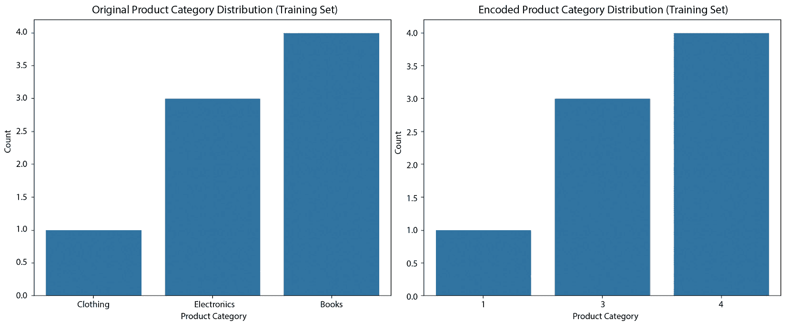

# 第十章：处理分类特征

处理分类特征涉及表示和处理那些本质上不是数值的信息。**分类特征**是可以取有限且固定数量值或类别的属性，它们通常定义数据集中的不同类别或组，例如产品类型、书籍类型或客户群体。有效地管理分类数据至关重要，因为大多数**机器学习**（**ML**）算法要求输入为数值。

在本章中，我们将涵盖以下主题：

+   标签编码

+   一热编码

+   目标编码（均值编码）

+   频率编码

+   二进制编码

# 技术要求

本章的完整代码可以在以下 GitHub 仓库中找到：

[`github.com/PacktPublishing/Python-Data-Cleaning-and-Preparation-Best-Practices/tree/main/chapter10`](https://github.com/PacktPublishing/Python-Data-Cleaning-and-Preparation-Best-Practices/tree/main/chapter10)

让我们安装本章将使用的必要库：

```py
pip install scikit-learn==1.5.0
pip install matplotlib==3.9.0
pip install seaborn==0.13.2
pip install category_encoders==2.6.3
```

# 标签编码

**标签编码**是一种处理分类数据的技术，通过将每个类别转换为唯一的整数。它适用于具有顺序关系的分类特征，即类别之间有明确的排名或顺序。

例如，当处理“高中”、“学士”、“硕士”和“博士”等教育水平时，可以使用标签编码，因为这些教育水平有一个从最低到最高的明确顺序。

## 用例 —— 员工绩效分析

**人力资源**（**HR**）部门希望分析员工绩效数据，以了解员工评分与薪资、工作年限和部门等其他因素之间的关系。他们计划使用机器学习根据这些因素预测员工评分。

### 数据

让我们快速浏览一下用于绩效分析的数据：

+   `Employee Rating`：具有`Poor`、`Satisfactory`、`Good`和`Excellent`值的分类特征

+   `Salary`：表示员工薪资的数值特征

+   `Years of Experience`：表示员工工作年限的数值特征

+   `Department`：表示员工所在部门的分类特征

让我们先看一下编码前的原始数据框：

```py
Employee   Rating  Salary  Years of Experience  Department
0            Poor   35000                    2          HR
1            Good   50000                    5          IT
2    Satisfactory   42000                    3     Finance
3       Excellent   60000                    8          IT
4            Good   52000                    6   Marketing
```

在理解了数据之后，我们可以进入用例的目标。

### 用例目标

该用例的目标是使用标签编码对`Employee Rating`特征进行编码，以便准备数据进行机器学习分析。让我们看看如何使用 scikit-learn 来完成这项工作，完整代码可以在[`github.com/PacktPublishing/Python-Data-Cleaning-and-Preparation-Best-Practices/blob/main/chapter10/1a.label_encoding.py`](https://github.com/PacktPublishing/Python-Data-Cleaning-and-Preparation-Best-Practices/blob/main/chapter10/1a.label_encoding.py)找到：

1.  让我们导入所需的库：

    ```py
    import pandas as pd
    from sklearn.preprocessing import LabelEncoder
    ```

1.  让我们创建一个示例数据集并将其转化为 DataFrame：

    ```py
    data = {
        'Employee Rating': ['Poor', 'Good', 'Satisfactory', 'Excellent', 'Good'],
        'Salary': [35000, 50000, 42000, 60000, 52000],
        'Years of Experience': [2, 5, 3, 8, 6],
        'Department': ['HR', 'IT', 'Finance', 'IT', 'Marketing']
    }
    df = pd.DataFrame(data)
    ```

1.  初始化 `LabelEncoder` 类：

    ```py
    label_encoder = LabelEncoder()
    ```

1.  对 `员工评级` 列应用标签编码：

    ```py
    df['Employee Rating (Encoded)'] = label_encoder.fit_transform(df['Employee Rating'])
    ```

让我们看看我们创建的编码输出。

### 编码后的输出

在这个用例中，应用标签编码对`员工评级`特征进行转换，将其转换为数字值，同时保留序数关系。下表显示了编码操作的输出结果。

|  | `员工评级` | `薪资` | `工作经验年限` | `部门` | `员工评级（编码后）` |
| --- | --- | --- | --- | --- | --- |
| `1` | `差` | `35000` | `2` | `人力资源` | `2` |
| `2` | `好` | `50000` | `5` | `信息技术` | `1` |
| `3` | `满意` | `42000` | `3` | `财务` | `3` |
| `4` | `优秀` | `60000` | `8` | `信息技术` | `0` |
| `5` | `好` | `52000` | `6` | `市场营销` | `1` |

表 10.1 – 标签编码后的输出数据集

如你所见，已添加了一个`员工评级（编码后）`特征，所有项目现在都变成了数字。让我们看一下编码列的分布图：


图 10.1 – 编码前后的分布

如我们所见，编码前后的分布没有变化。标签编码将类别标签转换为数值，*同时保留原始数据分布*。它只是为每个类别分配了唯一的整数值，*并未改变其频率*。然而，在视觉上，*x* 轴上的标签将从类别值变为数字值，但每个标签的计数（或频率）将保持不变。

注意

如果数据被打乱或在不同的编码器运行之间类别的顺序发生变化，编码后的值可能会不同。这是因为将整数分配给类别可能依赖于它们出现的顺序。此外，如果每次都初始化一个新的标签编码器实例，类别与整数之间的映射可能也会发生变化。为了确保结果一致，应该在第一次拟合编码器后使用它来进行数据转换。

编码后的值可以作为机器学习模型的输入特征，用于根据薪资、工作经验和部门预测员工评级。现在，让我们讨论在使用标签编码器编码特征时需要注意的一些事项。

## 标签编码的注意事项

在进行标签编码时，尤其是在处理大型数据集时，有几个重要的注意事项。确保类别特征具有有意义的顺序。如果类别之间没有自然的顺序，标签编码可能不适用。标签编码将*整数值分配给类别，基于字母顺序*。如果类别没有固有的顺序，可能会引发问题，模型可能会将数字值视为有序。例如，`Poor`、`Good`和`Excellent`可能会被编码为`2`、`1`和`0`，但`Poor`并不比`Good`大。正如前面提到的用例中所发生的那样。为了确保标签编码反映正确的顺序（即`Poor` < `Satisfactory` < `Good` < `Excellent`），我们可以通过手动设置顺序并指定所需的映射来解决这个问题，完整的代码可以在[`github.com/PacktPublishing/Python-Data-Cleaning-and-Preparation-Best-Practices/blob/main/chapter10/1b.label_encoding_forced.py`](https://github.com/PacktPublishing/Python-Data-Cleaning-and-Preparation-Best-Practices/blob/main/chapter10/1b.label_encoding_forced.py)找到：

1.  定义具有前缀的类别的正确顺序：

    ```py
    ordered_categories = {
        'Poor': '1.Poor',
        'Satisfactory': '2.Satisfactory',
        'Good': '3.Good',
        'Excellent': '4.Excellent'
    }
    ```

1.  将`Employee Rating`列映射到带前缀的类别：

    ```py
    df['Employee Rating Ordered'] = df['Employee Rating'].map(ordered_categories)
    ```

    生成的 DataFrame 如下所示：

    ```py
      Employee Rating Ordered  Employee Rating (Encoded)
    0                    Poor                          0
    1                    Good                          2
    2            Satisfactory                          1
    3               Excellent                          3
    4                    Good                          2
    ```

    在编码时，始终保持一致性，尤其是*在训练集和测试集之间*。编码器应该*在训练数据上拟合*，并用于转换训练集和测试集。这可以防止在测试集中出现未见过的类别，从而导致错误或编码不正确。按照以下步骤作为最佳实践：

1.  对`Employee` `Rating`列应用标签编码：

    ```py
    df['Employee Rating (Encoded)'] = label_encoder.fit_transform(df['Employee Rating'])
    ```

1.  保存编码器：

    ```py
    joblib.dump(label_encoder, 'label_encoder.pkl')
    ```

1.  加载编码器（在另一个脚本或会话中）：

    ```py
    loaded_encoder = joblib.load('label_encoder.pkl')
    ```

1.  转换新数据：

    ```py
    df['Employee Rating (Encoded)'] = loaded_encoder.transform(df['Employee Rating'])
    ```

最后一项要提到的重点是，在处理大型数据集时，标签编码通常比独热编码更节省内存，后者可能会创建许多二进制列。

虽然标签编码是一种将类别数据转换为数值形式的简单方法，但它可能会无意中在类别之间引入不存在的顺序关系。为了避免这个问题，并确保每个类别被独立处理，独热编码通常是更合适的方法。

# 独热编码

**独热编码**是一种将类别数据转换为二进制矩阵（1 和 0）的技术。每个类别都被转换为一个新列，并且在对应类别的列中放置 1，而所有其他列则放置 0。该方法在处理**没有类别间顺序关系**的类别数据时特别有用。

## 何时使用独热编码

一热编码适用于缺乏自然顺序或类别排名的类别数据。以下是一些适用的场景：

+   **名义类别数据**：处理名义数据时，类别是独立的，并且没有固有的顺序。

+   **不处理序列数据的算法**：一些机器学习算法（例如，决策树和随机森林）并非专门设计来正确处理序列数据。一热编码确保每个类别都被视为独立的实体。

+   **防止误解**：为了防止模型假设不存在的序列关系，采用一热编码（one-hot encoding）将类别数据表示为二进制值。

接下来，让我们看一下可以使用一热编码的用例。

## 用例 – 客户流失预测

一家电信公司正在经历较高的客户流失率，想要构建一个机器学习模型，预测哪些客户可能会离开其服务。他们收集了有关客户人口统计、合同详情和使用的服务的数据。

### 数据

让我们快速查看一下可用于分析的数据：

+   `合同类型`：具有`月度`、`一年`和`两年`等值的类别特征

+   `互联网服务`：具有`DSL`、`光纤`和`无互联网`服务等值的类别特征

+   `支付方式`：具有`电子支票`、`邮寄支票`、`银行转账`和`信用卡`等值的类别特征

让我们看一下用于此用例的示例数据：

```py
  Customer ID  Contract Type Internet Service Payment Method
0           1 Month-to-Month              DSL  Electronic Check
1           2       One Year      Fiber Optic  Mailed Check
2           3 Month-to-Month              DSL Bank Transfer
3           4       Two Year      Fiber Optic   Credit Card
```

在了解了数据后，我们可以进入用例的目标部分。

### 用例目标

用例的目标是使用一热编码对类别特征进行编码，为机器学习分析准备数据。此示例的代码可以在这里找到：[`github.com/PacktPublishing/Python-Data-Cleaning-and-Preparation-Best-Practices/blob/main/chapter10/2.one_hot_encoding.py`](https://github.com/PacktPublishing/Python-Data-Cleaning-and-Preparation-Best-Practices/blob/main/chapter10/2.one_hot_encoding.py)。

请按以下步骤操作：

1.  初始化`OneHotEncoder`类：

    ```py
    one_hot_encoder = OneHotEncoder(sparse_output=False, drop='first')
    ```

1.  拟合并转换类别列：

    ```py
    encoded_columns = one_hot_encoder.fit_transform(df[['Contract Type', 'Internet Service', 'Payment Method']])
    ```

1.  创建一个包含一热编码列的新 DataFrame：

    ```py
    encoded_df = pd.DataFrame(encoded_columns, columns=one_hot_encoder.get_feature_names_out(['Contract Type', 'Internet Service', 'Payment Method']))
    ```

1.  将一热编码后的 DataFrame 与原始 DataFrame 进行连接：

    ```py
    df_encoded = pd.concat([df, encoded_df], axis=1)
    ```

1.  删除原始类别列，因为它们现在已经编码：

    ```py
    df_encoded = df_encoded.drop(['Contract Type', 'Internet Service', 'Payment Method'], axis=1)
    ```

让我们看一下我们创建的编码输出。

### 编码输出

在这个用例中，我们正在为客户流失预测模型准备客户数据。类别特征如`合同类型`、`互联网服务`和`支付方式`被一热编码，转换为适合机器学习的二进制表示。这些编码后的特征可以用来训练预测模型，帮助电信公司识别有流失风险的客户，并采取主动措施留住他们。

让我们通过一些图表看看应用编码时特征分布的变化。首先来看一下编码前的原始分布：


图 10.2 – 独热编码前的分布

编码后，每个类别变量的值会被转化为一个独特的列，展示二进制值（0 或 1），反映该类别在数据集每一行中的存在情况。让我们看看`Contract` `Type`列的分布图：


图 10.3 – 独热编码后合同类型特征的分布

注意

可视化原始类别数据有助于理解数据分布并识别任何不平衡情况。可视化编码后的列可以确保转换已正确应用。每个二进制列应仅包含 0 或 1 的值。

现在让我们讨论一些在使用独热编码器编码特征时需要注意的事项。

## 独热编码的注意事项

在进行独热编码时，特别是在大数据集上，有几个重要的注意事项需要牢记：

+   独热编码会显著增加数据集的维度，尤其是在类别较多的情况下。这可能导致“维度灾难”，对于某些算法来说可能是个问题。

+   **共线性**：由于每个类别都表示为一个单独的二进制列，这些列之间可能会存在共线性。这意味着某些列可能高度相关，这可能会影响线性模型的性能。

+   **处理缺失值**：在应用独热编码之前，决定如何处理类别特征中的缺失值。你可以选择为缺失值创建一个单独的列，或者使用插补技术。

+   在大数据集上进行独热编码可能会很具挑战性，因为特征数量的增加和潜在的高内存使用。若数据集过大无法放入内存，可将数据分批处理。

从独热编码转向目标编码，特别是在处理高基数类别特征时，可以特别有益。让我们更详细地探讨目标编码。

# 目标编码（均值编码）

**目标编码**，也称为**均值编码**，是一种通过将每个类别替换为该类别对应的目标变量的**均值**（或其他相关聚合函数）来编码类别特征的方法。此方法对于处理**高基数类别特征**的分类任务特别有用，而使用独热编码会导致维度的大幅增加。

更具体地说，目标编码将类别值替换为每个类别的目标变量的均值（或其他聚合度量）。它利用类别特征和目标变量之间的关系来编码信息。

## 什么时候使用目标编码

当你的特征是类别型并且有很多独特的类别时，使用独热编码可能会导致数据集的维度过高。在这种情况下，目标编码可以是一个有效的替代方案。

如果类别特征与目标变量之间存在强关系，目标编码能够捕捉到这种关系，并可能提高预测能力。

当你有内存限制并且需要降低数据集的维度时，你也可以使用目标编码，因为目标编码不会创建额外的列。

## 用例 – 零售商店的销售预测

一家拥有多个商店的零售连锁店希望建立一个机器学习模型，以预测每个商店的日销售额。他们收集了关于多个特征的数据，其中包括具有高基数的 `Store Type` 特征。为了避免使用独热编码（这会导致特征数量过多），零售连锁决定使用目标编码来编码 `Store` `Type` 特征。

### 数据

让我们快速查看一下可用于分析的数据：

+   `商店类型`: 商店的类型（具有 `Type A`、`Type B`、`Type C` 和 `Type D` 值的类别变量）

+   `员工数量`: 商店的员工数量（整数变量）

+   `广告预算`: 商店为广告分配的预算（以美元为单位的连续变量）

+   `日销售额`: 商店一天内的销售额（以美元为单位的目标变量）

让我们看看这个用例的数据样本：

```py
    Store Type  Number of Employees  Advertising Budget   Daily Sales
0       Type C                   21        23117.964192  16195.682148
1       Type D                   13         9017.567238    851.127834
2       Type A                   37        39945.667889  19274.801963
3       Type C                   24        34990.429063  14670.084345
4       Type C                   17        11817.711027   6442.646360
```

理解了数据之后，我们可以继续进行该用例的目标。

### 用例目标

该用例的目标是使用目标编码来编码类别特征，以准备数据进行机器学习建模。让我们看看如何使用 scikit-learn 来完成这一操作。这个示例的代码可以在这里找到：[`github.com/PacktPublishing/Python-Data-Cleaning-and-Preparation-Best-Practices/blob/main/chapter10/3.target_encoding.py`](https://github.com/PacktPublishing/Python-Data-Cleaning-and-Preparation-Best-Practices/blob/main/chapter10/3.target_encoding.py)。

确保你已经安装并导入了在章节开头的 *技术要求* 部分中提到的库。完成这些后，我们开始吧：

1.  让我们创建一个样本大小为 1000 的合成数据集：

    ```py
    np.random.seed(42)
    n_samples = 1000
    ```

1.  生成一些随机数据：

    ```py
    data = {
      'Store Type': np.random.choice(['Type A', 'Type B', 'Type C', 'Type D'], size=n_samples),
      'Number of Employees': np.random.randint(5, 50, size=n_samples),
      'Advertising Budget': np.random.uniform(1000, 50000, size=n_samples),
      'Daily Sales': np.random.uniform(500, 20000, size=n_samples)
    }
    ```

1.  将数据放入 DataFrame：

    ```py
    df = pd.DataFrame(data)
    ```

1.  定义目标变量和特征：

    ```py
    X = df.drop(columns=['Daily Sales']) # Features
    y = df['Daily Sales'] # Target variable
    ```

1.  将数据拆分为训练集和测试集：

    ```py
    X_train, X_test, y_train, y_test = train_test_split(X, y, test_size=0.2, random_state=42)
    ```

1.  初始化一个 `TargetEncoder` 类：

    ```py
    target_encoder = TargetEncoder(cols=['Store Type'])
    ```

1.  在训练数据上进行拟合和转换：

    ```py
    X_train_encoded = target_encoder.fit_transform(X_train, y_train)
    ```

注意

在 GitHub 提供的本节代码中，我们使用数据和编码特征来训练随机森林回归模型并计算验证指标。如果你有兴趣，可以在这里查看代码文件：[`github.com/PacktPublishing/Python-Data-Cleaning-and-Preparation-Best-Practices/blob/main/chapter10/3.target_encoding.py`](https://github.com/PacktPublishing/Python-Data-Cleaning-and-Preparation-Best-Practices/blob/main/chapter10/3.target_encoding.py)。

这种编码技术有助于捕捉不同商店类型与每日销售之间的关系，因此，让我们来看一下编码后的输出。

### 编码后的输出

让我们来看一下编码后的数据：

```py
       Store Type  Number of Employees  Advertising Budget
29   10025.134200                   37        43562.535230
535  10190.055174                   12         1940.421564
695  10025.134200                   14        47945.600526
557  10190.055174                   23        19418.525972
836  10560.489044                   27        35683.919764
```

让我们重点关注现在已被编码为数值的 `Store Type` 列。我们可以通过以下图表更详细地查看编码前后的差异：


图 10.4 – 编码前后商店类型的分布

在这种情况下，目标编码具有优势，因为它能有效地对类别特征进行编码，使其适用于回归任务（例如销售预测），同时避免了与独热编码相关的维度问题。

现在让我们讨论一些在使用目标编码器编码特征时需要注意的事项。

## 目标编码的注意事项

在对大数据集执行目标编码时，有几个重要事项需要注意：

+   **过拟合**：如果目标编码没有谨慎应用，或者某些类别只有少量样本，可能会导致过拟合。为了缓解这种情况，通常会使用平滑或添加正则化项等技术。

+   **平滑（正则化）**：平滑涉及将每个类别的目标变量的均值与全局均值进行混合。这可以减少训练数据中极端值或噪声的影响。平滑目标编码的公式通常如下所示：

平滑均值 = (n * 类别均值 + m * 全局均值) / (n + m)

在这里，我们有以下内容：

+   *n* 是类别中的观察值数量。

+   *m* 是一个超参数，用于控制平滑的强度。

调整 *m* 的值可以控制正则化的水平。较小的 *m* 值给予类别实际均值更多的权重，而较大的 *m* 值则给予全局均值更多的权重。

+   **交叉验证**：在交叉验证的每个折叠内执行目标编码。这有助于确保编码基于一个独立于被预测数据的部分数据。交叉验证可以为每个类别提供更可靠的目标变量分布估计。

+   **留一法编码**：在这种方法中，你计算排除当前观察的类别的目标变量的均值。它可能更抗过拟合，因为它考虑了类别的效应，但不包括正在编码的实例的目标值。

+   **添加噪声**：向编码值中引入少量随机噪声有助于减少过拟合。这通常被称为**贝叶斯目标编码**。

+   要注意数据泄露问题。在训练数据集上计算均值至关重要，并将相同编码应用于验证和测试数据集。

+   **仅在训练数据上计算编码统计信息**：仅基于训练数据集计算编码统计信息（例如均值）。这确保模型在无偏信息上训练。

+   **应用相同的编码到所有数据集**：一旦在训练数据上计算了编码统计信息，预处理验证和测试数据集时应使用相同的编码。不要单独为这些数据集重新计算统计信息。

+   虽然目标编码可以提高模型性能，但可能会降低模型的可解释性，因为丢失了原始的分类值。

在探索目标编码之后，处理高基数分类特征的另一种有效技术是频率编码。频率编码用数据集中每个类别的频率或计数替换每个类别，这有助于捕捉每个类别的固有重要性并维持数据的整体分布。让我们深入了解频率编码及其在处理分类变量中的优势。

# 频率编码

**频率编码**，也称为**计数编码**，是一种通过在数据集中用每个类别的频率或计数替换每个类别的技术。在这种编码方法中，类别出现的频率越高，其编码值就越高。在某些情况下，频率编码可以是一种有价值的工具，因为类别出现的频率携带了有价值的信息。

## 何时使用频率编码

可以考虑在以下情况下使用频率编码：

+   **信息频率**：类别的频率或计数具有信息量，与目标变量直接或间接相关。例如，在客户流失预测问题中，客户购买产品的频率可能与其流失的可能性相关。

+   **效率**：您需要一种高效的编码方法，相比独热编码，它需要较少的计算资源和内存。

这种编码方法通常与基于树的模型（如决策树、随机森林和梯度提升树）配合良好，因为这些模型能有效捕捉编码频率与目标变量之间的关系。

## 用例 - 客户产品偏好分析

一家零售公司希望基于顾客的购买历史分析顾客的产品偏好。他们拥有一个包含顾客购买信息的数据集，其中包括他们最常购买的产品类别。

### 数据

在这个例子中，我们将对`产品类别`特征使用频率编码，以确定顾客最常购买的产品类别。这种编码方法可以帮助零售公司分析顾客偏好，并了解如何根据热门产品类别优化产品推荐或营销策略。

让我们来看一下样本数据集：

```py
  Customer ID Product Category  Total Purchases
0            1      Electronics                5
1            2         Clothing                2
2            3      Electronics                3
3            4            Books                8
4            5            Books                7
5            6         Clothing                4
```

在理解了数据之后，我们可以进入用例的目标部分。

### 用例的目标

该用例的目标是使用频率编码对类别特征进行编码，以便为机器学习建模准备数据。让我们看看如何使用 scikit-learn 实现这一目标：

1.  让我们创建一个样本数据集：

    ```py
    data = {
        'Customer ID': [1, 2, 3, 4, 5, 6, 7, 8, 9, 10],
        'Product Category': ['Electronics', 'Clothing', 'Electronics', 'Books', 'Books', 'Clothing', 'Electronics', 'Books', 'Clothing', 'Books'],
        'Total Purchases': [5, 2, 3, 8, 7, 4, 2, 5, 1, 6]
    }
    df = pd.DataFrame(data)
    ```

1.  定义特征：

    ```py
    X = df[['Customer ID', 'Product Category', 'Total Purchases']]
    ```

1.  将数据拆分为训练集和测试集：

    ```py
    X_train, X_test = train_test_split(X, test_size=0.2, random_state=42)
    ```

1.  初始化一个`CountEncoder`类，用于`产品类别`：

    ```py
    count_encoder = CountEncoder(cols=['Product Category'])
    ```

1.  拟合并转换训练数据：

    ```py
    X_train_encoded = count_encoder.fit_transform(X_train)
    ```

该公司希望使用频率编码对这个类别特征进行编码，以了解哪些产品类别是顾客最常购买的。让我们来看一下编码后的数据。

### 编码后的输出

让我们看一下编码后的数据：

```py
   Customer ID  Product Category  Total Purchases
5            6                 1                4
0            1                 3                5
7            8                 4                5
2            3                 3                3
9           10                 4                6
```

让我们重点关注`产品类别`特征，它现在根据频率被编码成数值。我们可以通过以下图表更详细地查看编码前后的差异：



图 10.5 – 编码前后产品类别的分布

第一个子图展示了编码前训练集中`产品类别`的分布。第二个子图展示了编码后训练集中编码的`产品类别`特征的分布。正如我们所看到的，`产品类别`列中的每个类别都被该类别在训练集中的**频率计数**所替代。

注意

频率编码保留了数据集中每个类别的出现频率信息。

现在让我们讨论一些在使用频率编码器进行特征编码时需要注意的事项。

## 频率编码的注意事项

在执行频率编码时，有几个重要的注意事项需要记住：

+   频率编码可能会导致过拟合，尤其是在数据集较小或某些类别观察样本很少的情况下。这是因为模型可能会过度依赖频率计数，而这些计数在新数据上可能无法很好地泛化。

+   当两个或多个类别具有相同的频率时，它们将得到相同的编码值。如果这些类别对目标变量有不同的影响，这可能会成为一个限制。

+   频率编码通常不适用于线性模型，因为它不会在编码值和目标变量之间创建线性关系。如果你使用的是对特征缩放敏感的线性模型，可能需要对编码值进行归一化处理，使它们具有相似的尺度。

总的来说，频率编码实现简单，不像独热编码那样扩展特征空间，因此在处理高基数特征时非常高效，不会创建过多的新列。

虽然频率编码在处理高基数特征时提供了简便和高效的方法，但另一种有效的技术是二进制编码。二进制编码将类别表示为二进制数字，提供比独热编码更紧凑的表示方式，并且保留了有序关系。让我们探讨一下二进制编码如何进一步增强类别变量的处理。

# 二进制编码

**二进制编码**是一种通过将每个类别转换为二进制代码来编码类别特征的技术。每个独特的类别都由一个独特的二进制模式表示，其中模式中的每个数字（0 或 1）对应于该类别的存在或缺失。二进制编码在处理高基数类别特征的同时减少维度，非常有用。

## 何时使用二进制编码

在以下情况下，可以考虑使用二进制编码：

+   **降维**：你希望在减少数据集维度的同时，仍然能够保留类别特征中的信息。在这种情况下，二进制编码特别有用。

+   **高效性**：你需要一种高效的编码方法，能够以紧凑的方式表示类别数据，并且易于被机器学习算法处理。

我们来看一下一个使用场景。

## 使用场景 —— 客户订阅预测

一个订阅服务提供商希望根据各种特征预测客户是否会订阅高级计划，其中包括具有高基数的`国家`特征。二进制编码将被用来高效地编码`国家`特征。

### 数据

我们来看一下样本数据集：

+   `国家`：这个类别特征表示客户所在的国家。它有助于了解地理位置是否会影响订阅状态。

+   `年龄`：这个数值特征表示客户的年龄。年龄在确定客户是否订阅某项服务的可能性中可能是一个重要因素。

+   `收入`：这个数值特征表示客户的年收入。收入可以反映客户是否有经济能力订阅某项服务。

+   `订阅`：这个二进制目标变量表示客户是否订阅了服务。我们希望通过其他特征来预测这个目标变量。

我们来看一下该使用场景的数据样本：

```py
  Country  Age  Income  Subscription
0     USA   25   50000             1
1  Canada   30   60000             0
2     USA   35   70000             1
3  Canada   40   80000             0
4  Mexico   45   90000             1
```

`国家`的分布可以在以下图表中看到：


图 10.6 – 编码前后国家分布

### 用例目标

本分析的目标是根据客户的国家、年龄和收入预测订阅状态。我们对`Country`特征使用二进制编码，将其从分类变量转换为可以在机器学习算法中使用的数值格式。此用例的代码可以在这里找到：[`github.com/PacktPublishing/Python-Data-Cleaning-and-Preparation-Best-Practices/blob/main/chapter10/5.binary_encoding.py`](https://github.com/PacktPublishing/Python-Data-Cleaning-and-Preparation-Best-Practices/blob/main/chapter10/5.binary_encoding.py)。

请按照以下步骤操作：

1.  让我们创建一个示例数据集：

    ```py
    data = {
        'Country': ['USA', 'Canada', 'USA', 'Canada', 'Mexico', 'USA', 'Mexico', 'Canada'],
        'Age': [25, 30, 35, 40, 45, 50, 55, 60],
        'Income': [50000, 60000, 70000, 80000, 90000, 100000, 110000, 120000],
        'Subscription': [1, 0, 1, 0, 1, 0, 1, 0]
    }
    df = pd.DataFrame(data)
    ```

1.  对`Country`特征应用二进制编码：

    ```py
    encoder = BinaryEncoder(cols=['Country'])
    df_encoded = encoder.fit_transform(df)
    ```

1.  显示编码后的数据框：

    ```py
    print(df_encoded)
    ```

让我们来看一下编码后的数据。

### 编码输出

在这个例子中，应用了二进制编码到`Country`特征，正如我们在以下输出中看到的：

```py
   Country_0  Country_1  Age  Income  Subscription
0          0          1   25   50000             1
1          1          0   30   60000             0
2          0          1   35   70000             1
3          1          0   40   80000             0
4          1          1   45   90000             1
5          0          1   50  100000             0
6          1          1   55  110000             1
7          1          0   60  120000             0
```

正如我们从编码输出中看到的，二进制数字被拆分成了单独的列。让我们也来看一下编码后分布的变化：


图 10.7 – 国家编码特征分布

现在让我们讨论在使用二进制编码器进行特征编码时需要注意的一些事项。

## 二进制编码的注意事项

在执行二进制编码时，需要考虑几个重要事项：

+   二进制编码没有提供直接的可解释性。与每个二进制特征对应一个特定类别的独热编码不同，编码后的二进制模式可能没有明确的意义。

+   对于具有非常高基数的类别，二进制表示可能变得复杂，因为二进制数字的数量会随着类别数量的增加而对数增加。

+   一些机器学习算法，特别是线性模型，可能不适用于二进制编码特征。需要仔细评估算法的兼容性。

现在我们已经探讨了不同编码方法的细节，让我们转向总结它们的主要区别以及在机器学习工作流中的实际应用考虑事项。

# 总结

在本章中，我们探讨了用于编码分类变量的各种技术，这些技术对于机器学习任务至关重要。标签编码为每个类别分配唯一的整数，方法简单明了，但可能会不自觉地赋予没有顺序关系的类别以顺序性。独热编码将每个类别转换为二进制特征，保持了类别的独立性，但可能会导致高维数据集。二进制编码将分类值压缩成二进制表示，平衡了可解释性和效率，尤其适用于高基数数据集。频率编码通过用类别的出现频率替换类别，捕捉了关于分布模式的有价值信息。目标编码将目标变量的统计信息融入到分类编码中，提高了预测能力，但需要谨慎处理以避免数据泄漏。

让我们在下表中总结我们的学习：

| 编码方法 | 高基数 | 保留顺序信息 | 冲突 | 可解释性 | 适用于 | 不适用于 |
| --- | --- | --- | --- | --- | --- | --- |
| 标签编码 | 好 | 是 | 否 | 中等 | 基于树的模型 | 线性模型 |
| 独热编码 | 差 | 否 | 否 | 高 | 线性模型，**神经** **网络**（**NNs**） | 高基数特征 |
| 目标编码 | 好 | 否 | 可能 | 低 | 大多数算法 | 小数据集（存在过拟合风险） |
| 频率编码 | 好 | 否 | 可能 | 中等 | 基于树的模型 | 线性模型 |
| 二进制编码 | 好 | 部分 | 可能 | 低 | 基于树的模型 | 线性模型 |

表 10.2 – 所有编码技术的比较

每种方法根据数据集的特点和建模任务的具体要求提供不同的优势。在下一章中，我们将重点讨论分析时间序列数据时需要考虑的问题和方法。时间序列数据引入了时间依赖性，要求使用专门的特征工程技术，正如我们在下一章中将要展开的内容。
