# 第十一章：消耗时间序列数据

在本章关于时间序列分析的内容中，我们将探索时间序列的基本概念、方法论以及在不同行业中的实际应用。时间序列分析涉及研究随时间收集的数据点，以识别模式和趋势并进行预测。

在本章中，我们将深入探讨以下主题：

+   理解时间序列数据的组成部分

+   时间序列数据的类型

+   识别时间序列数据中的缺失值

+   处理时间序列数据中的缺失值

+   分析时间序列数据

+   处理离群值

+   使用时间序列数据进行特征工程

+   在不同行业应用时间序列技术

# 技术要求

本章的完整代码可以在本书的 GitHub 仓库中找到，网址为 [`github.com/PacktPublishing/Python-Data-Cleaning-and-Preparation-Best-Practices/tree/main/chapter11`](https://github.com/PacktPublishing/Python-Data-Cleaning-and-Preparation-Best-Practices/tree/main/chapter11)。

运行以下代码以安装我们在本章中将使用的所有必要库：

```py
pip install pandas
pip install numpy
pip install matplotlib
pip install statsmodels
```

# 理解时间序列数据的组成部分

时间序列数据是指一系列在*时间*上收集和记录的观察值或测量值。与非顺序数据不同，后者的观察值是在单一时间点采集的，时间序列数据则是在多个时间点按顺序捕捉信息。时间序列中的每个数据点都与特定的时间戳相关联，从而形成一个时间结构，允许分析随时间变化的趋势、模式和依赖关系。接下来，我们将讨论时间序列数据的不同组成部分，从趋势开始。

## 趋势

**趋势**组件表示数据中的长期变化或方向。它反映了一个持续较长时间的整体模式，指示值是普遍增加、减少，还是相对保持恒定。

趋势具有以下特征：

+   **上升趋势**：数值随时间系统性增加

+   **下降趋势**：数值随时间系统性减少

+   **平稳趋势**：数值在时间上保持相对恒定

确定趋势对做出关于所观察现象长期行为的明智决策至关重要。它提供了整体方向的洞察，并且对预测未来趋势具有重要价值。在接下来的部分中，我们将呈现一个灵感来自数据世界的用例，重点关注趋势组件。

### 分析长期销售趋势

在这个案例中，我们旨在分析十年来的销售趋势，以了解 2010 到 2020 年间企业的增长模式。你可以在本书的 GitHub 仓库中找到此示例的代码：[`github.com/PacktPublishing/Python-Data-Cleaning-and-Preparation-Best-Practices/blob/main/chapter11/1.decomposing_time_series/trend.py`](https://github.com/PacktPublishing/Python-Data-Cleaning-and-Preparation-Best-Practices/blob/main/chapter11/1.decomposing_time_series/trend.py)。让我们开始吧：

1.  我们将首先生成一个日期范围，并为每个月生成相应的销售数据，覆盖 10 年：

    ```py
    date_rng = pd.date_range(start='2010-01-01', end='2020-12-31', freq='M')
    sales_data = pd.Series(range(1, len(date_rng) + 1), index=date_rng)
    ```

1.  接下来，我们必须绘制数据以可视化上升趋势：

    ```py
    plt.figure(figsize=(10, 5))
    plt.plot(sales_data, label='Sales Data')
    plt.title('Time Series Data with Trend')
    plt.xlabel('Time')
    plt.ylabel('Sales')
    plt.legend()
    plt.show()
    ```

    这将产生以下图表：

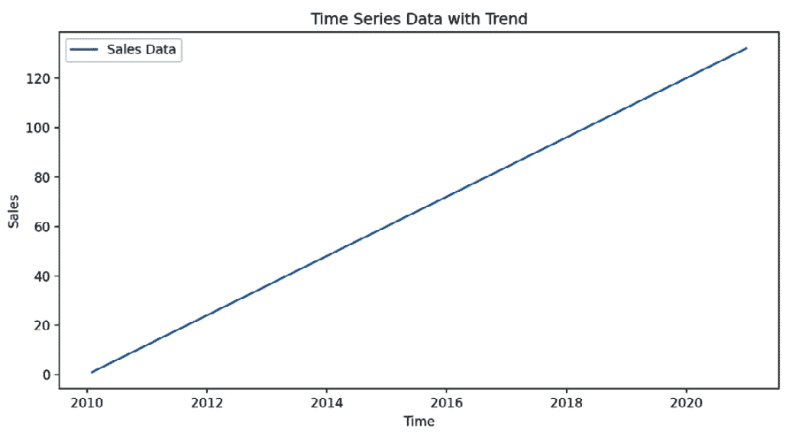

图 11.1 – 具有上升趋势的月度销售数据

*图 11.1* 显示了十年来销售额的持续上升趋势。这表明业务一直在稳步增长。

在我们的初步分析中，我们集中在理解销售数据中十年间的总体上升趋势。这为我们提供了有关企业长期增长的宝贵洞察。

通常，企业会经历在特定时间段内定期出现的波动，如月份或季度。这被称为季节性。识别这些季节性模式和理解整体趋势同样重要，因为它可以帮助企业预测并为高需求或低需求时期做好准备。为了说明这一点，我们将扩展我们的分析，加入销售数据中的季节性因素。

## 季节性

**季节性** 是指在时间序列中定期出现的重复且可预测的模式。这些模式通常对应于特定的时间段，如天、月或季节，并且可能受外部因素如天气、假期或文化事件的影响。

与长期趋势不同，季节性跨越较短的时间框架，对数据产生短期影响。季节性的这种周期性特征使得企业能够预测并规划需求波动，从而优化其运营和战略。

重要提示

了解季节性有助于识别重复出现的模式，并预测某些行为或事件可能发生的时间。这些信息对于准确的预测和规划至关重要。

在接下来的部分，我们将扩展之前提出的销售案例，同时关注季节性因素。

### 分析带有季节性的长期销售趋势

在这个用例的这一部分，我们旨在分析包括季节性变化的十年销售趋势。你可以在这里找到完整的代码示例：[`github.com/PacktPublishing/Python-Data-Cleaning-and-Preparation-Best-Practices/blob/main/chapter11/1.decomposing_time_series/seasonality.py`](https://github.com/PacktPublishing/Python-Data-Cleaning-and-Preparation-Best-Practices/blob/main/chapter11/1.decomposing_time_series/seasonality.py)。让我们开始吧：

1.  我们将从为每个月生成一个日期范围，并相应地生成销售数据开始，覆盖 10 年：

    ```py
    date_rng = pd.date_range(start='2010-01-01', end='2020-12-31', freq='M')
    seasonal_data = pd.Series([10, 12, 15, 22, 30, 35, 40, 38, 30, 22, 15, 12] * 11, index=date_rng)
    ```

1.  然后，我们必须绘制数据，以可视化季节性成分：

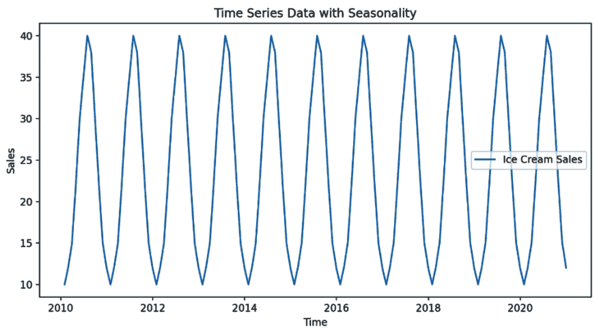

图 11.2 – 带有季节性因素的月度销售数据

*图 11.2* 显示了每 12 个月重复的模式，表明销售中存在明显的季节性。销售在年中达到高峰，并在年末和年初下降，暗示着夏季的销售较高，冬季的销售较低。这一模式在多年中的一致性有助于预测未来的销售周期。了解这些季节性趋势对库存管理、营销活动和在销售高峰期的资源分配非常有价值，帮助企业相应优化策略。

虽然识别趋势和季节性提供了对销售模式的宝贵见解，但现实世界的数据通常还包含另一个关键成分：噪声。在接下来的部分，我们将深入探讨噪声，并扩展销售用例，以探索噪声如何影响销售。

## 噪声

**噪声**，也称为残差或误差，代表时间序列数据中无法归因于趋势或季节性的随机波动或不规则性。它反映了数据中的变化性，这些变化性无法通过基础模式来解释。

重要说明

虽然噪声通常被认为是不需要的，但它是任何现实世界数据的自然组成部分。识别并隔离噪声对于构建准确的模型和理解时间序列中固有的不确定性至关重要。

在接下来的部分，我们将扩展前面介绍的销售用例，并重点关注噪声。

### 分析带噪声的销售数据

在这个用例中，我们旨在分析包含噪声的销售数据，除了趋势和季节性因素外。这将帮助我们理解随机波动如何影响我们识别潜在模式的能力。要跟随这个示例，请查看以下代码：[`github.com/PacktPublishing/Python-Data-Cleaning-and-Preparation-Best-Practices/blob/main/chapter11/1.decomposing_time_series/noise.py`](https://github.com/PacktPublishing/Python-Data-Cleaning-and-Preparation-Best-Practices/blob/main/chapter11/1.decomposing_time_series/noise.py)。让我们开始吧：

1.  让我们导入所需的库：

    ```py
    import pandas as pd
    import matplotlib.pyplot as plt
    ```

1.  我们将从生成一个覆盖 10 年的每月日期范围开始：

    ```py
    date_rng = pd.date_range(start='2010-01-01', end='2020-12-31', freq='M')
    ```

1.  然后，我们必须创建带噪声的销售数据：

    ```py
    np.random.seed(42)
    noise_data = pd.Series(np.random.normal(0, 2, len(date_rng)), index=date_rng)
    ```

1.  现在，我们必须绘制数据以可视化噪声：

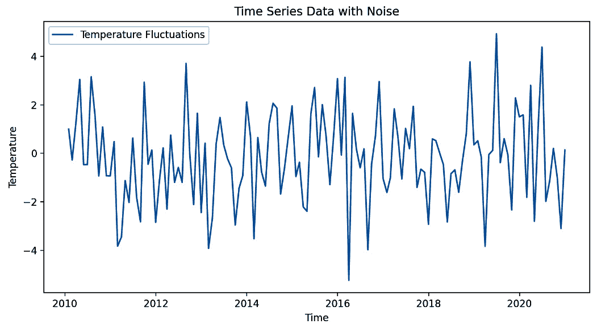

图 11.3 – 带噪声的每月销售数据

*图 11.3* 显示了随机、不可预测的变化，这些变化没有遵循任何特定模式。这些波动发生在短时间内，导致数据的不稳定，使得更难看出任何模式。

现在我们可以识别不同的时间序列组件，让我们来看看不同类型的时间序列。

# 时间序列数据的类型

在本节中，我们将简要回顾时间序列数据的类型——单变量和多变量——同时阐明它们的区别，并展示它们的应用。

## 单变量时间序列数据

**单变量时间序列数据**由单个变量或观察值在时间上记录而成。它是一个一维的按时间顺序排列的序列，相较于多变量时间序列数据，它更易于分析。

考虑一个单变量时间序列，表示一个城市多年来每月的平均温度。你可以在这里找到完整的代码：[`github.com/PacktPublishing/Python-Data-Cleaning-and-Preparation-Best-Practices/blob/main/chapter11/2.types/univariate.py`](https://github.com/PacktPublishing/Python-Data-Cleaning-and-Preparation-Best-Practices/blob/main/chapter11/2.types/univariate.py)。

让我们生成我们的单变量时间序列数据：

1.  首先，我们将创建我们需要的数据范围，在这个例子中是从`2010-01-01`到`2020-12-31`：

    ```py
    date_rng = pd.date_range(start='2010-01-01', end='2020-12-31', freq='M')
    ```

1.  然后，我们必须通过使用**正态分布**（也称为高斯分布）添加噪声，来创建温度的相应值：

    ```py
    temperature_data = pd.Series(np.random.normal(20, 5, len(date_rng)), index=date_rng)
    ```

    让我们理解值参数：

    +   `20`：这是`5`：这是正态分布的**标准差**。噪声值通常会围绕均值波动约±5 个单位。较大的标准差意味着噪声会更分散，而较小的标准差意味着噪声值更接近均值。

    +   我们之前创建的日期范围被作为索引传递给数据框。

1.  现在，让我们绘制单变量时间序列数据：

    ```py
    plt.figure(figsize=(10, 5))
    plt.plot(temperature_data, label='Temperature Data')
    plt.title('Univariate Time Series Data')
    plt.xlabel('Time')
    plt.ylabel('Temperature (°C)')
    plt.legend()
    plt.show()
    ```

    这将输出以下图表：

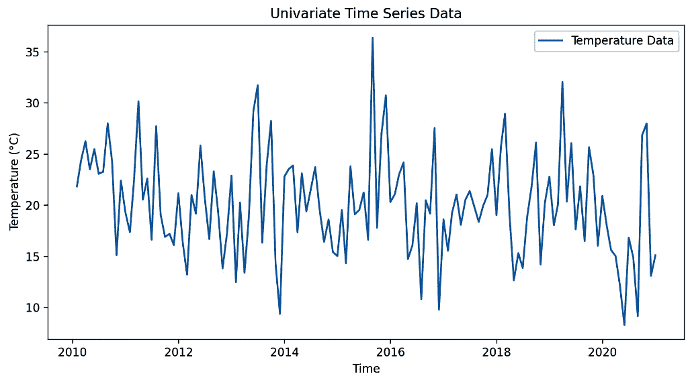

图 11.4 – 单变量温度数据

在这个例子中，单变量时间序列代表了每月的平均温度。由于数据是随机生成的，均值为 20°C，并有一定的波动（标准差为 5°C），因此图表将表现出围绕该平均温度的随机波动。

理解单变量时间序列数据的复杂性为深入研究多变量时间序列分析打下了坚实的基础。与单变量数据只观察单一变量随时间的变化不同，多变量时间序列数据涉及同时监测多个相互关联的变量。

## 多元时间序列数据

**多元时间序列数据**涉及多个变量或观察值，这些变量或观察值是随着时间记录的。每个变量都是一个按时间顺序排列的序列，并且这些变量可能是相互依赖的，从而捕捉到更复杂的关系。

考虑一个多元时间序列，表示一个城市在多年中的月平均温度和月降水量。你可以在[`github.com/PacktPublishing/Python-Data-Cleaning-and-Preparation-Best-Practices/blob/main/chapter11/2.types/multivariate.py`](https://github.com/PacktPublishing/Python-Data-Cleaning-and-Preparation-Best-Practices/blob/main/chapter11/2.types/multivariate.py)找到这个示例的代码。让我们开始吧：

1.  让我们为这个示例添加所需的库：

    ```py
    import pandas as pd
    import matplotlib.pyplot as plt
    import numpy as np
    ```

1.  现在，让我们通过使用之前创建的温度数据并在同一个 DataFrame 中添加一条新的时间序列数据（表示降水量数据，具有不同的均值和标准差值），来生成一个多元时间序列数据示例：

    ```py
    date_rng = pd.date_range(start='2010-01-01', end='2020-12-31', freq='M')
    temperature_data = pd.Series(np.random.normal(20, 5, len(date_rng)), index=date_rng)
    rainfall_data = pd.Series(np.random.normal(50, 20, len(date_rng)), index=date_rng)
    ```

1.  将所有时间序列合并到同一个 DataFrame 中，确保包含温度和降水量数据：

    ```py
    multivariate_data = pd.DataFrame({'Temperature': temperature_data, 'Rainfall': rainfall_data})
    print(multivariate_data.head())
    ```

1.  合并后的时间序列 DataFrame 如下所示：

    ```py
                Temperature   Rainfall
    2010-01-31    19.132623  56.621393
    2010-02-28    18.551274  51.249927
    2010-03-31    24.502358  65.679049
    2010-04-30    27.069077  73.044307
    2010-05-31    21.176376  41.317497
    ```

1.  最后，让我们绘制多元时间序列数据：

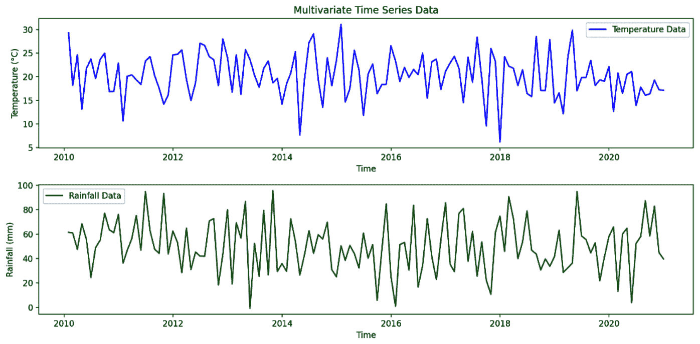

图 11.5 – 多元数据

在这个示例中，多元时间序列包括温度和降水量数据，提供了一个更全面的环境条件视角。

总体而言，单变量数据较易处理，而多元数据使我们能够捕捉到随时间变化的变量之间更复杂的关系和依赖性。多元分析在解决经济学、金融、环境科学和医疗健康等各个领域的现实挑战时至关重要，在这些领域中，理解变量之间的多方面关系至关重要。

现在我们对时间序列数据有了较强的理解，可以探索有效清理和管理这种数据的方法。

# 识别时间序列数据中的缺失值

识别时间序列数据中的缺失值有点类似于识别其他类型数据中的缺失值，但由于时间序列的时间性特征，存在一些特定的注意事项。由于我们在*第八章*《检测和处理缺失值和异常值》中讨论过其中的一些技术，让我们在这里总结它们，并重点说明这些技术在分析时间序列数据时的具体应用，使用股票市场分析作为示例。

假设我们有某公司多年来每日的股价数据（开盘价、最高价、最低价和收盘价）。我们的目标是识别这些时间序列中的缺失数据，以确保数据集的完整性。你可以在这里找到该示例的代码：[`github.com/PacktPublishing/Python-Data-Cleaning-and-Preparation-Best-Practices/blob/main/chapter11/3.missing_values/1.identify_missing_values.py`](https://github.com/PacktPublishing/Python-Data-Cleaning-and-Preparation-Best-Practices/blob/main/chapter11/3.missing_values/1.identify_missing_values.py)。

让我们从生成数据开始：

1.  首先，我们将生成从 2020 年 1 月 1 日到 2023 年 12 月 31 日的工作日日期范围。这里，`freq='B'`用于生成仅包括*工作日*（即排除周末）的日期范围：

    ```py
    date_range = pd.date_range(start='2020-01-01', end='2023-12-31', freq='B')  # Business days
    ```

1.  接下来，我们必须为日期范围生成随机股价，长度为*n*：

    ```py
    n = len(date_range)
    data = {
        'open': np.random.uniform(100, 200, n),
        'high': np.random.uniform(200, 300, n),
        'low': np.random.uniform(50, 100, n),
        'close': np.random.uniform(100, 200, n)
    }
    ```

1.  接下来，我们必须通过传递在上一步创建的所有单独数据点来创建一个 DataFrame：

    ```py
    df = pd.DataFrame(data, index=date_range)
    ```

1.  现在，让我们引入随机的 NaN 值，以模拟数据中的一些缺失值：

    ```py
    nan_indices = np.random.choice(n, size=100, replace=False)
    df.iloc[nan_indices] = np.nan
    ```

1.  然后，随机丢弃一些日期，以模拟缺失的时间戳：

    ```py
    missing_dates = np.random.choice(date_range, size=50, replace=False)
    ```

1.  最后，显示 DataFrame 的前几行：

    ```py
                      open        high        low       close
    2020-01-01  137.454012  262.589138  55.273685  183.849183
    2020-01-02  195.071431  288.597775  82.839005  180.509032
    2020-01-03  173.199394  261.586319  91.105158  182.298381
    2020-01-06  159.865848  223.295947  69.021000  193.271051
    2020-01-07         NaN         NaN        NaN         NaN
    ```

这里需要注意的关键点是，我们有两种缺失数据：

+   完整的行缺失，因此没有完整的日期索引可用

+   当前日期的某些列中的部分观测值缺失

我们将在这里主要处理第一种情况，因为第二种情况在*第八章**《检测和处理缺失值与异常值》中已经讲过了。让我们从简单而有效的`isnull()`方法开始。

## 检查 NaN 或空值

与常规数据集不同，时间序列数据点按时间顺序排列。缺失的值可能会破坏数据的连续性，影响趋势和季节模式的分析。我们可以使用`isnull()`方法来识别缺失的时间戳。这里，我们要查找数据集中缺失的完整行：

1.  要检查时间序列 DataFrame 中哪些日期缺失，我们需要创建一个完整的日期范围（没有缺失值），并且该日期范围的频率与当前 DataFrame 索引的频率一致，然后将其与当前 DataFrame 中的日期范围进行对比。这里，我们正在为工作日创建一个完整的日期范围：

    ```py
    complete_index = pd.date_range(start=df.index.min(), end=df.index.max(), freq='B')
    ```

1.  为了快速查看缺失的索引点，必须将 DataFrame 重新索引到这个完整的日期范围，以便识别任何缺失的时间戳：

    ```py
    df_reindexed = df.reindex(complete_index)
    ```

1.  现在，我们可以使用`isnull()`方法来识别任何缺失的时间戳：

    ```py
    missing_timestamps = df_reindexed[df_reindexed.isnull().any(axis=1)]
    ```

在这里，我们可以看到数据中有一些缺失的时间戳：

```py
print(f"\nPercentage of Missing Timestamps: {missing_timestamps_percentage:.2f}%")
Percentage of Missing Timestamps: 14.09%
```

到目前为止的分析告诉我们，我们的数据集中缺失了完整的日期。现在，让我们添加一些可视化图表，帮助我们更好地看到数据中的空白。

注意

如在*第八章**，检测与处理缺失值和异常值*中所述，你可以使用`isnull()`方法查看每列中缺失的数量——例如，`missing_values =` `df.isnull().sum()`。

## 目视检查

可视化数据有助于我们识别缺失值及缺失模式。图表能够揭示数据中的缺口，而这些缺口在表格检查中可能不易察觉。

继续前一部分的例子，让我们绘制时间序列数据并在图表上标出任何缺失值：

1.  绘制闭盘价格图：

    ```py
    plt.figure(figsize=(14, 7))
    plt.plot(df.index, df['close'], linestyle='-', label='Closing Price', color='blue')
    ```

1.  用垂直线标记缺失的时间戳：

    ```py
    for date in missing_dates:
        plt.axvline(x=date, color='red', linestyle='--', linewidth=1)
    plt.title('Daily Closing Prices with Missing Timestamps and NaN Values Highlighted')
    plt.xlabel('Date')
    plt.ylabel('Closing Price')
    plt.legend()
    plt.grid(True)
    plt.show()
    ```

    这将生成以下图表：

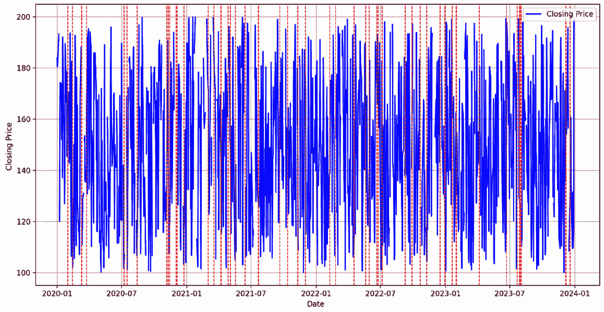

图 11.6 – 日闭盘价及缺失时间戳高亮显示

在*图 11.6*中，闭盘价格用蓝色标记显示，而缺失的时间戳用虚线高亮，便于识别数据中的缺口。现在，让我们探讨最后一种方法，称为滞后分析。在这种方法中，我们创建一个滞后的序列版本，并与原始数据进行比较，以检测不一致之处。

注意

在*第三章*，*数据剖析 – 理解数据结构、质量和分布*中，我们演示了多种数据剖析方法。你可以通过使用内建的缺口分析功能，将类似的方法应用于时间序列数据。只需在创建报告时传递`tsmode=True`即可——例如，`profile =` `ProfileReport(df, tsmode=True)`。

随着我们深入，探索有效的时间序列缺失数据处理策略变得至关重要。

# 处理时间序列数据中的缺失值

缺失值是时间序列数据中常见的问题，可能由于多种原因产生，比如传感器故障、数据传输问题，或只是记录观察值的缺失。如我们所讨论的，通常会出现两种主要情况：

+   **某些特征中的空值**：想象一下股票市场分析，其中收集了每日交易数据。虽然所有交易日都已记录，但某些日子的成交量可能由于报告错误而缺失。这种情况带来了一个挑战：如何在确保分析保持稳健的同时，保持数据集的完整性？

+   **完整行缺失**：相反，考虑一个天气监测系统，它记录每日气温。如果某些完整天的数据缺失——可能是由于传感器故障——这就构成了一个重大问题。缺失的时间戳意味着你不能简单地填充数据；这些天的数据缺失会打乱整个时间序列。

在下一部分中，我们将重点解决第一种情况，考虑某些特征中缺失值的存在。完成这一步后，我们可以调整方法来处理第二种情况。

## 删除缺失数据

删除缺失数据是一个直接的方法，但应该谨慎操作，并考虑其对整体数据集的影响。以下是一些可能适合删除数据的场景：

+   如果缺失值占数据集的比例很小（例如，少于 5%），删除它们可能是可行的。如果数据丢失不会显著影响分析结果或从数据集得出的结论，这种方法效果较好。例如，在一个包含 10,000 个时间点的数据集中，如果有 50 个时间点缺失，删除这 50 个数据点（占数据的 0.5%）可能不会显著影响整体分析。

+   如果插补缺失值会引入过多的不确定性，特别是当这些值非常重要且无法准确估计时。这种情况通常出现在缺失值是高度不可预测的数据时，插补结果不可靠。

+   如果缺失值完全是随机发生的，并且没有遵循任何系统的模式。例如，传感器数据中偶尔出现的随机故障导致缺失读数，但这些故障没有任何潜在的规律。

让我们重新审视股票市场的使用案例，看看如何删除 null 值，并观察这对数据集的影响。

### 删除缺失数据在股票市场使用案例中的应用

在我们的股票价格数据场景中，我们将添加一些 NaN 值，并评估删除这些值的影响。你可以在这里找到完整的代码：[`github.com/PacktPublishing/Python-Data-Cleaning-and-Preparation-Best-Practices/blob/main/chapter11/3.missing_values/2.remove_missing_values.py`](https://github.com/PacktPublishing/Python-Data-Cleaning-and-Preparation-Best-Practices/blob/main/chapter11/3.missing_values/2.remove_missing_values.py)。让我们开始吧：

1.  继续使用上一节的示例，我们将创建具有不同特征的股票数据。然后，我们将从特定特征（例如，`close`和`open`）中随机选择一些索引，以便将该索引的每个特征的值映射为 NaN 值：

    ```py
    nan_indices_close = np.random.choice(df.index, size=50, replace=False)
    nan_indices_open = np.random.choice(df.index, size=50, replace=False)
    ```

1.  然后，我们将之前随机选择的索引映射为 NaN 值：

    ```py
    df.loc[nan_indices_close, 'close'] = np.nan
    df.loc[nan_indices_open, 'open'] = np.nan
    ```

1.  让我们检查数据中有多少 NaN 或 null 值：

    ```py
    missing_values = df.isnull().sum()
    Percentage of Missing Values in Each Column:
    open     4.793864
    high     0.000000
    low      0.000000
    close    4.793864
    ```

    正如预期的那样，`open`和`close`特征中引入了一些 null 值。

    在删除数据集中的任何行之前，让我们先检查一下包含 null 值的数据行数：

    ```py
    print(f"\nNumber of rows before dropping NaN values: {len(df)}")
    Number of rows before dropping NaN values: 1043
    ```

1.  在这个阶段，我们将删除在`close`或`low`列中包含 NaN 值的任何行：

    ```py
    df_cleaned = df.dropna()
    print(f"\nNumber of rows after dropping NaN values: {len(df_cleaned)}")
    ----
    Number of rows after dropping NaN values: 945
    ```

1.  让我们绘制时间序列数据：

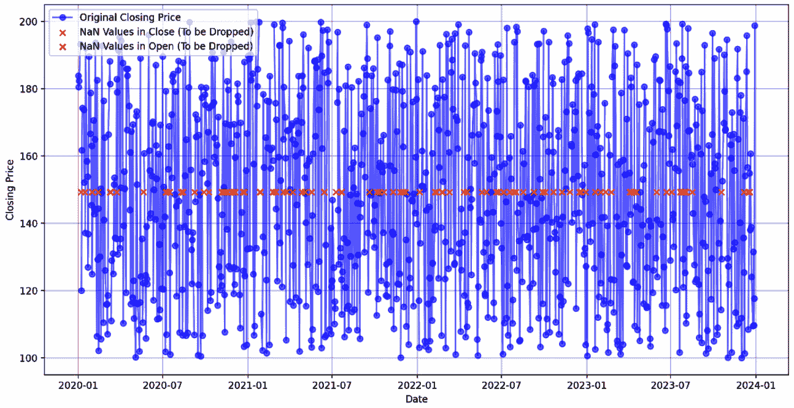

图 11.7 – 删除/标记缺失数据后的每日收盘价格

如*图 11.7*所示，原始的收盘价已被绘制，因缺失值被丢弃的点通过红色“x”标记突出显示。请记住，即使是选择性丢弃，删除行也可能会导致有用信息的丧失，因为它减少了样本大小，从而可能降低分析的统计功效并影响结果的普适性。

在需要保留每个时间戳，但需要解决特征中的缺失值的场景中，前向和后向填充提供了实用的解决方案。这些方法允许我们保持时间序列数据的时间顺序完整性，同时根据相邻的观测值高效地填补缺失值。让我们探索一下前向和后向填充如何有效地处理时间序列分析中的缺失数据。

## 前向填充和后向填充

**Forward fill**（**ffill**）和**backward fill**（**bfill**）是通过将最后已知值向前传播或将下一个已知值向后传播来填补缺失值的两种方法，分别用于时间序列中的缺失数据。

在处理时间序列反向填充时，选择**ffill**和**bfill**之间的方式取决于多个因素和使用场景。以下是何时使用每种方法的概述，以及做出这些决策时的思考过程：

+   **Ffill**：前向填充，也称为**最后观测值向前填充**（**LOCF**），是将最后已知值向前传播以填补缺失的数据点。

    这是你应该使用它的情况：

    +   当你认为最近已知的值是预测未来缺失值的最佳依据时

    +   在金融时间序列中，将最后已知价格向前传播通常是一个合理的假设

    +   在处理缓慢变化的变量时，如果假设其持续性较好

    +   在你希望保持最近状态，直到新的信息变得可用时

    如果你仍然不确定，或者在思考该使用哪种方法时，回答以下三个问题中的至少两个“是”将帮助你做出正确的决策：

    +   该变量是否可能在短时间内保持相对稳定？

    +   使用最后已知值作为缺失数据的合理假设吗？

    +   是不是更重要的是反映最近已知的状态，而不是潜在的未来变化？

+   **Bfill**：与此相反，后向填充是将下一个已知值向后传播以填补缺失的数据点。

    这是你应该使用它的情况：

    +   当你对未来的值比过去的值更有信心时

    +   在你希望将已知的结果追溯性地应用于之前缺失的时间段时

    +   当你处理滞后效应时，未来的事件会影响过去的缺失数据

    +   在你希望将数据与下一个已知状态对齐，而不是与之前的状态对齐时

    如果你仍然不确定，或者在思考该使用哪种方法时，回答以下问题中的“是”将帮助你做出正确的决策：

    +   下一个已知值是否更有可能代表缺失数据而不是前一个已知值？

    +   您是否处理一种情况，即未来信息应该通知过去的缺失值？

    +   是否与下一个已知状态对齐能为您的分析提供更有意义的见解？

在实践中，选择 ffill 和 bfill 通常需要结合领域专业知识、对数据生成过程的理解以及考虑特定分析目标。同时，值得尝试两种方法并比较结果，看哪一种为您的特定用例提供更有意义和准确的见解。

使用 ffill 和 bfill 处理时间序列数据时，始终有一些重要的考虑因素。让我们扩展一下：

+   **顺序性质**：时间序列数据的顺序性质对于 ffill 和 bfill 方法确实至关重要。这两种方法都依赖于相邻数据点相关的假设，这是时间序列分析的基础。

+   **Ffill 和上升趋势**：Ffill 可适用于上升趋势，因为它向前延续最后已知的值，可能在上升趋势中低估真实值。然而，在强烈上升趋势中可能会导致“阶梯”效应，可能低估增长率。

+   **Bfill 和下降趋势**：Bfill 可适用于下降趋势，因为它会拉回未来更低的值，可能在下降趋势中高估真实值。在强烈下降趋势中可能会产生类似的“阶梯”效应，可能会夸大下降率。

+   在选择 ffill 和 bfill 时，应考虑趋势的方向以及缺失数据期间的**强度**和**长度**。对于微妙的趋势，任一方法都可能适用，选择可能更多地取决于其他因素，如数据的性质或具体的分析目标。

+   如果缺失值与周围数据点不一致，这两种方法确实可能传播错误。对于长时间的缺失数据，填充值可能会显著偏离真实的基础模式。

+   **处理异常值**：如果异常值在一段缺失数据之前或之后，ffill 或 bfill 可能会传播这种异常值，扭曲系列。

+   **数据连续性的假设**：这两种方法都假设缺失的数据可以通过相邻的已知值**合理地逼近**，但这并不总是正确的。对于可能突然改变或存在不连续性的变量，这些方法可能不适用。

让我们重新看一下股票价格的例子，并看看如何填补空值列。

### 在股市使用案例中填充空值

在这个示例中，我们将不关注缺失的索引，只关注一些特征中缺失的数据。让我们深入研究代码——和往常一样，你可以在[`github.com/PacktPublishing/Python-Data-Cleaning-and-Preparation-Best-Practices/blob/main/chapter11/3.missing_values/3.back_forward_fill.py`](https://github.com/PacktPublishing/Python-Data-Cleaning-and-Preparation-Best-Practices/blob/main/chapter11/3.missing_values/3.back_forward_fill.py)找到完整的端到端代码：

1.  这段代码将随机缺失值引入 DataFrame（`df`）的`close`和`open`列。它首先使用`np.random.choice`从 DataFrame 的索引中随机选择 50 个索引。选中的索引存储在两个变量`nan_indices_close`和`nan_indices_open`中，这些变量对应于缺失值将被插入的行：

    ```py
    nan_indices_close = np.random.choice(df.index, size=50, replace=False)
    nan_indices_open = np.random.choice(df.index, size=50, replace=False)
    ```

1.  以下代码使用`.loc`访问器在`nan_indices_close`指定的索引处将`NaN`赋值给`close`列，类似地，在`nan_indices_open`指定的索引处将`NaN`赋值给`open`列。实际上，这将在这两列中创建 50 个随机的缺失值，这对于模拟真实世界数据场景或测试数据处理技术非常有用：

    ```py
    df.loc[nan_indices_close, 'close'] = np.nan
    df.loc[nan_indices_open, 'open'] = np.nan
    ```

1.  使用 ffill 和 bfill 填充 NaN 值：

    ```py
    df['close_ffill'] = df['close'].ffill() # Forward Fill
    df['close_bfill'] = df['close'].bfill() # Backward Fill
    ```

1.  让我们来看一下结果：

    ```py
    print(df[['open', 'close', 'close_ffill', 'close_bfill']].head(20)) # Show first 20 rows
    ```

    这将显示以下输出：

    ```py
                      open       close  close_ffill  close_bfill
    2020-01-01  137.454012  183.849183   183.849183   183.849183
    2020-01-02  195.071431  180.509032   180.509032   180.509032
    2020-01-03  173.199394  182.298381   182.298381   182.298381
    2020-01-06  159.865848  193.271051   193.271051   193.271051
    2020-01-07  115.601864         NaN   193.271051   120.028202
    2020-01-08  115.599452  120.028202   120.028202   120.028202
    2020-01-09  105.808361  161.678361   161.678361   161.678361
    2020-01-10  186.617615  174.288149   174.288149   174.288149
    2020-01-13  160.111501  173.791739   173.791739   173.791739
    2020-01-14  170.807258  152.144902   152.144902   152.144902
    2020-01-15  102.058449         NaN   152.144902   137.111294
    2020-01-16  196.990985  137.111294   137.111294   137.111294
    ```

正如我们所见，在`2020-01-07`和`2020-01-15`，`close`列中有缺失值（NaN）。这表示这两个日期的收盘价没有被记录或无法获取。

如我们所学，ffill 方法（`close_ffill`）通过最后一个有效观测值填充缺失值：

+   对于`2020-01-07`，收盘价使用来自`2020-01-06`的最后一个已知值（`193.27`）进行填充。

+   对于`2020-01-15`，缺失值使用来自`2020-01-14`的最后一个有效价格（`152.14`）进行填充。

另一方面，bfill 方法（`close_bfill`）通过下一个有效观测值填充缺失值：

+   对于`2020-01-07`，由于没有立即记录下一个有效价格，它使用`2020-01-08`的收盘价（`120.03`）进行填充。

+   对于`2020-01-15`，该值使用来自`2020-01-16`的下一个已知价格进行填充。

让我们仔细看看在执行不同填充方法后，数据发生了什么变化：

+   在`2020-01-07`，ffill 方法相比 bfill 方法高估了缺失值，bfill 则与下一个已知值更为接近。

+   在`2020-01-15`，ffill 和 bfill 提供了不同的估算结果，ffill 可能高估了该值，而 bfill 则较为准确。

一般建议，我们需要调查缺失值的模式。如果缺失值是*随机且稀疏*的，任一方法可能都合适。然而，如果存在系统性的模式，可能需要更复杂的插值方法，例如*插值*。插值允许我们通过利用数据集中的现有值来估算缺失的数据点，提供了一种更为细致的方式，能够捕捉随时间变化的趋势和模式。接下来我们将更详细地讨论这一点。

## 插值

**插值**是一种通过根据周围数据点填补缺口来估算缺失值的方法。与前向填充（ffill）和后向填充（bfill）不同，后者是复制现有值，插值使用数学技术来估算缺失值。插值有不同的技术和应用。所以，让我们看一下可用的选项及其考虑因素：

+   **线性插值**：线性插值通过一条直线连接两个相邻的已知数据点，并沿此线估算缺失值。它是最简单的插值形式，假设数据点之间存在线性关系。它适用于数据点之间的变化预计为线性或近似线性的情况。常用于金融数据、温度读数和其他预期逐渐变化的环境数据中。

+   **多项式插值**：多项式插值将一个多项式函数拟合到已知的数据点，并使用这个函数来估计缺失值。更高阶的多项式可以捕捉数据点之间更复杂的关系。它适用于具有非线性趋势的数据集，通常用于科学和工程应用中，其中数据遵循多项式趋势。

+   **样条插值**：样条插值使用分段多项式，通常是三次样条，来拟合数据点，确保数据点的平滑性，并通过数据提供平滑的曲线。它适用于需要数据点之间平滑过渡的数据集，常用于计算机图形学、信号处理和环境数据中。

让我们在我们的用例中使用插值。

### 股票市场用例中的插值

考虑到之前提到的同一时间序列数据集，其中存在缺失值。在这种情况下，我们希望使用不同的插值方法来填补这些缺失值。你可以在本书的 GitHub 仓库中找到完整的代码示例：[`github.com/PacktPublishing/Python-Data-Cleaning-and-Preparation-Best-Practices/blob/main/chapter11/3.missing_values/4.interpolation.py`](https://github.com/PacktPublishing/Python-Data-Cleaning-and-Preparation-Best-Practices/blob/main/chapter11/3.missing_values/4.interpolation.py)。让我们开始吧：

1.  以下代码将随机缺失值引入我们的数据框（`df`）中的 `close` 和 `open` 列，就像在上一节中所做的那样：

    ```py
    nan_indices_close = np.random.choice(df.index, size=50, replace=False)
    nan_indices_open = np.random.choice(df.index, size=50, replace=False)
    df.loc[nan_indices_close, 'close'] = np.nan
    df.loc[nan_indices_open, 'open'] = np.nan
    ```

1.  以下代码行用于通过线性插值填充我们的 DataFrame（`df`）中`close`列的缺失值。该代码特别使用**线性插值**，其中通过在缺失值前后最近的已知数据点之间画一条直线来估算缺失值：

    ```py
    df['close_linear'] = df['close'].interpolate(method='linear')
    ```

1.  我们可以通过将方法参数更改为`method='polynomial'`来使用多项式插值填充缺失值。这指定插值应使用`order=3`的多项式函数。`order`参数表示要使用的多项式的次数。在这种情况下，使用三次多项式（三次方），意味着估算缺失值的函数将是一个曲线，可能比简单的直线（如线性插值）提供更好的拟合，以适应更复杂的数据趋势：

    ```py
    df['close_poly'] = df['close'].interpolate(method='polynomial', order=3)
    ```

1.  我们可以通过将方法更改为`method='spline'`来使用样条插值填充缺失值。这指定插值应使用样条插值，这是一种分段的多项式函数，确保数据点处的平滑性。`order=3`参数表示每段样条使用的多项式的次数。在这种情况下，使用三次样条（第三次多项式），意味着插值将涉及拟合三次多项式到数据的各个段落：

    ```py
    df['close_spline'] = df['close'].interpolate(method='spline', order=3)
    ```

1.  现在，让我们绘制插值后的数据：

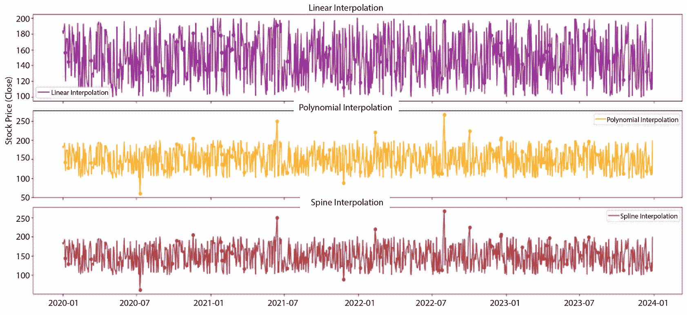

图 11.8 – 日闭盘价插值

在*图 11.8*中，我们可以看到不同插值方法下数据的变化。为了更好地理解这些差异，让我们看看插值后的实际数据，如*图 11.9*所示：

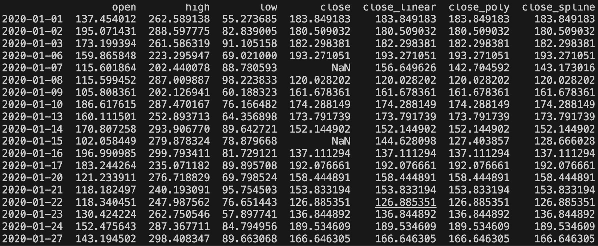

图 11.9 – 日闭盘价插值表

让我们比较不同的插值方法并得出一些结论：

在 2020-01-07，我们有以下数据：

+   **线性插值**：156.649626

+   **多项式插值**：142.704592

+   **样条插值**：143.173016

在 2020-01-15，我们有以下数据：

+   **线性插值**：144.628098

+   **多项式插值**：127.403857

+   **样条插值**：128.666028

根据这些数据，线性插值似乎提供了比多项式和样条插值更高的估计值。它假设数据点之间存在线性趋势，这对于非线性数据可能并不准确。多项式插值似乎提供了较低的估计值并能够捕捉更复杂的关系，但也容易过拟合。最后，样条插值提供了平滑的估计值，介于线性插值和多项式插值之间，提供了简单性与准确性之间的平衡。在这种具体情况下，我们会选择样条插值，因为它提供了一条平滑的曲线，避免了突变，结果更现实，更接近数据中预期的趋势。虽然基于提供的数据推荐使用样条插值，但验证插值结果与已知数据点或领域知识的符合性仍然是至关重要的。

注意

插值方法，如线性插值、多项式插值和样条插值，也可以用来处理时间序列数据中的*异常值*。

选择和调整插值参数来填充缺失值，需要理解数据的特征和分析的具体需求。对于具有线性趋势的简单数据，线性插值既高效又有效。然而，如果数据表现出非线性模式，多项式插值可能提供更好的拟合，且多项式的阶数（`order`）会影响曲线的复杂度；较低的阶数适用于简单趋势，而较高的阶数可能能捕捉更多的细节，但也有过拟合的风险。样条插值提供了一种平滑而灵活的方法，立方样条（`order=3`）因其平滑性和灵活性而被广泛使用。调优这些方法时，可以从较简单的方法开始，逐步测试更复杂的方法，同时监控过拟合现象，并确保拟合与数据的潜在趋势一致。采用交叉验证、视觉检查和统计指标来评估和优化插值选择。

现在我们已经探讨了时间序列中处理缺失数据的各种技术，接下来总结不同的填充方法是非常重要的，以便理解它们独特的应用和有效性。

## 比较不同的缺失值处理方法

处理时间序列数据中的缺失值是一个复杂的过程，需要仔细考虑数据集的具体背景和特征。决定是丢弃值、使用 bfill，还是应用插值，应根据对后续分析影响的仔细评估以及保留时间序列中关键信息的需要来指导。下表总结了不同的技术，并可作为指导：

| **方法** | **使用时机** | **优点** | **缺点** |
| --- | --- | --- | --- |
| 填充缺失值 | 小比例的缺失值 | - 简单性- 避免插值不确定性 | - 信息丢失- 潜在偏差 |
| 向后填充（Bfill） | 缺失值预计之前有一致的值 | - 保留总体趋势- 适用于递增趋势 | - 如果缺失值与随后的值不同，可能会传播错误 |
| 向前填充（Ffill） | 缺失值预计遵循一致的值 | - 实现简单- 保持最近状态直到新数据可用 | - 如果趋势变化，可能会误导数据- 如果缺失值与之前的值不同，则会传播错误 |
| 线性插值 | 缺失值需要根据相邻的数据点进行估算 | - 实现简单易懂- 保留整体趋势 | - 可能无法捕捉非线性趋势- 对离群值敏感 |
| 多项式插值 | 缺失值需要通过更复杂的关系进行估算 | - 捕捉复杂关系- 对多项式阶数具有灵活性 | - 可能导致过拟合和振荡- 计算量大 |
| 样条插值 | 缺失值需要通过平滑过渡来估算 | - 提供平滑曲线- 避免高阶多项式的振荡 | - 实现较为复杂- 计算量大 |

表 11.1 – 不同时间序列缺失数据处理方法的比较

在研究了填充时间序列数据缺失值的各种方法之后，另一个同样重要的方面是：时间序列与其自身滞后值的相关性。

# 时间序列数据分析

**自相关**和**偏自相关**是时间序列分析中的关键工具，它们提供了数据模式的洞察并指导模型选择。在离群值检测中，它们有助于区分真实的异常和预期的变动，从而实现更准确、更具上下文感知的离群值识别。

## 自相关和偏自相关

**自相关**是指将时间序列与其自身滞后值进行相关分析。简而言之，它衡量时间序列中每个观察值与其过去观察值的关系。自相关是理解时间序列数据中存在的时间依赖性和模式的关键概念。

**偏自相关函数**（**PACF**）是时间序列分析中的一种统计工具，用于衡量*在去除中间滞后效应后，时间序列与其滞后值之间的相关性*。它提供了一个更直接的衡量不同时间点观察值之间关系的方式，排除了较短滞后效应的间接影响。

自相关和偏自相关在以下情况中有帮助：

+   **时间模式**：它们有助于识别随时间重复的模式。这对于理解时间序列数据的固有结构至关重要。

+   **平稳性评估**：它们有助于评估时间序列的平稳性。缺乏平稳性可能会影响统计分析的可靠性以及模型预测的准确性。

+   **模型的滞后选择**：它们指导时间序列模型中适当滞后的选择，如**自回归**（**AR**）分量在**自回归滑动平均**（**ARIMA**）模型中的应用。

+   **季节性检测**：在特定滞后期的**自相关函数**（**ACF**）图中出现显著峰值，表明存在季节性，为进一步分析提供了线索。

+   **异常检测**：自相关函数中出现不寻常的模式可能表明数据中存在异常值或离群点，需要进一步调查和清理。

现在，让我们对来自股票价格数据集的`close_filled`序列进行 ACF 和 PACF 分析。此分析将帮助我们确定适当的参数（`p`和`q`），以便在接下来的部分中进行 ARIMA 建模。

## 股票市场案例中的 ACF 和 PACF

我们将继续使用到目前为止的示例，并添加 ACT 和 PACF 图表。像往常一样，您可以查看完整代码：[`github.com/PacktPublishing/Python-Data-Cleaning-and-Preparation-Best-Practices/blob/main/chapter11/4.analisis/autocorrelation.py`](https://github.com/PacktPublishing/Python-Data-Cleaning-and-Preparation-Best-Practices/blob/main/chapter11/4.analisis/autocorrelation.py)。让我们开始吧：

1.  创建自相关图：

    ```py
    plot_acf(df['close'].dropna(), lags=40, ax=plt.gca())
    ```

1.  创建部分自相关图：

    ```py
    plot_pacf(df['close'].dropna(), lags=40, ax=plt.gca())
    ```

    结果图如下所示：

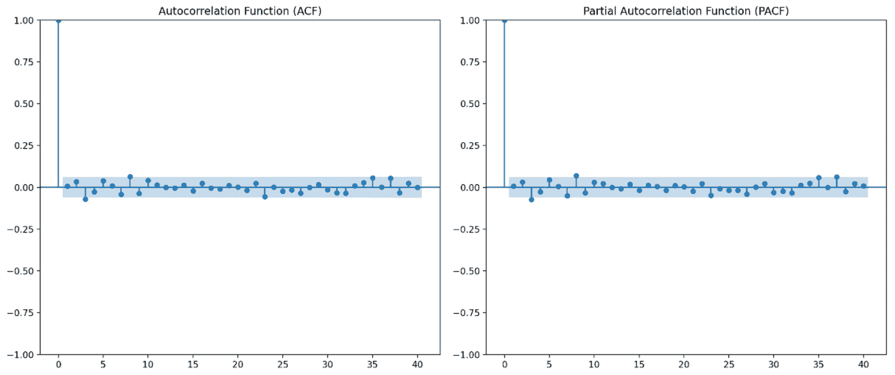

图 11.10 – ACF 和 PACF 图

让我们解释一下前面图表中可以看到的内容。对于自相关函数（ACF），我们可以看到以下内容：

+   ACF 图显示了序列与其滞后值在不同滞后期（本例中`lags=40`）的相关性。ACF 图的*X*轴表示滞后期的数量，指示计算相关性时回溯的时间点数。

+   ACF 图的*Y*轴表示原始时间序列与其滞后值之间的相关系数。相关值的范围从-1 到 1。

+   蓝色阴影区域表示置信区间。超出阴影区域的柱状条被认为具有统计显著性，表明在这些滞后期存在强烈的自相关性，并可能为*ARIMA 模型中的 q 参数*（MA 阶数）提供潜在的值，正如我们在接下来的部分中将看到的。

+   在固定间隔处出现显著峰值表明时间序列数据中存在*季节性*。

+   如果 ACF 图在滞后 1 期存在显著的自相关（如我们案例中的蓝色阴影区域之外的尖峰），则表明该序列与其*即时前值*之间有很强的相关性。这可能意味着该序列是*非平稳的*，可能需要差分（d > 0）。

对于 PACF，我们可以看到以下内容：

+   PACF 图显示了时间序列与其滞后值之间的相关性，去除了由较短滞后解释的效应。

+   PACF 图中的显著峰值表明滞后 1 和潜在的滞后 2 可能是 ARIMA 模型中*p 参数*（AR 阶数）的良好候选项。

注意

当我们在 ACF 和 PACF 图中指定`lags=40`时，我们是在检查时间序列在 40 个不同滞后区间的自相关和偏自相关。这意味着我们将看到序列如何与自身在*滞后 1 到* *滞后 40*之间的相关性。

ACF 和 PACF 图对于识别时间序列中的基本结构至关重要。在接下来的部分中，我们将把 ACF 和 PACF 分析与异常值检测和处理联系起来，确保我们的时间序列模型准确捕捉到潜在模式。

# 处理异常值

时间序列数据通常表现出季节性模式（例如，假期期间的销售峰值）和趋势（例如，多年来的逐步增长）。在这种情况下，异常值可能并不是异常现象；它可能反映了正常的季节性效应或基础趋势的变化。例如，黑色星期五期间零售销售的突然激增是可以预期的，不应视为异常值。诸如**时间序列季节性分解**（**STL**）、自相关和季节性指数等技术可以帮助理解数据的预期行为，从而为识别异常值提供更清晰的基础。

## 使用季节性分解识别异常值

识别时间序列中的异常值的一种方法是将序列分解为趋势、季节性和残差组件，因为异常值通常出现在残差组件中。要将序列分解为趋势、季节性和残差组件，我们可以使用 STL 方法。该方法通过分析残差组件（理想情况下应该是白噪声）来帮助识别和处理异常值。让我们看看如何使用股市数据来实现这一点。你可以在[`github.com/PacktPublishing/Python-Data-Cleaning-and-Preparation-Best-Practices/blob/main/chapter11/5.outliers/1.seasonal_decomposition.py`](https://github.com/PacktPublishing/Python-Data-Cleaning-and-Preparation-Best-Practices/blob/main/chapter11/5.outliers/1.seasonal_decomposition.py)找到完整的代码示例：

```py
result = seasonal_decompose(df['close'], model='additive', period=252)
```

在这段代码中，我们在假设每年有 252 个工作日的情况下对时间序列进行分解。我们还将计算残差的 Z 值，以便使用以下代码识别异常值：

```py
df['resid_z'] = zscore(df['residual'].dropna())
```

最后，让我们绘制分解后的序列：

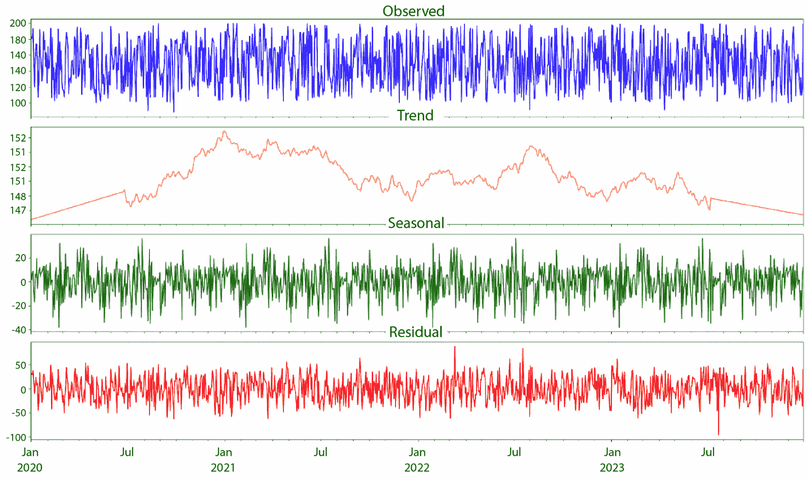

图 11.11 – 分解后的时间序列

可以通过分析残差组件来检测异常值。残差组件中显著偏离零的值或突增表示潜在的异常值：


图 11.12 – 分解值表

基于*图 11.11*中的分解时间序列，我们可以通过检查`残差`和`resid_z`列来分析异常值。通常，绝对值大于 2 或 3 的 Z 分数被视为潜在的异常值。在该数据集中，最大正残差出现在`2020-01-06`（Z 分数：1.468043）、`2020-01-17`（Z 分数：1.300488）和`2020-01-27`（Z 分数：1.172529）上，而最大负残差出现在`2020-01-15`（Z 分数：-1.721474）和`2020-01-22`（Z 分数：-1.082559）上。尽管这些数值显示出与趋势和季节性成分的某些偏差，但没有一个 Z 分数超过典型的±2 或±3 阈值，表明该数据集没有极端异常值。残差似乎相对均匀地分布在零周围，表明分解模型拟合良好。然而，具有最大偏差的日期（`2020-01-06`、`2020-01-15`和`2020-01-17`）可能值得进一步调查，看看是否有任何异常事件或因素可以解释它们偏离预期值的原因。

深入挖掘这些数据以了解波动背后的原因，并仔细检查后，我们可以看到这些日期的偏差是由特定事件和系统问题引起的：

免责声明！

以下事件对应的是虚构事件！

+   `2020-01-06`：股市交易系统的技术故障导致价格暂时激增

+   `2020-01-15`：错误的交易输入导致价格突然下跌，随后被修正

+   `2020-01-17`：一次重大经济公告导致波动性增加，并使股价短暂上涨

+   `2020-01-22`：关于季度财报结果的误传引发了暂时的恐慌性抛售

+   `2020-01-27`：关于并购的谣言引发了投机性购买，暂时抬高了价格

这些发现帮助我们理解到，残差的偏差并非随机发生，而是由于特定的、可识别的事件所致。虽然这些事件在统计上不符合显著异常值的标准，但它们突显了股价数据中固有的波动性和噪声。鉴于股价的噪声特性，即使没有显著的异常值，平滑技术仍然变得至关重要！

## 处理异常值 – 基于模型的方法 – ARIMA

ARIMA 模型广泛用于时间序列数据的预测。它们根据过去的观测值预测未来的数值，使得通过将实际值与预测值进行比较，从而有效地识别异常值。ARIMA 模型由三个主要部分组成：

+   **自回归**（**AR**）：利用观测值与多个滞后观测值之间的依赖关系（p）

+   **集成**（**I**）：通过对观测值的差分处理，使时间序列平稳化（d）

+   **移动平均**（**MA**）：利用观测值与应用于滞后观测值的移动平均模型的残差误差之间的依赖关系（q）

ARIMA 模型在处理以下异常值时有效：

+   **加性异常值**（**AO**）：时间序列中的突升或突降

+   **创新异常值**（**IO**）：影响整个序列的变化，从发生点开始向后延伸

让我们讨论一下 ARIMA 模型如何在我们一直在处理的股票价格数据示例中用于异常值检测和平滑。您可以在 [`github.com/PacktPublishing/Python-Data-Cleaning-and-Preparation-Best-Practices/blob/main/chapter11/5.outliers/3.arima.py`](https://github.com/PacktPublishing/Python-Data-Cleaning-and-Preparation-Best-Practices/blob/main/chapter11/5.outliers/3.arima.py) 找到完整示例：

1.  对`close_filled`序列拟合 ARIMA 模型：

    ```py
    model = ARIMA(df['close_filled'], order=(2,1,1))
    results = model.fit()
    ```

1.  计算残差和 Z 分数：

    ```py
    df['residuals'] = results.resid
    df['residuals_z'] = zscore(df['residuals'].dropna())
    ```

1.  基于 Z 分数阈值（例如，±3）识别任何异常值：

    ```py
    outliers_arima = df[np.abs(df['residuals_z']) > 3]
    ```

1.  可视化原始 `close_filled` 序列和从 ARIMA 模型获得的平滑序列：

    ```py
    df['arima_smooth'] = results.fittedvalues
    ```

    以下是输出结果：

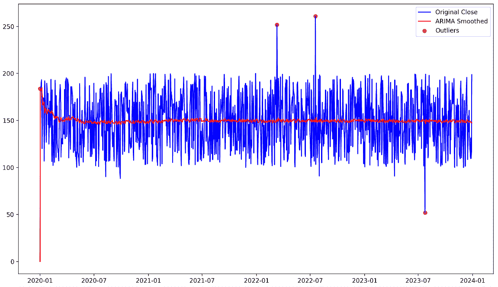

图 11.13 – ARIMA 平滑和异常值检测

1.  生成诊断图以评估模型拟合，包括残差分析、**分位数-分位数**（**Q-Q**）图和标准化残差：

    ```py
    results.plot_diagnostics(figsize=(14,8))
    ```

1.  结果图如下：

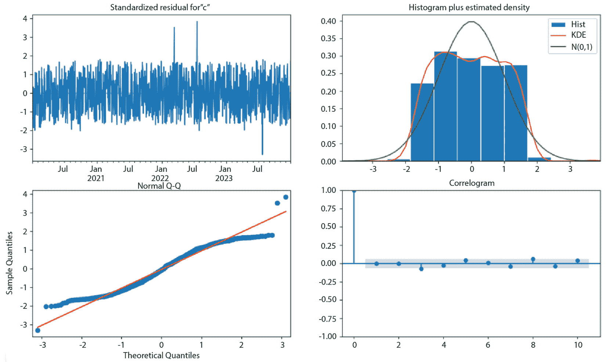

图 11.14 – 残差分析、Q-Q 图和标准化残差

让我们深入探讨一下 *图 11.14* 中显示的诊断图：

+   **标准化残差**：标准化残差是通过其标准差对 ARIMA 模型的残差进行缩放得到的。为了使 ARIMA 模型被认为是一个良好的拟合，标准化残差*应当像白噪声一样，意味着它们不应显示出明显的模式*。这意味着残差是随机分布的，均值为零，方差恒定。如果残差中出现模式，则表明模型未能捕捉到数据中的某些潜在结构，可能需要进一步的调整。在我们的案例中，*残差*看起来像白噪声。

+   **直方图加核密度估计（KDE）**：结合残差的**核密度估计（KDE）**图，提供了对残差分布的可视化评估。对于拟合良好的 ARIMA 模型，残差应遵循正态分布。直方图应呈现典型的钟形曲线，KDE 图应叠加一条与之匹配的平滑曲线。若与正态分布存在偏差，如偏态或重尾，表明残差不是正态分布，这暗示模型可能存在问题。在我们的案例中，我们没有看到残差中有显著的偏态或尾部。

+   **正态 Q-Q 图**：Q-Q 图将残差的分位数与正态分布的分位数进行比较。如果残差服从正态分布，Q-Q 图上的点将沿着 45 度线排列。显著偏离这条线的点表示偏离正态分布。在我们的案例中，我们没有看到任何显著的偏差。

+   **自相关图**（**残差的自相关函数（ACF）**）：自相关图展示了残差的自相关函数（ACF）。对于一个合理指定的 ARIMA 模型，残差应该没有显著的自相关。这意味着没有任何滞后项的自相关系数应该具有统计学上的显著性。ACF 图中的显著峰值表明残差仍然与其过去的值相关，暗示模型尚未完全捕捉到时间序列的结构。这可以指导进一步的模型优化，比如增加 AR 或 MA 组件的阶数。在我们的案例中，一切看起来都很好。

什么是滞后 0？

在自相关图（ACF 图）中，**滞后 0** 是指时间序列与自身在滞后 0 时的自相关，实际上是时间序列与自身在相同时间点的相关性。根据定义，这个相关性总是 1，因为任何时间序列在滞后 0 时与自身完全相关。这意味着滞后 0 时的自相关值总是 1，这就是为什么在 ACF 图中滞后 0 处会看到一个峰值的原因。

玩弄不同的设置并观察它们对 ARIMA 模型和残差的影响是一个好主意。

在探索使用 ARIMA 方法检测和处理我们股票价格数据集中的异常值后，我们发现异常值会显著影响我们时间序列模型的准确性和可靠性。虽然 ARIMA 方法有助于识别和调整这些突变，但考虑其他稳健的异常值检测和处理方法也非常重要。接下来的部分我们将介绍其中一种方法，即使用移动窗口技术。

## 移动窗口技术

移动窗口技术，也称为滚动或滑动窗口方法，涉及分析一个固定大小的数据子集或“窗口”，该窗口会在较大的数据集上顺序移动。在窗口的每个位置，都会应用特定的计算或函数，例如计算均值、中位数、总和或更复杂的统计量。当窗口通过一个或多个数据点滑动时，计算会使用新的数据子集进行更新。该方法在时间序列分析中尤其稳健，通常用于平滑数据、识别趋势或检测随时间变化的异常值。

移动窗口技术的优势在于它能够提供局部分析，同时与更广泛的数据集保持联系。例如，在平滑时间序列时，移动平均可以减少噪声并突出底层趋势，而不会扭曲整体信号。类似地，在金融数据中，移动窗口可以用来计算滚动平均值或波动性，提供市场条件的实时视图。

在本节中，我们将重点介绍两种主要方法：**简单移动平均**（**SMA**）和**指数加权移动平均**（**EMA**）。这两者都可以作为基础，稍后可以通过其他统计量（如中位数）进行调整。

### SMA

**SMA**是常用的统计计算，表示一组数据点在指定时间内的平均值。它是一种移动平均，通过平滑数据中的波动，更容易识别趋势。SMA 通过将一组值相加，并将总和除以数据点的数量来计算。更先进的方法，如卡尔曼平滑，可以通过建模底层过程来估计缺失值：

*SMA*t = (*X*t + *X*t–1 + *X*t–2 + ...+ *X*t–n+1)/*n*

在这里，我们有如下公式：

+   *SMA*t 是时刻*t*的 SMA。

+   *X*t + *X*t–1 + *X*t–2 + ...+ *X*t–n+1 是该时间段的数据值。

+   *n*是参与计算的周期数。

现在，让我们介绍指数加权移动平均（EMA），以便我们可以对比这两者。

### EMA

**EMA**对最近的数据点赋予更多的权重，对较早的数据点赋予较少的权重。它使用指数衰减公式：

*EMA*t = *α* • *X*t + (1 – *α*) • *EMA*t–1

其中，*α*是平滑因子。

现在，让我们讨论一下 SMA 和 EMA 如何在我们一直在使用的股票价格数据示例中进行异常值检测和平滑。

### 使用 SMA 和 EMA 对股票价格进行平滑

继续使用我们之前呈现的股票价格数据示例，让我们看看 SMA 和 EMA 对数据的影响：

首先，让我们计算 12 个月窗口的 SMA：

1.  定义 SMA 的`窗口`大小和 EMA 的`跨度`大小：

    ```py
    window_size = 20
    span = 20
    ```

1.  计算 SMA：

    ```py
    df['SMA'] = df['close'].rolling(window=window_size, min_periods=1).mean()
    ```

1.  计算 EMA：

    ```py
    df['EMA'] = df['close'].ewm(span=span, adjust=False).mean()
    ```

1.  计算 SMA 和 EMA 的残差：

    ```py
    df['SMA_residuals'] = df['close'] - df['SMA'] df['EMA_residuals'] = df['close'] - df['EMA'] sma_window = 12
    data['SMA'] = data['Passengers'].rolling(window=sma_window).mean()
    ```

1.  绘制原始时间序列和 SMA：

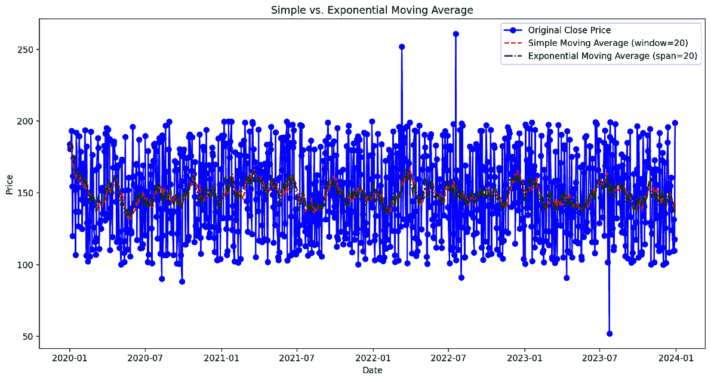

图 11.15 – SMA 和 EMA

在这个例子中，我们使用 20 的窗口大小和 20 的跨度分别计算了 SMA 和 EMA。SMA 的窗口大小决定了在每个时间点计算平均值时包含多少个之前的数据点。和 SMA 一样，你数据点的频率会影响跨度的选择。如果你的数据是按日计的，跨度 20 大约代表过去 20 天的历史数据。

让我们再多讨论一下生成的图表：

+   **SMA**：

    +   **平滑效果**：SMA 通过对窗口内的值进行平均来平滑时间序列数据，减少噪声，突出底层趋势。

    +   **异常值影响**：虽然 SMA 减少了异常值的影响，但它仍可能会受到异常值的影响，因为它对窗口内的所有值赋予相同的权重。

+   **EMA**：

    +   **平滑效果**：EMA 也对数据进行了平滑处理，但对最近的观察值赋予更多的权重，使其对近期变化更具响应性。

    +   **异常值影响**：EMA 不太受较旧异常值的影响，但由于其加权机制，可能更容易受到近期异常值的影响。

在平滑度和响应性之间找到平衡

较大的窗口大小会导致更平滑的移动平均，但可能会滞后于数据的变化。较小的窗口大小使得移动平均对短期波动更具响应性，但可能引入更多噪声。

记得我们在*图 11.10*中创建的自相关图吗？我们可以利用该分析，根据观察到的自相关模式来调整跨度或窗口大小。以下几点将帮助你选择窗口大小和跨度：

+   考虑数据点的频率（每日、每周、每月）。

+   如果自相关图显示在较短滞后期存在显著的自相关，EMA 采用较小跨度或 SMA 采用较小窗口大小可以帮助保持对近期变化的响应，同时减少短期噪声的影响。

+   如果你的数据呈现季节性模式，你可能会选择与季节周期相符的窗口大小或跨度。例如，如果存在每周季节性，可能考虑使用 5 或 7 的窗口大小。可以使用自相关图来帮助确定这一点。

为了评估窗口模型的表现，我们可以使用**平均绝对误差**（**MAE**），以及**均方误差**（**MSE**）和**均方根误差**（**RMSE**）。我们可以比较原始数据和这些模型生成的平滑值之间的误差，如下图所示：

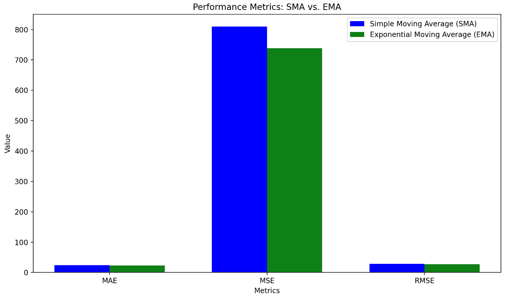

图 11.16 – SMA 和 EMA 的性能指标

为了确保我们清楚理解*图 11.16*中呈现的不同指标，让我们更详细地看一下：

+   **MAE**：这表示一组预测中的平均误差幅度，提供了预测值和实际值之间绝对差异的简单平均值。

+   **MSE**：该指标衡量预测值和实际值之间的平均平方差，比 MAE 更重视较大的误差。

+   **RMSE**：RMSE 是 MSE 的平方根，提供了一个可解释的平均误差幅度度量，与原始数据的尺度一致。

现在我们知道这些术语的含义，让我们来解读它们在股票价格案例中的应用。较低的 MAE、MSE 和 RMSE 值表示平滑方法的表现更好。虽然 SMA 和 EMA 的 MAE 和 RMSE 值非常接近，但指数加权法（EMA）的 MSE 值较低。

下表对何时使用 SMA 和 EMA 进行了比较和总结：

| **标准** | **SMA** | **EMA** |
| --- | --- | --- |
| 平滑类型 | 对数据点进行简单和均匀的平滑处理 | 更敏感和适应性强，对近期数据点赋予更大权重 |
| 数据点加权 | 对窗口中的所有数据点赋予相等权重 | 对近期观察值赋予更多权重；较老的观察值获得指数递减的权重 |
| 对变化的响应性 | 滞后指标；对近期变化响应较慢 | 对近期变化更敏感；快速适应数据的变化 |
| 稳定性适应性 | 适合稳定且波动较小的时间序列 | 适合波动性较大或变化迅速的时间序列 |
| 对趋势的适应性 | 平滑长期趋势，适合识别整体模式 | 对变化趋势的适应较快，适合捕捉近期变化 |
| 使用场景示例 | 分析长期趋势和识别季节性模式 | 捕捉短期波动并对市场波动做出反应 |
| 计算复杂性 | 计算较简单，易于理解和实现 | 更复杂的计算涉及平滑因子 |

表 11.2 – SMA 与 EMA 的比较

除了移动平均技术之外，探索高级特征工程步骤，如滞后和差分，可以显著丰富我们对数据的理解和预测能力。我们将在下一节中进行探讨。

# 时间序列数据的特征工程

有效的特征工程在时间序列分析中至关重要，可以揭示有意义的模式并提高预测准确性。它涉及将原始数据转化为能够捕捉时间依赖性、季节性变化以及时间序列其他相关方面的信息特征。我们要探索的第一个技术是创建特征的滞后。

## 滞后特征及其重要性

滞后特征是时间序列特征工程中的关键部分，因为它们允许我们将时间序列数据转换为适合监督学习模型的格式。滞后特征涉及创建代表目标变量过去观察值的新变量：

+   **Lag 1**：来自上一个时间步的值

+   **Lag 2**：来自两个时间步之前的值

+   **Lag k**：来自 k 个时间步之前的值

通过将时间序列数据按指定的时间步数（称为滞后）进行平移，这些过去的值会作为当前时间戳的特征包含在模型中。正如我们所知道的，时间序列数据通常表现出时间依赖性，即当前值与过去的观察值相关。滞后特征有助于捕捉这些依赖关系，使模型能够从历史模式中学习。

现在，让我们讨论如何在我们一直在使用的股价数据示例中应用滞后特征。

### 在股价使用案例中创建滞后特征

继续我们之前提出的股价数据示例，让我们看看滞后特征对数据的影响：

1.  首先，在`close`列中引入更多激进的离群值：

    ```py
    outlier_indices = np.random.choice(df.index, size=10, replace=False)
    df.loc[outlier_indices[:5], 'close'] = df['close'] * 1.5 # Increase by 50%
    df.loc[outlier_indices[5:], 'close'] = df['close'] * 0.5 # Decrease by 50%
    ```

1.  使用以下函数创建滞后特征：

    ```py
    def create_lagged_features(df, column, lags):
        for lag in lags:
            df[f'{column}_lag_{lag}'] =df[column].shift(lag)
        return df # Define the lags to create lags = [1, 5, 10, 20]
    ```

1.  为`close`列创建滞后特征：

    ```py
    df = create_lagged_features(df, 'close', lags)
    ```

1.  绘制原始时间序列和滞后数据集：

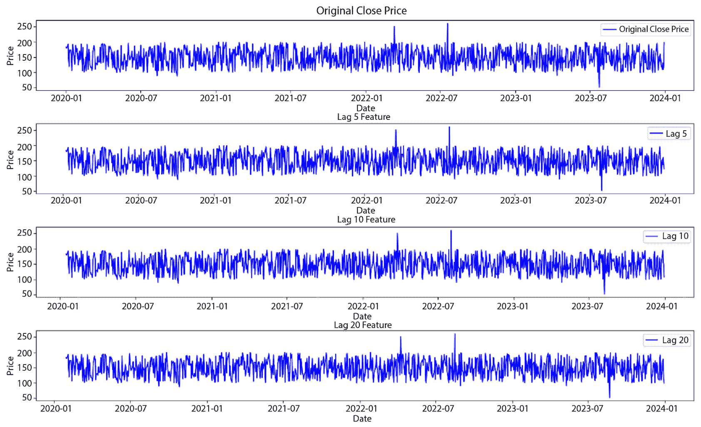

图 11.17 – 原始特征与滞后特征

正如我们在*图 11.17*中所看到的，滞后 1（`close_lag_1`）表示前一天的收盘价，滞后 5（`close_lag_5`）表示 5 天前的收盘价，依此类推。你可以观察每个滞后值如何捕捉目标变量的历史值。添加滞后特征到时间序列时，数据的起始日期会向前移动，因为在指定的滞后期结束之前，前几个数据点不能使用。这种偏移意味着，如果你添加更多的滞后，缺乏完整滞后数据的初始数据点数量会增加，从而有效地将起始日期向前推移。

可以自由尝试不同的滞后值，查看其对数据集的影响。调整滞后值可以帮助你捕捉数据中的不同时间依赖关系和趋势。

## 时间序列差分

在*第四章*《清理杂乱数据与数据操作》中，我们讨论了如何使用`diff()`函数计算两个日期时间对象之间的时间差，这有助于我们测量连续事件之间经过的时间。这个技巧有助于理解时间戳序列中的时间间隔。类似地，在时间序列分析中，差分是一种强大的技术，通过去除时间序列的水平变化，稳定时间序列的均值，从而消除趋势和季节性。正如我们在上一章中计算了时间差一样，我们可以将差分应用于股市数据，以突出随时间变化的变化。然而，我们还将引入一个新术语——季节性差分。

### 季节性差分

**季节性差分**是一种用于去除时间序列数据中的季节性模式的技术，使其更加平稳，适合分析和预测。季节性差分通过将某个观测值与相隔季节性周期的前一个观测值相减来实现。因此，我们需要借助之前提供的工具识别季节性周期，然后取该季节性周期对数据进行差分。

对于具有年度季节性模式的月度数据，我们可以使用以下公式：

*y*'t = *y*t – *y*t–12

对于季度数据，我们可以使用以下公式：

*y*'t = *y*t – *y*t–4

这里是季节性差分后的序列，和原始序列。

现在，让我们讨论如何在我们一直在处理的股价数据示例中使用差分。

### 对股价数据进行差分

为了展示季节性差分，我们将在股票市场数据中引入一些季节性。根据我们目前的分析，数据中并没有明显的季节性成分。让我们开始吧：

1.  创建一个季节性成分（每周季节性，幅度较大）：

    ```py
    seasonal_component = 50 * np.sin(2 * np.pi * np.arange(n) / 5) # 5-day seasonality
    ```

1.  生成加入季节性的随机股票价格：

    ```py
    data = {
    'open': np.random.uniform(100, 200, n) + seasonal_component,
    'high': np.random.uniform(200, 300, n) + seasonal_component,
    'low': np.random.uniform(50, 100, n) + seasonal_component,
    'close': np.random.uniform(100, 200, n) + seasonal_component
    }
    df = pd.DataFrame(data, index=date_range)
    ```

1.  计算第一次差分：

    ```py
    df['First Difference'] = df['close'].diff()
    ```

1.  计算第二次差分：

    ```py
    df['Second Difference'] = df['First Difference'].diff()
    ```

1.  最后，计算季节性差分（每周季节性）：

    ```py
    df['Seasonal Difference'] = df['close'].diff(5)
    ```

让我们通过绘制第一次、第二次和季节性差分来演示差分操作：


图 11.18 – 原始序列与差分序列

在*图 11.18*中，我们可以观察到第一次、第二次和季节性差分。我们可以看到在原始图中，存在一些季节性，但在第一次差分后，季节性成分被最小化了。但我们如何从统计学角度评估这一点呢？让我们进行一些统计检验，检查时间序列的平稳性。

### 增广的迪基-富勒（ADF）检验

**ADF**检验是一种用于确定时间序列是否平稳的统计检验。ADF 检验检验原假设：时间序列样本中存在单位根。单位根的存在表示时间序列是非平稳的。备择假设是时间序列是平稳的。对于 ADF 检验，数值越负，表明反对原假设的证据越强。

p 值表示假设原假设为真时，获得至少与观察结果一样极端的检验结果的概率。在 ADF 检验中，我们希望看到*一个小的 p 值来拒绝原假设* *即非平稳性*。

要得出一个时间序列是平稳的结论，我们通常需要看到以下几点：

+   **p 值 < 0.05**：这是统计检验中最常用的阈值。如果 p < 0.05，我们会在 5%的显著性水平上拒绝原假设。这意味着我们有足够的证据得出该序列是平稳的结论。

+   **更小的 p 值**：p < 0.01（1%显著性水平）和 p < 0.001（0.1%显著性水平）提供了更强的平稳性证据。

让我们编写代码进行这个检验：

```py
def adf_test(series, title=''):
    result = adfuller(series.dropna(), autolag='AIC')
    print(f'Augmented Dickey-Fuller Test: {title}')
    print(f'ADF Statistic: {result[0]}')
    print(f'p-value: {result[1]}')
    for key, value in result[4].items():
        print(f' {key}: {value}')
    print('\n')
```

现在是时候查看结果了！我们将对原始时间序列进行检验（检查它是否平稳），然后对每个差分后的时间序列进行检验。让我们解释一下这些结果：

```py
Augmented Dickey-Fuller Test: Original Series
ADF Statistic: -3.5898552445987595
p-value: 0.005957961883734467
   1%: -3.4367333690404767
   5%: -2.8643583648001925
   10%: -2.568270618452702
```

ADF 统计量-3.5899 小于 5%的临界值-2.8644，且 p 值低于 0.05。这表明我们可以拒绝单位根存在的原假设，暗示*原始序列可能是平稳的*。然而，结果相对接近临界值，表明*平稳性接近临界*：

```py
Augmented Dickey-Fuller Test: First Difference
ADF Statistic: -11.786384523171499
p-value: 1.0064914317100746e-21
   1%: -3.4367709764382024
   5%: -2.8643749513463637
   10%: -2.568279452717228
```

ADF 统计量为-11.7864，远低于 5%的临界值-2.8644，且 p 值极小。这强烈表明第一次差分后的序列是平稳的。与原始序列相比，ADF 统计量的显著下降表明第一次差分有效去除了剩余的趋势或单位根：

```py
Augmented Dickey-Fuller Test: Second Difference
ADF Statistic: -14.95687341689794
p-value: 1.2562905072914351e-27
   1%: -3.4367899468008916
   5%: -2.8643833180472744
   10%: -2.5682839089705536
```

ADF 统计量为-14.9569，远低于 5%的临界值，且 p 值极小。该结果表明第二次差分后的序列也是平稳的。然而，*过度差分可能导致有意义的模式丧失并增加噪声*，因此，在实现平稳性和保持序列的完整性之间必须保持平衡：

```py
Augmented Dickey-Fuller Test: Seasonal Differencing
ADF Statistic: -11.48334880444129
p-value: 4.933051350797084e-21
   1%: -3.4367899468008916
   5%: -2.8643833180472744
   10%: -2.5682839089705536
```

最后，ADF 统计量为-11.4833，远低于 5%的临界值，且 p 值非常小。这表明季节性差分成功地使得序列平稳。如果序列在特定的时间间隔内表现出周期性模式，季节性差分特别有效。

根据这些结果，第一次差分似乎是最合适的选择，原因如下：

+   原始序列在 1%的显著性水平下已经是平稳的，但第一次差分显著提高了平稳性。

+   第一次差分产生了一个非常显著的结果（p 值：1.006e-21），且不会导致过度差分的风险。

+   虽然第二次差分显示出更为显著的结果，但它可能导致过度差分，从而引入不必要的复杂性，并可能移除序列中的重要信息。

+   季节性差分也显示出强劲的结果，但除非数据中有明确的季节性模式，否则通常更倾向于使用较为简单的第一次差分方法。

总结来说，第一次差分在实现平稳性和避免过度差分之间取得了良好的平衡。现在，接下来我们讨论一些在时间序列领域最常见的应用场景。

# 在不同的行业中应用时间序列技术

能够分析时间模式为各行各业提供了竞争优势，尤其是在今天数据驱动的世界中。以下是一些不同行业中的常见应用场景：

| **领域** | **应用场景** | **解释** |
| --- | --- | --- |
| 金融 | 股票市场分析 | 分析历史股价和交易量，以做出明智的投资决策 |
| 投资组合管理 | 评估投资组合的表现，以优化资产配置 |
| 风险评估 | 建模和预测金融风险，如市场波动和信用违约 |
| 医疗健康 | 患者监测 | 持续跟踪生命体征和健康指标，及早发现异常 |
| 流行病学 | 分析疾病传播的时间模式并预测疫情爆发 |
| 治疗效果 | 评估医学干预措施随时间的效果 |
| 气象学 | 天气预报 | 分析历史天气模式以预测未来气候 |
| 气候变化研究 | 监测气候数据中的长期趋势和变化 |
| 自然灾害预测 | 早期检测潜在灾害，如飓风、洪水和干旱 |
| 制造业 | 生产计划 | 预测需求并优化生产计划 |
| 质量控制 | 监控并确保产品质量 |
| 设备维护 | 基于机械性能历史的预测性维护 |
| 营销 | 销售预测 | 基于历史数据预测未来销售 |
| 客户参与度 | 分析客户与产品和服务的互动模式 |
| 活动优化 | 评估营销活动随时间的影响 |
| **领域** | **用例** | **说明** |
| 交通运输 | 交通流量分析 | 监控并优化城市地区的交通模式 |
| 车辆追踪 | 追踪运输车队的移动和效率 |
| 供应链优化 | 预测需求并优化商品在时间中的流动 |

表 11.3 – 时间序列技术应用场景

有了这些，我们可以总结这一章的内容。

# 总结

时间序列分析在从各种行业中提取有意义的见解并做出明智决策中起着至关重要的作用。随着技术的发展，复杂的时间序列技术将变得越来越重要，用于理解复杂的时间模式和趋势。无论是在金融、医疗保健还是交通运输中，分析和预测时间依赖数据的能力使组织能够适应、优化并在不断变化的环境中做出战略决策。

在这一章中，我们介绍了处理缺失值和异常值的技术、差分方法，以及时间序列分析中的特征工程。我们学习了如何使用 ffill 和 bfill 处理缺失值，并比较了它们对股票价格数据的影响。我们还应用了包括一阶、二阶和季节性差分在内的差分技术，以实现平稳性，并通过 ADF 检验进行评估。我们还探索了滞后特征以捕捉时间依赖关系，并使用 MAE、MSE 和 RMSE 等指标评估了模型性能。这些技能将使你能够有效地管理和分析时间序列数据。

在下一章中，我们将转向另一种类型的数据——文本。分析文本数据涉及独特的挑战和方法，这些方法与用于数字时间序列的数据分析不同。我们将深入探讨文本预处理，涵盖文本清理技术、分词策略和拼写修正方法，这些对于任何**自然语言处理**（**NLP**）任务都是至关重要的。

# 第三部分：下游数据清洗——消费非结构化数据

本部分聚焦于处理非结构化数据（如文本、图像和音频）时面临的挑战和技术，特别是在现代机器学习环境下，尤其是**大型语言模型**（**LLMs**）。它全面概述了如何为机器学习应用准备非结构化数据类型，确保数据经过适当预处理以便分析和模型训练。各章节涵盖了文本、图像和音频数据的基本预处理方法，为读者提供了在当今由 AI 驱动的环境中处理更复杂和多样化数据集的工具。

本部分包含以下章节：

+   *第十二章**，LLMs 时代的文本预处理*

+   *第十三章**，使用 LLMs 进行图像和音频预处理*
