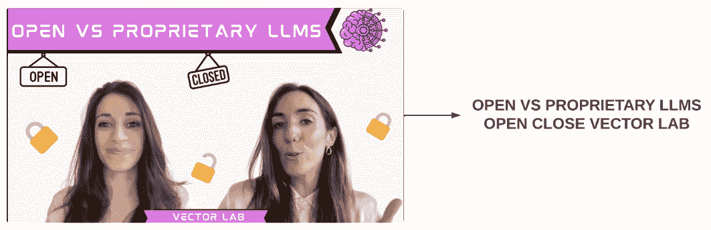

# 第十三章：使用 LLMs 进行图像和音频预处理

在本章中，我们深入探讨了非结构化数据的预处理，特别关注图像和音频。我们探讨了从这些类型的媒体中提取有意义信息的各种技术和模型。讨论包括对图像预处理方法的详细审查，使用**光学字符识别**（**OCR**）从图像中提取文本，BLIP 模型生成图像标题的能力，以及 Whisper 模型将音频转换为文本的应用。

在本章中，我们将涵盖以下主题：

+   图像预处理的当前时代

+   从图像中提取文本

+   处理音频数据

# 技术要求

本章的完整代码可以在以下 GitHub 存储库中找到：[`github.com/PacktPublishing/Python-Data-Cleaning-and-Preparation-Best-Practices/tree/main/chapter13`](https://github.com/PacktPublishing/Python-Data-Cleaning-and-Preparation-Best-Practices/tree/main/chapter13)。

让我们安装本章中将使用的必要库：

```py
pip install torchvision
pip install keras==3.4.1
pip install tensorflow==2.17.0
pip install opencv-python==4.10.0.84
pip install opencv-python==4.10.0.84
pip install paddleocr==2.8.1
pip install paddlepaddle==2.6.1
```

# 图像预处理的当前时代

在先进的视觉模型时代，如扩散模型和 OpenAI 的 CLIP 等模型，预处理变得至关重要，以确保图像的质量、一致性和适用性，用于训练和推断。这些模型要求图像以最大化它们学习复杂模式和生成高质量结果的能力的格式。在本节中，我们将逐步进行所有预处理步骤，使您的图像准备好进行后续任务。

在本节中，我们将使用一个常见的用例，即为训练扩散模型准备图像。您可以在 GitHub 存储库中找到此练习的代码：[`github.com/PacktPublishing/Python-Data-Cleaning-and-Preparation-Best-Practices/blob/main/chapter13/1.image_prerpocessing.py`](https://github.com/PacktPublishing/Python-Data-Cleaning-and-Preparation-Best-Practices/blob/main/chapter13/1.image_prerpocessing.py)。

让我们开始加载一些图像。

## 加载图像

执行以下步骤加载图像：

1.  首先，我们加载本练习所需的包：

    ```py
    from PIL import Image
    import numpy as np
    import cv2
    import requests
    from io import BytesIO
    import matplotlib.pyplot as plt
    import tensorflow as tf
    from tensorflow.keras.preprocessing.image import ImageDataGenerator
    ```

    然后，我们将图像加载到我们的环境中。我们将使用 Python Pillow 库来处理加载图像。

1.  接下来，我们创建一个函数从 URL 加载图像。这个函数从给定的 URL 获取图像，并使用`BytesIO`加载到`PIL`图像对象中处理字节数据：

    ```py
    def load_image_from_url(url):
        response = requests.get(url)
        img = Image.open(BytesIO(response.content))
        return img
    ```

1.  然后，我们将创建一个辅助函数来显示我们的图像。我们将在整个章节中使用这个函数：

    ```py
    def show_image(image, title="Image"):
        plt.imshow(image)
        plt.title(title)
        plt.axis('off')
        plt.show()
    ```

1.  现在，我们将图像 URL 传递给我们的`load_image_from_url`函数。在这里，我们使用了来自 Unsplash 的随机图像 URL，但您可以使用您可以访问的任何图像：

    ```py
    image_url = "https://images.unsplash.com/photo-1593642532871-8b12e02d091c"
    image = load_image_from_url(image_url)
    ```

1.  让我们显示刚刚使用我们创建的函数加载的原始图像：

    ```py
    show_image(image, "Original Image")
    ```

    这将显示以下输出图像：


图 13.1 – 预处理前的原始图像

图像预处理对于将视觉数据输入到**机器学习**（**ML**）模型中至关重要。让我们深入探讨每种技术，解释其概念并通过 Python 代码展示其应用。

## 调整大小和裁剪

有效的预处理可以显著提高 AI 和机器学习（ML）模型的性能，通过确保图像中最相关的特征得到突出并易于检测。**裁剪**是一种帮助模型聚焦于相关特征的技术。其主要思路是修剪或切除图像的外边缘，以改善画面构图，聚焦于主要对象，或去除不需要的元素。裁剪的大小取决于任务的具体要求。例如，在目标检测中，裁剪应聚焦于感兴趣的目标，而在图像分类中，裁剪应确保主要对象居中并占据大部分画面。

裁剪图像有许多不同的技术，从简单的固定大小裁剪到更复杂的对象感知裁剪。**固定大小裁剪**涉及将所有图像调整为预定的大小，确保数据集的一致性，这对于需要标准化输入大小的应用非常有用，比如训练某些类型的神经网络。然而，如果主要对象未居中，这可能会导致重要信息的丢失。**保持纵横比**通过在裁剪时保持原图像的纵横比，避免了失真，通常通过填充（给图像添加边框以达到所需尺寸）或缩放（在保持纵横比的同时调整图像大小，然后裁剪到目标尺寸）来实现。**中心裁剪**是在图像的中心进行裁剪，假设主要对象通常位于中间，这在图像分类任务中很常见，其中主要对象应占据画面的大部分。**对象感知裁剪**使用算法检测图像中的主要对象，并围绕其进行裁剪，确保无论对象在原始图像中的位置如何，始终突出显示主要对象。这种技术在目标检测和识别任务中尤为有用。

**调整大小**是 AI 和机器学习任务中图像预处理的基本步骤，主要集中在将图像的尺寸调整为模型所需的标准大小。此过程对于确保输入数据的一致性并适应各种 AI 和机器学习算法的具体要求至关重要。

让我们在前一节开始的图像预处理流程中添加一些步骤，以查看裁剪和调整大小的效果。以下函数将图像调整大小到指定的目标尺寸（在本例中为 256x256 像素）。我们期望图像以统一的尺寸缩小以适应目标尺寸：

```py
def resize_and_crop(image, target_size):
    image = image.resize((target_size, target_size),
    Image.LANCZOS)
    return image
target_size = 256
processed_image = resize_and_crop(image, target_size)
```

让我们使用以下代码打印结果图像：

```py
show_image(processed_image, "Resized and Cropped Image")
```

这将显示以下输出：


图 13.2 – 调整大小和裁剪后的图像

正如我们从*图 13**.2*中看到的那样，图像被调整为一个 256x256 像素的正方形，改变了原始图像不是正方形的长宽比。因此，调整大小确保所有数据具有统一的输入尺寸，从而便于批处理和将数据传递给模型进行训练。

接下来，我们将讨论图像的标准化，这与前几章讨论的特征标准化并无太大差异。

## 对数据集进行标准化和归一化

为了确保数据一致性并帮助模型训练更快收敛，我们可以强制输入数据处于一个共同的数值范围内。这种调整涉及将输入数据缩放到`0`和`1`之间，也被称为**标准化**或使用数据集的均值和标准差进行**归一化**。

对于大多数深度学习模型，将像素值强制限制在范围`[0, 1]`或`[-1, 1]`是标准做法。这可以通过将像素值除以 255（对于`[0, 1]`）或减去均值并除以标准差（对于`[-1, 1]`）来实现。在图像分类任务中，这种策略确保输入图像具有一致的像素值。例如，在一个手写数字数据集（如 MNIST）中，标准化或归一化像素值有助于模型更有效地学习数字的模式。在目标检测任务中，它有助于准确检测和分类图像中的对象。然而，标准化和归一化不仅限于图像预处理；它们是为任何机器学习问题准备数据的基本步骤。

让我们通过添加标准化和归一化步骤来扩展前面的示例。第一个函数执行标准化，以确保像素值在一个共同的尺度内，即在范围`[0, 1]`之间，我们通过除以 255 来实现这一点：

```py
def normalize(image):
    image_array = np.array(image)
    normalized_array = image_array / 255.0
    return normalized_array
normalized_image = normalize(processed_image)
```

可以在以下图中看到标准化后的图像：


图 13.3 – 标准化后的图片

正如我们从*图 13**.3*中看到的那样，从视觉上看，图像保持不变，至少对于人眼来说是这样的。标准化不会改变像素的相对强度；它只是将它们缩放到不同的范围，因此内容和细节应该保持不变。

让我们继续进行标准化练习。在标准化之前，像素值在范围`[0, 255]`内，并遵循图像强度的自然分布。标准化的想法是将所有像素值转换为具有均值`0`和标准差`1`。让我们看看如何在以下代码中实现：

```py
def standardize(image):
    image_array = np.array(image)
    mean = np.mean(image_array, axis=(0, 1), keepdims=True)
    std = np.std(image_array, axis=(0, 1), keepdims=True)
    standardized_array = (image_array - mean) / std
    return standardized_array
standardized_image = standardize(processed_image)
```

在这种情况下，由于标准化将均值转移到`0`并缩放值，图像的外观可能会发生变化。这可能使图像看起来不同，可能更加对比或亮度改变。但是，图像内容仍应可识别。


图 13.4 – 标准化后的图像

除了在*图 13**.4*中显示的变换后的图像外，这里还打印了数值的均值和标准差：

```py
Mean after standardization: 0.0
Standard deviation after standardization: 1.000000000000416
```

这证实了标准化已正确缩放像素值。现在让我们继续进行数据增强部分。

## 数据增强

**数据增强**旨在通过应用随机变换（如旋转、翻转、平移、颜色抖动和对比度调整）在数据集中创建更多的变化。这通过修改现有图像的版本人为扩展数据集，有助于模型的泛化和性能，特别是在使用有限数据时。

常见的增强技术包括几何变换，如旋转、翻转和缩放，这些变换改变了图像的空间方向和大小。例如，将图像旋转 15 度或水平翻转可以为模型创造新的视角。调整亮度、对比度或色调等颜色空间变化可以模拟不同的光照条件，提高模型在不同环境中识别对象的能力。添加噪声或模糊可以帮助模型更好地适应真实数据中的缺陷和失真。

让我们回到我们的例子，看看如何创建图像变化：

1.  首先，我们将定义要应用于图像的变换：

    +   **旋转范围**：在 40 度范围内随机旋转图像。

    +   **宽度偏移范围**：随机水平偏移图像的宽度的 20%。

    +   **高度偏移范围**：随机垂直偏移图像的高度的 20%。

    +   **剪切范围**：随机应用剪切变换。

    +   **缩放范围**：随机缩放图像 20%。

    +   **水平翻转**：随机水平翻转图像。

    +   **填充模式**：定义在变换后如何填充新创建的像素。（这里使用“最近”像素值。）

1.  让我们创建一个函数来应用这些变换：

    ```py
    datagen = ImageDataGenerator(
        rotation_range=40,
        width_shift_range=0.2,
        height_shift_range=0.2,
        shear_range=0.2,
        zoom_range=0.2,
        horizontal_flip=True,
        fill_mode='nearest'
    )
    ```

1.  然后，我们将应用刚刚定义的变换到图像上：

    ```py
    def augment_image(image):
        image = np.expand_dims(image, axis=0) # Add batch dimension
        augmented_iter = datagen.flow(image, batch_size=1)
        augmented_image = next(augmented_iter)[0]
        return augmented_image
    augmented_image = augment_image(normalized_image)
    show_image(augmented_image, "Augmented Image")
    ```

    这将显示以下图像：


图 13.5 – 图像增强

从*图 13.5*中可以看到，图像有一些显著的变化；然而，图像依然保持可识别性，图片中的概念没有变化。

注意

由于我们在数据增强阶段使用了一些随机参数，因此此时生成的图像可能会有所不同。

数据增强的重要性在于它能增加数据集的多样性，进而帮助防止过拟合，因为模型通过识别更广泛的示例中的模式和特征，而不是仅仅记住训练数据。让我们进入下一部分，深入探讨噪声减少选项。

## 噪声减少

图像中的**噪声**指的是像素值中的随机变化，这些变化可能会扭曲图像的视觉质量，从而影响模型在训练过程中的表现。这些变化通常表现为微小、不规则的斑点或纹理，如随机的点、块或颗粒状纹理，破坏图像的平滑性和清晰度。它们往往使图像看起来不那么锐利，可能会遮挡重要细节，这对视觉解读和依赖清晰、准确数据进行训练的模型都是一个问题。

**噪声减少**试图减少随机变化，使数据变得更加简洁。像素值的这些随机变化的最小化有助于提高图像质量和模型准确性，因为这些噪声在训练过程中可能会误导模型。在以下小节中，我们将扩展讨论数据领域中一些常见的去噪技术，包括高斯平滑、非局部均值去噪和小波去噪。

### 高斯平滑

**高斯模糊**（或**高斯平滑**）对图像应用高斯滤波器，通过在每个像素周围的指定邻域内取像素值并计算平均值来实现。该滤波器对靠近邻域中心的像素赋予更高的权重，而对远离中心的像素赋予较低的权重，遵循高斯分布。去噪后的图像会显得更平滑，但边缘略微模糊，因此在一些允许或希望轻微模糊的应用中非常有用，比如艺术效果，或在边缘检测算法之前减少噪声。我们来看一下应用高斯平滑的代码：

```py
def gaussian_blur(image):
    blurred_image = cv2.GaussianBlur(image, (5, 5), 0)
    return blurred_image
```

让我们展示去噪后的图像：

```py
blurred_image = gaussian_blur(noisy_image)
show_image(blurred_image, "Gaussian Blur")
```

去噪后的图像可以在*图 13.6*中看到：


图 13.6 – 去噪图像 – 右侧是高斯模糊和中值模糊的结合

在下一部分，我们将讨论双边滤波器。

### 双边滤波器

**双边滤波器**通过同时考虑空间和强度差异来平滑图像。它根据像素之间的空间接近度和颜色相似度来计算平均值。我们来看一下代码：

```py
def bilateral_filter(image):
    image_uint8 = (image * 255).astype(np.uint8)
    filtered_image = cv2.bilateralFilter(
        image_uint8, 9, 75, 75)
    filtered_image = filtered_image / 255.0
    return filtered_image
```

`bilateralFilter`函数接受一些参数，我们需要对其进行解释：

+   `9`：这是在滤波过程中使用的每个像素邻域的直径。较大的值意味着在计算过程中将考虑更多的像素，导致更强的平滑效果。

+   `75`：这是颜色空间中的滤波器 sigma 值。较大的值意味着像素邻域内的更远颜色将被混合，导致更大的半相同颜色区域。

+   `75`：这是坐标空间中的滤波器 sigma 值。较大的值意味着，如果颜色足够接近，更远的像素将相互影响。它控制平滑的程度。

让我们使用这个函数，看看结果输出：

```py
bilateral_filtered_image = bilateral_filter(noisy_image)
show_image(bilateral_filtered_image, "Bilateral Filter")
```

去噪后的图像可以在*图 13.7*中看到。


图 13.7 – 去噪图像 – 左侧是双边滤波，右侧是非局部均值去噪

在接下来的章节中，我们将讨论非局部均值去噪。

### 非局部均值去噪

**非局部均值去噪**通过比较图像块并平均相似的图像块来减少噪声，即使它们相隔较远。此方法通过比较图像中整个图像的小块像素，而不仅仅是邻近像素。与只考虑附近像素的简单方法不同，非局部均值去噪在图像中查找相似的图像块，即使它们相隔较远。当找到匹配时，该方法将这些相似的图像块平均在一起，以确定最终的像素值。

这种方法特别有效于保留细节和纹理，因为它可以识别并保留图像中始终如一的模式，而不是盲目地对所有内容进行平滑处理。通过仅对真正相似的图像块进行平均，它减少了噪声，同时保持了重要图像特征的完整性，这使得它在需要保留细节的应用中成为一个极好的选择。

让我们看一下代码：

```py
def remove_noise(image):
    image_uint8 = (image * 255).astype(np.uint8)
    denoised_image = cv2.fastNlMeansDenoisingColored(
        image_uint8, None, h=10, templateWindowSize=7,
        searchWindowSize=21)
    denoised_image = denoised_image / 255.0
    return denoised_image
denoised_image = remove_noise(noisy_image)
show_image(denoised_image, "Non-Local Means Denoising")
```

`fastNlMeansDenoisingColored`函数将非局部均值去噪算法应用于图像。`h=10`参数表示滤波强度。较高的值可以去除更多噪声，但也可能去除一些图像细节。用于计算权重的模板块的像素大小由`templateWindowSize`变量反映。该值应该是奇数。较大的值意味着更强的平滑效果。最后，`searchWindowSize`=`21`表示用于计算给定像素加权平均的窗口大小应该是奇数。较大的值意味着更强的平滑效果。

为什么要使用奇数作为窗口大小，例如`templateWindowSize`和`searchWindowSize`？

使用奇数的主要原因是确保窗口内有一个明确的中心像素。例如，在一个 3x3 的窗口中（3 是奇数），中心像素是位于位置“(2,2)”的像素。这个中心像素至关重要，因为算法通常会计算周围像素与这个中心像素的相似度。如果使用偶数大小的窗口，就不会有单一的中央像素，如*图 13.8*所示。


图 13.8 – 使用奇数作为窗口大小

使用奇数简化了中央像素与邻近像素之间的权重和距离计算。这种简化在像非局部均值等算法中非常重要，因为像素之间的距离会影响在平均过程中每个像素所赋予的权重。奇数大小的窗口自然允许简单的索引和较少的计算复杂度。

关于`searchWindowSize`参数，它定义了算法在当前处理的图像块周围寻找相似图块的区域。为此搜索区域使用奇数大小的窗口，确保了有一个中央像素，搜索会围绕这个像素进行。这有助于准确地识别相似图块，并在整个图像上均匀地应用去噪效果。

去噪后的图像可以在上一节中的*图 13.7*看到。

在下一节中，我们将讨论最后一种方法——中值模糊。

### 中值模糊

**中值模糊**用邻近像素的中值替换每个像素的值。这种方法对于去除“椒盐噪声”非常有效，后者是指像素随机变为黑色或白色，正如我们稍后将看到的那样。我们首先用中值模糊方法对图像进行去噪，然后会看到这种方法如何解决椒盐效应。

以下函数执行`medianBlur`功能，它要求输入图像是 8 位无符号整数格式（`uint8`），其中像素值的范围是`0`到`255`。通过将图像乘以 255，像素值被缩放到`[0, 255]`的范围内：

```py
def perform_median_blur(image):
    image_uint8 = (image * 255).astype(np.uint8)
    #The parameter below specifies the size of the kernel (5x5).
    blurred_image = cv2.medianBlur(image_uint8, 5)
    blurred_image = blurred_image / 255.0
    return blurred_image
```

让我们使用以下代码展示去噪后的图像：

```py
median_blurred_image = median_blur(noisy_image)
show_image(median_blurred_image, "Median Blur")
```

去噪后的图像可以在*图 13.9*中看到：


图 13.9 – 去噪图像 – 中值模糊

如前所述，现在让我们讨论“椒盐噪声”效应。

#### 椒盐噪声

**盐与胡椒噪声**是一种脉冲噪声，特点是在图像中存在随机分布的黑白像素。此类噪声可能由多种因素引起，如数据传输错误、相机传感器故障或图像获取过程中的环境条件。黑色像素被称为“胡椒噪声”，而白色像素被称为“盐噪声”。这种噪声类型对图像质量影响尤其严重，因为它可能遮挡重要细节，并使得边缘检测和图像修复变得困难。

为了展示这一点，我们创建了一个函数，将这种噪声效果添加到原始图像中，以便我们可以进行去噪处理：

```py
def add_salt_and_pepper_noise(image, salt_prob=0.02, pepper_prob=0.02):
    noisy_image = np.copy(image)
    num_salt = np.ceil(salt_prob * image.size)
    coords = [np.random.randint(0, i - 1, int(num_salt)) for i in image.shape]
     noisy_image[coords[0], coords[1], :] = 1
     num_pepper = np.ceil(pepper_prob * image.size)
    coords = [np.random.randint(0, i - 1, int(num_pepper)) for i in image.shape]
     noisy_image[coords[0], coords[1], :] = 0
    return noisy_image
```

这个函数接受三个参数：

+   `image`：将添加噪声的输入图像

+   `salt_prob`：将像素变为盐噪声（白色）的概率

+   `pepper_prob`：将像素变为胡椒噪声（黑色）的概率

这个函数向图像添加盐与胡椒噪声。它首先创建输入图像的副本，以避免修改原始图像。为了引入盐噪声（白色像素），它根据`salt_prob`参数计算受影响的像素数量，为这些像素生成随机坐标，并将它们设置为白色。同样，对于胡椒噪声（黑色像素），它使用`pepper_prob`参数计算受影响的像素数量，生成随机坐标，并将这些像素设置为黑色。然后返回带有噪声的图像。

要在数据上应用这一效果，你需要将以下标志设置为`True`。这个标志可以在`add_salt_and_pepper_noise`函数定义后找到：

```py
use_salt_and_pepper_noise = True
if use_salt_and_pepper_noise:
noisy_image = add_salt_and_pepper_noise(tensor_to_image(tensor_image))
show_image(noisy_image, "Salt-and-Pepper Noisy Image")
```

带有噪声的图像可以在*图 13.10*中看到：


图 13.10 – 盐与胡椒噪声

现在，让我们将到目前为止学习的不同去噪技术应用到前面的图像中。不同的去噪效果可以在*图 13.11*和*图 13.12*中看到。


图 13.11 – 左：高斯模糊，右：中值模糊


图 13.12 – 左：双边滤波器，右：非局部均值去噪

如我们所见，中值模糊方法在去除这种噪声方面表现非常优秀，而其他方法则很难去除它。在本章的下一部分，我们将讨论一些在数据领域中变得越来越流行的图像应用场景，比如生成图像标题和从图像中提取文本。

# 从图像中提取文本

在讨论如何从图像中提取文本时，OCR 技术是最常提到的。OCR 技术使我们能够处理嵌入在图像中的文本信息，从而实现印刷文档的数字化、数据录入自动化，并提高可访问性。

当前 OCR 技术的主要优势之一是显著减少了人工数据输入的需求。例如，企业可以使用 OCR 将纸质文件转换为数字格式，这不仅节省了物理存储空间，还提升了文件管理流程。此转换使得文件的搜索、检索和共享变得更容易，从而简化了操作并提高了生产力。

在交通领域，尤其是自动驾驶汽车中，OCR 技术用于读取道路标志和车牌。这一功能对于导航和确保遵守交通法规至关重要。通过准确解读标识和车辆识别，OCR 有助于自动驾驶汽车的安全和高效运作。

此外，OCR 技术还被应用于社交媒体监控，以检测图像中的品牌标志和文本。这一应用对营销和品牌管理特别有益，因为它使企业能够追踪品牌的可见性和社交平台上的互动。例如，品牌可以利用 OCR 识别未经授权使用其标志的情况，或监控促销材料的传播，从而增强其营销策略并保护品牌身份。

让我们看看如何在数据领域中应用 OCR，使用开源解决方案。

## PaddleOCR

**PaddleOCR**是由 PaddlePaddle 开发的开源 OCR 工具，PaddlePaddle 是百度的深度学习平台。该仓库提供端到端的 OCR 功能，包括文本检测、文本识别和多语言支持（[`github.com/PaddlePaddle/PaddleOCR`](https://github.com/PaddlePaddle/PaddleOCR)）。

PaddleOCR 过程有许多步骤，详见下面的*图 13.13*：


图 13.13 – OCR 过程逐步解析

让我们一步一步地分解这个过程：

1.  该过程从包含文本的输入图像开始。

1.  **图像预处理**：图像可能会经过各种预处理步骤，如调整大小、转为灰度图、降噪，以增强文本的可见性。

1.  **文本检测**：该模型检测图像中包含文本的区域。这可能涉及诸如**高效准确场景文本**（**EAST**）或**可微分二值化**（**DB**）等算法，用于找到围绕文本的边界框。

1.  **文本识别**：检测到的文本区域会输入到一个识别模型（通常是**卷积神经网络**（**CNN**），接着是**长短期记忆模型**（**LSTM**）或变换器），将视觉文本转换为数字文本。

1.  **后处理**：识别出的文本可能会通过拼写检查、语法修正或上下文分析进一步优化，以提高准确性。

1.  **提取文本**：最终输出由提取的数字文本组成，准备进一步使用。

1.  **注释图像**：可选地，可以生成原始图像的注释版本，显示检测到的文本区域及其识别出的文本。

起初看起来可能有些复杂，但幸运的是，这些步骤中的大部分都已被抽象化，用户无需操作，由 PaddleOCR 包自动处理。让我们引入一个 OCR 用例，从 YouTube 视频缩略图中提取文本。

YouTube 缩略图

**YouTube 缩略图**是平台上表示视频的小型可点击图像。它们作为用户在点击观看视频前看到的视觉预览。缩略图对于吸引观众至关重要，因为它们通常在影响观众是否决定观看内容方面发挥重要作用。

通过分析缩略图中的文本，如视频标题和推广语，利益相关者可以洞察观众的参与度和内容趋势。例如，营销团队可以收集一系列视频的缩略图，并使用 OCR 提取在高效内容中频繁出现的关键词和短语。这项分析可以揭示哪些词汇最能引起观众共鸣，帮助创作者优化未来的缩略图，并使信息传达与流行主题对接。此外，提取的文本还可以为**搜索引擎优化**（**SEO**）策略提供支持，识别趋势关键词并将其整合到视频标题、描述和标签中，从而提升视频的可发现性。在我们的案例中，我们在 GitHub 仓库中提供了一个文件夹，里面有来自我共同主持的频道**Vector Lab**的 YouTube 缩略图，讨论的是 Gen AI 和 ML 概念。以下是 GitHub 上图像文件夹的链接：[`github.com/PacktPublishing/Python-Data-Cleaning-and-Preparation-Best-Practices/tree/main/chapter13/images`](https://github.com/PacktPublishing/Python-Data-Cleaning-and-Preparation-Best-Practices/tree/main/chapter13/images)。

文件夹中的图像如下图所示，目标是传递所有这些图像并提取图像中显示的文本。



图 13.14 – 示例 YouTube 缩略图

让我们看看如何实现这个目标：

1.  我们将通过初始化 PaddleOCR 开始：

    ```py
    ocr = PaddleOCR(use_angle_cls=True, lang='en')
    ```

    `use_angle_cls=True` 标志启用 OCR 过程中的角度分类器。角度分类器通过确定图像中文本的方向来提高文本识别的准确性。这对于文本可能未水平对齐（例如，旋转或倾斜文本）的图像尤其有用。

    `lang='en'` 参数指定了 OCR 的语言。在此情况下，`'en'` 表示要识别的文本是英文。PaddleOCR 支持多种语言，并在你希望进行非英语语言的 OCR 时设置适当的语言。

1.  接下来，我们定义提取文本的图像文件夹路径：

    ```py
    folder_path = 'chapter13/images'
    ```

1.  然后，我们指定支持的图片扩展名。在我们的案例中，我们只有 `.png`，但你可以在文件夹中添加任何图片类型：

    ```py
    supported_extensions = ('.png', '.jpg', '.jpeg')
    ```

1.  接下来，我们获取文件夹中所有图片的路径，用于加载图片：

    ```py
    image_paths = [os.path.join(folder_path, file) for file in os.listdir(folder_path) if file.lower().endswith(supported_extensions)]
    ```

1.  然后，我们创建一个空的 DataFrame 来存储结果：

    ```py
    df = pd.DataFrame(columns=['Image Path', 'Extracted Text'])
    ```

1.  我们使用以下代码来检查是否没有返回图片路径，这意味着文件夹中要么没有图片，要么文件夹中的图片没有支持的扩展名：

    ```py
    if not image_paths:
        print("No images found in the specified folder.")
    else:
        for image_path in image_paths:
            process_image function. This function processes images and extracts text. For each thumbnail image, the function will extract any visible text, such as titles, keywords, or promotional phrases:

    ```

    def process_image(image_path):

    result = ocr.ocr(image_path, cls=True)

    extracted_text = ""

    for line in result[0]:

    extracted_text += line[1][0] + " "

    print(f"从 {os.path.basename(image_path)} 提取的文本：\n{extracted_text}\n")

    df.loc[len(df)] = [image_path, extracted_text]

    ```py

    The `process_image` function performs OCR on an image specified by `image_path`. It starts by invoking the `ocr` method from the `PaddleOCR` library, which processes the image and returns the recognized text along with other details. The function initializes an empty string, `extracted_text`, to accumulate the recognized text. It then iterates through each line of text detected by the OCR process, appending each line to `extracted_text` along with a space for separation. After processing the entire image, it prints the accumulated text along with the filename of the image. Finally, the function adds a new entry to a DataFrame called `df`, storing `image_path` and the corresponding `extracted_text` in a new row, thus updating the DataFrame with the latest OCR results.
    ```

1.  可选地，我们可以使用以下代码将 DataFrame 保存为 CSV 文件：

    ```py
    df.to_csv('extracted_texts.csv', index=False)
    ```

结果可以在 *Figure 13**.15* 中看到，左侧是图片路径，右侧是提取的文本。


图 13.15 – OCR 输出

结果很好；然而，我们可以看到在某些情况下存在拼写错误，可能是由于图片中文字的字体问题。这里的关键是要理解，我们不再需要处理图片，只需要处理文本，从而大大简化了我们的挑战。基于我们在 *第十二章* 中学到的内容，*LLM 时代的文本预处理*，我们现在可以通过各种方式操作和清理文本，例如分块、嵌入或通过 **大型语言模型**（**LLMs**）处理文本，正如我们在下一部分将看到的那样。

## 使用 LLM 与 OCR

尽管 OCR 技术取得了进展，但它经常会产生错误，特别是在复杂布局、低质量图片或不常见字体的情况下。这些错误包括识别错误的字符和错误的断词。因此，解决方案是将 OCR 提取的文本通过 LLM 来修正这些错误，因为 LLM 能理解上下文，能够改善语法和可读性。此外，原始 OCR 输出可能格式不一致且难以阅读；LLM 可以重新格式化和重构文本，确保内容连贯且结构良好。这种自动化的校对减少了人工干预的需求，节省了时间并最小化了人为错误。LLM 还能够标准化文本，使其一致，便于与其他系统（如数据库和分析工具）集成。

在这一部分，我们将扩展缩略图示例，将提取的文本通过 LLM 进行清理。要运行此示例，你需要首先完成以下设置。

### Hugging Face 设置

为了运行这个示例，你需要在 Hugging Face 上有一个账户，并且需要一个令牌来进行身份验证。按照以下步骤操作：

1.  访问 [`huggingface.co`](https://huggingface.co)。

1.  如果你没有账户，可以创建一个。

1.  进入 **Settings**。

1.  然后，点击 **Access Tokens**。你应该会看到以下页面：


图 13.16 – 在 Hugging Face 中创建新的访问令牌

1.  点击**创建新令牌**按钮生成一个新的个人令牌。

1.  请记住复制并保留此令牌，因为我们将在代码文件中粘贴它以进行身份验证！

现在，我们准备深入代码部分。

### 使用 LLM 清理文本

让我们看一下你可以在 GitHub 仓库中找到的代码：[`github.com/PacktPublishing/Python-Data-Cleaning-and-Preparation-Best-Practices/blob/main/chapter13/3.ocr_with_llms.py`](https://github.com/PacktPublishing/Python-Data-Cleaning-and-Preparation-Best-Practices/blob/main/chapter13/3.ocr_with_llms.py)：

1.  我们首先读取在上一步中提取的 OCR 文本：

    ```py
    df = pd.read_csv('extracted_texts.csv')
    ```

1.  然后，我们初始化 Hugging Face 模型。在这种情况下，我们使用的是`Mistral-Nemo-Instruct-2407`，但你可以将其替换为任何你可以访问的 LLM：

    ```py
    model_name = "mistralai/Mistral-Nemo-Instruct-2407"
    ```

    **Hugging Face** 是一个提供多样化预训练模型库的平台，用户可以通过友好的 API 轻松访问和集成这些模型。Hugging Face 的模型附带详细的文档，并且通过一个协作社区推动持续创新。我认为它类似于 GitHub 作为代码库的作用；而 Hugging Face 则作为机器学习模型的库。值得注意的是，Hugging Face 上的许多模型都是免费的，这使它成为个人和研究人员的一个具成本效益的选择。

    相比之下，还有许多其他付费模型可供使用，例如 Azure OpenAI，提供访问 GPT-3 和 GPT-4 等模型。这些模型可以通过付费方式访问，并且你需要管理身份验证过程，这与 Hugging Face 的身份验证有所不同。

1.  添加在之前设置部分中创建的 Hugging Face API 令牌：

    ```py
    api_token = PromptTemplate class, which helps create a prompt for the model:

    ```

    prompt_template = PromptTemplate(

    input_variables=["text"],

    template='''

    修正以下文本中的拼写错误，并仅返回修正后的文本（小写形式）。响应应使用 JSON 格式，严格按照以下模式：

    {{"corrected_text": "修正后的文本（小写形式）"}}

    示例：提供了三个示例以指导模型：

    输入：显示需要修正的输入文本。

    输出：提供修正文本的预期 JSON 格式。这帮助模型学习所需内容，并鼓励它在生成响应时遵循相同的格式。

    示例：

    输入："开放与专有 LLM"

    输出：{{"corrected_text": "开放与专有 LLM"}}

    输入："如何减轻 AI 和 ML 系统向量实验室中的安全风险"

    输出：{{"corrected_text": "如何减轻 AI 和 ML 系统向量实验室中的安全风险"}}

    输入："构建 DBRX 类自定义 LLM 与 Mosaic A1 训练向量实验室"

    输出：{{"corrected_text": "构建 DBRX 类自定义 LLM 与 Mosaic A1 训练向量实验室"}}

    要修正的文本：占位符{text}，在调用模型时将被实际输入文本替换。

    要修正的文本：

    {text}

    最终指令：指定输出应仅为 JSON 格式，这进一步强调了模型应避免不必要的解释或附加文本。

    输出（仅 JSON 格式）：

    '''

    )

    PromptTemplate 类用于与语言模型一起修正文本中的拼写错误。PromptTemplate 类通过两个关键参数进行初始化：input_variables 和 template。input_variables 参数指定输入变量为["text"]，表示将被修正的文本。template 参数包含发送给模型的提示结构。该结构包括明确的指令，要求模型修正拼写错误并以小写格式返回输出，格式为 JSON。JSON 模式指定了期望的输出格式，确保响应的一致性。模板还提供了三个输入文本及其相应修正后的输出示例，指导模型如何处理类似的请求。模板中的{text}占位符将在调用模型时被实际输入文本替换。最终指令强调输出应严格为 JSON 格式，避免任何附加的文本或解释。

    ```py

    ```

1.  我们从 Hugging Face 初始化模型，使用我们之前指定的模型名称和 API 密钥：

    ```py
    huggingface_llm = HuggingFaceHub(repo_id=model_name, huggingfacehub_api_token=api_token, model_kwargs={"task": "text-generation"})
    ```

1.  我们接着将提示模板和模型结合，创建一个链条，该链条将接受输入文本、应用提示并生成输出：

    ```py
    llm_chain = LLMChain(prompt=prompt_template, llm=huggingface_llm)
    ```

1.  我们使用`llm_chain`来生成响应：

    ```py
    response = llm_chain.invoke(text)
    ```

1.  最后，我们对`Extracted` `Text`列应用文本修正：

    ```py
    df['Corrected Text'] = df['Extracted Text'].apply(correct_text)
    ```

让我们展示一些结果：

```py
Original: HOW TO MITIGATE SaCURITY RISKS IN AI AND ML SYSTEM VECTOR LAB
Corrected: how to mitigate security risks in ai and ml system vector lab
Original: BUILDING DBRX-CLASS CUSTOM LLMS WITH MOSAIC A1 TRAINING VECTOR LAB
Corrected: building dbrx-class custom llms with mosaic a1 training vector lab
Original: MPROVING TeXT2SO L PeRFORMANCe WITH EASE ON DATABRICKS 7 VECTOR LAB
Corrected: improving text2so l means text2sql, which is challenging for the model to fix unless it is fine-tuned on this type of correction data. Another approach you could try is to include these very technical cases that the model seems to miss in the few-shot examples in the prompt to “teach” the model how to interpret these words.
			In the code file on the GitHub repository, you’ll see that we have added error handling and parsing for the JSON output. This is necessary because we are asking the model to return the output in a specific format, but LLMs do not always follow these instructions precisely. There is currently ongoing work on enforcing the output of LLMs in a specific format, but at this point, it is experimental. You can find more information here: [`python.langchain.com/v0.1/docs/integrations/llms/lmformatenforcer_experimental/`](https://python.langchain.com/v0.1/docs/integrations/llms/lmformatenforcer_experimental/).
			As of now, we have seen how we can use OCR to extract text from images and then fix the extracted text by passing it to an LLM. In the case of a thumbnail image, this extracted text can also be used as an image caption, as the video’s title is usually depicted on the image. However, there are cases where the image doesn’t contain any text, and we need to ask the model to infer the caption based on what it has seen and understood from the image. This will be the point of discussion for the next part.
			Creating image captions
			Creating accurate and meaningful captions for images involves not only recognizing and interpreting visual content but also understanding context and generating descriptive text that accurately reflects the image’s content. The complexity arises from the need for models to process various elements in an image, such as objects, scenes, and activities, and then translate these elements into coherent and relevant language. This challenge is further compounded by the diverse and often subtle nature of visual information, which can include different lighting conditions, angles, and contexts.
			To showcase the difference between the technique we demonstrated earlier, and the captioning based on image understanding, we will use the same images from the thumbnails and attempt to create captions for them based on the image understanding process instead of the text extraction process. You can find the code for this part here: [`github.com/PacktPublishing/Python-Data-Cleaning-and-Preparation-Best-Practices/blob/main/chapter13/4.image_captioning.py`](https://github.com/PacktPublishing/Python-Data-Cleaning-and-Preparation-Best-Practices/blob/main/chapter13/4.image_captioning.py).
			Now, let’s dive into the code:

				1.  Let’s start by importing the libraries we’ll need for this example:

    ```

    import os

    import pandas as pd

    from PIL import Image

    import matplotlib.pyplot as plt

    from transformers import BlipProcessor, BlipForConditionalGeneration, AutoTokenizer, AutoModelForSeq2SeqLM

    from langchain import PromptTemplate, LLMChain

    from langchain.llms import HuggingFaceHub

    ```py

    				2.  We then define the folder containing the images:

    ```

    folder_path = 'chapter13/images'

    ```py

    				3.  Next, we make a list of supported image extensions:

    ```

    supported_extensions = ('.png', '.jpg', '.jpeg')

    ```py

    				4.  We then get all image paths for each image in the folder:

    ```

    image_paths = [os.path.join(folder_path, file) for file in os.listdir(folder_path) if file.lower().endswith(supported_extensions)]

    ```py

    				5.  We create an empty DataFrame to store the results:

    ```

    df = pd.DataFrame(columns=['图片路径', '生成的字幕', '优化后的字幕'])

    ```py

    				6.  Then, we initialize the BLIP model and processor for image captioning:

    ```

    blip_model = BlipForConditionalGeneration.from_pretrained("Salesforce/blip-image-captioning-base")

    blip_processor = BlipProcessor.from_pretrained("Salesforce/blip-image-captioning-base")

    ```py

    The `BlipForConditionalGeneration` model is a pretrained model designed for image captioning. It generates descriptive text (captions) for given images by understanding the visual content and producing coherent and relevant descriptions. The model is based on the BLIP architecture, which is optimized for linking visual and textual information. `BlipProcessor` is responsible for preparing images and text inputs in a format suitable for the BLIP model. It handles the preprocessing of images (such as resizing and normalization) and any required text formatting to ensure that the data fed into the model is in the correct format.

    				7.  Now, we initialize the LLM for text refinement. Once we create the caption with the BLIP model, we will then pass it to an LLM again to clean and optimize the caption:

    ```

    llm_model_name = "google/flan-t5-small" # 你也可以使用 Hugging Face 上的其他模型

    tokenizer = AutoTokenizer.from_pretrained(llm_model_name)

    model = AutoModelForSeq2SeqLM.from_pretrained(llm_model_name)

    ```py

    This piece of code specifies the name of the pretrained model to be used. Here, `"google/flan-t5-small"` refers to a specific version of the T5 model, called `FLAN-T5 Small`, developed by Google. The `AutoTokenizer` class from Hugging Face’s Transformers library is used to load the tokenizer associated with the specified model. As we learned in *Chapter 12*, *Text Preprocessing in the Era of LLMs*, tokenizers are responsible for converting raw text into token IDs that the model can understand. They handle tasks such as tokenizing (splitting text into manageable units), adding special tokens, and encoding the text in a format suitable for model input. Finally, it loads the `google/flan-t5-small sequence-to-sequence` language model, which is suitable for tasks such as translation, summarization, or any task where the model needs to generate text based on some input text. The model has been pretrained on a large dataset, enabling it to understand and generate human-like text, and it is perfect for our use case of caption generation.

    				8.  Next, we need to chain all our steps together and we will use functionality from LangChain to do so:

    ```

    api_token = "add_your_hugging_face_token"

    prompt_template = PromptTemplate(input_variables=["text"], template="修正并优化以下字幕：{text}")

    huggingface_llm = HuggingFaceHub(repo_id=llm_model_name, huggingfacehub_api_token=api_token)

    llm_chain = LLMChain(prompt=prompt_template, llm=huggingface_llm)

    ```py

    The `PromptTemplate` object, which is used to define how prompts (input requests) are structured for the language model is created here. Here, we need a much simpler prompt than the one in the previous example as the task is simpler to explain to the model. This instructs the model to refine and correct the provided caption. The `{text}` placeholder will be replaced with the actual text that needs refinement. Then, an instance of `HuggingFaceHub` is created and finally, we create the LLMChain to connect the prompt with the language model.

    				9.  We create a `refine_caption` function that accepts a generated caption as input and creates a prompt by formatting `prompt_template` with the input caption. It then uses `llm_chain` to run the prompt through the LLM, generating a refined caption, and it returns the refined caption:

    ```

    def refine_caption(caption):

    prompt = prompt_template.format(text=caption)

    refined_caption = llm_chain.run(prompt)

    return refined_caption

    ```py

    				10.  We then create the `generate_caption` function, which accepts an image path as input:

    ```

    def generate_caption(image_path):

    image = Image.open(image_path).convert("RGB")

    inputs = blip_processor(images=image, return_tensors="pt")

    outputs = blip_model.generate(inputs)

    caption = blip_processor.decode(outputs[0], skip_special_tokens=True)

    return caption

    ```py

    This function performs the following:

    *   The function opens the image file and converts it to RGB format.
    *   It then processes the image using `blip_processor`, returning a tensor suitable for the BLIP model.
    *   The function generates a caption by passing the processed image to the BLIP model. It finally decodes the model’s output into a human-readable caption, skipping special tokens, and returns the caption.				11.  Finally, we process each image in the folder, generate an image caption, refine it, and append the final result to a DataFrame:

    ```

    如果没有 image_paths：

    print("在指定文件夹中未找到图像。")

    否则：

    对于 image_path in image_paths:

    caption = generate_caption(image_path)

    print(f"为{os.path.basename(image_path)}生成的字幕:\n{caption}\n")

    refined_caption = refine_caption(caption)

    print(f"精炼后的字幕:\n{refined_caption}\n")

    df.loc[len(df)] = [image_path, caption, refined_caption]

    ```py

			Let’s have a look at the captions generated by this process:
			

			Figure 13.17 – Image caption creation
			As we can see, this caption is poor compared to the previous method we demonstrated. The model attempts to understand what is happening in the image and grasp the context, but since the context is derived from a thumbnail, it ends up being quite inadequate.  We need to understand that thumbnails often provide limited context about the video content; while they are designed to attract clicks, they may not convey enough information for the model to generate informative captions. The lack of context in combination with the fact that thumbnails are frequently visually cluttered with various images, graphics, and text elements makes it challenging for the model to discern the main subject or context. This complexity can lead to captions that are less coherent or relevant than we have experienced. So, in the case of dealing with thumbnails, the OCR process is best.
			However, in cases where images do not contain text, unlike thumbnails that are often filled with written elements, the image understanding process becomes the primary method for generating captions. Since these images lack textual information, relying on the model’s visual understanding is essential for creating accurate and meaningful descriptions. Here is some homework for you: Pass through the BLIP process an image that has no text and see what you get!
			But what about videos?
			To handle videos, the process involves reading the video file and capturing frames at specified intervals, allowing us to analyze each frame, so, *each image*, independently. Once we have the frames, we can apply techniques like those used for images, such as OCR for text extraction, or image understanding models, such as BLIP, for caption generation.
			Next, we will move from image to audio data and discuss how we can simplify the audio processing.
			Handling audio data
			A lot of work is happening in the audio processing space with the most significant advancements happening in **automatic speech recognition** (**ASR**) models. These models transform spoken language into written text, allowing the seamless integration of voice inputs into text-based workflows, thereby making it easier to analyze, search, and interact with. For instance, voice assistants, such as Siri and Google Assistant, rely on ASR to understand and respond to user commands, while transcription services convert meeting recordings into searchable text documents.
			This conversion allows the passing of text input to LLMs to unlock powerful capabilities, such as sentiment analysis, topic modeling, automated summarization, and even supporting chat applications. For example, customer service call centers can use ASR to transcribe conversations, which can then be analyzed for customer sentiment or common issues, improving service quality and efficiency.
			Handling audio data as text not only enhances accessibility and usability but also facilitates more efficient data storage and retrieval. Text data takes up less space than audio files and is easier to index and search. Moreover, it bridges the gap between spoken and written communication, enabling more natural and intuitive user interactions across various platforms and devices. For instance, integrating ASR in educational apps can help students with disabilities access spoken content in a text format, making learning more inclusive.
			As ASR technologies continue to improve, the ability to accurately and efficiently convert audio to text will become increasingly important, driving innovation and expanding the potential of AI-driven solutions. Enhanced ASR models will further benefit areas such as real-time translation services, automated note-taking in professional settings, and accessibility tools for individuals with hearing impairments, showcasing the broad and transformative impact of this technology.
			In the next section, we will discuss the Whisper model, which is effective for transforming audio into text and performing a range of audio processing tasks.
			Using Whisper for audio-to-text conversion
			The **Whisper model** from OpenAI is a powerful tool for transforming audio to text and serves as a base for many modern AI and ML applications. The applications range from real-time transcription and customer service to healthcare and education, showcasing its versatility and importance in the evolving landscape of audio processing technology:

				*   Whisper can be integrated into voice assistant systems, such as Siri, Google Assistant, and Alexa, to accurately transcribe user commands and queries.
				*   Call centers can use Whisper to transcribe customer interactions, allowing for sentiment analysis, quality assurance, and topic detection, thereby enhancing service quality.
				*   Platforms such as YouTube and podcast services can use Whisper to generate subtitles and transcriptions, improving accessibility and content indexing.
				*   Whisper can be used in real-time transcription services for meetings, lectures, and live events. This helps create accurate text records that are easy to search and analyze later.
				*   In telemedicine, Whisper can transcribe doctor-patient conversations accurately, facilitating better record-keeping and analysis. Moreover, it can assist in creating automated medical notes from audio recordings.
				*   Educational platforms can use Whisper to transcribe lectures and tutorials, providing students with written records of spoken content, enhancing learning and accessibility.
				*   Security systems use direct audio processing to verify identity based on unique vocal characteristics, offering a more secure and non-intrusive method of authentication.

			As a pretrained model, Whisper can be used out of the box for many tasks, reducing the need for extensive fine-tuning and allowing for quick integration into various applications. The model supports multiple languages, making it versatile for global applications and diverse user bases. While Whisper primarily focuses on transforming audio to text, it also benefits from advancements in handling audio signals, potentially capturing nuances, such as tone and emotion. Although direct audio processing (such as emotion detection or music analysis) might require additional specialized models, Whisper’s robust transcription capability is foundational for many applications.
			Using some audio from the `@VectorLab`) videos, we will parse the audio through Whisper to get the extracted text.
			Extracting text from audio
			The following code demonstrates how to use the Whisper model from Hugging Face to transcribe audio files into text. It covers loading necessary libraries, processing an audio file, generating a transcription using the model, and finally decoding and printing the transcribed text. Let’s have a look at the code, which you can also find here: [`github.com/PacktPublishing/Python-Data-Cleaning-and-Preparation-Best-Practices/blob/main/chapter13/5.whisper.py`](https://github.com/PacktPublishing/Python-Data-Cleaning-and-Preparation-Best-Practices/blob/main/chapter13/5.whisper.py).
			Let’s begin:

				1.  We’ll start by importing the required libraries:

    ```

    导入 torch

    从 transformers 导入 WhisperProcessor, WhisperForConditionalGeneration

    导入 librosa

    ```py

    				2.  We start by loading the Whisper processor and model from Hugging Face:

    ```

    processor = WhisperProcessor.from_pretrained("openai/whisper-large-v2")

    model = WhisperForConditionalGeneration.from_pretrained("openai/whisper-large-v2")

    ```py

    				3.  Next, we define the path to your audio file:

    ```

    audio_path = "chapter13/audio/3.chain orchestrator.mp3"

    ```py

    You can replace this file with any other audio you want.

    				4.  Then, we load the audio file:

    ```

    audio, rate = librosa.load(audio 将是一个包含音频样本的 NumPy 数组。

    ```py

    5.  `rate` is the sampling rate of the audio file. The `sr=16000` argument resamples the audio to a sampling rate of 16 kHz, which is the required input sampling rate for the Whisper mode.				6.  Now, we preprocess the audio file for the Whisper model:

    ```

    input_features = processor(audio, sampling_rate=rate, return_tensors="pt").input_features

    ```py

    				7.  We then generate the transcription:

    ```

    with torch.no_grad():

    predicted_ids = model.generate(input_features)

    ```py

    This line passes the preprocessed audio features to the model to generate transcription IDs. The model produces token IDs that correspond to the transcribed text.

    				8.  Now, we decode the generated transcription:

    ```

    transcription = processor.batch_decode(predicted_ids, skip_special_tokens=True)[0]

    ```py

    This line decodes the predicted token IDs back into readable text. The `[0]` value at the end extracts the first (and only) transcription from the resulting list.

    				9.  Finally, we print the transcribed text:

    ```

    "正如你所看到的，你需要一个我们称之为链协调器的东西来协调所有步骤。所以从提出问题到得到回答的所有步骤。而最受欢迎的开源包是 Lama Index 和 LangChain，我们可以推荐。非常不错。所以这些链，这些步骤进入 RAG 应用或任何其他 LLM 应用，你可以有许多步骤在进行，对吧？所以你需要这个链来帮助它们进行协调"

    ```py

			Is the transcription slow?
			Depending on the model size and your hardware capabilities, the transcription process might take some time.
			As we can see, the transcription is excellent. Now, in the use case we are dealing with, after transcribing the YouTube video, there are several valuable actions you can take on this project. First, you can create captions or subtitles to improve accessibility for viewers who are deaf or hard of hearing. Additionally, writing a summary or extracting key points can help viewers grasp the main ideas without watching the entire video. The transcription can also be transformed into a blog post or article, providing more context on the topic discussed. Extracting quotes or highlights from the transcription allows you to create engaging social media posts that promote the video. Utilizing the transcription for SEO purposes can improve the video’s search engine ranking by including relevant keywords in the description. You can also develop FAQs or discussion questions based on the video to encourage viewer engagement. Additionally, the transcription can serve as a reference for research, and you might consider adapting it into a script for an audiobook or podcast. Incorporating the transcription into educational materials, such as lesson plans, is another effective way to utilize the content. Lastly, you can create visual summaries or infographics based on the key points to present the main ideas visually. How cool is that?
			In the following section, we will expand the use case and do some emotion detection from the transcribed text.
			Detecting emotions
			Emotion detection from text, often referred to as sentiment analysis or emotion recognition, is a subfield of **natural language processing** (**NLP**) that focuses on identifying and classifying emotions conveyed in written content. This area of study has gained significant traction due to the growing amount of textual data generated across social media, customer feedback, and other platforms.
			In our case, we will use the `j-hartmann/emotion-english-distilroberta-base` model, built upon the DistilRoBERTa architecture. The DistilRoBERTa model is a smaller and faster variant of the RoBERTa model, which itself is based on the Transformer architecture. This model is specifically fine-tuned for emotion detection tasks. It has been trained on a dataset designed to recognize various emotions expressed in text, making it adept at identifying and classifying emotions from written content. It is designed to detect the following emotions from text:

				*   **Joy**: This represents happiness and positivity
				*   **Sadness**: This reflects feelings of sorrow and unhappiness
				*   **Anger**: This indicates feelings of frustration, annoyance, or rage
				*   **Fear**: This conveys feelings of anxiety or apprehension
				*   **Surprise**: This represents astonishment or unexpectedness
				*   **Disgust**: This reflects feelings of aversion or distaste
				*   **Neutral**: This indicates a lack of strong emotion or feeling

			These emotions are typically derived from various datasets that categorize text based on emotional expressions, allowing the model to classify input text into these predefined categories.
			Let’s have a look at the code, which is also available here: [`github.com/PacktPublishing/Python-Data-Cleaning-and-Preparation-Best-Practices/blob/main/chapter13/6.emotion_detection.py`](https://github.com/PacktPublishing/Python-Data-Cleaning-and-Preparation-Best-Practices/blob/main/chapter13/6.emotion_detection.py).
			Memory check
			The following code is memory intensive, so you may need to allocate more memory if working on virtual machines or Google Collab. The code was tested on Mac M1, 16 GB memory.
			Let’s start coding:

				1.  We first import the libraries required for this example:

    ```

    导入 torch

    导入 pandas 为 pd

    从 transformers 导入 WhisperProcessor, WhisperForConditionalGeneration, AutoModelForSequenceClassification, AutoTokenizer

    导入 librosa

    导入 numpy 为 np

    ```py

    				2.  We then load the Whisper processor and model from Hugging Face:

    ```

    whisper_processor = WhisperProcessor.from_pretrained("openai/whisper-large-v2")

    whisper_model = WhisperForConditionalGeneration.from_pretrained("openai/whisper-large-v2")

    ```py

    				3.  Then, we load the emotion detection processor and model from Hugging Face:

    ```

    emotion_model_name = "j-hartmann/emotion-english-distilroberta-base"

    emotion_tokenizer = AutoTokenizer.from_pretrained(emotion_model_name)

    emotion_model = AutoModelForSequenceClassification.from_pretrained(emotion_model_name)

    ```py

    				4.  We define the path to your audio file:

    ```

    audio_path = "chapter13/audio/3.chain orchestrator.mp3" # 用实际的音频文件路径替换

    ```py

    				5.  Once the path is defined, we load the audio file:

    ```

    audio, rate = librosa.load(audio_path, sr=16000)

    ```py

    				6.  We create a function called `split_audio` to split audio into chunks:

    ```

    def split_audio(audio, rate, chunk_duration=30):

    chunk_length = int(rate * chunk_duration)

    num_chunks = int(np.ceil(len(audio)/chunk_length))

    return [audio[i*chunk_length:(i+1)*chunk_length] for i in range(num_chunks)]

    ```py

    				7.  We also create a function to transcribe audio using Whisper:

    ```

    def transcribe_audio(audio_chunk, rate):

    input_features = whisper_processor(audio_chunk, sampling_rate=rate, return_tensors="pt").input_features

    with torch.no_grad():

    predicted_ids = whisper_model.generate(input_features)

    transcription = whisper_processor.batch_decode(predicted_ids, skip_special_tokens=True)[0]

    return transcription

    ```py

    The function preprocesses the audio file for the Whisper model and generates the transcription. Once it’s generated, the function decodes the generated transcription.

    				8.  We then create a function to detect emotions from text using the emotion detection model:

    ```

    def detect_emotion(text):

    inputs = emotion_tokenizer(text, return_tensors="pt", truncation=True, padding=True, max_length=512)

    outputs = emotion_model(inputs)

    predicted_class_id = torch.argmax(outputs.logits, dim=-1).item()

    emotions = emotion_model.config.id2label

    return emotions[predicted_class_id]

    ```py

    This function begins by tokenizing the input text with `emotion_tokenizer`, converting it into PyTorch tensors while handling padding, truncation, and maximum length constraints. The tokenized input is then fed into `emotion_model`, which generates raw prediction scores (logits) for various emotion classes. The function identifies the emotion with the highest score using `torch.argmax` to determine the class ID. This ID is then mapped to the corresponding emotion label through the `id2label` dictionary provided by the model’s configuration. Finally, the function returns the detected emotion as a readable label!

    				9.  Then, we split the audio into chunks:

    ```

    audio_chunks = split_audio(audio, rate, chunk_duration=30) # 30 秒一块

    ```py

    				10.  We also create a DataFrame to store the results:

    ```

    df = pd.DataFrame(columns=['块索引', '转录内容', '情感'])

    ```py

    				11.  Finally, we process each audio chunk:

    ```

    for i, audio_chunk in enumerate(audio_chunks):

    transcription = transcribe_audio(audio_chunk,rate)

    emotion = detect_emotion(transcription)

    # 将结果追加到 DataFrame

    df.loc[i] = [i, transcription, emotion]

    ```py

			The output emotions are shown for each chunk of transcribed text, and in our case, all are neutral, as the video is just a teaching concept video:

```

块索引    情感

0            0  中立

1            1  中立

2            2  中立

```py

			Now, we will expand our use case a bit further to demonstrate how you can take the transcribed text and pass it through an LLM to create highlights for the YouTube video.
			Automatically creating video highlights
			In the era of digital content consumption, viewers often seek concise and engaging summaries of longer videos. Automatically creating video highlights involves analyzing video content and extracting key moments that capture the essence of the material. This process saves time and improves content accessibility, making it a valuable tool for educators, marketers, and entertainment providers alike.
			Let’s have a look at the code. You can find it at the following link: [`github.com/PacktPublishing/Python-Data-Cleaning-and-Preparation-Best-Practices/blob/main/chapter13/7.write_highlights.py`](https://github.com/PacktPublishing/Python-Data-Cleaning-and-Preparation-Best-Practices/blob/main/chapter13/7.write_highlights.py).
			In this code, we will expand the Whisper example. We will transcribe the text, then join all the transcribed chunks together, and finally, we will pass all the transcriptions to the LLM to create the highlights for the entire video. Let’s continue the previous example:

				1.  We start by initializing the Hugging Face model:

    ```

    model_name = "mistralai/Mistral-Nemo-Instruct-2407" # 使用 Mistral 进行指令跟随

    ```py

    				2.  Then, we add your Hugging Face API token:

    ```

    api_token = "" # 请替换为您的实际 API 令牌

    ```py

    				3.  Here’s the LangChain setup that we’ll be using in this use case. Notice the new prompt that we added:

    ```

    prompt_template = PromptTemplate(

    input_variables=["text"],

    template='''这是来自 YouTube 视频的转录文本。请以项目符号的形式写出此视频的关键亮点。

    {text}

    输出：

    '''

    )

    huggingface_llm = HuggingFaceHub(repo_id=model_name, huggingfacehub_api_token=api_token, model_kwargs={"task": "text-generation"})

    llm_chain = LLMChain(prompt=prompt_template, llm=huggingface_llm)

    ```py

    				4.  Next, we generate the transcription:

    ```

    def transcribe_audio(audio_chunk, rate):

    input_features = whisper_processor(audio_chunk,

    sampling_rate=rate,

    return_tensors="pt").input_features

    with torch.no_grad():

    predicted_ids = \

    whisper_model.generate(input_features)

    transcription = whisper_processor.batch_decode(

    predicted_ids, skip_special_tokens=True)[0]

    return transcription

    ```py

    				5.  Then, we create a function to generate the key highlights from text using the LLM:

    ```

    def generate_highlights(text):

    try:

    response = llm_chain.run(text)

    return response.strip() # 清理响应周围的空格

    except Exception as e:

    print(f"生成高亮时出错: {e}")

    return "error" # 优雅地处理错误

    ```py

    				6.  Next, we split the audio into chunks:

    ```

    audio_chunks = split_audio(audio, rate, chunk_duration=30) # 30 秒一块

    ```py

    				7.  We then transcribe each audio chunk:

    ```

    transcriptions = [transcribe_audio(chunk, rate) for chunk in audio_chunks]

    ```py

    				8.  Then, we join all transcriptions into a single text:

    ```

    full_transcription = " ".join(transcriptions)

    ```py

    				9.  Finally, we generate highlights from the full transcription:

    ```

    highlights = generate_highlights(full_transcription)

    ```py

			Let’s see the automatically created highlights:

```

链式协调器：用于协调 LLM（大语言模型）应用中的所有步骤，如 RAG（检索增强生成）。

推荐的流行开源包：Lama Index 和 LangChain。

模块化：链式结构允许对流程进行模块化，使得更新或更改组件（如语言模型或向量存储）变得更加容易，而无需重建整个应用。

JNNIA 的快速发展

```py

			As we can see, there are some minor mistakes, mainly coming from the Whisper process, but other than that, it is actually pretty good.
			In the next part, we will quickly review the research happening in the audio space, as it is a rapidly evolving field.
			Future research in audio preprocessing
			There is a growing trend toward the development of multimodal LLMs capable of processing various types of data, including audio. Currently, many language models are primarily text-based, but we anticipate the emergence of models that can handle text, images, and audio simultaneously. These multimodal LLMs have diverse applications, such as generating image captions and providing medical diagnoses based on patient reports. Research is underway to extend LLMs to support direct speech inputs. As noted, “Several studies have attempted to extend LLMs to support direct speech inputs with a connection module” ([`arxiv.org/html/2406.07914v2`](https://arxiv.org/html/2406.07914v2)), indicating ongoing efforts to incorporate audio processing capabilities into LLMs. Although not only relevant to audio, LLMs face several challenges with other data types, including the following:

				*   High computational resources required for processing
				*   Data privacy and security concerns

			Researchers are actively exploring various strategies to overcome these challenges. To address the high computational demands, there is a focus on developing more efficient algorithms and architectures, such as transformer models with reduced parameter sizes and optimized training techniques. Techniques such as model compression, quantization, and distillation are being employed to make these models more resource-efficient without sacrificing performance ([`arxiv.org/abs/2401.13601`](https://arxiv.org/abs/2401.13601), [`arxiv.org/html/2408.04275v1`](https://arxiv.org/html/2408.04275v1), [`arxiv.org/html/2408.01319v1`](https://arxiv.org/html/2408.01319v1)). In terms of data privacy and security, researchers are investigating privacy-preserving ML techniques, including federated learning and differential privacy. These approaches aim to protect sensitive data by allowing models to learn from decentralized data sources without exposing individual data points. Additionally, advancements in encryption and secure multi-party computation are being integrated to ensure that data remains confidential throughout the processing pipeline. These efforts are crucial for enabling the widespread adoption of multimodal LLMs across various domains while ensuring they remain efficient and secure ([`towardsdatascience.com/differential-privacy-and-federated-learning-for-medical-data-0f2437d6ece9`](https://towardsdatascience.com/differential-privacy-and-federated-learning-for-medical-data-0f2437d6ece9), [`arxiv.org/pdf/2403.05156`](https://arxiv.org/pdf/2403.05156), [`pair.withgoogle.com/explorables/federated-learning/`](https://pair.withgoogle.com/explorables/federated-learning/)).
			Let’s now summarize the learnings from this chapter.
			Summary
			In this chapter, we covered various image processing techniques, such as loading, resizing, normalizing, and standardizing images to prepare them for ML applications. We implemented augmentation to generate diverse variations for improved model generalization and applied noise removal to enhance image quality. We also examined the use of OCR for text extraction from images, particularly addressing the challenges presented by thumbnails. Additionally, we explored the BLIP model’s capability to generate captions based on visual content. Furthermore, we discussed video processing techniques involving frame extraction and key moment analysis.
			Finally, we introduced the Whisper model, highlighting its effectiveness in converting audio to text and its automatic speech recognition capabilities across multiple languages.
			This concludes the book! You did it!
			I want to express my sincere gratitude for your dedication to finishing this book. I’ve aimed to share the insights from my experience, with a focus on ML and AI, as these fields have been central to my career. I find them incredibly fascinating and transformative, though I might be a bit biased.
			As you’ve seen in the later chapters, I believe LLMs are poised to revolutionize the field and the way we process data. That’s why I dedicated the last chapters to building a foundation and showcasing how effortlessly different types of data can be transformed and manipulated using LLMs.
			Please take my advice and spend some time diving into the code examples provided. Implement these techniques in your daily tasks and projects. If there’s anything you find yourself doing manually or redoing frequently, *code it up* to streamline your process. This hands-on practice will help reinforce your learning. Experiment with the techniques and concepts from this book on your own projects, as real growth occurs when you adapt and innovate with these tools in practical scenarios.
			I’m traveling the world speaking at conferences and running workshops. If you see me at one of these events, don’t hesitate to say hello and talk to me! Who knows, our paths might cross at one of these events! In any case, I’d also love to hear about your progress and see what you’ve learned and built. Feel free to share your experiences with me—your insights and developments are always exciting to see. So, let’s stay connected! Connect with me on LinkedIn ([`www.linkedin.com/in/maria-zervou-533222107/`](https://www.linkedin.com/in/maria-zervou-533222107/)) and you can subscribe to my YouTube channel ([`www.youtube.com/channel/UCY2Z8Sc2L0wQnTOQPlLzUQw`](https://www.youtube.com/channel/UCY2Z8Sc2L0wQnTOQPlLzUQw)) for ongoing tutorials and content to keep you informed about new developments and techniques in ML and AI.
			Thank you once again for your time and effort. Remember, learning is just the beginning; real growth comes from practicing and applying your knowledge. I’m excited to see where your journey leads you and hope our paths cross again in the future.

```
