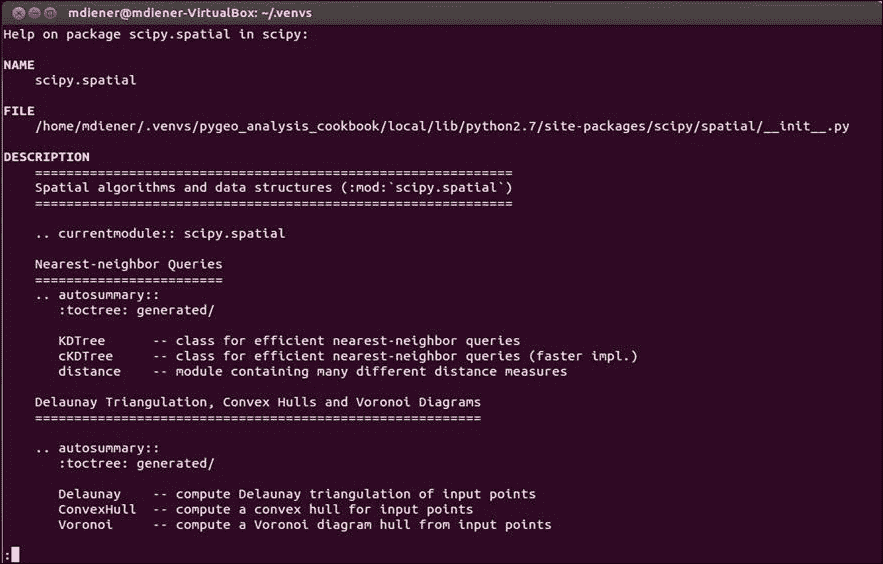

# 第一章. 设置你的地理空间 Python 环境

在本章中，我们将涵盖以下主题：

+   安装 virtualenv 和 virtualenvwrapper

+   安装 pyproj 和 NumPy

+   安装 shapely、matplotlib 和 descartes

+   安装 pyshp、geojson 和 pandas

+   安装 SciPy、PySal 和 IPython

+   安装 GDAL 和 OGR

+   使用 PostGIS 安装 GeoDjango 和 PostgreSQL

# 简介

本章将为你完成一些基础工作，以便你可以自由地、积极地完成本书中的所有菜谱。我们将从安装你将使用的每个库开始。一旦每个步骤完成，我们将测试每个库的安装以确保其工作。由于本书面向那些已经在处理空间数据的人，如果你已经安装了这些库，你可以跳过本章。如果没有，你将在这里找到有用的安装说明作为参考。

Python 库的选择基于行业验证的可靠性和功能性。Python 库中的众多功能导致了众多顶级桌面 GIS 系统上 GIS 支持的蓬勃发展，例如 QGIS 和 ESRI ArcGIS。

本书还包括一个 `installer.sh` bash 文件。`installer.sh` 文件可用于使用 `pip` 和其他依赖项通过 `apt-get` 命令安装你的虚拟环境中可用的 Python 库。`installer.sh` bash 文件从命令行执行，几乎一次性安装几乎所有内容，所以请查看它。对于那些第一次使用 Python 的你，请遵循本章中的说明，你的机器将被设置以完成不同的菜谱。

对于高级用户来说，安装有时可能很棘手，所以你会在本章中找到一些最常见的陷阱和连接方法。

这些菜谱的开发是在一个全新的 **Linux/Ubuntu 14.04** 机器上完成的。因此，除非另有说明，否则代码示例是针对 Linux/Ubuntu 的，必要时会有 Windows 的注意事项。

# 安装 virtualenv 和 virtualenvwrapper

这个菜谱将使你能够管理多个项目中不同库的不同版本。我们使用 `virtualenv` 来创建虚拟 Python 环境，在隔离的目录中托管项目特定的库集合。例如，你可能有一个使用 Django 1.4 的旧遗留项目，而一个新的项目则需要你使用 Django 版本 1.8。使用 `virtualenv`，你可以在同一台机器上安装这两个版本的 Django，并且每个项目都可以访问适当的 Django 版本，而不会出现任何冲突或问题。

没有使用 `virtualenv`，你被迫要么升级旧项目，要么找到一种方法来实现其他版本的新的功能，因此限制了或复杂化了新项目。

`virtualenv` 允许你轻松地在不同的 Python 虚拟环境中切换你的个人项目。这还有一个额外的好处，就是你可以轻松快速地设置一台新机器进行测试，或者帮助新开发者尽快将机器配置好。

## 准备工作

在做任何事情之前，我们假设你已经有一个运行 Linux/Ubuntu 的机器或一个 **virtualbox** 实例，这样你就可以遵循这些说明。

### 小贴士

我还建议尝试使用 Vagrant ([`www.vagrantup.com`](http://www.vagrantup.com))，它使用 virtualbox 来封装和标准化你的开发环境。

Ubuntu 14.04 预装了 Python 2.7.6 和 Python 3.4；其他库的安装责任由以下章节解释。

Windows 用户需要从 Python 主页 [`www.python.org/downloads/windows/`](https://www.python.org/downloads/windows/) 下载并安装 Python 2.7.x；请下载 2.7.x 系列的最新版本，因为本书是以 2.7.X 为前提编写的。安装程序包含 pip 的捆绑版本，所以请确保安装它！

仔细查看正确的版本以下载，确保你获得的是 *32 位* 或 *64 位* 下载。你不能混合使用版本，所以请小心，并记住安装正确的版本。

可以在 [`www.lfd.uci.edu/~gohlke/pythonlibs/`](http://www.lfd.uci.edu/~gohlke/pythonlibs/) 找到其他类型 Windows 二进制文件的优秀网站。Wheel 文件是安装的新规范，可以从命令行执行，如下所示：

```py
python pip install libraryName.whl

```

### 注意

在 Windows 上，请确保你的 Python 解释器已设置在系统路径中。这样，你就可以通过命令提示符使用 `C:\Users\Michael> python filename.py` 命令直接调用 Python。如果你需要更多帮助，可以通过遵循在线说明之一来获取信息，信息可以在 [`pypi.python.org/pypi/pip`](https://pypi.python.org/pypi/pip) 找到。

从 Python 2.7.9 及更高版本开始，`pip` 在安装时可用。

使用 Python 3 会很棒，对于许多 Python GIS 库来说，它已经准备好展示其功能。不幸的是，并非所有 GIS 库都与 Python 3 (pyproj) 兼容，正如在撰写本文时人们所期望的那样。如果你想尝试 Python 3.x，请随意尝试。一个检查库兼容性的优秀网页可以在 [`caniusepython3.com/`](https://caniusepython3.com/) 找到。

要安装 `virtualenv`，您需要有一个运行的 Python 和 pip 安装。pip 软件包管理器管理和安装 Python 软件包，使我们的生活更轻松。在这本书的整个过程中，如果我们需要安装一个软件包，`pip` 将是我们完成这项工作的首选工具。pip 的官方安装说明可以在 [`pip.pypa.io/en/latest/installing.html`](https://pip.pypa.io/en/latest/installing.html) 找到。要从命令行安装 pip，我们首先需要安装 `easy_install`。让我们在终端中试试：

```py
$ sudo apt-get install python-setuptools python-pip

```

这一行代码就安装了 `pip` 和 `easy_install`。

### 注意

**什么是 sudo？**

sudo 是一个用于类 Unix 计算机操作系统的程序，允许用户以其他用户的权限（通常是超级用户或 root）运行程序。其名称是 **su**（**substitute user**）和 **do**（**take action**）的组合。查看 [`en.wikipedia.org/wiki/Sudo`](http://en.wikipedia.org/wiki/Sudo) 了解有关 sudo 的更多信息。

命令 **sudo** 表示以超级用户权限运行执行。如果失败，您将需要获取 `ez_setup.py` 文件，该文件可在 [`bootstrap.pypa.io/ez_setup.py`](https://bootstrap.pypa.io/ez_setup.py) 找到。下载文件后，您可以从命令行运行它：

```py
$ python ez_setup.py

```

现在 `pip` 应该已经启动并运行，您可以执行命令来完成 `virtualenv` 和 `virtualenvwrapper` 的安装。`virtualenvwrapper` 创建了快捷方式，这是创建或删除虚拟环境的更快方式。您可以按照以下方式测试它：

```py
$ pip install virtualenv

```

## 如何做到这一点...

安装您的 Python `virtualenv` 和 `virtualenvwrapper` 软件包的步骤如下：

1.  使用 pip 安装程序安装 `virtualenv`：

    ```py
    $ sudo pip install virtualenv

    ```

1.  使用 `easy_install` 安装 `virtualenvwrapper`：

    ```py
    $ sudo easy_install virtualenvwrapper

    ```

    ### 注意

    我们使用 `easy_install` 而不是 `pip`，因为在 Ubuntu 14.04 中，`virtualenvwrapper.sh` 文件不幸地没有位于 `/usr/local/bin/virtualenvwrapper.sh`，而根据在线文档，它应该在那里。

1.  将 `WORKON_HOME` 变量分配给您的家目录，文件夹名称为 `venvs`。创建一个文件夹，用于存储您所有的不同 Python 虚拟环境；在我的情况下，该文件夹位于 `/home/mdiener/venvs`：

    ```py
    $ export WORKON_HOME=~/venvs
    $ mkdir $WORKON_HOME

    ```

1.  运行 source 命令以执行 `virtualenvrapper.sh` bash 文件：

    ```py
    $ source /usr/local/bin/virtualenvwrapper.sh

    ```

1.  接下来，我们创建一个新的虚拟环境，命名为 `pygeoan_cb`，这也是虚拟环境安装的新文件夹名称：

    ```py
    $ mkvirtualenv pygeoan_cb

    ```

    为了在下次启动计算机时使用 `virtualenvwrapper`，我们需要设置它，以便您的 bash 终端在计算机启动时运行 `virtualenvwrapper.sh` 脚本。

1.  首先，将其放入您的 `~/.bashrc` 文件中：

    ```py
    $ echo "export WORKON_HOME=$WORKON_HOME" >> ~/.bashrc

    ```

1.  接下来，我们将导入 bash 中的 `virtualenvwrapper` 函数：

    ```py
    $ echo "source /usr/local/bin/virtualenvwrapper.sh" >> ~/.bashrc

    ```

1.  现在，我们可以执行我们的 bash：

    ```py
    $ source ~/.bashrc

    ```

## 它是如何工作的...

第一步展示了 pip 如何将`virtualenv`包安装到您的系统级 Python 安装中。第二步展示了如何使用`easy_install`安装`virtualenvwrapper`辅助包，因为`virtualenvwrapper.sh`文件不是使用 pip 安装程序创建的。这将帮助我们轻松地创建、进入以及通常在 Python 虚拟环境之间工作或切换。第三步将`WORKON_HOME`变量分配给一个目录，我们希望在那里拥有所有虚拟环境。然后，我们将创建一个新的目录来存放所有虚拟环境。在第四步中，使用命令 source 执行 shell 脚本以设置`virtualenvwrapper`包。在第五步中，我们看到如何在`/home/mdiener/venvs`目录中创建一个新的名为`pygeoan_cb`的`virtualenv`。这一步将自动启动我们的`virtualenv`会话。

一旦`virtualenv`会话开始，我们现在可以看到括号中的`virtualenv`名称，如下所示：

```py
(pygeoan_cb)mdiener@mdiener-VirtualBox:~$

```

要退出`virtualenv`，只需输入以下代码：

```py
$ deactivate

```

现在，您的命令行应该恢复到正常状态，如下所示：

```py
mdiener@mdiener-VirtualBox:~$

```

要重新激活`virtualenv`，只需输入以下命令：

```py
$ workon pygeoan_cb

```

### 小贴士

`workon`命令有*Tab*自动完成功能。所以，只需输入`workon`，然后输入您想要进入的虚拟环境名称的第一个字母，例如`py`。按*Tab*键，它将自动完成名称。

在`/venvs`文件夹中，您将找到每个项目的特定虚拟环境，形式为一个子文件夹。`virtualenvwrapper`包将为每个新创建的项目创建一个新的文件夹。因此，您可以轻松地删除一个文件夹，这将删除您的虚拟环境。

要快速将所有已安装的库列表打印到文件中，我们将使用`pip`命令：

```py
$ pip freeze > requirements.txt

```

这将在当前文件夹中创建一个名为`requirements.txt`的文本文件。该文本文件包含当前运行的 Python 虚拟环境中安装的所有 Python 包的列表。

要从需求文件创建新的`virtualenv`，请使用以下命令：

```py
$ pip install -r /path/to/requirements.txt

```

## 还有更多...

对于那些刚开始进行地理空间 Python 开发的人来说，应该注意的是，你应该将项目特定的代码保存在 Python 虚拟环境文件夹外的另一个位置。例如，我总是将每个项目相关的代码包含在一个名为`01_projects`的单独文件夹中，这是我的主要文件夹。我的项目文件夹的路径是`/home/mdiener/01_projects`，我两个项目的结构如下：

+   `01_projects/Name_project1`

+   `01_projects/Name_project2`

所有虚拟环境都位于`/home/mdiener/venvs/`下。通常，我会将它们命名为与项目相同的名称，以保持整洁，如下所示：

+   `/home/mdiener/venvs/Name_project1`

+   `/home/mdiener/venvs/Name_project2`

# 安装 pyproj 和 NumPy

**pyproj** 是围绕 PROJ.4 库的一个包装器，它在 Python 中用于处理投影和执行变换 ([`pypi.python.org/pypi/pyproj/`](https://pypi.python.org/pypi/pyproj/))。所有你的地理信息都应该投影到由 **欧洲石油调查组** （**EPSG**） 支持的众多坐标系之一。这些信息对于系统正确地将数据放置在地球上的适当位置是必要的。然后，地理数据可以像层层叠加的数据一样放置在彼此之上，以创建地图或执行分析。数据必须正确定位，否则我们无法将其添加、组合或与其他数据源在空间上进行比较。

数据来自许多来源，并且，通常，投影并不等同于数据集。更糟糕的是，数据可能由数据提供者提供描述，声称它在投影 UTM31 中，而实际上数据在投影 UTM34 中！这可能导致在尝试使数据协同工作时出现大问题，程序可能会抛出一些难看的错误信息。

**NumPy** 是用于科学计算数组以及复数的科学基础，这些被用于驱动多个流行的地理空间库，包括 **GDAL** （**地理空间抽象库**）。NumPy 的强大之处在于其对大型矩阵、数组和数学函数的支持。因此，NumPy 的安装对于其他库能够顺利运行是必要的，但在我们进行空间分析的过程中，NumPy 很少被直接使用。

## 准备工作

启动你的虚拟环境，如果它还没有运行，请使用以下标准启动命令：

```py
$ workon pygeoan_cb

```

你的提示符现在应该看起来像这样：

```py
(pygeoan_cb)mdiener@mdiener-VirtualBox:~$

```

### 注意

如果由于某种原因 `workon` 没有启动你的虚拟环境，你可以简单地通过在命令行中执行 `source /home/mdiener/venvs/pygeoan_cb/bin/activate` 来启动它；再次尝试列出在 *安装 virtualenv 和 virtualenvwrapper* 菜单中列出的步骤以使其运行。

现在，我们需要安装一些 Python 开发工具，以便我们可以安装 NumPy，因此运行此命令：

```py
$ sudo apt-get install -y python-dev

```

现在，你已经准备好继续安装 pyproj 和 NumPy 到你的运行虚拟环境中。

## 如何操作...

简单地启动 `virtualenv`，我们将使用 pip 安装程序来完成所有繁重的工作，如下所示：

1.  使用 pip 继续安装 NumPy；这可能需要几分钟，因为屏幕上会写出许多安装详细输出：

    ```py
    $ pip install numpy

    ```

    Windows 用户可以获取 NumPy 的 `.whl` 文件并使用以下命令执行它：

    ```py
    pip install numpy -1.9.2+mkl-cp27-none-win32.whl

    ```

1.  再次使用 `pip` 来安装 pyproj：

    ```py
    $ pip install pyproj

    ```

    Windows 用户可以使用以下命令来安装 pyproj：

    ```py
    pip install pyproj-1.9.4-cp27-none-win_amd64.whl

    ```

1.  等待几分钟；NumPy 应该现在与 pyproj 一起运行。要测试它是否成功，请在 Python 控制台中输入以下命令。输出应该看起来像这样：

    ```py
    (pygeoan_cb)mdiener@mdiener-VirtualBox:~/venv$ python
    Python 2.7.3 (default,  Feb 27 2014, 19:58:35)
    [GCC 4.6.3] on linux2
    Type “help”,  “copyright”, “credits”, or  “license” for more information.
    >> import numpy
    >> import pyproj

    ```

希望没有错误。你现在已经成功安装了 NumPy 和 pyproj。

### 注意

可能会出现各种错误，所以请查看相应的安装链接以帮助您解决问题：

对于 pyproj：[`pypi.python.org/pypi/pyproj/`](https://pypi.python.org/pypi/pyproj/)

对于 NumPy：[`www.numpy.org`](http://www.numpy.org)

## 它是如何工作的...

这种简单的安装使用标准的 pip 安装方法。不需要任何技巧或特殊命令。您只需执行 `pip install <library_name>` 命令，然后就可以开始了。

### 小贴士

如果您不确定要安装的确切名称，可以通过访问 [`pypi.python.org/pypi`](https://pypi.python.org/pypi) 网页来查找库名称。

# 安装 shapely、matplotlib 和 descartes

地理空间分析和可视化的大部分工作都是通过使用 Shapely、matplotlib、GDAL、OGR 和 descartes 实现的，这些库将在之后安装。这里的大部分食谱将广泛使用这些库，因此设置它们是完成我们的练习所必需的。

**Shapely** ([`toblerity.org/shapely`](http://toblerity.org/shapely)) 使用与 AutoCAD 相同的笛卡尔坐标系进行纯空间分析，对于那些熟悉类似 CAD 的程序的人来说。使用平面坐标系统的优点是，所有欧几里得几何和分析几何的规则都适用。为了快速回顾我们在学校学过的坐标系，这里有一个小图来快速唤醒您的记忆。


### 注意

**描述**：一个展示平面以绘制和测量几何形状的笛卡尔坐标系。

**插图 1**: 来源：[`en.wikipedia.org/wiki/Cartesian_coordinate_system`](http://en.wikipedia.org/wiki/Cartesian_coordinate_system).

Shapely 在使用 GEOS 库作为其后台工作马力的经典叠加分析和其他几何计算中表现出色。

对于 **matplotlib** ([`matplotlib.org/`](http://matplotlib.org/))，它是将图形和数据渲染到屏幕上的图像或 **可缩放矢量图形**（**svg**）的绘图引擎。matplotlib 的用途仅限于您的想象力。因此，就像名字部分所暗示的那样，matplotlib 使您能够将数据绘制在图表上，甚至是在地图上。对于那些熟悉 MATLAB 的人来说，您会发现 matplotlib 在功能上非常相似。

**descartes** 库提供了 Shapely 几何对象与 Matplotlib 的更好集成。在这里，您将看到 descartes 打开了 matplotlib 绘图的 `fill` 和 `patch`，以便与 Shapely 的几何体一起工作，并为您节省了单独输入它们的麻烦。

## 准备工作

为了准备安装，有必要安装一些全局包，例如 `libgeos_c`，因为这些是 Shapely 所必需的。NumPy 也是我们已满足的要求，并且也被 Shapely 使用。

按照以下方式从命令行安装 matplotlib 的需求：

```py
$ sudo apt-get install freetype* libpng-dev libjpeg8-dev

```

这些是 matplotlib 的依赖项，可以在 Ubuntu 14.04 机器上看到。

## 如何操作...

按照以下说明操作：

1.  运行 pip 安装 shapely：

    ```py
    $ pip install shapely

    ```

1.  运行 pip 安装 matplotlib：

    ```py
    $ pip install matplotlib

    ```

1.  最后，运行 pip 安装 descartes：

    ```py
    $ pip install descartes

    ```

另一个测试是否一切顺利的方法是简单地进入 Python 控制台并尝试导入这些包，如果没有错误发生，你的控制台应该显示一个空的 Python 光标。输出应该看起来像以下代码所示：

```py
(pygeoan_cb)mdiener@mdiener-VirtualBox:~/venv$ python
Python 2.7.3 (default,  Feb 27 2014, 19:58:35)
[GCC 4.6.3] on linux2
Type “help”,  “copyright”, “credits”, or  “license” for more information.
>>> import shapely
>>> import matplotlib
>>> import descartes
>>>

# type exit() to return
>>> exit()

```

如果出现任何错误，Python 通常会提供一些很好的线索，告诉你问题所在，并且总有 **Stack Overflow**。例如，查看[`stackoverflow.com/questions/19742406/could-not-find-library-geos-c-or-load-any-of-its-variants/23057508#2305750823057508`](http://stackoverflow.com/questions/19742406/could-not-find-library-geos-c-or-load-any-of-its-variants/23057508#2305750823057508)。

## 它是如何工作的...

在这里，安装包的顺序非常重要。descartes 包依赖于 matplotlib，而 matplotlib 依赖于 NumPy、freetype 和 libpng。这让你不得不首先安装 NumPy，然后是 matplotlib 及其依赖项，最后是 descartes。

使用 pip 安装本身很简单，应该快速且无痛苦。如果 `libgeos_c` 没有正确安装，那么你可能需要安装 `libgeos-dev` 库。

# 安装 pyshp、geojson 和 pandas

这些特定的库是为了特定的格式而设计的，使得我们的生活和使用 GDAL 进行某些项目相比更加简单和方便。pyshp 将与 shapefiles 一起工作，geojson 与 GeoJSON 一起工作，而 pandas 则以结构化的方式处理所有其他文本数据类型。

**pyshp** 是纯 Python 编写的，用于导入和导出 shapefiles；你可以在[`github.com/GeospatialPython/pyshp`](https://github.com/GeospatialPython/pyshp)找到 pyshp 库的源代码。pyshp 库的唯一目的是与 shapefiles 一起工作。GDAL 将用于处理我们大部分数据的输入/输出需求，但有时，当与 shapefiles 一起工作时，纯 Python 库会更简单。

**geojson** 是一个 Python 库的名称，也是一个格式，这使得理解它有点令人困惑。GeoJSON 格式 ([`geojson.org`](http://geojson.org)) 正变得越来越受欢迎，因此我们使用 Python geojson 库来处理其创建。如果你搜索 geojson，你会在 **Python 包索引**（**PyPI**）上找到它。正如你所期望的，这将帮助我们创建 GeoJSON 规范中支持的所有不同几何类型。

**pandas** ([`pandas.pydata.org`](http://pandas.pydata.org)) 是一个数据分析库，它以类似电子表格的方式组织你的数据，以便进行进一步的计算。由于我们的地理空间数据来自广泛的来源和格式，例如 CSV，pandas 有助于以最小的努力处理数据。

## 准备工作

使用以下命令进入你的虚拟环境：

```py
$ workon pygeoan_cb

```

你的提示符现在应该看起来像这样：

```py
(pygeoan_cb)mdiener@mdiener-VirtualBox:~$

```

## 如何操作...

以下是三个安装步骤：

1.  Pyshp 将首先通过以下方式使用 pip 安装：

    ```py
    $ pip install pyshp

    ```

1.  接下来，将使用 pip 安装 geojson 库：

    ```py
    $ pip install geojson

    ```

1.  最后，pip 将安装 pandas：

    ```py
    $ pip install pandas

    ```

要测试 pyshp 的安装，请使用 `import shapefile` 类型。输出应类似于以下输出：

```py
(pygeoan_cb)mdiener@mdiener-VirtualBox:~/venv$ python
Python 2.7.3 (default,  Feb 27 2014, 19:58:35)
[GCC 4.6.3] on linux2
Type “help”,  “copyright”, “credits”, or  “license” for more information.
>> import shapefile
>> import geojson
>> import pandas

```

### 注意

`import shapefile` 语句导入了 `pyshp` 库；与其它库不同，导入名称与安装名称不同。

## 它是如何工作的...

如同在其他模块中看到的那样，我们使用了标准的安装 pip 软件包来执行安装。没有其他依赖项需要担心，这使得进度快速。

# 安装 SciPy、PySAL 和 IPython

**SciPy** 是一个包含 SciPy 库、matplotlib、pandas、SymPy 和 IPython 等库的 Python 库集合。SciPy 库本身用于许多操作，但我们特别感兴趣的是 **空间** 模块。此模块可以执行许多操作，包括运行最近邻查询。

**PySAL** 是一个用于空间分析的地理空间计算库。从 Python 代码中直接创建模型和运行模拟是 PySAL 提供的许多库功能之一。PySAL 是一个库，当与我们的可视化工具（如 matplotlib）结合使用时，为我们提供了一个强大的工具。

**IPython** 是一个用于控制台的 Python 解释器，它取代了您在终端运行和测试 Python 代码时可能习惯的正常 Python 控制台。这实际上只是一个具有一些酷功能的先进解释器，例如 *Tab* 自动完成，这意味着初学者可以通过输入一个字母并按 *Tab* 键来快速获取命令。IPython 笔记本可以帮助以网页形式共享代码，包括代码、图像等，而无需安装。

## 准备工作

我们之前查看的依赖关系丛林又回来了，我们需要在 Ubuntu 系统中使用 `apt-get install` 安装三个通用安装，如下所示：

```py
$ sudo apt-get install libblas-dev liblapack-dev gfortran

```

### 注意

Windows 和 Mac 用户可以使用完整的安装程序（[`www.scipy.org/install.html`](http://www.scipy.org/install.html)），例如 Anaconda 或 Enthought Canopy，它将一次性为你完成所有安装依赖。

SciPy 安装使用了三个依赖项。PySAL 依赖于 SciPy，因此请确保首先安装 SciPy。只有 IPython 不需要额外的安装。

使用以下代码启动你的 Python 虚拟环境：

```py
mdiener@mdiener-VirtualBox:~$ workon pygeoan_cb
(pygeoan_cb)mdiener@mdiener-VirtualBox:~$

```

## 如何操作...

让我们看看这些步骤：

1.  首先，我们将安装 SciPy，因为 PySAL 依赖于它。安装需要一些时间；我的机器花费了 5 分钟，所以请休息一下：

    ```py
    $ pip install scipy

    ```

1.  PySAL 可以使用 pip 非常快速地安装：

    ```py
    $ pip install pysal

    ```

1.  如同往常，我们想看看一切是否正常工作，所以让我们按照以下方式启动 Python 壳：

    ```py
    (pygeoan_cb)mdiener@mdiener-VirtualBox:~$python
    >>> import scipy
    >>> import pysal
    >>>

    ```

1.  IPython 可以通过 pip 全局安装或安装在虚拟环境中，如下所示：

    ```py
    $ pip install ipython

    ```

## 它是如何工作的...

SciPy 和 PySAL 库都是为了帮助完成各种空间分析任务而设计的。工具的选择取决于手头的任务，所以请确保在命令提示符下检查哪个库提供了什么功能，如下所示：

```py
>>> from scipy import spatial
>>> help(spatial)

```

输出应类似于以下截图所示：



# 安装 GDAL 和 OGR

格式转换是枯燥的、重复的，GDAL 库提供的许多功能之一，更不用说格式转换了。然而，GDAL 在其他地理空间功能方面也表现出色，例如获取 Shapefile 的当前投影或从高程数据生成等高线。所以，仅仅说 GDAL 是一个转换库是不准确的；它实际上要丰富得多。GDAL 的创始人 Frank Warmerdam 为启动该项目应得到认可，GDAL 项目现在是**OSGEO**（**开源地理空间基金会**，请参阅[www.osgeo.org](http://www.osgeo.org)）的一部分。

### 注意

GDAL 安装包括 OGR；不需要额外安装。

目前，GDAL 涵盖了处理栅格数据，而 OGR 涵盖了处理矢量数据。随着 GDAL 2.x 版本的推出，栅格和矢量两个方面现在都合并为一个整体。GDAL 和 OGR 是地理空间数据转换的瑞士军刀，覆盖了 200 多种不同的空间数据格式。

## 准备工作

GDAL 在 Windows、Linux 或 OSX 上安装时并不总是那么友好。它有许多依赖项，安装方式也多种多样。描述并不总是非常直接。请记住，这种描述只是处理事情的一种方式，并不总是适用于所有机器，因此请参考在线说明以获取最新和最佳的系统配置方法。

首先，我们将在我们的机器上全局安装一些依赖项。依赖项安装完成后，我们将进入全局安装 Python 的 GDAL 全局站点包。

## 如何操作...

要将 GDAL 全局安装到我们的 Python 站点包中，我们将按照以下步骤进行：

1.  安装构建和 XML 工具时使用以下命令：

    ```py
    $ sudo apt-get install -y build-essentiallibxml2-dev libxslt1-dev

    ```

1.  使用以下命令安装 GDAL 开发文件：

    ```py
    $ sudo apt-get install libgdal-dev # install is 125MB

    ```

1.  以下命令将在主 Python 包中安装 GDAL 包。这意味着 GDAL 将被全局安装。就我所知，GDAL 的全局安装通常不是坏事，因为没有向后不兼容的版本，这在当今时代是非常罕见的。在`virtualenv`中直接且仅安装 GDAL 是非常痛苦的，如果你有兴趣尝试，我提供了一些链接供你尝试。

    ```py
    $ sudo apt-get install python-gdal

    ```

    ### 注意

    如果您想在虚拟环境中尝试安装，请查看这个 Stack Overflow 问题：[`gis.stackexchange.com/questions/28966/python-gdal-package-missing-header-file-when-installing-via-pip`](http://gis.stackexchange.com/questions/28966/python-gdal-package-missing-header-file-when-installing-via-pip)。

1.  要在 Python 虚拟环境中获取 GDAL，我们只需要运行一个简单的 virtualevnwrapper 命令：

    ```py
    toggleglobalsitepackages

    ```

    确保您已激活虚拟环境，如下所示：

    ```py
    mdiener@mdiener-VirtualBox:~$ workon pygeoan_cb
    (pygeoan_cb)mdiener@mdiener-VirtualBox:~$

    ```

1.  现在，在您的当前虚拟环境中激活全局 Python 站点包：

    ```py
    (pygeoan_cb)mdiener@mdiener-VirtualBox:~$ toggleglobalsitepackages
    enable global site-packages

    ```

1.  最后的检查是查看 GDAL 是否可用，如下所示：

    ```py
    $ python
    >>> import gdal
    >>>

    ```

1.  没有发现错误，GDAL 已准备好使用。

Windows 7 及以上用户应使用 OSGeo4W Windows 安装程序 ([`trac.osgeo.org/osgeo4w/`](https://trac.osgeo.org/osgeo4w/))。在网页上找到以下部分，下载您的 32 位或 64 位 Windows 版本。遵循图形安装程序的说明，然后 GDAL 安装将完成。

### 小贴士

如果所有方法都失败，Windows 用户也可以直接从 [`www.gisinternals.com/sdk/`](http://www.gisinternals.com/sdk/) 获取二进制文件。此安装程序可以帮助避免可能出现的任何其他特定于 Windows 的问题，并且该网站可以帮助您走上正确的道路。

## 它是如何工作的...

GDAL 安装包括栅格（GDAL）和矢量（OGR）工具。在 GDAL 安装中包含五个模块，根据您的需求可以单独导入到您的项目中：

```py
>>> from osgeo import gdal
>>> from osgeo import ogr
>>> from osgeo import osr
>>> from osgeo import gdal_array
>>> from osgeo import gdalconst
>>> python
>>> import osgeo
>>> help(osgeo)

```

要查看与您的 Python GDAL 安装一起包含的包，我们使用 Python 内置的帮助功能来列出 OSGeo 模块可以提供的内容。您应该看到以下内容：

```py
NAME
 osgeo - # __init__ for osgeo package.
FILE
 /usr/lib/python2.7/dist-packages/osgeo/__init__.py
MODULE DOCS
 http://docs.python.org/library/osgeo
PACKAGE CONTENTS
 _gdal
 _gdal_array
 _gdalconst
 _ogr
 _osr
 gdal
 gdal_array
 gdalconst
 gdalnumeric
 ogr
 osr
DATA
 __version__ = '1.10.0'
 version_info = sys.version_info(major=2, minor=7, micro=3, releaseleve...
VERSION
 1.10.0
(END)

```

在撰写本文时，GDAL 版本已提升到 2.0，在开发者领域，甚至在它被打印出来之前就已经是旧版本了。请注意，GDAL 2.0 存在兼容性问题，并且对于本书，建议使用 1.x.x 版本。

## 参考以下内容

[`www.gdal.org`](http://www.gdal.org) 的主页始终是关于其任何信息的最佳参考地点。OSGEO 将 GDAL 作为支持项目之一，您可以在 [`www.osgeo.org`](http://www.osgeo.org) 上找到更多关于它的信息。

# 安装 GeoDjango 和 PostgreSQL 与 PostGIS

这是我们最终的安装方案，如果您到目前为止一直跟随，那么您就可以开始一个简单直接的 Django 之旅了。根据 Django 主页，Django 是为有截止日期的专业人士提供的 Web 框架。其空间部分可以在 **GeoDjango** 中找到。GeoDjango 是与每个 Django 安装一起安装的 contrib 模块，因此，您只需要安装 Django 就可以运行 GeoDjango。当然，“geo”有其依赖关系，这些依赖关系在前面的章节中已经满足。为了参考，请查看 Django 主页上的这份优秀的文档。

[`docs.djangoproject.com/en/dev/ref/contrib/gis/install/#ref-gis-install`](https://docs.djangoproject.com/en/dev/ref/contrib/gis/install/#ref-gis-install).

我们将使用 PostgreSQL 和 PostGIS，因为它们是开源行业常用的空间数据库。安装不是 100%必要的，但没有它们就没有真正的意义，因为你限制了你的操作，而且如果你计划将你的空间数据存储在空间数据库中，它们绝对是必需的。PostgreSQL 和 PostGIS 的组合是 GeoDjango 最常见空间数据库设置。这个安装肯定更复杂，可能会根据你的系统导致一些连接问题。

## 准备工作

要使用 GeoDjango，我们需要安装一个空间数据库，在我们的案例中，我们将使用带有 PostGIS 扩展的 PostgreSQL。GeoDjango 还支持 Oracle、Spatialite 和 MySQL。PostGIS 的依赖包括 GDAL、GEOS、PROJ.4、LibXML2 和 JSON-C。

按如下方式启动你的 Python 虚拟环境：

```py
mdiener@mdiener-VirtualBox:~$ workon pygeoan_cb
(pygeoan_cb)mdiener@mdiener-VirtualBox:~$

```

### 小贴士

**下载示例代码**

你可以从你购买的所有 Packt 书籍的账户中下载示例代码文件[`www.packtpub.com`](http://www.packtpub.com)。如果你在其他地方购买了这本书，你可以访问[`www.packtpub.com/support`](http://www.packtpub.com/support)并注册以直接将文件通过电子邮件发送给你。

## 如何操作...

按照以下步骤操作。这些步骤来自 Ubuntu Linux 的 PostgreSQL 主页：

1.  使用标准的 gedit 文本编辑器创建一个名为`pgdg.list`的新文件。该文件存储启动你的 Ubuntu 安装器包的命令：

    ```py
    $ sudo gedit /etc/apt/sources.list.d/pgdg.list

    ```

1.  将此行添加到文件中，保存并关闭：

    ```py
    $ deb http://apt.postgresql.org/pub/repos/apt/ precise-pgdg main

    ```

1.  现在，运行`wget`命令添加密钥：

    ```py
    $ wget --quiet -O - https://www.postgresql.org/media/keys/ACCC4CF8.asc | \ sudo apt-key add -

    ```

1.  运行`update`命令以实际更新你的安装器包：

    ```py
    $ sudo apt-get update

    ```

1.  运行`install`命令以实际安装 PostgreSQL 9.3：

    ```py
    $ sudo apt-get install postgresql-9.3

    ```

1.  要安装 PostGIS 2.1，我们将有一个未满足的依赖项`libgdal1`，所以继续安装它：

    ```py
    $ sudo apt-get install libgdal1

    ```

1.  现在，我们可以在我们的机器上安装 PostGIS 2.1 for PostgreSQL 9.3：

    ```py
    $ sudo apt-get install postgresql-9.3-postgis-2.1

    ```

1.  安装 PostgreSQL 头文件：

    ```py
    $ sudo apt-get install libpq-dev

    ```

1.  最后，使用以下贡献安装`contrib`模块：

    ```py
    $ sudo apt-get install postgresql-contrib

    ```

1.  安装 Python 数据库适配器`psycopg2`，以便从 Python 连接到你的 PostgreSQL 数据库：

    ```py
    $ sudo apt-get install python-psycopg2

    ```

1.  现在，我们可以创建一个标准的 PostgreSQL 数据库如下：

    ```py
    (pygeoan_cb)mdiener@mdiener-VirtualBox:~$ createdb [NewDatabaseName]

    ```

1.  使用`psql`命令行工具，我们可以创建一个 PostGIS 扩展到我们新创建的数据库，如下赋予它所有 PostGIS 功能：

    ```py
    (pygeoan_cb)mdiener@mdiener-VirtualBox:~$ psql -d [NewDatabaseName] -c "CREATE EXTENSION postgis;"

    ```

1.  接下来，我们终于可以在激活的虚拟环境中直接一行安装 Django：

    ```py
    $ pip install django

    ```

1.  测试你的 Django 和 GDAL 安装，并始终尝试如下导入：

    ```py
    >>> from django.contrib.gis import gdal
    >>> gdal.HAS_GDAL
    True

    ```

Windows 用户应被指引到 EnterpriseDB 提供的 PostgreSQL Windows ([`www.postgresql.org/download/windows/`](http://www.postgresql.org/download/windows/))二进制文件，[`www.enterprisedb.com/products-services-training/pgdownload#windows`](http://www.enterprisedb.com/products-services-training/pgdownload#windows)。下载正确的版本并遵循安装说明。PostGIS 也包含在可以直接使用安装程序安装的扩展列表中。

## 它是如何工作的...

使用 apt-get Ubuntu 安装程序和 Windows 安装程序安装足够简单，以便 PostgreSQL、PostGIS 和 Django 能够正常运行。然而，安装程序的内部工作原理超出了本书的范围。

## 还有更多...

要总结所有已安装的库，请查看以下表格：

| 库名称 | 描述 | 安装原因 |
| --- | --- | --- |
| NumPy | 这增加了对大型多维数组和矩阵的支持 | 它是许多其他库的要求 |
| pyproj | 这处理投影 | 它转换投影 |
| shapely | 这处理地理空间操作 | 它执行快速的几何操作和操作 |
| matplotlib | 这提供绘图库 | 它提供了结果的快速可视化 |
| descartes | 这使用 Shapely 或 GeoJSON 对象作为 matplotlib 路径和补丁 | 它快速绘制地理数据 |
| pandas | 这提供了高性能的数据结构和数据分析 | 它执行数据操作、CSV 创建和数据操作 |
| SciPy | 这提供了一组用于科学计算的 Python 库 | 它拥有最佳的工具集合 |
| PySAL | 这包含一个地理空间分析库 | 它执行大量的空间操作（可选） |
| IPython | 这提供了交互式 Python 计算 | 它是一个有用的笔记本，用于存储和保存你的脚本（可选） |
| Django | 这包含一个网络应用框架 | 它用于我们第十一章中的演示网络应用，*使用 GeoDjango 进行网络分析* |
| pyshp | 这提供了纯 Python 的 shapefile 操作和生成 | 它有助于输入和输出 shapefiles |
| GeoJSON | 这包含空间数据的 JSON 格式 | 它促进了此格式的交换和发布 |
| PostgreSQL | 这是一个关系型数据库 | 它有助于存储空间数据 |
| PostGIS | 这是 PostgreSQL 的空间扩展 | 它在 PostgreSQL 中存储和执行地理数据的空间操作 |
