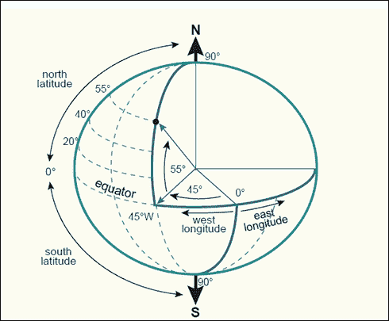
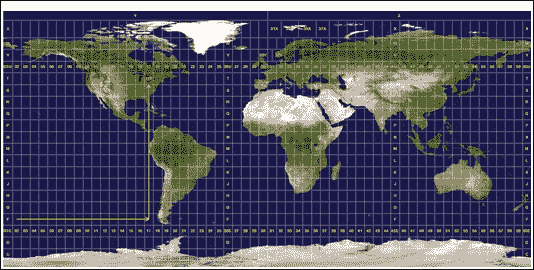

# 第二章。处理投影

在本章中，我们将涵盖以下主题：

+   发现 Shapefile 或 GeoJSON 数据集的投影（s）

+   从 WMS 服务器列出投影（s）

+   如果 Shapefile 不存在，为其创建投影定义

+   批量设置一个充满 Shapefiles 文件夹的投影定义

+   将 Shapefile 从一个投影重新投影到另一个投影

# 简介

在我的看法中，处理投影并不太令人兴奋，但它们非常重要，并且您在任何应用程序中处理它们的能力至关重要。

本章的目标是提供一些常见的预数据筛选或转换步骤，以便将您的数据整理好，或者更好的是，为地理空间分析定位。我们无法总是对处于不同坐标系统中的多个数据集进行分析，而不存在得到不一致结果的风险，例如数据位置不准确。因此，当在全局范围内工作时，最好在相同的坐标系中工作，如 EPSG:4326，或者使用为您的地区提供最精确结果的本地坐标系。

**欧洲石油调查组**或**EPSG**代码已决定为所有坐标系分配一个数字代码，以简化投影信息的查找和共享。坐标系通过其定义来描述，这些定义存储在各种格式的文本文件中。这些文本文件旨在成为计算机可读格式，特别是为单个 GIS 桌面软件包，如 QGIS 或 ESRI ArcMap 或为您的 Web/脚本应用程序设计的。

EPSG 代码 4326 代表**1984 年世界地理系统（WGS 84**）是一个**地理坐标系**，具有经纬度(*x*，*y*)单位（参见图下所示）。地理坐标系将地球表示为一个球体，如图所示，测量单位是度。



图 1：地理坐标系([`kartoweb.itc.nl/geometrics/coordinate%20systems/coordsys.html`](http://kartoweb.itc.nl/geometrics/coordinate%20systems/coordsys.html))

第二种坐标系是一种**投影坐标系**，它是一个具有恒定面积、长度或角度的二维平面，这些角度是在*x*和*y*网格上测量的。**EPSG:3857 Pseudo-Mercator**就是这样一种投影坐标系，其中单位是米，长度正确，但角度和面积是扭曲的。在任何给定的投影坐标系中，只有三个属性中的两个，即*面积*、*距离*或*角度*，可以在单个地图上正确表示。**通用横轴墨卡托**（**UTM**）坐标系将世界划分为 60 个区域（参见图下所示）：



插图 2：投影坐标系 UTM ([`en.wikipedia.org/wiki/Universal_Transverse_Mercator_coordinate_system#mediaviewer/File:Utm-zones.jpg`](http://en.wikipedia.org/wiki/Universal_Transverse_Mercator_coordinate_system#mediaviewer/File:Utm-zones.jpg))

### 注意

注意，你必须使用 `workon pygeoan_cb` 命令进入你的 Python 虚拟环境。

# 发现 Shapefile 或 GeoJSON 数据集的投影

记住，所有数据都是以坐标系存储的，无论数据源是什么。你的任务是使用本节中概述的简单方法来找出这一点。我们将查看两种不同的数据存储类型：一个 **Shapefile** 和一个 **GeoJSON** 文件。这两种格式包含几何形状，如点、线或多边形，以及它们相关的属性。例如，一棵树会被存储为一个具有属性（如高度、年龄和种类）的点几何形状。这些数据类型以不同的方式存储它们的投影数据，因此需要不同的方法来发现它们的投影信息。

现在快速介绍一下 Shapefile 是什么：Shapefile 不是一个单独的文件，而是一组至少三个文件，例如 `.shp`、`.shx` 和 `.dbf`，它们具有相同的名称。例如，`world_borders.shp`、`world_borders.shx` 和 `world_borders.dbf` 组成了一个文件。`.shp` 文件存储几何形状，`.dbf` 存储属性值的表，而 `.shx` 是连接几何形状到属性值的索引表，作为一个查找表。

Shapefile 应该附带一个非常重要的第四个文本文件，称为 `world_borders.prj`。`.prj` 代表 **投影信息**，并以纯文本格式包含 Shapefile 的投影定义。听起来可能很疯狂，但你仍然可以找到并下载今天仍在提供的大量数据，而这些数据没有这个 `.prj` 文件。你可以通过在文本编辑器中打开这个 `.prj` 文件来实现，例如 *Sublime Text* 或 *Notepad++*，在那里你可以阅读关于投影定义的内容，以确定文件的坐标系。

### 注意

`.prj` 文件是一个纯文本文件，如果你不小心，很容易为错误的坐标系生成。错误的投影定义可能会导致你的分析和转换出现问题。我们将看到如何正确评估 Shapefile 的投影信息。

GeoJSON 是一个存储在纯文本中的单个文件。GeoJSON 标准 ([`www.geojson.org`](http://www.geojson.org)) 基于 JSON 标准。根据我的经验，坐标参考信息通常 **不** 包含在内，默认为 WGS 84 和 EPSG:4326，其中坐标以 `x`、`y`、`z` 格式存储，并且在这个 *确切顺序* 中。

### 注意

对于 *y*，*x* 和 *y* 混合的情况可能发生，当这种情况发生时，你的数据很可能会最终出现在海洋中，所以请始终记住顺序很重要：

*x = 经度*

*y = 纬度*

*z = 高度*

如果 GeoJSON 的 CRS 信息以 `FeatureCollection` 的形式呈现，如下所示：

```py
{
"type": "FeatureCollection",
"crs": { "type": "name", "properties": { "name": "urn:ogc:def:crs:OGC:1.3:CRS84" } },
…
```

## 准备工作

首先，前往 [`github.com/mdiener21/python-geospatial-analysis-cookbook`](https://github.com/mdiener21/python-geospatial-analysis-cookbook) 并一次性下载整个源代码和地理数据。下载图标位于右下角，标记为 **Download ZIP**。如果你是 GitHub 用户，当然可以克隆仓库。请注意，这是一个超过 150 MB 的下载。在仓库内部，你会找到每个章节，包括以下三个文件夹：`/geodata/` 用于存储数据，`/code/` 用于存储已完成的代码脚本，以及一个名为 `/working/` 的空文件夹，供你创建自己的代码脚本。结构如下所示：

```py
/ch01/
–------/code
–------/geodata
–------/working
/ch02/
–------/code
–------/geodata
–------/working
...
```

本食谱中使用的数据来源是加拿大不列颠哥伦比亚省温哥华市，位于 [`data.vancouver.ca/datacatalogue/index.htm`](http://data.vancouver.ca/datacatalogue/index.htm)（温哥华学校）。

### 提示

当从互联网源下载数据时，总是要寻找有关投影信息的元数据描述，这样在开始处理数据之前，你就能对数据的历史和来源有所了解。如今，大多数数据都以 EPSG:4326 WGS 84 或 EPSG:3857 Web Pseudo-Mercator 的形式公开可用。来自政府资源的数据很可能存储在本地区域坐标系中。

## 如何操作...

我们将从我们的 Shapefile 开始，并使用导入 OGR 模块的 GDAL 库来识别其存储的坐标系：

### 注意

注意，我们假设你的 Shapefile 有一个 `.prj` 文件。如果没有，这个过程将无法工作。

1.  在你的 `/ch02/working/` 目录中创建一个名为 `ch02_01_show_shp_srs.py` 的新 Python 文件，并添加以下代码：

    ```py
    #!/usr/bin/env python
    # -*- coding: utf-8 -*-

    from osgeo import ogr
    shp_driver = ogr.GetDriverByName('ESRI Shapefile')
    shp_dataset = shp_driver.Open(r'../geodata/schools.shp')
    shp_layer = shp_dataset.GetLayer()
    shp_srs = shp_layer.GetSpatialRef()
    print shp_srs
    ```

1.  现在保存文件，并在命令行中运行 `ch02_01_show_shp_srs.py` 脚本：

    ```py
    $ python ch02-01-show_shp_srs.py
    PROJCS["NAD_1983_UTM_Zone_10N",
     GEOGCS["GCS_North_American_1983",
     DATUM["North_American_Datum_1983",
     SPHEROID["GRS_1980",6378137,298.257222101]],
     PRIMEM["Greenwich",0],
     UNIT["Degree",0.017453292519943295]],
     PROJECTION["Transverse_Mercator"],
     PARAMETER["latitude_of_origin",0],
     PARAMETER["central_meridian",-123],
     PARAMETER["scale_factor",0.9996],
     PARAMETER["false_easting",500000],
     PARAMETER["false_northing",0],
     UNIT["Meter",1]]

    ```

    你应该在屏幕上看到前面的文本打印出来，显示 `.prj` 投影的信息。

    ### 注意

    注意，我们也可以简单地使用文本编辑器打开 `.prj` 文件，并查看这些信息。

    现在，我们将查看一个 GeoJSON 文件，看看是否有投影信息可用。

1.  确定 GeoJSON 文件的坐标系稍微困难一些，因为我们必须做出两种假设，第一种情况是标准情况且最常见：

    1.  GeoJSON 内部没有明确定义任何 CRS，所以我们假设坐标系是 EPSG:4326 WGS 84。

    1.  坐标参考系统（CRS）被明确定义且正确无误。

1.  在你的 `/ch02/working/` 目录中创建一个名为 `ch02_02_show_geojson_srs.py` 的新 Python 文件，并添加以下代码：

    ```py
    #!/usr/bin/env python
    # -*- coding: utf-8 -*-

    import json

    geojson_yes_crs = '../geodata/schools.geojson'
    geojson_no_crs = '../geodata/golfcourses_bc.geojson'

    with open(geojson_no_crs) as my_geojson:    
        data = json.load(my_geojson)

    # check if crs is in the data python dictionary data
    # if yes print the crs to screen
    # else print NO to screen and print geojson data type
    if 'crs' in data:
        print "the crs is : " + data['crs']['properties']['name']
    else:
        print "++++++ no crs tag in file+++++"
        print "++++++ assume EPSG:4326 ++++++"
        if "type" in data:
            print "current GeoJSON data type is :" + data['type']
    ```

1.  脚本被设置为在 GeoJSON `golfcourses_bc.geojson` 文件中设置的 `geojson_no_crs` 变量上运行。这些数据来源于 **OpenStreetMap**，它使用位于 [`overpass-turbo.eu/`](http://overpass-turbo.eu/) 的 **Overpass API** 导出。现在，运行 `ch02_02_show_geojson_srs.py` 脚本，你应该会看到我们第一个文件的这个输出：

    ```py
    $ python ch02_02_show_geojson_crs.py
    ++++++ no crs tag in file+++++
     ++++++ assume EPSG:4326 ++++++
    current GeoJSON data type is :FeatureCollection

    ```

    ### 小贴士

    如果我们的 GeoJSON 文件中没有 CRS，我们将假设它具有 EPSG:4326 的投影。为了检查这一点，你需要查看文件内列出的坐标，看看它们是否在范围内，例如 `-180.0000`、`-90.0000`、`180.0000` 和 `90.0000`。如果是这样，我们将假设数据集确实是 EPSG:4326，并在 QGIS 中打开数据以进行检查。

1.  现在，进入代码并编辑第 10 行，将变量从 `geojson_no_crs` 更改为 `geojson_yes_crs`，然后重新运行 `ch02_02_show_geojson_srs.py` 代码文件：

    ```py
    $ python ch02_02_show_geojson_crs.py
    the crs is : urn:ogc:def:crs:EPSG::26910

    ```

    你现在应该看到前面的输出打印在屏幕上。

## 它是如何工作的...

从 Shapefile 开始，我们使用了 OGR 库来帮助我们快速发现 Shapefile 的 EPSG 代码信息，如下所示：

1.  按如下方式导入 OGR 模块：

    ```py
    from osgeo import ogr

    ```

1.  激活 OGR Shapefile 驱动器：

    ```py
    shp_driver = ogr.GetDriverByName('ESRI Shapefile')

    ```

1.  使用 OGR 打开 Shapefile：

    ```py
    shp_dataset = shp_driver.Open(r'../geodata/schools.shp')

    ```

1.  使用 `GetLayer()` 方法访问图层信息：

    ```py
    shp_layer = shp_dataset.GetLayer()

    ```

1.  现在我们可以使用 `GetSpatialRef()` 函数获取坐标信息：

    ```py
    shp_srs = shp_layer.GetSpatialRef()

    ```

1.  最后，在屏幕上打印空间参考系统：

    ```py
    print shp_srs

    ```

当我们使用 Python JSON 模块查找 `crs` 键并打印其值到屏幕上时，GeoJSON 文件有点难以处理，如果它存在的话。

### 注意

我们可以简单地将第一个示例代码替换为 GeoJSON 驱动器，我们会得到相同的结果。然而，并非所有 GeoJSON 文件都包含投影信息。OGR 驱动器默认会输出 WGS 84 作为坐标系，在我们的 `no_geojson_crs.geojson` 示例文件中，这是错误的。这可能会让新用户感到困惑。需要注意的是要检查你的数据，查看坐标值，看看它们是否在一个定义的坐标值范围内。要探索代码，或者如果你输入了一个你有的代码并想看到它在实时网络地图上覆盖的区域，请参考 [`epsg.io`](http://epsg.io)。

首先，我们将导入标准的 Python JSON 模块，并设置两个变量来存储我们的两个 GeoJSON 文件。然后，我们将打开一个文件，即 `golfcourses_bc.geojson` 文件，并将 GeoJSON 文件加载到 Python 对象中。然后，我们只需要检查 `crs` 键是否在 GeoJSON 中；如果是，我们将打印其值。如果不是，我们将在屏幕上简单地打印出 `crs` 不可用和 GeoJSON 数据类型。

GeoJSON 默认的坐标系是 WGS 84 EPSG:4326，这意味着我们处理的是经纬度值。这些值必须落在 `-180.0000`、`-90.0000`、`180.0000` 和 `90.0000` 的范围内才能符合条件。

## 更多...

这里有一些投影定义示例供你参考：

1.  与 Shapefile 作为`ShapefileName.prj`存储的 ESRI Well-Known Text 代码如下：

    ```py
    GEOGCS["GCS_WGS_1984",DATUM["D_WGS_1984",SPHEROID["WGS_1984",6378137,298.257223563]],PRIMEM["Greenwich",0],UNIT["Degree",0.017453292519943295]]
    ```

1.  与 EPSG:4326 坐标系统相同的 OGC Well-Known Text 代码如下：

    ```py
    GEOGCS["WGS 84",DATUM["WGS_1984",SPHEROID["WGS 84",6378137,298.257223563,AUTHORITY["EPSG","7030"]],AUTHORITY["EPSG","6326"]],PRIMEM["Greenwich",0,AUTHORITY["EPSG","8901"]],UNIT["degree",0.01745329251994328,AUTHORITY["EPSG","9122"]],AUTHORITY["EPSG","4326"]]
    ```

1.  Proj4 格式的代码，也显示了`EPSG:4326`，如下所示：

    ```py
    +proj=longlat +ellps=WGS84 +datum=WGS84 +no_defs

    ```

## 参见

在[`www.spatialreference.org`](http://www.spatialreference.org)的网页上，你可以通过简单地选择你喜欢的目标坐标系统，在地图上放大，然后复制和粘贴坐标来获取任何投影的坐标。稍后，我们将使用[`spatialreference.org/`](http://spatialreference.org/) API 来获取 EPSG 定义，为 Shapefile 创建我们自己的`.prj`文件。

# 从 WMS 服务器列出投影

**Web Mapping Service**（WMS），可以在[`en.wikipedia.org/wiki/Web_Map_Service`](https://en.wikipedia.org/wiki/Web_Map_Service)找到，很有趣，因为大多数服务提供商提供的数据支持多个坐标系统，你可以指定你想要的哪一个。然而，你不能将 WMS 重新投影或转换到服务提供商不提供的其他系统，这意味着你只能使用提供的服务坐标系统。以下是一个 WMS `getCapabilities`请求的示例（[`gis.ktn.gv.at/arcgis/services/INSPIRE/INSPIRE/MapServer/WmsServer?service=wms&version=1.3.0&request=getcapabilities`](http://gis.ktn.gv.at/arcgis/services/INSPIRE/INSPIRE/MapServer/WmsServer?service=wms&version=1.3.0&request=getcapabilities)），显示了来自 WMS 服务的五个可用坐标系统列表：


## 准备工作

我们将使用的 WMS 服务 URL 是[`ogc.bgs.ac.uk/cgi-bin/BGS_1GE_Geology/wms?service=WMS&version=1.3.0&request=GetCapabilities`](http://ogc.bgs.ac.uk/cgi-bin/BGS_1GE_Geology/wms?service=WMS&version=1.3.0&request=GetCapabilities)。这是来自英国地质调查局，标题为*OneGeology Europe geology*。

### 小贴士

要获取全球可用的 WMS 服务器列表，请参考 Skylab Mobile Systems 的[`www.skylab-mobilesystems.com/en/wms_serverlist.html`](http://www.skylab-mobilesystems.com/en/wms_serverlist.html)。还可以查看[`geopole.org/`](http://geopole.org/)。

我们将使用一个名为 OWSLib 的库。这个库是一个处理 OGC 网络服务（如 WMS）的出色包，如下所示：

```py
Pip install owslib

```

## 如何操作...

让我们按照以下步骤检索 WMS 服务器提供的投影，并将可用的 EPSG 代码打印到屏幕上：

1.  在你的`/ch02/code/working/`目录下创建一个名为`ch02_03_show_wms_srs.py`的新 Python 文件，并添加以下代码：

    ```py
    #!/usr/bin/env python
    # -*- coding: utf-8 -*-

    from owslib.wms import WebMapService

    url = "http://ogc.bgs.ac.uk/cgi-bin/BGS_1GE_Geology/wms"

    get_wms_url = WebMapService(url)

    crs_list = get_wms_url.contents['GBR_Kilmarnock_BGS_50K_CompressibleGround'].crsOptions

    print crs_list
    ```

1.  现在，运行`ch02_03_show_wms_srs.py`脚本，你应该会看到以下屏幕输出：

    ```py
    $ python ch02_03_show_wms_srs.py
    ['EPSG:3857', 'EPSG:3034', 'EPSG:4326', 'EPSG:3031', 'EPSG:27700', 'EPSG:900913', 'EPSG:3413', 'CRS:84', 'EPSG:4258']

    ```

## 工作原理...

在 WMS 投影中确定信息涉及使用 OWSLib 库。这是一种相当强大的方式，可以从您的客户端获取各种 OGC 网络服务信息。代码简单地接收 WMS URL 以检索 WMS 信息。响应的内容被调用，我们能够访问`crsOptions`属性以列出所有可用的 EPSG 代码。

# 如果不存在，为 Shapefile 创建投影定义

您最近从互联网资源下载了一个 Shapefile，并看到没有包含`.prj`文件。然而，您知道数据存储在网站所述的 EPSG:4326 坐标系中。现在以下代码将创建一个新的`.prj`文件。

## 准备工作

使用`workon pygeo_analysis_cookbook`命令启动您的 Python 虚拟环境：

## 如何做到这一点...

在以下步骤中，我们将向您展示如何创建一个新的`.prj`文件以配合我们的 Shapefile。`.prj`扩展名对于桌面 GIS、网络服务或脚本执行的大多数空间操作都是必要的：

1.  在您的`/ch02/code/working/`目录中创建一个名为`ch02_04_write_prj_file.py`的新 Python 文件，并添加以下代码：

    ```py
    #!/usr/bin/env python
    # -*- coding: utf-8 -*-

    import urllib
    import os

    def get_epsg_code(epsg):
       """
       Get the ESRI formatted .prj definition
       usage get_epsg_code(4326)

       We use the http://spatialreference.org/ref/epsg/4326/esriwkt/
       """

       f=urllib.urlopen("http://spatialreference.org/ref/epsg/{0}/esriwkt/".format(epsg))
       return (f.read())

    # Shapefile filename must equal the new .prj filename
    shp_filename = "../geodata/UTM_Zone_Boundaries"

    # Here we write out a new .prj file with the same name
    # as our Shapefile named "schools" in this example

    with open("../geodata/{0}.prj".format(shp_filename), "w") as prj:
        epsg_code = get_epsg_code(4326)
        prj.write(epsg_code)
        print "done writing projection definition to EPSG: " + epsg_code 
    ```

1.  现在，运行`ch02_04_write_prj_file.py`脚本：

    ```py
    $ python ch02_04_write_prj_file.py

    ```

1.  您应该看到以下屏幕输出：

    ```py
    done writing projection definition UTM_Zone_Boundaries.prj to EPSG:4326

    ```

1.  在您的文件夹内，您应该看到一个与 Shapefile 同名的新`.prj`文件被创建。

## 它是如何工作的...

我们首先编写了一个函数，通过传递 EPSG 代码值使用[`spatialreference.org/`](http://spatialreference.org/) API 来获取我们的投影定义文本。该函数使用`esriwkt`格式化样式返回 EPSG 代码信息的文本描述，这表示 ESRI Well-Known Text，这是 ESRI 软件用于存储`.prj`文件信息的格式。

然后，我们需要输入 Shapefile 名称，因为`.prj`文件的文件名必须与 Shapefile 名称相等。

在最后一步，我们将使用指定的`shp_filename`创建`.prj`文件，并调用我们编写的获取坐标参考系统文本定义的函数。

# 批量设置充满 Shapefile 的文件夹的投影定义

与单个 Shapefile 一起工作是可以的，但与成百上千个文件一起工作就完全是另一回事了。在这种情况下，我们需要自动化来快速完成任务。

我们有一个包含几个 Shapefile 的文件夹，这些 Shapefile 都在同一个坐标系中，但没有`.prj`文件。我们希望为当前目录中的每个 Shapefile 创建一个`.prj`文件。

此脚本是对先前代码示例的修改版本，可以将单个 Shapefile 的`.prj`文件写入可以运行在多个 Shapefile 上的批处理过程。

## 如何做到这一点...

我们有一个包含许多 Shapefile 的文件夹，我们希望为这个文件夹中的每个 Shapefile 创建一个新的`.prj`文件，让我们开始吧：

1.  在你的`/ch02/code/working/`目录下创建一个名为`ch02_05_batch_shp_prj.py`的新 Python 文件，并添加以下代码：

    ```py
    #!/usr/bin/env python
    # -*- coding: utf-8 -*-

    import urllib
    import os
    from osgeo import osr

    def create_epsg_wkt_esri(epsg):
        """
        Get the ESRI formatted .prj definition
        usage create_epsg_wkt(4326)

        We use the http://spatialreference.org/ref/epsg/4326/esriwkt/

        """
        spatial_ref = osr.SpatialReference()
        spatial_ref.ImportFromEPSG(epsg)

        # transform projection format to ESRI .prj style
        spatial_ref.MorphToESRI()

        # export to WKT
        wkt_epsg = spatial_ref.ExportToWkt()

        return wkt_epsg

    # Optional method to get EPGS as wkt from a web service
    def get_epsg_code(epsg):
        """
        Get the ESRI formatted .prj definition
        usage get_epsg_code(4326)

        We use the http://spatialreference.org/ref/epsg/4326/esriwkt/

        """
        web_url = "http://spatialreference.org/ref/epsg/{0}/esriwkt/".format(epsg)
        f = urllib.urlopen(web_url)
        return f.read()

    # Here we write out a new .prj file with the same name
    # as our Shapefile named "schools" in this example
    def write_prj_file(folder_name, shp_filename, epsg):
        """
        input the name of a Shapefile without the .shp
        input the EPSG code number as an integer

        usage  write_prj_file(<ShapefileName>,<EPSG CODE>)

        """

        in_shp_name = "/{0}.prj".format(shp_filename)
        full_path_name = folder_name + in_shp_name

        with open(full_path_name, "w") as prj:
            epsg_code = create_epsg_wkt_esri(epsg)
            prj.write(epsg_code)
            print ("done writing projection definition : " + epsg_code)

    def run_batch_define_prj(folder_location, epsg):
        """
        input path to the folder location containing
        all of your Shapefiles

        usage  run_batch_define_prj("../geodata/no_prj")

        """

        # variable to hold our list of shapefiles
        shapefile_list = []

        # loop through the directory and find shapefiles
        # for each found shapefile write it to a list
        # remove the .shp ending so we do not end up with 
        # file names such as .shp.prj
        for shp_file in os.listdir(folder_location):
            if shp_file.endswith('.shp'):
                filename_no_ext = os.path.splitext(shp_file)[0]
                shapefile_list.append(filename_no_ext)

        # loop through the list of shapefiles and write
        # the new .prj for each shapefile
        for shp in shapefile_list:
            write_prj_file(folder_location, shp, epsg)

    # Windows users please use the full path
    # Linux users can also use full path        
    run_batch_define_prj("c:/02_DEV/01_projects/04_packt/ch02/geodata/no_prj/", 4326)
    ```

## 它是如何工作的...

使用标准的`urllib` Python 模块，我们可以通过 Web 访问 EPSG 代码并将其写入`.prj`文件。我们需要创建一个包含我们想要定义`.prj`的 Shapefile 的列表，然后为列表中的每个 Shapefile 创建一个`.prj`文件。

`get_epsg_code(epsg)`函数返回我们需要的 ESPG 代码文本定义。`write_prj_file(shp_filename, epsg)`函数接受两个参数，Shapefile 名称和 EPSG 代码，将`.prj`文件写入磁盘。

接下来，我们将创建一个空列表来存储 Shapefile 列表，切换到存储 Shapefile 的目录，然后列出当前目录中所有现有的 Shapefile。

我们的`for`循环将 Shapefile 列表填充为不带`.shp`扩展名的文件名。最后，最后一个`for`循环将遍历每个 Shapefile 并调用我们的函数为列表中的每个 Shapefile 写入`.prj`文件。

# 从一个投影到另一个投影 Shapefile

处理来自多个来源的空间数据会导致数据很可能来自地球上的多个区域，具有多个坐标系。为了执行一致的空间分析，我们应该将所有输入数据转换到相同的坐标系。这意味着将你的 Shapefile 重新投影到所选的工作坐标系。

在这个菜谱中，我们将把单个 Shapefile 从 EPSG:4326 重新投影到网络墨卡托系统 EPSG:3857，以便在 Web 应用程序中使用。

## 如何操作...

我们的目标是将给定的 Shapefile 从一个坐标系重新投影到另一个坐标系；完成此操作的步骤如下：

1.  在你的`/ch02/code/working/`目录下创建一个名为`ch02_06_re_project_shp.py`的新 Python 文件，并添加以下代码：

    ```py
    #!/usr/bin/env python
    # -*- coding: utf-8 -*-

    import ogr
    import osr
    import os

    shp_driver = ogr.GetDriverByName('ESRI Shapefile')

    # input SpatialReference
    input_srs = osr.SpatialReference()
    input_srs.ImportFromEPSG(4326)

    # output SpatialReference
    output_srs = osr.SpatialReference()
    output_srs.ImportFromEPSG(3857)

    # create the CoordinateTransformation
    coord_trans = osr.CoordinateTransformation(input_srs, output_srs)

    # get the input layer
    input_shp = shp_driver.Open(r'../geodata/UTM_Zone_Boundaries.shp')
    in_shp_layer = input_shp.GetLayer()

    # create the output layer
    output_shp_file = r'../geodata/UTM_Zone_Boundaries_3857.shp'
    # check if output file exists if yes delete it
    if os.path.exists(output_shp_file):
        shp_driver.DeleteDataSource(output_shp_file)

    # create a new Shapefile object
    output_shp_dataset = shp_driver.CreateDataSource(output_shp_file)

    # create a new layer in output Shapefile and define its geometry type
    output_shp_layer = output_shp_dataset.CreateLayer("basemap_3857", geom_type=ogr.wkbMultiPolygon)

    # add fields to the new output Shapefile
    # get list of attribute fields
    # create new fields for output
    in_layer_def = in_shp_layer.GetLayerDefn()
    for i in range(0, in_layer_def.GetFieldCount()):
        field_def = in_layer_def.GetFieldDefn(i)
        output_shp_layer.CreateField(field_def)

    # get the output layer's feature definition
    output_layer_def = output_shp_layer.GetLayerDefn()

    # loop through the input features
    in_feature = in_shp_layer.GetNextFeature()
    while in_feature:
        # get the input geometry
        geom = in_feature.GetGeometryRef()
        # reproject the geometry
        geom.Transform(coord_trans)
        # create a new feature
        output_feature = ogr.Feature(output_layer_def)
        # set the geometry and attribute
        output_feature.SetGeometry(geom)
        for i in range(0, output_layer_def.GetFieldCount()):
            output_feature.SetField(output_layer_def.GetFieldDefn(i).GetNameRef(), in_feature.GetField(i))
        # add the feature to the shapefile
        output_shp_layer.CreateFeature(output_feature)
        # destroy the features and get the next input feature
        output_feature.Destroy()
        in_feature.Destroy()
        in_feature = in_shp_layer.GetNextFeature()

    # close the shapefiles
    input_shp.Destroy()
    output_shp_dataset.Destroy()

    spatialRef = osr.SpatialReference()
    spatialRef.ImportFromEPSG(3857)

    spatialRef.MorphToESRI()
    prj_file = open('UTM_Zone_Boundaries.prj', 'w')
    prj_file.write(spatialRef.ExportToWkt())
    prj_file.close()
    ```

1.  现在，我们可以按照以下方式从命令行运行我们的代码：

    ```py
    $ python ch02_06_re_project_shp.py

    ```

1.  现在我们有一个名为`UTM_Zone_Boundaries_3857.shp`的新 Shapefile，它位于`EPSG:3857`坐标系中，并准备好进一步使用。

## 它是如何工作的...

`osgeo`、`ogr`和`osr`模块承担了繁重的工作，重新投影 Shapefile 所需的代码相当冗长。它通过遍历每个几何形状并将其单独转换到新的坐标系来实现。

从 ESRI Shapefile 的驱动程序开始，我们将设置输入和输出**空间参考系统**（**SRS**），以便我们可以转换它们。

在变换每个几何形状时，我们需要将每个特征的几何形状及其属性从旧 Shapefile 复制到新 Shapefile 中。最后，我们将使用`Destroy()`函数关闭输入和输出 Shapefile。

## 相关内容

使用代码并不总是重新投影 Shapefile 的最佳或最快方式。另一种你可以使用的方法是`ogr2ogr`命令行工具，它将简单地在一行中重新投影 Shapefile。你可以将这个单行命令管道输入到 Python 脚本中，批量重新投影多个 Shapefile：

```py
ogr2ogr -t_srs EPSG:4326 outputwith4236.shp input.shp

```

GDAL 库附带了一些非常实用和有帮助的命令行功能，值得检查一下。
