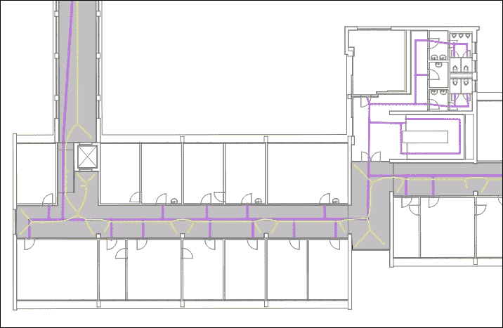
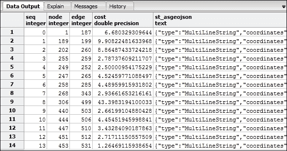
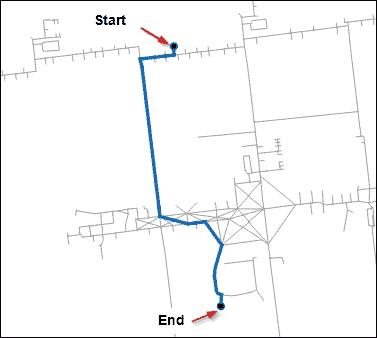
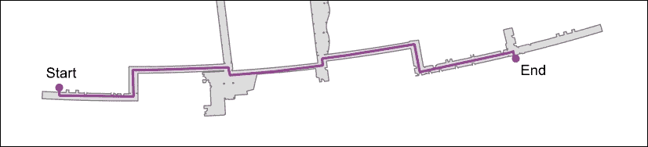
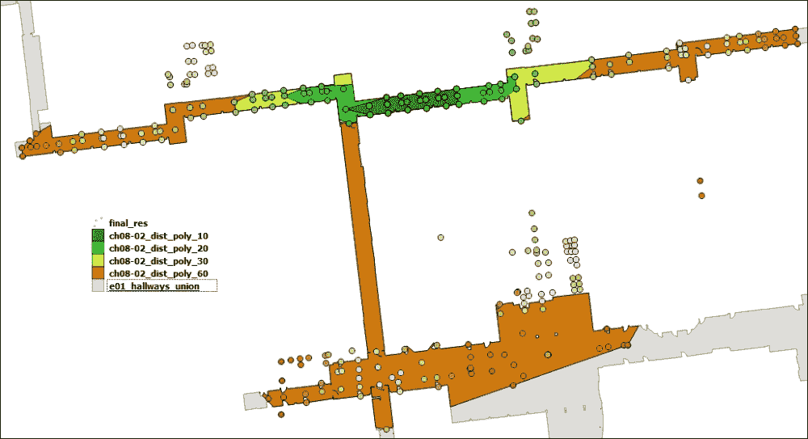
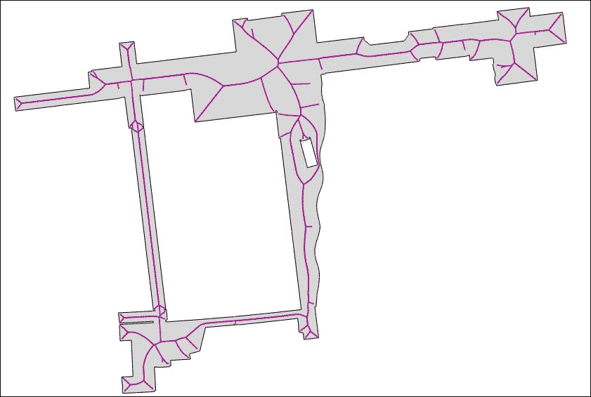
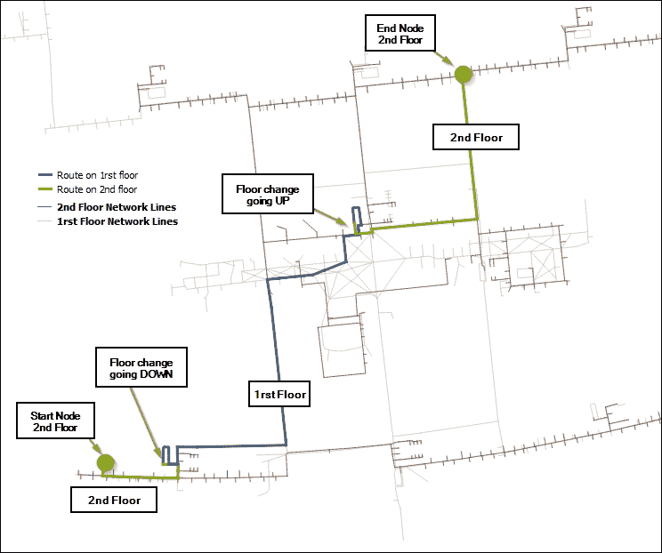

# 第八章：网络路由分析

在本章中，我们将涵盖以下主题：

+   使用 pgRouting 找到 Dijkstra 最短路径

+   使用纯 Python 中的 NetworkX 找到 Dijkstra 最短路径

+   根据室内最短路径生成疏散多边形

+   从多边形创建中心线

+   在 3D 中构建室内路由系统

+   计算室内路线步行时间

# 简介

路由已成为全球道路网络导航设备上的常见功能。如果您想知道如何从点 A 开车到点 B，只需将起始地址和结束地址输入到您的导航软件中，它将在几秒钟内为您计算出最短路线。

这里有一个你可能遇到的场景：把我带到任何大学地理系的 Smith 教授办公室，以便参加我的会议。嗯，抱歉，我的导航软件上没有可用的路由网络。这是提醒您不要忘记在校园内询问您的会议地点方向。

本章全部关于路由，特别是从办公室 *A33*（位于建筑 *E01* 的第一层）到办公室 *B55*（位于建筑 *P7* 的第六层）的室内大型建筑群内的路由。



我们将探索**pgRouting**（PostgreSQL 的一个扩展）强大的路由功能。使用 pgRouting，我们可以使用 Dijkstra、A*和/或 K 最短路径算法中的任何一个来计算最短路径。除了 pgRouting，我们还将使用 NetworkX 库的纯 Python 解决方案，从相同的数据源生成路线。

### 注意

重要提示。请注意使用的输入网络数据集，并确保它位于 EPSG: 3857 坐标系中，这是一个几何笛卡尔米制系统。如果使用 EPSG: 4326 世界坐标系进行路由计算，则必须进行转换。此外，请注意，即使坐标存储在 EPSG: 3857 中，QGIS 也将 GeoJSON 坐标系解释为 EPSG: 4326！

# 使用 pgRouting 找到 Dijkstra 最短路径

现在有几个 Python 库，例如**networkX**和**scikit-image**，可以在栅格或 NumPy 数组上找到最短路径。我们希望专注于矢量源的路由并返回矢量数据集；因此，pgRouting 是我们自然的选择。虽然存在自定义 Python *Dijkstra* 或 *A Star (A*)* 最短路径算法，但找到一个在大网络上表现良好的算法是困难的。PostgreSQL 的`pgRouting`扩展被 OSM 和其他许多项目使用，并且经过了良好的测试。

我们的示例将让我们为了简单起见，从一个楼层的室内网络加载 Shapefile。室内网络由沿着建筑物走廊和开放步行空间的网络线组成，通常通向一扇门。

## 准备工作

对于这个菜谱，我们需要设置带有 pgRouting 扩展的 PostGIS 数据库。在 Windows 机器上，您可以通过下载 Postgresql 9.3 的 ZIP 文件来安装 pgRouting，网址为 [`winnie.postgis.net/download/windows/pg93/buildbot/`](http://winnie.postgis.net/download/windows/pg93/buildbot/)。然后，将 ZIP 文件解压到 `C:\Program Files\PostgreSQL\9.3\`。

对于 Ubuntu Linux 用户，pgRouting 网站在 [`docs.pgrouting.org/2.0/en/doc/src/installation/index.html#ubuntu-debian`](http://docs.pgrouting.org/2.0/en/doc/src/installation/index.html#ubuntu-debian) 解释了详细信息。

要启用此扩展，您有几个选择。首先，如果您已按照 第一章 中所述设置 PostgreSQL，则可以运行命令行 `psql` 工具来激活扩展，如下所示：

```py
> psql py_geoan_cb -c "create extension pgrouting"

```

您可以通过打开 `py_geoan_cb` 数据库，右键单击 **Extensions**，选择 **New Extension...,** 并在 **Name** 字段中向下滚动以找到 `pgRouting` 条目并选择它来使用 **pgAdmin** 用户工具。

现在我们需要一些数据进行路由计算。使用的数据是位于您 `/ch08/geodata/shp/e01_network_lines_3857.shp` 文件夹中的 Shapefile。请参阅 第三章，了解如何导入 Shapefile 或使用 `shp2pgsql`。以下是使用 `ogr2ogr` 导入 Shapefile 的命令行单行命令：

```py
>ogr2ogr -a_srs EPSG:3857 -lco "SCHEMA=geodata" -lco "COLUMN_TYPES=type=varchar,type_id=integer" -nlt MULTILINESTRING -nln ch08_e01_networklines -f PostgreSQL "PG:host=localhost port=5432 user=pluto dbname=py_geoan_cb password=secret" geodata/shp/e01_network_lines_3857.shp

```

注意，您可以使用 第一章 中相同的用户名和密码，或者您自己的定义的用户名和密码。

对于 Windows 用户，您可能需要插入您的 Shapefile 的完整路径，这可能看起来像 `c:\somepath\geodata\shp\e01_network_lines.shp`。我们明确设置 EPSG:3857 Web Mercator 的输入，因为有时 ogr2ogr 估计的投影是错误的，这样就可以确保上传时是正确的。另一个需要注意的事项是我们还明确定义了输出表列类型，因为 `ogr2ogr` 使用数字字段来表示我们的整数，而这与 `pgRouting` 不兼容，所以我们明确传递了字段名称和字段类型的逗号分隔列表。

### 小贴士

要详细了解 ogr2ogr 的工作原理，请访问 [`gdal.org/ogr2ogr.html`](http://gdal.org/ogr2ogr.html)。

我们的新表包括两个字段，一个称为 `type`，另一个称为 `type_id`。`type_id` 变量将存储一个整数，用于识别我们所在的网络段类型，例如楼梯、室内路径或电梯。其余字段对于 `pgRouting` 是必要的，如以下代码所示，包括名为 `source`、`target` 和 `cost` 的列。`source` 和 `target` 列都需要是整数，而 `cost` 字段是双精度类型。这些类型是 pgRouting 函数的要求。

让我们继续添加这些字段到我们的 `ch08_e01_networklines` 表中，借助一些 SQL 查询：

```py
ALTER TABLE geodata.ch08_e01_networklines ADD COLUMN source INTEGER;
ALTER TABLE geodata.ch08_e01_networklines ADD COLUMN target INTEGER;
ALTER TABLE geodata.ch08_e01_networklines ADD COLUMN cost DOUBLE PRECISION;
ALTER TABLE geodata.ch08_e01_networklines ADD COLUMN length DOUBLE PRECISION;
UPDATE geodata.ch08_e01_networklines set length = ST_Length(wkb_geometry);

```

一旦网络数据集有了新的列，我们需要运行创建拓扑的 `pgr_createTopology()` 函数。这个函数接受我们的网络数据集名称、容差值、几何字段名称和主键字段名称。该函数将在 LineString 交点处创建一个新的点表，即网络中的节点，它们具有相同的模式：

```py
SELECT public.pgr_createTopology('geodata.ch08_e01_networklines',
 0.0001, 'wkb_geometry', 'ogc_fid');

```

`pgr_createTopology` 函数的参数包括包含我们的成本和类型字段的网络线 LineStrings 的名称。第二个参数是米为单位的距离容差，然后是几何列的名称和我们的主键唯一标识符 `ogc_fid`。

现在我们已经设置了表和环境，这使我们能够实际创建最短路径，称为迪杰斯特拉路线。

要运行 Python 代码，请确保你已经按照第一章中描述的安装了 `psycopg2` 和 `geojson` 模块，*设置你的地理空间 Python 环境*。

## 如何操作...

1.  查看以下代码并跟随操作：

    ```py
    #!/usr/bin/env python
    # -*- coding: utf-8 -*-

    import psycopg2
    import json
    from geojson import loads, Feature, FeatureCollection

    db_host = "localhost"
    db_user = "pluto"
    db_passwd = "secret"
    db_database = "py_geoan_cb"
    db_port = "5432"

    # connect to DB
    conn = psycopg2.connect(host=db_host, user=db_user, port=db_port,
                            password=db_passwd, database=db_database)

    # create a cursor
    cur = conn.cursor()

    start_x = 1587927.204
    start_y = 5879726.142
    end_x = 1587947.304
    end_y = 5879611.257

    # find the start node id within 1 meter of the given coordinate
    # used as input in routing query start point
    start_node_query = """
        SELECT id FROM geodata.ch08_e01_networklines_vertices_pgr AS p
        WHERE ST_DWithin(the_geom, ST_GeomFromText('POINT(%s %s)',3857), 1);"""

    # locate the end node id within 1 meter of the given coordinate
    end_node_query = """
        SELECT id FROM geodata.ch08_e01_networklines_vertices_pgr AS p
        WHERE ST_DWithin(the_geom, ST_GeomFromText('POINT(%s %s)',3857), 1);
        """

    # get the start node id as an integer
    cur.execute(start_node_query, (start_x, start_y))
    sn = int(cur.fetchone()[0])

    # get the end node id as an integer
    cur.execute(end_node_query, (end_x, end_y))
    en = int(cur.fetchone()[0])

    # pgRouting query to return our list of segments representing
    # our shortest path Dijkstra results as GeoJSON
    # query returns the shortest path between our start and end nodes above
    # using the python .format string syntax to insert a variable in the query
    routing_query = '''
        SELECT seq, id1 AS node, id2 AS edge, ST_Length(wkb_geometry) AS cost,
               ST_AsGeoJSON(wkb_geometry) AS geoj
          FROM pgr_dijkstra(
            'SELECT ogc_fid as id, source, target, st_length(wkb_geometry) as cost
             FROM geodata.ch08_e01_networklines',
            {start_node},{end_node}, FALSE, FALSE
          ) AS dij_route
          JOIN  geodata.ch08_e01_networklines AS input_network
          ON dij_route.id2 = input_network.ogc_fid ;
      '''.format(start_node=sn, end_node=en)

    # run our shortest path query
    cur.execute(routing_query)

    # get entire query results to work with
    route_segments = cur.fetchall()

    # empty list to hold each segment for our GeoJSON output
    route_result = []

    # loop over each segment in the result route segments
    # create the list for our new GeoJSON
    for segment in route_segments:
        geojs = segment[4]
        geojs_geom = loads(geojs)
        geojs_feat = Feature(geometry=geojs_geom, properties={'nice': 'route'})
        route_result.append(geojs_feat)

    # using the geojson module to create our GeoJSON Feature Collection
    geojs_fc = FeatureCollection(route_result)

    # define the output folder and GeoJSON file name
    output_geojson_route = "../geodata/ch08_shortest_path_pgrouting.geojson"

    # save geojson to a file in our geodata folder
    def write_geojson():
        with open(output_geojson_route, "w") as geojs_out:
            geojs_out.write(json.dumps(geojs_fc))

    # run the write function to actually create the GeoJSON file
    write_geojson()

    # clean up and close database curson and connection
    cur.close()
    conn.close()
    ```

1.  如果你在例如 `pgAdmin` 中运行这个查询，得到的结果如下：

    一条路线需要在地图上可视化，而不是表格中。将你新创建的 `/ch08/geodata/ch08_shortest_path_pgrouting.geojson` 文件拖放到 QGIS 中。如果一切顺利，你应该看到这条漂亮的小线，不包括红色箭头和文本：



## 它是如何工作的...

我们的代码之旅从设置数据库连接开始，以便我们可以对上传的数据执行一些查询。

现在我们已经准备好运行一些路由，但是等等，我们如何设置我们想要路由的起点和终点？自然的方法是输入起点和终点的 x，y 坐标对。不幸的是，`pgr_dijkstra()` 函数只接受起点和终点节点 ID。这意味着我们需要从名为 `ch08_e01_networklines_vertices_pgr` 的新表中获取这些节点 ID。为了定位节点，我们使用一个简单的 PostGIS 函数 `ST_Within()` 来找到距离输入坐标一米内的最近节点。在这个查询中，我们的输入几何形状使用 `ST_GeomFromText()` 函数，这样你就可以清楚地看到 SQL 中的事情。现在，我们将执行我们的查询并将响应转换为整数值作为我们的节点 ID。这个节点 ID 就准备好输入到下一个和最终的查询中。

路由查询将为最终路线上的每个段落返回一个序列号、节点、边、成本和几何形状。创建的几何形状是使用 `ST_AsGeoJSON()` PostGIS 函数创建的 GeoJSON，该函数用于生成我们的最终 GeoJSON 输出路线。

pgRouting 的 `pgr_dijkstra()` 函数的输入参数包括一个 SQL 查询、起点节点 ID、终点节点 ID、有向值和一个 `has_rcost` 布尔值。我们将 `directed` 和 `has_rcost` 值设置为 `False`，同时传递 `start_node` 和 `end_node` ID。此查询在生成的路线 ID 和输入网络 ID 之间执行 `JOIN` 操作，以便我们有几何输出以进行可视化。

然后，我们的旅程以处理结果和创建我们的输出 GeoJSON 文件结束。路由查询返回了一个从起点到终点的不以单个 LineString 形式存在的单独段落的列表，而是一组许多 LineString。这就是为什么我们需要创建一个列表，并通过创建我们的 GeoJSON `FeatureCollection` 文件将每个路线段追加到列表中的原因。

在这里，我们使用 `write_geojson()` 函数输出我们的最终 GeoJSON 文件，名为 `ch08_shortest_path_pgrouting.geojson`。

### 注意

注意，这个 GeoJSON 文件位于 EPSG:3857 坐标系中，并被 QGIS 解释为 EPSG:4326，这是不正确的。用于路由的地理数据，如 OSM 数据和自定义数据集，有很多可能的错误、错误和不一致。请注意，这次魔鬼隐藏在数据的细节中，而不是代码中。

将你的 GeoJSON 文件拖放到 QGIS 中，看看你的最终路线看起来如何。

# 使用纯 Python 在 NetworkX 中找到 Dijkstra 最短路径

这个菜谱是一个纯 Python 解决方案，用于计算网络上的最短路径。**NetworkX** 是我们将使用的库，它包含许多算法来解决最短路径问题，包括 Dijkstra ([`networkx.github.io/`](http://networkx.github.io/))。**NetworkX** 依赖于 `numpy` 和 `scipy` 来执行一些图计算并帮助提高性能。在这个菜谱中，我们将仅使用 Python 库来创建基于我们之前菜谱中使用的相同输入 Shapefile 的最短路径。

## 准备工作

首先，使用以下`pip`安装程序在您的机器上安装*NetworkX*：

```py
>> pip install networkx

```

对于网络图算法，NetworkX 需要`numpy`和`scipy`，因此请参阅第一章，*设置您的地理空间 Python 环境*，了解有关这些内容的说明。我们还使用 Shapely 生成我们的几何输出以创建 GeoJSON 文件，因此请检查您是否已安装 Shapely。一个隐藏的要求是 GDAL/OGR 在 NetworkX 的`import Shapefile`函数的后端使用。如前所述，在第一章中，您将找到有关此主题的说明。

表示我们网络的输入数据是一个位于`/ch08/geodata/shp/e01_network_lines_3857.shp`的 Shapefile，其中包含我们已准备好的用于路由的网络数据集，因此请确保您下载了本章。现在您已准备好运行示例。

## 如何操作...

1.  您需要从命令行运行此代码以生成结果输出 GeoJSON 文件，您可以在 QGIS 中打开这些文件，因此请跟随操作：

    ```py
    #!/usr/bin/env python
    # -*- coding: utf-8 -*-
    import networkx as nx
    import numpy as np
    import json
    from shapely.geometry import asLineString, asMultiPoint

    def get_path(n0, n1):
        """If n0 and n1 are connected nodes in the graph,
        this function will return an array of point
        coordinates along the line linking
        these two nodes."""

        return np.array(json.loads(nx_list_subgraph[n0][n1]['Json'])['coordinates'])

    def get_full_path(path):
        """
        Create numpy array line result
        :param path: results of nx.shortest_path function
        :return: coordinate pairs along a path
        """
        p_list = []
        curp = None
        for i in range(len(path)-1):
            p = get_path(path[i], path[i+1])
            if curp is None:
                curp = p
            if np.sum((p[0]-curp)**2) > np.sum((p[-1]-curp)**2):
                p = p[::-1, :]
            p_list.append(p)
            curp = p[-1]
        return np.vstack(p_list)

    def write_geojson(outfilename, indata):
        """
        create GeoGJSOn file
        :param outfilename: name of output file
        :param indata: GeoJSON
        :return: a new GeoJSON file
        """

        with open(outfilename, "w") as file_out:
            file_out.write(json.dumps(indata))

    if __name__ == '__main__':

        # use Networkx to load a Noded shapefile
        # returns a graph where each node is a coordinate pair
        # and the edge is the line connecting the two nodes

        nx_load_shp = nx.read_shp("../geodata/shp/e01_network_lines_3857.shp")

        # A graph is not always connected, so we take the largest connected subgraph
        # by using the connected_component_subgraphs function.
        nx_list_subgraph = list(nx.connected_component_subgraphs(nx_load_shp.to_undirected()))[0]

        # get all the nodes in the network
        nx_nodes = np.array(nx_list_subgraph.nodes())

        # output the nodes to a GeoJSON file to view in QGIS
        network_nodes = asMultiPoint(nx_nodes)
        write_geojson("../geodata/ch08_final_netx_nodes.geojson",
                      network_nodes.__geo_interface__)

        # this number represents the nodes position
        # in the array to identify the node
        start_node_pos = 30
        end_node_pos = 21

        # Compute the shortest path. Dijkstra's algorithm.
        nx_short_path = nx.shortest_path(nx_list_subgraph,
                                         source=tuple(nx_nodes[start_node_pos]),
                                         target=tuple(nx_nodes[end_node_pos]),
                                         weight='distance')

        # create numpy array of coordinates representing result path
        nx_array_path = get_full_path(nx_short_path)

        # convert numpy array to Shapely Linestring
        out_shortest_path = asLineString(nx_array_path)

        write_geojson("../geodata/ch08_final_netx_sh_path.geojson",
                      out_shortest_path.__geo_interface__)
    ```

## 它是如何工作的...

NetworkX 有一个名为`read_shp`的不错函数，可以直接输入 Shapefile。然而，要开始这样做，我们需要定义`write_geojson`函数以将我们的结果输出为 GeoJSON 文件。输入的 Shapefile 是一个完全连接的网络数据集。有时，您可能会发现您的输入没有连接，这个函数调用`connected_component_subgraphs`只使用这些连接的节点来找到节点。内部函数将我们的网络设置为`无向`。

### 注意

此函数不会创建一个连接的网络数据集；这项工作留给你在 QGIS 或其他桌面 GIS 软件中执行。一个解决方案是在 PostgreSQL 中使用 pgRouting 扩展提供的工具执行此操作。

现在，我们将生成网络上的节点并将它们导出为 GeoJSON。这当然不是必需的，但看到节点在地图上的位置以调试您的数据是很好的。如果在生成路线时出现任何问题，您可以非常快速地通过视觉识别它们。

接下来，我们设置起始节点和结束节点的数组位置以计算我们的路线。NetworkX 的`shortest_path`算法要求您定义源节点和目标节点。

### 小贴士

需要注意的一件事是，源和目标是在点数组内的坐标对。

尽管这个点数组很棒，但我们需要一个路径，因此接下来将讨论`get_path`和`get_full_path`函数。我们的`get_path`函数接受两个输入节点，即两个坐标对，并返回沿线的边坐标的 NumPy 数组。紧接着是`get_full_path`函数，它内部使用`get_path`函数输出所有路径和所有路径上的坐标的完整列表。

所有边和相应的坐标随后被追加到一个新的列表中，需要将其合并——因此，使用 NumPy 的 `vstack` 函数。在我们的 `for` 循环内部，我们遍历每条路径，获取边和坐标来构建我们的列表，然后将其连接在一起作为我们的最终 NumPy 数组输出。

Shapely 是与 NumPy 兼容构建的，因此有一个 `asLineString()` 函数可以直接输入坐标的 NumPy 数组。现在我们有了最终 LineString 路线的几何形状，可以使用我们的函数将其导出为 GeoJSON。



# 基于室内最短路径生成疏散多边形

例如，建筑师和交通规划师需要根据各种标准和安全政策来规划建筑所需的出入口位置和数量。一旦建筑建成，设施经理和安全团队通常无法获取这些信息。想象一下，你正在计划一个活动，并想查看在特定时间内可以疏散哪些区域，这些区域受建筑中出入口列表的限制。

在这个练习中，我们想在大型建筑内部的一个特定起点创建一些多边形，显示在 10、20、30 和 60 秒间隔内可以疏散哪些区域。我们假设人们以 5 公里/小时或 1.39 米/秒的速度行走，这是他们的正常行走速度。如果我们恐慌并奔跑，我们的正常奔跑速度将增加到 6.7 米/秒或 24.12 公里/小时。

我们的结果将生成一组多边形，代表基于建筑走廊的疏散区域。我们需要定义疏散开始的起始位置。我们计算的起始点等于之前配方中讨论的路线的起始点，*使用纯 Python 中的 NetworkX 找到 Dijkstra 最短路径*。



此图像显示了使用我们的脚本生成的结果多边形和点。结果使用 QGIS 进行了样式化和可视化。

## 准备工作

此示例使用我们之前配方中加载的网络数据，所以请确保你已经将此数据加载到你的本地 PostgreSQL 数据库中。在数据加载完成后，你将有两个表，`geodata.ch08_e01_networklines_vertices_pgr` 和 `geodata.ch08_e01_networklines`。结合这些表，你需要一个单独的新 Shapefile，用于我们的输入多边形，位于 `/ch08/geodata/shp/e01_hallways_union_3857.shp`，代表用于裁剪我们结果距离多边形的建筑走廊。

## 如何实现...

1.  代码中有许多注释，用于提高清晰度，所以请阅读：

    ```py
    #!/usr/bin/env python
    # -*- coding: utf-8 -*-

    import psycopg2
    import shapefile
    import json
    import shapely.geometry as geometry
    from geojson import loads, Feature, FeatureCollection
    from shapely.geometry import asShape

    # database connection
    db_host = "localhost"
    db_user = "pluto"
    db_passwd = "secret"
    db_database = "py_geoan_cb"
    db_port = "5432"

    # connect to DB
    conn = psycopg2.connect(host=db_host, user=db_user, port=db_port,
                            password=db_passwd, database=db_database)
    cur = conn.cursor()

    def write_geojson(outfilename, indata):
        with open(outfilename, "w") as geojs_out:
            geojs_out.write(json.dumps(indata))

    # center point for creating our distance polygons
    x_start_coord = 1587926.769
    y_start_coord = 5879726.492

    # query including two variables for the x, y POINT coordinate
    start_node_query = """
        SELECT id
        FROM geodata.ch08_e01_networklines_vertices_pgr AS p
        WHERE ST_DWithin(the_geom,
          ST_GeomFromText('POINT({0} {1})',3857),1);
          """.format(x_start_coord, y_start_coord)

    # get the start node id as an integer
    # pass the variables
    cur.execute(start_node_query)
    start_node_id = int(cur.fetchone()[0])

    combined_result = []

    hallways = shapefile.Reader("../geodata/shp/e01_hallways_union_3857.shp")
    e01_hallway_features = hallways.shape()
    e01_hallway_shply = asShape(e01_hallway_features)

    # time in seconds
    evac_times = [10, 20, 30, 60]

    def generate_evac_polys(start_node_id, evac_times ):
        """

        :param start_node_id: network node id to start from
        :param evac_times: list of times in seconds
        :return: none, generates GeoJSON files
        """

        for evac_time in evac_times:

            distance_poly_query = """
                SELECT seq, id1 AS node, cost, ST_AsGeoJSON(the_geom)
                    FROM pgr_drivingDistance(
                            'SELECT ogc_fid AS id, source, target,
                                ST_Length(wkb_geometry)/5000*60*60 AS cost
                             FROM geodata.ch08_e01_networklines',
                            {0}, {1}, false, false
                    ) as ev_dist
                    JOIN geodata.ch08_e01_networklines_vertices_pgr
                    AS networklines
                    ON ev_dist.id1 = networklines.id;
                """.format(start_node_id, evac_time)

            cur.execute(distance_poly_query)
            # get entire query results to work with
            distance_nodes = cur.fetchall()

            # empty list to hold each segment for our GeoJSON output
            route_results = []

            # loop over each segment in the result route segments
            # create the list of our new GeoJSON
            for dist_node in distance_nodes:
                sequence = dist_node[0]     # sequence number
                node = dist_node[1]         # node id
                cost = dist_node[2]         # cost value
                geojs = dist_node[3]        # geometry
                geojs_geom = loads(geojs) # create geojson geom
                geojs_feat = Feature(geometry=geojs_geom,
                        properties={'sequence_num': sequence,
                        'node':node, 'evac_time_sec':cost,
                        'evac_code': evac_time})
                # add each point to total including all points
                combined_result.append(geojs_feat)
                # add each point for individual evacuation time
                route_results.append(geojs_geom)

            # geojson module creates GeoJSON Feature Collection
            geojs_fc = FeatureCollection(route_results)

            # create list of points for each evac time
            evac_time_pts = [asShape(route_segment) for route_segment in route_results]

            # create MultiPoint from our list of points for evac time
            point_collection = geometry.MultiPoint(list(evac_time_pts))

            # create our convex hull polyon around evac time points
            convex_hull_polygon = point_collection.convex_hull

            # intersect convex hull with hallways polygon (ch = convex hull)
            cvex_hull_intersect = e01_hallway_shply.intersection(convex_hull_polygon)

            # export convex hull intersection to geojson
            cvex_hull = cvex_hull_intersect.__geo_interface__

            # for each evac time we create a unique GeoJSON polygon
            output_ply = "../geodata/ch08-03_dist_poly_" + str(evac_time) + ".geojson"

            write_geojson(output_ply, cvex_hull)

            output_geojson_route = "../geodata/ch08-03_dist_pts_" + str(evac_time) + ".geojson"

            # save GeoJSON to a file in our geodata folder
            write_geojson(output_geojson_route, geojs_fc )

    # create or set of evac GeoJSON polygons based
    # on location and list of times in seconds
    generate_evac_polys(start_node_id, evac_times)

    # final result GeoJSON
    final_res = FeatureCollection(combined_result)

    # write to disk
    write_geojson("../geodata/ch08-03_final_dist_poly.geojson", final_res)

    # clean up and close database cursor and connection
    cur.close()
    conn.close()
    ```

## 它是如何工作的...

代码从数据库模板代码和一个用于导出 GeoJSON 结果文件的函数开始。为了创建疏散多边形，我们需要一个输入，即我们网络中距离计算多边形的起始点。如前文所述，我们需要找到网络中距离我们的起始坐标最近的节点。因此，我们运行一个 SQL `select`查询来找到这个距离我们的坐标一米的节点。

接下来，我们定义一个`combined_result`变量，它将存储我们列表中所有指定疏散时间的可到达点。因此，它将每个疏散时间的每个结果存储在一个单独的输出中。

由于我们需要将输出多边形裁剪到走廊内，因此走廊的 Shapefile 被准备为 Shapely 几何形状。我们只对在指定的 10 秒、20 秒、30 秒和 60 秒时间尺度内可以疏散的区域感兴趣。如果区域在走廊之外，你位于建筑之外，换句话说，你很安全。

现在，我们将遍历我们的每个时间间隔，为列表中定义的每个时间创建单独的疏散多边形。`pgRouting`扩展包括一个名为`pgr_drivingDistance()`的函数，该函数返回一个列表，其中包含在指定成本内可到达的节点。此函数的参数包括返回`id`、`source`、`target`和`cost`列的*SQL 查询*。我们的最后四个参数包括表示`start_node_id`的`%s`变量，等于`start_node_id`。然后是存储在`evac_time`变量中的疏散时间（以秒为单位），后面跟着两个 false 值。这两个最后的 false 值用于有向路线或反向成本计算，我们不需要使用。

### 注意

在我们的案例中，成本是根据距离计算的时间值（以秒为单位）。我们假设你以 5 公里/小时的速度行走。成本计算为段长度（以米为单位）除以 5000 米乘以 60 分钟乘以 60 秒，以得出成本值。然后，我们传入起始节点 ID 以及我们指定的疏散时间（以秒为单位）。如果你想按分钟计算，只需从方程中移除一个乘以 60 即可。

每个节点的几何形状是通过在顶点表和具有节点 ID 的节点结果列表之间进行 SQL JOIN 操作来推导的。现在我们已经得到了每个节点在疏散时间内可到达的点的几何形状集合，是时候解析这个结果了。解析是创建我们的 GeoJSON 输出所必需的，它也将点输入到我们的组合输出中，即`combined_result`变量，以及使用 Shapely 中的凸包算法创建的个体疏散时间多边形。

### 提示

使用 alpha 形状可以创建更好的或更逼真的多边形。Alpha 形状从一组点形成多边形，紧贴每个点以保留更逼真的多边形，该多边形遵循点的形状。凸包只是确保所有点都在结果多边形内。要了解 alpha 形状，请查看肖恩·吉利斯在 [`sgillies.net/blog/1155/the-fading-shape-of-alpha/`](http://sgillies.net/blog/1155/the-fading-shape-of-alpha/) 的这篇帖子，以及 [`blog.thehumangeo.com/2014/05/12/drawing-boundaries-in-python/`](http://blog.thehumangeo.com/2014/05/12/drawing-boundaries-in-python/) 的这篇帖子。

代码中包含的模块是名为 `//ch08/code/alpha_shape.py` 的 alpha 形状模块，如果您已经跟随教程进行，可以使用创建的输入数据点尝试，以创建一个更精确的多边形。

我们的 `route_results` 变量存储了用于创建单个凸包多边形的 GeoJSON 几何形状。然后，该变量用于填充每个疏散点集的点列表。它还提供了我们的 GeoJSON 导出的来源，创建 `FeatureCollection`。

最终的计算包括使用 Shapely 创建凸包多边形，紧接着与代表建筑走廊的输入 Shapefile 中的新凸包多边形相交。我们只对显示疏散区域感兴趣，这归结为仅显示建筑内部的区域，因此进行交集操作。

剩余的代码将我们的结果导出到 `/ch08/geodata` 文件夹中的 GeoJSON 文件。请打开此文件夹，并将 GeoJSON 文件拖放到 QGIS 中以可视化您的新结果。您需要获取以下文件：

+   `ch08-03_dist_poly_10.geojson`

+   `ch08-03_dist_poly_20.geojson`

+   `ch08-03_dist_poly_30.geojson`

+   `ch08-03_dist_poly_60.geojson`

+   `ch08-03_final_dis_poly.geojson`

# 从多边形创建中心线

对于任何路由算法要正常工作，我们需要一组网络 LineStrings 来执行最短路径查询。在这里，您当然有一些选择，您可以将这些选择下载到 OSM 数据中清理道路。其次，您可以数字化自己的网络线集合，或者第三，您可以尝试自动生成这些线。

生成此网络 LineString 的过程至关重要，它决定了我们可以生成的路线的质量和类型。在室内环境中，我们没有道路和街道名称；相反，我们有走廊、房间、休息室、电梯、坡道和楼梯。这些特征是我们的道路、桥梁和高速公路隐喻，我们希望为行人创建路线。

我们将向您展示如何从代表走廊的多边形创建基本的网络 LineStrings。



## 准备工作

这个练习要求我们以某种形式在数字上有一个计划，其中多边形表示走廊和其他人们可以行走的空间。我们的走廊多边形由奥地利克拉根福特市的 Alpen-Adria-Universität 提供的。多边形被简化以降低渲染时间。你的输入几何形状越复杂，处理所需的时间就越长。

我们正在使用 `scipy`、`shapely` 和 `numpy` 库，所以如果你还没有这样做，请阅读第一章，*设置你的地理空间 Python 环境*。在 `/ch08/code/` 文件夹中，你可以找到包含 `Centerline` 类的 `centerline.py` 模块。这个模块包含了生成中心线的实际代码，并且被 `ch08/code/ch08-04_centerline.py` 模块导入。

## 如何做到这一点...

让我们深入一些代码：

### 注意

如果你决定立即运行以下代码，请注意，生成中心线是一个缓慢的过程，并且没有针对性能进行优化。在慢速机器上，这段代码可能需要运行 5 分钟，所以请耐心等待，并关注控制台，直到它显示 **完成**。

1.  第一个任务是创建一个创建我们中心线的函数。这是 Filip Todic 原始 `centerlines.py` 类的修改版本：

    ```py
    #!/usr/bin/env python
    # -*- coding: utf-8 -*-
    from shapely.geometry import LineString
    from shapely.geometry import MultiLineString
    from scipy.spatial import Voronoi
    import numpy as np

    class Centerline(object):
        def __init__(self, inputGEOM, dist=0.5):
            self.inputGEOM = inputGEOM
            self.dist = abs(dist)

        def create_centerline(self):
            """
            Calculates the centerline of a polygon.

            Densifies the border of a polygon which is then represented
            by a Numpy array of points necessary for creating the
            Voronoi diagram. Once the diagram is created, the ridges
            located within the polygon are joined and returned.

            Returns:
                a MultiLinestring located within the polygon.
            """

            minx = int(min(self.inputGEOM.envelope.exterior.xy[0]))
            miny = int(min(self.inputGEOM.envelope.exterior.xy[1]))

            border = np.array(self.densify_border(self.inputGEOM, minx, miny))

            vor = Voronoi(border)
            vertex = vor.vertices

            lst_lines = []
            for j, ridge in enumerate(vor.ridge_vertices):
                if -1 not in ridge:
                    line = LineString([
                        (vertex[ridge[0]][0] + minx, vertex[ridge[0]][1] + miny),
                        (vertex[ridge[1]][0] + minx, vertex[ridge[1]][1] + miny)])

                    if line.within(self.inputGEOM) and len(line.coords[0]) > 1:
                        lst_lines.append(line)

            return MultiLineString(lst_lines)

        def densify_border(self, polygon, minx, miny):
            """
            Densifies the border of a polygon by a given factor
            (by default: 0.5).

            The function tests the complexity of the polygons
            geometry, i.e. does the polygon have holes or not.
            If the polygon doesn't have any holes, its exterior
            is extracted and densified by a given factor.
            If the polygon has holes, the boundary of each hole 
            as well as its exterior is extracted and densified
            by a given factor.

            Returns:
                a list of points where each point is 
                represented
                by a list of its
                reduced coordinates.

            Example:
                [[X1, Y1], [X2, Y2], ..., [Xn, Yn]
            """

            if len(polygon.interiors) == 0:
                exterior_line = LineString(polygon.exterior)
                points = self.fixed_interpolation(exterior_line, minx, miny)

            else:
                exterior_line = LineString(polygon.exterior)
                points = self.fixed_interpolation(exterior_line, minx, miny)

                for j in range(len(polygon.interiors)):
                    interior_line = LineString(polygon.interiors[j])
                    points += self.fixed_interpolation(interior_line, minx, miny)

            return points

        def fixed_interpolation(self, line, minx, miny):
            """
            A helping function which is used in densifying
            the border of a polygon.

            It places points on the border at the specified 
            distance. By default the distance is 0.5 (meters)
            which means that the first point will be placed
            0.5 m from the starting point, the second point
            will be placed at the distance of 1.0 m from the
            first point, etc. Naturally, the loop breaks when
            the summarized distance exceeds
            the length of the line.

            Returns:
                a list of points where each point is
                represented by
                a list of its reduced coordinates.

            Example:
                [[X1, Y1], [X2, Y2], ..., [Xn, Yn]
            """

            count = self.dist
            newline = []

            startpoint = [line.xy[0][0] - minx, line.xy[1][0] - miny]
            endpoint = [line.xy[0][-1] - minx, line.xy[1][-1] - miny]
            newline.append(startpoint)

            while count < line.length:
                point = line.interpolate(count)
                newline.append([point.x - minx, point.y - miny])
                count += self.dist

            newline.append(endpoint)

            return newline
    ```

1.  现在我们有一个创建中心线的函数，我们需要一些代码来导入 Shapefile 多边形，运行中心线脚本，并将我们的结果导出为 GeoJSON，以便我们可以在 QGIS 中查看：

    ```py
    #!/usr/bin/env python
    # -*- coding: utf-8 -*-
    import json
    import shapefile
    from shapely.geometry import asShape, mapping
    from centerline import Centerline

    def write_geojson(outfilename, indata):
        with open(outfilename, "w") as file_out:
            file_out.write(json.dumps(indata))

    def create_shapes(shapefile_path):
        '''
        Create our Polygon
        :param shapefile_path: full path to shapefile
        :return: list of Shapely geometries
        '''
        in_ply = shapefile.Reader(shapefile_path)
        ply_shp = in_ply.shapes()

        out_multi_ply = [asShape(feature) for feature in ply_shp]

        print "converting to MultiPolygon: "

        return out_multi_ply

    def generate_centerlines(polygon_shps):
        '''
        Create centerlines
        :param polygon_shps: input polygons
        :return: dictionary of linestrings
        '''
        dct_centerlines = {}

        for i, geom in enumerate(polygon_shps):
            print " now running Centerline creation"
            center_obj = Centerline(geom, 0.5)
            center_line_shply_line = center_obj.create_centerline()
            dct_centerlines[i] = center_line_shply_line

        return dct_centerlines

    def export_center(geojs_file, centerlines):
        '''
        Write output to GeoJSON file
        :param centerlines: input dictionary of linestrings
        :return: write to GeoJSON file
        '''
        with open(geojs_file, 'w') as out:

            for i, key in enumerate(centerlines):
                geom = centerlines[key]
                newline = {'id': key, 'geometry': mapping(geom), 'properties': {'id': key}}

                out.write(json.dumps(newline))

    if __name__ == '__main__':

        input_hallways = "../geodata/shp/e01_hallways_small_3857.shp"
        # run our function to create Shapely geometries
        shply_ply_halls = create_shapes(input_hallways)

        # create our centerlines
        res_centerlines = generate_centerlines(shply_ply_halls)
        print "now creating centerlines geojson"

        # define output file name and location
        outgeojs_file = '../geodata/04_centerline_results_final.geojson'

        # write the output GeoJSON file to disk
        export_center(outgeojs_file, res_centerlines)
    ```

## 它是如何工作的...

从包含 `Centerline` 类的 `centerlines.py` 开始，类内部有很多操作。我们使用 **Voronoi** 多边形并从中提取 **脊** 作为中心线。为了创建这些 Voronoi 多边形，我们需要将我们的多边形转换为表示内部和外部多边形边的 LineStrings。然后，这些边需要被转换为点以供 Voronoi 算法使用。这些点基于一个 *densify* 算法生成，该算法在多边形边缘每隔 0.5 米创建一个点，并围绕整个多边形。这有助于 `Voronoi` 函数创建多边形更精确的表示，从而提供更好的中心线。不利的一面是，这个距离设置得越高，所需的计算能力就越多。

然后，`ch08-04_centerline.py` 代码导入这个新的 `Centerline` 类，并使用我们的走廊多边形实际运行它。输入的多边形是通过 `pyshp` 从 Shapefile 中读取的。然后，我们生成的形状被泵入 `generate_centerlines` 函数，输出一个表示我们中心线的 LineStrings 字典。

然后，在遍历中心线时，我们将输出字典导出为 GeoJSON，使用标准的 `json.dumps` 函数将其导出到我们的文件中。

# 在 3D 中构建室内路由系统

如何通过一个或多个建筑或楼层进行路由是本食谱的主要内容。这当然是最复杂的情况，涉及复杂的数据收集、准备和实施过程。例如，我们无法深入所有复杂的数据细节，从 ACAD 到 PostGIS 的转换；相反，提供的是完成后的数据。

要创建室内路由应用程序，您需要一个已经数字化的路由网络线集，表示人们可以行走的地方。我们的数据代表了一所大学的第一层和第二层。以下截图显示的结果室内路线从第二层开始，沿着楼梯下到第一层，穿过整个建筑，再次上楼梯到第二层，最终到达我们的目的地。



## 准备工作

对于这个食谱，我们需要完成相当多的任务来准备室内 3D 路由。以下是一个快速的需求列表：

+   第一层的 Shapefile（`/ch08/geodata/shp/e01_network_lines_3857.shp`）。

+   第二层的 Shapefile（`/ch08/geodata/shp/e02_network_lines_3857.shp`）。

+   PostgreSQL DB 9.1 + PostGIS 2.1 和 pgRouting 2.0。这些都在本章开头的*使用 pgRouting 找到 Dijkstra 最短路径*食谱中安装了。

+   Python 模块，`psycopg2`和`geojson`。

这里是需要我们执行的任务列表：

1.  按以下方式导入第一层网络线的 Shapefile（如果已完成了导入此 Shapefile 的早期食谱，则跳过此步骤）：

    ```py
    ogr2ogr -a_srs EPSG:3857 -lco "SCHEMA=geodata" -lco "COLUMN_TYPES=type=varchar,type_id=integer" -nlt MULTILINESTRING -nln ch08_e01_networklines -f PostgreSQL "PG:host=localhost port=5432 user=postgres dbname=py_geoan_cb password=air" geodata/shp/e01_network_lines_3857.shp

    ```

1.  按以下方式导入第二层网络线的 Shapefile：

    ```py
    ogr2ogr -a_srs EPSG:3857 -lco "SCHEMA=geodata" -lco "COLUMN_TYPES=type=varchar,type_id=integer" -nlt MULTILINESTRING -nln ch08_e02_networklines -f PostgreSQL "PG:host=localhost port=5432 user=postgres dbname=py_geoan_cb password=air" geodata/shp/e02_network_lines_3857.shp

    ```

1.  为第一层网络线分配路由列（如果已在之前的食谱中完成，则跳过此步骤）：

    ```py
    ALTER TABLE geodata.ch08_e01_networklines ADD COLUMN source INTEGER;
    ALTER TABLE geodata.ch08_e01_networklines ADD COLUMN target INTEGER;
    ALTER TABLE geodata.ch08_e01_networklines ADD COLUMN cost DOUBLE PRECISION;
    ALTER TABLE geodata.ch08_e01_networklines ADD COLUMN length DOUBLE PRECISION;
    UPDATE geodata.ch08_e01_networklines set length = ST_Length(wkb_geometry);

    ```

1.  按以下方式为第二层网络线分配路由列：

    ```py
    ALTER TABLE geodata.ch08_e02_networklines ADD COLUMN source INTEGER;
    ALTER TABLE geodata.ch08_e02_networklines ADD COLUMN target INTEGER;
    ALTER TABLE geodata.ch08_e02_networklines ADD COLUMN cost DOUBLE PRECISION;
    ALTER TABLE geodata.ch08_e02_networklines ADD COLUMN length DOUBLE PRECISION;
    UPDATE geodata.ch08_e02_networklines set length = ST_Length(wkb_geometry);

    ```

1.  创建允许您在 3D 网络线上进行路由的 pgRouting 3D 函数。这两个 PostgreSQL 函数至关重要，因为它们反映了现在已转换为允许 3D 路由的原始 pgRouting 2D 函数。安装顺序也非常重要，所以请确保首先安装`pgr_pointtoid3d.sql`！这两个 SQL 文件都位于您的`/ch08/code/`文件夹中：

    ```py
    psql -U username -d py_geoan_cb -a -f pgr_pointtoid3d.sql

    ```

1.  接下来，安装`pgr_createTopology3d.sql`。这是原始版本的修改版，现在使用我们新的`pgr_pointtoid3d`函数如下：

    ```py
    psql -U username -d py_geoan_cb -a -f pgr_createTopology3d.sql

    ```

1.  现在我们需要将我们的两层楼网络线合并成一个单一的 3D LineString 表，我们将在该表上执行 3D 路由。这组 SQL 命令已为您存储在：

    ```py
    psql -U username -d py_geoan_cb -a -f indrz_create_3d_networklines.sql

    ```

理解 3D 路由表的精确创建非常重要，因为它允许 3D 路由查询。因此，我们的代码如下列出，带有 SQL 注释描述我们在每个步骤中做什么：

```py
-- if not, go ahead and update
-- make sure tables dont exist

drop table if exists geodata.ch08_e01_networklines_routing;
drop table if exists geodata.ch08_e02_networklines_routing;

-- convert to 3d coordinates with EPSG:3857
SELECT ogc_fid, ST_Force_3d(ST_Transform(ST_Force_2D(st_geometryN(wkb_geometry, 1)),3857)) AS wkb_geometry,
 type_id, cost, length, 0 AS source, 0 AS target
 INTO geodata.ch08_e01_networklines_routing
 FROM geodata.ch08_e01_networklines;

SELECT ogc_fid, ST_Force_3d(ST_Transform(ST_Force_2D(st_geometryN(wkb_geometry, 1)),3857)) AS wkb_geometry,
 type_id, cost, length, 0 AS source, 0 AS target
 INTO geodata.ch08_e02_networklines_routing
 FROM geodata.ch08_e02_networklines;

-- fill the 3rd coordinate according to their floor number
UPDATE geodata.ch08_e01_networklines_routing SET wkb_geometry=ST_Translate(ST_Force_3Dz(wkb_geometry),0,0,1);
UPDATE geodata.ch08_e02_networklines_routing SET wkb_geometry=ST_Translate(ST_Force_3Dz(wkb_geometry),0,0,2);

UPDATE geodata.ch08_e01_networklines_routing SET length =ST_Length(wkb_geometry);
UPDATE geodata.ch08_e02_networklines_routing SET length =ST_Length(wkb_geometry);

-- no cost should be 0 or NULL/empty
UPDATE geodata.ch08_e01_networklines_routing SET cost=1 WHERE cost=0 or cost IS NULL;
UPDATE geodata.ch08_e02_networklines_routing SET cost=1 WHERE cost=0 or cost IS NULL;

-- update unique ids ogc_fid accordingly
UPDATE geodata.ch08_e01_networklines_routing SET ogc_fid=ogc_fid+100000;
UPDATE geodata.ch08_e02_networklines_routing SET ogc_fid=ogc_fid+200000;

-- merge all networkline floors into a single table for routing
DROP TABLE IF EXISTS geodata.networklines_3857;
SELECT * INTO geodata.networklines_3857 FROM
(
(SELECT ogc_fid, wkb_geometry, length, type_id, length*o1.cost as total_cost,
 1 as layer FROM geodata.ch08_e01_networklines_routing o1) UNION
(SELECT ogc_fid, wkb_geometry, length, type_id, length*o2.cost as total_cost,
 2 as layer FROM geodata.ch08_e02_networklines_routing o2))
as foo ORDER BY ogc_fid;

CREATE INDEX wkb_geometry_gist_index
 ON geodata.networklines_3857 USING gist (wkb_geometry);

CREATE INDEX ogc_fid_idx
 ON geodata.networklines_3857 USING btree (ogc_fid ASC NULLS LAST);

CREATE INDEX network_layer_idx
 ON geodata.networklines_3857
 USING hash
 (layer);

-- create populate geometry view with info
SELECT Populate_Geometry_Columns('geodata.networklines_3857'::regclass);

-- update stairs, ramps and elevators to match with the next layer
UPDATE geodata.networklines_3857 SET wkb_geometry=ST_AddPoint(wkb_geometry,
 ST_EndPoint(ST_Translate(wkb_geometry,0,0,1)))
 WHERE type_id=3 OR type_id=5 OR type_id=7;
-- remove the second last point
UPDATE geodata.networklines_3857 SET wkb_geometry=ST_RemovePoint(wkb_geometry,ST_NPoints(wkb_geometry) - 2)
 WHERE type_id=3 OR type_id=5 OR type_id=7;

-- add columns source and target
ALTER TABLE geodata.networklines_3857 add column source integer;
ALTER TABLE geodata.networklines_3857 add column target integer;
ALTER TABLE geodata.networklines_3857 OWNER TO postgres;

-- we dont need the temporary tables any more, delete them
DROP TABLE IF EXISTS geodata.ch08_e01_networklines_routing;
DROP TABLE IF EXISTS geodata.ch08_e02_networklines_routing;

-- remove route nodes vertices table if exists
DROP TABLE IF EXISTS geodata.networklines_3857_vertices_pgr;
-- building routing network vertices (fills source and target columns in those new tables)
SELECT public.pgr_createTopology3d('geodata.networklines_3857', 0.0001, 'wkb_geometry', 'ogc_fid');

```

哇，这需要处理很多东西，现在我们实际上已经准备好运行并创建一些 3D 路由了。太棒了！

## 如何操作...

1.  让我们深入一些带有注释的代码，供你阅读愉快：

    ```py
    #!/usr/bin/env python
    # -*- coding: utf-8 -*-

    import psycopg2
    import json
    from geojson import loads, Feature, FeatureCollection

    db_host = "localhost"
    db_user = "pluto"
    db_passwd = "secret"
    db_database = "py_geoan_cb"
    db_port = "5432"

    # connect to DB
    conn = psycopg2.connect(host=db_host, user=db_user, port=db_port,
                            password=db_passwd, database=db_database)

    # create a cursor
    cur = conn.cursor()

    # define our start and end coordinates in EPSG:3857
    # set start and end floor level as integer 0,1,2 for example
    x_start_coord = 1587848.414
    y_start_coord = 5879564.080
    start_floor = 2

    x_end_coord = 1588005.547
    y_end_coord = 5879736.039
    end_floor = 2

    # find the start node id within 1 meter of the given coordinate
    # select from correct floor level using 3D Z value
    # our Z Value is the same as the floor number as an integer
    # used as input in routing query start point
    start_node_query = """
        SELECT id FROM geodata.networklines_3857_vertices_pgr AS p
        WHERE ST_DWithin(the_geom, ST_GeomFromText('POINT(%s %s)',3857), 1)
        AND ST_Z(the_geom) = %s;"""

    # locate the end node id within 1 meter of the given coordinate
    end_node_query = """
        SELECT id FROM geodata.networklines_3857_vertices_pgr AS p
        WHERE ST_DWithin(the_geom, ST_GeomFromText('POINT(%s %s)',3857), 1)
        AND ST_Z(the_geom) = %s;"""

    # run our query and pass in the 3 variables to the query
    # make sure the order of variables is the same as the 
    # order in your query
    cur.execute(start_node_query, (x_start_coord, y_start_coord, start_floor))
    start_node_id = int(cur.fetchone()[0])

    # get the end node id as an integer
    cur.execute(end_node_query, (x_end_coord, y_end_coord, end_floor))
    end_node_id = int(cur.fetchone()[0])

    # pgRouting query to return our list of segments representing
    # our shortest path Dijkstra results as GeoJSON
    # query returns the shortest path between our start and end nodes above
    # in 3D traversing floor levels and passing in the layer value = floor

    routing_query = '''
        SELECT seq, id1 AS node, id2 AS edge, ST_Length(wkb_geometry) AS cost, layer,
               ST_AsGeoJSON(wkb_geometry) AS geoj
          FROM pgr_dijkstra(
            'SELECT ogc_fid as id, source, target, st_length(wkb_geometry) AS cost, layer
             FROM geodata.networklines_3857',
            %s, %s, FALSE, FALSE
          ) AS dij_route
          JOIN  geodata.networklines_3857 AS input_network
          ON dij_route.id2 = input_network.ogc_fid ;
      '''

    # run our shortest path query
    cur.execute(routing_query, (start_node_id, end_node_id))

    # get entire query results to work with
    route_segments = cur.fetchall()

    # empty list to hold each segment for our GeoJSON output
    route_result = []

    # loop over each segment in the result route segments
    # create the list of our new GeoJSON
    for segment in route_segments:
        print segment
        seg_cost = segment[3]     # cost value
        layer_level = segment[4]  # floor number
        geojs = segment[5]        # geojson coordinates
        geojs_geom = loads(geojs) # load string to geom
        geojs_feat = Feature(geometry=geojs_geom, properties={'floor': layer_level, 'cost': seg_cost})
        route_result.append(geojs_feat)

    # using the geojson module to create our GeoJSON Feature Collection
    geojs_fc = FeatureCollection(route_result)

    # define the output folder and GeoJSON file name
    output_geojson_route = "../geodata/ch08_indoor_3d_route.geojson"

    # save geojson to a file in our geodata folder
    def write_geojson():
        with open(output_geojson_route, "w") as geojs_out:
            geojs_out.write(json.dumps(geojs_fc))

    # run the write function to actually create the GeoJSON file
    write_geojson()

    # clean up and close database curson and connection
    cur.close()
    conn.close()
    ```

## 它是如何工作的...

使用`psycopg2`模块，我们可以连接到数据库中我们新奇的表格并运行一些查询。第一个查询集基于*x*、*y*和*Z*海拔值找到起始和结束节点。*Z*值非常重要；否则，可能会选择错误的节点。*Z*值与层/楼层值一一对应。分配给我们的`networklines_3857`数据集的 3D 海拔数据对于一楼是简单的一米，对于二楼是两米。这样可以使事情简单且易于记忆，而不必实际使用楼层的高度，当然，如果你想的话，你也可以这样做。

由于我们的数据现在已经是 3D 的，我们的 3D 路由能够像任何其他正常的 2D 路由查询一样运行，这要归功于我们新增的两个 pgRouting 函数。查询通过，选择我们的数据，并返回一个漂亮的 GeoJSON 字符串。

你之前已经见过这段剩余的代码了。它将结果导出到磁盘上的 GeoJSON 文件中，这样你就可以在 QGIS 中打开它进行查看。我们已经成功地向新的 GeoJSON 文件添加了一些属性，包括楼层号、以距离为单位的成本以及识别一个段是室内路径还是楼梯形式的路径段类型。

# 计算室内路线步行时间

如果不让我们知道到达室内步行路径需要多长时间，我们的室内路由应用程序就不会完整，对吧？我们将创建几个小的函数，你可以将它们插入到前面的食谱中的代码中，以打印出路线步行时间。

## 如何实现...

1.  不再拖延，让我们看看一些代码：

    ```py
    #!/usr/bin/env python
    # -*- coding: utf-8 -*-

    def format_walk_time(walk_time):
        """
        takes argument: float walkTime in seconds
        returns argument: string time  "xx minutes xx seconds"
        """
        if walk_time > 0.0:
            return str(int(walk_time / 60.0)) + " minutes " + str(int(round(walk_time % 60))) + " seconds"
        else:
            return "Walk time is less than zero! Something is wrong"

    def calc_distance_walktime(rows):
        """
        calculates distance and walk_time.
        rows must be an array of linestrings --> a route, retrieved from the DB.
        rows[5]: type of line (stairs, elevator, etc)
        rows[3]: cost as length of segment
        returns a dict with key/value pairs route_length, walk_time
        """

        route_length = 0
        walk_time = 0

        for row in rows:

            route_length += row[3]
            #calculate walk time
            if row[5] == 3 or row[5] == 4:  # stairs
                walk_speed = 1.2 # meters per second m/s
            elif row[5] == 5 or row[5] == 6:  # elevator
                walk_speed = 1.1  # m/s
            else:
                walk_speed = 1.39 # m/s

            walk_time += (row[3] / walk_speed)

        length_format = "%.2f" % route_length
        real_time = format_walk_time(walk_time)
        print {"route_length": length_format, "walk_time": real_time}
    ```

1.  你的结果应该显示如下字典：

    ```py
    {'walk_time': '4 minutes 49 seconds', 'route_length': '397.19'}

    ```

    这里假设你已经将这些函数放入了前面的食谱中，并调用了函数将结果打印到控制台。

## 它是如何工作的...

我们有两个简单的函数来为我们的室内路线创建步行时间。第一个函数，称为`format_walk_time()`，简单地将结果时间转换为人类友好的形式，分别显示所需的分钟和秒。

第二个函数`calc_distance_walktime()`执行工作，期望一个包含距离的列表对象。然后，这个距离被加到每个路线段中，形成一个存储在`route_length`变量中的总距离值。然后，我们通过调用`format_walk_time`函数创建`real_time`变量，该函数传递秒数的`walk_time`值。

现在，你为你的应用程序拥有了一个复杂的室内路线，并指定了步行时间。
