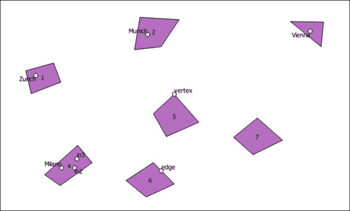
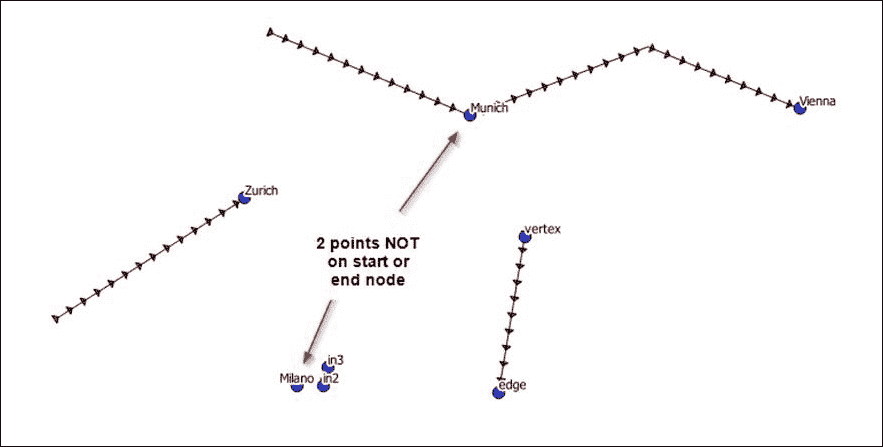
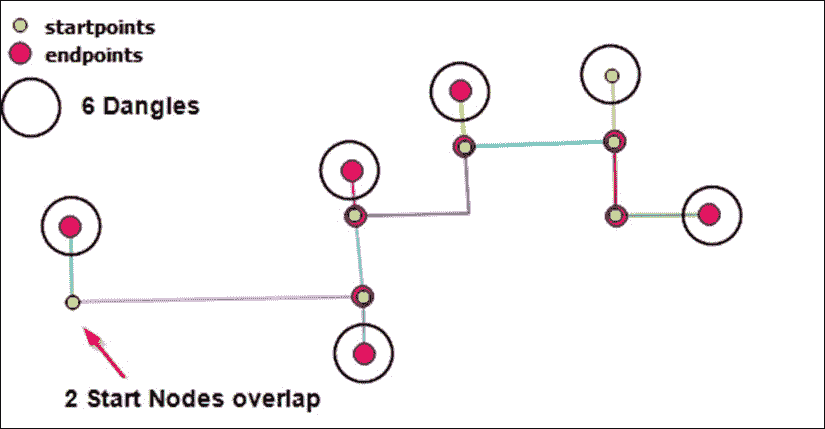
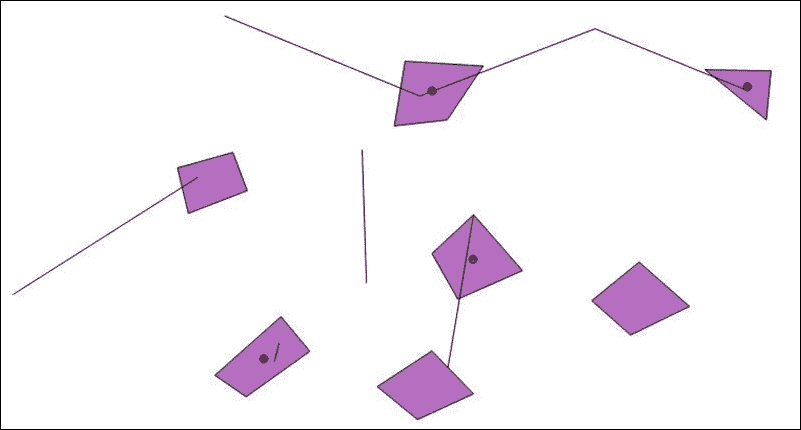

# 第九章. 拓扑检查和数据验证

本章将涵盖以下主题：

+   创建规则 - 多边形内只有一个点

+   一个点必须位于线的起始和结束节点上

+   线字符串不得重叠

+   线字符串不得有悬垂线

+   多边形质心必须位于线的一定距离内

# 介绍

拓扑规则允许你强制执行和测试不同几何集之间的空间关系。本章将构建一个开源的拓扑规则集，你可以从命令行运行或将其集成到你的 Python 程序中。

DE-9IM（九相交模型）描述的空间关系包括等于、不相交、相交、接触、交叉、包含、包含于和重叠。然而，这些关系的确切联系对于大多数初学者来说并不明确。我们指的是我们的几何类型（点、线字符串和多边形）的内部、边界和外部，这些类型直接用于执行拓扑检查。具体如下：

+   **内部**：这指的是整个形状除了其边界之外的部分。所有几何类型都有内部。

+   **边界**：这指的是线特征所有线性部分的端点或多边形的线性轮廓。只有线和多边形有边界。

+   **外部**：这指的是形状的外部区域。所有几何类型都有外部。介绍

下表以更正式的措辞总结了拓扑几何：

| 几何子类型 | 内部（I） | 边界（B） | 外部（E） |
| --- | --- | --- | --- |
| 点、多点 | 点或多个点 | 空集 | 不在内部或边界内的点 |
| 线字符串、线 | 移除边界点后留下的点 | 两个端点 | 不在内部或边界内的点 |
| 线性环 | 线性环上的所有点 | 空集 | 不在内部或边界内的点 |
| 多线字符串 | 移除边界点后留下的点 | 其元素曲线边界中的奇数个点 | 不在内部或边界内的点 |
| 多边形 | 环内的点 | 环集 | 不在内部或边界内的点 |
| 多多边形 | 环内的点 | 其多边形的环集 | 不在内部或边界内的点 |

主几何类型（如多边形、边界和外部）的定义由**开放地理空间联盟**（**OGC**）描述。

在下面的菜谱中，我们将探讨一些可以应用于任何项目的自定义拓扑规则，为你创建自己的规则集打下基础。

# 创建规则 - 多边形内只有一个点

在 GIS 历史很久以前，多边形内不出现多于一个点非常重要，因为一个多边形一个点是展示具有相关属性和 ID 的拓扑干净多边形的标准方式。今天，它对于许多其他原因仍然很重要，例如根据多边形内的点分配属性。我们必须在多边形和点之间执行空间连接来分配这些宝贵的属性。如果两个点位于一个多边形内，你将使用哪些属性？这个配方是关于创建一个规则来检查你的数据，以确保每个多边形内只有一个点。如果这个测试失败，你将得到一个错误列表；如果它通过，测试将返回`True`。



## 准备中

数据在这里再次扮演着核心角色，所以请检查你的`/ch09/geodata/`文件夹是否已准备好，包含两个包含`topo_polys.shp`和`topo_points.shp`的输入 Shapefiles。Shapely 库执行几何拓扑测试。如果你到目前为止一直跟着做，那么你已经安装了它；如果没有，现在通过参考第一章，*设置你的地理空间 Python 环境*来安装它。

## 如何做...

1.  你现在将检查每个多边形是否包含一个点，方法如下：

    ```py
    #!/usr/bin/env python
    # -*- coding: utf-8 -*-
    #
    # for every polygon in a polygon layer there can only be
    # one point object located in each polygon
    # the number of points per polygon can be defined by the user
    from utils import shp2_geojson_obj
    from utils import create_shply_multigeom
    import json

    in_shp_poly = "../geodata/topo_polys.shp"
    in_shp_point = "../geodata/topo_points.shp"

    ply_geojs_obj = shp2_geojson_obj(in_shp_poly)
    pt_geojs_obj = shp2_geojson_obj(in_shp_point)

    shply_polys = create_shply_multigeom(ply_geojs_obj, "MultiPolygon")
    shply_points = create_shply_multigeom(pt_geojs_obj, "MultiPoint")

    def valid_point_in_poly(polys, points):
        """
        Determine if every polygon contains max one point and that each
        point is not located on the EDGE or Vertex of the polygon
        :param point: Point data set
        :param poly: Polygon data set
        :return: True or False if False a dictionary containing polygon ids
        that contain no or multiple points
        """
        pts_in_polys = []
        pts_touch_plys = []

        pts_plys_geom = []
        pts_touch_geom = []

        # check each polygon for number of points inside
        for i, poly in enumerate(polys):

            pts_in_this_ply = []
            pts_touch_this_ply = []

            for pt in points:
                if poly.touches(pt):
                    pts_touch_this_ply.append(
                        {'multipoint_errors_touches': pt.__geo_interface__, 'poly_id': i,
                         'point_coord': pt.__geo_interface__})

                if poly.contains(pt):
                    pts_in_this_ply.append({'multipoint_contains': pt.__geo_interface__})

            pts_in_polys.append(len(pts_in_this_ply)) 
            pts_touch_plys.append(len(pts_touch_this_ply))

            # create list of point geometry errors
            pts_plys_geom.append(pts_in_this_ply)
            pts_touch_geom.append(pts_touch_this_ply)

        # identify if we have more than one point per polygon or
        # identify if no points are inside a polygon
        no_good = dict()
        all_good = True

        # loop over list containing the number of pts per polygon
        # each item in list is an integer representing the number
        # of points located inside a particular polygon [4,1,0]
        # represents 4 points in polygon 1, 1 point in poly 2, and
        # 0 points in polygon 3
        for num, res in enumerate(pts_in_polys):

            if res == 1:
                # this polygon is good and only has one point inside
                # no points on the edge or on the vertex of polygon
                continue
                # no_good['poly num ' + str(num)] = "excellen only 1 point in poly"
            elif res > 1:
                # we have more than one point either inside, on edge
                # or vertex of a polygon
                no_good['poly num ' + str(num)] = str(res) + " points in this poly"
                all_good = False
            else:
                # last case no points in this polygon
                no_good['poly num ' + str(num)] = "No points in this poly"
                all_good = False

        if all_good:
            return all_good
        else:
            bad_list = []
            for pt in pts_plys_geom:
                fgeom = {}
                for res in pt:
                    if 'multipoint_contains' in res:
                        hui = res['multipoint_contains']
                        print hui
                        fgeom['geom'] = hui
                bad_list.append(fgeom)
            return bad_list
            # return no_good,pts_in_polys2 # [4,0,1]

    valid_res = valid_point_in_poly(shply_polys, shply_points)

    final_list = []
    for res in valid_res:
        if 'geom' in res:
            geom = res['geom']
            final_list.append(geom)

    final_gj = {"type": "GeometryCollection", "geometries": final_list}
    print json.dumps(final_gj)
    ```

1.  这结束了使用两个输入 Shapefiles 的实践测试。现在为了你的测试乐趣，这里有一个简单的单元测试，用于分解简单的点在多边形中的测试。以下测试代码位于`ch09/code/ch09-01_single_pt_test_in_poly.py`文件中：

    ```py
    # -*- coding: utf-8 -*-
    import unittest
    from shapely.geometry import Point
    from shapely.geometry import Polygon

    class TestPointPerPolygon(unittest.TestCase):
        def test_inside(self):

            ext = [(0, 0), (0, 2), (2, 2), (2, 0), (0, 0)]
            int = [(1, 1), (1, 1.5), (1.5, 1.5), (1.5, 1)]
            poly_with_hole = Polygon(ext,[int])

            polygon = Polygon([(0, 0), (0, 10), (10, 10),(0, 10)])

            point_on_edge = Point(5, 10)
            point_on_vertex = Point(10, 10)
            point_inside = Point(5, 5)
            point_outside = Point(20,20)
            point_in_hole = Point(1.25, 1.25)

            self.assertTrue(polygon.touches(point_on_vertex))
            self.assertTrue(polygon.touches(point_on_edge))
            self.assertTrue(polygon.contains(point_inside))
            self.assertFalse(polygon.contains(point_outside))
            self.assertFalse(point_in_hole.within(poly_with_hole))

    if __name__ == '__main__':
        unittest.main()
    ```

    这个简单的测试应该能正常运行。如果你想要破坏它来查看会发生什么，请将最后的调用更改为以下内容：

    ```py
    self.assertTrue(point_in_hole.within(poly_with_hole)
    ```

1.  这将产生以下输出：

    ```py
    Failure
    Traceback (most recent call last):
     File "/home/mdiener/ch09/code/ch09-01_single_pt_test_in_poly.py", line 26, in test_inside
     self.assertTrue(point_in_hole.within(poly_with_hole))
    AssertionError: False is not true

    ```

## 它是如何工作的...

我们有很多事情要测试，以确定多边形内是否只有一个点。我们将从定义的内部和外部开始。回顾本章的介绍，多边形的内部、外部和边界可以逻辑地定义。然后，我们明确地定义输入点的位置，即位于多边形内部且不在多边形边界、边或顶点上的点。此外，我们添加的准则是一个多边形只允许一个点，因此如果有`0`个或更多点位于任何给定的多边形内，将会产生错误。

我们的空间谓词包括接触以确定点是否在顶点或边上。如果接触返回`True`，则我们的点位于边或顶点上，这意味着它不在内部。这之后是`contains`方法，它检查点是否在我们的多边形内。在这里，我们检查多边形内是否没有超过一个点。

代码通过导入和转换 Shapefile 来处理 `Shapely` 模块执行的处理。当我们处理多边形时，我们创建几个列表来跟踪它们之间发现的关系类型，以便我们可以在最后将它们加起来，这样我们就可以计算是否有一个或多个点在单个多边形内部。

我们最后的代码段运行一系列简单的函数调用，测试点是否在多边形内部或外部的几个场景。最后的调用通过具有多个多边形和点的 Shapefiles 进行更现实的测试。这会返回 `True` 如果没有发现错误，或者返回一个 GeoJSON 打印输出，显示错误的位置。

# 一个点必须只位于线的起始和结束节点上

一个由连接边组成的路由网络可能包含一些与表示为点的道路交点相关的路由逻辑。当然，这些点必须精确地位于线的起始或结束位置，以便识别这些交叉口。一旦找到交叉口，可以在属性中应用各种规则来控制你的路由，例如。

一个典型的例子是将转弯限制建模为点：



## 如何做...

我们方便的 `utils.py` 模块位于 `trunk` 文件夹中，它帮助我们处理一些日常任务，例如导入 Shapefile 并将其转换为 Shapely 几何对象，以便我们进行处理。

1.  现在让我们创建点检查代码如下：

    ```py
    #!/usr/bin/env python
    # -*- coding: utf-8 -*-

    from utils import shp2_geojson_obj
    from utils import create_shply_multigeom
    from utils import out_geoj
    from shapely.geometry import Point, MultiPoint

    in_shp_line = "../geodata/topo_line.shp"
    in_shp_point = "../geodata/topo_points.shp"

    # create our geojson like object from a Shapefile
    shp1_data = shp2_geojson_obj(in_shp_line)
    shp2_data = shp2_geojson_obj(in_shp_point)

    # convert the geojson like object to shapely geometry
    shp1_lines = create_shply_multigeom(shp1_data, "MultiLineString")
    shp2_points = create_shply_multigeom(shp2_data, "MultiPoint")

    def create_start_end_pts(lines):
        '''
        Generate a list of all start annd end nodes
        :param lines: a Shapely geometry LineString
        :return: Shapely multipoint object which includes
                 all the start and end nodes
        '''
        list_end_nodes = []
        list_start_nodes = []

        for line in lines:
            coords = list(line.coords)

            line_start_point = Point(coords[0])
            line_end_point = Point(coords[-1])

            list_start_nodes.append(line_start_point)
            list_end_nodes.append(line_end_point)

        all_nodes = list_end_nodes + list_start_nodes

        return MultiPoint(all_nodes)

    def check_points_cover_start_end(points, lines):
        '''

        :param points: Shapely point geometries
        :param lines:Shapely linestrings
        :return:
        '''

        all_start_end_nodes = create_start_end_pts(lines)

        bad_points = []
        good_points = []
        if len(points) > 1:
            for pt in points:
                if pt.touches(all_start_end_nodes):
                    print "touches"
                if pt.disjoint(all_start_end_nodes):
                    print "disjoint" # 2 nodes
                    bad_points.append(pt)
                if pt.equals(all_start_end_nodes):
                    print "equals"
                if pt.within(all_start_end_nodes):
                    print "within" # all our nodes on start or end
                if pt.intersects(all_start_end_nodes):
                    print "intersects"
                    good_points.append(pt)
        else:
            if points.intersects(all_start_end_nodes):
                print "intersects"
                good_points.append(points)
            if points.disjoint(all_start_end_nodes):
                print "disjoint"
                good_points.append(points)

        if len(bad_points) > 1:
            print "oh no 1 or more points are NOT on a start or end node"
            out_geoj(bad_points, '../geodata/points_bad.geojson')
            out_geoj(good_points, '../geodata/points_good.geojson')

        elif len(bad_points) == 1:
            print "oh no your input single point is NOT on start or end node"

        else:
            print "super all points are located on a start or end node" \
                  "NOTE point duplicates are NOT checked"

    check_points_cover_start_end(shp2_points, shp1_lines)
    ```

## 它是如何工作的...

你可以用多种不同的方法来解决这个问题。这种方法可能不是非常高效，但它演示了如何解决空间问题。

我们的逻辑从创建一个函数开始，用于找到输入 LineString 的所有真实起始和结束节点位置。Shapely 通过切片帮助我们获取每条线的第一个和最后一个坐标对，从而提供一些简单的列表。然后，这两个集合被合并成一个单独的列表持有者，以便检查所有节点。

第二个函数实际上执行检查，以确定我们的点是否位于主列表中的起始或结束节点。我们首先通过调用第一个函数来创建起始和结束节点的主列表，以便进行比较。现在，如果我们的输入有多个点，我们将遍历每个点并检查几个空间关系。其中只有两个真正有趣，那就是不相交和相交。这些通过显示哪些点是好的，哪些不是，来给出我们的答案。

### 注意

可以使用 within 语句代替 intersect，但之所以没有选择它，仅仅是因为它并不总是被初学者正确理解，而 intersects 似乎更容易理解。

剩余的检查只是将不良和良好点的列表导出到一个 GeoJSON 文件中，您可以在 QGIS 中打开它来可视化。

# LineStrings 不能重叠

重叠的线通常很难找到，因为你无法在地图上看到它们。它们可能是故意的，例如，可能重叠的公交线路。这项练习旨在发现这些重叠的线，无论好坏。

以下图显示了两组输入线字符串，你可以清楚地看到它们重叠的地方，但这是一种地图学的视觉检查。我们需要在许多你无法如此清晰地看到的线路上工作。


## 如何做到这一点...

1.  让我们深入代码：

    ```py
    #!/usr/bin/env python
    # -*- coding: utf-8 -*-

    from utils import shp2_geojson_obj
    from utils import create_shply_multigeom
    from utils import out_geoj

    in_shp_line = "../geodata/topo_line.shp"
    in_shp_overlap = "../geodata/topo_line_overlap.shp"

    shp1_data = shp2_geojson_obj(in_shp_line)
    shp2_data = shp2_geojson_obj(in_shp_overlap)

    shp1_lines = create_shply_multigeom(shp1_data, "MultiLineString")
    shp2_lines_overlap = create_shply_multigeom(shp2_data, "MultiLineString")

    overlap_found = False

    for line in shp1_lines:
        if line.equals(shp2_lines_overlap):
            print "equals"
            overlap_found = True
        if line.within(shp2_lines_overlap):
            print "within"
            overlap_found = True

    # output the overlapping Linestrings
    if overlap_found:
        print "now exporting overlaps to GeoJSON"
        out_int = shp1_lines.intersection(shp2_lines_overlap)
        out_geoj(out_int, '../geodata/overlapping_lines.geojson')

        # create final Linestring only list of overlapping lines
        # uses a pyhton list comprehension expression
        # only export the linestrings Shapely also creates  2 Points
        # where the linestrings cross and touch
        final = [feature for feature in out_int if feature.geom_type == "LineString"]

        # code if you do not want to use a list comprehension expresion
        # final = []
        # for f in out_int:
        #     if f.geom_type == "LineString":
        #         final.append(f)

        # export final list of geometries to GeoJSON
        out_geoj(final, '../geodata/final_overlaps.geojson')
    else:
        print "hey no overlapping linestrings"
    ```

## 它是如何工作的...

重叠的线字符串有时是可取的，有时则不然。在这段代码中，你可以做一些简单的调整，并以 GeoJSON 的形式报告这两种情况。默认情况下，输出显示重叠线字符串的 GeoJSON 文件。

我们从将我们的 Shapefiles 转换为 Shapely 几何形状的样板代码开始，这样我们就可以使用我们的空间关系谓词来过滤掉重叠的部分。我们只需要两个谓词等于和包含来找到我们想要的东西。如果我们使用相交，这些可能会返回假阳性，因为`crosses()`和`touches()`也被检查了。

### 小贴士

我们还可以使用与`contains()`、`crosses()`、`equals()`、`touches()`和`within()`的 OR 运算等效的`intersects`谓词，如 Shapely 在线文档[`toblerity.org/shapely/manual.html#object.intersects`](http://toblerity.org/shapely/manual.html#object.intersects)中所述。

# 线字符串不能有悬垂

悬垂就像死胡同（道路）。你只能在一条线结束且不连接到另一段线的情况下找到它们。"悬在空中"指的是不连接到任何其他线字符串的线字符串。如果你想要确保道路网络是连通的，或者要确定街道应该如何汇合的地方，这些非常重要。

悬垂的更技术性的描述可以是这样一个边缘，其一个或两个端点不是另一个边缘端点的附属。



## 如何做到这一点...

1.  你现在将按照以下方式检查你的线字符串集中的悬垂：

    ```py
    #!/usr/bin/env python
    # -*- coding: utf-8 -*-
    from utils import shp2_geojson_obj
    from utils import create_shply_multigeom
    from utils import out_geoj
    from shapely.geometry import Point

    in_shp_dangles = "../geodata/topo_dangles.shp"
    shp1_data = shp2_geojson_obj(in_shp_dangles)
    shp1_lines = create_shply_multigeom(shp1_data, "MultiLineString")

    def find_dangles(lines):
        """
        Locate all dangles
        :param lines: list of Shapely LineStrings or MultiLineStrings
        :return: list of dangles
        """
        list_dangles = []
        for i, line in enumerate(lines):
            # each line gets a number
            # go through each line added first to second
            # then second to third and so on
            shply_lines = lines[:i] + lines[i+1:]
            # 0 is start point and -1 is end point
            # run through
            for start_end in [0, -1]:
                # convert line to point
                node = Point(line.coords[start_end])
                # Return True if any element of the iterable is true.
                # https://docs.python.org/2/library/functions.html#any
                # python boolean evaluation comparison
                if any(node.touches(next_line) for next_line in shply_lines):
                    continue
                else:
                    list_dangles.append(node)
        return list_dangles

    # convert our Shapely MultiLineString to list
    list_lines = [line for line in shp1_lines]

    # find those dangles
    result_dangles = find_dangles(list_lines)

    # return our results
    if len(result_dangles) >= 1:
        print "yes we found some dangles exporting to GeoJSON"
        out_geoj(result_dangles, '../geodata/dangles.geojson')
    else:
        print "no dangles found"
    ```

## 它是如何工作的...

从一开始看，找到悬垂很容易，但实际上这比人们想象的要复杂一些。因此，为了清楚起见，让我们用伪代码解释一些悬垂识别的逻辑。

这些不是悬垂逻辑的一部分：

+   如果两条不同线的起始节点相等，则这不是悬垂

+   如果两条不同线的端节点相等，则这不是悬垂

+   如果一条线的起始节点等于另一条线的结束节点，则这不是悬垂

+   如果一条线的端节点等于另一条线的起始节点，则这不是悬垂

因此，我们需要遍历每个 LineString，并比较一个 LineString 的起始点和结束点与下一个 LineString 的起始点和结束点，使用 Shapely 的 `touches()` 方法检查它们是否接触。如果它们接触，我们继续下一个比较而不使用 `break`。它移动到 `else` 部分，在这里我们将捕获那些漂亮的悬垂线并将其追加到悬垂线列表中。

然后，我们只剩下最后一个有趣的决策：打印出我们没有任何悬垂线的确认，或者将悬垂线导出到 GeoJSON 以供视觉检查。

# 一个多边形的质心必须位于一条线的一定距离范围内

检查每个多边形的质心是否在到 LineString 的距离容差范围内。这种规则的一个示例用例可能是为路由网络定义从房间质心到最近路由网络线的捕捉容差（以米为单位）。这条线必须位于一定距离内；否则，无法生成路线，例如。以下截图显示了使用一些虚拟多边形和 LineString 的应用，用红色表示位于我们设定的 20000 米容差范围内的质心。这些多边形从威尼斯到维也纳分布得很远：

### 注意

如果你想要一些算法阅读材料，Paul Bourke 在 [`paulbourke.net/geometry/pointlineplane/`](http://paulbourke.net/geometry/pointlineplane/) 提供了一篇不错的阅读材料。



## 如何去做...

1.  此代码现在将自动找到距离容差范围外的质心：

    ```py
    #!/usr/bin/env python
    # -*- coding: utf-8 -*-
    from utils import shp2_geojson_obj
    from utils import create_shply_multigeom
    from utils import out_geoj

    in_shp_lines = "../geodata/topo_line.shp"
    shp1_data = shp2_geojson_obj(in_shp_lines)
    shp1_lines = create_shply_multigeom(shp1_data, "MultiLineString")

    in_shp_poly = "../geodata/topo_polys.shp"
    ply_geojs_obj = shp2_geojson_obj(in_shp_poly)
    shply_polys = create_shply_multigeom(ply_geojs_obj, "MultiPolygon")

    # nearest point using linear referencing
    # with interpolation and project
    # pt_interpolate = line.interpolate(line.project(point))

    # create point centroids from all polygons
    # measure distance from centroid to nearest line segment

    def within_tolerance(polygons, lines, tolerance):
        """
        Discover if all polygon centroids are within a distance of a linestring
        data set, if not print out centroids that fall outside tolerance
        :param polygons: list of polygons
        :param lines: list of linestrings
        :param tolerance: value of distance in meters
        :return: list of all points within tolerance
        """

        # create our centroids for each polygon
        list_centroids = [x.centroid for x in polygons]

        # list to store all of our centroids within tolerance
        good_points = []

        for centroid in list_centroids:
            for line in lines:
                # calculate point location on line nearest to centroid
                pt_interpolate = line.interpolate(line.project(centroid))
                # determine distance between 2 cartesian points
                # that are less than the tolerance value in meters
                if centroid.distance(pt_interpolate) > tolerance:
                    print "to far  " + str(centroid.distance(pt_interpolate))
                else:
                    print "hey your in  " + str(centroid.distance(pt_interpolate))
                    good_points.append(centroid)

        if len(good_points) > 1:
            return good_points
        else:
            print "sorry no centroids found within your tolerance of " + str(tolerance)

    # run our function to get a list of centroids within tolerance
    result_points = within_tolerance(shply_polys, shp1_lines, 20000)

    if result_points:
        out_geoj(result_points, '../geodata/centroids_within_tolerance.geojson')
    else:
        print "sorry cannot export GeoJSON of Nothing"
    ```

## 它是如何工作的...

我们的样板起始代码引入了一个多边形和一个 LineString Shapefile，这样我们就可以计算我们的质心和最短距离。这里的逻辑主要是我们需要首先为每个多边形创建一个质心列表，然后找到离这个质心最近的线上的点位置。当然，最后一步是计算这两个点之间的距离（以米为单位），并检查它是否小于我们指定的容差值。

大多数注释解释了细节，但实际计算到线的最短距离是使用 Shapely 的线性引用功能完成的。我们在 第五章 的 *向量分析* 中遇到了这个过程，使用我们的捕捉点到线。`interpolate` 和 `project` 函数负责找到线上的最近点。

通常，这会接着导出我们的结果到 GeoJSON，如果找到了具有指定容差值的任何点。
