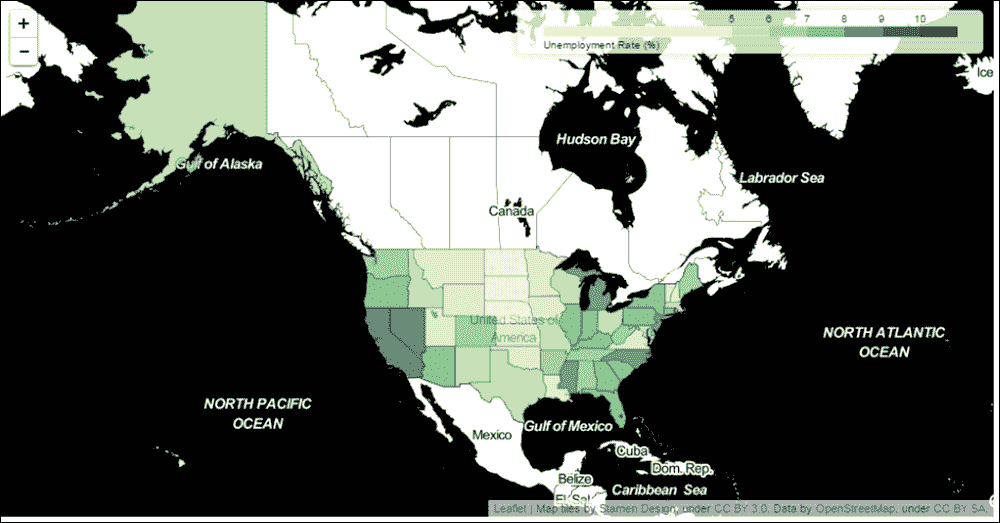
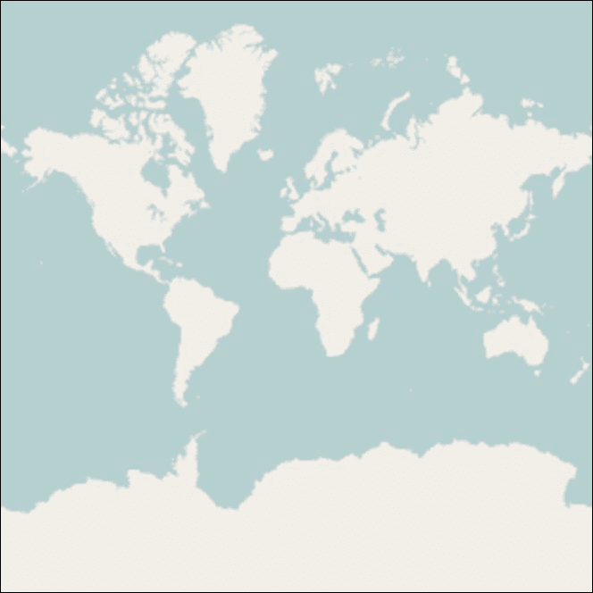
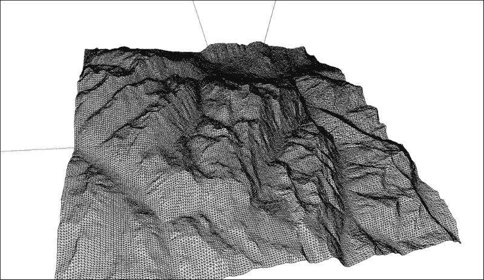
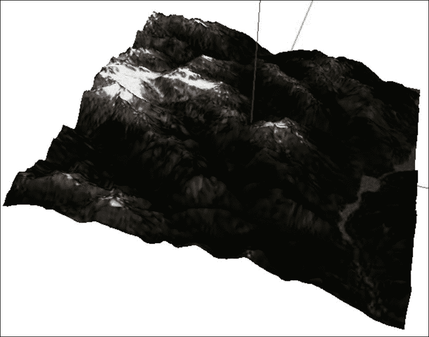

# 第十章. 可视化您的分析

在本章中，我们将涵盖以下主题：

+   使用 Folium 生成 leaflet 网络地图

+   设置 TileStache 以服务瓦片

+   使用 Three.js 可视化 DEM 数据

+   在 DEM 上覆盖正射影像

# 简介

地理空间分析最棒的部分是可视化。本章将介绍一些可视化分析结果的方法。到目前为止，我们已经使用了 QGIS、leaflet 和 Openlayers 3 来查看我们的结果。在这里，我们将专注于使用一些最新的库进行网络地图发布。

这段代码的大部分将混合 Python、JavaScript、HTML 和 CSS。

### 小贴士

可以在[`selection.datavisualization.ch/`](http://selection.datavisualization.ch/)找到一系列令人惊叹的可视化技术和库。

# 使用 Folium 生成 leaflet 网络地图

使用自己的数据创建网络地图正变得越来越容易，随着每个新的网络地图库的出现。Folium ([`folium.readthedocs.org/`](http://folium.readthedocs.org/)) 是一个小的 Python 新项目，可以直接从 Python 代码创建简单的网络地图，利用 leaflet JavaScript 地图库。这仍然超过了一行，但只需 20 行以下的 Python 代码，你就可以让 Folium 为你生成一个漂亮的网络地图。

## 准备工作

Folium 需要 Jinja2 模板引擎和 Pandas 进行数据绑定。好的是，这两个都可以通过`pip`简单安装：

```py
pip install jinja2
pip install pandas

```

关于使用 Pandas 的说明也可以在第一章中找到，*设置您的地理空间 Python 环境*。

## 如何做到...

1.  现在请确保你处于`/ch10/code/`文件夹中，以查看以下 Folium 的实时示例：

    ```py
    #!/usr/bin/env python
    # -*- coding: utf-8 -*-
    import folium
    import pandas as pd

    # define the polygons
    states_geojson = r'us-states.json'

    # statistic data to connect to our polygons
    state_unemployment = r'../www/html/US_Unemployment_Oct2012.csv'

    # read the csv statistic data
    state_data = pd.read_csv(state_unemployment)

    # Let Folium determine the scale
    map = folium.Map(location=[48, -102], zoom_start=3, tiles="Stamen Toner")

    # create the leaflet map settings
    map.geo_json(geo_path=states_geojson, data=state_data,
                 columns=['State', 'Unemployment'],
                 threshold_scale=[5, 6, 7, 8, 9, 10],
                 key_on='feature.id',
                 fill_color='YlGn', fill_opacity=0.7, line_opacity=0.2,
                 legend_name='Unemployment Rate (%)')

    # output the final map file
    map.create_map(path='../www/html/ch10-01_folium_map.html')
    ```

## 它是如何工作的...

Folium 使用 Jinja2 Python 模板引擎来渲染最终结果，并使用 Pandas 来绑定 CSV 统计数据。代码从导入和定义数据源开始。将显示美国州多边形的 GeoJSON 文件作为**渐变图**。渐变图是一种显示数据值，这些数据值被分类到一组定义的数据范围中，通常基于某种统计方法。在 GeoJSON 数据中有一个名为`id`的键字段，其值为美国州的缩写代码。这个`id`将空间数据绑定到包含相应`id`字段的统计 CSV 列，因此我们可以连接我们的两个数据集。

Folium 随后需要创建一个`map`对象，设置`map`中心坐标、缩放级别以及用于背景的基础瓦片地图。在我们的例子中，定义了`Stamen Toner`瓦片集。

接下来，我们定义将在我们的背景地图上出现的矢量 GeoJSON。我们需要传递我们源 GeoJSON 的路径以及引用我们的 CSV 文件列`State`和`Unemployment`的 Pandas 数据帧对象。然后，我们设置连接 CSV 与 GeoJSON 数据的链接键值。`key_on`参数读取特征数组中的`id` GeoJSON 属性键。

最后，我们设置颜色调色板为我们想要的颜色以及样式。图例是 D3 图例，它为我们自动创建并按分位数缩放。



# 设置 TileStache 以服务瓦片

一旦你有数据并想要将其放到网上，就需要某种服务器。TileStache 最初由 Michal Migurski 开发，是一个 Python 瓦片地图服务器，可以输出矢量瓦片。矢量瓦片是网络地图的未来，使网络地图应用超级快。最终，你将有一个运行并服务简单网络地图的`TileStache`实例。

## 准备工作

要在您的机器上运行 TileStache，需要一些要求，包括 Werkzeug、PIL、SimpleJson 和 Modestmaps，因此我们必须首先安装这些。让我们从运行我们的`pip install`命令开始，如下所示：

### 注意

要在完整的服务器上运行`TileStache`，例如 Nginx 或 Apache，并使用`mod-python`超出了本书的范围，但强烈推荐用于生产部署（有关更多信息，请参阅[`modpython.org/`](http://modpython.org/))。

```py
pip install Werkzeug
pip install modestmaps
pip install simplejson

```

被称为`Werkzeug`的 Python 库（[`werkzeug.pocoo.org/`](http://werkzeug.pocoo.org/)）是我们测试应用的 WSGI 服务器。Mapnik 不是必需的，但你可以安装它来查看演示应用。

## 如何做...

1.  现在，让我们从[`github.com/TileStache/TileStache/archive/master.zip`](https://github.com/TileStache/TileStache/archive/master.zip)下载最新的代码作为 ZIP 文件。

    ### 小贴士

    如果你已安装，请使用命令行`git`如下：

    ```py
    $ git clone https://github.com/TileStache/TileStache.git

    ```

1.  将其解压到你的`/ch10/TileStache-master`文件夹中。

1.  通过进入你的`/ch10/TileStache-master/`目录并输入以下命令行来测试和检查你的安装是否顺利：

    ```py
    > python tilestache-server.py -c ../tilestache.cfg

    ```

1.  执行上述命令后，你应该会看到以下内容：

    ```py
    * Running on http://127.0.0.1:8080/ (Press CTRL+C to quit)

    ```

1.  现在，打开你的网络浏览器并输入`http://localhost:8080/`；你应该会看到一些简单的文本，表明`TileStache belows hello`。

1.  接下来，尝试输入`http://localhost:8080/osm/0/0/0.png`；你会得到以下输出：

    这是你应该能够看到的全球地图。

1.  要获取温哥华，不列颠哥伦比亚省的实时可滚动地图，请访问`http://localhost:8080/osm/preview.html#10/49.1725/-123.0719`。

# 使用 Three.js 可视化 DEM 数据

你有一个很棒的 3D **数字高程模型**（DEM），你可能想在网页上查看，所以你的选择仅限于你的想象和编程技能。在这个基于 Bjorn Sandvik 出色工作的例子中，我们将探讨操纵 DEM 以加载基于 Three.js 的 HTML 网页所需的方法。

### 提示

我强烈推荐的一个 QGIS 插件是**qgis2threejs**插件，由 Minoru Akagi 编写。Python 插件代码可在 GitHub 上找到，网址为[`github.com/minorua/Qgis2threejs`](https://github.com/minorua/Qgis2threejs)，在那里你可以找到一个不错的`gdal2threejs.py`转换器。

生成的 3D DEM 网格可以在你的浏览器中查看：



## 准备工作

我们需要 Jinja2 作为我们的模板引擎（在本章的第一节中安装），来创建我们的 HTML。其余的要求包括 JavaScript 和我们的 3D DEM 数据。我们的 DEM 数据来自第七章，*栅格分析*，位于`/ch07/geodata/dem_3857.dem`文件夹，所以如果你还没有下载所有数据和代码，请现在就下载。

`gdal_translate` GDAL 可执行文件用于将我们的 DEM 转换为 ENVI `.bin` 16 位栅格。这个栅格将包含`threejs`库可以读取以创建 3D 网格的高程值。

### 提示

使用 IDE 并不总是必要的，但在这个案例中，PyCharm Pro IDE 很有帮助，因为我们正在使用 HTML、JavaScript 和 Python 来创建我们的结果。还有一个免费的 PyCharm 社区版，我也推荐，但它缺少 HTML、JavaScript 和 Jinja2 模板支持。

如果你在你的机器上下载了`/ch10/www/js`文件夹，那么 Three.js 就可用。如果没有，请现在就下载整个`/ch10/www/`文件夹。在里面，你会找到用于输出 HTML 和 Jinja2 使用的 Web 模板所需的文件夹。

## 如何做到...

1.  我们将首先运行一个子进程调用，生成 Three.js 所需的带有高程数据的栅格。然后，我们将进入包含单个`Jinja2`变量的 HTML 模板代码，如下所示：

    ```py
    #!/usr/bin/env python
    # -*- coding: utf-8 -*-
    import subprocess

    from jinja2 import Environment, FileSystemLoader

    # Create our DEM

    # use gdal_translate command to create an image to store elevation values
    # -scale from 0 meters to 2625 meters
    #     stretch all values to full 16bit  0 to 65535
    # -ot is output type = UInt16 unsigned 16bit
    # -outsize is 200 x 200 px
    # -of is output format ENVI raster image .bin file type
    # then our input .tif with elevation
    # followed by output file name .bin
    subprocess.call("gdal_translate -scale 0 2625 0 65535 "
                    "-ot UInt16 -outsize 200 200 -of ENVI "
                    "../../ch07/geodata/dem_3857.tif "
                    "../geodata/whistler2.bin")

    # create our Jinja2 HTML
    # create a standard Jinja2 Environment and load all files
    # located in the folder templates
    env = Environment(loader=FileSystemLoader(["../www/templates"]))

    # define which template we want to render
    template = env.get_template("base-3d-map.html")

    # path and name of input 16bit raster image with our elevation values
    dem_3d = "../../geodata/whistler2.bin"

    # name and location of the output HTML file we will generate
    out_html = "../www/html/ch10-03_dem3d_map.html"

    # dem_file is the variable name we use in our Jinja2 HTML template file
    result = template.render(title="Threejs DEM Viewer", dem_file=dem_3d)

    # write out our template to the HTML file on disk
    with open(out_html,mode="w") as f:
        f.write(result)
    ```

1.  我们的 Jinja2 HTML 模板代码只包含一个简单的变量，称为`{{ dem_3d }}`，这样你可以清楚地看到正在发生的事情：

    ```py
    #!/usr/bin/env python
    <html lang="en">
    <head>
        <title>DEM threejs Browser</title>
        <meta charset="utf-8">
        <meta name="viewport" content="width=device-width, user-scalable=no, minimum-scale=1.0, maximum-scale=1.0">
        <style> body { margin: 0; overflow: hidden; }</style>
    </head>
    <body>
        <div id="dem-map"></div>
        <script src="img/three.min.js"></script>
        <script src="img/TrackballControls.js"></script>
        <script src="img/TerrainLoader.js"></script>
        <script>

            var width  = window.innerWidth,
                height = window.innerHeight;

            var scene = new THREE.Scene();

            var axes = new THREE.AxisHelper(200);
            scene.add(axes);

            var camera = new THREE.PerspectiveCamera(45, width / height, 0.1, 1000);
            camera.position.set(0, -50, 50);

            var renderer = new THREE.WebGLRenderer();
            renderer.setSize(width, height);

            var terrainLoader = new THREE.TerrainLoader();
            terrainLoader.load('{{ dem_3d }}', function(data) {

                var geometry = new THREE.PlaneGeometry(60, 60, 199, 199);

                for (var i = 0, l = geometry.vertices.length; i < l; i++) {
                    geometry.vertices[i].z = data[i] / 65535 * 10;
                }

                var material = new THREE.MeshPhongMaterial({
                    color: 0xdddddd,
                    wireframe: true
                });

                var plane = new THREE.Mesh(geometry, material);
                scene.add(plane);

            });

            var controls = new THREE.TrackballControls(camera);

            document.getElementById('dem-map').appendChild(renderer.domElement);

            render();

            function render() {
                controls.update();
                requestAnimationFrame(render);
                renderer.render(scene, camera);
            }

        </script>
    </body>
    </html>
    ```

## 它是如何工作的...

我们的`gdal_translate`通过将 DEM 数据转换为 Three.js 可以理解的栅格格式为我们做了艰苦的工作。Jinja2 模板 HTML 代码显示了所需的组件，从三个 JavaScript 文件开始。`TerrainLoader.js`读取这个二进制`.bin`格式栅格到 Three.js 地形中。

在我们的 HTML 文件中，JavaScript 代码展示了我们如何创建 Three.js 场景，其中最重要的部分是创建`THREE.PlaneGeometry`。在这个 JavaScript `for`循环中，我们为每个`geometry.vertices`分配高程高度，为每个顶点分配高程值对应的平坦平面。

接着使用 `MeshPhongMaterial`，这样我们就可以在屏幕上以线框的形式看到网格。要查看生成的 HTML 文件，您需要运行一个本地网络服务器，而对于这个，Python 内置了 `SimpleHTTPServer`。这可以通过以下 Python 命令在命令行中运行：

```py
> python -m SimpleHTTPServer 8080

```

然后，访问您的浏览器并输入 `http://localhost:8080/`；选择 `html` 文件夹，然后点击 `ch10-03_dem3d_map.html` 文件。

### 小贴士

使用 PyCharm IDE，您可以直接在 PyCharm 中打开 HTML 文件，将鼠标移至打开文件的右上角，并选择一个浏览器，例如 Chrome，以打开一个新的 HTML 页面。PyCharm 将自动为您启动一个网络服务器，并在您选择的浏览器中显示 3D 地形。

# 在 DEM 上覆盖正射影像

这次，我们将通过将卫星影像覆盖到我们的 DEM 上，将我们之前的配方提升到新的水平，从而创建一个真正令人印象深刻的 3D 交互式网络地图。



您可以查看来自 `geogratis.ca` 的其他正射影像，[`geogratis.gc.ca/api/en/nrcan-rncan/ess-sst/77618678-421b-4a28-a0a5-b074e5f072ff.html`](http://geogratis.gc.ca/api/en/nrcan-rncan/ess-sst/77618678-421b-4a28-a0a5-b074e5f072ff.html)。

## 准备工作

要直接在 DEM 上覆盖正射影像，我们需要确保输入的 DEM 和正射影像具有相同的范围和像素大小。对于这个练习，您需要完成前面的部分，并在 `/ch10/geodata/092j02_1_1.tif` 文件夹中准备好数据。这是我们将在 DEM 上覆盖的正射影像。

## 如何做到这一点...

1.  让我们深入一些代码，这些代码充满了注释，以供您参考：

    ```py
    #!/usr/bin/env python
    # -*- coding: utf-8 -*-

    import subprocess
    from PIL import Image
    from jinja2 import Environment, FileSystemLoader

    # convert from Canada UTM http://epsg.io/3157/map   to 3857
    # transform the orthophto from epsg:3157 to epsg:3857
    # cut the orthophoto to same extent of DEM
    subprocess.call("gdalwarp -s_srs EPSG:3157 -t_srs EPSG:3857 -overwrite "
                    "-te -13664479.091 6446253.250 -13636616.770 6489702.670"
                    "/geodata/canimage_092j02_tif/092j02_1_1.tif ../geodata/whistler_ortho.tif")

    # convert the new orthophoto into a 200 x 200 pixel image
    subprocess.call("gdal_translate -outsize 200 200 "
                    "../geodata/whistler_ortho.tif "
                    "../geodata/whistler_ortho_f.tif")

    # prepare to create new jpg output from .tif
    processed_ortho = '../geodata/whistler_ortho_f.tif'
    drape_texture = '../../geodata/whistler_ortho_f.jpg'

    # export the .tif to a jpg to make is smaller for web using pil
    Image.open(processed_ortho).save(drape_texture)

    # set Jinja2 env and load folder where templates are located
    env = Environment(loader=FileSystemLoader(["../www/templates"]))

    # assign template to our HTML file with our variable inside
    template = env.get_template( "base-3d-map-drape.html")

    # define the original DEM file
    dem_3d = "../../geodata/whistler2.bin"

    # location of new HTML file to be output
    out_html = "../www/html/ch10-04_dem3d_map_drape.html"

    # create the new output HTML object and set variable names
    result = template.render(title="Threejs DEM Drape Viewer", dem_file=dem_3d,
                             texture_map=drape_texture)

    # write the new HTML file to disk
    with open(out_html,mode="w") as file:
        file.write(result)
    ```

1.  我们的 Jinja2 HTML 模板文件看起来是这样的：

    ```py
    <html lang="en">
    <head>
        <title>DEM threejs Browser</title>
        <meta charset="utf-8">
        <meta name="viewport" content="width=device-width, user-scalable=no, minimum-scale=1.0, maximum-scale=1.0">
        <style> body { margin: 0; overflow: hidden; }</style>
    </head>
    <body>
        <div id="dem-map"></div>
        <script src="img/three.min.js"></script>
        <script src="img/TrackballControls.js"></script>
        <script src="img/TerrainLoader.js"></script>
        <script>

            var width  = window.innerWidth,
                height = window.innerHeight;

            var scene = new THREE.Scene();
            scene.add(new THREE.AmbientLight(0xeeeeee));

            var axes = new THREE.AxisHelper(200);
            scene.add(axes);

            var camera = new THREE.PerspectiveCamera(45, width / height, 0.1, 1000);
            camera.position.set(0, -50, 50);

            var renderer = new THREE.WebGLRenderer();
            renderer.setSize(width, height);

            var terrainLoader = new THREE.TerrainLoader();
            terrainLoader.load('{{ dem_file }}', function(data) {

                var geometry = new THREE.PlaneGeometry(60, 60, 199, 199);

                for (var i = 0, l = geometry.vertices.length; i < l; i++) {
                    geometry.vertices[i].z = data[i] / 65535 * 10;
                }

                var material = new THREE.MeshPhongMaterial({
                  map: THREE.ImageUtils.loadTexture('{{ texture_map }}')
                });

                var plane = new THREE.Mesh(geometry, material);
                scene.add(plane);

            });

            var controls = new THREE.TrackballControls(camera);
            document.getElementById('dem-map').appendChild(renderer.domElement);
            render();
            function render() {
                controls.update();
                requestAnimationFrame(render);
                renderer.render(scene, camera);
            }

        </script>
    </body>
    </html>
    ```

## 它是如何工作的...

覆盖正射影像的主要方法与前面章节中看到的方法相同，只是在 Three.js 材质渲染的使用方式上略有不同。

数据准备再次扮演了最重要的角色，以确保一切顺利。在我们的 Python 代码 `Ch10-04_drapeOrtho.py` 中，我们使用 subprocess 调用来执行 `gdalwarp` 和 `gdal_translate` 命令行工具。首先使用 Gdalwarp 将原始正射影像从 EPSG:3157 转换为 EPSG:3857 Web Mercator 格式。同时，它也将原始栅格裁剪到与我们的 DEM 输入相同的范围。这个范围是通过读取 `gdalinfo whistler.bin` 栅格命令行调用来实现的。

然后，我们需要将栅格裁剪到适当的大小，并制作一个 200 x 200 像素的图像，以匹配我们的 DEM 大小。接着使用 PIL 将输出的 `.tif` 文件转换为更小的 `.jpg` 文件，这更适合网络演示和速度。

主要的腿部工作完成之后，我们可以使用 Jinja2 来创建我们的输出 HTML 模板，并传入两个`dem_file`变量，这些变量指向原始的 DEM。第二个变量名为`texture_map`，指向新创建的用于覆盖 DEM 的 whistler `.jpg`文件。

最终结果将写入`/ch10/www/html/ch10-04_dem3d_map_drape.html`文件夹，供你打开并在浏览器中查看。要查看此 HTML 文件，你需要从`/ch10/www/`目录启动本地 Web 服务器：

```py
> python -m simpleHTTPServer 8080

```

然后，访问浏览器中的 `http://localhost.8080/`，你应该在 DEM 上看到一个覆盖的图像。
