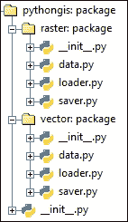

# 第二章：访问地理数据

所有 GIS 处理都必须从地理数据开始，因此我们开始构建与各种地理文件格式交互、加载和保存的能力。本章分为向量和平铺部分，在每一部分中，我们将涵盖以下内容：

+   首先，我们创建一个数据接口，这意味着理解数据结构以及如何与之交互。

+   其次和第三，任何特定格式的差异都外包给单独的加载器和保存器模块。

这在一个章节中包含了很多功能，但通过逐步工作，你将学会很多关于数据结构和文件格式的东西，并最终为你的应用程序打下坚实的基础。

# 方法

在我们努力构建本章中的数据访问时，我们关注简洁性、可理解性和轻量级库。我们为向量和平铺数据创建了标准化的数据接口，这样我们就可以在任何数据上使用相同的方法并期望得到相同的结果，而不用担心文件格式差异。它们并不一定针对速度或内存效率进行优化，因为它们会一次性将整个文件加载到内存中。

在我们选择用于加载和保存的第三方库时，我们专注于格式特定的库，这样我们就可以选择支持哪些格式，从而保持应用程序的轻量级。这需要更多的工作，但允许我们了解关于文件格式的复杂细节。

### 注意

如果在您的应用程序中大小不是问题，您可能希望改用更强大的**GDAL**库，该库可以单独加载和保存更广泛的向量和平铺格式。要使用 GDAL，我建议从[`www.lfd.uci.edu/~gohlke/pythonlibs/#gdal`](http://www.lfd.uci.edu/~gohlke/pythonlibs/#gdal)下载并安装预编译版本。在 GDAL 之上，**Fiona**([`www.lfd.uci.edu/~gohlke/pythonlibs/#fiona`](http://www.lfd.uci.edu/~gohlke/pythonlibs/#fiona))和**Rasterio**([`www.lfd.uci.edu/~gohlke/pythonlibs/#rasterio`](http://www.lfd.uci.edu/~gohlke/pythonlibs/#rasterio))这两个包提供了更方便和 Pythonic 的接口，分别用于 GDAL 的向量和平铺数据功能。

# 向量数据

我们首先添加对向量数据的支持。我们将在`vector`包内部创建三个子模块：`data`、`loader`和`saver`。为了使它们可以从父向量包中访问，我们需要在`vector/__init__.py`中导入它，如下所示：

```py
from . import data
from . import loader
from . import saver
```

## 向量数据的数据接口

我们首先想要的是一个可以方便交互的数据接口。这个数据接口将包含在其自己的模块中，所以现在创建这个模块并将其保存为`vector/data.py`。

我们首先进行一些基本的导入，包括 Shapely 的兼容性函数（我们在第一章中安装了它，*准备构建您自己的 GIS 应用程序*）和**Rtree**包的空间索引能力，这是一个我们稍后将要安装的包。请注意，矢量数据的加载和保存由我们尚未创建的单独模块处理，但由于它们通过我们的数据接口访问，因此我们需要在这里导入它们：

```py
# import builtins
import sys, os, itertools, operator
from collections import OrderedDict
import datetime

# import shapely geometry compatibility functions
# ...and rename them for clarity
import shapely
from shapely.geometry import asShape as geojson2shapely

# import rtree for spatial indexing
import rtree

# import internal modules
from . import loader
from . import saver
```

### 小贴士

**下载示例代码**

您可以从[`www.packtpub.com`](http://www.packtpub.com)下载您购买的所有 Packt Publishing 书籍的示例代码文件。如果您在其他地方购买了这本书，您可以访问[`www.packtpub.com/support`](http://www.packtpub.com/support)并注册，以便将文件直接通过电子邮件发送给您。

### 矢量数据结构

地理矢量数据可以被视为一个数据表。表中的每一行是一个观测值（例如，一个国家），并包含一个或多个属性，或关于该观测值的信息（例如，人口）。在矢量数据结构中，行被称为**要素**，并具有额外的几何定义（定义国家形状和位置的坐标）。因此，结构的概述可能看起来像这样：


因此，在我们的矢量数据结构实现中，我们创建了一个名为`VectorData`的接口。为了创建并填充一个`VectorData`实例，我们可以提供一个`filepath`参数，它将通过我们稍后创建的加载模块来加载。我们还允许传递可选的关键字参数给加载器，这将包括指定文本编码的能力。或者，可以通过不传递任何参数来创建一个空的`VectorData`实例。在创建空实例时，可以指定整个数据实例的几何类型（这意味着它只能包含多边形、线或点几何），否则它将根据添加的第一个要素的几何类型设置数据类型。

除了存储字段名和从行和几何形状创建要素外，`VectorData`实例还记住加载数据的`filepath`源（如果适用），以及默认为未投影 WGS84 的**坐标参考系统**（**CRS**），如果没有指定。

为了存储要素，而不是使用列表或字典，我们使用一个**有序**字典，它允许我们使用唯一的 ID 来识别每个要素，对要素进行排序，并执行快速频繁的要素查找。为了确保`VectorData`中的每个要素都有一个唯一的 ID，我们定义了一个唯一的 ID 生成器，并将独立的 ID 生成器实例附加到每个`VectorData`实例上。

为了让我们能够与`VectorData`实例进行交互，我们添加了各种魔法方法来启用标准的 Python 操作，例如获取数据中的特征数量、遍历它们以及通过它们的 ID 进行索引来获取和设置它们。最后，我们还包括了一个方便的`add_feature`和`copy`方法。请看以下代码：

```py
def ID_generator():
    i = 0
    while True:
        yield i
        i += 1

class VectorData:
    def __init__(self, filepath=None, type=None, **kwargs):
        self.filepath = filepath

        # type is optional and will make the features ensure that all geometries are of that type
        # if None, type enforcement will be based on first geometry found
        self.type = type

        if filepath:
            fields,rows,geometries,crs = loader.from_file(filepath, **kwargs)
        else:
            fields,rows,geometries,crs = [],[],[],"+proj=longlat +ellps=WGS84 +datum=WGS84 +no_defs"

        self.fields = fields

        self._id_generator = ID_generator()

        ids_rows_geoms = itertools.izip(self._id_generator,rows,geometries)
        featureobjs = (Feature(self,row,geom,id=id) for id,row,geom in ids_rows_geoms )
        self.features = OrderedDict([ (feat.id,feat) for feat in featureobjs ])
        self.crs = crs

    def __len__(self):
        """
        How many features in data.
        """
        return len(self.features)

    def __iter__(self):
        """
        Loop through features in order.
        """
        for feat in self.features.itervalues():
            yield feat

    def __getitem__(self, i):
        """
        Get a Feature based on its feature id.
        """
        if isinstance(i, slice):
            raise Exception("Can only get one feature at a time")
        else:
            return self.features[i]

    def __setitem__(self, i, feature):
        """
        Set a Feature based on its feature id.
        """
        if isinstance(i, slice):
            raise Exception("Can only set one feature at a time")
        else:
            self.features[i] = feature

    ### DATA ###

    def add_feature(self, row, geometry):
        feature = Feature(self, row, geometry)
        self[feature.id] = feature
    def copy(self):
        new = VectorData()
        new.fields = [field for field in self.fields]
        featureobjs = (Feature(new, feat.row, feat.geometry) for feat in self )
        new.features = OrderedDict([ (feat.id,feat) for feat in featureobjs ])
        if hasattr(self, "spindex"): new.spindex = self.spindex.copy()
        return new
```

当我们加载或添加特征时，它们被存储在一个带有其父`VectorData`类链接的`Feature`类中。为了简化、最大程度地提高互操作性和内存效率，我们选择以流行的和广泛支持的**GeoJSON**格式存储特征几何形状，它只是一个根据某些规则格式化的 Python 字典结构。

### 注意

GeoJSON 是一种人类可读的文本表示形式，用于描述各种矢量几何形状，如点、线和多边形。有关完整规范，请访问[`geojson.org/geojson-spec.html`](http://geojson.org/geojson-spec.html)。

我们确保给`Feature`类一些魔法方法来支持标准的 Python 操作，例如通过使用特征父字段列表中所需字段的位置通过字段名索引轻松获取和设置属性。一个返回 Shapely 几何表示的`get_shapely`方法和一个`copy`方法也将对以后很有用。以下代码解释了`Feature`类：

```py
class Feature:
    def __init__(self, data, row, geometry, id=None):
        "geometry must be a geojson dictionary"
        self._data = data
        self.row  = list(row)

        self.geometry = geometry.copy()

        # ensure it is same geometry type as parent
        geotype = self.geometry["type"]
        if self._data.type: 
            if "Point" in geotype and self._data.type == "Point": pass
            elif "LineString" in geotype and self._data.type == "LineString": pass
            elif "Polygon" in geotype and self._data.type == "Polygon": pass
            else: raise TypeError("Each feature geometry must be of the same type as the file it is attached to")
        else: self._data.type = self.geometry["type"].replace("Multi", "")

        if id == None: id = next(self._data._id_generator)
        self.id = id

    def __getitem__(self, i):
        if isinstance(i, (str,unicode)):
            i = self._data.fields.index(i)
        return self.row[i]

    def __setitem__(self, i, setvalue):
        if isinstance(i, (str,unicode)):
            i = self._data.fields.index(i)
        self.row[i] = setvalue

    def get_shapely(self):
        return geojson2shapely(self.geometry)

    def copy(self):
        geoj = self.geometry
        if self._cached_bbox: geoj["bbox"] = self._cached_bbox
        return Feature(self._data, self.row, geoj) 
```

### 计算边界框

尽管我们现在已经有了矢量数据的基本结构，但我们还想添加一些额外的便利方法。对于矢量数据，知道每个特征的**边界框**通常非常有用，它是一个以四个坐标的序列`[xmin, ymin, xmax, ymax]`表示的特征的聚合地理描述。计算边界框可能计算成本较高，因此我们允许`Feature`实例在实例化时接收一个预计算的边界框（如果可用）。因此，在`Feature`的`__init__`方法中，我们添加了以下内容：

```py
        bbox = geometry.get("bbox")
        self._cached_bbox = bbox
```

此边界框也可以缓存或存储，以供以后使用，这样我们就可以在计算后只需引用该值。使用`@property`描述符，在我们定义`Feature`类的`bbox`方法之前，允许我们将边界框作为简单值或属性访问，尽管它是在方法中的几个步骤中计算的：

```py
    @property
    def bbox(self):
        if not self._cached_bbox:
            geotype = self.geometry["type"]
            coords = self.geometry["coordinates"]

            if geotype == "Point":
                x,y = coords
                bbox = [x,y,x,y]
            elif geotype in ("MultiPoint","LineString"):
                xs, ys = itertools.izip(*coords)
                bbox = [min(xs),min(ys),max(xs),max(ys)]
            elif geotype == "MultiLineString":
                xs = [x for line in coords for x,y in line]
                ys = [y for line in coords for x,y in line]
                bbox = [min(xs),min(ys),max(xs),max(ys)]
            elif geotype == "Polygon":
                exterior = coords[0]
                xs, ys = itertools.izip(*exterior)
                bbox = [min(xs),min(ys),max(xs),max(ys)]
            elif geotype == "MultiPolygon":
                xs = [x for poly in coords for x,y in poly[0]]
                ys = [y for poly in coords for x,y in poly[0]]
                bbox = [min(xs),min(ys),max(xs),max(ys)]
            self._cached_bbox = bbox
        return self._cached_bbox
```

最后，`VectorData`类中整个特征集合的边界框也非常有用，因此我们在`VectorData`级别创建了一个类似的例程，但我们不关心缓存，因为`VectorData`类会频繁地丢失或获得新的特征。我们希望边界框始终保持最新。向`VectorData`类添加以下动态属性：

```py
    @property
    def bbox(self):
        xmins, ymins, xmaxs, ymaxs = itertools.izip(*(feat.bbox for feat in self))
        xmin, xmax = min(xmins), max(xmaxs)
        ymin, ymax = min(ymins), max(ymaxs)
        bbox = (xmin, ymin, xmax, ymax)
        return bbox
```

### 空间索引

最后，我们添加一个空间索引结构，将重叠特征的边界框嵌套在一起，以便可以更快地测试和检索特征位置。为此，我们将使用 Rtree 库。执行以下步骤：

1.  访问[`www.lfd.uci.edu/~gohlke/pythonlibs/#rtree`](http://www.lfd.uci.edu/~gohlke/pythonlibs/#rtree)。

1.  下载适合我们系统的 wheel 文件，目前是`Rtree-0.8.2.-cp27-none-win32.whl`。

1.  在 Windows 上安装该软件包，打开您的命令行并输入`C:/Python27/Scripts/pip install path/to/Rtree-0.8.2.-cp27-none-win32.whl`。

1.  要验证安装是否成功，请打开一个交互式 Python shell 窗口并输入`import rtree`。

    ### 注意

    Rtree 只是空间索引的一种类型。另一种常见的是**四叉树**索引，其主要优势是在需要经常更改索引时，更新索引的速度更快。`PyQuadTree`是由作者创建的一个纯 Python 实现，您可以在命令行中通过以下方式安装：`C:/Python27/Scripts/pip install pyquadtree`。

由于空间索引依赖于边界框，正如我们之前所说的，这可能会带来计算成本，因此我们仅在用户明确请求时创建空间索引。因此，让我们创建一个`VectorData`类方法，该方法将从 Rtree 库创建空间索引，通过插入每个特征的边界框及其 ID 来填充它，并将其存储为属性。以下代码片段展示了这一过程：

```py
    def create_spatial_index(self):
        """Allows quick overlap search methods"""
        self.spindex = rtree.index.Index()
        for feat in self:
            self.spindex.insert(feat.id, feat.bbox)
```

一旦创建，Rtree 的空间索引有两个主要方法可用于快速空间查找。空间查找仅返回匹配项的 ID，因此我们使用这些 ID 从匹配的 ID 中获取实际的特征实例。给定一个目标边界框，第一个方法找到与之重叠的特征，而另一个方法则按从最近到最远的顺序遍历最近的*n*个特征。如果目标边界框不是所需的`[xmin, ymin,xmax,ymax]`格式，我们将强制将其转换为该格式：

```py
    def quick_overlap(self, bbox):
        """
        Quickly get features whose bbox overlap the specified bbox via the spatial index.
        """
        if not hasattr(self, "spindex"):
            raise Exception("You need to create the spatial index before you can use this method")
        # ensure min,min,max,max pattern
        xs = bbox[0],bbox[2]
        ys = bbox[1],bbox[3]
        bbox = [min(xs),min(ys),max(xs),max(ys)]
        # return generator over results
        results = self.spindex.intersection(bbox)
        return (self[id] for id in results)

    def quick_nearest(self, bbox, n=1):
        """
        Quickly get n features whose bbox are nearest the specified bbox via the spatial index.
        """
        if not hasattr(self, "spindex"):
            raise Exception("You need to create the spatial index before you can use this method")
        # ensure min,min,max,max pattern
        xs = bbox[0],bbox[2]
        ys = bbox[1],bbox[3]
        bbox = [min(xs),min(ys),max(xs),max(ys)]
        # return generator over results
        results = self.spindex.nearest(bbox, num_results=n)
        return (self[id] for id in results)
```

## 加载矢量文件

到目前为止，我们还没有定义从文件加载数据到我们的`VectorData`接口的例程。这包含在一个单独的模块中，作为`vector/loader.py`。首先导入必要的模块（如果你之前从未听说过它们，不要担心，我们很快就会安装它们）：

```py
# import builtins
import os

# import fileformat modules
import shapefile as pyshp
import pygeoj
```

加载模块的主要目的是使用一个函数，我们称之为`from_file()`，它接受一个文件路径并自动检测其文件类型。然后，它使用适当的例程加载该文件。一旦加载，它就返回我们的`VectorData`类期望的信息：字段名、行列表、几何形状的 GeoJSON 字典列表以及 CRS 信息。一个可选的编码参数确定文件的文本编码（用户将必须事先知道或猜测），但关于这一点我们稍后再说。现在就动手做吧：

```py
def from_file(filepath, encoding="utf8"):

    def decode(value):
        if isinstance(value, str): 
            return value.decode(encoding)
        else: return value
```

### Shapefile

为了处理老式但非常常用的矢量文件格式——shapefile 格式，我们使用了流行的轻量级**PyShp**库。在命令行中安装它，只需输入`C:/Python27/Scripts/pip install pyshp`。

在`from_file`函数内部，我们首先检测文件是否为 shapefile 格式，然后运行我们的加载程序。该程序开始使用 PyShp 模块通过`shapereader`对象获取文件内容。使用`shapereader`对象，我们从每个字段信息元组中提取名称（第一个项目），并排除第一个字段，该字段始终是删除标志字段。通过循环`shapereader`对象的`iterRecords`方法来加载行。

加载几何形状稍微复杂一些，因为我们想执行一些额外的步骤。PyShp，像大多数包一样，可以通过其 shape 对象的`__geo_interface__`属性将几何形状格式化为 GeoJSON 字典。现在，记得从之前的*空间索引*部分，计算每个单独特征的边界框可能很昂贵。shapefile 格式的优点之一是每个形状的边界框都作为 shapefile 格式的一部分存储。因此，我们利用它们已经为我们计算并存储为 GeoJSON 字典的一部分这一事实，该字典是我们发送以启动我们的`VectorData`类。我们创建一个`getgeoj`函数，如果可用（例如，点形状没有`bbox`属性），则将边界框信息添加到 GeoJSON 字典中，并使用它来处理我们从`shapereader`对象的`iterShapes`方法获取的每个形状。

接下来，shapefile 格式有一个可选的`.prj`文件，包含投影信息，因此如果存在，我们也尝试读取此信息，如果不存在，则默认为未投影的 WGS84。最后，我们让函数返回加载的字段、行、几何形状和投影，以便我们的数据模块可以使用它们来构建一个`VectorData`实例。

下面是最终的代码：

```py
    # shapefile
    if filepath.endswith(".shp"):
        shapereader = pyshp.Reader(filepath)

        # load fields, rows, and geometries
        fields = [decode(fieldinfo[0]) for fieldinfo in shapereader.fields[1:]]
        rows = [ [decode(value) for value in record] for record in shapereader.iterRecords()]
        def getgeoj(obj):
            geoj = obj.__geo_interface__
            if hasattr(obj, "bbox"): geoj["bbox"] = obj.bbox
            return geoj
        geometries = [getgeoj(shape) for shape in shapereader.iterShapes()]

        # load projection string from .prj file if exists
        if os.path.lexists(filepath[:-4] + ".prj"):
            crs = open(filepath[:-4] + ".prj", "r").read()
        else: crs = "+proj=longlat +ellps=WGS84 +datum=WGS84 +no_defs"

        return fields, rows, geometries, crs
```

### GeoJSON

GeoJSON 格式比 shapefile 格式更新，由于其简单性，它被广泛使用，尤其是在网络应用程序中。我们将使用的库来读取它们是作者创建的`PyGeoj`。要安装它，在命令行中，输入`C:/Python27/Scripts/pip install pygeoj`。

要检测 GeoJSON 文件，没有关于它们的文件名扩展名的规则，但它们通常为`.geojson`或仅仅是`.json`。然后我们将 GeoJSON 文件加载到一个 PyGeoj 对象中。GeoJSON 特征不需要具有所有相同的字段，所以我们使用一个方便的方法，只获取所有特征共有的字段名。

通过循环特征并访问`properties`属性来加载行。这个 PyGeoj 对象的几何形状纯粹由 GeoJSON 字典组成，与我们的数据结构相同，所以我们只需按原样加载几何形状。最后，我们返回所有加载的信息。请参考以下代码：

```py
    # geojson file
    elif filepath.endswith((".geojson",".json")):
        geojfile = pygeoj.load(filepath)

        # load fields, rows, and geometries
        fields = [decode(field) for field in geojfile.common_attributes]
        rows = [[decode(feat.properties[field]) for field in fields] for feat in geojfile]
        geometries = [feat.geometry.__geo_interface__ for feat in geojfile]

        # load projection
        crs = geojfile.crs

        return fields, rows, geometries, crs 
```

### 不支持的文件格式

由于我们目前不打算支持任何额外的文件格式，如果文件路径与之前任何格式都不匹配，我们添加一个`else`子句，返回一个不支持的文件格式异常：

```py
    else:
        raise Exception("Could not create vector data from the given filepath: the filetype extension is either missing or not supported")
```

## 保存矢量数据

为了将我们的矢量数据保存回文件，创建一个名为`vector/saver.py`的模块。在脚本顶部，我们导入必要的模块：

```py
# import builtins
import itertools

# import fileformats
import shapefile as pyshp
import pygeoj
```

保存模块的主要目的是一个简单的`to_file`函数，它将为我们执行保存操作。我们不允许 CRS 投影参数，因为这将需要一个根据不同标准格式化投影的方法，据我所知，目前只能使用 GDAL 来完成，而我们选择不使用它。

现在，保存包含文本的文件时遇到的一个常见困难是，你必须记得将你的**Unicode**类型文本（带有花哨的非英语字符的文本）编码回机器可读的字节字符串，或者如果它们是 Python 对象，如日期，我们希望得到它们的字节字符串表示。因此，我们首先创建一个快速函数来完成这项工作，使用`to_file`函数的文本编码参数。到目前为止，我们的代码如下所示：

```py
def to_file(fields, rows, geometries, filepath, encoding="utf8"):

    def encode(value):
        if isinstance(value, (float,int)):
            # nrs are kept as nrs
            return value
        elif isinstance(value, unicode):
            # unicode is custom encoded into bytestring
            return value.encode(encoding)
        else:
            # brute force anything else to string representation
            return bytes(value)
```

### 形状文件

为了将矢量数据保存到形状文件格式，一旦我们创建了`shapewriter`对象，我们首先想要检测并设置所有字段以正确的值类型。为了避免处理潜在的类型不匹配，我们只需检查每个字段中所有有效值是否为数值型，如果不是，则强制转换为文本类型。最后，我们将一个清理并编码的字段名（形状文件不允许名称超过 10 个字符或包含空格）的字段元组、值类型（其中*C*代表文本字符，*N*代表数字）、最大文本长度以及数字的十进制精度分配给每个字段。

完成此操作后，我们可以开始编写我们的文件。不幸的是，PyShp 目前没有直接从 GeoJSON 字典保存几何形状的现成方法，所以我们首先创建一个执行此转换的函数。这样做需要创建一个空的 PyShp 形状实例并设置正确的`shapeType`属性。`points`属性是所有坐标点的连续列表，对于多几何形状，它在`parts`属性中指示的索引位置处分开。

然后，我们可以遍历所有我们的要素，使用我们的函数将 GeoJSON 转换为 PyShp 形状实例，将它们追加到编写者的`_shapes`列表中，使用`record`方法编码并添加要素的行，最后保存。整个代码如下所示：

```py
    # shapefile
    if filepath.endswith(".shp"):
        shapewriter = pyshp.Writer()

        # set fields with correct fieldtype
        for fieldindex,fieldname in enumerate(fields):
            for row in rows:
                value = row[fieldindex]
                if value != "":
                    try:
                        # make nr fieldtype if content can be made into nr
                        float(value)
                        fieldtype = "N"
                        fieldlen = 16
                        decimals = 8
                    except:
                        # but turn to text if any of the cells cannot be made to float bc they are txt
                        fieldtype = "C"
                        fieldlen = 250
                        decimals = 0
                        break
                else:
                    # empty value, so just keep assuming nr type
                    fieldtype = "N"
                    fieldlen = 16
                    decimals = 8
            # clean fieldname
            fieldname = fieldname.replace(" ","_")[:10]
            # write field
            shapewriter.field(fieldname.encode(encoding), fieldtype, fieldlen, decimals)

        # convert geojson to shape
        def geoj2shape(geoj):
            # create empty pyshp shape
            shape = pyshp._Shape()
            # set shapetype
            geojtype = geoj["type"]
            if geojtype == "Null":
                pyshptype = pyshp.NULL
            elif geojtype == "Point":
                pyshptype = pyshp.POINT
            elif geojtype == "LineString":
                pyshptype = pyshp.POLYLINE
            elif geojtype == "Polygon":
                pyshptype = pyshp.POLYGON
            elif geojtype == "MultiPoint":
                pyshptype = pyshp.MULTIPOINT
            elif geojtype == "MultiLineString":
                pyshptype = pyshp.POLYLINE
            elif geojtype == "MultiPolygon":
                pyshptype = pyshp.POLYGON
            shape.shapeType = pyshptype

            # set points and parts
            if geojtype == "Point":
                shape.points = [ geoj["coordinates"] ]
                shape.parts = [0]
            elif geojtype in ("MultiPoint","LineString"):
                shape.points = geoj["coordinates"]
                shape.parts = [0]
            elif geojtype in ("Polygon"):
                points = []
                parts = []
                index = 0
                for ext_or_hole in geoj["coordinates"]:
                    points.extend(ext_or_hole)
                    parts.append(index)
                    index += len(ext_or_hole)
                shape.points = points
                shape.parts = parts
            elif geojtype in ("MultiLineString"):
                points = []
                parts = []
                index = 0
                for linestring in geoj["coordinates"]:
                    points.extend(linestring)
                    parts.append(index)
                    index += len(linestring)
                shape.points = points
                shape.parts = parts
            elif geojtype in ("MultiPolygon"):
                points = []
                parts = []
                index = 0
                for polygon in geoj["coordinates"]:
                    for ext_or_hole in polygon:
                        points.extend(ext_or_hole)
                        parts.append(index)
                        index += len(ext_or_hole)
                shape.points = points
                shape.parts = parts
            return shape

        # iterate through original shapes
        for row,geom in itertools.izip(rows, geometries):
            shape = geoj2shape(geom)
            shapewriter._shapes.append(shape)
            shapewriter.record(*[encode(value) for value in row])

        # save
        shapewriter.save(filepath)
```

### GeoJSON

使用 PyGeoj 包保存 GeoJSON 稍微简单一些。我们首先创建一个新的`geojwriter`对象，然后遍历所有我们的要素，将 Unicode 文本编码为字节字符串，将它们添加到`geojwriter`实例中，完成后保存：

```py
    # GeoJSON file
    elif filepath.endswith((".geojson",".json")):
        geojwriter = pygeoj.new()        
        for row,geom in itertools.izip(rows,geometries):
            # encode row values
            row = (encode(value) for value in row)
            rowdict = dict(zip(fields, row))
            # add feature
            geojwriter.add_feature(properties=rowdict,
                                   geometry=geom)

        # save
        geojwriter.save(filepath) 
```

### 不支持的文件格式

最后，我们添加一个 `else` 子句来提供一个消息，说明用户尝试保存到尚未支持保存的文件格式：

```py
    else:
        raise Exception("Could not save the vector data to the given filepath: the filetype extension is either missing or not supported") 
```

# 栅格数据

现在我们已经实现了加载和保存矢量数据的数据结构，我们可以继续为栅格数据做同样的事情。如前所述，我们将在 `raster` 包内创建三个子模块：`data`、`loader` 和 `saver`。为了使它们可以从其父 `raster` 包中访问，我们需要在 `raster/__init__.py` 中导入它，如下所示：

```py
from . import data
from . import loader
from . import saver
```

## 栅格数据的数据接口

栅格数据具有非常不同的结构，我们必须适应，我们首先从其数据接口开始。此接口的代码将包含在栅格文件夹内的一个单独的模块中。要创建此模块，现在将其保存为 `raster/data.py`。从几个基本的导入开始，包括我们尚未创建的加载器和保存器模块，以及我们在第一章（第一章. 准备构建您自己的 GIS 应用程序）中安装的 PIL，*准备构建您自己的 GIS 应用程序*：

```py
# import builtins
import sys, os, itertools, operator

# import internals
from . import loader
from . import saver

# import PIL as the data container
import PIL.Image, PIL.ImageMath
```

### 栅格数据结构

栅格由一个或多个称为 **波段** 的数据网格组成。这些网格以及它们每个 **单元格** 中的值表示信息如何在照片中类似像素的空间中流动：


由于栅格数据与影像数据的相似性，我们利用之前导入的现有 PIL 影像库，并将其用于我们应用程序的栅格数据结构。其基于 C 的代码使其运行速度快且内存效率高，并且它已经包含了我们最终想要实现的大多数基于像素的栅格功能。

在顶层，我们的 `RasterData` 类包含一些栅格元数据和一个或多个 **Band** 层，这些层只是像素图像数据容器的包装器。当创建一个新的 `RasterData` 类时，我们通常从文件路径加载。实际的加载工作将外包给稍后创建的加载模块，该模块返回有关栅格的各种元数据字典（`info`）、一个包含一个或多个波段（`bands`）的列表以及其坐标参考系统（`crs`）的定义。我们还可以根据表示网格或普通图像文件的列表列表从非空间数据创建一个新的 `RasterData` 类，在这种情况下，定义其坐标参考系统（`crs`）和地理空间元数据（我们稍后回到这一点）取决于我们。

`Band` 类是实际值存储的地方。我们保留对 PIL 图像（`img`）的一个引用，以便我们可以使用其各种影像处理方法，并保留对图像像素访问对象（`cells`）的一个引用，这样我们就可以直接与单个像素进行交互。每个像素都作为 `Cell` 类的一个实例来访问，它提供了一个方便的方法来获取其行/列位置。

看看以下代码：

```py
class Cell:
    def __init__(self, band, col, row):
        self.band = band
        self.col, self.row = col, row

    def __repr__(self):
        return "Cell(col=%s, row=%s, value=%s)" %(self.col, self.row, self.value)

    @property
    def value(self):
        return self.band.cells[self.col, self.row]

class Band:
    def __init__(self, img, cells):
        self.img = img
        self.cells = cells

    def __iter__(self):
        width,height = self.img.size
        for row in range(height):
            for col in range(width):
                yield Cell(self, col, row)

    def get(self, col, row):
        return Cell(self, col, row)

    def set(self, col, row, value):
        self.cells[col,row] = value

    def copy(self):
        img = self.img.copy()
        cells = img.load()
        return Band(img, cells)

class RasterData:
    def __init__(self, filepath=None, data=None, image=None, **kwargs):
        self.filepath = filepath

        if filepath:
            info, bands, crs = loader.from_file(filepath)
        elif data:
            info, bands, crs = loader.from_lists(data, **kwargs)
        elif image:
            info, bands, crs = loader.from_image(image, **kwargs)
        else:
            info, bands, crs = loader.new(**kwargs)

        self.bands = [Band(img,cells) for img,cells in bands]

        self.info = info

        self.crs = crs

        self.update_geotransform()

    def __iter__(self):
        for band in self.bands:
            yield band

    @property
    def width(self):
        return self.bands[0].img.size[0]

    @property
    def height(self):
        return self.bands[0].img.size[1]

    def copy(self):
        new = RasterData(width=self.width, height=self.height, **self.info)
        new.bands = [band.copy() for band in self.bands]
        new._cached_mask = self.mask
        return new
```

### 在坐标空间中定位栅格

我们还没有完成。虽然我们的栅格波段的结构网格给我们一个关于每个值在网格中相对位置的感觉，但它并没有说明它们在现实世界中的地理位置，就像`Feature`几何坐标那样。这就是为什么我们需要关于栅格的额外地理空间元数据。为了在地理空间中定位我们的值，我们可以在`info`元数据字典中指定两种方式：

+   我们需要将其中一个单元格（`xy_cell`）转换为地理或投影坐标（`xy_geo`），并指定其单元格的坐标宽度和高度（`cellwidth`和`cellheight`），以便我们可以移动和调整栅格的大小。这些实际上是接下来描述的变换系数的组成部分。

+   在某些情况下，例如沿任意方向拍摄的一些航空影像，仅仅移动和调整栅格可能不够。我们可能还需要旋转和可能倾斜栅格。为此，我们需要一组仿射变换系数（`transform_ceoffs`），这样我们就可以重新计算每个单元格的位置，最终得到扭曲的图像。这也被称为**地理变换**。

    ### 注意

    还有一种第三种可能性，即使用地理编码点的样本，然后可以使用非线性变换来近似，但我们不涉及这种方法。有关在坐标空间中定位栅格的更多信息，请参阅：[`www.remotesensing.org/geotiff/spec/geotiff2.6.html`](http://www.remotesensing.org/geotiff/spec/geotiff2.6.html)。

以下图表说明了如何通过一组地理变换系数来偏移、缩放和旋转栅格数据集，以便在坐标空间中定位它，这通常需要翻转*y*轴：


最后，我们还应考虑栅格数据的一个方面，即每个单元格中坐标偏移的锚定位置；要么在单元格中心，要么在其四个角中的任何一个。我们将此信息存储为`xy_anchor`。然而，由于差异非常小，我们选择不对我们的简单应用进行任何操作。

根据提供的地理空间元数据，我们首先必须计算正则和逆变换系数（`update_geotransform()`），以便我们可以将单元格位置和空间坐标（`cell_to_geo()`和`geo_to_cell()`）相互映射。有了这个基础，我们可以获取有关栅格边界框（`bbox`）的更多信息。最重要的是，我们允许重新定位/扭曲栅格（以及我们稍后创建的 nodata 掩码）到一个新的栅格，该栅格反映了其在指定边界框内以及指定宽度和高度分辨率下的实际位置。这种重新定位可以通过使用 PIL 的 quad 变换从旧坐标边界框转换到新坐标边界框来实现。让我们将这些功能添加到`RasterData`结构中：

```py
    def cell_to_geo(self, column, row):
        [xscale, xskew, xoffset, yskew, yscale, yoffset] = self.transform_coeffs
        x, y = column, row
        x_coord = x*xscale + y*xskew + xoffset
        y_coord = x*yskew + y*yscale + yoffset
        return x_coord, y_coord

    def geo_to_cell(self, x, y, fraction=False):
        [xscale, xskew, xoffset, yskew, yscale, yoffset] = self.inv_transform_coeffs
        column = x*xscale + y*xskew + xoffset
        row = x*yskew + y*yscale + yoffset
        if not fraction:
            # round to nearest cell
            column,row = int(round(column)), int(round(row))
        return column,row

    @property
    def bbox(self):
        # get corner coordinates of raster
        xleft_coord,ytop_coord = self.cell_to_geo(0,0)
        xright_coord,ybottom_coord = self.cell_to_geo(self.width, self.height)
        return [xleft_coord,ytop_coord,xright_coord,ybottom_coord]

    def update_geotransform(self):
        info = self.info

        # get coefficients needed to convert from raster to geographic space
        if info.get("transform_coeffs"):
            [xscale, xskew, xoffset,
             yskew, yscale, yoffset] = info["transform_coeffs"]
        else:
            xcell,ycell = info["xy_cell"]
            xgeo,ygeo = info["xy_geo"]
            xoffset,yoffset = xgeo - xcell, ygeo - ycell
            xscale,yscale = info["cellwidth"], info["cellheight"] 
            xskew,yskew = 0,0
        self.transform_coeffs = [xscale, xskew, xoffset, yskew, yscale, yoffset]

        # and the inverse coefficients to go from geographic space to raster
        # taken from Sean Gillies' "affine.py"
        a,b,c,d,e,f = self.transform_coeffs
        det = a*e - b*d
        if det != 0:
            idet = 1 / float(det)
            ra = e * idet
            rb = -b * idet
            rd = -d * idet
            re = a * idet
            a,b,c,d,e,f = (ra, rb, -c*ra - f*rb,
                           rd, re, -c*rd - f*re)
            self.inv_transform_coeffs = a,b,c,d,e,f
        else:
            raise Exception("Error with the transform matrix, \
                            a raster should not collapse upon itself")

    def positioned(self, width, height, coordspace_bbox):
        # GET COORDS OF ALL 4 VIEW SCREEN CORNERS
        xleft,ytop,xright,ybottom = coordspace_bbox
        viewcorners = [(xleft,ytop), (xleft,ybottom), (xright,ybottom), (xright,ytop)]

        # FIND PIXEL LOCS OF ALL THESE COORDS ON THE RASTER
        viewcorners_pixels = [self.geo_to_cell(*point, fraction=True) for point in viewcorners]

        # ON RASTER, PERFORM QUAD TRANSFORM
        #(FROM VIEW SCREEN COORD CORNERS IN PIXELS TO RASTER COORD CORNERS IN PIXELS)
        flattened = [xory for point in viewcorners_pixels for xory in point]
        newraster = self.copy()

        #self.update_mask()
        mask = self.mask

        # make mask over 
        masktrans = mask.transform((width,height), PIL.Image.QUAD,
                            flattened, resample=PIL.Image.NEAREST)

        for band in newraster.bands:
            datatrans = band.img.transform((width,height), PIL.Image.QUAD,
                                flattened, resample=PIL.Image.NEAREST)
            trans = PIL.Image.new(datatrans.mode, datatrans.size)
            trans.paste(datatrans, (0,0), masktrans)
            # store image and cells
            band.img = trans
            band.cells = band.img.load()

        return newraster,masktrans
```

### Nodata 掩码

有时栅格中的单元格包含缺失数据，因此如果指定，每个`RasterData`类将在其`info`元数据字典中定义一个`nodata_value`。这很重要，因为这些`nodata`单元格在可视化或执行操作时必须被忽略。因此，在我们的数据接口中，我们需要创建一个额外的图像网格，它知道缺失值的位置，这样我们就可以使用 PIL 来屏蔽或隐藏这些值。这个屏蔽可以通过一个动态属性访问，我们将其缓存以供重复使用。参考以下代码：

```py
    @property
    def mask(self):
        if hasattr(self, "_cached_mask"):
            return self._cached_mask

        else:
            nodata = self.info.get("nodata_value")
            if nodata != None:
                # mask out nodata
                if self.bands[0].img.mode in ("F","I"):
                    # if 32bit float or int values, need to manually check each cell
                    mask = PIL.Image.new("1", (self.width, self.height), 1)
                    px = mask.load()
                    for col in xrange(self.width):
                        for row in xrange(self.height):
                            value = (band.cells[col,row] for band in self.bands)
                            # mask out only where all bands have nodata value
                            if all((val == nodata for val in value)):
                                px[col,row] = 0
                else:
                    # use the much faster point method
                    masks = []
                    for band in self.bands:
                        mask = band.img.point(lambda px: 1 if px != nodata else 0, "1")
                        masks.append(mask)
                    # mask out where all bands have nodata value
                    masks_namedict = dict([("mask%i"%i, mask) for i,mask in enumerate(masks) ])
                    expr = " & ".join(masks_namedict.keys())
                    mask = PIL.ImageMath.eval(expr, **masks_namedict).convert("1")
            else:
                # EVEN IF NO NODATA, NEED TO CREATE ORIGINAL MASK,
                # TO PREVENT INFINITE OUTSIDE BORDER AFTER GEOTRANSFORM
                nodata = 0
                mask = PIL.Image.new("1", self.bands[0].img.size, 1)
            self._cached_mask = mask
            return self._cached_mask
```

## 加载栅格数据

现在，是时候将加载功能添加到`Raster`类中。不幸的是，除了 GDAL 之外，没有很多独立的文件格式库专注于加载地理栅格格式。尽管如此，我们仍然能够基于 PIL 制作一个针对常见 GeoTIFF 文件格式的最小加载器。我们通过一些导入初始化模块，并将其保存为`raster/loader.py`：

```py
# import internals
import sys, os, itertools, operator
# import PIL as the image loader
import PIL.Image 
```

我们加载模块的主要目的是提供一个`from_file`函数，该函数返回必要的组件到我们的栅格数据结构。在我们开始加载每种栅格文件格式之前，我们首先从一个函数开始，该函数用于从有时伴随栅格文件的 ESRI 世界文件格式中读取元数据。世界文件是一个非常简单的文本文件，包含六个值，定义了之前讨论的仿射地理变换元数据，其文件名扩展名为`.wld`或伴随图像文件类型的变体。

### 注意

由于支持此世界文件，我们可以轻松地使用 PIL 加载和保存类似图像的栅格格式，如`.png`、`.bmp`、`.gif`或`.jpg`，但本书中我们不这样做。世界文件有时还附带 ESRI ASCII 栅格格式，这是一种简单的文本文件格式，易于理解和实现。

看看下面的代码：

```py
def from_file(filepath):

    def check_world_file(filepath):
        worldfilepath = None

        # try to find worldfile
        dir, filename_and_ext = os.path.split(filepath)
        filename, extension = os.path.splitext(filename_and_ext)
        dir_and_filename = os.path.join(dir, filename)

        # first check generic .wld extension
        if os.path.lexists(dir_and_filename + ".wld"):
            worldfilepath = dir_and_filename + ".wld"

        # if not, check filetype-specific world file extensions
        else:
            # get filetype-specific world file extension
            if extension in ("tif","tiff","geotiff"):
                extension = ".tfw"
            else:
                return None
            # check if exists
            if os.path.lexists(dir_and_filename + extension):
                worldfilepath = dir_and_filename + extension

        # then return contents if file found
        if worldfilepath:
            with open(worldfilepath) as worldfile:
                # note that the params are arranged slightly differently
                # ...in the world file from the usual affine a,b,c,d,e,f
                # ...so remember to rearrange their sequence later
                xscale,yskew,xskew,yscale,xoff,yoff = worldfile.read().split()
            return [xscale,yskew,xskew,yscale,xoff,yoff]
```

### GeoTIFF

GeoTIFF 是灵活的 TIFF 图像文件格式的地理扩展，唯一的区别是增加了额外的地理特定元数据标签。PIL 可以读取包含元数据标签的 TIFF 文件，但一旦我们完全加载或访问图像内容，PIL 就会通过去除任何格式特定的信息使其格式中立。因此，在处理图像之前，你必须提取地理标签。一旦提取，就由我们来解释标签代码，因为 PIL 不了解 GeoTIFF 规范。我们提取与地理变换、无数据值以及 CRS（坐标参考系统）的名称和文本编码标签相关的标签（还有许多其他 CRS 特定的标签，但在这里处理所有这些标签会太多）。最后，如果图像是复合 RGB 栅格，我们将图像分割成其单独的波段，并返回信息元数据、波段元组以及 CRS。

### 注意

完整的 GeoTIFF 规范可以在以下网址在线找到：[`www.remotesensing.org/geotiff/spec/contents.html`](http://www.remotesensing.org/geotiff/spec/contents.html)。

参考以下代码：

```py
    elif filepath.lower().endswith((".tif",".tiff",".geotiff")):
        main_img = PIL.Image.open(filepath)
        raw_tags = dict(main_img.tag.items())

        def process_metadata(raw_tags):
            # check tag definitions here
            info = dict()
            if raw_tags.has_key(1025):
                # GTRasterTypeGeoKey, aka midpoint pixels vs topleft area pixels
                if raw_tags.get(1025) == (1,):
                    # is area
                    info["cell_anchor"] = "center"
                elif raw_tags.get(1025) == (2,):
                    # is point
                    info["cell_anchor"] = "nw"
            if raw_tags.has_key(34264):
                # ModelTransformationTag, aka 4x4 transform coeffs...
                a,b,c,d,
                e,f,g,h,
                i,j,k,l,
                m,n,o,p = raw_tags.get(34264)
                # But we don't want to meddle with 3-D transforms,
                # ...so for now only get the 2-D affine parameters
                xscale,xskew,xoff = a,b,d
                yskew,yscale,yoff = e,f,h
                info["transform_coeffs"] = xscale,xskew,xoff,yskew,yscale,yoff
            else:
                if raw_tags.has_key(33922):
                    # ModelTiepointTag
                    x, y, z, geo_x, geo_y, geo_z = raw_tags.get(33922)
                    info["xy_cell"] = x,y
                    info["xy_geo"] = geo_x,geo_y
                if raw_tags.has_key(33550):
                    # ModelPixelScaleTag
                    scalex,scaley,scalez = raw_tags.get(33550)
                    info["cellwidth"] = scalex
                    info["cellheight"] = -scaley # note: cellheight must be inversed because geotiff has a reversed y- axis (ie 0,0 is in upperleft corner)
            if raw_tags.get(42113):
                info["nodata_value"] = eval(raw_tags.get(42113)) # eval from string to nr
            return info

        def read_crs(raw_tags):
            crs = dict()
            if raw_tags.get(34735):
                # GeoKeyDirectoryTag
                crs["proj_params"] = raw_tags.get(34735)
            if raw_tags.get(34737):
                # GeoAsciiParamsTag
                crs["proj_name"] = raw_tags.get(34737)
            return crs          

        # read geotiff metadata tags
        info = process_metadata(raw_tags)

        # if no geotiff tag info look for world file transform coefficients
        if len(info) <= 1 and not info.get("transform_coeffs"):
            transform_coeffs = check_world_file(filepath)
            if transform_coeffs:
                # rearrange the world file param sequence to match affine transform
                [xscale,yskew,xskew,yscale,xoff,yoff] = transform_coeffs
                info["transform_coeffs"] = [xscale,xskew,xoff,yskew,yscale,yoff]
            else:
                raise Exception("Couldn't find any geotiff tags or world file needed to position the image in space")

        # group image bands and pixel access into band tuples
        bands = []
        for img in main_img.split():
            cells = img.load()
            bands.append((img,cells))

        # read coordinate ref system
        crs = read_crs(raw_tags)

        return info, bands, crs
```

### 不支持的文件格式

与矢量加载器类似，如果尝试加载不支持的栅格文件格式，我们将抛出异常，如下所示：

```py
    else:
        raise Exception("Could not create a raster from the given filepath: the filetype extension is either missing or not supported")
```

## 保存栅格数据

最后，我们希望将我们的栅格数据保存回文件，因此我们创建了一个名为 `raster/saver.py` 的新模块。我们开始时进行了一些导入，如下所示：

```py
# import builtins
Import os

# import PIL as the saver
import PIL
import PIL.TiffImagePlugin
import PIL.TiffTags 
```

在主 `to_file` 函数内部，我们定义了一个跨格式函数，用于将栅格波段组合成最终图像以便保存，以及创建包含地理变换的 `worldfile` 的基本方法：

```py
def to_file(bands, info, filepath):
    def combine_bands(bands):
        # saving in image-like format, so combine and prep final image
        if len(bands) == 1:
            img = bands[0].img
            return img
        elif len(bands) == 3:
            # merge all images together
            mode = "RGB"
            bands = [band.img for band in bands]
            img = PIL.Image.merge(mode, bands)
            return img
        elif len(bands) == 4:
            # merge all images together
            mode = "RGBA"
            bands = [band.img for band in bands]
            img = PIL.Image.merge(mode, bands)
            return img
        else:
            # raise error if more than 4 bands, because PIL cannot save such images
            raise Exception("Cannot save more than 4 bands to one file; split and save each band separately")

    def create_world_file(savepath, geotrans):
        dir, filename_and_ext = os.path.split(savepath)
        filename, extension = os.path.splitext(filename_and_ext)
        world_file_path = os.path.join(dir, filename) + ".wld"
        with open(world_file_path, "w") as writer:
            # rearrange transform coefficients and write
            xscale,xskew,xoff,yskew,yscale,yoff = geotrans
            writer.writelines([xscale, yskew, xskew, yscale, xoff, yoff])
```

### GeoTIFF

接下来，我们允许使用 PIL 保存到 GeoTIFF。直到最近，使用 PIL 保存 GeoTIFF 是不可能的。这是因为 PIL 没有实现保存类型为 `float` 或 `double` 的 TIFF 标签，这会导致错误，因为大多数 GeoTIFF 标签都是双精度浮点值。最近的一个用户贡献添加了对双精度标签所需的支持，并且在你阅读这篇文章的时候，PIL 的 Pillow 分支应该已经希望升级到一个新的稳定版本 2.8.2。

### 小贴士

如果 Pillow 仍然是版本 2.8.1，您将不得不自己通过修改 `site-packages` 中的 PIL 包来添加此支持。在打开 PIL 的 `TiffImagePlugin.py` 文件后，您会看到 `ImageFileDirectory` 类有一个从大约第 483 行开始的 `save` 方法。此方法通过几个 `if` 语句遍历所有提供的标签，检查不同的标签值类型。在注释为 `未类型化数据` 和 `字符串数据` 的 `if` 语句之间，您必须添加一个新的 `if` 语句，并使用以下代码为浮点数和双精度浮点数添加，并记得保存您的更改：

```py
            elif typ in (11, 12):
                # float value
                tmap = {11: 'f', 12: 'd'}
                if not isinstance(value, tuple):
                    value = (value,)
                a = array.array(tmap[typ], value)
                if self.prefix != native_prefix:
                    a.byteswap()
                data = a.tostring()
```

实际的保存过程是通过利用 PIL 一些不太为人所知的功能来实现的。为了将我们的栅格元数据作为文件本身的标签保存，我们必须参考 PIL 的 `TiffImagePlugin` 模块，禁用其对 LibTIFF 库的使用，并创建一个空的 `ImageFileDirectory` 类来保存标签。每个添加的标签值都通过索引设置标签容器，必须在容器上 `tagtype` 属性的索引设置标签值类型之后设置。

一旦所有地理变换、无数据和投影标签都设置好，我们只需将波段图像组合成一个，并将标签容器作为额外参数传递给最终的 `save()` 调用：

```py
    elif filepath.endswith((".tif", ".tiff", ".geotiff")):
        # write directly to tag info
        PIL.TiffImagePlugin.WRITE_LIBTIFF = False
        tags = PIL.TiffImagePlugin.ImageFileDirectory()
        if info.get("cell_anchor"):
            # GTRasterTypeGeoKey, aka midpoint pixels vs topleft area pixels
            if info.get("cell_anchor") == "center":
                # is area
                tags[1025] = 1.0
                tags.tagtype[1025] = 12 #double, only works with PIL patch
            elif info.get("cell_anchor") == "nw":
                # is point
                tags[1025] = 2.0
                tags.tagtype[1025] = 12 #double, only works with PIL patch
        if info.get("transform_coeffs"):
            # ModelTransformationTag, aka 4x4 transform coeffs...
            tags[34264] = tuple(map(float,info.get("transform_coeffs")))
            tags.tagtype[34264] = 12 #double, only works with PIL patch
        else:
            if info.get("xy_cell") and info.get("xy_geo"):
                # ModelTiepointTag
                x,y = info["xy_cell"]
                geo_x,geo_y = info["xy_geo"]
                tags[33922] = tuple(map(float,[x,y,0,geo_x,geo_y,0]))
                tags.tagtype[33922] = 12 #double, only works with PIL patch
            if info.get("cellwidth") and info.get("cellheight"):
                # ModelPixelScaleTag
                scalex,scaley = info["cellwidth"],info["cellheight"]
                tags[33550] = tuple(map(float,[scalex,scaley,0]))
                tags.tagtype[33550] = 12 #double, only works with PIL patch
        if info.get("nodata_value"):
            tags[42113] = bytes(info.get("nodata_value"))
            tags.tagtype[42113] = 2 #ascii

        # finally save the file using tiffinfo headers
        img = combine_bands(bands)
        img.save(filepath, tiffinfo=tags)
```

### 不支持的文件格式

目前，我们只允许保存到以下这些栅格文件格式：

```py
    else:
        raise Exception("Could not save the raster to the given filepath: the filetype extension is either missing or not supported") 
```

# 概要

在本章中，我们构建了我们应用程序的核心基础。在我们的每个 `vector` 和 `raster` 文件夹中，我们创建了三个新的模块，使我们能够访问、编辑和共享一些流行的地理数据格式。因此，我们的文件夹结构应该看起来像这样：



这是我们任何类型的 GIS 应用程序所需的最小内容。从理论上讲，到目前为止，我们可以创建一个仅关注加载和处理文件格式的最小化应用程序。在下一章中，我们将直接进入制作可视化界面应用程序，以便我们能够尽快拥有一个真正的交互式应用程序。
