# 第五章 管理地理数据

现在我们已经有一个运行中的探索性应用程序，我们可以继续开发一些更实用的日常功能。地理数据用户的一个常见任务是准备、清理、重构和组织数据。在本章中，你将执行以下操作：

+   创建一个窗口来检查每个层的基属性

+   为常用的管理任务构建一些便利函数，稍后将其添加到用户界面。这些函数如下：

    +   当用户在 LayersPane 小部件中的每个层上右键单击时，可用的单个层操作（分割、几何清理和重采样）

    +   在顶部功能区区域作为按钮提供的多个层的批量操作（合并和镶嵌）

+   分配对话框窗口以在运行每个工具时设置参数

# 创建管理模块

我们首先创建一个单独的子模块来包含功能，一个用于矢量，一个用于栅格。首先，创建`vector/manager.py`文件，并使用以下导入启动它：

```py
import itertools, operator
from .data import *
```

接下来，创建`raster/manager.py`文件，如下所示：

```py
import PIL, PIL.Image
```

要使这些管理模块对其各自的`vector`和`raster`父包可用，请将以下导入语句添加到`vector/__init__.py`和`raster/__init__.py`中：

```py
import . import manager
```

# 检查文件

作为组织和管理个人文件的最基本方式，人们经常需要检查个人数据和加载层属性及细节。这些信息通常可以在一个单独的层选项窗口中找到。在本章的后面部分，我们将通过在层上右键单击并点击**属性**下的**层特定右键功能**子标题来使此窗口可访问。

我们为这种类型的窗口定义了一个模板类，它支持使用我们的功能区类进行标签窗口，并创建了一个方便的方法来以良好的格式添加信息。这是在`app/dialogues.py`模块中完成的。由于我们尚未设置`app/dialogues.py`的内容，我们还需要设置其导入和样式，如下面的代码片段所示：

```py
import Tkinter as tk
import ScrolledText as tkst # a convenience module that ships with Tkinter

from .toolkit.popups import *
from .toolkit.ribbon import *
from .toolkit import theme
from . import icons
from .. import vector, raster

style_layeroptions_info = {"fg": theme.font1["color"],
                            "font": theme.font1["type"],
                            "relief": "flat"}

class LayerOptionsWindow(Window):
    def __init__(self, master, **kwargs):
        # Make this class a subclass of tk.Menu and add to it
        Window.__init__(self, master, **kwargs)

        # Make the top ribbon selector
        self.ribbon = Ribbon(self)
        self.ribbon.pack(side="top", fill="both", expand=True)

    def add_info(self, tab, label, value):
        row = tk.Frame(tab, bg=tab.cget("bg"))
        row.pack(fill="x", anchor="n", pady=5, padx=5)

        # place label
        header = tk.Label(row, text=label, bg=tab.cget("bg"), **style_layeroptions_info)
        header.pack(side="left", anchor="nw", padx=3)

        # place actual info text
        value = str(value)
        info = tk.Entry(row, width=400, disabledbackground="white", justify="right", **style_layeroptions_info)
        info.pack(side="right", anchor="ne", padx=3)
        info.insert(0, value)
        info.config(state="readonly")
        return info
```

矢量和栅格数据通常具有非常不同的属性，因此我们为每个数据类型创建了一个单独的窗口。首先，对于矢量层：

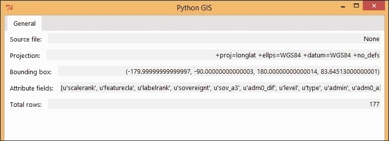

这里是相同代码的示例：

```py
class VectorLayerOptionsWindow(LayerOptionsWindow):
    def __init__(self, master, layeritem, statusbar, **kwargs):
        # Make this class a subclass of tk.Menu and add to it
        LayerOptionsWindow.__init__(self, master, **kwargs)
        self.layeritem = layeritem
        ###########
        ### GENERAL OPTIONS TAB
        general = self.ribbon.add_tab("General")

        # add pieces of info
        self.source = self.add_info(general, "Source file: ", layeritem.renderlayer.data.filepath)
        self.proj = self.add_info(general, "Projection: ", self.layeritem.renderlayer.data.crs)
        self.bbox = self.add_info(general, "Bounding box: ", layeritem.renderlayer.data.bbox)
        self.fields = self.add_info(general, "Attribute fields: ", layeritem.renderlayer.data.fields)
        self.rows = self.add_info(general, "Total rows: ", len(layeritem.renderlayer.data))

        ###########
        # Set starting tab
        self.ribbon.switch(tabname="General")
```

然后，对于栅格层：

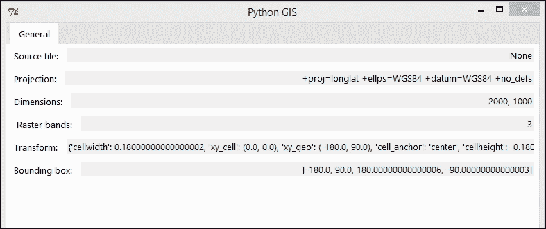

这里是相同代码的示例：

```py
class RasterLayerOptionsWindow(LayerOptionsWindow):
    def __init__(self, master, layeritem, statusbar, **kwargs):
        # Make this class a subclass of tk.Menu and add to it
        LayerOptionsWindow.__init__(self, master, **kwargs)
        self.layeritem = layeritem

        ###########
        ### GENERAL OPTIONS TAB
        general = self.ribbon.add_tab("General")

        # add pieces of info
        self.source = self.add_info(general, "Source file: ", layeritem.renderlayer.data.filepath)
        self.proj = self.add_info(general, "Projection: ", self.layeritem.renderlayer.data.crs)
        self.dims = self.add_info(general, "Dimensions: ", "%i, %i"%(self.layeritem.renderlayer.data.width,
                                                                     self.layeritem.renderlayer.data.height))
        self.bands = self.add_info(general, " Raster bands: ", "%i"%len(self.layeritem.renderlayer.data.bands))
        self.transform = self.add_info(general, "Transform: ", self.layeritem.renderlayer.data.info)
        self.bbox = self.add_info(general, "Bounding box: ", layeritem.renderlayer.data.bbox)

        ###########
        # Set starting tab
        self.ribbon.switch(tabname="General")
```

# 组织文件

传统上，在 GIS 应用程序中工作时，人们首先从各种组织网站中寻找希望使用的数据文件。理想情况下，人们将这些文件存储在本地计算机上逻辑上组织的文件夹结构中，然后可以从那里将数据加载到 GIS 应用程序中。在本节中，我们添加了帮助用户管理文件以及访问和修改基本文件内容的功能。

### 注意

对于一些在线可用的 GIS 数据类型和来源的精彩示例，请参阅[`freegisdata.rtwilson.com/`](http://freegisdata.rtwilson.com/)上的列表。

## 向量数据

向量数据非常灵活；其类似于表格的数据结构意味着它可以在单个文件中包含关于广泛概念的数据，或者只包含关于非常特定概念的数据。对于实际应用来说，如果每个文件都精确地针对所需数据定制，那就更容易了，因为这些数据在应用程序中加载时是以图层的形式表示的。因此，有许多情况下，用户可能希望重新组织数据以更好地满足他们的需求。

在这里，我们将实现三个用于组织和维护向量数据的特定操作：分割、合并和清理。以下插图给出了每个操作的输入和输出的预览：

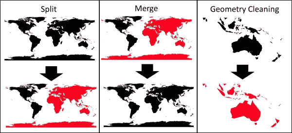

### 分割

例如，用户可能有一个将各种概念分组在一起的文件，但只对单独处理某些类型感兴趣。在这种情况下，只需为每个字段的唯一出现分割数据会更简单——这被称为分割。从数据结构的角度来看，这意味着将表格的高度切割成多个表格，以及它们相关的几何形状。我们方便地使用 Python 内置的`sorted()`和`itertools.groupby()`函数来完成这项工作。`splitfields`选项定义了一个要分割的字段名称列表，以便每个唯一值组合定义一个新的分割。因此，前往`manager.py`文件以处理向量数据，并编写以下代码：

```py
def split(data, splitfields):
    fieldindexes = [index for index,field in enumerate(data.fields)
                    if field in splitfields]
    sortedfeatures = sorted(data, key=operator.itemgetter(*fieldindexes))
    grouped = itertools.groupby(sortedfeatures, key=operator.itemgetter(*fieldindexes))
    for splitid,features in grouped:
        outfile = VectorData()
        outfile.fields = list(data.fields)
        for oldfeat in features:
            outfile.add_feature(oldfeat.row, oldfeat.geometry)
        yield outfile
```

### 合并

用户也可能遇到相反的情况，即希望将分散在多个文件中的多个数据文件组合在一起。这被称为**合并操作**。合并操作将多个表中的行堆叠成一个大的表，通常会增加空间覆盖范围，因为它导致几何形状的集合更大。此操作的输出属性表也水平扩展以包含其输入文件中的所有变量/字段。最后，请记住，`VectorData`实例只能包含一种类型的几何形状（点、线或多边形），因此尝试合并不同几何类型图层将导致错误。我们以以下方式实现它：

```py
def merge(*datalist):
    #make empty table
    firstfile = datalist[0]
    outfile = VectorData()
    #combine fields from all files
    outfields = list(firstfile.fields)
    for data in datalist[1:]:
        for field in data.fields:
            if field not in outfields:
                outfields.append(field)
    outfile.fields = outfields
    #add the rest of the files
    for data in datalist:
        for feature in data:
            geometry = feature.geometry.copy()
            row = []
            for field in outfile.fields:
                if field in data.fields:
                    row.append( feature[field] )
                else:
                    row.append( "" )
            outfile.add_feature(row, geometry)
    #return merged file
    return outfile
```

### 几何清理

地理数据可以来自非常广泛的来源，这意味着它们的完整性水平可能会有很大差异。例如，有许多规则规定了每种几何类型允许或不允许的内容，但并非所有数据生产者（包括软件和个人）都使用相同的规则或以相同程度遵循这些规则。如果数据损坏或未以预期的方式格式化，这可能会成为 GIS 处理、分析应用程序和编程库的问题。数据还可能包含不必要的垃圾信息，这些信息不会增加任何有用的内容（根据所需细节水平而定），从而使文件大小过大。因此，在收集数据时，几何清理可以作为第一步的一个有用功能。

为了做到这一点，我们创建了一个循环我们特征几何体的函数。借助 Shapely 库的帮助，我们修复“蝴蝶结”错误（仅限多边形），删除重复的点，并排除任何根据 GeoJSON 规范被认为无效的剩余几何体。容差参数可以设置为一个大于零的值以减小文件大小，但请注意，这会改变几何体的形状，并降低输出中的细节和精度水平。请参考以下代码：

```py
def clean(data, tolerance=0):
    # create new file
    outfile = VectorData()
    outfile.fields = list(data.fields)

    # clean
    for feat in data:
        shapelyobj = feat.get_shapely()

        # try fixing invalid geoms
        if not shapelyobj.is_valid:
            if "Polygon" in shapelyobj.type:
                # fix bowtie polygons
                shapelyobj = shapelyobj.buffer(0.0)

        # remove repeat points (tolerance=0)
        # (and optionally smooth out complex shapes, tolerance > 0)
        shapelyobj = shapelyobj.simplify(tolerance)

        # if still invalid, do not add to output
        if not shapelyobj.is_valid:
            continue

        # write to file
        geojson = shapelyobj.__geo_interface__
        outfile.add_feature(feat.row, geojson)

    return outfile
```

### 注意

更多关于多边形蝴蝶结错误的信息，请访问：

[`stackoverflow.com/questions/20833344/fix-invalid-polygon-python-shapely`](http://stackoverflow.com/questions/20833344/fix-invalid-polygon-python-shapely)

## 栅格数据

您可能希望实现许多常见的栅格文件管理功能。在这里，我们只关注其中两个：拼接和重采样，如以下截图所示：

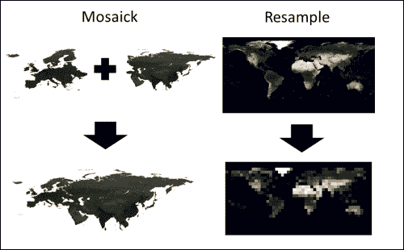

为了实现这些功能，我们将利用 PIL 库的图像处理功能。由于我们使用的是一个并非主要用于地理空间数据的图像库，以下代码应被视为高度实验性的，主要用于演示目的；您可能需要自行调试和改进这些方法。

### 注意

如果您应用程序的主要目的是处理卫星图像、影像和栅格数据，而且您没有时间或感到不舒服自己寻找解决方案使用 PIL，那么您可能最好只是将 NumPy、GDAL 和相关工具作为依赖项添加。

关于 GDAL 处理栅格数据广泛功能的列表，请参阅：

[`pcjericks.github.io/py-gdalogr-cookbook/`](https://pcjericks.github.io/py-gdalogr-cookbook/)

### 拼接

与矢量数据可以合并在一起的方式类似，也可以将多个相邻的栅格数据集镶嵌成一个更大的栅格数据。我们在这里实现的方式是创建一个 `align_rasters()` 函数，它接受任意数量的栅格，自动找到包含所有栅格的坐标边界框以及所需的像素尺寸（尽管我们可能应该允许一些用户控制），并使用这些信息将每个栅格定位到包含所有栅格的区域中的相应位置。我们将这个函数添加到 `raster/manager.py` 文件中：

```py
def align_rasters(*rasters): 
    "Used internally by other functions only, not by user"
    # get coord bbox containing all rasters
    for rast in rasters: print rast.bbox
    xlefts,ytops,xrights,ybottoms = zip(*[rast.bbox for rast in rasters])
    if xlefts[0] < xrights[0]:
        xleft,xright = min(xlefts),max(xrights)
    else: xleft,xright = max(xlefts),min(xrights)
    if ytops[0] > ybottoms[0]:
        ytop,ybottom = max(ytops),min(ybottoms)
    else: ytop,ybottom = min(ytops),max(ybottoms)

    # get the required pixel dimensions (based on first raster, but should probably allow user to specify)
    xs,ys = (xleft,xright),(ytop,ybottom)
    coordwidth,coordheight = max(xs)-min(xs), max(ys)-min(ys)
    rast = rasters[0]
    orig_xs,orig_ys = (rast.bbox[0],rast.bbox[2]),(rast.bbox[1],rast.bbox[3])
    orig_coordwidth,orig_coordheight = max(orig_xs)-min(orig_xs), max(orig_ys)-min(orig_ys)
    widthratio,heightratio = coordwidth/orig_coordwidth, coordheight/orig_coordheight
    reqwidth = int(round(rast.width*widthratio))
    reqheight = int(round(rast.height*heightratio))

    # position into same coordbbox
    aligned = []
    for rast in rasters:
        coordbbox = [xleft,ytop,xright,ybottom]
        positioned = rast.positioned(reqwidth, reqheight, coordbbox)
        aligned.append(positioned)
    return aligned
```

由于我们现在有了一种对齐和正确定位空间中栅格的方法，我们可以通过简单地创建一个新网格，其尺寸包含所有栅格，并将每个栅格粘贴到其中来轻松地将它们镶嵌成一个新的栅格：

```py
def mosaic(*rasters):
    """
    Mosaic rasters covering different areas together into one file.
    Parts of the rasters may overlap each other, in which case we use the value
    from the last listed raster (the "last" overlap rule). 
    """
    # align all rasters, ie resampling to the same dimensions as the first raster
    aligned = align_rasters(*rasters)
    # copy the first raster and reset the cached mask for the new raster
    firstalign,firstmask = aligned[0]
    merged = firstalign.copy()
    del merged._cached_mask
    # paste onto each other, ie "last" overlap rule
    for rast,mask in aligned[1:]:
        merged.bands[0].img.paste(rast.bands[0].img, (0,0), mask)

    return merged
```

注意，与矢量合并不同，矢量合并会保留重叠几何形状的原始形式，而栅格镶嵌需要有一个规则来选择值，当存在重叠的单元格时。在之前的代码中，我们没有支持任何重叠规则的定制，而是简单地逐个将每个栅格粘贴到另一个栅格的上方，使得任何重叠的单元格都保留最后粘贴的栅格的值——这就是所谓的“最后”规则。您可以通过查看 PIL 库中可用的工具来实现其他重叠规则，例如使用 `PIL.Image.blend()` 的 `average` 值，或者使用 `min` 或 `max` 与 `PIL.ImageOps` 子模块中找到的函数。

### 重新采样

对于栅格数据，与矢量清理等效的是移除不必要的细节和减小文件大小，这可以通过重新采样网格单元格的大小和频率来实现。这种重新采样涉及平滑和重新分配旧单元格值到新单元格结构的算法。许多相同的原则也适用于调整图像大小。幸运的是，我们的栅格数据值存储在 PIL `Image` 类中，所以我们只需使用其 `resize` 方法，并使用最近邻算法，它要求以像素（或在我们的情况下是网格单元格的数量）为单位指定大小。为了方便用户，我们还提供了另一种选择，即指定每个单元格所需的地理宽度或高度（例如，度或米，取决于数据的坐标参考系统），我们的程序会在幕后计算必要的网格分辨率。如果指定了，请记住，地理坐标的 *y* 轴通常与栅格坐标的方向相反，因此 `cellheight` 必须以负数给出。如果用户对现有栅格的网格尺寸或单元格大小感兴趣，请记住，这可以在我们本章早期创建的图层属性窗口中找到。

### 注意

在这里，一个用于栅格重新采样的替代库将是 PyResample。我选择不在我们的轻量级应用程序中使用它，因为它依赖于 NumPy 和 SciPy。

其他用于探索栅格管理功能的实用库包括前面提到的 GDAL 或依赖于 GDAL 的 Rasterio。

看看下面的代码：

```py
def resample(raster, width=None, height=None, cellwidth=None, cellheight=None):
    raster = raster.copy()

    if width and height:
        # calculate new cell dimensions based on the new raster size
        widthfactor = raster.width / float(width)
        heightfactor = raster.height / float(height)
        oldcellwidth, oldcellheight = raster.info["cellwidth"], raster.info["cellheight"]
        newcellwidth, newcellheight = oldcellwidth * widthfactor, oldcellheight * heightfactor

        # resample each grid
        for band in raster:
            band.img = band.img.resize((width, height), PIL.Image.NEAREST)
            # update cells access
            band.cells = band.img.load()

        # remember new celldimensions
        raster.info["cellwidth"] = newcellwidth
        raster.info["cellheight"] = newcellheight
        return raster

    elif cellwidth and cellheight:
        # calculate new raster size based on the new cell dimensions
        widthfactor = raster.info["cellwidth"] / float(cellwidth)
        heightfactor = raster.info["cellheight"] / float(cellheight)
        oldwidth, oldheight = raster.width, raster.height
        newwidth, newheight = int(round(oldwidth * widthfactor)), int(round(oldheight * heightfactor))

        # resample each grid
        for band in raster:
            band.img = band.img.resize((newwidth, newheight), PIL.Image.NEAREST)
            # update cells access
            band.cells = band.img.load()

        # remember new celldimensions
        raster.info["cellwidth"] = cellwidth
        raster.info["cellheight"] = cellheight
        return raster

    else:
        raise Exception("To rescale raster, either width and height or cellwidth and cellheight must be specified.")
```

# 将功能编织到用户界面中

现在，我们来到可以让我们将之前创建的管理功能在可视化用户界面中提供给用户的部分。

## 层特定右键功能

本章中我们创建的一些功能本质上是绑定到单一层的，因此通过在所需层上右键单击直接操作这些功能是有意义的。这种功能仅针对我们当前正在制作的应用程序，所以让我们在`app/dialogues.py`模块中定义这个右键菜单。由于 Tkinter 已经有一个格式良好的弹出菜单小部件，并且提供了添加项目和命令的简单方法，我们只需要继承它。矢量层和栅格层将各自获得自己的菜单，但它们都将有共同的**重命名**、**另存为**和**属性**项目。为了使它们具有更好的视觉效果，找到与每个项目同名且为`.png`格式的三个图像，以便我们可以将它们分配给菜单项，并将它们保存在`app/icons`文件夹中。

首先，我们为矢量层创建选项菜单。我们给它我们之前创建的`split`和`clean`函数，并分配图标，你必须找到并保存为`app/icons/split.png`和`app/icons/clean.png`。参看以下截图：

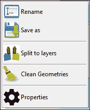

```py
class RightClickMenu_VectorLayer(tk.Menu):
    def __init__(self, master, layerspane, layeritem, statusbar, **kwargs):
        # Make this class a subclass of tk.Menu and add to it
        tk.Menu.__init__(self, master, tearoff=0, **kwargs)
        self.layerspane = layerspane
        self.layeritem = layeritem
        self.statusbar = statusbar
        self.imgs = dict()

        # Renaming
        self.imgs["rename"] = icons.get("rename.png", width=32, height=32)
        self.add_command(label="Rename", command=self.layeritem.ask_rename, image=self.imgs["rename"], compound="left")

        # Saving
        def ask_save():
            savepath = asksaveasfilename()
            self.statusbar.task.start("Saving layer to file...")
            pending = dispatch.request_results(self.layeritem.renderlayer.data.save, args=[savepath])
            def finish(result):
                if isinstance(result, Exception):
                    popup_message(self, str(result) + "\n\n" + savepath)
                self.statusbar.task.stop()
            dispatch.after_completion(self, pending, finish)
        self.imgs["save"] = icons.get("save.png", width=32, height=32)
        self.add_command(label="Save as", command=ask_save, image=self.imgs["save"], compound="left")

        # ---(Breakline)---
        self.add_separator()

        # Splitting
        def open_options_window():
            window = VectorSplitOptionWindow(self.layeritem, self.layerspane, self.layeritem, statusbar)
        self.imgs["split"] = icons.get("split.png", width=32, height=32)
        self.add_command(label="Split to layers", command=open_options_window, image=self.imgs["split"], compound="left")

        # ---(Breakline)---
        self.add_separator()

        # Cleaning
        def open_options_window():
            window = VectorCleanOptionWindow(self.layeritem, self.layerspane, self.layeritem, statusbar)
        self.imgs["clean"] = icons.get("clean.png", width=32, height=32)
        self.add_command(label="Clean Geometries", command=open_options_window, image=self.imgs["clean"], compound="left")

        # ---(Breakline)---
        self.add_separator()

        # View properties
        def view_properties():
            window = VectorLayerOptionsWindow(self.layeritem, self.layeritem, statusbar)
        self.imgs["properties"] = icons.get("properties.png", width=32, height=32)
        self.add_command(label="Properties", command=view_properties, image=self.imgs["properties"], compound="left")
```

然后我们转向栅格层选项菜单。这里唯一的层特定功能是`resample()`，所以找到并保存一个图标作为`app/icons/resample.png`。你可以在以下截图看到一个名为**Resample**的图标：

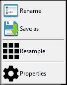

参考以下代码：

```py
class RightClickMenu_RasterLayer(tk.Menu):
    def __init__(self, master, layerspane, layeritem, statusbar, **kwargs):
        # Make this class a subclass of tk.Menu and add to it
        tk.Menu.__init__(self, master, tearoff=0, **kwargs)
        self.layerspane = layerspane
        self.layeritem = layeritem
        self.statusbar = statusbar
        self.imgs = dict()

        # Renaming
        self.imgs["rename"] = icons.get("rename.png", width=32, height=32)
        self.add_command(label="Rename", command=self.layeritem.ask_rename, image=self.imgs["rename"], compound="left")

        # Saving
        def ask_save():
            savepath = asksaveasfilename()
            self.statusbar.task.start("Saving layer to file...")
            pending = dispatch.request_results(self.layeritem.renderlayer.data.save, args=[savepath])
            def finish(result):
                if isinstance(result, Exception):
                    popup_message(self, str(result) + "\n\n" + savepath)
                self.statusbar.task.stop()
            dispatch.after_completion(self, pending, finish)
        self.imgs["save"] = icons.get("save.png", width=32, height=32)
        self.add_command(label="Save as", command=ask_save, image=self.imgs["save"], compound="left")

        # ---(Breakline)---
        self.add_separator()

        # Resampling
        def open_options_window():
            window = RasterResampleOptionWindow(self.layeritem, self.layerspane, self.layeritem, statusbar)
        self.imgs["resample"] = icons.get("resample.png", width=32, height=32)
        self.add_command(label="Resample", command=open_options_window, image=self.imgs["resample"], compound="left")

        # ---(Breakline)---
        self.add_separator()

        # View properties
        def view_properties():
            window = RasterLayerOptionsWindow(self.layeritem, self.layeritem, statusbar)
        self.imgs["properties"] = icons.get("properties.png", width=32, height=32)
        self.add_command(label="Properties", command=view_properties, image=self.imgs["properties"], compound="left")
```

### 定义工具选项窗口

在前面的代码中，点击菜单中的项目将打开特定工具的选项窗口。我们现在将在`app/dialogues.py`中创建这些选项窗口，利用我们有用的`RunToolFrame`模板用适当的选项和小部件填充窗口。由于这些是层特定工具，我们也记得将层数据作为一个隐藏参数设置。最后，将处理结果添加到我们的 LayersPane 中。以下截图显示了矢量清理的选项窗口：

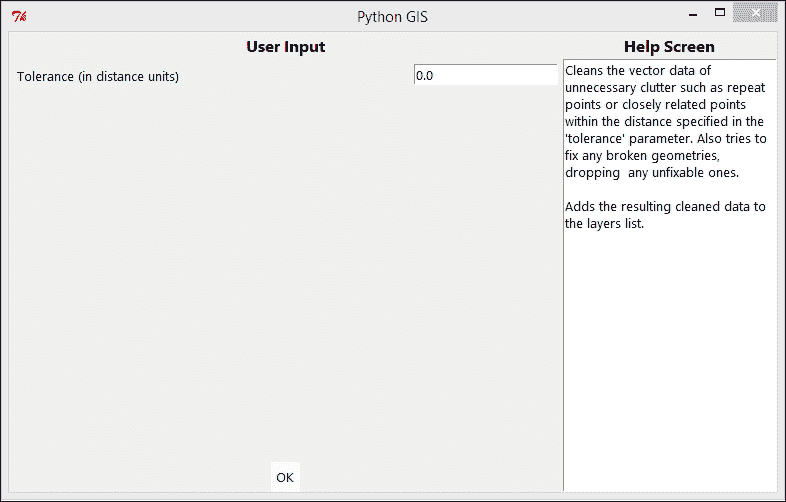

这是实现所提及功能的代码：

```py
class VectorCleanOptionWindow(Window):
    def __init__(self, master, layerspane, layeritem, statusbar, **kwargs):
        # Make this class a subclass and add to it
        Window.__init__(self, master, **kwargs)

        # Create runtoolframe
        self.runtool = RunToolFrame(self)
        self.runtool.pack(fill="both", expand=True)
        self.runtool.assign_statusbar(statusbar)

        # Add a hidden option from its associated layeritem data
        self.runtool.add_hidden_option(argname="data", value=layeritem.renderlayer.data)

        # Set the remaining options
        self.runtool.set_target_method("Cleaning data...", vector.manager.clean)
        self.runtool.add_option_input(argname="tolerance", label="Tolerance (in distance units)",
                             valuetype=float, default=0.0, minval=0.0, maxval=1.0)

        # Define how to process
        newname = layeritem.namelabel["text"] + "_cleaned"
        def process(result):
            if isinstance(result, Exception):
                popup_message(self, "Failed to clean the data:" + "\n\n" + str(result) )
            else:
                layerspane.add_layer(result, name=newname)
                self.destroy()

        self.runtool.set_finished_method(process)
```

以下截图展示了填充了可供选择的字段列表的矢量分割选项窗口：

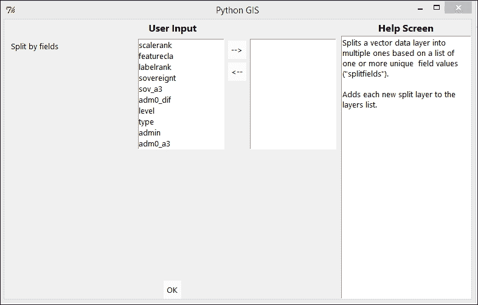

这是实现所提及功能的代码：

```py
class VectorSplitOptionWindow(Window):
    def __init__(self, master, layerspane, layeritem, statusbar, **kwargs):
        # Make this class a subclass and add to it
        Window.__init__(self, master, **kwargs)

        # Create runtoolframe
        self.runtool = RunToolFrame(self)
        self.runtool.pack(fill="both", expand=True)
        self.runtool.assign_statusbar(statusbar)

        # Add a hidden option from its associated layeritem data
        self.runtool.add_hidden_option(argname="data", value=layeritem.renderlayer.data)

        # Set the remaining options
        self.runtool.set_target_method("Splitting data...", vector.manager.split)
        self.runtool.add_option_input(argname="splitfields",
                              label="Split by fields",
                              multi=True, choices=layeritem.renderlayer.data.fields,
                              valuetype=str)

        # Define how to process
        def process(result):
            if isinstance(result, Exception):
                popup_message(self, "Failed to split the data:" + "\n\n" + str(result) )
            else:
                for splitdata in result:
                    layerspane.add_layer(splitdata)
                    self.update()
                self.destroy()
        self.runtool.set_finished_method(process)
```

如以下截图所示的栅格重采样窗口中，用户可以手动输入栅格的高度和宽度以及单元格数据：

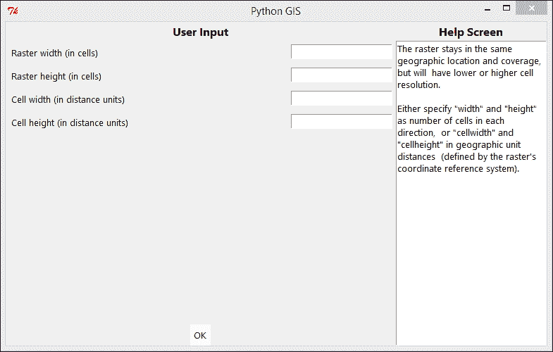

这里是相同功能的代码：

```py
class RasterResampleOptionWindow(Window):
    def __init__(self, master, layerspane, layeritem, statusbar, **kwargs):
        # Make this class a subclass and add to it
        Window.__init__(self, master, **kwargs)

        # Create runtoolframe
        self.runtool = RunToolFrame(self)
        self.runtool.pack(fill="both", expand=True)
        self.runtool.assign_statusbar(statusbar)

        # Add a hidden option from its associated layeritem data
        self.runtool.add_hidden_option(argname="raster", value=layeritem.renderlayer.data)

        # Set the remaining options
        self.runtool.set_target_method("Resampling data...", raster.manager.resample)
        def get_data_from_layername(name):
            data = None
            for layeritem in layerspane:
                if layeritem.name_label["text"] == name:
                    data = layeritem.renderlayer.data
                    break
            return data
        self.runtool.add_option_input(argname="width", label="Raster width (in cells)",
                                valuetype=int)
        self.runtool.add_option_input(argname="height", label="Raster height (in cells)",
                                valuetype=int)
        self.runtool.add_option_input(argname="cellwidth", label="Cell width (in distance units)",
                                valuetype=float)
        self.runtool.add_option_input(argname="cellheight", label="Cell height (in distance units)",
                                valuetype=float)
        # Define how to process after finished
        def process(result):
            if isinstance(result, Exception):
                popup_message(self, "Failed to resample the data:" + "\n\n" + str(result) )
            else:
                layerspane.add_layer(result)
                self.destroy()
        self.runtool.set_finished_method(process)
```

最后，我们需要指示我们的应用程序，在图层上右键单击应打开适当的菜单。我们在`app/builder.py`模块中定义 GUI 类的初始化阶段中定义了这个，在创建 LayersPane 之后：

```py
        # Bind layeritem right click behavior
        def layer_rightclick(event):
            layeritem = event.widget.master.master
            if isinstance(layeritem.renderlayer, pg.renderer.VectorLayer):
                menu = RightClickMenu_VectorLayer(self, self.layerspane, layeritem, self.statusbar)
            elif isinstance(layeritem.renderlayer, pg.renderer.RasterLayer):
                menu = RightClickMenu_RasterLayer(self, self.layerspane, layeritem, self.statusbar)
            # Place and show menu
            menu.post(event.x_root, event.y_root)      
        self.layerspane.bind_layer_rightclick(layer_rightclick)
```

## 设置管理标签

与单个图层的右键菜单相比，顶部的标签栏应该保留用于更通用的功能，这些功能需要多个图层作为输入。

我们所有的数据管理相关功能都放在一个名为**管理**的单独标签中，我们将矢量工具栏和栅格工具栏附加到该标签上，每个工具栏都包含一个或多个按钮，这些按钮打开一个选项窗口以运行相关功能。因此，我们在创建标签栏和可视化标签后，在 GUI 类中的`app/builder.py`中添加了以下内容，如下面的截图所示：

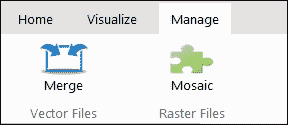

这里是设置**管理**标签的代码：

```py
        ## Management tab
        managetab = self.ribbon.add_tab("Manage")
        ### (Vector toolbar)
        vectorfiles = managetab.add_toolbar("Vector Files")
        def open_merge_window():
            window = VectorMergeOptionWindow(self, self.layerspane, self.statusbar)
        vectorfiles.add_button(text="Merge", icon="vector_merge.png",
                               command=open_merge_window)
        ### (Raster toolbar)
        rasterfiles = managetab.add_toolbar("Raster Files")
        def open_mosaic_window():
            window = RasterMosaicOptionWindow(self, self.layerspane, self.statusbar)
        rasterfiles.add_button(text="Mosaic", icon="mosaic.png",
                               command=open_mosaic_window)
```

### 定义工具选项窗口

我们在`app/dialogues.py`中定义了各种工具特定的选项窗口，就像我们在文本中之前所做的那样。首先是为矢量合并工具窗口，如下面的截图所示：

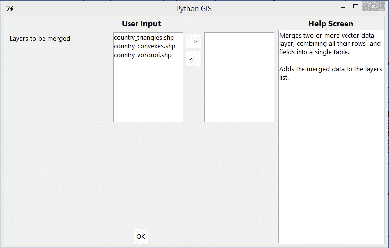

这里是相同的代码：

```py
class VectorMergeOptionWindow(Window):
    def __init__(self, master, layerspane, statusbar, **kwargs):
        # Make this class a subclass and add to it
        Window.__init__(self, master, **kwargs)

        # Create runtoolframe
        self.runtool = RunToolFrame(self)
        self.runtool.pack(fill="both", expand=True)
        self.runtool.assign_statusbar(statusbar)

        # Set the remaining options
        self.runtool.set_target_method("Merging data...", vector.manager.merge)
        def get_data_from_layername(name):
            data = None
            for layeritem in layerspane:
                if layeritem.namelabel["text"] == name:
                    data = layeritem.renderlayer.data
                    break
            return data
        self.runtool.add_option_input(argname=None,
                              label="Layers to be merged",
                              multi=True,
                              choices=[layeritem.namelabel["text"] for layeritem in layerspane],
                              valuetype=get_data_from_layername)

        # Define how to process
        def process(result):
            if isinstance(result, Exception):
                popup_message(self, "Failed to merge the data:" + "\n\n" + str(result) )
            else:
                layerspane.add_layer(result, name="merged")
        self.runtool.set_finished_method(process)
```

栅格镶嵌工具的选项窗口如下所示：

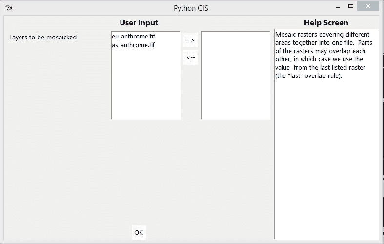

这里是代码：

```py
class RasterMosaicOptionWindow(Window):
    def __init__(self, master, layerspane, statusbar, **kwargs):
        # Make this class a subclass and add to it
        Window.__init__(self, master, **kwargs)

        # Create runtoolframe
        self.runtool = RunToolFrame(self)
        self.runtool.pack(fill="both", expand=True)
        self.runtool.assign_statusbar(statusbar)

        # Set the remaining options
        self.runtool.set_target_method("Mosaicking data...", raster.manager.mosaic)
        def get_data_from_layername(name):
            data = None
            for layeritem in layerspane:
                if layeritem.namelabel["text"] == name:
                    data = layeritem.renderlayer.data
                    break
            return data
        self.runtool.add_option_input(argname=None,
                              label="Layers to be mosaicked",
                              multi=True,
                              choices=[layeritem.namelabel["text"] for layeritem in layerspane],
                              valuetype=get_data_from_layername)

        # Define how to process
        def process(result):
            if isinstance(result, Exception):
                popup_message(self, "Failed to mosaick the data:" + "\n\n" + str(result) )
            else:
                layerspane.add_layer(result, name="mosaicked")
        self.runtool.set_finished_method(process)
```

# 概述

在本章中，我们创建了与管理和组织文件相关的功能。这包括一个窗口来检查任何数据层的基本属性。至于操作，我们实现了矢量数据的分割、合并和几何清理，以及栅格数据的镶嵌和重采样。然后，这些功能在应用程序 GUI 中可用，一些是通过在图层上右键单击时从弹出菜单中选择，另一些是通过在顶部的标签栏上的管理标签中单击图标按钮。每个工具都有自己的窗口对话框类，具有可编辑的选项。

通过阅读本章，你现在应该知道添加地理空间功能的一般步骤，使其在 GUI 中可用，并在需要时将其作为新图层添加。当我们进入下一章，我们将构建一些基本分析功能时，我们只需要重复并遵循相同的步骤和程序。
