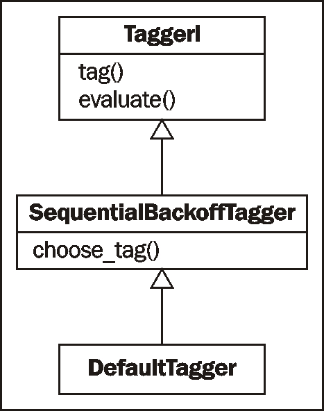
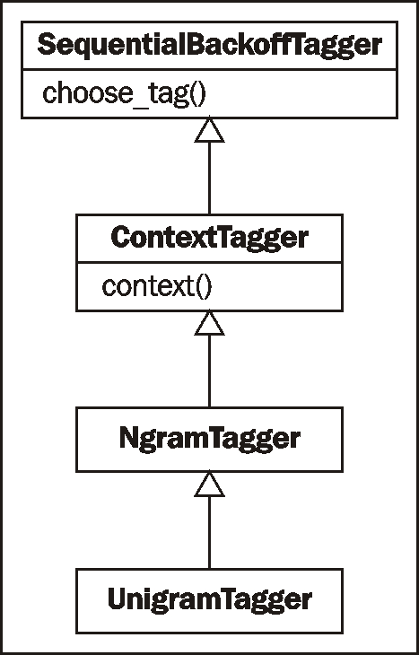
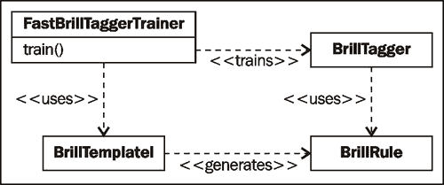
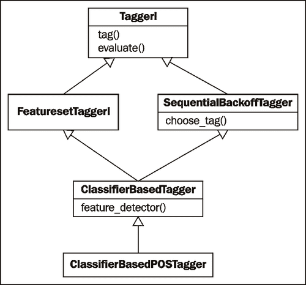

# 第四章 词性分词

在本章中，我们将介绍：

+   默认分词

+   训练单词词性分词器

+   将分词器与回退分词结合

+   训练和组合 Ngram 分词器

+   创建可能的单词标记模型

+   使用正则表达式进行分词

+   词缀分词

+   训练 Brill 分词器

+   训练 TnT 分词器

+   使用 WordNet 进行分词

+   分词专有名词

+   基于分类器的分词

# 简介

**词性分词** 是将句子（以单词列表的形式）转换为元组列表的过程，其中每个元组的形式为 `(word, tag)`。**标记** 是词性标记，表示单词是名词、形容词、动词等。

我们将要介绍的多数分词器都是可训练的。它们使用标记过的句子列表作为训练数据，例如从 `TaggedCorpusReader` 的 `tagged_sents()` 函数中获取的数据（参见第三章 *创建自定义语料库* 中的 *创建词性标记的词语语料库* 菜单，更多详情请参阅 *创建自定义语料库*）。有了这些训练句子，分词器会生成一个内部模型，告诉它们如何标记一个单词。其他分词器使用外部数据源或匹配单词模式来为单词选择一个标记。

NLTK 中的所有分词器都在 `nltk.tag` 包中，并继承自 `TaggerI` 基类。`TaggerI` 要求所有子类实现一个 `tag()` 方法，该方法接收一个单词列表作为输入，并返回一个标记过的单词列表作为输出。`TaggerI` 还提供了一个 `evaluate()` 方法来评估分词器的准确性（在 *默认分词* 菜单的末尾介绍）。许多分词器也可以组合成一个回退链，这样如果某个分词器无法标记一个单词，则使用下一个分词器，依此类推。

词性分词是 *短语提取* 之前的一个必要步骤，*短语提取* 在第五章 *提取短语* 中介绍。没有词性标记，短语提取器无法知道如何从句子中提取短语。但是有了词性标记，你可以告诉短语提取器如何根据标记模式来识别短语。

# 默认分词

默认分词为词性分词提供了一个基线。它简单地将相同的词性标记分配给每个标记。我们使用 `DefaultTagger` 来完成这个操作。

## 准备工作

我们将使用 `treebank` 语料库来完成本章的大部分内容，因为它是一个常见的标准，加载和测试都很快速。但我们所做的一切都应该同样适用于 `brown`、`conll2000` 和任何其他词性标记语料库。

## 如何操作...

`DefaultTagger` 接收一个单一参数——你想要应用的标记。我们将给它 `'NN'`，这是单数名词的标记。

```py
>>> from nltk.tag import DefaultTagger
>>> tagger = DefaultTagger('NN')
>>> tagger.tag(['Hello', 'World'])
[('Hello', 'NN'), ('World', 'NN')]
```

每个标签器都有一个`tag()`方法，它接受一个标记列表，其中每个标记是一个单词。这个标记列表通常是由单词分词器（见第一章，*Tokenizing Text and WordNet Basics* 中有关分词的更多信息）生成的单词列表。正如你所看到的，`tag()`返回一个标记标记列表，其中标记标记是一个`(word, tag)`元组。

## 如何工作...

`DefaultTagger`是`SequentialBackoffTagger`的子类。`SequentialBackoffTagger`的每个子类都必须实现`choose_tag()`方法，该方法接受三个参数：

1.  `tokens`的列表。

1.  当前标记的`index`，我们想要选择其标签。

1.  `history`，它是一个先前标签的列表。

`SequentialBackoffTagger`实现了`tag()`方法，该方法对标记列表中的每个索引调用子类的`choose_tag()`，同时累积先前标记的标记历史。这就是`SequentialBackoffTagger`中“Sequential”的原因。我们将在*Combining taggers with backoff tagging*配方中介绍名称中的*Backoff*部分。以下是一个显示继承树的图表：



`DefaultTagger`的`choose_tag()`方法非常简单——它返回我们在初始化时给出的标签。它不关心当前标记或历史记录。

## 更多内容...

你可以为`DefaultTagger`分配很多不同的标签。你可以在[`www.ling.upenn.edu/courses/Fall_2003/ling001/penn_treebank_pos.html`](http://www.ling.upenn.edu/courses/Fall_2003/ling001/penn_treebank_pos.html)找到`treebank`语料库中所有可能标签的完整列表。这些标签也在附录 *Penn Treebank Part-of-Speech Tags* 中进行了说明。

### 评估准确性

要了解标签器的准确性，你可以使用`evaluate()`方法，该方法接受一个标记标记列表作为黄金标准来评估标签器。使用我们之前创建的默认标签器，我们可以将其与`treebank`语料库的标记句子子集进行比较。

```py
>>> from nltk.corpus import treebank
>>> test_sents = treebank.tagged_sents()[3000:]
>>> tagger.evaluate(test_sents)
0.14331966328512843
```

因此，只需为每个标签选择`'NN'`，我们就可以在`treebank`语料库的四分之一上实现 14%的准确性测试。我们将在未来的配方中重复使用这些相同的`test_sents`来评估更多的标签器。

### 批量标签化句子

`TaggerI`还实现了一个`batch_tag()`方法，可以用来对一系列句子进行标签化，而不是单个句子。以下是对两个简单句子进行标签化的示例：

```py
>>> tagger.batch_tag([['Hello', 'world', '.'], ['How', 'are', 'you', '?']])
[[('Hello', 'NN'), ('world', 'NN'), ('.', 'NN')], [('How', 'NN'), ('are', 'NN'), ('you', 'NN'), ('?', 'NN')]]
```

结果是两个已标记句子的列表，当然，每个标签都是`NN`，因为我们正在使用`DefaultTagger`。如果你有很多句子需要一次性进行标签化，`batch_tag()`方法非常有用。

### 解除已标记句子的标签

可以使用`nltk.tag.untag()`来解除已标记句子的标签。调用此函数并传入一个已标记句子将返回一个不带标签的单词列表。

```py
>>> from nltk.tag import untag
>>> untag([('Hello', 'NN'), ('World', 'NN')])
['Hello', 'World']
```

## 参考信息

关于分词的更多信息，请参阅第一章，*分词和 WordNet 基础知识*。要了解更多关于标记句子的信息，请参阅第三章中的*创建自定义语料库*配方。要查看在树库语料库中找到的所有词性标记的完整列表，请参阅附录，*Penn Treebank 词性标记*。

# 训练单语词性标记器

**单语**通常指单个标记。因此，*单语标记器*仅使用单个单词作为其*上下文*来确定词性标记。

`UnigramTagger`继承自`NgramTagger`，而`NgramTagger`是`ContextTagger`的子类，`ContextTagger`继承自`SequentialBackoffTagger`。换句话说，`UnigramTagger`是一个*基于上下文*的标记器，其上下文是一个单词，或单语。

## 如何操作...

`UnigramTagger`可以通过在初始化时提供标记句子列表来训练。

```py
>>> from nltk.tag import UnigramTagger
>>> from nltk.corpus import treebank
>>> train_sents = treebank.tagged_sents()[:3000]
>>> tagger = UnigramTagger(train_sents)
>>> treebank.sents()[0]
['Pierre', 'Vinken', ',', '61', 'years', 'old', ',', 'will', 'join', 'the', 'board', 'as', 'a', 'nonexecutive', 'director', 'Nov.', '29', '.']
>>> tagger.tag(treebank.sents()[0])
[('Pierre', 'NNP'), ('Vinken', 'NNP'), (',', ','), ('61', 'CD'), ('years', 'NNS'), ('old', 'JJ'), (',', ','), ('will', 'MD'), ('join', 'VB'), ('the', 'DT'), ('board', 'NN'), ('as', 'IN'), ('a', 'DT'), ('nonexecutive', 'JJ'), ('director', 'NN'), ('Nov.', 'NNP'), ('29', 'CD'), ('.', '.')]
```

我们使用`treebank`语料库的前 3,000 个标记句子作为训练集来初始化`UnigramTagger`。然后我们将第一句话视为单词列表，并可以看到它是如何通过`tag()`函数转换为标记标记列表的。

## 工作原理...

`UnigramTagger`从标记句子列表中构建一个*上下文模型*。因为`UnigramTagger`继承自`ContextTagger`，所以它必须实现一个`context()`方法，该方法接受与`choose_tag()`相同的三个参数。在这种情况下，`context()`的结果是单词标记。上下文标记用于创建模型，并在模型创建后查找最佳标记。以下是一个继承图，显示了从`SequentialBackoffTagger`开始的每个类：



让我们看看`UnigramTagger`在测试句子上的准确率如何（参见前面的配方了解`test_sents`是如何创建的）。

```py
>>> tagger.evaluate(test_sents)
0.85763004532700193
```

对于仅使用单个单词查找来确定词性标记的标记器来说，其准确率高达 86%。从现在开始，所有准确率的提升都将非常小。

## 更多内容...

模型构建实际上是在`ContextTagger`中实现的。给定标记句子列表，它计算每个上下文中标记出现的频率。上下文中频率最高的标记存储在模型中。

### 覆盖上下文模型

所有继承自`ContextTagger`的标记器都可以使用预构建的模型，而不是自己训练。这个模型只是一个将上下文键映射到标记的 Python `dict`。上下文键将取决于`ContextTagger`子类从其`context()`方法返回的内容。对于`UnigramTagger`，上下文键是单个单词。但对于其他`NgramTagger`子类，上下文键将是元组。

这里有一个例子，我们向`UnigramTagger`传递一个非常简单的模型，而不是训练集：

```py
>>> tagger = UnigramTagger(model={'Pierre': 'NN'})
>>> tagger.tag(treebank.sents()[0])
[('Pierre', 'NN'), ('Vinken', None), (',', None), ('61', None), ('years', None), ('old', None), (',', None), ('will', None), ('join', None), ('the', None), ('board', None), ('as', None), ('a', None), ('nonexecutive', None),('director', None), ('Nov.', None), ('29', None), ('.', None)]
```

由于模型只包含上下文键`'Pierre'`，因此只有第一个单词得到了标签。由于上下文词不在模型中，其他每个单词的标签都是`None`。所以除非你确切知道你在做什么，否则让标记器自己训练模型，而不是传递你自己的模型。

将自定义模型传递给`UnigramTagger`的一个好例子是当你有一个单词和标签的字典，并且你知道每个单词都应该始终映射到其标签。然后，你可以将这个`UnigramTagger`作为你的第一个回退标记器（在下一个菜谱中介绍），以查找无歧义单词的标签。

### 最小频率截止值

`ContextTagger`使用出现频率来决定给定上下文中最可能的标签。默认情况下，即使上下文词和标签只出现一次，它也会这样做。如果你想设置一个最小频率阈值，那么你可以向`UnigramTagger`传递一个`cutoff`值。

```py
>>> tagger = UnigramTagger(train_sents, cutoff=3)
>>> tagger.evaluate(test_sents)
0.775350744657889
```

在这种情况下，使用`cutoff=3`降低了准确率，但有时设置截止值可能是个好主意。

## 参见

在下一个菜谱中，我们将介绍回退标记以结合标记器。在*创建可能的单词标签模型*菜谱中，我们将学习如何统计地确定非常常见单词的标签。

# 结合标记器与回退标记

**回退标记**是`SequentialBackoffTagger`的核心功能之一。它允许你将标记器链接在一起，以便如果一个标记器不知道如何标记一个单词，它可以将其传递给下一个回退标记器。如果那个标记器也不能这样做，它可以将其传递给下一个回退标记器，依此类推，直到没有回退标记器可以检查。

## 如何做到这一点...

`SequentialBackoffTagger`的每个子类都可以接受一个`backoff`关键字参数，其值是另一个`SequentialBackoffTagger`实例。因此，我们将使用*默认标记*菜谱中的`DefaultTagger`作为*训练单语词性标记器*菜谱中的`UnigramTagger`的`backoff`。请参阅这两个菜谱以了解`train_sents`和`test_sents`的详细信息。

```py
>>> tagger1 = DefaultTagger('NN')
>>> tagger2 = UnigramTagger(train_sents, backoff=tagger1)
>>> tagger2.evaluate(test_sents)
0.87459529462551266
```

在`UnigramTagger`无法对单词进行标记时，我们使用默认标签`NN`，从而将准确率提高了近 2%！

## 它是如何工作的...

当`SequentialBackoffTagger`初始化时，它会创建一个包含自身作为第一个元素的内部回退标记器列表。如果提供了一个`backoff`标记器，那么回退标记器的内部标记器列表将被附加。以下是一些代码示例来说明这一点：

```py
>>> tagger1._taggers == [tagger1]
True
>>> tagger2._taggers == [tagger2, tagger1]
True
```

`_taggers`是`SequentialBackoffTagger`在调用`tag()`方法时使用的内部回退标记器列表。它遍历其标记器列表，对每个标记器调用`choose_tag()`。一旦找到标记，它就停止并返回该标记。这意味着如果主要标记器可以标记单词，那么返回的将是该标记。但如果返回`None`，则尝试下一个标记器，依此类推，直到找到标记，或者返回`None`。当然，如果您的最终回退标记器是`DefaultTagger`，则永远不会返回`None`。

## 还有更多...

虽然 NLTK 中包含的大多数标记器都是`SequentialBackoffTagger`的子类，但并非所有都是。在后面的菜谱中，我们将介绍一些标记器，它们不能作为回退标记链的一部分使用，例如`BrillTagger`。然而，这些标记器通常需要另一个标记器作为基线，而`SequentialBackoffTagger`通常是一个很好的选择。

### 序列化和反序列化训练好的标记器

由于训练标记器可能需要一段时间，而且您通常只需要进行一次训练，因此将训练好的标记器进行序列化是一个有用的方法来保存它以供以后使用。如果您的训练好的标记器名为`tagger`，那么以下是如何使用`pickle`进行序列化和反序列化的方法：

```py
>>> import pickle
>>> f = open('tagger.pickle', 'w')
>>> pickle.dump(tagger, f)
>>> f.close()
>>> f = open('tagger.pickle', 'r')
>>> tagger = pickle.load(f)
```

如果您的标记器 pickle 文件位于 NLTK 数据目录中，您也可以使用`nltk.data.load('tagger.pickle')`来加载标记器。

## 参见

在下一个菜谱中，我们将结合更多的标记器与回退标记。同时，查看前两个菜谱以获取关于`DefaultTagger`和`UnigramTagger`的详细信息。

# 训练和组合 Ngram 标记器

除了`UnigramTagger`之外，还有两个额外的`NgramTagger`子类：`BigramTagger`和`TrigramTagger`。`BigramTagger`使用前一个标记作为其上下文的一部分，而`TrigramTagger`使用前两个标记。**ngram**是*n*个项的子序列，因此`BigramTagger`查看两个项（前一个标记和单词），而`TrigramTagger`查看三个项。

这两个标记器擅长处理词性标记依赖于上下文的单词。许多单词的词性根据其使用方式不同而不同。例如，我们一直在谈论标记单词的标记器。在这种情况下，“标记”被用作动词。但标记的结果是词性标记，因此“标记”也可以作为名词。`NgramTagger`子类中的想法是，通过查看前一个单词和词性标记，我们可以更好地猜测当前单词的词性标记。

## 准备工作

请参阅本章的前两个菜谱，以获取构建`train_sents`和`test_sents`的详细信息。

## 如何操作...

单独使用时，`BigramTagger`和`TrigramTagger`的表现相当差。这主要是因为它们无法从句子的第一个单词（s）中学习上下文。

```py
>>> from nltk.tag import BigramTagger, TrigramTagger
>>> bitagger = BigramTagger(train_sents)
>>> bitagger.evaluate(test_sents)
0.11336067342974315
>>> tritagger = TrigramTagger(train_sents)
>>> tritagger.evaluate(test_sents)
0.0688107058061731
```

它们可以做出贡献的地方在于，当我们将它们与回退标记结合使用时。这次，我们不会单独创建每个标记器，而是创建一个函数，该函数将接受`train_sents`、一个`SequentialBackoffTagger`类列表和一个可选的最终回退标记器，然后使用上一个标记器作为回退来训练每个标记器。以下是来自`tag_util.py`的代码：

```py
def backoff_tagger(train_sents, tagger_classes, backoff=None):
  for cls in tagger_classes:
    backoff = cls(train_sents, backoff=backoff)
  return backoff
```

使用它，我们可以这样做：

```py
>>> from tag_util import backoff_tagger
>>> backoff = DefaultTagger('NN')
>>> tagger = backoff_tagger(train_sents, [UnigramTagger, BigramTagger, TrigramTagger], backoff=backoff)
>>> tagger.evaluate(test_sents)
0.88163177206993304
```

因此，通过在回退链中包含`BigramTagger`和`TrigramTagger`，我们几乎提高了 1%的准确率。对于除`treebank`之外的其他语料库，准确率的提高可能更为显著。

## 它是如何工作的...

`backoff_tagger`函数在列表中的每个标记器类中创建一个实例，给它`train_sents`和上一个标记器作为回退。标记器类列表的顺序非常重要——列表中的第一个类将首先进行训练，并得到初始回退标记器。然后，该标记器将成为列表中下一个标记器类的回退标记器。返回的最后一个标记器将是列表中最后一个标记器类的实例。以下是一些澄清此链的代码：

```py
>>> tagger._taggers[-1] == backoff
True
>>> isinstance(tagger._taggers[0], TrigramTagger)
True
>>> isinstance(tagger._taggers[1], BigramTagger)
True
```

因此，我们最终得到一个`TrigramTagger`，其第一个回退是`BigramTagger`。然后下一个回退将是`UnigramTagger`，其回退是`DefaultTagger`。

## 还有更多...

`backoff_tagger`函数不仅与`NgramTagger`类一起工作。它可以用于构建包含任何`SequentialBackoffTagger`子类的链。

`BigramTagger`和`TrigramTagger`，因为它们是`NgramTagger`和`ContextTagger`的子类，也可以接受一个模型和截断参数，就像`UnigramTagger`一样。但与`UnigramTagger`不同，模型的上下文键必须是 2 元组，其中第一个元素是历史的一部分，第二个元素是当前标记。对于`BigramTagger`，适当上下文键看起来像`((prevtag,), word)`，而对于`TrigramTagger`，它看起来像`((prevtag1, prevtag2), word)`。

### 四元组标记器

`NgramTagger`类可以单独使用来创建一个标记器，该标记器使用超过三个 Ngrams 作为其上下文键。

```py
>>> from nltk.tag import NgramTagger
>>> quadtagger = NgramTagger(4, train_sents)
>>> quadtagger.evaluate(test_sents)
0.058191236779624435
```

它甚至比`TrigramTagger`还要糟糕！这里有一个`QuadgramTagger`的替代实现，我们可以将其包含在`backoff_tagger`列表中。此代码可在`taggers.py`中找到：

```py
from nltk.tag import NgramTagger

class QuadgramTagger(NgramTagger):
  def __init__(self, *args, **kwargs):
    NgramTagger.__init__(self, 4, *args, **kwargs)
```

这基本上是`BigramTagger`和`TrigramTagger`的实现方式；它们是`NgramTagger`的简单子类，通过在`context()`方法的`history`参数中传递要查看的*ngrams*数量。

现在我们来看看它作为回退链的一部分是如何表现的：

```py
>>> from taggers import QuadgramTagger
>>> quadtagger = backoff_tagger(train_sents, [UnigramTagger, BigramTagger, TrigramTagger, QuadgramTagger], backoff=backoff)
>>> quadtagger.evaluate(test_sents)
0.88111374919058927
```

实际上，当我们停止使用`TrigramTagger`时，它比之前稍微差一点。所以教训是，过多的上下文可能会对准确率产生负面影响。

## 参见

前两个配方涵盖了`UnigramTagger`和回退标记。

# 创建可能的词标记模型

如本章 *训练一个一元词性标注器* 菜谱中提到的，使用自定义模型与 `UnigramTagger` 结合使用仅应在确切了解自己在做什么的情况下进行。在这个菜谱中，我们将为最常见的单词创建一个模型，其中大部分单词无论什么情况下总是有相同的标记。

## 如何做到这一点...

要找到最常见的单词，我们可以使用 `nltk.probability.FreqDist` 来统计 `treebank` 语料库中的单词频率。然后，我们可以为标记过的单词创建一个 `ConditionalFreqDist`，其中我们统计每个单词每个标记的频率。使用这些计数，我们可以构建一个以 200 个最频繁单词作为键，每个单词的最频繁标记作为值的模型。以下是在 `tag_util.py` 中定义的模型创建函数：

```py
from nltk.probability import FreqDist, ConditionalFreqDist

def word_tag_model(words, tagged_words, limit=200):
  fd = FreqDist(words)
  most_freq = fd.keys()[:limit]
  cfd = ConditionalFreqDist(tagged_words)
  return dict((word, cfd[word].max()) for word in most_freq)
```

要与 `UnigramTagger` 一起使用，我们可以这样做：

```py
>>> from tag_util import word_tag_model
>>> from nltk.corpus import treebank
>>> model = word_tag_model(treebank.words(), treebank.tagged_words())
>>> tagger = UnigramTagger(model=model)
>>> tagger.evaluate(test_sents)
0.55972372113101665
```

准确率接近 56% 还可以，但远远不如训练好的 `UnigramTagger`。让我们尝试将其添加到我们的回退链中：

```py
>>> default_tagger = DefaultTagger('NN')
>>> likely_tagger = UnigramTagger(model=model, backoff=default_tagger)
>>> tagger = backoff_tagger(train_sents, [UnigramTagger, BigramTagger, TrigramTagger], backoff=likely_tagger)
>>> tagger.evaluate(test_sents)
0.88163177206993304
```

最终的准确率与没有 `likely_tagger` 时完全相同。这是因为我们为了创建模型而进行的频率计算几乎与训练 `UnigramTagger` 时发生的情况完全相同。

## 它是如何工作的...

`word_tag_model()` 函数接受所有单词的列表、所有标记单词的列表以及我们想要用于模型的最大单词数。我们将单词列表传递给 `FreqDist`，该 `FreqDist` 统计每个单词的频率。然后，我们通过调用 `fd.keys()` 从 `FreqDist` 中获取前 200 个单词，该函数返回按最高频率到最低频率排序的所有单词。我们将标记单词列表传递给 `ConditionalFreqDist`，该 `ConditionalFreqDist` 为每个单词创建一个标记的 `FreqDist`，其中单词作为 *条件*。最后，我们返回一个字典，将前 200 个单词映射到它们最可能的标记。

## 还有更多...

看起来包含这个标注器似乎没有用处，因为它没有改变准确率。但这个菜谱的目的是演示如何为 `UnigramTagger` 构建一个有用的模型。自定义模型构建是一种创建手动覆盖训练标注器（否则是黑盒子）的方法。通过将可能的标注器放在链的前端，我们实际上可以略微提高准确率：

```py
>>> tagger = backoff_tagger(train_sents, [UnigramTagger, BigramTagger, TrigramTagger], backoff=default_tagger)
>>> likely_tagger = UnigramTagger(model=model, backoff=tagger)
>>> likely_tagger.evaluate(test_sents)
0.88245197496222749
```

将自定义模型标注器放在回退链的前端，可以让你完全控制特定单词的标注方式，同时让训练好的标注器处理其他所有事情。

## 参见

*训练一个一元词性标注器* 菜单中详细介绍了 `UnigramTagger` 和一个简单的自定义模型示例。有关回退标注的详细信息，请参阅之前的菜谱 *结合回退标注的标注器* 和 *训练和组合 Ngram 标注器*。

# 使用正则表达式进行标注

你可以使用正则表达式匹配来标记单词。例如，你可以使用 `\d` 匹配数字，分配标签 **CD**（指的是 **基数词**）。或者你可以匹配已知的单词模式，例如后缀 "ing"。这里有很多灵活性，但要注意不要过度指定，因为语言本身是不精确的，并且总有例外。

## 准备工作

为了使这个配方有意义，你应该熟悉正则表达式语法和 Python 的 `re` 模块。

## 如何做到这一点...

`RegexpTagger` 预期的是一个包含 2-元组的列表，其中元组的第一个元素是一个正则表达式，第二个元素是标签。以下模式可以在 `tag_util.py` 中找到：

```py
patterns = [
  (r'^\d+$', 'CD'),
  (r'.*ing$', 'VBG'), # gerunds, i.e. wondering
  (r'.*ment$', 'NN'), # i.e. wonderment
  (r'.*ful$', 'JJ') # i.e. wonderful
]
```

一旦构建了这个模式列表，就可以将其传递给 `RegexpTagger`。

```py
>>> from tag_util import patterns
>>> from nltk.tag import RegexpTagger
>>> tagger = RegexpTagger(patterns)
>>> tagger.evaluate(test_sents)
0.037470321605870924
```

所以仅凭几个模式并不太出色，但既然 `RegexpTagger` 是 `SequentialBackoffTagger` 的子类，它可以作为回退链的一部分很有用，特别是如果你能够想出更多的单词模式。

## 它是如何工作的...

`RegexpTagger` 保存了初始化时给出的 `patterns`，然后在每次调用 `choose_tag()` 时，它会遍历这些模式，并使用 `re.match()` 返回与当前单词匹配的第一个表达式的标签。这意味着如果有两个表达式可以匹配，第一个表达式的标签将始终返回，第二个表达式甚至不会被尝试。

## 还有更多...

如果你提供一个模式，例如 `(r'.*', 'NN')`，`RegexpTagger` 可以替换 `DefaultTagger`。这个模式当然应该在模式列表的末尾，否则其他模式将不会匹配。

## 参见

在下一个配方中，我们将介绍 `AffixTagger`，它学习如何根据单词的前缀和后缀进行标记。并且查看 *默认标记* 配方以了解 `DefaultTagger` 的详细信息。

# 前缀标记

`AffixTagger` 是另一个 `ContextTagger` 子类，但这次上下文是单词的 *前缀* 或 *后缀*。这意味着 `AffixTagger` 能够根据单词开头或结尾的固定长度子串来学习标签。

## 如何做到这一点...

`AffixTagger` 的默认参数指定了三个字符的后缀，并且单词长度至少为五个字符。如果一个单词的长度小于五个字符，那么返回的标签将是 `None`。

```py
>>> from nltk.tag import AffixTagger
>>> tagger = AffixTagger(train_sents)
>>> tagger.evaluate(test_sents)
0.27528599179797109
```

所以它使用默认参数本身做得还不错。让我们通过指定三个字符的前缀来试一试：

```py
>>> prefix_tagger = AffixTagger(train_sents, affix_length=3)
>>> prefix_tagger.evaluate(test_sents)
0.23682279300669112
```

要在双字符后缀上学习，代码看起来是这样的：

```py
>>> suffix_tagger = AffixTagger(train_sents, affix_length=-2)
>>> suffix_tagger.evaluate(test_sents)
0.31953377940859057
```

## 它是如何工作的...

`affix_length` 的正值意味着 `AffixTagger` 将学习单词前缀，本质上就是 `word[:affix_length]`。如果 `affix_length` 是负值，那么将使用 `word[affix_length:]` 来学习后缀。

## 还有更多...

如果你想学习多个字符长度的前缀，可以将多个 affix taggers 结合在一个回退链中。以下是一个示例，四个 `AffixTagger` 类学习两个和三个字符的前缀和后缀：

```py
>>> pre3_tagger = AffixTagger(train_sents, affix_length=3)
>>> pre3_tagger.evaluate(test_sents)
0.23682279300669112
>>> pre2_tagger = AffixTagger(train_sents, affix_length=2, backoff=pre3_tagger)
>>> pre2_tagger.evaluate(test_sents)
0.29816533563565722
>>> suf2_tagger = AffixTagger(train_sents, affix_length=-2, backoff=pre2_tagger)
>>> suf2_tagger.evaluate(test_sents)
0.32523203108137277
>>> suf3_tagger = AffixTagger(train_sents, affix_length=-3, backoff=suf2_tagger)
>>> suf3_tagger.evaluate(test_sents)
0.35924886682495144
```

如您所见，每次训练后准确性都会提高。

### 注意

前面的顺序既不是最好的，也不是最差的。我将把它留给你去探索可能性，并发现最佳的 `AffixTagger` 和 `affix_length` 值的回退链。

### 最小词干长度

`AffixTagger` 也接受一个具有默认值 `2` 的 `min_stem_length` 关键字参数。如果单词长度小于 `min_stem_length` 加上 `affix_length` 的绝对值，则 `context()` 方法返回 `None`。增加 `min_stem_length` 会迫使 `AffixTagger` 只在较长的单词上学习，而减少 `min_stem_length` 将允许它在较短的单词上学习。当然，对于较短的单词，`affix_length` 可能等于或大于单词长度，此时 `AffixTagger` 实际上就像一个 `UnigramTagger`。

## 参见

您可以使用正则表达式手动指定前缀和后缀，如前一个食谱所示。`训练单语素词性标注器` 和 `训练和组合 Ngram 标注器` 食谱中有关于 `NgramTagger` 子类的详细信息，这些子类也是 `ContextTagger` 的子类。

# 训练 Brill 标签器

`BrillTagger` 是一个基于转换的标注器。它是第一个不是 `SequentialBackoffTagger` 子类的标注器。相反，`BrillTagger` 使用一系列规则来纠正初始标注器的结果。这些规则根据它们纠正的错误数量减去它们产生的错误数量来评分。

## 如何操作...

这里是一个来自 `tag_util.py` 的函数，它使用 `FastBrillTaggerTrainer` 训练 `BrillTagger`。它需要一个 `initial_tagger` 和一个 `train_sents` 列表。

```py
from nltk.tag import brill

def train_brill_tagger(initial_tagger, train_sents, **kwargs):
  sym_bounds = [(1,1), (2,2), (1,2), (1,3)]
  asym_bounds = [(-1,-1), (1,1)]
  templates = [
  brill.SymmetricProximateTokensTemplate(brill.ProximateTagsRule, *sym_bounds),
    brill.SymmetricProximateTokensTemplate(brill.ProximateWordsRule, *sym_bounds),
    brill.ProximateTokensTemplate(brill.ProximateTagsRule, *asym_bounds),
    brill.ProximateTokensTemplate(brill.ProximateWordsRule, *asym_bounds)
  ]
  trainer = brill.FastBrillTaggerTrainer(initial_tagger, templates, deterministic=True)
  return trainer.train(train_sents, **kwargs)
```

要使用它，我们可以从 `NgramTagger` 类的回退链中创建我们的 `initial_tagger`，然后将它传递给 `train_brill_tagger()` 函数以获取 `BrillTagger`。

```py
>>> default_tagger = DefaultTagger('NN')
>>> initial_tagger = backoff_tagger(train_sents, [UnigramTagger, BigramTagger, TrigramTagger], backoff=default_tagger)
>>> initial_tagger.evaluate(test_sents)
0.88163177206993304
>>> from tag_util import train_brill_tagger
>>> brill_tagger = train_brill_tagger(initial_tagger, train_sents)
>>> brill_tagger.evaluate(test_sents)
0.88327217785452194
```

因此，`BrillTagger` 在 `initial_tagger` 上略微提高了准确性。

## 如何工作...

`FastBrillTaggerTrainer` 接受一个 `initial_tagger` 和一个 `templates` 列表。这些模板必须实现 `BrillTemplateI` 接口。NLTK 中包含的两个模板实现是 `ProximateTokensTemplate` 和 `SymmetricProximateTokensTemplate`。每个模板都用于生成 `BrillRule` 子类的列表。实际生成的规则类在初始化时传递给模板。基本工作流程如下：



使用的两个 `BrillRule` 子类是 `ProximateTagsRule` 和 `ProximateWordsRule`，它们都是 `ProximateTokensRule` 的子类。`ProximateTagsRule` 通过查看周围的标签来进行错误纠正，而 `ProximateWordsRule` 通过查看周围的单词。

我们传递给每个模板的 *边界* 是 `(start, end)` 元组的列表，这些元组作为 *条件* 传递给每个规则。条件告诉规则它可以查看哪些标记。例如，如果条件是 `(1, 1)`，则规则将只查看下一个标记。但如果条件是 `(1, 2)`，则规则将查看下一个标记和它后面的标记。对于 `(-1, -1)`，规则将只查看前面的标记。

`ProximateTokensTemplate` 生成 `ProximateTokensRule`，它会检查每个标记的给定条件以进行错误纠正。必须显式指定正负条件。另一方面，`SymmetricProximateTokensTemplate` 生成一对 `ProximateTokensRule`，其中一条规则使用给定条件，另一条规则使用条件的负值。因此，当我们向 `SymmetricProximateTokensTemplate` 传递一个包含正 `(start, end)` 元组的列表时，它也会生成一个使用 `(-start, -end)` 的 `ProximateTokensRule`。这就是它为什么是 *对称的*——它生成检查标记两边的规则。

### 注意

与 `ProximateTokensTemplate` 不同，你不应该给 `SymmetricProximateTokensTemplate` 提供负边界，因为它会自行生成。仅使用正数边界与 `SymmetricProximateTokensTemplate`。

## 更多...

您可以使用 `FastBrillTaggerTrainer.train()` 方法的 `max_rules` 关键字参数来控制生成的规则数量。默认值是 `200`。您还可以使用 `min_score` 关键字参数来控制使用的规则质量。默认值是 `2`，尽管 `3` 也是一个不错的选择。

### 注意

增加 `max_rules` 或 `min_score` 将大大增加训练时间，但不一定提高准确性。请谨慎更改这些值。

### 跟踪

您可以通过将 `trace=1` 传递给构造函数来观察 `FastBrillTaggerTrainer` 的工作。这可以给出如下输出：

```py
Training Brill tagger on 3000 sentences...

    Finding initial useful rules...

        Found 10709 useful rules.

    Selecting rules...
```

这意味着它找到了至少 `min_score` 分数的 `10709` 条规则，然后它选择最佳规则，保留不超过 `max_rules`。

默认是 `trace=0`，这意味着训练器将静默工作，不打印其状态。

## 参考也

“训练和组合 Ngram 标签器”配方详细说明了之前使用的 `initial_tagger` 的构建，而“默认标签”配方解释了 `default_tagger`。

# 训练 TnT 标签器

**TnT** 代表 **Trigrams'n'Tags**。它是一个基于二阶马尔可夫模型的统计标签器。您可以在 [`acl.ldc.upenn.edu/A/A00/A00-1031.pdf`](http://acl.ldc.upenn.edu/A/A00/A00-1031.pdf) 阅读导致其实施的原始论文。

## 如何做...

`TnT` 标签器的 API 与我们之前遇到的标签器略有不同。创建它之后，你必须显式调用 `train()` 方法。以下是一个基本示例：

```py
>>> from nltk.tag import tnt
>>> tnt_tagger = tnt.TnT()
>>> tnt_tagger.train(train_sents)
>>> tnt_tagger.evaluate(test_sents)
0.87580401467731495
```

它本身就是一个相当好的标记器，只比之前配方中的 `BrillTagger` 稍微不准确。但如果你在 `evaluate()` 之前没有调用 `train()`，你将得到 0% 的准确率。

## 它是如何工作的...

`TnT` 根据训练数据维护了多个内部 `FreqDist` 和 `ConditionalFreqDist` 实例。这些频率分布计算单语元、双语元和三元语。然后，在标记过程中，使用频率来计算每个单词可能标记的概率。因此，而不是构建 `NgramTagger` 子类的回退链，`TnT` 标记器使用所有 n-gram 模型一起选择最佳标记。它还尝试一次性猜测整个句子的标签，通过选择整个句子最可能的模型，基于每个可能标记的概率。

### 注意

训练相当快，但标记的速度比我们之前提到的其他标记器慢得多。这是因为必须进行所有浮点数学计算，以计算每个单词的标记概率。

## 还有更多...

`TnT` 接受一些可选的关键字参数。你可以传递一个用于未知单词的标记器作为 `unk`。如果这个标记器已经训练过，那么你也必须传递 `Trained=True`。否则，它将使用与传递给 `train()` 方法的相同数据调用 `unk.train(data)`。由于之前的标记器都没有公开的 `train()` 方法，我们建议如果你也传递了一个 `unk` 标记器，总是传递 `Trained=True`。以下是一个使用 `DefaultTagger` 的示例，它不需要任何训练：

```py
>>> from nltk.tag import DefaultTagger
>>> unk = DefaultTagger('NN')
>>> tnt_tagger = tnt.TnT(unk=unk, Trained=True)
>>> tnt_tagger.train(train_sents)
>>> tnt_tagger.evaluate(test_sents)
0.89272609540254699
```

因此，我们的准确率提高了近 2%！你必须使用一个可以在之前没有见过该单词的情况下标记单个单词的标记器。这是因为未知标记器的 `tag()` 方法只与单个单词的句子一起调用。其他好的未知标记器候选人是 `RegexpTagger` 或 `AffixTagger`。传递一个在相同数据上训练过的 `UnigramTagger` 几乎没有用处，因为它将看到完全相同的单词，因此有相同的未知单词盲点。

### 控制束搜索

你可以修改 `TnT` 的另一个参数是 `N`，它控制标记器在尝试猜测句子标签时保持的可能解决方案的数量。`N` 的默认值是 1,000。增加它将大大增加标记过程中使用的内存量，但并不一定增加准确性。减少 `N` 将减少内存使用，但可能会降低准确性。以下是将 `N` 设置为 100 时发生的情况：

```py
>>> tnt_tagger = tnt.TnT(N=100)
>>> tnt_tagger.train(train_sents)
>>> tnt_tagger.evaluate(test_sents)
0.87580401467731495
```

因此，准确率完全相同，但我们使用显著更少的内存来实现它。然而，不要假设减少 `N` 不会改变准确率；通过在自己的数据上实验来确保。

### 大写字母的重要性

如果你希望单词的大小写有意义，可以传递`C=True`。默认是`C=False`，这意味着所有单词都转换为小写。关于`C`的文档表示，将大小写视为重要可能不会提高准确性。在我的测试中，使用`C=True`时准确性略有增加（< 0.01%），这可能是由于大小写敏感性可以帮助识别专有名词。

## 参见

我们在*默认标记*配方中介绍了`DefaultTagger`，在*结合标记和回退标记*配方中介绍了回退标记，在*训练单语词性标记器*和*训练组合 Ngram 标记器*配方中介绍了`NgramTagger`子类，在*使用正则表达式标记*配方中介绍了`RegexpTagger`，在*词缀标记*配方中介绍了`AffixTagger`。

# 使用 WordNet 进行标记

如果你记得第一章中关于“在 Wordnet 中查找一个词的 synsets”的配方，WordNet synsets 指定了一个词性标签。这是一个非常有限的标签集合，许多词有多个 synsets，具有不同的词性标签，但这些信息对于标记未知词可能是有用的。WordNet 本质上是一个巨大的字典，它可能包含许多不在你的训练数据中的词。

## 准备工作

首先，我们需要决定如何将 WordNet 词性标签映射到我们一直在使用的宾州树库词性标签。以下是一个将一个映射到另一个的表格。有关更多详细信息，请参阅第一章中关于“在 Wordnet 中查找一个词的 synsets”的配方，*文本分词和 WordNet 基础知识*。其中，“s”，之前未展示，只是另一种形容词，至少在标记目的上是这样。

| WordNet 标签 | Treebank 标签 |
| --- | --- |
| n | NN |
| a | JJ |
| s | JJ |
| r | RB |
| v | VB |

## 如何实现...

现在，我们可以创建一个类，该类将在 WordNet 中查找单词，然后从它找到的 synsets 中选择最常见的标签。下面定义的`WordNetTagger`可以在`taggers.py`中找到：

```py
from nltk.tag import SequentialBackoffTagger
from nltk.corpus import wordnet
from nltk.probability import FreqDist

class WordNetTagger(SequentialBackoffTagger):
  '''
  >>> wt = WordNetTagger()
  >>> wt.tag(['food', 'is', 'great'])
  [('food', 'NN'), ('is', 'VB'), ('great', 'JJ')]
  '''
  def __init__(self, *args, **kwargs):
    SequentialBackoffTagger.__init__(self, *args, **kwargs)
    self.wordnet_tag_map = {
      'n': 'NN',
      's': 'JJ',
      'a': 'JJ',
      'r': 'RB',
      'v': 'VB'
    }
  def choose_tag(self, tokens, index, history):
    word = tokens[index]
    fd = FreqDist()
    for synset in wordnet.synsets(word):
      fd.inc(synset.pos)
    return self.wordnet_tag_map.get(fd.max())
```

## 它是如何工作的...

`WordNetTagger`简单地计算一个词的 synsets 中每个词性标签的数量。然后，最常见的标签通过内部映射映射到一个`treebank`标签。以下是一些示例用法代码：

```py
>>> from taggers import WordNetTagger
>>> wn_tagger = WordNetTagger()
>>> wn_tagger.evaluate(train_sents)
0.18451574615215904
```

所以这并不太准确，但这是可以预料的。我们只有足够的信息来产生四种不同的标签，而`treebank`中有 36 种可能的标签。而且许多词根据其上下文可以有不同的词性标签。但如果我们将`WordNetTagger`放在`NgramTagger`回退链的末尾，那么我们可以提高`DefaultTagger`的准确性。

```py
>>> from tag_util import backoff_tagger
>>> from nltk.tag import UnigramTagger, BigramTagger, TrigramTagger
>>> tagger = backoff_tagger(train_sents, [UnigramTagger, BigramTagger, TrigramTagger], backoff=wn_tagger)
>>> tagger.evaluate(test_sents)
0.88564644938484782
```

## 参见

第一章 文本分词和 WordNet 基础 中的 *查找 Wordnet 中的单词同义词集* 配方详细介绍了如何使用 `wordnet` 语料库以及它了解的词性标签类型。在 *结合标签器和回退标记* 和 *训练和组合 Ngram 标签器* 配方中，我们讨论了使用 ngram 标签器的回退标记。 

# 标记专有名词

使用包含的 `names` 语料库，我们可以创建一个简单的标签器，用于将名称标记为 *专有名词*。

## 如何实现...

`NamesTagger` 是 `SequentialBackoffTagger` 的子类，因为它可能只在对冲链的末尾有用。在初始化时，我们创建了一个包含 `names` 语料库中所有名称的集合，并将每个名称转换为小写以简化查找。然后我们实现了 `choose_tag()` 方法，该方法简单地检查当前单词是否在 `names_set` 中。如果是，我们返回标签 *NNP*（这是 *专有名词* 的标签）。如果不是，我们返回 `None`，以便链中的下一个标签器可以对单词进行标记。以下代码可以在 `taggers.py` 中找到：

```py
from nltk.tag import SequentialBackoffTagger
from nltk.corpus import names

class NamesTagger(SequentialBackoffTagger):
  def __init__(self, *args, **kwargs):
    SequentialBackoffTagger.__init__(self, *args, **kwargs)
    self.name_set = set([n.lower() for n in names.words()])
  def choose_tag(self, tokens, index, history):
    word = tokens[index]
    if word.lower() in self.name_set:
      return 'NNP'
    else:
      return None
```

## 它是如何工作的...

`NamesTagger` 应该相当直观。其用法也很简单：

```py
>>> from taggers import NamesTagger
>>> nt = NamesTagger()
>>> nt.tag(['Jacob'])
[('Jacob', 'NNP')]
```

可能最好在 `DefaultTagger` 之前使用 `NamesTagger`，因此它位于对冲链的末尾。但它可能可以在链中的任何位置，因为它不太可能错误地标记单词。

## 参见

*结合标签器和回退标记* 的配方详细介绍了使用 `SequentialBackoffTagger` 子类的细节。

# 基于分类器的标记

`ClassifierBasedPOSTagger` 使用 *分类* 来进行词性标注。**特征**从单词中提取，然后传递给内部分类器。分类器对特征进行分类并返回一个标签；在这种情况下，是一个词性标签。分类将在第七章 文本分类 中详细介绍。

`ClassifierBasedPOSTagger` 是 `ClassifierBasedTagger` 的子类，它实现了一个 **特征检测器**，将先前标签器中的许多技术结合成一个单一的 **特征集**。特征检测器找到多个长度后缀，进行一些正则表达式匹配，并查看一元组、二元组和三元组历史记录以生成每个单词的相当完整的一组特征。它生成的特征集用于训练内部分类器，并用于将单词分类为词性标签。

## 如何实现...

`ClassifierBasedPOSTagger` 的基本用法与其他 `SequentialBackoffTaggger` 类似。您传入训练句子，它训练一个内部分类器，然后您得到一个非常准确的标签器。

```py
>>> from nltk.tag.sequential import ClassifierBasedPOSTagger
>>> tagger = ClassifierBasedPOSTagger(train=train_sents)
>>> tagger.evaluate(test_sents)
0.93097345132743359
```

### 注意

注意初始化的微小修改——`train_sents` 必须作为 `train` 关键字参数传递。

## 它是如何工作的...

`ClassifierBasedPOSTagger` 继承自 `ClassifierBasedTagger` 并仅实现一个 `feature_detector()` 方法。所有的训练和标记都在 `ClassifierBasedTagger` 中完成。它默认使用给定的训练数据训练一个 `NaiveBayesClassifier`。一旦这个分类器被训练，它就被用来分类由 `feature_detector()` 方法产生的单词特征。

### 注意

`ClassifierBasedTagger` 通常是最准确的标记器，但也是最慢的标记器之一。如果速度是一个问题，你应该坚持使用基于 `NgramTagger` 子类和其它简单标记器的 `BrillTagger`。

`ClassifierBasedTagger` 还继承自 `FeatursetTaggerI`（它只是一个空类），创建了一个看起来像这样的继承树：



## 还有更多...

你可以通过传递自己的 `classifier_builder` 函数来使用不同的分类器而不是 `NaiveBayesClassifier`。例如，要使用 `MaxentClassifier`，你会这样做：

```py
>>> from nltk.classify import MaxentClassifier
>>> me_tagger = ClassifierBasedPOSTagger(train=train_sents, classifier_builder=MaxentClassifier.train)
>>> me_tagger.evaluate(test_sents)
0.93093028275415501
```

### 注意

`MaxentClassifier` 的训练时间甚至比 `NaiveBayesClassifier` 更长。如果你已经安装了 `scipy` 和 `numpy`，训练将比正常更快，但仍然比 `NaiveBayesClassifier` 慢。

### 自定义特征检测器

如果你想自己进行特征检测，有两种方法可以做到。

1.  子类 `ClassifierBasedTagger` 并实现一个 `feature_detector()` 方法。

1.  在初始化 `ClassifierBasedTagger` 时，将一个方法作为 `feature_detector` 关键字参数传递。

无论哪种方式，你需要一个可以接受与 `choose_tag()` 相同参数的特征检测方法：`tokens`、`index` 和 `history`。但是，你返回的是一个键值特征的 `dict`，其中键是特征名称，值是特征值。一个非常简单的例子是一个单语素特征检测器（在 `tag_util.py` 中找到）。

```py
def unigram_feature_detector(tokens, index, history):
  return {'word': tokens[index]}
```

然后使用第二种方法，你会将以下内容传递给 `ClassifierBasedTagger` 作为 `feature_detector`：

```py
>>> from nltk.tag.sequential import ClassifierBasedTagger
>>> from tag_util import unigram_feature_detector
>>> tagger = ClassifierBasedTagger(train=train_sents, feature_detector=unigram_feature_detector)
>>> tagger.evaluate(test_sents)
0.87338657457371038
```

### 截断概率

因为分类器总是会返回它能提供的最佳结果，所以除非你同时传递一个 `cutoff_prob` 来指定分类的概率阈值，否则传递一个回退标记器是没有用的。然后，如果所选标记的概率小于 `cutoff_prob`，则使用回退标记器。以下是一个使用 `DefaultTagger` 作为回退，并将 `cutoff_prob` 设置为 `0.3` 的示例：

```py
>>> default = DefaultTagger('NN')
>>> tagger = ClassifierBasedPOSTagger(train=train_sents, backoff=default, cutoff_prob=0.3)
>>> tagger.evaluate(test_sents)
0.93110295704726964
```

因此，如果 `ClassifierBasedPOSTagger` 在其标记概率小于 30% 时始终使用 `DefaultTagger`，则我们可以得到略微提高的准确度。

### 预训练分类器

如果你想要使用一个已经训练好的分类器，那么你可以将其传递给 `ClassifierBasedTagger` 或 `ClassifierBasedPOSTagger` 作为 `classifier`。在这种情况下，`classifier_builder` 参数被忽略，并且不会进行训练。然而，你必须确保该分类器已经使用你使用的任何 `feature_detector()` 方法训练过，并且可以分类特征集。

## 参见

第七章，*文本分类*将深入探讨分类问题。
