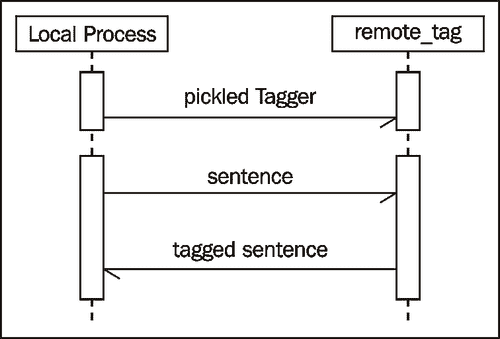
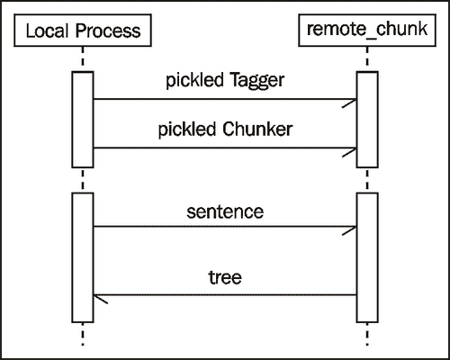
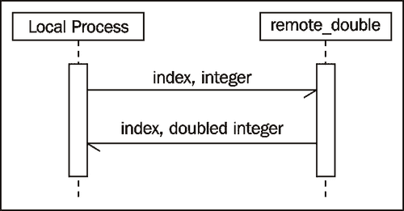
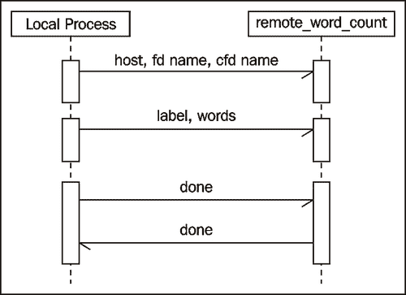

# 第八章：分布式处理和大型数据集处理

在本章中，我们将介绍：

+   使用 execnet 进行分布式标记

+   使用 execnet 进行分布式分块

+   使用 execnet 进行并行列表处理

+   在 Redis 中存储频率分布

+   在 Redis 中存储条件频率分布

+   在 Redis 中存储有序字典

+   使用 Redis 和 execnet 进行分布式单词评分

# 简介

NLTK 非常适合内存中的单处理器自然语言处理。然而，有时你有很多数据要处理，并想利用多个 CPU、多核 CPU 甚至多台计算机。或者你可能想在一个持久、共享的数据库中存储频率和概率，以便多个进程可以同时访问它。对于第一种情况，我们将使用 execnet 进行 NLTK 的并行和分布式处理。对于第二种情况，你将学习如何使用 Redis 数据结构服务器/数据库来存储频率分布等。

# 使用 execnet 进行分布式标记

**Execnet**是一个用于 Python 的分布式执行库。它允许你创建用于远程代码执行的网关和通道。**网关**是从调用进程到远程环境的连接。远程环境可以是本地子进程或到远程节点的 SSH 连接。**通道**是从网关创建的，用于处理通道创建者与远程代码之间的通信。

由于许多 NLTK 过程在计算期间需要 100%的 CPU 利用率，execnet 是分配这种计算以实现最大资源使用的一个理想方式。你可以为每个 CPU 核心创建一个网关，无论这些核心是在你的本地计算机上还是分布在远程机器上。在许多情况下，你只需要在单个机器上拥有训练好的对象和数据，并在需要时将对象和数据发送到远程节点。

## 准备工作

你需要安装 execnet 才能使它工作。这应该像`sudo pip install execnet`或`sudo easy_install execnet`一样简单。截至本文写作时，execnet 的当前版本是`1.0.8`。execnet 的主页，其中包含 API 文档和示例，位于[`codespeak.net/execnet/`](http://codespeak.net/execnet/)。

## 如何实现...

我们首先导入所需的模块，以及将在下一节中解释的附加模块`remote_tag.py`。我们还需要导入`pickle`，这样我们就可以序列化标记器。Execnet 本身不知道如何处理诸如词性标记器之类的复杂对象，因此我们必须使用`pickle.dumps()`将标记器转储为字符串。我们将使用`nltk.tag.pos_tag()`函数使用的默认标记器，但你也可以加载并转储任何实现了`TaggerI`接口的预训练词性标记器。

一旦我们有了序列化的标记器，我们就通过使用 `execnet.makegateway()` 创建网关来启动 execnet。默认网关创建一个 Python *子进程*，我们可以使用 `remote_exec()` 方法并传递 `remote_tag` 模块来创建一个 `channel`。有了开放的通道，我们发送序列化的标记器和 `treebank` 语料库的第一个标记句子。

### 注意

对于列表和元组等简单类型，您无需进行任何特殊的序列化，因为 execnet 已经知道如何处理内置类型的序列化。

现在如果我们调用 `channel.receive()`，我们会得到一个标记的句子，它与 `treebank` 语料库中的第一个标记句子等效，因此我们知道标记是成功的。我们通过退出网关结束，这会关闭通道并杀死子进程。

```py
>>> import execnet, remote_tag, nltk.tag, nltk.data
>>> from nltk.corpus import treebank
>>> import cPickle as pickle
>>> tagger = pickle.dumps(nltk.data.load(nltk.tag._POS_TAGGER))
>>> gw = execnet.makegateway()
>>> channel = gw.remote_exec(remote_tag)
>>> channel.send(tagger)
>>> channel.send(treebank.sents()[0])
>>> tagged_sentence = channel.receive()
>>> tagged_sentence == treebank.tagged_sents()[0]
True
>>> gw.exit()
```

从视觉上看，通信过程看起来像这样：



## 它是如何工作的...

网关的 `remote_exec()` 方法接受一个参数，该参数可以是以下三种类型之一：

1.  要在远程执行的代码字符串。

1.  将要序列化和远程执行的一个**纯**函数的名称。

1.  一个**纯**模块的名称，其源将在远程执行。

我们使用 `remote_tag.py` 模块的第三个选项，该模块定义如下：

```py
  import cPickle as pickle

  if __name__ == '__channelexec__':
    tagger = pickle.loads(channel.receive())

    for sentence in channel:
      channel.send(tagger.tag(sentence))
```

一个纯模块是一个自包含的模块。它只能访问它在执行时可以访问的 Python 模块，并且无法访问网关最初创建位置存在的任何变量或状态。要检测模块是否由 `execnet` 执行，您可以查看 `__name__` 变量。如果它等于 `'__channelexec__'`，则它被用于创建远程通道。这与执行 `if __name__ == '__main__'` 来检查模块是否在命令行上执行类似。

我们首先调用 `channel.receive()` 来获取序列化的 `tagger`，然后使用 `pickle.loads()` 加载它。您可能会注意到 `channel` 没有在任何地方导入——这是因为它包含在模块的全局命名空间中。任何 `execnet` 在远程执行的模块都可以访问 `channel` 变量，以便与 `channel` 创建者通信。

一旦我们有了 `tagger`，我们就迭代地对从通道接收到的每个标记句子进行 `tag()` 操作。这允许我们标记发送者想要发送的任意数量的句子，因为迭代不会停止，直到 `channel` 关闭。我们实际上创建的是一个用于词性标注的计算节点，该节点将 100%的资源用于标注它接收到的任何句子。只要 `channel` 保持开放，节点就可供处理。

## 更多...

这是一个简单的示例，它打开一个网关和一个通道。但 execnet 可以做更多的事情，例如打开多个通道以增加并行处理，以及通过 SSH 打开远程主机的网关以进行分布式处理。

### 多个通道

我们可以创建多个通道，每个网关一个，以使处理更加并行。每个网关创建一个新的子进程（如果使用 SSH 网关，则为远程解释器），我们使用每个网关的一个通道进行通信。一旦我们创建了两个通道，我们可以使用`MultiChannel`类将它们组合起来，这允许我们遍历通道，并创建一个接收队列以接收来自每个通道的消息。

在创建每个通道并发送标记器之后，我们遍历通道，为每个通道发送相同数量的句子进行标记。然后我们收集`queue`中的所有响应。调用`queue.get()`将返回一个包含`(channel, message)`的 2 元组，以防你需要知道消息来自哪个通道。

### 小贴士

如果你不想永远等待，你也可以传递一个`timeout`关键字参数，指定你想要等待的最大秒数，例如`queue.get(timeout=4)`。这可以是一种处理网络错误的好方法。

一旦收集到所有标记的句子，我们就可以退出网关。以下是代码：

```py
>>> import itertools
>>> gw1 = execnet.makegateway()
>>> gw2 = execnet.makegateway()
>>> ch1 = gw1.remote_exec(remote_tag)
>>> ch1.send(tagger)
>>> ch2 = gw2.remote_exec(remote_tag)
>>> ch2.send(tagger)
>>> mch = execnet.MultiChannel([ch1, ch2])
>>> queue = mch.make_receive_queue()
>>> channels = itertools.cycle(mch)
>>> for sentence in treebank.sents()[:4]:
...    channel = channels.next()
...    channel.send(sentence)
>>> tagged_sentences = []
>>> for i in range(4):
...    channel, tagged_sentence = queue.get()
...    tagged_sentences.append(tagged_sentence)
>>> len(tagged_sentences)
4
>>> gw1.exit()
>>> gw2.exit()
```

### 本地与远程网关

默认网关规范是`popen`，它在本地机器上创建一个 Python 子进程。这意味着`execnet.makegateway()`等价于`execnet.makegateway('popen')`。如果你有对远程机器的无密码 SSH 访问权限，那么你可以使用`execnet.makegateway('ssh=remotehost')`创建一个远程网关，其中`remotehost`应该是机器的主机名。SSH 网关为远程执行代码启动一个新的 Python 解释器。只要你在远程执行中使用的代码是**纯**的，你只需要在远程机器上有一个 Python 解释器。

无论使用哪种网关，通道的工作方式都完全相同；唯一的区别将是通信时间。这意味着你可以将本地子进程与远程解释器混合匹配，以在网络中的多台机器上分配你的计算。有关网关的更多详细信息，请参阅 API 文档中的[`codespeak.net/execnet/basics.html`](http://codespeak.net/execnet/basics.html)。

## 参见

在第四章“词性标注”中详细介绍了词性标注和标记器。在下一个菜谱中，我们将使用`execnet`进行分布式分块提取。

# 使用 execnet 进行分布式分块

在这个菜谱中，我们将对`execnet`网关进行分块和标记。这将与前一个菜谱中的标记非常相似，但我们将会发送两个对象而不是一个，并且我们将接收一个`Tree`而不是一个列表，这需要序列化和反序列化。

## 准备工作

如前一个菜谱中所述，你必须安装`execnet`。

## 如何做到这一点...

设置代码与上一个菜谱非常相似，我们也将使用相同的序列化（pickled）`tagger`。首先，我们将序列化`nltk.chunk.ne_chunk()`使用的默认`chunker`，尽管任何 chunker 都可以。接下来，我们为`remote_chunk`模块创建一个网关，获取一个`channel`，并将序列化的`tagger`和`chunker`发送过去。然后我们接收回一个序列化的`Tree`，我们可以反序列化并检查结果。最后，我们退出网关。

```py
>>> import execnet, remote_chunk
>>> import nltk.data, nltk.tag, nltk.chunk
>>> import cPickle as pickle
>>> from nltk.corpus import treebank_chunk
>>> tagger = pickle.dumps(nltk.data.load(nltk.tag._POS_TAGGER))
>>> chunker = pickle.dumps(nltk.data.load(nltk.chunk._MULTICLASS_NE_CHUNKER))
>>> gw = execnet.makegateway()
>>> channel = gw.remote_exec(remote_chunk)
>>> channel.send(tagger)
>>> channel.send(chunker)
>>> channel.send(treebank_chunk.sents()[0])
>>> chunk_tree = pickle.loads(channel.receive())
>>> chunk_tree
Tree('S', [Tree('PERSON', [('Pierre', 'NNP')]), Tree('ORGANIZATION', [('Vinken', 'NNP')]), (',', ','), ('61', 'CD'), ('years', 'NNS'), ('old', 'JJ'), (',', ','), ('will', 'MD'), ('join', 'VB'), ('the', 'DT'), ('board', 'NN'), ('as', 'IN'), ('a', 'DT'), ('nonexecutive', 'JJ'), ('director', 'NN'), ('Nov.', 'NNP'), ('29', 'CD'), ('.', '.')])
>>> gw.exit()
```

这次通信略有不同。



## 它是如何工作的...

`remote_chunk.py`模块比上一个菜谱中的`remote_tag.py`模块稍微复杂一些。除了接收一个序列化的`tagger`，它还期望接收一个实现了`ChunkerI`接口的序列化`chunker`。一旦它有了`tagger`和`chunker`，它期望接收任意数量的分词句子，它会对这些句子进行标记并将它们解析成一个`Tree`。然后这个`tree`会被序列化并通过`channel`发送回去。

```py
import cPickle as pickle

if __name__ == '__channelexec__':
  tagger = pickle.loads(channel.receive())
  chunker = pickle.loads(channel.receive())

  for sent in channel:
    tree = chunker.parse(tagger.tag(sent))
    channel.send(pickle.dumps(tree))
```

### 注意

由于`Tree`不是一个简单的内置类型，因此必须将其序列化（pickled）。

## 还有更多...

注意，`remote_chunk`模块是纯的。它的唯一外部依赖是`pickle`（或`cPickle`）模块，它是 Python 标准库的一部分。它不需要导入任何 NLTK 模块来使用`tagger`或`chunker`，因为所有必要的数据都是序列化并通过`channel`发送的。只要你的远程代码结构是这样的，没有外部依赖，你只需要在单个机器上安装 NLTK——即启动网关并通过`channel`发送对象的机器。

### Python 子进程

当你在运行`execnet`代码时查看你的任务/系统监视器（或在`*nix`中的`top`），你可能会注意到一些额外的 Python 进程。每个网关都会产生一个新的、自包含的、*无共享资源*的 Python 解释器进程，当你调用`exit()`方法时，该进程会被终止。与线程不同，这里没有共享内存需要担心，也没有全局解释器锁来减慢速度。你所拥有的只是独立的通信进程。这无论是对于本地进程还是远程进程都是成立的。你不需要担心锁定和同步，你只需要关注消息的发送和接收顺序。

## 参见

之前的菜谱详细解释了`execnet`网关和通道。在下一个菜谱中，我们将使用`execnet`并行处理一个列表。

# 使用 execnet 进行并行列表处理

这个菜谱展示了使用`execnet`并行处理列表的模式。这是一个函数模式，用于将列表中的每个元素映射到一个新值，使用`execnet`并行执行映射。

## 如何做...

首先，我们需要决定我们确切想要做什么。在这个例子中，我们将只是将整数加倍，但我们可以进行任何纯计算。以下是由`execnet`执行的模块`remote_double.py`，它接收一个`(i, arg)`的 2 元组，假设`arg`是一个数字，并发送回`(i, arg*2)`。`i`的需求将在下一节中解释。

```py
if __name__ == '__channelexec__':
  for (i, arg) in channel:
    channel.send((i, arg * 2))
```

要使用此模块将列表中的每个元素加倍，我们需要导入`plists`模块（下一节将解释），并使用`remote_double`模块和要加倍的整数列表调用`plists.map()`。

```py
>>> import plists, remote_double
>>> plists.map(remote_double, range(10))
[0, 2, 4, 6, 8, 10, 12, 14, 16, 18]
```

通道之间的通信非常简单，如下面的图所示：



## 它是如何工作的...

`map()`函数定义在`plists.py`中。它接受一个纯模块、一个参数列表以及一个可选的由`(spec, count)`组成的 2 元组列表。默认的`specs`是`[('popen', 2)]`，这意味着我们将打开两个本地网关和通道。一旦这些通道打开，我们将它们放入一个`itertools`循环中，这创建了一个无限迭代器，一旦到达末尾就会回到开始。

现在我们可以将`args`中的每个参数发送到`channel`进行处理，由于通道是循环的，每个通道都会获得几乎均匀分布的参数。这就是`i`的作用——我们不知道结果将以什么顺序返回，所以将作为列表中每个`arg`的索引的`i`传递到通道并返回，以便我们可以按原始顺序组合结果。然后我们使用`MultiChannel`接收队列等待结果，并将它们插入一个与原始`args`长度相同的预填充列表中。一旦我们有了所有预期的结果，我们就可以退出网关并返回结果。

```py
import itertools, execnet

def map(mod, args, specs=[('popen', 2)]):
  gateways = []
  channels = []

  for spec, count in specs:
    for i in range(count):
      gw = execnet.makegateway(spec)
      gateways.append(gw)
      channels.append(gw.remote_exec(mod))

  cyc = itertools.cycle(channels)

  for i, arg in enumerate(args):
    channel = cyc.next()
    channel.send((i, arg))

  mch = execnet.MultiChannel(channels)
  queue = mch.make_receive_queue()
  l = len(args)
  results = [None] * l

  for j in range(l):
    channel, (i, result) = queue.get()
    results[i] = result

  for gw in gateways:
    gw.exit()

  return results
```

## 还有更多...

您可以通过修改规格来增加并行化，如下所示：

```py
>>> plists.map(remote_double, range(10), [('popen', 4)])
[0, 2, 4, 6, 8, 10, 12, 14, 16, 18]
```

然而，更多的并行化并不一定意味着更快的处理速度。它取决于可用的资源，并且你打开的网关和通道越多，所需的开销就越大。理想情况下，每个 CPU 核心应该有一个网关和通道。

只要接收并返回包含`i`作为第一个元素的 2 元组，您就可以使用`plists.map()`与任何纯模块一起使用。这种模式在您有一堆数字要处理，并希望尽可能快速地处理它们时最有用。

## 参见

之前的菜谱更详细地介绍了`execnet`的功能。

# 在 Redis 中存储频率分布

NLTK 中的许多类都使用了`nltk.probability.FreqDist`类来存储和管理频率分布。它非常有用，但它全部是在内存中，并且不提供持久化数据的方式。单个`FreqDist`也无法被多个进程访问。我们可以通过在 Redis 之上构建一个`FreqDist`来改变这一切。

Redis 是一个 **数据结构** **服务器**，是更受欢迎的 *NoSQL* 数据库之一。除了其他功能外，它提供了一个网络可访问的数据库来存储字典（也称为 *哈希表*）。通过将 `FreqDist` 接口构建到 Redis 哈希表中，我们可以创建一个持久化的 `FreqDist`，它同时可供多个本地和远程进程访问。

### 注意

大多数 Redis 操作都是 **原子性** 的，因此甚至可以同时有多个进程向 `FreqDist` 写入。

## 准备工作

对于这个和随后的食谱，我们需要安装 `Redis` 和 `redis-py`。Redis 的快速入门安装指南可在 [`code.google.com/p/redis/wiki/QuickStart`](http://code.google.com/p/redis/wiki/QuickStart) 找到。为了使用哈希表，你应该安装至少版本 `2.0.0`（截至本文写作时的最新版本）。

可以使用 `pip install redis` 或 `easy_install redis` 安装 `Redis` Python 驱动 `redis-py`。确保你安装至少版本 `2.0.0` 以使用哈希表。`redis-py` 的主页是 [`github.com/andymccurdy/redis-py/`](http://github.com/andymccurdy/redis-py/)。

一旦安装完成并且 `redis-server` 进程正在运行，你就可以开始了。假设 `redis-server` 在 `localhost` 的 `6379` 端口上运行（默认的主机和端口）。

## 如何实现...

`FreqDist` 类扩展了内置的 `dict` 类，这使得 `FreqDist` 成为一个增强的字典。`FreqDist` 类提供了两个额外的键方法：`inc()` 和 `N()`。`inc()` 方法接受一个 `sample` 参数作为键，以及一个可选的 `count` 关键字参数，默认为 `1`，并将 `sample` 的值增加 `count`。`N()` 返回样本结果的数量，这是频率分布中所有值的总和。

我们可以通过扩展 `RedisHashMap`（将在下一节中解释）并在其上创建一个 API 兼容的类，然后实现 `inc()` 和 `N()` 方法来在 Redis 上创建一个 API 兼容的类。由于 `FreqDist` 只存储整数，我们还覆盖了一些其他方法，以确保值始终是整数。这个 `RedisHashFreqDist`（在 `redisprob.py` 中定义）使用 `hincrby` 命令来为 `inc()` 方法增加 `sample` 值，并使用 `N()` 方法对哈希表中的所有值求和。

```py
from rediscollections import RedisHashMap

class RedisHashFreqDist(RedisHashMap):
  def inc(self, sample, count=1):
    self._r.hincrby(self._name, sample, count)

  def N(self):
    return int(sum(self.values()))

  def __getitem__(self, key):
    return int(RedisHashMap.__getitem__(self, key) or 0)

  def values(self):
    return [int(v) for v in RedisHashMap.values(self)]

  def items(self):
    return [(k, int(v)) for (k, v) in RedisHashMap.items(self)]
```

我们可以将这个类当作一个 `FreqDist` 来使用。要实例化它，我们必须传递一个 `Redis` 连接和我们的哈希表的 `name`。`name` 应该是这个特定 `FreqDist` 的唯一引用，这样就不会与 `Redis` 中的任何其他键冲突。

```py
>>> from redis import Redis
>>> from redisprob import RedisHashFreqDist
>>> r = Redis()
>>> rhfd = RedisHashFreqDist(r, 'test')
>>> len(rhfd)
0
>>> rhfd.inc('foo')
>>> rhfd['foo']
1
>>> rhfd.items()
>>> len(rhfd)
1
```

### 注意

哈希表的名字和样本键将被编码以替换空格和 `&` 字符为 `_`。这是因为 `Redis` 协议使用这些字符进行通信。最好一开始就不在名字和键中包含空格。

## 它是如何工作的...

大部分工作都是在 `rediscollections.py` 中的 `RedisHashMap` 类中完成的，它扩展了 `collections.MutableMapping`，然后覆盖了所有需要 Redis 特定命令的方法。以下是使用特定 `Redis` 命令的每个方法的概述：

+   `__len__()`: 使用 `hlen` 命令获取哈希表中的元素数量

+   `__contains__()`: 使用 `hexists` 命令检查哈希表中是否存在一个元素

+   `__getitem__()`: 使用 `hget` 命令从哈希表中获取一个值

+   `__setitem__()`: 使用 `hset` 命令在哈希表中设置一个值

+   `__delitem__()`: 使用 `hdel` 命令从哈希表中删除一个值

+   `keys()`: 使用 `hkeys` 命令获取哈希表中的所有键

+   `values()`: 使用 `hvals` 命令获取哈希表中的所有值

+   `items()`: 使用 `hgetall` 命令获取包含哈希表中所有键和值的字典

+   `clear()`: 使用 `delete` 命令从 `Redis` 中删除整个哈希表

### 注意

扩展 `collections.MutableMapping` 提供了基于先前方法的许多其他 `dict` 兼容方法，例如 `update()` 和 `setdefault()`，因此我们不必自己实现它们。

用于 `RedisHashFreqDist` 的初始化实际上在这里实现，需要一个 `Redis` 连接和一个哈希表名称。连接和名称都存储在内部，以便与所有后续命令一起使用。如前所述，名称和所有键中的空白字符被下划线替换，以与 Redis 网络协议兼容。

```py
import collections, re

white = r'[\s&]+'

def encode_key(key):
  return re.sub(white, '_', key.strip())

class RedisHashMap(collections.MutableMapping):
  def __init__(self, r, name):
    self._r = r
    self._name = encode_key(name)

  def __iter__(self):
    return iter(self.items())

  def __len__(self):
    return self._r.hlen(self._name)

  def __contains__(self, key):
    return self._r.hexists(self._name, encode_key(key))

  def __getitem__(self, key):
    return self._r.hget(self._name, encode_key(key))

  def __setitem__(self, key, val):
    self._r.hset(self._name, encode_key(key), val)

  def __delitem__(self, key):
    self._r.hdel(self._name, encode_key(key))

  def keys(self):
    return self._r.hkeys(self._name)

  def values(self):
    return self._r.hvals(self._name)

  def items(self):
    return self._r.hgetall(self._name).items()

  def get(self, key, default=0):
    return self[key] or default

  def iteritems(self):
    return iter(self)

  def clear(self):
    self._r.delete(self._name)
```

## 还有更多...

`RedisHashMap` 可以作为一个持久化的键值字典单独使用。然而，虽然哈希表可以支持大量的键和任意字符串值，但其存储结构对于整数值和较小的键数量更为优化。但是，不要因此阻碍你充分利用 Redis。它非常快（对于网络服务器来说），并且尽力高效地编码你抛给它的任何数据。

### 注意

虽然 Redis 对于网络数据库来说相当快，但它将比内存中的 `FreqDist` 慢得多。这是无法避免的，但当你牺牲速度时，你将获得持久性和并发处理的能力。

## 参见

在下一个配方中，我们将基于这里创建的 `Redis` 频率分布创建一个条件频率分布。

# 存储条件频率分布到 Redis

`nltk.probability.ConditionalFreqDist` 类是一个 `FreqDist` 实例的容器，每个条件对应一个 `FreqDist`。它用于计算依赖于另一个条件的频率，例如另一个单词或类标签。我们在第七章的“计算高信息词”配方中使用了这个类，*文本分类*。在这里，我们将使用前一个配方中的 `RedisHashFreqDist` 在 `Redis` 上创建一个兼容 API 的类。

## 准备工作

如前一个示例，你需要安装`Redis`和`redis-py`，并运行一个`redis-server`实例。

## 如何操作...

我们在`redisprob.py`中定义了一个`RedisConditionalHashFreqDist`类，它扩展了`nltk.probability.ConditionalFreqDist`并重写了`__contains__()`和`__getitem__()`方法。然后我们重写`__getitem__()`以便我们可以创建一个`RedisHashFreqDist`的实例而不是`FreqDist`，并重写`__contains__()`以便在检查`RedisHashFreqDist`是否存在之前，从`rediscollections`模块调用`encode_key()`。

```py
from nltk.probability import ConditionalFreqDist
from rediscollections import encode_key

class RedisConditionalHashFreqDist(ConditionalFreqDist):
  def __init__(self, r, name, cond_samples=None):
    self._r = r
    self._name = name
    ConditionalFreqDist.__init__(self, cond_samples)
    # initialize self._fdists for all matching keys
    for key in self._r.keys(encode_key('%s:*' % name)):
      condition = key.split(':')[1]
      self[condition] # calls self.__getitem__(condition)

  def __contains__(self, condition):
    return encode_key(condition) in self._fdists

  def __getitem__(self, condition):
    if condition not in self._fdists:
      key = '%s:%s' % (self._name, condition)
      self._fdists[condition] = RedisHashFreqDist(self._r, key)

    return self._fdists[condition]

  def clear(self):
    for fdist in self._fdists.values():
      fdist.clear()
```

通过传递一个`Redis`连接和一个*基本名称*，可以创建这个类的实例。之后，它的工作方式就像一个`ConditionalFreqDist`。

```py
>>> from redis import Redis
>>> from redisprob import RedisConditionalHashFreqDist
>>> r = Redis()
>>> rchfd = RedisConditionalHashFreqDist(r, 'condhash')
>>> rchfd.N()
0
>>> rchfd.conditions()
[]
>>> rchfd['cond1'].inc('foo')
>>> rchfd.N()
1
>>> rchfd['cond1']['foo']
1
>>> rchfd.conditions()
['cond1']
>>> rchfd.clear()
```

## 它是如何工作的...

`RedisConditionalHashFreqDist`使用*名称前缀*来引用`RedisHashFreqDist`实例。传递给`RedisConditionalHashFreqDist`的名称是一个*基本名称*，它与每个条件结合，为每个`RedisHashFreqDist`创建一个唯一的名称。例如，如果`RedisConditionalHashFreqDist`的*基本名称*是`'condhash'`，而*条件*是`'cond1'`，那么`RedisHashFreqDist`的最终名称就是`'condhash:cond1'`。这种命名模式在初始化时用于使用`keys`命令查找所有现有的哈希映射。通过搜索所有匹配`'condhash:*'`的键，我们可以识别所有现有的条件并为每个创建一个`RedisHashFreqDist`实例。

### 注意

使用冒号组合字符串是`Redis`键的常见命名约定，作为定义*命名空间*的方式。在我们的情况下，每个`RedisConditionalHashFreqDist`实例定义了一个单独的哈希映射命名空间。

`ConditionalFreqDist`类在`self._fdists`中存储一个内部字典，它将`condition`映射到`FreqDist`。`RedisConditionalHashFreqDist`类仍然使用`self._fdists`，但值是`RedisHashFreqDist`的实例而不是`FreqDist`。`self._fdists`在调用`ConditionalFreqDist.__init__()`时创建，并在`__getitem__()`方法中根据需要初始化值。

## 更多...

`RedisConditionalHashFreqDist`还定义了一个`clear()`方法。这是一个辅助方法，它会在所有内部`RedisHashFreqDist`实例上调用`clear()`。`clear()`方法在`ConditionalFreqDist`中未定义。

## 参见

前一个示例详细介绍了`RedisHashFreqDist`。例如，在第七章的*计算高信息词*示例中，可以看到`ConditionalFreqDist`的使用。

# 在 Redis 中存储有序字典

有序字典就像一个普通的 `dict`，但键是按排序函数排序的。在 `Redis` 的情况下，它支持有序字典，其 *键是字符串*，其 *值是浮点分数*。这种结构在需要存储所有单词和分数以供以后使用的情况下非常有用，例如在计算信息增益时（如第七章 *Calculating high information words* 中的配方所述，*文本分类*）。

## 准备工作

再次强调，您需要安装 `Redis` 和 `redis-py`，并且有一个 `redis-server` 实例正在运行。

## 如何操作...

`rediscollections.py` 中的 `RedisOrderedDict` 类扩展了 `collections.MutableMapping` 以免费获得许多 `dict` 兼容的方法。然后它实现了所有需要 `Redis` 有序集合（也称为 **Zset**）命令的关键方法。

```py
class RedisOrderedDict(collections.MutableMapping):
  def __init__(self, r, name):
    self._r = r
    self._name = encode_key(name)

  def __iter__(self):
    return iter(self.items())

  def __len__(self):
    return self._r.zcard(self._name)

  def __getitem__(self, key):
    val = self._r.zscore(self._name, encode_key(key))

    if val is None:
      raise KeyError
    else:
      return val

  def __setitem__(self, key, score):
    self._r.zadd(self._name, encode_key(key), score)

  def __delitem__(self, key):by brain feels dead

    self._r.zrem(self._name, encode_key(key))

  def keys(self, start=0, end=-1):
    # we use zrevrange to get keys sorted by high value instead of by lowest
    return self._r.zrevrange(self._name, start, end)

  def values(self, start=0, end=-1):
    return [v for (k, v) in self.items(start=start, end=end)]

  def items(self, start=0, end=-1):
    return self._r.zrevrange(self._name, start, end, withscores=True)

  def get(self, key, default=0):
    return self[key] or default

  def iteritems(self):
```

```py
    return iter(self)

  def clear(self):
    self._r.delete(self._name)
```

您可以通过传递一个 `Redis` 连接和一个唯一名称来创建 `RedisOrderedDict` 的实例。

```py
>>> from redis import Redis
>>> from rediscollections import RedisOrderedDict
>>> r = Redis()
>>> rod = RedisOrderedDict(r, 'test.txt')
>>> rod.get('bar')
>>> len(rod)
0
>>> rod['bar'] = 5.2
>>> rod['bar']
5.2000000000000002
>>> len(rod)
1
>>> rod.items()
[('bar', 5.2000000000000002)]
>>> rod.clear()
```

## 它是如何工作的...

大部分代码可能看起来与 `RedisHashMap` 类似，这是可以预料的，因为它们都扩展了 `collections.MutableMapping`。这里的主要区别在于 `RedisOrderedSet` 按浮点值对键进行排序，因此不适合像 `RedisHashMap` 那样存储任意键值。以下是一个概述，解释了每个关键方法及其如何与 `Redis` 一起工作：

+   `__len__()`: 使用 `zcard` 命令来获取有序集合中的元素数量。

+   `__getitem__()`: 使用 `zscore` 命令获取键的分数，如果键不存在，则返回 `0`。

+   `__setitem__()`: 使用 `zadd` 命令将键添加到有序集合中，并带有给定的分数，如果键已存在，则更新分数。

+   `__delitem__()`: 使用 `zrem` 命令从有序集合中删除一个键。

+   `keys()`: 使用 `zrevrange` 命令获取有序集合中的所有键，按最高分数排序。它接受两个可选关键字参数 `start` 和 `end`，以更有效地获取有序键的切片。

+   `values()`: 从 `items()` 方法中提取所有分数。

+   `items()`: 使用 `zrevrange` 命令来获取每个键的分数，以便按最高分数返回一个由 2-元组组成的列表。与 `keys()` 类似，它接受 `start` 和 `end` 关键字参数，以有效地获取一个切片。

+   `clear()`: 使用 `delete` 命令从 `Redis` 中删除整个有序集合。

### 注意

`Redis` 有序集合中项的默认排序是 *从低到高*，因此分数最低的键排在第一位。这与您调用 `sort()` 或 `sorted()` 时 Python 的默认列表排序相同，但当我们谈到 *评分* 时，这不是我们想要的。对于存储 *分数*，我们期望项按 *从高到低* 排序，这就是为什么 `keys()` 和 `items()` 使用 `zrevrange` 而不是 `zrange`。

## 还有更多...

如前所述，`keys()`和`items()`方法接受可选的`start`和`end`关键字参数，以获取结果的一部分。这使得`RedisOrderedDict`非常适合存储得分，然后获取前 N 个键。以下是一个简单的例子，我们分配了三个词频得分，然后获取前两个：

```py
>>> from redis import Redis
>>> from rediscollections import RedisOrderedDict
>>> r = Redis()
>>> rod = RedisOrderedDict(r, 'scores')
>>> rod['best'] = 10
>>> rod['worst'] = 0.1
>>> rod['middle'] = 5
>>> rod.keys()
['best', 'middle', 'worst']
>>> rod.keys(start=0, end=1)
['best', 'middle']
>>> rod.clear()
```

## 参见

在第七章的*计算高信息词*配方中，*文本分类*描述了如何计算信息增益，这是一个在`RedisOrderedDict`中存储词频的好例子。*在 Redis 中存储频率分布*配方介绍了`Redis`和`RedisHashMap`。

# 使用 Redis 和 execnet 进行分布式词频计算

我们可以使用`Redis`和`execnet`一起进行分布式词频计算。在第七章的*计算高信息词*配方中，*文本分类*，我们使用`FreqDist`和`ConditionalFreqDist`计算了`movie_reviews`语料库中每个单词的信息增益。现在我们有了`Redis`，我们可以使用`RedisHashFreqDist`和`RedisConditionalHashFreqDist`做同样的事情，然后将得分存储在`RedisOrderedDict`中。我们可以使用`execnet`来分配计数，以便从`Redis`中获得更好的性能。

## 准备工作

必须安装`Redis`、`redis-py`和`execnet`，并且必须在`localhost`上运行`redis-server`实例。

## 如何操作...

我们首先为`movie_reviews`语料库中的每个标签获取`(label, words)`元组的列表（该语料库只有`pos`和`neg`标签）。然后，我们使用`dist_featx`模块中的`score_words()`函数获取`word_scores`。`word_scores`是一个`RedisOrderedDict`的实例，我们可以看到总共有 39,764 个单词。使用`keys()`方法，我们可以获取前 1000 个单词，并检查前五个单词以了解它们是什么。一旦我们从`word_scores`中获取了我们想要的所有信息，我们就可以删除`Redis`中的键，因为我们不再需要这些数据了。

```py
>>> from dist_featx import score_words
>>> from nltk.corpus import movie_reviews
>>> labels = movie_reviews.categories()
>>> labelled_words = [(l, movie_reviews.words(categories=[l])) for l in labels]
>>> word_scores = score_words(labelled_words)
>>> len(word_scores)
39764
>>> topn_words = word_scores.keys(end=1000)
>>> topn_words[0:5]
['_', 'bad', '?', 'movie', 't']
>>> from redis import Redis
>>> r = Redis()
>>> [r.delete(key) for key in ['word_fd', 'label_word_fd:neg', 'label_word_fd:pos', 'word_scores']]
[True, True, True, True]
```

`dist_featx`模块中的`score_words()`函数可能需要一段时间才能完成，因此请预计需要等待几分钟。使用`execnet`和`Redis`的开销意味着它将比非分布式内存版本的功能花费更长的时间。

## 它是如何工作的...

`dist_featx.py`模块包含`score_words()`函数，该函数执行以下操作：

1.  打开网关和通道，向每个发送初始化数据。

1.  通过通道发送每个`(label, words)`元组进行计数。

1.  向每个通道发送`done`消息，等待收到`done`回复，然后关闭通道和网关。

1.  根据单词计数计算每个单词的得分，并将其存储在`RedisOrderedDict`中。

在我们计算`movie_reviews`语料库中单词的案例中，调用`score_words()`打开两个网关和通道，一个用于计数`pos`单词，另一个用于计数`neg`单词。通信如下：



一旦计数完成，我们可以对所有单词进行评分并存储结果。代码如下：

```py
import itertools, execnet, remote_word_count
from nltk.metrics import BigramAssocMeasures
from redis import Redis
from redisprob import RedisHashFreqDist, RedisConditionalHashFreqDist
from rediscollections import RedisOrderedDict

def score_words(labelled_words, score_fn=BigramAssocMeasures.chi_sq, host='localhost', specs=[('popen', 2)]):
  gateways = []
  channels = []

  for spec, count in specs:
    for i in range(count):
      gw = execnet.makegateway(spec)
      gateways.append(gw)
      channel = gw.remote_exec(remote_word_count)
      channel.send((host, 'word_fd', 'label_word_fd'))
      channels.append(channel)

  cyc = itertools.cycle(channels)

  for label, words in labelled_words:
    channel = cyc.next()
    channel.send((label, list(words)))

  for channel in channels:
    channel.send('done')
    assert 'done' == channel.receive()
    channel.waitclose(5)

  for gateway in gateways:
    gateway.exit()

  r = Redis(host)
  fd = RedisHashFreqDist(r, 'word_fd')
  cfd = RedisConditionalHashFreqDist(r, 'label_word_fd')
  word_scores = RedisOrderedDict(r, 'word_scores')
  n_xx = cfd.N()

  for label in cfd.conditions():
    n_xi = cfd[label].N()

    for word, n_ii in cfd[label].iteritems():
      n_ix = fd[word]

      if n_ii and n_ix and n_xi and n_xx:
        score = score_fn(n_ii, (n_ix, n_xi), n_xx)
        word_scores[word] = score

  return word_scores
```

### 注意

注意，这种方法只有在有两个标签时才会准确。如果有超过两个标签，则每个标签的单词评分应存储在单独的`RedisOrderedDict`实例中，每个标签一个实例。

`remote_word_count.py`模块看起来如下所示：

```py
from redis import Redis
from redisprob import RedisHashFreqDist, RedisConditionalHashFreqDist

if __name__ == '__channelexec__':
  host, fd_name, cfd_name = channel.receive()
  r = Redis(host)
  fd = RedisHashFreqDist(r, fd_name)
  cfd = RedisConditionalHashFreqDist(r, cfd_name)

  for data in channel:
    if data == 'done':
      channel.send('done')
      break

    label, words = data

    for word in words:
      fd.inc(word)
      cfd[label].inc(word)
```

你会注意到这不仅仅是一个纯模块，因为它需要能够导入`redis`和`redisprob`。原因是`RedisHashFreqDist`和`RedisConditionalHashFreqDist`的实例不能被序列化并通过`channel`发送。相反，我们通过`channel`发送主机名和键名，以便在远程模块中创建实例。一旦我们有了实例，我们就可以通过`channel`接收两种类型的数据：

1.  一个`done`消息，表示通过`channel`没有更多数据传入。我们回复另一个`done`消息，然后退出循环以关闭`channel`。

1.  一个包含`(label, words)`的 2 元组，然后我们遍历它来增加`RedisHashFreqDist`和`RedisConditionalHashFreqDist`中的计数。

## 还有更多...

在这个特定情况下，不使用`Redis`或`execnet`计算评分会更快。然而，通过使用`Redis`，我们可以持久化存储评分，以便稍后检查和使用。能够手动检查所有单词计数和评分是了解数据的好方法。我们还可以调整特征提取，而无需重新计算评分。例如，你可以使用`featx.bag_of_words_in_set()`（在第七章，*文本分类*中找到）与`RedisOrderedDict`中的前`N`个单词，其中`N`可以是 1,000、2,000 或任何你想要的数字。如果我们的数据量很大，`execnet`的好处将更加明显。随着需要处理的数据量的增加，使用`execnet`或其他方法在多个节点之间分配计算的水平扩展变得更有价值。

## 参见

在第七章的*计算高信息词*食谱中，*文本分类*介绍了用于特征提取和分类的单词信息增益评分。本章的前三个食谱展示了如何使用`execnet`，而接下来的三个食谱分别描述了`RedisHashFreqDist`、`RedisConditionalHashFreqDist`和`RedisOrderedDict`。
