# 第一章：安装和配置 Spark

在本章中，我们将介绍如何安装和配置 Spark，无论是作为本地实例、多节点集群还是虚拟环境。您将学习以下示例：

+   安装 Spark 要求

+   从源代码安装 Spark

+   从二进制文件安装 Spark

+   配置 Spark 的本地实例

+   配置 Spark 的多节点实例

+   安装 Jupyter

+   在 Jupyter 中配置会话

+   使用 Cloudera Spark 镜像

# 介绍

我们不能在 Spark（或 PySpark）的书籍中开始之前，不先说明 Spark 是什么。Spark 是一个强大、灵活、开源的数据处理和查询引擎。它非常易于使用，并提供了解决各种问题的手段，从处理非结构化、半结构化或结构化数据，到流处理，再到机器学习。有来自 250 多个组织的 1000 多名贡献者（更不用说全球 3000 多名 Spark Meetup 社区成员），Spark 现在是 Apache 软件基金会组合中最大的开源项目之一。

Spark 的起源可以追溯到 2012 年，当时它首次发布；Matei Zacharia 在加州大学伯克利分校开发了 Spark 处理引擎的最初版本，作为他的博士论文的一部分。从那时起，Spark 变得非常流行，其流行程度源于许多原因：

+   **它是快速的**：据估计，Spark 在纯内存工作时比 Hadoop 快 100 倍，在读取或写入数据到磁盘时大约快 10 倍。

+   **它是灵活的**：您可以从多种编程语言中利用 Spark 的强大功能；Spark 原生支持 Scala、Java、Python 和 R 的接口。

+   **它是可扩展的**：由于 Spark 是一个开源软件包，您可以通过引入自己的类或扩展现有类来轻松扩展它。

+   **它是强大的**：许多机器学习算法已经在 Spark 中实现，因此您无需向堆栈添加更多工具——大多数数据工程和数据科学任务可以在单个环境中完成。

+   **它是熟悉的**：习惯于使用 Python 的`pandas`、R 的`data.frames`或`data.tables`的数据科学家和数据工程师应该有一个更加温和的学习曲线（尽管这些数据类型之间存在差异）。此外，如果您了解 SQL，也可以在 Spark 中使用它来整理数据！

+   **它是可扩展的**：Spark 可以在您的机器上本地运行（带有此类解决方案的所有限制）。但是，相同的代码可以在成千上万台机器的集群上部署，几乎不需要进行任何更改。

在本书的其余部分，我们将假设您正在类 Unix 环境中工作，如 Linux（在本书中，我们将使用 Ubuntu Server 16.04 LTS）或 macOS（运行 macOS High Sierra）；所有提供的代码都在这两个环境中进行了测试。对于本章（以及其他一些章节），还需要互联网连接，因为我们将从互联网上下载一堆二进制文件和源文件。

我们不会专注于在 Windows 环境中安装 Spark，因为这并不是 Spark 开发人员真正支持的。但是，如果您有兴趣尝试，可以按照您在网上找到的一些说明，例如从以下链接：[`bit.ly/2Ar75ld`](http://bit.ly/2Ar75ld)。

了解如何使用命令行以及如何在系统上设置一些环境变量是有用的，但并非真正必需——我们将指导您完成这些步骤。

# 安装 Spark 要求

在安装和使用 Spark 之前，您的机器需要具备一些环境。在这个示例中，我们将专注于准备您的机器以安装 Spark。

# 准备工作

要执行这个示例，您需要一个 bash 终端和一个互联网连接。

另外，在开始任何工作之前，您应该克隆本书的 GitHub 存储库。存储库包含了本书中所有示例的代码（以笔记本的形式）和所有所需的数据。要克隆存储库，请转到[`bit.ly/2ArlBck`](http://bit.ly/2ArlBck)，单击“克隆或下载”按钮，并复制显示的 URL，方法是单击旁边的图标：

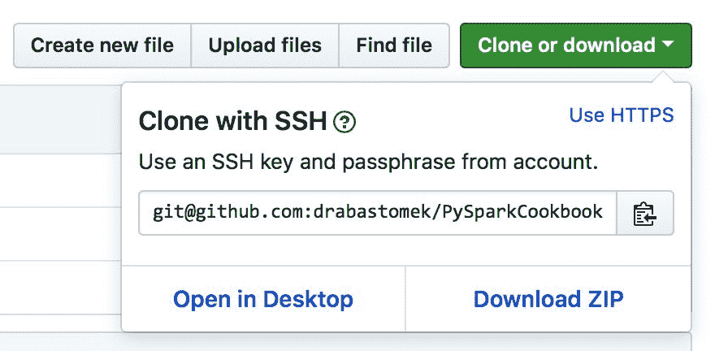

接下来，转到您的终端并发出以下命令：

```py
git clone git@github.com:drabastomek/PySparkCookbook.git
```

如果您的`git`环境设置正确，整个 GitHub 存储库应该克隆到您的磁盘上。不需要其他先决条件。

# 操作步骤...

安装 PySpark 只需满足两个主要要求：Java 和 Python。此外，如果您想要使用这些语言，还可以安装 Scala 和 R，我们还将检查 Maven，我们将用它来编译 Spark 源代码。

为此，我们将使用`checkRequirements.sh`脚本来检查所有要求：该脚本位于 GitHub 存储库的`Chapter01`文件夹中。

以下代码块显示了在`Chapter01/checkRequirements.sh`文件中找到的脚本的高级部分。请注意，出于简洁起见，此处省略了部分代码：

```py
#!/bin/bash

# Shell script for checking the dependencies 
#
# PySpark Cookbook
# Author: Tomasz Drabas, Denny Lee
# Version: 0.1
# Date: 12/2/2017

_java_required=1.8
_python_required=3.4
_r_required=3.1
_scala_required=2.11
_mvn_required=3.3.9

# parse command line arguments
_args_len="$#"
...

printHeader
checkJava
checkPython

if [ "${_check_R_req}" = "true" ]; then
 checkR
fi

if [ "${_check_Scala_req}" = "true" ]; then
 checkScala
fi

if [ "${_check_Maven_req}" = "true" ]; then
 checkMaven
fi
```

# 工作原理...

首先，我们将指定所有所需的软件包及其所需的最低版本；从前面的代码中可以看出，Spark 2.3.1 需要 Java 1.8+和 Python 3.4 或更高版本（我们将始终检查这两个环境）。此外，如果您想要使用 R 或 Scala，这两个软件包的最低要求分别为 3.1 和 2.11。如前所述，Maven 将用于编译 Spark 源代码，为此，Spark 至少需要 Maven 的 3.3.9 版本。

您可以在此处检查 Spark 的要求：[`spark.apache.org/docs/latest/index.html`](https://spark.apache.org/docs/latest/index.html)

您可以在此处检查构建 Spark 的要求：[`spark.apache.org/docs/latest/building-spark.html`](https://spark.apache.org/docs/latest/building-spark.html)。

接下来，我们解析命令行参数：

```py
if [ "$_args_len" -ge 0 ]; then
  while [[ "$#" -gt 0 ]]
  do
   key="$1"
   case $key in
    -m|--Maven)
    _check_Maven_req="true"
    shift # past argument
    ;;
    -r|--R)
    _check_R_req="true"
    shift # past argument
    ;;
    -s|--Scala)
    _check_Scala_req="true"
    shift # past argument
    ;;
    *)
    shift # past argument
   esac
  done
fi
```

作为用户，您可以指定是否要额外检查 R、Scala 和 Maven 的依赖关系。要这样做，请从命令行运行以下代码（以下代码将检查所有这些）：

```py
./checkRequirements.sh -s -m -r
```

以下也是一个完全有效的用法：

```py
./checkRequirements.sh --Scala --Maven --R
```

接下来，我们调用三个函数：`printHeader`，`checkJava`和`checkPython`。`printHeader`函数只是脚本陈述其功能的一种简单方式，这并不是很有趣，所以我们将在这里跳过它；但它相当容易理解，所以您可以自行查看`checkRequirements.sh`脚本的相关部分。

接下来，我们将检查 Java 是否已安装。首先，我们只是在终端打印，说明我们正在对 Java 进行检查（这在我们所有的功能中都很常见，所以我们只在这里提一下）：

```py
function checkJava() {
 echo
 echo "##########################"
 echo
 echo "Checking Java"
 echo
```

接下来，我们将检查 Java 环境是否已安装在您的计算机上：

```py
if type -p java; then
 echo "Java executable found in PATH"
 _java=java
elif [[ -n "$JAVA_HOME" ]] && [[ -x "$JAVA_HOME/bin/java" ]]; then
 echo "Found Java executable in JAVA_HOME"
 _java="$JAVA_HOME/bin/java"
else
 echo "No Java found. Install Java version $_java_required or higher first or specify JAVA_HOME variable that will point to your Java binaries."
 exit
fi
```

首先，我们使用`type`命令检查`java`命令是否可用；`type -p`命令返回`java`二进制文件的位置（如果存在）。这也意味着包含 Java 二进制文件的`bin`文件夹已添加到`PATH`中。

如果您确定已安装了二进制文件（无论是 Java、Python、R、Scala 还是 Maven），您可以跳转到本教程中的*更新路径*部分，了解如何让计算机知道这些二进制文件的位置。

如果这失败了，我们将回退到检查`JAVA_HOME`环境变量是否已设置，如果设置了，我们将尝试查看它是否包含所需的`java`二进制文件：`[[ -x "$JAVA_HOME/bin/java" ]]`。如果这失败，程序将打印找不到 Java 环境的消息，并退出（而不检查其他所需的软件包，如 Python）。

然而，如果找到了 Java 二进制文件，我们可以检查其版本：

```py
_java_version=$("$_java" -version 2>&1 | awk -F '"' '/version/ {print $2}')
echo "Java version: $_java_version (min.: $_java_required)"

if [[ "$_java_version" < "$_java_required" ]]; then
 echo "Java version required is $_java_required. Install the required version first."
 exit
fi
 echo
```

我们首先在终端中执行`java -version`命令，这通常会产生类似以下截图的输出：

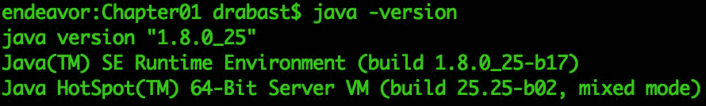

然后我们将先前的输出管道传输到`awk`，以在引号`'"'`字符处拆分（使用`-F`开关）行（并且只使用输出的第一行，因为我们将行过滤为包含`/version/`的行），并将第二个（`$2`）元素作为我们机器上安装的 Java 二进制文件的版本。我们将把它存储在`_java_version`变量中，并使用`echo`命令将其打印到屏幕上。

如果您不知道`awk`是什么或如何使用它，我们建议阅读 Packt 的这本书：[`bit.ly/2BtTcBV`](http://bit.ly/2BtTcBV)。

最后，我们检查我们刚刚获得的`_java_version`是否低于`_java_required`。如果这是真的，我们将停止执行，而是告诉您安装所需版本的 Java。

`checkPython`，`checkR`，`checkScala`和`checkMaven`函数中实现的逻辑方式非常相似。唯一的区别在于我们调用的二进制文件以及我们检查版本的方式：

+   对于 Python，我们运行`"$_python" --version 2>&1 | awk -F ' ' '{print $2}'`，因为检查 Python 版本（对于 Anaconda 发行版）会将以下内容打印到屏幕上：Python 3.5.2 :: Anaconda 2.4.1 (x86_64)

+   对于 R，我们使用`"$_r" --version 2>&1 | awk -F ' ' '/R version/ {print $3}'`，因为检查 R 的版本会在屏幕上写入（很多）；我们只使用以`R version`开头的行：R version 3.4.2 (2017-09-28) -- "Short Summer"

+   对于 Scala，我们使用`"$_scala" -version 2>&1 | awk -F ' ' '{print $5}'`，因为检查 Scala 的版本会打印以下内容：Scala 代码运行器版本 2.11.8 -- 版权所有 2002-2016，LAMP/EPFL

+   对于 Maven，我们检查`"$_mvn" --version 2>&1 | awk -F ' ' '/Apache Maven/ {print $3}'`，因为当要求其版本时，Maven 会打印以下内容（等等！）：Apache Maven 3.5.2 (138edd61fd100ec658bfa2d307c43b76940a5d7d; 2017-10-18T00:58:13-07:00)

如果您想了解更多，现在应该能够轻松阅读其他函数。

# 还有更多...

如果您的任何依赖项尚未安装，您需要在继续下一个配方之前安装它们。本书的范围超出了逐步指导您完成所有这些安装过程的范围，但是以下是一些有用的链接，以指导您如何执行此操作。

# 安装 Java

安装 Java 非常简单。

在 macOS 上，转到[`www.java.com/en/download/mac_download.jsp`](https://www.java.com/en/download/mac_download.jsp)并下载适合您系统的版本。下载后，请按照说明在您的机器上安装它。如果您需要更详细的说明，请查看此链接：[`bit.ly/2idEozX`](http://bit.ly/2idEozX)。

在 Linux 上，检查以下链接[`bit.ly/2jGwuz1`](http://bit.ly/2jGwuz1)获取 Linux Java 安装说明。

# 安装 Python

我们一直在使用（并强烈推荐）Anaconda 版本的 Python，因为它包含了安装程序中包含的最常用的软件包。它还内置了`conda`软件包管理工具，使安装其他软件包变得轻而易举。

您可以从[`www.continuum.io/downloads`](http://www.continuum.io/downloads)下载 Anaconda；选择适合 Spark 要求的版本。有关 macOS 安装说明，您可以访问[`bit.ly/2zZPuUf`](http://bit.ly/2zZPuUf)，有关 Linux 安装手册，请访问[`bit.ly/2ASLUvg`](http://bit.ly/2ASLUvg)。

# 安装 R

R 通过**Comprehensive R Archive Network** (**CRAN**)分发。macOS 版本可以从这里下载，[`cran.r-project.org/bin/macosx/`](https://cran.r-project.org/bin/macosx/)，而 Linux 版本可以从这里下载：[`cran.r-project.org/bin/linux/`](https://cran.r-project.org/bin/linux/)。

下载适合你的机器版本，并按照屏幕上的安装说明进行安装。对于 macOS 版本，你可以选择仅安装 R 核心包而不安装 GUI 和其他内容，因为 Spark 不需要这些。

# 安装 Scala

安装 Scala 甚至更简单。

前往[`bit.ly/2Am757R`](http://bit.ly/2Am757R)并下载`sbt-*.*.*.tgz`存档（在撰写本书时，最新版本是`sbt-1.0.4.tgz`）。接下来，在你的终端中，导航到你刚下载 Scala 的文件夹，并输入以下命令：

```py
tar -xvf sbt-1.0.4.tgz
sudo mv sbt-1.0.4/ /opt/scala/
```

就是这样。现在，你可以跳到本教程中的*更新 PATH*部分来更新你的`PATH`。

# 安装 Maven

Maven 的安装与 Scala 的安装非常相似。前往[`maven.apache.org/download.cgi`](https://maven.apache.org/download.cgi)并下载`apache-maven-*.*.*-bin.tar.gz`存档。在撰写本书时，最新版本是 3.5.2。与 Scala 类似，打开终端，导航到刚下载存档的文件夹，并键入：

```py
tar -xvf apache-maven-3.5.2-bin.tar.gz
```

```py
sudo mv apache-maven-3.5.2-bin/ /opt/apache-maven/
```

这就是你需要做的关于安装 Maven 的事情。查看下一小节，了解如何更新你的`PATH`。

# 更新 PATH

类 Unix 操作系统（包括 Windows）使用`PATH`的概念来搜索二进制文件（或在 Windows 的情况下是可执行文件）。`PATH`只是一个由冒号字符`':'`分隔的文件夹列表，告诉操作系统在哪里查找二进制文件。

要将某些内容添加到你的`PATH`（并使其成为永久更改），你需要编辑`.bash_profile`（macOS）或`.bashrc`（Linux）文件；这些文件位于你的用户根文件夹中。因此，要将 Scala 和 Maven 二进制文件添加到 PATH，你可以执行以下操作（在 macOS 上）：

```py
cp ~/.bash_profile ~/.bash_profile_old   # make a copy just in case
```

```py
echo export SCALA_HOME=/opt/scala >> ~/.bash_profile
```

```py
echo export MAVEN_HOME=/opt/apache-maven >> ~/.bash_profile
```

```py
echo PATH=$SCALA_HOME/bin:$MAVEN_HOME/bin:$PATH >> ~/.bash_profile
```

在 Linux 上，等价的代码如下：

```py
cp ~/.bashrc ~/.bashrc_old   # make a copy just in case
```

```py
echo export SCALA_HOME=/opt/scala >> ~/.bashrc
```

```py
echo export MAVEN_HOME=/opt/apache-maven >> ~/.bashrc
```

```py
echo PATH=$SCALA_HOME/bin:$MAVEN_HOME/bin:$PATH >> ~/.bashrc
```

上述命令只是使用重定向运算符`>>`将内容追加到`.bash_profile`或`.bashrc`文件的末尾。

执行上述命令后，重新启动你的终端，并：

```py
echo $PATH
```

现在应该包括 Scala 和 Maven 二进制文件的路径。

# 从源代码安装 Spark

Spark 以两种方式分发：作为预编译的二进制文件或作为源代码，让你可以选择是否需要支持 Hive 等。在这个教程中，我们将专注于后者。

# 准备工作

要执行这个教程，你需要一个 bash 终端和一个互联网连接。此外，为了完成这个教程，你必须已经检查和/或安装了我们在上一个教程中提到的所有必需的环境。此外，你需要有管理员权限（通过`sudo`命令），这将是将编译后的二进制文件移动到目标文件夹所必需的。

如果你不是机器上的管理员，可以使用`-ns`（或`--nosudo`）参数调用脚本。目标文件夹将切换到你的主目录，并在其中创建一个`spark`文件夹。默认情况下，二进制文件将移动到`/opt/spark`文件夹，这就是为什么你需要管理员权限的原因。

不需要其他先决条件。

# 如何做...

我们将执行五个主要步骤来从源代码安装 Spark（检查代码的突出部分）：

1.  从 Spark 的网站下载源代码

1.  解压缩存档

1.  构建

1.  移动到最终目的地

1.  创建必要的环境变量

我们的代码框架如下（参见`Chapter01/installFromSource.sh`文件）：

```py
#!/bin/bash
```

```py
# Shell script for installing Spark from sources
#
# PySpark Cookbook
# Author: Tomasz Drabas, Denny Lee
# Version: 0.1
# Date: 12/2/2017
```

```py
_spark_source="http://mirrors.ocf.berkeley.edu/apache/spark/spark-2.3.1/spark-2.3.1.tgz"
_spark_archive=$( echo "$_spark_source" | awk -F '/' '{print $NF}' )
_spark_dir=$( echo "${_spark_archive%.*}" )
_spark_destination="/opt/spark"
```

```py
...
```

```py
checkOS
printHeader
downloadThePackage
unpack
build
moveTheBinaries
setSparkEnvironmentVariables
cleanUp
```

# 它是如何工作的...

首先，我们指定 Spark 源代码的位置。`_spark_archive`包含存档的名称；我们使用`awk`从`_spark_source`中提取最后一个元素（在这里，由`$NF`标志指定）。`_spark_dir`包含我们的存档将解压缩到的目录的名称；在我们当前的情况下，这将是`spark-2.3.1`。最后，我们指定我们将要移动二进制文件的目标文件夹：它要么是`/opt/spark`（默认值），要么是您的主目录，如果在调用`./installFromSource.sh`脚本时使用了`-ns`（或`--nosudo`）开关。

接下来，我们检查我们正在使用的操作系统名称：

```py
function checkOS(){
 _uname_out="$(uname -s)"
 case "$_uname_out" in
   Linux*) _machine="Linux";;
   Darwin*) _machine="Mac";;
   *) _machine="UNKNOWN:${_uname_out}"
 esac
```

```py
 if [ "$_machine" = "UNKNOWN:${_uname_out}" ]; then
   echo "Machine $_machine. Stopping."
   exit
 fi
}
```

首先，我们使用`uname`命令获取操作系统的简短名称；`-s`开关返回操作系统名称的缩写版本。如前所述，我们只关注两个操作系统：macOS 和 Linux，因此，如果您尝试在 Windows 或任何其他系统上运行此脚本，它将停止。代码的这一部分是必要的，以正确设置`_machine`标志：macOS 和 Linux 使用不同的方法来下载 Spark 源代码和不同的 bash 配置文件来设置环境变量。

接下来，我们打印出标题（我们将跳过此部分的代码，但欢迎您检查`Chapter01/installFromSource.sh`脚本）。在此之后，我们下载必要的源代码：

```py
function downloadThePackage() {
 ...
 if [ -d _temp ]; then
    sudo rm -rf _temp
 fi
```

```py
 mkdir _temp 
 cd _temp
```

```py
 if [ "$_machine" = "Mac" ]; then
    curl -O $_spark_source
 elif [ "$_machine" = "Linux"]; then
    wget $_spark_source
 else
    echo "System: $_machine not supported."
    exit
 fi
```

```py
}
```

首先，我们检查`_temp`文件夹是否存在，如果存在，则删除它。接下来，我们重新创建一个空的`_temp`文件夹，并将源代码下载到其中；在 macOS 上，我们使用`curl`方法，而在 Linux 上，我们使用`wget`来下载源代码。

你注意到我们的代码中的省略号`'...'`字符了吗？每当我们使用这样的字符时，我们省略了一些不太相关或纯粹信息性的代码部分。但是，它们仍然存在于 GitHub 存储库中检查的源代码中。

一旦源代码落在我们的机器上，我们就使用`tar`工具解压它们，`tar -xf $_spark_archive`。这发生在`unpack`函数内部。

最后，我们可以开始将源代码构建成二进制文件：

```py
function build(){
 ...
```

```py
 cd "$_spark_dir"
 ./dev/make-distribution.sh --name pyspark-cookbook -Phadoop-2.7 -Phive -Phive-thriftserver -Pyarn
```

```py
}
```

我们使用`make-distribution.sh`脚本（与 Spark 一起分发）来创建我们自己的 Spark 分发，名为`pyspark-cookbook`。上一个命令将为 Hadoop 2.7 构建 Spark 分发，并支持 Hive。我们还可以在 YARN 上部署它。在幕后，`make-distribution.sh`脚本正在使用 Maven 来编译源代码。

编译完成后，我们需要将二进制文件移动到`_spark_destination`文件夹：

```py
function moveTheBinaries() {
```

```py
 ...
 if [ -d "$_spark_destination" ]; then 
    sudo rm -rf "$_spark_destination"
 fi
```

```py
 cd ..
 sudo mv $_spark_dir/ $_spark_destination/
```

```py
}
```

首先，我们检查目标文件夹中是否存在该文件夹，如果存在，我们将其删除。接下来，我们简单地将`$_spark_dir`文件夹移动到其新位置。

这是当您在调用`installFromSource.sh`脚本时没有使用`-ns`（或`--nosudo`）标志时，您将需要输入密码的时候。

最后一步之一是向您的 bash 配置文件添加新的环境变量：

```py
function setSparkEnvironmentVariables() {
 ...
```

```py
 if [ "$_machine" = "Mac" ]; then
    _bash=~/.bash_profile
 else
    _bash=~/.bashrc
 fi
 _today=$( date +%Y-%m-%d )
```

```py
 # make a copy just in case 
 if ! [ -f "$_bash.spark_copy" ]; then
        cp "$_bash" "$_bash.spark_copy"
 fi
```

```py
 echo >> $_bash 
 echo "###################################################" >> $_bash
 echo "# SPARK environment variables" >> $_bash
 echo "#" >> $_bash
 echo "# Script: installFromSource.sh" >> $_bash
 echo "# Added on: $_today" >>$_bash
 echo >> $_bash
```

```py
 echo "export SPARK_HOME=$_spark_destination" >> $_bash
 echo "export PYSPARK_SUBMIT_ARGS=\"--master local[4]\"" >> $_bash
 echo "export PYSPARK_PYTHON=$(type -p python)" >> $_bash
 echo "export PYSPARK_DRIVER_PYTHON=jupyter" >> $_bash
```

```py
 echo "export PYSPARK_DRIVER_PYTHON_OPTS=\"notebook --NotebookApp.open_browser=False --NotebookApp.port=6661\"" >> $_bash

 echo "export PATH=$SPARK_HOME/bin:\$PATH" >> $_bash
}
```

首先，我们检查我们所在的操作系统，并选择适当的 bash 配置文件。我们还获取当前日期（`_today`变量），以便在我们的 bash 配置文件中包含该信息，并创建其安全副本（以防万一，如果尚不存在）。接下来，我们开始向 bash 配置文件追加新行：

+   我们首先将`SPARK_HOME`变量设置为`_spark_destination`；这要么是`/opt/spark`，要么是`~/spark`的位置。

+   在调用`pyspark`时，`PYSPARK_SUBMIT_ARGS`变量用于指示 Spark 使用您 CPU 的四个核心；将其更改为`--master local[*]`将使用所有可用的核心。

+   我们指定`PYSPARK_PYTHON`变量，以便在机器上存在多个 Python 安装时，`pyspark`将使用我们在第一个配方中检查的那个。

+   将`PYSPARK_DRIVER_PYTHON`设置为`jupyter`将启动 Jupyter 会话（而不是 PySpark 交互式 shell）。

+   `PYSPARK_DRIVER_PYTHON_OPS`指示 Jupyter：

+   开始一个`笔记本`

+   不要默认打开浏览器：使用`--NotebookApp.open_browser=False`标志

+   将默认端口（`8888`）更改为`6661`（因为我们非常喜欢出于安全原因而不使用默认设置）

最后，我们将`SPARK_HOME`中的`bin`文件夹添加到`PATH`中。

最后一步是在完成后进行`cleanUp`；我们只需删除`_temp`文件夹及其中的所有内容。

现在我们已经安装了 Spark，让我们测试一下是否一切正常。首先，为了使所有环境变量在终端会话中可访问，我们需要刷新`bash`会话：您可以关闭并重新打开终端，或者在 macOS 上执行以下命令：

```py
source ~/.bash_profile
```

在 Linux 上，执行以下命令：

```py
source ~/.bashrc
```

接下来，您应该能够执行以下操作：

```py
pyspark --version
```

如果一切顺利，您应该看到类似于以下截图的响应：

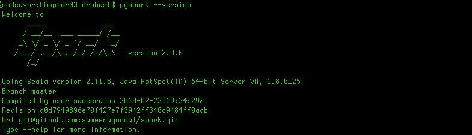

# 还有更多...

不使用 Spark 的`make-distribution.sh`脚本，您可以直接使用 Maven 编译源代码。例如，如果您想构建 Spark 的默认版本，只需在`_spark_dir`文件夹中键入：

```py
./build/mvn clean package
```

这将默认为 Hadoop 2.6。如果您的 Hadoop 版本为 2.7.2 并且已部署在 YARN 上，则可以执行以下操作：

```py
./build/mvn -Pyarn -Phadoop-2.7 -Dhadoop.version=2.7.2 -DskipTests clean package
```

您还可以使用 Scala 构建 Spark：

```py
./build/sbt package
```

# 另请参阅

+   如果您想进一步学习如何构建和/或启用 Spark 的某些功能，请查看 Spark 的网站：[`spark.apache.org/docs/latest/building-spark.html`](http://spark.apache.org/docs/latest/building-spark.html)

# 从二进制文件安装 Spark

从预编译的二进制文件安装 Spark 甚至比从源代码进行相同操作更容易。在本教程中，我们将向您展示如何通过从网上下载二进制文件或使用`pip`来实现这一点。

# 准备工作

要执行此教程，您需要一个 bash 终端和互联网连接。此外，为了完成此教程，您需要已经检查和/或安装了我们在*安装 Spark 要求*教程中介绍的所有必需环境。此外，您需要具有管理权限（通过`sudo`命令），因为这将是将编译后的二进制文件移动到目标文件夹所必需的。

如果您不是计算机上的管理员，可以使用`-ns`（或`--nosudo`）参数调用脚本。目标文件夹将切换到您的主目录，并在其中创建一个`spark`文件夹；默认情况下，二进制文件将移动到`/opt/spark`文件夹，因此您需要管理权限。

不需要其他先决条件。

# 如何做...

要从二进制文件安装，我们只需要四个步骤（请参阅以下源代码），因为我们不需要编译源代码：

1.  从 Spark 的网站下载预编译的二进制文件。

1.  解压缩存档。

1.  移动到最终目的地。

1.  创建必要的环境变量。

我们的代码框架如下（请参阅`Chapter01/installFromBinary.sh`文件）：

```py
#!/bin/bash
```

```py
# Shell script for installing Spark from binaries
```

```py

#
# PySpark Cookbook
# Author: Tomasz Drabas, Denny Lee
# Version: 0.1
# Date: 12/2/2017
```

```py
_spark_binary="http://mirrors.ocf.berkeley.edu/apache/spark/spark-2.3.1/spark-2.3.1-bin-hadoop2.7.tgz"
_spark_archive=$( echo "$_spark_binary" | awk -F '/' '{print $NF}' )
_spark_dir=$( echo "${_spark_archive%.*}" )
_spark_destination="/opt/spark"
```

```py
...
```

```py
checkOS
printHeader
downloadThePackage
unpack
moveTheBinaries
setSparkEnvironmentVariables
cleanUp
```

# 工作原理...

代码与上一个教程完全相同，因此我们不会在此重复；唯一的主要区别是在此脚本中我们没有`build`阶段，并且`_spark_source`变量不同。

与上一个教程一样，我们首先指定 Spark 源代码的位置，即`_spark_source`。`_spark_archive`包含存档的名称；我们使用`awk`来提取最后一个元素。`_spark_dir`包含我们的存档将解压缩到的目录的名称；在我们当前的情况下，这将是`spark-2.3.1`。最后，我们指定我们将移动二进制文件的目标文件夹：它将是`/opt/spark`（默认）或者如果您在调用`./installFromBinary.sh`脚本时使用了`-ns`（或`--nosudo`）开关，则是您的主目录。

接下来，我们检查操作系统名称。根据您是在 Linux 还是 macOS 环境中工作，我们将使用不同的工具从互联网下载存档（检查`downloadThePackage`函数）。此外，在设置环境变量时，我们将输出到不同的 bash 配置文件：macOS 上的`.bash_profile`和 Linux 上的`.bashrc`（检查`setEnvironmentVariables`函数）。

在进行操作系统检查后，我们下载软件包：在 macOS 上，我们使用`curl`，在 Linux 上，我们使用`wget`工具来实现这个目标。软件包下载完成后，我们使用`tar`工具解压缩，然后将其移动到目标文件夹。如果您具有`sudo`权限（没有`-ns`或`--nosudo`参数），则二进制文件将移动到`/opt/spark`文件夹；否则，它们将放在`~/spark`文件夹中。

最后，我们将环境变量添加到适当的 bash 配置文件中：查看前一个教程以了解添加的内容及原因。同时，按照前一个教程的步骤测试您的环境是否正常工作。

# 还有更多...

如今，在您的计算机上安装 PySpark 的方法更加简单，即使用 pip。

`pip`是 Python 的软件包管理器。如果您从[`python.org`](http://python.org)安装了 Python 2.7.9 或 Python 3.4，则`pip`已经存在于您的计算机上（我们推荐的 Python 发行版 Anaconda 也是如此）。如果您没有`pip`，可以从这里轻松安装它：[`pip.pypa.io/en/stable/installing/`](https://pip.pypa.io/en/stable/installing/)。

要通过`pip`安装 PySpark，只需在终端中输入以下命令：

```py
pip install pyspark
```

或者，如果您使用 Python 3.4+，也可以尝试：

```py
pip3 install pyspark
```

您应该在终端中看到以下屏幕：

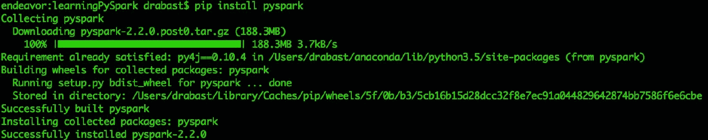

# 配置本地 Spark 实例

实际上，配置本地 Spark 实例并不需要做太多事情。Spark 的美妙之处在于，您只需要按照之前的两种方法之一（从源代码或二进制文件安装），就可以开始使用它。但是，在本教程中，我们将为您介绍最有用的`SparkSession`配置选项。

# 准备工作

为了按照本教程，需要一个可用的 Spark 环境。这意味着您必须已经完成了前三个教程，并成功安装和测试了您的环境，或者已经设置了一个可用的 Spark 环境。

不需要其他先决条件。

# 如何做...

要配置您的会话，在低于 2.0 版本的 Spark 版本中，通常需要创建一个`SparkConf`对象，将所有选项设置为正确的值，然后构建`SparkContext`（如果要使用`DataFrames`，则为`SqlContext`，如果要访问 Hive 表，则为`HiveContext`）。从 Spark 2.0 开始，您只需要创建一个`SparkSession`，就像以下代码片段中一样：

```py
spark = SparkSession.builder \
    .master("local[2]") \
    .appName("Your-app-name") \
    .config("spark.some.config.option", "some-value") \
    .getOrCreate() 
```

# 工作原理...

要创建一个`SparkSession`，我们将使用`Builder`类（通过`SparkSession`类的`.builder`属性访问）。您可以在这里指定`SparkSession`的一些基本属性：

+   `.master(...)`允许您指定驱动节点（在我们之前的示例中，我们将使用两个核心运行本地会话）

+   `.appName(...)`允许您为您的应用程序指定友好的名称

+   `.config(...)`方法允许您进一步完善会话的行为；最重要的`SparkSession`参数列表在下表中概述

+   `.getOrCreate()`方法返回一个新的`SparkSession`（如果尚未创建），或者返回指向已经存在的`SparkSession`的指针

以下表格提供了本地 Spark 实例的最有用的配置参数示例列表：

如果您在具有多个工作节点的集群环境中工作，这些参数也适用。在下一个教程中，我们将解释如何设置和管理部署在 YARN 上的多节点 Spark 集群。

| **参数** | **功能** | **默认** |
| --- | --- | --- |
| `spark.app.name` | 指定应用程序的友好名称 | (无) |
| `spark.driver.cores` | 驱动节点要使用的核心数。这仅适用于集群模式下的应用程序部署（参见下面的`spark.submit.deployMode`参数）。 | 1 |
| `spark.driver.memory` | 指定驱动程序进程的内存量。如果在客户端模式下使用`spark-submit`，您应该在命令行中使用`--driver-memory`开关来指定这个参数，而不是在配置会话时使用这个参数，因为 JVM 在这一点上已经启动了。 | 1g |
| `spark.executor.cores` | 每个执行器要使用的核心数。在本地运行时设置此参数允许您使用机器上所有可用的核心。 | YARN 部署中为 1，在独立和 Mesos 部署中为工作节点上的所有可用核心 |
| `spark.executor.memory` | 指定每个执行器进程的内存量。 | 1g |
| `spark.submit.pyFiles` | 以逗号分隔的`.zip`、`.egg`或`.py`文件列表。这些文件将被添加到`PYTHONPATH`中，以便 Python 应用程序可以访问它们。 | (无) |
| `spark.submit.deployMode` | Spark 驱动程序程序的部署模式。指定`'client'`将在本地（可以是驱动节点）启动驱动程序程序，而指定`'cluster'`将利用远程集群上的一个节点。 | (无) |
| `spark.pyspark.python` | 驱动程序和所有执行器应该使用的 Python 二进制文件。 | (无) |

还有一些环境变量可以让您进一步微调您的 Spark 环境。具体来说，我们正在谈论`PYSPARK_DRIVER_PYTHON`和`PYSPARK_DRIVER_PYTHON_OPTS`变量。我们已经在*从源代码安装 Spark*教程中介绍过这些内容。

# 参见

+   在这里检查所有可用配置选项的完整列表：[`spark.apache.org/docs/latest/configuration.html`](https://spark.apache.org/docs/latest/configuration.html)

# 配置 Spark 的多节点实例

设置一个多节点 Spark 集群需要做更多的准备工作。在这个教程中，我们将逐步介绍一个脚本，该脚本将帮助您完成此过程；该脚本需要在驱动节点和所有执行器上运行以设置环境。

# 准备工作

在这个教程中，我们只关注 Linux 环境（我们使用的是 Ubuntu Server 16.04 LTS）。在您继续进行下一步之前，需要满足以下先决条件：

+   干净安装 Linux 发行版；在我们的情况下，我们在我们的三台 Dell R710 机器上都安装了 Ubuntu Server 16.04 LTS。

+   每台机器都需要连接到互联网，并且可以从本地机器访问。您需要机器的 IP 和主机名；在 Linux 上，您可以通过发出`ifconfig`命令并阅读`inet addr`来检查 IP。要检查您的主机名，请在`cat/etc/hostname`处输入。

+   在每台服务器上，我们添加了一个名为`hadoop`的用户组。在此之后，我们创建了一个名为`hduser`的用户，并将其添加到`hadoop`组中。还要确保`hduser`具有`sudo`权限。如果您不知道如何做到这一点，请查看本教程的*参见*部分。

+   确保您已经添加了通过 SSH 访问服务器的能力。如果无法做到这一点，请在每台服务器上运行`sudo apt-get install openssh-server openssh-client`来安装必要的环境。

+   如果你想要读写 Hadoop 和 Hive，你需要在你的集群上安装和配置这两个环境。查看[Hadoop 安装和配置](https://data-flair.training/blogs/install-hadoop-2-x-on-ubuntu/)和[Hive](http://www.bogotobogo.com/Hadoop/BigData_hadoop_Hive_Install_On_Ubuntu_16_04.php)。

如果你已经设置好了这两个环境，我们脚本中的一些步骤将变得多余。然而，我们将按照以下方式呈现所有步骤，假设你只需要 Spark 环境。

不需要其他先决条件。

为了自动部署集群设置中的 Spark 环境，你还需要：

1.  创建一个`hosts.txt`文件。列表中的每个条目都是一个服务器的 IP 地址，后面跟着两个空格和一个主机名。**不要删除`driver:`和`executors:`行**。还要注意，我们的集群只允许一个 driver（一些集群支持冗余 driver）。这个文件的内容示例如下：

```py
driver:
192.168.17.160  pathfinder
```

```py
executors:
192.168.17.161  discovery1
192.168.17.162  discovery2
```

1.  在你的本地机器上，将 IP 地址和主机名添加到你的`/etc/hosts`文件中，这样你就可以通过主机名而不是 IP 地址访问服务器（我们再次假设你正在运行类 Unix 系统，如 macOS 或 Linux）。例如，以下命令将在我们的`/etc/hosts`文件中添加`pathfinder`：`sudo echo 192.168.1.160  pathfinder >> /etc/hosts`。对你的服务器上的所有机器都重复这个步骤。

1.  将`hosts.txt`文件复制到你集群中的每台机器上；我们假设文件将放在`hduser`的根文件夹中。你可以使用`scp hosts.txt hduser@<your-server-name>:~`命令轻松实现这一点，其中`<your-server-name>`是机器的主机名。

1.  从你的本地机器运行`installOnRemote.sh`脚本（参见`Chapter01/installOnRemote.sh`文件），执行以下操作：`ssh -tq hduser@<your-server-name> "echo $(base64 -i installOnRemote.sh) | base64 -d | sudo bash"`。我们将在下一节详细介绍`installOnRemote.sh`脚本中的这些步骤。

1.  按照屏幕上的提示完成安装和配置步骤。对于你集群中的每台机器都要重复第 4 步。

# 如何做...

本节的`installOnRemote.sh`脚本可以在 GitHub 存储库的`Chapter01`文件夹中找到：[`bit.ly/2ArlBck`](http://bit.ly/2ArlBck)。脚本的一些部分与我们在之前的步骤中概述的部分非常相似，因此我们将跳过这些部分；你可以参考之前的步骤获取更多信息（特别是*安装 Spark 要求*和*从二进制文件安装 Spark*的步骤）。

脚本的顶层结构如下：

```py
#!/bin/bash
```

```py
# Shell script for installing Spark from binaries
# on remote servers
#
# PySpark Cookbook
# Author: Tomasz Drabas, Denny Lee
# Version: 0.1
# Date: 12/9/2017
```

```py
_spark_binary="http://mirrors.ocf.berkeley.edu/apache/spark/spark-2.3.1/spark-2.3.1-bin-hadoop2.7.tgz"
_spark_archive=$( echo "$_spark_binary" | awk -F '/' '{print $NF}' )
_spark_dir=$( echo "${_spark_archive%.*}" )
_spark_destination="/opt/spark"
_java_destination="/usr/lib/jvm/java-8-oracle"

_python_binary="https://repo.continuum.io/archive/Anaconda3-5.0.1-Linux-x86_64.sh"
```

```py

_python_archive=$( echo "$_python_binary" | awk -F '/' '{print $NF}' )
_python_destination="/opt/python"
```

```py
_machine=$(cat /etc/hostname)
_today=$( date +%Y-%m-%d )
```

```py
_current_dir=$(pwd) # store current working directory
```

```py
...
```

```py
printHeader
readIPs
checkJava
installScala
installPython
updateHosts
configureSSH
downloadThePackage
unpack
moveTheBinaries
setSparkEnvironmentVariables
updateSparkConfig
cleanUp
```

我们已经用粗体字突出显示了与本节相关的脚本部分。

# 工作原理...

与之前的步骤一样，我们首先要指定从哪里下载 Spark 二进制文件，并创建我们稍后要使用的所有相关全局变量。

接下来，我们读取`hosts.txt`文件：

```py
function readIPs() {
 input="./hosts.txt"
```

```py
 driver=0
 executors=0
 _executors=""

 IFS=''
 while read line
 do
```

```py
 if [[ "$master" = "1" ]]; then
    _driverNode="$line"
    driver=0
 fi
```

```py
 if [[ "$slaves" = "1" ]]; then
   _executors=$_executors"$line\n"
 fi
```

```py
 if [[ "$line" = "driver:" ]]; then
    driver=1
    executors=0
 fi
```

```py
 if [[ "$line" = "executors:" ]]; then
    executors=1
    driver=0
 fi
```

```py
 if [[ -z "${line}" ]]; then
     continue
 fi
 done < "$input"
}
```

我们将文件路径存储在`input`变量中。`driver`和`executors`变量是我们用来跳过输入文件中的`"driver:"`和`"executors:"`行的标志。`_executors`空字符串将存储执行者的列表，这些列表由换行符`"\n"`分隔。

**IFS**代表**内部字段分隔符**。每当`bash`从文件中读取一行时，它将根据该字符进行分割。在这里，我们将其设置为空字符`''`，以便保留 IP 地址和主机名之间的双空格。

接下来，我们逐行读取文件。让我们看看循环内部的逻辑是如何工作的；我们将有点乱序开始，以便逻辑更容易理解：

+   如果我们刚刚读取的`line`等于`"driver:"`（`if [[ "$line" = "driver:" ]];`条件），我们将`driver`标志设置为`1`，这样当下一行被读取时，我们将其存储为`_driverNode`（这是在`if [[ "$driver" = "1" ]];`条件内完成的）。在该条件内，我们还将`executors`标志重置为`0`。后者是为了防止您首先启动执行程序，然后在`hosts.txt`中启动单个驱动程序。一旦读取了包含驱动程序节点信息的`line`，我们将`driver`标志重置为`0`。

+   另一方面，如果我们刚刚读取的`line`等于`"executors:"`（`if [[ "$line" = "executors:" ]];`条件），我们将`executors`标志设置为`1`（并将`driver`标志重置为`0`）。这确保下一行将被附加到`_executors`字符串中，并用`"\n"`换行字符分隔（这是在`if [[ "$executors" = "1" ]];`条件内完成的）。请注意，我们不将`executor`标志设置为`0`，因为我们允许有多个执行程序。

+   如果我们遇到空行（在 bash 中可以通过`if [[ -z "${line}" ]];`条件来检查），我们将跳过它。

您可能会注意到我们使用`"<"`重定向管道来读取数据（这里由输入变量表示）。

您可以在这里阅读更多关于重定向管道的信息：[`www.tldp.org/LDP/abs/html/io-redirection.html`](http://www.tldp.org/LDP/abs/html/io-redirection.html)。

由于 Spark 需要 Java 和 Scala 才能工作，接下来我们必须检查 Java 是否已安装，并安装 Scala（因为通常情况下 Java 可能已安装而 Scala 可能没有）。这是通过以下函数实现的：

```py
function checkJava() {
 if type -p java; then
    echo "Java executable found in PATH"
    _java=java
 elif [[ -n "$JAVA_HOME" ]] && [[ -x "$JAVA_HOME/bin/java" ]]; then
    echo "Found Java executable in JAVA_HOME"
    _java="$JAVA_HOME/bin/java"
 else
    echo "No Java found. Install Java version $_java_required or higher first or specify JAVA_HOME     variable that will point to your Java binaries."
    installJava
 fi
}
```

```py
function installJava() {
 sudo apt-get install python-software-properties
 sudo add-apt-repository ppa:webupd8team/java
 sudo apt-get update
 sudo apt-get install oracle-java8-installer
}
```

```py
function installScala() {
 sudo apt-get install scala
}

function installPython() {
 curl -O "$_python_binary"
 chmod 0755 ./"$_python_archive"
 sudo bash ./"$_python_archive" -b -u -p "$_python_destination"
}
```

这里的逻辑与我们在*安装 Spark 要求*配方中呈现的内容并没有太大的不同。`checkJava`函数中唯一显著的区别是，如果我们在`PATH`变量或`JAVA_HOME`文件夹中找不到 Java，我们不会退出，而是运行`installJava`。

安装 Java 有很多种方法；我们在本书的早些时候已经向您介绍了其中一种方法——请查看*安装 Spark 要求*配方中的*安装 Java*部分。在这里，我们使用了内置的`apt-get`工具。

`apt-get`工具是在 Linux 机器上安装软件包的方便、快速和高效的实用程序。**APT**代表**高级包装工具**。

首先，我们安装`python-software-properties`。这套工具提供了对使用的`apt`存储库的抽象。它使得易于管理发行版以及独立软件供应商的软件源。我们需要这个工具，因为在下一行我们要添加`add-apt-repository`；我们添加一个新的存储库，因为我们需要 Oracle Java 发行版。`sudo apt-get update`命令刷新存储库的内容，并在我们当前的情况下获取`ppa:webupd8team/java`中所有可用的软件包。最后，我们安装 Java 软件包：只需按照屏幕上的提示操作。我们将以同样的方式安装 Scala。

软件包应该安装的默认位置是`/usr/lib/jvm/java-8-oracle`。如果不是这种情况，或者您想要将其安装在不同的文件夹中，您将不得不修改脚本中的`_java_destination`变量以反映新的目的地。

使用这个工具的优势在于：如果机器上已经安装了 Java 和 Scala 环境，使用`apt-get`将要么跳过安装（如果环境与服务器上可用的环境保持最新），要么要求您更新到最新版本。

我们还将安装 Python 的 Anaconda 发行版（如之前多次提到的，因为我们强烈推荐这个发行版）。为了实现这个目标，我们必须首先下载`Anaconda3-5.0.1-Linux-x86_64.sh`脚本，然后按照屏幕上的提示进行操作。脚本的`-b`参数不会更新`.bashrc`文件（我们稍后会做），`-u`开关将更新 Python 环境（如果`/usr/local/python`已经存在），`-p`将强制安装到该文件夹。

在完成所需的安装步骤后，我们现在将更新远程机器上的`/etc/hosts`文件：

```py
function updateHosts() {
```

```py
 _hostsFile="/etc/hosts"
```

```py
 # make a copy (if one already doesn't exist)
 if ! [ -f "/etc/hosts.old" ]; then
    sudo cp "$_hostsFile" /etc/hosts.old
 fi
```

```py
 t="###################################################\n"
 t=$t"#\n"
 t=$t"# IPs of the Spark cluster machines\n"
 t=$t"#\n"
 t=$t"# Script: installOnRemote.sh\n"
 t=$t"# Added on: $_today\n"
 t=$t"#\n"
 t=$t"$_driverNode\n"
 t=$t"$_executors\n"
```

```py
 sudo printf "$t" >> $_hostsFile
```

```py
}
```

这是一个简单的函数，首先创建`/etc/hosts`文件的副本，然后将我们集群中机器的 IP 和主机名附加到其中。请注意，`/etc/hosts`文件所需的格式与我们使用的`hosts.txt`文件相同：每行一个机器的 IP 地址，后面跟着两个空格，然后是主机名。

我们为了可读性的目的使用两个空格——一个空格分隔 IP 和主机名也可以。

另外，请注意我们这里不使用`echo`命令，而是使用`printf`；这样做的原因是`printf`命令打印出字符串的格式化版本，正确处理换行符`"\n"`。

接下来，我们配置无密码 SSH 会话（请查看下面的*另请参阅*子节）以帮助驱动节点和执行器之间的通信。

```py
function configureSSH() {
    # check if driver node
    IFS=" "
    read -ra temp <<< "$_driverNode"
    _driver_machine=( ${temp[1]} )
    _all_machines="$_driver_machine\n"

    if [ "$_driver_machine" = "$_machine" ]; then
        # generate key pairs (passwordless)
        sudo -u hduser rm -f ~/.ssh/id_rsa
        sudo -u hduser ssh-keygen -t rsa -P "" -f ~/.ssh/id_rsa

        IFS="\n"
        read -ra temp <<< "$_executors"
        for executor in ${temp[@]}; do 
            # skip if empty line
            if [[ -z "${executor}" ]]; then
                continue
            fi

            # split on space
            IFS=" "
            read -ra temp_inner <<< "$executor"
            echo
            echo "Trying to connect to ${temp_inner[1]}"

            cat ~/.ssh/id_rsa.pub | ssh "hduser"@"${temp_inner[1]}" 'mkdir -p .ssh && cat >> .ssh/authorized_keys'

            _all_machines=$_all_machines"${temp_inner[1]}\n"
        done
    fi

    echo "Finishing up the SSH configuration"
}
```

在这个函数中，我们首先检查我们是否在驱动节点上，如`hosts.txt`文件中定义的那样，因为我们只需要在驱动节点上执行这些任务。`read -ra temp <<< "$_driverNode"`命令读取`_driverNode`（在我们的例子中，它是`192.168.1.160  pathfinder`），并在空格字符处拆分它（记住`IFS`代表什么？）。`-a`开关指示`read`方法将拆分的`_driverNode`字符串存储在`temp`数组中，`-r`参数确保反斜杠不起转义字符的作用。我们将驱动程序的名称存储在`_driver_machine`变量中，并将其附加到`_all_machines`字符串中（我们稍后会用到）。

如果我们在驱动机器上执行此脚本，我们首先必须删除旧的 SSH 密钥（使用`rm`函数和`-f`强制开关），然后创建一个新的。`sudo -u hduser`开关允许我们以`hduser`的身份执行这些操作（而不是`root`用户）。

当我们从本地机器提交脚本运行时，我们在远程机器上以 root 身份开始一个 SSH 会话。您很快就会看到这是如何做的，所以现在就相信我们的话吧。

我们将使用`ssh-keygen`方法创建 SSH 密钥对。`-t`开关允许我们选择加密算法（我们使用 RSA 加密），`-P`开关确定要使用的密码（我们希望无密码，所以选择`""`），`-f`参数指定存储密钥的文件名。

接下来，我们循环遍历所有的执行器：我们需要将`~/.ssh/id_rsa.pub`的内容附加到它们的`~/.ssh/authorized_keys`文件中。我们在`"\n"`字符处拆分`_executors`，并循环遍历所有的执行器。为了将`id_rsa.pub`文件的内容传递给执行器，我们使用`cat`工具打印`id_rsa.pub`文件的内容，然后将其传递给`ssh`工具。我们传递给`ssh`的第一个参数是我们要连接的用户名和主机名。接下来，我们传递我们要在远程机器上执行的命令。首先，我们尝试创建`.ssh`文件夹（如果不存在）。然后将`id_rsa.pub`文件输出到`.ssh/authorized_keys`。

在集群上配置 SSH 会话后，我们下载 Spark 二进制文件，解压它们，并将它们移动到`_spark_destination`。

我们已经在*从源代码安装 Spark*和*从二进制文件安装 Spark*部分中概述了这些步骤，因此建议您查看它们。

最后，我们需要设置两个 Spark 配置文件：`spark-env.sh`和`slaves`文件。

```py
function updateSparkConfig() {
    cd $_spark_destination/conf

    sudo -u hduser cp spark-env.sh.template spark-env.sh
    echo "export JAVA_HOME=$_java_destination" >> spark-env.sh
    echo "export SPARK_WORKER_CORES=12" >> spark-env.sh

    sudo -u hduser cp slaves.template slaves
    printf "$_all_machines" >> slaves
}
```

我们需要将`JAVA_HOME`变量附加到`spark-env.sh`中，以便 Spark 可以找到必要的库。我们还必须指定每个 worker 的核心数为`12`；这个目标是通过设置`SPARK_WORKER_CORES`变量来实现的。

您可能需要根据自己的需求调整`SPARK_WORKER_CORES`的值。查看此电子表格以获取帮助：[`c2fo.io/img/apache-spark-config-cheatsheet/C2FO-Spark-Config-Cheatsheet.xlsx`](http://c2fo.io/img/apache-spark-config-cheatsheet/C2FO-Spark-Config-Cheatsheet.xlsx)（也可以从这里获取：[`c2fo.io/c2fo/spark/aws/emr/2016/07/06/apache-spark-config-cheatsheet/`](http://c2fo.io/c2fo/spark/aws/emr/2016/07/06/apache-spark-config-cheatsheet/)）。

接下来，我们需要将集群中所有机器的主机名输出到`slaves`文件中。

为了在远程机器上执行脚本，并且由于我们需要以提升的模式运行它（使用`sudo`作为`root`），我们需要在发送脚本之前对脚本进行加密。如下是如何完成这个过程的示例（从 macOS 到远程 Linux）：

```py
ssh -tq hduser@pathfinder "echo $(base64 -i installOnRemote.sh) | base64 -d | sudo bash"
```

或者从 Linux 到远程 Linux：

```py
ssh -tq hduser@pathfinder "echo $(base64 -w0 installOnRemote.sh) | base64 -d | sudo bash"
```

在将其推送到远程之前，上述脚本使用`base64`加密工具对`installOnRemote.sh`脚本进行加密。一旦在远程上，我们再次使用`base64`来解密脚本（使用`-d`开关）并以`root`（通过`sudo`）运行它。请注意，为了运行这种类型的脚本，我们还向`ssh`工具传递了`-tq`开关；`-t`选项强制分配伪终端，以便我们可以在远程机器上执行任意基于屏幕的脚本，`-q`选项使所有消息都安静，除了我们的脚本消息。

假设一切顺利，一旦脚本在所有机器上执行完毕，Spark 就已经成功安装并配置在您的集群上。但是，在您可以使用 Spark 之前，您需要关闭与驱动程序的连接并再次 SSH 到它，或者输入：

```py
source ~/.bashrc
```

这样新创建的环境变量才能可用，并且您的`PATH`被更新。

要启动您的集群，可以输入：

```py
start-all.sh
```

集群中的所有机器应该开始运行并被 Spark 识别。

为了检查一切是否正常启动，输入：

```py
jps
```

它应该返回类似于以下内容（在我们的情况下，我们的集群中有三台机器）：

```py
40334 Master
41297 Worker
41058 Worker
```

# 另请参阅

以下是一些有用的链接列表，可能会帮助您完成这个配方：

+   如果您不知道如何添加用户组，请查看此链接：[`www.techonthenet.com/linux/sysadmin/ubuntu/create_group_14_04.php`](https://www.techonthenet.com/linux/sysadmin/ubuntu/create_group_14_04.php)

+   要添加一个`sudo`用户，请查看此链接：[`www.digitalocean.com/community/tutorials/how-to-add-and-delete-users-on-ubuntu-16-04`](https://www.digitalocean.com/community/tutorials/how-to-add-and-delete-users-on-ubuntu-16-04)

+   以下是安装 Spark 的逐步手动说明：[`data-flair.training/blogs/install-apache-spark-multi-node-cluster/`](https://data-flair.training/blogs/install-apache-spark-multi-node-cluster/)。

+   以下是如何在机器之间设置无密码 SSH 通信的方法：[`www.tecmint.com/ssh-passwordless-login-using-ssh-keygen-in-5-easy-steps/`](https://www.tecmint.com/ssh-passwordless-login-using-ssh-keygen-in-5-easy-steps/)

# 安装 Jupyter

Jupyter 提供了一种方便地与您的 Spark 环境合作的方式。在这个配方中，我们将指导您如何在本地机器上安装 Jupyter。

# 准备就绪

我们需要一个可用的 Spark 安装。这意味着您将按照第一个、第二或第三个配方中概述的步骤进行操作。此外，还需要一个可用的 Python 环境。

不需要其他先决条件。

# 如何做到...

如果您的机器上没有安装`pip`，您需要在继续之前安装它。

1.  要做到这一点，请打开终端并键入（在 macOS 上）：

```py
curl -O https://bootstrap.pypa.io/get-pip.py
```

或者在 Linux 上：

```py
wget https://bootstrap.pypa.io/get-pip.py
```

1.  接下来，键入（适用于两种操作系统）：

```py
python get-pip.py
```

这将在您的计算机上安装`pip`。

1.  您现在只需使用以下命令安装 Jupyter：

```py
pip install jupyter
```

# 它是如何工作的...

`pip`是一个用于在**PyPI**，**Python 软件包索引**上安装 Python 软件包的管理工具。 该服务托管了各种 Python 软件包，并且是分发 Python 软件包的最简单和最快速的方式。

但是，调用`pip install`不仅会在 PyPI 上搜索软件包：此外，还会扫描 VCS 项目 URL、本地项目目录和本地或远程源存档。

Jupyter 是最受欢迎的交互式 shell 之一，支持在各种环境中开发代码：Python 不是唯一受支持的环境。

直接来自[`jupyter.org`](http://jupyter.org)：

“Jupyter Notebook 是一个开源的 Web 应用程序，允许您创建和共享包含实时代码、方程式、可视化和叙述文本的文档。用途包括：数据清理和转换、数值模拟、统计建模、数据可视化、机器学习等等。”

安装 Jupyter 的另一种方法，如果您正在使用 Anaconda Python 发行版，则是使用其软件包管理工具`conda`。 这是方法：

```py
conda install jupyter
```

请注意，`pip install`在 Anaconda 中也可以工作。

# 还有更多...

现在您的计算机上有了 Jupyter，并且假设您已经按照*从源代码安装 Spark*或*从二进制文件安装 Spark*教程的步骤进行操作，您应该能够开始使用 Jupyter 与 PySpark 进行交互。

为了提醒您，作为安装 Spark 脚本的一部分，我们已将两个环境变量附加到 bash 配置文件中：`PYSPARK_DRIVER_PYTHON`和`PYSPARK_DRIVER_PYTHON_OPTS`。 使用这两个环境变量，我们将前者设置为使用`jupyter`，将后者设置为启动`notebook`服务。

如果您现在打开终端并键入：

```py
pyspark
```

当您打开浏览器并导航到`http://localhost:6661`时，您应该看到一个与以下屏幕截图中的窗口并没有太大不同：

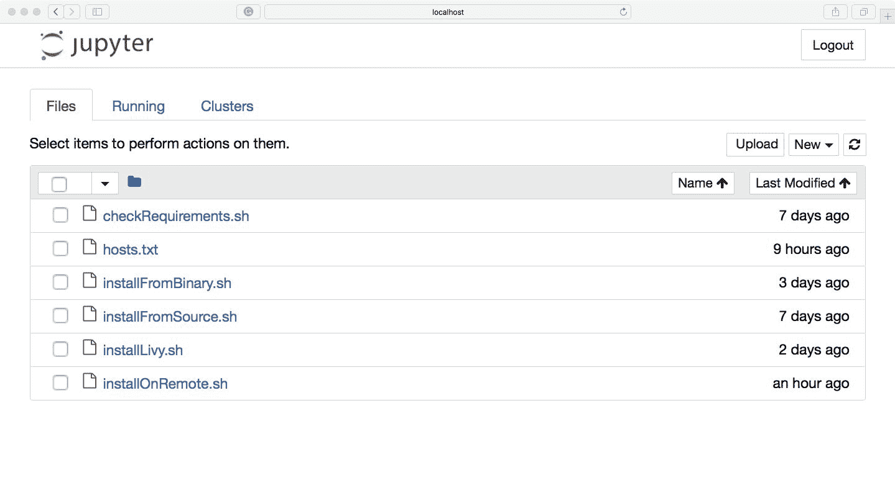

# 另请参阅

+   查看[`pypi.python.org/pypi`](https://pypi.python.org/pypi)，因为 Python 可用的真正酷项目数量令人难以置信

# 在 Jupyter 中配置会话

在 Jupyter 中工作非常棒，因为它允许您以交互方式开发代码，并与同事记录和共享笔记本。 但是，使用本地 Spark 实例运行 Jupyter 的问题在于`SparkSession`会自动创建，并且在笔记本运行时，您无法在该会话的配置中进行太多更改。

在这个教程中，我们将学习如何安装 Livy，这是一个与 Spark 交互的 REST 服务，以及`sparkmagic`，这是一个允许我们以交互方式配置会话的软件包：

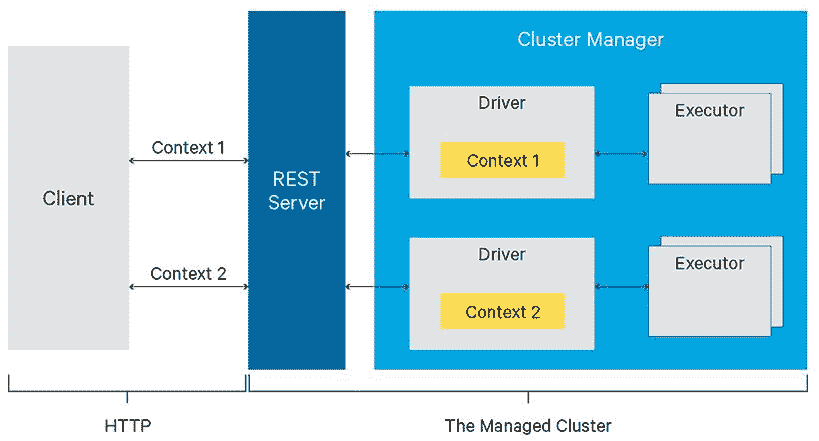

来源：http://bit.ly/2iO3EwC

# 准备就绪

我们假设您已经通过二进制文件安装了 Spark，或者按照我们在之前的教程中向您展示的那样编译了源代码。 换句话说，到目前为止，您应该已经拥有一个可用的 Spark 环境。 您还需要 Jupyter：如果没有，请按照上一个教程中的步骤安装它。

不需要其他先决条件。

# 如何做...

要安装 Livy 和`sparkmagic`，我们已经创建了一个脚本，将自动执行此操作，您只需进行最少的交互。 您可以在`Chapter01/installLivy.sh`文件夹中找到它。 到目前为止，您应该已经熟悉我们将在此处使用的大多数功能，因此我们将仅关注不同的功能（在以下代码中以粗体显示）。 这是脚本结构的高级视图：

```py
#!/bin/bash

# Shell script for installing Spark from binaries 
#
# PySpark Cookbook
# Author: Tomasz Drabas, Denny Lee
# Version: 0.1
# Date: 12/2/2017

_livy_binary="http://mirrors.ocf.berkeley.edu/apache/incubator/livy/0.4.0-incubating/livy-0.4.0-incubating-bin.zip"
_livy_archive=$( echo "$_livy_binary" | awk -F '/' '{print $NF}' )
_livy_dir=$( echo "${_livy_archive%.*}" )
_livy_destination="/opt/livy"
_hadoop_destination="/opt/hadoop"
...
checkOS
printHeader
createTempDir
downloadThePackage $( echo "${_livy_binary}" )
unpack $( echo "${_livy_archive}" )
moveTheBinaries $( echo "${_livy_dir}" ) $( echo "${_livy_destination}" ) 
# create log directory inside the folder
mkdir -p "$_livy_destination/logs"

checkHadoop
installJupyterKernels
setSparkEnvironmentVariables
cleanUp
```

# 它是如何工作的...

与我们迄今为止介绍的所有其他脚本一样，我们将首先设置一些全局变量。

如果您不知道这些是什么意思，请查看*从源代码安装 Spark*教程。

Livy 需要一些来自 Hadoop 的配置文件。因此，在此脚本的一部分中，我们允许您安装 Hadoop，如果您的计算机上没有安装 Hadoop。这就是为什么我们现在允许您向`downloadThePackage`，`unpack`和`moveTheBinaries`函数传递参数。

对函数的更改相当容易理解，因此出于空间考虑，我们将不在此处粘贴代码。不过，您可以随时查看`installLivy.sh`脚本的相关部分。

安装 Livy 实际上是下载软件包，解压缩并将其移动到最终目的地（在我们的情况下，这是`/opt/livy`）。

检查 Hadoop 是否已安装是我们要做的下一件事。要在本地会话中运行 Livy，我们需要两个环境变量：`SPARK_HOME`和`HADOOP_CONF_DIR`；`SPARK_HOME`肯定已设置，但如果您没有安装 Hadoop，您很可能不会设置后一个环境变量：

```py
function checkHadoop() {
    if type -p hadoop; then
        echo "Hadoop executable found in PATH"
        _hadoop=hadoop
    elif [[ -n "$HADOOP_HOME" ]] && [[ -x "$HADOOP_HOME/bin/hadoop" ]]; then
        echo "Found Hadoop executable in HADOOP_HOME"
        _hadoop="$HADOOP_HOME/bin/hadoop"
    else
        echo "No Hadoop found. You should install Hadoop first. You can still continue but some functionality might not be available. "
        echo 
        echo -n "Do you want to install the latest version of Hadoop? [y/n]: "
        read _install_hadoop

        case "$_install_hadoop" in
            y*) installHadoop ;;
            n*) echo "Will not install Hadoop" ;;
            *)  echo "Will not install Hadoop" ;;
        esac
    fi
}

function installHadoop() {
    _hadoop_binary="http://mirrors.ocf.berkeley.edu/apache/hadoop/common/hadoop-2.9.0/hadoop-2.9.0.tar.gz"
    _hadoop_archive=$( echo "$_hadoop_binary" | awk -F '/' '{print $NF}' )
    _hadoop_dir=$( echo "${_hadoop_archive%.*}" )
    _hadoop_dir=$( echo "${_hadoop_dir%.*}" )

    downloadThePackage $( echo "${_hadoop_binary}" )
```

```py

    unpack $( echo "${_hadoop_archive}" )
    moveTheBinaries $( echo "${_hadoop_dir}" ) $( echo "${_hadoop_destination}" )
}
```

`checkHadoop`函数首先检查`PATH`上是否存在`hadoop`二进制文件；如果没有，它将检查`HADOOP_HOME`变量是否已设置，如果设置了，它将检查`$HADOOP_HOME/bin`文件夹中是否可以找到`hadoop`二进制文件。如果两次尝试都失败，脚本将询问您是否要安装 Hadoop 的最新版本；默认答案是`n`，但如果您回答`y`，安装将开始。

安装完成后，我们将开始安装 Jupyter 笔记本的其他内核。

内核是一种软件，它将来自前端笔记本的命令转换为后端环境（如 Python）的命令。有关可用 Jupyter 内核的列表，请查看以下链接：[`github.com/jupyter/jupyter/wiki/Jupyter-kernels`](https://github.com/jupyter/jupyter/wiki/Jupyter-kernels)。以下是如何自己开发内核的一些说明：[`jupyter-client.readthedocs.io/en/latest/kernels.html`](http://jupyter-client.readthedocs.io/en/latest/kernels.html)。

以下是处理内核安装的函数：

```py
function installJupyterKernels() {
    # install the library 
    pip install sparkmagic
    echo

    # ipywidgets should work properly
    jupyter nbextension enable --py --sys-prefix widgetsnbextension 
    echo

    # install kernels
    # get the location of sparkmagic
    _sparkmagic_location=$(pip show sparkmagic | awk -F ':' '/Location/ {print $2}') 

    _temp_dir=$(pwd) # store current working directory

    cd $_sparkmagic_location # move to the sparkmagic folder
    jupyter-kernelspec install sparkmagic/kernels/sparkkernel
    jupyter-kernelspec install sparkmagic/kernels/pysparkkernel
    jupyter-kernelspec install sparkmagic/kernels/pyspark3kernel

    echo

    # enable the ability to change clusters programmatically
    jupyter serverextension enable --py sparkmagic
    echo

    # install autowizwidget
    pip install autovizwidget

    cd $_temp_dir
}
```

首先，我们为 Python 安装`sparkmagic`软件包。直接引用自[`github.com/jupyter-incubator/sparkmagic`](https://github.com/jupyter-incubator/sparkmagic)：

“Sparkmagic 是一组工具，用于通过 Livy（Spark REST 服务器）在 Jupyter 笔记本中与远程 Spark 集群进行交互。Sparkmagic 项目包括一组魔术方法，用于以多种语言交互地运行 Spark 代码，以及一些内核，您可以使用这些内核将 Jupyter 转换为集成的 Spark 环境。”

以下命令启用 Jupyter 笔记本中的 Javascript 扩展，以便`ipywidgets`可以正常工作；如果您使用的是 Python 的 Anaconda 发行版，此软件包将自动安装。

接下来，我们安装内核。我们需要切换到`sparkmagic`安装的文件夹。`pip show <package>`命令显示有关安装软件包的所有相关信息；从输出中，我们只使用`awk`提取`Location`。

安装内核时，我们使用`jupyter-kernelspec install <kernel>`命令。例如，该命令将为 Spark 的 Scala API 安装`sparkmagic`内核：

```py
jupyter-kernelspec install sparkmagic/kernels/sparkkernel 
```

安装所有内核后，我们启用 Jupyter 使用`sparkmagic`，以便我们可以以编程方式更改集群。最后，我们将安装`autovizwidget`，这是一个用于`pandas 数据框`的自动可视化库。

这结束了 Livy 和`sparkmagic`的安装部分。

# 还有更多...

既然一切就绪，让我们看看这能做什么。

首先启动 Jupyter（请注意，我们不使用`pyspark`命令）：

```py
jupyter notebook
```

如果要添加新的笔记本，现在应该能够看到以下选项：

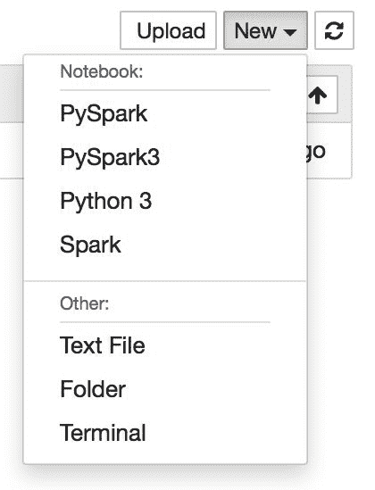

如果单击 PySpark，它将打开一个笔记本并连接到一个内核。

有许多可用的*魔术*与笔记本互动；键入`%%help`以列出所有魔术。以下是最重要的魔术列表：

| **魔术** | **示例** | **说明** |
| --- | --- | --- |
| `info` | `%%info` | 从 Livy 输出会话信息。 |
| `cleanup` | `%%cleanup -f` | 删除当前 Livy 端点上运行的所有会话。`-f`开关强制清理。 |
| `delete` | `%%delete -f -s 0` | 删除由`-s`开关指定的会话；`-f`开关强制删除。 |
| `configure` | `%%configure -f``{"executorMemory": "1000M", "executorCores": 4}` | 可能是最有用的魔术。允许您配置会话。查看[`bit.ly/2kSKlXr`](http://bit.ly/2kSKlXr)获取可用配置参数的完整列表。 |
| `sql` | `%%sql -o tables -q``SHOW TABLES` | 对当前的`SparkSession`执行 SQL 查询。 |
| `local` | `%%local``a=1` | 笔记本单元格中带有此魔术的所有代码将在 Python 环境中本地执行。 |

一旦您配置了会话，您将从 Livy 那里得到有关当前正在运行的活动会话的信息：

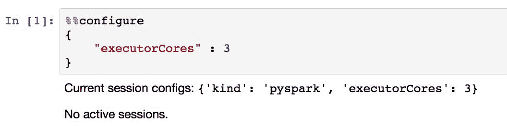

让我们尝试使用以下代码创建一个简单的数据框架：

```py
from pyspark.sql.types import *

# Generate our data 
ListRDD = sc.parallelize([
    (123, 'Skye', 19, 'brown'), 
    (223, 'Rachel', 22, 'green'), 
    (333, 'Albert', 23, 'blue')
])

# The schema is encoded using StructType 
schema = StructType([
    StructField("id", LongType(), True), 
    StructField("name", StringType(), True),
    StructField("age", LongType(), True),
    StructField("eyeColor", StringType(), True)
])

# Apply the schema to the RDD and create DataFrame
drivers = spark.createDataFrame(ListRDD, schema)

# Creates a temporary view using the data frame
drivers.createOrReplaceTempView("drivers")
```

在笔记本内的单元格中执行上述代码后，才会创建`SparkSession`：


如果您执行`%%sql`魔术，您将得到以下内容：

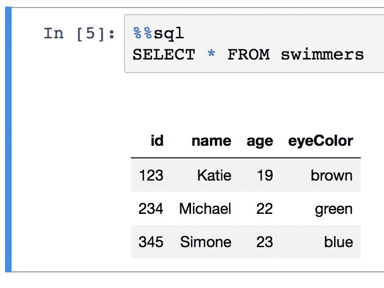

# 另请参阅

+   如果您想以编程方式提交作业，请检查 Livy REST API：[`livy.incubator.apache.org/docs/latest/rest-api.html`](https://livy.incubator.apache.org/docs/latest/rest-api.html)。另外，要查看`sparkmagic`中可用的可配置参数列表，请访问：[`github.com/jupyter-incubator/sparkmagic/blob/master/examples/Pyspark%20Kernel.ipynb`](https://github.com/jupyter-incubator/sparkmagic/blob/master/examples/Pyspark%20Kernel.ipynb)。

# 使用 Cloudera Spark 镜像

Cloudera 是一家成立于 2008 年的公司，由 Google，Yahoo！，Oracle 和 Facebook 的前员工创立。当 Apache Hadoop 刚刚推出时，它就是开源技术的早期采用者；事实上，Hadoop 的作者本人随后不久就加入了该公司。如今，Cloudera 销售来自 Apache Software Foundation 的广泛的开源产品许可证，并提供咨询服务。

在本教程中，我们将查看 Cloudera 的免费虚拟镜像，以便学习如何使用该公司支持的最新技术。

# 准备工作

要完成本教程，您需要安装 Oracle 的免费虚拟化工具 VirtualBox。

以下是安装 VirtualBox 的说明：

在 Windows 上：[`www.htpcbeginner.com/install-virtualbox-on-windows/`](https://www.htpcbeginner.com/install-virtualbox-on-windows/)

在 Linux 上：[`www.packtpub.com/books/content/installing-virtualbox-linux`](https://www.packtpub.com/books/content/installing-virtualbox-linux) 在 Mac 上：[`www.youtube.com/watch?v=lEvM-No4eQo`](https://www.youtube.com/watch?v=lEvM-No4eQo)。

要运行 VM，您需要：

+   64 位主机；Windows 10，macOS 和大多数 Linux 发行版都是 64 位系统

+   至少需要 4GB 的 RAM 专用于 VM，因此需要至少 8GB 的 RAM 系统

无需其他先决条件。

# 操作步骤...

首先，要下载 Cloudera QuickStart VM：

1.  访问[`www.cloudera.com/downloads/quickstart_vms/5-12.html`](https://www.cloudera.com/downloads/quickstart_vms/5-12.html)。

1.  从右侧的下拉菜单中选择 VirtualBox 作为您的平台，然后单击立即获取按钮。

1.  将显示一个注册窗口；根据需要填写并按照屏幕上的说明操作：


请注意，这是一个超过 6GB 的下载，所以可能需要一些时间。

1.  下载后，打开 VirtualBox。

1.  转到文件|导入虚拟机，单击路径选择旁边的按钮，并找到`.ovf`文件（它应该有一个`.vmdk`文件，适用于您刚下载的版本）。

在 macOS 上，图像在下载后会自动解压缩。在 Windows 和 Linux 上，您可能需要先解压缩存档文件。

您应该看到一个类似于这样的进度条：


导入后，您应该看到一个像这样的窗口：

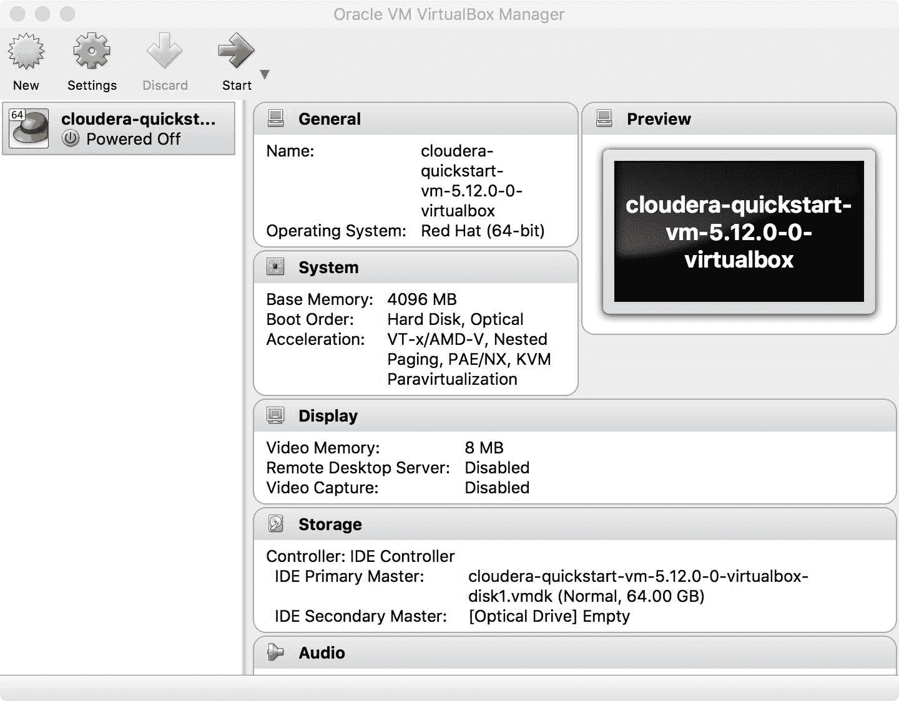

1.  如果现在点击“启动”，您应该会看到一个新窗口弹出，Cloudera VM（构建在 CentOS 上）应该开始启动。完成后，您的屏幕上应该会出现一个类似下面的窗口：

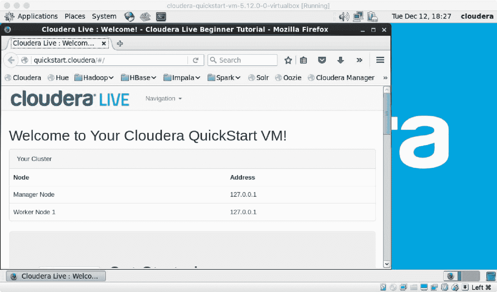

# 它是如何工作的...

实际上，没有太多需要配置的：Cloudera QuickStart VM 已经包含了您启动所需的一切。事实上，对于 Windows 用户来说，这比安装所有必要的环境要简单得多。然而，在撰写本书时，它只配备了 Spark 1.6.0：

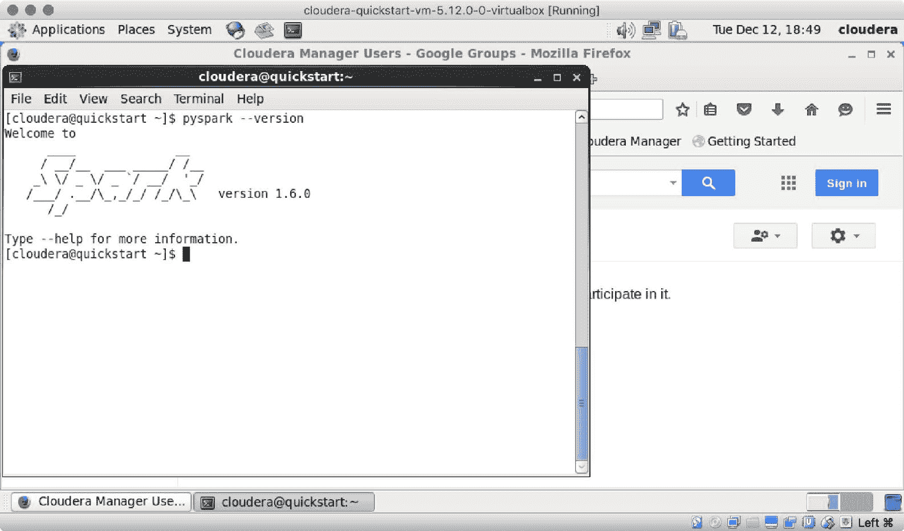

然而，通过按照我们在本书中提出的*从源代码安装 Spark*或*从二进制文件安装 Spark*的方法，您可以升级到 Spark 2.3.1。
