# 第二章：使用 RDDs 抽象数据

在本章中，我们将介绍如何使用 Apache Spark 的弹性分布式数据集。您将学习以下示例：

+   创建 RDDs

+   从文件中读取数据

+   RDD 转换概述

+   RDD 操作概述

+   使用 RDDs 的陷阱

# 介绍

**弹性分布式数据集**（**RDDs**）是分布在 Apache Spark 集群中的不可变 JVM 对象的集合。请注意，如果您是 Apache Spark 的新手，您可能希望最初跳过本章，因为 Spark DataFrames/Datasets 在开发上更容易，并且通常具有更快的性能。有关 Spark DataFrames 的更多信息，请参阅下一章。

RDD 是 Apache Spark 最基本的数据集类型；对 Spark DataFrame 的任何操作最终都会被*转换*为对 RDD 的高度优化的转换和操作的执行（请参阅第三章中关于数据帧的抽象的段落，*介绍*部分）。

RDD 中的数据根据键分成块，然后分散到所有执行节点上。RDDs 具有很高的弹性，即相同的数据块被复制到多个执行节点上，因此即使一个执行节点失败，另一个仍然可以处理数据。这使您可以通过利用多个节点的能力快速对数据集执行功能计算。RDDs 保留了应用于每个块的所有执行步骤的日志。这加速了计算，并且如果出现问题，RDDs 仍然可以恢复由于执行器错误而丢失的数据部分。

在分布式环境中丢失节点是很常见的（例如，由于连接问题、硬件问题），数据的分发和复制可以防止数据丢失，而数据谱系允许系统快速恢复。

# 创建 RDDs

对于这个示例，我们将通过在 PySpark 中生成数据来开始创建 RDD。要在 Apache Spark 中创建 RDDs，您需要首先按照上一章中所示安装 Spark。您可以使用 PySpark shell 和/或 Jupyter 笔记本来运行这些代码示例。

# 准备工作

我们需要一个已安装的 Spark。这意味着您已经按照上一章中概述的步骤进行了操作。作为提醒，要为本地 Spark 集群启动 PySpark shell，您可以运行以下命令：

```py
./bin/pyspark --master local[n]
```

其中`n`是核心数。

# 如何做...

要快速创建 RDD，请通过 bash 终端在您的机器上运行 PySpark，或者您可以在 Jupyter 笔记本中运行相同的查询。在 PySpark 中创建 RDD 有两种方法：您可以使用`parallelize()`方法-一个集合（一些元素的列表或数组）或引用一个文件（或文件），可以是本地的，也可以是通过外部来源，如后续的示例中所述。

```py
myRDD) using the sc.parallelize() method:
```

```py
myRDD = sc.parallelize([('Mike', 19), ('June', 18), ('Rachel',16), ('Rob', 18), ('Scott', 17)])
```

要查看 RDD 中的内容，您可以运行以下代码片段：

```py
myRDD.take(5)
```

输出如下：

```py
Out[10]: [('Mike', 19), ('June', 18), ('Rachel',16), ('Rob', 18), ('Scott', 17)]
```

# 工作原理...

```py
sc.parallelize() and take().
```

# Spark 上下文并行化方法

在创建 RDD 时，实际上发生了很多操作。让我们从 RDD 的创建开始，分解这段代码：

```py
myRDD = sc.parallelize( 
 [('Mike', 19), ('June', 18), ('Rachel',16), ('Rob', 18), ('Scott', 17)]
)
```

首先关注`sc.parallelize()`方法中的语句，我们首先创建了一个 Python 列表（即`[A, B, ..., E]`），由数组列表组成（即`('Mike', 19), ('June', 19), ..., ('Scott', 17)`）。`sc.parallelize()`方法是 SparkContext 的`parallelize`方法，用于创建并行化集合。这允许 Spark 将数据分布在多个节点上，而不是依赖单个节点来处理数据：

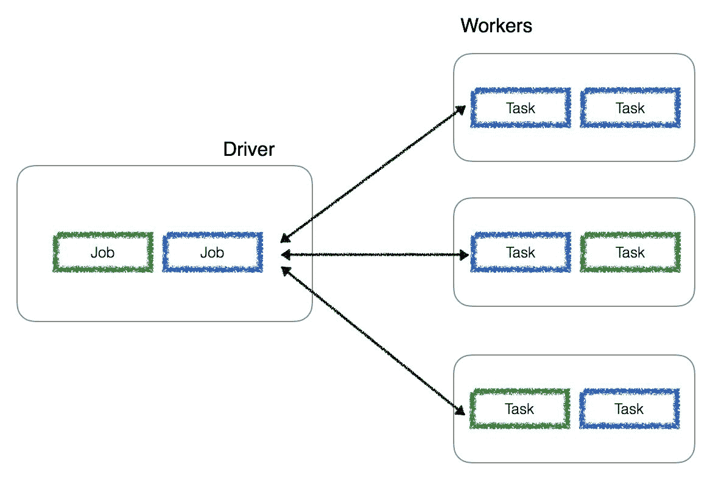

现在我们已经创建了`myRDD`作为并行化集合，Spark 可以并行操作这些数据。一旦创建，分布式数据集（`distData`）可以并行操作。例如，我们可以调用`myRDD.reduceByKey(add)`来对列表的按键进行求和；我们在本章的后续部分中有 RDD 操作的示例。

# .take(...) 方法

现在您已经创建了您的 RDD（`myRDD`），我们将使用`take()`方法将值返回到控制台（或笔记本单元格）。我们现在将执行一个 RDD 操作（有关此操作的更多信息，请参见后续示例），`take()`。请注意，PySpark 中的一种常见方法是使用`collect()`，它将从 Spark 工作节点将所有值返回到驱动程序。在处理大量数据时会有性能影响，因为这意味着大量数据从 Spark 工作节点传输到驱动程序。对于小量数据（例如本示例），这是完全可以的，但是，习惯上，您应该几乎总是使用`take(n)`方法；它返回 RDD 的前`n`个元素而不是整个数据集。这是一种更有效的方法，因为它首先扫描一个分区，并使用这些统计信息来确定返回结果所需的分区数。

# 从文件中读取数据

在本示例中，我们将通过在 PySpark 中读取本地文件来创建一个 RDD。要在 Apache Spark 中创建 RDDs，您需要首先按照上一章中的说明安装 Spark。您可以使用 PySpark shell 和/或 Jupyter 笔记本来运行这些代码示例。请注意，虽然本示例特定于读取本地文件，但类似的语法也适用于 Hadoop、AWS S3、Azure WASBs 和/或 Google Cloud Storage。

| 存储类型 | 示例 |
| --- | --- |
| 本地文件 | `sc.textFile('/local folder/filename.csv')` |
| Hadoop HDFS | `sc.textFile('hdfs://folder/filename.csv')` |
| AWS S3 ([`docs.aws.amazon.com/emr/latest/ReleaseGuide/emr-spark-configure.html`](https://docs.aws.amazon.com/emr/latest/ReleaseGuide/emr-spark-configure.html)) | `sc.textFile('s3://bucket/folder/filename.csv')` |
| Azure WASBs ([`docs.microsoft.com/en-us/azure/hdinsight/hdinsight-hadoop-use-blob-storage`](https://docs.microsoft.com/en-us/azure/hdinsight/hdinsight-hadoop-use-blob-storage)) | `sc.textFile('wasb://bucket/folder/filename.csv')` |
| Google Cloud Storage ([`cloud.google.com/dataproc/docs/concepts/connectors/cloud-storage#other_sparkhadoop_clusters`](https://cloud.google.com/dataproc/docs/concepts/connectors/cloud-storage#other_sparkhadoop_clusters)) | `sc.textFile('gs://bucket/folder/filename.csv')` |
| Databricks DBFS ([`docs.databricks.com/user-guide/dbfs-databricks-file-system.html`](https://docs.databricks.com/user-guide/dbfs-databricks-file-system.html)) | `sc.textFile('dbfs://folder/filename.csv')` |

# 准备就绪

在这个示例中，我们将读取一个制表符分隔（或逗号分隔）的文件，所以请确保您有一个文本（或 CSV）文件可用。为了您的方便，您可以从[`github.com/drabastomek/learningPySpark/tree/master/Chapter03/flight-data`](https://github.com/drabastomek/learningPySpark/tree/master/Chapter03/flight-data)下载`airport-codes-na.txt`和`departuredelays.csv`文件。确保您的本地 Spark 集群可以访问此文件（例如，`~/data/flights/airport-codes-na.txt`）。

# 如何做...

通过 bash 终端启动 PySpark shell 后（或者您可以在 Jupyter 笔记本中运行相同的查询），执行以下查询：

```py
myRDD = (
    sc
    .textFile(
        '~/data/flights/airport-codes-na.txt'
        , minPartitions=4
        , use_unicode=True
    ).map(lambda element: element.split("\t"))
)
```

如果您正在运行 Databricks，同样的文件已经包含在`/databricks-datasets`文件夹中；命令是：

`myRDD = sc.textFile('/databricks-datasets/flights/airport-codes-na.txt').map(lambda element: element.split("\t"))`

运行查询时：

```py
myRDD.take(5)
```

结果输出为：

```py
Out[22]:  [[u'City', u'State', u'Country', u'IATA'], [u'Abbotsford', u'BC', u'Canada', u'YXX'], [u'Aberdeen', u'SD', u'USA', u'ABR'], [u'Abilene', u'TX', u'USA', u'ABI'], [u'Akron', u'OH', u'USA', u'CAK']]
```

深入一点，让我们确定这个 RDD 中的行数。请注意，有关 RDD 操作（如`count()`）的更多信息包含在后续的示例中：

```py
myRDD.count()

# Output
# Out[37]: 527
```

另外，让我们找出支持此 RDD 的分区数：

```py
myRDD.getNumPartitions()

# Output
# Out[33]: 4
```

# 工作原理...

```py
take can be broken down into its two components: sc.textFile() and map().
```

# .textFile(...)方法

要读取文件，我们使用 SparkContext 的`textFile()`方法通过这个命令：

```py
(
    sc
    .textFile(
        '~/data/flights/airport-codes-na.txt'
        , minPartitions=4
        , use_unicode=True
    )
)
```

只有第一个参数是必需的，它指示文本文件的位置为`~/data/flights/airport-codes-na.txt`。还有两个可选参数：

+   `minPartitions`：指示组成 RDD 的最小分区数。Spark 引擎通常可以根据文件大小确定最佳分区数，但出于性能原因，您可能希望更改分区数，因此可以指定最小数量。

+   `use_unicode`：如果处理 Unicode 数据，请使用此参数。

请注意，如果您执行此语句而没有后续的`map()`函数，生成的 RDD 将不引用制表符分隔符——基本上是一个字符串列表：

```py
myRDD = sc.textFile('~/data/flights/airport-codes-na.txt')
myRDD.take(5)

# Out[35]:  [u'City\tState\tCountry\tIATA', u'Abbotsford\tBC\tCanada\tYXX', u'Aberdeen\tSD\tUSA\tABR', u'Abilene\tTX\tUSA\tABI', u'Akron\tOH\tUSA\tCAK']
```

# .map(...)方法

为了理解 RDD 中的制表符，我们将使用`.map(...)`函数将数据从字符串列表转换为列表列表：

```py
myRDD = (
    sc
    .textFile('~/data/flights/airport-codes-na.txt')
    .map(lambda element: element.split("\t")) )
```

此映射转换的关键组件是：

+   `lambda`：一个匿名函数（即，没有名称定义的函数），由一个单一表达式组成

+   `split`：我们使用 PySpark 的 split 函数（在`pyspark.sql.functions`中）来围绕正则表达式模式分割字符串；在这种情况下，我们的分隔符是制表符（即`\t`）

将`sc.textFile()`和`map()`函数放在一起，可以让我们读取文本文件，并按制表符分割，生成由并行化列表集合组成的 RDD：

```py
Out[22]:  [[u'City', u'State', u'Country', u'IATA'], [u'Abbotsford', u'BC', u'Canada', u'YXX'], [u'Aberdeen', u'SD', u'USA', u'ABR'], [u'Abilene', u'TX', u'USA', u'ABI'], [u'Akron', u'OH', u'USA', u'CAK']]
```

# 分区和性能

在这个示例中，如果我们在没有为这个数据集指定`minPartitions`的情况下运行`sc.textFile()`，我们只会有两个分区：

```py
myRDD = (
    sc
    .textFile('/databricks-datasets/flights/airport-codes-na.txt')
    .map(lambda element: element.split("\t"))
)

myRDD.getNumPartitions()

# Output
Out[2]: 2
```

但是请注意，如果指定了`minPartitions`标志，那么您将获得指定的四个分区（或更多）：

```py
myRDD = (
    sc
    .textFile(
        '/databricks-datasets/flights/airport-codes-na.txt'
        , minPartitions=4
    ).map(lambda element: element.split("\t"))
)

myRDD.getNumPartitions()

# Output
Out[6]: 4
```

对于 RDD 的分区的一个关键方面是，分区越多，并行性越高。潜在地，有更多的分区将提高您的查询性能。在这部分示例中，让我们使用一个稍大一点的文件，`departuredelays.csv`：

```py
# Read the `departuredelays.csv` file and count number of rows
myRDD = (
    sc
    .textFile('/data/flights/departuredelays.csv')
    .map(lambda element: element.split(","))
)

myRDD.count()

# Output Duration: 3.33s
Out[17]: 1391579

# Get the number of partitions
myRDD.getNumPartitions()

# Output:
Out[20]: 2

```

如前面的代码片段所述，默认情况下，Spark 将创建两个分区，并且在我的小集群上花费 3.33 秒（在出发延误 CSV 文件中计算 139 万行）。

执行相同的命令，但同时指定`minPartitions`（在这种情况下，为八个分区），您会注意到`count()`方法在 2.96 秒内完成（而不是使用八个分区的 3.33 秒）。请注意，这些值可能根据您的机器配置而有所不同，但关键是修改分区的数量可能会由于并行化而导致更快的性能。查看以下代码：

```py
# Read the `departuredelays.csv` file and count number of rows
myRDD = (
    sc
    .textFile('/data/flights/departuredelays.csv', minPartitions=8)
    .map(lambda element: element.split(","))
)

myRDD.count()

# Output Duration: 2.96s
Out[17]: 1391579

# Get the number of partitions
myRDD.getNumPartitions()

# Output:
Out[20]: 8
```

# RDD 转换概述

如前面的部分所述，RDD 中可以使用两种类型的操作来塑造数据：转换和操作。转换，顾名思义，*将*一个 RDD 转换为另一个。换句话说，它接受一个现有的 RDD，并将其转换为一个或多个输出 RDD。在前面的示例中，我们使用了`map()`函数，这是一个通过制表符分割数据的转换的示例。

转换是懒惰的（不像操作）。它们只有在 RDD 上调用操作时才会执行。例如，调用`count()`函数是一个操作；有关操作的更多信息，请参阅下一节。

# 准备工作

这个食谱将阅读一个制表符分隔（或逗号分隔）的文件，请确保您有一个文本（或 CSV）文件可用。 为了您的方便，您可以从[`github.com/drabastomek/learningPySpark/tree/master/Chapter03/flight-data`](https://github.com/drabastomek/learningPySpark/tree/master/Chapter03/flight-data)下载`airport-codes-na.txt`和`departuredelays.csv`文件。确保您的本地 Spark 集群可以访问此文件（例如，`~/data/flights/airport-codes-na.txt`）。

如果您正在运行 Databricks，同样的文件已经包含在`/databricks-datasets`文件夹中；命令是

`myRDD = sc.textFile('/databricks-datasets/flights/airport-codes-na.txt').map(lambda line: line.split("\t"))`

下一节中的许多转换将使用 RDDs `airports`或`flights`；让我们使用以下代码片段设置它们：

```py
# Setup the RDD: airports
airports = (
    sc
    .textFile('~/data/flights/airport-codes-na.txt')
    .map(lambda element: element.split("\t"))
)

airports.take(5)

# Output
Out[11]:  
[[u'City', u'State', u'Country', u'IATA'], 
 [u'Abbotsford', u'BC', u'Canada', u'YXX'], 
 [u'Aberdeen', u'SD', u'USA', u'ABR'], 
 [u'Abilene', u'TX', u'USA', u'ABI'], 
 [u'Akron', u'OH', u'USA', u'CAK']]

# Setup the RDD: flights
flights = (
    sc
    .textFile('/databricks-datasets/flights/departuredelays.csv')
    .map(lambda element: element.split(","))
)

flights.take(5)

# Output
[[u'date', u'delay', u'distance', u'origin', u'destination'],  
 [u'01011245', u'6', u'602', u'ABE', u'ATL'],  
 [u'01020600', u'-8', u'369', u'ABE', u'DTW'],  
 [u'01021245', u'-2', u'602', u'ABE', u'ATL'],  
 [u'01020605', u'-4', u'602', u'ABE', u'ATL']]

```

# 如何做...

在本节中，我们列出了常见的 Apache Spark RDD 转换和代码片段。更完整的列表可以在[`spark.apache.org/docs/latest/rdd-programming-guide.html#transformations`](https://spark.apache.org/docs/latest/rdd-programming-guide.html#transformations)、[`spark.apache.org/docs/latest/api/python/pyspark.html#pyspark.RDD`](https://spark.apache.org/docs/latest/api/python/pyspark.html#pyspark.RDD)和[`training.databricks.com/visualapi.pdf`](https://training.databricks.com/visualapi.pdf)找到。

转换包括以下常见任务：

+   从文本文件中删除标题行：`zipWithIndex()`

+   从 RDD 中选择列：`map()`

+   运行`WHERE`（过滤器）子句：`filter()`

+   获取不同的值：`distinct()`

+   获取分区的数量：`getNumPartitions()`

+   确定分区的大小（即每个分区中的元素数量）：`mapPartitionsWithIndex()`

# .map(...)转换

`map(f)`转换通过将每个元素传递给函数`f`来返回一个新的 RDD。

查看以下代码片段：

```py
# Use map() to extract out the first two columns
airports.map(lambda c: (c[0], c[1])).take(5)
```

这将产生以下输出：

```py
# Output
[(u'City', u'State'),  
 (u'Abbotsford', u'BC'),  
 (u'Aberdeen', u'SD'),
```

```py

 (u'Abilene', u'TX'),  
 (u'Akron', u'OH')]
```

# .filter(...)转换

`filter(f)`转换根据`f`函数返回 true 的选择元素返回一个新的 RDD。因此，查看以下代码片段：

```py
# User filter() to filter where second column == "WA"
(
    airports
    .map(lambda c: (c[0], c[1]))
    .filter(lambda c: c[1] == "WA")
    .take(5)
)
```

这将产生以下输出：

```py
# Output
[(u'Bellingham', u'WA'),
 (u'Moses Lake', u'WA'),  
 (u'Pasco', u'WA'),  
 (u'Pullman', u'WA'),  
 (u'Seattle', u'WA')]
```

# .flatMap(...)转换

`flatMap(f)`转换类似于 map，但新的 RDD 会展平所有元素（即一系列事件）。让我们看一下以下片段：

```py
# Filter only second column == "WA", 
# select first two columns within the RDD,
# and flatten out all values
(
    airports
    .filter(lambda c: c[1] == "WA")
    .map(lambda c: (c[0], c[1]))
    .flatMap(lambda x: x)
    .take(10)
)
```

上述代码将产生以下输出：

```py
# Output
[u'Bellingham',  
 u'WA',  
 u'Moses Lake',  
 u'WA',  
 u'Pasco',  
 u'WA',  
 u'Pullman',  
 u'WA',  
 u'Seattle',  
 u'WA']
```

# .distinct()转换

`distinct()`转换返回包含源 RDD 的不同元素的新 RDD。因此，查看以下代码片段：

```py
# Provide the distinct elements for the 
# third column of airports representing
# countries
(
    airports
    .map(lambda c: c[2])
    .distinct()
    .take(5)
)
```

这将返回以下输出：

```py
# Output
[u'Canada', u'USA', u'Country']    
```

# .sample(...)转换

`sample(withReplacement, fraction, seed)`转换根据随机种子从数据中抽取一部分数据，可以选择是否有放回（`withReplacement`参数）。

查看以下代码片段：

```py
# Provide a sample based on 0.001% the
# flights RDD data specific to the fourth
# column (origin city of flight)
# without replacement (False) using random
# seed of 123 
(
    flights
    .map(lambda c: c[3])
    .sample(False, 0.001, 123)
    .take(5)
)
```

我们可以期待以下结果：

```py
# Output
[u'ABQ', u'AEX', u'AGS', u'ANC', u'ATL'] 
```

# .join(...)转换

`join(RDD')`转换在调用 RDD *(key, val_left)*和 RDD *(key, val_right)*时返回一个*(key, (val_left, val_right))*的 RDD。左外连接、右外连接和完全外连接都是支持的。

查看以下代码片段：

```py
# Flights data
#  e.g. (u'JFK', u'01010900')
flt = flights.map(lambda c: (c[3], c[0]))

# Airports data
# e.g. (u'JFK', u'NY')
air = airports.map(lambda c: (c[3], c[1]))

# Execute inner join between RDDs
flt.join(air).take(5)
```

这将给出以下结果：

```py
# Output
[(u'JFK', (u'01010900', u'NY')),  
 (u'JFK', (u'01011200', u'NY')),  
 (u'JFK', (u'01011900', u'NY')),  
 (u'JFK', (u'01011700', u'NY')),  
 (u'JFK', (u'01010800', u'NY'))]
```

# .repartition(...)转换

`repartition(n)`转换通过随机重分区和均匀分布数据来将 RDD 重新分区为`n`个分区。正如前面的食谱中所述，这可以通过同时运行更多并行线程来提高性能。以下是一个精确执行此操作的代码片段：

```py
# The flights RDD originally generated has 2 partitions 
flights.getNumPartitions()

# Output
2 

# Let's re-partition this to 8 so we can have 8 
# partitions
flights2 = flights.repartition(8)

# Checking the number of partitions for the flights2 RDD
flights2.getNumPartitions()

# Output
8
```

# .zipWithIndex()转换

`zipWithIndex()`转换会将 RDD 附加（或 ZIP）到元素索引上。当想要删除文件的标题行（第一行）时，这非常方便。

查看以下代码片段：

```py
# View each row within RDD + the index 
# i.e. output is in form ([row], idx)
ac = airports.map(lambda c: (c[0], c[3]))
ac.zipWithIndex().take(5)
```

这将生成这个结果：

```py
# Output
[((u'City', u'IATA'), 0),  
 ((u'Abbotsford', u'YXX'), 1),  
 ((u'Aberdeen', u'ABR'), 2),  
 ((u'Abilene', u'ABI'), 3),  
 ((u'Akron', u'CAK'), 4)]
```

要从数据中删除标题，您可以使用以下代码：

```py
# Using zipWithIndex to skip header row
# - filter out row 0
# - extract only row info
(
    ac
    .zipWithIndex()
    .filter(lambda (row, idx): idx > 0)
    .map(lambda (row, idx): row)
    .take(5)
)
```

前面的代码将跳过标题，如下所示：

```py
# Output
[(u'Abbotsford', u'YXX'),  
 (u'Aberdeen', u'ABR'),  
 (u'Abilene', u'ABI'),  
 (u'Akron', u'CAK'),  
 (u'Alamosa', u'ALS')]
```

# .reduceByKey(...) 转换

`reduceByKey(f)` 转换使用`f`按键减少 RDD 的元素。`f`函数应该是可交换和可结合的，这样它才能在并行计算中正确计算。

看下面的代码片段：

```py
# Determine delays by originating city
# - remove header row via zipWithIndex() 
#   and map() 
(
    flights
    .zipWithIndex()
    .filter(lambda (row, idx): idx > 0)
    .map(lambda (row, idx): row)
    .map(lambda c: (c[3], int(c[1])))
    .reduceByKey(lambda x, y: x + y)
    .take(5)
)
```

这将生成以下输出：

```py
# Output
[(u'JFK', 387929),  
 (u'MIA', 169373),  
 (u'LIH', -646),  
 (u'LIT', 34489),  
 (u'RDM', 3445)]
```

# .sortByKey(...) 转换

`sortByKey(asc)` 转换按*key*对*(key, value)* RDD 进行排序，并以升序或降序返回一个 RDD。看下面的代码片段：

```py
# Takes the origin code and delays, remove header
# runs a group by origin code via reduceByKey()
# sorting by the key (origin code)
(
    flights
    .zipWithIndex()
    .filter(lambda (row, idx): idx > 0)
    .map(lambda (row, idx): row)
    .map(lambda c: (c[3], int(c[1])))
    .reduceByKey(lambda x, y: x + y)
    .sortByKey()
    .take(50)
)
```

这将产生以下输出：

```py
# Output
[(u'ABE', 5113),  
 (u'ABI', 5128),  
 (u'ABQ', 64422),  
 (u'ABY', 1554),  
 (u'ACT', 392),
 ...]
```

# .union(...) 转换

`union(RDD)` 转换返回一个新的 RDD，该 RDD 是源 RDD 和参数 RDD 的并集。看下面的代码片段：

```py
# Create `a` RDD of Washington airports
a = (
    airports
    .zipWithIndex()
    .filter(lambda (row, idx): idx > 0)
    .map(lambda (row, idx): row)
    .filter(lambda c: c[1] == "WA")
)

# Create `b` RDD of British Columbia airports
b = (
    airports
    .zipWithIndex()
    .filter(lambda (row, idx): idx > 0)
    .map(lambda (row, idx): row)
    .filter(lambda c: c[1] == "BC")
)

# Union WA and BC airports
a.union(b).collect()
```

这将生成以下输出：

```py
# Output
[[u'Bellingham', u'WA', u'USA', u'BLI'],
 [u'Moses Lake', u'WA', u'USA', u'MWH'],
 [u'Pasco', u'WA', u'USA', u'PSC'],
 [u'Pullman', u'WA', u'USA', u'PUW'],
 [u'Seattle', u'WA', u'USA', u'SEA'],
...
 [u'Vancouver', u'BC', u'Canada', u'YVR'],
 [u'Victoria', u'BC', u'Canada', u'YYJ'], 
 [u'Williams Lake', u'BC', u'Canada', u'YWL']]
```

# .mapPartitionsWithIndex(...) 转换

`mapPartitionsWithIndex(f)` 类似于 map，但在每个分区上单独运行`f`函数，并提供分区的索引。它有助于确定分区内的数据倾斜（请查看以下代码片段）：

```py
# Source: https://stackoverflow.com/a/38957067/1100699
def partitionElementCount(idx, iterator):
  count = 0
  for _ in iterator:
    count += 1
  return idx, count

# Use mapPartitionsWithIndex to determine 
flights.mapPartitionsWithIndex(partitionElementCount).collect()
```

前面的代码将产生以下结果：

```py
# Output
[0,  
 174293,  
 1,  
 174020,  
 2,  
 173849,  
 3,  
 174006,  
 4,  
 173864,  
 5,  
 174308,  
 6,  
 173620,  
 7,  
 173618]
```

# 工作原理...

回想一下，转换会将现有的 RDD 转换为一个或多个输出 RDD。它也是一个懒惰的过程，直到执行一个动作才会启动。在下面的连接示例中，动作是`take()`函数：

```py
# Flights data
#  e.g. (u'JFK', u'01010900')
flt = flights.map(lambda c: (c[3], c[0]))

# Airports data
# e.g. (u'JFK', u'NY')
air = airports.map(lambda c: (c[3], c[1]))

# Execute inner join between RDDs
flt.join(air).take(5)

# Output
[(u'JFK', (u'01010900', u'NY')),  
 (u'JFK', (u'01011200', u'NY')),  
 (u'JFK', (u'01011900', u'NY')),  
 (u'JFK', (u'01011700', u'NY')),  
 (u'JFK', (u'01010800', u'NY'))]
```

为了更好地理解运行此连接时发生了什么，让我们回顾一下 Spark UI。每个 Spark 会话都会启动一个基于 Web 的 UI，默认情况下在端口`4040`上，例如`http://localhost:4040`。它包括以下信息：

+   调度器阶段和任务列表

+   RDD 大小和内存使用情况摘要

+   环境信息

+   有关正在运行的执行器的信息

有关更多信息，请参阅 Apache Spark 监控文档页面[`spark.apache.org/docs/latest/monitoring.html`](https://spark.apache.org/docs/latest/monitoring.html)。

要深入了解 Spark 内部工作，一个很好的视频是 Patrick Wendell 的*Apache Spark* *调优和调试*视频，可在[`www.youtube.com/watch?v=kkOG_aJ9KjQ`](https://www.youtube.com/watch?v=kkOG_aJ9KjQ)上找到。

如下 DAG 可视化所示，连接语句和两个前面的`map`转换都有一个作业（作业 24），创建了两个阶段（第 32 阶段和第 33 阶段）：

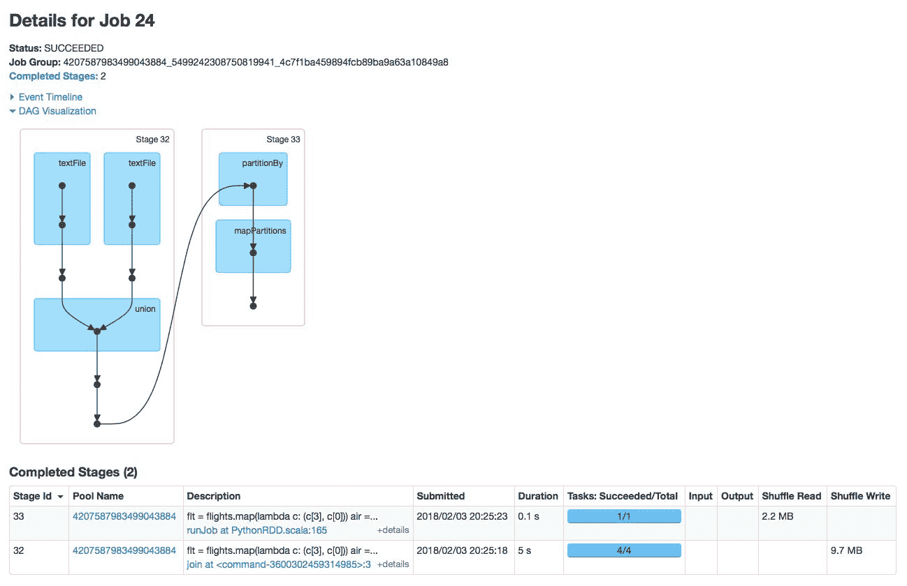

作业 24 的详细信息

让我们深入了解这两个阶段：

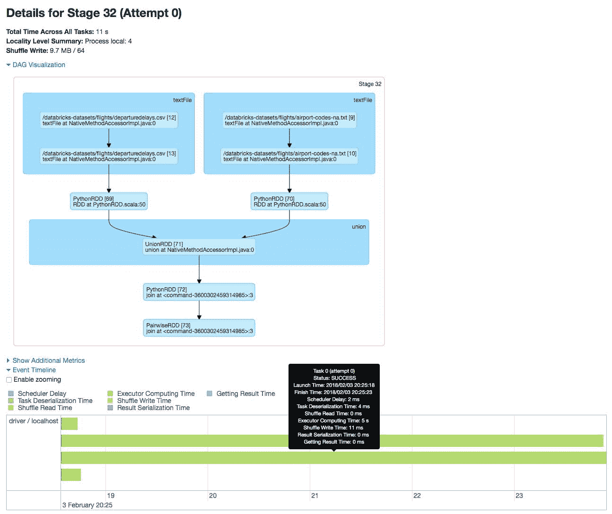

第 32 阶段的详细信息

为了更好地理解第一阶段（第 32 阶段）中执行的任务，我们可以深入了解阶段的 DAG 可视化以及事件时间线：

+   两个`textFile`调用是为了提取两个不同的文件（`departuredelays.csv`和`airport-codes-na.txt`）

+   一旦`map`函数完成，为了支持`join`，Spark 执行`UnionRDD`和`PairwiseRDD`来执行连接背后的基本操作作为`union`任务的一部分

在下一个阶段，`partitionBy`和`mapPartitions`任务在通过`take()`函数提供输出之前重新洗牌和重新映射分区：

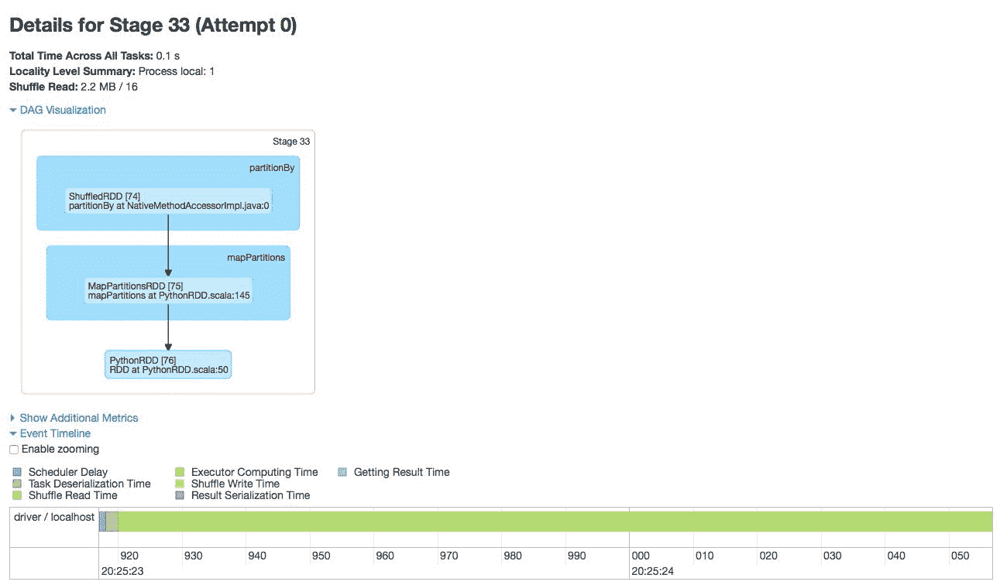

第 33 阶段的详细信息

请注意，如果您执行相同的语句而没有`take()`函数（或其他*动作*），只有*转换*操作将被执行，而在 Spark UI 中没有显示懒惰处理。

例如，如果您执行以下代码片段，请注意输出是指向 Python RDD 的指针：

```py
# Same join statement as above but no action operation such as take()
flt = flights.map(lambda c: (c[3], c[0]))
air = airports.map(lambda c: (c[3], c[1]))
flt.join(air)

# Output
Out[32]: PythonRDD[101] at RDD at PythonRDD.scala:50
```

# RDD 动作概述

如前面的部分所述，Apache Spark RDD 操作有两种类型：转换和动作。*动作*在数据集上运行计算后将一个值返回给驱动程序，通常在工作节点上。在前面的示例中，`take()`和`count()` RDD 操作是*动作*的示例。

# 准备就绪

这个示例将读取一个制表符分隔（或逗号分隔）的文件，请确保您有一个文本（或 CSV）文件可用。为了您的方便，您可以从[`bit.ly/2nroHbh`](http://bit.ly/2nroHbh)下载`airport-codes-na.txt`和`departuredelays.csv`文件。确保您的本地 Spark 集群可以访问此文件（`~/data/flights/airport-codes-na.txt`）。

如果您正在运行 Databricks，则相同的文件已经包含在`/databricks-datasets`文件夹中；命令是

`myRDD = sc.textFile('/databricks-datasets/flights/airport-codes-na.txt').map(lambda line: line.split("\t"))`

下一节中的许多转换将使用 RDDs `airports`或`flights`；让我们通过以下代码片段来设置它们：

```py
# Setup the RDD: airports
airports = (
    sc
    .textFile('~/data/flights/airport-codes-na.txt')
    .map(lambda element: element.split("\t"))
)

airports.take(5)

# Output
Out[11]:  
[[u'City', u'State', u'Country', u'IATA'], 
 [u'Abbotsford', u'BC', u'Canada', u'YXX'], 
 [u'Aberdeen', u'SD', u'USA', u'ABR'], 
 [u'Abilene', u'TX', u'USA', u'ABI'], 
 [u'Akron', u'OH', u'USA', u'CAK']]

# Setup the RDD: flights
flights = (
    sc
    .textFile('~/data/flights/departuredelays.csv', minPartitions=8)
    .map(lambda line: line.split(","))
)

flights.take(5)

# Output
[[u'date', u'delay', u'distance', u'origin', u'destination'],  
 [u'01011245', u'6', u'602', u'ABE', u'ATL'],  
 [u'01020600', u'-8', u'369', u'ABE', u'DTW'],  
 [u'01021245', u'-2', u'602', u'ABE', u'ATL'],  
 [u'01020605', u'-4', u'602', u'ABE', u'ATL']]

```

# 如何做...

以下列表概述了常见的 Apache Spark RDD 转换和代码片段。更完整的列表可以在 Apache Spark 文档的 RDD 编程指南 | 转换中找到，网址为[`spark.apache.org/docs/latest/rdd-programming-guide.html#transformations`](https://spark.apache.org/docs/latest/rdd-programming-guide.html#transformations)，PySpark RDD API 网址为[`spark.apache.org/docs/latest/api/python/pyspark.html#pyspark.RDD`](https://spark.apache.org/docs/latest/api/python/pyspark.html#pyspark.RDD)，以及 Essential Core and Intermediate Spark Operations 网址为[`training.databricks.com/visualapi.pdf`](https://training.databricks.com/visualapi.pdf)。

# .take(...) 操作

我们已经讨论过这个问题，但为了完整起见，`take(*n*)`操作将返回一个包含 RDD 的前`n`个元素的数组。看一下以下代码：

```py
# Print to console the first 3 elements of
# the airports RDD
airports.take(3)
```

这将生成以下输出：

```py
# Output
[[u'City', u'State', u'Country', u'IATA'], 
 [u'Abbotsford', u'BC', u'Canada', u'YXX'], 
 [u'Aberdeen', u'SD', u'USA', u'ABR']]
```

# .collect() 操作

我们还警告您不要使用此操作；`collect()`将所有元素从工作节点返回到驱动程序。因此，看一下以下代码：

```py
# Return all airports elements
# filtered by WA state
airports.filter(lambda c: c[1] == "WA").collect()
```

这将生成以下输出：

```py
# Output
[[u'Bellingham', u'WA', u'USA', u'BLI'],  [u'Moses Lake', u'WA', u'USA', u'MWH'],  [u'Pasco', u'WA', u'USA', u'PSC'],  [u'Pullman', u'WA', u'USA', u'PUW'],  [u'Seattle', u'WA', u'USA', u'SEA'],  [u'Spokane', u'WA', u'USA', u'GEG'],  [u'Walla Walla', u'WA', u'USA', u'ALW'],  [u'Wenatchee', u'WA', u'USA', u'EAT'],  [u'Yakima', u'WA', u'USA', u'YKM']]
```

# .reduce(...) 操作

`reduce(f)` 操作通过`f`聚合 RDD 的元素。`f`函数应该是可交换和可结合的，以便可以正确并行计算。看一下以下代码：

```py
# Calculate the total delays of flights
# between SEA (origin) and SFO (dest),
# convert delays column to int 
# and summarize
flights\
 .filter(lambda c: c[3] == 'SEA' and c[4] == 'SFO')\
 .map(lambda c: int(c[1]))\
 .reduce(lambda x, y: x + y)
```

这将产生以下结果：

```py
# Output
22293
```

然而，我们需要在这里做出重要的说明。使用`reduce()`时，缩减器函数需要是可结合和可交换的；也就是说，元素和操作数的顺序变化不会改变结果。

结合规则：`(6 + 3) + 4 = 6 + (3 + 4)` 交换规则：` 6 + 3 + 4 = 4 + 3 + 6`

如果忽略上述规则，可能会出现错误。

例如，看一下以下 RDD（只有一个分区！）：

`data_reduce = sc.parallelize([1, 2, .5, .1, 5, .2], 1)`

将数据减少到将当前结果除以后续结果，我们期望得到一个值为 10：

`works = data_reduce.reduce(lambda x, y: x / y)`

将数据分区为三个分区将产生不正确的结果：

`data_reduce = sc.parallelize([1, 2, .5, .1, 5, .2], 3) data_reduce.reduce(lambda x, y: x / y)`

它将产生`0.004`。

# .count() 操作

`count()`操作返回 RDD 中元素的数量。请参阅以下代码：

```py
(
    flights
    .zipWithIndex()
    .filter(lambda (row, idx): idx > 0)
    .map(lambda (row, idx): row)
    .count()
)
```

这将产生以下结果：

```py
# Output
1391578
```

# .saveAsTextFile(...) 操作

`saveAsTextFile()`操作将 RDD 保存到文本文件中；请注意，每个分区都是一个单独的文件。请参阅以下代码片段：

```py
# Saves airports as a text file
#   Note, each partition has their own file
```

```py

# saveAsTextFile
airports.saveAsTextFile("/tmp/denny/airports")
```

这实际上将保存以下文件：

```py
# Review file structure
# Note that `airports` is a folder with two
# files (part-zzzzz) as the airports RDD is 
# comprised of two partitions.
/tmp/denny/airports/_SUCCESS
/tmp/denny/airports/part-00000
/tmp/denny/airports/part-00001
```

# 工作原理...

请记住，操作在对数据集进行计算后将值返回给驱动程序，通常在工作节点上。一些 Spark 操作的示例包括`count()`和`take()`；在本节中，我们将重点关注`reduceByKey()`：

```py
# Determine delays by originating city
# - remove header row via zipWithIndex() 
#   and map() 
flights.zipWithIndex()\
  .filter(lambda (row, idx): idx > 0)\
  .map(lambda (row, idx): row)\
  .map(lambda c: (c[3], int(c[1])))\
  .reduceByKey(lambda x, y: x + y)\
  .take(5)

# Output
[(u'JFK', 387929),  
 (u'MIA', 169373),  
 (u'LIH', -646),  
 (u'LIT', 34489),  
 (u'RDM', 3445)]
```

为了更好地理解运行此连接时发生了什么，让我们来看一下 Spark UI。每个 Spark 会话都会启动一个基于 Web 的 UI，默认情况下在端口`4040`上，例如`http://localhost:4040`。它包括以下信息：

+   调度器阶段和任务列表

+   RDD 大小和内存使用情况摘要

+   环境信息

+   有关正在运行的执行器的信息

有关更多信息，请参阅 Apache Spark 监控文档页面[`spark.apache.org/docs/latest/monitoring.html`](https://spark.apache.org/docs/latest/monitoring.html)。

要深入了解 Spark 内部工作，可以观看 Patrick Wendell 的*调整和调试 Apache Spark*视频，网址为[`www.youtube.com/watch?v=kkOG_aJ9KjQ`](https://www.youtube.com/watch?v=kkOG_aJ9KjQ)。

```py
reduceByKey() action is called; note that Job 14 represents only the reduceByKey() of part the DAG. A previous job had executed and returned the results based on the zipWithIndex() transformation, which is not included in Job 14:
```

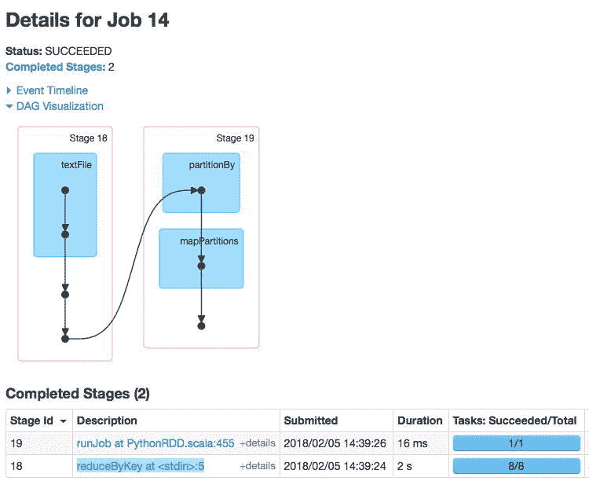

进一步深入研究构成每个阶段的任务，注意到大部分工作是在**Stage 18**中完成的。注意到有八个并行任务最终处理数据，从文件(`/tmp/data/departuredelays.csv`)中提取数据到并行执行`reduceByKey()`：

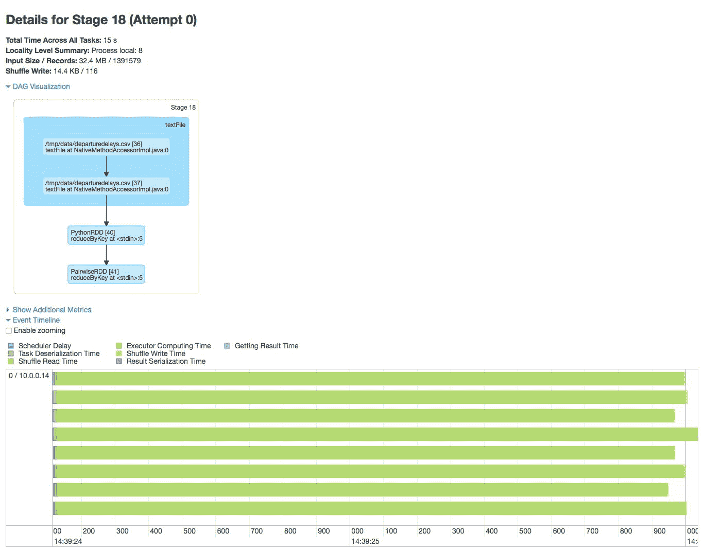

第 18 阶段的详细信息

以下是一些重要的要点：

+   Spark 的`reduceByKey(f)`假设`f`函数是可交换和可结合的，以便可以正确地并行计算。如 Spark UI 中所示，所有八个任务都在并行处理数据提取(`sc.textFile`)和`reduceByKey()`，提供更快的性能。

+   如本教程的*Getting ready*部分所述，我们执行了`sc.textFile($fileLocation, minPartitions=8)..`。这迫使 RDD 有八个分区（至少有八个分区），这意味着会有八个任务并行执行：

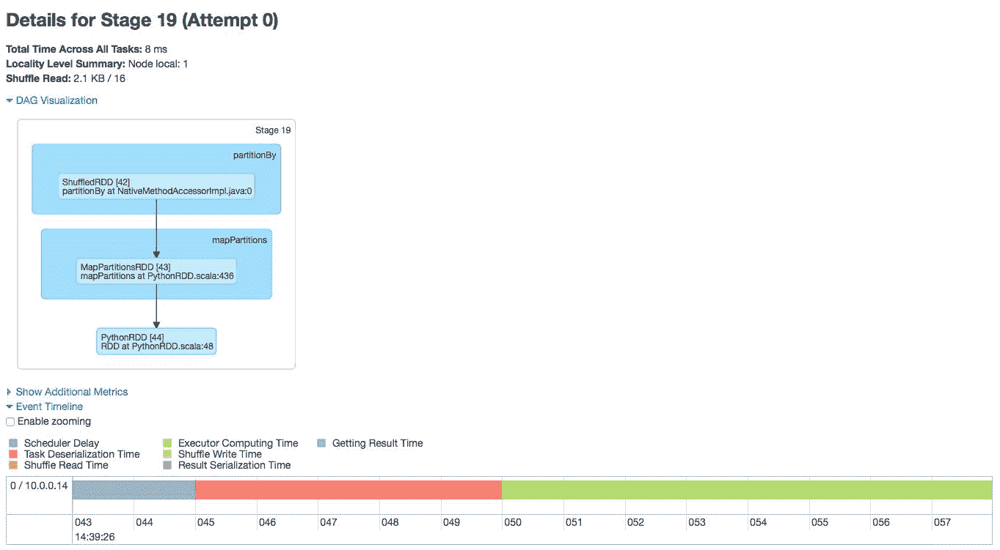

现在您已经执行了`reduceByKey()`，我们将运行`take(5)`，这将执行另一个阶段，将来自工作节点的八个分区洗牌到单个驱动节点；这样，数据就可以被收集起来在控制台中查看。

# 使用 RDD 的缺陷

使用 RDD 的关键问题是可能需要很长时间才能掌握。运行诸如 map、reduce 和 shuffle 等功能操作符的灵活性使您能够对数据执行各种各样的转换。但是，这种强大的功能也伴随着巨大的责任，有可能编写效率低下的代码，比如使用`GroupByKey`；更多信息可以在[`databricks.gitbooks.io/databricks-spark-knowledge-base/content/best_practices/prefer_reducebykey_over_groupbykey.html`](https://databricks.gitbooks.io/databricks-spark-knowledge-base/content/best_practices/prefer_reducebykey_over_groupbykey.html)中找到。

通常情况下，与 Spark DataFrames 相比，使用 RDDs 通常会有较慢的性能，如下图所示：

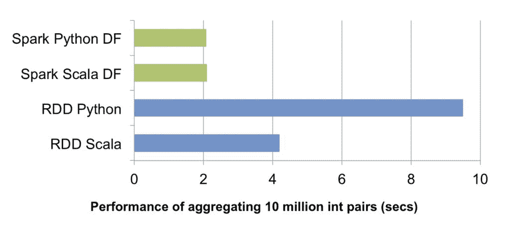

来源：在 Apache Spark 中引入数据框架进行大规模数据科学，网址为 https://databricks.com/blog/2015/02/17/introducing-dataframes-in-spark-for-large-scale-data-science.html

还要注意的是，使用 Apache Spark 2.0+，数据集具有功能操作符（给您类似于 RDD 的灵活性），同时还利用了 catalyst 优化器，提供更快的性能。有关数据集的更多信息将在下一章中讨论。

RDD 之所以慢——特别是在 PySpark 的上下文中——是因为每当使用 RDDs 执行 PySpark 程序时，执行作业可能会产生很大的开销。如下图所示，在 PySpark 驱动程序中，`Spark Context`使用`Py4j`启动一个使用`JavaSparkContext`的 JVM。任何 RDD 转换最初都会在 Java 中映射到`PythonRDD`对象。

一旦这些任务被推送到 Spark worker(s)，`PythonRDD`对象就会启动 Python `subprocesses`，使用管道发送代码和数据以在 Python 中进行处理：

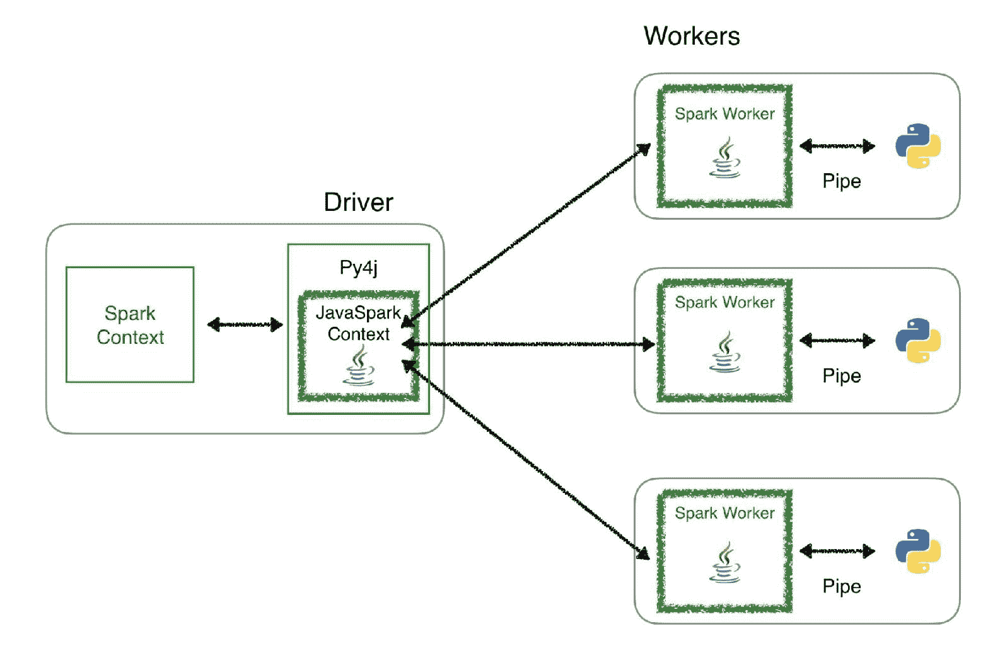

虽然这种方法允许 PySpark 将数据处理分布到多个 Python `subprocesses`上的多个工作节点，但正如您所看到的，Python 和 JVM 之间存在大量的上下文切换和通信开销。

关于 PySpark 性能的一个很好的资源是 Holden Karau 的*Improving PySpark Performance: Spark Performance Beyond the JVM*，网址为[`bit.ly/2bx89bn`](http://bit.ly/2bx89bn)。

当使用 Python UDF 时，这一点更加明显，因为性能明显较慢，因为所有数据都需要在使用 Python UDF 之前传输到驱动程序。请注意，向量化 UDF 是作为 Spark 2.3 的一部分引入的，并将改进 PySpark UDF 的性能。有关更多信息，请参阅[`databricks.com/blog/2017/10/30/introducing-vectorized-udfs-for-pyspark.html`](https://databricks.com/blog/2017/10/30/introducing-vectorized-udfs-for-pyspark.html)上的*Introducing Vectorized UDFs for PySpark*。

# 准备工作

与以前的部分一样，让我们利用`flights`数据集并针对该数据集创建一个 RDD 和一个 DataFrame：

```py
## Create flights RDD
flights = sc.textFile('/databricks-datasets/flights/departuredelays.csv')\
  .map(lambda line: line.split(","))\
  .zipWithIndex()\
  .filter(lambda (row, idx): idx > 0)\
  .map(lambda (row, idx): row)

# Create flightsDF DataFrame
flightsDF = spark.read\
  .options(header='true', inferSchema='true')
  .csv('~/data/flights/departuredelays.csv')
flightsDF.createOrReplaceTempView("flightsDF")
```

# 如何做...

在本节中，我们将运行相同的`group by`语句——一个是通过使用`reduceByKey()`的 RDD，另一个是通过使用 Spark SQL `GROUP BY`的 DataFrame。对于这个查询，我们将按出发城市对延迟时间进行求和，并根据出发城市进行排序：

```py
# RDD: Sum delays, group by and order by originating city
flights.map(lambda c: (c[3], int(c[1]))).reduceByKey(lambda x, y: x + y).sortByKey().take(50)

# Output (truncated)
# Duration: 11.08 seconds
[(u'ABE', 5113),  
 (u'ABI', 5128),  
 (u'ABQ', 64422),  
 (u'ABY', 1554),  
 (u'ACT', 392),
 ... ]
```

对于这种特定配置，提取列，执行`reduceByKey()`对数据进行汇总，执行`sortByKey()`对其进行排序，然后将值返回到驱动程序共需 11.08 秒：

```py
# RDD: Sum delays, group by and order by originating city
spark.sql("select origin, sum(delay) as TotalDelay from flightsDF group by origin order by origin").show(50)

# Output (truncated)
# Duration: 4.76s
+------+----------+ 
|origin|TotalDelay| 
+------+----------+ 
| ABE  |      5113| 
| ABI  |      5128|
| ABQ  |     64422| 
| ABY  |      1554| 
| ACT  |       392|
...
+------+----------+ 

```

Spark DataFrames 有许多优点，包括但不限于以下内容：

+   您可以执行 Spark SQL 语句（不仅仅是通过 Spark DataFrame API）

+   与位置相比，您的数据有一个关联的模式，因此您可以指定列名

+   在这种配置和示例中，查询完成时间为 4.76 秒，而 RDD 完成时间为 11.08 秒

在最初加载数据以增加分区数时，通过在`sc.textFile()`中指定`minPartitions`来改进 RDD 查询是不可能的：

`flights = sc.textFile('/databricks-datasets/flights/departuredelays.csv', minPartitions=8), ...`

```py
flights = sc.textFile('/databricks-datasets/flights/departuredelays.csv', minPartitions=8), ...
```

对于这种配置，相同的查询返回时间为 6.63 秒。虽然这种方法更快，但仍然比 DataFrames 慢；一般来说，DataFrames 在默认配置下更快。

# 它是如何工作的...

为了更好地了解以前的 RDD 和 DataFrame 的性能，让我们返回到 Spark UI。首先，当我们运行`flights` RDD 查询时，将执行三个单独的作业，如在以下截图中在 Databricks Community Edition 中可以看到的那样：

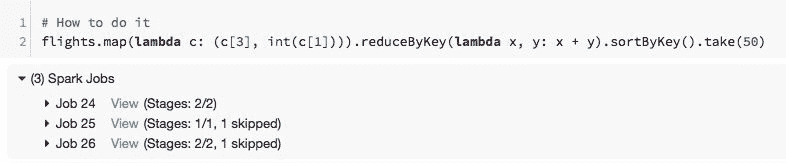

每个作业都会生成自己的一组阶段，最初读取文本（或 CSV）文件，执行`reduceByKey()`，并执行`sortByKey()`函数：

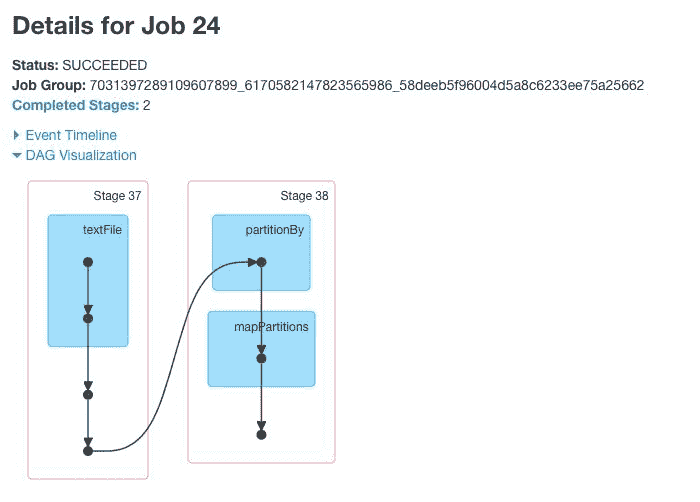

还有两个额外的作业来完成`sortByKey()`的执行：

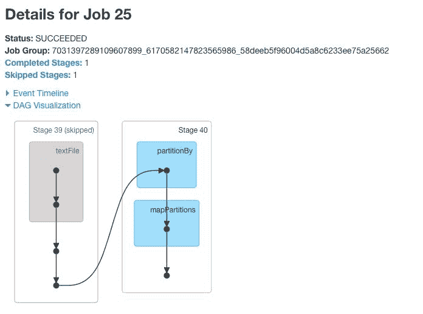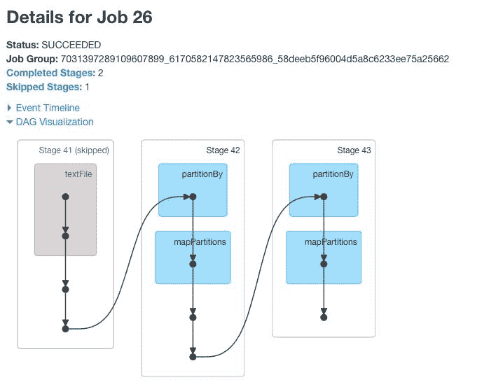

可以看到，通过直接使用 RDD，可能会产生大量的开销，生成多个作业和阶段来完成单个查询。

对于 Spark DataFrames，在这个查询中，它更简单，它由一个包含两个阶段的单个作业组成。请注意，Spark UI 有许多特定于 DataFrame 的任务，如`WholeStageCodegen`和`Exchange`，它们显著改进了 Spark 数据集和 DataFrame 查询的性能。有关 Spark SQL 引擎催化剂优化器的更多信息可以在下一章中找到：

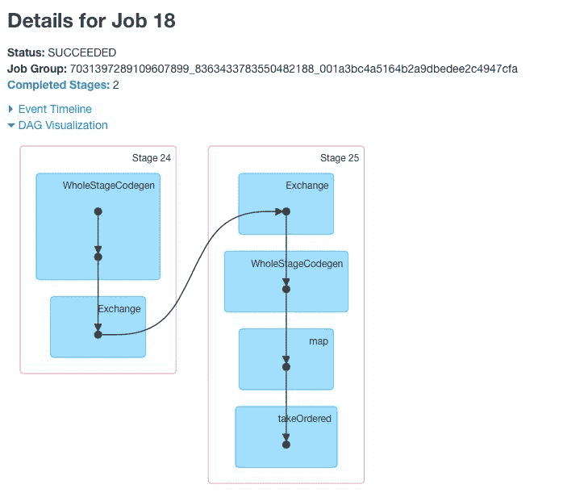
