# 第三章：使用 DataFrame 抽象数据

在本章中，您将学习以下示例：

+   创建 DataFrame

+   访问底层 RDD

+   性能优化

+   使用反射推断模式

+   以编程方式指定模式

+   创建临时表

+   使用 SQL 与 DataFrame 交互

+   DataFrame 转换概述

+   DataFrame 操作概述

# 介绍

在本章中，我们将探索当前的基本数据结构——DataFrame。DataFrame 利用了钨项目和 Catalyst Optimizer 的发展。这两个改进使 PySpark 的性能与 Scala 或 Java 的性能相媲美。

Project tungsten 是针对 Spark 引擎的一系列改进，旨在将其执行过程更接近于*裸金属*。主要成果包括：

+   **在运行时生成代码**：这旨在利用现代编译器中实现的优化

+   **利用内存层次结构**：算法和数据结构利用内存层次结构进行快速执行

+   **直接内存管理**：消除了与 Java 垃圾收集和 JVM 对象创建和管理相关的开销

+   **低级编程**：通过将立即数据加载到 CPU 寄存器中加快内存访问

+   **虚拟函数调度消除**：这消除了多个 CPU 调用的必要性

查看 Databricks 的博客以获取更多信息：[`www.databricks.com/blog/2015/04/28/project-tungsten-bringing-spark-closer-to-bare-metal.html`](https://www.databricks.com/blog/2015/04/28/project-tungsten-bringing-spark-closer-to-bare-metal.html)。

Catalyst Optimizer 位于 Spark SQL 的核心，并驱动对数据和 DataFrame 执行的 SQL 查询。该过程始于向引擎发出查询。首先优化执行的逻辑计划。基于优化的逻辑计划，派生多个物理计划并通过成本优化器推送。然后选择最具成本效益的计划，并将其转换（使用作为钨项目的一部分实施的代码生成优化）为优化的基于 RDD 的执行代码。

# 创建 DataFrame

Spark DataFrame 是在集群中分布的不可变数据集合。DataFrame 中的数据组织成命名列，可以与关系数据库中的表进行比较。

在这个示例中，我们将学习如何创建 Spark DataFrame。

# 准备工作

要执行此示例，您需要一个可用的 Spark 2.3 环境。如果没有，请返回第一章，*安装和配置 Spark*，并按照那里找到的示例进行操作。

您在本章中需要的所有代码都可以在我们为本书设置的 GitHub 存储库中找到：[`bit.ly/2ArlBck`](http://bit.ly/2ArlBck)；转到`第三章`并打开`3. 使用 DataFrame 抽象数据.ipynb`笔记本。

没有其他要求。

# 如何做...

有许多创建 DataFrame 的方法，但最简单的方法是创建一个 RDD 并将其转换为 DataFrame：

```py
sample_data = sc.parallelize([
      (1, 'MacBook Pro', 2015, '15"', '16GB', '512GB SSD'
        , 13.75, 9.48, 0.61, 4.02)
    , (2, 'MacBook', 2016, '12"', '8GB', '256GB SSD'
        , 11.04, 7.74, 0.52, 2.03)
    , (3, 'MacBook Air', 2016, '13.3"', '8GB', '128GB SSD'
        , 12.8, 8.94, 0.68, 2.96)
    , (4, 'iMac', 2017, '27"', '64GB', '1TB SSD'
        , 25.6, 8.0, 20.3, 20.8)
])

sample_data_df = spark.createDataFrame(
    sample_data
    , [
        'Id'
        , 'Model'
        , 'Year'
        , 'ScreenSize'
        , 'RAM'
        , 'HDD'
        , 'W'
        , 'D'
        , 'H'
        , 'Weight'
    ]
)
```

# 它是如何工作的...

如果您已经阅读了上一章，您可能已经知道如何创建 RDD。在这个示例中，我们只需调用`sc.parallelize(...)`方法。

我们的示例数据集只包含了一些相对较新的苹果电脑的记录。然而，与所有 RDD 一样，很难弄清楚元组的每个元素代表什么，因为 RDD 是无模式的结构。

因此，当使用`SparkSession`的`.createDataFrame(...)`方法时，我们将列名列表作为第二个参数传递；第一个参数是我们希望转换为 DataFrame 的 RDD。

现在，如果我们使用`sample_data.take(1)`来查看`sample_data` RDD 的内容，我们将检索到第一条记录：

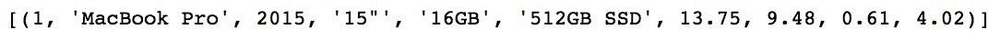

要比较 DataFrame 的内容，我们可以运行`sample_data_df.take(1)`来获取以下内容：

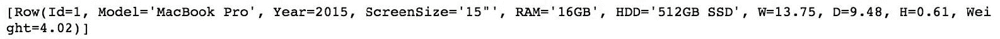

现在您可以看到，DataFrame 是`Row(...)`对象的集合。`Row(...)`对象由命名的数据组成，与 RDD 不同。

如果前面的`Row(...)`对象对您来说看起来类似于字典，那么您是正确的。任何`Row(...)`对象都可以使用`.asDict(...)`方法转换为字典。有关更多信息，请查看[`spark.apache.org/docs/latest/api/python/pyspark.sql.html#pyspark.sql.Row`](http://spark.apache.org/docs/latest/api/python/pyspark.sql.html#pyspark.sql.Row)。

然而，如果我们要查看`sample_data_df` DataFrame 中的数据，使用`.show(...)`方法，我们会看到以下内容：


由于 DataFrames 具有模式，让我们使用`.printSchema()`方法查看我们的`sample_data_df`的模式：


正如您所看到的，我们 DataFrame 中的列具有与原始`sample_data` RDD 的数据类型匹配的数据类型。

尽管 Python 不是一种强类型语言，但 PySpark 中的 DataFrames 是。与 RDD 不同，DataFrame 列的每个元素都有指定的类型（这些都列在`pyspark.sql.types`子模块中），并且所有数据必须符合指定的模式。

# 更多信息...

当您使用`SparkSession`的`.read`属性时，它会返回一个`DataFrameReader`对象。`DataFrameReader`是一个用于将数据读入 DataFrame 的接口。

# 从 JSON

要从 JSON 格式文件中读取数据，您只需执行以下操作：

```py
sample_data_json_df = (
    spark
    .read
    .json('../Data/DataFrames_sample.json')
)
```

从 JSON 格式文件中读取数据的唯一缺点（尽管是一个小缺点）是所有列将按字母顺序排序。通过运行`sample_data_json_df.show()`来自己看看：

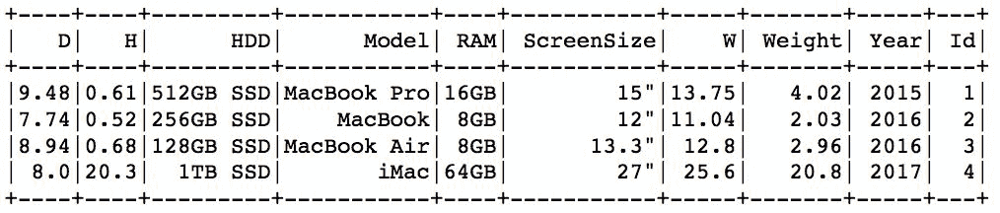

但数据类型保持不变：`sample_data_json_df.printSchema()`

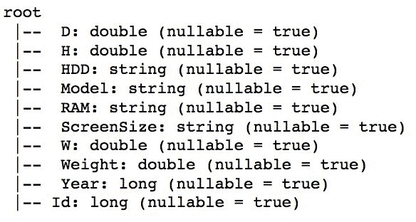

# 从 CSV

从 CSV 文件中读取同样简单：

```py
sample_data_csv = (
    spark
    .read
    .csv(
        '../Data/DataFrames_sample.csv'
        , header=True
        , inferSchema=True)
)
```

传递的唯一附加参数确保该方法将第一行视为列名（`header`参数），并且它将尝试根据内容为每列分配正确的数据类型（`inferSchema`参数默认分配字符串）。

与从 JSON 格式文件中读取数据不同，从 CSV 文件中读取可以保留列的顺序。

# 另请参阅

+   请查看 Spark 的文档，了解支持的数据格式的完整列表：[`spark.apache.org/docs/latest/api/python/pyspark.sql.html#pyspark.sql.DataFrameReader`](http://spark.apache.org/docs/latest/api/python/pyspark.sql.html#pyspark.sql.DataFrameReader)

# 访问底层 RDD

切换到使用 DataFrames 并不意味着我们需要完全放弃 RDD。在底层，DataFrames 仍然使用 RDD，但是`Row(...)`对象，如前所述。在本示例中，我们将学习如何与 DataFrame 的底层 RDD 交互。

# 准备工作

要执行此示例，您需要一个可用的 Spark 2.3 环境。此外，您应该已经完成了上一个示例，因为我们将重用我们在那里创建的数据。

没有其他要求。

# 如何做...

在这个示例中，我们将把 HDD 的大小和类型提取到单独的列中，然后计算放置每台计算机所需的最小容量：

```py
import pyspark.sql as sql
import pyspark.sql.functions as f

sample_data_transformed = (
    sample_data_df
    .rdd
    .map(lambda row: sql.Row(
        **row.asDict()
        , HDD_size=row.HDD.split(' ')[0]
        )
    )
    .map(lambda row: sql.Row(
        **row.asDict()
        , HDD_type=row.HDD.split(' ')[1]
        )
    )
    .map(lambda row: sql.Row(
        **row.asDict()
        , Volume=row.H * row.D * row.W
        )
    )
    .toDF()
    .select(
        sample_data_df.columns + 
        [
              'HDD_size'
            , 'HDD_type'
            , f.round(
                f.col('Volume')
            ).alias('Volume_cuIn')
        ]
    )
)
```

# 它是如何工作的...

正如前面指出的，DataFrame 中的 RDD 的每个元素都是一个`Row(...)`对象。您可以通过运行以下两个语句来检查它：

```py
sample_data_df.rdd.take(1)
```

还有：

```py
sample_data.take(1)
```

第一个产生一个单项列表，其中元素是`Row(...)`：


另一个也产生一个单项列表，但项目是一个元组：


`sample_data` RDD 是我们在上一个示例中创建的第一个 RDD。

有了这个想法，现在让我们把注意力转向代码。

首先，我们加载必要的模块：要使用`Row(...)`对象，我们需要`pyspark.sql`，稍后我们将使用`.round(...)`方法，因此我们需要`pyspark.sql.functions`子模块。

接下来，我们从`sample_data_df`中提取`.rdd`。使用`.map(...)`转换，我们首先将`HDD_size`列添加到模式中。

由于我们正在使用 RDD，我们希望保留所有其他列。因此，我们首先使用`.asDict()`方法将行（即`Row(...)`对象）转换为字典，然后我们可以稍后使用`**`进行解包。

在 Python 中，单个`*`在元组列表之前，如果作为函数的参数传递，将列表的每个元素作为单独的参数传递给函数。双`**`将第一个元素转换为关键字参数，并使用第二个元素作为要传递的值。

第二个参数遵循一个简单的约定：我们传递要创建的列的名称（`HDD_size`），并将其设置为所需的值。在我们的第一个示例中，我们拆分了`.HDD`列并提取了第一个元素，因为它是`HDD_size`。

我们将重复此步骤两次：首先创建`HDD_type`列，然后创建`Volume`列。

接下来，我们使用`.toDF(...)`方法将我们的 RDD 转换回 DataFrame。请注意，您仍然可以使用`.toDF(...)`方法将常规 RDD（即每个元素不是`Row(...)`对象的情况）转换为 DataFrame，但是您需要将列名的列表传递给`.toDF(...)`方法，否则您将得到未命名的列。

最后，我们`.select(...)`列，以便我们可以`.round(...)`新创建的`Volume`列。`.alias(...)`方法为生成的列产生不同的名称。

生成的 DataFrame 如下所示：

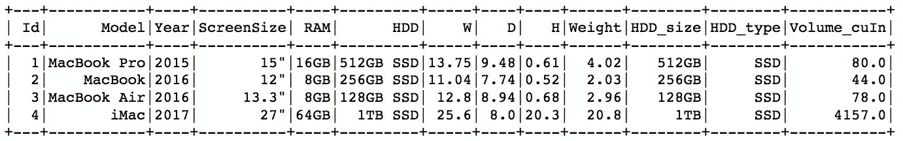

毫不奇怪，台式 iMac 需要最大的盒子。

# 性能优化

从 Spark 2.0 开始，使用 DataFrame 的 PySpark 性能与 Scala 或 Java 相当。但是，有一个例外：使用**用户定义函数**（**UDFs**）；如果用户定义了一个纯 Python 方法并将其注册为 UDF，在幕后，PySpark 将不断切换运行时（Python 到 JVM 再到 Python）。这是与 Scala 相比性能巨大下降的主要原因，Scala 不需要将 JVM 对象转换为 Python 对象。

在 Spark 2.3 中，情况发生了显著变化。首先，Spark 开始使用新的 Apache 项目。Arrow 创建了一个所有环境都使用的单一内存空间，从而消除了不断复制和转换对象的需要。

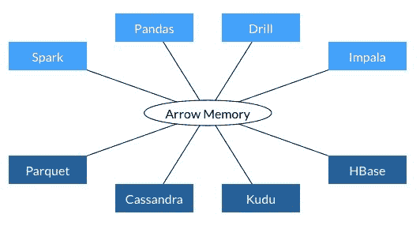

来源：https://arrow.apache.org/img/shared.png

有关 Apache Arrow 的概述，请访问[`arrow.apache.org`](https://arrow.apache.org)。

其次，Arrow 将列对象存储在内存中，从而大大提高了性能。因此，为了进一步利用这一点，PySpark 代码的部分已经进行了重构，这为我们带来了矢量化 UDF。

在本示例中，我们将学习如何使用它们，并测试旧的逐行 UDF 和新的矢量化 UDF 的性能。

# 准备工作

要执行此示例，您需要有一个可用的 Spark 2.3 环境。

没有其他要求。

# 如何做...

在本示例中，我们将使用 SciPy 返回在 0 到 1 之间的 100 万个随机数集的正态概率分布函数（PDF）的值。

```py
import pyspark.sql.functions as f
import pandas as pd
from scipy import stats

big_df = (
    spark
    .range(0, 1000000)
    .withColumn('val', f.rand())
)

big_df.cache()
big_df.show(3)

@f.pandas_udf('double', f.PandasUDFType.SCALAR)
def pandas_pdf(v):
    return pd.Series(stats.norm.pdf(v))

(
    big_df
    .withColumn('probability', pandas_pdf(big_df.val))
    .show(5)
)
```

# 它是如何工作的...

首先，像往常一样，我们导入我们将需要运行此示例的所有模块：

+   `pyspark.sql.functions`为我们提供了访问 PySpark SQL 函数的途径。我们将使用它来创建带有随机数字的 DataFrame。

+   `pandas`框架将为我们提供`.Series(...)`数据类型的访问权限，以便我们可以从我们的 UDF 返回一个列。

+   `scipy.stats`为我们提供了访问统计方法的途径。我们将使用它来计算我们的随机数字的正态 PDF。

接下来是我们的`big_df`。`SparkSession`有一个方便的方法`.range(...)`，允许我们在指定的范围内创建一系列数字；在这个示例中，我们只是创建了一个包含一百万条记录的 DataFrame。

在下一行中，我们使用`.withColumn(...)`方法向 DataFrame 添加另一列；列名为`val`，它将包含一百万个`.rand()`数字。

`.rand()`方法返回从 0 到 1 之间的均匀分布中抽取的伪随机数。

最后，我们使用`.cache()`方法缓存 DataFrame，以便它完全保留在内存中（以加快速度）。

接下来，我们定义`pandas_cdf(...)`方法。请注意`@f.pandas_udf`装饰器在方法声明之前，因为这是在 PySpark 中注册矢量化 UDF 的关键，并且仅在 Spark 2.3 中才可用。

请注意，我们不必装饰我们的方法；相反，我们可以将我们的矢量化方法注册为`f.pandas_udf(f=pandas_pdf, returnType='double', functionType=f.PandasUDFType.SCALAR)`。

装饰器方法的第一个参数是 UDF 的返回类型，在我们的例子中是`double`。这可以是 DDL 格式的类型字符串，也可以是`pyspark.sql.types.DataType`。第二个参数是函数类型；如果我们从我们的方法返回单列（例如我们的示例中的 pandas'`.Series(...)`），它将是`.PandasUDFType.SCALAR`（默认情况下）。另一方面，如果我们操作多列（例如 pandas'`DataFrame(...)`），我们将定义`.PandasUDFType.GROUPED_MAP`。

我们的`pandas_pdf(...)`方法简单地接受一个单列，并返回一个带有正态 CDF 对应数字值的 pandas'`.Series(...)`对象。

最后，我们简单地使用新方法来转换我们的数据。以下是前五条记录的样子（您的可能看起来不同，因为我们正在创建一百万个随机数）：

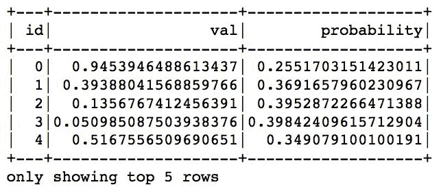

# 还有更多...

现在让我们比较这两种方法的性能：

```py
def test_pandas_pdf():
    return (big_df
            .withColumn('probability', pandas_pdf(big_df.val))
            .agg(f.count(f.col('probability')))
            .show()
        )

%timeit -n 1 test_pandas_pdf()

# row-by-row version with Python-JVM conversion
@f.udf('double')
def pdf(v):
    return float(stats.norm.pdf(v))

def test_pdf():
    return (big_df
            .withColumn('probability', pdf(big_df.val))
            .agg(f.count(f.col('probability')))
            .show()
        )

%timeit -n 1 test_pdf()
```

`test_pandas_pdf()`方法简单地使用`pandas_pdf(...)`方法从正态分布中检索 PDF，执行`.count(...)`操作，并使用`.show(...)`方法打印结果。`test_pdf()`方法也是一样，但是使用`pdf(...)`方法，这是使用 UDF 的逐行方式。

`%timeit`装饰器简单地运行`test_pandas_pdf()`或`test_pdf()`方法七次，每次执行都会乘以。这是运行`test_pandas_pdf()`方法的一个示例输出（因为它是高度重复的，所以缩写了）：


`test_pdf()`方法的时间如下所示：

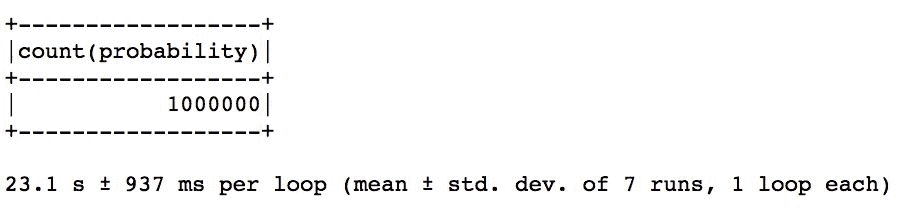

如您所见，矢量化 UDF 提供了约 100 倍的性能改进！不要太激动，因为只有对于更复杂的查询才会有这样的加速，就像我们之前使用的那样。

# 另请参阅

+   要了解更多，请查看 Databricks 发布的关于矢量化 UDF 的博客文章：[`databricks.com/blog/2017/10/30/introducing-vectorized-udfs-for-pyspark.html`](https://databricks.com/blog/2017/10/30/introducing-vectorized-udfs-for-pyspark.html)

# 使用反射推断模式

DataFrame 有模式，RDD 没有。也就是说，除非 RDD 由`Row(...)`对象组成。

在这个示例中，我们将学习如何使用反射推断模式创建 DataFrames。

# 准备工作

要执行此示例，您需要拥有一个可用的 Spark 2.3 环境。

没有其他要求。

# 如何做...

在这个示例中，我们首先将 CSV 样本数据读入 RDD，然后从中创建一个 DataFrame。以下是代码：

```py
import pyspark.sql as sql

sample_data_rdd = sc.textFile('../Data/DataFrames_sample.csv')

header = sample_data_rdd.first()

sample_data_rdd_row = (
    sample_data_rdd
    .filter(lambda row: row != header)
    .map(lambda row: row.split(','))
    .map(lambda row:
        sql.Row(
            Id=int(row[0])
            , Model=row[1]
            , Year=int(row[2])
            , ScreenSize=row[3]
            , RAM=row[4]
            , HDD=row[5]
            , W=float(row[6])
            , D=float(row[7])
            , H=float(row[8])
            , Weight=float(row[9])
        )
    )
)
```

# 它是如何工作的...

首先，加载 PySpark 的 SQL 模块。

接下来，使用 SparkContext 的`.textFile(...)`方法读取`DataFrames_sample.csv`文件。

如果您还不知道如何将数据读入 RDD，请查看前一章。

生成的 RDD 如下所示：

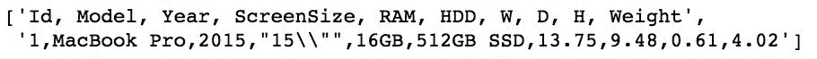

如您所见，RDD 仍然包含具有列名的行。为了摆脱它，我们首先使用`.first()`方法提取它，然后使用`.filter(...)`转换来删除与标题相等的任何行。

接下来，我们用逗号分割每一行，并为每个观察创建一个`Row(...)`对象。请注意，我们将所有字段转换为适当的数据类型。例如，`Id`列应该是整数，`Model`名称是字符串，`W`（宽度）是浮点数。

最后，我们只需调用 SparkSession 的`.createDataFrame(...)`方法，将我们的`Row(...)`对象的 RDD 转换为 DataFrame。这是最终结果：

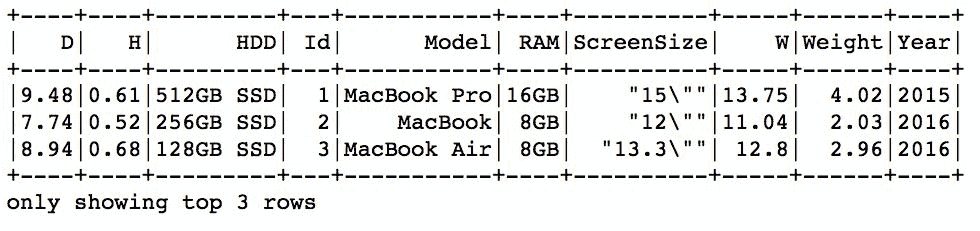

# 另请参阅

+   查看 Spark 的文档以了解更多信息：[`spark.apache.org/docs/latest/sql-programming-guide.html#inferring-the-schema-using-reflection`](https://spark.apache.org/docs/latest/sql-programming-guide.html#inferring-the-schema-using-reflection)

# 以编程方式指定模式

在上一个示例中，我们学习了如何使用反射推断 DataFrame 的模式。

在这个示例中，我们将学习如何以编程方式指定模式。

# 准备工作

要执行此示例，您需要一个可用的 Spark 2.3 环境。

没有其他要求。

# 如何做...

在这个例子中，我们将学习如何以编程方式指定模式：

```py
import pyspark.sql.types as typ

sch = typ.StructType([
      typ.StructField('Id', typ.LongType(), False)
    , typ.StructField('Model', typ.StringType(), True)
    , typ.StructField('Year', typ.IntegerType(), True)
    , typ.StructField('ScreenSize', typ.StringType(), True)
    , typ.StructField('RAM', typ.StringType(), True)
    , typ.StructField('HDD', typ.StringType(), True)
    , typ.StructField('W', typ.DoubleType(), True)
    , typ.StructField('D', typ.DoubleType(), True)
    , typ.StructField('H', typ.DoubleType(), True)
    , typ.StructField('Weight', typ.DoubleType(), True)
])

sample_data_rdd = sc.textFile('../Data/DataFrames_sample.csv')

header = sample_data_rdd.first()

sample_data_rdd = (
    sample_data_rdd
    .filter(lambda row: row != header)
    .map(lambda row: row.split(','))
    .map(lambda row: (
                int(row[0])
                , row[1]
                , int(row[2])
                , row[3]
                , row[4]
                , row[5]
                , float(row[6])
                , float(row[7])
                , float(row[8])
                , float(row[9])
        )
    )
)

sample_data_schema = spark.createDataFrame(sample_data_rdd, schema=sch)
sample_data_schema.show()
```

# 它是如何工作的...

首先，我们创建一个`.StructField(...)`对象的列表。`.StructField(...)`是在 PySpark 中以编程方式向模式添加字段的方法。第一个参数是我们要添加的列的名称。

第二个参数是我们想要存储在列中的数据的数据类型；一些可用的类型包括`.LongType()`、`.StringType()`、`.DoubleType()`、`.BooleanType()`、`.DateType()`和`.BinaryType()`。

有关 PySpark 中可用数据类型的完整列表，请转到[`spark.apache.org/docs/latest/api/python/pyspark.sql.html#module-pyspark.sql.types.`](http://spark.apache.org/docs/latest/api/python/pyspark.sql.html#module-pyspark.sql.types.)

`.StructField(...)`的最后一个参数指示列是否可以包含空值；如果设置为`True`，则表示可以。

接下来，我们使用 SparkContext 的`.textFile(...)`方法读取`DataFrames_sample.csv`文件。我们过滤掉标题，因为我们将明确指定模式，不需要存储在第一行的名称列。接下来，我们用逗号分割每一行，并对每个元素施加正确的数据类型，使其符合我们刚刚指定的模式。

最后，我们调用`.createDataFrame(...)`方法，但这次，除了 RDD，我们还传递`schema`。生成的 DataFrame 如下所示：

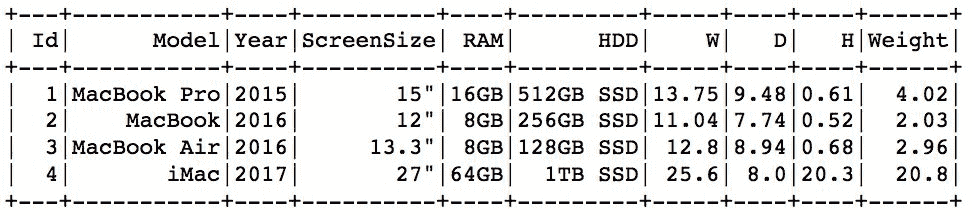

# 另请参阅

+   查看 Spark 的文档以了解更多信息：[`spark.apache.org/docs/latest/sql-programming-guide.html#programmatically-specifying-the-schema`](https://spark.apache.org/docs/latest/sql-programming-guide.html#programmatically-specifying-the-schema)

# 创建临时表

在 Spark 中，可以很容易地使用 SQL 查询来操作 DataFrame。

在这个示例中，我们将学习如何创建临时视图，以便您可以使用 SQL 访问 DataFrame 中的数据。

# 准备工作

要执行此示例，您需要一个可用的 Spark 2.3 环境。您应该已经完成了上一个示例，因为我们将使用那里创建的`sample_data_schema` DataFrame。

没有其他要求。

# 如何做...

我们只需使用 DataFrame 的`.createTempView(...)`方法：

```py
sample_data_schema.createTempView('sample_data_view')
```

# 它是如何工作的...

`.createTempView(...)`方法是创建临时视图的最简单方法，稍后可以用来查询数据。唯一需要的参数是视图的名称。

让我们看看这样的临时视图现在如何被用来提取数据：

```py
spark.sql('''
    SELECT Model
        , Year
        , RAM
        , HDD
    FROM sample_data_view
''').show()
```

我们只需使用 SparkSession 的`.sql(...)`方法，这使我们能够编写 ANSI-SQL 代码来操作 DataFrame 中的数据。在这个例子中，我们只是提取了四列。这是我们得到的：

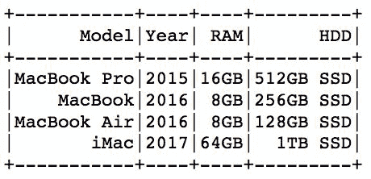

# 还有更多...

一旦创建了临时视图，就不能再创建具有相同名称的另一个视图。但是，Spark 提供了另一种方法，允许我们创建或更新视图：`.createOrReplaceTempView（...）`。顾名思义，通过调用此方法，我们要么创建一个新视图（如果不存在），要么用新视图替换已经存在的视图：

```py
sample_data_schema.createOrReplaceTempView('sample_data_view')
```

与以前一样，我们现在可以使用它来使用 SQL 查询与数据交互：

```py
spark.sql('''
    SELECT Model
        , Year
        , RAM
        , HDD
        , ScreenSize
    FROM sample_data_view
''').show()
```

这是我们得到的：

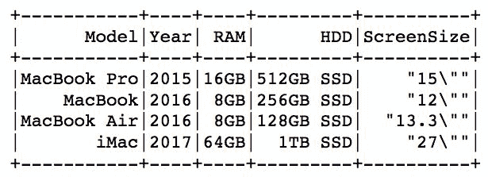

# 使用 SQL 与 DataFrame 交互

在上一个示例中，我们学习了如何创建或替换临时视图。

在这个示例中，我们将学习如何使用 SQL 查询在 DataFrame 中处理数据。

# 准备工作

要执行此示例，您需要具有工作的 Spark 2.3 环境。您应该已经通过*以编程方式指定模式*的示例，因为我们将使用在那里创建的`sample_data_schema` DataFrame。

没有其他要求。

# 如何做...

在这个例子中，我们将扩展我们原始的数据，为苹果电脑的每个型号添加形式因子：

```py
models_df = sc.parallelize([
      ('MacBook Pro', 'Laptop')
    , ('MacBook', 'Laptop')
    , ('MacBook Air', 'Laptop')
    , ('iMac', 'Desktop')
]).toDF(['Model', 'FormFactor'])

models_df.createOrReplaceTempView('models')

sample_data_schema.createOrReplaceTempView('sample_data_view')

spark.sql('''
    SELECT a.*
        , b.FormFactor
    FROM sample_data_view AS a
    LEFT JOIN models AS b
        ON a.Model == b.Model
    ORDER BY Weight DESC
''').show()
```

# 它是如何工作的...

首先，我们创建一个简单的 DataFrame，其中包含两列：`Model`和`FormFactor`。在这个例子中，我们使用 RDD 的`.toDF（...）`方法，快速将其转换为 DataFrame。我们传递的列表只是列名的列表，模式将自动推断。

接下来，我们创建模型视图并替换`sample_data_view`。

最后，要将`FormFactor`附加到我们的原始数据，我们只需在`Model`列上连接两个视图。由于`.sql（...）`方法接受常规 SQL 表达式，因此我们还使用`ORDER BY`子句，以便按权重排序。

这是我们得到的：


# 还有更多...

SQL 查询不仅限于仅提取数据。我们还可以运行一些聚合：

```py
spark.sql('''
    SELECT b.FormFactor
        , COUNT(*) AS ComputerCnt
    FROM sample_data_view AS a
    LEFT JOIN models AS b
        ON a.Model == b.Model
    GROUP BY FormFactor
''').show()
```

在这个简单的例子中，我们将计算不同 FormFactors 的不同计算机数量。`COUNT（*）`运算符计算我们有多少台计算机，并与指定聚合列的`GROUP BY`子句一起工作。

从这个查询中我们得到了什么：

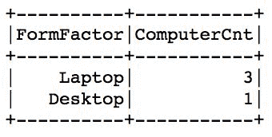

# DataFrame 转换概述

就像 RDD 一样，DataFrame 既有转换又有操作。作为提醒，转换将一个 DataFrame 转换为另一个 DataFrame，而操作对 DataFrame 执行一些计算，并通常将结果返回给驱动程序。而且，就像 RDD 一样，DataFrame 中的转换是惰性的。

在这个示例中，我们将回顾最常见的转换。

# 准备工作

要执行此示例，您需要具有工作的 Spark 2.3 环境。您应该已经通过*以编程方式指定模式*的示例，因为我们将使用在那里创建的`sample_data_schema` DataFrame。

没有其他要求。

# 如何做...

在本节中，我们将列出一些可用于 DataFrame 的最常见转换。此列表的目的不是提供所有可用转换的全面枚举，而是为您提供最常见转换背后的一些直觉。

# `.select（...）`转换

`.select（...）`转换允许我们从 DataFrame 中提取列。它的工作方式与 SQL 中的`SELECT`相同。

看一下以下代码片段：

```py
# select Model and ScreenSize from the DataFrame

sample_data_schema.select('Model', 'ScreenSize').show()
```

它产生以下输出：

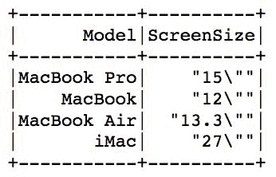

在 SQL 语法中，这将如下所示：

```py
SELECT Model
    , ScreenSize
FROM sample_data_schema;
```

# `.filter（...）`转换

`.filter（...）`转换与`.select（...）`相反，仅选择满足指定条件的行。它可以与 SQL 中的`WHERE`语句进行比较。

看一下以下代码片段：

```py
# extract only machines from 2015 onwards

(
    sample_data_schema
    .filter(sample_data_schema.Year > 2015)
    .show()
)
```

它产生以下输出：

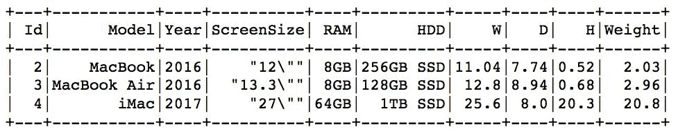

在 SQL 语法中，前面的内容相当于：

```py
SELECT *
FROM sample_data_schema
WHERE Year > 2015
```

# `.groupBy（...）`转换

`.groupBy（...）`转换根据列（或多个列）的值执行数据聚合。在 SQL 语法中，这相当于`GROUP BY`。

看一下以下代码：

```py
(
    sample_data_schema
    .groupBy('RAM')
    .count()
    .show()
)
```

它产生此结果：

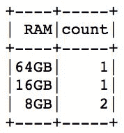

在 SQL 语法中，这将是：

```py
SELECT RAM
    , COUNT(*) AS count
FROM sample_data_schema
GROUP BY RAM
```

# `.orderBy(...)` 转换

`.orderBy(...)` 转换根据指定的列对结果进行排序。 SQL 世界中的等效项也将是`ORDER BY`。

查看以下代码片段：

```py
# sort by width (W)

sample_data_schema.orderBy('W').show()
```

它产生以下输出：

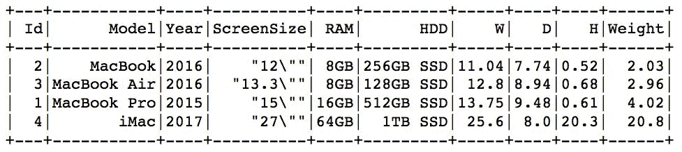

SQL 等效项将是：

```py
SELECT *
FROM sample_data_schema
ORDER BY W
```

您还可以使用列的`.desc()`开关（`.col(...)`方法）将排序顺序更改为降序。看看以下片段：

```py
# sort by height (H) in descending order

sample_data_schema.orderBy(f.col('H').desc()).show()
```

它产生以下输出：

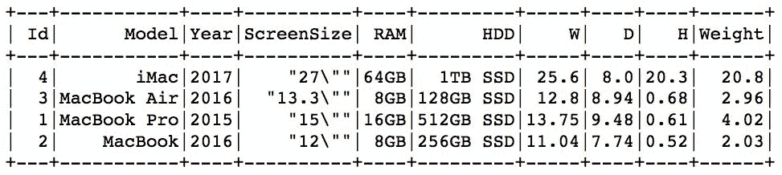

以 SQL 语法表示，前面的表达式将是：

```py
SELECT *
FROM sample_data_schema
ORDER BY H DESC
```

# `.withColumn(...)` 转换

`.withColumn(...)` 转换将函数应用于其他列和/或文字（使用`.lit(...)`方法）并将其存储为新函数。在 SQL 中，这可以是应用于任何列的任何转换的任何方法，并使用`AS`分配新列名。此转换扩展了原始数据框。

查看以下代码片段：

```py
# split the HDD into size and type

(
    sample_data_schema
    .withColumn('HDDSplit', f.split(f.col('HDD'), ' '))
    .show()
)
```

它产生以下输出：

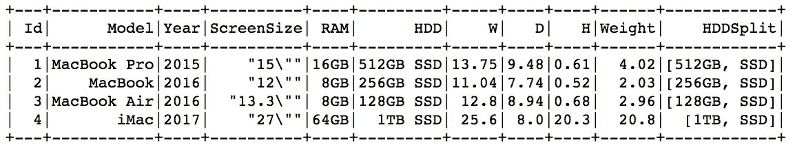

您可以使用`.select(...)`转换来实现相同的结果。以下代码将产生相同的结果：

```py
# do the same as withColumn

(
    sample_data_schema
    .select(
        f.col('*')
        , f.split(f.col('HDD'), ' ').alias('HDD_Array')
    ).show()
)
```

SQL（T-SQL）等效项将是：

```py
SELECT *
    , STRING_SPLIT(HDD, ' ') AS HDD_Array
FROM sample_data_schema
```

# `.join(...)` 转换

`.join(...)` 转换允许我们连接两个数据框。第一个参数是我们要连接的另一个数据框，而第二个参数指定要连接的列，最后一个参数指定连接的性质。可用类型为`inner`，`cross`，`outer`，`full`，`full_outer`，`left`，`left_outer`，`right`，`right_outer`，`left_semi`和`left_anti`。在 SQL 中，等效项是`JOIN`语句。

如果您不熟悉`ANTI`和`SEMI`连接，请查看此博客：[`blog.jooq.org/2015/10/13/semi-join-and-anti-join-should-have-its-own-syntax-in-sql/`](https://blog.jooq.org/2015/10/13/semi-join-and-anti-join-should-have-its-own-syntax-in-sql/)。

如下查看以下代码：

```py
models_df = sc.parallelize([
      ('MacBook Pro', 'Laptop')
    , ('MacBook', 'Laptop')
    , ('MacBook Air', 'Laptop')
    , ('iMac', 'Desktop')
]).toDF(['Model', 'FormFactor'])

(
    sample_data_schema
    .join(
        models_df
        , sample_data_schema.Model == models_df.Model
        , 'left'
    ).show()
)
```

它产生以下输出：

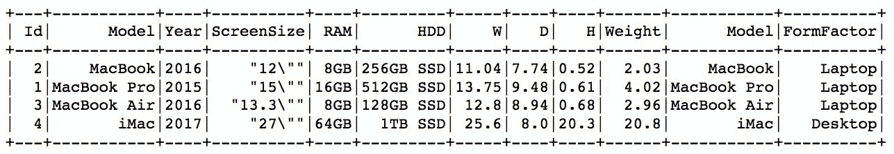

在 SQL 语法中，这将是：

```py
SELECT a.*
    , b,FormFactor
FROM sample_data_schema AS a
LEFT JOIN models_df AS b
    ON a.Model == b.Model
```

如果我们有一个数据框，不会列出每个`Model`（请注意`MacBook`缺失），那么以下代码是：

```py
models_df = sc.parallelize([
      ('MacBook Pro', 'Laptop')
    , ('MacBook Air', 'Laptop')
    , ('iMac', 'Desktop')
]).toDF(['Model', 'FormFactor'])

(
    sample_data_schema
    .join(
        models_df
        , sample_data_schema.Model == models_df.Model
        , 'left'
    ).show()
)
```

这将生成一个带有一些缺失值的表：

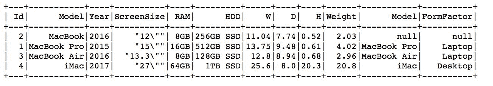

`RIGHT`连接仅保留与右数据框中的记录匹配的记录。因此，看看以下代码：

```py
(
    sample_data_schema
    .join(
        models_df
        , sample_data_schema.Model == models_df.Model
        , 'right'
    ).show()
)
```

这将产生以下表：

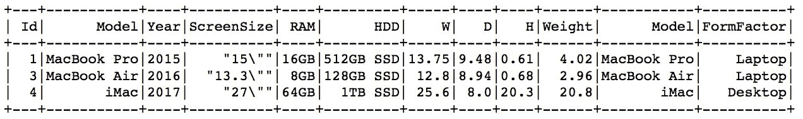

`SEMI`和`ANTI`连接是相对较新的添加。`SEMI`连接保留与右数据框中的记录匹配的左数据框中的所有记录（与`RIGHT`连接一样），但*仅保留左数据框中的列*；`ANTI`连接是`SEMI`连接的相反，它仅保留在右数据框中找不到的记录。因此，`SEMI`连接的以下示例是：

```py
(
    sample_data_schema
    .join(
        models_df
        , sample_data_schema.Model == models_df.Model
        , 'left_semi'
    ).show()
)
```

这将产生以下结果：

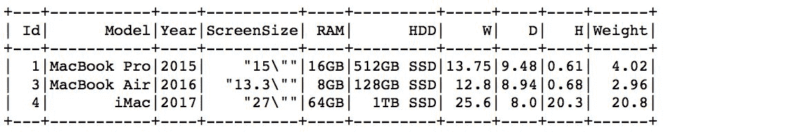

而`ANTI`连接的示例是：

```py
(
    sample_data_schema
    .join(
        models_df
        , sample_data_schema.Model == models_df.Model
        , 'left_anti'
    ).show()
)
```

这将生成以下内容：

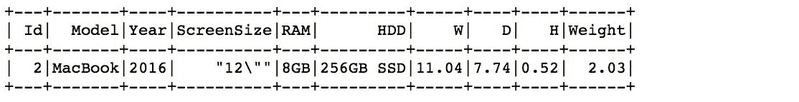

# `.unionAll(...)` 转换

`.unionAll(...)` 转换附加来自另一个数据框的值。 SQL 语法中的等效项是`UNION ALL`。

看看以下代码：

```py
another_macBookPro = sc.parallelize([
      (5, 'MacBook Pro', 2018, '15"', '16GB', '256GB SSD', 13.75, 9.48, 0.61, 4.02)
]).toDF(sample_data_schema.columns)

sample_data_schema.unionAll(another_macBookPro).show()
```

它产生以下结果：

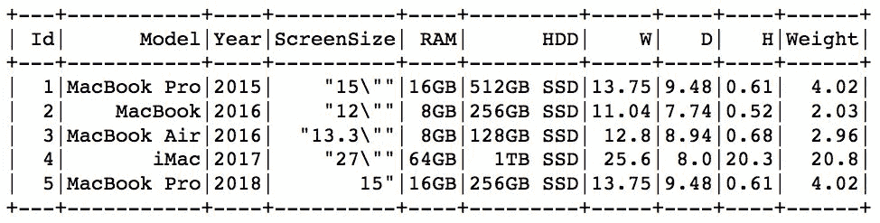

在 SQL 语法中，前面的内容将读作：

```py
SELECT *
FROM sample_data_schema

UNION ALL
SELECT *
FROM another_macBookPro
```

# `.distinct(...)` 转换

`.distinct(...)` 转换返回列中不同值的列表。 SQL 中的等效项将是`DISTINCT`。

看看以下代码：

```py
# select the distinct values from the RAM column

sample_data_schema.select('RAM').distinct().show()
```

它产生以下结果：

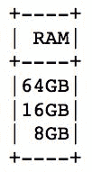

在 SQL 语法中，这将是：

```py
SELECT DISTINCT RAM
FROM sample_data_schema
```

# `.repartition(...)` 转换

`.repartition(...)` 转换在集群中移动数据并将其组合成指定数量的分区。您还可以指定要在其上执行分区的列。在 SQL 世界中没有直接等效项。

看看以下代码：

```py
sample_data_schema_rep = (
    sample_data_schema
    .repartition(2, 'Year')
)

sample_data_schema_rep.rdd.getNumPartitions()
```

它产生了（预期的）这个结果：

```py
2
```

# `.fillna(...)` 转换

`.fillna(...)` 转换填充 DataFrame 中的缺失值。您可以指定一个单个值，所有缺失的值都将用它填充，或者您可以传递一个字典，其中每个键是列的名称，值是要填充相应列中的缺失值。在 SQL 世界中没有直接的等价物。

看下面的代码：

```py
missing_df = sc.parallelize([
    (None, 36.3, 24.2)
    , (1.6, 32.1, 27.9)
    , (3.2, 38.7, 24.7)
    , (2.8, None, 23.9)
    , (3.9, 34.1, 27.9)
    , (9.2, None, None)
]).toDF(['A', 'B', 'C'])

missing_df.fillna(21.4).show()
```

它产生了以下输出：

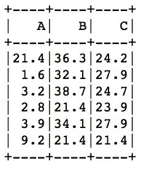

我们还可以指定字典，因为 `21.4` 值实际上并不适合 `A` 列。在下面的代码中，我们首先计算每列的平均值：

```py
miss_dict = (
    missing_df
    .agg(
        f.mean('A').alias('A')
        , f.mean('B').alias('B')
        , f.mean('C').alias('C')
    )
).toPandas().to_dict('records')[0]

missing_df.fillna(miss_dict).show()
```

`.toPandas()` 方法是一个操作（我们将在下一个示例中介绍），它返回一个 pandas DataFrame。pandas DataFrame 的 `.to_dict(...)` 方法将其转换为字典，其中 `records` 参数产生一个常规字典，其中每个列是键，每个值是记录。

上述代码产生以下结果：

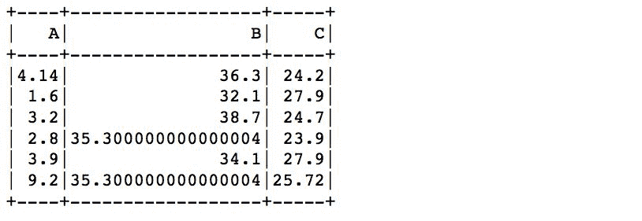

# `.dropna(...)` 转换

`.dropna(...)` 转换删除具有缺失值的记录。您可以指定阈值，该阈值转换为记录中的最少缺失观察数，使其符合被删除的条件。与 `.fillna(...)` 一样，在 SQL 世界中没有直接的等价物。

看下面的代码：

```py
missing_df.dropna().show()
```

它产生了以下结果：

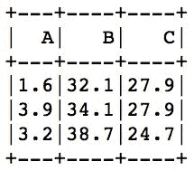

指定 `thresh=2`：

```py
missing_df.dropna(thresh=2).show()
```

它保留了第一条和第四条记录：

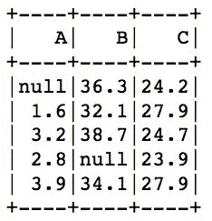

# `.dropDuplicates(...)` 转换

`.dropDuplicates(...)` 转换，顾名思义，删除重复的记录。您还可以指定一个子集参数作为列名的列表；该方法将根据这些列中找到的值删除重复的记录。

看下面的代码：

```py
dupes_df = sc.parallelize([
      (1.6, 32.1, 27.9)
    , (3.2, 38.7, 24.7)
    , (3.9, 34.1, 27.9)
    , (3.2, 38.7, 24.7)
]).toDF(['A', 'B', 'C'])

dupes_df.dropDuplicates().show()
```

它产生了以下结果

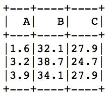

# `.summary()` 和 `.describe()` 转换

`.summary()` 和 `.describe()` 转换产生类似的描述性统计数据，`.summary()` 转换另外还产生四分位数。

看下面的代码：

```py
sample_data_schema.select('W').summary().show()
sample_data_schema.select('W').describe().show()
```

它产生了以下结果：

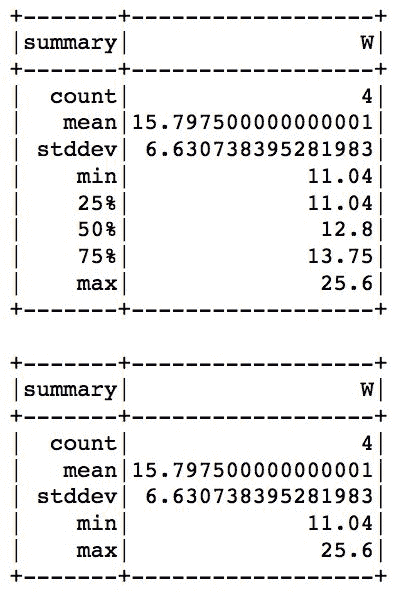

# `.freqItems(...)` 转换

`.freqItems(...)` 转换返回列中频繁项的列表。您还可以指定 `minSupport` 参数，该参数将丢弃低于某个阈值的项。

看下面的代码：

```py
sample_data_schema.freqItems(['RAM']).show()
```

它产生了这个结果：

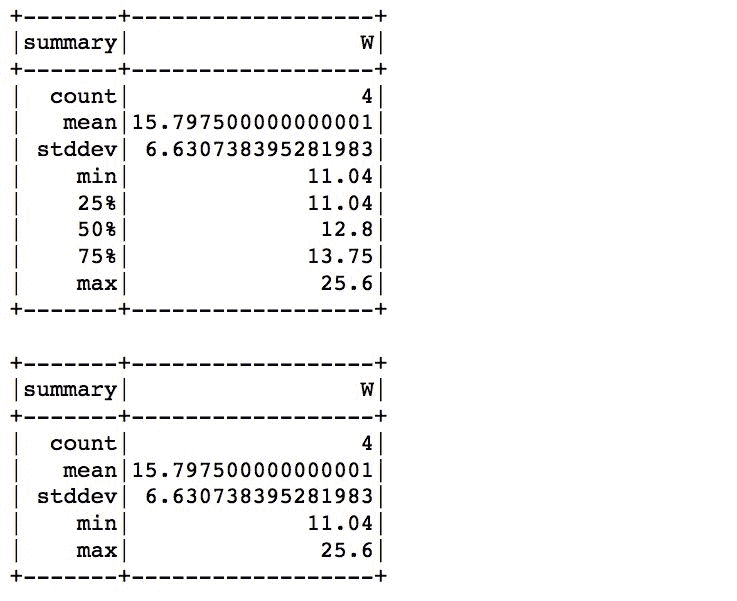

# 另请参阅

+   有关更多转换，请参阅 Spark 文档：[`spark.apache.org/docs/latest/api/python/pyspark.sql.html#pyspark.sql.DataFrame`](http://spark.apache.org/docs/latest/api/python/pyspark.sql.html#pyspark.sql.DataFrame)

# DataFrame 操作概述

上一个示例中列出的转换将一个 DataFrame 转换为另一个 DataFrame。但是，只有在对 **DataFrame** 调用操作时才会执行它们。

在本示例中，我们将概述最常见的操作。

# 准备工作

要执行此示例，您需要一个可用的 Spark 2.3 环境。您应该已经完成了上一个示例，*以编程方式指定模式*，因为我们将使用在那里创建的 `sample_data_schema` DataFrame。

没有其他要求。

# 如何做...

在本节中，我们将列出一些可用于 DataFrame 的最常见操作。此列表的目的不是提供所有可用转换的全面枚举，而是为您提供对最常见转换的直觉。

# `.show(...)` 操作

`.show(...)` 操作默认显示表格形式的前五行记录。您可以通过传递整数作为参数来指定要检索的记录数。

看下面的代码：

```py
sample_data_schema.select('W').describe().show()
```

它产生了这个结果：

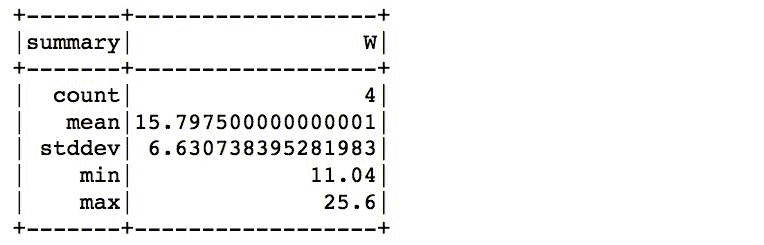

# `.collect()` 操作

`.collect()` 操作，顾名思义，从所有工作节点收集所有结果，并将它们返回给驱动程序。在大型数据集上使用此方法时要小心，因为如果尝试返回数十亿条记录的整个 DataFrame，驱动程序很可能会崩溃；只能用此方法返回小的、聚合的数据。

看看下面的代码：

```py
sample_data_schema.groupBy('Year').count().collect()
```

它产生了以下结果：

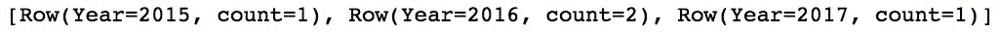

# `.take(...)` 操作

`.take(...)` 操作的工作方式与 RDDs 中的相同–它将指定数量的记录返回给驱动节点：

```py
Look at the following code:sample_data_schema.take(2)
```

它产生了这个结果：

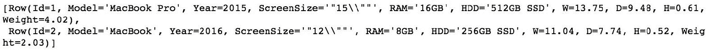

# `.toPandas()` 操作

`.toPandas()` 操作，顾名思义，将 Spark DataFrame 转换为 pandas DataFrame。与`.collect()` 操作一样，需要在这里发出相同的警告–`.toPandas()` 操作从所有工作节点收集所有记录，将它们返回给驱动程序，然后将结果转换为 pandas DataFrame。

由于我们的样本数据很小，我们可以毫无问题地做到这一点：

```py
sample_data_schema.toPandas()
```

这就是结果的样子：

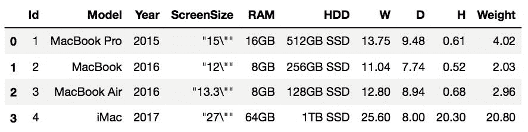

# 另请参阅

+   参考 Spark 的文档以获取更多操作：[`spark.apache.org/docs/latest/api/python/pyspark.sql.html#pyspark.sql.DataFrame`](http://spark.apache.org/docs/latest/api/python/pyspark.sql.html#pyspark.sql.DataFrame)
