# 第四章：为建模准备数据

在本章中，我们将介绍如何清理数据并为建模做准备。您将学习以下内容：

+   处理重复项

+   处理缺失观察

+   处理异常值

+   探索描述性统计

+   计算相关性

+   绘制直方图

+   可视化特征之间的相互作用

# 介绍

现在我们对 RDD 和 DataFrame 的工作原理以及它们的功能有了深入的了解，我们可以开始为建模做准备了。

有名的人（阿尔伯特·爱因斯坦）曾经说过（引用）：

"宇宙和任何数据集的问题都是无限的，我对前者不太确定。"

前面的话当然是一个笑话。然而，您处理的任何数据集，无论是在工作中获取的、在线找到的、自己收集的，还是通过其他方式获取的，都是脏的，直到证明为止；您不应该信任它，不应该玩弄它，甚至不应该看它，直到您自己证明它足够干净（没有完全干净的说法）。

您的数据集可能会出现哪些问题？嗯，举几个例子：

+   **重复的观察**：这些是由系统和操作员的错误导致的

+   **缺失观察**：这可能是由于传感器问题、受访者不愿回答问题，或者仅仅是一些数据损坏导致的

+   **异常观察**：与数据集或人口其他部分相比，观察结果在观察时显得突出

+   **编码**：文本字段未经规范化（例如，单词未经词干处理或使用同义词），使用不同语言，或者您可能遇到无意义的文本输入，日期和日期时间字段可能没有以相同的方式编码

+   **不可信的答案（尤其是调查）**：受访者因任何原因而撒谎；这种脏数据更难处理和清理

正如您所看到的，您的数据可能会受到成千上万个陷阱的困扰，它们正等待着您去陷入其中。清理数据并熟悉数据是我们（作为数据科学家）80%的时间所做的事情（剩下的 20%我们花在建模和抱怨清理数据上）。所以系好安全带，准备迎接*颠簸的旅程*，这是我们信任我们拥有的数据并熟悉它所必需的。

在本章中，我们将使用一个包含`22`条记录的小数据集：

```py
dirty_data = spark.createDataFrame([
          (1,'Porsche','Boxster S','Turbo',2.5,4,22,None)
        , (2,'Aston Martin','Vanquish','Aspirated',6.0,12,16,None)
        , (3,'Porsche','911 Carrera 4S Cabriolet','Turbo',3.0,6,24,None)
        , (3,'General Motors','SPARK ACTIV','Aspirated',1.4,None,32,None)
        , (5,'BMW','COOPER S HARDTOP 2 DOOR','Turbo',2.0,4,26,None)
        , (6,'BMW','330i','Turbo',2.0,None,27,None)
        , (7,'BMW','440i Coupe','Turbo',3.0,6,23,None)
        , (8,'BMW','440i Coupe','Turbo',3.0,6,23,None)
        , (9,'Mercedes-Benz',None,None,None,None,27,None)
        , (10,'Mercedes-Benz','CLS 550','Turbo',4.7,8,21,79231)
        , (11,'Volkswagen','GTI','Turbo',2.0,4,None,None)
        , (12,'Ford Motor Company','FUSION AWD','Turbo',2.7,6,20,None)
        , (13,'Nissan','Q50 AWD RED SPORT','Turbo',3.0,6,22,None)
        , (14,'Nissan','Q70 AWD','Aspirated',5.6,8,18,None)
        , (15,'Kia','Stinger RWD','Turbo',2.0,4,25,None)
        , (16,'Toyota','CAMRY HYBRID LE','Aspirated',2.5,4,46,None)
        , (16,'Toyota','CAMRY HYBRID LE','Aspirated',2.5,4,46,None)
        , (18,'FCA US LLC','300','Aspirated',3.6,6,23,None)
        , (19,'Hyundai','G80 AWD','Turbo',3.3,6,20,None)
        , (20,'Hyundai','G80 AWD','Turbo',3.3,6,20,None)
        , (21,'BMW','X5 M','Turbo',4.4,8,18,121231)
        , (22,'GE','K1500 SUBURBAN 4WD','Aspirated',5.3,8,18,None)
    ], ['Id','Manufacturer','Model','EngineType','Displacement',
        'Cylinders','FuelEconomy','MSRP'])
```

在接下来的教程中，我们将清理前面的数据集，并对其进行更深入的了解。

# 处理重复项

数据中出现重复项的原因很多，但有时很难发现它们。在这个教程中，我们将向您展示如何发现最常见的重复项，并使用 Spark 进行处理。

# 准备工作

要执行此教程，您需要一个可用的 Spark 环境。如果没有，请返回第一章，*安装和配置 Spark*，并按照那里找到的教程进行操作。

我们将使用介绍中的数据集。本章中所需的所有代码都可以在我们为本书设置的 GitHub 存储库中找到：[`bit.ly/2ArlBck`](http://bit.ly/2ArlBck)。转到`Chapter04`并打开[4.Preparing data for modeling.ipynb](https://github.com/drabastomek/PySparkCookbook/blob/devel/Chapter04/4.Preparing%20data%20for%20modeling.ipynb)笔记本。

不需要其他先决条件。

# 操作步骤...

重复项是数据集中出现多次的记录。它是一个完全相同的副本。Spark DataFrames 有一个方便的方法来删除重复的行，即`.dropDuplicates()`转换：

1.  检查是否有任何重复行，如下所示：

```py
dirty_data.count(), dirty_data.distinct().count()
```

1.  如果有重复项，请删除它们：

```py
full_removed = dirty_data.dropDuplicates()
```

# 它是如何工作的...

你现在应该知道这个了，但是`.count()`方法计算我们的 DataFrame 中有多少行。第二个命令检查我们有多少个不同的行。在我们的`dirty_data` DataFrame 上执行这两个命令会产生`(22, 21)`的结果。因此，我们现在知道我们的数据集中有两条完全相同的记录。让我们看看哪些：

```py
(
    dirty_data
    .groupby(dirty_data.columns)
    .count()
    .filter('count > 1')
    .show()
)
```

让我们解开这里发生的事情。首先，我们使用`.groupby(...)`方法来定义用于聚合的列；在这个例子中，我们基本上使用了所有列，因为我们想找到数据集中所有列的所有不同组合。接下来，我们使用`.count()`方法计算这样的值组合发生的次数；该方法将`count`列添加到我们的数据集中。使用`.filter(...)`方法，我们选择数据集中出现多次的所有行，并使用`.show()`操作将它们打印到屏幕上。

这产生了以下结果：

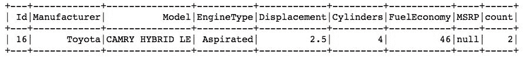

因此，`Id`等于`16`的行是重复的。因此，让我们使用`.dropDuplicates(...)`方法将其删除。最后，运行`full_removed.count()`命令确认我们现在有 21 条记录。

# 还有更多...

嗯，还有更多的内容，你可能会想象。在我们的`full_removed` DataFrame 中仍然有一些重复的记录。让我们仔细看看。

# 只有 ID 不同

如果您随时间收集数据，可能会记录具有不同 ID 但相同数据的数据。让我们检查一下我们的 DataFrame 是否有这样的记录。以下代码片段将帮助您完成此操作：

```py
(
    full_removed
    .groupby([col for col in full_removed.columns if col != 'Id'])
    .count()
    .filter('count > 1')
    .show()
)
```

就像以前一样，我们首先按所有列分组，但是我们排除了`'Id'`列，然后计算给定此分组的记录数，最后提取那些具有`'count > 1'`的记录并在屏幕上显示它们。运行上述代码后，我们得到以下结果：

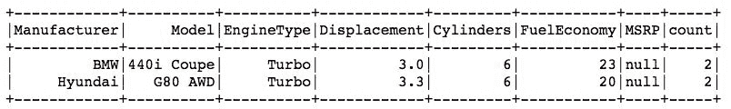

正如你所看到的，我们有四条不同 ID 但是相同车辆的记录：`BMW` `440i Coupe`和`Hyundai` `G80 AWD`。

我们也可以像以前一样检查计数：

```py
no_ids = (
    full_removed
    .select([col for col in full_removed.columns if col != 'Id'])
)

no_ids.count(), no_ids.distinct().count()
(21, 19), indicating that we have four records that are duplicated, just like we saw earlier.
```

`.dropDuplicates(...)`方法可以轻松处理这种情况。我们需要做的就是将要考虑的所有列的列表传递给`subset`参数，以便在搜索重复项时使用。方法如下：

```py
id_removed = full_removed.dropDuplicates(
    subset = [col for col in full_removed.columns if col != 'Id']
)
```

再次，我们选择除了`'Id'`列之外的所有列来定义重复的列。如果我们现在计算`id_removed` DataFrame 中的总行数，应该得到`19`：

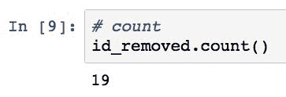

这正是我们得到的！

# ID 碰撞

您可能还会假设，如果有两条具有相同 ID 的记录，它们是重复的。嗯，虽然这可能是真的，但是当我们基于所有列删除记录时，我们可能已经删除了它们。因此，在这一点上，任何重复的 ID 更可能是碰撞。

重复的 ID 可能出现多种原因：仪器误差或存储 ID 的数据结构不足，或者如果 ID 表示记录元素的某个哈希函数，可能会出现哈希函数的选择引起的碰撞。这只是您可能具有重复 ID 但记录实际上并不重复的原因中的一部分。

让我们检查一下我们的数据集是否符合这一点：

```py
import pyspark.sql.functions as fn

id_removed.agg(
      fn.count('Id').alias('CountOfIDs')
    , fn.countDistinct('Id').alias('CountOfDistinctIDs')
).show()
```

在这个例子中，我们将使用`.agg(...)`方法，而不是对记录进行子集化，然后计算记录数，然后计算不同的记录数。为此，我们首先从`pyspark.sql.functions`模块中导入所有函数。

有关`pyspark.sql.functions`中所有可用函数的列表，请参阅[`spark.apache.org/docs/latest/api/python/pyspark.sql.html#module-pyspark.sql.functions`](https://spark.apache.org/docs/latest/api/python/pyspark.sql.html#module-pyspark.sql.functions)。

我们将使用的两个函数将允许我们一次完成计数：`.count(...)`方法计算指定列中非空值的所有记录的数量，而`.countDistinct(...)`返回这样一列中不同值的计数。`.alias(...)`方法允许我们为计数结果的列指定友好的名称。在计数之后，我们得到了以下结果：

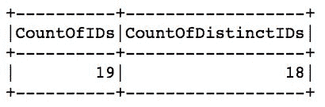

好的，所以我们有两条具有相同 ID 的记录。再次，让我们检查哪些 ID 是重复的：

```py
(
    id_removed
    .groupby('Id')
    .count()
    .filter('count > 1')
    .show()
)
```

与之前一样，我们首先按`'Id'`列中的值进行分组，然后显示所有具有大于`1`的`count`的记录。这是我们得到的结果：

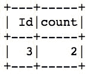

嗯，看起来我们有两条`'Id == 3'`的记录。让我们检查它们是否相同：

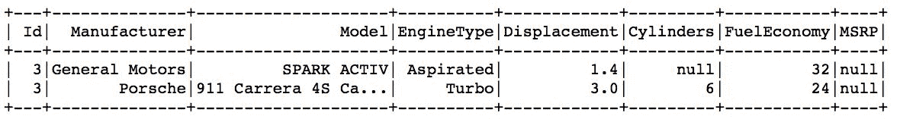

这些绝对不是相同的记录，但它们共享相同的 ID。在这种情况下，我们可以创建一个新的 ID，这将是唯一的（我们已经确保数据集中没有其他重复）。PySpark 的 SQL 函数模块提供了一个`.monotonically_increasing_id()`方法，它创建一个唯一的 ID 流。

`.monotonically_increasing_id()`生成的 ID 保证是唯一的，只要你的数据存在少于十亿个分区，并且每个分区中的记录少于八十亿条。这是一个非常大的数字。

以下是一个代码段，将创建并替换我们的 ID 列为一个唯一的 ID：

```py
new_id = (
    id_removed
    .select(
        [fn.monotonically_increasing_id().alias('Id')] + 
        [col for col in id_removed.columns if col != 'Id'])
)

new_id.show()
```

我们首先创建 ID 列，然后选择除原始`'Id'`列之外的所有其他列。新的 ID 看起来是这样的：

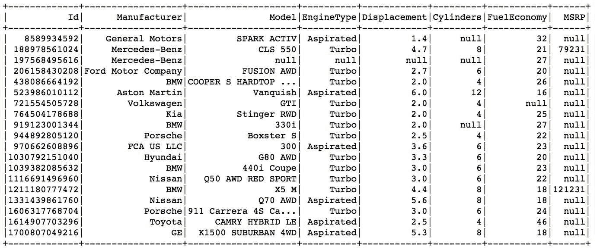

这些数字绝对是唯一的。我们现在准备处理数据集中的其他问题。

# 处理缺失观察

缺失观察在数据集中几乎是第二常见的问题。这是由于许多原因引起的，正如我们在介绍中已经提到的那样。在这个示例中，我们将学习如何处理它们。

# 准备好了

要执行这个示例，你需要一个可用的 Spark 环境。此外，我们将在前一个示例中创建的`new_id` DataFrame 上进行操作，因此我们假设你已经按照步骤删除了重复的记录。

不需要其他先决条件。

# 如何做...

由于我们的数据有两个维度（行和列），我们需要检查每行和每列中缺失数据的百分比，以确定保留什么，放弃什么，以及（可能）插补什么：

1.  要计算一行中有多少缺失观察，使用以下代码段：

```py
(
    spark.createDataFrame(
        new_id
        .rdd
        .map(
           lambda row: (
                 row['Id']
               , sum([c == None for c in row])
           )
        )
        .collect()
        .filter(lambda el: el[1] > 1)
        ,['Id', 'CountMissing']
    )
    .orderBy('CountMissing', ascending=False)
    .show()
)
```

1.  要计算每列中缺少多少数据，使用以下代码：

```py
for k, v in sorted(
    merc_out
        .agg(*[
               (1 - (fn.count(c) / fn.count('*')))
                    .alias(c + '_miss')
               for c in merc_out.columns
           ])
        .collect()[0]
        .asDict()
        .items()
    , key=lambda el: el[1]
    , reverse=True
):
    print(k, v)
```

让我们一步一步地走过这些。

# 它是如何工作的...

现在让我们详细看看如何处理行和列中的缺失观察。

# 每行的缺失观察

要计算一行中缺少多少数据，更容易使用 RDD，因为我们可以循环遍历 RDD 记录的每个元素，并计算缺少多少值。因此，我们首先访问`new_id` DataFrame 中的`.rdd`。使用`.map(...)`转换，我们循环遍历每一行，提取`'Id'`，并使用`sum([c == None for c in row])`表达式计算缺少元素的次数。这些操作的结果是每个都有两个值的元素的 RDD：行的 ID 和缺失值的计数。

接下来，我们只选择那些有多于一个缺失值的记录，并在驱动程序上`.collect()`这些记录。然后，我们创建一个简单的 DataFrame，通过缺失值的计数按降序`.orderBy(...)`，并显示记录。

结果如下所示：

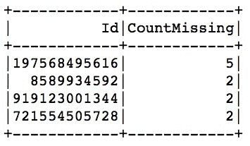

正如你所看到的，其中一条记录有八个值中的五个缺失。让我们看看那条记录：

```py
(
    new_id
    .where('Id == 197568495616')
    .show()
)
```

前面的代码显示了`Mercedes-Benz`记录中大部分值都缺失：

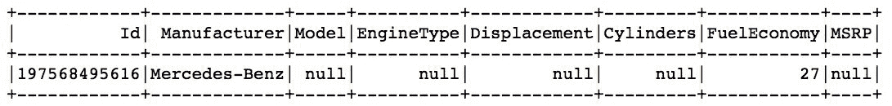

因此，我们可以删除整个观测值，因为这条记录中实际上并没有太多价值。为了实现这个目标，我们可以使用 DataFrame 的`.dropna(...)`方法：`merc_out = new_id.dropna(thresh=4)`。

如果你使用`.dropna()`而不传递任何参数，任何具有缺失值的记录都将被删除。

我们指定`thresh=4`，所以我们只删除具有至少四个非缺失值的记录；我们的记录只有三个有用的信息。

让我们确认一下：运行`new_id.count(), merc_out.count()`会产生`(19, 18)`，所以是的，确实，我们移除了一条记录。我们真的移除了`Mercedes-Benz`吗？让我们检查一下：

```py
(
    merc_out
    .where('Id == 197568495616')
    .show()
)
Id equal to 197568495616, as shown in the following screenshot:
```

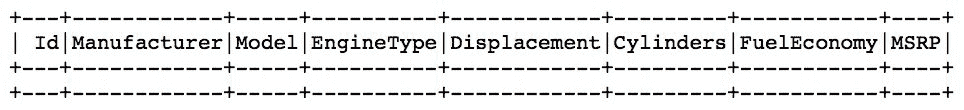

# 每列的缺失观测值

我们还需要检查是否有某些列中有特别低的有用信息发生率。在我们提供的代码中发生了很多事情，所以让我们一步一步地拆开它。

让我们从内部列表开始：

```py
[
    (1 - (fn.count(c) / fn.count('*')))
        .alias(c + '_miss')
    for c in merc_out.columns
]
```

我们遍历`merc_out` DataFrame 中的所有列，并计算我们在每列中找到的非缺失值的数量。然后我们将它除以所有行的总数，并从中减去 1，这样我们就得到了缺失值的百分比。

我们在本章前面导入了`pyspark.sql.functions`作为`fn`。

然而，我们在这里实际上做的并不是真正的计算。Python 存储这些信息的方式，此时只是作为一系列对象或指针，指向某些操作。只有在我们将列表传递给`.agg(...)`方法后，它才会被转换为 PySpark 的内部执行图（只有在我们调用`.collect()`动作时才会执行）。

`.agg(...)`方法接受一组参数，不是作为列表对象，而是作为逗号分隔的参数列表。因此，我们没有将列表本身传递给`.agg(...)`方法，而是在列表前面包含了`'*'`，这样我们的列表的每个元素都会被展开，并像参数一样传递给我们的方法。

`.collect()`方法将返回一个元素的列表——一个包含聚合信息的`Row`对象。我们可以使用`.asDict()`方法将`Row`转换为字典，然后提取其中的所有`items`。这将导致一个元组的列表，其中第一个元素是列名（我们使用`.alias(...)`方法将`'_miss'`附加到每一列），第二个元素是缺失观测值的百分比。

在循环遍历排序列表的元素时，我们只是将它们打印到屏幕上：

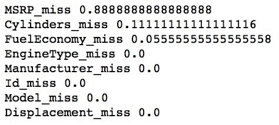

嗯，看起来`MSRP`列中的大部分信息都是缺失的。因此，我们可以删除它，因为它不会给我们带来任何有用的信息：

```py
no_MSRP = merc_out.select([col for col in new_id.columns if col != 'MSRP'])
```

我们仍然有两列有一些缺失信息。让我们对它们做点什么。

# 还有更多...

PySpark 允许你填补缺失的观测值。你可以传递一个值，所有数据中的`null`或`None`都将被替换，或者你可以传递一个包含不同值的字典，用于每个具有缺失观测值的列。在这个例子中，我们将使用后一种方法，并指定燃油经济性和排量之间的比例，以及气缸数和排量之间的比例。

首先，让我们创建我们的字典：

```py
multipliers = (
    no_MSRP
    .agg(
          fn.mean(
              fn.col('FuelEconomy') / 
              (
                  fn.col('Displacement') * fn.col('Cylinders')
              )
          ).alias('FuelEconomy')
        , fn.mean(
            fn.col('Cylinders') / 
            fn.col('Displacement')
        ).alias('Cylinders')
    )
).toPandas().to_dict('records')[0]
```

在这里，我们有效地计算了我们的乘数。为了替换燃油经济性中的缺失值，我们将使用以下公式：

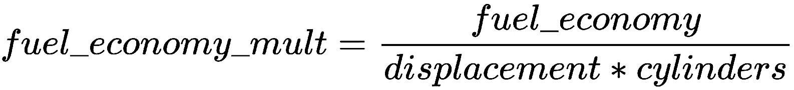

对于气缸数，我们将使用以下方程：

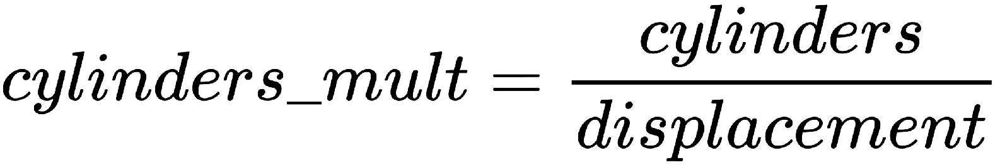

我们先前的代码使用这两个公式来计算每一行的乘数，然后取这些乘数的平均值。

这不会是完全准确的，但鉴于我们拥有的数据，它应该足够准确。

在这里，我们还提供了另一种将您的（小型！）Spark DataFrame 创建为字典的方法：使用`.toPandas()`方法将 Spark DataFrame 转换为 pandas DataFrame。 pandas DataFrame 具有`.to_dict(...)`方法，该方法将允许您将我们的数据转换为字典。 `'records'`参数指示方法将每一行转换为一个字典，其中键是具有相应记录值的列名。

查看此链接以了解更多关于`.to_dict(...)`方法的信息：[`pandas.pydata.org/pandas-docs/stable/generated/pandas.DataFrame.to_dict.html`](https://pandas.pydata.org/pandas-docs/stable/generated/pandas.DataFrame.to_dict.html)。

我们的结果字典如下：

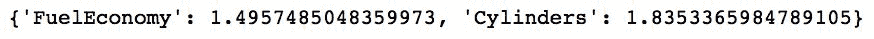

现在让我们使用它来填补我们的缺失数据：

```py
imputed = (
    no_MSRP
    .withColumn('FuelEconomy', fn.col('FuelEconomy') / fn.col('Displacement') / fn.col('Cylinders'))
    .withColumn('Cylinders', fn.col('Cylinders') / fn.col('Displacement'))
    .fillna(multipliers)
    .withColumn('Cylinders', (fn.col('Cylinders') * fn.col('Displacement')).cast('integer'))
    .withColumn('FuelEconomy', fn.col('FuelEconomy') * fn.col('Displacement') * fn.col('Cylinders'))
)
```

首先，我们将原始数据转换为反映我们之前指定的比率的数据。接下来，我们使用乘数字典填充缺失值，最后将列恢复到其原始状态。

请注意，每次使用`.withColumn(...)`方法时，都会覆盖原始列名。

生成的 DataFrame 如下所示：

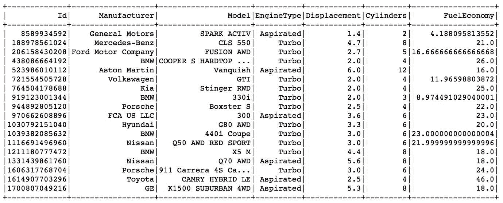

正如您所看到的，汽缸和燃油经济性的结果值并不完全准确，但仍然可以说比用预定义值替换它们要好。

# 另请参阅

+   查看 PySpark 关于缺失观察方法的文档：[`spark.apache.org/docs/latest/api/python/pyspark.sql.html#pyspark.sql.DataFrameNaFunctions`](https://spark.apache.org/docs/latest/api/python/pyspark.sql.html#pyspark.sql.DataFrameNaFunctions)

# 处理异常值

异常值是与其余观察结果差异很大的观察结果，即它们位于数据分布的长尾部分，本配方中，我们将学习如何定位和处理异常值。

# 准备工作

要执行此配方，您需要有一个可用的 Spark 环境。此外，我们将在前一个配方中创建的`imputed`DataFrame 上进行操作，因此我们假设您已经按照处理缺失观察的步骤进行了操作。

不需要其他先决条件。

# 如何做...

让我们从异常值的一个常见定义开始。

一个点，，符合以下标准：

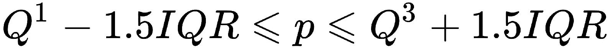

不被视为异常值；在此范围之外的任何点都是异常值。在上述方程中，*Q¹*是第一四分位数（25^(th)百分位数），*Q³*是第三四分位数，*IQR*是**四分位距**，定义为*Q³*和*Q¹*的差值：IQR= *Q³-Q¹*。

要标记异常值，请按照以下步骤进行：

1.  让我们先计算我们的范围：

```py
features = ['Displacement', 'Cylinders', 'FuelEconomy']
quantiles = [0.25, 0.75]

cut_off_points = []

for feature in features:
    quants = imputed.approxQuantile(feature, quantiles, 0.05)

    IQR = quants[1] - quants[0]
    cut_off_points.append((feature, [
        quants[0] - 1.5 * IQR,
        quants[1] + 1.5 * IQR,
    ]))

cut_off_points = dict(cut_off_points)
```

1.  接下来，我们标记异常值：

```py
outliers = imputed.select(*['id'] + [
       (
           (imputed[f] < cut_off_points[f][0]) |
           (imputed[f] > cut_off_points[f][1])
       ).alias(f + '_o') for f in features
  ])
```

# 它是如何工作的...

我们只会查看数值变量：排量、汽缸和燃油经济性。

我们循环遍历所有这些特征，并使用`.approxQuantile(...)`方法计算第一和第三四分位数。该方法将特征（列）名称作为第一个参数，要计算的四分位数的浮点数（或浮点数列表）作为第二个参数，第三个参数指定相对目标精度（将此值设置为 0 将找到精确的四分位数，但可能非常昂贵）。

该方法返回两个（在我们的情况下）值的列表：*Q¹*和*Q³*。然后我们计算四分位距，并将`(feature_name, [lower_bound, upper_bound])`元组附加到`cut_off_point`列表中。转换为字典后，我们的截断点如下：

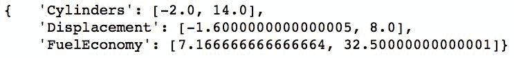

因此，现在我们可以使用这些来标记我们的异常观察结果。我们只会选择 ID 列，然后循环遍历我们的特征，以检查它们是否落在我们计算的边界之外。这是我们得到的结果：

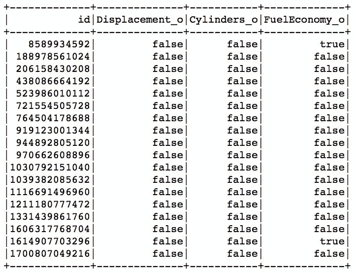

因此，我们在燃油经济性列中有两个异常值。让我们检查记录：

```py
with_outliers_flag = imputed.join(outliers, on='Id')

(
    with_outliers_flag
    .filter('FuelEconomy_o')
    .select('Id', 'Manufacturer', 'Model', 'FuelEconomy')
    .show()
)
```

首先，我们将我们的`imputed` DataFrame 与`outliers`进行连接，然后我们根据`FuelEconomy_o`标志进行筛选，仅选择我们的异常记录。最后，我们只提取最相关的列以显示：

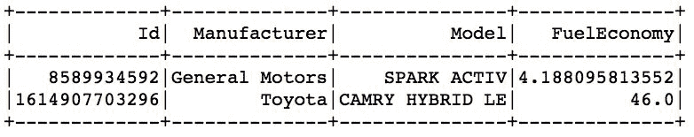

因此，我们有`SPARK ACTIV`和`CAMRY HYBRID LE`作为异常值。`SPARK ACTIV`由于我们的填充逻辑而成为异常值，因为我们不得不填充其燃油经济值；考虑到其引擎排量为 1.4 升，我们的逻辑并不奏效。好吧，您可以用其他方法填充值。作为混合动力车，凯美瑞在由大型涡轮增压引擎主导的数据集中显然是一个异常值；看到它出现在这里并不奇怪。

尝试基于带有异常值的数据构建机器学习模型可能会导致一些不可信的结果或无法很好泛化的模型，因此我们通常会从数据集中删除这些异常值：

```py
no_outliers = (
    with_outliers_flag
    .filter('!FuelEconomy_o')
    .select(imputed.columns)
)
FuelEconomy_o column. That's it!
```

# 另请参阅

+   查看此网站以获取有关异常值的更多信息：[`www.itl.nist.gov/div898/handbook/prc/section1/prc16.htm`](http://www.itl.nist.gov/div898/handbook/prc/section1/prc16.htm)

# 探索描述性统计

描述性统计是您可以在数据上计算的最基本的度量。在本示例中，我们将学习在 PySpark 中熟悉我们的数据集是多么容易。

# 准备工作

要执行此示例，您需要一个可用的 Spark 环境。此外，我们将使用在*处理异常值*示例中创建的`no_outliers` DataFrame，因此我们假设您已经按照处理重复项、缺失观测值和异常值的步骤进行了操作。

不需要其他先决条件。

# 如何做...

在 PySpark 中计算数据的描述性统计非常容易。以下是方法：

```py
descriptive_stats = no_outliers.describe(features)
```

就是这样！

# 工作原理...

上述代码几乎不需要解释。`.describe(...)`方法接受要计算描述性统计的列的列表，并返回一个包含基本描述性统计的 DataFrame：计数、平均值、标准偏差、最小值和最大值。

您可以将数字和字符串列都指定为`.describe(...)`的输入参数。

这是我们在`features`列上运行`.describe(...)`方法得到的结果：

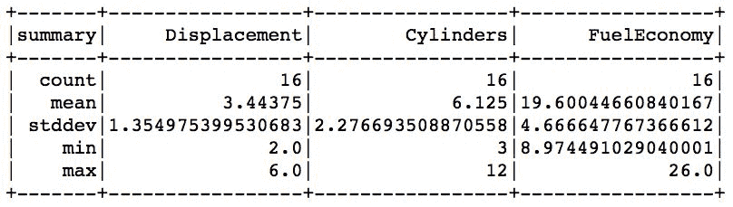

正如预期的那样，我们总共有`16`条记录。我们的数据集似乎偏向于较大的引擎，因为平均排量为`3.44`升，有六个汽缸。对于如此庞大的引擎来说，燃油经济性似乎还不错，为 19 英里/加仑。

# 还有更多...

如果您不传递要计算描述性统计的列的列表，PySpark 将返回 DataFrame 中每一列的统计信息。请查看以下代码片段：

```py
descriptive_stats_all = no_outliers.describe()
descriptive_stats_all.show()
```

这将导致以下表：

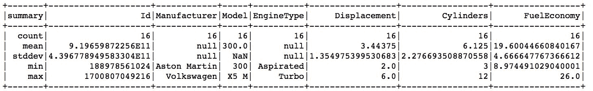

正如您所看到的，即使字符串列也有它们的描述性统计，但解释起来相当可疑。

# 聚合列的描述性统计

有时，您希望在一组值中计算一些描述性统计。在此示例中，我们将为具有不同汽缸数量的汽车计算一些基本统计信息：

```py
(
    no_outliers
    .select(features)
    .groupBy('Cylinders')
    .agg(*[
          fn.count('*').alias('Count')
        , fn.mean('FuelEconomy').alias('MPG_avg')
        , fn.mean('Displacement').alias('Disp_avg')
        , fn.stddev('FuelEconomy').alias('MPG_stdev')
```

```py

        , fn.stddev('Displacement').alias('Disp_stdev')
    ])
    .orderBy('Cylinders')
).show()
```

首先，我们选择我们的`features`列列表，以减少我们需要分析的数据量。接下来，我们在汽缸列上聚合我们的数据，并使用（已经熟悉的）`.agg(...)`方法来计算燃油经济性和排量的计数、平均值和标准偏差。

`pyspark.sql.functions`模块中还有更多的聚合函数：`avg(...)`, `count(...)`, `countDistinct(...)`, `first(...)`, `kurtosis(...)`, `max(...)`, `mean(...)`, `min(...)`, `skewness(...)`, `stddev_pop(...)`, `stddev_samp(...)`, `sum(...)`, `sumDistinct(...)`, `var_pop(...)`, `var_samp(...)`, 和 `variance(...)`.

这是结果表：

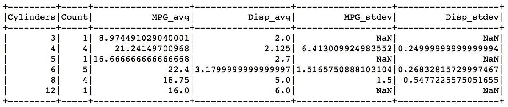

我们可以从这个表中得出两点结论：

+   我们的填充方法真的不准确，所以下次我们应该想出一个更好的方法。

+   六缸汽车的`MPG_avg`高于四缸汽车，这可能有些可疑。这就是为什么你应该熟悉你的数据，因为这样你就可以发现数据中的隐藏陷阱。

如何处理这样的发现超出了本书的范围。但是，重点是这就是为什么数据科学家会花 80%的时间来清理数据并熟悉它，这样建立在这样的数据上的模型才能得到可靠的依赖。

# 另请参阅

+   你可以在你的数据上计算许多其他统计量，我们在这里没有涵盖（但 PySpark 允许你计算）。为了更全面地了解，我们建议你查看这个网站：[`www.socialresearchmethods.net/kb/statdesc.php`](https://www.socialresearchmethods.net/kb/statdesc.php)。

# 计算相关性

与结果相关的特征是可取的，但那些在彼此之间也相关的特征可能会使模型不稳定。在这个配方中，我们将向你展示如何计算特征之间的相关性。

# 准备工作

要执行这个步骤，你需要一个可用的 Spark 环境。此外，我们将使用我们在*处理离群值*配方中创建的`no_outliers` DataFrame，所以我们假设你已经按照处理重复项、缺失观察和离群值的步骤进行了操作。

不需要其他先决条件。

# 如何做...

要计算两个特征之间的相关性，你只需要提供它们的名称：

```py
(
    no_outliers
    .corr('Cylinders', 'Displacement')
)
```

就是这样！

# 它是如何工作的...

`.corr(...)`方法接受两个参数，即你想要计算相关系数的两个特征的名称。

目前只有皮尔逊相关系数是可用的。

上述命令将为我们的数据集产生一个相关系数等于`0.938`。

# 还有更多...

如果你想计算一个相关矩阵，你需要手动完成这个过程。以下是我们的解决方案：

```py
n_features = len(features)

corr = []

for i in range(0, n_features):
    temp = [None] * i

    for j in range(i, n_features):
        temp.append(no_outliers.corr(features[i], features[j]))
    corr.append([features[i]] + temp)

correlations = spark.createDataFrame(corr, ['Column'] + features)
```

上述代码实际上是在我们的`features`列表中循环，并计算它们之间的成对相关性，以填充矩阵的上三角部分。

我们在*处理离群值*配方中介绍了`features`列表。

然后将计算出的系数附加到`temp`列表中，然后将其添加到`corr`列表中。最后，我们创建了相关性 DataFrame。它看起来是这样的：

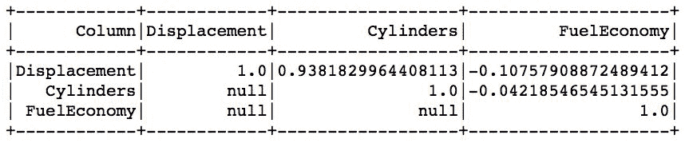

如你所见，唯一的强相关性是`Displacement`和`Cylinders`之间的，这当然不足为奇。`FuelEconomy`与排量并没有真正相关，因为还有其他影响`FuelEconomy`的因素，比如汽车的阻力和重量。然而，如果你试图预测，例如最大速度，并假设（这是一个合理的假设），`Displacement`和`Cylinders`都与最大速度高度正相关，那么你应该只使用其中一个。

# 绘制直方图

直方图是直观检查数据分布的最简单方法。在这个配方中，我们将向你展示如何在 PySpark 中做到这一点。

# 准备工作

要执行这个步骤，你需要一个可用的 Spark 环境。此外，我们将使用我们在*处理离群值*配方中创建的`no_outliers` DataFrame，所以我们假设你已经按照处理重复项、缺失观察和离群值的步骤进行了操作。

不需要其他先决条件。

# 如何做...

在 PySpark 中有两种生成直方图的方法：

+   选择你想要可视化的特征，在驱动程序上`.collect()`它，然后使用 matplotlib 的本地`.hist(...)`方法来绘制直方图

+   在 PySpark 中计算每个直方图箱中的计数，并将计数返回给驱动程序进行可视化

前一个解决方案适用于小数据集（例如本章中的数据），但如果数据太大，它将破坏您的驱动程序。此外，我们分发数据的一个很好的原因是，我们可以并行计算而不是在单个线程中进行计算。因此，在这个示例中，我们只会向您展示第二个解决方案。这是为我们做所有计算的片段：

```py
histogram_MPG = (
    no_outliers
    .select('FuelEconomy')
    .rdd
    .flatMap(lambda record: record)
    .histogram(5)
)
```

# 它是如何工作的...

上面的代码非常容易理解。首先，我们选择感兴趣的特征（在我们的例子中是燃油经济）。

Spark DataFrames 没有本地的直方图方法，这就是为什么我们要切换到底层的 RDD。

接下来，我们将结果展平为一个长列表（而不是一个`Row`对象），并使用`.histogram(...)`方法来计算我们的直方图。

`.histogram(...)`方法接受一个整数，该整数指定要将我们的数据分配到的桶的数量，或者是一个具有指定桶限制的列表。

查看 PySpark 关于`.histogram(...)`的文档：[`spark.apache.org/docs/latest/api/python/pyspark.html#pyspark.RDD.histogram`](https://spark.apache.org/docs/latest/api/python/pyspark.html#pyspark.RDD.histogram)。

该方法返回两个元素的元组：第一个元素是一个 bin 边界的列表，另一个元素是相应 bin 中元素的计数。这是我们的燃油经济特征的样子：

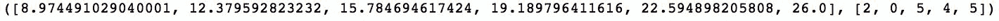

请注意，我们指定`.histogram(...)`方法将我们的数据分桶为五个 bin，但第一个列表中有六个元素。但是，我们的数据集中仍然有五个桶：*[8.97, 12.38), [ 12.38, 15.78), [15.78, 19.19), [19.19, 22.59)*和*[22.59, 26.0)*。

我们不能在 PySpark 中本地创建任何图表，而不经过大量设置（例如，参见这个：[`plot.ly/python/apache-spark/`](https://plot.ly/python/apache-spark/)）。更简单的方法是准备一个包含我们的数据的 DataFrame，并在驱动程序上使用一些*魔法*（好吧，是 sparkmagics，但它仍然有效！）。

首先，我们需要提取我们的数据并创建一个临时的`histogram_MPG`表：

```py
(
    spark
    .createDataFrame(
        [(bins, counts) 
         for bins, counts 
         in zip(
             histogram_MPG[0], 
             histogram_MPG[1]
         )]
        , ['bins', 'counts']
    )
    .registerTempTable('histogram_MPG')
)
```

我们创建一个两列的 DataFrame，其中第一列包含 bin 的下限，第二列包含相应的计数。`.registerTempTable(...)`方法（顾名思义）注册一个临时表，这样我们就可以在`%%sql`魔法中使用它：

```py
%%sql -o hist_MPG -q
SELECT * FROM histogram_MPG
```

上面的命令从我们的临时`histogram_MPG`表中选择所有记录，并将其输出到本地可访问的`hist_MPG`变量；`-q`开关是为了确保笔记本中没有打印出任何内容。

有了本地可访问的`hist_MPG`，我们现在可以使用它来生成我们的图表：

```py
%%local
import matplotlib.pyplot as plt
%matplotlib inline
plt.style.use('ggplot')

fig = plt.figure(figsize=(12,9))
ax = fig.add_subplot(1, 1, 1)
ax.bar(hist_MPG['bins'], hist_MPG['counts'], width=3)
ax.set_title('Histogram of fuel economy')
```

`%%local`在本地模式下执行笔记本单元格中的任何内容。首先，我们导入`matplotlib`库，并指定它在笔记本中内联生成图表，而不是每次生成图表时弹出一个新窗口。`plt.style.use(...)`更改我们图表的样式。

要查看可用样式的完整列表，请查看[`matplotlib.org/devdocs/gallery/style_sheets/style_sheets_reference.html`](https://matplotlib.org/devdocs/gallery/style_sheets/style_sheets_reference.html)。

接下来，我们创建一个图表，并向其中添加一个子图，最后，我们使用`.bar(...)`方法来绘制我们的直方图并设置标题。图表的样子如下：

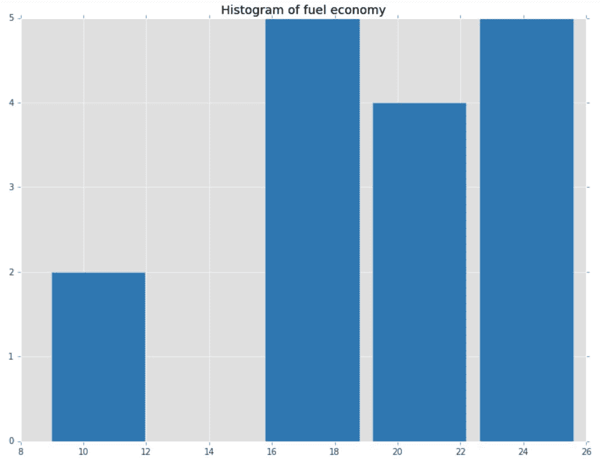

就是这样！

# 还有更多...

Matplotlib 不是我们绘制直方图的唯一库。Bokeh（可在[`bokeh.pydata.org/en/latest/`](https://bokeh.pydata.org/en/latest/)找到）是另一个功能强大的绘图库，建立在`D3.js`之上，允许您与图表进行交互。

在[`bokeh.pydata.org/en/latest/docs/gallery.html`](https://bokeh.pydata.org/en/latest/docs/gallery.html)上查看示例的图库。

这是使用 Bokeh 绘图的方法：

```py
%%local
from bokeh.io import show
from bokeh.plotting import figure
from bokeh.io import output_notebook
output_notebook()

labels = [str(round(e, 2)) for e in hist_MPG['bins']]

p = figure(
    x_range=labels, 
    plot_height=350, 
    title='Histogram of fuel economy'
)

p.vbar(x=labels, top=hist_MPG['counts'], width=0.9)

show(p)
```

首先，我们加载 Bokeh 的所有必要组件；`output_notebook()`方法确保我们在笔记本中内联生成图表，而不是每次都打开一个新窗口。接下来，我们生成要放在图表上的标签。然后，我们定义我们的图形：`x_range`参数指定*x*轴上的点数，`plot_height`设置我们图表的高度。最后，我们使用`.vbar(...)`方法绘制我们直方图的条形；`x`参数是要放在我们图表上的标签，`top`参数指定计数。

结果如下所示：

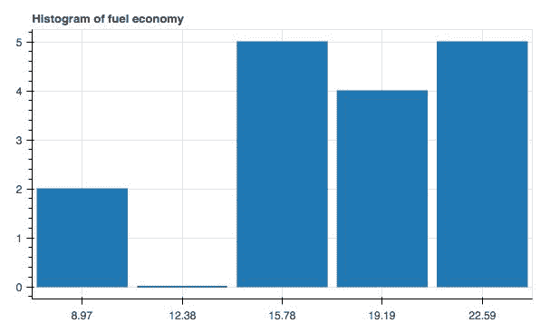

这是相同的信息，但您可以在浏览器中与此图表进行交互。

# 另请参阅

+   如果您想要进一步自定义您的直方图，这是一个可能有用的页面：[`plot.ly/matplotlib/histograms/`](https://plot.ly/matplotlib/histograms/)

# 可视化特征之间的相互作用

绘制特征之间的相互作用可以进一步加深您对数据分布的理解，也可以了解特征之间的关系。在这个配方中，我们将向您展示如何从您的数据中创建散点图。

# 准备工作

要执行此操作，您需要拥有一个可用的 Spark 环境。此外，我们将在*处理异常值*配方中创建的`no_outliers` DataFrame 上进行操作，因此我们假设您已经按照处理重复项、缺失观察和异常值的步骤进行了操作。

不需要其他先决条件。

# 如何做...

再次，我们将从 DataFrame 中选择我们的数据并在本地公开它：

```py
scatter = (
    no_outliers
    .select('Displacement', 'Cylinders')
)

scatter.registerTempTable('scatter')

%%sql -o scatter_source -q
SELECT * FROM scatter
```

# 它是如何工作的...

首先，我们选择我们想要了解其相互作用的两个特征；在我们的案例中，它们是排量和汽缸特征。

我们的示例很小，所以我们可以使用所有的数据。然而，在现实世界中，您应该在尝试绘制数十亿数据点之前首先对数据进行抽样。

在注册临时表之后，我们使用`%%sql`魔术方法从`scatter`表中选择所有数据并在本地公开为`scatter_source`。现在，我们可以开始绘图了：

```py
%%local
import matplotlib.pyplot as plt
%matplotlib inline
plt.style.use('ggplot')

fig = plt.figure(figsize=(12,9))
ax = fig.add_subplot(1, 1, 1)
ax.scatter(
      list(scatter_source['Cylinders'])
    , list(scatter_source['Displacement'])
    , s = 200
    , alpha = 0.5
)

ax.set_xlabel('Cylinders')
ax.set_ylabel('Displacement')

ax.set_title('Relationship between cylinders and displacement')
```

首先，我们加载 Matplotlib 库并对其进行设置。

有关这些 Matplotlib 命令的更详细解释，请参阅*绘制直方图*配方。

接下来，我们创建一个图形并向其添加一个子图。然后，我们使用我们的数据绘制散点图；*x*轴将代表汽缸数，*y*轴将代表排量。最后，我们设置轴标签和图表标题。

最终结果如下所示：

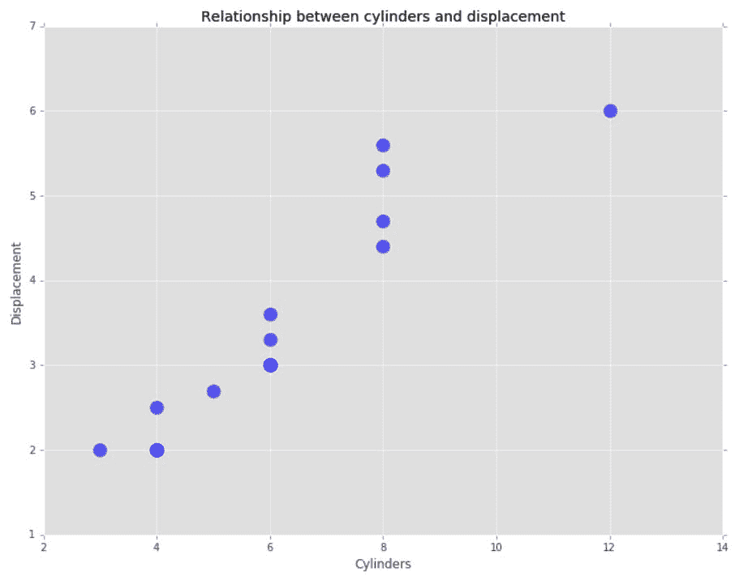

# 还有更多...

您可以使用`bokeh`创建前面图表的交互版本：

```py
%%local 
from bokeh.io import show
from bokeh.plotting import figure
from bokeh.io import output_notebook
output_notebook()

p = figure(title = 'Relationship between cylinders and displacement')
p.xaxis.axis_label = 'Cylinders'
p.yaxis.axis_label = 'Displacement'

p.circle( list(scatter_source['Cylinders'])
         , list(scatter_source['Displacement'])
         , fill_alpha=0.2, size=10)

show(p)
```

首先，我们创建画布，即我们将绘图的图形。接下来，我们设置我们的标签。最后，我们使用`.circle(...)`方法在画布上绘制点。

最终结果如下所示：

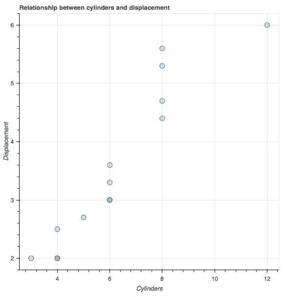
