# 第五章：使用 MLlib 进行机器学习

在本章中，我们将介绍如何使用 PySpark 的 MLlib 模块构建机器学习模型。尽管它现在已经被弃用，大多数模型现在都被移动到 ML 模块，但如果您将数据存储在 RDD 中，您可以使用 MLlib 进行机器学习。您将学习以下示例：

+   加载数据

+   探索数据

+   测试数据

+   转换数据

+   标准化数据

+   创建用于训练的 RDD

+   预测人口普查受访者的工作小时数

+   预测人口普查受访者的收入水平

+   构建聚类模型

+   计算性能统计

# 加载数据

为了构建一个机器学习模型，我们需要数据。因此，在开始之前，我们需要读取一些数据。在这个示例中，以及在本章的整个过程中，我们将使用 1994 年的人口普查收入数据。

# 准备工作

要执行这个示例，您需要一个可用的 Spark 环境。如果没有，您可能需要回到第一章，*安装和配置 Spark*，并按照那里找到的示例进行操作。

数据集来自[`archive.ics.uci.edu/ml/datasets/Census+Income`](http://archive.ics.uci.edu/ml/datasets/Census+Income)。

数据集位于本书的 GitHub 存储库的`data`文件夹中。

本章中您需要的所有代码都可以在我们为本书设置的 GitHub 存储库中找到：[`bit.ly/2ArlBck`](http://bit.ly/2ArlBck)；转到`Chapter05`，打开`5\. Machine Learning with MLlib.ipynb`笔记本。

不需要其他先决条件。

# 如何做...

我们将数据读入 DataFrame，这样我们就可以更容易地处理。稍后，我们将把它转换成带标签的 RDD。要读取数据，请执行以下操作：

```py
census_path = '../data/census_income.csv'

census = spark.read.csv(
    census_path
    , header=True
    , inferSchema=True
)
```

# 它是如何工作的...

首先，我们指定了我们数据集的路径。在我们的情况下，与本书中使用的所有其他数据集一样，`census_income.csv`位于`data`文件夹中，可以从父文件夹中访问。

接下来，我们使用`SparkSession`的`.read`属性，它返回`DataFrameReader`对象。`.csv(...)`方法的第一个参数指定了数据的路径。我们的数据集在第一行中有列名，因此我们使用`header`选项指示读取器使用第一行作为列名。`inferSchema`参数指示`DataFrameReader`自动检测每列的数据类型。

让我们检查数据类型推断是否正确：

```py
census.printSchema()
```

上述代码产生以下输出：

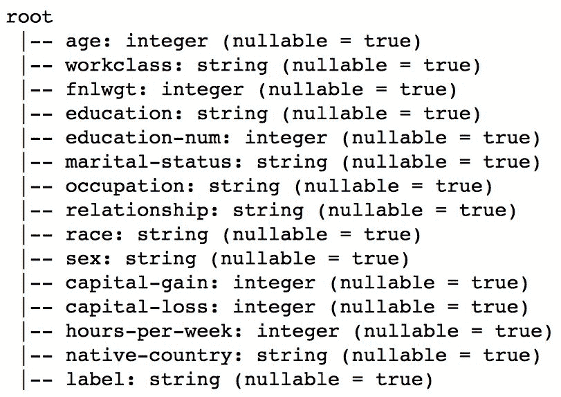

正如您所看到的，某些列的数据类型被正确地检测到了；如果没有`inferSchema`参数，所有列将默认为字符串。

# 还有更多...

然而，我们的数据集存在一个小问题：大多数字符串列都有前导或尾随空格。以下是您可以纠正此问题的方法：

```py
import pyspark.sql.functions as func

for col, typ in census.dtypes:
    if typ == 'string':
        census = census.withColumn(
            col
            , func.ltrim(func.rtrim(census[col]))
        )
```

我们循环遍历`census` DataFrame 中的所有列。

DataFrame 的`.dtypes`属性是一个元组列表，其中第一个元素是列名，第二个元素是数据类型。

如果列的类型等于字符串，我们应用两个函数：`.ltrim(...)`，它删除字符串中的任何前导空格，以及`.rtrim(...)`，它删除字符串中的任何尾随空格。`.withColumn(...)`方法不会附加任何新列，因为我们重用相同的列名：`col`。

# 探索数据

直接进入对数据建模是几乎每个新数据科学家都会犯的错误；我们太急于获得回报阶段，所以忘记了大部分时间实际上都花在清理数据和熟悉数据上。在这个示例中，我们将探索人口普查数据集。

# 准备工作

要执行这个示例，您需要一个可用的 Spark 环境。您应该已经完成了之前的示例，其中我们将人口普查数据加载到了 DataFrame 中。

不需要其他先决条件。

# 如何做...

首先，我们列出我们想要保留的所有列：

```py
cols_to_keep = census.dtypes

cols_to_keep = (
    ['label','age'
     ,'capital-gain'
     ,'capital-loss'
     ,'hours-per-week'
    ] + [
        e[0] for e in cols_to_keep[:-1] 
        if e[1] == 'string'
    ]
)
```

接下来，我们选择数值和分类特征，因为我们将分别探索这些特征：

```py
census_subset = census.select(cols_to_keep)

cols_num = [
    e[0] for e in census_subset.dtypes 
    if e[1] == 'int'
]
cols_cat = [
    e[0] for e in census_subset.dtypes[1:] 
    if e[1] == 'string'
]
```

# 工作原理...

首先，我们提取所有带有相应数据类型的列。

我们已经在上一节中讨论了 DataFrame 存储的`.dtypes`属性。

我们将只保留`label`，这是一个包含有关一个人是否赚超过 5 万美元的标识符的列，以及其他一些数字列。此外，我们保留所有的字符串特征。

接下来，我们创建一个仅包含所选列的 DataFrame，并提取所有的数值和分类列；我们分别将它们存储在`cols_num`和`cols_cat`列表中。

# 数值特征

让我们探索数值特征。就像在第四章中的*为建模准备数据*一样，对于数值变量，我们将计算一些基本的描述性统计：

```py
import pyspark.mllib.stat as st
import numpy as np

rdd_num = (
    census_subset
    .select(cols_num)
    .rdd
    .map(lambda row: [e for e in row])
)

stats_num = st.Statistics.colStats(rdd_num)

for col, min_, mean_, max_, var_ in zip(
      cols_num
    , stats_num.min()
    , stats_num.mean()
    , stats_num.max()
    , stats_num.variance()
):
    print('{0}: min->{1:.1f}, mean->{2:.1f}, max->{3:.1f}, stdev->{4:.1f}'
          .format(col, min_, mean_, max_, np.sqrt(var_)))
```

首先，我们进一步将我们的`census_subset`子集化为仅包含数值列。接下来，我们提取底层 RDD。由于此 RDD 的每个元素都是一行，因此我们首先需要创建一个列表，以便我们可以使用它；我们使用`.map(...)`方法实现这一点。

有关`Row`类的文档，请查看[`spark.apache.org/docs/latest/api/python/pyspark.sql.html#pyspark.sql.Row`](http://spark.apache.org/docs/latest/api/python/pyspark.sql.html#pyspark.sql.Row)。

现在我们的 RDD 准备好了，我们只需从 MLlib 的统计模块中调用`.colStats(...)`方法。`.colStats(...)`接受一个数值值的 RDD；这些可以是列表或向量（密集或稀疏，参见`pyspark.mllib.linalg.Vectors`的文档[`spark.apache.org/docs/latest/api/python/pyspark.mllib.html#pyspark.mllib.linalg.Vectors`](http://spark.apache.org/docs/latest/api/python/pyspark.mllib.html#pyspark.mllib.linalg.Vectors)）。返回一个`MultivariateStatisticalSummary`特征，其中包含计数、最大值、平均值、最小值、L1 和 L2 范数、非零观测数和方差等数据。

如果您熟悉 C++或 Java，traits 可以被视为虚拟类（C++）或接口（Java）。您可以在[`docs.scala-lang.org/tour/traits.html`](https://docs.scala-lang.org/tour/traits.html)上阅读更多关于 traits 的信息。

在我们的示例中，我们只选择了最小值、平均值、最大值和方差。这是我们得到的结果：

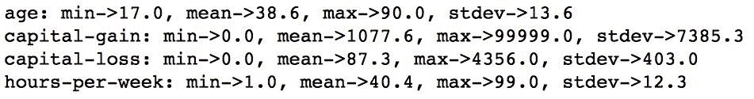

因此，平均年龄约为 39 岁。但是，我们的数据集中有一个 90 岁的异常值。就资本收益或损失而言，人口普查调查对象似乎赚的比亏的多。平均而言，受访者每周工作 40 小时，但我们有人工作接近 100 小时。

# 分类特征

对于分类数据，我们无法计算简单的描述性统计。因此，我们将计算每个分类列中每个不同值的频率。以下是一个可以实现这一目标的代码片段：

```py
rdd_cat = (
    census_subset
    .select(cols_cat + ['label'])
    .rdd
    .map(lambda row: [e for e in row])
)

results_cat = {}

for i, col in enumerate(cols_cat + ['label']):
    results_cat[col] = (
        rdd_cat
        .groupBy(lambda row: row[i])
        .map(lambda el: (el[0], len(el[1])))
        .collect()
    )
```

首先，我们重复了我们刚刚为数值列所做的工作，但是对于分类列：我们将`census_subset`子集化为仅包含分类列和标签，访问底层 RDD，并将每行转换为列表。我们将结果存储在`results_cat`字典中。我们遍历所有分类列，并使用`.groupBy(...)`转换来聚合数据。最后，我们创建一个元组列表，其中第一个元素是值（`el[0]`），第二个元素是频率（`len(el[1])`）。

“`.groupBy(...)`”转换输出一个列表，其中第一个元素是值，第二个元素是一个`pyspark.resultIterable.ResultIterable`对象，实际上是包含该值的 RDD 中的所有元素的列表。

现在我们已经聚合了我们的数据，让我们看看我们要处理的内容：

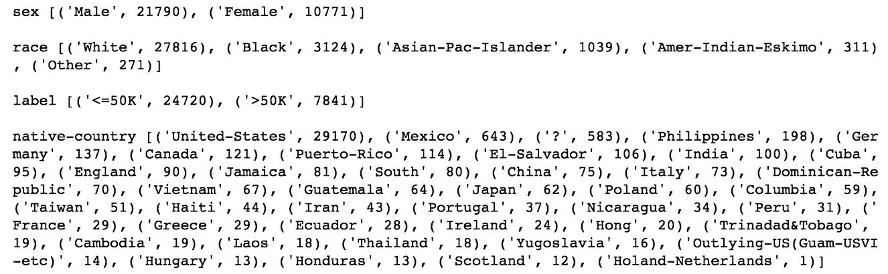

上述列表为简洁起见进行了缩写。检查（或运行代码）我们的 GitHub 存储库中的`5\. Machine Learning with MLlib.ipynb`笔记本。

正如你所看到的，我们处理的是一个不平衡的样本：它严重偏向男性，大部分是白人。此外，在 1994 年，收入超过 50000 美元的人并不多，只有大约四分之一。

# 还有更多...

你可能想要检查的另一个重要指标是数值变量之间的相关性。使用 MLlib 计算相关性非常容易：

```py
correlations = st.Statistics.corr(rdd_num)
```

`.corr(...)`操作返回一个 NumPy 数组或数组，换句话说，一个矩阵，其中每个元素都是皮尔逊（默认）或斯皮尔曼相关系数。

要打印出来，我们只需循环遍历所有元素：

```py
for i, el_i in enumerate(abs(correlations) > 0.05):
    print(cols_num[i])

    for j, el_j in enumerate(el_i):
        if el_j and j != i:
            print(
                '    '
```

```py
                , cols_num[j]
                , correlations[i][j]
            )

    print()
```

我们只打印矩阵的上三角部分，不包括对角线。使用 enumerate 允许我们打印出列名，因为相关性 NumPy 矩阵没有列出它们。这是我们得到的内容：

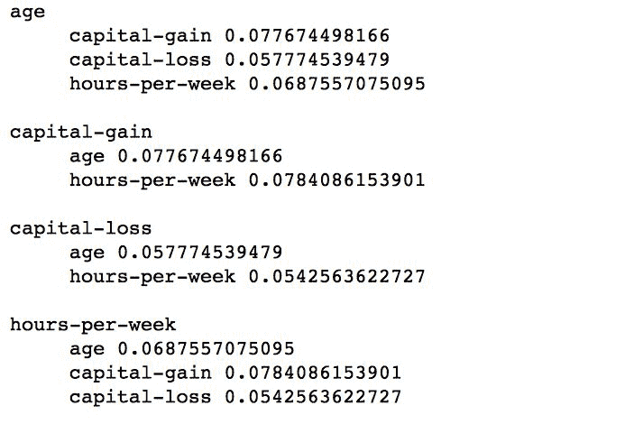

正如你所看到的，我们的数值变量之间并没有太多的相关性。这实际上是件好事，因为我们可以在我们的模型中使用它们，因为我们不会遭受太多的多重共线性。

如果你不知道什么是多重共线性，请查看这个讲座：[`onlinecourses.science.psu.edu/stat501/node/343`](https://onlinecourses.science.psu.edu/stat501/node/343)。

# 另请参阅

+   您可能还想查看伯克利大学的这个教程：[`ampcamp.berkeley.edu/big-data-mini-course/data-exploration-using-spark.html`](http://ampcamp.berkeley.edu/big-data-mini-course/data-exploration-using-spark.html)

# 测试数据

为了构建一个成功的统计或机器学习模型，我们需要遵循一个简单（但困难！）的规则：尽可能简单（这样它才能很好地概括被建模的现象），但不要太简单（这样它就失去了预测的主要能力）。这种情况的视觉示例如下（来自[`bit.ly/2GpRybB`](http://bit.ly/2GpRybB)）：

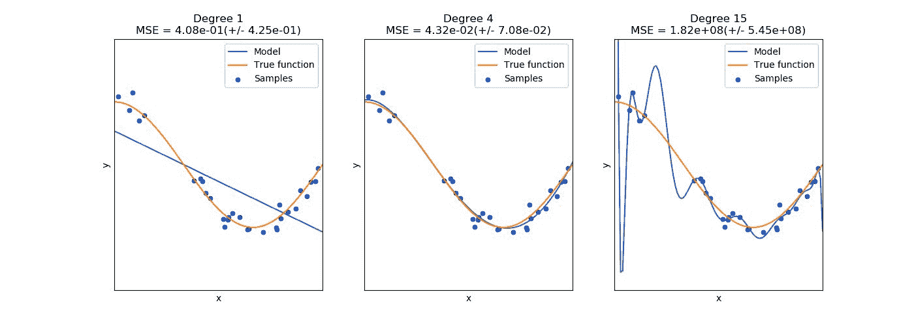

中间的图表显示了一个很好的拟合：模型线很好地跟随了真实函数。左侧图表上的模型线过分简化了现象，几乎没有预测能力（除了少数几点）——这是欠拟合的完美例子。右侧的模型线几乎完美地跟随了训练数据，但如果出现新数据，它很可能会错误地表示——这是一种称为过拟合的概念，即它不能很好地概括。从这三个图表中可以看出，模型的复杂性需要恰到好处，这样它才能很好地模拟现象。

一些机器学习模型有过度训练的倾向。例如，任何试图在输入数据和独立变量（或标签）之间找到映射（函数）的模型都有过拟合的倾向；这些模型包括参数回归模型，如线性或广义回归模型，以及最近（再次！）流行的神经网络（或深度学习模型）。另一方面，一些基于决策树的模型（如随机森林）即使是更复杂的模型也不太容易过拟合。

那么，我们如何才能得到恰到好处的模型呢？有四个经验法则：

+   明智地选择你的特征

+   不要过度训练，或选择不太容易过拟合的模型

+   用从数据集中随机选择的数据运行多个模型估计

+   调整超参数

在这个示例中，我们将专注于第一个要点，其余要点将在本章和下两章的一些示例中涵盖。

# 准备工作

要执行此示例，您需要一个可用的 Spark 环境。您可能已经完成了*加载数据*示例，其中我们将人口普查数据加载到了一个 DataFrame 中。

不需要其他先决条件。

# 如何做...

为了找到问题的最佳特征，我们首先需要了解我们正在处理的问题，因为不同的方法将用于选择回归问题或分类器中的特征：

+   **回归**：在回归中，您的目标（或地面真相）是*连续*变量（例如每周工作小时数）。您有两种方法来选择最佳特征：

+   **皮尔逊相关系数**：我们在上一个示例中已经涵盖了这个。如前所述，相关性只能在两个数值（连续）特征之间计算。

+   **方差分析（ANOVA）**：这是一个解释（或测试）观察结果分布的工具，条件是某些类别。因此，它可以用来选择连续因变量的最具歧视性（分类）特征。

+   **分类**：在分类中，您的目标（或标签）是两个（二项式）或多个（多项式）级别的离散变量。还有两种方法可以帮助选择最佳特征：

+   **线性判别分析（LDA）**：这有助于找到最能解释分类标签方差的连续特征的线性组合

+   ***χ²* 检验**：测试两个分类变量之间的独立性

目前，Spark 允许我们在可比较的变量之间测试（或选择）最佳特征；它只实现了相关性（我们之前涵盖的`pyspark.mllib.stat.Statistics.corr(...)`）和χ²检验（`pyspark.mllib.stat.Statistics.chiSqTest(...)`或`pyspark.mllib.feature.ChiSqSelector(...)`方法）。

在这个示例中，我们将使用`.chiSqTest(...)`来测试我们的标签（即指示某人是否赚取超过 5 万美元的指标）和人口普查回答者的职业之间的独立性。以下是一个为我们执行此操作的片段：

```py
import pyspark.mllib.linalg as ln

census_occupation = (
    census
    .groupby('label')
    .pivot('occupation')
    .count()
)

census_occupation_coll = (
    census_occupation
    .rdd
    .map(lambda row: (row[1:]))
    .flatMap(lambda row: row)
    .collect()
)

len_row = census_occupation.count()
dense_mat = ln.DenseMatrix(
    len_row
    , 2
    , census_occupation_coll
    , True)
chi_sq = st.Statistics.chiSqTest(dense_mat)

print(chi_sq.pValue)
```

# 它是如何工作的...

首先，我们导入 MLlib 的线性代数部分；稍后我们将使用一些矩阵表示。

接下来，我们建立一个数据透视表，其中我们按`occupation`特征进行分组，并按`label`列（`<=50K`或`>50K`）进行数据透视。每次出现都会被计算，结果如下表所示：

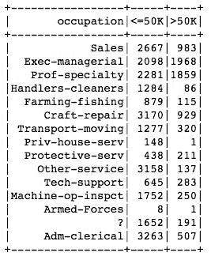

接下来，我们通过访问底层 RDD 并仅选择具有映射转换的计数来展平输出：`.map(lambda row: (row[1:]))`。`.flatMap(...)`转换创建了我们需要的所有值的长列表。我们在驱动程序上收集所有数据，以便稍后创建`DenseMatrix`。

您应该谨慎使用`.collect(...)`操作，因为它会将所有数据带到驱动程序。正如您所看到的，我们只带来了数据集的高度聚合表示。

一旦我们在驱动程序上拥有所有数字，我们就可以创建它们的矩阵表示；我们将有一个 15 行 2 列的矩阵。首先，我们通过检查`census_occupation`元素的计数来检查有多少个不同的职业值。接下来，我们调用`DenseMatrix(...)`构造函数来创建我们的矩阵。第一个参数指定行数，第二个参数指定列数。第三个参数指定数据，最后一个指示数据是否被转置。密集表示如下：

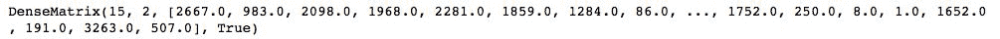

以更易读的格式（作为 NumPy 矩阵）呈现如下：

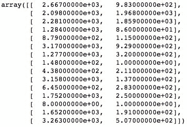

现在，我们只需调用`.chiSqTest(...)`并将我们的矩阵作为其唯一参数传递。剩下的就是检查`pValue`以及是否拒绝了`nullHypothesis`：

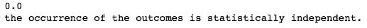

因此，正如您所看到的，`pValue`是`0.0`，因此我们可以拒绝空假设，即宣称赚取 5 万美元以上和赚取 5 万美元以下的人之间的职业分布相同。因此，我们可以得出结论，正如 Spark 告诉我们的那样，结果的发生是统计独立的，也就是说，职业应该是某人赚取 5 万美元以上的强有力指标。

# 另请参阅...

+   有许多统计测试可以帮助确定两个总体（或样本）是否相似，或者它们是否遵循某些分布。为了获得良好的概述，我们建议阅读以下文档：[`www.statstutor.ac.uk/resources/uploaded/tutorsquickguidetostatistics.pdf`](http://www.statstutor.ac.uk/resources/uploaded/tutorsquickguidetostatistics.pdf)。

# 转换数据

**机器学习**（**ML**）是一个旨在使用机器（计算机）来理解世界现象并预测其行为的研究领域。为了构建一个 ML 模型，我们所有的数据都需要是数字。由于我们几乎所有的特征都是分类的，我们需要转换我们的特征。在这个示例中，我们将学习如何使用哈希技巧和虚拟编码。

# 做好准备

要执行此示例，您需要有一个可用的 Spark 环境。您可能已经完成了*加载数据*示例，其中我们将人口普查数据加载到了 DataFrame 中。

不需要其他先决条件。

# 如何做...

我们将将数据集的维度大致减少一半，因此首先我们需要提取每列中不同值的总数：

```py
len_ftrs = []

for col in cols_cat:
    (
        len_ftrs
        .append(
            (col
             , census
                 .select(col)
                 .distinct()
                 .count()
            )
        )
    )

len_ftrs = dict(len_ftrs)
```

接下来，对于每个特征，我们将使用`.HashingTF（...）`方法来对我们的数据进行编码：

```py
import pyspark.mllib.feature as feat
```

```py
final_data = (    census
    .select(cols_to_keep)
    .rdd
    .map(lambda row: [
        list(
            feat.HashingTF(int(len_ftrs[col] / 2.0))
            .transform(row[i])
            .toArray()
        ) if i >= 5
        else [row[i]] 
        for i, col in enumerate(cols_to_keep)]
    )
)

final_data.take(3)
```

# 它是如何工作的...

首先，我们循环遍历所有的分类变量，并附加一个元组，其中包括列名（`col`）和在该列中找到的不同值的计数。后者是通过选择感兴趣的列，运行`.distinct（）`转换，并计算结果值的数量来实现的。`len_ftrs`现在是一个元组列表。通过调用`dict（...）`方法，Python 将创建一个字典，该字典将第一个元组元素作为键，第二个元素作为相应的值。生成的字典如下所示：

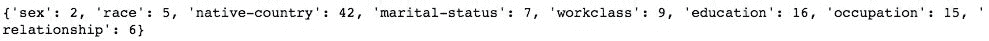

现在我们知道了每个特征中不同值的总数，我们可以使用哈希技巧。首先，我们导入 MLlib 的特征组件，因为那里有`.HashingTF（...）`。接下来，我们将 census DataFrame 子集化为我们想要保留的列。然后，我们在基础 RDD 上使用`.map（...）`转换：对于每个元素，我们枚举所有列，如果列的索引大于或等于五，我们创建一个新的`.HashingTF（...）`实例，然后用它来转换值并将其转换为 NumPy 数组。对于`.HashingTF（...）`方法，您唯一需要指定的是输出元素的数量；在我们的情况下，我们大致将不同值的数量减半，因此我们将有一些哈希碰撞，但这没关系。

供您参考，我们的`cols_to_keep`如下：

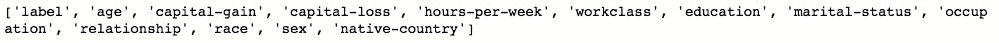

在对我们当前的数据集`final_data`进行上述操作之后，它看起来如下；请注意，格式可能看起来有点奇怪，但我们很快将准备好创建训练 RDD：

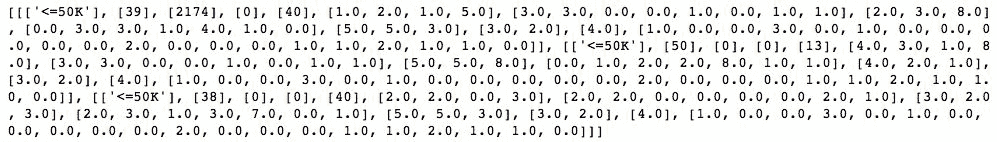

# 还有更多...

唯一剩下的就是处理我们的标签；如您所见，它仍然是一个分类变量。但是，由于它只有两个值，我们可以将其编码如下：

```py
def labelEncode(label):
    return [int(label[0] == '>50K')]

final_data = (
    final_data
    .map(lambda row: labelEncode(row[0]) 
         + [item 
            for sublist in row[1:] 
            for item in sublist]
        )
)
```

`labelEncode（...）`方法获取标签并检查它是否为`'>50k'`；如果是，我们得到一个布尔值 true，否则我们得到 false。我们可以通过简单地将布尔数据包装在 Python 的`int（...）`方法中来表示布尔数据为整数。

最后，我们再次使用`.map（...）`，在那里我们将`row`的第一个元素（标签）传递给`labelEncode（...）`方法。然后，我们循环遍历所有剩余的列表并将它们组合在一起。代码的这部分一开始可能看起来有点奇怪，但实际上很容易理解。我们循环遍历所有剩余的元素（`row[1:]`），并且由于每个元素都是一个列表（因此我们将其命名为`sublist`），我们创建另一个循环（`for item in sublist`部分）来提取单个项目。生成的 RDD 如下所示：

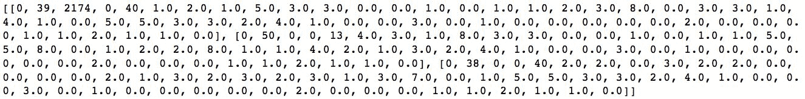

# 另请参阅...

+   查看此链接，了解如何在 Python 中处理分类特征的概述：[`pbpython.com/categorical-encoding.html`](http://pbpython.com/categorical-encoding.html)

# 数据标准化

数据标准化（或归一化）对许多原因都很重要：

+   某些算法在标准化（或归一化）数据上收敛得更快

+   如果您的输入变量在不同的尺度上，系数的可解释性可能很难或得出的结论可能是错误的

+   对于某些模型，如果不进行标准化，最优解可能是错误的

在这个操作中，我们将向您展示如何标准化数据，因此如果您的建模项目需要标准化数据，您将知道如何操作。

# 准备工作

要执行此操作，您需要拥有一个可用的 Spark 环境。您可能已经完成了之前的操作，其中我们对人口普查数据进行了编码。

不需要其他先决条件。

# 操作步骤...

MLlib 提供了一个方法来为我们完成大部分工作。尽管以下代码一开始可能会令人困惑，但我们将逐步介绍它：

```py
standardizer = feat.StandardScaler(True, True)
sModel = standardizer.fit(final_data.map(lambda row: row[1:]))
final_data_scaled = sModel.transform(final_data.map(lambda row: row[1:]))

final_data = (
    final_data
    .map(lambda row: row[0])
    .zipWithIndex()
    .map(lambda row: (row[1], row[0]))
    .join(
        final_data_scaled
        .zipWithIndex()
        .map(lambda row: (row[1], row[0]))
    )
    .map(lambda row: row[1])
)

final_data.take(1)
```

# 工作原理...

首先，我们创建`StandardScaler(...)`对象。设置为`True`的两个参数——前者代表均值，后者代表标准差——表示我们希望模型使用 Z 分数对特征进行标准化：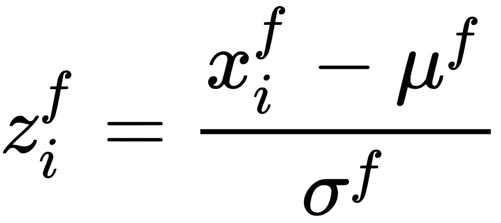，其中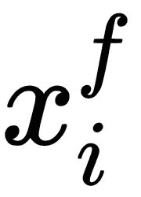是*f*特征的第*i*^(th)观察值，μ^(*f*)是*f*特征中所有观察值的均值，σ^(*f*)是*f*特征中所有观察值的标准差。

接下来，我们使用`StandardScaler(...)`对数据进行`.fit(...)`。请注意，我们不会对第一个特征进行标准化，因为它实际上是我们的标签。最后，我们对数据集进行`.transform(...)`，以获得经过缩放的特征。

然而，由于我们不对标签进行缩放，我们需要以某种方式将其带回我们的缩放数据集。因此，首先从`final_data`中提取标签（使用`.map(lamba row: row[0])`转换）。然而，我们将无法将其与`final_data_scaled`直接连接，因为没有键可以连接。请注意，我们实际上希望以逐行方式进行连接。因此，我们使用`.zipWithIndex()`方法，它会返回一个元组，第一个元素是数据，第二个元素是行号。由于我们希望根据行号进行连接，我们需要将其带到元组的第一个位置，因为这是 RDD 的`.join(...)`的工作方式；我们通过第二个`.map(...)`操作实现这一点。

在 RDD 中，`.join(...)`操作不能明确指定键；两个 RDD 都需要是两个元素的元组，其中第一个元素是键，第二个元素是数据。

一旦连接完成，我们只需使用`.map(lambda row: row[1])`转换来提取连接的数据。

现在我们的数据看起来是这样的：

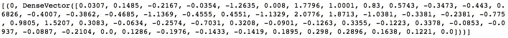

我们还可以查看`sModel`，以了解用于转换我们的数据的均值和标准差：

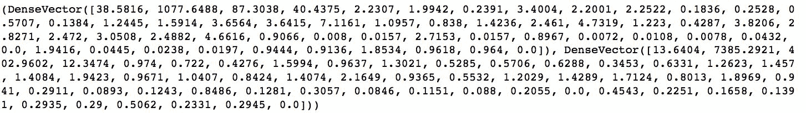

# 创建用于训练的 RDD

在我们可以训练 ML 模型之前，我们需要创建一个 RDD，其中每个元素都是一个标记点。在这个操作中，我们将使用之前操作中创建的`final_data` RDD 来准备我们的训练 RDD。

# 准备工作

要执行此操作，您需要拥有一个可用的 Spark 环境。您可能已经完成了之前的操作，当时我们对编码的人口普查数据进行了标准化。

不需要其他先决条件。

# 操作步骤...

许多 MLlib 模型需要一个标记点的 RDD 进行训练。下一个代码片段将为我们创建这样的 RDD，以构建分类和回归模型。

# 分类

以下是创建分类标记点 RDD 的片段，我们将使用它来预测某人是否赚取超过$50,000：

```py
final_data_income = (
    final_data
    .map(lambda row: reg.LabeledPoint(
        row[0]
        , row[1:]
        )
)
```

# 回归

以下是创建用于预测人们工作小时数的回归标记点 RDD 的片段：

```py
mu, std = sModel.mean[3], sModel.std[3]

final_data_hours = (
    final_data
    .map(lambda row: reg.LabeledPoint(
        row[1][3] * std + mu
        , ln.Vectors.dense([row[0]] + list(row[1][0:3]) + list(row[1][4:]))
        )
)
```

# 工作原理...

在创建 RDD 之前，我们必须导入`pyspark.mllib.regression`子模块，因为那里可以访问`LabeledPoint`类：

```py
import pyspark.mllib.regression as reg
```

接下来，我们只需循环遍历`final_data` RDD 的所有元素，并使用`.map(...)`转换为每个元素创建一个带标签的点。

`LabeledPoint(...)`的第一个参数是标签。如果您查看这两个代码片段，它们之间唯一的区别是我们认为标签和特征是什么。

作为提醒，分类问题旨在找到观察结果属于特定类别的概率；因此，标签通常是分类的，换句话说，是离散的。另一方面，回归问题旨在预测给定观察结果的值；因此，标签通常是数值的，或者连续的。

因此，在`final_data_income`的情况下，我们使用二进制指示符，表示人口普查受访者是否赚得更多（值为 1）还是更少（标签等于 0）50,000 美元，而在`final_data_hours`中，我们使用`hours-per-week`特征（请参阅*加载数据*示例），在我们的情况下，它是`final_data` RDD 的每个元素的第五部分。请注意，对于此标签，我们需要将其缩放回来，因此我们需要乘以标准差并加上均值。

我们在这里假设您正在通过`5\. Machine Learning with MLlib.ipynb`笔记本进行工作，并且已经创建了`sModel`对象。如果没有，请返回到上一个示例，并按照那里概述的步骤进行操作。

`LabeledPoint(...)`的第二个参数是所有特征的向量。您可以传递 NumPy 数组、列表、`scipy.sparse`列矩阵或`pyspark.mllib.linalg.SparseVector`或`pyspark.mllib.linalg.DenseVector`；在我们的情况下，我们使用哈希技巧对所有特征进行了编码，因此我们将特征编码为`DenseVector`。

# 还有更多...

我们可以使用完整数据集来训练我们的模型，但是我们会遇到另一个问题：我们如何评估我们的模型有多好？因此，任何数据科学家通常都会将数据拆分为两个子集：训练和测试。

请参阅此示例的*另请参阅*部分，了解为什么这通常还不够好，您实际上应该将数据拆分为训练、测试和验证数据集。

以下是两个代码片段，显示了在 PySpark 中如何轻松完成此操作：

```py
(
    final_data_income_train
    , final_data_income_test
) = (
    final_data_income.randomSplit([0.7, 0.3])
)
```

这是第二个：

```py
(
    final_data_hours_train
    , final_data_hours_test
) = (
    final_data_hours.randomSplit([0.7, 0.3])
)
```

通过简单调用 RDD 的`.randomSplit(...)`方法，我们可以快速将 RDD 分成训练和测试子集。`.randomSplit(...)`方法的唯一必需参数是一个列表，其中每个元素指定要随机选择的数据集的比例。请注意，这些比例需要加起来等于 1。

如果我们想要获取训练、测试和验证子集，我们可以传递一个包含三个元素的列表。

# 另请参阅

+   为什么应该将数据拆分为三个数据集，而不是两个，可以在这里很好地解释：[`bit.ly/2GFyvtY`](http://bit.ly/2GFyvtY)

# 预测人口普查受访者的工作小时数

在这个示例中，我们将构建一个简单的线性回归模型，旨在预测人口普查受访者每周工作的小时数。

# 准备工作

要执行此示例，您需要一个可用的 Spark 环境。您可能已经通过之前的示例创建了用于估计回归模型的训练和测试数据集。

不需要其他先决条件。

# 如何做...

使用 MLlib 训练模型非常简单。请参阅以下代码片段：

```py
workhours_model_lm = reg.LinearRegressionWithSGD.train(final_data_hours_train)
```

# 它是如何工作的...

正如您所看到的，我们首先创建`LinearRegressionWithSGD`对象，并调用其`.train(...)`方法。

对于随机梯度下降的不同派生的很好的概述，请查看这个链接：[`ruder.io/optimizing-gradient-descent/`](http://ruder.io/optimizing-gradient-descent/)。

我们传递给方法的第一个，也是唯一需要的参数是我们之前创建的带有标记点的 RDD。不过，您可以指定一系列参数：

+   迭代次数；默认值为`100`

+   步长是 SGD 中使用的参数；默认值为`1.0`

+   `miniBatchFraction`指定在每个 SGD 迭代中使用的数据比例；默认值为`1.0`

+   `initialWeights`参数允许我们将系数初始化为特定值；它没有默认值，算法将从权重等于`0.0`开始

+   正则化类型参数`regType`允许我们指定所使用的正则化类型：`'l1'`表示 L1 正则化，`'l2'`表示 L2 正则化；默认值为`None`，无正则化

+   `regParam`参数指定正则化参数；默认值为`0.0`

+   该模型也可以拟合截距，但默认情况下未设置；默认值为 false

+   在训练之前，默认情况下，模型可以验证数据

+   您还可以指定`convergenceTol`；默认值为`0.001`

现在让我们看看我们的模型预测工作小时的效果如何：

```py
small_sample_hours = sc.parallelize(final_data_hours_test.take(10))

for t,p in zip(
    small_sample_hours
        .map(lambda row: row.label)
        .collect()
    , workhours_model_lm.predict(
        small_sample_hours
            .map(lambda row: row.features)
    ).collect()):
    print(t,p)
```

首先，从我们的完整测试数据集中，我们选择 10 个观察值（这样我们可以在屏幕上打印出来）。接下来，我们从测试数据集中提取真实值，而对于预测，我们只需调用`workhours_model_lm`模型的`.predict(...)`方法，并传递`.features`向量。这是我们得到的结果：

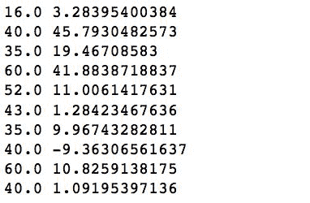

如您所见，我们的模型效果不佳，因此需要进一步改进。然而，这超出了本章和本书的范围。

# 预测人口普查受访者的收入水平

在本示例中，我们将向您展示如何使用 MLlib 解决分类问题，方法是构建两个模型：无处不在的逻辑回归和稍微复杂一些的模型，即**SVM**（**支持向量机**）。

# 准备工作

要执行此示例，您需要一个可用的 Spark 环境。您可能已经完成了*为训练创建 RDD*示例，在那里我们为估计分类模型创建了训练和测试数据集。

不需要其他先决条件。

# 如何做...

就像线性回归一样，构建逻辑回归始于创建`LogisticRegressionWithSGD`对象：

```py
import pyspark.mllib.classification as cl

income_model_lr = cl.LogisticRegressionWithSGD.train(final_data_income_train)
```

# 工作原理...

与`LinearRegressionWithSGD`模型一样，唯一需要的参数是带有标记点的 RDD。此外，您可以指定相同的一组参数：

+   迭代次数；默认值为`100`

+   步长是 SGD 中使用的参数；默认值为`1.0`

+   `miniBatchFraction`指定在每个 SGD 迭代中使用的数据比例；默认值为`1.0`

+   `initialWeights`参数允许我们将系数初始化为特定值；它没有默认值，算法将从权重等于`0.0`开始

+   正则化类型参数`regType`允许我们指定所使用的正则化类型：`l1`表示 L1 正则化，`l2`表示 L2 正则化；默认值为`None`，无正则化

+   `regParam`参数指定正则化参数；默认值为`0.0`

+   该模型也可以拟合截距，但默认情况下未设置；默认值为 false

+   在训练之前，默认情况下，模型可以验证数据

+   您还可以指定`convergenceTol`；默认值为`0.001`

在完成训练后返回的`LogisticRegressionModel(...)`对象允许我们利用该模型。通过将特征向量传递给`.predict(...)`方法，我们可以预测观察值最可能关联的类别。

任何分类模型都会产生一组概率，逻辑回归也不例外。在二元情况下，我们可以指定一个阈值，一旦突破该阈值，就会表明观察结果将被分配为等于 1 的类，而不是 0；此阈值通常设置为`0.5`。`LogisticRegressionModel(...)`默认情况下假定为`0.5`，但您可以通过调用`.setThreshold(...)`方法并传递介于 0 和 1 之间（不包括）的所需阈值值来更改它。

让我们看看我们的模型表现如何：

```py
small_sample_income = sc.parallelize(final_data_income_test.take(10))

for t,p in zip(
    small_sample_income
        .map(lambda row: row.label)
        .collect()
    , income_model_lr.predict(
        small_sample_income
            .map(lambda row: row.features)
    ).collect()):
    print(t,p)
```

与线性回归示例一样，我们首先从测试数据集中提取 10 条记录，以便我们可以在屏幕上适应它们。接下来，我们提取所需的标签，并调用`.predict(...)`类的`income_model_lr`模型。这是我们得到的结果：

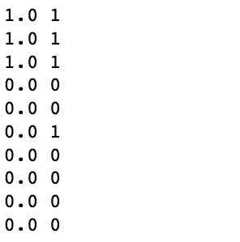

因此，在 10 条记录中，我们得到了 9 条正确的。还不错。

在*计算性能统计*配方中，我们将学习如何使用完整的测试数据集更正式地评估我们的模型。

# 还有更多...

逻辑回归通常是用于评估其他分类模型相对性能的基准，即它们是表现更好还是更差。然而，逻辑回归的缺点是它无法处理两个类无法通过一条线分开的情况。SVM 没有这种问题，因为它们的核可以以非常灵活的方式表达：

```py
income_model_svm = cl.SVMWithSGD.train(
    final_data_income
    , miniBatchFraction=1/2.0
)
```

在这个例子中，就像`LogisticRegressionWithSGD`模型一样，我们可以指定一系列参数（我们不会在这里重复它们）。但是，`miniBatchFraction`参数指示 SVM 模型在每次迭代中仅使用一半的数据；这有助于防止过拟合。

从`small_sample_income` RDD 中计算的 10 个观察结果与逻辑回归模型的计算方式相同：

```py
for t,p in zip(
    small_sample_income
        .map(lambda row: row.label)
        .collect()
    , income_model_svm.predict(
        small_sample_income
            .map(lambda row: row.features)
    ).collect()):
    print(t,p)
```

该模型产生与逻辑回归模型相同的结果，因此我们不会在这里重复它们。但是，在*计算性能统计*配方中，我们将看到它们的不同。

# 构建聚类模型

通常，很难获得有标签的数据。而且，有时您可能希望在数据集中找到潜在的模式。在这个配方中，我们将学习如何在 Spark 中构建流行的 k-means 聚类模型。

# 准备工作

要执行此配方，您需要拥有一个可用的 Spark 环境。您应该已经完成了*标准化数据*配方，其中我们对编码的人口普查数据进行了标准化。

不需要其他先决条件。

# 如何做...

就像分类或回归模型一样，在 Spark 中构建聚类模型非常简单。以下是旨在在人口普查数据中查找模式的代码：

```py
import pyspark.mllib.clustering as clu

model = clu.KMeans.train(
```

```py
    final_data.map(lambda row: row[1])
    , 2
    , initializationMode='random'
    , seed=666
)
```

# 它是如何工作的...

首先，我们需要导入 MLlib 的聚类子模块。就像以前一样，我们首先创建聚类估计器对象`KMeans`。`.train(...)`方法需要两个参数：我们要在其中找到集群的 RDD，以及我们期望的集群数。我们还选择通过指定`initializationMode`来随机初始化集群的质心；这个的默认值是`k-means||`。其他参数包括：

+   `maxIterations`指定估计应在多少次迭代后停止；默认值为`100`

+   `initializationSteps`仅在使用默认初始化模式时有用；此参数的默认值为`2`

+   `epsilon`是一个停止标准-如果所有质心的中心移动（以欧几里德距离表示）小于此值，则迭代停止；默认值为`0.0001`

+   `initialModel`允许您指定以`KMeansModel`形式先前估计的中心；默认值为`None`

# 还有更多...

一旦估计出模型，我们就可以使用它来预测聚类，并查看我们的模型实际上有多好。但是，目前，Spark 并没有提供评估聚类模型的手段。因此，我们将使用 scikit-learn 提供的度量标准：

```py
import sklearn.metrics as m

predicted = (
    model
        .predict(
            final_data.map(lambda row: row[1])
        )
)
predicted = predicted.collect()
```

```py
true = final_data.map(lambda row: row[0]).collect()

print(m.homogeneity_score(true, predicted))
print(m.completeness_score(true, predicted))
```

聚类指标位于 scikit-learn 的`.metrics`子模块中。我们使用了两个可用的指标：同质性和完整性。同质性衡量了一个簇中的所有点是否来自同一类，而完整性得分估计了对于给定的类，所有点是否最终在同一个簇中；任一得分为 1 表示一个完美的模型。

让我们看看我们得到了什么：

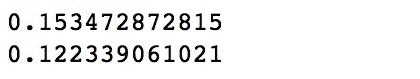

嗯，我们的聚类模型表现不佳：15%的同质性得分意味着剩下的 85%观察值被错误地聚类，我们只正确地聚类了∼12%属于同一类的所有观察值。

# 另请参阅

+   有关聚类模型评估的更多信息，您可能想查看：[`nlp.stanford.edu/IR-book/html/htmledition/evaluation-of-clustering-1.html`](https://nlp.stanford.edu/IR-book/html/htmledition/evaluation-of-clustering-1.html)

# 计算性能统计

在之前的示例中，我们已经看到了我们的分类和回归模型预测的一些值，以及它们与原始值的差距。在这个示例中，我们将学习如何完全计算这些模型的性能统计数据。

# 准备工作

为了执行这个示例，您需要有一个可用的 Spark 环境，并且您应该已经完成了本章前面介绍的*预测人口普查受访者的工作小时数*和*预测人口普查受访者的收入水平*的示例。

不需要其他先决条件。

# 如何做...

在 Spark 中获取回归和分类的性能指标非常简单：

```py
import pyspark.mllib.evaluation as ev

(...)

metrics_lm = ev.RegressionMetrics(true_pred_reg)

(...)

metrics_lr = ev.BinaryClassificationMetrics(true_pred_class_lr)
```

# 它是如何工作的...

首先，我们加载评估模块；这样做会暴露`.RegressionMetrics(...)`和`.BinaryClassificationMetrics(...)`方法，我们可以使用它们。

# 回归指标

`true_pred_reg`是一个元组的 RDD，其中第一个元素是我们线性回归模型的预测值，第二个元素是期望值（每周工作小时数）。以下是我们创建它的方法：

```py
true_pred_reg = (
    final_data_hours_test
    .map(lambda row: (
         float(workhours_model_lm.predict(row.features))
         , row.label))
)
```

`metrics_lm`对象包含各种指标：`解释方差`、`平均绝对误差`、`均方误差`、`r2`和`均方根误差`。在这里，我们只打印其中的一些：

```py
print('R²: ', metrics_lm.r2)
print('Explained Variance: ', metrics_lm.explainedVariance)
print('meanAbsoluteError: ', metrics_lm.meanAbsoluteError)
```

让我们看看线性回归模型的结果：

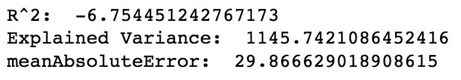

毫不意外，考虑到我们已经看到的内容，模型表现非常糟糕。不要对负的 R 平方感到太惊讶；如果模型的预测是荒谬的，R 平方可以变成负值，也就是说，R 平方的值是不合理的。

# 分类指标

我们将评估我们之前构建的两个模型；这是逻辑回归模型：

```py
true_pred_class_lr = (
    final_data_income_test
    .map(lambda row: (
        float(income_model_lr.predict(row.features))
        , row.label))
)

metrics_lr = ev.BinaryClassificationMetrics(true_pred_class_lr)

print('areaUnderPR: ', metrics_lr.areaUnderPR)
print('areaUnderROC: ', metrics_lr.areaUnderROC)
```

这是 SVM 模型：

```py
true_pred_class_svm = (
    final_data_income_test
    .map(lambda row: (
        float(income_model_svm.predict(row.features))
        , row.label))
)

metrics_svm = ev.BinaryClassificationMetrics(true_pred_class_svm)

print('areaUnderPR: ', metrics_svm.areaUnderPR)
print('areaUnderROC: ', metrics_svm.areaUnderROC)
```

两个指标——**精确率-召回率**（**PR**）曲线下的面积和**接收者操作特征**（**ROC**）曲线下的面积——允许我们比较这两个模型。

查看关于这两个指标的有趣讨论：[`stats.stackexchange.com/questions/7207/roc-vs-precision-and-recall-curves`](https://stats.stackexchange.com/questions/7207/roc-vs-precision-and-recall-curves)。

让我们看看我们得到了什么。对于逻辑回归，我们有：

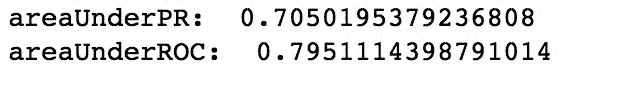

对于 SVM，我们有：

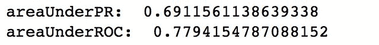

有点令人惊讶的是，SVM 的表现比逻辑回归稍差。让我们看看混淆矩阵，看看这两个模型的区别在哪里。对于逻辑回归，我们可以用以下代码实现：

```py
(
    true_pred_class_lr
    .map(lambda el: ((el), 1))
    .reduceByKey(lambda x,y: x+y)
    .take(4)
)

```

然后我们得到：

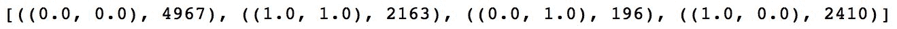

对于 SVM，代码看起来基本相同，唯一的区别是输入 RDD：

```py
(
    true_pred_class_svm
    .map(lambda el: ((el), 1))
    .reduceByKey(lambda x,y: x+y)
    .take(4)
)
```

通过上述步骤，我们得到：

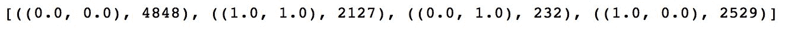

正如你所看到的，逻辑回归在预测正例和负例时更准确，因此实现了更少的误分类（假阳性和假阴性）观察。然而，差异并不是那么明显。

要计算总体错误率，我们可以使用以下代码：

```py
trainErr = (
    true_pred_class_lr
    .filter(lambda lp: lp[0] != lp[1]).count() 
    / float(true_pred_class_lr.count())
)
print("Training Error = " + str(trainErr))
```

对于 SVM，前面的代码看起来一样，唯一的区别是使用`true_pred_class_svm`而不是`true_pred_class_lr`。前面的产生了以下结果。对于逻辑回归，我们得到：

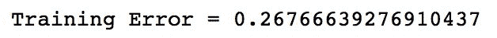

对于 SVM，结果如下：

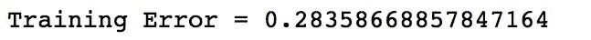

SVM 的误差略高，但仍然是一个相当合理的模型。

# 另请参阅

+   如果您想了解更多有关各种性能指标的信息，我们建议您访问以下网址：[`machinelearningmastery.com/metrics-evaluate-machine-learning-algorithms-python/`](https://machinelearningmastery.com/metrics-evaluate-machine-learning-algorithms-python/)
