# 第六章：使用 ML 模块进行机器学习

在本章中，我们将继续使用 PySpark 当前支持的机器学习模块——ML 模块。ML 模块像 MLLib 一样，暴露了大量的机器学习模型，几乎完全覆盖了最常用（和可用）的模型。然而，ML 模块是在 Spark DataFrames 上运行的，因此它的性能更高，因为它可以利用钨执行优化。

在本章中，您将学习以下教程：

+   引入变压器

+   引入估计器

+   引入管道

+   选择最可预测的特征

+   预测森林覆盖类型

+   估算森林海拔

+   聚类森林覆盖类型

+   调整超参数

+   从文本中提取特征

+   离散化连续变量

+   标准化连续变量

+   主题挖掘

在本章中，我们将使用从 [`archive.ics.uci.edu/ml/datasets/covertype`](https://archive.ics.uci.edu/ml/datasets/covertype) 下载的数据。数据集位于本书的 GitHub 仓库中：`/data/forest_coverage_type.csv`。

我们以与之前相同的方式加载数据：

```py
forest_path = '../data/forest_coverage_type.csv'

forest = spark.read.csv(
    forest_path
    , header=True
    , inferSchema=True
)
```

# 引入变压器

`Transformer` 类是在 Spark 1.3 中引入的，它通过通常将一个或多个列附加到现有的 DataFrame 来将一个数据集转换为另一个数据集。变压器是围绕实际转换特征的方法的抽象；这个抽象还包括训练好的机器学习模型（正如我们将在接下来的教程中看到的）。

在本教程中，我们将介绍两个变压器：`Bucketizer` 和 `VectorAssembler`。

我们不会介绍所有的变压器；在本章的其余部分，最有用的变压器将会出现。至于其余的，Spark 文档是学习它们的功能和如何使用它们的好地方。

以下是将一个特征转换为另一个特征的所有变压器的列表：

+   `Binarizer` 是一种方法，给定一个阈值，将连续的数值特征转换为二进制特征。

+   `Bucketizer` 与 `Binarizer` 类似，它使用一组阈值将连续数值变量转换为离散变量（级别数与阈值列表长度加一相同）。

+   `ChiSqSelector` 帮助选择解释分类目标（分类模型）方差大部分的预定义数量的特征。

+   `CountVectorizer` 将许多字符串列表转换为计数的 `SparseVector`，其中每一列都是列表中每个不同字符串的标志，值表示当前列表中找到该字符串的次数。

+   `DCT` 代表**离散余弦变换**。它接受一组实值向量，并返回以不同频率振荡的余弦函数向量。

+   `ElementwiseProduct` 可以用于缩放您的数值特征，因为它接受一个值向量，并将其（如其名称所示，逐元素）乘以另一个具有每个值权重的向量。

+   `HashingTF` 是一个哈希技巧变压器，返回一个指定长度的标记文本表示的向量。

+   `IDF` 计算记录列表的**逆文档频率**，其中每个记录都是文本主体的数值表示（请参阅 `CountVectorizer` 或 `HashingTF`）。

+   `IndexToString` 使用 `StringIndexerModel` 对象的编码将字符串索引反转为原始值。

+   `MaxAbsScaler` 将数据重新缩放为 `-1` 到 `1` 的范围内。

+   `MinMaxScaler` 将数据重新缩放为 `0` 到 `1` 的范围内。

+   `NGram` 返回一对、三元组或 *n* 个连续单词的标记文本。

+   `Normalizer` 将数据缩放为单位范数（默认为 `L2`）。

+   `OneHotEncoder` 将分类变量编码为向量表示，其中只有一个元素是热的，即等于 `1`（其他都是 `0`）。

+   `PCA` 是一种从数据中提取主成分的降维方法。

+   `PolynomialExpansion` 返回输入向量的多项式展开。

+   `QuantileDiscretizer`是类似于`Bucketizer`的方法，但不是定义阈值，而是需要指定返回的箱数；该方法将使用分位数来决定阈值。

+   `RegexTokenizer` 是一个使用正则表达式处理文本的字符串标记器。

+   `RFormula`是一种传递 R 语法公式以转换数据的方法。

+   `SQLTransformer`是一种传递 SQL 语法公式以转换数据的方法。

+   `StandardScaler` 将数值特征转换为均值为 0，标准差为 1。

+   `StopWordsRemover` 用于从标记化文本中删除诸如 `a` 或 `the` 等单词。

+   `StringIndexer`根据列中所有单词的列表生成一个索引向量。

+   `Tokenizer`是一个默认的标记器，它接受一个句子（一个字符串），在空格上分割它，并对单词进行规范化。

+   `VectorAssembler`将指定的（单独的）特征组合成一个特征。

+   `VectorIndexer`接受一个分类变量（已经编码为数字）并返回一个索引向量。

+   `VectorSlicer` 可以被认为是`VectorAssembler`的相反，因为它根据索引从特征向量中提取数据。

+   `Word2Vec`将一个句子（或字符串）转换为`{string，vector}`表示的映射。

# 准备工作

要执行此操作，您需要一个可用的 Spark 环境，并且您已经将数据加载到 forest DataFrame 中。

无需其他先决条件。

# 如何做...

```py
Horizontal_Distance_To_Hydrology column into 10 equidistant buckets:
```

```py
import pyspark.sql.functions as f
import pyspark.ml.feature as feat
import numpy as np

buckets_no = 10

dist_min_max = (
    forest.agg(
          f.min('Horizontal_Distance_To_Hydrology')
            .alias('min')
        , f.max('Horizontal_Distance_To_Hydrology')
            .alias('max')
    )
    .rdd
    .map(lambda row: (row.min, row.max))
    .collect()[0]
)

rng = dist_min_max[1] - dist_min_max[0]

splits = list(np.arange(
    dist_min_max[0]
    , dist_min_max[1]
    , rng / (buckets_no + 1)))

bucketizer = feat.Bucketizer(
    splits=splits
    , inputCol= 'Horizontal_Distance_To_Hydrology'
    , outputCol='Horizontal_Distance_To_Hydrology_Bkt'
)

(
    bucketizer
    .transform(forest)
    .select(
         'Horizontal_Distance_To_Hydrology'
        ,'Horizontal_Distance_To_Hydrology_Bkt'
    ).show(5)
)
```

有没有想法为什么我们不能使用`.QuantileDiscretizer(...)`来实现这一点？

# 它是如何工作的...

与往常一样，我们首先加载我们将在整个过程中使用的必要模块，`pyspark.sql.functions`，它将允许我们计算`Horizontal_Distance_To_Hydrology`特征的最小值和最大值。`pyspark.ml.feature`为我们提供了`.Bucketizer(...)`转换器供我们使用，而 NumPy 将帮助我们创建一个等间距的阈值列表。

我们想要将我们的数值变量分成 10 个桶，因此我们的`buckets_no`等于`10`。接下来，我们计算`Horizontal_Distance_To_Hydrology`特征的最小值和最大值，并将这两个值返回给驱动程序。在驱动程序上，我们创建阈值列表（`splits`列表）；`np.arange(...)`方法的第一个参数是最小值，第二个参数是最大值，第三个参数定义了每个步长的大小。

现在我们已经定义了拆分列表，我们将其传递给`.Bucketizer(...)`方法。

每个转换器（估计器的工作方式类似）都有一个非常相似的 API，但始终需要两个参数：`inputCol`和`outputCol`，它们分别定义要消耗的输入列和它们的输出列。这两个类——`Transformer`和`Estimator`——也普遍实现了`.getOutputCol()`方法，该方法返回输出列的名称。

最后，我们使用`bucketizer`对象来转换我们的 DataFrame。这是我们期望看到的：

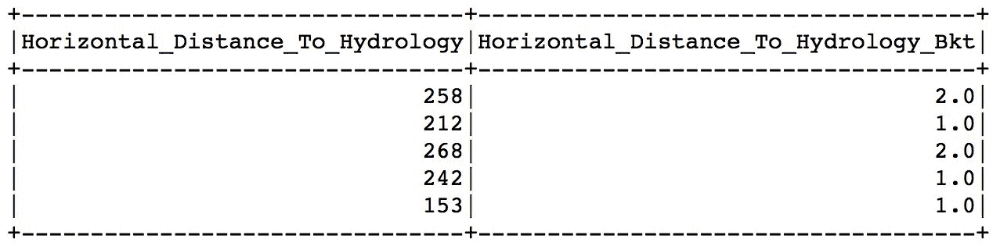

# 还有更多...

几乎所有在 ML 模块中找到的估计器（或者换句话说，ML 模型）都期望看到一个*单一*列作为输入；该列应包含数据科学家希望这样一个模型使用的所有特征。正如其名称所示，`.VectorAssembler(...)`方法将多个特征汇总到一个单独的列中。

考虑以下示例：

```py
vectorAssembler = (
    feat.VectorAssembler(
        inputCols=forest.columns, 
        outputCol='feat'
    )
)

pca = (
    feat.PCA(
        k=5
        , inputCol=vectorAssembler.getOutputCol()
        , outputCol='pca_feat'
    )
)

(
    pca
    .fit(vectorAssembler.transform(forest))
    .transform(vectorAssembler.transform(forest))
    .select('feat','pca_feat')
    .take(1)
)
```

首先，我们使用`.VectorAssembler(...)`方法从我们的`forest` DataFrame 中汇总所有列。

请注意，与其他转换器不同，`.VectorAssembler(...)`方法具有`inputCols`参数，而不是`inputCol`，因为它接受一个列的列表，而不仅仅是一个单独的列。

然后，我们在`PCA(...)`方法中使用`feat`列（现在是所有特征的`SparseVector`）来提取前五个最重要的主成分。

注意我们现在如何可以使用`.getOutputCol()`方法来获取输出列的名称？当我们介绍管道时，为什么这样做会变得更明显？

上述代码的输出应该看起来像这样：

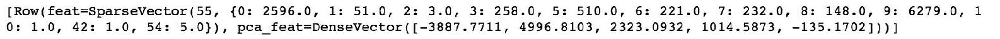

# 另请参阅

+   有关变换器（以及更多内容）的示例，请查看此博文：[`blog.insightdatascience.com/spark-pipelines-elegant-yet-powerful-7be93afcdd42`](https://blog.insightdatascience.com/spark-pipelines-elegant-yet-powerful-7be93afcdd42)

# 介绍 Estimators

`Estimator`类，就像`Transformer`类一样，是在 Spark 1.3 中引入的。Estimators，顾名思义，用于估计模型的参数，或者换句话说，将模型拟合到数据。

在本文中，我们将介绍两个模型：作为分类模型的线性 SVM，以及预测森林海拔的线性回归模型。

以下是 ML 模块中所有 Estimators 或机器学习模型的列表：

+   分类：

+   `LinearSVC` 是用于线性可分问题的 SVM 模型。SVM 的核心具有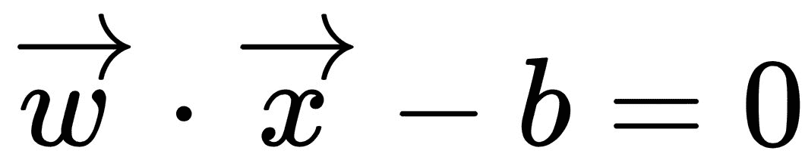形式（超平面），其中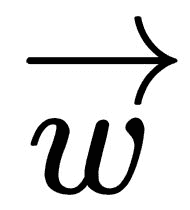是系数（或超平面的法向量），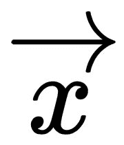是记录，*b*是偏移量。

+   `LogisticRegression` 是线性可分问题的默认*go-to*分类模型。它使用 logit 函数来计算记录属于特定类的概率。

+   `DecisionTreeClassifier` 是用于分类目的的基于决策树的模型。它构建一个二叉树，其中终端节点中类别的比例确定了类的成员资格。

+   `GBTClassifier` 是集成模型组中的一员。**梯度提升树**（**GBT**）构建了几个弱模型，当组合在一起时形成一个强分类器。该模型也可以应用于解决回归问题。

+   `RandomForestClassifier` 也是集成模型组中的一员。与 GBT 不同，随机森林完全生长决策树，并通过减少方差来实现总误差减少（而 GBT 减少偏差）。就像 GBT 一样，这些模型也可以用来解决回归问题。

+   `NaiveBayes` 使用贝叶斯条件概率理论，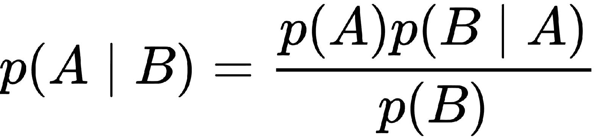，根据关于概率和可能性的证据和先验假设对观察结果进行分类。

+   `MultilayerPerceptronClassifier` 源自人工智能领域，更狭义地说是人工神经网络。该模型由模拟（在某种程度上）大脑的基本构建模块的人工神经元组成的有向图。

+   `OneVsRest` 是一种在多项式场景中只选择一个类的缩减技术。

+   回归：

+   `AFTSurvivalRegression` 是一种参数模型，用于预测寿命，并假设特征之一的边际效应加速或减缓过程失败。

+   `DecisionTreeRegressor`，`DecisionTreeClassifier`的对应物，适用于回归问题。

+   `GBTRegressor`，`GBTClassifier`的对应物，适用于回归问题。

+   `GeneralizedLinearRegression` 是一类允许我们指定不同核函数（或链接函数）的线性模型。与假设误差项正态分布的线性回归不同，**广义线性模型**（**GLM**）允许模型具有其他误差项分布。

+   `IsotonicRegression` 将自由形式和非递减线拟合到数据。

+   `LinearRegression` 是回归模型的基准。它通过数据拟合一条直线（或用线性术语定义的平面）。

+   `RandomForestRegressor`，`RandomForestClassifier`的对应物，适用于回归问题。

+   聚类：

+   `BisectingKMeans` 是一个模型，它从一个单一聚类开始，然后迭代地将数据分成*k*个聚类。

+   `Kmeans` 通过迭代找到聚类的质心，通过移动聚类边界来最小化数据点与聚类质心之间的距离总和，将数据分成*k*（定义）个聚类。

+   `GaussianMixture` 使用*k*个高斯分布将数据集分解成聚类。

+   `LDA`：**潜在狄利克雷分配**是主题挖掘中经常使用的模型。它是一个统计模型，利用一些未观察到的（或未命名的）组来对观察结果进行聚类。例如，一个`PLANE_linked`集群可以包括诸如 engine、flaps 或 wings 等词语。

# 准备工作

执行此配方，您需要一个可用的 Spark 环境，并且您已经将数据加载到`forest` DataFrame 中。

不需要其他先决条件。

# 如何做...

首先，让我们学习如何构建一个 SVM 模型：

```py
import pyspark.ml.classification as cl

vectorAssembler = feat.VectorAssembler(
    inputCols=forest.columns[0:-1]
    , outputCol='features')

fir_dataset = (
    vectorAssembler
    .transform(forest)
    .withColumn(
        'label'
        , (f.col('CoverType') == 1).cast('integer'))
    .select('label', 'features')
)

svc_obj = cl.LinearSVC(maxIter=10, regParam=0.01)
svc_model = svc_obj.fit(fir_dataset)
```

# 它是如何工作的...

`.LinearSVC(...)`方法来自`pyspark.ml.classification`，因此我们首先加载它。

接下来，我们使用`.VectorAssembler(...)`从`forest` DataFrame 中获取所有列，但最后一列（`CoverType`）将用作标签。我们将预测等于`1`的森林覆盖类型，也就是说，森林是否是云杉冷杉类型；我们通过检查`CoverType`是否等于`1`并将结果布尔值转换为整数来实现这一点。最后，我们只选择`label`和`features`。

接下来，我们创建`LinearSVC`对象。我们将最大迭代次数设置为 10，并将正则化参数（L2 类型或岭）设置为 1%。

如果您对机器学习中的正则化不熟悉，请查看此网站：[`enhancedatascience.com/2017/07/04/machine-learning-explained-regularization/`](http://enhancedatascience.com/2017/07/04/machine-learning-explained-regularization/)。

其他参数包括：

+   `featuresCol`：默认情况下设置为特征列的名称为`features`（就像在我们的数据集中一样）

+   `labelCol`：如果有其他名称而不是`label`，则设置为标签列的名称

+   `predictionCol`：如果要将其重命名为除`prediction`之外的其他内容，则设置为预测列的名称

+   `tol`：这是一个停止参数，它定义了成本函数在迭代之间的最小变化：如果变化（默认情况下）小于 10^(-6)，算法将假定它已经收敛

+   `rawPredictionCol`：这返回生成函数的原始值（在应用阈值之前）；您可以指定一个不同的名称而不是`rawPrediction`

+   `fitIntercept`：这指示模型拟合截距（常数），而不仅仅是模型系数；默认设置为`True`

+   `standardization`：默认设置为`True`，它在拟合模型之前对特征进行标准化

+   `threshold`：默认设置为`0.0`；这是一个决定什么被分类为`1`或`0`的参数

+   `weightCol`：如果每个观察结果的权重不同，则这是一个列名

+   `aggregationDepth`：这是用于聚合的树深度参数

最后，我们使用对象`.fit(...)`数据集；对象返回一个`.LinearSVCModel(...)`。一旦模型被估计，我们可以这样提取估计模型的系数：`svc_model.coefficients`。这是我们得到的：

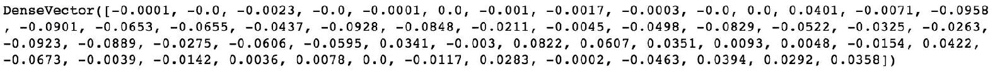

# 还有更多...

现在，让我们看看线性回归模型是否可以合理准确地估计森林海拔：

```py
import pyspark.ml.regression as rg

vectorAssembler = feat.VectorAssembler(
    inputCols=forest.columns[1:]
    , outputCol='features')

elevation_dataset = (
    vectorAssembler
    .transform(forest)
    .withColumn(
        'label'
        , f.col('Elevation').cast('float'))
    .select('label', 'features')
)

lr_obj = rg.LinearRegression(
    maxIter=10
    , regParam=0.01
    , elasticNetParam=1.00)
lr_model = lr_obj.fit(elevation_dataset)
```

上述代码与之前介绍的代码非常相似。顺便说一句，这对于几乎所有的 ML 模块模型都是正确的，因此测试各种模型非常简单。

区别在于`label`列-现在，我们使用`Elevation`并将其转换为`float`（因为这是一个回归问题）。

同样，线性回归对象`lr_obj`实例化了`.LinearRegression(...)`对象。

有关`.LinearRegression(...)`的完整参数列表，请参阅文档：[`bit.ly/2J9OvEJ`](http://bit.ly/2J9OvEJ)。

一旦模型被估计，我们可以通过调用`lr_model.coefficients`来检查其系数。这是我们得到的：

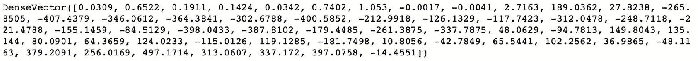

此外，`.LinearRegressionModel(...)`计算一个返回基本性能统计信息的摘要：

```py
summary = lr_model.summary

print(
    summary.r2
    , summary.rootMeanSquaredError
    , summary.meanAbsoluteError
)
```

上述代码将产生以下结果：

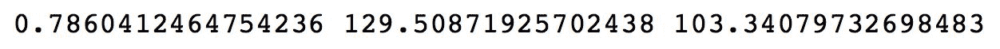

令人惊讶的是，线性回归在这个应用中表现不错：78%的 R 平方并不是一个坏结果。

# 介绍管道

`Pipeline`类有助于对导致估计模型的单独块的执行进行排序或简化；它将多个 Transformer 和 Estimator 链接在一起，形成一个顺序执行的工作流程。

管道很有用，因为它们避免了在整体数据转换和模型估计过程中通过不同部分推送数据时显式创建多个转换数据集。相反，管道通过自动化数据流程来抽象不同的中间阶段。这使得代码更易读和可维护，因为它创建了系统的更高抽象，并有助于代码调试。

在这个操作步骤中，我们将简化广义线性回归模型的执行。

# 准备工作

要执行此操作步骤，您需要一个可用的 Spark 环境，并且您已经将数据加载到`forest` DataFrame 中。

不需要其他先决条件。

# 操作步骤...

以下代码提供了通过 GLM 估计线性回归模型的执行的简化版本：

```py
from pyspark.ml import Pipeline

vectorAssembler = feat.VectorAssembler(
    inputCols=forest.columns[1:]
    , outputCol='features')

lr_obj = rg.GeneralizedLinearRegression(
    labelCol='Elevation'
    , maxIter=10
    , regParam=0.01
    , link='identity'
    , linkPredictionCol="p"
)

pip = Pipeline(stages=[vectorAssembler, lr_obj])

(
    pip
    .fit(forest)
    .transform(forest)
    .select('Elevation', 'prediction')
    .show(5)
)
```

# 工作原理...

整个代码比我们在上一个示例中使用的代码要短得多，因为我们不需要做以下工作：

```py
elevation_dataset = (
    vectorAssembler
    .transform(forest)
    .withColumn(
        'label'
        , f.col('Elevation').cast('float'))
    .select('label', 'features')
)
```

然而，与之前一样，我们指定了`vectorAssembler`和`lr_obj`（`.GeneralizedLinearRegression（...）`对象）。`.GeneralizedLinearRegression（...）`允许我们不仅指定模型的 family，还可以指定 link 函数。为了决定选择什么样的 link 函数和 family，我们可以查看我们的`Elevation`列的分布：

```py
import matplotlib.pyplot as plt

transformed_df = forest.select('Elevation')
transformed_df.toPandas().hist()

plt.savefig('Elevation_histogram.png')

plt.close('all')
```

这是运行上述代码后得到的图表：

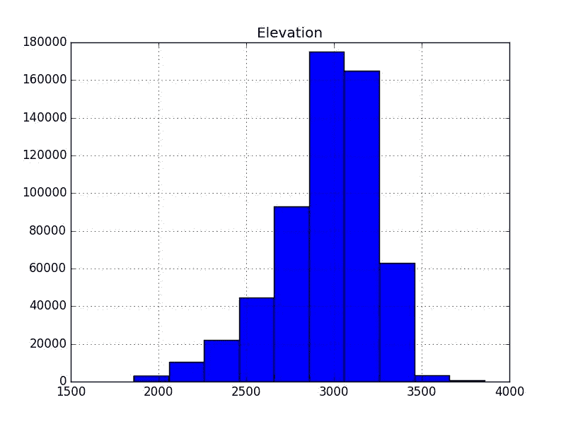

分布有点偏斜，但在一定程度上，我们可以假设它遵循正态分布。因此，我们可以使用`family = 'gaussian'`（默认）和`link = 'identity'`。

创建了 Transformer（`vectorAssembler`）和 Estimator（`lr_obj`）之后，我们将它们放入管道中。`stages`参数是一个有序列表，用于将数据推送到我们的数据中；在我们的情况下，`vectorAssembler`首先进行，因为我们需要整理所有的特征，然后我们使用`lr_obj`估计我们的模型。

最后，我们使用管道同时估计模型。管道的`.fit（...）`方法调用`.transform（...）`方法（如果对象是 Transformer），或者`.fit（...）`方法（如果对象是 Estimator）。因此，在`PipelineModel`上调用`.transform（...）`方法会调用 Transformer 和 Estimator 对象的`.transform（...）`方法。

最终结果如下：

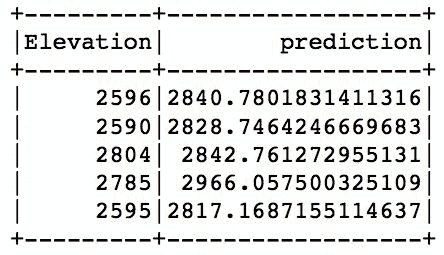

正如你所看到的，结果与实际结果并没有太大不同。

# 另请参阅

+   查看此博文（尽管它是特定于 Scala 的）以获取有关管道的概述：[`databricks.com/blog/2015/01/07/ml-pipelines-a-new-high-level-api-for-mllib.html`](https://databricks.com/blog/2015/01/07/ml-pipelines-a-new-high-level-api-for-mllib.html)

# 选择最可预测的特征

（几乎）每个数据科学家的口头禅是：构建一个简单的模型，同时尽可能解释目标中的方差。换句话说，您可以使用所有特征构建模型，但模型可能非常复杂且容易过拟合。而且，如果其中一个变量缺失，整个模型可能会产生错误的输出，有些变量可能根本不必要，因为其他变量已经解释了相同部分的方差（称为*共线性*）。

在这个操作步骤中，我们将学习如何在构建分类或回归模型时选择最佳的预测模型。我们将在接下来的操作步骤中重复使用本操作步骤中学到的内容。

# 准备工作

要执行此操作，您需要一个可用的 Spark 环境，并且您已经将数据加载到`forest` DataFrame 中。

不需要其他先决条件。

# 如何做...

让我们从一段代码开始，这段代码将帮助选择具有最强预测能力的前 10 个特征，以找到`forest` DataFrame 中观察结果的最佳类别：

```py
vectorAssembler = feat.VectorAssembler(
    inputCols=forest.columns[0:-1]
    , outputCol='features'
)

selector = feat.ChiSqSelector(
    labelCol='CoverType'
    , numTopFeatures=10
    , outputCol='selected')

pipeline_sel = Pipeline(stages=[vectorAssembler, selector])
```

# 它是如何工作的...

首先，我们使用`.VectorAssembler(...)`方法将所有特征组装成一个单一向量。请注意，我们不使用最后一列，因为它是`CoverType`特征，这是我们的目标。

接下来，我们使用`.ChiSqSelector(...)`方法基于每个变量与目标之间的成对卡方检验来选择最佳特征。根据测试的值，选择`numTopFeatures`个最可预测的特征。`selected`向量将包含前 10 个（在这种情况下）最可预测的特征。`labelCol`指定目标列。

你可以在这里了解更多关于卡方检验的信息：[`learntech.uwe.ac.uk/da/Default.aspx?pageid=1440`](http://learntech.uwe.ac.uk/da/Default.aspx?pageid=1440)。

让我们来看看：

```py
(
    pipeline_sel
    .fit(forest)
    .transform(forest)
    .select(selector.getOutputCol())
    .show(5)
)
```

从运行前面的代码段中，你应该看到以下内容：

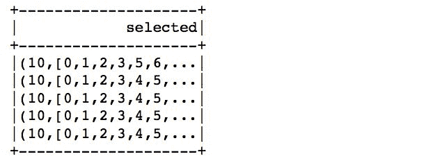

正如你所看到的，生成的`SparseVector`长度为 10，只包括最可预测的特征。

# 还有更多...

我们不能使用`.ChiSqSelector(...)`方法来选择连续的目标特征，也就是回归问题。选择最佳特征的一种方法是检查每个特征与目标之间的相关性，并选择那些与目标高度相关但与其他特征几乎没有相关性的特征：

```py
import pyspark.ml.stat as st

features_and_label = feat.VectorAssembler(
    inputCols=forest.columns
    , outputCol='features'
)

corr = st.Correlation.corr(
    features_and_label.transform(forest), 
    'features', 
    'pearson'
)

print(str(corr.collect()[0][0]))
```

在 Spark 中没有自动执行此操作的方法，但是从 Spark 2.2 开始，我们现在可以计算数据框中特征之间的相关性。

`.Correlation(...)`方法是`pyspark.ml.stat`模块的一部分，所以我们首先导入它。

接下来，我们创建`.VectorAssembler(...)`，它汇总`forest` DataFrame 的所有列。现在我们可以使用 Transformer，并将结果 DataFrame 传递给`Correlation`类。`Correlation`类的`.corr(...)`方法接受 DataFrame 作为其第一个参数，具有所有特征的列的名称作为第二个参数，要计算的相关性类型作为第三个参数；可用的值是`pearson`（默认值）和`spearman`。

查看这个网站，了解更多关于这两种相关性方法的信息：[`bit.ly/2xm49s7`](http://bit.ly/2xm49s7)。

从运行该方法中，我们期望看到的内容如下：

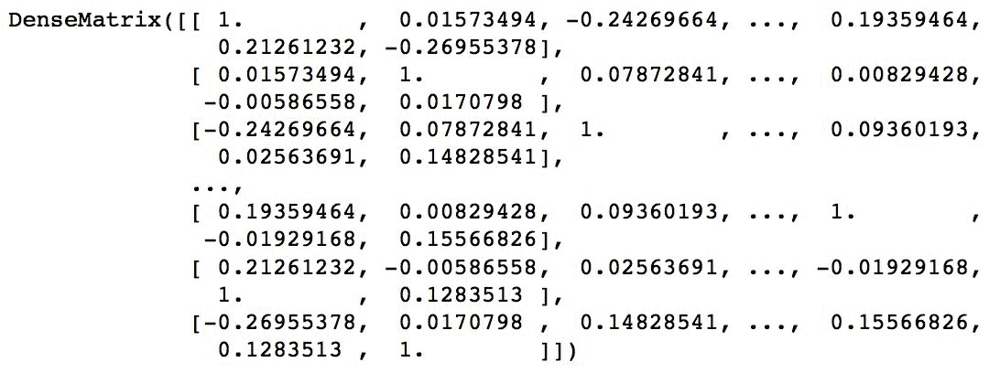

现在我们有了相关矩阵，我们可以提取与我们的标签最相关的前 10 个特征：

```py
num_of_features = 10
cols = dict([
    (i, e) 
    for i, e 
    in enumerate(forest.columns)
])

corr_matrix = corr.collect()[0][0]
label_corr_with_idx = [
    (i[0], e) 
    for i, e 
    in np.ndenumerate(corr_matrix.toArray()[:,0])
][1:]

label_corr_with_idx_sorted = sorted(
    label_corr_with_idx
    , key=lambda el: -abs(el[1])
)

features_selected = np.array([
    cols[el[0]] 
    for el 
    in label_corr_with_idx_sorted
])[0:num_of_features]
```

首先，我们指定要提取的特征数量，并创建一个包含`forest` DataFrame 的所有列的字典；请注意，我们将其与索引一起压缩，因为相关矩阵不会传播特征名称，只传播索引。

接下来，我们从`corr_matrix`中提取第一列（因为这是我们的目标，即 Elevation 特征）；`.toArray()`方法将 DenseMatrix 转换为 NumPy 数组表示。请注意，我们还将索引附加到此数组的元素，以便我们知道哪个元素与我们的目标最相关。

接下来，我们按相关系数的绝对值降序排序列表。

最后，我们循环遍历结果列表的前 10 个元素（在这种情况下），并从`cols`字典中选择与所选索引对应的列。

对于我们旨在估计森林海拔的问题，这是我们得到的特征列表：

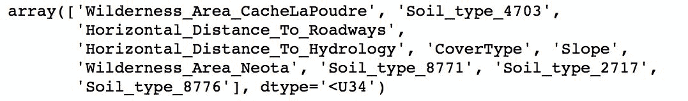

# 另请参阅

+   如果你想了解更多关于特征选择的信息，可以查看这篇论文：[`www.stat.wisc.edu/~loh/treeprogs/guide/lchen.pdf`](http://www.stat.wisc.edu/~loh/treeprogs/guide/lchen.pdf)

# 预测森林覆盖类型

在本示例中，我们将学习如何处理数据并构建两个旨在预测森林覆盖类型的分类模型：基准逻辑回归模型和随机森林分类器。我们手头的问题是*多项式*，也就是说，我们有超过两个类别，我们希望将我们的观察结果分类到其中。

# 准备工作

要执行此示例，您需要一个可用的 Spark 环境，并且您已经将数据加载到`forest` DataFrame 中。

不需要其他先决条件。

# 如何做...

这是帮助我们构建逻辑回归模型的代码：

```py
forest_train, forest_test = (
    forest
    .randomSplit([0.7, 0.3], seed=666)
)

vectorAssembler = feat.VectorAssembler(
    inputCols=forest.columns[0:-1]
    , outputCol='features'
)

selector = feat.ChiSqSelector(
    labelCol='CoverType'
    , numTopFeatures=10
    , outputCol='selected'
)

logReg_obj = cl.LogisticRegression(
    labelCol='CoverType'
    , featuresCol=selector.getOutputCol()
    , regParam=0.01
    , elasticNetParam=1.0
    , family='multinomial'
)

pipeline = Pipeline(
    stages=[
        vectorAssembler
        , selector
        , logReg_obj
    ])

pModel = pipeline.fit(forest_train)
```

# 它是如何工作的...

首先，我们将数据分成两个子集：第一个`forest_train`，我们将用于训练模型，而`forest_test`将用于测试模型的性能。

接下来，我们构建了本章前面已经看到的通常阶段：我们使用`.VectorAssembler（...）`整理我们要用来构建模型的所有特征，然后通过`.ChiSqSelector（...）`方法选择前 10 个最具预测性的特征。

在构建 Pipeline 之前的最后一步，我们创建了`logReg_obj`：我们将用它来拟合我们的数据的`.LogisticRegression（...）`对象。在这个模型中，我们使用弹性网络类型的正则化：`regParam`参数中定义了 L2 部分，`elasticNetParam`中定义了 L1 部分。请注意，我们指定模型的 family 为`multinomial`，因为我们正在处理多项式分类问题。

如果要模型自动选择，或者如果您有一个二进制变量，还可以指定`family`参数为`auto`或`binomial`。

最后，我们构建了 Pipeline，并将这三个对象作为阶段列表传递。接下来，我们使用`.fit（...）`方法将我们的数据通过管道传递。

现在我们已经估计了模型，我们可以检查它的性能如何：

```py
import pyspark.ml.evaluation as ev

results_logReg = (
    pModel
    .transform(forest_test)
    .select('CoverType', 'probability', 'prediction')
)

evaluator = ev.MulticlassClassificationEvaluator(
    predictionCol='prediction'
    , labelCol='CoverType')

(
    evaluator.evaluate(results_logReg)
    , evaluator.evaluate(
        results_logReg
        , {evaluator.metricName: 'weightedPrecision'}
    ) 
    , evaluator.evaluate(
        results_logReg
        , {evaluator.metricName: 'accuracy'}
    )
)
```

首先，我们加载`pyspark.ml.evaluation`模块，因为它包含了我们将在本章其余部分中使用的所有评估方法。

接下来，我们将`forest_test`通过我们的`pModel`，以便我们可以获得模型以前从未见过的数据集的预测。

最后，我们创建了`MulticlassClassificationEvaluator（...）`对象，它将计算我们模型的性能指标。`predictionCol`指定包含观察的预测类的列的名称，`labelCol`指定真实标签。

如果评估器的`.evaluate（...）`方法没有传递其他参数，而只返回模型的结果，则将返回 F1 分数。如果要检索精确度、召回率或准确度，则需要分别调用`weightedPrecision`、`weightedRecall`或`accuracy`。

如果您对分类指标不熟悉，可以在此处找到很好的解释：[`turi.com/learn/userguide/evaluation/classification.html`](https://turi.com/learn/userguide/evaluation/classification.html)。

这是我们的逻辑回归模型的表现：

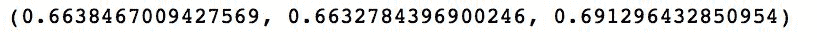

几乎 70%的准确率表明这不是一个非常糟糕的模型。

# 还有更多...

让我们看看随机森林模型是否能做得更好：

```py
rf_obj = cl.RandomForestClassifier(
    labelCol='CoverType'
    , featuresCol=selector.getOutputCol()
    , minInstancesPerNode=10
    , numTrees=10
)

pipeline = Pipeline(
    stages=[vectorAssembler, selector, rf_obj]
)

pModel = pipeline.fit(forest_train)
```

从前面的代码中可以看出，我们将重用我们已经为逻辑回归模型创建的大多数对象；我们在这里引入的是`.RandomForestClassifier（...）`，我们可以重用`vectorAssembler`和`selector`对象。这是与管道一起工作的简单示例之一。

`.RandomForestClassifier（...）`对象将为我们构建随机森林模型。在此示例中，我们仅指定了四个参数，其中大多数您可能已经熟悉，例如`labelCol`和`featuresCol`。`minInstancesPerNode`指定允许将节点拆分为两个子节点的最小记录数，而`numTrees`指定要估计的森林中的树木数量。其他值得注意的参数包括：

+   `impurity`: 指定用于信息增益的标准。默认情况下，它设置为 `gini`，但也可以是 `entropy`。

+   `maxDepth`: 指定任何树的最大深度。

+   `maxBins`: 指定任何树中的最大箱数。

+   `minInfoGain`: 指定迭代之间的最小信息增益水平。

有关该类的完整规范，请参阅 [`bit.ly/2sgQAFa`](http://bit.ly/2sgQAFa)。

估计了模型后，让我们看看它的表现，以便与逻辑回归进行比较：

```py
results_rf = (
    pModel
    .transform(forest_test)
    .select('CoverType', 'probability', 'prediction')
)

(
    evaluator.evaluate(results_rf)
    , evaluator.evaluate(
        results_rf
        , {evaluator.metricName: 'weightedPrecision'}
    )
    , evaluator.evaluate(
        results_rf
        , {evaluator.metricName: 'accuracy'}
    )
)
```

上述代码应该产生类似以下的结果：

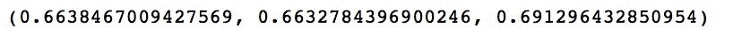

结果完全相同，表明两个模型表现一样好，我们可能希望在选择阶段增加所选特征的数量，以潜在地获得更好的结果。

# 估计森林海拔

在这个示例中，我们将构建两个回归模型，用于预测森林海拔：随机森林回归模型和梯度提升树回归器。

# 准备工作

要执行此示例，您需要一个可用的 Spark 环境，并且您已经将数据加载到 `forest` DataFrame 中。

不需要其他先决条件。

# 如何做...

在这个示例中，我们将只构建一个两阶段的管道，使用 `.VectorAssembler(...)` 和 `.RandomForestRegressor(...)` 阶段。我们将跳过特征选择阶段，因为目前这不是一个自动化的过程。

您可以手动执行此操作。只需在本章中稍早的 *选择最可预测的特征* 示例中检查。

以下是完整的代码：

```py
vectorAssembler = feat.VectorAssembler(
    inputCols=forest.columns[1:]
    , outputCol='features')

rf_obj = rg.RandomForestRegressor(
    labelCol='Elevation'
    , maxDepth=10
    , minInstancesPerNode=10
    , minInfoGain=0.1
    , numTrees=10
)

pip = Pipeline(stages=[vectorAssembler, rf_obj])
```

# 工作原理...

首先，像往常一样，我们使用 `.VectorAssembler(...)` 方法收集我们想要在模型中使用的所有特征。请注意，我们只使用从第二列开始的列，因为第一列是我们的目标——海拔特征。

接下来，我们指定 `.RandomForestRegressor(...)` 对象。该对象使用的参数列表几乎与 `.RandomForestClassifier(...)` 相同。

查看上一个示例，了解其他显著参数的列表。

最后一步是构建管道对象；`pip` 只有两个阶段：`vectorAssembler` 和 `rf_obj`。

接下来，让我们看看我们的模型与我们在 *介绍估计器* 示例中估计的线性回归模型相比表现如何：

```py
results = (
    pip
    .fit(forest)
    .transform(forest)
    .select('Elevation', 'prediction')
)

evaluator = ev.RegressionEvaluator(labelCol='Elevation')
evaluator.evaluate(results, {evaluator.metricName: 'r2'})
```

`.RegressionEvaluator(...)` 计算回归模型的性能指标。默认情况下，它返回 `rmse`，即均方根误差，但也可以返回：

+   `mse`: 这是均方误差

+   `r2`: 这是 *R²* 指标

+   `mae`: 这是平均绝对误差

从上述代码中，我们得到：

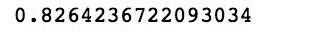

这比我们之前构建的线性回归模型要好，这意味着我们的模型可能不像我们最初认为的那样线性可分。

查看此网站，了解有关不同类型回归指标的更多信息：[`bit.ly/2sgpONr`](http://bit.ly/2sgpONr)。

# 还有更多...

让我们看看梯度提升树模型是否能击败先前的结果：

```py
gbt_obj = rg.GBTRegressor(
    labelCol='Elevation'
    , minInstancesPerNode=10
    , minInfoGain=0.1
)

pip = Pipeline(stages=[vectorAssembler, gbt_obj])
```

与随机森林回归器相比唯一的变化是，我们现在使用 `.GBTRegressor(...)` 类来将梯度提升树模型拟合到我们的数据中。这个类的最显著参数包括：

+   `maxDepth`: 指定构建树的最大深度，默认设置为 `5`

+   `maxBins`: 指定最大箱数

+   `minInfoGain`: 指定迭代之间的最小信息增益水平

+   `minInstancesPerNode`: 当树仍然执行分裂时，指定实例的最小数量

+   `lossType`: 指定损失类型，并接受 `squared` 或 `absolute` 值

+   `impurity`: 默认设置为 `variance`，目前（在 Spark 2.3 中）是唯一允许的选项

+   `maxIter`: 指定最大迭代次数——算法的停止准则

现在让我们检查性能：

```py
results = (
    pip
    .fit(forest)
    .transform(forest)
    .select('Elevation', 'prediction')
)

evaluator = ev.RegressionEvaluator(labelCol='Elevation')
evaluator.evaluate(results, {evaluator.metricName: 'r2'})
```

以下是我们得到的结果：

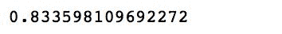

如您所见，即使我们略微改进了随机森林回归器。

# 聚类森林覆盖类型

聚类是一种无监督的方法，试图在没有任何类别指示的情况下找到数据中的模式。换句话说，聚类方法找到记录之间的共同点，并根据它们彼此的相似程度以及与其他聚类中发现的记录的不相似程度将它们分组成聚类。

在本教程中，我们将构建最基本的模型之一——k-means 模型。

# 准备工作

要执行此教程，您需要一个可用的 Spark 环境，并且您已经将数据加载到`forest` DataFrame 中。

不需要其他先决条件。

# 如何做...

在 Spark 中构建聚类模型的过程与我们在分类或回归示例中已经看到的过程没有明显的偏差：

```py
import pyspark.ml.clustering as clust

vectorAssembler = feat.VectorAssembler(
    inputCols=forest.columns[:-1]
    , outputCol='features')

kmeans_obj = clust.KMeans(k=7, seed=666)

pip = Pipeline(stages=[vectorAssembler, kmeans_obj])
```

# 它是如何工作的...

像往常一样，我们首先导入相关模块；在这种情况下，是`pyspark.ml.clustering`模块。

接下来，我们将汇总所有要在构建模型中使用的特征，使用众所周知的`.VectorAssembler（...）`转换器。

然后实例化`.KMeans（...）`对象。我们只指定了两个参数，但最显著的参数列表如下：

+   `k`：指定预期的聚类数，是构建 k-means 模型的唯一必需参数

+   `initMode`：指定聚类中心的初始化类型；`k-means||`使用 k-means 的并行变体，或`random`选择随机的聚类中心点

+   `initSteps`：指定初始化步骤

+   `maxIter`：指定算法停止的最大迭代次数，即使它尚未收敛

最后，我们只构建了包含两个阶段的管道。

一旦计算出结果，我们可以看看我们得到了什么。我们的目标是看看是否在森林覆盖类型中找到了任何潜在模式：

```py
results = (
    pip
    .fit(forest)
    .transform(forest)
    .select('features', 'CoverType', 'prediction')
)

results.show(5)
```

这是我们从运行上述代码中得到的结果：

！[](img/00152.jpeg)

如您所见，似乎没有许多模式可以区分森林覆盖类型。但是，让我们看看我们的分割是否表现不佳，这就是为什么我们找不到任何模式的原因，还是我们找到的模式根本不与`CoverType`对齐：

```py
clustering_ev = ev.ClusteringEvaluator()
clustering_ev.evaluate(results)
```

`.ClusteringEvaluator（...）`是自 Spark 2.3 以来可用的新评估器，仍处于实验阶段。它计算聚类结果的轮廓度量。

要了解更多有关轮廓度量的信息，请查看[`scikit-learn.org/stable/modules/generated/sklearn.metrics.silhouette_score.html`](http://scikit-learn.org/stable/modules/generated/sklearn.metrics.silhouette_score.html)。

这是我们的 k-means 模型：

！[](img/00153.jpeg)

如您所见，我们得到了一个不错的模型，因为 0.5 左右的任何值都表示聚类分离良好。

# 另请参阅

+   查看[`scikit-learn.org/stable/modules/clustering.html`](http://scikit-learn.org/stable/modules/clustering.html)以全面了解聚类模型。请注意，其中许多模型在 Spark 中不可用。

# 调整超参数

本章中已经提到的许多模型都有多个参数，这些参数决定了模型的性能。选择一些相对简单，但有许多参数是我们无法直观设置的。这就是超参数调整方法的作用。超参数调整方法帮助我们选择最佳（或接近最佳）的参数集，以最大化我们定义的某个度量标准。

在本教程中，我们将向您展示超参数调整的两种方法。

# 准备工作

要执行此操作，您需要一个可用的 Spark 环境，并且已经将数据加载到`forest` DataFrame 中。我们还假设您已经熟悉了转换器、估计器、管道和一些回归模型。

不需要其他先决条件。

# 如何做...

我们从网格搜索开始。这是一种蛮力方法，简单地循环遍历参数的特定值，构建新模型并比较它们的性能，给定一些客观的评估器：

```py
import pyspark.ml.tuning as tune

vectorAssembler = feat.VectorAssembler(
    inputCols=forest.columns[0:-1]
    , outputCol='features')

selector = feat.ChiSqSelector(
    labelCol='CoverType'
    , numTopFeatures=5
    , outputCol='selected')

logReg_obj = cl.LogisticRegression(
    labelCol='CoverType'
    , featuresCol=selector.getOutputCol()
    , family='multinomial'
)

logReg_grid = (
    tune.ParamGridBuilder()
    .addGrid(logReg_obj.regParam
            , [0.01, 0.1]
        )
    .addGrid(logReg_obj.elasticNetParam
            , [1.0, 0.5]
        )
    .build()
)

logReg_ev = ev.MulticlassClassificationEvaluator(
    predictionCol='prediction'
    , labelCol='CoverType')

cross_v = tune.CrossValidator(
    estimator=logReg_obj
    , estimatorParamMaps=logReg_grid
    , evaluator=logReg_ev
)

pipeline = Pipeline(stages=[vectorAssembler, selector])
data_trans = pipeline.fit(forest_train)

logReg_modelTest = cross_v.fit(
    data_trans.transform(forest_train)
)
```

# 它是如何工作的...

这里发生了很多事情，让我们一步一步地解开它。

我们已经了解了`.VectorAssembler(...)`、`.ChiSqSelector(...)`和`.LogisticRegression(...)`类，因此我们在这里不会重复。

如果您对前面的概念不熟悉，请查看以前的配方。

这个配方的核心从`logReg_grid`对象开始。这是`.ParamGridBuilder()`类，它允许我们向网格中添加元素，算法将循环遍历并估计所有参数和指定值的组合的模型。

警告：您包含的参数越多，指定的级别越多，您将需要估计的模型就越多。模型的数量在参数数量和为这些参数指定的级别数量上呈指数增长。当心！

在这个例子中，我们循环遍历两个参数：`regParam`和`elasticNetParam`。对于每个参数，我们指定两个级别，因此我们需要构建四个模型。

作为评估器，我们再次使用`.MulticlassClassificationEvaluator(...)`。

接下来，我们指定`.CrossValidator(...)`对象，它将所有这些东西绑定在一起：我们的`estimator`将是`logReg_obj`，`estimatorParamMaps`将等于构建的`logReg_grid`，而`evaluator`将是`logReg_ev`。

`.CrossValidator(...)`对象将训练数据拆分为一组折叠（默认为`3`），并将它们用作单独的训练和测试数据集来拟合模型。因此，我们不仅需要根据要遍历的参数网格拟合四个模型，而且对于这四个模型中的每一个，我们都要构建三个具有不同训练和验证数据集的模型。

请注意，我们首先构建的管道是纯数据转换的，即，它只将特征汇总到完整的特征向量中，然后选择具有最大预测能力的前五个特征；我们在这个阶段不拟合`logReg_obj`。

当我们使用`cross_v`对象拟合转换后的数据时，模型拟合开始。只有在这时，Spark 才会估计四个不同的模型并选择表现最佳的模型。

现在已经估计了模型并选择了表现最佳的模型，让我们看看所选的模型是否比我们在*预测森林覆盖类型*配方中估计的模型表现更好：

```py
data_trans_test = data_trans.transform(forest_test)
results = logReg_modelTest.transform(data_trans_test)

print(logReg_ev.evaluate(results, {logReg_ev.metricName: 'weightedPrecision'}))
print(logReg_ev.evaluate(results, {logReg_ev.metricName: 'weightedRecall'}))
print(logReg_ev.evaluate(results, {logReg_ev.metricName: 'accuracy'}))
```

借助前面的代码，我们得到了以下结果：

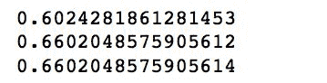

正如您所看到的，我们的表现略逊于之前的模型，但这很可能是因为我们只选择了前 5 个（而不是之前的 10 个）特征与我们的选择器。

# 还有更多...

另一种旨在找到表现最佳模型的方法称为**训练验证拆分**。该方法将训练数据拆分为两个较小的子集：一个用于训练模型，另一个用于验证模型是否过拟合。拆分只进行一次，因此与交叉验证相比，成本较低：

```py
train_v = tune.TrainValidationSplit(
    estimator=logReg_obj
    , estimatorParamMaps=logReg_grid
    , evaluator=logReg_ev
    , parallelism=4
)

logReg_modelTrainV = (
    train_v
    .fit(data_trans.transform(forest_train))

results = logReg_modelTrainV.transform(data_trans_test)

print(logReg_ev.evaluate(results, {logReg_ev.metricName: 'weightedPrecision'}))
print(logReg_ev.evaluate(results, {logReg_ev.metricName: 'weightedRecall'}))
print(logReg_ev.evaluate(results, {logReg_ev.metricName: 'accuracy'}))
```

前面的代码与`.CrossValidator(...)`所看到的并没有太大不同。我们为`.TrainValidationSplit(...)`方法指定的唯一附加参数是控制在选择最佳模型时会启动多少线程的并行级别。

使用`.TrainValidationSplit(...)`方法产生与`.CrossValidator(...)`方法相同的结果：


# 从文本中提取特征

通常，数据科学家需要处理非结构化数据，比如自由流动的文本：公司收到客户的反馈或建议（以及其他内容），这可能是预测客户下一步行动或他们对品牌情感的宝藏。

在这个步骤中，我们将学习如何从文本中提取特征。

# 准备工作

要执行这个步骤，你需要一个可用的 Spark 环境。

不需要其他先决条件。

# 如何做...

一个通用的过程旨在从文本中提取数据并将其转换为机器学习模型可以使用的内容，首先从自由流动的文本开始。第一步是取出文本的每个句子，并在空格字符上进行分割（通常是）。接下来，移除所有的停用词。最后，简单地计算文本中不同单词的数量或使用哈希技巧将我们带入自由流动文本的数值表示领域。

以下是如何使用 Spark 的 ML 模块来实现这一点：

```py
some_text = spark.createDataFrame([
    ['''
    Apache Spark achieves high performance for both batch
    and streaming data, using a state-of-the-art DAG scheduler, 
    a query optimizer, and a physical execution engine.
    ''']
    , ['''
    Apache Spark is a fast and general-purpose cluster computing 
    system. It provides high-level APIs in Java, Scala, Python 
    and R, and an optimized engine that supports general execution 
    graphs. It also supports a rich set of higher-level tools including 
    Spark SQL for SQL and structured data processing, MLlib for machine 
    learning, GraphX for graph processing, and Spark Streaming.
    ''']
    , ['''
    Machine learning is a field of computer science that often uses 
    statistical techniques to give computers the ability to "learn" 
    (i.e., progressively improve performance on a specific task) 
    with data, without being explicitly programmed.
    ''']
], ['text'])

splitter = feat.RegexTokenizer(
    inputCol='text'
    , outputCol='text_split'
    , pattern='\s+|[,.\"]'
)

sw_remover = feat.StopWordsRemover(
    inputCol=splitter.getOutputCol()
    , outputCol='no_stopWords'
)

hasher = feat.HashingTF(
    inputCol=sw_remover.getOutputCol()
    , outputCol='hashed'
    , numFeatures=20
)

idf = feat.IDF(
    inputCol=hasher.getOutputCol()
    , outputCol='features'
)

pipeline = Pipeline(stages=[splitter, sw_remover, hasher, idf])

pipelineModel = pipeline.fit(some_text)
```

# 它是如何工作的...

正如前面提到的，我们从一些文本开始。在我们的例子中，我们使用了一些从 Spark 文档中提取的内容。

`.RegexTokenizer(...)`是使用正则表达式来分割句子的文本分词器。在我们的例子中，我们在至少一个（或多个）空格上分割句子——这是`\s+`表达式。然而，我们的模式还会在逗号、句号或引号上进行分割——这是`[,.\"]`部分。管道符`|`表示在空格或标点符号上进行分割。通过`.RegexTokenizer(...)`处理后的文本将如下所示：

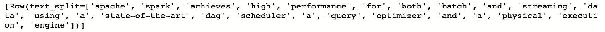

接下来，我们使用`.StopWordsRemover(...)`方法来移除停用词，正如其名称所示。

查看 NLTK 的最常见停用词列表：[`gist.github.com/sebleier/554280`](https://gist.github.com/sebleier/554280)。

`.StopWordsRemover(...)`简单地扫描标记化文本，并丢弃它遇到的任何停用词。移除停用词后，我们的文本将如下所示：

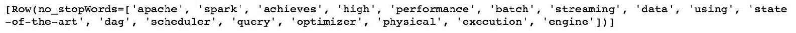

正如你所看到的，剩下的是句子的基本含义；人类可以阅读这些词，并且在一定程度上理解它。

哈希技巧（或特征哈希）是一种将任意特征列表转换为向量形式的方法。这是一种高效利用空间的方法，用于标记文本，并同时将文本转换为数值表示。哈希技巧使用哈希函数将一种表示转换为另一种表示。哈希函数本质上是任何将一种表示转换为另一种表示的映射函数。通常，它是一种有损和单向的映射（或转换）；不同的输入可以被哈希成相同的哈希值（称为**冲突**），一旦被哈希，几乎总是极其困难来重构输入。`.HashingTF(...)`方法接受`sq_remover`对象的输入列，并将标记化文本转换（或编码）为一个包含 20 个特征的向量。在经过哈希处理后，我们的文本将如下所示：

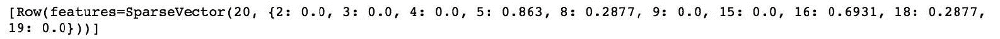

现在我们已经对特征进行了哈希处理，我们可能可以使用这些特征来训练一个机器学习模型。然而，简单地计算单词出现的次数可能会导致误导性的结论。一个更好的度量是**词频-逆文档频率**（**TF-IDF**）。这是一个度量，它计算一个词在整个语料库中出现的次数，然后计算一个句子中该词出现次数与整个语料库中出现次数的比例。这个度量有助于评估一个词对整个文档集合中的一个文档有多重要。在 Spark 中，我们使用`.IDF(...)`方法来实现这一点。

在通过整个管道后，我们的文本将如下所示：

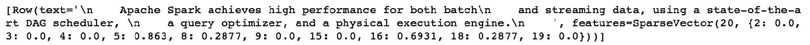

因此，实际上，我们已经将 Spark 文档中的内容编码成了一个包含 20 个元素的向量，现在我们可以用它来训练一个机器学习模型。

# 还有更多...

将文本编码成数字形式的另一种方法是使用 Word2Vec 算法。该算法计算单词的分布式表示，优势在于相似的单词在向量空间中被放在一起。

查看这个教程，了解更多关于 Word2Vec 和 skip-gram 模型的信息：[`mccormickml.com/2016/04/19/word2vec-tutorial-the-skip-gram-model/`](http://mccormickml.com/2016/04/19/word2vec-tutorial-the-skip-gram-model/)。

在 Spark 中我们是这样做的：

```py
w2v = feat.Word2Vec(
    vectorSize=5
    , minCount=2
    , inputCol=sw_remover.getOutputCol()
    , outputCol='vector'
)
```

我们将从`.Word2Vec(...)`方法中得到一个包含五个元素的向量。此外，只有在语料库中至少出现两次的单词才会被用来创建单词嵌入。以下是结果向量的样子：

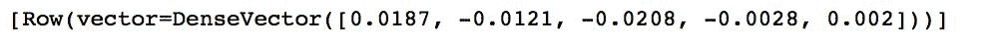

# 另请参阅

+   要了解更多关于文本特征工程的信息，请查看 Packt 的这个位置：[`bit.ly/2IZ7ZZA`](http://bit.ly/2IZ7ZZA)

# 离散化连续变量

有时，将连续变量离散化表示实际上是有用的。

在这个配方中，我们将学习如何使用傅立叶级数中的一个例子离散化数值特征。

# 准备工作

要执行这个配方，你需要一个可用的 Spark 环境。

不需要其他先决条件。

# 如何做...

在这个配方中，我们将使用位于`data`文件夹中的一个小数据集，即`fourier_signal.csv`：

```py
signal_df = spark.read.csv(
    '../data/fourier_signal.csv'
    , header=True
    , inferSchema=True
)

steps = feat.QuantileDiscretizer(
       numBuckets=10,
       inputCol='signal',
       outputCol='discretized')

transformed = (
    steps
    .fit(signal_df)
    .transform(signal_df)
)
```

# 工作原理...

首先，我们将数据读入`signal_df`。`fourier_signal.csv`包含一个名为`signal`的单独列。

接下来，我们使用`.QuantileDiscretizer(...)`方法将信号离散为 10 个桶。桶的范围是基于分位数选择的，也就是说，每个桶将有相同数量的观察值。

这是原始信号的样子（黑线），以及它的离散表示的样子：

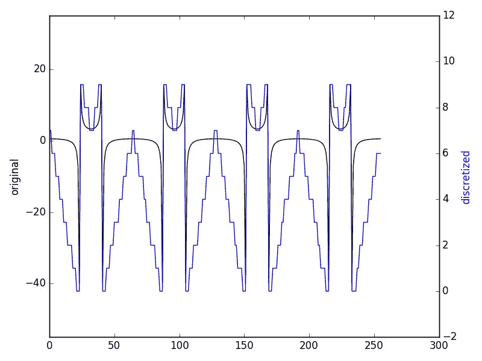

# 标准化连续变量

使用具有显著不同范围和分辨率的特征（如年龄和工资）构建机器学习模型可能不仅会带来计算问题，还会带来模型收敛和系数可解释性问题。

在这个配方中，我们将学习如何标准化连续变量，使它们的平均值为 0，标准差为 1。

# 准备工作

要执行这个配方，你需要一个可用的 Spark 环境。你还必须执行前面的配方。

不需要其他先决条件。

# 如何做...

为了标准化我们在前面的配方中引入的`signal`列，我们将使用`.StandardScaler(...)`方法：

```py
vec = feat.VectorAssembler(
    inputCols=['signal']
    , outputCol='signal_vec'
)

norm = feat.StandardScaler(
    inputCol=vec.getOutputCol()
    , outputCol='signal_norm'
    , withMean=True
    , withStd=True
)

norm_pipeline = Pipeline(stages=[vec, norm])
signal_norm = (
    norm_pipeline
    .fit(signal_df)
    .transform(signal_df)
)
```

# 工作原理...

首先，我们需要将单个特征转换为向量表示，因为`.StandardScaler(...)`方法只接受向量化的特征。

接下来，我们实例化`.StandardScaler(...)`对象。`withMean`参数指示方法将数据居中到平均值，而`withStd`参数将数据缩放到标准差等于 1。

这是我们信号的标准化表示的样子。请注意两条线的不同刻度：

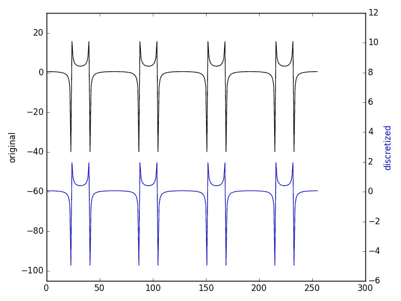

# 主题挖掘

有时，有必要根据其内容将文本文档聚类到桶中。

在这个配方中，我们将通过一个例子来为从维基百科提取的一组短段落分配一个主题。

# 准备工作

要执行这个配方，你需要一个可用的 Spark 环境。

不需要其他先决条件。

# 如何做...

为了对文档进行聚类，我们首先需要从我们的文章中提取特征。请注意，以下文本由于空间限制而被缩写，有关完整代码，请参考 GitHub 存储库：

```py
articles = spark.createDataFrame([
    ('''
        The Andromeda Galaxy, named after the mythological 
        Princess Andromeda, also known as Messier 31, M31, 
        or NGC 224, is a spiral galaxy approximately 780 
        kiloparsecs (2.5 million light-years) from Earth, 
        and the nearest major galaxy to the Milky Way. 
        Its name stems from the area of the sky in which it 
        appears, the constellation of Andromeda. The 2006 
        observations by the Spitzer Space Telescope revealed 
        that the Andromeda Galaxy contains approximately one 
        trillion stars, more than twice the number of the 
        Milky Way’s estimated 200-400 billion stars. The 
        Andromeda Galaxy, spanning approximately 220,000 light 
        years, is the largest galaxy in our Local Group, 
        which is also home to the Triangulum Galaxy and 
        other minor galaxies. The Andromeda Galaxy's mass is 
        estimated to be around 1.76 times that of the Milky 
        Way Galaxy (~0.8-1.5×1012 solar masses vs the Milky 
        Way's 8.5×1011 solar masses).
    ''','Galaxy', 'Andromeda')
    (...) 
    , ('''
        Washington, officially the State of Washington, is a state in the Pacific 
        Northwest region of the United States. Named after George Washington, 
        the first president of the United States, the state was made out of the 
        western part of the Washington Territory, which was ceded by Britain in 
        1846 in accordance with the Oregon Treaty in the settlement of the 
        Oregon boundary dispute. It was admitted to the Union as the 42nd state 
        in 1889\. Olympia is the state capital. Washington is sometimes referred 
        to as Washington State, to distinguish it from Washington, D.C., the 
        capital of the United States, which is often shortened to Washington.
    ''','Geography', 'Washington State') 
], ['articles', 'Topic', 'Object'])

splitter = feat.RegexTokenizer(
    inputCol='articles'
    , outputCol='articles_split'
    , pattern='\s+|[,.\"]'
)

sw_remover = feat.StopWordsRemover(
    inputCol=splitter.getOutputCol()
    , outputCol='no_stopWords'
)

count_vec = feat.CountVectorizer(
    inputCol=sw_remover.getOutputCol()
    , outputCol='vector'
)

lda_clusters = clust.LDA(
    k=3
    , optimizer='online'
    , featuresCol=count_vec.getOutputCol()
)

topic_pipeline = Pipeline(
    stages=[
        splitter
        , sw_remover
        , count_vec
        , lda_clusters
    ]
)
```

# 工作原理...

首先，我们创建一个包含我们文章的 DataFrame。

接下来，我们将几乎按照*从文本中提取特征*配方中的步骤进行操作：

1.  我们使用`.RegexTokenizer(...)`拆分句子

1.  我们使用`.StopWordsRemover(...)`去除停用词

1.  我们使用`.CountVectorizer(...)`计算每个单词的出现次数

为了在我们的数据中找到聚类，我们将使用**潜在狄利克雷分配**（**LDA**）模型。在我们的情况下，我们知道我们希望有三个聚类，但如果你不知道你可能有多少聚类，你可以使用我们在本章前面介绍的*调整超参数*配方之一。

最后，我们把所有东西都放在管道中以方便我们使用。

一旦模型被估计，让我们看看它的表现。这里有一段代码可以帮助我们做到这一点；注意 NumPy 的`.argmax(...)`方法，它可以帮助我们找到最高值的索引：

```py
for topic in ( 
        topic_pipeline
        .fit(articles)
        .transform(articles)
        .select('Topic','Object','topicDistribution')
        .take(10)
):
    print(
        topic.Topic
        , topic.Object
        , np.argmax(topic.topicDistribution)
        , topic.topicDistribution
    )
```

这就是我们得到的结果：

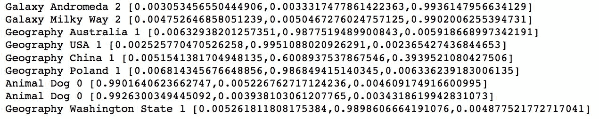

正如你所看到的，通过适当的处理，我们可以从文章中正确提取主题；关于星系的文章被分组在第 2 个聚类中，地理信息在第 1 个聚类中，动物在第 0 个聚类中。
