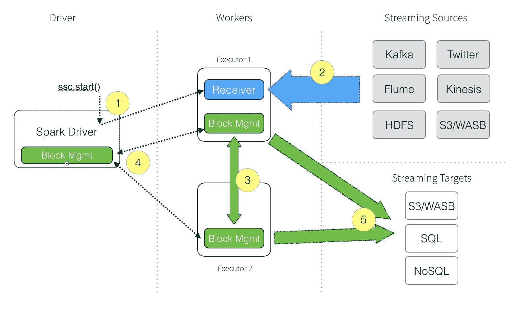
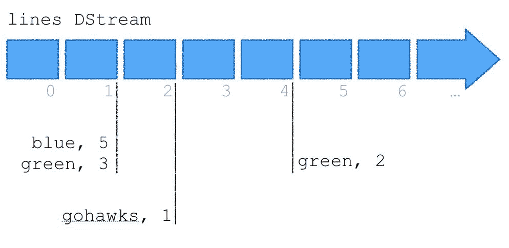
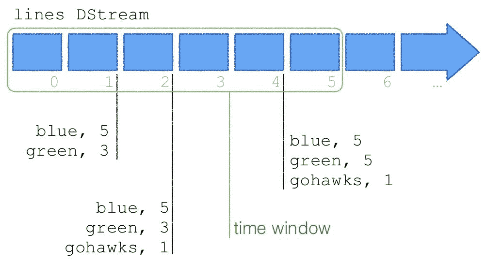
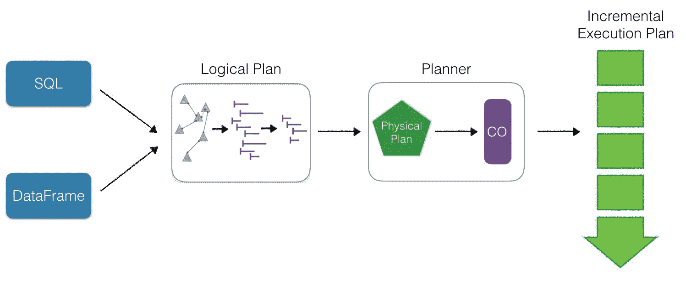

# 第七章：使用 PySpark 进行结构化流处理

在本章中，我们将介绍如何在 PySpark 中使用 Apache Spark 结构化流处理。您将学习以下内容：

+   理解 DStreams

+   理解全局聚合

+   使用结构化流进行连续聚合

# 介绍

随着机器生成的*实时数据*的普及，包括但不限于物联网传感器、设备和信标，迅速获得这些数据的洞察力变得越来越重要。无论您是在检测欺诈交易、实时检测传感器异常，还是对下一个猫视频的情感分析，流分析都是一个越来越重要的差异化因素和商业优势。

随着我们逐步学习这些内容，我们将结合*批处理*和*实时*处理的构建来创建连续应用。使用 Apache Spark，数据科学家和数据工程师可以使用 Spark SQL 在批处理和实时中分析数据，使用 MLlib 训练机器学习模型，并通过 Spark Streaming 对这些模型进行评分。

Apache Spark 迅速被广泛采用的一个重要原因是它统一了所有这些不同的数据处理范式（通过 ML 和 MLlib 进行机器学习，Spark SQL 和流处理）。正如在*Spark Streaming: What is It and Who’s Using it*（[`www.datanami.com/2015/11/30/spark-streaming-what-is-it-and-whos-using-it/`](https://www.datanami.com/2015/11/30/spark-streaming-what-is-it-and-whos-using-it/)）中所述，像 Uber、Netflix 和 Pinterest 这样的公司经常通过 Spark Streaming 展示他们的用例：

+   *How Uber Uses Spark and Hadoop to Optimize Customer Experience*在[`www.datanami.com/2015/10/05/how-uber-uses-spark-and-hadoop-to-optimize-customer-experience/`](https://www.datanami.com/2015/10/05/how-uber-uses-spark-and-hadoop-to-optimize-customer-experience/)

+   Netflix 的 Spark 和 Spark Streaming 在[`spark-summit.org/2015/events/spark-and-spark-streaming-at-netflix/`](https://spark-summit.org/2015/events/spark-and-spark-streaming-at-netflix/)

+   Spark Streaming 能否经受 Chaos Monkey 的考验？在[`techblog.netflix.com/2015/03/can-spark-streaming-survive-chaos-monkey.html`](http://techblog.netflix.com/2015/03/can-spark-streaming-survive-chaos-monkey.html)

+   Pinterest 的实时分析在[`engineering.pinterest.com/blog/real-time-analytics-pinterest`](https://engineering.pinterest.com/blog/real-time-analytics-pinterest)

# 理解 Spark Streaming

对于 Apache Spark 中的实时处理，当前的重点是结构化流，它是建立在 DataFrame/数据集基础设施之上的。使用 DataFrame 抽象允许在 Spark SQL 引擎 Catalyst Optimizer 中对流处理、机器学习和 Spark SQL 进行优化，并且定期进行改进（例如，Project Tungsten）。然而，为了更容易地理解 Spark Streaming，值得了解其 Spark Streaming 前身的基本原理。以下图表代表了涉及 Spark 驱动程序、工作程序、流源和流目标的 Spark Streaming 应用程序数据流：



前面图表的描述如下：

1.  从**Spark Streaming Context**（**SSC**）开始，驱动程序将在执行程序（即 Spark 工作程序）上执行长时间运行的任务。

1.  在驱动程序中定义的代码（从`ssc.start()`开始），执行程序（在此图中为**Executor 1**）从**流源**接收数据流。Spark Streaming 可以接收**Kafka**或**Twitter**，或者您可以构建自己的自定义接收器。接收器将数据流分成块并将这些块保存在内存中。

1.  这些数据块被复制到另一个执行程序以实现高可用性。

1.  块 ID 信息被传输到驱动程序上的块管理器主节点，从而确保内存中的每个数据块都被跟踪和记录。

1.  对于 SSC 中配置的每个批处理间隔（通常是每 1 秒），驱动程序将启动 Spark 任务来处理这些块。这些块然后被持久化到任意数量的目标数据存储中，包括云存储（例如 S3、WASB）、关系型数据存储（例如 MySQL、PostgreSQL 等）和 NoSQL 存储。

在接下来的小节中，我们将回顾**离散流**或**DStreams**（基本的流构建块）的示例，然后通过对 DStreams 进行有状态的计算来执行全局聚合。然后，我们将通过使用结构化流简化我们的流应用程序，同时获得性能优化。

# 理解 DStreams

在我们深入讨论结构化流之前，让我们先谈谈 DStreams。DStreams 是建立在 RDDs 之上的，表示被分成小块的数据流。下图表示这些数据块以毫秒到秒的微批次形式存在。在这个例子中，DStream 的行被微批次到秒中，每个方块代表在那一秒窗口内发生的一个微批次事件：

+   在 1 秒的时间间隔内，事件**blue**出现了五次，事件**green**出现了三次

+   在 2 秒的时间间隔内，事件**gohawks**出现了一次

+   在 4 秒的时间间隔内，事件**green**出现了两次



因为 DStreams 是建立在 RDDs 之上的，Apache Spark 的核心数据抽象，这使得 Spark Streaming 可以轻松地与其他 Spark 组件（如 MLlib 和 Spark SQL）集成。

# 准备工作

对于这些 Apache Spark Streaming 示例，我们将通过 bash 终端创建和执行一个控制台应用程序。为了简化操作，你需要打开两个终端窗口。

# 如何做...

如前一节所述，我们将使用两个终端窗口：

+   一个终端窗口传输一个事件

+   另一个终端接收这些事件

请注意，此代码的源代码可以在 Apache Spark 1.6 Streaming 编程指南中找到：[`spark.apache.org/docs/1.6.0/streaming-programming-guide.html`](https://spark.apache.org/docs/1.6.0/streaming-programming-guide.html)。

# 终端 1 - Netcat 窗口

对于第一个窗口，我们将使用 Netcat（或 nc）手动发送事件，如 blue、green 和 gohawks。要启动 Netcat，请使用以下命令；我们将把我们的事件定向到端口`9999`，我们的 Spark Streaming 作业将会检测到：

```py
nc -lk 9999
```

为了匹配上一个图表，我们将输入我们的事件，使得控制台屏幕看起来像这样：

```py
$nc -lk 9999
blue blue blue blue blue green green green
gohawks
green green 
```

# 终端 2 - Spark Streaming 窗口

我们将使用以下代码创建一个简单的 PySpark Streaming 应用程序，名为`streaming_word_count.py`：

```py
#
# streaming_word_count.py
#

# Import the necessary classes and create a local SparkContext and Streaming Contexts
from pyspark import SparkContext
from pyspark.streaming import StreamingContext

# Create Spark Context with two working threads (note, `local[2]`)
sc = SparkContext("local[2]", "NetworkWordCount")

# Create local StreamingContextwith batch interval of 1 second
ssc = StreamingContext(sc, 1)

# Create DStream that will connect to the stream of input lines from connection to localhost:9999
lines = ssc.socketTextStream("localhost", 9999)

# Split lines into words
words = lines.flatMap(lambda line: line.split(" "))

# Count each word in each batch
pairs = words.map(lambda word: (word, 1))
wordCounts = pairs.reduceByKey(lambda x, y: x + y)

# Print the first ten elements of each RDD generated in this DStream to the console
wordCounts.pprint()

# Start the computation
ssc.start()

# Wait for the computation to terminate
ssc.awaitTermination()
```

要运行这个 PySpark Streaming 应用程序，请在`$SPARK_HOME`文件夹中执行以下命令：

```py
./bin/spark-submit streaming_word_count.py localhost 9999
```

在时间上的安排，你应该：

1.  首先使用`nc -lk 9999`。

1.  然后，启动你的 PySpark Streaming 应用程序：`/bin/spark-submit streaming_word_count.py localhost 9999`。

1.  然后，开始输入你的事件，例如：

1.  对于第一秒，输入`blue blue blue blue blue green green green`

1.  在第二秒时，输入`gohawks`

1.  等一下，在第四秒时，输入`green green`

你的 PySpark 流应用程序的控制台输出将类似于这样：

```py
$ ./bin/spark-submit streaming_word_count.py localhost 9999
-------------------------------------------
Time: 2018-06-21 23:00:30
-------------------------------------------
(u'blue', 5)
(u'green', 3)
-------------------------------------------
Time: 2018-06-21 23:00:31
-------------------------------------------
(u'gohawks', 1)
-------------------------------------------
Time: 2018-06-21 23:00:32
-------------------------------------------
-------------------------------------------
Time: 2018-06-21 23:00:33
-------------------------------------------
(u'green', 2)
------------------------------------------- 

```

要结束流应用程序（以及`nc`窗口），执行终止命令（例如，*Ctrl* + *C*）。

# 它是如何工作的...

如前面的小节所述，这个示例由一个终端窗口组成，用`nc`传输事件数据。第二个窗口运行我们的 Spark Streaming 应用程序，从第一个窗口传输到的端口读取数据。

这段代码的重要调用如下所示：

+   我们使用两个工作线程创建一个 Spark 上下文，因此使用`local[2]`。

+   如 Netcat 窗口中所述，我们使用`ssc.socketTextStream`来监听`localhost`的本地套接字，端口为`9999`。

+   请记住，对于每个 1 秒批处理，我们不仅读取一行（例如`blue blue blue blue blue green green green`），还通过`split`将其拆分为单独的`words`。

+   我们使用 Python 的`lambda`函数和 PySpark 的`map`和`reduceByKey`函数来快速计算 1 秒批处理中单词的出现次数。例如，在`blue blue blue blue blue green green green`的情况下，有五个蓝色和三个绿色事件，如我们的流应用程序的*2018-06-21 23:00:30*报告的那样。

+   `ssc.start()`是指应用程序启动 Spark Streaming 上下文。

+   `ssc.awaitTermination()`正在等待终止命令来停止流应用程序（例如*Ctrl* + *C*）；否则，应用程序将继续运行。

# 还有更多...

在使用 PySpark 控制台时，通常会有很多消息发送到控制台，这可能会使流输出难以阅读。为了更容易阅读，请确保您已经创建并修改了`$SPARK_HOME/conf`文件夹中的`log4j.properties`文件。要做到这一点，请按照以下步骤操作：

1.  转到`$SPARK_HOME/conf`文件夹。

1.  默认情况下，有一个`log4j.properties.template`文件。将其复制为相同的名称，删除`.template`，即：

```py
cp log4j.properties.template log4j.properties
```

1.  在您喜欢的编辑器（例如 sublime、vi 等）中编辑`log4j.properties`。在文件的第 19 行，更改此行：

```py
log4j.rootCategory=INFO, console
```

改为：

```py
log4j.rootCategory=ERROR, console
```

这样，不是所有的日志信息（即`INFO`）都被定向到控制台，只有错误（即`ERROR`）会被定向到控制台。

# 理解全局聚合

在前一节中，我们的示例提供了事件的快照计数。也就是说，它提供了在某一时间点的事件计数。但是，如果您想要了解一段时间窗口内的事件总数呢？这就是全局聚合的概念：



如果我们想要全局聚合，与之前相同的示例（时间 1：5 蓝色，3 绿色，时间 2：1 gohawks，时间 4：2 绿色）将被计算为：

+   时间 1：5 蓝色，3 绿色

+   时间 2：5 蓝色，3 绿色，1 gohawks

+   时间 4：5 蓝色，5 绿色，1 gohawks

在传统的批处理计算中，这将类似于`groupbykey`或`GROUP BY`语句。但是在流应用程序的情况下，这个计算需要在毫秒内完成，这通常是一个太短的时间窗口来执行`GROUP BY`计算。然而，通过 Spark Streaming 全局聚合，可以通过执行有状态的流计算来快速完成这个计算。也就是说，使用 Spark Streaming 框架，执行聚合所需的所有信息都保存在内存中（即保持数据在*state*中），以便在其小时间窗口内进行计算。

# 准备就绪

对于这些 Apache Spark Streaming 示例，我们将通过 bash 终端创建和执行一个控制台应用程序。为了简化操作，您需要打开两个终端窗口。

# 如何做到这一点...

如前一节所述，我们将使用两个终端窗口：

+   一个终端窗口用于传输事件

+   另一个终端接收这些事件

此代码的源代码可以在 Apache Spark 1.6 Streaming 编程指南中找到：[`spark.apache.org/docs/1.6.0/streaming-programming-guide.html`](https://spark.apache.org/docs/1.6.0/streaming-programming-guide.html)。

# 终端 1 - Netcat 窗口

对于第一个窗口，我们将使用 Netcat（或`nc`）手动发送事件，如蓝色、绿色和 gohawks。要启动 Netcat，请使用以下命令；我们将把我们的事件定向到端口`9999`，我们的 Spark Streaming 作业将检测到：

```py
nc -lk 9999
```

为了匹配前面的图表，我们将输入我们的事件，以便控制台屏幕看起来像这样：

```py
$nc -lk 9999
blue blue blue blue blue green green green
gohawks
green green 
```

# 终端 2 - Spark Streaming 窗口

我们将使用以下代码创建一个简单的 PySpark Streaming 应用程序，名为`streaming_word_count.py`：

```py
#
# stateful_streaming_word_count.py
#

# Import the necessary classes and create a local SparkContext and Streaming Contexts
from pyspark import SparkContext
from pyspark.streaming import StreamingContext

# Create Spark Context with two working threads (note, `local[2]`)
sc = SparkContext("local[2]", "StatefulNetworkWordCount")

# Create local StreamingContextwith batch interval of 1 second
ssc = StreamingContext(sc, 1)

# Create checkpoint for local StreamingContext
ssc.checkpoint("checkpoint")

# Define updateFunc: sum of the (key, value) pairs
def updateFunc(new_values, last_sum):
   return sum(new_values) + (last_sum or 0)

# Create DStream that will connect to the stream of input lines from connection to localhost:9999
lines = ssc.socketTextStream("localhost", 9999)

# Calculate running counts
# Line 1: Split lines in to words
# Line 2: count each word in each batch
# Line 3: Run `updateStateByKey` to running count
running_counts = lines.flatMap(lambda line: line.split(" "))\
          .map(lambda word: (word, 1))\
          .updateStateByKey(updateFunc)

# Print the first ten elements of each RDD generated in this stateful DStream to the console
running_counts.pprint()

# Start the computation
ssc.start() 

# Wait for the computation to terminate
ssc.awaitTermination() 
```

要运行此 PySpark Streaming 应用程序，请从您的`$SPARK_HOME`文件夹执行以下命令：

```py
./bin/spark-submit stateful_streaming_word_count.py localhost 9999
```

在计时方面，您应该：

1.  首先使用`nc -lk 9999`。

1.  然后，启动您的 PySpark Streaming 应用程序：`./bin/spark-submit stateful_streaming_word_count.py localhost 9999`。

1.  然后，开始输入您的事件，例如：

1.  第一秒，输入`blue blue blue blue blue green green green`

1.  第二秒，输入`gohawks`

1.  等一秒；第四秒，输入`green green`

您的 PySpark 流应用程序的控制台输出将类似于以下输出：

```py
$ ./bin/spark-submit stateful_streaming_word_count.py localhost 9999
-------------------------------------------
Time: 2018-06-21 23:00:30
-------------------------------------------
(u'blue', 5)
(u'green', 3)
-------------------------------------------
Time: 2018-06-21 23:00:31
-------------------------------------------
(u'blue', 5)
(u'green', 3)
(u'gohawks', 1)
-------------------------------------------
Time: 2018-06-21 23:00:32
-------------------------------------------
-------------------------------------------
Time: 2018-06-21 23:00:33
-------------------------------------------
(u'blue', 5)
(u'green', 5)
(u'gohawks', 1)
------------------------------------------- 

```

要结束流应用程序（以及`nc`窗口），执行终止命令（例如，*Ctrl* + *C*）。

# 它是如何工作的...

如前几节所述，这个示例由一个终端窗口传输事件数据使用`nc`组成。第二个窗口运行我们的 Spark Streaming 应用程序，从第一个窗口传输到的端口读取数据。

此代码的重要调用如下所示：

+   我们使用两个工作线程创建一个 Spark 上下文，因此使用`local[2]`。

+   如 Netcat 窗口中所述，我们使用`ssc.socketTextStream`来监听`localhost`的本地套接字，端口为`9999`。

+   我们创建了一个`updateFunc`，它执行将先前的值与当前聚合值进行聚合的任务。

+   请记住，对于每个 1 秒批处理，我们不仅仅是读取一行（例如，`blue blue blue blue blue green green green`），还要通过`split`将其拆分为单独的`words`。

+   我们使用 Python 的`lambda`函数和 PySpark 的`map`和`reduceByKey`函数来快速计算 1 秒批处理中单词的出现次数。例如，在`blue blue blue blue blue green green green`的情况下，有 5 个蓝色和 3 个绿色事件，如我们的流应用程序的*2018-06-21 23:00:30*报告的那样。

+   与以前的流应用程序相比，当前的有状态版本计算了当前聚合（例如，五个蓝色和三个绿色事件）的运行计数（`running_counts`），并使用`updateStateByKey`。这使得 Spark Streaming 可以在先前定义的`updateFunc`的上下文中保持当前聚合的状态。

+   `ssc.start()`是指应用程序启动 Spark Streaming 上下文。

+   `ssc.awaitTermination()`正在等待终止命令以停止流应用程序（例如，*Ctrl* + *C*）；否则，应用程序将继续运行。

# 使用结构化流进行连续聚合

如前几章所述，Spark SQL 或 DataFrame 查询的执行围绕着构建逻辑计划，选择一个基于成本优化器的物理计划（从生成的物理计划中选择一个），然后通过 Spark SQL 引擎 Catalyst 优化器生成代码（即代码生成）。结构化流引入的概念是*增量*执行计划。也就是说，结构化流会针对每个新的数据块重复应用执行计划。这样，Spark SQL 引擎可以利用包含在 Spark DataFrames 中的优化，并将其应用于传入的数据流。因为结构化流是构建在 Spark DataFrames 之上的，这意味着它也将更容易地集成其他 DataFrame 优化的组件，包括 MLlib、GraphFrames、TensorFrames 等等：



# 准备工作

对于这些 Apache Spark Streaming 示例，我们将通过 bash 终端创建和执行控制台应用程序。为了使事情变得更容易，您需要打开两个终端窗口。

# 如何做...

如前一节所述，我们将使用两个终端窗口：

+   一个终端窗口传输一个事件

+   另一个终端接收这些事件

此源代码可以在 Apache Spark 2.3.1 结构化流编程指南中找到：[`spark.apache.org/docs/latest/structured-streaming-programming-guide.html`](https://spark.apache.org/docs/latest/structured-streaming-programming-guide.html)。

# 终端 1-Netcat 窗口

对于第一个窗口，我们将使用 Netcat（或`nc`）手动发送事件，例如 blue、green 和 gohawks。要启动 Netcat，请使用此命令；我们将把我们的事件定向到端口`9999`，我们的 Spark Streaming 作业将检测到：

```py
nc -lk 9999
```

为了匹配之前的图表，我们将输入我们的事件，以便控制台屏幕看起来像这样：

```py
$nc -lk 9999
blue blue blue blue blue green green green
gohawks
green green 
```

# 终端 2-Spark Streaming 窗口

我们将使用以下代码创建一个简单的 PySpark Streaming 应用程序，名为`structured_streaming_word_count.py`：

```py
#
# structured_streaming_word_count.py
#

# Import the necessary classes and create a local SparkSession
from pyspark.sql import SparkSession
from pyspark.sql.functions import explode
from pyspark.sql.functions import split

spark = SparkSession \
  .builder \
  .appName("StructuredNetworkWordCount") \
  .getOrCreate()

 # Create DataFrame representing the stream of input lines from connection to localhost:9999
lines = spark\
  .readStream\
  .format('socket')\
  .option('host', 'localhost')\
  .option('port', 9999)\
  .load()

# Split the lines into words
words = lines.select(
  explode(
      split(lines.value, ' ')
  ).alias('word')
)

# Generate running word count
wordCounts = words.groupBy('word').count()

# Start running the query that prints the running counts to the console
query = wordCounts\
  .writeStream\
  .outputMode('complete')\
  .format('console')\
  .start()

# Await Spark Streaming termination
query.awaitTermination()
```

要运行此 PySpark Streaming 应用程序，请从您的`$SPARK_HOME`文件夹执行以下命令：

```py
./bin/spark-submit structured_streaming_word_count.py localhost 9999
```

在计时方面，您应该：

1.  首先从`nc -lk 9999`开始。

1.  然后，启动您的 PySpark Streaming 应用程序：`./bin/spark-submit stateful_streaming_word_count.py localhost 9999`。

1.  然后，开始输入您的事件，例如：

1.  对于第一秒，输入`blue blue blue blue blue green green green`

1.  对于第二秒，输入`gohawks`

1.  等一下；在第四秒，输入`green green`

您的 PySpark 流应用程序的控制台输出将类似于以下内容：

```py
$ ./bin/spark-submit structured_streaming_word_count.py localhost 9999
-------------------------------------------
Batch: 0
-------------------------------------------
+-----+-----+
| word|count|
+-----+-----+
|green|    3|
| blue|    5|
+-----+-----+

-------------------------------------------
Batch: 1
-------------------------------------------
+-------+-----+
|   word|count|
+-------+-----+
|  green|    3|
|   blue|    5|
|gohawks|    1|
+-------+-----+

-------------------------------------------
Batch: 2
-------------------------------------------
+-------+-----+
|   word|count|
+-------+-----+
|  green|    5|
|   blue|    5|
|gohawks|    1|
+-------+-----+
```

要结束流应用程序（以及`nc`窗口），执行终止命令（例如，*Ctrl* + *C*）。

与 DStreams 的全局聚合类似，使用结构化流，您可以在 DataFrame 的上下文中轻松执行有状态的全局聚合。您还会注意到结构化流的另一个优化是，只有在有新事件时，流聚合才会出现。特别注意当我们在时间=2 秒和时间=4 秒之间延迟时，控制台没有额外的批次报告。

# 它是如何工作的...

如前文所述，此示例由一个终端窗口组成，该窗口使用`nc`传输事件数据。第二个窗口运行我们的 Spark Streaming 应用程序，从第一个窗口传输到的端口读取。

此代码的重要部分在这里标出：

+   我们创建一个`SparkSession`而不是创建一个 Spark 上下文

+   有了 SparkSession，我们可以使用`readStream`指定`socket` *format*来指定我们正在监听`localhost`的端口`9999`

+   我们使用 PySpark SQL 函数`split`和`explode`来获取我们的`line`并将其拆分为`words`

+   要生成我们的运行词计数，我们只需要创建`wordCounts`来运行`groupBy`语句和`count()`在`words`上

+   最后，我们将使用`writeStream`将`query`数据的`complete`集写入`console`（而不是其他数据汇）

+   因为我们正在使用一个 Spark 会话，该应用程序正在等待终止命令来停止流应用程序（例如，<Ctrl><C>）通过`query.awaitTermination()`

因为结构化流使用 DataFrames，所以它更简单、更容易阅读，因为我们使用熟悉的 DataFrame 抽象，同时也获得了所有 DataFrame 的性能优化。
